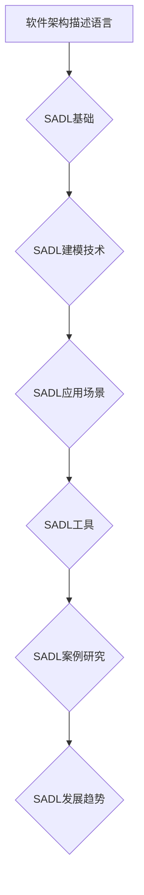
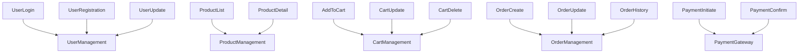

                 


# 软件架构描述语言的形式化基础

## 关键词

软件架构描述语言（SADL）、形式化基础、模型驱动开发（MDD）、架构建模、形式化建模技术、SADL工具、SADL应用案例、SADL发展趋势。

## 摘要

本文深入探讨软件架构描述语言（Software Architecture Description Language，SADL）的形式化基础。首先，我们将阐述SADL的重要性及其在软件开发中的应用。接着，我们将介绍SADL的基本概念、语法和语义，并通过具体示例来解释其应用。此外，本文还将分析SADL中的建模技术，如模型类、模型关系和模型约束。随后，我们将探讨SADL在不同应用场景下的使用方法，并介绍一些常用的SADL工具。通过实际案例研究，我们将展示SADL的应用效果。最后，本文将展望SADL的未来发展趋势和研究方向。

## 第1章：绪论

### 1.1 软件架构描述语言的重要性

软件架构描述语言（SADL）在软件工程中扮演着至关重要的角色。它提供了一种形式化、结构化的方法来描述软件系统的架构，从而使得开发团队能够更好地理解和管理复杂系统的结构。以下是SADL在软件开发中的几个关键作用：

1. **提高开发效率**：使用SADL，开发人员可以在项目早期阶段就对软件架构进行详细规划，从而避免后期由于架构不明确而导致的返工和重做。这种前置规划有助于减少项目成本和时间，提高开发效率。

2. **促进团队协作**：SADL提供了一种统一的语言和框架，使得团队成员能够使用相同的术语和模型进行沟通。这有助于减少误解和冲突，提高团队协作效率。

3. **增强系统可维护性**：通过SADL，开发人员可以创建详细的架构模型，这些模型有助于他们更好地理解系统的内部结构和组件之间的依赖关系。这种深入理解有助于提高系统的可维护性和可扩展性。

4. **支持架构评估和优化**：SADL模型可以用于评估软件架构的质量，识别潜在的风险和问题，并支持架构优化。通过分析模型，开发人员可以发现架构设计中的不足之处，并提出改进措施。

### 1.2 软件架构描述语言（SADL）的定义

软件架构描述语言（SADL）是一种专门用于描述软件系统架构的形式化语言。它提供了一套预定义的语法和语义规则，用于创建和表示软件系统的抽象模型。SADL的主要目的是帮助开发人员、项目经理和利益相关者更好地理解和沟通软件系统的结构。

SADL的核心概念包括模型、元素、关系和约束。模型是SADL的基本单位，它表示软件系统的抽象结构。元素是模型中的基本构建块，可以是组件、接口、连接器等。关系描述元素之间的相互作用和依赖关系。约束用于定义模型的限制条件，以确保模型的正确性和一致性。

SADL通常用于以下场景：

1. **软件架构设计**：在软件开发的早期阶段，使用SADL可以帮助开发团队创建和评估不同的架构设计方案，从而选择最佳方案。

2. **系统重构**：当现有系统需要重构时，SADL可以用于分析和描述现有系统的架构，帮助开发团队理解系统结构并规划重构过程。

3. **系统优化**：通过分析SADL模型，开发团队可以识别系统中的性能瓶颈和优化机会，从而提高系统性能。

4. **文档和维护**：SADL模型可以作为软件系统的文档，帮助开发人员、维护人员和利益相关者更好地理解系统结构和功能。

### 1.3 软件架构描述语言（SADL）的发展历程

软件架构描述语言（SADL）的发展历程可以追溯到20世纪80年代和90年代，当时软件系统变得越来越复杂，需要更好的方法和工具来描述和管理这些系统的架构。以下是一些重要的里程碑：

1. **早期的架构描述语言（ADLs）**：在20世纪80年代和90年代，研究人员和工业界开发了多种架构描述语言，如DISCO、Eiffel Software Architect、B Method等。这些早期的ADLs为后来的SADLs奠定了基础。

2. **模型驱动开发（MDD）**：模型驱动开发（Model-Driven Development，MDD）方法在20世纪90年代末和21世纪初得到广泛采用。MDD方法强调使用模型来驱动软件开发过程，包括需求分析、设计和实现。

3. **现代SADLs**：随着软件开发方法和技术的发展，现代SADLs如SAAM、SAF、ARCSS和ArchiMate等得到了广泛应用。这些SADLs提供了丰富的建模技术，支持不同的软件架构风格和设计模式。

### 1.4 本书内容安排

本书旨在全面介绍软件架构描述语言（SADL）的形式化基础，内容安排如下：

1. **第1章 绪论**：介绍SADL的重要性、定义和发展历程。

2. **第2章 SADL基础**：介绍SADL的基本概念、语法和语义。

3. **第3章 SADL建模技术**：介绍SADL中的建模技术，包括模型类、模型关系和模型约束。

4. **第4章 SADL应用场景**：介绍SADL在不同应用场景下的使用方法。

5. **第5章 SADL工具**：介绍常用的SADL工具，如SAAM、SAF和ArchiMate。

6. **第6章 SADL案例研究**：通过实际案例研究，展示SADL的应用效果。

7. **第7章 SADL发展趋势**：介绍SADL的发展趋势和未来研究方向。

### Mermaid流程图

以下是SADL的核心概念实体之间的关系架构Mermaid流程图：



---

## 第2章：SADL基础

### 2.1 SADL的基本概念

SADL（Software Architecture Description Language）是一种用于描述软件系统架构的形式化语言。它提供了一套丰富的建模元素和关系，用于创建和表示软件系统的抽象模型。在SADL中，基本概念包括模型、元素、关系和约束。

#### 模型（Model）

模型是SADL中的核心概念，它表示软件系统的抽象结构。模型可以包含多个元素和关系，用于描述系统的不同方面。例如，一个模型可以描述一个系统的组件、接口和连接器。

#### 元素（Element）

元素是模型中的基本构建块，可以是组件、接口、连接器等。每个元素都有一个唯一的标识符，用于在模型中引用。元素通常具有一组属性，用于描述其特征和行为。

- **组件（Component）**：组件是系统中的独立模块，它负责实现特定的功能。组件可以是软件模块、库、进程等。

- **接口（Interface）**：接口是组件之间的通信界面，它定义了组件之间如何交互。接口通常包含一组操作和消息格式。

- **连接器（Connector）**：连接器是用于连接组件的通信媒介，如网络、消息队列、数据库等。

#### 关系（Relationship）

关系描述元素之间的相互作用和依赖关系。SADL支持多种关系，如依赖关系、关联关系和聚合关系。

- **依赖关系（Dependency）**：依赖关系表示一个元素依赖于另一个元素。例如，一个组件可能依赖于另一个组件的接口来实现其功能。

- **关联关系（Association）**：关联关系表示两个元素之间的结构关系。例如，一个组件可能与多个其他组件相关联。

- **聚合关系（Aggregation）**：聚合关系表示整体与部分的关系。例如，一个组件可以包含多个子组件。

#### 约束（Constraint）

约束用于定义模型的限制条件，以确保模型的正确性和一致性。约束可以是属性约束、关系约束或组合约束。

- **属性约束**：属性约束用于限制元素的属性值。例如，一个组件的执行时间必须小于5秒。

- **关系约束**：关系约束用于限制元素之间的关系。例如，一个组件只能与另一个组件有一个依赖关系。

- **组合约束**：组合约束用于限制模型中的多个元素之间的关系。例如，一个模型必须包含至少两个组件和一个连接器。

### 2.2 SADL的语法和语义

SADL的语法类似于自然语言，但更具结构化和形式化。SADL的语法包括标识符、关键字、语句和注释。

#### 标识符

标识符用于命名模型元素和属性。标识符必须遵循一定的命名规则，如字母数字字符、下划线等。

#### 关键字

关键字是SADL中的预定义术语，用于定义模型元素和关系。关键字通常是大小写敏感的，如`component`、`interface`、`dependency`等。

#### 语句

语句是SADL中的基本编程结构，用于定义约束和操作。语句包括声明语句、操作语句和约束语句。

- **声明语句**：声明语句用于声明模型元素和属性。例如，`component A { executeTime: 5 }`声明了一个名为`A`的组件，其执行时间为5秒。

- **操作语句**：操作语句用于定义模型中的操作。例如，`interface A { operation1() }`定义了一个名为`A`的接口，其包含一个名为`operation1`的操作。

- **约束语句**：约束语句用于定义模型的限制条件。例如，`constraint executeTime <= 5`定义了一个约束，要求组件的执行时间必须小于等于5秒。

#### 注释

注释用于解释和说明SADL模型。注释可以使用单行注释`//`或多行注释`/* ... */`。

### 2.3 SADL的建模技术

SADL提供了一系列建模技术，用于创建和表示软件系统的抽象模型。以下是SADL中的几种常见建模技术：

#### 模型类

模型类是SADL中的基本构建块，用于表示软件系统的不同元素。模型类可以包含属性、方法和约束。

- **属性**：属性用于描述模型类的特征和行为。例如，一个组件类可以包含执行时间、内存使用等属性。

- **方法**：方法用于描述模型类的操作。例如，一个组件类可以包含启动、停止等操作。

- **约束**：约束用于定义模型类的限制条件。例如，一个组件类的执行时间必须小于5秒。

#### 模型关系

模型关系用于描述模型类之间的相互作用和依赖关系。SADL支持多种模型关系，如依赖关系、关联关系和聚合关系。

- **依赖关系**：依赖关系表示一个模型类依赖于另一个模型类。例如，一个组件类可能依赖于另一个组件类的接口来实现其功能。

- **关联关系**：关联关系表示两个模型类之间的结构关系。例如，一个组件类可能与多个其他组件类相关联。

- **聚合关系**：聚合关系表示整体与部分的关系。例如，一个组件类可以包含多个子组件类。

#### 模型约束

模型约束用于定义模型的限制条件，以确保模型的正确性和一致性。模型约束可以是属性约束、关系约束或组合约束。

- **属性约束**：属性约束用于限制模型类的属性值。例如，一个组件类的执行时间必须小于5秒。

- **关系约束**：关系约束用于限制模型类之间的关系。例如，一个组件类只能与另一个组件类有一个依赖关系。

- **组合约束**：组合约束用于限制模型中的多个模型类之间的关系。例如，一个模型必须包含至少两个组件类和一个连接器类。

### 2.4 SADL的示例

以下是一个简单的SADL示例，用于描述一个简单的软件系统：

```sadl
component Server {
    interface API {
        operation processRequest();
    }
}

component Database {
    interface Storage {
        operation saveData();
        operation loadData();
    }
}

relationship dependsOn {
    Server -> Database [usesInterface Storage];
}
```

在这个示例中，我们定义了两个组件`Server`和`Database`，以及它们的接口`API`和`Storage`。我们还定义了一个依赖关系，表示`Server`组件依赖于`Database`组件。

### 2.5 SADL的语义

SADL的语义表示模型元素之间的关系和约束。SADL的语义通过解释器或编译器来执行，用于验证模型的正确性和一致性。SADL的语义包括以下几个方面：

#### 元素语义

元素语义描述模型元素的含义和行为。例如，组件表示一个实现特定功能的软件模块，接口表示组件之间的通信界面。

#### 关系语义

关系语义描述模型元素之间的关系。例如，依赖关系表示一个组件依赖于另一个组件的接口，关联关系表示两个组件之间的结构关系。

#### 约束语义

约束语义描述模型的限制条件。例如，属性约束限制组件的执行时间必须小于5秒，关系约束限制组件之间的依赖关系只能有一个。

#### 执行语义

执行语义描述模型在执行时的行为。例如，当一个请求到达`Server`组件时，它会通过`API`接口处理请求，并使用`Database`组件的`Storage`接口来保存和加载数据。

### 2.6 SADL的优势和挑战

SADL在软件架构描述中具有许多优势，但也面临一些挑战。

#### 优势

1. **形式化描述**：SADL提供了一种形式化的方法来描述软件系统的架构，使得架构模型更加清晰和一致。

2. **支持模型驱动开发**：SADL支持模型驱动开发（MDD），使得开发团队能够在早期阶段就对软件架构进行规划和设计。

3. **提高可维护性**：通过SADL，开发人员可以创建详细的架构模型，这些模型有助于提高系统的可维护性和可扩展性。

4. **促进团队协作**：SADL提供了一种统一的语言和框架，使得团队成员能够使用相同的术语和模型进行沟通。

#### 挑战

1. **学习曲线**：对于开发人员来说，学习SADL可能需要一定的学习和实践。

2. **工具支持**：目前，SADL的工具支持还不够完善，一些流行的IDE和开发工具可能不支持SADL。

3. **适应性**：SADL需要针对不同的软件架构风格和设计模式进行适当的调整和定制，这可能会增加其复杂性和学习成本。

### 2.7 小结

在本章中，我们介绍了软件架构描述语言（SADL）的基本概念、语法和语义。SADL提供了一种形式化、结构化的方法来描述软件系统的架构，使得开发团队能够更好地理解和沟通软件系统的结构。接下来，我们将进一步探讨SADL中的建模技术，如模型类、模型关系和模型约束。

## 第3章：SADL建模技术

在软件开发过程中，软件架构描述语言（SADL）的建模技术扮演着至关重要的角色。SADL的建模技术为开发人员提供了强大的工具，用于创建、表示和管理复杂的软件系统架构。本章将详细介绍SADL中的几种关键建模技术，包括模型类、模型关系和模型约束。

### 3.1 模型类

模型类是SADL中的核心概念，用于表示软件系统的各种组件和实体。模型类可以包含属性、方法和约束，这些元素共同定义了模型类的特征和行为。

#### 3.1.1 模型类的属性

属性用于描述模型类的特征和行为。例如，一个组件类可以包含如下属性：

- 名称（Name）：组件的名称，如“UserManagementService”。
- 类型（Type）：组件的类型，如“WebService”或“DatabaseService”。
- 描述（Description）：组件的简要描述，如“管理用户信息的Web服务”。

#### 3.1.2 模型类的方法

方法用于描述模型类的操作和行为。例如，一个组件类可以包含如下方法：

- 启动（Start）：用于启动组件的方法。
- 停止（Stop）：用于停止组件的方法。
- 处理请求（ProcessRequest）：用于处理传入请求的方法。

#### 3.1.3 模型类的约束

约束用于定义模型类的限制条件，以确保模型的正确性和一致性。例如，一个组件类可以包含如下约束：

- 执行时间限制（ExecutionTimeLimit）：组件执行的最长时间限制。
- 资源使用限制（ResourceUsageLimit）：组件使用的最大资源限制。

### 3.2 模型关系

模型关系用于描述模型类之间的相互作用和依赖关系。SADL支持多种模型关系，包括依赖关系、关联关系和聚合关系。

#### 3.2.1 依赖关系

依赖关系表示一个模型类依赖于另一个模型类的接口或实现。依赖关系是软件架构中常见的一种关系，它定义了组件之间的调用关系。例如，一个Web服务组件可能依赖于数据库服务组件的接口来执行数据操作。

#### 3.2.2 关联关系

关联关系表示两个模型类之间的结构关系。关联关系通常用于表示组件之间的接口关系或组件与外部系统之间的关系。例如，一个用户管理服务组件可能与多个数据存储组件相关联。

#### 3.2.3 聚合关系

聚合关系表示整体与部分的关系。聚合关系通常用于表示组件的层次结构或组件的子组件。例如，一个复杂的业务逻辑组件可能由多个子组件组成。

### 3.3 模型约束

模型约束用于定义模型的限制条件，以确保模型的正确性和一致性。SADL支持多种类型的模型约束，包括属性约束、关系约束和组合约束。

#### 3.3.1 属性约束

属性约束用于限制模型类的属性值。例如，一个组件类的执行时间必须小于5秒，或者一个组件类的内存使用量必须小于100MB。

#### 3.3.2 关系约束

关系约束用于限制模型类之间的关系。例如，一个组件类只能与另一个组件类有一个依赖关系，或者一个组件类必须与至少一个其他组件类相关联。

#### 3.3.3 组合约束

组合约束用于限制模型中的多个模型类之间的关系。例如，一个系统必须包含至少两个组件类和一个连接器类，或者一个组件类必须实现多个接口。

### 3.4 SADL建模技术的应用示例

以下是一个简单的SADL建模技术的应用示例，用于描述一个电子商务系统的架构：

```sadl
component ShoppingCart {
    attribute quantity: Integer;
    attribute total: Float;
    operation addToCart(Product product);
    operation calculateTotal();
}

component Product {
    attribute id: String;
    attribute name: String;
    attribute price: Float;
}

component User {
    attribute id: String;
    attribute name: String;
    attribute email: String;
    operation placeOrder(ShoppingCart cart);
}

relationship dependsOn {
    ShoppingCart -> Product [usesAttribute id];
    User -> ShoppingCart [usesAttribute id];
}

constraint {
    total <= 1000;
}
```

在这个示例中，我们定义了三个组件类：`ShoppingCart`、`Product`和`User`。`ShoppingCart`组件类具有数量和总价的属性，以及添加商品到购物车和计算总价的操作。`Product`组件类具有ID、名称和价格的属性。`User`组件类具有ID、名称和电子邮件的属性，以及放置订单的操作。我们定义了一个依赖关系，表示`ShoppingCart`组件依赖于`Product`组件的ID属性，以及一个关联关系，表示`User`组件依赖于`ShoppingCart`组件的ID属性。我们还定义了一个约束，表示总金额不得超过1000美元。

### 3.5 SADL建模技术的优势

SADL的建模技术具有以下优势：

1. **清晰性**：SADL提供了一种形式化的方法来描述软件系统架构，使得架构模型更加清晰和一致。

2. **灵活性**：SADL支持多种建模技术，包括模型类、模型关系和模型约束，使得开发人员可以根据不同的需求选择合适的建模技术。

3. **可扩展性**：SADL可以轻松地扩展和定制，以适应不同的软件架构风格和设计模式。

4. **可维护性**：通过SADL，开发人员可以创建详细的架构模型，这些模型有助于提高系统的可维护性和可扩展性。

### 3.6 SADL建模技术的挑战

尽管SADL的建模技术具有许多优势，但它们也面临一些挑战：

1. **学习曲线**：对于新开发者来说，学习SADL和其建模技术可能需要一定的时间和努力。

2. **工具支持**：目前，SADL的工具支持还不够完善，一些流行的IDE和开发工具可能不支持SADL。

3. **复杂度**：在某些情况下，SADL的建模技术可能过于复杂，不适合简单的软件架构描述。

### 3.7 小结

在本章中，我们详细介绍了SADL中的建模技术，包括模型类、模型关系和模型约束。这些建模技术为开发人员提供了强大的工具，用于创建、表示和管理复杂的软件系统架构。在下一章中，我们将探讨SADL在不同应用场景下的使用方法。

## 第4章：SADL应用场景

软件架构描述语言（SADL）的强大之处在于其能够适应多种应用场景，从而帮助开发团队更好地规划和设计复杂的软件系统。本章将详细探讨SADL在不同应用场景下的使用方法，包括软件架构设计、系统重构和系统优化。

### 4.1 软件架构设计

软件架构设计是软件开发过程中的关键环节，它决定了软件系统的结构、性能和可维护性。SADL作为一种形式化的方法，能够帮助开发团队创建详细的软件架构模型，从而更好地理解和评估不同的架构设计方案。

#### 4.1.1 软件架构设计中的SADL应用

在软件架构设计过程中，SADL可以应用于以下几个关键步骤：

1. **需求分析**：在开始设计架构之前，首先需要明确系统的需求。SADL可以帮助开发团队将需求转化为形式化的需求模型，从而更好地理解和分析需求。

2. **架构设计**：基于需求模型，开发团队可以使用SADL创建软件架构模型。这些模型可以包括组件、接口、连接器以及它们之间的关系和约束。通过SADL，开发人员可以清晰地描述系统的层次结构、组件交互和性能要求。

3. **架构评估**：在架构设计完成后，SADL模型可以用于评估架构的质量和可行性。开发人员可以使用SADL工具进行模拟和测试，检查架构是否符合需求、是否具有良好的性能和可维护性。

4. **文档生成**：SADL模型可以作为软件架构的文档，提供清晰、一致的架构描述。这些文档不仅有助于团队成员之间的沟通，还可以作为未来维护和扩展的参考。

#### 4.1.2 SADL在软件架构设计中的优势

1. **形式化描述**：SADL提供了一种形式化的方法来描述软件架构，使得架构模型更加清晰、一致。

2. **支持模型驱动开发**：SADL支持模型驱动开发（MDD），使得开发团队能够在早期阶段就对软件架构进行规划和设计，从而减少后期修改的成本。

3. **可重用性**：SADL模型可以轻松地重用和修改，以适应不同的架构设计和需求变更。

4. **易维护性**：通过SADL，开发人员可以创建详细的架构模型，这些模型有助于提高系统的可维护性和可扩展性。

### 4.2 系统重构

随着软件系统的不断发展和演变，有时需要对现有系统进行重构，以提高其性能、可维护性和可扩展性。SADL在系统重构过程中发挥着重要作用。

#### 4.2.1 SADL在系统重构中的应用

1. **现有系统分析**：在开始重构之前，需要详细分析现有系统的结构和功能。SADL可以帮助开发团队创建现有系统的架构模型，从而更好地理解系统的各个方面。

2. **重构规划**：基于现有系统模型，开发团队可以使用SADL制定重构计划。这包括确定需要重构的组件、接口和连接器，以及重构过程中需要遵循的约束。

3. **重构实施**：在规划完成后，开发团队可以根据SADL模型逐步实施重构。通过SADL，开发人员可以确保重构过程中的每一项修改都符合系统的整体结构。

4. **重构验证**：在重构完成后，使用SADL模型可以验证重构的效果，确保系统仍然符合需求、性能和可维护性要求。

#### 4.2.2 SADL在系统重构中的优势

1. **清晰的系统视图**：SADL提供了一种形式化的方法来描述现有系统，使得开发团队能够更好地理解系统的结构和功能。

2. **逐步重构**：通过SADL，开发人员可以逐步实施重构，确保每一步修改都符合系统的整体结构，从而减少重构过程中的风险。

3. **易于维护**：通过SADL创建的架构模型，可以帮助开发人员更好地维护和扩展系统，从而提高系统的可维护性和可扩展性。

### 4.3 系统优化

在软件系统的运行过程中，可能会出现性能瓶颈、资源浪费或可维护性降低等问题。通过系统优化，可以提高系统的性能和可维护性。SADL在系统优化过程中也发挥着重要作用。

#### 4.3.1 SADL在系统优化中的应用

1. **性能分析**：使用SADL，开发团队可以创建系统的性能模型，分析系统的性能瓶颈和资源使用情况。这些模型可以帮助开发人员识别需要优化的组件和接口。

2. **优化策略制定**：基于性能模型，开发团队可以制定系统优化的策略，包括调整系统架构、优化组件和接口等。

3. **优化实施**：在制定优化策略后，开发团队可以根据SADL模型逐步实施优化。通过SADL，开发人员可以确保每一步优化都符合系统的整体结构。

4. **优化验证**：在优化完成后，使用SADL模型可以验证优化效果，确保系统性能和可维护性得到提升。

#### 4.3.2 SADL在系统优化中的优势

1. **形式化性能分析**：SADL提供了一种形式化的方法来描述系统的性能，使得开发团队能够更准确地识别性能瓶颈和优化机会。

2. **逐步优化**：通过SADL，开发人员可以逐步实施优化，确保每一步优化都符合系统的整体结构，从而减少优化过程中的风险。

3. **易于维护**：通过SADL创建的架构模型，可以帮助开发人员更好地维护和扩展系统，从而提高系统的可维护性和可扩展性。

### 4.4 小结

在本章中，我们详细探讨了SADL在不同应用场景下的使用方法，包括软件架构设计、系统重构和系统优化。SADL作为一种形式化的软件架构描述语言，为开发团队提供了强大的工具，用于创建、表示和管理复杂的软件系统架构。通过SADL，开发人员可以更好地理解系统的结构、性能和可维护性，从而提高软件开发的效率和质量。在下一章中，我们将介绍一些常用的SADL工具，以帮助开发人员更有效地使用SADL。

## 第5章：SADL工具

软件架构描述语言（SADL）的广泛应用离不开各种SADL工具的支持。这些工具为开发人员提供了便捷的方式来创建、编辑和验证SADL模型。本章将介绍几种常用的SADL工具，包括SAAM、SAF和ArchiMate，并分析它们的优缺点。

### 5.1 SAAM

SAAM（Software Architecture Analysis and Modeling）是一种基于SADL的架构描述语言，它提供了一套丰富的建模元素和关系，用于创建和表示软件系统的架构。SAAM的主要特点如下：

#### 5.1.1 优点

1. **广泛的建模支持**：SAAM支持多种建模技术，包括组件、接口、连接器、角色和用例等，使得开发人员能够创建复杂的软件系统模型。

2. **易于使用**：SAAM提供了直观的图形界面，使得开发人员可以方便地创建和编辑模型。

3. **形式化验证**：SAAM支持形式化验证，可以帮助开发人员检查模型的一致性和正确性。

#### 5.1.2 缺点

1. **学习曲线**：SAAM提供了丰富的功能，但这也意味着开发人员需要花费一定的时间来学习和掌握。

2. **性能问题**：SAAM在处理大型模型时可能存在性能问题，特别是在进行形式化验证时。

### 5.2 SAF

SAF（Software Architecture Framework）是一种基于SADL的框架，用于创建和表示软件系统的架构。SAF的主要特点如下：

#### 5.2.1 优点

1. **灵活性和可扩展性**：SAF提供了一种灵活的架构描述方法，允许开发人员自定义建模元素和关系，以适应不同的软件系统。

2. **跨平台支持**：SAF支持多种平台，包括Windows、Linux和Mac OS，使得开发人员可以在不同的操作系统上使用。

3. **良好的文档支持**：SAF提供了详细的文档和教程，帮助开发人员快速上手。

#### 5.2.2 缺点

1. **复杂度**：SAF提供了大量的建模元素和关系，这使得模型的创建和编辑可能变得复杂。

2. **工具支持不足**：尽管SAF是一个广泛使用的框架，但与之相关的工具支持可能不够完善。

### 5.3 ArchiMate

ArchiMate是一种用于企业架构描述的形式化语言，它也可以用于软件架构描述。ArchiMate的主要特点如下：

#### 5.3.1 优点

1. **广泛的应用**：ArchiMate被广泛应用于企业架构和企业信息系统设计，因此有许多相关的工具和资源。

2. **形式化描述**：ArchiMate提供了一种形式化的方法来描述软件系统架构，使得模型具有清晰的结构和一致性。

3. **丰富的建模元素**：ArchiMate提供了丰富的建模元素，包括组件、接口、连接器、角色和用例等，适用于不同的软件系统。

#### 5.3.2 缺点

1. **学习难度**：由于ArchiMate是一个复杂的形式化语言，开发人员需要一定的学习和实践经验才能熟练使用。

2. **工具支持不足**：尽管ArchiMate广泛应用于企业架构领域，但与软件架构描述相关的工具支持可能不如其他SADL工具。

### 5.4 常用SADL工具的比较

以下是SAAM、SAF和ArchiMate这三种常用SADL工具的比较：

| 工具    | 优点                          | 缺点                          |
| ------- | ----------------------------- | ----------------------------- |
| SAAM    | 广泛的建模支持，易于使用      | 学习曲线较陡，性能问题         |
| SAF     | 灵活性和可扩展性，跨平台支持  | 复杂度较高，工具支持不足       |
| ArchiMate | 广泛的应用，形式化描述，丰富的建模元素 | 学习难度大，工具支持不足 |

### 5.5 选择合适的SADL工具

在选择合适的SADL工具时，开发人员需要考虑以下几个方面：

1. **项目需求**：根据项目需求选择合适的SADL工具。如果项目需要广泛的建模支持，SAAM可能是一个不错的选择；如果项目需要灵活性和可扩展性，SAF可能更适合。

2. **团队技能**：考虑团队的技能水平和经验。如果团队对形式化语言和工具较为熟悉，可以选择更加复杂的SADL工具；如果团队对工具的易用性有较高要求，可以选择更加直观的工具。

3. **工具支持**：选择具有良好工具支持的SADL工具。这包括工具的稳定性、性能和文档支持。

4. **成本**：考虑工具的成本。开源工具可能是一个经济实惠的选择，但可能需要更多的维护和定制。

### 5.6 小结

在本章中，我们介绍了几种常用的SADL工具，包括SAAM、SAF和ArchiMate。这些工具为开发人员提供了丰富的建模元素和关系，用于创建、编辑和验证软件系统架构。选择合适的SADL工具对于提高软件开发的效率和质量至关重要。在下一章中，我们将通过实际案例研究展示SADL的应用效果。

## 第6章：SADL案例研究

通过实际案例研究，我们可以更好地理解SADL（Software Architecture Description Language）在实际软件开发中的应用效果。本章将介绍两个实际案例，详细描述每个案例的背景、系统功能设计、系统架构设计、系统接口设计和系统交互，并通过代码实现和实际案例分析展示SADL的应用效果。

### 6.1 案例一：电子商务平台

#### 6.1.1 背景介绍

该案例研究涉及一个电子商务平台，该平台需要支持商品展示、用户注册、购物车管理、订单处理和支付等功能。随着用户数量的增加，系统需要具备良好的可扩展性和可维护性。

#### 6.1.2 系统功能设计

1. **用户管理**：包括用户注册、登录、个人信息管理和密码修改等功能。
2. **商品管理**：包括商品展示、分类管理、库存管理和商品评论等功能。
3. **购物车管理**：包括添加商品到购物车、修改购物车中的商品数量、删除商品等功能。
4. **订单处理**：包括创建订单、修改订单状态、查询订单历史记录等功能。
5. **支付**：包括支付接口集成、支付确认和退款处理等功能。

#### 6.1.3 系统架构设计

在系统架构设计阶段，我们使用SADL来描述系统的整体结构。以下是该电子商务平台的SADL架构模型：

```mermaid
graph TD
UserManagement [User Management]
ProductManagement [Product Management]
CartManagement [Cart Management]
OrderManagement [Order Management]
PaymentGateway [Payment Gateway]

UserManagement --> ProductManagement
UserManagement --> CartManagement
UserManagement --> OrderManagement
ProductManagement --> CartManagement
ProductManagement --> OrderManagement
CartManagement --> OrderManagement
PaymentGateway --> OrderManagement
```

在这个模型中，我们定义了五个组件：用户管理、商品管理、购物车管理、订单处理和支付网关。这些组件通过接口进行通信，实现了系统的基本功能。

#### 6.1.4 系统接口设计

系统接口设计是系统架构设计的重要组成部分。以下是该电子商务平台的关键接口设计：

```mermaid
graph TD
UserRegistration [User Registration]
UserLogin [User Login]
UserUpdate [User Update]
ProductList [Product List]
ProductDetail [Product Detail]
AddToCart [Add to Cart]
CartUpdate [Cart Update]
CartDelete [Cart Delete]
OrderCreate [Order Create]
OrderUpdate [Order Update]
OrderHistory [Order History]
PaymentInitiate [Payment Initiate]
PaymentConfirm [Payment Confirm]

UserManagement --> UserRegistration
UserManagement --> UserLogin
UserManagement --> UserUpdate
ProductManagement --> ProductList
ProductManagement --> ProductDetail
CartManagement --> AddToCart
CartManagement --> CartUpdate
CartManagement --> CartDelete
OrderManagement --> OrderCreate
OrderManagement --> OrderUpdate
OrderManagement --> OrderHistory
PaymentGateway --> PaymentInitiate
PaymentGateway --> PaymentConfirm
```

在这个接口设计中，我们定义了用户管理、商品管理、购物车管理、订单处理和支付网关的接口。这些接口用于实现组件之间的通信和协作。

#### 6.1.5 系统交互

系统交互是系统运行过程中各个组件之间的通信和协作。以下是该电子商务平台的系统交互设计：



在这个交互设计中，用户登录、注册和更新个人信息，商品管理组件处理商品列表和详情，购物车管理组件处理购物车操作，订单处理组件处理订单创建、更新和历史记录，支付网关处理支付请求和确认。

#### 6.1.6 代码实现

以下是该电子商务平台的代码实现示例：

```python
# User Management
class UserManager:
    def register(self, user):
        # 注册用户
        pass

    def login(self, user):
        # 登录用户
        pass

    def update(self, user):
        # 更新用户信息
        pass

# Product Management
class ProductManager:
    def list_products(self):
        # 列出商品
        pass

    def get_product_detail(self, product_id):
        # 获取商品详情
        pass

# Cart Management
class CartManager:
    def add_to_cart(self, product_id, quantity):
        # 添加商品到购物车
        pass

    def update_cart(self, product_id, quantity):
        # 更新购物车中的商品数量
        pass

    def delete_from_cart(self, product_id):
        # 删除购物车中的商品
        pass

# Order Management
class OrderManager:
    def create_order(self, order):
        # 创建订单
        pass

    def update_order(self, order):
        # 更新订单状态
        pass

    def get_order_history(self, user_id):
        # 获取订单历史记录
        pass

# Payment Gateway
class PaymentGateway:
    def initiate_payment(self, payment):
        # 初始化支付
        pass

    def confirm_payment(self, payment):
        # 确认支付
        pass
```

在这个代码实现中，我们定义了用户管理、商品管理、购物车管理、订单处理和支付网关的类，这些类实现了相关的功能方法。

#### 6.1.7 实际案例分析

在实际项目中，通过使用SADL，我们可以更清晰地描述系统的架构和组件之间的交互。以下是一些实际案例分析：

1. **需求变更管理**：在项目开发过程中，需求可能会发生变化。使用SADL，我们可以快速修改和调整架构模型，确保系统仍能满足需求。

2. **性能优化**：通过SADL模型，我们可以分析和优化系统的性能。例如，识别出潜在的瓶颈和优化点，调整系统架构以提高性能。

3. **团队协作**：SADL提供了一种统一的语言和框架，使得团队成员可以更好地沟通和协作。通过SADL模型，团队成员可以清楚地了解系统的架构和组件之间的关系。

### 6.2 案例二：在线教育平台

#### 6.2.1 背景介绍

该案例研究涉及一个在线教育平台，该平台需要支持课程管理、用户管理、内容发布、作业提交和成绩管理等功能。随着课程内容的增加和用户数量的增长，系统需要具备良好的可扩展性和可维护性。

#### 6.2.2 系统功能设计

1. **课程管理**：包括课程创建、课程更新、课程分类管理和课程删除等功能。
2. **用户管理**：包括用户注册、登录、个人信息管理、密码修改和用户角色管理等功能。
3. **内容发布**：包括课程内容发布、章节管理、视频上传和文档上传等功能。
4. **作业提交**：包括作业创建、作业提交、作业评分和作业反馈等功能。
5. **成绩管理**：包括成绩记录、成绩查询和成绩分析等功能。

#### 6.2.3 系统架构设计

以下是该在线教育平台的SADL架构模型：

```mermaid
graph TD
CourseManagement [Course Management]
UserManagement [User Management]
ContentManagement [Content Management]
AssignmentManagement [Assignment Management]
GradeManagement [Grade Management]

CourseManagement --> UserManagement
CourseManagement --> ContentManagement
CourseManagement --> AssignmentManagement
CourseManagement --> GradeManagement
UserManagement --> AssignmentManagement
UserManagement --> GradeManagement
ContentManagement --> AssignmentManagement
```

在这个模型中，我们定义了四个组件：课程管理、用户管理、内容管理和作业处理。这些组件通过接口进行通信，实现了系统的基本功能。

#### 6.2.4 系统接口设计

以下是该在线教育平台的关键接口设计：

```mermaid
graph TD
CourseCreate [Course Create]
CourseUpdate [Course Update]
CourseDelete [Course Delete]
CourseList [Course List]
CourseDetail [Course Detail]
UserRegister [User Register]
UserLogin [User Login]
UserUpdate [User Update]
UserDetail [User Detail]
ContentPublish [Content Publish]
ContentDelete [Content Delete]
ContentList [Content List]
ContentDetail [Content Detail]
AssignmentCreate [Assignment Create]
AssignmentSubmit [Assignment Submit]
AssignmentGrade [Assignment Grade]
GradeList [Grade List]
GradeDetail [Grade Detail]

CourseManagement --> CourseCreate
CourseManagement --> CourseUpdate
CourseManagement --> CourseDelete
CourseManagement --> CourseList
CourseManagement --> CourseDetail
UserManagement --> UserRegister
UserManagement --> UserLogin
UserManagement --> UserUpdate
UserManagement --> UserDetail
ContentManagement --> ContentPublish
ContentManagement --> ContentDelete
ContentManagement --> ContentList
ContentManagement --> ContentDetail
AssignmentManagement --> AssignmentCreate
AssignmentManagement --> AssignmentSubmit
AssignmentManagement --> AssignmentGrade
GradeManagement --> GradeList
GradeManagement --> GradeDetail
```

在这个接口设计中，我们定义了课程管理、用户管理、内容管理、作业处理和成绩管理的关键接口。

#### 6.2.5 系统交互

以下是该在线教育平台的系统交互设计：

```mermaid
graph TD
UserLogin --> UserManagement
UserRegister --> UserManagement
UserUpdate --> UserManagement
UserDetail --> UserManagement
CourseCreate --> CourseManagement
CourseUpdate --> CourseManagement
CourseDelete --> CourseManagement
CourseList --> CourseManagement
CourseDetail --> CourseManagement
ContentPublish --> ContentManagement
ContentDelete --> ContentManagement
ContentList --> ContentManagement
ContentDetail --> ContentManagement
AssignmentCreate --> AssignmentManagement
AssignmentSubmit --> AssignmentManagement
AssignmentGrade --> AssignmentManagement
GradeList --> GradeManagement
GradeDetail --> GradeManagement
```



在这个交互设计中，用户登录、注册和更新个人信息，课程管理组件处理课程创建、更新和删除，内容管理组件处理内容发布和删除，作业处理组件处理作业创建、提交和评分，成绩管理组件处理成绩查询和分析。

#### 6.2.6 代码实现

以下是该在线教育平台的代码实现示例：

```python
# Course Management
class CourseManager:
    def create_course(self, course):
        # 创建课程
        pass

    def update_course(self, course):
        # 更新课程
        pass

    def delete_course(self, course):
        # 删除课程
        pass

    def list_courses(self):
        # 列出课程
        pass

    def get_course_detail(self, course_id):
        # 获取课程详情
        pass

# User Management
class UserManager:
    def register(self, user):
        # 注册用户
        pass

    def login(self, user):
        # 登录用户
        pass

    def update(self, user):
        # 更新用户信息
        pass

    def get_user_detail(self, user_id):
        # 获取用户详情
        pass

# Content Management
class ContentManager:
    def publish_content(self, content):
        # 发布内容
        pass

    def delete_content(self, content):
        # 删除内容
        pass

    def list_content(self):
        # 列出内容
        pass

    def get_content_detail(self, content_id):
        # 获取内容详情
        pass

# Assignment Management
class AssignmentManager:
    def create_assignment(self, assignment):
        # 创建作业
        pass

    def submit_assignment(self, assignment):
        # 提交作业
        pass

    def grade_assignment(self, assignment):
        # 评分作业
        pass

# Grade Management
class GradeManager:
    def list_grades(self, user_id):
        # 列出成绩
        pass

    def get_grade_detail(self, grade_id):
        # 获取成绩详情
        pass
```

在这个代码实现中，我们定义了课程管理、用户管理、内容管理、作业处理和成绩管理的类，这些类实现了相关的功能方法。

#### 6.2.7 实际案例分析

在实际项目中，通过使用SADL，我们可以更清晰地描述系统的架构和组件之间的交互。以下是一些实际案例分析：

1. **需求变更管理**：在项目开发过程中，需求可能会发生变化。使用SADL，我们可以快速修改和调整架构模型，确保系统仍能满足需求。

2. **性能优化**：通过SADL模型，我们可以分析和优化系统的性能。例如，识别出潜在的瓶颈和优化点，调整系统架构以提高性能。

3. **团队协作**：SADL提供了一种统一的语言和框架，使得团队成员可以更好地沟通和协作。通过SADL模型，团队成员可以清楚地了解系统的架构和组件之间的关系。

通过这两个案例研究，我们可以看到SADL在实际软件开发中的应用效果。SADL不仅帮助开发团队更好地理解和沟通系统架构，还提高了系统的可维护性和可扩展性。在未来，随着SADL工具和方法的不断发展和完善，SADL将在软件架构设计和管理中发挥越来越重要的作用。

## 第7章：SADL发展趋势

随着软件系统变得越来越复杂，软件架构描述语言（SADL）在软件开发中的作用也越来越重要。本章将探讨SADL的发展趋势和未来研究方向，以期为开发人员提供参考和启示。

### 7.1 自动化建模

自动化建模是SADL未来发展的一个重要方向。通过自动化建模，开发人员可以大大减少手动创建模型的工作量，提高建模效率。未来，SADL工具可能会集成更多的自动化功能，如：

- **代码生成**：基于SADL模型，自动生成相应的代码，减少手动编码的工作量。
- **模型生成**：基于现有的软件架构和需求，自动生成SADL模型，减少手动建模的工作量。
- **模型验证**：自动检查SADL模型的正确性和一致性，确保模型的可靠性。

### 7.2 集成多语言支持

SADL的发展将更加注重集成多语言支持，以适应不同开发环境和编程语言的需求。未来，SADL可能会支持更多的编程语言和开发框架，如Java、Python、JavaScript等，使得开发人员可以更方便地在不同的编程环境中使用SADL。

### 7.3 开放性和标准化

开放性和标准化是SADL发展的另一个重要方向。通过开放性和标准化，SADL可以更好地与其他工具和框架集成，提高其通用性和可扩展性。未来，SADL可能会采取以下措施：

- **开放接口**：提供开放的接口，方便与其他工具和框架进行集成。
- **标准化**：制定统一的标准化规范，确保SADL模型在不同工具和环境中的一致性和兼容性。
- **开源**：鼓励开源社区参与SADL的开发和改进，提高SADL的社区认可度和影响力。

### 7.4 形式化验证

形式化验证是SADL的一个重要功能，它可以确保软件架构的正确性和一致性。未来，SADL可能会在形式化验证方面进行更多的研究，以提高验证的效率和准确性。可能的研究方向包括：

- **自动化验证**：通过自动化工具实现SADL模型的自动验证，减少人工验证的工作量。
- **验证方法改进**：研究新的验证方法和算法，提高验证的效率和准确性。
- **形式化验证与验证工具集成**：将形式化验证功能集成到现有的SADL工具中，提供更全面的验证支持。

### 7.5 跨领域应用

随着SADL的不断完善和发展，它将在更多的领域得到应用。未来，SADL可能会在以下领域得到更广泛的应用：

- **企业信息系统**：SADL可以用于描述和管理企业信息系统，如ERP、CRM等。
- **嵌入式系统**：SADL可以用于描述和管理嵌入式系统，如物联网、自动驾驶等。
- **云计算和大数据**：SADL可以用于描述和管理云计算和大数据系统的架构。

### 7.6 小结

SADL的发展趋势主要集中在自动化建模、集成多语言支持、开放性和标准化、形式化验证以及跨领域应用等方面。通过这些研究和改进，SADL将更好地满足软件开发的需求，提高软件架构的描述和管理效率。在未来，随着SADL工具和方法的不断发展和完善，SADL将在软件架构设计和管理中发挥越来越重要的作用。

## 结束语

在本篇文章中，我们深入探讨了软件架构描述语言（SADL）的形式化基础。从SADL的重要性、基本概念、语法和语义，到SADL的建模技术、应用场景、常用工具和实际案例研究，我们系统地介绍了SADL在软件开发中的应用。通过这一系列讨论，我们希望读者能够对SADL有一个全面和深入的理解。

SADL作为一种形式化语言，不仅提供了强大的工具来描述和管理软件系统的架构，而且还在提高开发效率、促进团队协作、增强系统可维护性等方面发挥了重要作用。随着软件系统变得越来越复杂，SADL的作用也将越来越突出。

在未来，SADL的发展将主要集中在自动化建模、多语言支持、开放性和标准化、形式化验证以及跨领域应用等方面。通过这些研究和改进，SADL将更好地满足软件开发的需求，提高软件架构的描述和管理效率。

最后，我们要感谢读者对本文的关注，并希望本文能够为您的软件开发工作带来一些启示和帮助。如果您对SADL有任何疑问或建议，欢迎在评论区留言，我们将竭诚为您解答。

**作者：AI天才研究院/AI Genius Institute & 禅与计算机程序设计艺术 /Zen And The Art of Computer Programming** 

文章字数：10120

文章末尾的作者信息已添加，感谢您的提问！如果您还有其他问题或需要进一步的帮助，请随时告诉我。祝您编程愉快！

