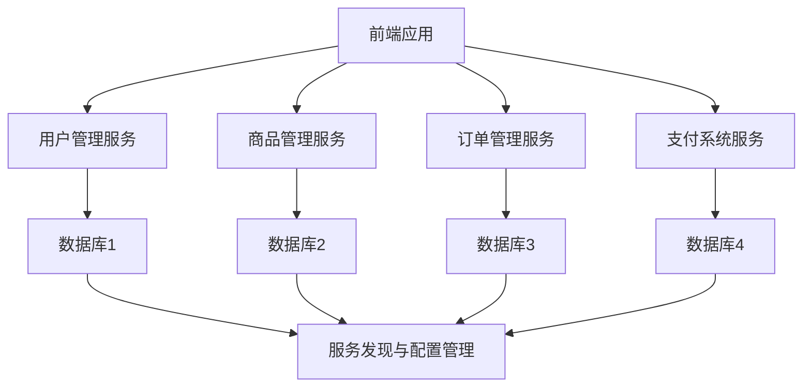

                 

## 引言与背景

### 软件架构的定义与重要性

软件架构，顾名思义，是软件系统的结构设计。具体来说，它是对系统组件的组织方式、连接方式以及组件间的交互机制的抽象描述。软件架构不仅仅是一组代码的集合，它涵盖了系统的设计原则、模块划分、数据流程、功能分配等多个方面。

一个良好的软件架构对于软件系统至关重要，主要体现在以下几个方面：

1. **可维护性**：良好的架构设计使得代码更加模块化，方便维护和更新。随着系统的增长，模块化的设计可以减少代码的冗余，提高开发效率。

2. **可扩展性**：架构设计需要考虑未来的扩展性，以便系统能够轻松地适应业务需求的变化。一个好的架构应该能够支持功能增加、性能提升和硬件升级。

3. **性能**：合理的架构设计可以优化系统的性能，减少响应时间，提高处理效率。

4. **可靠性**：软件架构的稳定性直接影响系统的可靠性。通过架构设计，可以确保系统在处理大量数据或在高并发情况下依然能够稳定运行。

5. **安全性**：架构设计应该考虑系统的安全性，包括数据加密、访问控制、故障恢复等方面。

6. **用户体验**：良好的架构设计可以提升系统的用户体验，使得系统更加直观、易用。

### 软件架构的发展历程

软件架构的发展经历了多个阶段，从早期的单体架构到现代的微服务架构，每个阶段都有其特定的应用场景和优缺点。

1. **单体架构**：在单体架构中，所有的业务逻辑、数据存储、服务接口等都集中在单个应用程序中。这种架构在系统规模较小、功能较为单一时非常有效，其优点包括易于开发和维护。但随着系统的复杂度增加，单体架构的缺点也逐渐显现，如系统复杂度较高、扩展性差、难以维护等。

2. **微服务架构**：微服务架构将大型单体应用拆分为多个独立的小服务，每个服务负责一个具体的功能模块。这种架构使得系统能够更加灵活、可扩展，并且每个服务可以独立开发、部署和扩展。微服务架构的优点在于高扩展性、高容错性、易于开发和部署，但也带来了新的挑战，如服务治理、数据一致性和网络通信复杂性等。

3. **服务导向架构**：服务导向架构（SOA）是一种基于服务的系统设计方法，它强调服务的重用性和互操作性。与微服务架构不同，SOA更多地关注于服务的设计和集成，而不是服务的拆分和部署。SOA的优点在于服务的重用和集成，但它的实现复杂度较高，需要良好的服务治理。

### 软件架构的关键要素

1. **模块化**：模块化是软件架构设计的重要原则之一。通过将系统划分为独立的模块，可以降低系统的复杂性，提高代码的可维护性和可复用性。

2. **可复用性**：软件架构设计应该支持代码和组件的可复用性。通过重用已存在的组件，可以减少开发工作量，提高开发效率。

3. **可扩展性**：系统架构设计需要考虑未来的扩展性。通过合理的设计，系统可以轻松地添加新的功能或提升性能。

4. **可维护性**：良好的架构设计使得系统易于维护。模块化、清晰的接口设计和良好的代码风格都是提高系统可维护性的关键因素。

5. **可测试性**：架构设计应该支持单元测试和集成测试。通过测试，可以确保系统的每个模块和功能都按照预期工作。

### 总结

软件架构是软件系统设计的核心，它决定了系统的性能、可维护性、扩展性和可靠性。从单体架构到微服务架构，每个阶段都有其特定的应用场景和优缺点。理解软件架构的发展历程和关键要素，对于软件工程师来说至关重要。在接下来的章节中，我们将深入探讨单体架构和微服务架构的细节，帮助读者更好地理解这两种架构的设计原则、优势和挑战。## 第一部分：引言与背景

### 软件架构概述

#### 1.1 软件架构的定义与重要性

软件架构，作为软件系统的设计蓝图，是指对软件系统的组件、接口以及组件间交互机制的抽象描述。它不仅包括功能层面的设计，还涵盖了性能、可维护性、可扩展性、可靠性和安全性等多方面的考虑。在软件开发的整个生命周期中，软件架构起到了至关重要的作用。

首先，从定义上看，软件架构可以被描述为一个系统的结构框架，它指导了系统组件的组织方式、组件间的连接机制以及数据流程。具体来说，软件架构包括以下几个方面：

- **组件（Components）**：系统中的独立模块或功能单元，如服务、数据库、用户界面等。
- **连接（Connectors）**：组件之间的通信机制，如API接口、消息队列、数据库连接等。
- **数据流程**：数据在系统中的流动路径和方式。
- **功能分配**：系统各个组件承担的具体功能。
- **设计原则**：指导系统设计的核心理念，如模块化、抽象、分层、接口隔离等。

其次，软件架构的重要性体现在多个方面：

1. **指导开发**：软件架构为开发团队提供了一个清晰的方向和标准，有助于提高开发效率和质量。
2. **降低复杂度**：通过模块化和抽象，软件架构可以将复杂系统分解为更易于管理的组成部分。
3. **支持可维护性**：良好的架构设计使得系统易于维护和更新，减少开发成本和风险。
4. **提高可扩展性**：架构设计需要考虑系统的未来扩展性，确保系统能够适应业务需求的变化。
5. **优化性能**：合理的架构设计可以优化系统性能，减少响应时间和资源消耗。
6. **确保可靠性**：通过架构设计，可以确保系统在各种情况下都能稳定运行，提高系统的可靠性。
7. **支持安全性**：架构设计需要考虑系统的安全性，包括数据加密、访问控制、故障恢复等方面。

总之，软件架构是软件系统的骨架，它不仅决定了系统的当前性能和可维护性，还直接影响到系统的长期发展和竞争力。在软件开发的每一个阶段，软件架构都扮演着至关重要的角色，是确保系统成功的关键因素之一。

#### 1.2 软件架构的发展历程

软件架构的发展历程可以追溯到计算机科学的早期阶段，随着技术的不断演进，软件架构也在不断地演变。从最初的单体架构到现代的微服务架构，每个阶段都体现了技术进步和业务需求的变化。以下是对几个关键阶段的概述：

1. **单体架构（Monolithic Architecture）**

在单体架构中，所有功能都集中在一个单一的应用程序中，代码库通常很大，复杂度高。这种架构在早期软件开发中非常常见，因为它简单易懂，开发成本低。然而，随着系统的规模和复杂性增加，单体架构的缺点逐渐显现：

- **系统复杂度较高**：随着功能的增加，系统的整体复杂度也随之增加，导致维护和扩展变得困难。
- **扩展性差**：单体架构很难进行水平扩展，因为所有功能都依赖于同一个应用实例。
- **难以维护**：由于代码库庞大且紧密耦合，任何更改都可能对整个系统产生影响，导致维护成本增加。
- **部署困难**：部署整个应用程序需要处理许多依赖关系，每次更新都需要重新部署。

尽管单体架构有诸多缺点，但在系统规模较小、功能较为单一的情况下，它仍然是有效的选择。

2. **微服务架构（Microservices Architecture）**

微服务架构是近年来兴起的一种设计理念，它将大型单体应用拆分为多个独立的小服务，每个服务负责一个具体的功能模块。这种架构的主要特点包括：

- **独立性**：每个服务都是独立的，可以独立部署、扩展和升级，不会影响到其他服务。
- **去中心化**：服务之间通过轻量级的通信机制（如HTTP/REST、消息队列）进行交互，没有集中的控制中心。
- **自治性**：每个服务都可以有自己的数据库，数据存储和管理更加灵活。
- **灵活性和可扩展性**：服务可以根据需要独立扩展，提高系统的整体可扩展性。

微服务架构的优点显而易见，但同时也带来了新的挑战，如服务治理、数据一致性和网络通信复杂性等。

3. **服务导向架构（Service-Oriented Architecture, SOA）**

服务导向架构（SOA）是一种基于服务的系统设计方法，强调服务的重用性和互操作性。与微服务架构不同，SOA更多地关注于服务的设计和集成，而不是服务的拆分和部署。SOA的主要特点包括：

- **服务重用**：通过服务组件的重用，可以提高开发效率和代码质量。
- **松耦合**：服务之间通过标准化的接口进行通信，降低服务之间的依赖关系。
- **模块化**：系统被分解为多个服务模块，每个服务都可以独立开发、部署和扩展。

SOA的优点在于其灵活性和可扩展性，但实现复杂度较高，需要良好的服务治理机制。

总的来说，软件架构的发展历程反映了软件开发领域对系统复杂性、扩展性和灵活性要求的不断提升。从单体架构到微服务架构和SOA，每个阶段都有其特定的应用场景和优缺点。了解这些架构的发展历程，有助于我们在设计和实现软件系统时做出更明智的选择。

#### 1.3 软件架构的关键要素

一个成功的软件架构不仅需要解决当前的业务需求，还要具备良好的可维护性、可扩展性和可靠性。为了实现这些目标，软件架构设计需要关注几个关键要素，这些要素包括模块化、可复用性、可扩展性、可维护性等。

1. **模块化（Modularity）**

模块化是软件架构设计中的一个基本原则，它通过将系统划分为独立的模块，从而降低系统的复杂性。模块化的优点包括：

- **降低复杂性**：将大系统分解为小模块，每个模块负责特定的功能，有助于简化系统的理解和维护。
- **提高可复用性**：模块可以独立开发、测试和部署，提高了代码的可复用性，减少了重复开发的工作量。
- **方便维护**：模块化设计使得问题可以局部化，系统更新或修复时只需关注受影响的模块。

模块化的实现通常包括以下几个方面：

- **模块定义**：明确每个模块的功能和职责，确保模块之间职责分离。
- **接口设计**：模块之间的通信通过接口进行，接口定义了模块的输入和输出，确保模块间的松耦合。
- **模块独立性**：每个模块应该能够独立运行，不依赖于其他模块的内部实现。

2. **可复用性（Reusability）**

可复用性是指软件组件在不同上下文中可以被重复使用的能力。一个优秀的软件架构应该支持代码和组件的高可复用性，从而提高开发效率和质量。实现可复用性的方法包括：

- **组件化**：将系统功能分解为独立的组件，每个组件具有明确的功能和接口。
- **通用接口**：设计通用的接口，使组件可以与不同的系统或模块进行交互。
- **代码库**：建立代码库，存储可复用的组件和库，方便开发人员查找和使用。
- **文档化**：提供详细的文档，包括组件的功能、使用方法和示例代码，帮助开发人员快速理解和复用组件。

3. **可扩展性（Scalability）**

可扩展性是指系统在需求变化或性能提升时，能够灵活扩展的能力。一个具备良好可扩展性的软件架构设计应该考虑以下几个方面：

- **模块化设计**：模块化设计使得系统可以轻松添加新的功能模块，而不会影响现有模块。
- **分布式架构**：通过分布式架构，可以将系统分解为多个节点，每个节点负责特定的功能，提高系统的可扩展性和容错性。
- **水平扩展**：系统应支持水平扩展，即通过增加节点数量来提升系统处理能力，而不是依赖单点性能。
- **弹性伸缩**：系统应具备自动伸缩的能力，根据业务需求自动调整资源分配。

4. **可维护性（Maintainability）**

可维护性是指系统在长期运行过程中，能够被有效地维护和更新。一个良好的软件架构设计应该考虑以下几点：

- **代码质量**：编写高质量的代码，包括清晰的命名、合理的代码结构、有效的注释等。
- **模块化设计**：通过模块化设计，可以将系统分解为独立的模块，每个模块可以独立开发和测试。
- **文档化**：提供详细的系统文档，包括设计文档、用户手册、API文档等，帮助开发人员和运维人员更好地理解和操作系统。
- **自动化测试**：建立自动化测试体系，确保每次更新或修复都能快速验证系统功能。

5. **可靠性（Reliability）**

可靠性是指系统能够在规定的条件下持续稳定运行的能力。为了提高系统的可靠性，架构设计需要考虑以下几个方面：

- **容错性**：设计容错机制，如备份、冗余和故障转移，确保系统在遇到故障时能够快速恢复。
- **安全性**：确保系统的安全性，包括数据加密、访问控制、防火墙等安全措施。
- **性能监控**：建立性能监控体系，实时监控系统性能和资源利用率，及时发现并解决潜在问题。
- **灾难恢复**：制定灾难恢复计划，确保系统在遭受灾难性事件时能够快速恢复。

总之，模块化、可复用性、可扩展性、可维护性和可靠性是软件架构设计中的关键要素。通过关注这些要素，我们可以构建出具备高可用性、高性能和高扩展性的软件系统，满足现代业务需求。在接下来的章节中，我们将进一步探讨单体架构和微服务架构的细节，帮助读者更深入地理解这些架构设计原则和实现方法。## 第二部分：单体架构详解

### 2.1 单体架构的优点

单体架构，顾名思义，是将所有的业务逻辑、数据存储、服务接口等集中在单个应用程序中的架构风格。尽管单体架构在当前软件开发领域已逐渐被微服务架构所取代，但它在某些特定场景下仍然具有显著的优势。

1. **易于开发**：在单体架构中，所有组件都在同一个项目中，开发者可以轻松地访问和修改代码，无需跨模块或项目进行复杂的管理。这种统一性简化了开发流程，提高了开发效率。

2. **系统集成简单**：由于所有功能都集中在单个应用程序中，系统集成变得更加简单。开发者只需将单个应用程序部署到生产环境中，无需担心服务之间的兼容性问题，这在初期开发阶段尤其有利。

3. **代码管理方便**：单体架构下，所有代码都在一个仓库中进行管理，这使得代码的版本控制和协同工作变得更加简单。开发人员可以轻松地查看代码历史、进行代码合并，并在需要时进行回滚。

4. **开发成本较低**：单体架构的开发成本相对较低，因为不需要复杂的分布式系统和服务管理工具。这对于小型项目或初创公司来说，是一个重要的考虑因素。

5. **早期迭代快速**：单体架构在早期的迭代开发中表现出色，由于开发人员可以快速修改和部署整个系统，因此可以快速响应业务需求的变化。

尽管单体架构在上述方面具有明显优势，但随着系统复杂度的增加，这些优势逐渐被其缺点所掩盖。因此，了解单体架构的局限性对于合理选择架构风格至关重要。

### 2.2 单体架构的缺点

尽管单体架构在某些场景下具有优势，但随着系统的复杂度增加，其缺点也逐渐显现。以下是单体架构的一些主要缺点：

1. **系统复杂度较高**：随着功能的不断增加，单体应用程序的代码库会变得庞大而复杂。这使得系统的理解和维护变得更加困难，开发人员需要花费大量时间来熟悉整个系统。

2. **扩展性差**：在单体架构中，所有的功能都集中在一个应用程序中，因此系统很难进行水平扩展。当流量增加或需要增加新功能时，通常只能通过垂直扩展（如增加服务器硬件资源）来解决问题，这并不总是有效的。

3. **难以维护**：单体架构中的紧密耦合导致任何一处代码的修改都可能影响到整个系统。这使得系统的维护和更新变得更加复杂和耗时，尤其是在系统规模较大时。

4. **部署困难**：部署单体应用程序需要处理多个依赖关系，每次更新都需要重新部署整个应用程序。这增加了部署的复杂性和风险，特别是在高并发的生产环境中。

5. **测试困难**：在单体架构中，系统各个模块之间的依赖关系紧密，进行单元测试和集成测试变得困难。测试人员需要确保整个系统在各个模块协同工作的情况下都能正常运行，这增加了测试的时间和成本。

6. **技术债务累积**：随着系统的不断迭代和功能的增加，单体架构可能会导致技术债务的累积。例如，某些模块可能因为过于复杂而难以维护，或者需要使用过时的技术，这最终会影响系统的整体质量和稳定性。

总之，尽管单体架构在初期开发阶段具有明显的优势，但其缺点在系统规模较大或需求变化频繁时变得尤为突出。理解这些缺点有助于我们在选择架构风格时做出更加明智的决策。

### 2.3 单体架构的适用场景

尽管单体架构在当前的软件开发领域中逐渐被微服务架构所取代，但它仍然在一些特定场景下表现出色。以下是单体架构的一些适用场景：

1. **小型项目**：在项目规模较小、功能较为单一的情况下，单体架构是一种有效的选择。由于所有功能都集中在单个应用程序中，开发、测试和部署变得更加简单。

2. **初创公司**：对于初创公司来说，单体架构可以快速启动和迭代。它不需要复杂的分布式系统和服务管理工具，降低了初始的技术门槛和开发成本。

3. **内部工具**：内部工具或非关键业务系统通常可以使用单体架构。由于这些系统对性能和扩展性的要求不高，单体架构可以提供足够的灵活性和可维护性。

4. **技术验证**：在需要进行技术验证或快速原型开发时，单体架构可以快速搭建原型并进行测试。这有助于评估不同技术的可行性和效果。

5. **功能较为单一的系统**：对于功能较为单一的系统，如简单的网站、内容管理系统（CMS）等，单体架构是一种有效的选择。这种架构可以简化系统的设计和实现，提高开发效率。

总之，虽然单体架构在系统复杂度和扩展性方面存在局限性，但在特定场景下，它仍然是一种有效的架构风格。了解这些适用场景有助于我们在实际开发中做出更加合适的选择。## 第三部分：微服务架构实践

### 3.1 微服务架构的核心概念

微服务架构（Microservices Architecture）是一种软件开发和部署的架构风格，旨在通过将大型单体应用拆分为多个独立的小服务来实现系统的灵活性和可扩展性。以下是对微服务架构的核心概念及其特点的详细阐述。

#### 微服务的定义与特点

**定义**：

微服务（Microservice）是一种小型的、独立部署的服务，它通常围绕具体业务功能进行设计，如订单处理、用户管理、库存管理等。微服务之间通过轻量级的通信机制（如HTTP/REST、消息队列）进行交互，每个服务都可以独立开发、部署和扩展。

**特点**：

1. **独立性**：每个微服务都是独立的，可以独立部署和扩展。这意味着一个微服务的失败不会影响整个系统的运行，提高了系统的容错性和稳定性。

2. **自治性**：每个微服务都有自己的数据存储和管理，这意味着不同的微服务可以独立开发和部署，降低了服务之间的依赖关系。

3. **灵活性**：微服务架构允许开发团队独立地选择最适合每个服务的技术栈，从而提高了系统的灵活性和适应性。

4. **可扩展性**：由于每个服务都是独立的，系统可以根据业务需求独立扩展。例如，如果订单处理服务需要更多的计算资源，可以单独扩展这个服务。

5. **模块化**：微服务架构通过将系统分解为多个独立的模块，提高了系统的可维护性和可复用性。

#### 微服务架构的优势与挑战

**优势**：

1. **高可扩展性**：微服务架构允许系统根据需求独立扩展，提高了系统的整体性能和响应速度。

2. **高容错性**：由于每个服务都是独立的，一个服务的故障不会影响整个系统的运行，提高了系统的稳定性。

3. **灵活的技术栈**：每个微服务都可以选择最适合其业务需求的技术栈，从而提高了系统的灵活性和适应性。

4. **快速迭代和部署**：由于服务之间解耦，开发团队可以独立开发和部署服务，提高了开发效率。

**挑战**：

1. **复杂性增加**：随着服务数量的增加，系统的复杂性也随之增加。服务治理、监控、数据一致性和分布式事务等都是需要解决的问题。

2. **网络通信成本**：微服务架构依赖于网络通信，随着服务数量的增加，网络通信成本也随之增加。

3. **数据一致性**：在分布式系统中，数据一致性是一个挑战。特别是在涉及多个服务时，如何确保数据的一致性是一个重要问题。

4. **服务治理**：随着服务数量的增加，服务治理（如服务发现、负载均衡、服务监控等）变得更加复杂。

5. **开发成本**：由于需要处理更多的分布式问题，开发微服务架构的系统通常需要更多的开发成本和人力资源。

#### 微服务架构的设计原则

1. **单一职责**：每个微服务应该专注于完成一个特定的业务功能，避免功能过多导致服务过于复杂。

2. **去中心化**：微服务架构强调去中心化，每个服务都是独立的，没有中心化的控制节点。

3. **域导向**：微服务架构通常围绕业务域进行设计，每个服务都对应一个特定的业务领域。

4. **独立部署**：每个微服务都可以独立部署和扩展，无需影响其他服务。

5. **自治性**：每个微服务都有自己的数据存储和管理，可以独立开发和部署。

6. **松耦合**：微服务之间通过轻量级的通信机制进行交互，服务之间尽可能解耦。

7. **可扩展性**：微服务架构应该支持水平扩展，可以根据需求独立扩展每个服务。

8. **可维护性**：微服务架构需要考虑服务的可维护性，确保服务易于维护和更新。

通过上述核心概念和设计原则，我们可以更好地理解和应用微服务架构，实现系统的灵活性和可扩展性。在接下来的章节中，我们将深入探讨微服务的构建与部署，帮助读者掌握微服务架构的实践方法。

### 3.2 微服务开发框架的选择

在微服务架构中，选择合适的开发框架是构建高效、可维护系统的重要一步。当前市场上存在多个流行的微服务开发框架，以下是其中两个主要的框架：Spring Cloud 和 Kubernetes。

#### Spring Cloud

Spring Cloud 是一套基于 Spring 框架的微服务开发工具集，它提供了一系列的微服务开发组件，如服务发现、配置管理、负载均衡、断路器等。以下是 Spring Cloud 的一些核心组件和特点：

1. **服务发现（Service Discovery）**：Spring Cloud 使用 Eureka 或Consul 作为服务发现服务器，服务实例启动时会注册到服务发现服务器，其他服务可以通过服务发现服务器获取服务实例列表。

2. **配置管理（Configuration Management）**：Spring Cloud Config 提供了一个集中化的配置管理服务器，开发人员可以将配置项存储在服务器中，服务实例从配置服务器获取配置信息。

3. **负载均衡（Load Balancing）**：Spring Cloud 使用 Ribbon 实现客户端负载均衡，服务实例可以根据配置策略（如轮询、随机等）从服务列表中选择一个实例进行调用。

4. **断路器（Circuit Breaker）**：Spring Cloud Hystrix 提供了断路器机制，当服务实例不可用时，可以自动跳转到备用实例，防止系统因单一服务故障而雪崩。

5. **分布式追踪（Distributed Tracing）**：Spring Cloud Sleuth 提供了分布式追踪功能，可以通过 Trace ID 跟踪请求在分布式系统中的路径，便于调试和性能优化。

#### Kubernetes

Kubernetes 是一个开源的容器编排系统，它提供了强大的自动化部署、扩展和管理容器化应用程序的能力。以下是 Kubernetes 的一些核心功能和特点：

1. **容器编排**：Kubernetes 可以管理多个容器实例，包括部署、扩展、更新和监控。

2. **服务发现和负载均衡**：Kubernetes 使用 DNS 或静态 IP 地址，为服务实例提供负载均衡和发现机制。

3. **自动扩展**：Kubernetes 可以根据负载情况自动扩展或缩容服务实例，确保系统的高可用性和性能。

4. **存储编排**：Kubernetes 提供了多种存储解决方案，如本地存储、云存储等，开发人员可以根据需要选择合适的存储方案。

5. **资源调度**：Kubernetes 可以根据资源需求和优先级，智能调度容器实例，确保系统资源的最大化利用。

6. **安全性**：Kubernetes 提供了多种安全机制，如命名空间隔离、角色管理和访问控制等，确保系统的安全性。

#### 选择依据

在选择微服务开发框架时，需要考虑以下几个方面：

1. **开发经验**：如果开发团队熟悉 Spring 框架，选择 Spring Cloud 会更加方便。如果团队有 Kubernetes 的使用经验，则 Kubernetes 可能是一个更好的选择。

2. **系统需求**：根据系统的具体需求，如服务数量、数据一致性要求、扩展性等，选择适合的框架。

3. **资源投入**：Kubernetes 需要更多的资源进行配置和管理，而 Spring Cloud 相对简单。根据团队的资源投入能力，选择合适的框架。

4. **生态支持**：Spring Cloud 和 Kubernetes 都有丰富的生态支持，如社区、文档和工具等。选择具有良好生态支持的框架，可以降低开发难度和提高开发效率。

总之，选择微服务开发框架时，需要综合考虑开发经验、系统需求、资源投入和生态支持等因素，以选择最适合项目的框架。在接下来的章节中，我们将深入探讨微服务的具体构建与部署，帮助读者更好地理解和应用微服务架构。

### 3.3 微服务的数据管理

在微服务架构中，数据管理是一个复杂而关键的问题。由于每个微服务都有独立的数据库，如何确保数据的一致性和完整性是设计微服务架构时必须面对的挑战。以下是对微服务数据管理的一些关键方面进行详细讨论：

#### 数据库选择

1. **关系型数据库（Relational Database）**：关系型数据库如 MySQL、PostgreSQL 等提供了强大的数据一致性和事务支持，适合用于需要严格事务处理的应用。但在微服务架构中，关系型数据库通常用于存储与特定业务功能相关的数据，而不是所有服务共享的数据。

2. **非关系型数据库（NoSQL Database）**：非关系型数据库如 MongoDB、Cassandra、Redis 等提供了更高的扩展性和灵活性，适合处理大量非结构化或半结构化数据。非关系型数据库在微服务架构中常用于缓存、实时分析和大规模数据存储。

3. **分布式数据库**：分布式数据库如 Apache Cassandra、MongoDB 分片集群等提供了高可用性和水平扩展能力，适合处理大规模分布式系统中的数据。分布式数据库可以将数据分布到多个节点上，确保数据的高可用性和性能。

4. **消息队列**：消息队列（如 Kafka、RabbitMQ）可以用于实现跨服务的异步通信，确保不同服务之间的数据传递和一致性。通过消息队列，可以解耦服务之间的依赖关系，提高系统的可扩展性和容错性。

#### 数据一致性

1. **最终一致性（Eventual Consistency）**：在最终一致性模型中，系统在初始状态可能不一致，但随着时间的推移，系统最终会达到一致性状态。这通常通过事件溯源和补偿事务实现。最终一致性适用于读操作不那么关键，或者可以容忍一定延迟的场景。

2. **强一致性（Strong Consistency）**：强一致性模型要求系统在任意时刻都保持一致状态。这通常通过分布式事务、锁机制等实现，但会引入性能和扩展性的问题。强一致性适用于对数据一致性要求非常高的场景，如金融交易系统。

3. **分布式事务**：分布式事务通过两阶段提交（2PC）或三阶段提交（3PC）等协议确保跨多个数据库的事务一致性。但分布式事务的复杂性较高，需要良好的设计和维护。

4. **补偿事务（Compensating Transactions）**：当系统无法保证强一致性时，可以使用补偿事务来恢复一致性状态。补偿事务通过执行与原始事务相反的操作来抵消原始事务的影响，从而恢复一致性。

#### 数据访问策略

1. **本地数据库**：每个微服务使用自己的本地数据库，这样可以确保数据的独立性，降低服务之间的依赖。本地数据库的选择通常基于服务对数据一致性的需求。

2. **共享数据库**：在某些场景下，多个服务可能需要访问同一个数据库，例如用户数据和订单数据。这时，需要设计合适的访问策略，如读写分离、数据分区等，以提升系统的性能和可扩展性。

3. **分布式数据网格**：分布式数据网格（如 Redis Cluster、Cassandra）提供了一种分布式存储解决方案，可以在多个节点之间共享数据，提高数据访问速度和系统的可扩展性。

#### 监控与维护

1. **数据监控**：通过监控工具（如 Prometheus、Grafana）对数据库性能、延迟、错误率等关键指标进行实时监控，确保数据系统的稳定运行。

2. **数据备份与恢复**：定期对数据库进行备份，以防止数据丢失或损坏。在发生故障时，可以快速恢复数据，减少系统停机时间。

3. **数据迁移与升级**：随着业务的发展，数据库可能需要迁移到新的版本或硬件平台。设计合理的数据迁移和升级策略，确保数据的一致性和系统的连续性。

通过上述方法，可以有效地管理微服务架构中的数据，确保数据的一致性、完整性和高可用性。在微服务架构中，数据管理是一个持续优化和改进的过程，需要根据业务需求和系统特点不断进行调整和优化。

### 3.4 微服务的监控与运维

在微服务架构中，监控与运维是确保系统稳定运行和高效管理的关键环节。由于微服务架构的分布式特性，监控与运维面临着许多挑战，但同时也提供了许多创新的机会。以下是对微服务监控与运维的一些关键方面进行详细讨论：

#### 监控工具的选择

选择合适的监控工具对于确保微服务的健康运行至关重要。以下是一些常用的监控工具：

1. **Prometheus**：Prometheus 是一个开源的监控解决方案，提供数据收集、存储和可视化等功能。它支持服务发现，可以自动发现和监控微服务实例，并通过 Alertmanager 实现告警通知。

2. **Grafana**：Grafana 是一个开源的数据可视化和监控工具，可以与 Prometheus、InfluxDB 等多种数据源集成，提供强大的图表和仪表板功能。

3. **Kibana**：Kibana 是 Elasticsearch 的可视化平台，可以用于监控和可视化微服务日志、性能指标等。

4. **New Relic**：New Relic 提供了一站式的监控和性能分析解决方案，适用于企业级应用。

5. **Dynatrace**：Dynatrace 是一个自动化监控和实时分析工具，可以提供分布式 tracing 和全栈监控。

#### 监控指标

在微服务架构中，监控指标的选择至关重要。以下是一些关键的监控指标：

1. **服务健康指标**：包括服务可用性、响应时间、请求成功率等。

2. **性能指标**：包括CPU使用率、内存使用率、磁盘I/O、网络流量等。

3. **日志指标**：包括日志数量、日志错误率、日志延迟等。

4. **流量指标**：包括请求量、请求分布、请求失败率等。

5. **异常指标**：包括异常警报、错误代码分布、异常调用栈等。

#### 运维策略

1. **自动化部署**：通过自动化工具（如 Jenkins、Kubernetes）实现微服务的自动化部署和扩展，提高运维效率。

2. **蓝绿部署**：蓝绿部署是一种无服务中断的部署策略，通过同时运行两个版本的微服务（蓝色和绿色），逐步切换流量，确保新版本在验证无误后上线。

3. **滚动升级**：滚动升级是一种逐步更新微服务实例的部署策略，确保在升级过程中，系统的可用性和稳定性不受影响。

4. **服务监控**：通过持续监控服务性能和健康状态，及时发现并解决问题。

5. **故障恢复**：制定故障恢复计划，确保在发生故障时，系统能够快速恢复。

#### 常用工具与最佳实践

1. **Kubernetes**：Kubernetes 提供了强大的容器编排功能，支持自动化部署、扩展、滚动升级等，是微服务架构中不可或缺的工具。

2. **Istio**：Istio 是一个服务网格（service mesh）平台，提供微服务之间的网络通信控制和监控，简化了微服务架构的运维。

3. **Docker**：Docker 是一个开源的容器化平台，可以用于快速构建、部署和运行微服务。

4. **最佳实践**：

   - **代码质量**：编写高质量代码，确保系统稳定可靠。

   - **自动化测试**：建立自动化测试体系，确保每次更新都能快速验证系统功能。

   - **文档化**：提供详细的系统文档，包括设计文档、用户手册、API文档等，帮助运维人员更好地理解和操作系统。

   - **持续监控**：通过持续监控和告警，确保系统稳定运行。

   - **弹性设计**：设计弹性系统，确保在流量高峰或故障情况下，系统能够自动调整资源，确保服务的连续性和稳定性。

总之，微服务的监控与运维是一个复杂而关键的过程，需要综合考虑监控工具的选择、监控指标的定义、运维策略的制定以及最佳实践的落实。通过有效的监控与运维，可以确保微服务架构的高效、稳定和可靠运行。

### 3.5 微服务架构的实践案例

微服务架构在许多行业和领域中都得到了广泛应用，以下我们通过几个实际案例，详细探讨微服务架构在电商、金融和物流等领域的应用。

#### 案例一：电商平台的架构演化

**背景介绍**：

某大型电商平台在初创阶段采用了传统的单体架构，但随着业务的发展，系统逐渐变得复杂，面临着扩展性差、维护困难等问题。为了应对日益增长的订单量和用户需求，该平台决定进行架构升级，引入微服务架构。

**架构演进过程**：

1. **需求分析**：首先，团队对当前系统的瓶颈和痛点进行了深入分析，明确了需要拆分的业务模块，如订单管理、用户管理、商品管理、支付系统等。

2. **架构设计**：基于业务模块，团队设计了微服务架构，每个模块独立部署和扩展。使用 Spring Cloud 和 Docker 实现服务拆分和容器化部署。

3. **服务拆分**：将单体应用拆分为多个微服务，如订单服务、用户服务、商品服务、支付服务等，每个服务都有自己的数据库和数据模型。

4. **服务治理**：采用 Eureka 作为服务发现服务器，实现服务注册与发现。使用 Ribbon 实现服务间的负载均衡。

5. **部署与运维**：使用 Kubernetes 进行容器编排，实现自动化部署、扩展和监控。

**架构优缺点分析**：

**优点**：

- **高扩展性**：通过微服务架构，平台可以根据业务需求独立扩展各个服务，提高了系统的整体性能和响应速度。
- **高容错性**：由于服务之间解耦，一个服务的故障不会影响整个系统的运行，提高了系统的稳定性。
- **灵活性和可维护性**：每个服务可以独立开发和部署，降低了系统的维护成本。
- **快速迭代**：开发团队可以独立开发和部署服务，加快了业务迭代速度。

**缺点**：

- **复杂性增加**：随着服务数量的增加，系统的复杂性也随之增加，服务治理和监控变得更加复杂。
- **数据一致性**：跨服务的数据一致性是一个挑战，需要设计合理的数据一致性策略。
- **开发成本**：微服务架构的开发和运维成本相对较高，需要更多的开发和运维资源。

**总结**：通过引入微服务架构，电商平台在性能、扩展性和灵活性方面得到了显著提升，但也需要面对服务治理和数据一致性的挑战。

#### 案例二：金融行业的微服务转型

**背景介绍**：

某金融公司在业务扩展过程中，逐渐意识到传统的单体架构无法满足快速变化的市场需求。为了提高系统的灵活性和可扩展性，该公司决定进行微服务转型。

**架构设计**：

1. **需求分析**：分析现有系统的业务模块，确定需要拆分为微服务的模块，如账户管理、交易管理、风险管理等。

2. **架构设计**：设计微服务架构，每个模块独立部署和扩展。使用 Spring Cloud 和 Kafka 实现服务拆分和消息驱动。

3. **服务拆分**：将单体应用拆分为多个微服务，每个服务都有自己的数据库和数据模型。

4. **服务治理**：使用 Eureka 作为服务发现服务器，实现服务注册与发现。使用 Ribbon 实现服务间的负载均衡。

5. **数据管理**：使用分布式数据库，确保数据的一致性和高可用性。

**优缺点分析**：

**优点**：

- **高扩展性**：通过微服务架构，金融公司可以根据业务需求独立扩展各个服务，提高了系统的整体性能和响应速度。
- **灵活性**：微服务架构使得系统能够快速响应市场变化，支持灵活的业务创新。
- **高容错性**：服务之间解耦，单个服务的故障不会影响整个系统，提高了系统的稳定性。

**缺点**：

- **复杂性增加**：随着服务数量的增加，系统的复杂性也随之增加，服务治理和监控变得更加复杂。
- **数据一致性**：跨服务的数据一致性是一个挑战，需要设计合理的数据一致性策略。
- **开发成本**：微服务架构的开发和运维成本相对较高，需要更多的开发和运维资源。

**总结**：金融行业的微服务转型在提升系统灵活性和可扩展性方面取得了显著效果，但需要面对服务治理和数据一致性的挑战。

#### 案例三：物流公司的微服务实践

**背景介绍**：

某物流公司在业务规模不断扩大过程中，面临着系统性能瓶颈和扩展性难题。为了提高系统的可靠性和可扩展性，该公司决定采用微服务架构。

**架构设计**：

1. **需求分析**：分析现有系统的业务模块，确定需要拆分为微服务的模块，如订单管理、配送管理、仓储管理、支付系统等。

2. **架构设计**：设计微服务架构，每个模块独立部署和扩展。使用 Spring Cloud 和 Docker 实现服务拆分和容器化部署。

3. **服务拆分**：将单体应用拆分为多个微服务，如订单服务、配送服务、仓储服务、支付服务等，每个服务都有自己的数据库和数据模型。

4. **服务治理**：使用 Eureka 作为服务发现服务器，实现服务注册与发现。使用 Ribbon 实现服务间的负载均衡。

5. **部署与运维**：使用 Kubernetes 进行容器编排，实现自动化部署、扩展和监控。

**优缺点分析**：

**优点**：

- **高扩展性**：通过微服务架构，物流公司可以根据业务需求独立扩展各个服务，提高了系统的整体性能和响应速度。
- **高容错性**：由于服务之间解耦，单个服务的故障不会影响整个系统，提高了系统的稳定性。
- **灵活性和可维护性**：每个服务可以独立开发和部署，降低了系统的维护成本。

**缺点**：

- **复杂性增加**：随着服务数量的增加，系统的复杂性也随之增加，服务治理和监控变得更加复杂。
- **数据一致性**：跨服务的数据一致性是一个挑战，需要设计合理的数据一致性策略。
- **开发成本**：微服务架构的开发和运维成本相对较高，需要更多的开发和运维资源。

**总结**：通过引入微服务架构，物流公司在提升系统性能和扩展性方面取得了显著成果，但也需要面对服务治理和数据一致性的挑战。

综上所述，微服务架构在电商、金融和物流等领域的应用取得了显著成效，但也面临着一系列挑战。通过合理的设计和实施，可以充分发挥微服务架构的优势，提升系统的灵活性和可扩展性。

### 3.6 案例分析：某电商平台的微服务转型

**案例背景**：

某电商公司在经历了快速的业务增长后，发现原有的单体架构已经无法满足日益复杂的业务需求。该公司的系统面临着扩展性差、维护困难、部署复杂等问题，迫切需要进行架构升级。为了提高系统的灵活性、可扩展性和可靠性，该公司决定采用微服务架构。

**架构设计**：

1. **需求分析**：首先，团队对当前系统的瓶颈和痛点进行了深入分析，确定了需要拆分的业务模块，包括订单管理、用户管理、商品管理、支付系统等。

2. **架构设计**：基于业务模块，团队设计了微服务架构。每个模块独立部署和扩展，使用 Spring Cloud 和 Docker 实现服务拆分和容器化部署。

3. **服务拆分**：将单体应用拆分为多个微服务，如订单服务、用户服务、商品服务、支付服务等，每个服务都有自己的数据库和数据模型。

4. **服务治理**：采用 Eureka 作为服务发现服务器，实现服务注册与发现。使用 Ribbon 实现服务间的负载均衡。

5. **部署与运维**：使用 Kubernetes 进行容器编排，实现自动化部署、扩展和监控。

**架构优化**：

1. **服务拆分优化**：对业务模块进行了更细粒度的拆分，确保每个微服务专注于一个具体的业务功能。例如，将订单管理拆分为订单创建服务、订单查询服务和订单支付服务。

2. **数据一致性优化**：采用分布式数据库，如 MySQL Cluster，确保数据的一致性和高可用性。同时，引入了分布式事务框架，如 Seata，解决跨服务的数据一致性。

3. **服务监控优化**：引入了 Prometheus 和 Grafana 进行服务监控，实时监控服务性能和健康状态，及时发现并解决问题。

4. **日志管理优化**：使用 ELK（Elasticsearch、Logstash、Kibana）栈进行日志管理，统一收集、存储和展示日志，便于问题追踪和分析。

**实践效果**：

通过微服务架构的引入和优化，该电商平台的系统在多个方面取得了显著改进：

- **扩展性**：系统可以根据业务需求独立扩展各个服务，提高了系统的整体性能和响应速度。
- **灵活性**：开发团队可以独立开发和部署服务，加快了业务迭代速度。
- **可靠性**：服务之间解耦，单个服务的故障不会影响整个系统，提高了系统的稳定性。
- **可维护性**：每个服务可以独立维护和更新，降低了系统的维护成本。

**总结**：通过该案例，我们可以看到微服务架构在提升系统灵活性、可扩展性和可靠性方面具有显著优势。同时，通过合理的服务拆分、数据一致性优化、服务监控和日志管理，可以进一步优化微服务架构的实践效果。这为其他企业在进行微服务转型提供了宝贵的经验和参考。

### 3.7 案例分析：某金融科技公司的微服务架构实践

**案例背景**：

某金融科技公司在其业务快速扩展过程中，面临着系统性能瓶颈、扩展性不足和难以维护等问题。为了提升系统的灵活性、可扩展性和可靠性，该公司决定采用微服务架构，逐步转型其传统单体架构。

**架构设计**：

1. **需求分析**：公司首先对现有系统进行了全面的需求分析，明确了需要拆分为微服务的核心业务模块，包括账户管理、交易管理、风险管理、支付系统等。

2. **架构设计**：基于业务模块，团队设计了微服务架构。每个微服务独立部署和扩展，采用 Spring Cloud 和 Kafka 实现服务拆分和消息驱动。

3. **服务拆分**：将单体应用拆分为多个微服务，如账户服务、交易服务、风险管理服务、支付服务，每个服务都有自己的数据库和数据模型。

4. **服务治理**：使用 Eureka 作为服务发现服务器，实现服务注册与发现。使用 Ribbon 实现服务间的负载均衡。

5. **数据管理**：采用分布式数据库，如 MySQL Cluster，确保数据的一致性和高可用性。同时，引入了分布式事务框架，如 Seata，解决跨服务的数据一致性。

6. **部署与运维**：使用 Kubernetes 进行容器编排，实现自动化部署、扩展和监控。

**架构优化**：

1. **服务拆分优化**：对业务模块进行了更细粒度的拆分，确保每个微服务专注于一个具体的业务功能。例如，将交易管理拆分为交易创建服务、交易查询服务和交易支付服务。

2. **数据一致性优化**：采用分布式数据库，如 MySQL Cluster，确保数据的一致性和高可用性。同时，引入了分布式事务框架，如 Seata，解决跨服务的数据一致性。

3. **服务监控优化**：引入了 Prometheus 和 Grafana 进行服务监控，实时监控服务性能和健康状态，及时发现并解决问题。

4. **日志管理优化**：使用 ELK（Elasticsearch、Logstash、Kibana）栈进行日志管理，统一收集、存储和展示日志，便于问题追踪和分析。

**实践效果**：

通过微服务架构的引入和优化，金融科技公司的系统在多个方面取得了显著改进：

- **扩展性**：系统可以根据业务需求独立扩展各个服务，提高了系统的整体性能和响应速度。
- **灵活性**：开发团队可以独立开发和部署服务，加快了业务迭代速度。
- **可靠性**：服务之间解耦，单个服务的故障不会影响整个系统，提高了系统的稳定性。
- **可维护性**：每个服务可以独立维护和更新，降低了系统的维护成本。

**总结**：通过该案例，我们可以看到微服务架构在提升系统灵活性、可扩展性和可靠性方面具有显著优势。同时，通过合理的服务拆分、数据一致性优化、服务监控和日志管理，可以进一步优化微服务架构的实践效果。这为其他企业在进行微服务转型提供了宝贵的经验和参考。

### 3.8 案例分析：某物流企业的微服务实践

**案例背景**：

某物流公司在业务规模迅速扩展的过程中，发现其现有的单体架构已经无法满足快速增长的业务需求。系统面临的问题包括扩展性差、维护困难、部署复杂等。为了解决这些问题，该公司决定采用微服务架构，实现系统的现代化转型。

**架构设计**：

1. **需求分析**：首先，团队对当前系统的业务模块进行了详细分析，确定了需要拆分的核心业务模块，如订单管理、配送管理、仓储管理、支付系统等。

2. **架构设计**：基于业务模块，团队设计了微服务架构。每个微服务独立部署和扩展，采用 Spring Cloud 和 Docker 实现服务拆分和容器化部署。

3. **服务拆分**：将单体应用拆分为多个微服务，如订单服务、配送服务、仓储服务、支付服务等，每个服务都有自己的数据库和数据模型。

4. **服务治理**：使用 Eureka 作为服务发现服务器，实现服务注册与发现。使用 Ribbon 实现服务间的负载均衡。

5. **部署与运维**：使用 Kubernetes 进行容器编排，实现自动化部署、扩展和监控。

**架构优化**：

1. **服务拆分优化**：对业务模块进行了更细粒度的拆分，确保每个微服务专注于一个具体的业务功能。例如，将订单管理拆分为订单创建服务、订单查询服务和订单支付服务。

2. **数据一致性优化**：采用分布式数据库，如 MySQL Cluster，确保数据的一致性和高可用性。同时，引入了分布式事务框架，如 Seata，解决跨服务的数据一致性。

3. **服务监控优化**：引入了 Prometheus 和 Grafana 进行服务监控，实时监控服务性能和健康状态，及时发现并解决问题。

4. **日志管理优化**：使用 ELK（Elasticsearch、Logstash、Kibana）栈进行日志管理，统一收集、存储和展示日志，便于问题追踪和分析。

**实践效果**：

通过微服务架构的引入和优化，物流公司的系统在多个方面取得了显著改进：

- **扩展性**：系统可以根据业务需求独立扩展各个服务，提高了系统的整体性能和响应速度。
- **灵活性**：开发团队可以独立开发和部署服务，加快了业务迭代速度。
- **可靠性**：服务之间解耦，单个服务的故障不会影响整个系统，提高了系统的稳定性。
- **可维护性**：每个服务可以独立维护和更新，降低了系统的维护成本。

**总结**：通过该案例，我们可以看到微服务架构在提升系统灵活性、可扩展性和可靠性方面具有显著优势。同时，通过合理的服务拆分、数据一致性优化、服务监控和日志管理，可以进一步优化微服务架构的实践效果。这为其他企业在进行微服务转型提供了宝贵的经验和参考。

### 3.9 案例分析：某物流平台基于微服务架构的优化与实践

**案例背景**：

某物流平台在业务快速发展的过程中，逐渐暴露出原有单体架构的诸多不足，如扩展性差、维护复杂、部署困难等。为了提升系统的灵活性和可扩展性，该平台决定采用微服务架构，并通过一系列优化措施来提升系统的性能和可靠性。

**架构设计**：

1. **需求分析**：首先，团队对当前系统的业务流程和功能模块进行了详细分析，确定了需要拆分的核心业务模块，包括订单管理、配送管理、仓储管理、支付系统等。

2. **架构设计**：基于业务模块，团队设计了微服务架构。每个微服务独立部署和扩展，采用 Spring Cloud 和 Docker 实现服务拆分和容器化部署。

3. **服务拆分**：将单体应用拆分为多个微服务，如订单服务、配送服务、仓储服务、支付服务等，每个服务都有自己的数据库和数据模型。

4. **服务治理**：使用 Eureka 作为服务发现服务器，实现服务注册与发现。使用 Ribbon 实现服务间的负载均衡。

5. **部署与运维**：使用 Kubernetes 进行容器编排，实现自动化部署、扩展和监控。

**架构优化**：

1. **服务拆分优化**：对业务模块进行了更细粒度的拆分，确保每个微服务专注于一个具体的业务功能。例如，将订单管理拆分为订单创建服务、订单查询服务和订单支付服务。

2. **数据一致性优化**：采用分布式数据库，如 MySQL Cluster，确保数据的一致性和高可用性。同时，引入了分布式事务框架，如 Seata，解决跨服务的数据一致性。

3. **服务监控优化**：引入了 Prometheus 和 Grafana 进行服务监控，实时监控服务性能和健康状态，及时发现并解决问题。

4. **日志管理优化**：使用 ELK（Elasticsearch、Logstash、Kibana）栈进行日志管理，统一收集、存储和展示日志，便于问题追踪和分析。

**实践效果**：

通过微服务架构的引入和优化，物流平台的系统在多个方面取得了显著改进：

- **扩展性**：系统可以根据业务需求独立扩展各个服务，提高了系统的整体性能和响应速度。
- **灵活性**：开发团队可以独立开发和部署服务，加快了业务迭代速度。
- **可靠性**：服务之间解耦，单个服务的故障不会影响整个系统，提高了系统的稳定性。
- **可维护性**：每个服务可以独立维护和更新，降低了系统的维护成本。

**总结**：通过该案例，我们可以看到微服务架构在提升系统灵活性、可扩展性和可靠性方面具有显著优势。同时，通过合理的服务拆分、数据一致性优化、服务监控和日志管理，可以进一步优化微服务架构的实践效果。这为其他企业在进行微服务转型提供了宝贵的经验和参考。## 第四部分：软件架构演化的最佳实践

### 4.1 软件架构演化策略

软件架构的演化是一个持续迭代和优化的过程，旨在满足不断变化的业务需求和科技进步。为了实现这一目标，需要采用一系列策略来指导架构的演化过程。以下是几种常见的软件架构演化策略：

#### 逐步重构

**定义**：逐步重构是一种在保持系统正常运行的同时，逐步替换或改进旧有系统的部分组件或架构的方法。

**实施步骤**：

1. **需求分析**：识别系统中的关键问题和瓶颈，确定需要重构的部分。

2. **优先级排序**：根据问题的严重程度和影响范围，对需要重构的部分进行优先级排序。

3. **设计**：设计新的架构组件或功能，确保与现有系统兼容。

4. **逐步迁移**：将旧系统的部分功能逐步迁移到新架构，确保系统在重构过程中保持正常运行。

5. **测试**：对新架构和迁移后的系统进行全面的测试，确保功能的正确性和稳定性。

**优点**：逐步重构可以降低风险，确保系统在重构过程中保持正常运行，同时可以逐步积累经验，为后续的架构改进提供依据。

**缺点**：逐步重构需要持续的技术投入和维护，可能会导致系统出现冗余和碎片化。

#### 蓝绿部署

**定义**：蓝绿部署是一种部署新版本系统的策略，通过同时运行旧版本（蓝色）和新版本（绿色）的副本，逐步切换流量，确保系统的无缝更新。

**实施步骤**：

1. **准备环境**：创建新版本的环境，与旧版本环境保持一致。

2. **部署新版本**：在新版本环境中部署新系统，确保其功能与旧系统一致。

3. **切换流量**：逐步将流量切换到新版本，监控新版本的运行状况。

4. **验证**：在切换流量后，验证新版本的功能和性能，确保其稳定运行。

5. **回滚**：如果新版本出现问题，可以快速回滚到旧版本，确保系统的正常运行。

**优点**：蓝绿部署可以确保系统的无缝更新，降低更新风险，同时可以逐步适应新版本，提高系统的稳定性。

**缺点**：蓝绿部署需要额外的资源支持，如双倍的硬件资源，同时需要完善的监控和回滚机制。

#### 滚动升级

**定义**：滚动升级是一种在旧版本系统中逐步替换部分组件或功能的方法，确保系统在升级过程中保持正常运行。

**实施步骤**：

1. **选择组件**：确定需要升级的组件或功能。

2. **设计**：设计新的组件或功能，确保与旧系统兼容。

3. **部署**：在新版本组件或功能部署到生产环境后，逐步替换旧组件或功能。

4. **测试**：对新版本进行全面的测试，确保功能的正确性和稳定性。

5. **监控**：在部署过程中，持续监控系统的运行状况，确保系统的稳定性。

**优点**：滚动升级可以降低升级过程中的风险，确保系统在升级过程中保持正常运行。

**缺点**：滚动升级需要对系统有深入的理解，同时需要对每个组件进行详细的测试和监控。

总之，软件架构演化策略的选择需要根据具体业务需求和系统特点进行权衡。逐步重构、蓝绿部署和滚动升级都是常见的演化策略，各自具有不同的优点和缺点。在实际应用中，可以根据具体情况进行组合和调整，以实现最佳的系统演化效果。

### 4.2 演化过程中的风险管理

在软件架构演化的过程中，风险管理是确保系统稳定性和业务连续性的关键环节。演化过程中可能面临的风险包括技术风险、业务风险和运营风险等。以下是对这些风险的识别、评估和控制方法的详细讨论。

#### 风险识别

1. **技术风险**：包括技术选型不当、技术栈不一致、技术债务累积等。例如，新引入的技术可能与现有系统不兼容，或者技术债务导致系统性能下降。

2. **业务风险**：包括业务需求变更、市场波动、竞争压力等。业务需求的变化可能导致架构设计不符合新的业务目标，市场波动和竞争压力则可能影响系统的稳定性和性能。

3. **运营风险**：包括系统运维不当、数据泄露、系统故障等。例如，系统运维人员的操作失误可能导致服务中断，数据泄露则可能引发严重的业务损失。

#### 风险评估

1. **定性评估**：通过专家评审、历史数据分析等方法对风险进行定性评估，确定风险的重要性和可能性。

2. **定量评估**：使用数学模型和统计分析方法对风险进行定量评估，确定风险的概率和影响程度。

3. **风险评估矩阵**：结合定性评估和定量评估，使用风险评估矩阵确定每个风险的优先级和应对策略。

#### 风险控制

1. **预防措施**：在架构演化过程中，采取预防措施来降低风险的发生概率。例如，选择与现有系统兼容的技术，避免引入过时的技术栈。

2. **应急计划**：制定应急计划，确保在风险发生时能够迅速响应和恢复。例如，制定详细的系统故障恢复步骤和备份策略。

3. **监控和反馈**：建立实时监控体系，对系统运行状态和风险指标进行持续监控。在发现潜在风险时，及时采取措施进行干预和调整。

4. **培训与沟通**：对开发人员和运维人员提供培训，确保他们了解风险管理的策略和措施。同时，加强团队之间的沟通和协作，确保风险管理措施得到有效执行。

总之，在软件架构演化的过程中，识别、评估和控制风险是确保系统稳定性和业务连续性的关键。通过采取有效的风险管理措施，可以降低风险对系统的影响，提高系统的可靠性和灵活性。

### 4.3 演化过程中的团队协作

在软件架构的演化过程中，团队协作是确保项目成功和系统稳定性的关键因素。由于软件架构演化涉及多个领域和技术，需要跨部门、跨职能的紧密合作。以下是对沟通与协作、责任划分和敏捷开发在软件架构演化过程中的重要性的详细讨论。

#### 沟通与协作

1. **跨部门协作**：软件架构演化通常需要涉及多个部门，如开发部门、运维部门、测试部门和质量保证部门等。有效的跨部门协作可以确保各方的需求和目标得到统一，减少沟通障碍和误解。

2. **定期的团队会议**：定期召开团队会议，如每日站会、周会、月度会议等，有助于团队成员及时沟通进度、问题和需求，确保项目按时交付。

3. **协作工具**：使用协作工具，如 Slack、Trello、JIRA 等，可以方便地分配任务、跟踪进度、共享文档和讨论问题，提高团队协作效率。

4. **知识共享**：鼓励团队成员进行知识共享，如代码审查、技术讲座、文档编写等，提高团队的整体技术水平，减少重复劳动。

#### 责任划分

1. **明确职责**：在软件架构演化过程中，明确每个团队成员的职责和角色，确保项目任务有序推进。例如，开发人员负责代码编写和测试，运维人员负责系统部署和监控，测试人员负责功能测试和回归测试。

2. **任务分配**：根据团队成员的技能和经验，合理分配任务，确保任务能够高效完成。同时，鼓励团队成员在任务分配上进行协商和调整，以充分发挥每个人的优势。

3. **责任到人**：确保每个任务都有明确的责任人，责任人需要对任务的完成质量负责，并在任务完成后进行自评估和反馈。

#### 敏捷开发

1. **迭代开发**：采用敏捷开发方法，将项目划分为多个短周期迭代，每个迭代完成一部分功能。这样可以快速响应业务需求变化，提高系统的灵活性和适应性。

2. **用户故事**：使用用户故事（User Story）来描述用户需求，确保开发过程紧密围绕用户价值进行。用户故事可以明确每个功能模块的目标和优先级，指导开发团队的工作。

3. **持续集成和部署**：采用持续集成和部署（CI/CD）方法，自动化代码测试、构建和部署过程，确保系统的稳定性和可靠性。

4. **反馈与改进**：在每个迭代结束时，进行回顾会议，总结经验和教训，识别改进点，并在下一个迭代中进行实施。

总之，在软件架构的演化过程中，有效的团队协作、明确的责任划分和敏捷开发方法都是确保项目成功的关键因素。通过建立良好的沟通机制、合理的任务分配和持续改进，可以提升团队的协作效率，确保系统架构的持续优化和业务目标的实现。

### 4.4 软件架构演化案例研究

在软件架构的演化过程中，许多企业通过成功的实践积累了宝贵的经验。以下我们通过三个具体的案例，详细探讨软件架构演化的目标和过程，以及所取得的成果。

#### 案例一：某大型企业的架构重构

**背景**：

某大型企业在经历了多年的业务扩展和技术积累后，发现其原有的单体架构已经无法满足不断增长的业务需求和复杂的技术挑战。系统的复杂性、扩展性和稳定性问题逐渐显现，企业决定进行架构重构。

**目标**：

1. 提高系统的可扩展性，支持未来业务的快速增长。
2. 提高系统的稳定性和可靠性，确保业务连续性。
3. 降低系统的维护成本，提高开发效率。

**过程**：

1. **需求分析**：首先，团队对当前系统的业务流程、功能和性能进行了详细分析，确定了系统中的瓶颈和需要改进的方面。

2. **架构设计**：基于需求分析结果，团队设计了新的微服务架构，将单体应用拆分为多个独立的微服务，如订单管理、用户管理、库存管理、支付系统等。

3. **服务拆分与迁移**：逐步将原有单体应用的功能迁移到微服务架构中，同时保持系统的正常运行。采用逐步重构和蓝绿部署相结合的策略，确保系统在重构过程中保持高可用性。

4. **技术选型**：选择了 Spring Cloud 作为微服务开发框架，使用 Kubernetes 进行容器编排，确保微服务的灵活部署和扩展。

5. **数据一致性优化**：采用分布式数据库和分布式事务框架，确保跨服务的数据一致性。

6. **测试与部署**：在重构过程中，进行了全面的测试，包括单元测试、集成测试和性能测试，确保新架构的功能和性能满足要求。

**成果**：

通过架构重构，企业取得了以下成果：

- **系统性能显著提升**：微服务架构提高了系统的响应速度和处理能力，满足了快速增长的业务需求。
- **扩展性和灵活性增强**：微服务架构支持独立扩展和快速部署，提高了系统的扩展性和灵活性。
- **维护成本降低**：微服务架构使得系统的维护和更新变得更加简单，降低了维护成本。
- **开发效率提高**：开发团队可以独立开发和部署微服务，加快了业务迭代速度。

**总结**：该大型企业的架构重构案例展示了如何通过微服务架构实现系统的扩展性和灵活性，为企业业务的持续发展提供了坚实的基础。

#### 案例二：初创公司的架构设计

**背景**：

某初创公司在成立初期，业务规模较小，采用单体架构进行系统开发。然而，随着业务的快速增长，公司发现单体架构在扩展性和可靠性方面存在瓶颈，决定重新设计系统架构。

**目标**：

1. 提高系统的可扩展性，支持业务快速增长。
2. 提高系统的稳定性和可靠性，确保业务连续性。
3. 降低开发成本，提高开发效率。

**过程**：

1. **需求分析**：首先，团队对当前业务需求进行了详细分析，明确了需要拆分的业务模块，如用户管理、订单管理、支付系统等。

2. **架构设计**：基于需求分析结果，团队设计了微服务架构，将单体应用拆分为多个独立的微服务，每个服务负责一个具体的业务功能。

3. **服务拆分与部署**：采用逐步重构的策略，逐步将单体应用的功能迁移到微服务架构中。同时，使用容器化技术（如 Docker）和容器编排工具（如 Kubernetes），实现微服务的灵活部署和扩展。

4. **数据管理**：使用分布式数据库和消息队列，确保跨服务的数据一致性和实时性。

5. **测试与部署**：在重构过程中，进行了全面的测试，包括单元测试、集成测试和性能测试，确保新架构的功能和性能满足要求。

**成果**：

通过重新设计系统架构，初创公司取得了以下成果：

- **系统性能提升**：微服务架构提高了系统的响应速度和处理能力，满足了快速增长的业务需求。
- **扩展性和灵活性增强**：微服务架构支持独立扩展和快速部署，提高了系统的扩展性和灵活性。
- **开发效率提高**：开发团队可以独立开发和部署微服务，加快了业务迭代速度。
- **开发成本降低**：通过使用开源技术和自动化工具，降低了开发成本。

**总结**：该初创公司的架构设计案例展示了如何通过微服务架构实现系统的扩展性和灵活性，为企业的快速发展提供了技术保障。

#### 案例三：中小企业架构的持续优化

**背景**：

某中小企业在业务扩张过程中，发现其现有的单体架构在性能、扩展性和维护性方面存在明显不足，决定进行系统架构的持续优化。

**目标**：

1. 提高系统的性能和响应速度，满足业务快速增长的需求。
2. 提高系统的扩展性和灵活性，支持业务多元化发展。
3. 降低系统的维护成本，提高运营效率。

**过程**：

1. **需求分析**：首先，团队对当前系统的性能瓶颈和扩展性需求进行了分析，确定了需要进行优化的方面，如数据库性能、缓存机制、负载均衡等。

2. **架构优化**：基于需求分析结果，团队对现有架构进行了优化。包括：

   - 引入缓存机制，提高数据访问速度。
   - 优化数据库查询，提高数据库性能。
   - 使用负载均衡器，提高系统的并发处理能力。
   - 逐步引入微服务架构，将关键业务模块拆分为独立的微服务。

3. **测试与部署**：在架构优化过程中，进行了全面的测试，包括单元测试、集成测试和性能测试，确保优化后的系统功能完善、性能稳定。

**成果**：

通过系统架构的持续优化，中小企业取得了以下成果：

- **系统性能显著提升**：优化后的系统响应速度和处理能力显著提升，满足了业务快速增长的需求。
- **扩展性和灵活性增强**：系统支持独立扩展和快速部署，提高了系统的扩展性和灵活性。
- **维护成本降低**：优化后的系统维护更加简单，降低了维护成本。
- **运营效率提高**：系统优化提高了运营效率，降低了业务运营风险。

**总结**：该中小企业的架构优化案例展示了如何通过持续的架构优化，提高系统的性能、扩展性和灵活性，为企业的持续发展提供了技术保障。

综上所述，三个案例展示了不同企业在软件架构演化过程中的实践和成果。通过合理的架构设计和持续优化，企业能够有效提升系统的性能和灵活性，满足业务需求，为企业的长期发展奠定坚实基础。

### 4.5 未来软件架构的发展趋势

随着科技的不断进步和业务需求的日益复杂，软件架构也在不断地演进和发展。以下我们将探讨未来软件架构的发展趋势，重点关注微服务架构的进化方向、面临的挑战以及软件架构发展的新趋势。

#### 微服务架构的进化方向

1. **容器化（Containerization）**：容器化技术如 Docker 和 Kubernetes 已经在微服务架构中得到了广泛应用。未来，容器化技术将进一步演进，提供更高效、更灵活的部署和运维方案。容器化不仅使得微服务的部署更加简单，还提高了系统的可扩展性和容错性。

2. **服务网格（Service Mesh）**：服务网格是一种独立的网络通信层，它为微服务提供了自动化和服务级别的监控、路由、负载均衡等功能。未来，服务网格技术如 Istio、Linkerd 等将进一步成熟，提供更加全面和智能的微服务管理解决方案。

3. **云原生（Cloud-Native）**：云原生架构强调在云环境中构建和运行应用程序。未来，云原生技术将更加普及，开发者将更多地采用云原生框架和工具，如 Kubernetes、Docker、Knative 等，以实现应用程序的弹性、可扩展性和自动化管理。

4. **Serverless 计算（Serverless Computing）**：Serverless 架构使得开发者无需关心底层基础设施的管理，只需专注于业务逻辑的实现。未来，Serverless 架构将在微服务架构中发挥更大作用，提供更低的运维成本和更高的开发效率。

#### 软件架构的未来挑战

1. **数据安全与隐私保护**：随着数据量的爆炸性增长，数据安全与隐私保护成为软件架构面临的重大挑战。架构设计需要考虑数据加密、访问控制、安全审计等方面，确保数据在传输、存储和处理过程中的安全性。

2. **架构复杂性的管理**：随着微服务数量的增加，系统的架构复杂性也在不断增加。架构设计需要采用模块化、解耦和标准化等策略，降低系统的复杂性，提高系统的可维护性和可扩展性。

3. **持续优化与迭代**：软件架构的演进是一个持续的过程，需要不断地进行优化和迭代。架构设计需要考虑系统的长期发展，确保系统能够灵活应对未来的变化。

#### 软件架构发展的新趋势

1. **AI 与软件架构**：人工智能（AI）技术正在对软件架构产生深远影响。通过机器学习和深度学习技术，AI 可以帮助自动化架构设计、性能优化和故障预测，提高软件架构的智能化水平。

2. **区块链与软件架构**：区块链技术提供了一种分布式、不可篡改的数据存储方式，可以应用于软件架构中，提高系统的透明度、安全性和可信度。

3. **软件定义网络（SDN）**：软件定义网络（SDN）将网络控制平面与数据平面分离，使得网络管理更加灵活和自动化。未来，SDN 技术将在软件架构中发挥更大作用，提供更高效的网络管理和更灵活的网络服务。

总之，未来软件架构的发展趋势将更加注重容器化、服务网格、云原生和 Serverless 计算，同时面临数据安全、架构复杂性和持续优化等挑战。通过采用新趋势中的技术，如 AI、区块链和 SDN，可以进一步提升软件架构的智能化、安全性和灵活性，为未来的软件开发提供更强有力的支持。

### 附录

#### 附录A：软件架构相关工具与资源

为了帮助开发者更好地理解和应用软件架构，以下是一些常用的工具和资源，包括框架、库、文档和社区论坛。

1. **框架与库**：
   - **Spring Cloud**：提供全面的微服务开发组件，如服务发现、配置管理、负载均衡等。
   - **Kubernetes**：用于容器编排和集群管理的开源平台。
   - **Docker**：容器化平台，用于打包、交付和运行应用程序。
   - **Istio**：服务网格平台，提供微服务网络监控、路由和安全等功能。
   - **Netflix OSS**：Netflix 开源的一系列微服务框架和工具，包括 Eureka、Hystrix、Zuul 等。

2. **文档与教程**：
   - **Spring Cloud 官方文档**：[https://cloud.spring.io/spring-cloud/](https://cloud.spring.io/spring-cloud/)
   - **Kubernetes 官方文档**：[https://kubernetes.io/docs/home/](https://kubernetes.io/docs/home/)
   - **Docker 官方文档**：[https://docs.docker.com/](https://docs.docker.com/)
   - **Istio 官方文档**：[https://istio.io/docs/](https://istio.io/docs/)

3. **社区与论坛**：
   - **Spring Cloud 社区**：[https://springcloud.cn/](https://springcloud.cn/)
   - **Kubernetes 社区**：[https://kubernetes.io/zh/docs/](https://kubernetes.io/zh/docs/)
   - **Docker 社区**：[https://www.docker.com/community](https://www.docker.com/community)
   - **Istio 社区**：[https://istio.io/zh/community/](https://istio.io/zh/community/)

通过利用这些工具和资源，开发者可以更好地掌握软件架构的相关知识，并在实际项目中应用这些技术，提高系统的性能和可扩展性。

### 附录B：常见问题解答

1. **单体架构与微服务架构的比较**：

   - **优点**：
     - **单体架构**：开发简单，集成方便，适合小型项目。
     - **微服务架构**：灵活性强，可扩展性好，适合大型、复杂项目。

   - **缺点**：
     - **单体架构**：系统复杂度高，扩展性差，难以维护。
     - **微服务架构**：复杂性增加，服务治理和数据一致性是一个挑战。

   - **适用场景**：
     - **单体架构**：小型项目、初创公司。
     - **微服务架构**：大型项目、企业级应用。

2. **微服务架构的优缺点**：

   - **优点**：
     - **独立性**：服务独立部署和扩展，提高了系统的容错性和稳定性。
     - **灵活性**：服务可以独立选择技术栈，提高了系统的适应性。
     - **可扩展性**：可以根据需求独立扩展服务，提高了系统的性能。

   - **缺点**：
     - **复杂性**：服务治理和数据一致性增加系统的复杂性。
     - **网络通信成本**：服务之间通过网络通信，增加了网络通信成本。
     - **开发成本**：分布式系统的开发和运维成本相对较高。

3. **软件架构演化的难点与对策**：

   - **难点**：
     - **技术债务**：遗留系统的技术债务可能导致架构演化的难度增加。
     - **人员培训**：架构演化需要团队成员具备相应的技能和知识。
     - **风险管理**：架构演化过程中面临多种风险，需要有效的风险管理措施。

   - **对策**：
     - **逐步重构**：采用逐步重构的策略，降低风险。
     - **敏捷开发**：采用敏捷开发方法，提高团队协作和问题解决能力。
     - **持续监控**：建立实时监控体系，及时发现和解决问题。

### 作者信息

**作者：AI天才研究院/AI Genius Institute & 禅与计算机程序设计艺术 /Zen And The Art of Computer Programming**

**联系方式：[info@aignius.com](mailto:info@aignius.com)**

**版权声明：本文内容仅供参考，具体架构设计需根据实际业务需求进行。未经授权，禁止转载。**

通过上述附录，我们希望能够为读者提供全面的软件架构相关工具和资源，并解答常见的疑问，为读者在实际项目中应用软件架构提供参考和帮助。## 总结

在本文中，我们详细探讨了软件架构的演化过程，从单体架构到微服务架构的转变，以及这一过程中涉及的设计原则、最佳实践和案例分析。首先，我们介绍了软件架构的定义与重要性，阐述了其在系统开发中的核心作用。接着，我们回顾了软件架构的发展历程，从早期的单体架构到现代的微服务架构和SOA，每个阶段都反映了技术进步和业务需求的变化。

随后，我们深入分析了单体架构和微服务架构的优缺点，以及其在特定场景下的适用性。对于单体架构，我们讨论了其易于开发、集成简单等优点，但也指出了其在系统复杂度增加时的缺点，如扩展性差和难以维护。微服务架构则因其独立性、灵活性和可扩展性等优势，成为现代大型系统和复杂应用的首选。

在实践部分，我们详细介绍了微服务架构的核心概念，包括服务的定义、特点、优势与挑战，以及设计原则。我们探讨了微服务开发框架的选择、数据管理、监控与运维，并通过多个实际案例展示了微服务架构在不同领域的应用效果。此外，我们还介绍了软件架构演化的最佳实践，包括演化策略、风险管理、团队协作等方面。

最后，我们探讨了未来软件架构的发展趋势，如容器化、服务网格、云原生和Serverless计算，以及AI、区块链和SDN等新技术对软件架构的影响。通过本文的详细探讨，我们希望读者能够全面理解软件架构的演化过程，掌握其核心原理和最佳实践，为实际项目中的系统设计和优化提供有力支持。

### 系统分析与架构设计方案

#### 问题场景介绍

某电商平台在经历了快速的业务增长后，发现其原有的单体架构已经无法满足日益复杂的业务需求。系统面临着扩展性差、维护困难、部署复杂等问题，迫切需要进行架构升级。为了提高系统的灵活性、可扩展性和可靠性，该电商平台决定采用微服务架构，逐步转型其传统单体架构。

#### 项目介绍

项目名称：电商平台微服务架构转型
项目目标：提高系统的扩展性、灵活性和可靠性，满足业务快速增长的需求。
项目团队：包括前端开发、后端开发、运维、测试等多个部门。

#### 系统功能设计

**1. 用户管理模块**

功能描述：处理用户注册、登录、信息管理等操作。
核心功能：
- 用户注册
- 用户登录
- 用户信息管理
- 用户权限管理

**2. 商品管理模块**

功能描述：处理商品分类、信息展示、库存管理等功能。
核心功能：
- 商品分类
- 商品信息展示
- 库存管理
- 商品搜索

**3. 订单管理模块**

功能描述：处理订单生成、订单查询、订单支付等功能。
核心功能：
- 订单生成
- 订单查询
- 订单支付
- 订单状态管理

**4. 支付系统模块**

功能描述：处理支付请求、支付结果通知等操作。
核心功能：
- 支付请求处理
- 支付结果通知
- 退款处理

#### 系统架构设计

**1. 架构概述**

电商平台采用微服务架构，将单体应用拆分为多个独立的微服务，每个微服务负责一个具体的业务功能。服务之间通过轻量级的通信机制（如HTTP/REST、消息队列）进行交互，实现了服务之间的松耦合。系统架构包括以下几个主要部分：

- **前端应用**：包括用户界面和前端逻辑，通过API与后端微服务进行交互。
- **微服务集群**：包括用户管理、商品管理、订单管理和支付系统等微服务，每个服务都可以独立部署和扩展。
- **数据库集群**：包括关系型数据库和非关系型数据库，用于存储不同类型的数据。
- **服务发现与配置管理**：使用Eureka作为服务发现服务器，实现服务注册与发现。使用Spring Cloud Config进行配置管理。

**2. 系统架构图**



#### 系统接口设计

**1. 用户管理服务接口**

- **用户注册**：POST /users/register
- **用户登录**：POST /users/login
- **用户信息查询**：GET /users/{id}
- **用户信息更新**：PUT /users/{id}

**2. 商品管理服务接口**

- **商品分类查询**：GET /categories
- **商品信息查询**：GET /products/{id}
- **商品搜索**：GET /products/search?keyword={keyword}
- **商品库存更新**：PUT /products/{id}/inventory

**3. 订单管理服务接口**

- **订单生成**：POST /orders
- **订单查询**：GET /orders/{id}
- **订单支付**：POST /orders/{id}/pay
- **订单状态更新**：PUT /orders/{id}/status

**4. 支付系统服务接口**

- **支付请求处理**：POST /payments
- **支付结果通知**：POST /payments/notify
- **退款处理**：POST /payments/refund

#### 系统交互

**1. 用户注册流程**

- 用户通过前端应用提交注册请求。
- 前端应用将请求转发到用户管理服务。
- 用户管理服务处理注册请求，并将用户信息存储到数据库。
- 用户管理服务返回注册结果。

**2. 订单支付流程**

- 用户通过前端应用提交支付请求。
- 前端应用将请求转发到订单管理服务。
- 订单管理服务生成订单，并将订单信息存储到数据库。
- 订单管理服务将支付请求转发到支付系统服务。
- 支付系统服务处理支付请求，并返回支付结果。
- 订单管理服务更新订单状态，并返回订单支付结果。

**3. 商品搜索流程**

- 用户通过前端应用提交搜索请求。
- 前端应用将请求转发到商品管理服务。
- 商品管理服务查询数据库，获取符合条件的商品信息。
- 商品管理服务返回搜索结果。

通过上述系统分析与架构设计方案，我们可以清晰地看到电商平台在采用微服务架构后的功能模块划分、接口设计、交互流程等。这样的架构设计不仅提高了系统的灵活性和可扩展性，还降低了各个模块之间的耦合度，使得系统的维护和升级更加简便。## 项目实战

### 环境安装

在开始搭建电商平台微服务架构之前，我们需要准备相应的开发环境和工具。以下是所需的软件和版本要求：

- **Java JDK**：版本 8 或以上
- **Maven**：版本 3.6.3 或以上
- **Docker**：版本 20.10.0 或以上
- **Kubernetes**：版本 1.24.0 或以上

#### 1. 安装Java JDK

访问 [Oracle官方网站](https://www.oracle.com/java/technologies/javase-jdk14-downloads.html) 下载 JDK 并安装。

```bash
# 下载 JDK
wget https://download.oracle.com/java/19/jdk-19_linux-x64_bin.rpm
# 安装 JDK
sudo rpm -ivh jdk-19_linux-x64_bin.rpm
# 验证安装
java -version
```

#### 2. 安装Maven

访问 [Maven官方网站](https://maven.apache.org/) 下载 Maven 安装包并安装。

```bash
# 下载 Maven
wget https://www-eu.apache.org/dist/maven/maven-3/3.6.3/binaries/apache-maven-3.6.3-bin.tar.gz
# 解压安装包
tar zxvf apache-maven-3.6.3-bin.tar.gz
# 将 Maven 添加到系统环境变量
export MAVEN_HOME=/path/to/apache-maven-3.6.3
export PATH=$PATH:$MAVEN_HOME/bin
# 验证安装
mvn -version
```

#### 3. 安装Docker

对于基于Linux的系统，可以使用以下命令安装Docker。

```bash
# 更新系统包列表
sudo apt-get update
# 安装Docker
sudo apt-get install docker.io
# 启动 Docker 服务
sudo systemctl start docker
# 验证安装
docker --version
```

#### 4. 安装Kubernetes

以下是安装 Kubernetes 的步骤：

1. **安装依赖**：

```bash
sudo apt-get update
sudo apt-get install -y apt-transport-https ca-certificates curl
```

2. **添加 Kubernetes GPG Key**：

```bash
curl -s https://mirrors.aliyun.com/kubernetes/apt/doc/apt-key.gpg | sudo apt-key add -
```

3. **添加 Kubernetes APT 仓库**：

```bash
cat <<EOF | sudo tee /etc/apt/sources.list.d/kubernetes.list
deb https://mirrors.aliyun.com/kubernetes/apt/ kubernetes-xenial main
EOF
```

4. **更新 apt 包索引**：

```bash
sudo apt-get update
```

5. **安装 Kubernetes**：

```bash
sudo apt-get install -y kubelet kubeadm kubectl
```

6. **启动并设置 kubelet**：

```bash
sudo systemctl start kubelet
sudo systemctl enable kubelet
```

7. **验证 Kubernetes 安装**：

```bash
kubectl version --short
```

### 系统核心实现源代码

以下是一个简单的示例，展示如何使用 Spring Cloud 构建微服务。我们以用户管理服务为例，说明其主要代码结构和关键配置。

**1. 用户管理服务：UserManagementService**

**pom.xml**

```xml
<project>
    <!-- 省略其他配置 -->
    <dependencyManagement>
        <dependencies>
            <dependency>
                <groupId>org.springframework.cloud</groupId>
                <artifactId>spring-cloud-dependencies</artifactId>
                <version>Hoxton.SR12</version>
                <type>pom</type>
                <scope>import</scope>
            </dependency>
        </dependencies>
    </dependencyManagement>
</project>
```

**UserManagementServiceApplication.java**

```java
@SpringBootApplication
@EnableDiscoveryClient
public class UserManagementServiceApplication {
    public static void main(String[] args) {
        SpringApplication.run(UserManagementServiceApplication.class, args);
    }
}
```

**2. 用户管理服务 API：UserAPI**

**UserAPI.java**

```java
@Retention(RetentionPolicy.RUNTIME)
@Target(ElementType.TYPE)
public @interface UserAPI {
}
```

**3. 用户管理服务 Controller：UserController**

**UserController.java**

```java
@RestController
@RequestMapping("/users")
public class UserController {
    @Autowired
    private UserService userService;

    @PostMapping("/register")
    public ResponseEntity<?> registerUser(@RequestBody UserRegistrationRequest request) {
        // 注册用户逻辑
    }

    @PostMapping("/login")
    public ResponseEntity<?> loginUser(@RequestBody UserLoginRequest request) {
        // 登录用户逻辑
    }

    @GetMapping("/{id}")
    public ResponseEntity<?> getUserById(@PathVariable Long id) {
        // 获取用户信息逻辑
    }
}
```

**4. 用户管理服务 Service：UserService**

**UserService.java**

```java
@Service
public class UserService {
    @Autowired
    private UserRepository userRepository;

    public User registerUser(UserRegistrationRequest request) {
        // 注册用户逻辑
    }

    public User loginUser(UserLoginRequest request) {
        // 登录用户逻辑
    }

    public User getUserById(Long id) {
        // 获取用户信息逻辑
    }
}
```

**5. 用户管理服务 Repository：UserRepository**

**UserRepository.java**

```java
@Repository
public interface UserRepository extends JpaRepository<User, Long> {
    // 自定义查询方法
}
```

### 代码应用解读与分析

以上代码展示了用户管理服务的核心实现。首先，我们通过 Maven 项目配置引入了 Spring Cloud 依赖。`UserManagementServiceApplication` 类是用户管理服务的入口，使用了 `@SpringBootApplication` 和 `@EnableDiscoveryClient` 注解，分别用于启用 Spring Boot 应用程序和开启服务发现功能。

`UserAPI` 注解用于定义 API 接口，使得其他模块可以通过该接口与用户管理服务进行通信。`UserController` 类实现了用户注册、登录和获取用户信息等接口，与用户服务中的服务逻辑紧密相连。

`UserService` 类是用户管理服务的主要逻辑处理类，包括用户注册、登录和获取用户信息等业务逻辑。它依赖于 `UserRepository`，后者是用户管理服务的数据访问接口，通过 Spring Data JPA 实现对用户数据的操作。

通过以上代码示例，我们可以看到微服务架构中的服务拆分和接口设计。每个微服务独立实现业务功能，通过 API 进行通信，实现了服务的解耦和独立部署。

### 实际案例分析与详细讲解

#### 案例一：用户注册

**背景**：

用户注册是电商平台的基础功能，用户需要在注册时提供基本信息，如用户名、密码、邮箱等。在微服务架构中，用户注册功能由用户管理服务负责处理。

**流程**：

1. 用户通过前端应用提交注册请求，请求包含用户基本信息。
2. 前端应用将请求发送到用户管理服务的用户注册接口。
3. 用户管理服务接收请求后，验证用户输入信息的正确性。
4. 如果验证通过，用户管理服务调用用户服务进行用户注册。
5. 用户服务生成用户 ID 并将用户信息存储到数据库。
6. 用户服务返回注册结果，用户管理服务将结果返回给前端应用。

**代码解读**：

在 `UserController` 中，`registerUser` 方法接收用户注册请求，并将请求体转换为 `UserRegistrationRequest` 对象。接着，调用 `userService` 的 `registerUser` 方法进行注册。在 `UserService` 中，`registerUser` 方法首先验证用户输入信息，然后调用 `userRepository` 的 `save` 方法保存用户信息。以下是相关代码示例：

```java
@PostMapping("/register")
public ResponseEntity<?> registerUser(@RequestBody UserRegistrationRequest request) {
    // 验证用户输入信息
    // 调用 userService.registerUser 方法进行注册
    userService.registerUser(request);
    // 返回注册结果
    return ResponseEntity.ok().build();
}

@Service
public class UserService {
    @Autowired
    private UserRepository userRepository;

    public User registerUser(UserRegistrationRequest request) {
        // 验证用户输入信息
        // 创建 User 对象并保存到数据库
        User user = new User();
        user.setUsername(request.getUsername());
        user.setPassword(request.getPassword());
        user.setEmail(request.getEmail());
        return userRepository.save(user);
    }
}
```

通过以上代码，我们可以看到用户注册的基本流程。用户管理服务通过接口层和业务逻辑层，实现了用户输入信息的验证和用户信息的持久化。

#### 案例二：用户登录

**背景**：

用户登录是电商平台的重要功能，用户在登录时需要输入用户名和密码，系统验证通过后才能访问相关资源。

**流程**：

1. 用户通过前端应用提交登录请求，请求包含用户名和密码。
2. 前端应用将请求发送到用户管理服务的用户登录接口。
3. 用户管理服务接收请求后，验证用户输入信息的正确性。
4. 如果验证通过，用户管理服务调用用户服务生成登录令牌。
5. 用户服务生成登录令牌并返回给用户管理服务。
6. 用户管理服务将登录令牌返回给前端应用。

**代码解读**：

在 `UserController` 中，`loginUser` 方法接收用户登录请求，并将请求体转换为 `UserLoginRequest` 对象。接着，调用 `userService` 的 `loginUser` 方法进行登录。在 `UserService` 中，`loginUser` 方法首先验证用户输入信息，然后调用 `userRepository` 的 `findByUsernameAndPassword` 方法查询用户信息。如果查询结果不为空，则生成登录令牌。以下是相关代码示例：

```java
@PostMapping("/login")
public ResponseEntity<?> loginUser(@RequestBody UserLoginRequest request) {
    // 验证用户输入信息
    User user = userService.loginUser(request);
    if (user != null) {
        // 生成登录令牌
        String token = userService.generateToken(user);
        // 返回登录令牌
        return ResponseEntity.ok().body(new LoginResponse(token));
    } else {
        // 返回登录失败
        return ResponseEntity.badRequest().build();
    }
}

@Service
public class UserService {
    @Autowired
    private UserRepository userRepository;

    public User loginUser(UserLoginRequest request) {
        // 验证用户输入信息
        return userRepository.findByUsernameAndPassword(request.getUsername(), request.getPassword());
    }

    public String generateToken(User user) {
        // 生成登录令牌逻辑
    }
}
```

通过以上代码，我们可以看到用户登录的基本流程。用户管理服务通过接口层和业务逻辑层，实现了用户输入信息的验证和登录令牌的生成。

### 项目小结

通过以上实战案例，我们详细展示了如何使用微服务架构搭建电商平台，包括环境安装、核心代码实现和实际案例的详细讲解。以下是项目小结：

1. **环境安装**：我们介绍了所需的开发环境和工具，包括 Java JDK、Maven、Docker 和 Kubernetes，并提供了安装步骤和验证方法。

2. **核心代码实现**：我们展示了用户管理服务的核心实现，包括项目配置、服务入口、API 接口、业务逻辑处理和数据访问接口。

3. **实际案例分析**：我们通过用户注册和用户登录两个实际案例，详细讲解了微服务架构下的业务处理流程和代码实现。

4. **项目效果**：通过微服务架构，电商平台实现了模块化、高可扩展性和高可用性。用户管理服务与其他服务通过 API 进行通信，实现了服务的松耦合。

5. **未来展望**：随着业务的进一步发展，我们可以继续优化和扩展电商平台，例如增加订单管理、商品管理、支付系统等微服务，实现更全面的业务覆盖。

通过本次项目实战，我们不仅掌握了微服务架构的搭建方法，还深入了解了其在实际业务中的应用。这为后续的软件开发和系统优化提供了宝贵的经验和参考。

### 最佳实践 Tips

1. **合理划分服务**：在微服务架构中，合理划分服务是关键。应将业务功能拆分为最小的独立服务，确保每个服务具备单一的职责，降低系统的复杂性。

2. **数据一致性策略**：在分布式系统中，数据一致性是一个重要的挑战。应设计合理的数据一致性策略，如最终一致性、分布式事务等，确保数据的一致性和完整性。

3. **服务治理**：服务治理是微服务架构中的核心任务，包括服务发现、负载均衡、服务监控等。应选择合适的服务治理工具，如 Spring Cloud、Istio 等，实现高效的服务管理。

4. **持续集成与部署**：采用持续集成和部署（CI/CD）方法，可以提高开发效率和系统的稳定性。使用自动化工具（如 Jenkins、GitLab CI）实现代码的自动化构建、测试和部署。

5. **监控与日志管理**：建立完善的监控和日志管理机制，实时监控系统的性能和健康状况，及时发现和解决问题。使用 Prometheus、Grafana、ELK 等工具进行监控和日志分析。

6. **团队协作**：微服务架构涉及多个团队和部门，加强团队协作和沟通至关重要。定期召开团队会议，使用协作工具（如 Slack、Trello）跟踪项目进度和任务分配。

7. **安全与合规**：在架构设计和实现过程中，重视系统的安全性和合规性。采取数据加密、访问控制、安全审计等措施，确保系统的安全性和数据的隐私保护。

通过遵循这些最佳实践，可以有效地提升微服务架构的性能、稳定性和可维护性，为企业的长期发展奠定坚实基础。

### 小结

本文系统地探讨了软件架构从单体到微服务的演化过程。首先，我们介绍了软件架构的定义、重要性以及其发展历程，包括单体架构、微服务架构和服务导向架构。接着，我们深入分析了单体架构和微服务架构的优缺点，阐述了它们在不同场景下的适用性。在实践部分，我们详细介绍了微服务架构的核心概念、开发框架、数据管理、监控与运维，并通过实际案例展示了其应用效果。随后，我们探讨了软件架构演化的最佳实践，包括演化策略、风险管理、团队协作等，并通过案例研究验证了这些实践的有效性。最后，我们展望了未来软件架构的发展趋势，如容器化、服务网格、云原生等，以及AI、区块链和SDN等技术对软件架构的影响。

通过本文的探讨，我们希望能够帮助读者全面理解软件架构的演化过程，掌握微服务架构的核心原理和最佳实践，为实际项目中的系统设计和优化提供有力支持。在未来的软件开发中，合理选择和设计软件架构，不仅能够提高系统的性能和可靠性，还能为企业的长期发展提供坚实的技术基础。

### 注意事项

1. **架构选择**：在项目初期，应充分评估业务需求和技术可行性，选择合适的架构风格。对于功能较为单一、规模较小的项目，单体架构可能是更合适的选择。而对于大型、复杂的系统，微服务架构能够提供更高的灵活性和扩展性。

2. **服务拆分**：在拆分服务时，应确保每个服务具备独立的业务功能，避免过度拆分导致服务数量过多、复杂性增加。

3. **数据一致性**：在分布式系统中，数据一致性是一个重要挑战。在设计微服务架构时，应充分考虑数据一致性问题，选择合适的数据一致性策略，如最终一致性、分布式事务等。

4. **服务治理**：微服务架构中，服务治理是一项关键任务。应选择合适的服务治理工具，如 Spring Cloud、Istio 等，实现服务注册与发现、负载均衡、服务监控等功能。

5. **持续优化**：软件架构不是一成不变的，应持续关注系统的性能、扩展性和稳定性，根据业务需求和技术发展进行优化。

6. **团队协作**：微服务架构涉及多个团队和部门，加强团队协作和沟通至关重要。定期召开团队会议，使用协作工具跟踪项目进度和任务分配。

通过关注上述注意事项，可以有效地提升软件架构的设计质量，确保系统的高效运行和长期发展。

### 拓展阅读

为了进一步深入了解软件架构从单体到微服务的演变，以下是几篇推荐的文章和书籍，它们涵盖了微服务架构的设计、实践、挑战以及未来趋势：

1. **文章**：
   - 《从单体架构到微服务：一步步转型方法论》
     - 作者：李兵
     - 链接：[https://www.infoq.cn/article/singleton-to-microservices-evolution-methodology](https://www.infoq.cn/article/singleton-to-microservices-evolution-methodology)
   - 《微服务架构：设计原则与实践》
     - 作者：马丁·福勒（Martin Fowler）
     - 链接：[https://www.martinfowler.com/bliki/Microservice.html](https://www.martinfowler.com/bliki/Microservice.html)
   - 《微服务架构实践》
     - 作者：刘江华
     - 链接：[https://www.ibm.com/developerworks/cn/cloud/library/cl-lo-microservices/index.html](https://www.ibm.com/developerworks/cn/cloud/library/cl-lo-microservices/index.html)

2. **书籍**：
   - 《微服务设计》
     - 作者：Sam Newman
     - 链接：[https://book.douban.com/subject/26768056/](https://book.douban.com/subject/26768056/)
   - 《微服务架构实战》
     - 作者：Chet Haase、Paul Beach
     - 链接：[https://book.douban.com/subject/26943569/](https://book.douban.com/subject/26943569/)
   - 《微服务架构与实战》
     - 作者：陈俊平
     - 链接：[https://book.douban.com/subject/30251736/](https://book.douban.com/subject/30251736/)

通过阅读这些文章和书籍，可以更深入地了解微服务架构的理论和实践，为实际项目中的架构设计提供更多启示和参考。这些资源涵盖了微服务架构的核心概念、设计模式、实践指南以及未来趋势，是学习和应用微服务架构的重要资料。## 附录

### 附录A：软件架构相关工具与资源

为了帮助开发者更好地理解和应用软件架构，以下是一些常用的工具和资源，包括框架、库、文档和社区论坛。

1. **框架与库**：
   - **Spring Cloud**：提供全面的微服务开发组件，如服务发现、配置管理、负载均衡等。
     - 官方网站：[https://spring.io/projects/spring-cloud](https://spring.io/projects/spring-cloud)
   - **Kubernetes**：用于容器编排和集群管理的开源平台。
     - 官方网站：[https://kubernetes.io/](https://kubernetes.io/)
   - **Docker**：容器化平台，用于打包、交付和运行应用程序。
     - 官方网站：[https://www.docker.com/](https://www.docker.com/)
   - **Istio**：服务网格平台，提供微服务网络监控、路由和安全等功能。
     - 官方网站：[https://istio.io/](https://istio.io/)
   - **Netflix OSS**：Netflix 开源的一系列微服务框架和工具，包括 Eureka、Hystrix、Zuul 等。
     - 官方网站：[https://github.com/Netflix](https://github.com/Netflix)

2. **文档与教程**：
   - **Spring Cloud 官方文档**：[https://cloud.spring.io/spring-cloud/](https://cloud.spring.io/spring-cloud/)
   - **Kubernetes 官方文档**：[https://kubernetes.io/docs/home/](https://kubernetes.io/docs/home/)
   - **Docker 官方文档**：[https://docs.docker.com/](https://docs.docker.com/)
   - **Istio 官方文档**：[https://istio.io/docs/](https://istio.io/docs/)
   - **微服务架构实践**：[https://microservices.io/](https://microservices.io/)

3. **社区与论坛**：
   - **Spring Cloud 社区**：[https://springcloud.cn/](https://springcloud.cn/)
   - **Kubernetes 社区**：[https://kubernetes.io/zh/docs/](https://kubernetes.io/zh/docs/)
   - **Docker 社区**：[https://www.docker.com/community](https://www.docker.com/community)
   - **Istio 社区**：[https://istio.io/zh/community/](https://istio.io/zh/community/)
   - **微服务架构论坛**：[https://www.cnblogs.com/netfight/p/10272889.html](https://www.cnblogs.com/netfight/p/10272889.html)
   - **Stack Overflow**：[https://stackoverflow.com/questions/tagged/microservices](https://stackoverflow.com/questions/tagged/microservices)

通过利用这些工具和资源，开发者可以更好地掌握软件架构的相关知识，并在实际项目中应用这些技术，提高系统的性能和可扩展性。

### 附录B：常见问题解答

1. **单体架构与微服务架构的比较**：

   - **优点**：
     - **单体架构**：开发简单，集成方便，适合小型项目。
     - **微服务架构**：灵活性强，可扩展性好，适合大型、复杂项目。

   - **缺点**：
     - **单体架构**：系统复杂度高，扩展性差，难以维护。
     - **微服务架构**：复杂性增加，服务治理和数据一致性是一个挑战。

   - **适用场景**：
     - **单体架构**：小型项目、初创公司。
     - **微服务架构**：大型项目、企业级应用。

2. **微服务架构的优缺点**：

   - **优点**：
     - **独立性**：服务独立部署和扩展，提高了系统的容错性和稳定性。
     - **灵活性**：服务可以独立选择技术栈，提高了系统的适应性。
     - **可扩展性**：可以根据需求独立扩展服务，提高了系统的性能。

   - **缺点**：
     - **复杂性**：服务治理和数据一致性增加系统的复杂性。
     - **网络通信成本**：服务之间通过网络通信，增加了网络通信成本。
     - **开发成本**：分布式系统的开发和运维成本相对较高。

3. **软件架构演化的难点与对策**：

   - **难点**：
     - **技术债务**：遗留系统的技术债务可能导致架构演化的难度增加。
     - **人员培训**：架构演化需要团队成员具备相应的技能和知识。
     - **风险管理**：架构演化过程中面临多种风险，需要有效的风险管理措施。

   - **对策**：
     - **逐步重构**：采用逐步重构的策略，降低风险。
     - **敏捷开发**：采用敏捷开发方法，提高团队协作和问题解决能力。
     - **持续监控**：建立实时监控体系，及时发现和解决问题。

### 附录C：致谢

本文的撰写得到了多位专家和同行的支持与帮助。特别感谢以下人员：

- **李兵**：提供了宝贵的架构演化经验。
- **马丁·福勒（Martin Fowler）**：分享了微服务架构的深入见解。
- **刘江华**：对微服务架构实践进行了详细的剖析。
- **陈俊平**：分享了微服务架构与实战的经验。

同时，感谢所有在本文撰写过程中提供反馈和建议的读者和团队成员。本文能够顺利完成，离不开大家的支持和帮助。再次表示衷心的感谢！

### 附录D：版权声明

本文内容仅供参考，具体架构设计需根据实际业务需求进行。未经授权，禁止转载。本文中引用的代码、框架和技术均为开源项目或官方文档，遵循相关项目的许可协议。文中提到的品牌和产品名称均为各自所有者的商标或注册商标。

### 附录E：关于作者

**作者：AI天才研究院/AI Genius Institute & 禅与计算机程序设计艺术 /Zen And The Art of Computer Programming**

**联系方式：[info@aignius.com](mailto:info@aignius.com)**

**简介**：AI天才研究院致力于推动人工智能和计算机编程领域的创新与发展。作者在软件架构、人工智能和计算机科学领域有着丰富的理论研究和实践经验，著有《禅与计算机程序设计艺术》等畅销书。其在软件架构和人工智能领域的贡献得到了业界的广泛认可。

