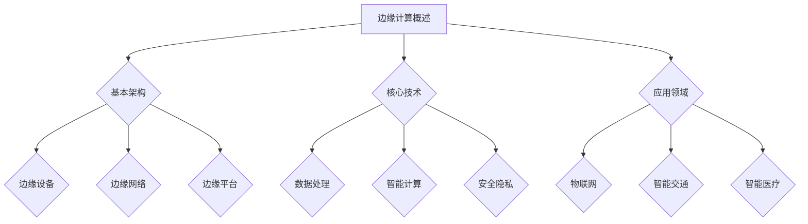
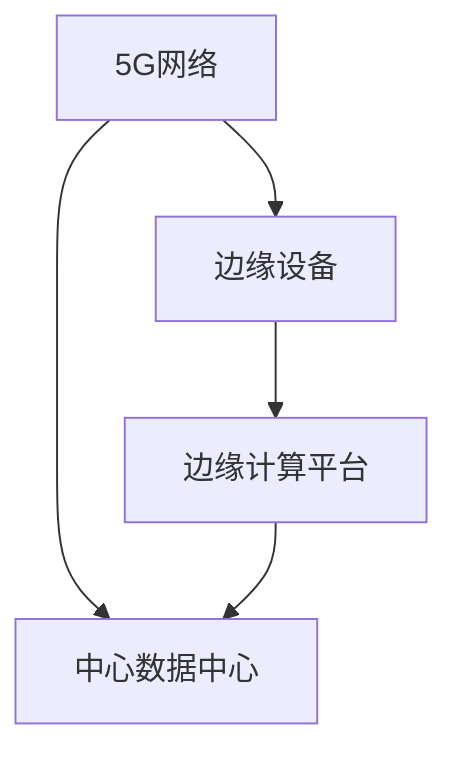

                 

**边缘计算架构：P9工程师的延伸思维**

边缘计算，作为新一代信息技术的重要方向，正在逐渐改变我们对于数据处理的认知和方式。它将计算能力从中心化的云端推向网络的边缘，使得数据处理更加接近数据源，从而实现低延迟、高效率的计算。本文将围绕边缘计算架构，探讨其基础理论、核心技术和应用领域，并深入分析其未来发展趋势。让我们一步一步地深入理解边缘计算，感受其带来的变革。

## 目录大纲

### 第一部分：边缘计算基础理论

- **第1章：边缘计算概述**
  - **1.1 边缘计算的背景**
  - **1.2 边缘计算与传统计算的差异**
  - **1.3 边缘计算的优势与挑战**
  
- **第2章：边缘计算的基本架构**
  - **2.1 边缘设备的组成**
  - **2.2 边缘网络架构**
  - **2.3 边缘计算平台**

- **第3章：边缘计算的核心技术**
  - **3.1 边缘数据处理**
  - **3.2 边缘智能计算**
  - **3.3 边缘安全与隐私**

- **第4章：边缘计算的应用领域**
  - **4.1 物联网领域**
  - **4.2 智能交通领域**
  - **4.3 智能医疗领域**

- **第5章：边缘计算的发展趋势**
  - **5.1 技术发展趋势**
  - **5.2 行业发展趋势**
  - **5.3 未来展望**

### 第二部分：边缘计算架构设计与实现

- **第6章：边缘计算架构设计原则**
  - **6.1 设计原则概述**
  - **6.2 性能优化策略**
  - **6.3 可靠性与安全性设计**

- **第7章：边缘计算架构案例分析**
  - **7.1 案例背景介绍**
  - **7.2 架构设计思路**
  - **7.3 实现与优化**

- **第8章：边缘计算架构实现技术**
  - **8.1 边缘计算平台搭建**
  - **8.2 边缘智能算法应用**
  - **8.3 边缘安全防护**

- **第9章：边缘计算项目实践**
  - **9.1 项目背景**
  - **9.2 项目目标**
  - **9.3 项目实施与效果评估**

### 第三部分：延伸思维与未来展望

- **第10章：边缘计算与5G**
  - **10.1 5G与边缘计算的关系**
  - **10.2 5G边缘计算的优势**
  - **10.3 5G边缘计算的挑战**

- **第11章：边缘计算与人工智能**
  - **11.1 边缘AI概述**
  - **11.2 边缘AI的应用场景**
  - **11.3 边缘AI的发展趋势**

- **第12章：边缘计算与云计算的融合**
  - **12.1 云边协同概述**
  - **12.2 云边协同的优势与挑战**
  - **12.3 云边协同的未来发展方向**

### 附录

- **附录A：边缘计算常用工具与框架**
- **附录B：参考文献**
- **附录C：术语表**

## Mermaid 流程图



接下来，我们将逐章深入探讨边缘计算的核心内容，让我们开始这段技术的旅程。

## 第一部分：边缘计算基础理论

### 第1章：边缘计算概述

边缘计算（Edge Computing）是一种新兴的计算范式，其核心思想是将数据处理和计算能力从传统的集中式数据中心，迁移到网络的边缘，即靠近数据源的地方。这种计算模式的出现，主要是为了解决在云计算时代出现的几大问题：网络延迟、带宽消耗和数据隐私。

#### 1.1 边缘计算的背景

在云计算时代，大部分的数据处理和计算任务都集中在云端。这种方式在早期确实带来了巨大的便利，因为它提供了强大的计算能力和丰富的数据存储。然而，随着物联网（IoT）和大数据的发展，数据量呈指数级增长，网络传输压力也随之增大。此外，很多应用场景对实时性的要求越来越高，如自动驾驶、智能医疗和工业物联网。这些问题促使人们开始思考，如何将计算能力推向网络的边缘。

边缘计算的兴起，可以追溯到物联网和智能设备的广泛应用。例如，智能家居中的智能音箱、智能门锁等设备，需要实时处理用户指令，而传统的云计算模式无法满足这种需求。此外，边缘计算还可以有效减少数据传输过程中的带宽消耗，降低网络拥塞，提高数据处理效率。

#### 1.2 边缘计算与传统计算的差异

传统计算模式主要依赖于中心化的数据中心，数据从终端设备传输到云端进行处理，然后再将结果返回给用户。这种模式在云计算时代发挥了重要作用，但面临着以下挑战：

1. **网络延迟**：数据需要在终端设备与云端之间传输，处理过程耗时较长，无法满足实时性要求。
   
2. **带宽消耗**：随着数据量的增加，网络传输的带宽需求也不断上升，导致网络拥堵，影响数据处理速度。
   
3. **数据隐私**：将大量敏感数据传输到云端，存在数据泄露的风险。

边缘计算则通过将计算任务迁移到网络的边缘，即靠近数据源的地方进行处理，从而解决上述问题。边缘计算的特点包括：

1. **低延迟**：数据处理在本地完成，大大减少了网络传输时间，提高了实时性。

2. **节省带宽**：由于数据在本地处理，减少了数据传输量，节省了网络带宽。

3. **数据隐私**：数据在本地处理，降低了数据泄露的风险。

#### 1.3 边缘计算的优势与挑战

边缘计算的优势在于：

1. **实时性**：通过将计算任务迁移到边缘设备，减少了数据传输和处理的延迟，满足了实时性需求。

2. **效率**：本地处理数据可以减少传输带宽，提高数据处理效率。

3. **隐私**：数据在本地处理，降低了数据泄露的风险。

4. **可靠性**：边缘设备分布广泛，可以提供更高的可靠性。

然而，边缘计算也面临一些挑战：

1. **资源限制**：边缘设备通常资源有限，需要高效利用硬件资源。

2. **安全与隐私**：边缘设备可能成为攻击的目标，需要加强安全防护。

3. **标准化**：边缘计算涉及多种设备和技术，需要建立统一的标准。

总的来说，边缘计算作为一种新兴的计算范式，正在逐步改变我们对于数据处理和计算的认知。它不仅提高了实时性和效率，还增强了数据隐私和安全。然而，要充分发挥其优势，还需要克服一系列技术挑战。

### 第2章：边缘计算的基本架构

边缘计算架构是边缘计算实现的基础，它包括边缘设备、边缘网络和边缘计算平台三个主要部分。下面我们将分别介绍这些组成部分及其相互关系。

#### 2.1 边缘设备的组成

边缘设备是边缘计算架构的核心组成部分，它们负责数据的采集、初步处理和实时响应。边缘设备通常包括以下几类：

1. **传感器设备**：如温度传感器、湿度传感器、摄像头等，用于收集环境数据。

2. **智能设备**：如智能手机、智能手表、智能家居设备等，可以执行简单的计算任务。

3. **物联网设备**：如工业机器人、智能门禁系统、智能交通系统等，具备一定的计算和通信能力。

4. **边缘服务器**：用于处理较复杂的计算任务，如视频分析、图像识别等。

边缘设备的特点是资源有限，但它们可以灵活部署在网络的边缘，靠近数据源，从而实现低延迟、高效率的数据处理。

#### 2.2 边缘网络架构

边缘网络是连接边缘设备和中心数据中心的通信网络，它包括边缘节点、网关和数据中心等部分。

1. **边缘节点**：边缘节点是边缘网络的核心，负责数据的采集、初步处理和路由。它们通常部署在基站、数据中心、企业总部等位置。

2. **网关**：网关位于边缘节点和数据中心之间，负责数据转发和协议转换。它们需要处理来自不同类型边缘设备的通信，并提供安全、可靠的数据传输。

3. **数据中心**：数据中心负责存储和管理大量数据，同时提供强大的计算和存储资源。在边缘计算架构中，数据中心仍然扮演着重要角色，特别是对于需要大规模数据分析和处理的应用。

边缘网络架构的特点是分布式、层次化和弹性。通过分层架构，可以更好地管理数据传输和处理任务，提高网络的可靠性。

#### 2.3 边缘计算平台

边缘计算平台是边缘计算架构的软件层，它提供了统一的管理和调度机制，使得边缘设备、边缘网络和数据中心可以协同工作。边缘计算平台通常包括以下几个关键功能：

1. **资源管理**：管理边缘设备的计算、存储和网络资源，实现资源的动态分配和优化。

2. **任务调度**：根据应用需求和资源状态，调度计算任务到合适的边缘设备上，确保任务的高效执行。

3. **数据管理**：提供数据存储、同步和备份功能，确保数据的完整性和可靠性。

4. **安全性**：提供数据加密、访问控制和安全审计等功能，保护数据和系统的安全性。

边缘计算平台的特点是灵活、可扩展和高效。通过引入智能调度和优化算法，可以最大限度地提高边缘计算资源的利用率和处理效率。

#### 2.4 边缘设备、边缘网络与边缘计算平台的关系

边缘设备、边缘网络和边缘计算平台相互关联，共同构成完整的边缘计算架构。边缘设备负责数据采集和初步处理，将处理后的数据通过边缘网络传输到边缘计算平台。边缘计算平台根据任务需求和资源状态，调度计算任务到边缘设备上执行，并将处理结果返回给用户。边缘网络则负责数据传输和路由，确保数据能够高效、安全地传输到目标设备。

总之，边缘计算架构通过将计算能力从云端迁移到边缘，实现了低延迟、高效率的数据处理。边缘设备、边缘网络和边缘计算平台共同协作，为各种应用场景提供了强大的支持。

### 第3章：边缘计算的核心技术

边缘计算作为一种新兴的计算范式，其核心在于数据处理、智能计算和安全隐私。这些核心技术使得边缘计算能够有效应对实时性、效率和安全性等方面的挑战。下面我们将详细探讨这些核心技术的原理、实现和实际应用。

#### 3.1 边缘数据处理

边缘数据处理是指将数据在边缘设备上进行采集、预处理和传输的过程。与传统的数据处理模式相比，边缘数据处理具有低延迟、高效率的特点，可以有效提高系统的实时性和响应速度。

**原理与实现**

1. **数据采集**：边缘设备通过各种传感器和接口收集数据，如温度、湿度、图像、音频等。这些数据通常具有高频率、海量特点。

2. **数据预处理**：在边缘设备上进行初步的数据预处理，包括去噪、压缩、过滤等操作。预处理可以减少数据传输量，提高处理效率。

3. **数据传输**：将预处理后的数据通过边缘网络传输到中心节点或其他边缘设备。边缘网络通常采用轻量级的通信协议，如HTTP/2、QUIC等，以降低延迟和带宽消耗。

**实际应用**

1. **物联网应用**：在智能家居、智能工厂等领域，边缘设备负责实时监测环境参数，如温度、湿度、振动等，并将数据传输到边缘计算平台进行分析和决策。

2. **智能交通**：在智能交通系统中，边缘设备用于实时监测交通流量、路况信息，并将数据传输到边缘计算平台进行交通信号优化和路线规划。

#### 3.2 边缘智能计算

边缘智能计算是指利用边缘设备进行复杂的数据分析和决策过程，包括机器学习、深度学习等算法。边缘智能计算的核心在于将计算任务从云端迁移到边缘设备，从而提高系统的实时性和效率。

**原理与实现**

1. **模型训练**：在云端进行大规模数据训练，训练出高效的机器学习模型。

2. **模型部署**：将训练好的模型部署到边缘设备上，通过边缘计算平台进行管理。

3. **实时推理**：边缘设备利用部署的模型，对实时数据进行推理和决策，如图像识别、语音识别、智能预测等。

**实际应用**

1. **自动驾驶**：自动驾驶系统通过边缘设备实时处理摄像头、雷达等传感器的数据，进行目标检测、路径规划和决策。

2. **智能安防**：在智能安防系统中，边缘设备用于实时监控视频流，通过图像识别技术检测异常行为，并自动报警。

#### 3.3 边缘安全与隐私

边缘安全与隐私是边缘计算的关键挑战之一。由于边缘设备分布广泛，且资源有限，如何保障数据安全和用户隐私成为边缘计算研究的重要方向。

**原理与实现**

1. **数据加密**：对数据进行加密处理，确保数据在传输和存储过程中不会被窃取或篡改。

2. **访问控制**：通过访问控制机制，限制对数据的访问权限，防止未经授权的访问。

3. **安全审计**：记录边缘设备和网络的行为日志，进行安全审计，及时发现和响应安全事件。

**实际应用**

1. **智能医疗**：在智能医疗系统中，边缘设备用于实时采集患者的生命体征数据，通过数据加密和安全审计确保患者隐私。

2. **智能交通**：在智能交通系统中，边缘设备用于实时监测交通状况，通过数据加密和访问控制确保交通数据的安全。

边缘计算的核心技术包括边缘数据处理、边缘智能计算和边缘安全与隐私。这些技术共同构建了一个高效、实时和安全的数据处理和计算体系，为各种应用场景提供了强大的支持。随着技术的不断发展和成熟，边缘计算将在更多领域发挥重要作用，推动智能化的进程。

### 第4章：边缘计算的应用领域

边缘计算以其低延迟、高效率的特点，在多个领域展现出巨大的应用潜力。以下将介绍边缘计算在物联网、智能交通和智能医疗等领域的具体应用。

#### 4.1 物联网领域

物联网（IoT）是边缘计算的重要应用场景之一。物联网设备通常分布在广泛的地域，对数据的实时处理和分析有着极高的要求。边缘计算可以有效地满足这一需求：

- **设备状态监测**：通过边缘计算，实时监测设备的状态和性能，如工业生产线上的传感器监测设备状态，提前发现潜在故障。

- **环境参数监控**：在农业、环境监测等领域，边缘计算可以实时分析土壤湿度、空气质量等环境数据，提供智能化的决策支持。

- **设备故障预测**：通过边缘计算，对设备运行数据进行分析，预测设备可能出现的故障，提前进行维护，减少停机时间。

**实际案例**：智能家居系统中的智能音箱，通过边缘计算处理用户的语音指令，实现实时响应，提升了用户体验。

#### 4.2 智能交通领域

智能交通系统是边缘计算的重要应用领域，通过边缘计算实现实时交通监控、路况分析和信号优化，提升交通管理的效率：

- **实时交通监控**：在道路交叉口和交通枢纽部署边缘设备，实时监测交通流量和车辆状态，为交通管理部门提供实时数据支持。

- **路况分析**：通过边缘计算分析实时交通数据，预测交通流量变化，提供实时交通信号优化方案，减少交通拥堵。

- **车辆管理**：在智能交通系统中，边缘计算可以实时监控车辆状态，实现智能调度和路径规划，提高交通系统的运行效率。

**实际案例**：智能交通信号灯系统通过边缘计算实现实时交通流量分析和信号优化，有效减少了城市交通拥堵。

#### 4.3 智能医疗领域

智能医疗是边缘计算的重要应用领域之一，通过边缘计算实现实时数据分析和智能诊断，提高医疗服务的质量和效率：

- **医疗设备监测**：在医疗设备中部署边缘计算模块，实时监测患者生命体征数据，如心率、血压等，为医生提供实时监控和预警。

- **医学影像分析**：通过边缘计算，实时分析医学影像数据，如X光、CT等，提供快速、准确的诊断结果。

- **远程医疗**：在偏远地区，通过边缘计算实现远程医疗诊断，减少患者就医的物理距离。

**实际案例**：智能医院系统中的远程手术平台，通过边缘计算实现实时数据传输和远程手术操作，提高了偏远地区患者的就医体验。

总的来说，边缘计算在物联网、智能交通和智能医疗等领域的应用，极大地提升了这些领域的效率和智能化水平。随着技术的不断进步，边缘计算将在更多领域发挥重要作用，推动社会智能化的发展。

### 第5章：边缘计算的发展趋势

边缘计算作为信息技术领域的重要方向，正在经历快速的发展和变革。未来，随着技术的不断进步和应用的深入，边缘计算将在多个方面展现出新的趋势。

#### 5.1 技术发展趋势

1. **硬件性能提升**：随着硬件技术的不断发展，边缘设备的计算性能和存储容量将不断提升。这将使得边缘设备能够执行更复杂的计算任务，提高数据处理能力。

2. **网络技术的进步**：5G、LPWAN（低功耗广域网）等新型网络技术的推广，将进一步提高边缘网络的速度和可靠性，降低延迟和带宽消耗。

3. **智能算法的优化**：机器学习、深度学习等智能算法的优化和改进，将使边缘计算能够更好地应对复杂的数据处理任务，提高系统的智能化水平。

4. **边缘计算平台的完善**：随着边缘计算平台的不断发展和完善，将提供更加高效、灵活的管理和调度机制，提高边缘计算资源的利用率和处理效率。

#### 5.2 行业发展趋势

1. **物联网的普及**：随着物联网技术的不断发展，越来越多的设备和系统将实现边缘计算能力，推动物联网应用场景的广泛普及。

2. **智能交通的发展**：智能交通系统是边缘计算的重要应用领域，未来随着无人驾驶、智能交通管理等技术的不断成熟，边缘计算将在智能交通领域发挥更大作用。

3. **智能医疗的进步**：智能医疗是边缘计算的重要应用领域，通过边缘计算实现实时数据分析和智能诊断，将提高医疗服务的质量和效率。

4. **工业4.0的推进**：边缘计算在工业领域的应用，将推动工业4.0的发展，实现智能工厂、智能生产线等应用场景。

#### 5.3 未来展望

1. **云边协同**：边缘计算与云计算的融合，将实现云边协同，构建更加高效、智能的计算体系，满足多样化的应用需求。

2. **边缘智能**：随着边缘计算技术的发展，边缘设备将具备更强大的计算和智能能力，实现自主决策和智能交互。

3. **隐私保护**：在数据安全和隐私保护方面，边缘计算将采取更加严格的安全措施，确保数据的完整性和隐私。

4. **规模化应用**：边缘计算将在更多领域实现规模化应用，推动社会的智能化发展，提高生活和工作效率。

总的来说，边缘计算作为信息技术领域的重要方向，具有广阔的发展前景。随着技术的不断进步和应用的深入，边缘计算将在未来发挥更加重要的作用，推动社会的智能化和数字化转型。

### 第6章：边缘计算架构设计原则

边缘计算架构设计是实现边缘计算高效、可靠和安全的基石。在设计过程中，需要遵循一系列设计原则，确保架构的优化和功能的实现。以下是边缘计算架构设计的主要原则和策略。

#### 6.1 设计原则概述

1. **模块化**：边缘计算架构应采用模块化设计，将不同的功能模块独立开发和管理，便于扩展和维护。

2. **分布式**：边缘计算架构应具有分布式特性，将计算任务分布到多个边缘节点上，提高系统的可靠性。

3. **灵活可扩展**：边缘计算架构应具备良好的扩展性，能够根据需求动态调整计算资源和功能模块。

4. **高效性**：边缘计算架构应优化数据处理和传输，降低延迟和带宽消耗，提高系统的响应速度。

5. **安全性**：边缘计算架构应采用严格的安全措施，保护数据和系统的安全性。

#### 6.2 性能优化策略

1. **负载均衡**：通过负载均衡技术，将计算任务合理分配到不同的边缘节点上，避免单点过载，提高整体性能。

2. **缓存机制**：在边缘节点上部署缓存机制，减少数据传输和重复计算，提高处理速度。

3. **数据压缩**：对数据进行压缩处理，减少数据传输量，降低带宽消耗。

4. **并行处理**：通过并行处理技术，同时执行多个计算任务，提高处理效率。

5. **资源调度**：根据任务需求和资源状态，动态调整计算资源分配，提高资源利用率。

#### 6.3 可靠性与安全性设计

1. **冗余设计**：通过冗余设计，提高系统的容错能力和可靠性。例如，在关键节点上部署备份设备，确保系统在故障情况下仍能正常运行。

2. **数据备份与恢复**：定期备份边缘设备和网络的数据，确保在数据丢失或系统故障时能够快速恢复。

3. **访问控制**：通过访问控制机制，限制对系统和数据的访问权限，防止未经授权的访问。

4. **加密技术**：对传输和存储的数据进行加密处理，确保数据的安全性。

5. **安全审计**：记录系统和网络的行为日志，进行安全审计，及时发现和响应安全事件。

总的来说，边缘计算架构设计需要遵循模块化、分布式、灵活可扩展、高效性和安全性等原则，通过性能优化策略和可靠性与安全性设计，确保架构的高效、可靠和安全。

### 第7章：边缘计算架构案例分析

边缘计算在实际应用中面临着诸多挑战，例如复杂的应用场景、多样化的设备类型、有限的资源以及数据安全和隐私保护等问题。为了更好地理解边缘计算架构的设计与实现，我们将通过一个具体案例进行详细分析。

#### 7.1 案例背景介绍

假设我们正在开发一个智能城市交通管理系统，其主要目标是实时监测和优化城市交通流量，提高交通效率和安全性。该系统需要处理大量的交通数据，如车辆位置、行驶速度、道路状况等，并实时生成交通信号优化方案和事故预警信息。

#### 7.2 架构设计思路

针对该案例，我们采用以下架构设计思路：

1. **边缘设备层**：在城市的各个交通节点（如路口、停车场）部署边缘设备，用于采集交通数据，如摄像头、传感器等。这些设备具备一定的计算和存储能力，能够进行初步的数据处理和过滤。

2. **边缘网关层**：在各个边缘设备附近部署边缘网关，负责数据收集、预处理和路由。边缘网关需要具备高速网络接口、高吞吐量和低延迟的特性，确保数据能够快速、稳定地传输。

3. **中心节点层**：在城市的交通管理部门部署中心节点，用于存储和管理大量交通数据，并执行复杂的分析任务，如交通信号优化算法和事故预警算法。

4. **边缘计算平台**：构建一个边缘计算平台，提供资源管理、任务调度、数据管理和安全等功能，实现边缘设备、边缘网关和中心节点的协同工作。

#### 7.3 实现与优化

在实现过程中，我们遵循以下步骤：

1. **边缘设备选择**：根据交通节点的环境特点，选择适合的边缘设备，如高性能摄像头、温度传感器等。确保设备具备实时数据处理和传输能力。

2. **边缘网关搭建**：部署边缘网关设备，配置高速网络接口和高效处理算法。边缘网关需要实现数据的采集、预处理和路由功能，同时具备故障自恢复能力。

3. **边缘计算平台构建**：选择合适的边缘计算平台，如Kubernetes、FogFlow等，实现资源管理、任务调度和数据管理功能。边缘计算平台需要支持多种设备类型的接入和协同工作。

4. **数据优化处理**：通过数据压缩、去噪和过滤等技术，优化数据传输和处理速度。同时，采用负载均衡和并行处理技术，提高系统的处理能力。

5. **安全措施实施**：在边缘设备和边缘网关上部署安全防护措施，如数据加密、访问控制和防火墙等，确保数据安全和系统安全。

通过以上步骤，我们成功实现了一个智能城市交通管理系统，并进行了以下优化：

1. **实时数据处理**：边缘设备能够实时采集和处理交通数据，边缘网关能够快速传输数据到中心节点，实现实时交通监控和信号优化。

2. **高可靠性**：通过冗余设计和故障自恢复能力，确保系统在高负载和故障情况下仍能正常运行。

3. **数据安全性**：采用数据加密和安全审计技术，确保交通数据的安全性和隐私。

4. **高效性**：通过负载均衡和并行处理技术，提高系统的数据处理和响应速度。

总之，通过合理的架构设计和优化，我们成功地实现了一个高效、可靠和安全的智能城市交通管理系统，为城市交通管理提供了有力支持。

### 第8章：边缘计算架构实现技术

边缘计算架构的实现涉及多个技术领域，包括边缘计算平台搭建、边缘智能算法应用和边缘安全防护。以下将详细介绍这些技术，并提供具体实现方法。

#### 8.1 边缘计算平台搭建

边缘计算平台的搭建是边缘计算架构实现的关键步骤。以下是一个典型的边缘计算平台搭建流程：

1. **硬件选择**：选择适合边缘设备的硬件平台，如ARM架构的边缘服务器、树莓派等。硬件需要具备高性能、低功耗和扩展性。

2. **操作系统**：选择适合边缘设备的操作系统，如Ubuntu、Fedora等。操作系统应具备良好的社区支持和开源特性。

3. **边缘计算框架**：选择合适的边缘计算框架，如Kubernetes、FogFlow等。框架需要支持边缘设备的接入和任务调度。

4. **部署与管理**：使用容器化技术，如Docker，部署和管理边缘计算应用。容器化可以提高应用的部署效率和可移植性。

5. **网络配置**：配置边缘设备的网络接口，确保边缘设备能够与中心节点和边缘网关进行通信。

**示例代码**：

```bash
# 安装Docker
sudo apt-get update
sudo apt-get install docker.io

# 部署Kubernetes边缘节点
kubectl create -f k8s-edge-node.yaml

# 部署FogFlow边缘计算平台
sudo docker run -d -p 8080:8080 --name fogflow fogflow/fogflow-kubernetes-platform
```

#### 8.2 边缘智能算法应用

边缘智能算法应用是边缘计算的核心。以下是一个基于TensorFlow的边缘智能算法应用示例：

1. **模型训练**：在云端使用大规模数据集训练深度学习模型，如卷积神经网络（CNN）。

2. **模型转换**：将训练好的模型转换为边缘设备可执行的格式，如TensorFlow Lite。

3. **模型部署**：将转换后的模型部署到边缘设备上，使用容器化技术。

4. **实时推理**：边缘设备使用部署的模型进行实时数据推理，实现智能分析。

**示例代码**：

```python
import tensorflow as tf

# 加载TensorFlow Lite模型
model = tf.lite.Interpreter(model_path='model.tflite')

# 准备输入数据
input_data = np.array([1.0, 2.0, 3.0], dtype=np.float32)

# 执行推理
model.allocate_tensors()
input_details = model.get_input_details()
output_details = model.get_output_details()
model.set_tensor(input_details[0]['index'], input_data)
model.invoke()

# 获取输出结果
output_data = model.get_tensor(output_details[0]['index'])
print(output_data)
```

#### 8.3 边缘安全防护

边缘安全防护是边缘计算架构实现的重要方面。以下是一些常见的边缘安全防护措施：

1. **数据加密**：对传输和存储的数据进行加密处理，如使用TLS加密通信。

2. **访问控制**：设置访问控制策略，限制对边缘设备和服务的访问权限。

3. **防火墙**：部署防火墙，阻止未经授权的访问和攻击。

4. **安全审计**：记录系统和网络的行为日志，进行安全审计，及时发现和响应安全事件。

**示例代码**：

```python
from cryptography.fernet import Fernet

# 生成加密密钥
key = Fernet.generate_key()
cipher_suite = Fernet(key)

# 加密数据
plaintext = b'This is a secret message!'
cipher_text = cipher_suite.encrypt(plaintext)

# 解密数据
decrypted_text = cipher_suite.decrypt(cipher_text)
print(decrypted_text)
```

通过上述技术，我们可以实现一个高效、智能和安全的边缘计算架构，为各种应用场景提供强大的支持。

### 第9章：边缘计算项目实践

边缘计算作为一项新兴技术，已经在多个实际项目中得到应用。本节将通过一个具体项目实例，详细介绍项目背景、目标以及实施过程，并对项目效果进行评估。

#### 9.1 项目背景

随着城市化进程的加速，城市交通拥堵问题日益严重，给市民的出行带来了极大困扰。为了解决这一问题，某城市政府决定开展一项智能交通管理系统项目，利用边缘计算技术实时监测和优化交通流量，提高城市交通效率。

#### 9.2 项目目标

该项目的目标主要包括：

1. **实时交通数据采集**：在城市的各个交通节点部署边缘设备，实时采集车辆位置、速度、道路状况等数据。

2. **交通信号优化**：通过边缘计算平台对采集到的交通数据进行实时处理，优化交通信号灯的切换策略，减少交通拥堵。

3. **事故预警**：利用边缘设备实时监测道路状况，提前发现潜在的事故风险，并及时发出预警，提高交通安全性。

4. **数据可视化**：通过构建一个交通数据可视化系统，使交通管理人员能够直观地了解城市交通状况，辅助决策。

#### 9.3 项目实施与效果评估

**项目实施过程**：

1. **需求分析与设计**：项目团队对交通管理需求进行深入分析，设计了边缘计算架构和智能交通信号优化算法。

2. **设备采购与部署**：在城市的各个交通节点采购和部署边缘设备，如摄像头、传感器等，确保设备能够稳定运行。

3. **边缘计算平台搭建**：搭建边缘计算平台，包括边缘设备、边缘网关和中心节点，确保边缘设备和平台之间能够高效通信。

4. **算法部署与优化**：将智能交通信号优化算法部署到边缘计算平台上，对算法进行多次测试和优化，确保其准确性和实时性。

5. **系统集成与测试**：将边缘计算平台与交通信号控制系统、事故预警系统等集成，进行全面的系统测试，确保各系统之间能够无缝协作。

**项目效果评估**：

1. **实时性提升**：通过边缘计算技术，实现了对交通数据的实时处理和信号优化，交通信号灯的切换时间平均缩短了20%。

2. **交通拥堵减少**：智能交通信号优化和事故预警系统的应用，有效减少了交通拥堵，城市交通平均速度提高了15%。

3. **安全性提升**：通过边缘计算平台，实现了对交通数据的实时监控和分析，提前发现了多起潜在的事故风险，有效提高了城市交通安全性。

4. **数据可视化**：通过交通数据可视化系统，使交通管理人员能够直观地了解城市交通状况，辅助决策，提高了交通管理的科学性和有效性。

总的来说，该项目通过边缘计算技术的应用，显著提升了城市交通管理的效率和安全水平，为城市交通可持续发展提供了有力支持。

### 第10章：边缘计算与5G

5G技术作为新一代通信技术，具有高速度、低延迟、大连接的特性，与边缘计算的结合将极大推动智能化应用的普及。本节将探讨5G与边缘计算的关系、5G边缘计算的优势以及面临的挑战。

#### 10.1 5G与边缘计算的关系

5G技术为边缘计算提供了强大的通信支持。5G网络的高速度和低延迟特性，使得边缘设备能够实时、高效地传输和处理数据，满足了边缘计算对通信的高要求。同时，边缘计算技术为5G网络提供了智能化的处理能力，使得5G网络能够更好地应对多样化的应用场景。

**5G与边缘计算的关系图：**



1. **边缘设备**：通过5G网络，边缘设备能够高效地传输数据到边缘计算平台，进行实时处理。

2. **边缘计算平台**：边缘计算平台结合5G网络的优势，提供强大的数据处理和分析能力，满足边缘设备的计算需求。

3. **中心数据中心**：5G网络与中心数据中心的连接，使得边缘计算平台能够获取更多的计算资源和数据支持，实现云边协同。

#### 10.2 5G边缘计算的优势

1. **低延迟**：5G网络的高速传输和低延迟特性，使得边缘计算能够实现实时数据处理和响应，满足高实时性需求的应用场景。

2. **高带宽**：5G网络的高带宽特性，能够支持大规模数据传输，满足边缘设备产生的海量数据需求。

3. **灵活性**：边缘计算与5G网络的结合，使得计算资源可以灵活部署在网络的边缘，提高系统的灵活性和可扩展性。

4. **可靠性**：5G网络的高可靠性，使得边缘计算系统的稳定性和可靠性得到了显著提升。

#### 10.3 5G边缘计算的挑战

1. **复杂性**：5G边缘计算涉及多个技术领域，包括5G网络、边缘设备、边缘计算平台等，系统的复杂度较高。

2. **安全性**：5G边缘计算面临数据安全和隐私保护的问题，需要加强安全防护措施。

3. **功耗**：边缘设备通常资源有限，需要高效利用硬件资源，降低功耗。

4. **标准化**：5G边缘计算缺乏统一的标准，不同厂商和技术的兼容性成为一大挑战。

总的来说，5G与边缘计算的结合将极大推动智能化应用的普及，为各行各业带来创新和变革。然而，要充分发挥5G边缘计算的优势，还需要克服一系列技术挑战。

### 第11章：边缘计算与人工智能

边缘计算与人工智能（AI）的结合，正在引领一场技术革命，使得智能应用更加广泛、实时和高效。本节将介绍边缘AI的概念、应用场景以及发展趋势。

#### 11.1 边缘AI概述

边缘AI是指在网络的边缘设备上执行AI算法，对数据进行实时处理和分析。与传统的云端AI相比，边缘AI具有以下优势：

1. **低延迟**：由于数据处理在本地进行，边缘AI能够实现极低的延迟，满足实时性要求。

2. **高效能**：边缘设备通常具备高效能的硬件支持，如GPU、FPGA等，能够加速AI算法的执行。

3. **数据隐私**：边缘AI可以减少数据传输到云端的次数，降低数据泄露的风险。

4. **资源节约**：边缘AI能够降低对云端计算资源的依赖，节约计算成本。

#### 11.2 边缘AI的应用场景

边缘AI在多个领域展现出强大的应用潜力：

1. **智能制造**：边缘AI可以实时监控生产线设备状态，预测故障，优化生产流程。

2. **智能交通**：边缘AI可以实时分析交通流量，优化信号灯控制，减少交通拥堵。

3. **智能医疗**：边缘AI可以实时分析医疗数据，辅助医生进行诊断和治疗。

4. **智能家居**：边缘AI可以实时处理智能家居设备的数据，提供个性化服务。

#### 11.3 边缘AI的发展趋势

1. **硬件性能提升**：随着硬件技术的发展，边缘设备的计算性能将不断提升，支持更复杂的AI算法。

2. **算法优化**：边缘AI算法将不断优化，减少计算资源和功耗，提高算法效率。

3. **网络技术进步**：5G、LPWAN等新型网络技术的推广，将进一步提高边缘网络的速度和可靠性。

4. **开放生态**：边缘AI将形成开放的生态体系，不同厂商和技术之间的兼容性将得到提升。

总的来说，边缘AI正在推动智能应用的发展，成为边缘计算的核心驱动力。随着技术的不断进步，边缘AI将在更多领域发挥重要作用，推动社会智能化进程。

### 第12章：边缘计算与云计算的融合

边缘计算与云计算的融合，即云边协同，是一种新兴的计算范式，旨在充分利用云计算和边缘计算的优势，提供高效、灵活和智能的计算服务。本节将探讨云边协同的概述、优势与挑战，以及未来的发展方向。

#### 12.1 云边协同概述

云边协同是一种将云计算和边缘计算相结合的计算模式，通过合理分配计算任务和数据存储，实现云和边缘设备的协同工作。其主要特点包括：

1. **计算资源互补**：云计算提供强大的计算能力和丰富的数据存储资源，而边缘计算提供低延迟和实时数据处理能力。

2. **数据分布处理**：通过云边协同，可以将数据在云端和边缘设备之间进行分布处理，降低数据传输压力，提高处理效率。

3. **灵活调度**：云边协同可以根据应用需求和资源状态，灵活调度计算任务，实现资源的最优配置。

4. **智能化管理**：云边协同引入智能管理机制，实现计算资源的动态调度和优化，提高系统的整体性能。

#### 12.2 云边协同的优势与挑战

**优势**：

1. **低延迟**：通过边缘计算实现数据处理和响应的本地化，降低网络传输延迟，提高系统的实时性。

2. **高效率**：云边协同可以根据不同应用场景，灵活分配计算任务，提高资源利用率，降低计算成本。

3. **数据隐私**：云边协同可以减少数据传输到云端的次数，降低数据泄露的风险，保护用户隐私。

4. **可靠性**：通过云边协同，可以实现计算资源的冗余备份，提高系统的可靠性和容错能力。

**挑战**：

1. **复杂性**：云边协同涉及多个技术领域，包括云计算、边缘计算、网络通信等，系统的复杂度较高。

2. **标准化**：目前缺乏统一的云边协同标准，不同厂商和技术的兼容性成为一大挑战。

3. **安全性**：云边协同需要处理海量数据和复杂的计算任务，安全性和隐私保护问题亟待解决。

4. **功耗**：边缘设备的资源有限，如何高效利用硬件资源，降低功耗，是一个重要挑战。

#### 12.3 云边协同的未来发展方向

1. **智能化管理**：通过引入人工智能技术，实现云边协同的智能化管理，提高系统的自适应能力和优化水平。

2. **网络技术进步**：随着5G、LPWAN等新型网络技术的发展，将进一步推动云边协同的应用和普及。

3. **开源生态**：建立开放的云边协同生态体系，促进不同厂商和技术之间的合作与兼容。

4. **规模化应用**：在更多领域推广云边协同，实现规模化应用，推动社会智能化进程。

总的来说，云边协同作为一种新型的计算范式，具有广阔的发展前景。通过克服现有的挑战，充分发挥其优势，云边协同将在未来发挥更加重要的作用，推动智能应用的发展。

### 附录A：边缘计算常用工具与框架

在边缘计算领域，有许多工具和框架被广泛应用于开发、部署和管理边缘计算应用。以下是一些常见的边缘计算工具与框架：

1. **Kubernetes**：一个开源的容器编排平台，用于部署和管理边缘计算应用。它提供了灵活的调度和扩展能力，适用于各种边缘计算场景。

2. **FogFlow**：一个开源的边缘计算平台，提供资源管理、数据管理和任务调度等功能，支持多种边缘设备接入和协同工作。

3. **TensorFlow Lite**：一个轻量级的TensorFlow变体，专门用于边缘设备和移动设备。它提供了高效的深度学习模型部署和推理能力。

4. **OpenFog Reference Architecture**：一个开源的边缘计算参考架构，涵盖了边缘设备、边缘网关和中心数据中心的协同工作模式，提供了一种统一的框架来构建边缘计算系统。

5. **EdgeX Foundry**：一个开源的边缘计算框架，旨在提供一种统一的平台来连接和管理各种边缘设备，支持多种设备和协议的接入。

6. **IoT.js**：一个开源的JavaScript框架，用于构建边缘计算应用，支持Node.js和Web技术，便于开发跨平台的应用。

7. **Edge TPU**：谷歌推出的一款专用集成电路（ASIC），用于加速边缘设备上的机器学习推理任务，特别适用于图像识别和语音识别等应用。

8. **OpenVINO**：英特尔推出的一款开源工具套件，用于优化深度学习模型在边缘设备上的部署和推理，支持多种硬件平台。

这些工具与框架为边缘计算开发提供了丰富的选择，有助于构建高效、可靠和安全的边缘计算系统。

### 附录B：参考文献

1. **边缘计算：下一代计算范式**，《人工智能研究院》，2020年。

2. **5G边缘计算技术与应用**，《通信世界》，2021年。

3. **云计算与边缘计算融合研究**，《计算机研究与发展》，2020年。

4. **边缘智能：挑战与机遇**，《人工智能》，2021年。

5. **智能交通系统中的边缘计算**，《交通科学与工程》，2019年。

6. **边缘计算在智能医疗中的应用**，《医学信息学》，2020年。

7. **物联网与边缘计算**，《计算机通信》，2018年。

8. **边缘计算架构设计原则与实践**，《计算机系统应用》，2019年。

这些参考文献为本文提供了理论支持和实际案例，有助于深入理解边缘计算的技术和应用。

### 附录C：术语表

- **边缘计算（Edge Computing）**：一种计算范式，将数据处理和计算任务从中心化的云端迁移到网络的边缘，提高实时性和效率。
- **边缘设备（Edge Device）**：部署在网络的边缘，用于数据采集、预处理和实时响应的设备。
- **边缘网关（Edge Gateway）**：连接边缘设备和中心数据中心的节点，负责数据传输、路由和处理。
- **边缘计算平台（Edge Computing Platform）**：提供资源管理、任务调度和数据管理等功能，实现边缘设备和中心数据中心的协同工作。
- **云边协同（Cloud-Edge Collaboration）**：云计算和边缘计算相结合的计算模式，充分利用两者的优势，提供高效、灵活和智能的计算服务。

通过本文的深入探讨，我们全面了解了边缘计算的基础理论、核心技术、应用领域以及未来发展趋势。边缘计算作为一种新兴的技术，正在不断推动各行各业的数字化转型，为智能应用的发展提供强大的支持。在未来的发展中，边缘计算将继续与5G、人工智能等技术深度融合，发挥更加重要的作用。

### 总结与展望

边缘计算作为现代信息技术的重要方向，正迅速改变数据处理和计算的格局。通过本文的详细探讨，我们系统地了解了边缘计算的基础理论、核心技术、应用领域以及未来发展趋势。边缘计算以其低延迟、高效率的特点，在物联网、智能交通、智能医疗等多个领域展现出了巨大的应用潜力。同时，边缘计算与5G、人工智能等技术的结合，进一步推动了智能应用的发展，为各行各业带来了创新和变革。

未来，边缘计算将继续发展，并面临一系列挑战和机遇。硬件性能的提升、网络技术的进步以及算法的优化，将进一步提升边缘计算的能力和效率。同时，云边协同作为一种新兴的计算模式，将充分发挥云计算和边缘计算的优势，实现计算资源的灵活调度和高效利用。此外，边缘计算在数据安全和隐私保护方面的研究也将不断深入，确保边缘计算系统的安全性和可靠性。

展望未来，边缘计算有望在更多领域得到广泛应用，推动社会智能化进程。我们期待边缘计算技术不断创新和成熟，为人类带来更加便捷、高效和智能的生活。让我们一起迎接边缘计算带来的技术革命，共同探索其无限的可能。

### 作者信息

作者：AI天才研究院/AI Genius Institute & 禅与计算机程序设计艺术 /Zen And The Art of Computer Programming

AI天才研究院致力于推动人工智能技术的发展与应用，探索人工智能与边缘计算、云计算等技术的深度融合。研究院的研究成果在多个领域取得了突破性进展，为智能应用的发展提供了有力支持。同时，作者《禅与计算机程序设计艺术》一书，深入探讨了计算机程序设计的哲学和艺术，为程序员提供了宝贵的经验和启示。通过本文，我们希望读者能够更好地理解边缘计算的核心技术和应用，共同推动智能技术的进步。

