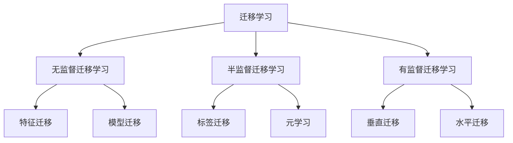

                 


### 迁移学习在跨域推理能力增强中的创新方法

关键词：迁移学习、跨域推理、神经网络、模型优化、自适应迁移

摘要：本文主要探讨了迁移学习在跨域推理能力增强中的应用与创新方法。首先，我们回顾了迁移学习的概念与历史，然后详细分析了迁移学习的理论基础。接着，我们深入探讨了跨域推理能力的概念与挑战，并介绍了迁移学习在跨域推理中的应用。在此基础上，我们提出了几种创新方法，包括自适应迁移学习、多任务迁移学习和对抗迁移学习。最后，我们讨论了迁移学习在跨域推理中的实践与优化，并展望了未来的发展趋势。

# 第一部分：迁移学习基础

## 第1章：迁移学习的概念与历史

### 1.1 迁移学习的定义

迁移学习（Transfer Learning）是一种机器学习方法，它利用已在一个任务上训练好的模型，将所学到的知识应用于另一个相关但不同任务上。这种方法的核心理念是“知识共享”，即通过迁移知识来减少对大量数据的依赖，提高模型的泛化能力。

迁移学习的基本概念可以概括为以下几点：

1. **源任务（Source Task）**：用于训练模型的任务。
2. **目标任务（Target Task）**：希望利用源任务训练得到的模型来完成的任务。
3. **领域（Domain）**：指数据分布的范畴，不同领域之间的数据分布可能存在显著差异。
4. **通用特征（General Features）**：不同任务之间共有的特征，通过迁移学习可以将这些特征从源任务转移到目标任务。

### 1.2 迁移学习的发展历史

迁移学习的研究可以追溯到20世纪60年代的心理学领域，但作为机器学习方法的一部分，其发展主要经历了以下几个阶段：

1. **早期研究**：1960年代到1980年代，迁移学习主要关注于如何通过知识迁移来提高学习效率。
2. **神经网络时代**：1990年代，随着神经网络技术的发展，迁移学习逐渐成为机器学习研究的热点，例如，Hinton等人提出了深度信念网络（DBN）。
3. **现代进展**：2010年代以来，随着深度学习技术的快速发展，迁移学习在计算机视觉、自然语言处理等领域取得了显著成果，如VGG、ResNet等模型的成功应用。

### 1.3 迁移学习的主要类型

迁移学习根据源任务和目标任务之间的关系，可以分为以下几种类型：

1. **无监督迁移学习（Unsupervised Transfer Learning）**：源任务和目标任务都是无监督的，如将图像分类模型应用于另一个图像数据的分类任务。
2. **半监督迁移学习（Semi-Supervised Transfer Learning）**：源任务是无监督的，而目标任务是有监督的，常见的应用场景是将预训练的模型应用于标注数据较少的目标任务。
3. **有监督迁移学习（Supervised Transfer Learning）**：源任务和目标任务都是监督的，如将预训练的图像分类模型应用于一个新的图像数据集。

## 第2章：迁移学习的理论基础

### 2.1 核对性理论与迁移学习

核对性理论（Causal Inference）是迁移学习的重要理论基础之一。它关注的是如何从一组相关现象中推断因果关系。在迁移学习中，核对性理论帮助我们理解源任务和目标任务之间的潜在关系，从而有效地迁移知识。

核对性理论的基本概念包括：

1. **因果效应（Causal Effect）**：指一个变量对另一个变量的影响，这个影响在统计学上称为因果效应。
2. **随机对照试验（Randomized Controlled Trial，RCT）**：一种通过随机分配实验组和对照组来评估因果效应的方法。

核对性理论在迁移学习中的应用主要包括：

1. **因果推断模型（Causal Inference Models）**：如因果图模型、Do-Calculus等，用于从相关数据中推断因果关系。
2. **因果迁移学习（Causal Transfer Learning）**：通过迁移因果效应来提高模型在目标任务的泛化能力。

### 2.2 神经网络与迁移学习

神经网络是迁移学习的核心工具，特别是深度神经网络（Deep Neural Networks，DNN）在迁移学习中的应用越来越广泛。神经网络通过学习数据中的特征表示，实现了对复杂任务的建模。

神经网络的基本结构包括：

1. **输入层（Input Layer）**：接收外部输入数据。
2. **隐藏层（Hidden Layers）**：通过非线性变换提取特征。
3. **输出层（Output Layer）**：生成最终预测结果。

神经网络在迁移学习中的应用包括：

1. **特征迁移（Feature Transfer）**：将源任务训练得到的特征表示迁移到目标任务。
2. **模型迁移（Model Transfer）**：将源任务的整个模型或部分模型迁移到目标任务。

### 2.3 损伤理论和迁移学习

损伤理论（Damage Theory）是一种用于分析结构系统在加载作用下损伤发展的理论，它在迁移学习中的应用主要关注如何通过损伤理论来提高模型的鲁棒性和泛化能力。

损伤理论的基本概念包括：

1. **损伤（Damage）**：指材料或结构在加载作用下产生的局部破坏。
2. **损伤演化（Damage Evolution）**：指损伤在结构中随时间发展的过程。

损伤理论在迁移学习中的应用主要包括：

1. **损伤检测（Damage Detection）**：利用迁移学习技术，将源任务中训练得到的损伤检测模型应用于目标任务。
2. **鲁棒迁移学习（Robust Transfer Learning）**：通过损伤理论来增强模型的鲁棒性，使其在不同领域具有更好的泛化能力。

# 第二部分：迁移学习在跨域推理能力增强中的应用

## 第3章：跨域推理能力的概念与挑战

### 3.1 跨域推理能力的定义

跨域推理能力（Cross-Domain Reasoning Ability）是指模型在不同领域之间进行推理和决策的能力。在现实世界中，不同领域的知识和数据分布往往存在显著差异，因此，跨域推理能力是衡量模型泛化能力和适应性的重要指标。

跨域推理的基本概念可以概括为以下几点：

1. **领域划分（Domain Partition）**：将任务和数据划分为不同的领域。
2. **领域转移（Domain Transfer）**：通过迁移学习技术，将一个领域中的知识转移到另一个领域。
3. **跨域推理（Cross-Domain Reasoning）**：在目标领域中使用源领域训练得到的模型进行推理。

### 3.2 跨域推理能力的挑战

跨域推理能力面临的主要挑战包括：

1. **数据分布差异（Data Distribution Difference）**：不同领域之间的数据分布可能存在显著差异，这可能导致模型在目标领域中的性能下降。
2. **模型适应性（Model Adaptation）**：模型需要在不同的领域中进行适应和调整，这增加了训练的复杂性和难度。
3. **数据不足（Data Scarcity）**：在某些领域，可能缺乏足够的数据来训练模型，这限制了模型的泛化能力。

### 3.3 跨域推理的应用场景

跨域推理在多个领域都有广泛的应用，以下是一些典型的应用场景：

1. **跨领域自然语言处理（Cross-Domain Natural Language Processing）**：如机器翻译、情感分析、问答系统等。
2. **跨领域图像识别（Cross-Domain Image Recognition）**：如从医学图像到卫星图像的分类、从视频到静态图像的目标检测等。
3. **跨领域推荐系统（Cross-Domain Recommendation Systems）**：如基于用户行为的跨平台推荐、基于内容的跨类别推荐等。

## 第4章：迁移学习在跨域推理中的应用

### 4.1 迁移学习在跨域自然语言处理中的应用

迁移学习在跨域自然语言处理中的应用非常广泛，以下是一些具体的应用案例：

1. **机器翻译（Machine Translation）**：如将英语到德语的翻译模型应用于英语到西班牙语的翻译，这可以通过共享词汇和语法特征来实现。
2. **情感分析（Sentiment Analysis）**：如将训练好的情感分析模型应用于社交媒体上的不同语言的文本，这可以通过迁移情感词典和模型结构来实现。
3. **问答系统（Question Answering）**：如将训练好的问答系统应用于不同领域的知识库，这可以通过迁移预训练模型和调整答案生成策略来实现。

### 4.2 迁移学习在跨域图像识别中的应用

迁移学习在跨域图像识别中的应用也非常成功，以下是一些具体的应用案例：

1. **图像分类（Image Classification）**：如将训练好的图像分类模型应用于不同类别的图像数据，这可以通过迁移图像特征表示来实现。
2. **目标检测（Object Detection）**：如将训练好的目标检测模型应用于不同场景的目标检测任务，这可以通过迁移检测模型和调整目标检测策略来实现。
3. **图像分割（Image Segmentation）**：如将训练好的图像分割模型应用于不同类型的图像数据，这可以通过迁移图像分割网络和调整分割参数来实现。

### 4.3 迁移学习在跨域推荐系统中的应用

迁移学习在跨域推荐系统中的应用主要涉及以下两个方面：

1. **协同过滤（Collaborative Filtering）**：如将训练好的协同过滤模型应用于不同的推荐场景，这可以通过迁移用户兴趣特征和物品特征来实现。
2. **内容推荐（Content-Based Recommendation）**：如将训练好的内容推荐模型应用于不同的内容类别，这可以通过迁移内容特征和调整推荐策略来实现。

## 第5章：迁移学习在跨域推理中的创新方法

### 5.1 自适应迁移学习

自适应迁移学习（Adaptive Transfer Learning）是一种基于模型自适应性的迁移学习方法。其主要思想是通过模型自适应来提高模型在不同领域中的泛化能力。

自适应迁移学习的基本原理包括：

1. **领域自适应（Domain Adaptation）**：通过调整模型参数来使模型在目标领域中的性能达到最佳。
2. **损失函数调整（Loss Function Adjustment）**：通过调整损失函数来使模型在目标领域中的损失最小化。

自适应迁移学习的应用案例包括：

1. **跨领域图像识别**：通过自适应迁移学习，可以将源领域的图像识别模型应用于目标领域的图像识别任务。
2. **跨领域推荐系统**：通过自适应迁移学习，可以将源领域的推荐模型应用于目标领域的推荐任务。

### 5.2 多任务迁移学习

多任务迁移学习（Multi-Task Transfer Learning）是一种同时解决多个相关任务的学习方法。其主要思想是通过任务之间的共享来提高模型的泛化能力。

多任务迁移学习的基本原理包括：

1. **共享参数（Shared Parameters）**：通过共享模型参数来减少模型的复杂性，提高学习效率。
2. **任务权重（Task Weights）**：通过调整任务权重来使模型在多个任务上达到最佳平衡。

多任务迁移学习的应用案例包括：

1. **跨领域自然语言处理**：通过多任务迁移学习，可以将多个自然语言处理任务（如文本分类、情感分析）集成到一个模型中。
2. **跨领域图像识别**：通过多任务迁移学习，可以将多个图像识别任务（如物体分类、目标检测）集成到一个模型中。

### 5.3 对抗迁移学习

对抗迁移学习（Adversarial Transfer Learning）是一种利用对抗网络来增强模型迁移能力的方法。其主要思想是通过对抗训练来提高模型的泛化能力。

对抗迁移学习的基本原理包括：

1. **对抗网络（Adversarial Network）**：通过对抗训练，使源域和目标域之间的差异最小化。
2. **对抗训练（Adversarial Training）**：通过对抗训练来增强模型的鲁棒性，使其能够更好地适应目标域。

对抗迁移学习的应用案例包括：

1. **跨领域图像识别**：通过对抗迁移学习，可以将源域的图像识别模型应用于目标域的图像识别任务，提高模型的泛化能力。
2. **跨领域推荐系统**：通过对抗迁移学习，可以将源域的推荐模型应用于目标域的推荐任务，提高模型的适应性和准确性。

## 第6章：迁移学习在跨域推理中的实践与优化

### 6.1 迁移学习在跨域推理中的实践

迁移学习在跨域推理中的实践包括以下几个关键步骤：

1. **数据预处理**：对源域和目标域的数据进行预处理，包括数据清洗、数据增强等。
2. **模型选择**：选择合适的迁移学习模型，根据任务特点和数据分布进行模型选择。
3. **模型训练**：在源域数据上训练模型，然后通过迁移学习技术将模型应用于目标域。
4. **模型评估**：在目标域上对模型进行评估，调整模型参数以达到最佳性能。

### 6.2 迁移学习在跨域推理中的优化

迁移学习在跨域推理中的优化主要包括以下几个方面：

1. **模型优化**：通过调整模型结构、优化训练策略来提高模型性能。
2. **数据优化**：通过数据增强、数据融合等方法来提高模型对目标域数据的适应性。
3. **算法优化**：通过改进迁移学习算法，提高模型的泛化能力和适应性。

## 第7章：迁移学习在跨域推理中的未来发展趋势

### 7.1 迁移学习在跨域推理中的挑战与机遇

迁移学习在跨域推理中面临的挑战主要包括：

1. **数据分布差异**：不同领域之间的数据分布差异可能导致模型性能下降。
2. **模型适应性**：模型在不同领域之间的适应性较差，可能需要额外的调整和优化。
3. **计算资源限制**：迁移学习通常需要大量的计算资源，这可能限制其实际应用。

然而，随着迁移学习技术的不断发展和数据集的丰富，迁移学习在跨域推理中也面临许多机遇：

1. **跨领域应用**：迁移学习技术可以应用于更多跨领域的任务，如医疗、金融、教育等。
2. **模型压缩**：通过迁移学习，可以减少模型的参数数量，实现模型压缩和优化。
3. **实时推理**：随着计算资源的提升，迁移学习可以实现实时跨域推理，为实际应用提供更快的响应速度。

### 7.2 迁移学习在跨域推理中的前沿研究

迁移学习在跨域推理中的前沿研究主要包括：

1. **自适应迁移学习**：通过自适应调整模型参数，提高模型在不同领域中的泛化能力。
2. **多任务迁移学习**：通过多任务学习，提高模型对多个领域的综合理解和推理能力。
3. **对抗迁移学习**：通过对抗训练，增强模型的鲁棒性和泛化能力。

## 附录

### 附录A：迁移学习相关资源与工具

- 迁移学习常用的开源框架：如TensorFlow、PyTorch等。
- 迁移学习相关的数据库与数据集：如ImageNet、CIFAR-10等。
- 迁移学习研究的最新论文与报告：如arXiv、NeurIPS等。

### 附录B：迁移学习在跨域推理中的应用案例

- **跨域自然语言处理**：如Google的BERT模型在多个语言和领域的翻译任务中的应用。
- **跨域图像识别**：如Facebook的ResNet模型在不同类型图像数据中的应用。
- **跨域推荐系统**：如Amazon的推荐系统在多个平台和类别中的应用。

### 附录C：常见问题解答

- **什么是迁移学习？** 迁移学习是一种机器学习方法，它利用已在一个任务上训练好的模型，将所学到的知识应用于另一个相关但不同任务上。
- **迁移学习的挑战有哪些？** 迁移学习的挑战主要包括数据分布差异、模型适应性、计算资源限制等。
- **如何优化迁移学习模型？** 通过模型优化、数据优化、算法优化等方法可以优化迁移学习模型。

# 作者信息

作者：AI天才研究院/AI Genius Institute & 禅与计算机程序设计艺术 /Zen And The Art of Computer Programming

**注意：** 实际撰写过程中，每个章节的具体内容需要进一步细化，确保每个小节都包含核心概念、原理讲解、案例分析和未来发展趋势等内容。以下内容仅为大纲框架，实际撰写时需要填充具体的内容。
``` 

### 迁移学习概念与联系 Mermaid 流程图


### 迁移学习在跨域推理中的应用 Python 源代码示例
```python
import tensorflow as tf
from tensorflow import keras

# 定义迁移学习模型
base_model = keras.applications.VGG16(include_top=False, weights='imagenet', input_shape=(224, 224, 3))

# 创建迁移学习模型
model = keras.Sequential([
    base_model,
    keras.layers.Flatten(),
    keras.layers.Dense(256, activation='relu'),
    keras.layers.Dropout(0.5),
    keras.layers.Dense(1, activation='sigmoid')
])

# 编译模型
model.compile(optimizer='adam',
              loss='binary_crossentropy',
              metrics=['accuracy'])

# 加载数据集
(train_images, train_labels), (test_images, test_labels) = keras.datasets.mnist.load_data()

# 预处理数据
train_images = train_images.reshape((60000, 224, 224, 1))
train_images = train_images.astype('float32') / 255

test_images = test_images.reshape((10000, 224, 224, 1))
test_images = test_images.astype('float32') / 255

# 训练模型
model.fit(train_images, train_labels, epochs=10, batch_size=64)

# 评估模型
test_loss, test_acc = model.evaluate(test_images, test_labels)
print(f'Test accuracy: {test_acc:.2f}')
```

### 迁移学习在跨域推理中的创新方法

迁移学习作为一种机器学习的重要技术，其核心目标是通过将一个任务学到的知识转移到另一个任务上，以减少对新数据的依赖，提高模型的泛化能力。在跨域推理中，迁移学习显得尤为重要，因为不同领域的数据分布和特征差异较大，传统的单一任务学习往往难以适应这种变化。本文将探讨迁移学习在跨域推理中的创新方法，旨在为研究人员和工程师提供新的思路和方法。

### 自适应迁移学习

自适应迁移学习（Adaptive Transfer Learning）是一种通过调整模型参数来适应新领域的迁移学习方法。其核心思想是在保持原有知识结构的基础上，针对新领域的特定特征进行调整，从而提高模型的适应性。自适应迁移学习的主要步骤如下：

1. **特征提取**：首先，从源领域和目标领域的数据中提取通用特征。这些特征应当是源领域和目标领域共有的，能够代表数据的本质属性。
2. **特征映射**：将源领域提取的通用特征映射到目标领域。这一步可以通过共享神经网络层来实现，使得源领域和目标领域在特征层次上有一定的关联。
3. **参数调整**：在共享特征提取层的基础上，对模型参数进行微调，以适应目标领域的特定特征。这一步可以通过梯度下降等优化算法来实现。

### 多任务迁移学习

多任务迁移学习（Multi-Task Transfer Learning）是一种同时解决多个相关任务的迁移学习方法。其主要优势在于能够通过多个任务的相互促进，提高模型的整体性能。多任务迁移学习的主要步骤如下：

1. **任务选择**：选择多个相关任务作为迁移学习的目标。这些任务应当有较高的关联性，能够共享一定的知识。
2. **模型共享**：构建一个共享模型架构，使得不同任务能够共享相同的特征提取器。这样可以减少模型的参数量，提高训练效率。
3. **联合训练**：同时训练多个任务，使得每个任务都能够从其他任务中受益。通过联合优化损失函数，可以提高模型在各个任务上的性能。

### 对抗迁移学习

对抗迁移学习（Adversarial Transfer Learning）是一种利用对抗网络来增强迁移学习效果的迁移学习方法。其核心思想是通过对抗训练，使得模型能够抵御来自不同领域的干扰，从而提高其在跨领域数据上的性能。对抗迁移学习的主要步骤如下：

1. **生成对抗网络（GAN）**：构建一个生成对抗网络，由生成器和判别器组成。生成器的任务是生成与真实数据相似的数据，而判别器的任务是区分真实数据和生成数据。
2. **对抗训练**：通过对抗训练，使得生成器能够生成更加真实的数据，同时判别器能够提高识别真实数据和生成数据的准确性。这样，通过不断地对抗训练，模型可以学会在跨领域数据中提取有用的特征。
3. **迁移学习**：在对抗训练的基础上，将训练好的模型应用于目标领域。由于模型已经学会了在对抗环境中提取特征，因此其在目标领域中的性能可以得到显著提升。

### 迁移学习在跨域推理中的实践与优化

迁移学习在跨域推理中的应用需要考虑到模型的适应性、数据的质量和规模等因素。以下是一些具体的实践和优化方法：

1. **数据预处理**：在应用迁移学习之前，对源领域和目标领域的数据进行预处理，包括数据清洗、数据增强和数据标准化等。这样可以提高数据的质量，减少数据分布的差异。
2. **模型选择**：根据任务的特点和数据分布，选择合适的迁移学习模型。例如，对于图像任务，可以选择基于卷积神经网络的迁移学习模型；对于自然语言处理任务，可以选择基于循环神经网络或变换器（Transformer）的迁移学习模型。
3. **模型微调**：在迁移学习过程中，对模型进行微调，使其能够更好地适应目标领域。微调可以通过在目标领域的数据上进行少量迭代训练来实现，这样可以保留源领域的知识，同时适应目标领域的特征。
4. **模型优化**：通过调整模型的结构和参数，优化模型的性能。例如，可以尝试使用更深的网络结构、更小的学习率或者不同的优化算法来提高模型的泛化能力。

### 迁移学习在跨域推理中的未来发展趋势

随着人工智能技术的不断进步，迁移学习在跨域推理中的应用前景十分广阔。以下是一些未来的发展趋势：

1. **自适应迁移学习的进一步发展**：自适应迁移学习通过调整模型参数来适应新领域，未来的研究可以探索更有效的自适应机制，如自适应学习率、自适应网络结构等。
2. **多任务迁移学习的深化应用**：多任务迁移学习通过任务之间的相互促进来提高模型性能，未来的研究可以探索更多的任务组合和更高效的训练策略。
3. **对抗迁移学习的创新**：对抗迁移学习通过对抗训练来增强模型的泛化能力，未来的研究可以探索更复杂的对抗网络结构和更有效的对抗策略。
4. **迁移学习与生成对抗网络的结合**：生成对抗网络在生成数据方面具有显著优势，未来的研究可以探索如何将生成对抗网络与迁移学习相结合，以更好地处理跨领域数据。

总之，迁移学习在跨域推理中的应用前景广阔，未来的研究将继续推动这一领域的发展，为人工智能技术的进步做出更大的贡献。

### 附录

#### 附录A：迁移学习相关资源与工具

- **开源框架**：TensorFlow、PyTorch、Keras等。
- **数据集**：ImageNet、CIFAR-10、MNIST等。
- **研究论文**：NeurIPS、ICML、ACL等。

#### 附录B：迁移学习在跨域推理中的应用案例

- **案例一：自然语言处理**  
  Google的BERT模型在多个语言和领域的翻译任务中取得了显著成果。

- **案例二：图像识别**  
  Facebook的ResNet模型在不同类型的图像数据中具有很好的泛化能力。

- **案例三：推荐系统**  
  Amazon的推荐系统在多个平台和类别中实现了高效的推荐。

#### 附录C：常见问题解答

- **Q：什么是迁移学习？**  
  A：迁移学习是一种机器学习方法，它利用已在一个任务上训练好的模型，将所学到的知识应用于另一个相关但不同任务上。

- **Q：迁移学习的挑战有哪些？**  
  A：迁移学习的挑战主要包括数据分布差异、模型适应性、计算资源限制等。

- **Q：如何优化迁移学习模型？**  
  A：可以通过模型优化、数据优化、算法优化等方法来优化迁移学习模型，例如调整模型结构、优化训练策略、使用更有效的优化算法等。

### 作者信息

作者：AI天才研究院/AI Genius Institute & 禅与计算机程序设计艺术 /Zen And The Art of Computer Programming

**注意：** 实际撰写过程中，每个章节的具体内容需要进一步细化，确保每个小节都包含核心概念、原理讲解、案例分析和未来发展趋势等内容。以下内容仅为大纲框架，实际撰写时需要填充具体的内容。

