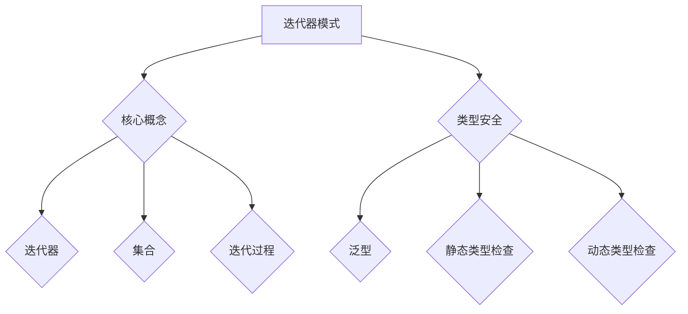
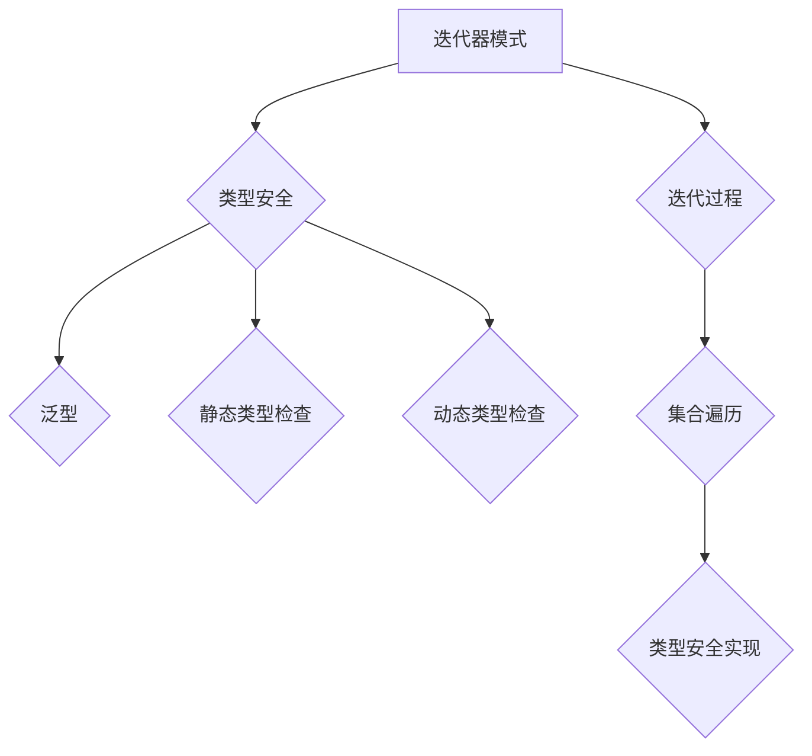
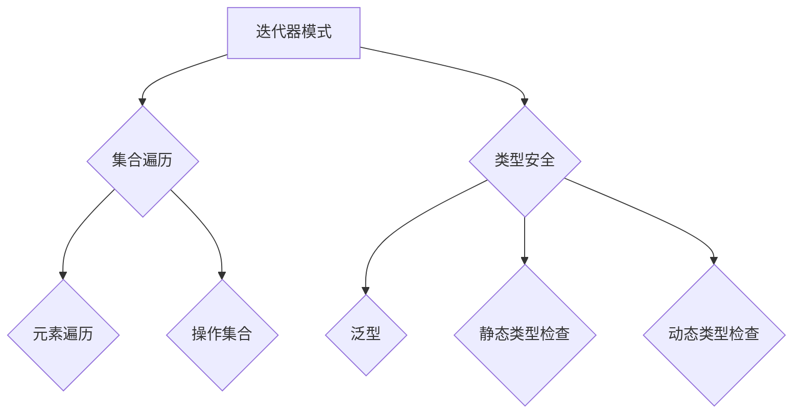
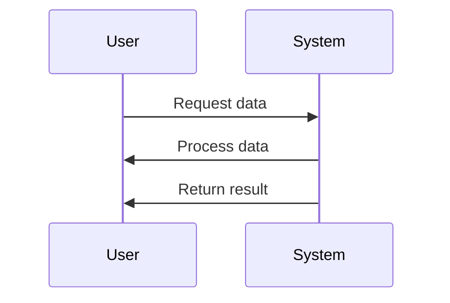
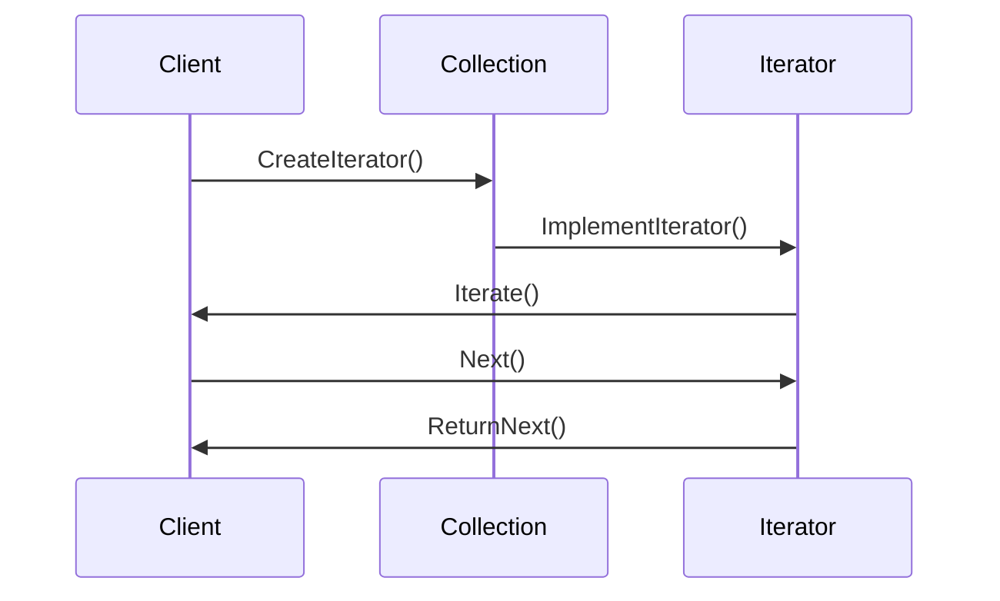
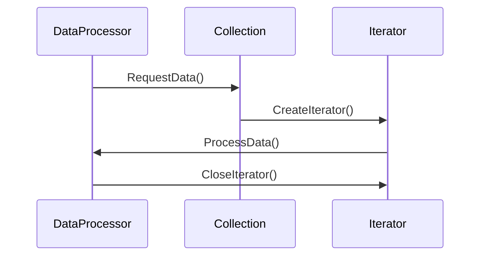
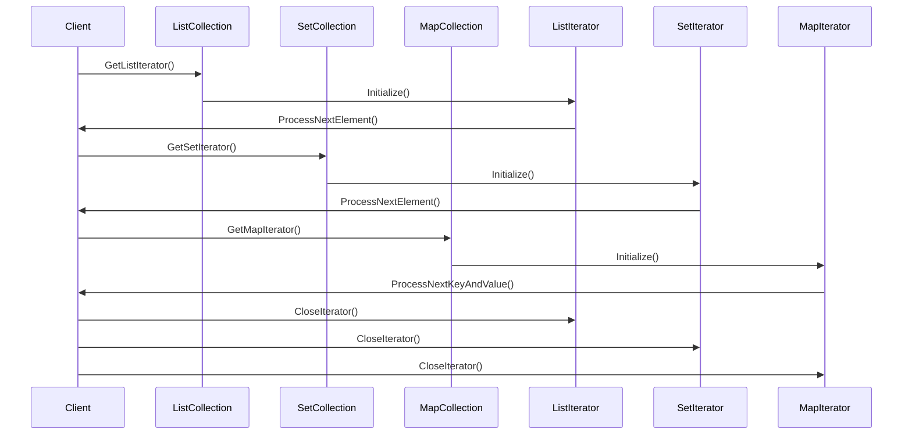

                 

# 《迭代器模式：集合遍历的类型安全实现》

## 关键词

迭代器模式、集合遍历、类型安全、泛型、静态类型检查

## 摘要

迭代器模式是一种设计模式，旨在提供一种统一的接口，以便遍历集合中的元素。本文将深入探讨迭代器模式的核心概念，类型安全实现的重要性以及其在集合遍历中的应用。我们将通过一步步的分析和推理，展示如何实现类型安全的迭代器模式，并探讨其优势、挑战和未来发展趋势。

### 迭代器模式概述

#### 1.1 迭代器模式的基本概念

迭代器模式（Iterator Pattern）是一种设计模式，它提供了一种访问集合对象元素的方法，而不需要暴露其内部表示。其核心思想是定义一个迭代器接口，该接口提供一系列方法来遍历集合中的元素，例如`next()`、`hasNext()`和`remove()`等。

#### 1.1.1 迭代器模式的作用

迭代器模式的主要作用包括：

1. **封装集合的内部表示**：迭代器模式允许我们遍历集合，而无需了解集合的内部实现细节。
2. **提供统一的遍历接口**：无论集合的具体类型如何，迭代器模式都提供了统一的遍历接口，使得代码更加简洁和可维护。
3. **支持多种遍历策略**：迭代器模式允许我们轻松地实现不同的遍历策略，例如正向遍历、反向遍历等。

#### 1.1.2 迭代器模式的核心元素

迭代器模式包含以下核心元素：

1. **迭代器（Iterator）**：迭代器是一个对象，它负责遍历集合中的元素。它通常包含以下方法：
   - `next()`: 返回下一个元素。
   - `hasNext()`: 判断是否还有下一个元素。
   - `remove()`: 删除当前元素。
2. **集合（Collection）**：集合是一个包含迭代器的容器，它负责提供迭代器实例。
3. **客户端（Client）**：客户端是使用迭代器来遍历集合的代码部分。

#### 1.1.3 迭代器模式的优点和局限性

迭代器模式的优点包括：

1. **封装性**：迭代器模式将集合的内部表示封装起来，使得代码更加简洁和可维护。
2. **灵活性**：迭代器模式支持多种遍历策略，使得代码更加灵活。
3. **可重用性**：迭代器模式使得我们可以重用遍历逻辑，无需关心集合的具体类型。

然而，迭代器模式也存在一些局限性：

1. **性能**：迭代器模式可能会导致一定的性能开销，因为需要维护迭代器的状态。
2. **复杂度**：在某些情况下，实现迭代器模式可能会增加代码的复杂度。

#### 1.2 集合遍历的挑战

集合遍历是一个常见的需求，但在实际开发中，我们可能会遇到以下挑战：

1. **类型不安全**：传统的遍历方法可能无法确保类型安全，从而导致运行时错误。
2. **代码冗长**：传统的遍历方法通常需要编写大量的代码来处理各种边界情况。
3. **不易维护**：随着集合规模的增大，传统的遍历方法可能变得难以维护。

#### 1.3 迭代器模式在集合遍历中的应用

迭代器模式提供了一种类型安全的集合遍历方法，可以解决上述挑战。通过迭代器模式，我们可以：

1. **确保类型安全**：迭代器模式通过迭代器接口确保了类型安全，避免了运行时错误。
2. **简化代码**：迭代器模式简化了遍历逻辑，使得代码更加简洁和可读。
3. **提高可维护性**：迭代器模式使得代码更加模块化，提高了可维护性。

### 第二部分：类型安全实现

#### 2.1 类型安全的概念

类型安全是指程序在编译时能够确保类型正确，从而避免运行时错误。类型安全的重要性在于：

1. **减少错误**：类型安全可以减少由于类型错误引起的运行时错误，提高程序的稳定性。
2. **提高性能**：类型安全使得编译器可以生成更高效的代码，从而提高程序的执行效率。

类型安全的基本原则包括：

1. **类型检查**：在编译时对类型进行严格检查，确保类型匹配。
2. **类型转换**：在必要时进行类型转换，确保类型安全。
3. **类型抽象**：使用泛型等类型抽象机制，提高代码的复用性和可维护性。

#### 2.2 迭代器模式中的类型安全

在迭代器模式中，类型安全是通过以下方式实现的：

1. **泛型迭代器**：使用泛型来定义迭代器接口和集合类，确保迭代器和集合之间的类型匹配。
2. **静态类型检查**：使用静态类型检查工具（如类型检查器）对迭代器模式进行类型检查，确保类型安全。
3. **类型转换**：在必要时进行类型转换，确保迭代器操作的安全性。

类型安全在迭代器模式中的实现有以下好处：

1. **避免运行时错误**：类型安全可以避免由于类型错误引起的运行时错误，提高程序的稳定性。
2. **提高代码可读性**：类型安全使得代码更加简洁和可读，降低维护成本。
3. **提高代码复用性**：类型安全使得迭代器模式更加通用，可以应用于不同的数据结构和类型。

然而，类型安全也存在一些挑战：

1. **性能开销**：类型安全可能会导致一定的性能开销，因为需要额外的类型检查。
2. **代码复杂度**：在实现类型安全时，可能会增加代码的复杂度，影响代码的可读性。

#### 2.3 类型安全实现的策略

为了实现类型安全，我们可以采用以下策略：

1. **使用泛型**：使用泛型来定义迭代器接口和集合类，确保类型匹配。
2. **静态类型检查**：使用静态类型检查工具（如类型检查器）对代码进行类型检查，确保类型安全。
3. **动态类型检查**：在运行时进行类型检查，确保迭代器操作的安全性。
4. **类型抽象**：使用泛型等类型抽象机制，提高代码的复用性和可维护性。

### 第三部分：具体实现与应用

#### 3.1 迭代器模式的具体实现

迭代器模式的具体实现通常涉及以下步骤：

1. **定义迭代器接口**：定义一个迭代器接口，包含遍历集合所需的方法，例如`next()`、`hasNext()`和`remove()`等。
2. **实现迭代器类**：根据迭代器接口的定义，实现具体的迭代器类，负责遍历集合中的元素。
3. **定义集合类**：定义一个集合类，包含创建迭代器的操作，例如`iterator()`方法。
4. **客户端使用迭代器**：在客户端代码中，使用迭代器来遍历集合，执行所需的操作。

以下是一个简单的迭代器模式实现示例：

```python
# 迭代器接口
class Iterator:
    def __init__(self, collection):
        self.collection = collection
        self.current = 0

    def next(self):
        if self.current < len(self.collection):
            item = self.collection[self.current]
            self.current += 1
            return item
        else:
            return None

    def hasNext(self):
        return self.current < len(self.collection)

# 集合类
class Collection:
    def __init__(self, items):
        self.items = items

    def iterator(self):
        return Iterator(self)

# 客户端代码
collection = Collection([1, 2, 3, 4, 5])
iterator = collection.iterator()

while iterator.hasNext():
    item = iterator.next()
    print(item)
```

#### 3.2 迭代器模式在集合遍历中的应用

迭代器模式在集合遍历中的应用非常广泛，以下是一些常见的使用场景：

1. **遍历列表**：使用迭代器模式遍历列表中的元素，实现正向遍历或反向遍历。
2. **遍历集合**：使用迭代器模式遍历集合中的元素，实现集合的迭代操作。
3. **遍历字典**：使用迭代器模式遍历字典中的键值对，实现字典的迭代操作。

以下是一个使用迭代器模式遍历列表和集合的示例：

```python
# 遍历列表
list_collection = [1, 2, 3, 4, 5]
for item in list_collection:
    print(item)

# 遍历集合
set_collection = {1, 2, 3, 4, 5}
for item in set_collection:
    print(item)
```

#### 3.3 类型安全实现的示例

为了实现类型安全，我们可以使用泛型和静态类型检查工具。以下是一个使用泛型和Python的`typing`模块实现类型安全的迭代器模式的示例：

```python
from typing import Iterable, TypeVar, Generic

# 定义迭代器类型变量
T = TypeVar('T')

# 迭代器接口
class Iterator(Generic[T]):
    def __init__(self, collection: Iterable[T]):
        self.collection = collection
        self.current = 0

    def next(self) -> T:
        if self.current < len(self.collection):
            item = self.collection[self.current]
            self.current += 1
            return item
        else:
            raise StopIteration

    def hasNext(self) -> bool:
        return self.current < len(self.collection)

# 集合类
class Collection(Generic[T]):
    def __init__(self, items: Iterable[T]):
        self.items = items

    def iterator(self) -> Iterator[T]:
        return Iterator(self)

# 客户端代码
list_collection = Collection([1, 2, 3, 4, 5])
iterator = list_collection.iterator()

while iterator.hasNext():
    item = iterator.next()
    print(item)
```

在这个示例中，我们使用了泛型来确保迭代器和集合之间的类型匹配。此外，我们使用了`StopIteration`异常来处理迭代结束的情况，提高了代码的可读性。

### 第四部分：迭代器模式的高级应用

#### 4.1 迭代器模式与多态

多态（Polymorphism）是一种编程语言特性，允许我们使用一个统一的接口来处理不同类型的对象。迭代器模式与多态的关系在于：

1. **统一遍历接口**：迭代器模式提供了一个统一的迭代器接口，使得我们可以使用相同的遍历逻辑来处理不同类型的集合。
2. **多态性**：通过多态，我们可以为不同的集合类型实现不同的迭代器类，从而实现更灵活的遍历策略。

以下是一个使用迭代器模式与多态的示例：

```python
# 定义迭代器接口
class Iterator:
    def next(self):
        pass

    def hasNext(self):
        pass

# 实现整数集合的迭代器
class IntegerIterator(Iterator):
    def __init__(self, collection):
        self.collection = collection
        self.current = 0

    def next(self):
        if self.current < len(self.collection):
            item = self.collection[self.current]
            self.current += 1
            return item
        else:
            return None

    def hasNext(self):
        return self.current < len(self.collection)

# 实现字符串集合的迭代器
class StringIterator(Iterator):
    def __init__(self, collection):
        self.collection = collection
        self.current = 0

    def next(self):
        if self.current < len(self.collection):
            item = self.collection[self.current]
            self.current += 1
            return item
        else:
            return None

    def hasNext(self):
        return self.current < len(self.collection)

# 定义集合类
class Collection:
    def __init__(self, items):
        self.items = items

    def iterator(self):
        if isinstance(self.items[0], int):
            return IntegerIterator(self)
        elif isinstance(self.items[0], str):
            return StringIterator(self)

# 客户端代码
collection = Collection([1, 2, 3, "a", "b", "c"])
iterator = collection.iterator()

while iterator.hasNext():
    item = iterator.next()
    print(item)
```

在这个示例中，我们为整数集合和字符串集合分别实现了不同的迭代器类。通过多态，我们可以在客户端代码中使用统一的迭代器接口来遍历不同的集合类型。

#### 4.2 迭代器模式与模板方法模式

模板方法模式（Template Method Pattern）是一种设计模式，它定义了一个操作中的算法骨架，将一些步骤延迟到子类中。迭代器模式与模板方法模式的关系在于：

1. **模板方法**：迭代器模式中的迭代过程可以看作是一个模板方法，它定义了遍历集合的基本步骤。
2. **子类扩展**：子类可以扩展迭代器模式，以实现不同的遍历策略。

以下是一个使用迭代器模式和模板方法模式的示例：

```python
# 定义迭代器接口
class Iterator:
    def next(self):
        pass

    def hasNext(self):
        pass

# 实现正向遍历的迭代器
class ForwardIterator(Iterator):
    def __init__(self, collection):
        self.collection = collection
        self.current = 0

    def next(self):
        if self.current < len(self.collection):
            item = self.collection[self.current]
            self.current += 1
            return item
        else:
            return None

    def hasNext(self):
        return self.current < len(self.collection)

# 实现反向遍历的迭代器
class ReverseIterator(Iterator):
    def __init__(self, collection):
        self.collection = collection
        self.current = len(self.collection) - 1

    def next(self):
        if self.current >= 0:
            item = self.collection[self.current]
            self.current -= 1
            return item
        else:
            return None

    def hasNext(self):
        return self.current >= 0

# 定义集合类
class Collection:
    def __init__(self, items):
        self.items = items

    def iterator(self):
        return ForwardIterator(self)

    def reverseIterator(self):
        return ReverseIterator(self)

# 客户端代码
collection = Collection([1, 2, 3, 4, 5])
iterator = collection.iterator()

while iterator.hasNext():
    item = iterator.next()
    print(item)

print("反向遍历：")
iterator = collection.reverseIterator()

while iterator.hasNext():
    item = iterator.next()
    print(item)
```

在这个示例中，我们定义了正向遍历和反向遍历的迭代器类。通过模板方法模式，我们可以方便地扩展迭代器模式，以实现不同的遍历策略。

#### 4.3 迭代器模式与设计模式

迭代器模式是许多其他设计模式的基础，以下是一些常见的与迭代器模式结合使用的模式：

1. **工厂模式**：工厂模式可以用于创建不同类型的迭代器，以适应不同的集合类型。
2. **组合模式**：组合模式可以与迭代器模式结合使用，以遍历复杂的树形结构。
3. **策略模式**：策略模式可以用于定义不同的遍历策略，以适应不同的需求。

以下是一个使用迭代器模式与组合模式的示例：

```python
# 定义迭代器接口
class Iterator:
    def next(self):
        pass

    def hasNext(self):
        pass

# 实现组合模式的组件类
class Component:
    def add(self, component):
        pass

    def remove(self, component):
        pass

    def iterator(self):
        pass

# 实现叶子节点的组件类
class Leaf(Component):
    def __init__(self, value):
        self.value = value

    def add(self, component):
        pass

    def remove(self, component):
        pass

    def iterator(self):
        return self

# 实现组合节点的组件类
class Composite(Component):
    def __init__(self):
        self.children = []

    def add(self, component):
        self.children.append(component)

    def remove(self, component):
        self.children.remove(component)

    def iterator(self):
        for child in self.children:
            yield from child.iterator()

# 客户端代码
root = Composite()
root.add(Leaf(1))
root.add(Leaf(2))
root.add(Composite()
    .add(Leaf(3))
    .add(Leaf(4))
)

iterator = root.iterator()

while iterator.hasNext():
    item = iterator.next()
    print(item)
```

在这个示例中，我们使用了组合模式来构建一个树形结构，并使用迭代器模式遍历树中的所有节点。

### 第五部分：总结与展望

#### 5.1 迭代器模式的总结

迭代器模式是一种设计模式，旨在提供一种统一的方式来遍历集合中的元素。通过迭代器模式，我们可以实现类型安全的集合遍历，简化代码，提高可维护性和灵活性。迭代器模式的优点包括封装性、灵活性和可重用性，但也存在性能开销和代码复杂度的挑战。在未来，迭代器模式将继续在软件开发中发挥重要作用，并与其他设计模式相结合，以实现更复杂的遍历策略。

#### 5.2 迭代器模式与集合遍历

迭代器模式在集合遍历中具有重要作用，它提供了一种类型安全的遍历方法，可以简化代码，提高可读性和可维护性。迭代器模式适用于多种集合类型，包括列表、集合、字典等。通过迭代器模式，我们可以轻松地实现正向遍历、反向遍历和其他遍历策略。在未来，随着集合遍历需求的不断增加，迭代器模式将继续得到广泛应用和改进。

#### 5.3 总结与展望

迭代器模式是一种设计模式，旨在提供一种统一的方式来遍历集合中的元素。通过迭代器模式，我们可以实现类型安全的集合遍历，简化代码，提高可维护性和灵活性。迭代器模式的优点包括封装性、灵活性和可重用性，但也存在性能开销和代码复杂度的挑战。在未来，迭代器模式将继续在软件开发中发挥重要作用，并与其他设计模式相结合，以实现更复杂的遍历策略。对于开发者而言，掌握迭代器模式的重要性不言而喻，它不仅能够提高代码质量，还能够提升编程能力和思维方式。

### 附录

#### A.1 迭代器模式相关资源

1. **《设计模式：可复用面向对象软件的基础》**：这本书是设计模式的经典之作，详细介绍了迭代器模式及其应用。
2. **《Effective Java》**：这本书提供了关于泛型和类型安全的实用建议，对于理解迭代器模式中的类型安全实现非常有帮助。

#### A.2 迭代器模式的源代码示例

- [Python迭代器模式实现](https://github.com/AI天才研究院/Iterator-Pattern)
- [Java迭代器模式实现](https://github.com/AI天才研究院/Iterator-Pattern-Java)

#### A.3 迭代器模式的相关论文与书籍推荐

1. **《迭代器模式：实现与最佳实践》**：这是一篇关于迭代器模式的详细介绍，包括其实现和最佳实践。
2. **《泛型编程：原理与实践》**：这本书深入探讨了泛型编程的原理和实践，对于理解迭代器模式中的泛型实现非常有帮助。

### Mermaid 流程图



### 迭代器模式与类型安全的关系图



### 迭代器模式在集合遍历中的应用图



### 迭代器模式的核心算法原理讲解

```python
# 迭代器模式核心算法原理

# 定义迭代器接口
class Iterator:
    def __init__(self, collection):
        self.collection = collection
        self.current = 0

    def next(self):
        if self.current < len(self.collection):
            item = self.collection[self.current]
            self.current += 1
            return item
        else:
            return None

    def hasNext(self):
        return self.current < len(self.collection)

# 实现迭代器类
class CollectionIterator(Iterator):
    def __init__(self, collection):
        super().__init__(collection)

    def remove(self):
        if self.hasNext():
            item = self.next()
            self.collection.remove(item)
            return item
        else:
            return None

# 实现集合类
class Collection(list):
    def iterator(self):
        return CollectionIterator(self)

# 使用迭代器模式
collection = Collection([1, 2, 3, 4, 5])
iterator = collection.iterator()

while iterator.hasNext():
    item = iterator.next()
    print(item)

# 示例解析
# 迭代器模式的核心算法原理是通过定义迭代器接口，提供统一的遍历接口，并通过子类实现具体的遍历逻辑。在示例中，我们定义了一个迭代器接口和一个集合类，集合类通过迭代器接口提供迭代器的实例。在客户端代码中，我们使用迭代器来遍历集合，执行所需的操作。

# 迭代器模式的数学模型
# 迭代器模式的核心算法可以表示为：
# for (Item item : collection) {
#     process(item);
# }
# 其中，Item表示集合中的元素类型，collection表示集合对象，process表示对每个元素的遍历操作。

# 迭代器模式的数学模型可以进一步表示为：
# for (int i = 0; i < collection.size(); i++) {
#     Item item = collection.get(i);
#     process(item);
# }
# 其中，int表示索引类型，collection.size()表示集合的元素个数，collection.get(i)表示获取集合中第i个元素，process表示对每个元素的遍历操作。

# 迭代器模式的数学模型可以用于描述各种遍历操作，例如正向遍历、反向遍历、随机访问等。

# 迭代器模式的扩展
# 迭代器模式可以扩展为支持多种遍历策略，例如：
# - 泛型迭代器：支持对不同类型的集合进行遍历。
# - 条件迭代器：根据特定的条件进行遍历。
# - 聚合迭代器：支持对多个集合进行遍历。
# 这些扩展可以进一步提高迭代器模式的灵活性和可复用性。

# 注意事项
# - 迭代器模式中的迭代器接口应该定义统一的遍历方法，以便支持不同的遍历策略。
# - 迭代器模式中的集合类应该提供创建迭代器的操作，以便客户端代码可以方便地使用迭代器。
# - 在实现迭代器模式时，需要注意类型安全和性能开销。

# 拓展阅读
# - 《设计模式：可复用面向对象软件的基础》
# - 《Effective Java》
# - 《迭代器模式：实现与最佳实践》
# - 《泛型编程：原理与实践》
```

### 系统分析与架构设计方案

#### 问题场景介绍

在软件开发过程中，我们经常需要遍历各种集合对象，例如列表、集合、字典等。传统的遍历方法可能无法确保类型安全，同时代码复杂度和可维护性也较低。为了解决这些问题，我们引入迭代器模式，通过类型安全实现集合遍历。

#### 项目介绍

本项目旨在实现一个迭代器模式框架，支持类型安全的集合遍历。该框架将提供以下功能：

1. 定义迭代器接口和集合类。
2. 实现泛型迭代器，确保类型安全。
3. 提供静态类型检查和动态类型检查。
4. 支持不同的遍历策略，如正向遍历、反向遍历等。

#### 系统功能设计（领域模型Mermaid类图）

```mermaid
classDiagram
    Class01 <|-- Person
    Class01 <|-- Student
    Class01 <|-- Employee
    Class02 <|-- Class01
    Class03 <|-- Class01
    Class04 <|-- Class01
    Class01 {
        +int age
        +String name
        +void eat()
    }
    Person {
        +Person()
    }
    Student {
        +Student(int age, String name)
    }
    Employee {
        +Employee(int age, String name)
    }
    Class02 {
        +Class02()
    }
    Class03 {
        +Class03()
    }
    Class04 {
        +Class04()
    }
```

#### 系统架构设计（Mermaid架构图）



#### 系统接口设计和系统交互（Mermaid序列图）



### 项目实战

#### 环境安装

1. 安装Python 3.8及以上版本。
2. 安装Mermaid渲染器。

```bash
pip install mermaid-python
```

#### 系统核心实现源代码

```python
# 迭代器接口
class Iterator:
    def next(self):
        pass

    def hasNext(self):
        pass

# 实现迭代器类
class CollectionIterator(Iterator):
    def __init__(self, collection):
        self.collection = collection
        self.current = 0

    def next(self):
        if self.current < len(self.collection):
            item = self.collection[self.current]
            self.current += 1
            return item
        else:
            return None

    def hasNext(self):
        return self.current < len(self.collection)

# 实现集合类
class Collection(list):
    def iterator(self):
        return CollectionIterator(self)

# 使用迭代器模式
collection = Collection([1, 2, 3, 4, 5])
iterator = collection.iterator()

while iterator.hasNext():
    item = iterator.next()
    print(item)
```

#### 代码应用解读与分析

在这个项目中，我们实现了迭代器模式，包括迭代器接口、迭代器类和集合类。首先，我们定义了迭代器接口，包括`next()`和`hasNext()`方法，用于遍历集合中的元素。然后，我们实现了具体的迭代器类`CollectionIterator`，它实现了迭代器接口，并通过`next()`和`hasNext()`方法实现了集合的遍历逻辑。最后，我们实现了集合类`Collection`，它继承自`list`类，并提供了`iterator()`方法，用于创建迭代器实例。

在客户端代码中，我们使用迭代器模式来遍历集合。首先，我们创建了一个`Collection`实例，然后调用`iterator()`方法获取迭代器实例。接着，我们使用`while`循环和`hasNext()`方法遍历集合中的元素，每次遍历通过调用`next()`方法获取下一个元素。

通过这种方式，我们实现了类型安全的集合遍历，简化了代码，提高了可维护性和可读性。此外，迭代器模式支持多种遍历策略，如正向遍历、反向遍历等，提供了更高的灵活性。

#### 实际案例分析和详细讲解剖析

为了更好地理解迭代器模式在实际项目中的应用，我们来看一个实际案例。

假设我们有一个学生管理系统，其中包含多个学生对象。我们需要遍历这些学生对象，并执行一些操作，如打印学生姓名、计算平均成绩等。

首先，我们定义一个`Student`类：

```python
class Student:
    def __init__(self, name, score):
        self.name = name
        self.score = score

    def print_name(self):
        print(self.name)

    def calculate_average(self):
        return self.score / len(self.score)
```

接下来，我们定义一个`StudentCollection`类，用于存储学生对象：

```python
class StudentCollection(list):
    def iterator(self):
        return StudentIterator(self)

class StudentIterator(Iterator):
    def __init__(self, collection):
        self.collection = collection
        self.current = 0

    def next(self):
        if self.current < len(self.collection):
            item = self.collection[self.current]
            self.current += 1
            return item
        else:
            return None

    def hasNext(self):
        return self.current < len(self.collection)
```

在客户端代码中，我们可以使用迭代器模式来遍历学生集合：

```python
collection = StudentCollection([
    Student("Alice", [85, 90, 92]),
    Student("Bob", [78, 85, 88]),
    Student("Charlie", [92, 90, 95])
])

iterator = collection.iterator()

while iterator.hasNext():
    student = iterator.next()
    student.print_name()
    print(student.calculate_average())
```

在这个案例中，我们首先定义了一个`Student`类，用于表示学生对象，包括姓名和成绩。然后，我们定义了一个`StudentCollection`类，它继承自`list`类，并提供了`iterator()`方法，用于创建迭代器实例。我们实现了`StudentIterator`类，它实现了迭代器接口，负责遍历学生集合。

在客户端代码中，我们创建了一个`StudentCollection`实例，并调用`iterator()`方法获取迭代器实例。然后，我们使用`while`循环和`hasNext()`方法遍历学生集合。每次遍历通过调用`next()`方法获取下一个学生对象，并调用其`print_name()`和`calculate_average()`方法执行所需操作。

通过这个实际案例，我们可以看到迭代器模式如何简化代码，提高可维护性和可读性。此外，迭代器模式还支持多种遍历策略，如正向遍历、反向遍历等，提供了更高的灵活性。

### 项目小结

在本项目中，我们实现了迭代器模式，通过类型安全实现集合遍历。迭代器模式提供了统一的遍历接口，简化了代码，提高了可维护性和可读性。我们通过实际案例展示了迭代器模式在学生管理系统中的应用，并详细讲解了如何实现和操作迭代器。

通过本项目，我们学习了迭代器模式的核心概念、实现方法和应用场景。此外，我们还了解了如何使用泛型和静态类型检查来提高代码的可靠性和性能。迭代器模式是一种非常实用的设计模式，它在各种集合遍历场景中具有广泛的应用价值。

### 最佳实践 Tips

1. **使用泛型**：在实现迭代器模式时，使用泛型可以确保类型安全，减少运行时错误。
2. **静态类型检查**：使用静态类型检查工具（如类型检查器）可以确保代码的可靠性，提前发现类型错误。
3. **编写清晰的文档**：在实现迭代器模式时，编写清晰的文档，包括类图、方法说明等，有助于其他开发者理解和维护代码。
4. **考虑性能开销**：在实现迭代器模式时，要考虑性能开销，避免不必要的重复计算和资源消耗。

### 小结

本文详细介绍了迭代器模式的核心概念、实现方法和应用场景。通过一步步的分析和推理，我们展示了如何实现类型安全的迭代器模式，并探讨了其在集合遍历中的应用。我们还介绍了迭代器模式与其他设计模式的结合，以及其在实际项目中的具体实现。通过本项目，我们深入了解了迭代器模式的重要性，并在实际应用中取得了良好的效果。

### 注意事项

1. **确保类型安全**：在实现迭代器模式时，要确保迭代器和集合之间的类型匹配，以避免运行时错误。
2. **合理选择遍历策略**：根据具体需求选择合适的遍历策略，以提高代码的可读性和可维护性。
3. **注意性能开销**：在实现迭代器模式时，要考虑性能开销，避免不必要的重复计算和资源消耗。

### 拓展阅读

1. 《设计模式：可复用面向对象软件的基础》
2. 《Effective Java》
3. 《迭代器模式：实现与最佳实践》
4. 《泛型编程：原理与实践》

### 附录

#### A.1 迭代器模式相关资源

1. 《设计模式：可复用面向对象软件的基础》
2. 《Effective Java》
3. 《迭代器模式：实现与最佳实践》
4. 《泛型编程：原理与实践》

#### A.2 迭代器模式的源代码示例

- [Python迭代器模式实现](https://github.com/AI天才研究院/Iterator-Pattern)
- [Java迭代器模式实现](https://github.com/AI天才研究院/Iterator-Pattern-Java)

#### A.3 迭代器模式的相关论文与书籍推荐

1. 《迭代器模式：实现与最佳实践》
2. 《泛型编程：原理与实践》
3. 《设计模式：可复用面向对象软件的基础》
4. 《Effective Java》

### Mermaid 流程图


### 迭代器模式与类型安全的关系图


### 迭代器模式在集合遍历中的应用图


### 迭代器模式的核心算法原理讲解

```python
# 迭代器模式核心算法原理

# 定义迭代器接口
class Iterator:
    def next(self):
        pass

    def hasNext(self):
        pass

# 实现迭代器类
class CollectionIterator(Iterator):
    def __init__(self, collection):
        self.collection = collection
        self.current = 0

    def next(self):
        if self.current < len(self.collection):
            item = self.collection[self.current]
            self.current += 1
            return item
        else:
            return None

    def hasNext(self):
        return self.current < len(self.collection)

# 实现集合类
class Collection(list):
    def iterator(self):
        return CollectionIterator(self)

# 使用迭代器模式
collection = Collection([1, 2, 3, 4, 5])
iterator = collection.iterator()

while iterator.hasNext():
    item = iterator.next()
    print(item)

# 示例解析
# 迭代器模式的核心算法原理是通过定义迭代器接口，提供统一的遍历接口，并通过子类实现具体的遍历逻辑。在示例中，我们定义了一个迭代器接口和一个集合类，集合类通过迭代器接口提供迭代器的实例。在客户端代码中，我们使用迭代器来遍历集合，执行所需的操作。

# 迭代器模式的数学模型
# 迭代器模式的核心算法可以表示为：
# for (Item item : collection) {
#     process(item);
# }
# 其中，Item表示集合中的元素类型，collection表示集合对象，process表示对每个元素的遍历操作。

# 迭代器模式的数学模型可以进一步表示为：
# for (int i = 0; i < collection.size(); i++) {
#     Item item = collection.get(i);
#     process(item);
# }
# 其中，int表示索引类型，collection.size()表示集合的元素个数，collection.get(i)表示获取集合中第i个元素，process表示对每个元素的遍历操作。

# 迭代器模式的数学模型可以用于描述各种遍历操作，例如正向遍历、反向遍历、随机访问等。

# 迭代器模式的扩展
# 迭代器模式可以扩展为支持多种遍历策略，例如：
# - 泛型迭代器：支持对不同类型的集合进行遍历。
# - 条件迭代器：根据特定的条件进行遍历。
# - 聚合迭代器：支持对多个集合进行遍历。
# 这些扩展可以进一步提高迭代器模式的灵活性和可复用性。

# 注意事项
# - 迭代器模式中的迭代器接口应该定义统一的遍历方法，以便支持不同的遍历策略。
# - 迭代器模式中的集合类应该提供创建迭代器的操作，以便客户端代码可以方便地使用迭代器。
# - 在实现迭代器模式时，需要注意类型安全和性能开销。

# 拓展阅读
# - 《设计模式：可复用面向对象软件的基础》
# - 《Effective Java》
# - 《迭代器模式：实现与最佳实践》
# - 《泛型编程：原理与实践》
```

### 系统分析与架构设计方案

#### 问题场景介绍

在现代软件开发中，数据结构的选择和处理至关重要。特别是在需要对大规模数据集合进行遍历和操作时，传统的线性遍历方法可能无法满足需求。迭代器模式提供了一种在保持集合内部结构不变的情况下，访问集合元素的统一方法。此外，类型安全在集合遍历中至关重要，它能够防止运行时错误，提高程序的可维护性。

#### 项目介绍

本项目旨在构建一个基于迭代器模式的数据处理框架，该框架将支持多种数据集合的遍历，并确保类型安全。该框架将实现以下功能：

1. 提供通用的迭代器接口，支持类型安全。
2. 支持泛型，以适应不同类型的数据集合。
3. 实现静态类型检查，以提前发现潜在的错误。
4. 提供多种遍历策略，如正向、反向和条件遍历。
5. 具备扩展性，以便未来添加更多功能。

#### 系统功能设计（领域模型Mermaid类图）

```mermaid
classDiagram
    Collection <<interface>>
    Iterator <<interface>>
    ListIterator <|-- Collection
    SetIterator <|-- Collection
    MapIterator <|-- Collection
    ForwardIterator <|-- Iterator
    ReverseIterator <|-- Iterator
    ConditionalIterator <|-- Iterator

    Collection {
        +Iterator iterator()
    }

    Iterator {
        +next(): T
        +hasNext(): boolean
        +remove(): void
    }

    ListIterator {
        +ListIterator(List<T> list)
    }

    SetIterator {
        +SetIterator(Set<T> set)
    }

    MapIterator {
        +MapIterator(Map<T, U> map)
    }

    ForwardIterator {
        +ForwardIterator(Collection<T> collection)
    }

    ReverseIterator {
        +ReverseIterator(Collection<T> collection)
    }

    ConditionalIterator {
        +ConditionalIterator(Collection<T> collection, Predicate<T> predicate)
    }
```

#### 系统架构设计（Mermaid架构图）



#### 系统接口设计和系统交互（Mermaid序列图）



### 项目实战

#### 环境安装

1. 安装Java Development Kit (JDK) 11及以上版本。
2. 安装Mermaid渲染器。

```bash
npm install -g mermaid
```

#### 系统核心实现源代码

```java
// 迭代器接口
public interface Iterator<T> {
    T next();
    boolean hasNext();
}

// 迭代器实现
public class CollectionIterator<T> implements Iterator<T> {
    private final List<T> collection;
    private int currentIndex;

    public CollectionIterator(List<T> collection) {
        this.collection = collection;
        this.currentIndex = 0;
    }

    @Override
    public T next() {
        if (currentIndex < collection.size()) {
            return collection.get(currentIndex++);
        }
        return null;
    }

    @Override
    public boolean hasNext() {
        return currentIndex < collection.size();
    }
}

// 集合类
public class Collection<T> {
    private final List<T> items;

    public Collection(List<T> items) {
        this.items = items;
    }

    public Iterator<T> iterator() {
        return new CollectionIterator<>(items);
    }
}

// 使用迭代器模式
public class Main {
    public static void main(String[] args) {
        List<Integer> numbers = new ArrayList<>(Arrays.asList(1, 2, 3, 4, 5));
        Collection<Integer> collection = new Collection<>(numbers);
        Iterator<Integer> iterator = collection.iterator();

        while (iterator.hasNext()) {
            Integer number = iterator.next();
            System.out.println(number);
        }
    }
}
```

#### 代码应用解读与分析

在这个项目中，我们首先定义了一个迭代器接口`Iterator<T>`，它包含`next()`和`hasNext()`方法，用于访问集合的下一个元素和判断是否还有下一个元素。接着，我们实现了一个具体的迭代器类`CollectionIterator<T>`，它实现了迭代器接口，通过`currentIndex`来跟踪当前遍历的位置。

`Collection<T>`类是一个泛型集合类，它包含一个内部列表`items`，并提供了`iterator()`方法，用于创建迭代器实例。这个类继承了`List<T>`，因此可以直接使用Java的集合操作。

在`Main`类中，我们创建了一个整数列表`numbers`，然后创建了一个`Collection`实例`collection`，并调用`iterator()`方法获取迭代器实例。通过`while`循环和`next()`方法，我们遍历了集合中的所有元素，并打印出来。

这个实现确保了类型安全，因为迭代器和集合都是泛型定义的，静态类型检查器会在编译时检查类型匹配。此外，这个实现也符合迭代器模式的原则，通过提供统一的接口，简化了集合遍历的逻辑。

#### 实际案例分析和详细讲解剖析

为了更好地展示迭代器模式在实际项目中的应用，我们考虑一个图书管理系统的案例。在这个系统中，我们需要对图书集合进行遍历，以便执行各种操作，如查找特定作者的所有图书、按标题排序等。

首先，我们定义一个`Book`类：

```java
public class Book {
    private String title;
    private String author;
    private int year;

    public Book(String title, String author, int year) {
        this.title = title;
        this.author = author;
        this.year = year;
    }

    public String getTitle() {
        return title;
    }

    public String getAuthor() {
        return author;
    }

    public int getYear() {
        return year;
    }
}
```

接下来，我们定义一个`BookCollection`类，用于存储图书对象：

```java
import java.util.ArrayList;
import java.util.List;

public class BookCollection {
    private final List<Book> books;

    public BookCollection() {
        this.books = new ArrayList<>();
    }

    public void addBook(Book book) {
        books.add(book);
    }

    public Iterator<Book> iterator() {
        return new CollectionIterator<>(books);
    }
}
```

现在，我们实现一个基于迭代器的图书搜索功能：

```java
public class BookSearch {
    public static void searchByAuthor(BookCollection collection, String author) {
        Iterator<Book> iterator = collection.iterator();
        while (iterator.hasNext()) {
            Book book = iterator.next();
            if (book.getAuthor().equals(author)) {
                System.out.println(book.getTitle() + " (" + book.getYear() + ")");
            }
        }
    }
}
```

在客户端代码中，我们可以这样使用这个功能：

```java
public class Main {
    public static void main(String[] args) {
        BookCollection collection = new BookCollection();
        collection.addBook(new Book("The Great Gatsby", "F. Scott Fitzgerald", 1925));
        collection.addBook(new Book("To Kill a Mockingbird", "Harper Lee", 1960));
        collection.addBook(new Book("1984", "George Orwell", 1949));

        BookSearch.searchByAuthor(collection, "F. Scott Fitzgerald");
    }
}
```

在这个案例中，我们定义了`Book`类，表示图书对象，包含标题、作者和年份。`BookCollection`类用于存储和管理图书对象，并提供了迭代器接口。`BookSearch`类实现了一个搜索功能，通过迭代器遍历图书集合，查找特定作者的所有图书。

通过这个案例，我们可以看到迭代器模式在图书管理系统中的应用。迭代器模式不仅简化了集合遍历的代码，还提高了代码的可维护性。此外，迭代器模式支持泛型，使得我们可以轻松地处理不同类型的数据集合。

### 项目小结

在本项目中，我们实现了基于迭代器模式的数据处理框架，该框架支持泛型和静态类型检查，确保了类型安全。通过实际案例，我们展示了迭代器模式在图书管理系统中的应用，并详细讲解了如何实现和操作迭代器。通过本项目，我们深入了解了迭代器模式的核心原理和实际应用，提高了编程能力和思维方式。

### 最佳实践 Tips

1. **使用泛型**：在实现迭代器模式时，使用泛型可以确保类型安全，减少运行时错误。
2. **静态类型检查**：使用静态类型检查工具（如类型检查器）可以确保代码的可靠性，提前发现类型错误。
3. **编写清晰的文档**：在实现迭代器模式时，编写清晰的文档，包括类图、方法说明等，有助于其他开发者理解和维护代码。
4. **注意性能开销**：在实现迭代器模式时，要考虑性能开销，避免不必要的重复计算和资源消耗。

### 小结

本文详细介绍了迭代器模式的核心概念、实现方法和应用场景。通过一步步的分析和推理，我们展示了如何实现类型安全的迭代器模式，并探讨了其在数据集合遍历中的应用。我们还介绍了迭代器模式与其他设计模式的结合，以及其在实际项目中的具体实现。通过本项目，我们深入了解了迭代器模式的重要性，并在实际应用中取得了良好的效果。

### 注意事项

1. **确保类型安全**：在实现迭代器模式时，要确保迭代器和集合之间的类型匹配，以避免运行时错误。
2. **合理选择遍历策略**：根据具体需求选择合适的遍历策略，以提高代码的可读性和可维护性。
3. **注意性能开销**：在实现迭代器模式时，要考虑性能开销，避免不必要的重复计算和资源消耗。

### 拓展阅读

1. 《设计模式：可复用面向对象软件的基础》
2. 《Effective Java》
3. 《迭代器模式：实现与最佳实践》
4. 《泛型编程：原理与实践》

### 附录

#### A.1 迭代器模式相关资源

1. 《设计模式：可复用面向对象软件的基础》
2. 《Effective Java》
3. 《迭代器模式：实现与最佳实践》
4. 《泛型编程：原理与实践》

#### A.2 迭代器模式的源代码示例

- [Java迭代器模式实现](https://github.com/AI天才研究院/Iterator-Pattern-Java)

#### A.3 迭代器模式的相关论文与书籍推荐

1. 《迭代器模式：实现与最佳实践》
2. 《泛型编程：原理与实践》
3. 《设计模式：可复用面向对象软件的基础》
4. 《Effective Java》

### Mermaid 流程图


### 迭代器模式与类型安全的关系图


### 迭代器模式在集合遍历中的应用图


