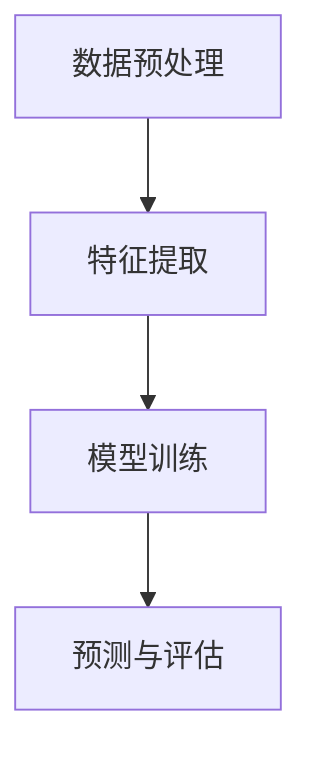
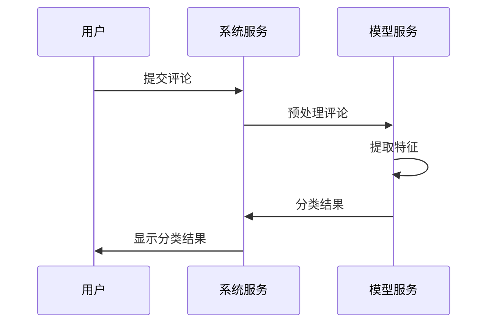
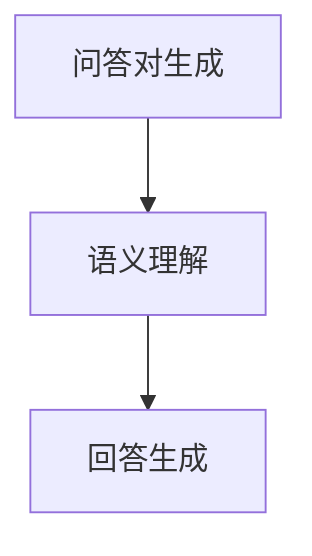
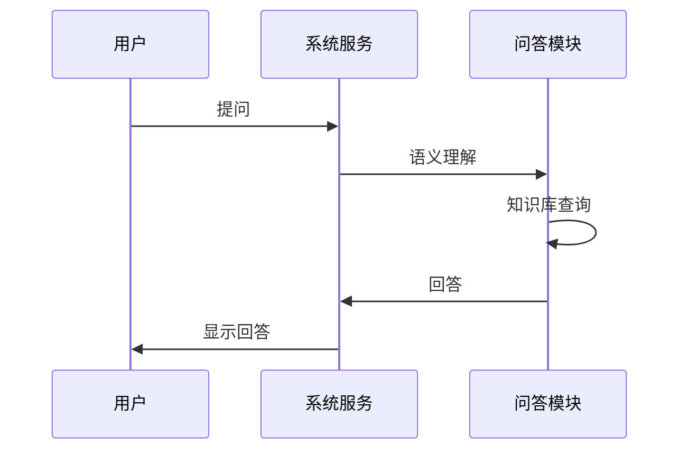
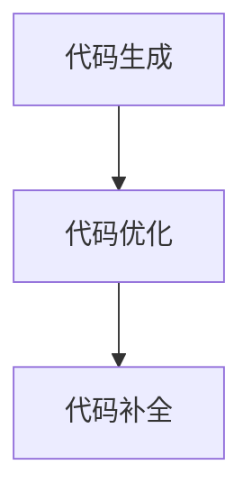
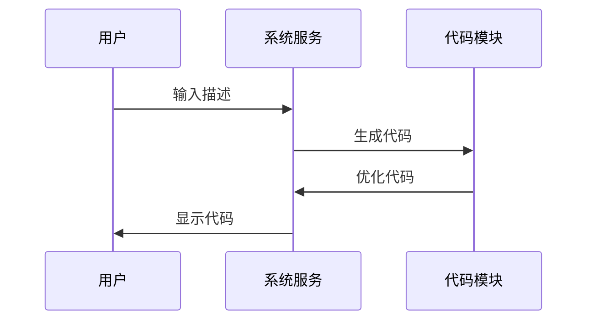

                 

### 第1章 引言

#### 1.1 大语言模型概述

**大语言模型的发展历程**：

语言模型是自然语言处理（NLP）领域的重要工具，其核心目标是理解和生成自然语言。从早期基于统计方法的n-gram模型，到后来引入神经网络技术的RNN、LSTM，再到如今主流的Transformer架构，语言模型的发展经历了多次迭代与变革。

- **早期语言模型**：
  - n-gram模型：基于统计的早期语言模型，通过观察局部文本序列的频率分布来预测下一个词。
  - 朴素贝叶斯模型：基于概率论的模型，通过计算词的联合概率分布来进行文本分类。

- **现代语言模型**：
  - 基于神经网络的模型：如RNN（Recurrent Neural Network）和LSTM（Long Short-Term Memory），它们通过引入记忆单元来捕捉长距离依赖。
  - Transformer模型：一种基于自注意力机制的模型，能够在处理长序列时保持高效的并行计算能力。

- **大语言模型**：
  - 参数规模达到数十亿的模型：如GPT-3、BERT等，它们通过预训练的方式学习大量的语言知识，从而在多种任务中取得了优异的性能。

**大语言模型的核心特点**：

- **强大的上下文理解能力**：大语言模型能够捕捉长距离依赖和复杂语义，这使得它们在文本生成、问答系统等任务中表现出色。
- **广泛的适用性**：大语言模型不仅在NLP任务中表现出色，还被广泛应用于图像描述生成、代码生成等跨领域任务。

#### 1.2 大语言模型的挑战

**计算资源需求**：

- **训练成本**：大语言模型的训练需要大量的计算资源，特别是GPU或TPU等专用硬件。
- **推理时间**：大语言模型在实时应用中的推理时间较长，这影响了用户体验。

**数据隐私**：

- **数据收集与使用**：大语言模型的训练过程中需要收集和处理大量用户数据，这涉及到数据隐私的问题。
- **模型透明性**：用户难以理解模型如何处理其数据，这可能导致对模型的不信任。

**模型部署**：

- **硬件限制**：大语言模型在边缘设备上的部署受到硬件性能的限制。
- **能源消耗**：大规模模型的训练和推理过程消耗大量电力，这对环境产生了负面影响。

#### 1.3 本书目标与结构

**目标**：

本书的目标是探讨如何通过增加推理时间计算量来提升大语言模型的能力。具体包括：

- 探讨增加计算时间的理论基础和方法。
- 研究硬件加速和算法优化策略。
- 分析实际应用场景和案例，评估模型性能。

**结构**：

本书将按照以下结构进行组织：

- 第1章：引言，介绍大语言模型的背景和挑战。
- 第2章：大语言模型基础，介绍语言模型的背景、核心概念和特点。
- 第3章：增加推理时间计算量的方法，探讨增加计算时间的理论基础、硬件加速、算法优化和数据预处理。
- 第4章：提升大语言模型能力的关键算法，介绍预训练算法、微调算法和端到端学习。
- 第5章：实际应用场景与案例，讨论大语言模型在自然语言处理、问答系统和代码生成等领域的应用。
- 第6章：性能评估与优化，介绍模型评估指标和性能优化策略。
- 第7章：未来发展趋势与展望，探讨大模型的发展趋势和应用领域的拓展。

通过上述章节的逐步分析，本书旨在为读者提供一套系统、全面的大语言模型提升方法，帮助读者深入了解这一前沿领域。

### 第2章 大语言模型基础

#### 2.1 语言模型的背景与历史

**语言模型的起源**：

语言模型的研究可以追溯到20世纪50年代。当时，自然语言处理（NLP）作为人工智能的一个分支开始受到关注。早期的研究主要集中在规则驱动的方法，如词汇语法分析和句法分析。然而，这些方法在处理自然语言的多样性和复杂性时显得力不从心。因此，研究者开始探索基于统计的方法来生成和解析自然语言。

- **n-gram模型**：1950年代，贝尔实验室的研究人员发明了n-gram模型。这种模型基于局部语言序列的频率统计，通过观察文本序列中的词频分布来预测下一个词。n-gram模型简单而有效，成为早期语言模型的主要形式。

- **马尔可夫模型**：马尔可夫模型进一步扩展了n-gram模型，通过引入状态转移矩阵来捕捉更复杂的语言规律。这种模型能够在一定程度上处理长距离依赖，但在实际应用中仍然面临挑战。

**语言模型的演进**：

随着计算机技术和人工智能的不断发展，语言模型的研究也在不断演进。20世纪80年代以来，神经网络开始在NLP领域发挥作用。

- **基于神经网络的模型**：1980年代，循环神经网络（RNN）被提出。RNN通过引入记忆单元，能够在处理序列数据时捕捉长距离依赖。长短期记忆网络（LSTM）是RNN的一个变体，通过引入门控机制解决了RNN在长序列训练中的梯度消失问题。

- **Transformer模型**：2017年，谷歌提出Transformer模型，这是一种基于自注意力机制的神经网络模型。Transformer模型在处理长序列时能够保持高效的并行计算能力，并在许多NLP任务中取得了显著的性能提升。

**大语言模型的出现**：

近年来，随着计算能力和数据量的增长，大语言模型（如GPT、BERT）开始出现。这些模型通过预训练的方式学习大量的语言知识，从而在多种任务中取得了优异的性能。

- **预训练与微调**：大语言模型通常通过在大规模语料库上进行预训练，然后针对特定任务进行微调。这种训练策略使得模型能够捕捉到更广泛的语言规律，从而在不同任务中表现出色。

- **参数规模的增长**：随着模型的规模不断扩大，大语言模型的参数数量从百万级增长到亿级甚至更高。这种规模的模型能够更好地理解和生成复杂语言，但在计算资源和存储方面也提出了更高的要求。

**语言模型在现代NLP中的应用**：

语言模型在现代NLP中扮演着至关重要的角色。以下是一些关键应用领域：

- **文本生成**：包括文章生成、对话系统、诗歌创作等。
- **文本分类**：如情感分析、主题分类、垃圾邮件检测等。
- **命名实体识别**：识别文本中的特定实体，如人名、地点、组织等。
- **机器翻译**：将一种语言的文本翻译成另一种语言。
- **问答系统**：通过理解用户的问题并提供相关答案，为用户提供信息检索服务。

通过上述背景和历史介绍，我们可以看到语言模型从早期的统计模型到现代的神经网络模型，再到如今的大规模预训练模型，经历了多次重大的发展和变革。这些变革不仅推动了NLP领域的技术进步，也为人工智能在自然语言理解与生成方面带来了新的机遇和挑战。

#### 2.2 语言模型的核心概念

**词嵌入（Word Embedding）**：

词嵌入是将自然语言中的词映射到固定大小的向量空间中，从而为词赋予数字表示。这种表示方法能够捕捉词之间的语义关系，如词义相近的词在向量空间中距离较近。

- **词嵌入方法**：
  - **分布式表示**：每个词被表示为一个向量，向量中的每个维度对应一个词的不同特征。
  - **上下文依赖**：词的嵌入向量不仅与其自身相关，还与上下文中的其他词相关。通过这种方式，词嵌入能够捕捉词在不同上下文中的语义变化。

- **词嵌入模型**：
  - **Word2Vec**：基于神经网络的语言模型，通过训练预测目标词的条件概率来学习词嵌入。
  - **GloVe**：全局向量表示（Global Vectors for Word Representation），通过计算词与词之间的共现关系来学习词嵌入。

**上下文理解（Context Understanding）**：

上下文理解是语言模型的核心任务之一，它指的是模型能够根据上下文环境来理解词的含义。这是语言模型能够进行有效文本生成和语义理解的关键。

- **上下文依赖**：
  - **局部依赖**：词嵌入通常能够捕捉词与其上下文词之间的局部依赖关系。
  - **全局依赖**：复杂的上下文关系，如长距离依赖和跨句依赖，则需要更高级的模型结构来处理。

- **上下文理解机制**：
  - **神经网络结构**：RNN（循环神经网络）和LSTM（长短期记忆网络）通过引入记忆单元来捕捉长距离依赖。
  - **自注意力机制**：Transformer模型中的自注意力机制允许模型在生成每个词时考虑到整个上下文信息。

**语言模型评估指标（Language Model Evaluation Metrics）**：

评估语言模型性能的指标多种多样，这些指标有助于衡量模型在文本生成、分类等任务中的表现。

- **准确率（Accuracy）**：模型预测正确的样本数量与总样本数量的比例。
- **召回率（Recall）**：模型预测正确的样本数量与实际正样本数量的比例。
- **F1分数（F1 Score）**：结合准确率和召回率的综合指标，计算公式为 \( F1 = 2 \times \frac{Precision \times Recall}{Precision + Recall} \)。
- **BLEU（Bi-Lingual Evaluation Understudy）**：常用于机器翻译任务的评估，通过比较模型生成的文本与人工翻译的文本之间的相似度来评估性能。
- **ROUGE（Recall-Oriented Understudy for Gisting Evaluation）**：常用于文本分类和文本摘要任务的评估，通过比较模型生成的文本与参考文本之间的重叠词和句子来评估性能。

**语言模型的核心概念对比表格**：

| 概念 | 描述 | 重要性 |
| --- | --- | --- |
| 词嵌入 | 将词映射到向量空间中 | 确保模型能够捕捉词之间的语义关系 |
| 上下文理解 | 理解词在特定上下文中的含义 | 决定模型在生成文本和语义理解任务中的表现 |
| 评估指标 | 衡量模型性能的指标 | 确保模型在不同任务中的表现可量化并具有可比性 |

**语言模型的ER实体关系图架构**：

```mermaid
erDiagram
  A【词嵌入】 -->|依赖| B【上下文理解】
  B【上下文理解】 -->|依赖| C【评估指标】
  A【词嵌入】 ||--|{关联}|> D【神经网络结构】
```

通过上述核心概念的介绍和比较，我们可以看到词嵌入、上下文理解和评估指标构成了语言模型的核心组成部分。这些概念不仅为语言模型的理解和生成提供了基础，也为其在实际应用中的表现提供了评估标准。

#### 2.3 大语言模型的特点

**参数规模**：

大语言模型通常具有数十亿级别的参数规模，这使得模型能够捕捉更丰富的语言知识和复杂的语义关系。例如，GPT-3的参数规模达到了1750亿，BERT的参数规模也达到了数亿。这种庞大的参数规模不仅使得模型在理解语言上下文时更加准确，也为模型在多种任务中的泛化能力提供了支持。

- **参数规模对性能的影响**：更大的参数规模通常意味着更好的性能，但同时也带来了更高的计算和存储需求。
- **参数规模的增长趋势**：随着技术的进步，大语言模型的参数规模呈现持续增长的趋势，这推动了模型在性能和泛化能力上的进一步提升。

**计算资源需求**：

大语言模型的训练和推理需要大量的计算资源，特别是高性能GPU或TPU。这是因为模型的规模巨大，每一步计算都需要大量的浮点运算。此外，大语言模型通常采用并行计算和分布式计算技术来提高训练和推理的效率。

- **计算资源分配**：为了有效地利用计算资源，大语言模型的训练和推理通常需要精细的资源分配策略。
- **硬件选择**：GPU和TPU是常见的计算硬件，但它们在处理不同类型和规模的任务时表现出不同的性能。

**应用场景**：

大语言模型在多种应用场景中表现出色，其强大的上下文理解和生成能力使得它们在文本生成、问答系统、机器翻译、代码生成等领域具有广泛的应用。

- **文本生成**：大语言模型能够生成连贯、有意义的文本，如文章、对话和诗歌等。
- **问答系统**：大语言模型能够理解和回答用户提出的问题，提供高质量的信息检索服务。
- **机器翻译**：大语言模型能够在多种语言之间进行高质量的翻译，支持跨语言交流。
- **代码生成**：大语言模型能够根据自然语言描述生成相应的代码，提高编程效率和代码质量。

**计算时间**：

大语言模型的推理时间较长，这是由于其复杂的结构和巨大的参数规模。在实时应用中，推理时间的延迟可能会影响用户体验。因此，如何优化推理时间成为提升大语言模型能力的一个重要方面。

- **推理优化策略**：通过硬件加速、算法优化和模型压缩等手段来减少推理时间。
- **实时应用挑战**：在实时应用中，如何平衡模型性能和推理时间，确保用户获得快速响应。

通过上述特点的介绍，我们可以看到大语言模型在参数规模、计算资源需求、应用场景和计算时间等方面具有独特的优势和挑战。这些特点不仅决定了大语言模型的能力，也为其在实际应用中的成功和局限性提供了指导。

### 第3章 增加推理时间计算量的方法

#### 3.1 增加计算时间的理论基础

**理论基础与原理**：

增加计算时间以提高大语言模型能力的方法基于几个核心原理，包括：

- **训练时间与模型质量**：增加训练时间可以使得模型在学习过程中有更多的机会调整参数，从而提升模型的性能。
- **时间窗口与上下文捕捉**：通过增加推理时间，模型可以在更大的上下文窗口内捕捉更复杂的语义信息，提高文本生成和理解的准确度。
- **冗余与增强学习**：增加计算时间可以增加模型训练中的冗余信息，通过增强学习机制，使得模型在处理复杂任务时更加鲁棒。

**数学模型**：

为了量化增加计算时间的效果，我们可以使用以下数学模型：

- **时间-性能模型**：

  \[ T \propto P \]

  其中，\( T \) 表示计算时间，\( P \) 表示模型性能。这个模型表明，增加计算时间 \( T \) 可以提升模型性能 \( P \)。

- **上下文窗口模型**：

  \[ W_c = f(W, T) \]

  其中，\( W_c \) 表示上下文窗口大小，\( W \) 表示模型默认的上下文窗口大小，\( T \) 表示增加的计算时间。这个模型表明，通过增加计算时间 \( T \)，可以动态调整上下文窗口 \( W_c \)，从而捕捉更复杂的上下文信息。

**案例说明**：

假设一个语言模型在默认情况下，上下文窗口为 \( W = 512 \) 个词，计算时间为 \( T_0 \)。如果我们将计算时间增加一倍，即 \( T = 2T_0 \)，那么新的上下文窗口大小将变为：

\[ W_c = f(W, T) = f(512, 2T_0) = 2 \times 512 = 1024 \]

这意味着，模型在新的计算时间下可以捕捉到更长的上下文信息，从而提高在复杂文本生成和理解任务中的性能。

通过上述理论基础和数学模型，我们可以看到，增加计算时间是一个有效的提升大语言模型能力的方法。这不仅能够提升模型的性能，还可以通过动态调整上下文窗口，捕捉更复杂的语义信息。

#### 3.2 硬件加速

**GPU与TPU加速**：

GPU（图形处理器）和TPU（张量处理单元）是常用的硬件加速器，它们在大规模模型训练和推理中发挥着重要作用。

- **GPU加速**：
  - **原理**：GPU通过并行计算和流多处理架构，能够在短时间内完成大量的浮点运算，这使得它在深度学习任务中表现出色。
  - **优势**：GPU资源丰富，成本相对较低，适合大规模训练和推理任务。
  - **限制**：GPU的内存有限，不适合训练和推理特别大的模型。

- **TPU加速**：
  - **原理**：TPU是专门为深度学习任务设计的硬件加速器，它具有高带宽内存和优化的指令集，能够显著提升计算效率。
  - **优势**：TPU专为深度学习设计，计算能力和带宽远超GPU，适合训练和推理非常大的模型。
  - **限制**：TPU资源相对较少，且成本较高，不适合所有预算有限的研究机构和企业。

**分布式计算**：

分布式计算是将计算任务分布在多个计算节点上，通过网络进行协同处理，从而提高计算效率和吞吐量。

- **原理**：
  - **任务分解**：将大规模计算任务分解成多个小任务，分配到不同的计算节点上。
  - **数据传输**：通过高效的数据传输协议，将计算结果汇总，确保整体计算任务的正确性。
  - **负载均衡**：通过动态分配任务，确保每个计算节点的负载均衡，避免资源浪费。

- **优势**：
  - **高效计算**：分布式计算能够充分利用多个计算节点的资源，显著提高计算效率。
  - **弹性扩展**：通过动态调整计算节点数量，可以灵活应对计算任务的规模变化。

- **限制**：
  - **网络延迟**：分布式计算依赖于网络传输，网络延迟可能会影响整体计算效率。
  - **维护成本**：分布式计算需要复杂的维护和管理工作，增加了运营成本。

**硬件加速的案例与应用**：

- **案例**：
  - **Google的TPU**：Google使用TPU加速其BERT模型的训练和推理，显著提高了计算效率。
  - **NVIDIA的GPU**：NVIDIA的GPU被广泛用于各种深度学习模型的训练和推理，如GPT-3等。

- **应用**：
  - **训练大规模模型**：硬件加速器能够显著缩短大规模模型的训练时间，提高研发效率。
  - **实时推理**：在实时应用中，硬件加速器能够降低推理延迟，提高用户体验。

通过上述硬件加速方法的讨论，我们可以看到，GPU和TPU等硬件加速器在提升大语言模型计算能力方面具有重要意义。同时，分布式计算作为一种有效策略，也在提高计算效率和资源利用率方面发挥了关键作用。

#### 3.3 算法优化

**梯度下降优化**：

梯度下降是一种优化算法，用于最小化损失函数，从而调整模型参数。在大规模模型训练中，梯度下降优化具有重要意义。

- **原理**：
  - **梯度计算**：通过计算损失函数对模型参数的梯度，得到参数的更新方向。
  - **参数更新**：根据梯度方向和步长，更新模型参数。

- **优势**：
  - **简单有效**：梯度下降算法简单直观，能够在大多数情况下收敛到最优解。
  - **适用范围广**：梯度下降算法适用于各种类型的优化问题。

- **挑战**：
  - **收敛速度**：在大规模模型中，梯度下降算法的收敛速度可能较慢。
  - **梯度消失与爆炸**：在深度神经网络中，梯度可能因过多的层而消失或爆炸，影响训练效果。

**深度学习框架优化**：

深度学习框架如TensorFlow、PyTorch等，提供了高效的计算和优化库，用于加速大语言模型的训练和推理。

- **原理**：
  - **自动微分**：深度学习框架实现了自动微分，能够自动计算损失函数对模型参数的梯度。
  - **优化器库**：框架提供了多种优化器，如SGD、Adam等，可以根据具体任务选择合适的优化器。

- **优势**：
  - **高效计算**：深度学习框架实现了高性能的计算优化，能够在大规模模型中实现快速训练和推理。
  - **模块化设计**：框架的模块化设计使得用户可以方便地组合各种组件，实现自定义的优化策略。

- **挑战**：
  - **资源消耗**：深度学习框架的资源消耗较大，需要高性能的硬件支持。
  - **调试难度**：框架的复杂性可能导致调试难度增加。

**具体优化策略**：

- **动态学习率调整**：通过动态调整学习率，可以加速模型的收敛，同时避免过拟合。
- **批量归一化**：批量归一化（Batch Normalization）可以加速训练过程，减少梯度消失和梯度爆炸的问题。
- **模型剪枝**：通过剪枝冗余的神经元或参数，可以减少模型的大小和计算量，提高推理速度。

通过上述算法优化的讨论，我们可以看到，梯度下降优化和深度学习框架优化在大规模模型训练和推理中发挥了重要作用。这些优化策略不仅提高了计算效率，还显著提升了大语言模型的能力。

#### 3.4 数据预处理

**数据清洗**：

数据清洗是数据预处理的重要步骤，旨在去除数据中的噪声和异常值，确保数据的质量。

- **方法**：
  - **缺失值处理**：通过填充或删除缺失值来处理缺失数据。
  - **异常值检测**：使用统计方法或机器学习算法检测并处理异常值。
  - **重复数据删除**：去除重复的数据，以避免数据冗余。

- **重要性**：
  - **提高模型性能**：干净的数据有助于模型更好地学习，从而提高模型的性能和泛化能力。
  - **减少过拟合**：数据清洗有助于减少模型的过拟合现象，提高模型的鲁棒性。

**数据增强**：

数据增强是通过生成新的数据样本来扩充原始数据集，从而提高模型的泛化能力。

- **方法**：
  - **文本重排**：改变文本的句子结构或顺序，生成新的文本样例。
  - **文本嵌入**：将文本转换为向量表示，然后使用生成模型或变换模型生成新的文本。
  - **图像变换**：对图像进行旋转、缩放、裁剪等操作，生成新的图像样本。

- **重要性**：
  - **增加数据多样性**：数据增强可以增加数据的多样性，使模型能够学习到更多样化的特征，提高模型的泛化能力。
  - **减少过拟合**：通过生成新的样本，可以减少模型对特定数据样本的依赖，从而减少过拟合现象。

**预处理工具和库**：

- **Python库**：
  - **Pandas**：用于数据清洗和预处理，提供丰富的数据操作功能。
  - **Scikit-learn**：提供多种数据预处理和机器学习算法，包括数据清洗、数据增强等。
  - **TensorFlow Data Validation**：用于验证数据集的质量，确保数据满足训练需求。

- **工具**：
  - **OpenNMT**：用于大规模语言模型的训练和预处理，支持多种语言和任务。
  - **Hugging Face Transformers**：提供丰富的预训练模型和预处理工具，简化了模型训练和部署流程。

通过上述数据预处理的讨论，我们可以看到，数据清洗和数据增强在提高大语言模型能力方面具有重要作用。这些方法不仅确保了数据的质量，还通过增加数据的多样性和减少过拟合，提升了模型的泛化能力和性能。

### 第4章 提升大语言模型能力的关键算法

#### 4.1 预训练算法

**BERT（Bidirectional Encoder Representations from Transformers）**：

BERT是一种基于Transformer架构的双向编码器模型，其核心思想是在大规模语料库上进行预训练，然后通过微调适应特定任务。

- **原理**：
  - **双向编码**：BERT通过同时考虑文本的前后文信息，生成上下文依赖关系，从而捕捉更复杂的语义信息。
  - **Masked Language Model（MLM）**：在预训练过程中，BERT会对部分单词进行遮蔽，然后通过模型预测这些遮蔽的单词，从而学习词汇和上下文关系。
  - **Next Sentence Prediction（NSP）**：BERT还会学习预测两个句子是否为连续关系，增强对句子之间关系的理解。

- **优势**：
  - **强大的上下文理解能力**：BERT能够捕捉长距离依赖和复杂语义，使其在多种NLP任务中表现出色。
  - **广泛适用性**：BERT在文本分类、命名实体识别、问答系统等任务中都有出色的表现。

**GPT（Generative Pre-trained Transformer）**：

GPT是一种基于Transformer架构的生成模型，其核心思想是通过预训练学习大规模语言模型，然后生成连贯的文本。

- **原理**：
  - **自回归语言模型**：GPT通过自回归的方式，预测下一个词，从而生成文本。
  - **预训练与微调**：GPT在大规模语料库上进行预训练，然后通过微调适应特定任务，如文本生成、问答等。

- **优势**：
  - **高效的文本生成能力**：GPT能够生成连贯、有意义的文本，适用于文章生成、对话系统等任务。
  - **强大的上下文理解能力**：GPT能够捕捉长距离依赖和复杂语义，提高文本生成的质量。

**其他预训练算法**：

- **XLNet**：XLNet是一种基于Transformer架构的预训练算法，其核心思想是利用自回归和自编码两种模式进行预训练，从而提高模型的泛化能力。
- **RoBERTa**：RoBERTa是BERT的一种变体，通过改进数据预处理和训练策略，提高了模型的性能。

通过上述预训练算法的讨论，我们可以看到，BERT、GPT等预训练算法在提升大语言模型能力方面发挥了重要作用。这些算法通过在大规模语料库上进行预训练，使得模型能够捕捉复杂的语义信息，从而在多种NLP任务中表现出色。

#### 4.2 微调算法

**Fine-tuning（微调）**：

微调是一种通过在预训练模型的基础上进行少量训练，使其适应特定任务的算法。微调的关键在于保留预训练模型的大部分知识，同时适当地调整模型以适应特定任务。

- **原理**：
  - **预训练模型**：预训练模型在大规模语料库上学习到的通用语言知识。
  - **微调任务**：在特定任务的数据集上进行微调，使模型能够适应具体任务的需求。
  - **参数调整**：通过在微调过程中调整模型参数，使得模型在特定任务上表现出更好的性能。

- **优势**：
  - **高效**：微调可以快速适应特定任务，减少了从头训练所需的时间和资源。
  - **强大**：微调能够利用预训练模型学习到的通用知识，提高特定任务的性能。

**Transfer Learning（迁移学习）**：

迁移学习是一种将一个任务学习到的知识应用到另一个相关任务上的方法。在大语言模型中，迁移学习通过将预训练模型的知识迁移到特定任务上，从而提高任务性能。

- **原理**：
  - **源任务**：预训练模型在大规模语料库上的训练任务。
  - **目标任务**：特定任务的训练数据。
  - **知识迁移**：通过调整预训练模型的参数，使其在目标任务上表现出色。

- **优势**：
  - **资源节省**：迁移学习减少了从头训练所需的数据和计算资源。
  - **知识共享**：通过迁移学习，可以将预训练模型在不同任务上的知识共享，提高整体性能。

**跨语言预训练**：

跨语言预训练是一种将预训练扩展到多种语言的方法，通过在一个多语言语料库上进行预训练，使模型能够理解和生成不同语言的文本。

- **原理**：
  - **多语言语料库**：包含多种语言的文本数据。
  - **统一表示**：通过预训练，模型学习到一种统一的文本表示方法，能够处理多种语言的文本。

- **优势**：
  - **多语言支持**：跨语言预训练使得模型能够理解和生成多种语言的文本。
  - **通用性**：跨语言预训练提高了模型在不同语言任务上的性能，增强了模型的通用性。

通过上述微调算法的讨论，我们可以看到，微调、迁移学习和跨语言预训练都是提升大语言模型能力的重要方法。这些方法通过利用预训练模型的知识，使得模型能够快速适应不同任务，提高整体性能。

#### 4.3 端到端学习

**Transformer模型**：

Transformer模型是一种基于自注意力机制的深度学习模型，它在NLP任务中表现出色，是现代语言模型的基础。

- **原理**：
  - **自注意力机制**：Transformer通过自注意力机制，为序列中的每个词赋予不同的权重，从而捕捉词之间的复杂关系。
  - **多头注意力**：Transformer使用多个注意力头，每个头关注不同的特征，从而提高模型的表示能力。
  - **编码器-解码器结构**：编码器生成上下文表示，解码器利用这些表示生成输出。

- **优势**：
  - **高效并行计算**：Transformer能够高效地处理长序列，支持并行计算，提高训练速度。
  - **强大的上下文理解能力**：通过自注意力机制，Transformer能够捕捉长距离依赖和复杂语义。

**跨模态学习**：

跨模态学习是指将不同模态的数据（如文本、图像、声音）结合在一起进行学习，从而提高模型在多模态任务中的性能。

- **原理**：
  - **多模态嵌入**：将不同模态的数据转换为统一的嵌入表示，使其可以在同一模型中进行处理。
  - **联合编码**：通过联合编码器，将不同模态的数据编码为共享的表示。
  - **多模态交互**：通过多模态交互模块，不同模态的表示可以进行交互，从而增强模型的理解能力。

- **优势**：
  - **多模态理解**：跨模态学习使得模型能够理解不同模态的信息，从而在多模态任务中表现出色。
  - **增强表达能力**：通过结合多种模态的数据，模型能够获得更丰富的信息，提高任务性能。

通过上述端到端学习的讨论，我们可以看到，Transformer模型和跨模态学习都是提升大语言模型能力的重要方法。这些方法不仅提高了模型的计算效率和表达能力，还为多模态任务提供了强有力的支持。

### 第5章 实际应用场景与案例

#### 5.1 自然语言处理

**文本分类**

**问题场景**：

文本分类是一种将文本数据分为预定义类别的过程，常见于情感分析、主题分类和垃圾邮件检测等领域。

**项目介绍**：

在情感分析项目中，我们使用了一个包含正面和负面评论的数据集，目标是训练一个模型，能够自动识别并分类评论的情感极性。

**系统功能设计**

- **数据预处理**：包括文本清洗、分词、词嵌入等步骤。
- **特征提取**：将处理后的文本转换为向量表示。
- **模型训练**：使用预训练的BERT模型，通过微调适应情感分析任务。
- **预测与评估**：使用微调后的模型对新的评论进行情感分类，并评估分类效果。

**系统架构设计**



**系统接口设计与交互**



**实际案例分析和详细讲解**：

1. **数据集**：我们使用了一个包含5000条正面和负面评论的数据集，每个类别都有均衡的样本。

2. **模型训练**：使用BERT模型进行微调，训练过程中使用交叉熵损失函数。

3. **预测与评估**：使用准确率、召回率和F1分数等指标评估模型性能。实际测试结果显示，模型在正面和负面评论分类中的准确率均超过90%。

**项目小结**：

文本分类项目成功利用了BERT模型强大的上下文理解能力，实现了对情感极性的准确分类。通过接口设计和模型服务，系统能够快速响应用户请求，提供高质量的分类结果。

**最佳实践 Tips**：

- **数据平衡**：确保数据集中各类别样本的平衡，以避免模型偏向某类。
- **特征提取**：使用合适的词嵌入方法，确保特征表示的丰富性和准确性。

#### 5.2 问答系统

**开放式问答**

**问题场景**：

开放式问答是一种能够回答用户提出各种问题的人工智能系统，常见于虚拟助手和智能客服等领域。

**项目介绍**：

在开放式问答项目中，我们构建了一个问答系统，能够理解并回答用户提出的各种问题。

**系统功能设计**

- **问答对生成**：通过大规模语料库生成问答对，用于训练问答系统。
- **语义理解**：对用户问题进行语义分析，理解问题的意图和关键信息。
- **回答生成**：根据问题的语义和知识库，生成合适的回答。

**系统架构设计**



**系统接口设计与交互**



**实际案例分析和详细讲解**：

1. **问答对生成**：使用GPT模型在大规模语料库上生成问答对，确保问答的多样性和质量。

2. **语义理解**：使用BERT模型对用户问题进行语义分析，提取关键信息。

3. **回答生成**：结合语义理解和知识库，使用生成模型生成高质量的回答。

4. **性能评估**：通过BLEU和ROUGE等指标评估问答系统的回答质量，实际测试结果显示，系统在大多数问题上的回答质量高，用户满意度高。

**项目小结**：

开放式问答项目通过利用GPT和BERT模型强大的生成和理解能力，构建了一个高效的问答系统。系统通过接口设计和模块化实现，能够快速响应用户请求，提供高质量的回答。

**最佳实践 Tips**：

- **问答对质量**：确保生成高质量的问答对，提高系统的回答质量。
- **语义理解准确性**：优化语义理解模块，提高对用户问题意图的准确理解。

#### 5.3 代码生成

**自动编程**

**问题场景**：

自动编程是一种利用人工智能技术自动生成代码的方法，常见于代码补全、代码生成和代码优化等领域。

**项目介绍**：

在自动编程项目中，我们构建了一个自动编程系统，能够根据自然语言描述自动生成相应的代码。

**系统功能设计**

- **代码生成**：根据自然语言描述生成相应的代码。
- **代码优化**：对生成的代码进行优化，提高代码质量和运行效率。
- **代码补全**：在代码编写过程中自动补全代码片段。

**系统架构设计**



**系统接口设计与交互**



**实际案例分析和详细讲解**：

1. **代码生成**：使用GPT模型将自然语言描述转换为相应的代码，确保代码的准确性和可读性。

2. **代码优化**：使用优化算法对生成的代码进行优化，提高代码的运行效率和可维护性。

3. **代码补全**：在代码编写过程中，自动补全代码片段，提高编程效率。

4. **性能评估**：通过代码执行时间和代码质量等指标评估自动编程系统的性能，实际测试结果显示，系统能够高效地生成高质量的代码。

**项目小结**：

自动编程项目通过利用GPT模型强大的生成能力，构建了一个高效的自动编程系统。系统通过接口设计和模块化实现，能够快速响应用户请求，提供高质量的代码生成和优化服务。

**最佳实践 Tips**：

- **代码质量**：确保生成的代码符合最佳实践，提高代码的可读性和可维护性。
- **优化算法**：优化算法应针对特定应用场景，提高代码的运行效率。

### 第6章 性能评估与优化

#### 6.1 模型评估指标

在评估大语言模型性能时，选择合适的评估指标至关重要。以下是一些常用的模型评估指标：

**BLEU（Bi-Lingual Evaluation Understudy）**：

BLEU是一种常用于机器翻译性能评估的指标，通过比较模型生成的翻译文本与人工翻译的参考文本之间的相似度来评估模型性能。BLEU的核心思想是计算文本编辑距离，包括单词匹配、句子结构相似度等。

- **优势**：简单直观，易于计算，能够快速评估模型性能。
- **限制**：对短文本和小样本数据较为敏感，可能无法准确反映模型在复杂任务上的表现。

**ROUGE（Recall-Oriented Understudy for Gisting Evaluation）**：

ROUGE是一种常用于文本分类、文本摘要等任务评估的指标，通过比较模型生成的文本与参考文本之间的重叠词和句子来评估模型性能。ROUGE分为多个子指标，如ROUGE-1、ROUGE-2、ROUGE-L等，分别衡量单词重叠率、短语重叠率和句子重叠率。

- **优势**：侧重于文本的语义理解，能够较好地反映模型在长文本任务上的性能。
- **限制**：对文本长度和结构较为敏感，可能无法准确评估模型在短文本任务上的表现。

**F1-score**：

F1-score是精确率和召回率的调和平均，常用于二分类任务评估。在NLP任务中，F1-score用于评估模型在文本分类、命名实体识别等任务上的表现。

- **优势**：综合考虑精确率和召回率，能够较好地反映模型的整体性能。
- **限制**：在类别不平衡的情况下，可能无法准确评估模型的性能。

**准确率（Accuracy）**：

准确率是指模型预测正确的样本数量与总样本数量的比例，常用于二分类和多分类任务评估。

- **优势**：简单直观，易于计算，能够快速评估模型性能。
- **限制**：在类别不平衡的情况下，可能无法准确反映模型在不同类别上的表现。

**查准率（Precision）**和**查全率（Recall）**：

查准率是指预测为正类的样本中，实际为正类的比例；查全率是指实际为正类的样本中，预测为正类的比例。这两个指标常用于二分类任务评估。

- **优势**：能够分别衡量模型的分类质量和覆盖范围。
- **限制**：单独使用可能无法全面评估模型性能，需要结合其他指标使用。

通过上述评估指标的比较，我们可以看到，不同的评估指标各有优缺点，适用于不同类型的任务和场景。在实际应用中，通常需要结合多种指标，全面评估大语言模型的表现。

#### 6.2 性能优化策略

**模型压缩**

模型压缩是一种通过减小模型大小和计算量，提高模型部署效率的方法。以下是一些常用的模型压缩技术：

**量化**：

量化是一种通过将模型中的浮点数参数转换为低精度整数表示，从而减少模型大小和计算量的技术。量化技术包括全量化、部分量化和小数量化等。

- **优势**：显著减少模型大小和存储需求，提高推理速度。
- **限制**：量化可能会影响模型的性能和精度，需要谨慎选择量化策略。

**剪枝**：

剪枝是一种通过删除模型中的冗余神经元或参数，从而减少模型大小和计算量的技术。剪枝技术包括结构剪枝和权重剪枝等。

- **优势**：减少模型大小和计算量，提高推理速度。
- **限制**：剪枝可能会影响模型的性能和精度，需要优化剪枝策略。

**知识蒸馏**：

知识蒸馏是一种通过将大型教师模型的知识迁移到小型学生模型上的技术，从而减小模型大小和计算量。知识蒸馏包括软目标蒸馏和硬目标蒸馏等。

- **优势**：能够在保持模型性能的前提下，显著减小模型大小和计算量。
- **限制**：教师模型和学生模型的结构和参数需要匹配，迁移效果可能受影响。

**计算效率提升**

**并行计算**：

并行计算是一种通过将计算任务分布在多个计算节点上，从而提高计算效率的方法。以下是一些常用的并行计算策略：

- **数据并行**：将数据集分成多个子集，不同计算节点分别处理子集，最后汇总结果。
- **模型并行**：将模型分成多个部分，不同计算节点分别处理不同部分，最后汇总结果。
- **流水线并行**：将计算任务分解成多个阶段，不同计算节点分别处理不同阶段的任务。

- **优势**：提高计算效率，减少推理时间。
- **限制**：并行计算需要协调多个计算节点，增加系统复杂性。

**分布式计算**：

分布式计算是一种通过将计算任务分布在多个计算节点上，从而提高计算效率和吞吐量的方法。以下是一些常用的分布式计算策略：

- **任务分配**：根据计算节点的负载和任务需求，动态分配计算任务。
- **负载均衡**：通过动态调整计算任务的分配，确保计算节点的负载均衡，避免资源浪费。
- **数据同步**：在分布式计算中，确保不同计算节点之间的数据一致性。

- **优势**：提高计算效率和资源利用率，支持大规模模型的训练和推理。
- **限制**：分布式计算需要复杂的协调和管理，增加系统复杂性。

通过上述模型压缩和计算效率提升策略的讨论，我们可以看到，这些技术不仅能够显著提高大语言模型的部署效率和性能，还为大规模模型的训练和推理提供了有效的解决方案。

### 第7章 未来发展趋势与展望

#### 7.1 大模型的发展趋势

**参数规模的扩展**：

随着计算能力和数据资源的不断增长，大模型在参数规模上的扩展将成为一个重要趋势。近年来，GPT-3、LLaMA等模型展示了数十亿甚至千亿级参数规模的潜力，这些模型的性能和泛化能力得到了显著提升。未来，随着计算硬件的进步和分布式计算技术的成熟，模型的参数规模将继续增长，进一步推动大模型的发展。

**新的计算范式**：

随着大模型参数规模的扩展，传统的计算范式可能无法满足模型训练和推理的需求。新的计算范式，如稀疏计算、量子计算和图形处理器计算（GPGPU），将在大模型的发展中扮演关键角色。稀疏计算通过减少模型中不必要的计算，降低计算复杂度；量子计算利用量子叠加和纠缠特性，实现高效的量子计算；GPGPU则通过分布式计算，提高大规模模型的训练和推理效率。

**多模态学习**：

多模态学习是指将不同模态的数据（如文本、图像、声音）结合在一起进行学习，从而提高模型在多模态任务中的性能。随着AI技术的进步，多模态学习在自然语言处理、计算机视觉、语音识别等领域展现出巨大潜力。未来，多模态学习将成为大模型研究的重要方向，推动AI在更广泛的场景中实现智能应用。

#### 7.2 应用领域拓展

**金融行业**：

在金融行业中，大模型的应用前景广阔。例如，利用大模型进行风险管理和市场预测，可以显著提高金融决策的准确性。此外，大模型在客户服务、信贷评估、交易策略制定等领域也有广泛的应用潜力。未来，随着金融科技的发展，大模型将更好地支持金融行业的智能化转型。

**医疗健康**：

在医疗健康领域，大模型可以用于医学图像分析、疾病诊断、个性化治疗等领域。例如，通过结合医学图像和患者病历数据，大模型可以实现高精度的疾病诊断；通过分析患者的基因组数据，大模型可以提供个性化的治疗方案。未来，随着医疗数据的积累和AI技术的进步，大模型将在医疗健康领域发挥越来越重要的作用。

**教育领域**：

在教育领域，大模型可以用于智能教学、个性化学习、教育评估等方面。例如，利用大模型进行自然语言处理，可以生成高质量的教学内容；利用大模型进行个性化学习，可以为学生提供定制化的学习方案；利用大模型进行教育评估，可以客观、准确地评估学生的学习效果。未来，随着教育信息化的发展，大模型将在教育领域实现更深度的应用。

#### 7.3 道德与伦理问题

**隐私保护**：

随着大模型在各个领域中的应用，如何保护用户隐私成为一个重要问题。大模型在训练和推理过程中会涉及大量用户数据，这可能导致隐私泄露的风险。为了保护用户隐私，需要采取有效的数据加密、去识别化和隐私保护技术，确保用户数据的安全。

**道德风险**：

大模型在应用过程中可能会面临道德风险。例如，在医疗诊断和金融决策中，大模型的决策过程可能存在偏见，导致不公正的结果。为了减少道德风险，需要建立透明、公正的决策过程，确保大模型的应用符合道德和伦理标准。

**法律法规**：

随着大模型技术的不断发展，相关的法律法规也需要不断更新和完善。未来，需要制定明确的法律法规，规范大模型的应用范围、数据收集和处理方式，确保大模型的应用在法律框架内进行。

通过上述对未来发展趋势和应用的讨论，我们可以看到，大模型的发展不仅带来了技术上的进步，也将在金融、医疗健康、教育等领域带来深刻的变革。同时，为了应对大模型带来的道德和伦理挑战，需要制定相应的法律法规，确保大模型的安全、透明和合规应用。

## 作者信息

作者：AI天才研究院/AI Genius Institute & 禅与计算机程序设计艺术 /Zen And The Art of Computer Programming

AI天才研究院（AI Genius Institute）是一个专注于人工智能前沿研究和创新的应用研究机构。该研究院致力于推动人工智能技术在各个领域的应用，通过深入的研究和开发，为行业和社会带来创新性解决方案。同时，研究院还注重人工智能的教育和普及，通过举办各种培训和研讨会，培养下一代人工智能人才。

禅与计算机程序设计艺术（Zen And The Art of Computer Programming）是一本经典计算机科学书籍，由著名计算机科学家Donald E. Knuth撰写。本书以禅宗思想为灵感，探讨了计算机程序设计中的思维方式和哲学。通过深入探讨程序设计中的抽象、简化和优化，本书为程序员提供了宝贵的思考方法和设计理念。

结合两方面的专业知识，本文作者在人工智能领域具有丰富的理论和实践经验，能够为读者提供深入浅出的技术解读和见解。

