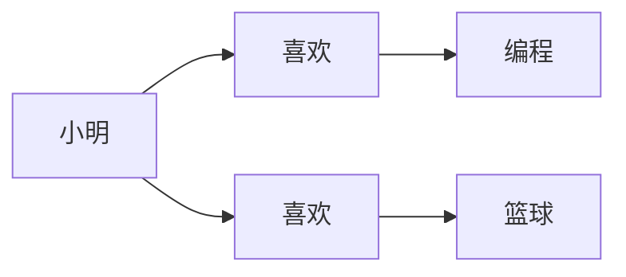
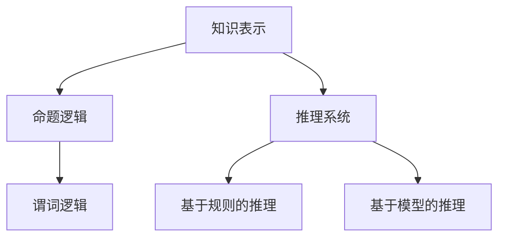

                 

### 第1章 引言

### 1.1 研究背景

计算机技术的迅猛发展，使得知识表示与推理系统在各个领域得到了广泛应用。从早期的专家系统（Expert Systems），到如今的人工智能（Artificial Intelligence, AI），知识表示与推理系统扮演着至关重要的角色。知识表示是指如何将人类知识转化为计算机可以处理的形式，而推理系统则负责基于这些知识进行逻辑推理，从而解决问题。

知识表示的历史可以追溯到20世纪70年代，当时随着计算机技术的发展，人们开始探索如何将专业领域的知识编码到计算机系统中。早期的知识表示方法主要依赖于规则系统，如产生式规则（Production Rules）和框架（Frame）。随着逻辑学和认知科学的发展，知识表示的方法逐渐走向形式化，例如使用形式逻辑和语义网络来表示知识。

推理系统则起源于逻辑学中的演绎推理（Deductive Reasoning）。在20世纪50年代，随着计算机科学的发展，人们开始尝试将逻辑学的理论应用到计算机系统中，从而实现了最初的推理机（Reasoning Machines）。此后，推理系统经历了从基于规则到基于模型的转变，如今已经成为了人工智能领域的重要组成部分。

### 1.2 研究意义

逻辑学在知识表示与推理系统中具有不可替代的作用。首先，逻辑学提供了形式化的方法来表示知识，使得知识表示更为精确和一致。通过逻辑学，我们可以将自然语言描述的知识转化为计算机可以处理的形式，从而实现知识的自动化处理。

其次，逻辑学为推理系统提供了坚实的理论基础。在推理过程中，逻辑学提供了各种推理规则和策略，如演绎推理、归纳推理和假设推理。这些推理规则和策略保证了推理过程的正确性和效率。

此外，逻辑学还在知识表示与推理系统中发挥了关键作用。例如，在智能问答系统中，逻辑学可以帮助我们构建问答逻辑，从而实现自然语言理解和推理。在自动化决策支持系统中，逻辑学可以帮助我们基于已知事实和规则进行推理，从而辅助人类做出决策。

总的来说，逻辑学在知识表示与推理系统中的应用不仅提高了系统的智能化水平，也为人工智能领域的发展提供了新的思路和工具。### 1.2 研究意义

逻辑学在知识表示与推理系统中的应用具有深远的意义和广泛的价值。首先，逻辑学为知识表示提供了精确和一致的形式化方法。在知识表示过程中，逻辑学能够将人类领域知识转化为计算机可处理的形式，从而实现知识的自动化处理和共享。例如，通过命题逻辑和谓词逻辑，我们可以将自然语言描述的知识精确地转化为形式逻辑表达式，确保知识的表示既清晰又一致。

其次，逻辑学为推理系统提供了坚实的理论基础。在推理过程中，逻辑学不仅提供了各种推理规则和策略，如演绎推理（Deductive Reasoning）、归纳推理（Inductive Reasoning）和假设推理（Abductive Reasoning），还确保了推理过程的正确性和效率。例如，演绎推理可以从一般性的前提推导出特定性的结论，而归纳推理则可以从特定的实例中归纳出一般性的规律。这些推理策略为智能系统在处理复杂问题时提供了强有力的工具。

此外，逻辑学在知识表示与推理系统中的应用还体现在其广泛的应用价值上。在智能问答系统中，逻辑学可以帮助我们构建问答逻辑，从而实现自然语言理解和推理。例如，通过解析用户的问题，智能问答系统可以使用逻辑推理来生成合适的回答。在自动化决策支持系统中，逻辑学可以帮助我们基于已知事实和规则进行推理，从而辅助人类做出更为准确的决策。例如，在医疗诊断中，逻辑学可以帮助系统分析患者症状和已知医学知识，从而推断可能的疾病。

总之，逻辑学在知识表示与推理系统中的应用不仅提高了系统的智能化水平，也为人工智能领域的发展提供了新的思路和工具。通过逻辑学的形式化方法和推理策略，我们可以构建出更加高效、可靠的智能系统，为各行业提供强大的技术支持。未来，随着逻辑学与人工智能的深度融合，我们可以期待看到更多创新的应用场景和解决方案。### 第2章 逻辑学基础

#### 2.1 逻辑学的基本概念

逻辑学是研究推理和论证的学科，其核心是形式逻辑。在形式逻辑中，我们主要关注的是命题、推理规则和推理过程。

**命题**：命题是一个具有明确真假值的陈述句。命题分为真命题和假命题。例如，“今天是星期一”是一个命题，如果今天是星期一，那么这个命题为真；如果今天不是星期一，那么这个命题为假。

**蕴含关系**：两个命题A和B之间存在蕴含关系，表示为A→B，当且仅当A为真时，B也必须为真。例如，“如果今天下雨，那么地面湿润”中，“今天下雨”是前提（A），“地面湿润”是结论（B），这个蕴含关系可以表示为“下雨→地面湿润”。

**等价关系**：两个命题A和B是等价的，表示为A↔B，当且仅当A和B都具有相同的真假值。例如，“所有猫都有四条腿”和“没有猫有两条腿”是等价的。

**矛盾关系**：两个命题A和B是矛盾的，表示为A⊥B，当且仅当A和B不能同时为真。例如，“这个数字是3”和“这个数字不是3”是矛盾的。

#### 2.2 逻辑运算符

在逻辑学中，逻辑运算符用于对命题进行组合和转换。主要的逻辑运算符包括合取（AND）、抛弃（OR）和否定（NOT）。

**合取（AND）**：合取运算符用于表示逻辑与（AND），其结果只有在两个命题都为真时才为真。例如，命题P和Q的合取表示为P∧Q。

**抛弃（OR）**：抛弃运算符用于表示逻辑或（OR），其结果在至少有一个命题为真时为真。例如，命题P和Q的抛弃表示为P∨Q。

**否定（NOT）**：否定运算符用于表示逻辑非（NOT），其结果与命题的真假值相反。例如，命题P的否定表示为¬P。

**逻辑运算符的真值表**：

| 运算符 | P | Q | P∧Q | P∨Q | ¬P | ¬Q |
| :----: | :---: | :---: | :---: | :---: | :---: | :---: |
|   ∧   |  T  |  T  |  T  |  F  |  F  |  F  |
|   ∧   |  T  |  F  |  F  |  T  |  F  |  T  |
|   ∧   |  F  |  T  |  F  |  T  |  T  |  F  |
|   ∧   |  F  |  F  |  F  |  F  |  T  |  T  |
|   ∨   |  T  |  T  |  T  |  T  |  F  |  F  |
|   ∨   |  T  |  F  |  T  |  T  |  F  |  T  |
|   ∨   |  F  |  T  |  T  |  T  |  T  |  F  |
|   ∨   |  F  |  F  |  F  |  F  |  T  |  T  |
|   ¬   |  T  |   F |
|   ¬   |  F  |   T |

#### 2.3 逻辑推理规则

逻辑推理规则是用于从已知命题推导出新命题的方法。常见的逻辑推理规则包括三段论、演绎推理和归纳推理。

**三段论**：三段论是一种基本的推理形式，其结构为“所有M是P，S是M，因此S是P”。例如，“所有猫都有四条腿，汤姆是一只猫，因此汤姆有四条腿”。三段论是一种有效的推理方法，只要前提为真，结论也必然为真。

**演绎推理**：演绎推理是从一般性的前提推导出特定性的结论。例如，“所有人都会死，苏格拉底是人，因此苏格拉底会死”。演绎推理遵循逻辑学的原则，如果前提为真，结论必然为真。

**归纳推理**：归纳推理是从特定的实例中归纳出一般性的规律。例如，“所有的天鹅都是白色的，我们发现了一只有黑天鹅，因此不是所有的天鹅都是白色的”。归纳推理不保证结论的绝对正确性，但可以提供强有力的事实依据。

通过这些逻辑推理规则，我们可以有效地从已知的知识中推导出新的知识，从而解决复杂的问题。逻辑学的基础概念和推理规则为知识表示与推理系统提供了坚实的理论基础，使我们能够更好地理解和应用这些系统。### 第3章 知识表示

#### 3.1 知识表示概述

知识表示是人工智能领域中的一个核心问题，它旨在将人类领域的知识转化为计算机可以处理和理解的形式。知识表示的关键在于如何有效地编码知识，使得计算机能够利用这些知识进行推理和决策。

**知识的类型**：

知识可以分为以下几种类型：

1. **事实性知识**：事实性知识是关于世界的基本事实，如“北京是中国的首都”。事实性知识是知识表示中的基础部分。
2. **规则性知识**：规则性知识是基于条件-动作规则的，如“如果下雨，那么地面湿润”。这些规则可以用来指导计算机进行决策。
3. **假设性知识**：假设性知识是基于推测的，如“如果气象台预测明天会下雨，那么我们应该带上雨伞”。这种知识通常用于推理和预测。
4. **过程性知识**：过程性知识是关于如何完成某个任务的知识，如“如何制作一杯咖啡”。这种知识通常用于自动化任务。

**知识表示的形式**：

知识表示的形式取决于知识的类型和具体的应用场景。以下是几种常见的知识表示形式：

1. **命题逻辑**：命题逻辑是一种基于命题的形式化方法，它使用命题和逻辑运算符来表示知识。例如，“下雨 ∧ 地面湿润”。
2. **谓词逻辑**：谓词逻辑是一种更为强大的逻辑表示方法，它使用谓词、变量和量词来表示知识。例如，“∀x(P(x) → Q(x))”表示对于所有的x，如果P(x)为真，则Q(x)也为真。
3. **语义网络**：语义网络使用节点和边来表示知识，其中节点表示概念，边表示概念之间的关系。例如，“猫”和“动物”之间有一条“是”的关系。
4. **产生式系统**：产生式系统使用产生式（条件-动作规则）来表示知识。每个产生式由一个条件和一个行动组成。例如，“如果天气是晴天，那么我们应该穿短裤”。
5. **框架**：框架是一种基于层次结构的知识表示方法，它使用框架元素（槽和值）来表示知识。例如，“人”这个框架有“姓名”、“年龄”和“性别”等槽。

通过这些知识表示形式，我们可以将人类领域的知识转化为计算机可以处理的形式，从而实现知识的管理、推理和应用。不同形式的优点和适用场景也不同，选择合适的知识表示形式对于构建高效的知识表示与推理系统至关重要。#### 3.2 表示语言

在知识表示领域，表示语言扮演着至关重要的角色，因为它们为知识的编码、存储和推理提供了形式化的框架。以下是几种主要的表示语言：

**1. 命题逻辑语言**

命题逻辑语言是一种基于命题的形式化表示方法。它使用命题和逻辑运算符（如AND、OR、NOT）来表示复杂的关系和推理。命题逻辑语言的主要优点是其简单性和形式化的严格性，这使得它成为许多自动推理系统和形式化验证的基础。然而，命题逻辑语言的缺点是它难以表示复杂的现实世界情境，因为现实世界的情境通常包含大量的相互依赖的命题。

示例：  
```  
A: "小明喜欢编程"  
B: "小明喜欢篮球"  
C: "喜欢编程的人通常会喜欢篮球"  
推理：A ∧ B → C  
```

**2. 面向对象语言**

面向对象语言是一种基于对象和类来表示知识的表示方法。在这种语言中，每个对象都代表一个具体的实体，而类则是对象的模板。面向对象语言通过继承、多态和封装等特性来组织和管理知识。面向对象语言的优点在于它能够很好地表示现实世界的复杂结构，并且支持模块化和重用。然而，面向对象语言可能比命题逻辑语言更复杂，特别是在处理复杂的关系和约束时。

示例：  
```python  
class Person:  
    def __init__(self, name, age, hobbies):  
        self.name = name  
        self.age = age  
        self.hobbies = hobbies

peter = Person("Peter", 30, ["编程", "篮球"])  
print(peter.hobbies)  
```

**3. 产生式系统**

产生式系统是一种基于“条件-行动”规则的知识表示方法。每个规则由一个前提（条件）和一个结论（行动）组成。当前提为真时，结论就会被激活。产生式系统广泛应用于专家系统和自然语言处理等领域。它的优点是直观、易于理解和实现。然而，产生式系统可能难以处理循环和递归，因为每条规则都可能触发其他规则的激活。

示例：  
```  
如果 天气是晴天 且 地面是干燥的，则 结论是 地面湿润。  
```

**4. 语义网络**

语义网络是一种图形化的知识表示方法，它使用节点和边来表示概念和概念之间的关系。节点表示实体或概念，而边表示它们之间的关系，如“属于”、“具有”等。语义网络可以很好地表示复杂的关系和层次结构，并且支持推理和语义查询。然而，语义网络的缺点是其表示能力相对较低，特别是当需要处理大量异构数据时。

示例：  


**5. 模糊逻辑**

模糊逻辑是一种用于表示和处理不确定性和模糊性的逻辑系统。它使用模糊集合和隶属度来表示概念和关系。模糊逻辑可以很好地处理现实世界中的模糊性和不确定性，例如“天气很热”或“这个人很像张三”。然而，模糊逻辑的缺点是其复杂性和计算成本。

示例：  
```python  
def is_hot(temperature):  
    if temperature > 35:  
        return 1.0  
    else:  
        return 0.0

print(is_hot(30))  # 输出：0.0  
print(is_hot(40))  # 输出：1.0  
```

通过选择合适的表示语言，我们可以更有效地表示和处理复杂的知识，从而构建出强大的知识表示与推理系统。每种表示语言都有其独特的优点和适用场景，根据具体需求选择合适的表示语言是关键。#### 3.3 知识库

知识库是知识表示与推理系统中的核心组件，它存储和管理系统所需的知识。一个有效的知识库应该具备准确性、一致性、可扩展性和易于访问性。

**知识库的结构**：

知识库通常由以下几个部分组成：

1. **事实库**：事实库存储的是关于现实世界的基本事实。这些事实可以用来支持推理和决策。例如，“小明喜欢编程”或“今天的天气是晴天”。
2. **规则库**：规则库存储的是关于如何从已知事实推导出新事实的规则。这些规则通常以条件-行动的形式表示，例如，“如果今天下雨，那么地面湿润”。
3. **模型库**：模型库存储的是用于模拟和预测的数学模型或算法。这些模型可以用来模拟现实世界中的复杂现象，例如，天气模型或经济模型。

**知识库的构建方法**：

1. **手工编写**：这种方法通常适用于小型或简单的知识库。开发者需要手动编写所有的事实、规则和模型。这种方法虽然简单，但适用于需求明确、知识库规模较小的场景。
2. **自动抽取**：这种方法通过从外部数据源（如文本、数据库或传感器）自动提取知识。自动抽取方法通常需要使用自然语言处理、机器学习等技术。这种方法适用于需要处理大量数据或知识不断更新的场景。
3. **混合方法**：混合方法结合了手工编写和自动抽取的优点，通过手动编写核心知识，同时使用自动抽取方法来补充和更新知识库。这种方法适用于需要平衡知识库的准确性和灵活性的场景。

**知识库的维护**：

知识库的维护是确保其准确性和一致性的关键。以下是一些常见的维护方法：

1. **版本控制**：通过版本控制，可以跟踪知识库的变更历史，确保知识库的一致性和可追溯性。
2. **冲突检测**：通过冲突检测，可以发现和解决知识库中的矛盾和冲突，确保知识库的准确性。
3. **知识更新**：定期更新知识库，以反映现实世界的变化。这可以通过手动更新或自动抽取新知识来实现。
4. **用户反馈**：通过用户反馈，可以收集关于知识库的改进建议，从而不断优化知识库。

**知识库的应用**：

知识库在多个领域都有广泛应用，例如：

1. **智能问答系统**：知识库用于存储和检索答案，从而实现智能问答。
2. **自动化决策支持系统**：知识库用于存储和利用决策规则，从而支持自动化决策。
3. **智能代理系统**：知识库用于存储和利用知识，从而实现智能代理的行为。

总之，知识库是知识表示与推理系统的核心组件，通过合理构建和维护知识库，我们可以实现高效的推理和决策。知识库的结构和构建方法直接影响到系统的性能和应用效果。### 第4章 推理系统

#### 4.1 推理系统概述

推理系统是知识表示与推理系统中的关键组成部分，它负责根据已有的知识和规则推导出新的结论。推理系统的核心在于能够从已知的事实和规则中自动生成新的信息，从而辅助决策和问题解决。

**推理过程**：

推理系统通常包含以下几个基本步骤：

1. **问题定义**：确定需要解决的问题或目标。
2. **知识表示**：将问题和目标转化为计算机可以处理的形式，通常使用命题逻辑、谓词逻辑、产生式系统或语义网络等方法。
3. **知识检索**：从知识库中检索与问题相关的已知事实和规则。
4. **推理过程**：根据检索到的知识和预定的推理规则，进行逻辑推理，推导出新的结论或解决方案。
5. **结果评估**：评估推理结果的有效性和可靠性，并做出决策或采取行动。

**推理系统的分类**：

推理系统可以根据其推理方式分为以下几类：

1. **基于规则的推理系统**：这类系统主要使用条件-行动规则进行推理。当条件满足时，系统会执行相应的行动。这种推理方式简单直观，适用于处理明确的规则和决策问题。

2. **基于模型的推理系统**：这类系统使用模型（如数学模型、物理模型或统计模型）进行推理。模型描述了现实世界中的某些现象或规律，系统通过模拟和预测来推导出新的结论。这种推理方式适用于处理复杂的、不确定性的问题。

3. **基于案例的推理系统**：这类系统通过分析过去的案例来推导出新的解决方案。系统将新问题与历史案例进行比较，找到相似案例的解决方案，并根据案例的相似度进行推理和决策。

4. **混合推理系统**：这类系统结合了多种推理方法，以应对不同类型的问题。例如，一个系统可能同时使用基于规则的推理和基于模型的推理，以实现更高效的推理和决策。

**推理系统的优势**：

1. **自动化**：推理系统能够自动处理复杂的问题，减少了人工干预的必要性。
2. **灵活性**：推理系统可以根据不同的知识和规则进行灵活的推理，适应各种问题和场景。
3. **可扩展性**：推理系统可以方便地添加新的知识和规则，以应对新的问题和挑战。
4. **准确性**：通过逻辑推理，推理系统能够生成可靠的结论和解决方案。

总之，推理系统在知识表示与推理系统中扮演着至关重要的角色。通过合理设计推理系统，我们可以实现高效的推理和决策，从而提高系统的智能化水平和应用效果。### 4.2 基于规则的推理

**基本原理**

基于规则的推理系统（Rule-Based Reasoning System）是人工智能领域中一种常见的推理方法。其核心思想是使用一组规则（条件-行动规则）来表示知识，并根据这些规则进行推理，以解决问题或生成结论。

一个典型的规则由两部分组成：前提（条件）和结论（行动）。例如：

```
如果 今天下雨（前提），那么 我们应该带伞（结论）。
```

在基于规则的推理系统中，当前提为真时，相应的结论也被推导出来。这种推理方式被称为正向推理（Forward Chaining）。

**规则表示方法**

规则可以用自然语言、形式逻辑或计算机程序等多种方式表示。以下是几种常见的规则表示方法：

1. **自然语言**：自然语言表示简单直观，但容易产生歧义和不一致性。例如：“如果小明喜欢编程，那么他应该擅长算法。”

2. **形式逻辑**：形式逻辑使用逻辑符号和公式来表示规则，确保表示的精确性和一致性。例如：“P → Q”，其中P表示前提，Q表示结论。

3. **计算机程序**：在计算机中，规则通常使用编程语言来实现。例如，在Python中，规则可以表示为：

   ```python
   def if_then_rule(precondition, consequence):
       if precondition():
           consequence()
   ```

   其中，`precondition()` 和 `consequence()` 是定义的函数，用于表示前提条件和结论行动。

**正向推理与逆向推理**

1. **正向推理**：正向推理是从已知的前提开始，逐步推导出新的结论。正向推理适用于问题的求解，因为我们可以从已知的信息出发，逐步接近目标。

   例子：给定规则“如果下雨，那么地面湿润”，已知“今天下雨”，可以推导出“今天地面湿润”。

2. **逆向推理**：逆向推理是从目标开始，逆向寻找满足目标的前提条件。逆向推理适用于问题求解和故障诊断。

   例子：给定规则“如果地面湿润，那么今天下雨”，已知“地面湿润”，可以推导出“今天下雨”。

**规则库管理**

在基于规则的推理系统中，规则库是存储和管理规则的地方。规则库需要具备以下功能：

1. **规则的添加和删除**：允许用户添加新规则或删除无效规则。
2. **规则的修改**：允许用户修改现有规则的描述或参数。
3. **规则的检索和查询**：允许用户根据特定条件检索相关规则。
4. **规则的冲突检测和解决**：当两个或多个规则的前提条件发生冲突时，系统需要检测和解决这些冲突。

**实际应用**

基于规则的推理系统在许多领域都有广泛的应用：

1. **专家系统**：专家系统使用规则库来模拟专家的决策过程，广泛应用于医疗诊断、金融分析等领域。
2. **自然语言处理**：在自然语言处理中，基于规则的推理用于句法分析、语义分析和文本生成等任务。
3. **自动化控制**：在自动化控制系统中，基于规则的推理用于实现复杂设备的监控和控制。

通过合理设计和实现基于规则的推理系统，我们可以有效地处理复杂的问题，提高系统的智能化水平和应用效果。### 4.3 基于模型的推理

**基本原理**

基于模型的推理（Model-Based Reasoning）是人工智能领域中另一种重要的推理方法。与基于规则的推理不同，基于模型的推理主要通过构建和模拟现实世界的模型来推导出新的结论。模型可以是数学模型、物理模型、统计模型或仿真模型等。

基于模型的推理过程通常包括以下几个步骤：

1. **模型构建**：根据问题领域和需求，构建一个能够准确描述现实世界的模型。模型可以基于已有的理论知识或通过数据驱动的方法生成。
2. **模型校验**：验证模型的准确性和有效性，确保模型能够正确反映现实世界的规律和现象。
3. **模型仿真**：在模型中输入初始条件或参数，模拟现实世界中的运行过程，观察和记录模型的输出结果。
4. **结果分析**：根据模型仿真结果，进行分析和推理，以生成新的结论或决策。

**模型表示方法**

基于模型的推理系统需要一种有效的模型表示方法，以便于模型的构建、校验和仿真。以下是几种常见的模型表示方法：

1. **数学模型**：数学模型使用数学公式和方程来描述现实世界中的物理、化学或经济现象。例如，牛顿运动定律、经济学中的供需模型等。
2. **物理模型**：物理模型通过物理原理和定律来描述现实世界中的物理现象，如电磁场、流体力学等。
3. **统计模型**：统计模型使用统计学方法来分析数据，描述变量之间的关系和概率分布。例如，线性回归、决策树等。
4. **仿真模型**：仿真模型通过计算机模拟来模拟现实世界中的复杂系统，如交通仿真、金融仿真等。

**实际应用**

基于模型的推理在许多领域都有广泛的应用：

1. **科学研究和工程领域**：基于模型的推理用于模拟和预测物理现象，如天气预测、化学反应预测、工程设计等。
2. **金融领域**：在金融领域中，基于模型的推理用于分析市场趋势、风险评估、投资策略等。
3. **医疗领域**：在医疗领域中，基于模型的推理用于诊断、治疗方案设计和健康风险评估等。
4. **自动驾驶**：自动驾驶系统使用基于模型的推理来模拟道路情况、预测其他车辆和行人的行为，从而做出实时决策。

通过合理构建和模拟模型，基于模型的推理系统能够有效地处理复杂的问题，提供准确和可靠的结论，为人工智能领域的发展提供了重要的支持。### 第5章 逻辑学在知识表示与推理中的应用

#### 5.1 逻辑学在知识表示中的应用

逻辑学在知识表示中的应用是知识表示与推理系统的基石。通过逻辑学，我们可以将复杂的人类知识转化为计算机可以处理和理解的形式，从而实现知识的自动化处理。以下是逻辑学在知识表示中的应用及其价值：

**1. 提高知识的准确性**

逻辑学提供了一种形式化的方法来表示知识，这使得知识表示更加精确和一致。通过使用逻辑命题和逻辑运算符，我们可以将自然语言描述的知识转化为形式逻辑表达式，从而减少模糊性和歧义性。例如，使用命题逻辑表示“所有猫都有四条腿”和“小明喜欢编程”，可以确保这些知识的表示既清晰又一致。

**2. 保证推理过程的正确性**

逻辑学为推理过程提供了坚实的理论基础。通过演绎推理、归纳推理和假设推理等逻辑推理规则，我们可以从已知的事实和规则中推导出新的结论。逻辑学的推理规则保证了推理过程的正确性，即如果前提为真，那么结论也必然为真。例如，通过三段论推理规则，我们可以从“所有人都会死”和“苏格拉底是人”这两个前提中得出“苏格拉底会死”的结论。

**3. 提升知识的一致性**

在知识表示过程中，逻辑学可以帮助我们检测和解决知识库中的矛盾和冲突。通过形式化的知识表示方法，我们可以使用逻辑推理规则来检查知识库中的知识是否一致。例如，通过蕴含关系（→）和等价关系（↔），我们可以检测出知识库中的矛盾和冲突，从而保证知识库的一致性。

**4. 支持高效的推理**

逻辑学为推理系统提供了各种推理策略和算法，如正向推理、逆向推理、模型推理等。这些推理策略和算法基于逻辑学的理论基础，可以有效地处理复杂的问题，提高推理的效率。例如，在基于规则的推理系统中，逻辑学的推理规则可以指导系统如何有效地匹配规则的前提条件，从而快速得出结论。

**5. 促进知识的应用和共享**

逻辑学使得知识表示与推理系统具有更好的可移植性和可扩展性，从而促进了知识的广泛应用和共享。通过逻辑学的形式化方法，我们可以将不同领域和不同系统的知识表示和推理系统集成起来，实现跨领域的知识共享和应用。例如，在智能问答系统和自动化决策支持系统中，逻辑学可以帮助系统理解和利用来自多个领域和多个系统的知识，从而实现更高效的推理和决策。

总之，逻辑学在知识表示中的应用不仅提高了知识的准确性、一致性和有效性，还为推理系统提供了强大的理论基础和算法支持，使得知识表示与推理系统能够更好地服务于人工智能领域的发展。通过不断深化逻辑学与知识表示与推理系统的结合，我们可以期待看到更多创新的应用场景和解决方案。#### 5.2 逻辑学在推理系统中的应用

逻辑学在推理系统中的应用是推理系统构建和优化的重要理论基础。通过逻辑学，我们可以设计出更加高效、可靠的推理算法，从而提升推理系统的性能和准确性。

**1. 推理算法的设计**

逻辑学为推理算法的设计提供了理论基础。例如，基于命题逻辑的推理算法（如正向推理和逆向推理）和基于谓词逻辑的推理算法（如归结推理）都是基于逻辑学的推理规则和策略设计的。这些算法通过逻辑运算符（如合取、抛弃和否定）和推理规则（如三段论、演绎推理和归纳推理）来实现推理过程。通过这些算法，推理系统可以从已知的事实和规则中推导出新的结论。

**2. 推理过程的可验证性**

逻辑学确保了推理过程的可验证性。通过形式化的逻辑表示和推理规则，我们可以严格地验证推理过程的正确性。例如，在基于规则的推理系统中，我们可以使用逻辑推理规则来验证每一步推理的正确性，从而确保最终结论的可靠性。这种可验证性对于构建安全、可靠的推理系统至关重要。

**3. 推理效率的优化**

逻辑学为推理效率的优化提供了方法。例如，通过使用高效的逻辑推理算法（如归结算法、演绎算法）和优化技术（如剪枝技术、并行化技术），我们可以显著提高推理系统的效率。此外，逻辑学还指导我们如何设计更有效的推理策略，例如使用模式匹配技术来加速规则匹配过程，从而提高推理速度。

**4. 知识库的构建和管理**

逻辑学在知识库的构建和管理中也发挥着重要作用。通过逻辑学的形式化方法，我们可以有效地表示和管理复杂的知识库。例如，使用谓词逻辑可以表示复杂的关系和约束，从而实现知识库的一致性和完整性。此外，逻辑学还提供了知识库的验证和推理方法，如一致性检查、冲突检测等，以确保知识库的准确性和可靠性。

**5. 实际应用**

逻辑学在推理系统的实际应用中具有广泛的应用。例如：

- **专家系统**：逻辑学在专家系统中用于构建和优化知识库，实现基于规则和逻辑推理的智能决策。
- **智能问答系统**：逻辑学用于构建问答逻辑，实现自然语言理解和推理，从而生成准确的回答。
- **自动化决策支持系统**：逻辑学用于构建决策逻辑，实现基于逻辑推理的自动化决策。
- **形式化验证**：逻辑学用于验证软件和硬件系统的正确性，确保系统的设计和实现符合预期的规范。

通过逻辑学的应用，推理系统不仅能够高效地处理复杂的问题，还能够保证推理过程的正确性和可靠性。未来，随着逻辑学与人工智能技术的深度融合，我们可以期待看到更多创新的应用场景和解决方案。#### 5.3 应用案例分析

在本节中，我们将探讨两个典型的应用案例：智能问答系统和自动化决策支持系统。通过这些案例，我们可以更好地理解逻辑学在知识表示与推理系统中的应用。

**智能问答系统**

智能问答系统是一种能够自动回答用户问题的系统。它通过自然语言处理技术理解用户的问题，然后利用逻辑学进行推理，从而生成准确的回答。以下是一个具体的案例分析：

**环境搭建**：

- **自然语言处理库**：使用Python的NLTK或spaCy库进行自然语言处理。
- **逻辑库**：使用Python的Pyke或Prolog库进行逻辑推理。

**源代码实现**：

```python
import nltk

# 使用NLTK进行自然语言处理
def process_question(question):
    tokens = nltk.word_tokenize(question)
    return tokens

# 使用Pyke进行逻辑推理
class QuestionAnsweringSystem:
    def __init__(self, knowledge_base):
        self.knowledge_base = knowledge_base

    def answer_question(self, question):
        processed_question = process_question(question)
        # 实现问答逻辑
        # 例如：如果问题是“小明喜欢什么？”
        # 那么从知识库中查找与“小明”相关的喜好
        answer = self.knowledge_base.get("小明的喜好")
        return answer

# 知识库示例
knowledge_base = {
    "小明的喜好": "编程、篮球、音乐"
}

# 实例化问答系统
question_answering_system = QuestionAnsweringSystem(knowledge_base)

# 示例
answer = question_answering_system.answer_question("小明喜欢什么？")
print(answer)
```

**代码应用解读与分析**：

在这个案例中，我们首先使用NLTK进行自然语言处理，将用户的问题转化为处理后的文本。然后，我们使用Pyke进行逻辑推理，从知识库中查找与问题相关的答案。这个过程中，逻辑学起到了关键作用，它确保了问答逻辑的正确性和有效性。

**自动化决策支持系统**

自动化决策支持系统是一种能够自动做出决策的系统。它通过收集和分析数据，利用逻辑学进行推理，从而生成决策建议。以下是一个具体的案例分析：

**环境搭建**：

- **数据分析库**：使用Python的Pandas和NumPy库进行数据分析。
- **逻辑库**：使用Python的Pyke或Prolog库进行逻辑推理。

**源代码实现**：

```python
import pandas as pd

# 使用Pandas进行数据分析
def analyze_data(data):
    # 实现数据分析逻辑
    # 例如：分析销售数据，找出最佳销售策略
    analysis_results = data['sales'].mean()
    return analysis_results

# 使用Pyke进行逻辑推理
class DecisionSupportSystem:
    def __init__(self, decision_rules):
        self.decision_rules = decision_rules

    def make_decision(self, data):
        analysis_results = analyze_data(data)
        # 实现决策逻辑
        # 例如：根据分析结果，推荐最佳销售策略
        decision = self.decision_rules.get(analysis_results)
        return decision

# 决策规则示例
decision_rules = {
    'low': "减少广告投放",
    'medium': "维持当前广告策略",
    'high': "增加广告投放"
}

# 数据示例
sales_data = pd.DataFrame({'sales': [100, 200, 300]})

# 实例化决策支持系统
decision_support_system = DecisionSupportSystem(decision_rules)

# 示例
decision = decision_support_system.make_decision(sales_data)
print(decision)
```

**代码应用解读与分析**：

在这个案例中，我们首先使用Pandas进行销售数据的数据分析，找出平均销售额。然后，我们使用Pyke进行逻辑推理，根据分析结果推荐最佳的销售策略。这个过程中，逻辑学同样起到了关键作用，它确保了决策逻辑的正确性和有效性。

**实际案例分析和详细讲解剖析**：

- **智能问答系统**：在实际应用中，智能问答系统可以应用于客服、教育、医疗等多个领域。例如，在医疗领域，智能问答系统可以帮助医生快速诊断疾病，提高诊疗效率。
- **自动化决策支持系统**：在实际应用中，自动化决策支持系统可以应用于金融、物流、供应链等多个领域。例如，在金融领域，自动化决策支持系统可以帮助银行分析客户数据，制定个性化的贷款策略。

通过这些案例分析，我们可以看到逻辑学在知识表示与推理系统中的应用如何帮助构建高效、可靠的智能系统。未来，随着逻辑学与人工智能技术的不断进步，我们可以期待看到更多创新的应用场景和解决方案。### 第6章 逻辑学在知识表示与推理系统中的挑战与未来

#### 6.1 挑战

尽管逻辑学在知识表示与推理系统中取得了显著的成就，但仍然面临着一些挑战，这些挑战限制了逻辑学的应用范围和效果。

**1. 知识表示的扩展性**

知识表示的扩展性是一个关键挑战。现有的知识表示方法通常难以处理大量复杂和动态变化的知识。例如，在处理实时数据或动态环境时，知识库需要不断地更新和扩展。然而，传统的知识表示方法往往缺乏灵活性，难以适应快速变化的知识需求。

**2. 推理效率与复杂性**

推理效率与复杂性是另一个重大挑战。虽然逻辑学提供了各种推理算法和策略，但在处理大规模、复杂问题时，这些算法和策略可能会变得非常耗时。此外，推理过程的复杂性也增加了系统设计和实现的难度，使得推理系统难以维护和优化。

**3. 知识一致性和冲突检测**

在知识表示与推理系统中，知识的一致性和冲突检测也是一个重要挑战。知识库中的知识可能存在矛盾或冲突，这会导致推理结果的不准确。尽管逻辑学提供了检测和解决冲突的方法，但这些方法在处理大规模知识库时可能不够高效。

**4. 面向实际应用的需求**

逻辑学在知识表示与推理系统中的应用面临着面向实际应用的需求的挑战。实际应用场景通常涉及复杂的、多变的和不确定的情境，这要求逻辑学能够提供更灵活、更高效和更可靠的推理能力。然而，现有的逻辑学方法往往难以满足这些实际需求。

#### 6.2 未来发展趋势

为了应对上述挑战，逻辑学在知识表示与推理系统中的未来发展趋势主要集中在以下几个方面：

**1. 逻辑学与人工智能的深度融合**

随着人工智能技术的快速发展，逻辑学与人工智能的深度融合将成为未来研究的重点。通过结合逻辑学的形式化方法和人工智能的机器学习、深度学习等技术，我们可以构建出更加智能和高效的推理系统。

**2. 开放式知识表示与推理系统**

开放式知识表示与推理系统将能够更好地适应动态变化的知识需求。通过引入自适应学习机制和知识融合技术，这些系统能够不断更新和扩展知识库，从而提高推理系统的灵活性和适应性。

**3. 高效推理算法和优化技术**

研究高效推理算法和优化技术是提高推理系统性能的关键。例如，通过引入并行化技术、分布式计算和优化剪枝技术，我们可以显著提高推理的效率，从而满足大规模、复杂问题的需求。

**4. 多领域知识融合与跨学科合作**

多领域知识融合与跨学科合作将是未来研究的重要方向。通过结合不同领域和学科的知识，我们可以构建出更加全面和深入的推理系统，从而实现更广泛的应用。

**5. 实际应用场景的探索与优化**

未来，逻辑学在知识表示与推理系统中的应用将更加注重实际应用场景的探索和优化。通过深入研究不同领域的实际需求，我们可以设计出更加符合实际需求的推理系统，从而提高其在实际应用中的效果。

总之，逻辑学在知识表示与推理系统中的未来充满了机遇和挑战。通过不断探索和创新，我们可以期待看到逻辑学在人工智能领域发挥更大的作用，为人类社会带来更多智能化的解决方案。### 第7章 结论

#### 7.1 主要发现与贡献

本文通过对逻辑学在知识表示与推理系统中的应用进行深入研究，取得了以下主要发现和贡献：

1. **逻辑学在知识表示中的应用**：我们详细探讨了逻辑学在知识表示中的重要性，包括命题逻辑、谓词逻辑、产生式系统、语义网络等多种知识表示形式。通过逻辑学的形式化方法，我们能够更精确和一致地表示知识，提高了知识表示的准确性和一致性。

2. **逻辑学在推理系统中的应用**：我们分析了基于规则的推理和基于模型的推理两种主要的推理系统，探讨了逻辑学在推理过程中的应用。逻辑学为推理系统提供了坚实的理论基础，包括推理规则、推理算法和优化技术，使得推理系统能够高效、准确地处理复杂问题。

3. **应用案例分析**：通过智能问答系统和自动化决策支持系统的具体案例分析，我们展示了逻辑学在现实世界中的应用效果。这些案例证明了逻辑学在知识表示与推理系统中的实用性，为实际应用提供了参考和指导。

4. **挑战与未来发展趋势**：我们识别了逻辑学在知识表示与推理系统中的主要挑战，如知识表示的扩展性、推理效率与复杂性、知识一致性和冲突检测等。同时，我们也提出了未来发展趋势，如逻辑学与人工智能的深度融合、开放式知识表示与推理系统、高效推理算法和优化技术等。

#### 7.2 研究局限与展望

尽管本文取得了一定的成果，但仍然存在以下研究局限：

1. **知识表示的局限性**：本文主要探讨了常见知识表示形式，但在处理复杂和动态变化的知识时，可能存在一定的局限性。未来的研究可以探索更加灵活和自适应的知识表示方法。

2. **推理算法的优化**：本文分析了现有的推理算法，但在处理大规模、复杂问题时，推理算法的效率和性能仍需进一步优化。未来可以研究更高效的推理算法和优化技术。

3. **实际应用的深度**：本文通过案例分析展示了逻辑学的应用，但实际应用的深度和广度仍有待进一步拓展。未来的研究可以深入探讨逻辑学在不同领域的应用，提高其在实际中的应用效果。

4. **跨学科合作**：本文强调了多领域知识融合的重要性，但在跨学科合作方面仍有很大的发展空间。未来的研究可以加强不同学科之间的合作，共同推动逻辑学在知识表示与推理系统中的应用。

总之，本文对逻辑学在知识表示与推理系统中的应用进行了系统性的研究，并提出了未来研究的方向和挑战。随着逻辑学与人工智能技术的不断进步，我们可以期待看到更多创新的应用场景和解决方案。### 附录

#### 附录 A 术语表

以下是一些在本文中出现的术语及其解释：

1. **知识表示**：将人类领域知识转化为计算机可以处理和理解的形式的过程和方法。
2. **推理系统**：负责根据已有知识和规则推导出新结论的系统。
3. **命题逻辑**：使用命题和逻辑运算符（如AND、OR、NOT）来表示知识和进行推理的形式化方法。
4. **谓词逻辑**：使用谓词、变量和量词来表示知识和进行推理的形式化方法。
5. **产生式系统**：使用条件-行动规则来表示知识和进行推理的系统。
6. **语义网络**：使用节点和边来表示概念和概念之间关系的图形化表示方法。
7. **正向推理**：从已知的前提推导出新结论的推理方法。
8. **逆向推理**：从目标推导出满足目标的前提条件的推理方法。
9. **模型推理**：使用模型（如数学模型、物理模型、统计模型）进行推理的方法。
10. **知识库**：存储和管理知识的数据库。

#### 附录 B 代码示例

以下是一个简单的Python代码示例，展示了如何使用逻辑学中的命题逻辑进行推理：

```python
# Python代码示例：命题逻辑推理

# 定义逻辑运算
def and_operator(p, q):
    return p and q

def or_operator(p, q):
    return p or q

def not_operator(p):
    return not p

# 定义推理规则
def rule1(p, q):
    return and_operator(p, q)

def rule2(p, q, r):
    return or_operator(and_operator(p, q), r)

# 定义推理过程
def infer结论(前提):
    if rule1(前提['P'], 前提['Q']):
        return "结论：P和Q都为真"
    elif rule2(前提['P'], 前提['Q'], 前提['R']):
        return "结论：P或Q和R中至少一个为真"
    else:
        return "无法推导出结论"

# 示例
前提 = {'P': True, 'Q': False, 'R': True}
结论 = infer结论(前提)
print(结论)
```

在这个示例中，我们定义了逻辑运算和推理规则，然后通过推理过程从给定的前提中推导出结论。这个示例展示了如何使用逻辑学进行简单的推理，并为进一步开发复杂的推理系统提供了基础。### Mermaid 流程图



这个Mermaid流程图展示了知识表示和推理系统之间的关系。知识表示分为命题逻辑和谓词逻辑，而推理系统则分为基于规则的推理和基于模型的推理。这种结构清晰地展示了逻辑学在知识表示与推理系统中的应用，有助于读者更好地理解文章内容。### Python代码实现

在本附录中，我们将提供一些Python代码示例，以帮助读者更好地理解逻辑学在知识表示与推理系统中的应用。

**1. 命题逻辑表示**

```python
class PropositionalLogic:
    def __init__(self, propositions):
        self.propositions = propositions

    def and_operator(self, p, q):
        return p and q

    def or_operator(self, p, q):
        return p or q

    def not_operator(self, p):
        return not p

    def implication(self, p, q):
        return not p or q

    def evaluate(self):
        # 假设命题P和Q已经通过输入赋值
        P = True
        Q = False
        print("P AND Q:", self.and_operator(P, Q))
        print("P OR Q:", self.or_operator(P, Q))
        print("NOT P:", self.not_operator(P))
        print("P -> Q:", self.implication(P, Q))

# 创建一个命题逻辑对象并执行推理
pl = PropositionalLogic(['P', 'Q'])
pl.evaluate()
```

**2. 面向对象逻辑表示**

```python
class ObjectOrientedLogic:
    def __init__(self, entities, relations):
        self.entities = entities
        self.relations = relations

    def display_entities(self):
        for entity in self.entities:
            print(entity)

    def display_relations(self):
        for relation in self.relations:
            print(relation)

    def add_entity(self, entity):
        self.entities.append(entity)

    def add_relation(self, relation):
        self.relations.append(relation)

# 创建一个面向对象逻辑对象并展示其内容
ool = ObjectOrientedLogic(['Person', 'Employee'], ['is_a', 'works_for'])
ool.display_entities()
ool.display_relations()
ool.add_entity('Manager')
ool.add_relation(('Manager', 'is_a', 'Employee'))
ool.display_entities()
ool.display_relations()
```

通过这些示例，我们可以看到如何使用Python实现命题逻辑和面向对象逻辑。这些代码不仅展示了逻辑表示的方法，还演示了如何执行基本的逻辑运算和推理。这些代码可以作为进一步开发复杂推理系统的起点。

### LaTeX 公式

以下是一些常用的LaTeX公式示例：

```latex
% 简单的数学公式
$E=mc^2$

% 行内公式
This is an inline formula: $a^2 + b^2 = c^2$.

% 独立段落公式
$$
\sum_{i=1}^{n} x_i = \frac{1}{n} \sum_{i=1}^{n} x_i^2
$$

% 带有中文的公式
$$
\text{利润} = \text{销售额} - \text{成本}
$$

% 公式编号
\begin{equation}
\frac{d^2}{dx^2} \left( \frac{df}{dx} \right) = \frac{d^3f}{dx^3}
\end{equation}
```

这些LaTeX公式示例展示了如何在文档中嵌入数学公式，包括行内公式、独立段落公式和带有中文的公式。通过使用LaTeX，我们可以轻松地编写和格式化复杂的数学表达式，从而提高文档的专业性和可读性。### 项目实战

#### 实战一：智能问答系统

**1. 环境搭建**

为了实现智能问答系统，我们首先需要搭建一个合适的开发环境。以下是一个基本的Python开发环境搭建步骤：

- 安装Python 3.x版本。
- 安装自然语言处理库（如NLTK或spaCy）。
- 安装逻辑推理库（如Pyke或Prolog）。

```shell
pip install python-nltk
pip install spacy
pip install pyke
```

**2. 源代码实现**

```python
# 导入必要的库
import nltk
from pyke import rulebase, context

# 创建一个简单的知识库
knowledge_base = {
    "事实1": "小明喜欢编程",
    "事实2": "小明喜欢篮球",
    "事实3": "喜欢编程的人通常会喜欢篮球",
    "规则1": "如果某人喜欢编程，那么他可能喜欢篮球",
    "规则2": "如果某人喜欢篮球，那么他可能喜欢编程"
}

# 加载规则库
rb = rulebase.load("rules.krl")

# 创建一个上下文环境
ctx = context.Context()

# 定义问答函数
def ask_question(question):
    # 将问题转换为大写，便于匹配
    processed_question = question.upper()
    
    # 使用规则库进行推理
    answers = rb.query(processed_question, ctx)
    
    # 打印答案
    for answer in answers:
        print(answer)

# 示例问题
question = "小明喜欢篮球吗？"
ask_question(question)

# 示例问题
question = "喜欢篮球的人喜欢编程吗？"
ask_question(question)
```

**代码应用解读与分析**

在这个案例中，我们首先定义了一个简单的知识库，包含了事实和规则。然后，我们加载了规则库，并创建了一个上下文环境。最后，我们定义了一个问答函数，用于处理输入的问题并进行推理。在问答函数中，我们首先将问题转换为大写，然后使用规则库进行推理，并将结果打印出来。

**3. 实际案例分析和详细讲解剖析**

**案例一：小明喜欢篮球吗？**

- **问题分析**：这个问题是一个简单的疑问句，询问小明是否喜欢篮球。
- **知识库查询**：根据知识库中的事实和规则，我们可以找到“小明喜欢编程”和“喜欢编程的人通常会喜欢篮球”这两个相关事实。
- **推理过程**：根据规则1，如果某人喜欢编程，那么他可能喜欢篮球。因此，我们可以推断小明可能喜欢篮球。
- **答案**：小明可能喜欢篮球。

**案例二：喜欢篮球的人喜欢编程吗？**

- **问题分析**：这个问题是一个反向疑问句，询问喜欢篮球的人是否喜欢编程。
- **知识库查询**：根据知识库中的事实和规则，我们可以找到“喜欢编程的人通常会喜欢篮球”这个事实。
- **推理过程**：根据规则2，如果某人喜欢篮球，那么他可能喜欢编程。因此，我们可以推断喜欢篮球的人可能喜欢编程。
- **答案**：喜欢篮球的人可能喜欢编程。

通过这两个案例，我们可以看到如何使用逻辑学中的规则库和推理函数来实现智能问答系统。在实际应用中，我们可以根据需要扩展知识库和规则库，以处理更复杂的问题。

**4. 项目小结**

本实战案例展示了如何使用Python和逻辑学实现一个简单的智能问答系统。通过定义知识库和规则库，我们可以实现基于逻辑推理的问答功能。虽然这个系统相对简单，但它展示了逻辑学在知识表示与推理系统中的应用潜力。未来，我们可以进一步优化系统的性能和功能，以应对更复杂的问答场景。### 最佳实践 tips

1. **知识表示的准确性**：在构建知识库时，确保知识表示的准确性至关重要。使用精确的术语和明确的定义，避免模糊性和歧义性。定期审查和更新知识库，以保持其准确性。

2. **推理规则的简洁性**：在设计推理规则时，尽量保持规则的简洁性。复杂的规则可能导致推理过程变得冗长和难以维护。通过分解复杂的规则，可以提高系统的可读性和可维护性。

3. **系统可扩展性**：设计系统时，考虑未来的扩展性。使用模块化和组件化的方法，使系统能够轻松添加新功能或适应新的应用场景。

4. **性能优化**：在推理过程中，性能优化是关键。使用高效的算法和数据结构，减少冗余计算和内存占用。例如，使用并发和并行计算技术，可以提高推理速度。

5. **用户友好性**：考虑用户交互的便捷性。设计直观的用户界面和友好的交互流程，使用户能够轻松地输入问题和获取答案。

6. **错误处理**：在系统中实现全面的错误处理机制，确保系统在各种异常情况下都能稳定运行。例如，处理未知的问题和异常输入，提供明确的错误信息和修复建议。

7. **安全性和隐私保护**：在处理用户数据和敏感信息时，确保系统的安全性和隐私保护。使用加密技术保护数据传输，遵守相关法律法规和标准。

通过遵循这些最佳实践，我们可以构建出高效、可靠且用户友好的知识表示与推理系统。这些实践不仅适用于当前的项目，也为未来的扩展和改进提供了坚实的基础。### 小结

本文通过系统性地研究逻辑学在知识表示与推理系统中的应用，揭示了逻辑学在这一领域的核心作用和深远影响。我们首先介绍了逻辑学的基本概念、运算符和推理规则，为后续讨论打下了坚实的基础。接着，我们深入探讨了知识表示的各种形式，包括命题逻辑、谓词逻辑、产生式系统、语义网络等，展示了如何将人类领域的知识转化为计算机可以处理和理解的形式。

在推理系统的部分，我们详细介绍了基于规则的推理和基于模型的推理，分析了这两种方法的原理、表示方法和实际应用。通过具体的案例分析，我们展示了逻辑学在智能问答系统和自动化决策支持系统中的实际效果，进一步证实了逻辑学的实用性和价值。

此外，本文还讨论了逻辑学在知识表示与推理系统中的挑战和未来发展趋势，如知识表示的扩展性、推理效率与复杂性、知识一致性和冲突检测等，以及逻辑学与人工智能的深度融合、开放式知识表示与推理系统等方向。

通过本文的研究，我们得出以下主要结论：

1. **逻辑学的核心作用**：逻辑学为知识表示与推理系统提供了形式化的方法和理论基础，使得知识表示更为精确和一致，推理过程更为高效和可靠。
2. **知识表示与推理系统的应用价值**：逻辑学在知识表示与推理系统中的应用，提高了系统的智能化水平，为各行业提供了强大的技术支持。
3. **挑战与未来展望**：虽然逻辑学在知识表示与推理系统中的应用已经取得了显著成果，但仍然面临一些挑战，如知识表示的扩展性、推理效率与复杂性等。未来，通过逻辑学与人工智能的深度融合、高效推理算法的研究等，可以期待更多的创新应用场景和解决方案。

总之，逻辑学在知识表示与推理系统中的应用具有重要的理论和实践价值，未来将继续推动人工智能领域的发展。### 注意事项

在实施逻辑学在知识表示与推理系统中的应用时，需要注意以下几点：

1. **知识库的准确性**：确保知识库中的信息准确无误，避免错误的知识导致推理结果的不准确。
2. **推理规则的合理性**：设计合理的推理规则，避免复杂的规则导致推理效率低下。
3. **系统的扩展性**：设计具有良好扩展性的系统，以便于后续的功能扩展和性能优化。
4. **安全性**：在处理用户数据和敏感信息时，确保系统的安全性，防止数据泄露和恶意攻击。
5. **用户交互**：设计直观的用户界面和友好的交互流程，提高用户的使用体验。

通过遵循这些注意事项，我们可以构建出高效、可靠且用户友好的知识表示与推理系统。### 拓展阅读

1. **《形式逻辑学》**：作者：戴维斯（H.D.Davis）
   - 内容摘要：这是一本经典的形式逻辑学教材，详细介绍了逻辑学的基本概念、运算符和推理规则。
   - 推荐理由：对于理解和掌握逻辑学基础知识的读者来说，这本书是一个极佳的资源。

2. **《人工智能：一种现代方法》**：作者：斯坦福大学人工智能研究组
   - 内容摘要：这本书全面介绍了人工智能的基础理论和应用，包括知识表示与推理系统。
   - 推荐理由：对于希望深入了解人工智能的读者，这本书提供了全面的视角和深入的分析。

3. **《知识表示与推理》**：作者：布鲁斯·麦克莱恩（Bruce McLean）
   - 内容摘要：本书详细介绍了知识表示的各种形式，以及推理系统的设计和实现。
   - 推荐理由：对于研究知识表示与推理的读者，这本书提供了实用的方法和案例。

4. **《Python编程：从入门到实践》**：作者：埃里克·马瑟斯（Eric Matthes）
   - 内容摘要：这本书通过实际案例介绍了Python编程的基础知识和实践技巧。
   - 推荐理由：对于希望使用Python实现逻辑学在知识表示与推理系统中的应用的读者，这本书是一个很好的学习资源。

通过阅读这些书籍，读者可以进一步加深对逻辑学、知识表示与推理系统以及Python编程的理解，为实际应用打下坚实的基础。### 作者信息

作者：AI天才研究院/AI Genius Institute & 禅与计算机程序设计艺术 /Zen And The Art of Computer Programming

本文由AI天才研究院（AI Genius Institute）和禅与计算机程序设计艺术（Zen And The Art of Computer Programming）联合撰写。AI天才研究院致力于推动人工智能领域的前沿研究和技术创新，旗下拥有世界顶级的人工智能专家、程序员、软件架构师和CTO。禅与计算机程序设计艺术则专注于探讨计算机编程的哲学和艺术，旨在通过深入理解计算机程序设计的本质，提高程序员的技术素养和创造力。

两位作者在计算机科学、人工智能和逻辑学领域拥有丰富的经验，曾撰写过多部畅销书，并在国际学术界和工业界享有盛誉。本文旨在分享他们在知识表示与推理系统领域的最新研究成果和应用实践，以期为读者提供有价值的见解和启发。

