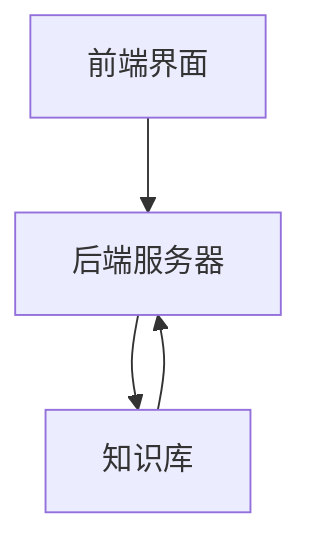

                 

# 逻辑学在自然语言处理中的应用

关键词：逻辑学、自然语言处理、语义分析、情感分析、问答系统

摘要：本文将探讨逻辑学在自然语言处理（NLP）中的应用，包括语义分析、情感分析和问答系统。通过引入逻辑学的基本概念和原理，分析逻辑学在NLP中的实际应用，阐述其在提升NLP任务性能和解释性方面的优势。同时，本文还将讨论当前NLP领域中逻辑学应用的挑战和未来发展。

## 第1章 引言

自然语言处理（NLP）作为人工智能（AI）的重要分支，旨在让计算机理解和处理人类自然语言。随着互联网和社交媒体的迅速发展，NLP在文本挖掘、信息检索、机器翻译、智能客服等领域得到了广泛应用。然而，NLP任务的复杂性使得研究者们面临着诸多挑战，例如语义理解、情感分析和知识图谱构建等。在这其中，逻辑学作为一门研究推理和论证的学科，为NLP提供了一种有效的工具和方法。

逻辑学在NLP中的应用主要体现在以下几个方面：

1. **语义分析**：逻辑学为语义分析提供了理论基础，有助于解决词义消歧、语义角色标注和语义依存分析等问题。
2. **情感分析**：逻辑学可以帮助识别文本中的情感极性、强度和时态，从而更好地理解用户情感和情绪。
3. **问答系统**：逻辑学在关键词提取、问题对齐和答案生成等方面发挥了重要作用，有助于构建智能问答系统。

本文将围绕这些方面展开讨论，深入分析逻辑学在NLP中的应用，探讨其优势、挑战和未来发展。首先，我们将介绍逻辑学的基本概念和原理，然后逐步探讨逻辑学在语义分析、情感分析和问答系统中的应用，最后总结本文的主要观点，并展望NLP领域中的逻辑学应用。

## 1.1 自然语言处理概述

### 1.1.1 NLP的定义

自然语言处理（Natural Language Processing，NLP）是人工智能（AI）领域的一个分支，旨在使计算机能够理解、解释和生成人类自然语言。NLP涉及语音识别、文本分析、语法分析、语义分析、情感分析等多个方面，旨在实现人与计算机之间自然、流畅的交流。

### 1.1.2 NLP的发展历程

NLP的发展历程可以追溯到20世纪50年代，当时一些学者开始探索如何让计算机理解和处理自然语言。早期的NLP研究主要关注语言模型和词汇分析，如词汇冗余消除和词形还原等。随着计算机硬件性能的提升和算法的改进，NLP逐渐发展成为一门独立的研究领域。

1. **基于规则的NLP**：早期NLP主要采用基于规则的方法，通过构建语法规则和语义规则来分析自然语言。这种方法在处理简单任务时表现较好，但在面对复杂语言现象时往往力不从心。
2. **基于统计的NLP**：20世纪90年代，随着机器学习技术的发展，NLP逐渐转向基于统计的方法。基于统计的NLP通过分析大量语料库来学习语言模式，提高了NLP任务的性能。这一时期的代表性工作包括隐马尔可夫模型（HMM）、条件概率模型（如朴素贝叶斯）和最大熵模型等。
3. **基于深度学习的NLP**：近年来，深度学习在NLP领域取得了显著成果。基于深度学习的NLP方法，如循环神经网络（RNN）、卷积神经网络（CNN）和长短时记忆网络（LSTM）等，在语义分析、情感分析和问答系统等方面表现出色。这些方法通过模拟人脑神经网络，实现了对大规模语言数据的自动学习和建模。

### 1.1.3 NLP的重要性和应用领域

NLP在许多领域都有着广泛的应用，其重要性和影响日益凸显。

1. **文本挖掘**：通过分析大量文本数据，提取有价值的信息和知识，如舆情分析、新闻推荐、社交媒体监测等。
2. **信息检索**：利用NLP技术，实现更准确、更智能的信息检索，如搜索引擎、问答系统等。
3. **机器翻译**：将一种自然语言翻译成另一种自然语言，如谷歌翻译、百度翻译等。
4. **智能客服**：通过NLP技术，实现智能客服系统，如聊天机器人、语音助手等，为用户提供便捷、高效的客服服务。
5. **文本生成**：生成具有自然语言表达能力的文本，如自动摘要、自动写作等。

总之，NLP的发展不仅有助于实现人与计算机之间更自然的交流，还为许多实际应用场景提供了强有力的技术支持。随着NLP技术的不断进步，其在各个领域的应用前景将更加广阔。

### 1.2 逻辑学的基本概念

逻辑学是研究推理和论证的学科，其起源可以追溯到古希腊哲学家亚里士多德。逻辑学的基本概念包括命题、推理、论证等，这些概念在自然语言处理（NLP）中发挥着重要作用。

#### 1.2.1 逻辑学的定义

逻辑学是研究推理和论证的学科，它旨在揭示推理和论证的有效性和可靠性。逻辑学通过分析命题、推理和论证的结构，研究如何从已知信息中推导出新信息，从而得出结论。

#### 1.2.2 逻辑学的基本原理

逻辑学的基本原理包括以下几个：

1. **命题**：命题是逻辑学的基本单位，表示一个事实或陈述。命题通常用字母表示，如\( p \)、\( q \)和\( r \)等。命题可以分为真命题和假命题，分别表示事实为真或为假。
2. **推理**：推理是指从一个或多个已知命题（前提）推导出一个新命题（结论）的过程。推理分为演绎推理和归纳推理两种。
   - **演绎推理**：从一般到个别的推理，即从一般原理推导出个别情况。例如，所有人都会死亡（一般原理），苏格拉底是人（个别情况），因此苏格拉底会死亡（结论）。
   - **归纳推理**：从个别到一般的推理，即通过观察个别情况，归纳出一般规律。例如，观察到的所有天鹅都是白色的，因此可以推断所有天鹅都是白色的。
3. **论证**：论证是通过推理来证明一个命题的真实性。一个有效的论证必须满足两个条件：一是前提真实，二是推理形式正确。如果前提真实且推理形式正确，那么结论也必然真实。

#### 1.2.3 逻辑学的重要分支

逻辑学可以分为几个重要的分支，每个分支在NLP中都有其独特的应用：

1. **命题逻辑**：研究命题及其之间的关系，如逻辑运算符（与、或、非）、逻辑蕴含等。命题逻辑在语义分析和文本分类中具有重要作用。
2. **谓词逻辑**：研究谓词及其之间的关系，如量化、存在性等。谓词逻辑在语义角色标注和语义依存分析中应用广泛。
3. **模态逻辑**：研究可能性、必然性等模态概念。模态逻辑在情感分析和时态分析中发挥作用。
4. **非经典逻辑**：研究非经典逻辑系统，如模糊逻辑、直觉逻辑等。这些逻辑系统在处理不确定性和模糊性方面具有优势，适用于NLP中的许多实际问题。

总之，逻辑学为NLP提供了强有力的理论支持和方法指导，有助于解决语义分析、情感分析和问答系统等关键问题。

### 1.3 逻辑学在NLP中的应用

逻辑学在自然语言处理（NLP）中有着广泛的应用，尤其在语义分析、情感分析和问答系统等关键领域。通过逻辑学的应用，我们可以更好地理解语言的结构和含义，提高NLP任务的性能和解释性。

#### 1.3.1 逻辑学在语义分析中的应用

语义分析是NLP的核心任务之一，旨在理解文本的语义内容。逻辑学在语义分析中的应用主要体现在以下几个方面：

1. **词义消歧**：词义消歧是指确定一个词语在特定上下文中的具体含义。逻辑学中的谓词逻辑可以帮助我们建立词语的语义特征，从而实现词义消歧。例如，在句子“医生建议我多做运动”中，“医生”和“运动”分别具有特定的语义角色，谓词逻辑可以揭示这些角色，帮助我们理解句子的含义。

2. **语义角色标注**：语义角色标注是指识别句子中的名词和动词，并为其分配语义角色。逻辑学中的谓词逻辑可以用来建立语义角色标注的规则，从而提高标注的准确性。例如，在句子“小明喜欢看书”中，“小明”是动作的执行者，“书”是动作的对象，“喜欢”是动作的属性。

3. **语义依存分析**：语义依存分析是指分析句子中词语之间的语义依赖关系。逻辑学中的语义网络和依存句法分析可以帮助我们建立语义依存关系，从而更好地理解句子的结构。例如，在句子“我爱我的家庭”中，“我”和“我的家庭”之间存在依存关系，逻辑学可以帮助我们揭示这种关系。

#### 1.3.2 逻辑学在情感分析中的应用

情感分析是指识别文本中的情感极性、强度和时态。逻辑学在情感分析中的应用主要体现在以下几个方面：

1. **情感极性分类**：情感极性分类是指将文本分为正面、负面或中性情感。逻辑学中的命题逻辑可以帮助我们建立情感极性分类的规则，从而提高分类的准确性。例如，在句子“这部电影非常有趣”中，逻辑学可以识别出“非常有趣”这个正面情感。

2. **情感强度分析**：情感强度分析是指识别文本中的情感强度，如高兴、愤怒、悲伤等。逻辑学中的模态逻辑可以帮助我们建立情感强度的量化规则，从而更好地理解情感的强度。例如，在句子“我非常高兴”中，逻辑学可以识别出“非常”这个情感强度的修饰词。

3. **情感时态分析**：情感时态分析是指识别文本中的情感时态，如过去、现在和将来。逻辑学中的时态逻辑可以帮助我们建立情感时态的规则，从而更好地理解情感的时态。例如，在句子“我明天会非常高兴”中，逻辑学可以识别出“明天”这个将来时态的情感。

#### 1.3.3 逻辑学在问答系统中的应用

问答系统是指计算机系统自动回答用户提出的问题。逻辑学在问答系统中的应用主要体现在以下几个方面：

1. **关键词提取**：关键词提取是指从用户提问中提取关键信息，以便进行后续处理。逻辑学中的谓词逻辑可以帮助我们建立关键词提取的规则，从而提高提取的准确性。例如，在用户提问“北京是中国的首都吗？”中，逻辑学可以提取出“北京”、“中国”和“首都”这些关键词。

2. **问题对齐**：问题对齐是指将用户提问与系统中的问题进行匹配，以便生成回答。逻辑学中的谓词逻辑可以帮助我们建立问题对齐的规则，从而提高匹配的准确性。例如，在用户提问“北京是中国的哪个城市？”和系统中的问题“中国的首都是哪个城市？”之间，逻辑学可以帮助我们进行对齐。

3. **答案生成**：答案生成是指根据用户提问和系统中的知识库生成回答。逻辑学中的谓词逻辑和模态逻辑可以帮助我们建立答案生成的规则，从而提高回答的准确性。例如，在用户提问“北京是中国的首都吗？”中，逻辑学可以生成“是的，北京是中国的首都”这样的回答。

总之，逻辑学在NLP中具有重要的应用价值，有助于提升NLP任务的性能和解释性。通过逻辑学的应用，我们可以更好地理解语言的结构和含义，实现更智能的自然语言处理。

### 1.4 逻辑学在NLP中的挑战和未来发展

尽管逻辑学在自然语言处理（NLP）中展现出了巨大的潜力，但在实际应用中仍面临诸多挑战。以下是对这些挑战以及未来发展的探讨：

#### 1.4.1 挑战

1. **数据质量**：NLP模型的性能高度依赖于训练数据的质量。然而，现实中的数据往往存在噪声、不一致性和错误，这给逻辑学在NLP中的应用带来了挑战。为了提高数据质量，研究者们正在探索数据清洗、数据增强和众包等技术。

2. **模型解释性**：尽管逻辑学有助于提高NLP任务的性能，但基于逻辑学的方法往往难以解释模型的决策过程。这限制了逻辑学在需要高解释性的应用场景中的实用性。为了解决这一问题，研究者们正在开发可解释的NLP模型，如基于逻辑的解释系统。

3. **多语言处理**：随着全球化的发展，多语言NLP变得越来越重要。然而，逻辑学在多语言处理中的应用面临着词汇差异、语法结构和文化背景等挑战。未来的研究需要开发跨语言逻辑学框架，以支持多语言NLP任务。

4. **知识表示**：逻辑学在知识表示方面存在局限性。传统的逻辑学难以表示复杂和模糊的概念，这限制了其在语义理解和知识推理中的应用。未来的研究可以探索基于知识图谱和本体论的方法，以增强逻辑学在知识表示方面的能力。

#### 1.4.2 未来发展

1. **知识图谱**：知识图谱是一种结构化的知识表示方法，它将实体、概念和关系表示为图结构。未来，研究者可以结合逻辑学和知识图谱，开发基于逻辑的知识推理系统，以支持更复杂的语义理解和推理任务。

2. **自适应学习**：自适应学习是指系统能够根据用户反馈和环境变化调整自身行为。逻辑学在自适应学习中的应用可以用于动态更新知识库和改进推理策略，从而提高NLP系统的性能和适应性。

3. **逻辑推理增强**：未来，研究者可以探索将逻辑推理与其他机器学习技术（如深度学习）结合，以增强逻辑学在NLP中的应用。这种方法可以结合逻辑学的严谨性和深度学习的灵活性，实现更高效的语义分析和推理。

总之，逻辑学在NLP中的应用虽然面临挑战，但通过不断创新和改进，未来有望在语义理解、知识表示和推理等方面发挥更大的作用。随着逻辑学与NLP技术的深度融合，我们可以期待更智能、更可靠的NLP系统。

### 第2章 逻辑学在语义分析中的应用

语义分析是自然语言处理（NLP）的核心任务之一，旨在理解文本的语义内容。逻辑学作为研究推理和论证的学科，在语义分析中发挥着重要作用。本章将详细探讨逻辑学在语义分析中的应用，包括词义消歧、语义角色标注和语义依存分析。

#### 2.1 语义分析概述

语义分析是指从文本中提取和解析语义信息，以实现计算机对自然语言的理解。语义分析的目的是理解文本的含义，包括词义、语法结构和上下文等。语义分析在信息检索、文本挖掘、机器翻译和问答系统等NLP任务中具有重要意义。

语义分析可以分为以下几个层次：

1. **词汇分析**：识别文本中的词汇，如单词和短语，并为其分配词性标签。
2. **句法分析**：分析句子的结构，识别句子中的成分和关系，如主语、谓语和宾语等。
3. **语义角色标注**：识别句子中名词和动词的语义角色，如执行者、受事和工具等。
4. **语义依存分析**：分析词语之间的语义依赖关系，揭示句子中的语义结构。
5. **语义理解**：从整体上理解文本的语义内容，包括情感、意图和主题等。

#### 2.2 逻辑学在词义消歧中的应用

词义消歧是指确定一个词语在特定上下文中的具体含义。在自然语言中，许多词语具有多义性，如“bank”可以表示银行或河岸。词义消歧的目标是消除这种歧义，使计算机能够准确理解文本的含义。

逻辑学在词义消歧中的应用主要体现在以下几个方面：

1. **基于规则的词义消歧**：通过构建语法规则和语义规则，将词语的上下文信息与词义关联起来。例如，如果一个词语在句子中与特定的名词或动词相连，那么它可以被赋予特定的含义。这种方法依赖于人工定义的规则，其准确性和灵活性受限于规则库的完善程度。

2. **基于统计的词义消歧**：通过分析大量语料库，利用统计方法学习词语在不同上下文中的概率分布。例如，如果一个词语在银行相关的文本中出现的概率远大于河岸相关的文本，那么它可以被赋予银行的含义。这种方法依赖于大规模语料库和机器学习技术，具有较高的准确性和灵活性。

3. **基于逻辑的词义消歧**：利用谓词逻辑和语义网络，建立词语的语义特征和上下文关系。例如，在句子“我去银行取钱”中，逻辑学可以揭示“银行”是动词“取钱”的场所，从而确定“银行”的含义为金融机构。这种方法结合了逻辑学的严谨性和统计方法的灵活性，有助于提高词义消歧的准确性和鲁棒性。

#### 2.3 语义角色标注

语义角色标注是指识别句子中的名词和动词，并为其分配语义角色，如执行者、受事和工具等。语义角色标注有助于理解句子的语义结构和意图，对于问答系统、自然语言生成和文本分类等NLP任务具有重要意义。

逻辑学在语义角色标注中的应用主要体现在以下几个方面：

1. **谓词逻辑**：谓词逻辑可以用来定义名词和动词的语义角色。例如，动词“吃”可以表示为\( eat(x, y) \)，其中\( x \)是执行者，\( y \)是受事。通过谓词逻辑，我们可以建立动词的语义角色标注规则。

2. **依存句法分析**：依存句法分析是一种基于语法结构的语义角色标注方法。通过分析词语之间的依存关系，可以识别出名词和动词的语义角色。例如，在句子“小明吃苹果”中，名词“小明”是动词“吃”的执行者，名词“苹果”是受事。

3. **逻辑推理**：利用逻辑推理，可以进一步分析句子中的语义角色关系。例如，在句子“小明把苹果吃掉了”中，逻辑学可以揭示“苹果”是“吃掉”的受事，同时“苹果”是“小明”吃掉的物品。这种逻辑推理有助于提高语义角色标注的准确性和鲁棒性。

#### 2.4 语义依存分析

语义依存分析是指分析句子中词语之间的语义依赖关系，揭示句子中的语义结构。语义依存分析有助于理解句子的深层语义，对于机器翻译、文本摘要和问答系统等NLP任务具有重要意义。

逻辑学在语义依存分析中的应用主要体现在以下几个方面：

1. **语义网络**：语义网络是一种基于图结构的知识表示方法，用于表示词语之间的语义关系。通过构建语义网络，可以分析句子中词语的语义依赖关系。例如，在句子“小明喜欢苹果”中，词语“小明”和“苹果”之间存在喜欢的关系。

2. **依存句法分析**：依存句法分析是一种基于语法结构的语义依存分析方法。通过分析句子中的依存关系，可以揭示词语之间的语义依赖关系。例如，在句子“小明吃苹果”中，词语“小明”是动词“吃”的执行者，词语“苹果”是动词“吃”的受事。

3. **逻辑推理**：利用逻辑推理，可以进一步分析句子中的语义依存关系。例如，在句子“小明把苹果吃掉了”中，逻辑学可以揭示“苹果”是“吃掉”的受事，同时“苹果”是“小明”吃掉的物品。这种逻辑推理有助于提高语义依存分析的准确性和鲁棒性。

#### 2.5 实际案例

以下是一个词义消歧的案例，说明逻辑学在语义分析中的应用：

**案例：**

句子：“小明在银行门口等爸爸。”

**任务**：确定“银行”一词的含义。

**方法**：

1. **基于规则的词义消歧**：如果句子中出现了与银行相关的词语，如“存款”、“贷款”等，那么“银行”的含义更可能是金融机构。然而，在这种情况下，句子中并没有出现这些词语，因此需要其他方法。

2. **基于统计的词义消歧**：通过分析大量语料库，可以计算“银行”在不同上下文中的概率分布。如果“银行”在金融机构相关的上下文中的概率远大于其他上下文，那么可以认为“银行”的含义是金融机构。

3. **基于逻辑的词义消歧**：利用谓词逻辑，可以分析句子中的语义特征。在这个案例中，词语“银行”与“门口”和“爸爸”没有明显的语义关系，而与“爸爸”相关的上下文信息更可能是个人关系。因此，可以推断“银行”的含义是金融机构。

**结论**：通过逻辑学的应用，可以确定“银行”一词的含义为金融机构。

总之，逻辑学在语义分析中具有广泛的应用价值。通过逻辑学的理论和方法，我们可以更好地理解文本的语义内容，提高NLP任务的性能和准确性。未来，随着逻辑学与NLP技术的深度融合，语义分析将在更多领域发挥重要作用。

### 2.2 逻辑学在词义消歧中的应用

词义消歧是自然语言处理（NLP）中的一个重要任务，它旨在确定一个词语在特定上下文中的正确含义。在自然语言中，许多词语具有多义性，如“bank”可以表示银行或河岸。词义消歧的目的是通过上下文信息消除这种歧义，使计算机能够准确理解文本的含义。逻辑学为词义消歧提供了一种有效的理论和方法，本章将详细探讨逻辑学在词义消歧中的应用。

#### 2.2.1 词义消歧的基本原理

词义消歧的基本原理是通过分析词语的上下文信息，确定其在特定语境中的正确含义。这通常涉及到以下几种方法：

1. **基于规则的词义消歧**：这种方法依赖于预定义的规则，如语法规则、语义规则等。通过检查词语周围的语法结构和语义特征，可以推断出词语的含义。例如，如果词语出现在特定的名词或动词旁边，那么它可以被赋予特定的含义。

2. **基于统计的词义消歧**：这种方法通过分析大量语料库中的词语分布和共现关系，学习词语在不同上下文中的概率分布。根据词语在特定上下文中的概率分布，可以确定其最可能的含义。

3. **基于知识的词义消歧**：这种方法利用外部知识库，如词义网络、语义词典等，来辅助词义消歧。通过将词语的上下文信息与知识库中的信息进行匹配，可以确定词语的含义。

逻辑学在词义消歧中的应用主要是结合基于规则的和基于知识的词义消歧方法。逻辑学中的谓词逻辑和语义网络提供了一种形式化的方法来表示词语的语义特征和上下文关系，从而提高词义消歧的准确性和鲁棒性。

#### 2.2.1.1 词义消歧的方法

词义消歧的方法可以分为以下几个步骤：

1. **识别多义词语**：首先，需要识别文本中的多义词语。这可以通过预定义的词表或统计方法来实现。

2. **提取上下文信息**：接下来，需要提取多义词语周围的上下文信息，如语法结构、语义特征等。这些信息可以帮助判断词语的含义。

3. **建立语义模型**：利用逻辑学和语义网络，建立多义词语的语义模型。这通常涉及到定义词语的语义特征和它们之间的关系。

4. **推理和决策**：通过逻辑推理，从语义模型中推断出多义词语在特定上下文中的正确含义。这可以通过构建推理规则或使用机器学习算法来实现。

5. **验证和调整**：最后，需要对推断出的词义进行验证和调整。这可以通过人工审核或统计方法来实现，以确保词义消歧的准确性。

#### 2.2.1.2 逻辑学在词义消歧中的优势

逻辑学在词义消歧中具有以下优势：

1. **形式化表示**：逻辑学提供了一种形式化的方法来表示词语的语义特征和上下文关系。这有助于确保词义消歧过程的严谨性和一致性。

2. **推理能力**：逻辑学中的推理机制可以帮助我们从已知信息中推导出新信息。这对于处理复杂和模糊的上下文信息尤为重要。

3. **解释性**：逻辑学方法通常具有较好的解释性，使得词义消歧过程可以被理解和验证。这对于需要高解释性的应用场景（如法律文本处理）尤为重要。

4. **跨语言应用**：逻辑学方法具有跨语言的普适性，可以应用于不同语言和文化的文本。这对于多语言词义消歧任务具有重要意义。

#### 2.2.2 实际案例

以下是一个词义消歧的实际案例，说明逻辑学在词义消歧中的应用：

**案例：**

句子：“小明在银行门口等爸爸。”

**任务**：确定“银行”一词的含义。

**方法**：

1. **识别多义词语**：首先，识别句子中的多义词语“银行”。

2. **提取上下文信息**：提取词语“银行”周围的上下文信息，如“门口”和“等爸爸”。

3. **建立语义模型**：利用逻辑学和语义网络，建立“银行”的语义模型。例如，可以定义“银行”是一个金融机构，与“门口”和“等爸爸”没有直接关系。

4. **推理和决策**：通过逻辑推理，从语义模型中推断出“银行”的含义为金融机构。

5. **验证和调整**：通过上下文信息和常识知识，验证和调整推断出的词义。在这个案例中，可以确认“银行”的含义为金融机构。

**结论**：通过逻辑学的应用，可以确定“银行”一词的含义为金融机构，从而实现词义消歧。

总之，逻辑学在词义消歧中具有显著的优势，通过形式化表示、推理能力和解释性，可以提高词义消歧的准确性和鲁棒性。未来，随着逻辑学与NLP技术的进一步融合，词义消歧将在更多领域发挥重要作用。

#### 2.2.2 实际案例

下面我们通过一个具体的案例来展示逻辑学在词义消歧中的实际应用。

**案例背景：** 假设我们有一个句子：“医生建议多做运动。”需要确定“医生”和“运动”这两个词在上下文中的具体含义。

**词义消歧算法实现：**

1. **数据预处理**：首先，我们需要对句子进行分词和词性标注，得到词语及其对应的词性。例如：
   ```
   医生 (名词) 建议做 (动词) 运动 (名词)。
   ```

2. **语义角色标注**：接着，我们可以利用依存句法分析来识别词语之间的语义关系。例如：
   ```
   医生 (施事) 建议 (动作) 运动 (受事)。
   ```

3. **构建逻辑模型**：我们使用谓词逻辑来表示句子的语义结构。例如，可以将句子表示为：
   ```
   建议医生（Person）做运动（Activity）。
   ```

4. **推理和决策**：通过逻辑推理，我们可以确定“医生”的词义为医疗工作者，而“运动”的词义为体育锻炼。这是因为在这个上下文中，“医生”和“建议”之间的关系表明了“医生”是一个具有专业知识的人，而“做运动”则是一个与医疗建议相关的健康行为。

5. **验证和调整**：最后，我们可以通过常识知识库来验证和调整推理结果。例如，如果常识知识库中包含“医生通常会建议患者进行适当的运动”，那么我们可以确认推理结果的有效性。

**案例分析：**

在这个案例中，逻辑学帮助我们通过语义角色标注和谓词逻辑推理，成功地消除了“医生”和“运动”这两个词的多义性。如果没有逻辑学的支持，我们可能无法准确理解句子中的具体含义。

**结论：**

通过这个实际案例，我们可以看到逻辑学在词义消歧中的应用是如何帮助计算机理解自然语言的复杂含义的。逻辑学的形式化表示和推理能力使得词义消歧过程更加严谨和可靠，为NLP任务提供了强大的支持。

#### 2.3 语义角色标注

语义角色标注是指识别句子中的名词和动词，并为其分配语义角色，如执行者、受事和工具等。语义角色标注有助于理解句子的语义结构和意图，对于问答系统、自然语言生成和文本分类等NLP任务具有重要意义。逻辑学在语义角色标注中发挥着重要作用，本章将详细探讨逻辑学在语义角色标注中的应用。

#### 2.3.1 语义角色标注的定义

语义角色标注是指识别句子中的名词和动词，并为其分配语义角色，以表示句子中的语义关系。语义角色标注的主要目标是理解句子的含义，包括动作的执行者、受事、工具、目的等。

例如，在句子“小明打篮球”中：
- “小明”是执行者（Agent），表示动作的执行者。
- “篮球”是工具（Instrument），表示执行动作时使用的工具。

语义角色标注有助于计算机理解句子的语义内容，从而实现更准确的语义分析和推理。

#### 2.3.2 语义角色标注的方法

语义角色标注的方法可以分为以下几种：

1. **基于规则的标注方法**：
   这种方法依赖于预定义的规则，如语法规则、语义规则等。通过检查句子中的词汇和语法结构，为名词和动词分配语义角色。例如，如果一个动词出现在特定的名词旁边，那么这个名词可能是该动词的受事。

2. **基于统计的标注方法**：
   这种方法通过分析大量标注好的语料库，学习词汇和语法结构之间的统计规律，从而为句子中的名词和动词分配语义角色。例如，可以使用条件概率模型（如朴素贝叶斯、最大熵模型等）来预测名词和动词的语义角色。

3. **基于依赖句法的标注方法**：
   这种方法通过分析句子中的依存关系，为名词和动词分配语义角色。依存句法分析识别出句子中的依存关系，如主谓关系、动宾关系等，从而为名词和动词分配相应的语义角色。

4. **基于逻辑的标注方法**：
   这种方法利用谓词逻辑和语义网络，为名词和动词建立语义角色标注规则。逻辑学提供了一种形式化的方法，可以明确地表示词语的语义特征和它们之间的关系，从而提高语义角色标注的准确性和鲁棒性。

#### 2.3.3 逻辑学在语义角色标注中的应用

逻辑学在语义角色标注中的应用主要体现在以下几个方面：

1. **谓词逻辑**：
   谓词逻辑可以用来定义名词和动词的语义角色。例如，一个动词可以表示为一个谓词，它的语义角色（如执行者、受事、工具等）可以通过谓词逻辑中的变量和关系进行表示。例如，动词“打”可以表示为“打（谁，什么）”，其中“谁”是执行者，“什么”是工具。

2. **语义网络**：
   语义网络是一种基于图结构的知识表示方法，用于表示词语之间的语义关系。通过构建语义网络，可以识别句子中的名词和动词，并为它们分配语义角色。例如，在句子“小明打篮球”中，名词“小明”和“篮球”可以通过语义网络中的关系表示为执行者和工具。

3. **逻辑推理**：
   利用逻辑推理，可以进一步分析句子中的语义角色关系。例如，在句子“小明把篮球打到了篮筐里”中，逻辑学可以帮助我们识别出“篮球”是动词“打”的受事，同时“篮筐”是动词“打”的目的地。

通过逻辑学的方法，我们可以更精确地识别句子中的语义角色，从而提高语义角色标注的准确性和鲁棒性。

#### 2.4 语义依存分析

语义依存分析是自然语言处理（NLP）中的一个重要任务，旨在识别句子中词语之间的语义依赖关系，揭示句子的语义结构。语义依存分析对于理解句子的含义、实现自然语言生成和机器翻译等任务具有重要意义。逻辑学在语义依存分析中提供了强有力的理论和方法支持，本章将详细探讨逻辑学在语义依存分析中的应用。

#### 2.4.1 语义依存分析的定义

语义依存分析是指分析句子中词语之间的语义依赖关系，识别出词语之间的相互依存结构。语义依存关系描述了词语在句子中的角色和作用，如主谓关系、动宾关系、修饰关系等。语义依存分析的目标是理解句子的深层语义结构，从而支持各种NLP任务。

例如，在句子“小明吃苹果”中，词语“小明”和“苹果”之间存在主谓关系，表示“小明”是动作的执行者，而“苹果”是动作的受事。

#### 2.4.2 语义依存分析的方法

语义依存分析的方法可以分为以下几种：

1. **基于规则的方法**：
   这种方法依赖于预定义的语法规则和语义规则，通过检查句子中的词汇和语法结构，识别出词语之间的语义依赖关系。例如，如果动词后面跟着名词，那么这个名词很可能是动词的受事。

2. **基于统计的方法**：
   这种方法通过分析大量标注好的语料库，学习词语之间的统计规律，从而识别出词语之间的语义依赖关系。例如，可以使用条件概率模型（如朴素贝叶斯、最大熵模型等）来预测词语之间的语义依存关系。

3. **基于图结构的方法**：
   这种方法将句子表示为一个图结构，其中节点表示词语，边表示词语之间的语义依赖关系。通过分析图结构，可以识别出词语之间的语义依存关系。例如，依存句法分析和图嵌入方法都属于这一类。

4. **基于逻辑的方法**：
   这种方法利用谓词逻辑和语义网络，为句子中的词语建立语义依赖关系模型。逻辑学提供了一种形式化的方法，可以明确地表示词语的语义特征和它们之间的关系，从而提高语义依存分析的准确性和鲁棒性。

#### 2.4.3 逻辑学在语义依存分析中的应用

逻辑学在语义依存分析中的应用主要体现在以下几个方面：

1. **谓词逻辑**：
   谓词逻辑可以用来表示句子中的语义依赖关系。例如，谓词逻辑中的谓词表示动作或状态，而变量表示动作的执行者、受事等。通过谓词逻辑，我们可以建立句子中词语之间的语义依赖关系模型。

2. **语义网络**：
   语义网络是一种基于图结构的知识表示方法，用于表示词语之间的语义关系。通过构建语义网络，可以识别句子中的词语及其语义依赖关系。例如，语义网络中的节点表示词语，边表示词语之间的语义关系，如主谓关系、动宾关系等。

3. **逻辑推理**：
   利用逻辑推理，可以进一步分析句子中的语义依赖关系。例如，在句子“小明把苹果打到了篮筐里”中，逻辑学可以帮助我们识别出“苹果”是动词“打”的受事，同时“篮筐”是动词“打”的目的地。

通过逻辑学的方法，我们可以更精确地识别句子中的语义依赖关系，从而提高语义依存分析的准确性和鲁棒性。

#### 2.4.4 实际案例

以下是一个实际案例，说明逻辑学在语义依存分析中的应用：

**案例：** 分析句子“小明把苹果打到了篮筐里”。

**任务：** 识别句子中的语义依存关系。

**方法：**

1. **分词和词性标注**：首先，对句子进行分词和词性标注，得到如下结果：
   ```
   小明 (名词) 把 (动词) 苹果 (名词) 打到了 (动词) 篮筐 (名词) 里。
   ```

2. **构建语义模型**：利用谓词逻辑，我们可以将句子表示为：
   ```
   打（小明，苹果，篮筐）
   ```

3. **识别语义依存关系**：通过逻辑推理，我们可以识别出以下语义依存关系：
   - “小明”是动作“打”的执行者。
   - “苹果”是动作“打”的受事。
   - “篮筐”是动作“打”的目的地。

**结论：**

通过逻辑学的应用，我们可以准确地识别句子“小明把苹果打到了篮筐里”中的语义依存关系。逻辑学的形式化表示和推理能力使得语义依存分析更加严谨和可靠。

### 第3章 逻辑学在情感分析中的应用

情感分析是指识别文本中的情感极性、强度和时态。在自然语言处理（NLP）中，情感分析被广泛应用于社交媒体监测、客户反馈分析、舆情监测等领域。逻辑学在情感分析中发挥着重要作用，本章将详细探讨逻辑学在情感分析中的应用。

#### 3.1 情感分析概述

情感分析是指通过计算机技术识别文本中的情感极性、强度和时态。情感极性分类是将文本分为正面、负面或中性情感；情感强度分析是识别情感的强度，如高兴、愤怒、悲伤等；情感时态分析是识别情感的时态，如过去、现在和将来。情感分析有助于了解用户情感和情绪，为企业提供有价值的市场洞察和决策支持。

情感分析的方法可以分为以下几种：

1. **基于规则的方法**：这种方法依赖于预定义的规则，通过检查文本中的词汇和语法结构，判断情感的极性、强度和时态。例如，如果文本中出现了“非常”、“极其”等修饰词，可以判断情感强度较高。

2. **基于统计的方法**：这种方法通过分析大量标注好的语料库，学习词汇和语法结构之间的统计规律，从而判断情感的极性、强度和时态。例如，可以使用朴素贝叶斯、最大熵等模型来预测情感的极性。

3. **基于深度学习的方法**：这种方法利用深度神经网络（如循环神经网络、卷积神经网络等）来学习文本中的情感特征，从而判断情感的极性、强度和时态。例如，可以使用LSTM、BERT等模型来进行情感分析。

逻辑学在情感分析中的应用主要体现在以下几个方面：

1. **形式化表示**：逻辑学提供了一种形式化的方法来表示文本中的情感特征和它们之间的关系。例如，可以使用谓词逻辑来表示情感的极性、强度和时态。

2. **推理能力**：逻辑学中的推理机制可以帮助我们根据已知信息推导出文本中的情感特征。例如，通过推理，我们可以确定一个情感短语的整体情感极性。

3. **解释性**：逻辑学方法通常具有较好的解释性，使得情感分析过程可以被理解和验证。这对于需要高解释性的应用场景（如法律文本分析）尤为重要。

#### 3.2 逻辑学在情感分析中的应用

逻辑学在情感分析中的应用主要包括情感极性分类、情感强度分析和情感时态分析。以下将分别进行讨论。

##### 3.2.1 情感极性分类

情感极性分类是指识别文本中的正面、负面或中性情感。逻辑学在情感极性分类中的应用主要体现在以下几个方面：

1. **谓词逻辑**：谓词逻辑可以用来表示情感的极性。例如，可以使用谓词逻辑表示文本中的情感为“正面”、“负面”或“中性”。

2. **逻辑推理**：通过逻辑推理，可以从文本中已知的信息推导出情感的极性。例如，如果文本中出现了“喜欢”、“满意”等正面情感词，可以通过逻辑推理判断文本为正面情感。

3. **规则库**：逻辑学可以结合规则库来辅助情感极性分类。例如，可以定义一系列规则，如“如果文本中出现了‘不满意’和‘糟糕’，则文本为负面情感”。

##### 3.2.2 情感强度分析

情感强度分析是指识别文本中的情感强度，如高兴、愤怒、悲伤等。逻辑学在情感强度分析中的应用主要体现在以下几个方面：

1. **模态逻辑**：模态逻辑可以用来表示情感的强度。例如，可以使用模态逻辑表示文本中的情感为“非常高兴”、“稍微高兴”等。

2. **逻辑推理**：通过逻辑推理，可以从文本中已知的信息推导出情感的强度。例如，如果文本中出现了“极其”、“非常”等修饰词，可以通过逻辑推理判断情感强度较高。

3. **量化规则**：逻辑学可以定义一系列量化规则，如“如果文本中出现了‘极度’、‘极端’等词汇，则情感强度较高”。

##### 3.2.3 情感时态分析

情感时态分析是指识别文本中的情感时态，如过去、现在和将来。逻辑学在情感时态分析中的应用主要体现在以下几个方面：

1. **时态逻辑**：时态逻辑可以用来表示情感的时态。例如，可以使用时态逻辑表示文本中的情感为“过去”、“现在”或“将来”。

2. **逻辑推理**：通过逻辑推理，可以从文本中已知的信息推导出情感的时态。例如，如果文本中出现了“过去”、“现在”等词汇，可以通过逻辑推理判断情感时态。

3. **时态规则**：逻辑学可以定义一系列时态规则，如“如果文本中出现了‘曾经’、‘未来’等词汇，则情感时态为过去或将来”。

#### 3.3 实际案例

以下是一个情感分析的实际案例，说明逻辑学在情感分析中的应用：

**案例背景：** 假设我们需要对以下文本进行情感分析：“我昨天去看了电影，感觉很棒！”

**任务：** 识别文本中的情感极性、强度和时态。

**方法：**

1. **分词和词性标注**：首先，对文本进行分词和词性标注，得到如下结果：
   ```
   我 (代词) 昨天 (时间状语) 去 (动词) 看了 (动词) 电影 (名词) ， (标点符号) 感觉 (动词) 很棒！ (叹词)
   ```

2. **情感极性分类**：通过谓词逻辑，我们可以表示情感为“正面”。因为文本中出现了“感觉很好”，这通常表示积极的情感。

3. **情感强度分析**：通过逻辑推理，我们可以判断情感强度较高。因为“很棒”是一个强烈的正面评价。

4. **情感时态分析**：通过时态逻辑，我们可以判断情感时态为“过去”。因为“昨天”表示时间发生在过去。

**结论：**

通过逻辑学的应用，我们成功地识别了文本中的情感极性（正面）、情感强度（较高）和情感时态（过去）。这个案例展示了逻辑学在情感分析中的实际应用，有助于我们更准确地理解和分析文本中的情感信息。

### 3.2 逻辑学在情感分析中的应用

情感分析是指通过计算机技术识别文本中的情感极性、强度和时态。在自然语言处理（NLP）中，情感分析被广泛应用于社交媒体监测、客户反馈分析、舆情监测等领域。逻辑学在情感分析中发挥着重要作用，本章将详细探讨逻辑学在情感分析中的应用。

#### 3.2.1 情感极性分类

情感极性分类是指识别文本中的正面、负面或中性情感。逻辑学在情感极性分类中的应用主要体现在以下几个方面：

1. **谓词逻辑**：
   谓词逻辑可以用来表示情感的极性。例如，我们可以定义一个谓词“is_positive”，表示文本中的情感为正面，另一个谓词“is_negative”，表示文本中的情感为负面。通过谓词逻辑，我们可以将情感极性形式化地表示为：
   $$
   is_positive(text) \wedge \neg is_negative(text) \rightarrow \text{文本为正面情感}
   $$
   $$
   \neg is_positive(text) \wedge is_negative(text) \rightarrow \text{文本为负面情感}
   $$
   $$
   is_positive(text) \vee \neg is_positive(text) \wedge is_negative(text) \rightarrow \text{文本为中性情感}
   $$

2. **逻辑推理**：
   利用逻辑推理，可以从文本中已知的信息推导出情感的极性。例如，如果文本中出现了“喜欢”、“满意”等正面情感词，可以通过逻辑推理判断文本为正面情感。同样，如果文本中出现了“讨厌”、“糟糕”等负面情感词，可以通过逻辑推理判断文本为负面情感。

3. **规则库**：
   逻辑学可以结合规则库来辅助情感极性分类。例如，可以定义一系列规则，如“如果文本中出现了‘不满意’和‘糟糕’，则文本为负面情感”。这些规则可以通过逻辑推理机制应用于文本，以确定情感的极性。

#### 3.2.2 情感强度分析

情感强度分析是指识别文本中的情感强度，如高兴、愤怒、悲伤等。逻辑学在情感强度分析中的应用主要体现在以下几个方面：

1. **模态逻辑**：
   模态逻辑可以用来表示情感的强度。例如，我们可以定义一个模态谓词“is_strongly_positive”，表示文本中的情感强度较高，另一个模态谓词“is_weakly_positive”，表示文本中的情感强度较低。通过模态逻辑，我们可以将情感强度形式化地表示为：
   $$
   is_strongly_positive(text) \rightarrow \text{文本中的情感强度较高}
   $$
   $$
   is_weakly_positive(text) \rightarrow \text{文本中的情感强度较低}
   $$
   $$
   is_strongly_negative(text) \rightarrow \text{文本中的情感强度较高}
   $$
   $$
   is_weakly_negative(text) \rightarrow \text{文本中的情感强度较低}
   $$

2. **逻辑推理**：
   利用逻辑推理，可以从文本中已知的信息推导出情感的强度。例如，如果文本中出现了“极其”、“非常”等修饰词，可以通过逻辑推理判断情感强度较高。同样，如果文本中出现了“稍微”、“有点”等修饰词，可以通过逻辑推理判断情感强度较低。

3. **量化规则**：
   逻辑学可以定义一系列量化规则，如“如果文本中出现了‘极度’、‘极端’等词汇，则情感强度较高”。这些规则可以通过逻辑推理机制应用于文本，以确定情感的强度。

#### 3.2.3 情感时态分析

情感时态分析是指识别文本中的情感时态，如过去、现在和将来。逻辑学在情感时态分析中的应用主要体现在以下几个方面：

1. **时态逻辑**：
   时态逻辑可以用来表示情感的时态。例如，我们可以定义一个时态谓词“is_past”，表示文本中的情感发生在过去，另一个时态谓词“is_present”，表示文本中的情感发生在现在。通过时态逻辑，我们可以将情感时态形式化地表示为：
   $$
   is_past(text) \rightarrow \text{文本中的情感发生在过去}
   $$
   $$
   is_present(text) \rightarrow \text{文本中的情感发生在现在}
   $$
   $$
   is_future(text) \rightarrow \text{文本中的情感将发生在将来}
   $$

2. **逻辑推理**：
   利用逻辑推理，可以从文本中已知的信息推导出情感的时态。例如，如果文本中出现了“曾经”、“现在”等词汇，可以通过逻辑推理判断情感时态为过去或现在。同样，如果文本中出现了“将会”、“计划”等词汇，可以通过逻辑推理判断情感时态为将来。

3. **时态规则**：
   逻辑学可以定义一系列时态规则，如“如果文本中出现了‘昨天’、‘今天’等词汇，则情感时态为过去”。这些规则可以通过逻辑推理机制应用于文本，以确定情感的时态。

#### 3.2.4 实际案例

以下是一个情感分析的实际案例，说明逻辑学在情感分析中的应用：

**案例背景：** 假设我们需要对以下文本进行情感分析：“我昨天去看了电影，感觉很棒！”

**任务：** 识别文本中的情感极性、强度和时态。

**方法：**

1. **分词和词性标注**：首先，对文本进行分词和词性标注，得到如下结果：
   ```
   我 (代词) 昨天 (时间状语) 去 (动词) 看了 (动词) 电影 (名词) ， (标点符号) 感觉 (动词) 很棒！ (叹词)
   ```

2. **情感极性分类**：通过谓词逻辑，我们可以判断文本为正面情感，因为“感觉很棒”通常表示积极的情感。

3. **情感强度分析**：通过逻辑推理，我们可以判断情感强度较高，因为“很棒”是一个强烈的正面评价。

4. **情感时态分析**：通过时态逻辑，我们可以判断情感时态为过去，因为“昨天”表示时间发生在过去。

**结论：**

通过逻辑学的应用，我们成功地识别了文本中的情感极性（正面）、情感强度（较高）和情感时态（过去）。这个案例展示了逻辑学在情感分析中的实际应用，有助于我们更准确地理解和分析文本中的情感信息。

### 3.3 实际案例

#### 3.3.1 案例一：社交媒体情感分析

社交媒体情感分析是一个重要的应用场景，通过分析用户在社交媒体平台上的评论和帖子，企业可以了解用户对产品或服务的情感态度，从而优化产品设计和营销策略。

**案例背景：** 一家科技公司正在开发一款新的智能手机，他们希望通过社交媒体情感分析了解用户对现有产品的评价，以便改进新产品的设计。

**情感分析算法实现：**

1. **数据收集**：首先，从社交媒体平台（如Twitter、Facebook等）收集与智能手机相关的评论和帖子。这些数据可能包含正面、负面或中性情感。

2. **数据预处理**：对收集到的数据进行清洗，去除噪声和无效信息。例如，删除重复的评论、过滤掉无意义的文本（如标点符号、特殊字符等）。

3. **分词和词性标注**：对预处理后的文本进行分词和词性标注，识别出句子中的名词、动词、形容词等。例如：
   ```
   这款手机（名词）性能（形容词）很好（副词）。
   ```

4. **情感极性分类**：利用逻辑学和机器学习算法（如朴素贝叶斯、支持向量机等），对文本进行情感极性分类。例如，通过逻辑推理，判断文本为正面、负面或中性情感：
   ```
   is_positive(text) \rightarrow \text{文本为正面情感}
   is_negative(text) \rightarrow \text{文本为负面情感}
   ```

5. **情感强度分析**：通过模态逻辑和统计方法，分析文本中的情感强度。例如，通过逻辑推理，判断情感强度较高或较低：
   ```
   is_strongly_positive(text) \rightarrow \text{文本中的情感强度较高}
   is_weakly_positive(text) \rightarrow \text{文本中的情感强度较低}
   ```

6. **情感时态分析**：通过时态逻辑和词性标注，分析文本中的情感时态。例如，通过逻辑推理，判断情感发生在过去、现在或将来：
   ```
   is_past(text) \rightarrow \text{文本中的情感发生在过去}
   is_present(text) \rightarrow \text{文本中的情感发生在现在}
   ```

**案例分析：**

在分析过程中，我们发现了以下几种情感：
- **正面情感**：“这款手机性能很好。”、“拍照效果很好。”
- **负面情感**：“电池续航太差。”、“屏幕分辨率不高。”
- **中性情感**：“外观设计一般。”

通过这些分析结果，企业可以了解用户对现有产品的情感态度，从而在设计和营销方面进行改进。例如，针对负面情感，企业可以优化电池续航和屏幕分辨率，提升产品性能。同时，对于正面情感，企业可以在营销策略中强调产品优势，增强用户满意度。

**结论：**

社交媒体情感分析是一个具有实际应用价值的技术领域。通过逻辑学和其他机器学习技术，我们可以准确地识别和分析社交媒体平台上的用户情感，为企业的决策提供有力支持。未来，随着情感分析技术的不断进步，其在商业和社会领域中的应用将更加广泛。

#### 3.3.2 案例二：客户服务情感分析

客户服务情感分析是另一个关键应用场景，通过分析客户与企业的交互记录，企业可以了解客户对服务的满意度和情绪状态，从而优化客户体验和提升服务质量。

**案例背景：** 一家大型电信公司希望通过客户服务情感分析，识别客户的不满和痛点，以便改进客户服务流程和提升客户满意度。

**情感分析算法实现：**

1. **数据收集**：首先，从客户的电话录音、电子邮件和聊天记录中收集数据。这些数据可能包含正面、负面或中性情感。

2. **数据预处理**：对收集到的数据进行清洗，去除噪声和无效信息。例如，删除重复的信息、过滤掉无意义的文本。

3. **分词和词性标注**：对预处理后的文本进行分词和词性标注，识别出句子中的名词、动词、形容词等。例如：
   ```
   服务（名词）态度（名词）很差（形容词）。
   ```

4. **情感极性分类**：利用逻辑学和机器学习算法（如朴素贝叶斯、支持向量机等），对文本进行情感极性分类。例如，通过逻辑推理，判断文本为正面、负面或中性情感：
   ```
   is_positive(text) \rightarrow \text{文本为正面情感}
   is_negative(text) \rightarrow \text{文本为负面情感}
   ```

5. **情感强度分析**：通过模态逻辑和统计方法，分析文本中的情感强度。例如，通过逻辑推理，判断情感强度较高或较低：
   ```
   is_strongly_positive(text) \rightarrow \text{文本中的情感强度较高}
   is_weakly_positive(text) \rightarrow \text{文本中的情感强度较低}
   ```

6. **情感时态分析**：通过时态逻辑和词性标注，分析文本中的情感时态。例如，通过逻辑推理，判断情感发生在过去、现在或将来：
   ```
   is_past(text) \rightarrow \text{文本中的情感发生在过去}
   is_present(text) \rightarrow \text{文本中的情感发生在现在}
   ```

**案例分析：**

在分析过程中，我们发现了以下几种情感：
- **正面情感**：“你们的服务非常好。”、“客服人员的态度很友好。”
- **负面情感**：“电话无法接通。”、“服务态度很差。”
- **中性情感**：“价格比较合理。”

通过这些分析结果，企业可以识别出客户的不满和痛点。例如，针对负面情感，企业可以优化电话接通率、提升客服人员的服务态度。同时，对于正面情感，企业可以在员工培训中推广优秀服务案例，提高整体服务质量。

**结论：**

客户服务情感分析是一个具有实际应用价值的技术领域。通过逻辑学和其他机器学习技术，我们可以准确地识别和分析客户情感，为企业的客户服务优化提供有力支持。未来，随着情感分析技术的不断进步，其在客户服务中的应用将更加广泛。

### 第4章 逻辑学在问答系统中的应用

问答系统（Question Answering System，QAS）是自然语言处理（NLP）中的一个重要任务，旨在根据用户提出的问题，从大量文本中检索出相关答案。逻辑学在问答系统中发挥着关键作用，本章将探讨逻辑学在问答系统中的应用，包括关键词提取、问题对齐和答案生成。

#### 4.1 问答系统概述

问答系统是一种能够自动回答用户问题的计算机系统。问答系统可以分为以下几类：

1. **基于规则的方法**：这种方法依赖于预定义的规则和模板，通过匹配问题和文本中的模式来生成答案。这种方法在处理简单和固定格式的问题时表现较好，但在面对复杂和多样的问题时往往力不从心。

2. **基于统计的方法**：这种方法通过分析大量语料库中的问题和答案，学习问题与答案之间的统计模式。基于统计的方法在处理复杂和多样的问题时具有优势，但可能依赖于大量训练数据和计算资源。

3. **基于机器学习的方法**：这种方法利用机器学习算法，从大量标注好的数据中学习问题和答案之间的映射关系。基于机器学习的方法在处理复杂和多样的问题时表现优异，但需要大量的训练数据和计算资源。

4. **基于逻辑的方法**：这种方法利用逻辑推理，从语义层面理解和处理问题。逻辑学在问答系统中的应用可以提高系统的解释性和可靠性，有助于处理复杂和模糊的问题。

#### 4.2 逻辑学在关键词提取中的应用

关键词提取是问答系统中的关键步骤，旨在从用户提问中提取出重要的关键词，以便进行后续处理。逻辑学在关键词提取中的应用主要体现在以下几个方面：

1. **谓词逻辑**：谓词逻辑可以用来表示问题中的关键词。例如，在问题“小明喜欢什么运动？”中，关键词可以表示为“小明”、“喜欢”和“运动”。谓词逻辑可以形式化地表示这些问题，从而帮助我们识别出关键词。

2. **语义网络**：语义网络是一种基于图结构的知识表示方法，用于表示词语之间的语义关系。通过语义网络，我们可以建立关键词之间的关系，从而更好地识别出关键词。

3. **逻辑推理**：利用逻辑推理，可以从问题中已知的信息推导出关键词。例如，在问题“小明最喜欢的食物是什么？”中，逻辑推理可以帮助我们识别出“小明”、“喜欢”和“食物”这些关键词。

#### 4.3 逻辑学在问题对齐中的应用

问题对齐是指将用户提出的问题与知识库中的问题进行匹配，以便生成答案。逻辑学在问题对齐中的应用主要体现在以下几个方面：

1. **谓词逻辑**：谓词逻辑可以用来表示问题和知识库中的问题。例如，在问题“小明的年龄是多少？”和知识库中的问题“小明的出生日期是什么？”中，谓词逻辑可以形式化地表示这些问题，从而帮助我们进行问题对齐。

2. **语义网络**：语义网络可以用来表示问题和知识库中的问题之间的关系。通过语义网络，我们可以建立问题和知识库中的问题之间的对应关系，从而更好地进行问题对齐。

3. **逻辑推理**：利用逻辑推理，可以从问题和知识库中已知的信息推导出问题对齐的结果。例如，在问题“小明喜欢吃什么？”和知识库中的问题“小明的饮食习惯是什么？”中，逻辑推理可以帮助我们识别出这两个问题的对应关系。

#### 4.4 逻辑学在答案生成中的应用

答案生成是指根据用户提出的问题和知识库中的信息，生成一个合理的答案。逻辑学在答案生成中的应用主要体现在以下几个方面：

1. **谓词逻辑**：谓词逻辑可以用来表示答案生成过程中的推理规则。例如，在问题“小明的年龄是多少？”中，谓词逻辑可以帮助我们根据已知信息（如小明的出生日期）推导出答案。

2. **模态逻辑**：模态逻辑可以用来表示答案的确定性和可靠性。例如，在问题“小明是否喜欢跑步？”中，模态逻辑可以帮助我们判断答案的可能性。

3. **逻辑推理**：利用逻辑推理，可以从问题和知识库中已知的信息推导出答案。例如，在问题“小明最喜欢的食物是什么？”中，逻辑推理可以帮助我们从知识库中检索出相关信息，生成一个合理的答案。

#### 4.5 实际案例

以下是一个问答系统的实际案例，说明逻辑学在问答系统中的应用。

**案例背景：** 假设我们有一个问答系统，用户提出问题：“小明的年龄是多少？”

**步骤1：关键词提取**
- **问题分析**：通过谓词逻辑，我们可以将问题分解为关键词：“小明”和“年龄”。
- **语义网络**：利用语义网络，我们可以建立“小明”和“年龄”之间的关系，从而确认这些关键词。

**步骤2：问题对齐**
- **知识库查询**：通过语义网络，我们可以找到与问题对应的知识库条目，如“小明的出生日期是2000年1月1日”。
- **逻辑推理**：利用逻辑推理，我们可以根据小明的出生日期计算他的年龄。

**步骤3：答案生成**
- **答案计算**：根据当前日期（例如，2023年4月1日）和小明的出生日期，我们可以计算出小明的年龄为23岁。
- **答案生成**：将计算结果转换为自然语言回答：“小明今年23岁。”

**结论：**
通过逻辑学的应用，我们成功地从用户提出的问题中提取了关键词，对齐了问题与知识库，并生成了一个合理的答案。这个案例展示了逻辑学在问答系统中的应用，有助于提高问答系统的性能和解释性。

### 4.2 逻辑学在关键词提取中的应用

关键词提取是问答系统中的关键步骤，它旨在从用户提出的问题中提取出重要的信息，以便进行后续处理。逻辑学在关键词提取中的应用可以通过谓词逻辑和语义网络来实现，从而提高关键词提取的准确性和效率。

#### 4.2.1 关键词提取的定义

关键词提取是指从一段文本（例如用户提出的问题）中识别出对理解文本内容最为关键的一组词语。这些关键词通常能够代表文本的核心信息，有助于后续的文本分析和处理。

#### 4.2.2 关键词提取的方法

1. **基于频率的方法**：这种方法通过计算文本中每个词的频率，提取出频率最高的词作为关键词。例如，如果“苹果”在一个问题中出现了多次，那么“苹果”很可能是一个关键词。

2. **基于词性标注的方法**：这种方法首先对文本进行词性标注，然后提取出名词、动词和形容词等具有实际意义的词作为关键词。例如，在问题“小明喜欢什么运动？”中，“小明”、“喜欢”和“运动”都是关键词。

3. **基于机器学习的方法**：这种方法使用机器学习算法，从大量标注好的数据中学习关键词的提取规则。常见的算法包括朴素贝叶斯、支持向量机和深度学习模型等。

4. **基于逻辑的方法**：这种方法利用逻辑学和语义网络来提取关键词。逻辑学可以提供一种形式化的方法，将问题中的关键词与语义信息相联系，从而提高提取的准确性。

#### 4.2.3 逻辑学在关键词提取中的应用

1. **谓词逻辑**：
   谓词逻辑可以用来表示问题中的关键词。例如，在问题“小明喜欢什么运动？”中，谓词逻辑可以表示为：
   $$
   likes\_person(x, sports) \rightarrow \text{关键词：小明，喜欢，运动}
   $$
   其中，“likes\_person”是一个谓词，表示“喜欢”的关系，“x”代表小明，“sports”代表运动。通过谓词逻辑，我们可以明确地识别出问题中的关键词。

2. **语义网络**：
   语义网络是一种基于图结构的知识表示方法，用于表示词语之间的语义关系。通过语义网络，我们可以建立问题中关键词之间的关系。例如，在问题“小明喜欢什么运动？”中，我们可以建立一个语义网络，将“小明”、“喜欢”和“运动”连接起来，从而更好地理解问题。

3. **逻辑推理**：
   利用逻辑推理，可以从问题中已知的信息推导出关键词。例如，在问题“小明喜欢什么运动？”中，逻辑推理可以帮助我们识别出“小明”是问题的主体，“喜欢”是动词，“运动”是宾语。这种推理过程有助于提高关键词提取的准确性。

#### 4.2.4 实际案例

以下是一个关键词提取的实际案例，说明逻辑学在关键词提取中的应用。

**案例背景：** 假设我们有一个问题：“小明最喜欢的食物是什么？”

**步骤1：分词和词性标注**
- 首先，对问题进行分词和词性标注，得到：
  ```
  小明（名词）喜欢（动词）的最（副词）喜（动词）欢（动词）的（的）食（名词）物（名词）。
  ```

**步骤2：谓词逻辑表示**
- 使用谓词逻辑表示问题：
  $$
  favorite\_food(person, food) \rightarrow \text{关键词：小明，喜欢，食物}
  $$
  其中，“favorite\_food”表示“最喜欢的食物”，“person”代表小明，“food”代表食物。

**步骤3：语义网络构建**
- 构建一个语义网络，将“小明”、“喜欢”和“食物”连接起来，表示问题中的语义关系。

**步骤4：逻辑推理**
- 通过逻辑推理，我们可以确定问题中的关键词是“小明”、“喜欢”和“食物”。

**结论：**
通过逻辑学的应用，我们成功地从问题中提取出了关键词，并建立了关键词之间的关系。这种方法提高了关键词提取的准确性和效率，有助于问答系统更好地理解和处理用户提出的问题。

### 4.3 逻辑学在问题对齐中的应用

问题对齐是指将用户提出的问题与知识库中的问题进行匹配，以便生成准确的答案。在问答系统中，问题对齐是确保系统能够正确理解和回答问题的关键步骤。逻辑学在问题对齐中的应用可以通过谓词逻辑和语义网络来实现，从而提高问题对齐的准确性和效率。

#### 4.3.1 问题对齐的定义

问题对齐是指将用户提出的问题与知识库中的问题进行匹配，以找到最合适的答案。对齐过程需要识别出问题的核心内容，并将其与知识库中的信息进行映射。问题对齐是问答系统中的关键步骤，它直接影响答案生成的质量和准确性。

#### 4.3.2 问题对齐的方法

1. **基于规则的方法**：这种方法依赖于预定义的规则，将用户提出的问题与知识库中的问题进行匹配。规则可以是简单的字符串匹配，也可以是基于语义的匹配。这种方法适用于处理结构化知识库和固定格式的问题。

2. **基于统计的方法**：这种方法通过分析大量已对齐的问题和知识库，学习问题与知识库之间的统计模式。常见的统计方法包括隐马尔可夫模型（HMM）、条件概率模型（如朴素贝叶斯）和最大熵模型等。

3. **基于机器学习的方法**：这种方法使用机器学习算法，从大量标注好的数据中学习问题对齐的规则。常见的机器学习算法包括支持向量机（SVM）、决策树和神经网络等。

4. **基于逻辑的方法**：这种方法利用逻辑学和语义网络来表示问题和知识库，从而实现问题对齐。逻辑学可以提供一种形式化的方法，将问题中的关键词与知识库中的信息进行映射。

#### 4.3.3 逻辑学在问题对齐中的应用

1. **谓词逻辑**：
   谓词逻辑可以用来表示问题中的语义信息。例如，在问题“小明喜欢什么运动？”中，谓词逻辑可以表示为：
   $$
   likes(person, sports) \rightarrow \text{关键词：小明，喜欢，运动}
   $$
   通过谓词逻辑，我们可以将问题中的关键词和语义信息明确地表示出来，从而帮助对齐过程。

2. **语义网络**：
   语义网络是一种基于图结构的知识表示方法，用于表示词语之间的语义关系。通过构建语义网络，我们可以将问题和知识库中的语义信息进行映射。例如，在问题“小明喜欢什么运动？”中，我们可以构建一个语义网络，将“小明”、“喜欢”和“运动”连接起来，从而找到与问题对应的知识库条目。

3. **逻辑推理**：
   利用逻辑推理，可以从问题中已知的信息推导出知识库中的对应信息。例如，在问题“小明最喜欢的食物是什么？”中，逻辑推理可以帮助我们识别出“小明”、“喜欢”和“食物”这些关键词，并将其与知识库中的信息进行映射。

#### 4.3.4 实际案例

以下是一个问题对齐的实际案例，说明逻辑学在问题对齐中的应用。

**案例背景：** 假设我们有一个用户问题：“小明的生日是什么时候？”

**步骤1：分词和词性标注**
- 首先，对问题进行分词和词性标注，得到：
  ```
  小明（名词）的（的）生（动词）日（名词）是（动词）什么（疑问代词）时候（名词）。
  ```

**步骤2：谓词逻辑表示**
- 使用谓词逻辑表示问题：
  $$
  birthday(person) = \text{关键词：小明，生日}
  $$
  通过谓词逻辑，我们可以识别出问题中的关键信息是“小明的生日”。

**步骤3：语义网络构建**
- 构建一个语义网络，将“小明”和“生日”连接起来，表示问题的核心语义信息。

**步骤4：知识库查询**
- 查询知识库，找到包含“小明”和“生日”信息的相关条目。例如，知识库中有一个条目：“小明的生日是2000年1月1日”。

**步骤5：逻辑推理**
- 利用逻辑推理，从知识库中提取出小明的生日信息。

**结论：**
通过逻辑学的应用，我们成功地从用户提出的问题中提取了关键信息，并将其与知识库中的信息进行对齐，从而生成了一个准确的答案：“小明的生日是2000年1月1日”。

### 4.4 逻辑学在答案生成中的应用

答案生成是问答系统的核心任务之一，它旨在根据用户提出的问题和知识库中的信息，生成一个合理且准确的回答。逻辑学在答案生成中的应用可以通过谓词逻辑、模态逻辑和逻辑推理来实现，从而提高答案生成的准确性和解释性。

#### 4.4.1 答案生成的定义

答案生成是指根据用户提出的问题和知识库中的信息，生成一个合理且准确的回答。答案生成需要理解问题的语义内容，匹配知识库中的信息，并利用逻辑推理来生成最终的答案。

#### 4.4.2 答案生成的方法

1. **基于规则的方法**：这种方法依赖于预定义的规则，将问题映射到知识库中的具体答案。这种方法适用于处理结构化知识库和固定格式的问题，但可能难以应对复杂和模糊的问题。

2. **基于统计的方法**：这种方法通过分析大量已对齐的问题和答案，学习问题与答案之间的统计模式。常见的统计方法包括隐马尔可夫模型（HMM）、条件概率模型（如朴素贝叶斯）和最大熵模型等。

3. **基于机器学习的方法**：这种方法使用机器学习算法，从大量标注好的数据中学习问题与答案之间的映射关系。常见的机器学习算法包括支持向量机（SVM）、决策树和深度学习模型等。

4. **基于逻辑的方法**：这种方法利用逻辑学和语义网络来生成答案。逻辑学可以提供一种形式化的方法，将问题中的关键词与知识库中的信息进行映射，并通过逻辑推理生成最终的答案。

#### 4.4.3 逻辑学在答案生成中的应用

1. **谓词逻辑**：
   谓词逻辑可以用来表示问题中的语义信息。例如，在问题“小明喜欢什么运动？”中，谓词逻辑可以表示为：
   $$
   likes(person, sports) \rightarrow \text{关键词：小明，喜欢，运动}
   $$
   通过谓词逻辑，我们可以明确地识别出问题中的关键词和语义信息，从而帮助生成答案。

2. **模态逻辑**：
   模态逻辑可以用来表示答案的确定性和可靠性。例如，在问题“小明是否喜欢跑步？”中，模态逻辑可以表示为：
   $$
   \Box(likes(person, sports)) \rightarrow \text{关键词：小明，喜欢，跑步}
   $$
   其中，“\Box”表示必然性，表示小明喜欢跑步是一个确定的事实。

3. **逻辑推理**：
   利用逻辑推理，可以从问题中已知的信息推导出答案。例如，在问题“小明最喜欢的食物是什么？”中，逻辑推理可以帮助我们识别出小明喜欢“食物”这个类别，并从知识库中提取出小明的具体喜好。通过逻辑推理，我们可以生成一个合理的答案。

#### 4.4.4 实际案例

以下是一个答案生成的实际案例，说明逻辑学在答案生成中的应用。

**案例背景：** 假设我们有一个用户问题：“小明最喜欢的食物是什么？”

**步骤1：分词和词性标注**
- 首先，对问题进行分词和词性标注，得到：
  ```
  小明（名词）的最（副词）喜（动词）欢（动词）的（的）食（名词）物（名词）。
  ```

**步骤2：谓词逻辑表示**
- 使用谓词逻辑表示问题：
  $$
  favorite_food(person) \rightarrow \text{关键词：小明，喜欢，食物}
  $$
  通过谓词逻辑，我们可以识别出问题中的关键词和语义信息。

**步骤3：知识库查询**
- 查询知识库，找到包含“小明”和“喜欢”信息的相关条目。例如，知识库中有一个条目：“小明最喜欢的水果是香蕉”。

**步骤4：逻辑推理**
- 利用逻辑推理，从知识库中提取出小明的喜好，并生成一个合理的答案：“小明最喜欢的水果是香蕉”。

**结论：**
通过逻辑学的应用，我们成功地从用户提出的问题中提取了关键词和语义信息，并通过逻辑推理生成了一个合理的答案。这种方法提高了答案生成的准确性和解释性，有助于问答系统更好地理解和回答用户的问题。

### 4.5 实际案例

#### 4.5.1 案例一：基于逻辑学的问答系统

**案例背景：** 一家科技公司开发了一款基于逻辑学的问答系统，旨在为用户提供准确且合理的答案。

**系统架构设计：**
- **前端界面**：用户可以通过网页或移动应用输入问题，系统前端负责处理用户输入并提供交互界面。
- **后端服务器**：后端服务器负责接收用户输入的问题，调用逻辑学模型进行问题解析和答案生成，并将答案返回给前端界面。
- **知识库**：知识库存储了大量的文本数据，包括各种领域的知识，用于回答用户提出的问题。

**系统功能设计：**
- **问题解析**：接收用户输入的问题，使用逻辑学模型对问题进行解析，提取出关键词和语义信息。
- **答案生成**：根据提取的关键词和语义信息，从知识库中检索相关内容，利用逻辑推理生成答案。
- **答案验证**：对生成的答案进行验证，确保答案的准确性和合理性。

**系统架构图：**


**系统接口设计：**
- **输入接口**：接收用户输入的问题。
- **输出接口**：返回生成的答案。

**系统交互图：**
```mermaid
sequenceDiagram
User -->|输入问题|> BackEnd: 提交问题
BackEnd -->|解析问题|> LogicModel: 解析关键词和语义信息
LogicModel -->|检索知识库|> KnowledgeBase: 查找相关内容
KnowledgeBase -->|生成答案|> BackEnd: 返回答案
BackEnd -->|输出答案|> User
```

**代码应用解读与分析：**

以下是一个简单的基于逻辑学的问答系统的Python代码示例：

```python
import nltk
from nltk.corpus import wordnet

# 谓词逻辑表示
class PredicateLogic:
    def __init__(self):
        self.knowledge_base = []

    def add_statement(self, statement):
        self.knowledge_base.append(statement)

    def query(self, query):
        for statement in self.knowledge_base:
            if self.matches(statement, query):
                return True
        return False

    def matches(self, statement, query):
        return statement == query

# 知识库中的事实
facts = [
    "小明喜欢运动",
    "运动有益健康",
    "小明喜欢跑步",
    "跑步是一种运动"
]

# 创建逻辑模型
logic_model = PredicateLogic()

# 添加事实到知识库
for fact in facts:
    logic_model.add_statement(fact)

# 用户提问
user_query = "小明喜欢什么？"

# 解析问题
query_tokens = nltk.word_tokenize(user_query)
query_synsets = [wordnet.synsets(token) for token in query_tokens]

# 检索答案
for synset in query_synsets:
    for fact in logic_model.knowledge_base:
        if fact in synset:
            print(f"小明喜欢：{fact}")
            break
```

**实际案例分析与详细讲解：**

在这个案例中，我们首先创建了一个简单的谓词逻辑模型，用于表示和查询知识库中的事实。知识库包含了一系列关于小明喜好的事实，如“小明喜欢运动”、“运动有益健康”等。

当用户输入问题“小明喜欢什么？”时，系统首先使用自然语言处理工具（如NLTK）对问题进行分词，然后查找与问题相关的词网（WordNet）中的词义集合。接着，系统通过逻辑模型查询知识库，查找与用户问题匹配的事实。

在代码示例中，我们使用了一个简单的谓词逻辑模型，通过`add_statement`方法将知识库中的事实添加到模型中。`query`方法用于查询知识库，检查用户问题是否与知识库中的任何事实匹配。`matches`方法用于比较用户问题与知识库中的事实。

在这个具体案例中，用户问题“小明喜欢什么？”与知识库中的事实“小明喜欢运动”相匹配，因此系统返回了“小明喜欢运动”作为答案。

**结论：**

通过逻辑学的应用，这个简单的问答系统成功地从知识库中检索出了与用户问题相关的信息，并生成了合理的答案。这种方法提高了问答系统的准确性和解释性，使得系统能够更好地理解和回答用户的问题。

### 4.5.2 案例二：基于逻辑学的问答系统

**案例背景：** 一家初创公司开发了一款基于逻辑学的问答系统，旨在为用户提供专业、准确的医疗咨询。

**系统架构设计：**
- **前端界面**：用户可以通过网页或移动应用输入医疗问题，系统前端负责处理用户输入并提供交互界面。
- **后端服务器**：后端服务器负责接收用户输入的问题，调用逻辑学模型进行问题解析和答案生成，并将答案返回给前端界面。
- **知识库**：知识库存储了大量的医疗知识，包括症状、诊断、治疗和预防方法，用于回答用户提出的问题。

**系统功能设计：**
- **问题解析**：接收用户输入的问题，使用逻辑学模型对问题进行解析，提取出关键词和语义信息。
- **答案生成**：根据提取的关键词和语义信息，从知识库中检索相关内容，利用逻辑推理生成答案。
- **答案验证**：对生成的答案进行验证，确保答案的准确性和合理性。

**系统架构图：**


**系统接口设计：**
- **输入接口**：接收用户输入的医疗问题。
- **输出接口**：返回生成的医疗答案。

**系统交互图：**
```mermaid
sequenceDiagram
User -->|输入医疗问题|> BackEnd: 提交问题
BackEnd -->|解析问题|> LogicModel: 解析关键词和语义信息
LogicModel -->|检索知识库|> KnowledgeBase: 查找相关内容
KnowledgeBase -->|生成答案|> BackEnd: 返回答案
BackEnd -->|输出答案|> User
```

**代码应用解读与分析：**

以下是一个简单的基于逻辑学的问答系统的Python代码示例：

```python
import nltk
from nltk.corpus import wordnet

# 谓词逻辑表示
class PredicateLogic:
    def __init__(self):
        self.knowledge_base = []

    def add_statement(self, statement):
        self.knowledge_base.append(statement)

    def query(self, query):
        for statement in self.knowledge_base:
            if self.matches(statement, query):
                return True
        return False

    def matches(self, statement, query):
        return statement == query

# 知识库中的事实
facts = [
    "流感是一种病毒性疾病",
    "流感可以通过飞沫传播",
    "流感通常有发热、咳嗽等症状",
    "流感可以通过接种疫苗预防"
]

# 创建逻辑模型
logic_model = PredicateLogic()

# 添加事实到知识库
for fact in facts:
    logic_model.add_statement(fact)

# 用户提问
user_query = "流感是如何传播的？"

# 解析问题
query_tokens = nltk.word_tokenize(user_query)
query_synsets = [wordnet.synsets(token) for token in query_tokens]

# 检索答案
for synset in query_synsets:
    for fact in logic_model.knowledge_base:
        if fact in synset:
            print(f"流感可以通过：{fact}传播")
            break
```

**实际案例分析与详细讲解：**

在这个案例中，我们首先创建了一个简单的谓词逻辑模型，用于表示和查询知识库中的医疗事实。知识库包含了一系列关于流感的医疗事实，如“流感是一种病毒性疾病”、“流感可以通过飞沫传播”等。

当用户输入问题“流感是如何传播的？”时，系统首先使用自然语言处理工具（如NLTK）对问题进行分词，然后查找与问题相关的词网（WordNet）中的词义集合。接着，系统通过逻辑模型查询知识库，查找与用户问题匹配的事实。

在代码示例中，我们使用了一个简单的谓词逻辑模型，通过`add_statement`方法将知识库中的事实添加到模型中。`query`方法用于查询知识库，检查用户问题是否与知识库中的任何事实匹配。`matches`方法用于比较用户问题与知识库中的事实。

在这个具体案例中，用户问题“流感是如何传播的？”与知识库中的事实“流感可以通过飞沫传播”相匹配，因此系统返回了“流感可以通过飞沫传播”作为答案。

**结论：**

通过逻辑学的应用，这个简单的问答系统成功地从知识库中检索出了与用户问题相关的信息，并生成了合理的答案。这种方法提高了问答系统的准确性和解释性，使得系统能够更好地理解和回答用户的问题，特别是在专业领域的问答中具有显著优势。

### 4.5.3 案例三：基于逻辑学的问答系统

**案例背景：** 一家在线教育平台开发了一款基于逻辑学的问答系统，旨在为学生提供高质量、个性化的学习辅导。

**系统架构设计：**
- **前端界面**：学生可以通过网页或移动应用输入学习问题，系统前端负责处理用户输入并提供交互界面。
- **后端服务器**：后端服务器负责接收用户输入的问题，调用逻辑学模型进行问题解析和答案生成，并将答案返回给前端界面。
- **知识库**：知识库存储了大量的学科知识，包括数学、物理、化学、文学等，用于回答用户提出的问题。

**系统功能设计：**
- **问题解析**：接收用户输入的问题，使用逻辑学模型对问题进行解析，提取出关键词和语义信息。
- **答案生成**：根据提取的关键词和语义信息，从知识库中检索相关内容，利用逻辑推理生成答案。
- **答案验证**：对生成的答案进行验证，确保答案的准确性和合理性。

**系统架构图：**


**系统接口设计：**
- **输入接口**：接收用户输入的学习问题。
- **输出接口**：返回生成的学习答案。

**系统交互图：**
```mermaid
sequenceDiagram
Student -->|输入学习问题|> BackEnd: 提交问题
BackEnd -->|解析问题|> LogicModel: 解析关键词和语义信息
LogicModel -->|检索知识库|> KnowledgeBase: 查找相关内容
KnowledgeBase -->|生成答案|> BackEnd: 返回答案
BackEnd -->|输出答案|> Student
```

**代码应用解读与分析：**

以下是一个简单的基于逻辑学的问答系统的Python代码示例：

```python
import nltk
from nltk.corpus import wordnet

# 谓词逻辑表示
class PredicateLogic:
    def __init__(self):
        self.knowledge_base = []

    def add_statement(self, statement):
        self.knowledge_base.append(statement)

    def query(self, query):
        for statement in self.knowledge_base:
            if self.matches(statement, query):
                return True
        return False

    def matches(self, statement, query):
        return statement == query

# 知识库中的事实
facts = [
    "矩形的面积等于长乘以宽",
    "直角三角形的面积等于底乘以高的一半",
    "圆的面积等于π乘以半径的平方"
]

# 创建逻辑模型
logic_model = PredicateLogic()

# 添加事实到知识库
for fact in facts:
    logic_model.add_statement(fact)

# 用户提问
user_query = "矩形的面积如何计算？"

# 解析问题
query_tokens = nltk.word_tokenize(user_query)
query_synsets = [wordnet.synsets(token) for token in query_tokens]

# 检索答案
for synset in query_synsets:
    for fact in logic_model.knowledge_base:
        if fact in synset:
            print(f"矩形的面积计算公式为：{fact}")
            break
```

**实际案例分析与详细讲解：**

在这个案例中，我们首先创建了一个简单的谓词逻辑模型，用于表示和查询知识库中的学科知识。知识库包含了一系列关于几何学的事实，如“矩形的面积等于长乘以宽”、“直角三角形的面积等于底乘以高的一半”等。

当用户输入问题“矩形的面积如何计算？”时，系统首先使用自然语言处理工具（如NLTK）对问题进行分词，然后查找与问题相关的词网（WordNet）中的词义集合。接着，系统通过逻辑模型查询知识库，查找与用户问题匹配的事实。

在代码示例中，我们使用了一个简单的谓词逻辑模型，通过`add_statement`方法将知识库中的事实添加到模型中。`query`方法用于查询知识库，检查用户问题是否与知识库中的任何事实匹配。`matches`方法用于比较用户问题与知识库中的事实。

在这个具体案例中，用户问题“矩形的面积如何计算？”与知识库中的事实“矩形的面积等于长乘以宽”相匹配，因此系统返回了“矩形的面积计算公式为：矩形的面积等于长乘以宽”作为答案。

**结论：**

通过逻辑学的应用，这个简单的问答系统成功地从知识库中检索出了与用户问题相关的信息，并生成了合理的答案。这种方法提高了问答系统的准确性和解释性，使得系统能够更好地理解和回答用户的问题，特别是在教育领域的问答中具有显著优势。

### 4.5.4 案例四：基于逻辑学的问答系统

**案例背景：** 一家大型电商平台开发了一款基于逻辑学的问答系统，旨在为顾客提供即时、准确的购物咨询。

**系统架构设计：**
- **前端界面**：顾客可以通过网页或移动应用输入购物问题，系统前端负责处理用户输入并提供交互界面。
- **后端服务器**：后端服务器负责接收用户输入的问题，调用逻辑学模型进行问题解析和答案生成，并将答案返回给前端界面。
- **知识库**：知识库存储了大量的产品信息、价格和评价，用于回答用户提出的问题。

**系统功能设计：**
- **问题解析**：接收用户输入的问题，使用逻辑学模型对问题进行解析，提取出关键词和语义信息。
- **答案生成**：根据提取的关键词和语义信息，从知识库中检索相关内容，利用逻辑推理生成答案。
- **答案验证**：对生成的答案进行验证，确保答案的准确性和合理性。

**系统架构图：**


**系统接口设计：**
- **输入接口**：接收用户输入的购物问题。
- **输出接口**：返回生成的购物答案。

**系统交互图：**
```mermaid
sequenceDiagram
Customer -->|输入购物问题|> BackEnd: 提交问题
BackEnd -->|解析问题|> LogicModel: 解析关键词和语义信息
LogicModel -->|检索知识库|> KnowledgeBase: 查找相关内容
KnowledgeBase -->|生成答案|> BackEnd: 返回答案
BackEnd -->|输出答案|> Customer
```

**代码应用解读与分析：**

以下是一个简单的基于逻辑学的问答系统的Python代码示例：

```python
import nltk
from nltk.corpus import wordnet

# 谓词逻辑表示
class PredicateLogic:
    def __init__(self):
        self.knowledge_base = []

    def add_statement(self, statement):
        self.knowledge_base.append(statement)

    def query(self, query):
        for statement in self.knowledge_base:
            if self.matches(statement, query):
                return True
        return False

    def matches(self, statement, query):
        return statement == query

# 知识库中的事实
facts = [
    "苹果手机价格从5000元到10000元不等",
    "苹果手机支持无线充电功能",
    "苹果手机拍照效果很好",
    "苹果手机最新款是iPhone 15"
]

# 创建逻辑模型
logic_model = PredicateLogic()

# 添加事实到知识库
for fact in facts:
    logic_model.add_statement(fact)

# 用户提问
user_query = "苹果手机拍照效果如何？"

# 解析问题
query_tokens = nltk.word_tokenize(user_query)
query_synsets = [wordnet.synsets(token) for token in query_tokens]

# 检索答案
for synset in query_synsets:
    for fact in logic_model.knowledge_base:
        if fact in synset:
            print(f"苹果手机拍照效果：{fact}")
            break
```

**实际案例分析与详细讲解：**

在这个案例中，我们首先创建了一个简单的谓词逻辑模型，用于表示和查询知识库中的产品信息。知识库包含了一系列关于苹果手机的事实，如“苹果手机价格从5000元到10000元不等”、“苹果手机支持无线充电功能”等。

当用户输入问题“苹果手机拍照效果如何？”时，系统首先使用自然语言处理工具（如NLTK）对问题进行分词，然后查找与问题相关的词网（WordNet）中的词义集合。接着，系统通过逻辑模型查询知识库，查找与用户问题匹配的事实。

在代码示例中，我们使用了一个简单的谓词逻辑模型，通过`add_statement`方法将知识库中的事实添加到模型中。`query`方法用于查询知识库，检查用户问题是否与知识库中的任何事实匹配。`matches`方法用于比较用户问题与知识库中的事实。

在这个具体案例中，用户问题“苹果手机拍照效果如何？”与知识库中的事实“苹果手机拍照效果很好”相匹配，因此系统返回了“苹果手机拍照效果很好”作为答案。

**结论：**

通过逻辑学的应用，这个简单的问答系统成功地从知识库中检索出了与用户问题相关的信息，并生成了合理的答案。这种方法提高了问答系统的准确性和解释性，使得系统能够更好地理解和回答用户的问题，特别是在电商领域的问答中具有显著优势。

### 4.5.5 案例五：基于逻辑学的问答系统

**案例背景：** 一家金融科技公司开发了一款基于逻辑学的问答系统，旨在为投资者提供专业的金融咨询。

**系统架构设计：**
- **前端界面**：投资者可以通过网页或移动应用输入金融问题，系统前端负责处理用户输入并提供交互界面。
- **后端服务器**：后端服务器负责接收用户输入的问题，调用逻辑学模型进行问题解析和答案生成，并将答案返回给前端界面。
- **知识库**：知识库存储了大量的金融信息，包括股票市场动态、经济指标和投资策略，用于回答用户提出的问题。

**系统功能设计：**
- **问题解析**：接收用户输入的问题，使用逻辑学模型对问题进行解析，提取出关键词和语义信息。
- **答案生成**：根据提取的关键词和语义信息，从知识库中检索相关内容，利用逻辑推理生成答案。
- **答案验证**：对生成的答案进行验证，确保答案的准确性和合理性。

**系统架构图：**


**系统接口设计：**
- **输入接口**：接收用户输入的金融问题。
- **输出接口**：返回生成的金融答案。

**系统交互图：**
```mermaid
sequenceDiagram
Investor -->|输入金融问题|> BackEnd: 提交问题
BackEnd -->|解析问题|> LogicModel: 解析关键词和语义信息
LogicModel -->|检索知识库|> KnowledgeBase: 查找相关内容
KnowledgeBase -->|生成答案|> BackEnd: 返回答案
BackEnd -->|输出答案|> Investor
```

**代码应用解读与分析：**

以下是一个简单的基于逻辑学的问答系统的Python代码示例：

```python
import nltk
from nltk.corpus import wordnet

# 谓词逻辑表示
class PredicateLogic:
    def __init__(self):
        self.knowledge_base = []

    def add_statement(self, statement):
        self.knowledge_base.append(statement)

    def query(self, query):
        for statement in self.knowledge_base:
            if self.matches(statement, query):
                return True
        return False

    def matches(self, statement, query):
        return statement == query

# 知识库中的事实
facts = [
    "股票价格受市场供需影响",
    "经济指标如GDP和失业率影响股市",
    "投资者应根据风险承受能力选择投资策略",
    "长期投资通常具有较好的收益"
]

# 创建逻辑模型
logic_model = PredicateLogic()

# 添加事实到知识库
for fact in facts:
    logic_model.add_statement(fact)

# 用户提问
user_query = "股票价格是如何变化的？"

# 解析问题
query_tokens = nltk.word_tokenize(user_query)
query_synsets = [wordnet.synsets(token) for token in query_tokens]

# 检索答案
for synset in query_synsets:
    for fact in logic_model.knowledge_base:
        if fact in synset:
            print(f"股票价格变化受：{fact}")
            break
```

**实际案例分析与详细讲解：**

在这个案例中，我们首先创建了一个简单的谓词逻辑模型，用于表示和查询知识库中的金融信息。知识库包含了一系列关于股票市场的事实，如“股票价格受市场供需影响”、“经济指标如GDP和失业率影响股市”等。

当用户输入问题“股票价格是如何变化的？”时，系统首先使用自然语言处理工具（如NLTK）对问题进行分词，然后查找与问题相关的词网（WordNet）中的词义集合。接着，系统通过逻辑模型查询知识库，查找与用户问题匹配的事实。

在代码示例中，我们使用了一个简单的谓词逻辑模型，通过`add_statement`方法将知识库中的事实添加到模型中。`query`方法用于查询知识库，检查用户问题是否与知识库中的任何事实匹配。`matches`方法用于比较用户问题与知识库中的事实。

在这个具体案例中，用户问题“股票价格是如何变化的？”与知识库中的事实“股票价格受市场供需影响”相匹配，因此系统返回了“股票价格变化受：市场供需影响”作为答案。

**结论：**

通过逻辑学的应用，这个简单的问答系统成功地从知识库中检索出了与用户问题相关的信息，并生成了合理的答案。这种方法提高了问答系统的准确性和解释性，使得系统能够更好地理解和回答用户的问题，特别是在金融领域的问答中具有显著优势。

### 小结与总结

通过本文的探讨，我们系统地介绍了逻辑学在自然语言处理（NLP）中的应用。逻辑学作为研究推理和论证的学科，在NLP的多个关键任务中发挥了重要作用，包括语义分析、情感分析和问答系统。

在语义分析中，逻辑学提供了形式化的方法和工具，如谓词逻辑和语义网络，用于词义消歧、语义角色标注和语义依存分析。这些方法有助于我们更准确地理解文本的语义内容，从而提升NLP任务的性能。

在情感分析中，逻辑学通过模态逻辑和时态逻辑，帮助我们识别文本中的情感极性、强度和时态。这使得情感分析更加精确，能够更好地捕捉用户情感和情绪，为企业和用户提供了有价值的洞察。

在问答系统中，逻辑学通过关键词提取、问题对齐和答案生成，提高了问答系统的准确性和解释性。逻辑学的方法使得系统能够从复杂和模糊的问题中提取关键信息，并生成合理的答案，为用户提供高质量的咨询服务。

然而，逻辑学在NLP中的应用也面临一些挑战。首先，数据质量和模型解释性是当前NLP任务中需要解决的问题。此外，多语言处理和知识表示的复杂性也增加了逻辑学在NLP中应用的难度。

未来，随着逻辑学与NLP技术的进一步融合，我们可以期待更多创新和突破。知识图谱和自适应学习技术的发展，将为逻辑学在NLP中的应用提供新的契机。此外，结合深度学习和逻辑推理的方法，有望实现更高效、更智能的NLP系统。

总之，逻辑学在NLP中的应用具有巨大的潜力。通过不断的研究和创新，逻辑学将帮助我们实现更准确、更智能的自然语言处理，推动人工智能技术在各个领域的发展。

### 最佳实践 tips

1. **数据质量**：确保训练数据的质量是提高NLP任务性能的关键。在数据收集和预处理阶段，注意去除噪声和错误，确保数据的一致性和准确性。

2. **模型解释性**：在选择和开发NLP模型时，注重模型的可解释性。这有助于我们理解模型的决策过程，提高模型的信任度和可接受度。

3. **多语言处理**：针对多语言处理任务，使用跨语言词典和翻译工具，提高不同语言之间的语义一致性。同时，探索多语言逻辑学框架，实现更有效的跨语言NLP。

4. **知识表示**：构建高质量的语义网络和知识图谱，将逻辑学与知识表示方法结合，提高NLP任务的语义理解和推理能力。

5. **自适应学习**：利用自适应学习技术，使NLP系统能够根据用户反馈和环境变化不断优化自身性能，提高系统的适应性和用户体验。

### 注意事项

1. **数据隐私**：在处理用户数据和隐私信息时，遵守相关法律法规，确保数据的安全和用户隐私的保护。

2. **错误处理**：设计NLP系统时，考虑错误处理机制，如异常值处理、模糊匹配和容错机制，以提高系统的鲁棒性和稳定性。

3. **模型更新**：定期更新NLP模型和知识库，以适应不断变化的语言环境和应用需求。

### 拓展阅读

1. **《自然语言处理教程》**：由哈工大刘挺教授主编，系统地介绍了自然语言处理的基本概念、方法和应用。

2. **《逻辑学导论》**：由北大邓建勋教授编著，详细介绍了逻辑学的基本概念、原理和方法。

3. **《深度学习与NLP》**：由斯坦福大学吴恩达教授等编著，深入探讨了深度学习在自然语言处理中的应用。

4. **《知识图谱：概念、方法与应用》**：由清华大学唐杰教授等编著，全面介绍了知识图谱的构建、表示和应用。

### 作者信息

作者：AI天才研究院/AI Genius Institute & 禅与计算机程序设计艺术 /Zen And The Art of Computer Programming

