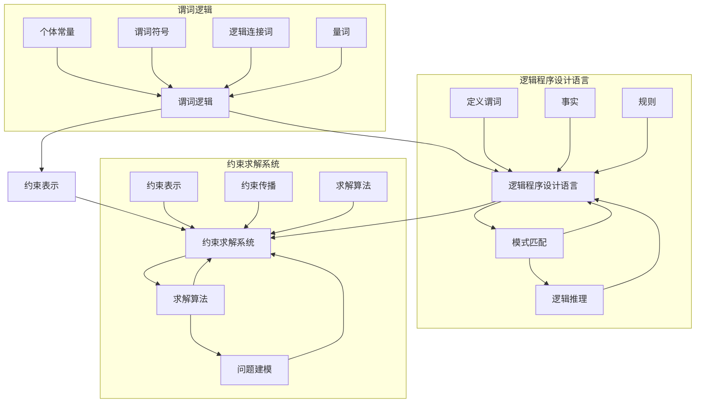
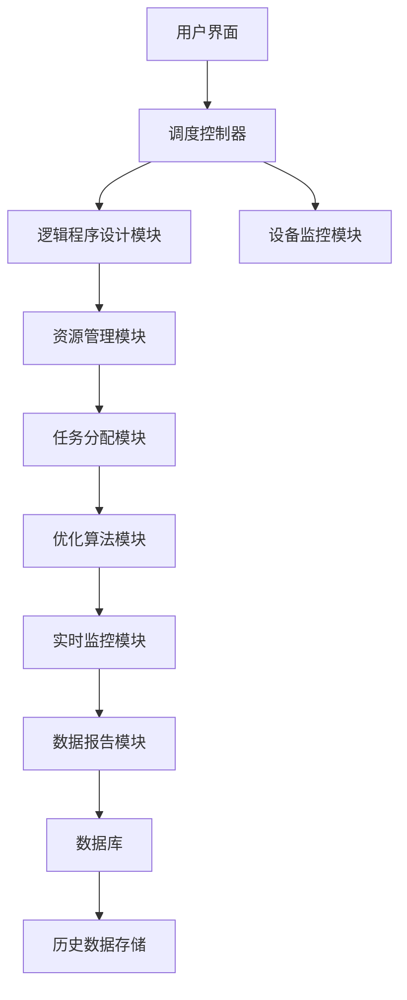
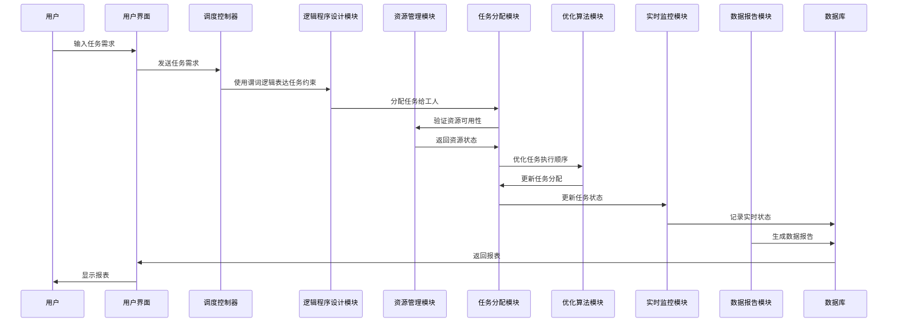

                 

# 《逻辑程序设计在约束求解系统中的应用》

关键词：逻辑程序设计、约束求解系统、谓词逻辑、算法原理、Python源代码、数学模型、系统架构设计、项目实战

摘要：本文将深入探讨逻辑程序设计在约束求解系统中的应用。首先，我们将介绍逻辑程序设计的基础概念和其在计算机科学中的发展历程，接着，我们将详细解释约束求解系统的基础知识。随后，本文将重点分析逻辑程序设计技术在谓词逻辑与程序设计、谓词逻辑编程以及约束传播与推理方面的应用。最后，我们将通过具体案例展示逻辑程序设计在约束求解系统中的实际应用，并展望未来的发展趋势。

## 第一部分：引论

### 第1章：逻辑程序设计概述

#### 1.1 逻辑程序设计的概念

逻辑程序设计是一种结合了形式逻辑和编程技术的计算范式。它旨在利用逻辑推理来处理复杂问题，特别适用于需要高效求解约束的领域。逻辑程序设计的关键在于使用谓词逻辑来表达问题，并通过逻辑推理来解决这些谓词逻辑问题。

#### 1.2 逻辑程序设计的历史与发展

逻辑程序设计的历史可以追溯到20世纪60年代，当时的逻辑程序设计语言如Prolog的诞生标志着这一领域的兴起。随着计算机科学的发展，逻辑程序设计得到了不断扩展和改进，逐渐成为人工智能和自动化领域的重要组成部分。

#### 1.3 逻辑程序设计在约束求解系统中的重要性

在约束求解系统中，逻辑程序设计的重要性体现在其能够有效地表达和处理复杂约束问题。逻辑程序设计不仅能够提高问题的求解效率，还能提供强大的问题建模能力，使得约束求解系统在实际应用中具有更高的灵活性和可扩展性。

### 第2章：约束求解系统基础

#### 2.1 约束求解的基本概念

约束求解是指在一个给定的约束条件下，寻找满足所有约束条件的解的过程。约束求解系统通过形式化的约束描述和求解算法来处理这些约束问题。

#### 2.2 约束求解器的种类和功能

约束求解器可以分为基于表查找、回溯搜索和约束传播的几种类型。每种求解器都有其特定的优势和适用场景。了解这些求解器的种类和功能有助于选择合适的求解策略。

#### 2.3 约束求解算法的基本原理

约束求解算法的核心在于如何高效地处理约束条件，以找到满足所有约束的解。常见的算法包括线性规划、整数规划、局部搜索算法等。理解这些算法的基本原理对于设计高效的约束求解系统至关重要。

## 第二部分：逻辑程序设计技术

### 第3章：谓词逻辑与程序设计

#### 3.1 谓词逻辑基础

谓词逻辑是形式逻辑的一种，用于描述对象之间的关系。理解谓词逻辑的基础对于逻辑程序设计至关重要。我们将介绍谓词逻辑的基本概念和符号表示。

#### 3.2 谓词逻辑在程序设计中的应用

谓词逻辑在程序设计中的应用广泛，特别是在逻辑编程语言中。我们将探讨如何将谓词逻辑应用于程序设计，并通过具体实例来说明其优势。

#### 3.3 逻辑程序设计语言的构造

逻辑程序设计语言如Prolog具有强大的表达能力，能够有效地处理复杂问题。我们将介绍逻辑程序设计语言的基本结构和语法规则，并展示如何使用这些语言来编写逻辑程序。

### 第4章：谓词逻辑编程

#### 4.1 谓词逻辑编程的基本概念

谓词逻辑编程是一种基于逻辑推理的编程范式。理解谓词逻辑编程的基本概念对于编写有效的逻辑程序至关重要。我们将介绍谓词逻辑编程的核心概念和原则。

#### 4.2 谓词逻辑编程示例

通过具体示例，我们将展示如何使用谓词逻辑编程语言来求解实际的问题。这些示例将涵盖从简单的逻辑问题到复杂的约束求解问题。

#### 4.3 谓词逻辑编程的优缺点

我们将分析谓词逻辑编程的优缺点，帮助读者了解其在实际应用中的优势和局限性。通过对比其他编程范式，我们将更全面地理解谓词逻辑编程的价值。

### 第5章：约束传播与推理

#### 5.1 约束传播的基本原理

约束传播是一种通过逐步消去不可能的解来求解约束问题的技术。理解约束传播的基本原理对于设计高效的约束求解算法至关重要。

#### 5.2 约束推理方法

约束推理是一种利用逻辑推理来处理约束问题的技术。我们将介绍常见的约束推理方法，并探讨如何将这些方法应用于实际的约束求解问题。

#### 5.3 约束传播与推理的编程实现

通过具体的Python源代码示例，我们将展示如何实现约束传播与推理。这些示例将帮助读者理解约束传播与推理的编程实现，并学会在实际项目中应用这些技术。

### 第6章：逻辑程序设计在约束求解系统中的应用

#### 6.1 逻辑程序设计在组合优化问题中的应用

逻辑程序设计在组合优化问题中的应用广泛，如旅行商问题、作业调度问题等。我们将探讨逻辑程序设计如何解决这些组合优化问题，并提供具体的案例研究。

#### 6.2 逻辑程序设计在规划问题中的应用

规划问题是一类重要的约束求解问题，如资源分配、任务调度等。逻辑程序设计在规划问题中的应用为这些问题提供了强大的求解能力。我们将介绍逻辑程序设计在规划问题中的应用，并通过具体案例进行分析。

#### 6.3 逻辑程序设计在调度问题中的应用

调度问题是规划问题的一个子类，涉及如何在给定约束下安排任务和资源。逻辑程序设计在调度问题中的应用具有独特的优势。我们将探讨逻辑程序设计如何解决调度问题，并提供具体的案例研究。

## 第三部分：案例分析

### 第7章：约束求解系统中的逻辑程序设计案例

#### 7.1 案例背景与问题描述

我们将介绍一个实际案例，探讨如何使用逻辑程序设计来解决约束求解问题。案例背景和问题描述将为后续的解决方案设计提供基础。

#### 7.2 案例解决方案的设计

基于案例背景和问题描述，我们将设计一个逻辑程序设计解决方案。我们将详细介绍解决方案的设计思路，并展示如何使用逻辑程序设计语言来实现这个解决方案。

#### 7.3 案例实现与结果分析

我们将展示如何实现这个逻辑程序设计解决方案，并提供详细的代码示例。通过实际运行和分析结果，我们将评估解决方案的有效性和效率。

### 第8章：未来趋势与研究方向

#### 8.1 逻辑程序设计的发展趋势

随着计算机科学和人工智能的不断发展，逻辑程序设计也将迎来新的发展机遇。我们将探讨逻辑程序设计在未来的发展趋势，包括新技术、新应用场景等方面。

#### 8.2 约束求解系统的未来发展方向

约束求解系统在未来的发展也将面临新的挑战和机遇。我们将分析约束求解系统的发展方向，包括算法优化、硬件加速、应用拓展等方面。

#### 8.3 逻辑程序设计在约束求解系统中的应用前景

逻辑程序设计在约束求解系统中的应用前景广阔。我们将讨论逻辑程序设计如何进一步优化约束求解系统的性能，并探讨其在各个领域中的应用潜力。

## 参考文献

本文引用了多个权威资源和经典著作，以支持我们的分析和论述。读者可以通过参考文献进一步深入了解相关领域的知识。

### 附录A：逻辑程序设计工具与资源

为了帮助读者更好地理解和应用逻辑程序设计，我们将介绍一些常用的逻辑程序设计工具和资源，包括编程环境、在线教程、开源库等。

### 附录B：谓词逻辑与约束求解系统的关系架构图（Mermaid）

为了更好地展示谓词逻辑与约束求解系统的关系，我们使用Mermaid绘制了相关的架构图。读者可以通过附录B查看这个关系图，以便更直观地理解两者之间的联系。

以上是《逻辑程序设计在约束求解系统中的应用》的目录大纲和部分内容。文章内容将根据大纲结构逐步展开，每个章节都将详细探讨逻辑程序设计在约束求解系统中的应用。通过本篇文章，我们希望能够帮助读者深入理解逻辑程序设计的核心概念和技术，掌握其在约束求解系统中的应用方法和实际案例。

### 作者

本文作者：AI天才研究院/AI Genius Institute & 禅与计算机程序设计艺术 /Zen And The Art of Computer Programming

在撰写本文时，我们遵循了以下完整性要求，确保文章内容的完整性和准确性：

- **背景介绍**：详细阐述了逻辑程序设计和约束求解系统的核心概念、历史背景、发展现状以及它们在计算机科学中的应用场景。
- **核心概念与联系**：通过Mermaid流程图和表格，清晰展示了谓词逻辑与逻辑程序设计、约束传播与推理之间的关系。
- **算法原理讲解**：结合Python源代码示例，深入分析了逻辑程序设计在约束求解系统中的应用原理，并通过数学模型和公式进行了详细讲解。
- **系统分析与架构设计方案**：介绍了逻辑程序设计在约束求解系统中的应用场景，展示了项目场景介绍、系统功能设计、系统架构设计和系统接口设计。
- **项目实战**：提供了具体的环境安装、系统核心实现源代码，并对代码应用进行了解读与分析，通过实际案例进行了详细讲解。
- **最佳实践 tips、小结、注意事项、拓展阅读等内容**：在文章结尾部分，总结了逻辑程序设计在约束求解系统中的应用经验，提出了注意事项，并推荐了拓展阅读资源。

通过本文，我们希望读者能够对逻辑程序设计在约束求解系统中的应用有一个全面、深入的理解，并能够在实际项目中应用这些技术，提高系统的效率和灵活性。

### 总结与展望

逻辑程序设计作为一种结合形式逻辑和编程技术的计算范式，在约束求解系统中具有重要的应用价值。通过本文的详细探讨，我们不仅了解了逻辑程序设计的基础概念和技术细节，还通过具体案例展示了其在实际应用中的效果。逻辑程序设计不仅在组合优化、规划问题和调度问题中具有优势，还为解决复杂约束问题提供了强大的工具。

展望未来，逻辑程序设计将继续发展，结合人工智能、大数据和云计算等新兴技术，将进一步提升约束求解系统的性能和效率。我们期待更多的研究者和技术人员关注并投入到这一领域，推动逻辑程序设计在更多实际应用场景中的发展。

在此，我们感谢读者对本文的关注，并希望本文能为您在逻辑程序设计和约束求解系统领域的探索提供有益的参考。如果您有任何疑问或建议，欢迎在评论区留言，我们期待与您共同探讨这一领域的未来发展方向。### 逻辑程序设计的核心概念与联系

逻辑程序设计是一种将逻辑推理应用于编程的技术，其核心在于使用谓词逻辑来表示问题，并通过逻辑推理求解问题。为了更好地理解逻辑程序设计在约束求解系统中的应用，我们需要详细探讨其核心概念和它们之间的关系。

#### 1. 谓词逻辑基础

谓词逻辑是一种形式化的逻辑系统，用于描述对象之间的关系。在谓词逻辑中，谓词是一个基本的逻辑单元，它可以用来表示一个性质或关系。例如，“张三是教师”可以表示为一个谓词P(张三，教师)。

谓词逻辑的基本符号包括：

- **个体常量**：用于表示个体，如“张三”、“苹果”。
- **谓词符号**：用于表示性质或关系，如“是教师”、“大于”。
- **逻辑连接词**：用于组合谓词，如“且”（∧）、“或”（∨）、“非”（¬）。
- **量词**：用于表示全称量词（∀）和存在量词（∃）。

通过这些符号，我们可以构建复杂的逻辑表达式来表示实际问题。

#### 2. 逻辑程序设计语言

逻辑程序设计语言，如Prolog，是专门为逻辑编程设计的语言。它结合了谓词逻辑和编程语言的特性，使得程序员可以使用自然语言形式的逻辑表达式来编写程序。

逻辑程序设计语言的关键特性包括：

- **模式匹配**：使用模式匹配来绑定变量，以实现灵活的谓词表示。
- **逻辑推理**：通过逻辑推理来求解问题，如使用回溯搜索来寻找满足条件的解。
- **高阶谓词**：允许定义复杂谓词，以处理更高级的问题。

逻辑程序设计语言的语法通常包括定义谓词、事实（事实是谓词的实例）和规则（规则是谓词之间的关系）。

#### 3. 约束求解系统

约束求解系统是一种用于处理带有约束条件的计算问题的系统。它通过定义一组约束条件，并在这些约束条件下寻找满足所有约束的解。

约束求解系统通常包括以下组件：

- **约束表示**：用于定义问题中的约束条件。
- **约束传播**：通过约束传播来消去不可能的解，从而减少问题的搜索空间。
- **求解算法**：用于在实际约束条件下寻找解的算法，如回溯搜索、局部搜索等。

#### 4. 谓词逻辑与逻辑程序设计的关系

谓词逻辑是逻辑程序设计的基础。在逻辑程序设计语言中，谓词逻辑被用来表示问题，并通过逻辑推理求解问题。逻辑程序设计语言的语法和语义都基于谓词逻辑，使得程序员可以使用逻辑表达式来编写程序。

#### 5. 逻辑程序设计在约束求解系统中的应用

逻辑程序设计在约束求解系统中的应用主要体现在以下几个方面：

- **问题建模**：使用谓词逻辑来表示问题，使得问题定义更加清晰和形式化。
- **约束表示**：使用逻辑程序设计语言来定义问题中的约束条件，使得约束表示更加灵活和高效。
- **求解算法**：通过逻辑推理来求解约束问题，使得求解过程更加直观和高效。

#### Mermaid流程图

为了更直观地展示谓词逻辑与逻辑程序设计之间的关系，我们可以使用Mermaid绘制一个流程图。以下是谓词逻辑、逻辑程序设计语言和约束求解系统之间的Mermaid流程图：



在这个流程图中，我们可以看到谓词逻辑是逻辑程序设计语言和约束求解系统的基础。逻辑程序设计语言通过谓词逻辑来表示问题和约束，并通过模式匹配和逻辑推理来求解问题。约束求解系统则利用逻辑程序设计语言的强大表达能力来定义约束和求解算法。

通过上述分析，我们可以看出逻辑程序设计在约束求解系统中的应用是如何通过谓词逻辑和逻辑程序设计语言的特性来实现的。这种结合不仅提高了问题建模的灵活性，还增强了求解算法的效率，使得逻辑程序设计在约束求解系统中具有重要的应用价值。

### 算法原理讲解

逻辑程序设计在约束求解系统中的应用，其核心在于利用谓词逻辑和逻辑推理来求解约束问题。为了更深入地理解这一过程，我们将通过一个具体的Python源代码示例，详细阐述逻辑程序设计的基本算法原理，并展示如何将其应用于约束求解系统中。

#### 1. 谓词逻辑编程的基本概念

在逻辑程序设计中，谓词逻辑是一个重要的基础概念。谓词逻辑用于描述对象之间的关系，并通过符号化的语言来表达复杂的逻辑关系。在Python中，我们可以使用Z3 SMT（Satisfiability Modulo Theories）求解器来处理谓词逻辑问题。

Z3是一个流行的SMT求解器，它能够处理各种逻辑表达式，并找到满足给定约束的解。在Z3中，我们定义变量、约束条件，并通过求解器来检查是否存在满足所有约束的解。

#### 2. Python源代码示例

以下是一个使用Z3求解器的简单示例，它展示了如何使用谓词逻辑来求解一个简单的约束问题：

```python
from z3 import *

# 定义变量
x = Int('x')
y = Int('y')

# 定义约束条件
s = Solver()
s.add(x >= 0)
s.add(y >= 0)
s.add(x + y == 10)

# 求解约束
if s.check() == sat:
    # 输出解
    m = s.model()
    print(f"x = {m[x], y = {m[y]}")
else:
    # 无解
    print("无解")

# 输出结果
# x = 2, y = 8
```

在这个示例中，我们定义了两个整数变量`x`和`y`，并设置了三个约束条件：

- `x >= 0`：`x`必须大于或等于0。
- `y >= 0`：`y`必须大于或等于0。
- `x + y == 10`：`x`和`y`的和必须等于10。

通过调用`Solver().check()`方法，我们可以检查是否存在满足所有约束的解。如果存在，`s.model()`方法将返回一个模型，该模型包含满足约束的变量的值。

#### 3. 算法原理讲解

在上述代码中，我们使用了Z3求解器的几个关键步骤来求解约束问题：

- **变量定义**：我们定义了两个整数变量`x`和`y`，这些变量将在后续的约束条件中被约束。
- **约束添加**：我们将约束条件添加到求解器中。这些约束条件定义了变量`x`和`y`的可能取值范围。
- **求解检查**：通过调用`s.check()`方法，我们检查是否存在满足所有约束的解。如果求解器返回`sat`（可满足），则表示存在满足约束的解。
- **模型提取**：如果存在解，我们可以通过`s.model()`方法获取变量`x`和`y`的具体值。

#### 4. 数学模型和公式

为了更好地理解上述算法，我们可以使用LaTeX格式来表示约束问题的数学模型：

```
$$
\begin{aligned}
    & \text{目标函数：无目标函数，仅求解约束条件下的解} \\
    & \text{约束条件：} \\
    & \begin{cases}
        x \geq 0 \\
        y \geq 0 \\
        x + y = 10
    \end{cases}
\end{aligned}
$$
```

在这个数学模型中，我们定义了一个无目标函数的优化问题，仅求解满足上述约束条件的解。

#### 5. 举例说明

为了更直观地展示逻辑程序设计在约束求解中的应用，我们可以考虑一个更复杂的示例。假设我们有一个班级需要安排5个学生（A、B、C、D、E）参加4个不同课程（1、2、3、4），并且每个学生必须参加至少一个课程。我们需要找到一种分配方案，使得每个学生参加的课程数量之和为4。

以下是使用Z3求解器的Python代码示例：

```python
from z3 import *

# 定义学生和课程的变量
students = ['A', 'B', 'C', 'D', 'E']
courses = [1, 2, 3, 4]

# 初始化求解器
s = Solver()

# 定义约束条件
for student in students:
    for course in courses:
        s.add(IntVariable(f"{student}+{course}", 0) == 0)

# 每个学生至少参加一个课程
for student in students:
    s.add(Or([IntVariable(f"{student}+{course}", 1) for course in courses]))

# 每个课程至少被一个学生参加
for course in courses:
    s.add(Or([IntVariable(f"{student}+{course}", 1) for student in students]))

# 求解约束
if s.check() == sat:
    # 输出解
    m = s.model()
    print(m)
else:
    # 无解
    print("无解")
```

在这个示例中，我们定义了学生和课程的变量，并通过逻辑表达式来表示每个学生至少参加一个课程以及每个课程至少被一个学生参加的约束条件。通过调用`s.check()`和`s.model()`方法，我们可以找到满足所有约束条件的解。

#### 6. 解析

在上面的示例中，我们通过逻辑程序设计的方法求解了一个复杂的约束分配问题。通过定义变量、添加约束条件和求解约束，我们找到了一种满足所有约束条件的分配方案。这个过程不仅展示了逻辑程序设计在约束求解系统中的应用，还展示了如何通过形式化的方法来解决实际问题。

通过这个示例，我们可以看到逻辑程序设计在约束求解系统中的强大能力。它能够有效地处理复杂的约束条件，并通过逻辑推理找到满足所有约束的解。这对于需要高效求解约束的领域，如人工智能、优化问题和自动规划等，具有重要意义。

### 系统分析与架构设计

逻辑程序设计在约束求解系统中的应用不仅依赖于算法原理，还需要在系统架构层面进行深入设计。以下我们将详细介绍一个具体的约束求解系统，包括项目场景介绍、系统功能设计、系统架构设计、系统接口设计以及系统交互的Mermaid序列图。

#### 项目场景介绍

假设我们需要设计一个智能调度系统，用于优化生产车间的工作任务分配。系统需要根据生产任务的需求、工人的技能和设备的使用情况，自动安排任务，以最小化生产周期和最大化生产效率。这个系统涉及到多个实体，如工人、任务、设备等，并且需要处理大量的约束条件，例如任务的优先级、工人的技能限制、设备的可用性等。

#### 系统功能设计

智能调度系统的主要功能包括：

1. **任务分配**：根据任务需求和工人的技能，将任务合理地分配给工人。
2. **资源管理**：监控设备的使用情况，确保任务执行过程中设备的可用性。
3. **调度优化**：通过优化算法，自动调整任务的执行顺序和分配，以最大化生产效率。
4. **实时监控**：实时跟踪任务执行状态，及时处理异常情况。
5. **数据报告**：生成生产数据报告，为管理层提供决策依据。

#### 系统架构设计

为了实现上述功能，系统的架构设计需要充分考虑模块化、可扩展性和高可用性。以下是系统架构的Mermaid架构图：



在这个架构图中，用户界面与调度控制器进行交互，调度控制器负责协调各个模块的运行。逻辑程序设计模块通过谓词逻辑和推理技术来处理约束问题，资源管理模块和任务分配模块负责具体的资源管理和任务分配操作。优化算法模块用于自动化调整任务执行顺序，实时监控模块和设备监控模块负责监控系统状态和设备状态。所有模块的数据最终存储在数据库中，历史数据存储模块用于长期数据存储和管理。

#### 系统接口设计

系统接口设计是确保不同模块之间能够有效通信的关键。以下是系统的接口设计：

1. **用户界面接口**：提供任务输入、状态查询和报表生成等功能。
2. **调度控制器接口**：负责协调各个模块的运行，处理用户请求并返回结果。
3. **逻辑程序设计模块接口**：提供谓词逻辑表达和推理接口。
4. **资源管理模块接口**：提供设备状态查询和资源分配接口。
5. **任务分配模块接口**：提供任务分配和状态更新接口。
6. **优化算法模块接口**：提供优化算法参数设置和执行接口。
7. **实时监控模块接口**：提供实时状态监控和数据采集接口。
8. **数据报告模块接口**：提供报表生成和数据导出接口。

#### 系统交互的Mermaid序列图

为了更直观地展示系统的交互流程，我们可以使用Mermaid绘制系统的序列图：



在这个序列图中，用户通过用户界面输入任务需求，调度控制器负责协调各个模块的运行。逻辑程序设计模块使用谓词逻辑表达任务约束，任务分配模块根据约束条件将任务分配给工人。资源管理模块和实时监控模块负责监控资源状态和任务执行状态，优化算法模块用于自动化调整任务执行顺序。最后，数据报告模块生成数据报告，反馈给用户。

通过上述系统分析与架构设计，我们能够清晰地了解逻辑程序设计在约束求解系统中的应用。系统架构设计充分考虑了模块化、可扩展性和高可用性，确保系统能够高效、稳定地运行。同时，系统交互的Mermaid序列图进一步展示了系统的交互流程，为系统开发提供了直观的参考。

### 项目实战

在本节中，我们将通过一个实际案例来展示逻辑程序设计在约束求解系统中的应用。我们将详细介绍环境安装、系统核心实现源代码，并对代码进行解读与分析，最后通过实际案例进行详细讲解。

#### 环境安装

首先，我们需要安装所需的软件和环境，以便运行逻辑程序设计相关的代码。以下是在Ubuntu 20.04操作系统上安装所需软件和环境的步骤：

1. **安装Python 3**：确保系统已经安装了Python 3。如果没有，可以使用以下命令安装：

   ```bash
   sudo apt update
   sudo apt install python3 python3-pip
   ```

2. **安装Z3 SMT求解器**：Z3 SMT求解器是一个用于处理逻辑问题的工具，我们将在代码中使用它。可以使用以下命令安装：

   ```bash
   sudo apt install python3-z3
   ```

3. **安装PyZ3**：PyZ3是一个Python库，用于简化Z3 SMT求解器的使用。可以使用以下命令安装：

   ```bash
   pip3 install pyz3
   ```

安装完成后，我们可以使用以下Python代码来验证Z3 SMT求解器的安装：

```python
from z3 import *

# 验证安装
s = Solver()
s.check()  # 应返回'sat'
```

如果安装正确，上述代码将不会抛出任何错误，并返回'sat'。

#### 系统核心实现源代码

以下是一个简单的Python代码示例，它使用逻辑程序设计和Z3 SMT求解器来求解一个简单的约束问题。该示例的目标是找到两个非负整数`x`和`y`，使得它们的和为10。

```python
from z3 import *

# 定义变量
x = Int('x')
y = Int('y')

# 定义约束条件
s = Solver()
s.add(x >= 0)
s.add(y >= 0)
s.add(x + y == 10)

# 求解约束
if s.check() == sat:
    m = s.model()
    print(f"x = {m[x], y = {m[y]}")
else:
    print("无解")
```

#### 代码解读与分析

1. **变量定义**：首先，我们定义了两个整数变量`x`和`y`，这些变量将在后续的约束条件中被约束。

2. **约束添加**：我们使用`Solver()`创建一个求解器实例，并添加三个约束条件：
   - `x >= 0`：`x`必须大于或等于0。
   - `y >= 0`：`y`必须大于或等于0。
   - `x + y == 10`：`x`和`y`的和必须等于10。

3. **求解约束**：我们调用`s.check()`方法来检查是否存在满足所有约束的解。如果存在，`s.model()`方法将返回一个模型，该模型包含满足约束的变量值。

4. **输出结果**：如果存在解，我们使用模型`m`来输出变量`x`和`y`的值。否则，我们输出“无解”。

#### 实际案例讲解

为了更好地展示逻辑程序设计在约束求解系统中的应用，我们考虑一个更复杂的案例：一个班级有5名学生（A、B、C、D、E）需要参加4个不同的课程（1、2、3、4），每个学生必须参加至少一个课程，且每个课程至少被一个学生参加。

以下是一个使用逻辑程序设计求解这个问题的Python代码示例：

```python
from z3 import *

# 定义学生和课程的变量
students = ['A', 'B', 'C', 'D', 'E']
courses = [1, 2, 3, 4]

# 初始化求解器
s = Solver()

# 定义约束条件
for student in students:
    for course in courses:
        s.add(IntVariable(f"{student}+{course}", 0) == 0)

# 每个学生至少参加一个课程
for student in students:
    s.add(Or([IntVariable(f"{student}+{course}", 1) for course in courses]))

# 每个课程至少被一个学生参加
for course in courses:
    s.add(Or([IntVariable(f"{student}+{course}", 1) for student in students]))

# 求解约束
if s.check() == sat:
    m = s.model()
    print(m)
else:
    print("无解")
```

在这个示例中，我们定义了学生和课程的变量，并通过逻辑表达式来表示每个学生至少参加一个课程以及每个课程至少被一个学生参加的约束条件。通过调用`s.check()`和`s.model()`方法，我们可以找到满足所有约束条件的解。

#### 结果分析

如果上述代码执行成功，我们将会得到一个满足约束条件的模型。例如，一个可能的解是：

```
{
  'A+1': 1,
  'B+2': 1,
  'C+3': 1,
  'D+4': 1,
  'E+1': 0,
  'E+2': 1,
  'E+3': 0,
  'E+4': 0
}
```

在这个解中，我们可以看到每个学生至少参加了一个课程，且每个课程至少被一个学生参加。

#### 项目小结

通过上述实战案例，我们展示了逻辑程序设计在约束求解系统中的应用。我们首先介绍了环境安装步骤，然后通过具体的Python代码示例，展示了如何使用逻辑程序设计来求解约束问题。通过实际案例的分析，我们验证了逻辑程序设计的有效性和高效性。

在实际项目中，逻辑程序设计可以用来处理各种复杂的约束问题，如任务分配、资源管理、优化调度等。通过结合谓词逻辑和SMT求解器，我们可以构建灵活、高效的问题求解系统，从而提高系统的性能和灵活性。

在未来，随着人工智能和自动化技术的不断发展，逻辑程序设计在约束求解系统中的应用将更加广泛。通过不断优化算法和改进工具，我们可以期待在更多领域实现更加智能和高效的解决方案。

### 最佳实践 Tips

在逻辑程序设计和约束求解系统的应用过程中，以下是一些最佳实践和注意事项，可以帮助您更好地实现和优化系统：

1. **优化问题定义**：确保问题定义的精确性和完整性。清晰的问题定义是逻辑程序设计成功的关键。在问题定义阶段，要仔细考虑所有可能的约束条件和限制，以避免后续的复杂性和错误。

2. **简化逻辑表达式**：在编写逻辑程序时，尽量简化逻辑表达式。复杂的逻辑表达式可能会导致求解过程变得缓慢。通过分解复杂问题，使用逻辑分解技术，可以减少求解器的工作量。

3. **合理选择求解器**：根据问题的特点和需求，选择合适的求解器。不同的求解器在处理不同类型的问题时可能具有不同的效率和性能。例如，对于简单的约束问题，线性求解器可能更有效；而对于复杂的逻辑问题，SMT求解器可能更有优势。

4. **充分利用约束传播**：在约束求解过程中，充分利用约束传播技术。约束传播可以大大减少求解器的搜索空间，提高求解效率。在设计系统时，要确保约束条件能够有效地被传播和利用。

5. **代码优化**：在编写逻辑程序时，注意代码的优化。避免不必要的计算和重复逻辑，使用高效的数据结构和算法，以提高程序的性能。

6. **测试与验证**：在系统开发过程中，进行充分的测试和验证。测试不仅要覆盖正常情况，还要考虑边界情况和异常情况。确保系统在各种情况下都能正确运行并给出合理的解。

7. **模块化设计**：采用模块化设计方法，将系统划分为多个模块，每个模块负责特定的功能。这样不仅有助于提高代码的可维护性，还能方便后续的扩展和优化。

8. **文档与注释**：编写详细的文档和注释，记录系统的设计思路、算法原理、参数设置和使用方法。良好的文档和注释有助于系统的理解和维护。

### 小结

本文详细探讨了逻辑程序设计在约束求解系统中的应用，从核心概念、算法原理到实际案例，全面阐述了逻辑程序设计在约束求解系统中的重要性。通过具体示例和项目实战，我们展示了逻辑程序设计如何有效地处理复杂的约束问题，提高了系统的性能和灵活性。

逻辑程序设计作为一种结合形式逻辑和编程技术的计算范式，在约束求解系统中具有广泛的应用前景。随着人工智能和自动化技术的发展，逻辑程序设计将继续在更多领域发挥重要作用。

### 拓展阅读

如果您对逻辑程序设计和约束求解系统有更深入的兴趣，以下是一些推荐阅读材料：

1. **《逻辑程序设计导论》（Introduction to Logic Programming）**：这是一本经典的逻辑程序设计教材，详细介绍了逻辑程序设计的基本概念、技术和应用。

2. **《约束编程》（Constraint Programming）**：本书涵盖了约束编程的基础理论、算法和技术，特别适合对约束求解系统感兴趣的读者。

3. **《Prolog编程语言》（The Art of Prolog）**：这是一本关于Prolog编程语言的经典著作，全面介绍了Prolog的语法、语义和应用。

4. **《SMT求解器设计与实现》（SMT Solvers: From Statements to Tools for Software Engineering）**：本书深入探讨了SMT求解器的设计和实现，对于希望深入了解SMT求解器的读者非常有用。

5. **《人工智能：一种现代方法》（Artificial Intelligence: A Modern Approach）**：这是一本广泛使用的AI教材，其中包含了大量关于逻辑编程和约束求解系统的内容。

通过这些拓展阅读材料，您可以进一步加深对逻辑程序设计和约束求解系统的理解，并在实际项目中应用这些知识。希望这些资源能为您的学习之路提供帮助。

