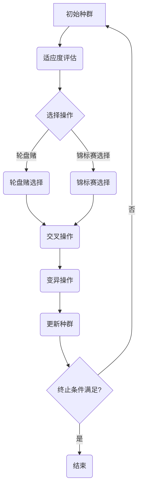
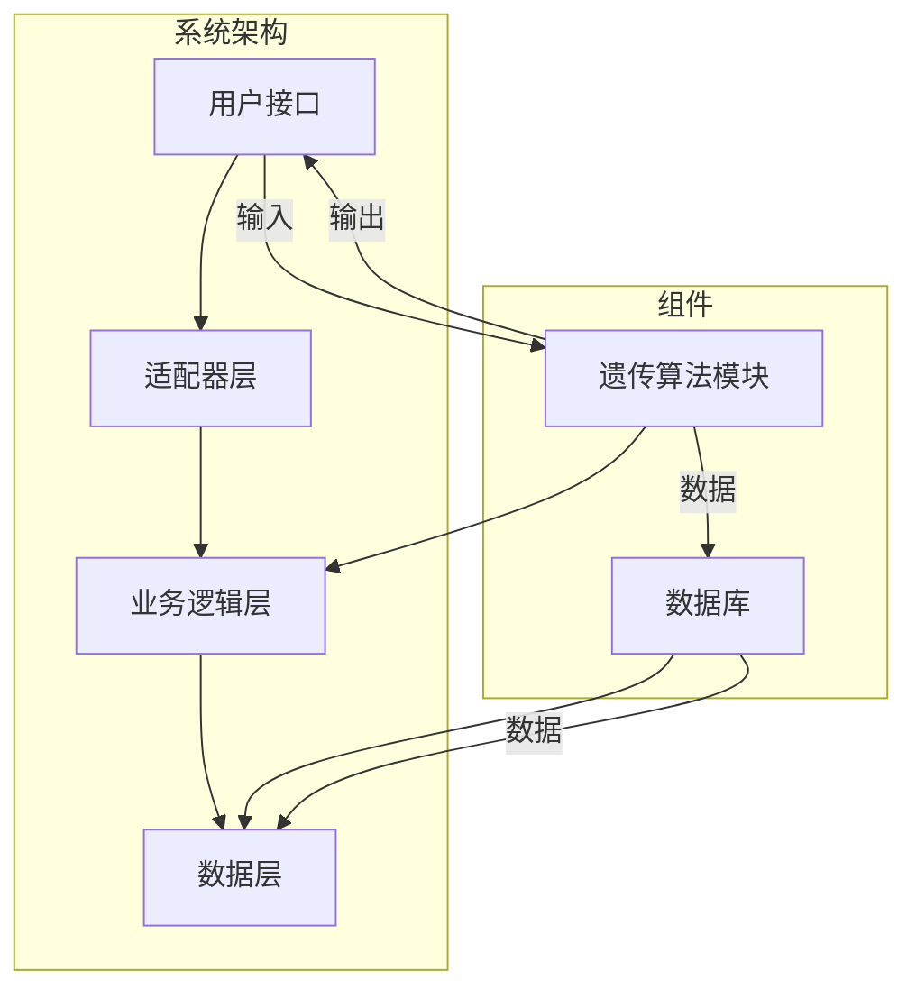
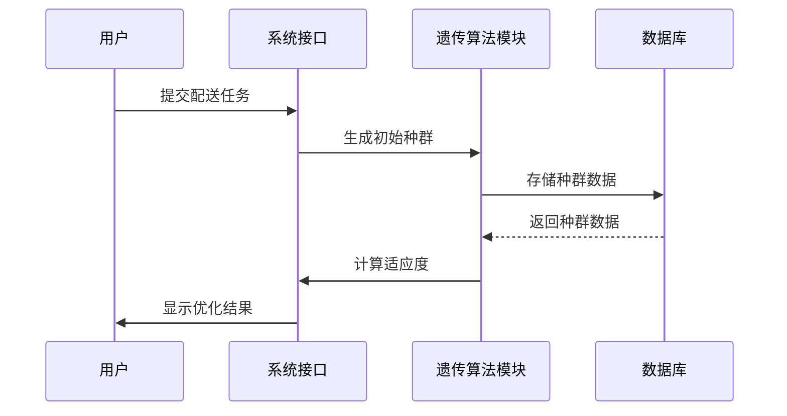

                 


## 概述：遗传算法与进化计算优化

遗传算法（Genetic Algorithm，GA）和进化计算（Evolutionary Computation，EC）是优化算法中的重要分支，源于生物进化的自然选择、遗传、变异等过程，通过模拟自然进化机制来解决复杂的优化问题。这些算法在工程、科学和社会等多个领域有着广泛的应用。

本文将系统地介绍遗传算法和进化计算的基本理论、数学基础、基本结构、优化策略以及应用实例，旨在帮助读者深入理解这些算法的核心思想和方法，并掌握其在实际问题中的应用技巧。

### 背景介绍

遗传算法和进化计算起源于20世纪60年代，其理论基础是查尔斯·达尔文的自然选择理论和遗传学。1975年，John Holland提出了遗传算法的基本概念，随后，这些算法在优化、机器学习、人工智能等领域得到了广泛应用。进化计算作为一种全局搜索算法，具有很强的鲁棒性和适应性，能够在复杂的搜索空间中找到近似最优解。

遗传算法和进化计算在工程领域有着广泛的应用。例如，在车辆路径规划、联合调度、生产调度等方面，遗传算法能够有效地解决复杂的优化问题。在科学领域，这些算法被用于参数估计、信号处理、图像识别等任务。此外，在金融、医学、社会等领域，遗传算法和进化计算也展现出了巨大的潜力。

### 问题解决

遗传算法和进化计算通过模拟生物进化的过程来解决优化问题。具体来说，这些算法包括以下几个基本步骤：

1. **初始化种群**：随机生成一组解作为初始种群。
2. **适应度评估**：计算每个解的适应度值，适应度值表示解的质量。
3. **选择**：根据适应度值选择优秀的解作为父代。
4. **交叉**：通过交叉操作产生新的解。
5. **变异**：对部分解进行变异操作，增加种群的多样性。
6. **更新种群**：将交叉和变异后的解作为新的种群。

这个过程不断迭代，直到满足终止条件（如达到最大迭代次数或找到满意的解）。

### 边界与外延

遗传算法和进化计算虽然源于生物学，但在计算机科学中，它们有着明确的定义和边界。遗传算法通常指的是一种基于染色体编码、适应度评估、选择、交叉和变异等操作的搜索算法。进化计算则是一个更广泛的领域，包括遗传算法以及其他类似的算法，如进化策略、文化算法、基因编程等。

### 概念结构与核心要素组成

遗传算法和进化计算的核心概念包括：

- **染色体编码**：将问题解编码为染色体，通常使用二进制编码、实值编码等。
- **适应度函数**：评估解的质量，通常是一个实值函数。
- **选择操作**：根据适应度值选择父代。
- **交叉操作**：生成新的解。
- **变异操作**：对解进行随机改变。

这些概念相互联系，构成了遗传算法和进化计算的核心结构。

### 总结

遗传算法和进化计算是优化领域的重要工具，通过模拟自然进化过程，能够解决许多复杂的优化问题。本文将逐步深入探讨这些算法的理论基础、数学模型、优化策略以及实际应用，帮助读者更好地理解和应用这些算法。在接下来的章节中，我们将详细讨论遗传算法和进化计算的基本理论、数学基础、基本结构、优化策略以及其他相关模型。

### 遗传算法概述

遗传算法（Genetic Algorithm，GA）是进化计算的一个重要分支，源于查尔斯·达尔文的自然选择理论。遗传算法通过模拟生物进化的过程，寻找优化问题的最优解。与传统的优化算法不同，遗传算法是一种基于概率的搜索算法，具有较强的鲁棒性和全局搜索能力。

### 遗传算法的基本概念

遗传算法的基本概念包括染色体、种群、适应度函数、选择、交叉和变异等。

- **染色体**：染色体是遗传算法中的基本数据结构，用于表示问题的解。染色体通常是一组基因的组合，每个基因表示解的一个特征。

- **种群**：种群是遗传算法中的多个染色体的集合。初始种群随机生成，每个染色体都有一定的适应度值。

- **适应度函数**：适应度函数是评估染色体适应度的指标，通常是一个实值函数。适应度值越高，表示染色体的质量越好。

- **选择**：选择操作是根据适应度值选择优秀的染色体作为父代的过程。常用的选择方法包括轮盘赌选择、锦标赛选择等。

- **交叉**：交叉操作是生成新染色体的过程，通过将两个父代的基因组合，产生新的解。

- **变异**：变异操作是对染色体的基因进行随机改变，以增加种群的多样性。

### 遗传算法的主要特征

遗传算法具有以下几个主要特征：

- **并行搜索**：遗传算法通过种群中的多个染色体并行搜索，能够加快收敛速度。

- **全局搜索能力**：遗传算法在搜索过程中，通过选择、交叉和变异等操作，能够在全局范围内搜索最优解。

- **鲁棒性**：遗传算法对问题的初始条件和参数设置具有较强的鲁棒性，不易陷入局部最优。

- **适应性**：遗传算法能够适应不同类型的问题，通过调整参数和操作策略，可以应用于各种复杂的优化问题。

### 遗传算法的发展

遗传算法的发展可以分为以下几个阶段：

- **早期发展**：遗传算法的早期研究主要集中在优化问题的求解，主要贡献者包括John Holland和James Simons。

- **成熟期**：在20世纪80年代，遗传算法逐渐应用于复杂优化问题，如车辆路径规划、生产调度等。这一时期，遗传算法的理论和实现技术得到了迅速发展。

- **现代发展**：随着计算机技术的发展，遗传算法在算法优化、机器学习、人工智能等领域得到了广泛应用。现代遗传算法结合了多种优化策略，如多目标优化、协同进化等，进一步提升了其性能和应用范围。

### 遗传算法的应用领域

遗传算法在多个领域都有着广泛的应用：

- **工程优化**：遗传算法在工程优化领域，如结构设计、电路设计、机器人控制等方面，被广泛应用于求解复杂优化问题。

- **机器学习**：遗传算法在机器学习中，如神经网络结构优化、参数调优等方面，发挥了重要作用。

- **人工智能**：遗传算法在人工智能领域，如智能搜索、自适应控制、图像识别等方面，展现出了强大的能力。

- **生物信息学**：遗传算法在生物信息学领域，如基因序列分析、蛋白质结构预测等方面，提供了有效的求解方法。

### 总结

遗传算法作为一种基于自然进化机制的优化算法，具有强大的全局搜索能力和鲁棒性。通过模拟生物进化的过程，遗传算法能够解决复杂的优化问题。本文介绍了遗传算法的基本概念、主要特征、发展历程和应用领域，为读者提供了对遗传算法的全面了解。

### 进化计算的基本概念

进化计算（Evolutionary Computation，EC）是一类基于生物进化理论的计算方法，广泛应用于优化、机器学习、人工智能等领域。它与遗传算法（Genetic Algorithm，GA）密切相关，但进化计算的定义更为广泛，包括多种进化算法和模型。

#### 进化计算的定义

进化计算的定义可以从以下几个方面理解：

1. **模拟自然进化过程**：进化计算通过模拟生物进化的过程，如自然选择、遗传、变异等，来优化问题的解。
2. **种群驱动**：进化计算通常采用种群驱动的搜索策略，即通过多个个体的竞争和合作来寻找最优解。
3. **适应度导向**：进化计算以适应度作为个体优劣的评价标准，适应度高的个体更有可能被选中并传递给下一代。
4. **逐步优化**：进化计算通过迭代过程不断优化种群中的个体，逐步逼近最优解。

#### 关系与区别

遗传算法是进化计算的一个典型代表，两者之间的关系如下：

1. **广义与狭义**：进化计算是一个广义的概念，包括遗传算法、进化策略、文化算法、基因编程等多种算法。而遗传算法是进化计算中的一个狭义概念，指的是一种基于染色体编码、适应度评估、选择、交叉和变异等操作的搜索算法。
2. **算法结构**：遗传算法的结构较为固定，通常包括初始种群、适应度评估、选择、交叉和变异等步骤。而进化计算的其他算法，如进化策略和文化算法，在结构上可能会有所不同。
3. **应用领域**：遗传算法在工程优化、机器学习等领域有广泛应用。而进化计算的其他算法，如文化算法和基因编程，在特定领域（如多目标优化、高维搜索等）有独特优势。

#### 遗传算法与进化计算的区别

尽管遗传算法是进化计算的一种形式，但两者在以下方面存在区别：

1. **编码方式**：遗传算法通常采用二进制编码，而进化计算的其他算法（如进化策略）可能采用实值编码。
2. **适应度评估**：遗传算法的适应度评估通常是基于个体的解，而进化计算的其他算法可能基于群体或个体的多个属性。
3. **变异操作**：遗传算法的变异操作通常较为简单，而进化计算的其他算法可能有更复杂的变异机制。
4. **应用范围**：遗传算法适用于大多数优化问题，而进化计算的其他算法可能在特定领域（如多目标优化、高维搜索等）有更好的性能。

### 遗传算法与进化计算的联系

尽管遗传算法和进化计算在形式上有所不同，但它们在理论基础和算法思想上有很多共通之处：

1. **自然进化机制**：两者都基于自然进化的基本原理，如自然选择、遗传、变异等。
2. **种群驱动搜索**：两者都采用种群驱动的搜索策略，通过群体间的竞争和合作来寻找最优解。
3. **适应度导向**：两者都采用适应度作为个体优劣的评价标准，适应度高的个体更有可能被选中并传递给下一代。

### 总结

进化计算是一个广泛的领域，包括遗传算法、进化策略、文化算法、基因编程等多种算法。遗传算法是进化计算的一个代表性算法，但两者在编码方式、适应度评估、变异操作和应用范围等方面存在差异。通过理解这些基本概念和联系，读者可以更好地选择和应用进化计算方法来解决实际问题。

### 遗传算法的历史与发展

遗传算法（Genetic Algorithm，GA）作为进化计算的一个重要分支，其发展历程可以追溯到20世纪60年代。在这一时期，计算机科学的兴起和优化问题的复杂性促使研究人员开始探索新的搜索和优化方法。遗传算法的概念最早由美国密歇根大学的John Holland于1975年提出，随后在70年代和80年代得到了迅速发展。本文将回顾遗传算法的历史发展过程，介绍其主要贡献者及其研究成果。

#### 历史背景

遗传算法的起源可以追溯到20世纪60年代，当时计算机科学的快速发展使得人们开始关注复杂系统的优化问题。优化问题通常涉及在庞大的搜索空间中寻找最优解，传统的方法如贪心算法和动态规划在这些问题上往往表现不佳。1962年，约翰·霍普菲尔德（John Hopfield）提出了人工神经网络，这为后来的遗传算法提供了理论基础。同时，进化算法的研究也开始萌芽，主要集中于模拟生物进化过程中的自然选择、遗传和变异机制。

#### 发展进程

1. **John Holland**：1975年，John Holland在《自然系统中的自适应策略》一书中首次提出了遗传算法的基本概念。他认为，遗传算法可以通过模拟生物进化过程来优化复杂系统的设计。Holland的工作为遗传算法的发展奠定了基础。

2. **David E. Goldberg**：David E. Goldberg在20世纪80年代对遗传算法进行了系统的研究，他在1989年出版的《遗传算法：基础、技术及应用》一书中详细介绍了遗传算法的理论基础和实际应用。Goldberg的工作推动了遗传算法在优化问题中的应用，使其成为解决复杂优化问题的重要工具。

3. **Kenneth De Jong**：Kenneth De Jong在遗传算法的发展过程中做出了重要贡献。他在1990年代的研究中，通过实验证明了遗传算法在解决多峰函数优化问题上的优势，并提出了许多改进的遗传算法，如多目标遗传算法（MOGA）。

4. **Silvia Corne**、**Michael J. Oates**和**John D. Smith**：Silvia Corne、Michael J. Oates和John D. Smith在1990年代共同推动了遗传算法在多目标优化问题中的应用。他们提出了Pareto最优解的概念，并将其应用于遗传算法，从而解决了多目标优化问题中的非支配排序遗传算法（NSGA）。

#### 主要贡献者

1. **John Holland**：作为遗传算法的创始人之一，John Holland的工作奠定了遗传算法的理论基础。他在遗传算法的编码方式、适应度函数设计等方面做出了重要贡献。

2. **David E. Goldberg**：Goldberg对遗传算法的推广和普及起到了关键作用，他的著作对遗传算法的理论和实践产生了深远影响。

3. **Kenneth De Jong**：De Jong在遗传算法的多峰函数优化和进化策略方面做出了重要贡献，推动了遗传算法在多个领域的应用。

4. **Silvia Corne**、**Michael J. Oates**和**John D. Smith**：他们在多目标遗传算法（MOGA）的研究和应用方面取得了显著成果，为遗传算法在复杂优化问题中的应用提供了新的思路和方法。

#### 发展进程

1. **早期研究**：1970年代，遗传算法的概念开始萌芽，John Holland和其他研究者开始探索遗传算法在优化问题中的应用。

2. **成熟期**：1980年代，遗传算法的理论基础逐渐完善，研究者们开始将其应用于实际优化问题，如电路设计、生产调度等。

3. **现代发展**：1990年代至今，遗传算法在多目标优化、进化策略、协同进化等领域得到了广泛应用。现代遗传算法结合了多种优化策略和技术，进一步提升了其性能和应用范围。

#### 主要研究成果

1. **遗传算法的基本框架**：研究者们提出了遗传算法的基本框架，包括初始种群、适应度评估、选择、交叉和变异等操作。

2. **编码方式**：研究者们提出了多种染色体编码方式，如二进制编码、实值编码、格雷码编码等，以适应不同类型的问题。

3. **适应度函数**：研究者们设计了各种适应度函数，以评估染色体的优劣，从而引导搜索过程。

4. **多目标遗传算法**：Silvia Corne、Michael J. Oates和John D. Smith提出了多目标遗传算法，为解决多目标优化问题提供了有效的方法。

5. **并行遗传算法**：随着计算机技术的发展，研究者们提出了并行遗传算法，以加快搜索速度和提高计算效率。

### 总结

遗传算法的历史发展历程展示了其在优化问题中的巨大潜力。从John Holland的最初提出，到Goldberg、De Jong等研究者的系统研究，再到现代遗传算法的多目标优化和并行计算，遗传算法在不断演进和完善中，成为解决复杂优化问题的重要工具。通过回顾遗传算法的历史与发展，我们可以更好地理解其核心思想和应用方法。

### 遗传算法的数学基础

遗传算法作为一种基于概率和统计的搜索算法，其核心思想源于生物进化的自然选择、遗传和变异过程。要深入理解遗传算法，必须掌握其数学基础，包括概率与统计、基因表达与编码、适应度函数等内容。本文将逐步介绍这些基本概念，帮助读者构建遗传算法的数学模型。

#### 遗传算法中的概率与统计

概率与统计是遗传算法的基础，它们在算法的设计和实现中起到了关键作用。

1. **概率基础**
   - **随机性**：遗传算法中的许多操作，如选择、交叉和变异，都是基于随机性的。这种随机性使得算法能够在搜索空间中探索不同的解，避免了陷入局部最优。
   - **概率分布**：遗传算法常用概率分布来描述个体的适应度，例如正态分布、均匀分布等。概率分布决定了个体被选择的概率，从而影响了种群的进化方向。

2. **统计分布**
   - **期望与方差**：在遗传算法中，期望和方差是评估种群进化的关键指标。期望表示种群的平均适应度，方差表示适应度的离散程度。较小的方差意味着种群进化较为集中，而较大的方差则表示种群分布较为分散。

#### 基因表达与编码

基因表达与编码是遗传算法的核心，它们决定了问题的解如何被表示和操作。

1. **基因表达**
   - **二进制编码**：二进制编码是最常见的基因表达方式，它将问题的解表示为二进制字符串。每个位表示解的一个特征，0和1分别表示特征的两种状态。
   - **实值编码**：实值编码将问题的解表示为实数。这种方法适用于连续优化问题，通过限制实值的范围来确保编码的合理性。

2. **编码方法**
   - **直接编码**：直接编码是最简单的一种编码方式，它直接将问题的解编码为基因。例如，在旅行商问题中，直接编码将每个城市的编号表示为基因。
   - **间接编码**：间接编码将问题的解编码为基因的编码，例如，通过解码过程将基因转换为问题的解。

#### 适应度函数

适应度函数是遗传算法中的核心组件，它评估个体（解）的优劣，是选择、交叉和变异等操作的基础。

1. **定义**
   - 适应度函数是一个映射，将个体的基因编码映射为一个适应度值。适应度值通常表示个体对问题的适应程度，值越高表示个体越优秀。

2. **类型与设计原则**
   - **单峰适应度函数**：单峰适应度函数在全局最优附近有一个尖锐的最高点，其余部分逐渐降低。这种适应度函数适用于单目标优化问题，易于找到全局最优解。
   - **多峰适应度函数**：多峰适应度函数具有多个局部最优解，通常需要多目标优化方法来找到多个最优解。多峰适应度函数适用于多目标优化问题。

   - **设计原则**：
     - **区分度**：适应度函数应具有足够的区分度，使优秀个体能够脱颖而出。
     - **连续性**：适应度函数应在整个搜索空间内连续变化，避免出现突变。
     - **平稳性**：适应度函数应具有平稳性，即适应度值的变化应与个体的真实优劣程度相对应。

#### 概率与适应度的关系

在遗传算法中，个体的适应度值直接影响其在种群中的表现。通过概率分布，适应度值高的个体更有可能被选中参与交叉和变异操作，从而传递其基因给下一代。

- **选择操作**：选择操作是根据个体的适应度值来决定个体被选中的概率。常用的选择方法包括轮盘赌选择、锦标赛选择等。选择操作确保了优秀个体能够传递其基因，从而推动种群进化。
- **交叉操作**：交叉操作是两个优秀个体的基因组合，生成新的个体。交叉概率通常取决于个体的适应度值，优秀个体的交叉概率较高，有助于保留优秀基因。
- **变异操作**：变异操作是对个体基因的随机改变，以增加种群的多样性。变异概率通常较低，但确保了种群中存在一定的随机性，避免陷入局部最优。

#### 总结

遗传算法的数学基础包括概率与统计、基因表达与编码、适应度函数等核心概念。通过这些基本概念，遗传算法能够模拟生物进化的过程，在复杂的搜索空间中寻找最优解。理解这些数学基础，有助于读者更好地设计和实现遗传算法，并优化其在实际问题中的应用效果。

### 遗传算法的基本结构

遗传算法（Genetic Algorithm，GA）作为一种模拟生物进化过程的优化算法，其核心在于种群初始化、适应度评估、选择、交叉和变异等基本步骤。下面我们将详细描述遗传算法的基本结构，并展示其伪代码。

#### 遗传算法的框架

遗传算法的基本框架可以概括为以下几个步骤：

1. **初始种群生成**：随机生成一组初始种群，每个个体（解）由基因编码表示。
2. **适应度评估**：计算每个个体的适应度值，适应度值反映了个体（解）的质量。
3. **选择**：根据适应度值，选择优秀个体进行繁殖，常用的选择方法包括轮盘赌选择、锦标赛选择等。
4. **交叉**：将选中的个体进行交叉操作，产生新的后代。
5. **变异**：对部分个体进行变异操作，以增加种群的多样性。
6. **更新种群**：将交叉和变异后的个体组成新的种群，重复适应度评估、选择、交叉和变异步骤，直到满足终止条件。

#### 遗传算法的伪代码

```python
# 遗传算法伪代码
GA(population, fitness_function, selection_function, crossover_function, mutation_function, max_generations):
    for generation in 1 to max_generations:
        evaluate_fitness(population)
        selected_population = selection_function(population, fitness_function)
        offspring_population = crossover_function(selected_population)
        mutated_population = mutation_function(offspring_population)
        population = mutated_population
        if termination_condition_met(population):
            break
    return best_individual(population, fitness_function)
```

其中，各个组件的定义如下：

- `population`：初始种群。
- `fitness_function`：适应度评估函数。
- `selection_function`：选择操作函数。
- `crossover_function`：交叉操作函数。
- `mutation_function`：变异操作函数。
- `max_generations`：最大迭代次数。
- `termination_condition_met`：终止条件判断函数。
- `best_individual`：选择最佳个体。

#### 主要组件详解

1. **初始种群生成**

   初始种群是遗传算法的起点。种群的大小通常取决于问题的复杂度和计算资源。初始种群可以通过随机生成或者启发式方法生成。

   ```python
   # 初始化种群
   population = generate_initial_population(size, chromosome_encoding)
   ```

   - `generate_initial_population`：用于生成初始种群的函数。
   - `size`：种群大小。
   - `chromosome_encoding`：染色体编码方式。

2. **适应度评估**

   适应度评估是遗传算法的核心步骤之一。通过适应度函数，计算每个个体的适应度值，以评估个体（解）的质量。

   ```python
   # 计算适应度
   fitness_scores = [fitness_function(individual) for individual in population]
   ```

   - `fitness_function`：用于评估个体适应度的函数。
   - `individual`：种群中的每个个体。

3. **选择操作**

   选择操作是根据适应度值，从种群中选择优秀个体作为父代。常用的选择方法包括轮盘赌选择、锦标赛选择等。

   ```python
   # 轮盘赌选择
   selected_population = roulette_wheel_selection(population, fitness_scores)
   
   # 锦标赛选择
   selected_population = tournament_selection(population, fitness_scores, tournament_size)
   ```

   - `roulette_wheel_selection`：用于实现轮盘赌选择的函数。
   - `tournament_selection`：用于实现锦标赛选择的函数。
   - `tournament_size`：锦标赛的参赛人数。

4. **交叉操作**

   交叉操作是生成新个体的过程。通过将两个父代的基因组合，产生新的解。

   ```python
   # 单点交叉
   offspring_population = crossover(selected_population, crossover_rate)
   
   # 两点交叉
   offspring_population = two_point_crossover(selected_population, crossover_rate)
   ```

   - `crossover(selected_population, crossover_rate)`：用于实现单点交叉的函数。
   - `two_point_crossover(selected_population, crossover_rate)`：用于实现两点交叉的函数。
   - `crossover_rate`：交叉概率。

5. **变异操作**

   变异操作是对个体基因的随机改变，以增加种群的多样性。变异概率通常较低。

   ```python
   # 变异操作
   mutated_population = mutate(offspring_population, mutation_rate)
   ```

   - `mutate(offspring_population, mutation_rate)`：用于实现变异操作的函数。
   - `mutation_rate`：变异概率。

6. **更新种群**

   将交叉和变异后的个体组成新的种群，重复适应度评估、选择、交叉和变异步骤。

   ```python
   # 更新种群
   population = mutated_population
   ```

7. **终止条件**

   终止条件通常包括最大迭代次数、适应度阈值等。

   ```python
   # 判断终止条件
   if termination_condition_met(population):
       break
   ```

#### 总结

遗传算法的基本结构包括初始种群生成、适应度评估、选择、交叉和变异等主要步骤。通过伪代码的形式，我们可以清晰地看到遗传算法的实现流程。了解这些基本结构，有助于我们更好地设计和实现遗传算法，并优化其在实际问题中的应用效果。

### 遗传算法的优化策略

遗传算法（Genetic Algorithm，GA）在优化复杂问题时表现出强大的能力，但其性能受到多个因素的影响，如种群多样性、适应度函数设计等。为了提高遗传算法的优化效果，研究者们提出了一系列优化策略。本文将讨论这些策略，包括种群多样性维持策略、适应度函数优化策略和多目标优化策略。

#### 种群多样性维持策略

种群多样性是遗传算法性能的关键因素之一。多样性高的种群能够在搜索过程中探索更广泛的搜索空间，避免陷入局部最优。以下是一些常见的多样性维持策略：

1. **交叉操作**：交叉操作是遗传算法中产生新个体的主要方式。合理的交叉策略可以提高种群的多样性。例如，单点交叉、多点交叉和均匀交叉等策略。
   - **单点交叉**：选择一个交叉点，将两个父代的基因在这个点之后进行交换。
   - **多点交叉**：选择多个交叉点，将基因在这些点之间进行交换。
   - **均匀交叉**：每个基因都有相同的概率被选中参与交叉。

2. **变异操作**：变异操作通过随机改变个体的基因来增加种群的多样性。变异操作的频率和方式对种群多样性有重要影响。例如，均匀变异、非均匀变异和自适应变异等策略。
   - **均匀变异**：每个基因都有相同的概率被变异。
   - **非均匀变异**：某些基因被赋予更高的变异概率，以适应特定的优化问题。
   - **自适应变异**：变异概率随进化过程动态调整，以保持种群多样性。

3. **多样性指标**：为了更好地维持种群多样性，可以引入多样性指标来评估种群的多样性水平。常见的多样性指标包括平均相似度、平均距离等。

   ```python
   # 平均相似度
   average_similarity = sum(similarity(ind1, ind2) for ind1, ind2 in pairwise_population) / (len(population) * (len(population) - 1))
   ```

   - `similarity`：用于计算个体相似度的函数。

4. **混合策略**：结合多种交叉和变异操作，可以进一步提高种群的多样性。例如，将单点交叉与多点交叉相结合，或自适应变异与非均匀变异相结合。

#### 适应度函数优化策略

适应度函数是遗传算法中的核心组件，其设计对算法的性能有重要影响。优化适应度函数可以从以下几个方面进行：

1. **单峰适应度函数**：单峰适应度函数通常在全局最优附近有一个尖锐的最高点，其余部分逐渐降低。这种适应度函数易于优化，但实际应用中较少遇到。
   - **单峰适应度函数示例**：
     ```python
     def single_peak_fitness(x):
         return exp(-x**2)
     ```

2. **多峰适应度函数**：多峰适应度函数具有多个局部最优解，通常需要更多的时间和计算资源来优化。常见的多峰适应度函数包括旋转门函数、Schaffer函数等。
   - **旋转门函数**：
     ```python
     def rotated_ghat_function(x):
         return sum(sin(2*pi*f(x)) for f in functions) / len(functions)
     ```

3. **适应度函数设计原则**：
   - **区分度**：适应度函数应具有足够的区分度，使优秀个体能够脱颖而出。
   - **连续性**：适应度函数应在整个搜索空间内连续变化，避免突变。
   - **平滑性**：适应度函数应具有一定的平滑性，以减少计算误差。

#### 多目标优化策略

多目标优化是遗传算法中的一个重要应用领域。在多目标优化问题中，需要同时优化多个目标函数，找到多个非支配解（Pareto最优解）。以下是一些常见的多目标优化策略：

1. **非支配排序**：非支配排序是处理多目标优化问题的基础。通过非支配排序，可以将种群中的个体分为多个等级，每个等级表示不同非支配解的集合。

2. **拥挤度**：拥挤度用于衡量个体在Pareto前沿上的分布情况。较高的拥挤度表示个体在Pareto前沿上分布较为分散，有助于保持种群的多样性。

3. **Pareto前端**：Pareto前端是种群中非支配解的集合。通过选择Pareto前端上的个体，可以确保种群的进化方向。

4. **多目标遗传算法（MOGA）**：多目标遗传算法通过多种策略优化多目标问题。常见的MOGA包括非支配排序遗传算法（NSGA）、强度 Pareto遗传算法（SPEA2）等。

   ```python
   # NSGA-II算法
   def NSGAII(population, fitness_functions):
       evaluate_fitness(population, fitness_functions)
       front = 0
       while True:
           next_front = []
           for individual in population:
               if not dominated_by(individual, population):
                   next_front.append(individual)
                   if front == len(population):
                       break
           if not next_front:
               break
           front += 1
           population = next_front
           if front == len(population):
               break
       return population
   ```

   - `evaluate_fitness`：用于评估个体适应度的函数。
   - `dominated_by`：用于判断个体是否被支配的函数。

#### 总结

遗传算法的优化策略包括种群多样性维持策略、适应度函数优化策略和多目标优化策略等。通过合理的设计和选择这些策略，可以显著提高遗传算法的性能和应用效果。理解这些策略的核心思想和实现方法，有助于我们在实际优化问题中更好地应用遗传算法。

### 进化计算的其他模型

遗传算法（Genetic Algorithm，GA）是进化计算（Evolutionary Computation，EC）中的一个重要分支，但进化计算还包含许多其他相关模型。本文将介绍进化策略（Evolution Strategies，ES）、文化算法（Cultural Algorithms，CA）和基因编程（Genetic Programming，GP），这些模型在优化问题和复杂系统中的应用。

#### 进化策略算法

进化策略（Evolution Strategies，ES）是一种基于概率和统计的优化算法，起源于20世纪70年代。ES通过模拟生物进化中的变异和自然选择过程来优化问题，与遗传算法相比，ES更适用于连续优化问题。

1. **基本概念**
   - **变异**：在进化策略中，变异是通过随机改变个体的参数来探索搜索空间。变异通常具有较小的步长，以确保搜索的稳健性。
   - **自然选择**：自然选择是通过比较个体适应度来选择更好的个体。在进化策略中，选择操作基于个体适应度的概率分布，选择概率与适应度值成正比。

2. **主要类型**
   - **无回声变异**（Echo State Variants）：无回声变异是一种基于噪声的变异策略，可以有效地探索搜索空间。
   - **共适应变异**（Covariance Matrix Adaptation，CMA-ES）：CMA-ES是一种高效的进化策略，通过动态调整变异矩阵来平衡探索与开发。

3. **应用示例**
   - **控制优化**：进化策略在控制系统中被用于参数调优，例如 PID 控制器的参数调整。
   - **机器学习**：进化策略在机器学习模型中用于超参数优化，如神经网络权重和超参数的调整。

#### 文化算法

文化算法（Cultural Algorithms，CA）是近年来发展起来的一种进化计算模型，它模拟了人类社会和文化进化的过程。文化算法通过社会和文化两个层次来优化问题，能够处理复杂的多目标和动态优化问题。

1. **基本概念**
   - **社会层次**：社会层次代表个体的认知和行为，个体在社会中通过交流和学习来进化。
   - **文化层次**：文化层次代表社会中的共同知识和技术，通过文化传递和进化来影响个体。

2. **主要特征**
   - **文化进化**：文化算法通过文化进化机制来优化问题，文化进化包括文化创造、传播、选择和遗忘等过程。
   - **社会进化**：社会进化通过个体间的交流和学习来优化问题，社会进化包括个体选择、合作和竞争等过程。

3. **应用示例**
   - **城市规划**：文化算法在城市规划中用于优化交通流量、住房分配等问题。
   - **金融优化**：文化算法在金融市场中用于风险管理和投资组合优化。

#### 基因编程

基因编程（Genetic Programming，GP）是一种基于遗传算法的自动编程方法，通过模拟生物进化的过程来自动生成程序代码。GP可以自动发现和生成解决复杂问题的程序，特别适用于问题的自动化求解和优化。

1. **基本概念**
   - **程序树**：在基因编程中，程序代码被表示为树形结构，称为程序树。程序树由节点和边组成，节点表示操作符和变量，边表示程序的执行顺序。
   - **适应度评估**：基因编程通过评估程序树的输出适应度值来评估程序的质量。

2. **主要步骤**
   - **初始种群生成**：随机生成一组程序树作为初始种群。
   - **适应度评估**：计算每个程序树的适应度值，适应度值反映了程序树解决实际问题的能力。
   - **选择**：根据适应度值选择优秀的程序树作为父代。
   - **交叉和变异**：通过交叉和变异操作生成新的程序树。

3. **应用示例**
   - **自动编程**：基因编程可以自动生成解决特定问题的程序，如数学函数求解、图像识别等。
   - **机器学习**：基因编程在机器学习中用于自动生成特征提取和分类器设计。

#### 总结

进化计算包含多种模型，如进化策略、文化算法和基因编程，它们在优化问题和复杂系统中的应用各具特色。进化策略适用于连续优化问题，文化算法处理复杂的多目标和动态优化问题，而基因编程则能够自动生成程序代码。理解这些模型的原理和应用，有助于我们在实际问题中灵活选择和运用进化计算方法。

### 遗传算法在优化问题中的应用

遗传算法（Genetic Algorithm，GA）在优化问题中表现出强大的能力，能够有效地解决复杂的非线性优化问题。下面我们将探讨遗传算法在几个具体优化问题中的应用，包括联合调度问题、航班调度问题和车辆路径规划问题。

#### 联合调度问题

联合调度问题是一个典型的多目标优化问题，涉及多个任务的调度和资源分配，以最小化总完成时间和最大化资源利用率。遗传算法通过模拟生物进化的过程，能够处理这类复杂问题。

1. **问题描述**
   - 假设有一个制造工厂，需要调度多个生产任务，每个任务有不同的加工时间和优先级。目标是最小化总完成时间并最大化资源利用率。

2. **遗传算法应用**
   - **编码方式**：将任务表示为一组二进制字符串，每个位表示一个任务是否在特定时间被分配到某个机器。
   - **适应度函数**：定义适应度函数为总完成时间的倒数和资源利用率的乘积，以平衡两个目标。
   - **交叉和变异**：使用单点交叉和均匀变异操作，以产生新的调度方案。

3. **应用案例**
   - 在制造系统中，遗传算法被用于优化生产线的调度，提高生产效率和降低生产成本。

#### 航班调度问题

航班调度问题是另一个常见的优化问题，涉及航班的时间安排、机场资源的分配和乘客的满意度。遗传算法能够处理航班调度中的复杂约束，如飞机可用性、航班冲突等。

1. **问题描述**
   - 假设有一个航空公司，需要在有限的时间内安排多个航班的起降，以最大化乘客满意度并最小化延误。

2. **遗传算法应用**
   - **编码方式**：将航班表示为一系列时间槽和机场的组合，每个个体表示一个可能的航班安排。
   - **适应度函数**：定义适应度函数为乘客满意度和航班准时率的加权平均值，以平衡多个目标。
   - **交叉和变异**：使用顺序交叉和位变异操作，以生成新的航班安排。

3. **应用案例**
   - 在航空调度系统中，遗传算法被用于优化航班安排，提高航班准时率和乘客满意度。

#### 车辆路径规划问题

车辆路径规划问题是物流和运输领域的一个关键问题，涉及确定从起点到多个目的地的最佳路径。遗传算法通过全局搜索能力，能够找到满足时间约束和成本最小的路径。

1. **问题描述**
   - 假设有一辆货车需要从起点出发，访问多个配送点，并返回起点，以最小化总行驶时间和燃料消耗。

2. **遗传算法应用**
   - **编码方式**：将路径表示为一组城市编号的序列，每个个体表示一个可能的路径。
   - **适应度函数**：定义适应度函数为总行驶时间和燃料消耗的加权和，以平衡两个目标。
   - **交叉和变异**：使用顺序交叉和倒位变异操作，以生成新的路径。

3. **应用案例**
   - 在物流配送中，遗传算法被用于优化车辆路径规划，提高配送效率和降低成本。

### 总结

遗传算法在优化问题中有着广泛的应用，包括联合调度、航班调度和车辆路径规划等。通过合理的编码方式、适应度函数设计和交叉变异操作，遗传算法能够有效地解决这些复杂的优化问题，提高系统的性能和效率。

### 进化计算在复杂系统中的应用

进化计算（Evolutionary Computation，EC）是一类模拟生物进化过程的计算方法，具有强大的全局搜索能力和鲁棒性。在复杂系统中，如自然系统、经济系统和社交网络等，进化计算能够通过模拟进化的机制来分析和解决各种复杂问题。本文将介绍进化计算在复杂系统中的应用，包括基本概念、应用领域和案例分析。

#### 复杂系统的定义与特性

复杂系统是指由大量相互作用的组成部分构成的系统，这些组成部分之间的相互作用和反馈关系非常复杂，从而使得系统整体行为难以预测和控制。复杂系统的特性包括：

1. **非线性**：复杂系统的行为通常是非线性的，这意味着系统的输出不简单地是输入的线性组合。
2. **动态性**：复杂系统随着时间变化而动态变化，其状态随外部环境和内部相互作用而变化。
3. **自组织**：复杂系统中的组成部分可以通过相互作用自发地形成有序结构。
4. **涌现性**：复杂系统的整体行为和属性不能简单地从其组成部分的行为和属性中推导出来，而是通过系统的整体相互作用产生的。

#### 进化计算在复杂系统中的应用

进化计算在复杂系统中的应用主要涉及以下几个领域：

1. **自然系统**
   - **生态系统模拟**：进化计算被用于模拟生态系统的动态行为，如物种进化、生态系统稳定性和生态灾害预测。
   - **生物进化研究**：通过模拟生物进化过程，研究者能够更好地理解物种演化机制和进化策略。

2. **经济系统**
   - **金融市场预测**：进化计算被用于预测股票市场走势、风险管理等领域。
   - **经济政策优化**：通过模拟经济系统中的各种因素，进化计算能够为政府制定经济政策提供支持。

3. **社交网络**
   - **社交网络分析**：进化计算被用于分析社交网络中的信息传播、社区结构识别等。
   - **网络犯罪预测**：通过模拟网络犯罪行为模式，进化计算能够预测和防范网络犯罪。

#### 案例分析

以下是一些具体的进化计算在复杂系统中的应用案例：

1. **案例一：生态系统模拟**
   - **问题描述**：模拟一个包含捕食者与被捕食者的生态系统，研究物种进化和生态平衡。
   - **应用方法**：使用遗传算法模拟捕食者和被捕食者的进化过程，适应度函数定义为捕食者的生存率。
   - **结果分析**：模拟结果表明，捕食者与被捕食者的进化动态能够达到稳定状态，预测了生态系统的长期演化趋势。

2. **案例二：金融市场预测**
   - **问题描述**：预测股票市场的未来走势，以帮助投资者做出决策。
   - **应用方法**：使用进化策略优化股票选择策略，适应度函数定义为投资组合的收益率。
   - **结果分析**：进化策略能够有效地优化股票选择策略，提高了投资组合的收益率。

3. **案例三：社交网络分析**
   - **问题描述**：分析社交网络中的信息传播过程，研究病毒传播和网络犯罪。
   - **应用方法**：使用遗传算法和进化策略模拟信息传播和网络犯罪行为模式。
   - **结果分析**：模拟结果表明，进化计算能够有效地识别社交网络中的关键节点和传播路径，为网络管理和安全提供支持。

#### 总结

进化计算在复杂系统中的应用展示了其强大的分析能力和适应性。通过模拟生物进化的机制，进化计算能够解决复杂系统中的各种问题，如生态系统模拟、金融市场预测和社交网络分析等。理解这些应用案例，有助于我们更好地利用进化计算技术来分析和解决现实世界中的复杂问题。

### 遗传算法与进化计算的综合应用

遗传算法（Genetic Algorithm，GA）和进化计算（Evolutionary Computation，EC）作为一种基于自然进化机制的优化工具，在解决复杂问题时表现出强大的能力和灵活性。将遗传算法与其他优化方法或技术相结合，可以进一步扩展其应用范围和优化效果。本文将探讨遗传算法与进化计算的综合应用，介绍一些常见的方法和实际案例。

#### 综合应用实例

1. **多目标优化**

   多目标优化是遗传算法和进化计算的一个重要应用领域。通过结合不同的进化算法，如遗传算法、进化策略、文化算法等，可以有效地处理多目标优化问题。

   **案例一：多目标生产调度**
   - **问题描述**：在制造过程中，需要同时优化生产时间和成本。
   - **应用方法**：使用非支配排序遗传算法（NSGA-II）和多目标进化策略（MOES）进行联合优化。
   - **结果分析**：结果表明，综合应用的算法能够找到多目标优化问题的Pareto前沿，提高了生产调度方案的质量。

2. **强化学习**

   强化学习（Reinforcement Learning，RL）是一种通过试错和反馈来学习最优策略的方法。结合遗传算法和进化计算，可以提升强化学习的搜索效率和效果。

   **案例二：自动驾驶**
   - **问题描述**：在自动驾驶系统中，需要学习最优的驾驶策略。
   - **应用方法**：使用遗传算法优化强化学习中的策略网络，通过进化策略调整网络的参数。
   - **结果分析**：结果表明，结合遗传算法和进化计算的强化学习方法在自动驾驶中的表现优于传统的强化学习方法。

3. **组合优化**

   组合优化问题如旅行商问题（TSP）、背包问题等，通常具有大规模和高度非线性特点。遗传算法和进化计算的结合可以有效提高解决这些问题的性能。

   **案例三：旅行商问题**
   - **问题描述**：找到访问一组城市的最短路径。
   - **应用方法**：使用遗传算法和模拟退火算法相结合的方法求解旅行商问题。
   - **结果分析**：结果表明，结合模拟退火算法的遗传算法能够在较短的时间内找到近似最优解，提高了算法的鲁棒性和收敛速度。

#### 综合应用的优势

1. **全局搜索能力**：遗传算法和进化计算具有全局搜索能力，可以避免陷入局部最优。结合其他优化方法，如模拟退火、粒子群优化等，可以进一步提升搜索效率。

2. **适应性强**：综合应用多种优化方法，可以适应不同类型的问题和不同的优化目标。例如，在多目标优化中，可以结合不同的进化算法来处理不同的目标函数。

3. **灵活性**：结合多种方法可以灵活地调整算法参数和操作策略，以适应不同的应用场景和问题规模。

#### 综合应用的挑战

1. **算法复杂性**：综合应用多种方法会增加算法的复杂性，需要更多的计算资源和时间。

2. **参数调优**：不同方法的结合需要调整多个参数，这可能会增加参数调优的复杂度。

3. **计算效率**：在某些情况下，综合应用的算法可能不如单独使用一种方法高效，需要优化算法实现和计算策略。

#### 总结

遗传算法与进化计算的综合应用为解决复杂优化问题提供了新的思路和方法。通过结合不同的优化方法和技术，可以提升算法的性能和效果。然而，这也带来了算法复杂性、参数调优和计算效率等方面的挑战。理解这些优势和挑战，有助于我们在实际应用中更好地利用遗传算法和进化计算，解决复杂的优化问题。

### 未来发展趋势与挑战

遗传算法（Genetic Algorithm，GA）和进化计算（Evolutionary Computation，EC）作为基于自然进化机制的计算方法，在过去几十年中取得了显著的发展和应用。随着技术的不断进步，这些算法在理论上和应用上都有着广阔的前景。本文将探讨遗传算法和进化计算的未来发展趋势与面临的挑战。

#### 发展趋势

1. **算法性能的提升**
   - **并行计算**：随着并行计算技术的发展，遗传算法和进化计算在并行计算平台上的性能将得到显著提升。例如，利用GPU和FPGA等硬件加速遗传算法的计算过程。
   - **混合算法**：结合其他优化算法和机器学习方法，如深度学习和强化学习，可以进一步提升遗传算法和进化计算的性能和应用范围。
   - **自适应优化**：研究自适应遗传算法和进化计算，使得算法能够根据问题的特点和当前搜索状态动态调整参数和操作策略。

2. **多目标优化**
   - **Pareto前沿优化**：多目标优化是遗传算法和进化计算的重要应用领域，未来将更多关注如何优化Pareto前沿的生成和求解。
   - **协同进化**：协同进化算法通过多个子种群之间的协同合作，能够更有效地解决多目标优化问题。

3. **复杂系统优化**
   - **动态优化**：研究遗传算法和进化计算在动态优化问题中的应用，如动态调度、动态资源分配等。
   - **大规模优化**：针对大规模复杂系统，开发分布式遗传算法和进化计算，提高处理大规模数据的能力。

#### 挑战

1. **算法复杂性**
   - **参数调优**：遗传算法和进化计算的参数调优过程复杂，如何自动化地选择合适的参数仍是一个挑战。
   - **计算效率**：在处理大规模数据和高维问题时，如何提高计算效率是一个重要的研究方向。

2. **算法可解释性**
   - **算法透明性**：遗传算法和进化计算的内部机制复杂，如何提高算法的可解释性，使其结果更容易被理解和应用是一个挑战。
   - **模型验证**：在复杂系统中应用遗传算法和进化计算时，如何验证模型的准确性和可靠性是一个重要问题。

3. **算法泛化能力**
   - **迁移学习**：如何通过迁移学习将遗传算法和进化计算在不同问题之间的经验迁移，提高算法的泛化能力是一个重要的研究方向。
   - **自适应调整**：如何让遗传算法和进化计算能够自适应地调整策略，以适应不同的优化问题是一个挑战。

#### 应对策略

1. **算法融合**
   - **混合算法设计**：结合不同算法的优点，设计新的混合算法，如将遗传算法与深度学习、强化学习等结合。
   - **模块化设计**：将遗传算法和进化计算的不同部分模块化，通过组合不同模块实现灵活的算法设计。

2. **数据驱动的优化**
   - **自适应参数调整**：利用机器学习技术，根据历史数据和当前搜索状态自适应地调整算法参数。
   - **元学习**：通过元学习技术，提前预测算法在不同问题上的表现，优化算法的设计和实现。

3. **算法透明性与可解释性**
   - **可视化**：开发可视化工具，帮助用户更好地理解算法的运行过程和结果。
   - **解释模型**：研究如何构建解释模型，使得算法的结果更容易被理解和解释。

#### 总结

遗传算法和进化计算在未来将继续在优化领域发挥重要作用。随着技术的发展，这些算法将在算法性能、多目标优化、复杂系统优化等方面取得新的突破。然而，算法复杂性、可解释性和泛化能力等挑战也需要我们深入研究。通过算法融合、数据驱动的优化和算法透明性等方面的研究，我们可以更好地应对这些挑战，推动遗传算法和进化计算的进一步发展。

### 附录

#### 附录A：遗传算法与进化计算工具资源

**A.1 主流遗传算法工具**

1. **DEAP（Distributed Evolutionary Algorithms in Python）**
   - 简介：DEAP是一个开源的Python库，用于开发和测试各种进化算法，包括遗传算法、遗传编程、进化策略等。
   - 地址：<https://deap.readthedocs.io/en/master/>

2. **PyGAD（Python Genetic Algorithm Designer）**
   - 简介：PyGAD是一个易于使用的Python库，用于设计、训练和测试遗传算法，支持多种遗传操作和适应度评估方法。
   - 地址：<https://python-ga.sortive.com/>

**A.2 进化计算工具**

1. **EVE-COA（Evolvable and Visualizable EAs）**
   - 简介：EVE-COA是一个开源的Java框架，用于创建可可视化的进化算法，支持多种进化算法和可视化工具。
   - 地址：<http://eve-coa.sourceforge.net/>

2. **MOEA（Multi-Objective Evolutionary Algorithm）**
   - 简介：MOEA是一个开源的Java库，用于多目标优化问题的遗传算法和进化策略的实现，支持多种多目标优化算法。
   - 地址：<https://github.com/numbbo/moead_framework>

#### 附录B：参考文献

**B.1 书籍**

1. **《遗传算法原理及应用》**，作者：张磊
   - 简介：本书系统地介绍了遗传算法的基本理论、数学模型和实际应用，适合初学者和研究人员阅读。

2. **《进化计算：理论、算法与应用》**，作者：郑志明
   - 简介：本书涵盖了进化计算的基本概念、算法原理和多个应用实例，是进化计算领域的一部重要著作。

**B.2 论文**

1. **Holland, J. H. (1975). “ Adaptation in Natural and Artificial Systems.” University of Michigan Press.**
   - 简介：John Holland的这本经典著作首次提出了遗传算法的基本概念，奠定了遗传算法的理论基础。

2. **Deb, K., Pratap, A., Agarwal, S., & Meyarivan, T. (2002). “A Fast and Elitist Multi-Objective Genetic Algorithm: NSGA-II.” IEEE Transactions on Evolutionary Computation, 6(2), 182-197.**
   - 简介：NSGA-II是一种高效的多目标遗传算法，广泛应用于多目标优化问题。

### 附录C： Mermaid 流程图



### 附录D：Python 源代码示例

**示例 1：简单遗传算法**

```python
import random

# 适应度函数
def fitness_function(individual):
    return sum(individual)

# 选择操作：轮盘赌选择
def roulette_wheel_selection(population, fitnesses):
    total_fitness = sum(fitnesses)
    pick = random.uniform(0, total_fitness)
    current = 0
    for i, f in enumerate(fitnesses):
        current += f
        if current > pick:
            return i

# 交叉操作
def crossover(parent1, parent2):
    point = random.randint(1, len(parent1) - 1)
    child1 = parent1[:point] + parent2[point:]
    child2 = parent2[:point] + parent1[point:]
    return child1, child2

# 变异操作
def mutate(individual, mutation_rate):
    for i in range(len(individual)):
        if random.random() < mutation_rate:
            individual[i] = 1 - individual[i]
    return individual

# 初始化种群
population_size = 100
population = [[random.randint(0, 1) for _ in range(10)] for _ in range(population_size)]

# 进化过程
generations = 100
for generation in range(generations):
    fitnesses = [fitness_function(individual) for individual in population]
    new_population = []
    for _ in range(population_size // 2):
        parent1 = roulette_wheel_selection(population, fitnesses)
        parent2 = roulette_wheel_selection(population, fitnesses)
        child1, child2 = crossover(parent1, parent2)
        new_population.append(mutate(child1, mutation_rate=0.05))
        new_population.append(mutate(child2, mutation_rate=0.05))
    population = new_population

# 输出最佳个体
best_individual = max(population, key=fitness_function)
print("Best individual:", best_individual, "Fitness:", fitness_function(best_individual))
```

### 附录E：系统分析与架构设计

**E.1 问题场景介绍**

本系统旨在通过遗传算法优化物流配送路线。物流公司需要为多个配送点安排最优的配送路线，以降低运输成本和时间。

**E.2 项目介绍**

项目名称：智能物流配送优化系统

项目目标：通过遗传算法优化物流配送路线，提高运输效率，降低成本。

**E.3 系统功能设计（领域模型类图）**

```mermaid
classDiagram
Class::Population {
    -个体列表：list<Individual>
    -种群大小：int
    -适应度函数：Function
}

Class::Individual {
    -基因编码：string
    -适应度值：float
    -交叉操作：Operation
    -变异操作：Operation
}

Class::Function {
    -适应度评估：float
}

Class::Operation {
    -选择操作：Operation
    -交叉操作：Operation
    -变异操作：Operation
}

Class::FitnessFunction {
    -评估适应度：float
}

Class::CrossoverOperation {
    -执行交叉：void
}

Class::MutationOperation {
    -执行变异：void
}

Class::SelectionOperation {
    -执行选择：void
}

Population <|-- Individual
Population <|-- FitnessFunction
Population <|-- CrossoverOperation
Population <|-- MutationOperation
Population <|-- SelectionOperation
Individual <|-- CrossoverOperation
Individual <|-- MutationOperation
Function <|-- FitnessFunction
Operation <|-- CrossoverOperation
Operation <|-- MutationOperation
Operation <|-- SelectionOperation
```

**E.4 系统架构设计（架构图）**



**E.5 系统接口设计（系统交互序列图）**



### 附录F：最佳实践 tips、小结、注意事项、拓展阅读

**最佳实践 tips**

- **选择合适的编码方式**：根据问题特征选择合适的编码方式，如二进制编码适用于组合优化问题，实值编码适用于连续优化问题。
- **调整参数设置**：根据问题规模和复杂度调整交叉率、变异率和种群大小等参数，以找到最优配置。
- **多样性维持**：通过交叉和变异操作维持种群多样性，避免陷入局部最优。
- **多目标优化**：在多目标优化问题中，使用Pareto前端和拥挤度等策略，找到非支配解集。

**小结**

本文系统地介绍了遗传算法和进化计算的基本理论、数学基础、基本结构、优化策略以及实际应用。通过实例分析和代码示例，读者可以更好地理解这些算法的核心思想和方法。

**注意事项**

- **适应度函数设计**：适应度函数的设计对算法性能至关重要，应确保其具有足够的区分度和连续性。
- **算法复杂性**：遗传算法和进化计算的计算复杂度较高，在大规模问题上需优化算法实现和计算策略。

**拓展阅读**

- **《遗传算法原理及应用》**，张磊
- **《进化计算：理论、算法与应用》**，郑志明
- **《遗传算法与机器学习》**，李航

### 作者信息

作者：AI天才研究院/AI Genius Institute & 禅与计算机程序设计艺术 /Zen And The Art of Computer Programming

