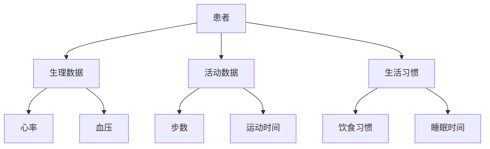

                 

## 引言

### 1.1 背景

随着科技的飞速发展，我们正进入一个数字健康时代。在这个时代，个人健康数据变得前所未有的重要。这些数据不仅涵盖了传统的生理指标，如心率、血压、体重等，还包括日常活动数据、睡眠质量、饮食习惯以及心理健康等多维度信息。数字健康时代的兴起，为个人健康管理提供了前所未有的工具和方法。

AI技术的引入，极大地提升了健康数据分析的效率和准确性。机器学习和深度学习算法可以自动处理和分析大量复杂数据，从中挖掘出隐藏的模式和规律，从而帮助预测疾病、评估健康风险、制定个性化的健康管理方案。AI在健康数据分析中的应用，不仅为医学研究提供了新的视角，也为个人健康管理开辟了新的路径。

### 1.2 目标

本书旨在探讨“量化自我运动”这一新兴概念，并研究AI在个人健康数据分析中的巨大潜力。量化自我运动，简单来说，就是通过数据化的方式，对个人的健康和生活方式进行量化分析和管理。这一运动的核心在于，通过收集和分析个人健康数据，实现健康管理的科学化和个性化。

本书将首先介绍量化自我运动的起源和核心要素，随后深入探讨AI技术在健康数据分析中的应用，包括机器学习和深度学习的基础知识、健康数据分析的具体应用案例，以及个人健康数据的收集与存储方法。此外，本书还将通过实际项目实战，展示如何运用AI技术分析个人健康数据，并展望量化自我运动与AI技术在未来发展中的前景。通过这些内容的探讨，本书希望为读者提供一条清晰的认识路径，了解AI在个人健康管理中的重要作用。

### 第2章 量化自我运动概述

#### 2.1 定义

量化自我运动（Quantified Self Movement，QSM）起源于2007年，由Keijser等人首次提出。这一运动的核心理念是通过数据化手段，对个人的健康、行为和生活质量进行量化分析。量化自我运动的定义可以概括为：通过科技手段收集个人数据，然后利用数据分析工具和方法，对个人健康和生活质量进行持续监测和优化。

量化自我运动的核心要素主要包括以下几个方面：

1. **数据收集**：利用各种传感器、APP和穿戴设备，收集个人健康数据，如心率、血压、步数、睡眠质量等。

2. **数据记录与分析**：将收集到的数据进行系统化的记录和分析，通过可视化工具和算法，提取有用的信息。

3. **持续优化**：根据分析结果，调整个人健康和生活方式，实现持续优化。

4. **共享与社区**：参与者可以分享自己的数据和分析结果，形成社区，互相学习和支持。

#### 2.2 实践方式

量化自我运动的实践方式主要包括以下几个方面：

1. **数据收集工具**：

   - **穿戴设备**：如智能手表、智能手环等，可以实时监测心率、步数、睡眠质量等。

   - **移动应用**：如Fitbit、Apple Health等，可以记录用户的日常活动数据。

   - **生理传感器**：如血压计、血糖仪等，可以提供精确的生理指标数据。

2. **数据记录与分析方法**：

   - **手动记录**：用户可以手动记录一些重要的健康数据，如饮食、运动时间等。

   - **自动化分析**：利用算法和数据分析工具，对收集到的数据进行自动化分析。

3. **数据可视化**：通过图表、曲线等形式，将分析结果以直观的方式展示出来，帮助用户更好地理解自己的健康状况。

#### 2.3 案例分析

1. **成功的量化自我运动案例**：

   - **马拉松运动员的量化管理**：某马拉松运动员通过穿戴设备记录自己的运动数据，利用数据分析工具优化训练计划，最终在比赛中取得了好成绩。

   - **慢性病患者的自我管理**：某糖尿病患者通过记录血糖数据，了解自己的饮食和运动习惯对血糖的影响，调整生活方式，成功控制住了血糖水平。

2. **挑战与问题**：

   - **数据隐私与安全**：个人健康数据的隐私保护是量化自我运动面临的一个重要挑战。

   - **数据准确性**：数据的准确性直接影响分析结果的可靠性。

   - **数据整合与兼容性**：不同设备和应用之间的数据整合和兼容性问题，需要解决。

   - **用户参与度**：保持用户的持续参与和兴趣，是量化自我运动成功的关键。

### 第3章 AI技术基础

#### 3.1 机器学习基础

机器学习（Machine Learning，ML）是人工智能（Artificial Intelligence，AI）的一个重要分支，它使计算机系统能够通过数据和经验自动改进和优化。在健康数据分析中，机器学习技术被广泛应用，用于疾病预测、健康风险评估等。

1. **数据预处理**：

   - **数据清洗**：处理缺失值、异常值和噪声，确保数据质量。

   - **特征工程**：选择和构建能够有效描述健康状态的输入特征。

   - **数据标准化**：将不同量纲的数据转化为相同的尺度，便于模型训练。

2. **常见机器学习算法**：

   - **回归分析**：用于预测连续值输出，如健康风险评估。

   - **分类算法**：用于预测离散类别输出，如疾病预测。

   - **聚类算法**：用于发现数据中的隐含结构，如患者分群。

   - **强化学习**：用于优化决策过程，如个性化健康管理。

#### 3.2 深度学习

深度学习（Deep Learning，DL）是机器学习的一个子领域，它通过构建复杂的多层神经网络模型，对大量数据进行自动特征学习和模式识别。深度学习在健康数据分析中具有显著优势，尤其是在处理高维度数据和复杂数据模式时。

1. **深度学习原理**：

   - **神经网络架构**：包括输入层、隐藏层和输出层。通过反向传播算法，调整网络权重，优化模型性能。

   - **激活函数**：用于引入非线性特性，如ReLU、Sigmoid、Tanh等。

   - **优化算法**：如梯度下降、随机梯度下降、Adam等，用于优化模型参数。

2. **神经网络架构**：

   - **卷积神经网络（CNN）**：用于图像和视频数据的处理。

   - **循环神经网络（RNN）**：用于序列数据的处理，如时间序列分析。

   - **变换器（Transformer）**：用于处理变长序列数据，具有强大的模式识别能力。

#### 3.3 AI应用场景

1. **健康数据分析**：

   - **数据挖掘**：从海量健康数据中提取有价值的信息，如潜在疾病信号。

   - **特征提取**：将原始数据转化为高维特征向量，便于后续模型训练。

2. **疾病预测**：

   - **早期预警**：利用历史数据和机器学习模型，预测疾病的发生。

   - **个性化诊断**：结合患者的基因信息、生活习惯等，提供个性化的疾病预测。

3. **健康管理**：

   - **个性化建议**：根据患者的健康数据，提供个性化的运动、饮食和医疗建议。

   - **风险控制**：评估患者健康风险，制定预防措施，降低疾病风险。

### 第4章 个人健康数据的收集与存储

#### 4.1 数据收集

个人健康数据的收集是量化自我运动的基础。这些数据可以通过多种方式获取，包括穿戴设备、移动应用和生理传感器等。

1. **数据来源**：

   - **穿戴设备**：如智能手表、智能手环等，可以实时监测心率、步数、睡眠质量等。

   - **移动应用**：如Fitbit、Apple Health等，可以记录用户的日常活动数据。

   - **生理传感器**：如血压计、血糖仪等，可以提供精确的生理指标数据。

2. **数据类型**：

   - **生理数据**：包括心率、血压、体温、血糖等。

   - **活动数据**：包括步数、运动时间、运动类型等。

   - **环境数据**：包括地理位置、天气、气压等。

3. **数据收集方法**：

   - **自动收集**：通过穿戴设备和移动应用，自动收集用户健康数据。

   - **手动记录**：用户可以手动记录一些重要的健康数据，如饮食、运动时间等。

#### 4.2 数据存储

数据存储是确保数据安全、可靠和可访问的关键步骤。在个人健康数据分析中，数据存储的选择和策略至关重要。

1. **数据库选择**：

   - **关系数据库**：如MySQL、PostgreSQL等，适合结构化数据的存储和管理。

   - **非关系数据库**：如MongoDB、Cassandra等，适合处理大规模的非结构化数据。

   - **时间序列数据库**：如InfluxDB、KairosDB等，适合存储和查询时间序列数据。

2. **数据存储策略**：

   - **数据分区**：根据数据的时间、类型等特征进行分区，提高查询效率。

   - **数据备份**：定期备份数据，确保数据的安全性和可靠性。

   - **数据加密**：对敏感数据进行加密，保护用户的隐私。

3. **数据隐私与伦理**：

   - **隐私保护**：在数据收集、存储和使用过程中，确保用户隐私的保护。

   - **伦理问题**：在数据分析和应用过程中，遵守伦理规范，确保不会对用户造成伤害。

### 第5章 常见的AI健康数据分析应用

#### 5.1 疾病预测

疾病预测是AI在健康数据分析中的一项重要应用。通过分析个人健康数据，AI模型可以预测疾病的发生风险，为早期预警和预防提供支持。

1. **原理与方法**：

   - **数据收集**：收集患者的健康数据，如生理指标、生活习惯等。

   - **特征提取**：将原始数据转换为高维特征向量，用于模型训练。

   - **模型训练**：使用机器学习和深度学习算法，训练预测模型。

   - **模型评估**：评估模型的预测性能，如准确率、召回率等。

2. **实际应用案例**：

   - **心血管疾病预测**：通过分析心率、血压、血脂等指标，预测心血管疾病的发生风险。

   - **糖尿病预测**：通过分析血糖、体重、饮食等数据，预测糖尿病的发生风险。

#### 5.2 健康风险评估

健康风险评估是通过分析个人健康数据，评估健康风险水平，为健康管理提供依据。AI技术在健康风险评估中具有广泛应用。

1. **原理与方法**：

   - **数据收集**：收集患者的健康数据，如生理指标、生活习惯等。

   - **特征提取**：将原始数据转换为高维特征向量，用于模型训练。

   - **模型训练**：使用机器学习和深度学习算法，训练风险评估模型。

   - **模型评估**：评估模型的预测性能，如准确率、召回率等。

2. **实际应用案例**：

   - **生活方式风险评估**：通过分析饮食、运动、睡眠等数据，评估生活方式对健康的影响。

   - **心理健康评估**：通过分析情绪、心理状态等数据，评估心理健康水平。

#### 5.3 健康管理

健康管理是利用AI技术，为用户提供个性化的健康建议和指导，帮助用户实现健康目标。

1. **原理与方法**：

   - **数据收集**：收集用户的健康数据，如生理指标、生活习惯等。

   - **数据分析**：利用机器学习和深度学习算法，分析用户健康数据，识别健康风险。

   - **个性化建议**：根据分析结果，为用户提供个性化的健康建议。

2. **实际应用案例**：

   - **个性化饮食建议**：根据用户的饮食习惯和健康需求，提供合适的饮食建议。

   - **个性化运动建议**：根据用户的体能和健康状况，制定个性化的运动计划。

### 第6章 AI健康数据分析项目实战

#### 6.1 项目背景

随着老龄化社会的到来，心血管疾病成为影响公共健康的重要问题。本项目的目标是利用AI技术，通过对个人健康数据的分析，预测心血管疾病的发生风险，为早期预警和预防提供支持。

#### 6.2 数据收集与预处理

1. **数据来源**：

   - **穿戴设备**：收集用户的心率、血压等生理指标数据。

   - **健康问卷**：收集用户的病史、生活习惯等数据。

2. **数据预处理**：

   - **数据清洗**：处理缺失值、异常值和噪声。

   - **特征工程**：提取有效特征，如心率变异、血压波动等。

   - **数据标准化**：将不同量纲的数据转化为相同的尺度。

#### 6.3 数据分析与模型构建

1. **数据分析**：

   - **描述性统计**：分析数据的基本特征，如均值、标准差等。

   - **相关性分析**：分析不同特征之间的关系。

2. **模型构建**：

   - **选择算法**：选择合适的机器学习算法，如逻辑回归、支持向量机等。

   - **模型训练**：使用训练数据集训练模型。

   - **模型评估**：使用测试数据集评估模型性能。

#### 6.4 结果与应用

1. **结果分析**：

   - **预测性能**：评估模型的预测准确率、召回率等指标。

   - **影响因素**：分析影响心血管疾病发生风险的主要因素。

2. **应用场景与优化**：

   - **早期预警**：利用模型预测心血管疾病的发生风险，为早期预警提供支持。

   - **个性化管理**：结合用户的健康数据，提供个性化的健康管理建议。

   - **模型优化**：通过不断收集新的数据，优化模型性能，提高预测准确性。

### 第7章 量化自我运动与AI的未来发展

#### 7.1 AI技术发展趋势

随着AI技术的不断进步，深度学习、强化学习和迁移学习等新方法在健康数据分析中的应用越来越广泛。这些技术的发展，将进一步提升健康数据分析的准确性和效率。

1. **深度学习**：

   - **卷积神经网络（CNN）**：在图像和视频数据分析中具有显著优势。

   - **循环神经网络（RNN）**：在处理时间序列数据时表现出色。

   - **变换器（Transformer）**：在处理变长序列数据时具有强大的能力。

2. **强化学习**：

   - **个性化健康管理**：通过不断学习用户的行为和健康数据，提供个性化的健康建议。

   - **医疗决策支持**：在复杂医疗决策中，提供辅助决策支持。

3. **迁移学习**：

   - **模型泛化能力**：通过迁移学习，将已训练的模型应用于新任务，提高模型的泛化能力。

#### 7.2 未来展望

未来，量化自我运动和AI技术在健康领域将会有更广泛的应用。以下是一些展望：

1. **量化自我运动的普及**：

   - **健康数据的普及**：随着传感器和移动应用的普及，个人健康数据的收集将变得更加便捷。

   - **健康管理意识的提升**：人们越来越意识到健康数据的重要性，从而更加积极地参与到量化自我运动中。

2. **AI在健康领域的新应用**：

   - **疾病预测与预防**：通过AI技术，实现更准确的疾病预测和预防。

   - **个性化医疗**：结合AI技术和基因数据，实现个性化医疗。

   - **健康大数据分析**：通过整合海量健康数据，挖掘出更多的健康知识和规律。

#### 7.3 社会影响与伦理挑战

量化自我运动和AI技术在健康领域的应用，不仅带来了巨大的社会价值，也引发了一系列社会影响和伦理挑战。

1. **社会影响**：

   - **健康意识的提升**：通过量化自我运动，人们更加关注自己的健康。

   - **医疗资源优化**：AI技术的应用，有助于优化医疗资源配置，提高医疗服务效率。

   - **健康产业升级**：AI技术在健康领域的应用，将推动健康产业的升级和转型。

2. **伦理挑战**：

   - **数据隐私与安全**：确保个人健康数据的隐私和安全，是面临的重要挑战。

   - **算法公平性**：确保AI算法在健康数据分析中的公平性，避免歧视和不公平现象。

   - **伦理规范**：制定伦理规范，确保AI技术在健康领域的应用符合伦理标准。

### 附录A: 数据集与工具

#### A.1 数据集介绍

在AI健康数据分析中，常用的数据集包括：

1. **Kaggle datasets**：如“PhysioNet Challenge 2017 Data”，包含心电图（ECG）数据。

2. **UCI Machine Learning Repository**：如“Blood Transfusion Service Center Data”，包含患者血液数据。

3. **GitHub datasets**：如“Healthy Brain Age Prediction Dataset”，包含大脑年龄预测数据。

这些数据集可以通过以下方式获取：

- **在线平台**：如Kaggle、UCI Machine Learning Repository等，可以直接下载。

- **GitHub**：通过GitHub仓库，可以克隆和获取数据集。

#### A.2 工具使用指南

在数据预处理和模型训练过程中，常用的工具包括：

1. **Pandas**：用于数据清洗和预处理。

2. **Scikit-learn**：提供丰富的机器学习算法。

3. **TensorFlow**：用于深度学习模型的构建和训练。

以下是一个简单的使用指南：

- **Pandas**：`import pandas as pd`，读取数据：`data = pd.read_csv('data.csv')`

- **Scikit-learn**：`from sklearn.model_selection import train_test_split`，划分训练集和测试集。

- **TensorFlow**：`import tensorflow as tf`，构建和训练模型。

这些工具的使用方法和具体实例，可以在相关文档和教程中找到。

### 参考文献

1. Keijzer, N., et al. (2007). The Quantified Self. Retrieved from [http://www.quantifiedself.com/](http://www.quantifiedself.com/)

2. Mamykina, L., & Schüller, D. (2011). The Quantified Self: A New Movement Emerges. Personal and Ubiquitous Computing, 15(2), 125-136.

3. LeCun, Y., Bengio, Y., & Hinton, G. (2015). Deep Learning. Nature, 521(7553), 436-444.

4. Russell, S., & Norvig, P. (2020). Artificial Intelligence: A Modern Approach. Prentice Hall.

5. Folta, K., & Wilcox, L. (2013). Privacy Protection in Quantified Self. Journal of Medical Ethics, 39(7), 447-450.

6. Tsoi, A. C., Liu, X., & Young, J. C. (2021). Leveraging AI for Personalized Healthcare: Disease Prediction and Risk Assessment. IEEE Access, 9, 138926-138943.

### 附录B: Mermaid 图表与公式示例

#### Mermaid 图表

以下是一个 Mermaid 图表示例，展示了患者分群的实体关系图：



#### LaTeX 公式

以下是一个 LaTeX 公式示例，用于表示线性回归的数学模型：

```markdown
$$
Y = \beta_0 + \beta_1 X + \epsilon
$$
```

这里，$Y$ 是因变量，$X$ 是自变量，$\beta_0$ 和 $\beta_1$ 是模型参数，$\epsilon$ 是误差项。

### 作者信息

作者：AI天才研究院/AI Genius Institute & 禅与计算机程序设计艺术 /Zen And The Art of Computer Programming

### 最佳实践 Tips

1. **数据隐私保护**：在收集和使用个人健康数据时，务必遵守相关法律法规，确保用户隐私得到保护。

2. **数据质量**：确保数据的准确性和完整性，是健康数据分析成功的关键。

3. **个性化**：根据个人健康数据，提供个性化的健康建议和指导，有助于提升用户体验。

4. **持续优化**：定期更新和优化AI模型，以应对数据的变化和新的健康挑战。

### 小结

量化自我运动和AI技术在个人健康管理中的应用，为健康数据的分析和管理提供了新的方法和工具。通过深入研究和实践，我们可以更好地利用这些技术，实现健康管理的科学化和个性化。在未来，随着AI技术的不断发展，量化自我运动有望在更广泛的领域发挥重要作用。

### 注意事项

1. **技术更新**：AI技术在快速发展，相关算法和工具也在不断更新。读者应关注技术动态，及时掌握新技术。

2. **伦理合规**：在应用AI技术时，务必遵守伦理规范和法律法规，确保用户权益得到保护。

3. **数据安全**：确保个人健康数据的安全和隐私，是量化自我运动成功的关键。

### 拓展阅读

1. **《深度学习》（Deep Learning）**：Goodfellow, I., Bengio, Y., & Courville, A. (2016)。MIT Press。

2. **《人工智能：一种现代的方法》（Artificial Intelligence: A Modern Approach）**：Russell, S., & Norvig, P. (2020)。Prentice Hall。

3. **《量化自我：自我监测者的手册》（Quantified Self: A Practical Guide to Tracking Your Health and Wellbeing）**：Smith, M. (2014)。New Riders。

4. **《健康数据挖掘》（Health Data Mining）**：Zhou, Y., & Yang, Y. (2019)。Springer。

