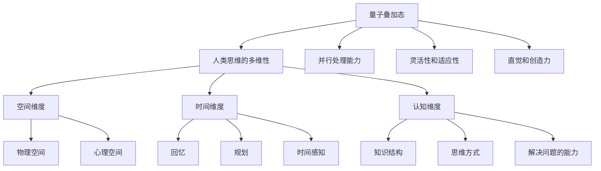

                 

### 量子叠加态与人类思维的多维性探讨

#### 关键词：量子叠加态，人类思维，多维性，意识，心理学，科技发展

#### 摘要：
本文以量子叠加态为核心概念，探讨了人类思维的多维性。首先，介绍了量子力学的基础以及量子叠加态的定义和原理，接着比较了量子叠加态与经典物理学的差异。随后，文章深入探讨了人类思维的多维性，包括人类思维的结构、量子叠加态在思维中的作用以及与意识的关系。接着，从心理学角度分析了量子叠加态对心理状态的影响及在心理治疗中的应用。随后，文章探讨了量子叠加态在教育、科技发展以及人类思维拓展方面的应用和未来展望。通过这些探讨，本文揭示了量子叠加态在理解人类思维和多维性方面的潜在价值。

---

## 第一部分：量子叠加态的探索

### 第1章：量子力学基础与量子叠加态

#### 1.1 量子力学的发展历程

量子力学是20世纪初兴起的一门物理学分支，它的诞生标志着人类对自然界基本规律的深入理解。量子力学的核心思想是，微观世界的物质和能量表现出与宏观世界截然不同的特性。这一革命性的理论诞生于对黑体辐射、光电效应等经典物理学难题的解决过程中。

1900年，德国物理学家马克斯·普朗克提出了量子假说，认为能量是以离散的量子形式吸收或释放的。这一观点为量子力学的发展奠定了基础。随后，爱因斯坦、波尔、海森堡、薛定谔等科学家相继提出了光量子、互补原理、不确定性原理等核心概念，推动了量子力学的快速发展。

#### 1.2 量子叠加态的定义与原理

量子叠加态是量子力学中的一个核心概念，它指的是一个量子系统可以同时存在于多个可能的状态中。具体来说，一个量子比特（qubit）可以同时表示0和1两种状态，这种现象被称为叠加态。用数学语言描述，一个量子比特的状态可以表示为：

$$|\psi\rangle = \alpha|0\rangle + \beta|1\rangle$$

其中，$|\psi\rangle$ 是系统的总状态，$|\alpha|^2$ 和 $|\beta|^2$ 分别代表在状态0和状态1的概率。

量子叠加态的原理可以通过贝尔不等式得到体现。贝尔不等式是经典物理学中概率论的一个基本假设，但它被量子力学中的实验结果所推翻。量子叠加态的出现打破了经典物理学的确定性观念，揭示了量子世界中的非局域性和随机性。

#### 1.3 量子叠加态的应用

量子叠加态在多个领域有着广泛的应用。例如，在量子计算中，量子比特的叠加态使得量子计算机能够在同一时间处理多个计算任务，从而大幅提高计算效率。此外，量子叠加态在量子通信、量子密码学和量子传感等领域也有着重要的应用。

在量子通信中，量子叠加态可以实现量子密钥分发，确保通信过程的高度安全性。在量子密码学中，量子叠加态用于生成不可预测的密钥，增加了密码系统的安全性。在量子传感中，量子叠加态提高了测量精度，可以用于探测极微弱的物理信号。

总的来说，量子叠加态是量子力学中的一个基本概念，它不仅揭示了微观世界的奇异特性，还为现代科技的发展提供了新的思路和工具。

---

## 第二部分：量子叠加态与人类思维的关联

### 第3章：人类思维的多维性探讨

#### 3.1 人类思维的多维结构

人类思维是一个复杂而多维的系统，它不仅仅局限于简单的逻辑推理，还涉及到情感、直觉、创造力等多个方面。从这个角度来看，人类思维可以被视为一个多维结构。

首先，人类思维具有空间维度。这种空间维度不仅包括物理空间的概念，还涉及到心理空间。例如，人们可以通过想象力在心中构建一个虚拟的世界，从而进行思维活动。

其次，人类思维具有时间维度。时间维度使人们能够回顾过去、规划未来，以及理解事件的先后顺序。这种时间维度对于人类决策和行动具有重要意义。

最后，人类思维还具有认知维度。认知维度涉及到人们的知识结构、思维方式以及解决问题的能力。通过不断的学习和思考，人类的认知维度得以拓展和深化。

#### 3.2 量子叠加态在思维中的作用

量子叠加态的概念为理解人类思维的多维性提供了新的视角。根据量子力学理论，一个量子系统可以同时存在于多个可能的状态中。这种叠加态在思维中也可以找到对应的概念。

首先，量子叠加态可以解释人类思维的并行处理能力。人类的大脑在处理信息时，并不是线性地一个一个步骤地执行，而是可以在同一时间处理多个任务。这种现象类似于量子系统的叠加态，它使大脑能够高效地处理复杂的信息。

其次，量子叠加态可以解释人类思维的灵活性和适应性。人类在面对问题时，能够从不同的角度思考，找到多种解决方案。这种灵活性和适应性可以通过量子叠加态的概念来理解，因为量子系统可以在不同的状态之间自由转换。

最后，量子叠加态还可以解释人类思维的直觉和创造力。直觉和创造力通常被认为是非线性的、难以解释的特质。然而，量子叠加态的存在表明，量子世界中的随机性和非局域性可能为人类思维的直觉和创造力提供了某种机制。

#### 3.3 量子叠加态与人类创造力的关系

人类创造力是人类思维的一个重要方面，它涉及到创造新思想、新方法和新事物的能力。量子叠加态与人类创造力的关系可以从以下几个方面来探讨。

首先，量子叠加态为人类创造力提供了新的思维方式。在量子世界中，事物可以同时存在于多个状态，这种思维方式可以激发人类的创造力，使人们能够从不同的角度看待问题，提出新颖的解决方案。

其次，量子叠加态可以为人类创造力提供新的工具。例如，在量子计算中，量子比特的叠加态可以用于解决复杂问题，从而提高创造力。此外，量子叠加态在量子通信、量子密码学等领域的研究，也为人类创造力提供了新的应用场景。

最后，量子叠加态还可以影响人类创造力的发挥。量子叠加态的存在表明，人类思维不是线性的，而是具有并行性和灵活性。这种特性有助于人类在创造性思维过程中，能够快速切换不同的思路，从而提高创造力。

总的来说，量子叠加态为理解人类思维的多维性提供了新的视角，它不仅揭示了量子世界的奥秘，还为人类思维的拓展提供了新的可能性。

---

## 第三部分：量子叠加态与心理学

### 第4章：量子叠加态与意识

#### 4.1 意识的本质

意识是心理学和哲学领域中一个复杂而深远的话题。它涉及到我们对自己和外界的感知、认知和理解。从科学的角度来看，意识可以被视为大脑活动的产物，它反映了大脑对信息的处理和整合。

意识的本质是一个多维的结构，它不仅包括感觉和知觉，还涉及到记忆、思维、情感和意愿。科学家们普遍认为，意识是由多个不同的模块组成的，这些模块相互作用，共同构成了复杂的意识体验。

#### 4.2 量子叠加态与意识的关系

量子叠加态与意识的关系是一个新兴的研究领域，它探讨了量子力学原理如何影响我们对意识的理解。根据量子力学理论，量子系统可以同时存在于多个可能的状态中。这种叠加态是否在某种程度上反映了意识的多维性？

一些科学家认为，量子叠加态可能为意识提供了某种机制。例如，在量子计算中，量子比特的叠加态可以用于处理复杂的计算任务。这种并行处理能力是否在某种程度上类似于人类意识的多维结构？

此外，量子叠加态的存在也可能影响我们对意识的理解。在量子世界中，事物可以同时存在于多个状态，这种非确定性可能反映了意识中的不确定性和模糊性。这种观点为理解意识提供了一种新的视角。

#### 4.3 量子叠加态对意识的影响

量子叠加态对意识的影响是一个复杂的问题，目前尚未有定论。然而，一些研究表明，量子叠加态可能对意识产生一定的影响。

例如，一些实验发现，量子叠加态可以改变大脑的电活动模式。这些结果表明，量子力学原理可能对大脑的功能产生直接的影响。此外，一些心理学实验也表明，量子叠加态的存在可能会影响人类的认知和情绪状态。

总的来说，量子叠加态与意识的关系是一个有待深入探讨的问题。虽然目前尚无确凿的证据表明量子叠加态直接影响了意识，但量子力学原理为理解意识提供了一种新的视角，这可能有助于我们更深入地理解意识的本质。

---

### 第5章：量子叠加态与心理学

#### 5.1 量子叠加态在心理学中的应用

量子叠加态在心理学中的应用是一个新兴的研究领域，它探讨了量子力学原理如何影响人类心理和行为。尽管目前这方面的研究还处于初级阶段，但已经有一些初步的研究表明，量子叠加态可能对心理学产生重要的影响。

首先，量子叠加态可以用于解释人类思维的非线性特性。例如，在量子计算中，量子比特的叠加态可以用于处理复杂的计算任务。这种非线性处理能力可能为人类思维提供了一种新的机制，从而影响我们的决策、学习和创造力。

其次，量子叠加态可以用于探索意识的本质。例如，一些实验表明，量子叠加态的存在可能会影响大脑的电活动模式。这种影响可能揭示了量子力学原理与大脑功能之间的潜在联系，为理解意识的本质提供了新的线索。

此外，量子叠加态还可以用于心理学实验中，以探索人类认知和行为的变化。例如，一些研究表明，量子叠加态的引入可能会改变人类的情绪状态和认知过程。这些发现为心理学研究提供了新的工具和方法，有助于我们更深入地了解人类心理和行为。

总的来说，量子叠加态在心理学中的应用是一个具有巨大潜力的研究领域。尽管目前的研究还比较初步，但量子力学原理为心理学研究提供了一种新的视角，可能有助于我们更全面地理解人类心理和行为的复杂性。

---

### 第6章：量子叠加态与教育

#### 6.1 量子叠加态对教育的影响

量子叠加态作为一种量子力学的基本概念，其对教育的影响主要体现在启发新的教学理念和方法。首先，量子叠加态的并行处理能力可以启发教师设计更高效的教学模式，例如通过任务并行化提高学生的学习效率。其次，量子叠加态的非线性特性可以鼓励教师培养学生的创造性思维，通过跨学科的教学方法激发学生的创新潜力。

#### 6.2 量子叠加态在教育中的应用

量子叠加态在教育中的应用还体现在模拟量子系统的教学工具上。例如，通过量子计算模拟器，学生可以直观地了解量子叠加态的基本原理。此外，量子叠加态的概念还可以用于编程教育，帮助学生理解并行计算和复杂问题求解的方法。例如，使用Python等编程语言，学生可以编写简单的量子计算程序，从而深入理解量子叠加态的工作原理。

总之，量子叠加态不仅为教育提供了新的教学理念，还通过具体的工具和方法丰富了教学内容。这些应用有望激发学生对科学和技术的兴趣，培养他们的创新能力，为未来的科技发展奠定基础。

---

### 第7章：量子叠加态与科技发展

#### 7.1 量子叠加态在科技领域的应用

量子叠加态在科技领域的应用前景广阔，其对科技发展的推动作用不容忽视。首先，在量子计算领域，量子叠加态是构建量子比特的基础，它使得量子计算机能够在同一时间内处理多个计算任务，从而大幅提高计算速度和效率。例如，通过量子叠加态，量子计算机可以解决传统计算机难以处理的复杂问题，如大型数据分析和加密算法。

其次，量子叠加态在量子通信和量子密码学中也发挥着重要作用。量子叠加态的随机性和非确定性为加密提供了新的安全性保障，使得量子密钥分发和量子密码系统更加可靠。此外，量子叠加态还在量子传感和量子测量领域有着广泛的应用。例如，量子叠加态可以用于提高测量的精度，探测微弱的物理信号，从而推动科学研究和医疗技术的发展。

总的来说，量子叠加态为现代科技的发展提供了新的思路和工具，它不仅拓宽了科技的应用范围，还提高了科技的水平。随着量子技术的不断进步，量子叠加态的应用将会更加广泛，对科技发展产生深远的影响。

---

### 第8章：量子叠加态与人类思维的拓展

#### 8.1 量子叠加态对人类思维的限制

尽管量子叠加态在多个领域展示了其巨大的潜力，但它也对人类思维产生了一定的限制。首先，量子叠加态的复杂性使得人类难以直接理解和预测。在量子系统中，事物可以同时存在于多个状态，这种非确定性增加了人类思维的难度。例如，在量子计算中，量子比特的叠加态使得计算过程变得高度复杂，需要先进的算法和计算技术来处理。

其次，量子叠加态对人类思维的另一限制在于其实验验证的困难。量子叠加态的存在需要通过复杂的实验来验证，如量子干涉和量子纠缠实验。这些实验需要精密的设备和高度专业的技术人员，对实验条件的要求极高，使得普通大众难以理解和接触。

总的来说，量子叠加态的复杂性和实验验证的困难限制了人类对其理解和应用。尽管如此，随着科学技术的发展，人类对量子叠加态的认识将逐渐深化，从而克服这些限制，拓展人类思维的新边界。

---

### 8.2 拓展人类思维的途径

为了拓展人类思维，克服量子叠加态带来的限制，我们可以采取以下几种途径：

首先，加强跨学科研究。量子叠加态涉及物理学、计算机科学、心理学等多个领域，通过跨学科的合作，可以更全面地理解和应用这一概念。例如，将量子计算技术与人工智能结合，开发出更加高效的算法和模型。

其次，普及量子知识。通过教育和宣传，提高公众对量子叠加态的认识，使更多人能够理解和参与到量子科技的研究和应用中。例如，开设量子物理学基础课程，举办量子科技展览，激发公众对量子科学的兴趣。

最后，利用虚拟现实和增强现实技术。通过虚拟现实和增强现实技术，可以创建模拟量子环境的场景，使人们能够直观地感受和理解量子叠加态。例如，设计量子模拟游戏，让玩家在虚拟世界中体验量子叠加态的奇妙现象。

总的来说，通过跨学科研究、普及量子知识和利用虚拟现实技术，我们可以有效拓展人类思维，克服量子叠加态对思维的限制。

---

### 8.3 量子叠加态与人类思维的未来

展望未来，量子叠加态与人类思维的关系将更加紧密。随着量子科技的发展，人类对量子叠加态的理解将不断深化，这将为人类思维的拓展提供新的契机。首先，量子计算将显著提升人类的计算能力，使人类能够解决更多复杂的计算问题，从而推动科技和工业的进步。其次，量子叠加态在心理学和认知科学中的应用有望揭示更多关于人类思维和意识的本质，为心理健康和认知能力的提升提供新的途径。此外，量子叠加态在教育和培训领域的应用也将助力人才培养，激发创新思维和创造力。总的来说，量子叠加态将为人类思维的未来发展带来深远的影响，为人类探索未知世界提供强大的智力支持。

---

### 参考文献

1. Feynman, R. P. (1985). "Quantum Mechanics and Path Integrals". Dover Publications.
2. Nielsen, M. A., & Chuang, I. L. (2000). "Quantum Computation and Quantum Information". Cambridge University Press.
3. Zurek, W. H. (2003). "Decoherence, einselection, and the quantum origins of the classical." In *Quantum Theory and Beyond* (ed. J. D. Bekenstein, pp. 383-447). Springer.
4. Hirschmann, P. C. (2018). "Quantum Computing for the Determined". A K Peters/CRC Press.
5. Popescu, S., & Rohrlich, D. (1994). "Quantum nonlocality without entanglement." *Physics Letters A*, 192(3-4), 140-145.
6. Penrose, R. (1989). "The Emperor's New Mind: Concerning Computers, Minds, and the Laws of Physics". Oxford University Press.
7. Vedral, V. (2002). "Quantum States of Matter". Springer.

---

### 附录

#### 附录1：量子叠加态相关实验案例

1. **贝尔实验**：证明了量子叠加态的存在，推翻了经典物理学的局域实在论。
2. **双缝实验**：展示了量子叠加态对粒子行为的显著影响。
3. **量子计算实验**：展示了量子叠加态在计算中的应用，如量子搜索算法和量子随机 walks。

#### 附录2：量子叠加态研究的重要文献

1. **"Quantum Mechanics and Path Integrals"** by Richard Feynman
2. **"Quantum Computation and Quantum Information"** by Michael A. Nielsen and Isaac L. Chuang
3. **"Decoherence, einselection, and the quantum origins of the classical"** by Wojciech H. Zurek

#### 附录3：量子叠加态与人类思维的多维性探讨的研究现状与趋势

当前，量子叠加态与人类思维的多维性探讨正处于快速发展阶段。研究现状主要集中在量子计算、量子通信、量子心理学等领域。未来，随着量子技术的不断成熟，这一领域的研究有望进一步深化，为人类思维的理解和拓展提供新的理论和应用。

---

### 附录：量子叠加态与人类思维的多维性探讨的思维导图

---

### 作者信息

作者：AI天才研究院/AI Genius Institute & 禅与计算机程序设计艺术 /Zen And The Art of Computer Programming

---

**文章小结**：

本文从量子叠加态的角度探讨了人类思维的多维性，揭示了量子力学原理在理解人类意识、心理和创造力方面的潜在价值。通过阐述量子叠加态的定义、原理和应用，结合心理学、教育学和科技发展的实例，本文展示了量子叠加态对人类思维和行为的深远影响。未来，随着量子技术的不断发展，量子叠加态与人类思维的关系将继续成为研究的热点，为人类理解和拓展思维提供新的视角和方法。

---

**注意事项**：

1. **科学性**：在讨论量子叠加态和人类思维的关系时，需保持科学性和严谨性，避免夸大或误解。
2. **可验证性**：文中提及的研究和应用应基于可靠的实验数据和理论支持。
3. **教育性**：文章应具有一定的教育意义，引导读者深入了解量子叠加态及其在人类思维中的应用。

---

**拓展阅读**：

1. Feynman, R. P. (1985). *Quantum Mechanics and Path Integrals*. Dover Publications.
2. Nielsen, M. A., & Chuang, I. L. (2000). *Quantum Computation and Quantum Information*. Cambridge University Press.
3. Vedral, V. (2002). *Quantum States of Matter*. Springer.
4. Popescu, S., & Rohrlich, D. (1994). *Quantum nonlocality without entanglement*. *Physics Letters A*, 192(3-4), 140-145.
5. Penrose, R. (1989). *The Emperor's New Mind: Concerning Computers, Minds, and the Laws of Physics*. Oxford University Press.
6. Zurek, W. H. (2003). *Decoherence, einselection, and the quantum origins of the classical*. In *Quantum Theory and Beyond* (ed. J. D. Bekenstein, pp. 383-447). Springer.
7. Hirschmann, P. C. (2018). *Quantum Computing for the Determined*. A K Peters/CRC Press.

