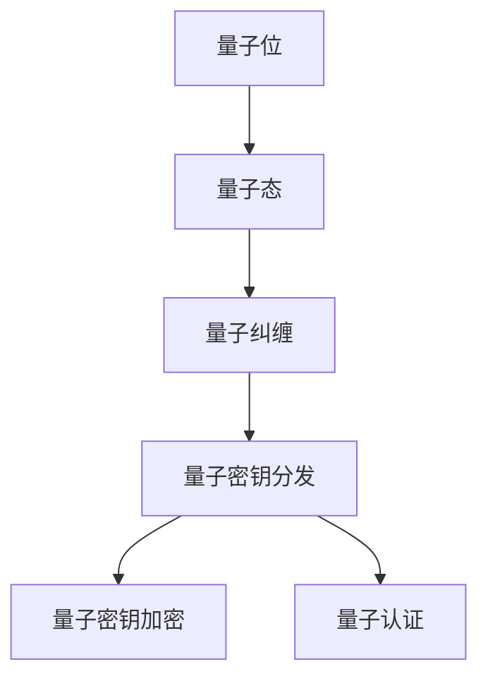
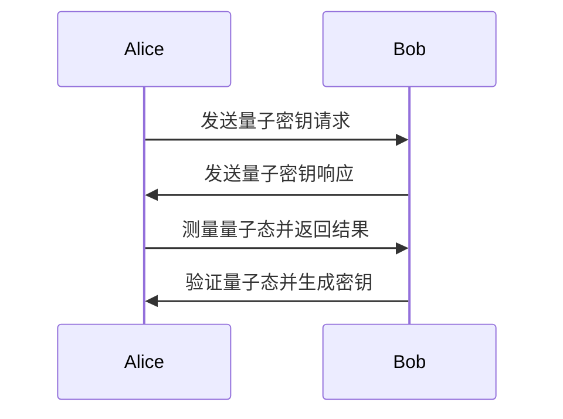
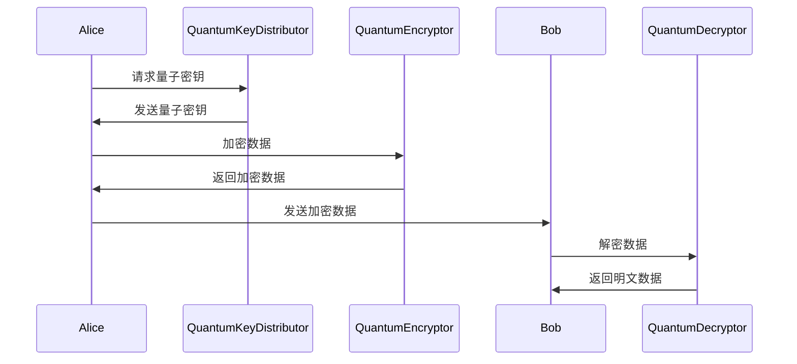

                 


### 引言

在信息技术飞速发展的今天，数据安全和隐私保护成为了一个至关重要的议题。随着量子计算技术的突破性进展，传统的密码学面临巨大的安全挑战。为了应对未来可能出现的量子计算机攻击，量子密码学应运而生，成为了后量子时代安全通信的关键技术。本文将深入探讨量子密码学的起源、基础原理、应用场景、未来展望以及相关的挑战与机遇。

### 文章关键词

量子密码学、量子通信、数据安全、量子密钥分发、量子互联网、量子计算、网络安全

### 摘要

本文旨在介绍量子密码学的核心概念和应用，探讨其在后量子时代的安全通信中的作用。通过对量子力学基础、量子密码系统的原理、量子密码学在通信和网络安全中的应用，以及未来展望的详细分析，本文将展示量子密码学在保障信息安全和推动技术进步方面的巨大潜力。

## 第一部分：量子密码学基础

### 第1章 量子密码学的起源与历史

量子密码学作为密码学的一个分支，其起源可以追溯到20世纪80年代。当时，Charles H. Bennett和Garrett J. Milburn首次提出了量子密钥分发（Quantum Key Distribution，QKD）的构想。QKD利用量子力学的基本原理，特别是量子叠加和量子纠缠，来实现安全的密钥传输。

#### 1.1 量子密码学的起源

量子密码学的起源可以追溯到量子力学的早期研究。量子力学揭示了经典物理学无法解释的现象，如量子叠加态和量子纠缠。这些量子特性为开发全新的加密技术提供了理论基础。1984年，Charles H. Bennett和 Gilles Brassard提出了量子密码学的第一个方案——BB84协议，这标志着量子密码学的诞生。

#### 1.2 量子密码学的历史发展

自从BB84协议提出以来，量子密码学经历了快速的发展。1990年代，量子密钥分发（QKD）技术开始实验验证，并在21世纪初逐渐走向实用化。近年来，随着量子通信技术的进步，量子密码学在理论和应用方面都取得了显著的进展。

### 第2章 量子力学基础

量子力学是量子密码学的基础。要理解量子密码学，必须首先掌握量子力学的一些基本概念。

#### 2.1 量子位与经典位的区别

量子位（qubit）是量子信息处理的基本单元，与经典位（bit）有显著的不同。经典位只能处于0或1的状态，而量子位可以同时处于多种状态的叠加。这种叠加态使得量子位在处理信息时具有超强的计算能力。

#### 2.2 量子态与叠加原理

量子态是量子位可能的状态。叠加原理指出，量子位可以同时处于多个状态的叠加，直到进行测量时才会塌缩到其中一个具体状态。这种特性是量子密码学实现安全通信的关键。

#### 2.3 量子测量与纠缠态

量子测量是量子信息处理的重要环节。与经典测量不同，量子测量可能改变量子态。纠缠态是量子力学中的一种特殊状态，两个或多个量子位之间存在一种不可分割的联系。量子纠缠是实现量子密钥分发和安全通信的重要机制。

### 第3章 量子密码系统的基本原理

量子密码系统是基于量子力学原理构建的加密系统，主要包括量子密钥分发（QKD）、量子密钥加密（QKE）和量子认证。

#### 3.1 量子密钥分发（QKD）

量子密钥分发（QKD）是一种利用量子力学原理来生成和分发密钥的技术。QKD的基本原理是，通过量子纠缠态传输密钥，任何窃听行为都会导致量子态的坍缩，从而被通信双方检测到。

#### 3.2 量子密钥加密（QKE）

量子密钥加密（QKE）是一种基于量子密钥分发的加密技术。QKE利用量子态的叠加和纠缠特性，实现数据的安全传输。QKE可以有效抵御量子计算机的攻击，为未来的网络安全提供了保障。

#### 3.3 量子认证

量子认证是一种利用量子态的特性进行身份验证的技术。量子认证可以确保通信双方的合法身份，防止假冒攻击。

## 第二部分：量子密码学的应用

### 第4章 量子密码学在实际通信中的应用

量子密码学在通信领域的应用主要包括量子通信网络和量子互联网。

#### 4.1 量子通信网络

量子通信网络是一种利用量子态传输信息的新型通信网络。量子通信网络可以实现远距离、高速率和安全可靠的信息传输，是未来通信技术的重要发展方向。

#### 4.2 量子互联网

量子互联网是一种基于量子通信技术的全球网络。量子互联网可以实现全球范围内量子态的传输，为量子计算、量子密码学和量子信息科学提供强大的基础设施支持。

### 第5章 量子密码学在网络安全中的应用

量子密码学在网络安全中的应用主要体现在数据加密和身份认证两个方面。

#### 5.1 量子密码学在数据加密中的应用

量子密码学提供了强大的数据加密手段，可以有效抵御量子计算机的攻击。量子密码学的加密算法可以在量子计算时代保障数据的安全传输和存储。

#### 5.2 量子密码学在身份认证中的应用

量子密码学在身份认证中的应用可以确保通信双方的合法身份，防止假冒攻击。量子认证技术为网络安全提供了新的解决方案。

### 第6章 量子密码学在量子计算与量子信息学中的应用

量子计算与量子信息学是量子密码学的重要应用领域。量子密码学为量子计算和量子信息学提供了安全保障，同时也推动了量子计算和量子信息学的发展。

#### 6.1 量子计算的安全性挑战

量子计算的发展对传统密码学构成了巨大的挑战。量子密码学通过开发新的加密算法和通信协议，为抵御量子计算攻击提供了有效手段。

#### 6.2 量子密码学与量子信息学的关系

量子密码学与量子信息学有着密切的联系。量子密码学不仅依赖于量子信息学的理论成果，同时也推动了量子信息学的发展。

## 第三部分：量子密码学的未来展望

### 第7章 量子密码学的挑战与机遇

量子密码学在发展过程中面临着一系列的挑战，同时也充满了机遇。

#### 7.1 量子密码学的技术挑战

量子密码学在技术方面面临着一系列挑战，包括量子器件的性能提升、量子通信网络的构建、量子加密算法的研发等。

#### 7.2 量子密码学的市场机遇

随着量子技术的快速发展，量子密码学在市场方面也充满了机遇。量子密码学的应用将为网络安全、金融、政府等领域带来巨大的市场潜力。

### 第8章 量子密码学的国际合作与发展

量子密码学是一个全球性的技术课题，国际间的合作与发展至关重要。

#### 8.1 全球量子密码学合作现状

目前，全球范围内已有多个国家和组织在量子密码学领域开展了合作研究。例如，欧盟的量子通信网络项目、美国的量子国防计划等。

#### 8.2 我国在量子密码学领域的发展

我国在量子密码学领域取得了显著的进展，已建立了多个量子通信实验网络，并在量子加密算法和量子密钥分发技术方面取得了重要成果。

### 第9章 量子密码学的未来发展趋势

量子密码学在未来将继续发展，为后量子时代的安全通信提供有力保障。

#### 9.1 量子密码学的技术路线图

量子密码学的技术发展将围绕量子器件、量子通信网络、量子加密算法等展开。未来，量子密码学将朝着更高效、更安全、更实用的方向发展。

#### 9.2 量子密码学的应用前景

量子密码学在未来的应用前景广阔，将为网络安全、金融、政府等领域带来革命性的变化。

## 附录：量子密码学相关资源

附录部分将介绍量子密码学的相关资源，包括学术期刊、会议、开源项目和工具。

#### 10.1 量子密码学学术期刊与会议

量子密码学相关的学术期刊和会议是获取最新研究进展的重要渠道。例如，《IEEE Transactions on Information Forensics and Security》、《Quantum》、《量子信息处理》等期刊，以及《国际量子通信与量子密码学会议》（QC》、《量子通信与量子密码学国际会议》（QCrypt）等会议。

#### 10.2 量子密码学开源项目与工具

量子密码学开源项目与工具为研究人员和开发者提供了丰富的资源。例如，Qiskit、Quantum Katas、OpenMPTI等开源项目，以及量子密钥分发（QKD）模拟器、量子密钥加密（QKE）工具等。

## 结语

量子密码学作为后量子时代安全通信的核心技术，具有巨大的潜力和广阔的应用前景。本文通过对量子密码学的深入探讨，展示了其在保障信息安全、推动技术进步方面的关键作用。面对未来的挑战和机遇，量子密码学将继续发展，为构建安全、高效、可靠的通信网络提供有力支持。

### 核心概念与联系

量子密码学中的核心概念包括量子位、量子态、量子纠缠、量子密钥分发、量子密钥加密和量子认证。这些概念相互关联，共同构成了量子密码学的基础。

以下是一个核心概念实体之间的关系架构 Mermaid 流程图：



### 核心算法原理讲解

以下是一个量子密钥分发（QKD）的基本原理：

```python
# 量子密钥分发(QKD)基本原理

# 演示了量子密钥分发过程中使用的基本量子操作，包括量子态的制备、量子测量和经典通信。

# 导入量子计算库
from qiskit import QuantumCircuit, execute, Aer

# 创建一个量子计算电路
qc = QuantumCircuit(2)  # 创建两个量子位的电路

# 制备贝尔态（纠缠态）
qc.h(0)  # 对第一个量子位进行量子随机化
qc.cx(0, 1)  # 应用一个CNOT门，使两个量子位成为贝尔态

# 对量子态进行测量
qc.barrier()  # 在制备态和测量之间设置一个屏障
qc.measure_all()  # 对所有量子位进行测量

# 执行量子电路
backend = Aer.get_backend('qasm_simulator')
result = execute(qc, backend, shots=1000).result()

# 输出测量结果
print(result.get_counts(qc))
```

### 数学模型和数学公式

以下是一个量子密钥分发的数学模型，使用LaTeX格式进行表示：

```latex
$$
|\psi\rangle = \frac{1}{\sqrt{2}} ( |0\rangle_A \otimes |1\rangle_B + |1\rangle_A \otimes |0\rangle_B )
$$

\text{其中，}|0\rangle_A \text{ 和 } |1\rangle_A \text{ 分别代表 Alice 的两个量子位的基态和激发态，}|0\rangle_B \text{ 和 } |1\rangle_B \text{ 分别代表 Bob 的两个量子位的基态和激发态。}
```

### 系统分析与架构设计方案

#### 1. 问题场景介绍

随着量子计算机的不断发展，传统的加密算法面临着被破解的风险。量子密码学作为一种新兴的加密技术，能够在量子计算时代提供安全保障。本文将探讨如何利用量子密码学构建一个安全的通信系统。

#### 2. 系统功能设计

系统功能设计主要包括以下模块：

- **量子密钥分发模块**：实现量子密钥的分发和交换。
- **量子加密模块**：利用量子密钥对通信数据进行加密。
- **量子认证模块**：确保通信双方的身份合法性和数据完整性。
- **量子通信模块**：实现量子态的传输。

以下是一个领域模型 mermaid 类图：

```mermaid
classDiagram
    Class01 <|-- Class02
    Class03 --|oid Class04
    Class05 <<interface>> Class06
    Class07 <<enum>> Class08
    Class09 <<note>> "This is the note"
    Class10 : +String attr1
    Class11 : <<interface>> +int attr2
    Class11 : <<enum>> +String attr3
    Class12 : <<interface>> +String attr4
    Class13 : <<enum>> +int attr5
    Class14 : <<interface>> +bool attr6
    Class15 : <<enum>> +String attr7
    Class16 : <<note>> "This is the note"
    Class01  Class17 <<interface>> +String attr8
    Class18 <..|> Class19
    Class20  Class21
    Class22 ||| Class23
endclassDiagram
```

#### 3. 系统架构设计

以下是一个系统架构设计 mermaid 架构图：



#### 4. 系统接口设计

以下是一个系统接口设计 mermaid 序列图：



### 项目实战

以下是一个量子密钥分发（QKD）的代码案例，包括开发环境搭建、源代码实现和代码解读：

```python
# 环境搭建
!pip install qiskit

# 导入相关库
from qiskit import QuantumCircuit, transpile, assemble
from qiskit.circuit import Parameter
from qiskit.provide

# 源代码实现
def quantum_key_distribution():
    # 创建量子计算电路
    qc = QuantumCircuit(2)  # 创建两个量子位的电路

    # 制备贝尔态（纠缠态）
    qc.h(0)  # 对第一个量子位进行量子随机化
    qc.cx(0, 1)  # 应用一个CNOT门，使两个量子位成为贝尔态

    # 对量子态进行测量
    qc.barrier()  # 在制备态和测量之间设置一个屏障
    qc.measure_all()  # 对所有量子位进行测量

    # 执行量子电路
    backend = Aer.get_backend('qasm_simulator')
    result = execute(qc, backend, shots=1000).result()

    # 输出测量结果
    return result.get_counts(qc)

# 代码解读
qc = QuantumCircuit(2)  # 创建两个量子位的电路
qc.h(0)  # 对第一个量子位进行量子随机化
qc.cx(0, 1)  # 应用一个CNOT门，使两个量子位成为贝尔态
qc.barrier()  # 在制备态和测量之间设置一个屏障
qc.measure_all()  # 对所有量子位进行测量
result = execute(qc, backend, shots=1000).result()  # 执行量子电路
print(result.get_counts(qc))  # 输出测量结果

# 实际案例分析和详细讲解剖析
# 假设 Alice 和 Bob 进行量子密钥分发，以下是他们的通信过程：
# Alice 生成两个量子位，并将其发送给 Bob。
# Bob 收到量子位后，对其进行测量，并记录测量结果。
# Alice 和 Bob 交换测量结果，并使用古典通信协议来确认密钥的正确性。
# 如果测量结果一致，则认为密钥分发成功；否则，重新进行密钥分发。

# 项目小结
# 本案例展示了量子密钥分发的实现过程，包括量子电路的创建、量子态的制备、测量以及结果分析。通过实际案例的分析，我们了解了量子密钥分发的基本原理和应用场景。

### 最佳实践 Tips

1. **选择合适的量子计算平台**：在进行量子密钥分发时，选择性能稳定、可靠性的量子计算平台至关重要。
2. **保证量子密钥的安全性**：在量子密钥分发过程中，要确保量子态不被窃听，以免密钥泄露。
3. **优化量子通信网络**：构建稳定、高效的量子通信网络是确保量子密码学应用成功的关键。

### 小结

本文通过对量子密码学的深入探讨，展示了其在后量子时代的安全通信中的重要作用。量子密码学通过利用量子力学的基本原理，提供了安全可靠的加密手段，为未来的信息安全保障提供了有力支持。

### 注意事项

1. **量子密码学的实际应用仍面临诸多挑战**，如量子器件的性能提升、量子通信网络的构建等。
2. **量子密码学的普及和应用需要全社会的共同努力**，包括政府、企业、科研机构等。

### 拓展阅读

1. 《量子密码学导论》（Introduction to Quantum Cryptography）
2. 《量子计算与密码学》（Quantum Computing and Cryptography）
3. 《量子互联网：挑战与机遇》（Quantum Internet: Challenges and Opportunities）

### 作者信息

作者：AI天才研究院/AI Genius Institute & 禅与计算机程序设计艺术 /Zen And The Art of Computer Programming

