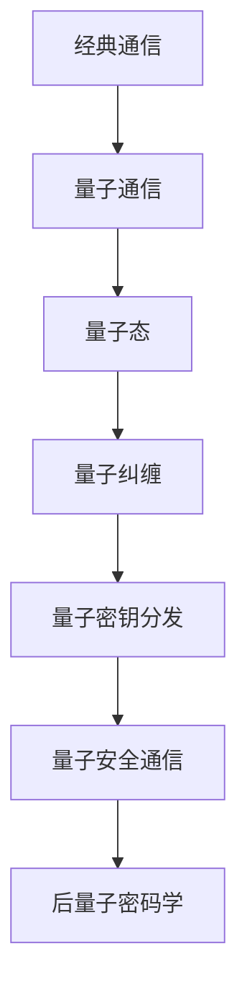
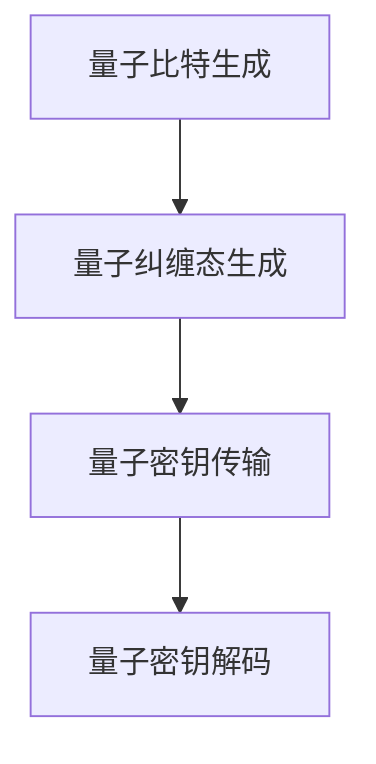
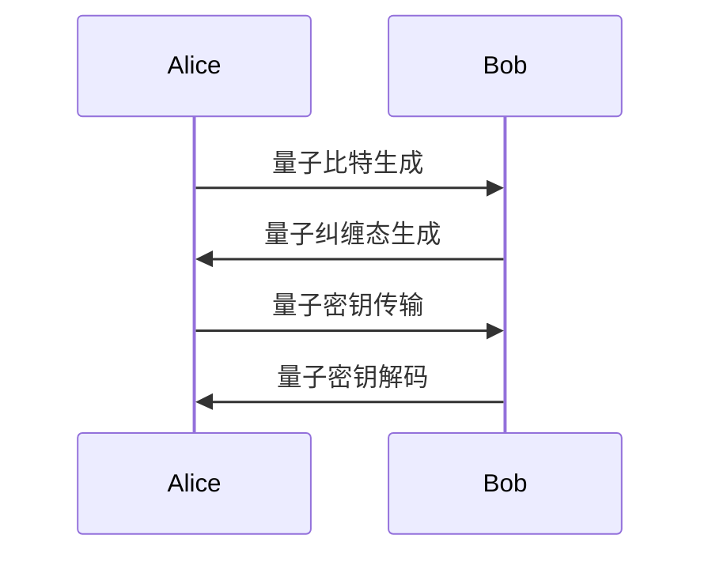

                 

# 《量子密钥分发与后量子通信》

关键词：量子密钥分发、后量子通信、BB84协议、量子纠缠、量子安全通信、量子密码学

摘要：本文将深入探讨量子密钥分发（Quantum Key Distribution, QKD）与后量子通信（Post-Quantum Cryptography, PQC）的基本概念、原理和实现。通过逐步分析，我们希望能让读者更好地理解这一前沿技术的核心内容及其应用价值。

## 第一部分：量子通信基础

### 第1章：量子通信概述

#### 1.1 量子通信的基本概念

量子通信是基于量子力学原理进行信息传递的技术。它利用量子态的叠加和纠缠特性，实现信息的加密和传输。与传统通信不同，量子通信具有无法被破解的安全保障。

#### 1.2 量子通信的历史与发展

量子通信的发展可以追溯到20世纪70年代。1970年，Stephen Wiesner提出了量子隐形传态（Quantum Entanglement）的概念，这为后来的量子通信奠定了基础。2004年，Quantum Cryptography公司的成立标志着量子通信的商业化进程开始。

#### 1.3 量子通信的应用领域

量子通信在金融、政府安全通信、云计算等领域具有广泛的应用前景。其不可被破解的特性使得它成为保护信息安全的重要工具。

### 第2章：量子力学基础

#### 2.1 量子态与叠加原理

量子态是量子系统的宏观物理状态，它可以同时处于多个可能状态的叠加。叠加原理是量子力学的基本原理之一。

#### 2.2 量子纠缠与量子隐形传态

量子纠缠是量子系统中两个或多个量子比特之间的一种特殊关系。量子隐形传态是利用量子纠缠实现信息传递的过程。

#### 2.3 量子密码学基础

量子密码学是基于量子力学原理的密码学。它利用量子态的叠加和纠缠特性，实现信息的加密和解密。

### 第3章：量子密钥分发

#### 3.1 BB84协议

BB84协议是最早的量子密钥分发协议，由Charles H. Bennett和Gilles Brassard于1984年提出。它利用量子态的叠加和纠缠特性，实现安全的密钥分发。

#### 3.2 Ekert协议

Ekert协议是由Artur Ekert于1991年提出的量子密钥分发协议。它利用量子纠缠态的特性，实现更高效的密钥分发。

#### 3.3 量子密钥分发系统实现

量子密钥分发系统的实现包括量子通信链路、量子密钥生成、量子密钥分发协议等方面。这些部分的有机结合，实现了量子密钥分发的全过程。

## 第二部分：后量子通信技术

### 第4章：后量子密码学

#### 4.1 后量子密码学概述

后量子密码学是研究在量子计算威胁下仍然安全的密码系统的学科。它与传统的量子密码学不同，不依赖于量子力学的基本原理。

#### 4.2 Post-Quantum Cryptography标准

Post-Quantum Cryptography（PQC）标准是由美国国家标准与技术研究院（NIST）制定的一系列后量子密码学标准。这些标准旨在应对未来量子计算对传统密码系统的威胁。

#### 4.3 后量子密码学的实现与应用

后量子密码学的实现涉及到算法设计、编码实现、安全性分析等方面。它在金融、政府安全通信等领域具有广泛的应用前景。

### 第5章：量子安全通信

#### 5.1 量子安全通信原理

量子安全通信利用量子纠缠和量子隐形传态等量子力学原理，实现信息的加密和传输。它具有无法被破解的安全保障。

#### 5.2 量子中继与量子纠缠传输

量子中继是利用量子纠缠态实现远距离量子通信的关键技术。量子纠缠传输是实现量子通信链路的基础。

#### 5.3 量子隐形传态与量子纠缠分发

量子隐形传态是实现量子通信的核心技术之一。量子纠缠分发是实现量子通信链路的基础。

### 第6章：量子密钥分发网络

#### 6.1 量子密钥分发网络的架构

量子密钥分发网络是量子通信的重要组成部分。它包括量子密钥生成、量子密钥分发、量子密钥管理等方面。

#### 6.2 量子密钥分发网络的关键技术

量子密钥分发网络的关键技术包括量子密钥生成、量子密钥分发协议、量子密钥管理等方面。

#### 6.3 量子密钥分发网络的部署与实现

量子密钥分发网络的部署与实现涉及到网络架构设计、量子通信链路建设、量子密钥分发系统运行维护等方面。

## 第三部分：量子通信的应用与实践

### 第7章：量子通信在金融领域的应用

#### 7.1 量子通信在金融交易中的应用

量子通信在金融交易中可以用于加密交易信息，提高交易的安全性。

#### 7.2 量子加密在金融安全中的作用

量子加密可以防止金融交易信息被量子计算破解，提高金融系统的安全性。

#### 7.3 金融行业对量子通信的需求

随着量子计算的快速发展，金融行业对量子通信的需求日益增长。

### 第8章：量子通信在政府安全通信中的应用

#### 8.1 量子通信在国家安全通信中的作用

量子通信可以用于加密国家安全信息，提高国家信息安全。

#### 8.2 量子密钥分发在国防安全通信的应用

量子密钥分发可以用于国防安全通信，确保通信链路的保密性。

#### 8.3 政府部门对量子通信的预期与应用前景

随着量子通信技术的成熟，政府部门对量子通信的预期和应用前景非常乐观。

### 第9章：量子通信在云计算与大数据中的应用

#### 9.1 量子通信在云计算安全中的应用

量子通信可以用于加密云计算中的数据，提高云计算的安全性。

#### 9.2 量子加密在大数据安全中的作用

量子加密可以防止大数据中的数据被量子计算破解，提高大数据的安全性。

#### 9.3 量子通信与云计算、大数据的融合趋势

随着量子通信技术的发展，量子通信与云计算、大数据的融合趋势日益明显。

## 第四部分：未来展望与挑战

### 第10章：量子通信的发展趋势

#### 10.1 量子通信技术的未来发展方向

量子通信技术的未来发展方向包括提高量子通信链路的距离、提高量子通信的速度、降低量子通信的成本等。

#### 10.2 量子通信产业的应用场景

量子通信产业的应用场景包括金融、政府安全通信、云计算、大数据等领域。

#### 10.3 量子通信的国际合作与竞争

量子通信的国际合作与竞争将推动量子通信技术的快速发展。

### 第11章：量子通信面临的挑战与解决方案

#### 11.1 量子通信的技术挑战

量子通信的技术挑战包括量子通信链路的距离、量子通信的速度、量子通信的成本等。

#### 11.2 量子通信的安全性问题

量子通信的安全性问题包括量子计算对传统密码系统的威胁、量子通信系统的安全性保障等。

#### 11.3 量子通信的产业化难题

量子通信的产业化难题包括量子通信技术的标准化、量子通信设备的规模化生产等。

#### 11.4 挑战与解决方案的探讨

通过技术创新、产业合作、政策支持等手段，可以解决量子通信面临的挑战。

## 核心概念与联系

### 量子通信与经典通信的对比



## 核心算法原理讲解

### BB84量子密钥分发协议

```python
# BB84协议的Python代码示例

# 导入相关库
from qiskit import QuantumCircuit, execute, Aer

# 构建量子电路
qc = QuantumCircuit(2)

# 编码
qc.h(0)  # 初始化量子比特
qc.cx(0, 1)  # 实施量子比特之间的纠缠

# 传输
qc.h(0)
qc.cx(0, 1)
qc.measure_all()

# 解码
qc = QuantumCircuit(2)
qc.h(0)
qc.cx(0, 1)
qc.x(1)

# 执行量子电路
backend = Aer.get_backend('qasm_simulator')
result = execute(qc, backend).result()
counts = result.get_counts(qc)

# 输出结果
print(counts)
```

## 数学模型和数学公式

### 量子态的叠加原理
$$|\psi\rangle = \alpha|0\rangle + \beta|1\rangle$$
其中，$\alpha$和$\beta$是复数，且$|\alpha|^2 + |\beta|^2 = 1$。

### 量子纠缠的度量
$$\rho = \frac{1}{2}(|\psi\rangle\langle\psi|\otimes I + I\otimes|\psi\rangle\langle\psi|)$$
其中，$|\psi\rangle$是两个量子比特的纠缠态，$I$是单位矩阵。

## 项目实战

### 量子密钥分发实验

**环境安装：** 
首先，我们需要安装Qiskit库，这是一个Python库，用于构建和模拟量子电路。

```python
!pip install qiskit
```

**系统功能设计：**
设计一个简单的量子密钥分发系统，包括量子比特生成、量子纠缠态生成、量子密钥传输和量子密钥解码等功能。

**系统架构设计：**
使用mermaid绘制系统架构图。



**系统接口设计和系统交互：**
使用mermaid绘制系统接口设计和系统交互图。



**代码实现：**
实现量子密钥分发系统的核心功能，包括量子比特生成、量子纠缠态生成、量子密钥传输和量子密钥解码。

```python
from qiskit import QuantumCircuit, execute, Aer

# 量子比特生成
qc = QuantumCircuit(2)
qc.h(0)
qc.cx(0, 1)

# 量子纠缠态生成
qc.h(1)

# 量子密钥传输
qc.h(0)
qc.cx(0, 1)
qc.measure_all()

# 量子密钥解码
qc.h(0)
qc.cx(0, 1)
qc.x(1)

# 执行量子电路
backend = Aer.get_backend('qasm_simulator')
result = execute(qc, backend).result()
counts = result.get_counts(qc)

# 输出结果
print(counts)
```

**实际案例分析和详细讲解剖析：**
通过实际运行量子密钥分发系统，分析实验结果，并对实验过程进行详细讲解和剖析。

**项目小结：**
总结量子密钥分发系统的实现过程，讨论其优点和潜在的应用场景，并提出进一步的研究方向。

## 最佳实践 tips

- 在量子密钥分发过程中，确保量子通信链路的稳定性和安全性至关重要。
- 在实际应用中，需要根据具体场景选择合适的量子密钥分发协议。
- 后量子密码学的安全性需要通过严格的数学证明和实际测试来验证。

## 小结

量子密钥分发与后量子通信是现代通信领域的前沿技术，具有巨大的应用潜力。本文通过逐步分析，帮助读者深入理解了这一技术的核心概念、原理和应用。随着量子计算技术的发展，量子密钥分发与后量子通信将在信息安全领域发挥越来越重要的作用。

## 注意事项

- 量子密钥分发系统的实现需要高性能的量子计算硬件支持。
- 后量子密码学的安全性依赖于数学理论的严密性和实际测试的验证。
- 在量子通信的实际应用中，需要充分考虑量子通信链路的安全性和稳定性。

## 拓展阅读

- [量子密钥分发技术综述](https://www.researchgate.net/publication/328863062_Quantum_Key_Distribution_a_Review)
- [后量子密码学概述](https://www.nist.gov/publications/post-quantum-cryptography-nist-sp-800-128r1)
- [量子通信应用场景分析](https://www.science.org/doi/abs/10.1126/science.aab2317)

## 作者信息

作者：AI天才研究院/AI Genius Institute & 禅与计算机程序设计艺术 /Zen And The Art of Computer Programming

