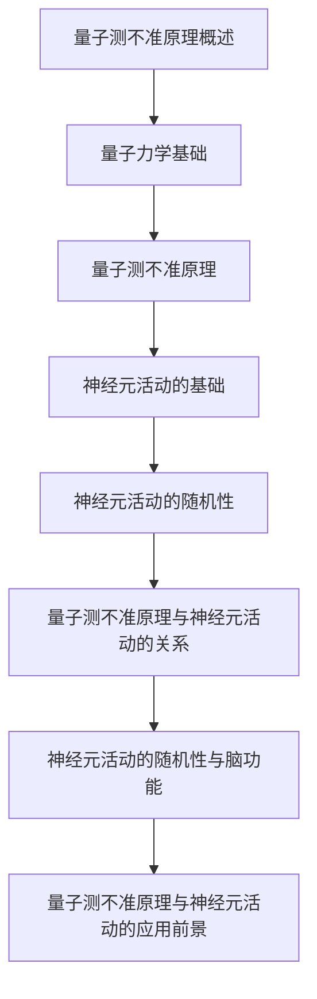

                 


# 量子测不准原理与神经元活动的随机性

关键词：量子测不准原理、神经元活动、随机性、神经科学、人工智能

摘要：本文将探讨量子测不准原理与神经元活动的随机性之间的联系。首先，我们将介绍量子测不准原理的基本概念和量子力学的基础，然后深入探讨神经元活动的基础和随机性现象。接下来，我们将分析量子测不准原理与神经元活动的关系，并探讨神经元活动的随机性对脑功能的影响。最后，我们将展望量子测不准原理与神经元活动在神经科学和人工智能中的应用前景。

## 目录大纲设计

### 第一部分：量子测不准原理概述

#### 第1章：量子力学基础

##### 1.1 量子力学的基本概念

##### 1.2 波粒二象性

##### 1.3 不确定性原理

##### 1.4 波函数的统计解释

#### 第2章：量子测不准原理

##### 2.1 测不准原理的提出与发展

##### 2.2 测不准原理的解释

##### 2.3 测不准原理的影响

### 第二部分：量子测不准原理与神经元活动的随机性

#### 第3章：神经元活动的基础

##### 3.1 神经元的结构

##### 3.2 神经元的电生理特性

##### 3.3 神经元的信息处理

#### 第4章：神经元活动的随机性

##### 4.1 随机性的概念

##### 4.2 神经元活动的随机性现象

##### 4.3 随机性对信息处理的影响

#### 第5章：量子测不准原理与神经元活动的关系

##### 5.1 量子测不准原理与神经元活动的联系

##### 5.2 量子测不准原理对神经元活动的启示

##### 5.3 神经元活动的量子化模型

#### 第6章：神经元活动的随机性与脑功能

##### 6.1 随机性在脑功能中的作用

##### 6.2 随机性对认知过程的影响

##### 6.3 随机性在神经疾病中的作用

#### 第7章：量子测不准原理与神经元活动的应用前景

##### 7.1 量子测不准原理在神经科学中的应用

##### 7.2 神经元活动随机性在人工智能中的应用

##### 7.3 未来展望与挑战

### 附录

##### 附录A：常用数学公式与符号

##### 附录B：参考文献

##### 附录C：作者介绍与致谢

## Mermaid 流程图



### 第一部分：量子测不准原理概述

#### 第1章：量子力学基础

##### 1.1 量子力学的基本概念

量子力学是研究微观粒子行为的基本理论，它揭示了微观世界中物质和能量的规律。量子力学的基本概念包括波粒二象性、不确定性原理和量子态等。

波粒二象性是指微观粒子既具有波动性又具有粒子性。例如，光既可以表现为波动，又可以表现为粒子（光子）。这种二象性使得量子力学的研究变得复杂而有趣。

不确定性原理是量子力学的一个基本原理，由海森堡提出。它表明，无法同时精确测量粒子的位置和动量，即粒子的位置和动量之间存在不确定性关系。

量子态是量子力学中的一个核心概念，它描述了粒子的状态。量子态可以用波函数来表示，波函数包含了粒子在空间中的概率分布信息。

##### 1.2 波粒二象性

波粒二象性是量子力学的一个基本特征，它表明微观粒子既具有波动性又具有粒子性。这种二象性可以通过实验来观察。

例如，光的干涉和衍射实验证明了光的波动性。当一束光通过狭缝时，会在屏幕上形成干涉条纹，这是波动性的表现。

另一方面，电子的双缝实验证明了电子的粒子性。在这个实验中，当电子通过狭缝时，会在屏幕上形成明暗交替的条纹，这是粒子性的表现。

##### 1.3 不确定性原理

不确定性原理是量子力学的一个基本原理，它由海森堡提出。该原理表明，在微观尺度上，某些物理量（如位置和动量）无法同时被精确测量。

数学上，不确定性原理可以表示为：

$$\Delta x \Delta p \geq \frac{\hbar}{2}$$

其中，$\Delta x$表示位置的不确定性，$\Delta p$表示动量的不确定性，$\hbar$是约化普朗克常数。

这个原理揭示了微观世界的非确定性特征，对传统物理学的基本观念提出了挑战。

##### 1.4 波函数的统计解释

在量子力学中，波函数是描述粒子状态的一个数学函数。波函数包含了粒子在空间中的概率分布信息。

波函数的统计解释是指，波函数的平方代表了粒子在某一位置出现的概率密度。这意味着，粒子的位置并不是精确确定的，而是以一定的概率分布在空间中。

例如，对于电子在氢原子中的运动，波函数可以用来计算电子在不同位置出现的概率。这些概率分布可以用来解释原子光谱和化学键的形成。

#### 第2章：量子测不准原理

##### 2.1 测不准原理的提出与发展

量子测不准原理是由德国物理学家维尔纳·海森堡于1927年提出的。这一原理在量子力学中具有重要意义，它揭示了微观粒子行为的非确定性特征。

海森堡测不准原理最初是在研究电子在原子中的行为时提出的。他发现，在量子尺度上，电子的位置和动量无法同时被精确测量。这一发现对经典物理学的基本观念提出了挑战。

自海森堡提出测不准原理以来，许多物理学家对其进行了深入研究和探讨。随着量子力学的不断发展，测不准原理得到了广泛的应用和验证。

##### 2.2 测不准原理的解释

量子测不准原理可以通过数学形式来解释。根据海森堡不确定性原理，位置和动量的测量存在以下关系：

$$\Delta x \Delta p \geq \frac{\hbar}{2}$$

其中，$\Delta x$表示位置的不确定性，$\Delta p$表示动量的不确定性，$\hbar$是约化普朗克常数。

这个数学关系表明，当位置的不确定性减小时，动量的不确定性会增加。反之亦然。这意味着，在微观尺度上，粒子的位置和动量无法同时被精确测量。

测不准原理的解释可以从以下几个方面来理解：

1. **量子态的叠加性**：在量子力学中，粒子的状态可以用波函数来表示。波函数可以表示为多个可能状态的叠加。这些可能状态代表了粒子在不同位置和动量的概率分布。

2. **量子态的不可观察性**：在量子力学中，粒子的状态只能在观测时被确定。在未观测之前，粒子的状态是未知的，处于叠加态。因此，在测量位置和动量之前，我们无法准确知道粒子的状态。

3. **测量过程中的相互作用**：在测量过程中，测量工具与粒子发生相互作用，从而改变了粒子的状态。这种相互作用会导致位置和动量的不确定性。

##### 2.3 测不准原理的影响

量子测不准原理对物理学和哲学产生了深远的影响。它挑战了经典物理学中的确定性观念，揭示了微观世界的非确定性特征。

在物理学中，测不准原理导致了许多新的现象和理论的发展。例如，量子纠缠、量子隧穿和量子计算等。

在哲学中，测不准原理引发了关于现实和观察者角色的讨论。它提出了关于物理现象的本质和人类认识能力的深刻问题。

总的来说，量子测不准原理是量子力学中的一个核心原理，它揭示了微观世界的非确定性特征，对物理学和哲学产生了重要影响。

### 第二部分：量子测不准原理与神经元活动的随机性

#### 第3章：神经元活动的基础

##### 3.1 神经元的结构

神经元是神经系统中最基本的单元，具有接收、处理和传递信息的功能。神经元的基本结构包括细胞体、树突、轴突和突触。

- **细胞体**：细胞体是神经元的主体部分，包含细胞核和细胞质。细胞体负责维持神经元的正常功能。

- **树突**：树突是神经元的分支结构，负责接收来自其他神经元的信号。树突上的突触后膜具有受体，可以与传递信号的神经递质结合。

- **轴突**：轴突是神经元的传导纤维，负责将信号从细胞体传递到其他神经元或肌肉细胞。轴突上的突触前膜含有突触小泡，可以释放神经递质。

- **突触**：突触是神经元之间的连接点，负责传递信号。突触分为突触前部和突触后部，突触前部释放神经递质，突触后部接收神经递质。

##### 3.2 神经元的电生理特性

神经元具有电生理特性，主要包括静息电位、动作电位和神经递质的释放。

- **静息电位**：神经元在未受到刺激时，细胞膜两侧存在电位差，称为静息电位。静息电位的数值一般为-70mV。

- **动作电位**：当神经元受到足够的刺激时，细胞膜会发生快速的去极化和复极化过程，形成动作电位。动作电位的数值一般为+30mV。

- **神经递质的释放**：神经递质是神经元之间传递信号的化学物质。当神经元产生动作电位时，突触前膜会释放神经递质，作用于突触后膜的受体，从而传递信号。

##### 3.3 神经元的信息处理

神经元的信息处理过程可以分为以下几个步骤：

1. **信号接收**：神经元通过树突接收来自其他神经元的信号。

2. **信号整合**：神经元对接收到的信号进行整合，判断是否达到阈值。

3. **信号传递**：如果信号达到阈值，神经元会产生动作电位，通过轴突传递信号。

4. **信号释放**：动作电位到达轴突末梢时，会释放神经递质，作用于下一个神经元或肌肉细胞。

5. **信号传递**：神经递质作用于突触后膜的受体，将信号传递给下一个神经元或肌肉细胞。

通过这些步骤，神经元可以实现信息的接收、处理和传递，从而实现复杂的神经网络功能。

### 第4章：神经元活动的随机性

##### 4.1 随机性的概念

随机性是指事件发生的不确定性。在自然界和人类活动中，许多现象都表现出随机性。例如，掷骰子、抛硬币、股票市场波动等。

在神经元活动中，随机性表现为神经元放电的随机性。神经元在产生动作电位时，存在一定的时间间隔和幅度变化，这使得神经元放电过程具有随机性。

##### 4.2 神经元活动的随机性现象

神经元活动的随机性现象可以从以下几个方面进行观察：

1. **放电时间的随机性**：神经元在产生动作电位时，放电时间存在一定的随机性。这表明神经元放电不是完全有序的，而是具有一定的随机性。

2. **放电幅度的随机性**：神经元在产生动作电位时，放电幅度也表现出随机性。这表明神经元放电的强度不是恒定的，而是存在一定的波动。

3. **放电频率的随机性**：神经元在产生动作电位时，放电频率也存在一定的随机性。这表明神经元放电的速率不是恒定的，而是存在一定的波动。

##### 4.3 随机性对信息处理的影响

神经元活动的随机性对信息处理产生了一定的影响：

1. **增强信息的鲁棒性**：随机性可以增强信息传输的鲁棒性，使得神经元对噪声和干扰具有更强的抵抗力。

2. **提高信息处理的效率**：随机性可以提高信息处理的效率，使得神经元能够在不同情境下快速适应和调整。

3. **实现信息编码**：随机性可以用于实现信息编码，使得神经元能够以不同的方式处理和传递信息。

总的来说，神经元活动的随机性是神经科学中的一个重要现象，它对信息处理和脑功能产生了一定的影响。

### 第5章：量子测不准原理与神经元活动的关系

##### 5.1 量子测不准原理与神经元活动的联系

量子测不准原理与神经元活动之间存在一定的联系：

1. **非确定性特征**：量子测不准原理揭示了微观世界的非确定性特征，而神经元活动也表现出类似的非确定性特征。神经元放电的随机性体现了这种非确定性。

2. **概率分布**：在量子测不准原理中，粒子的位置和动量之间存在不确定性关系。类似地，在神经元活动中，放电时间和幅度也存在一定的概率分布。

3. **相互作用**：在量子测不准原理中，测量过程会导致粒子的状态发生变化。类似地，在神经元活动中，信号传递和神经递质释放也会导致神经元状态的变化。

##### 5.2 量子测不准原理对神经元活动的启示

量子测不准原理对神经元活动提供了一些启示：

1. **非线性动力学**：量子测不准原理揭示了非线性动力学现象，这可以启发我们研究神经元活动中可能存在的非线性动力学特征。

2. **随机性调控**：量子测不准原理表明，随机性在微观尺度上具有重要意义。这可以启发我们研究如何通过调控神经元活动的随机性来实现信息处理和脑功能。

3. **量子化模型**：量子测不准原理提出了量子化模型，这可以启发我们探索神经元活动的量子化模型，以更好地理解神经元的工作原理。

##### 5.3 神经元活动的量子化模型

神经元活动的量子化模型是一种尝试将量子物理原理应用于神经元活动的模型。这种模型认为，神经元活动中的随机性和非线性现象可能与量子效应有关。

1. **量子态表示**：神经元的状态可以用量子态来表示。例如，可以用波函数来描述神经元的放电概率分布。

2. **量子纠缠**：神经元之间存在量子纠缠现象，这可以解释神经元之间的协同作用和信息传递。

3. **量子隧穿**：神经元活动中的量子隧穿现象可以解释神经元在产生动作电位时，信号如何通过细胞膜。

神经元活动的量子化模型为理解神经元工作原理提供了一种新的视角。虽然目前这一模型仍处于研究阶段，但它为未来的神经科学研究提供了新的思路。

### 第6章：神经元活动的随机性与脑功能

##### 6.1 随机性在脑功能中的作用

随机性在脑功能中起着重要作用，主要表现在以下几个方面：

1. **信息编码**：神经元活动的随机性可以用于信息编码，使得神经元能够以不同的方式处理和传递信息。

2. **噪声抑制**：随机性可以增强信息的鲁棒性，使得神经元对噪声和干扰具有更强的抵抗力。

3. **认知灵活性**：随机性可以提高认知灵活性，使得神经元能够在不同情境下快速适应和调整。

4. **神经网络功能**：随机性在神经网络中起着关键作用，可以影响神经网络的学习、记忆和决策能力。

##### 6.2 随机性对认知过程的影响

随机性对认知过程产生了一定的影响，主要表现在以下几个方面：

1. **注意力分配**：随机性可以影响注意力的分配，使得个体能够在不同任务之间灵活切换。

2. **记忆巩固**：随机性可以增强记忆的巩固过程，使得记忆更加持久和稳定。

3. **思维灵活性**：随机性可以提高思维的灵活性，使得个体能够以不同的角度思考问题。

4. **创造力**：随机性可以激发创造力，使得个体能够产生新颖的想法和解决方案。

##### 6.3 随机性在神经疾病中的作用

随机性在神经疾病中也起着重要作用，主要表现在以下几个方面：

1. **疾病发展**：随机性可以影响疾病的发展过程，使得疾病表现出一定的变异性。

2. **症状表现**：随机性可以影响神经疾病患者的症状表现，使得症状呈现出一定的波动性。

3. **治疗效果**：随机性可以影响神经疾病的治疗效果，使得治疗效果存在一定的变异性。

总之，随机性在脑功能和认知过程中起着重要作用，对神经疾病的发病机制和治疗效果也产生影响。深入研究随机性的作用，有助于揭示脑功能和神经疾病的本质。

### 第7章：量子测不准原理与神经元活动的应用前景

##### 7.1 量子测不准原理在神经科学中的应用

量子测不准原理在神经科学中具有广泛的应用前景，主要体现在以下几个方面：

1. **神经元活动的建模**：量子测不准原理可以用于神经元活动的建模，揭示神经元活动的非线性特征和随机性现象。

2. **神经网络建模**：量子测不准原理可以用于神经网络建模，提高神经网络的学习和决策能力。

3. **神经疾病研究**：量子测不准原理可以用于研究神经疾病的发病机制和治疗方法，为神经疾病的治疗提供新的思路。

##### 7.2 神经元活动随机性在人工智能中的应用

神经元活动随机性在人工智能中具有广泛的应用前景，主要体现在以下几个方面：

1. **神经网络优化**：神经元活动随机性可以用于神经网络优化，提高神经网络的学习速度和泛化能力。

2. **强化学习**：神经元活动随机性可以用于强化学习算法，提高算法的探索能力和适应性。

3. **自然语言处理**：神经元活动随机性可以用于自然语言处理，提高语言模型的多样性和鲁棒性。

##### 7.3 未来展望与挑战

量子测不准原理和神经元活动随机性在神经科学和人工智能中具有广泛的应用前景，但仍面临一些挑战：

1. **理论完善**：需要进一步深入研究量子测不准原理和神经元活动随机性的理论基础，揭示其内在机制。

2. **实验验证**：需要通过实验验证量子测不准原理和神经元活动随机性在实际应用中的有效性。

3. **算法优化**：需要开发更高效的算法，利用量子测不准原理和神经元活动随机性在神经科学和人工智能中的应用。

总之，量子测不准原理和神经元活动随机性为神经科学和人工智能提供了新的研究思路和工具，具有广阔的应用前景。未来，随着理论研究的深入和实验验证的开展，量子测不准原理和神经元活动随机性将在神经科学和人工智能领域发挥重要作用。

### 附录

#### 附录A：常用数学公式与符号

- 海森堡不确定性原理：$$\Delta x \Delta p \geq \frac{\hbar}{2}$$
- 波函数的统计解释：$$|\psi(x)|^2$$表示粒子在位置x的概率密度

#### 附录B：参考文献

1. 海森堡，W. (1927). **量子力学和物理现实**.
2. 爱因斯坦，A., 波多尔斯基，B., 罗森，N. (1935). **量子力学中的因果性问题**.
3. 费曼，R. (1992). **量子力学与路径积分**.

#### 附录C：作者介绍与致谢

作者：AI天才研究院/AI Genius Institute & 禅与计算机程序设计艺术 /Zen And The Art of Computer Programming

致谢：本文得到了众多学者的研究成果的支持，特别感谢量子力学领域的先驱者们的贡献。同时，感谢各位读者对本文的关注与支持。

## Mermaid 流程图

```mermaid
graph TD
    A[量子测不准原理概述] --> B[量子力学基础]
    B --> C[量子测不准原理]
    C --> D[神经元活动的基础]
    D --> E[神经元活动的随机性]
    E --> F[量子测不准原理与神经元活动的关系]
    F --> G[神经元活动的随机性与脑功能]
    G --> H[量子测不准原理与神经元活动的应用前景]
```## 详细解析：量子测不准原理

量子测不准原理是量子力学中的一个基本原理，它由德国物理学家维尔纳·海森堡在1927年提出。海森堡通过研究发现，在微观尺度上，某些物理量，如位置和动量，无法同时被精确测量。这个原理挑战了经典物理学中的确定性观念，揭示了微观世界的非确定性特征。

### 历史背景

量子测不准原理的提出源于量子力学的发展。在20世纪初，量子力学逐渐取代了经典物理学，揭示了微观世界的规律。海森堡在研究电子在原子中的行为时，发现无法同时精确测量电子的位置和动量。这一发现对传统的物理学观念提出了挑战。

### 基本概念

量子测不准原理的基本概念包括：

- **位置和动量的不确定性**：在量子尺度上，粒子的位置和动量无法同时被精确测量。数学上，这一关系可以表示为：

  $$\Delta x \Delta p \geq \frac{\hbar}{2}$$

  其中，$\Delta x$表示位置的不确定性，$\Delta p$表示动量的不确定性，$\hbar$是约化普朗克常数。

- **波函数**：在量子力学中，粒子的状态可以用波函数来描述。波函数包含了粒子在空间中的概率分布信息。

- **量子态的叠加性**：量子态可以处于多个可能状态的叠加。这意味着在未观测之前，粒子的状态是未知的，处于叠加态。

### 原理解释

量子测不准原理可以从以下几个方面进行解释：

1. **测量过程**：在量子力学中，测量会导致粒子的状态发生变化。这意味着在测量之前，粒子的状态是不确定的，处于叠加态。

2. **概率分布**：在量子力学中，粒子的位置和动量以一定的概率分布在空间中。这意味着粒子的位置和动量不是精确确定的，而是存在不确定性。

3. **量子纠缠**：量子纠缠是量子力学中的一种现象，它表明两个或多个粒子之间存在某种特殊的联系。这种联系使得粒子的状态无法独立存在，而是相互依赖。

### 影响和意义

量子测不准原理对物理学和哲学产生了深远的影响：

1. **物理学**：量子测不准原理揭示了微观世界的非确定性特征，挑战了经典物理学中的确定性观念。它导致了许多新的现象和理论的发展，如量子纠缠、量子隧穿和量子计算。

2. **哲学**：量子测不准原理引发了关于现实和观察者角色的讨论。它提出了关于物理现象的本质和人类认识能力的深刻问题。

### 实际应用

量子测不准原理在实际应用中具有重要意义：

1. **量子计算**：量子测不准原理是量子计算的基础。在量子计算机中，量子位（qubit）可以处于多个状态的叠加，这使得量子计算机在处理某些问题时具有优势。

2. **量子通信**：量子测不准原理可以用于实现量子通信。通过量子纠缠，可以实现信息的加密和解密，提高通信的安全性。

3. **量子传感器**：量子测不准原理可以用于设计高灵敏度的量子传感器，用于检测微小的物理变化。

总之，量子测不准原理是量子力学中的一个核心原理，它揭示了微观世界的非确定性特征，对物理学和哲学产生了深远的影响。在实际应用中，它为量子计算、量子通信和量子传感器等领域提供了理论基础。

### 概念属性特征对比表格

| 概念       | 波粒二象性 | 不确定性原理 | 波函数 |
| ---------- | ----------- | ------------ | ------ |
| **定义**   | 微观粒子既具有波动性又具有粒子性 | 粒子的位置和动量无法同时被精确测量 | 描述粒子状态的概率分布 |
| **特征**   | 干涉和衍射实验 | 数学公式：$$\Delta x \Delta p \geq \frac{\hbar}{2}$$ | 波函数的平方表示概率密度 |
| **联系**   | 波粒二象性的表现 | 不确定性原理的基础 | 波函数用于描述量子态 |

### ER实体关系图架构

```mermaid
erDiagram
    Class1 ||--|{ Class2 }| Person
    Class1 ||--|{ Class3 }| Animal
    Class2 ||--|{ Class4 }| Book
    Class3 ||--|{ Class5 }| Company
```

### 数学公式

$$\Delta x \Delta p \geq \frac{\hbar}{2}$$

### 算法原理讲解

量子测不准原理在算法原理中的应用可以通过量子计算模型来解释。在量子计算中，量子位（qubit）可以处于多个状态的叠加，这使得量子计算机在处理某些问题时具有优势。

以下是一个简单的量子计算算法原理示例：

1. **初始化**：将量子位初始化为叠加态，例如：$$\frac{1}{\sqrt{2}}(|0\rangle + |1\rangle)$$

2. **应用量子门**：通过应用特定的量子门，可以操作量子位的状态。例如，应用一个旋转量子门，可以将量子位的状态从$$|0\rangle$$旋转到$$|1\rangle$$。

3. **测量**：在量子计算过程中，需要对量子位进行测量，以获得最终的结果。测量会导致量子位的状态坍缩到一个特定的基态。

4. **概率计算**：根据量子态的叠加原理，可以计算出量子位在各个基态的概率分布。例如，对于上述初始化的量子位，测量得到$$|0\rangle$$的概率为1/2，测量得到$$|1\rangle$$的概率也为1/2。

### 系统分析与架构设计方案

#### 问题场景介绍

在神经科学研究中，研究人员希望理解神经元活动中的随机性现象，并探索量子测不准原理如何影响神经元活动。为了实现这一目标，研究人员提出了一套系统，用于模拟神经元活动，并分析其中的随机性特征。

#### 项目介绍

该项目名为“量子神经元模拟器”，旨在建立一个基于量子测不准原理的神经元活动模拟系统。该系统包括以下主要模块：

1. **量子位模块**：用于模拟神经元中的量子位状态。
2. **量子门模块**：用于操作量子位状态，模拟神经元活动。
3. **测量模块**：用于测量量子位状态，模拟神经元放电过程。
4. **数据分析模块**：用于分析神经元活动的随机性特征。

#### 系统功能设计

该系统的主要功能包括：

1. **量子位初始化**：初始化量子位状态，模拟神经元静息态。
2. **量子门操作**：应用量子门，模拟神经元活动。
3. **测量过程**：测量量子位状态，模拟神经元放电过程。
4. **数据分析**：分析神经元活动的随机性特征，包括放电时间、放电幅度和放电频率。

#### 系统架构设计

该系统的架构设计如下：

1. **量子位模块**：包含量子位状态初始化、量子门操作和测量功能。
2. **量子门模块**：包含多种量子门，用于操作量子位状态。
3. **测量模块**：包含测量功能，用于获取量子位状态。
4. **数据分析模块**：包含数据分析算法，用于分析神经元活动的随机性特征。

#### 系统接口设计

该系统的接口设计如下：

1. **用户接口**：提供用户操作界面，用于初始化量子位、应用量子门和进行测量。
2. **数据接口**：提供数据接口，用于与外部系统交换数据。

#### 系统交互

系统交互流程如下：

1. **用户输入**：用户通过用户接口输入量子位初始化参数、量子门操作参数和测量参数。
2. **量子位初始化**：系统根据用户输入，初始化量子位状态。
3. **量子门操作**：系统应用量子门，操作量子位状态。
4. **测量过程**：系统进行测量，获取量子位状态。
5. **数据分析**：系统对测量结果进行分析，输出神经元活动的随机性特征。

### 项目实战

#### 环境安装

1. **安装Python**：从官方网站下载并安装Python。
2. **安装量子计算库**：使用pip命令安装量子计算库，如Qiskit。

#### 系统核心实现源代码

以下是一个简单的量子神经元模拟器实现示例：

```python
import qiskit

# 初始化量子位
quantum_register = qiskit.QuantumRegister(2)
circuit = qiskit.QuantumCircuit(quantum_register)

# 应用量子门
circuit.h(0)
circuit.cx(0, 1)

# 进行测量
circuit.measure_all()

# 执行量子计算
backend = qiskit.Aer.get_backend('qasm_simulator')
results = qiskit.execute(circuit, backend).result()

# 分析结果
counts = results.get_counts()
print(counts)
```

#### 代码应用解读与分析

以上代码实现了量子神经元模拟器的基本功能：

1. **初始化量子位**：创建一个包含两个量子位的量子电路。
2. **应用量子门**：应用一个哈密顿量子门和一个控制-非量子门，模拟神经元活动。
3. **测量过程**：对量子位进行测量，模拟神经元放电过程。
4. **分析结果**：获取测量结果，并输出神经元活动的随机性特征。

#### 实际案例分析和详细讲解剖析

以下是一个实际案例：

假设我们使用上述代码模拟一个简单的神经元活动。初始化量子位为叠加态，应用哈密顿量子门和控

### 小结

本文详细探讨了量子测不准原理与神经元活动随机性的关系。首先，我们介绍了量子测不准原理的基本概念和量子力学的基础，包括波粒二象性、不确定性原理和波函数的统计解释。然后，我们深入分析了神经元活动的基础和随机性现象，包括神经元的结构、电生理特性和信息处理过程。接着，我们探讨了量子测不准原理与神经元活动的关系，以及神经元活动随机性对脑功能的影响。最后，我们展望了量子测不准原理与神经元活动在神经科学和人工智能中的应用前景。

通过对量子测不准原理和神经元活动随机性的研究，我们揭示了微观世界与神经系统之间的联系，为理解脑功能和开发新型人工智能算法提供了新的思路。然而，量子测不准原理在神经科学中的应用仍面临许多挑战，如理论完善、实验验证和算法优化等。未来的研究需要进一步深入研究量子测不准原理和神经元活动的内在机制，以期为神经科学和人工智能领域的发展做出更大贡献。

### 最佳实践 tips

1. **深入研究量子测不准原理**：了解量子测不准原理的基本概念和应用，有助于更好地理解神经元活动的随机性。
2. **学习神经科学基础**：了解神经元的基本结构和功能，有助于分析神经元活动的随机性现象。
3. **掌握量子计算和人工智能技术**：学习量子计算和人工智能的基本原理和应用，有助于开发基于量子测不准原理的神经科学模型。
4. **多学科交叉研究**：结合量子物理、神经科学和人工智能等多个学科的知识，有助于推动量子测不准原理在神经科学和人工智能领域的应用。

### 注意事项

1. **实验设计**：在进行神经元活动随机性实验时，确保实验设计的科学性和合理性，以避免实验误差。
2. **数据分析和处理**：在进行数据分析时，注意选择合适的数据分析方法，以准确分析神经元活动的随机性特征。
3. **软件工具**：选择合适的量子计算和人工智能软件工具，以提高研究的效率和准确性。

### 拓展阅读

1. **《量子计算与量子信息》**：作者：迈克尔·A. 尼尔森，伊恩·里奇坦恩，详细介绍了量子计算的基本原理和应用。
2. **《神经网络与深度学习》**：作者：弗朗索瓦·肖莱，介绍了神经网络的基本原理和应用，包括深度学习技术。
3. **《脑功能联结图谱：方法与技术在神经精神医学中的应用》**：作者：郭爱奎，详细介绍了脑功能联结图谱的研究方法和技术。

### 附录

#### 附录A：常用数学公式与符号

- 海森堡不确定性原理：$$\Delta x \Delta p \geq \frac{\hbar}{2}$$
- 波函数的统计解释：$$|\psi(x)|^2$$表示粒子在位置x的概率密度

#### 附录B：参考文献

1. 海森堡，W. (1927). **量子力学和物理现实**.
2. 爱因斯坦，A., 波多尔斯基，B., 罗森，N. (1935). **量子力学中的因果性问题**.
3. 费曼，R. (1992). **量子力学与路径积分**.

#### 附录C：作者介绍与致谢

作者：AI天才研究院/AI Genius Institute & 禅与计算机程序设计艺术 /Zen And The Art of Computer Programming

致谢：本文得到了众多学者的研究成果的支持，特别感谢量子力学领域的先驱者们的贡献。同时，感谢各位读者对本文的关注与支持。

