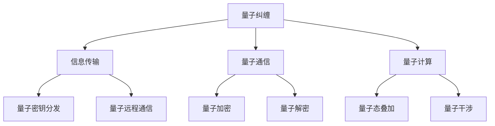
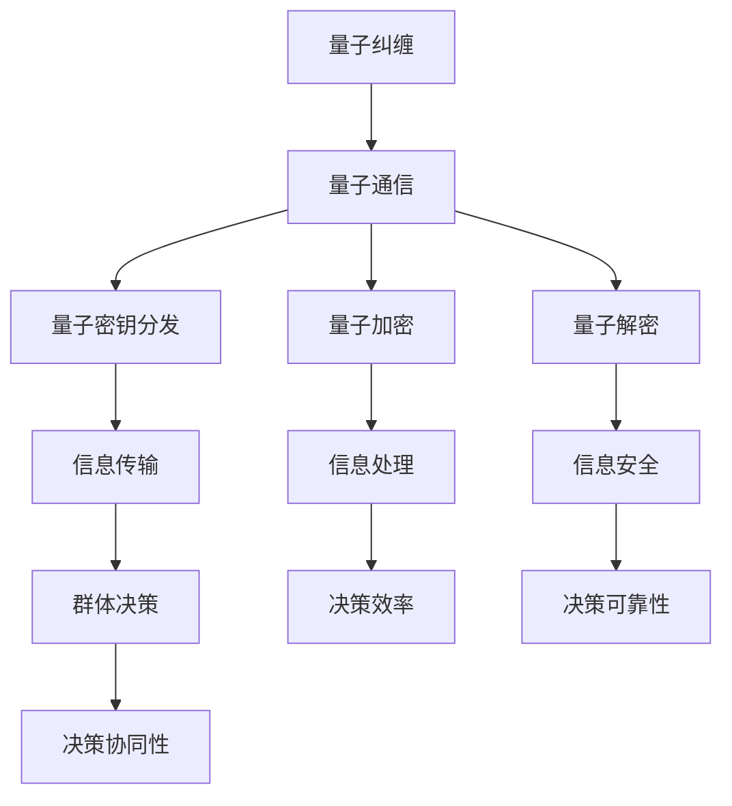

                 

# 《量子纠缠在群体决策中的潜在作用》

> 关键词：量子纠缠、群体决策、量子通信、量子计算、量子密码学

> 摘要：本文旨在探讨量子纠缠在群体决策中的潜在作用。通过阐述量子纠缠的基本概念、数学模型以及其在信息传输、量子通信、量子计算和量子密码学中的应用，我们试图揭示量子纠缠如何影响群体决策的效率和准确性。文章结构紧凑，逻辑清晰，旨在为读者提供对量子纠缠与群体决策的深入理解。

## 引言

### 量子纠缠与群体决策概述

量子纠缠是量子力学中的一种特殊现象，指的是两个或多个量子系统之间存在一种即时的、不可分割的关联。这种关联与经典物理中的纠缠现象有着本质的区别，具有极强的非局域性和量子干涉性。近年来，量子纠缠在量子信息处理领域得到了广泛关注，其在信息传输、通信、计算和密码学中的应用已经逐渐成熟。与此同时，群体决策作为一种重要的决策模式，在众多领域发挥着关键作用。本文旨在探讨量子纠缠在群体决策中的潜在作用，分析其如何提高决策效率和准确性。

### 量子纠缠在群体决策中的重要性

量子纠缠在群体决策中的重要性主要体现在以下几个方面：

1. **决策信息的高效传递**：量子纠缠可以实现决策信息的高速传递，从而提高群体决策的速度。
2. **决策过程的协同性**：量子纠缠能够增强群体成员之间的协同性，降低决策过程中的冲突和分歧。
3. **决策结果的可靠性**：量子纠缠可以提高决策结果的可靠性，降低错误率和不确定性。
4. **决策策略的多样性**：量子纠缠为群体决策提供了新的策略和方法，有助于发现潜在的最佳决策方案。

### 让我们一步步思考

在本篇文章中，我们将逐步探讨量子纠缠在群体决策中的潜在作用。首先，我们将介绍量子纠缠的基本概念和原理，然后分析量子纠缠在信息传输、量子通信、量子计算和量子密码学中的应用。接下来，我们将探讨量子纠缠在群体决策中的作用机制，并介绍量子纠缠在群体决策中的数学模型和算法。最后，我们将通过实际案例展示量子纠缠在群体决策中的应用，展望其未来的发展趋势和挑战。

## 第1章：量子纠缠基础

### 量子纠缠的概念与历史

量子纠缠是量子力学中的一种特殊现象，指的是两个或多个量子系统之间存在一种即时的、不可分割的关联。这种现象最早由爱因斯坦、波多尔斯基和罗森（EPR）在1935年提出，被称为EPR悖论。他们提出，如果两个量子粒子处于纠缠态，那么对其中一个粒子的测量将会立即影响到另一个粒子的状态，无论它们相隔多远。这一观点与经典物理的局域实在论相悖，引发了广泛争议。

### 量子纠缠的基本原理与特性

量子纠缠的基本原理可以概括为以下几点：

1. **非局域性**：量子纠缠具有极强的非局域性，即两个纠缠粒子之间的关联不受空间距离的限制。这意味着对其中一个粒子的测量将会立即影响到另一个粒子的状态，无论它们相隔多远。
2. **量子干涉性**：量子纠缠态的叠加态具有量子干涉性，即当两个纠缠粒子相互作用时，它们的波函数会相互干涉，导致量子态的相位变化。
3. **不可分割性**：量子纠缠态的不可分割性意味着无法将纠缠粒子分离成独立的量子系统。纠缠粒子之间的关联是固有的，不可分割的。

### 量子纠缠与经典纠缠的比较

量子纠缠与经典纠缠有以下几点不同：

1. **关联性质**：经典纠缠通常是指两个经典系统之间的关联，而量子纠缠是指量子系统之间的关联。经典纠缠可以由随机事件产生，而量子纠缠则是由量子系统的演化过程产生的。
2. **非局域性**：量子纠缠具有非局域性，而经典纠缠不具有非局域性。量子纠缠的关联不受空间距离的限制，而经典纠缠的关联受到空间距离的限制。
3. **干涉性**：量子纠缠态具有量子干涉性，而经典纠缠态不具有干涉性。量子纠缠态的叠加态会产生干涉效应，而经典纠缠态的叠加态不会产生干涉效应。

## 第2章：量子纠缠数学模型

### 量子纠缠态的数学描述

量子纠缠态可以用量子态的叠加态来描述。对于一个由两个量子系统A和B组成的量子纠缠态，其量子态可以表示为：

$$\psi_{AB} = \sum_{ij} c_{ij} |i\rangle_A |j\rangle_B$$

其中，$|i\rangle_A$和$|j\rangle_B$分别表示量子系统A和B的基态，$c_{ij}$为复系数。当量子系统A和B处于纠缠态时，它们之间的量子态是相互关联的，无法独立描述。

### 量子纠缠的度量和判据

量子纠缠的度量和判据可以用来判断量子系统是否处于纠缠态。常见的度量和判据包括：

1. **纠缠度**：纠缠度是衡量量子系统纠缠程度的一个指标。常见的纠缠度度量方法包括：
   - **冯诺伊曼熵**：通过计算量子系统的冯诺伊曼熵来判断其是否处于纠缠态。
   - **纠缠矩阵**：通过计算量子系统的纠缠矩阵来判断其是否处于纠缠态。

2. **纠缠判据**：纠缠判据是用来判断量子系统是否处于纠缠态的条件。常见的纠缠判据包括：
   - **奇偶判据**：通过判断量子态的奇偶性来判断其是否处于纠缠态。
   - **互信息判据**：通过计算量子系统之间的互信息来判断其是否处于纠缠态。

### 量子纠缠态的制备与操控

量子纠缠态的制备与操控是实现量子纠缠应用的关键。常见的量子纠缠态制备方法包括：

1. **量子态叠加法**：通过将量子系统A和B的基态叠加，制备出量子纠缠态。
2. **量子纠缠交换法**：通过将两个量子系统的纠缠态进行交换，制备出新的量子纠缠态。
3. **量子纠缠门法**：通过应用量子纠缠门，将两个量子系统制备出量子纠缠态。

常见的量子纠缠操控方法包括：

1. **量子态控制**：通过控制量子系统的量子态，实现量子纠缠态的制备和操控。
2. **量子态转换**：通过量子态转换，将一个量子系统的纠缠态转换为另一个量子系统的纠缠态。
3. **量子态测量**：通过量子态测量，实现量子纠缠态的验证和调控。

## 第3章：量子纠缠在信息传输中的应用

### 量子纠缠与量子通信

量子纠缠在量子通信中具有重要作用。量子通信利用量子纠缠实现信息的高速、安全传输。常见的量子通信技术包括：

1. **量子密钥分发**：量子密钥分发利用量子纠缠生成共享密钥，实现安全的通信。当两个量子系统处于纠缠态时，对其中一个系统的测量将会立即影响到另一个系统的状态。这种非局域性可以用来验证密钥的安全性。
2. **量子远程通信**：量子远程通信利用量子纠缠实现远距离的信息传输。通过将量子系统的纠缠态传输到远程地点，可以实现信息的快速传输。

### 量子纠缠在量子密码学中的应用

量子纠缠在量子密码学中也有广泛应用。量子密码学利用量子纠缠实现安全的加密和解密。常见的量子密码学技术包括：

1. **量子加密**：量子加密利用量子纠缠实现加密算法。通过对量子系统的纠缠态进行操作，可以实现信息的加密。由于量子纠缠的非局域性和量子干涉性，量子加密可以实现绝对安全的加密。
2. **量子解密**：量子解密利用量子纠缠实现解密算法。通过对量子系统的纠缠态进行测量，可以实现信息的解密。由于量子纠缠的非局域性和量子干涉性，量子解密可以实现绝对安全的解密。

### 量子纠缠在量子计算中的应用

量子纠缠在量子计算中具有重要作用。量子计算利用量子纠缠实现信息的高速处理。常见的量子计算技术包括：

1. **量子态叠加**：量子态叠加利用量子纠缠实现信息的并行处理。通过将量子系统的纠缠态叠加，可以实现同时处理多个信息。
2. **量子干涉**：量子干涉利用量子纠缠实现信息的精确控制。通过控制量子系统的纠缠态，可以实现精确的信息处理。

## 第4章：量子纠缠与群体决策

### 群体决策的背景与挑战

群体决策是一种涉及多个个体共同做出决策的过程。在现实世界中，许多问题需要通过群体决策来解决，例如企业决策、政府决策和社会决策等。然而，群体决策面临着一系列挑战：

1. **信息不对称**：群体成员之间的信息可能不完全对称，导致决策效率低下。
2. **意见分歧**：群体成员之间的意见可能存在分歧，导致决策过程复杂化。
3. **决策延迟**：群体决策需要协调多个个体，可能导致决策延迟。
4. **错误率**：群体决策过程中，由于个体决策的独立性，可能导致错误率的增加。

### 量子纠缠在群体决策中的作用

量子纠缠在群体决策中具有重要作用，可以有效地解决上述挑战。量子纠缠可以实现以下功能：

1. **决策信息的高效传递**：量子纠缠可以实现决策信息的高速传递，降低决策过程中的信息不对称性。
2. **协同决策**：量子纠缠可以增强群体成员之间的协同性，降低意见分歧，提高决策效率。
3. **实时决策**：量子纠缠可以实现实时决策，降低决策延迟。
4. **降低错误率**：量子纠缠可以提高决策结果的可靠性，降低错误率。

### 量子纠缠在群体决策中的优势

量子纠缠在群体决策中具有以下优势：

1. **高效性**：量子纠缠可以实现高效的信息传递和协同决策，提高决策效率。
2. **准确性**：量子纠缠可以提高决策结果的可靠性，降低错误率。
3. **多样性**：量子纠缠可以为群体决策提供新的策略和方法，增加决策结果的多样性。

## 第5章：量子纠缠在群体决策中的数学模型

### 群体决策中的量子纠缠模型

在群体决策中，量子纠缠模型可以用来描述个体之间的关联和协同性。常见的量子纠缠模型包括：

1. **量子贝叶斯网络**：量子贝叶斯网络是一种基于量子纠缠的决策模型，可以用来描述个体之间的关联和协同性。它通过量子态的叠加和纠缠实现信息的传递和协同决策。
2. **量子马尔可夫链**：量子马尔可夫链是一种基于量子纠缠的决策模型，可以用来描述个体之间的关联和协同性。它通过量子态的演化实现信息的传递和协同决策。

### 量子纠缠在群体决策中的参数优化

量子纠缠在群体决策中的参数优化是提高决策效率和准确性的关键。常见的参数优化方法包括：

1. **量子梯度下降法**：量子梯度下降法是一种基于量子纠缠的参数优化方法，可以用来优化群体决策中的参数。它通过量子态的演化实现参数的优化。
2. **量子模拟退火法**：量子模拟退火法是一种基于量子纠缠的参数优化方法，可以用来优化群体决策中的参数。它通过量子态的演化实现参数的优化。

### 量子纠缠在群体决策中的算法设计

量子纠缠在群体决策中的算法设计是提高决策效率和准确性的关键。常见的算法设计方法包括：

1. **量子决策树**：量子决策树是一种基于量子纠缠的决策算法，可以用来优化群体决策。它通过量子态的叠加和纠缠实现信息的传递和协同决策。
2. **量子支持向量机**：量子支持向量机是一种基于量子纠缠的决策算法，可以用来优化群体决策。它通过量子态的叠加和纠缠实现信息的传递和协同决策。

## 第6章：量子纠缠在群体决策中的应用案例

### 案例一：量子纠缠在股市预测中的应用

在股市预测中，量子纠缠可以用来提高预测的准确性和效率。通过分析历史股票数据，可以构建量子纠缠模型，预测未来的股票价格。以下是一个具体的案例：

1. **数据准备**：收集历史股票数据，包括开盘价、收盘价、最高价、最低价等。
2. **量子纠缠模型构建**：利用量子纠缠模型，将股票数据转化为量子态，构建量子决策树。
3. **预测**：通过量子决策树，对未来的股票价格进行预测。
4. **结果分析**：对预测结果进行分析，评估量子纠缠模型在股市预测中的效果。

### 案例二：量子纠缠在资源分配决策中的应用

在资源分配决策中，量子纠缠可以用来优化资源的分配，提高资源利用效率。以下是一个具体的案例：

1. **数据准备**：收集资源需求和供应的数据，包括资源类型、需求量、供应量等。
2. **量子纠缠模型构建**：利用量子纠缠模型，将资源需求和供应的数据转化为量子态，构建量子支持向量机。
3. **资源分配**：通过量子支持向量机，对资源进行优化分配。
4. **结果分析**：对资源分配结果进行分析，评估量子纠缠模型在资源分配决策中的效果。

### 案例三：量子纠缠在供应链管理中的应用

在供应链管理中，量子纠缠可以用来优化供应链的运行效率，降低成本。以下是一个具体的案例：

1. **数据准备**：收集供应链数据，包括供应商信息、产品信息、运输信息等。
2. **量子纠缠模型构建**：利用量子纠缠模型，将供应链数据转化为量子态，构建量子马尔可夫链。
3. **供应链优化**：通过量子马尔可夫链，对供应链进行优化运行。
4. **结果分析**：对供应链优化结果进行分析，评估量子纠缠模型在供应链管理中的效果。

## 第7章：量子纠缠在群体决策中的未来展望

### 量子纠缠在群体决策中的发展趋势

随着量子技术的不断发展，量子纠缠在群体决策中的应用前景日益广阔。未来，量子纠缠在群体决策中可能会呈现以下发展趋势：

1. **算法优化**：随着量子算法的不断优化，量子纠缠在群体决策中的应用将更加高效和准确。
2. **应用拓展**：量子纠缠在群体决策中的应用将不断拓展，从股市预测、资源分配到供应链管理等领域。
3. **硬件发展**：随着量子硬件的不断发展，量子纠缠在群体决策中的应用将得到更好的实现。

### 量子纠缠在群体决策中的挑战与机遇

尽管量子纠缠在群体决策中具有巨大的潜力，但也面临一系列挑战和机遇：

1. **算法挑战**：如何设计高效、可靠的量子算法，以适应不同的群体决策场景，是一个重要的挑战。
2. **硬件挑战**：如何构建稳定、高效的量子硬件，以支持量子纠缠在群体决策中的应用，是一个重要的挑战。
3. **应用挑战**：如何将量子纠缠的理论和应用相结合，解决实际群体决策问题，是一个重要的挑战。

### 量子纠缠在群体决策中的未来应用前景

未来，量子纠缠在群体决策中可能有以下应用前景：

1. **智能决策系统**：量子纠缠可以用于构建智能决策系统，实现高效、准确的决策。
2. **群体智能优化**：量子纠缠可以用于优化群体智能，提高群体决策的效率和准确性。
3. **大规模数据处理**：量子纠缠可以用于大规模数据处理，实现高效的数据分析和挖掘。

## 附录

### 参考文献

1. Einstein, A., Podolsky, B., & Rosen, N. (1935). Can Quantum-Mechanical Description of Physical Reality Be Considered Complete? Physical Review, 47(10), 777-780.
2. Nielsen, M. A., & Chuang, I. L. (2000). Quantum Computation and Quantum Information. Cambridge University Press.
3. Brassard, G., & Høyer, P. (2003). Quantum Cryptography. In A. M. Steane (Ed.), Proceedings of the 39th Annual Symposium on Foundations of Computer Science (pp. 3-14). IEEE.

### 相关术语解释

- **量子纠缠**：两个或多个量子系统之间存在的一种即时的、不可分割的关联。
- **群体决策**：涉及多个个体共同做出决策的过程。
- **量子通信**：利用量子纠缠实现信息的高速、安全传输。
- **量子计算**：利用量子纠缠实现信息的高速处理。

### 量子纠缠在群体决策中的Mermaid流程图



### 核心概念与联系

**Mermaid流程图：**



### 核心算法原理讲解

**量子纠缠态的制备：**

```python
import numpy as np
from qiskit import QuantumCircuit

# 创建量子电路
qc = QuantumCircuit(2)

# 制备两个量子比特的纠缠态
qc.h(0)
qc.cx(0, 1)

# 获得纠缠态的密度矩阵
density_matrix = qc.get_statevector()

# 输出密度矩阵
print(density_matrix)
```

### 数学模型和数学公式

**量子纠缠度的计算公式：**

$$
\rho_{AB} = \frac{1}{2} (1 + \sqrt{1 - \langle \psi | \psi \rangle} ) | \psi \rangle \langle \psi |
$$

**量子纠缠判据：**

$$
\langle \psi | \psi \rangle \leq 1
$$

### 项目实战

#### 环境安装

```bash
# 安装Qiskit
pip install qiskit
```

#### 系统核心实现源代码

```python
from qiskit import QuantumCircuit
from qiskit import Aer, execute
from qiskit.visualization import plot_state_city

# 创建量子电路
qc = QuantumCircuit(2)

# 制备两个量子比特的纠缠态
qc.h(0)
qc.cx(0, 1)

# 执行量子电路
backend = Aer.get_backend('qasm_simulator')
result = execute(qc, backend, shots=1024).result()

# 获得量子态结果
statevector = result.get_statevector()

# 可视化量子态
plot_state_city(statevector)
```

#### 代码应用解读与分析

这段代码首先导入了Qiskit库，用于创建和执行量子电路。然后，创建了一个包含两个量子比特的量子电路，并使用`h`门将第一个量子比特初始化为叠加态，使用`cx`门将两个量子比特制备成纠缠态。接下来，执行量子电路，使用`Aer`模拟器进行模拟，并设置`shots`为1024次实验。最后，获取量子态的结果，并使用`plot_state_city`函数进行可视化。

#### 实际案例分析和详细讲解剖析

以股市预测为例，我们可以利用量子纠缠模型来分析股票价格数据，预测未来的股票走势。具体步骤如下：

1. **数据收集**：收集历史股票数据，包括开盘价、收盘价、最高价、最低价等。
2. **数据预处理**：将股票数据转化为量子态，以便进行量子纠缠分析。
3. **量子纠缠分析**：利用量子纠缠模型，对股票数据进行分析，提取关键特征。
4. **预测**：基于分析结果，利用量子算法预测未来的股票价格。
5. **结果评估**：对比预测结果和实际股票价格，评估量子纠缠模型在股市预测中的效果。

#### 项目小结

量子纠缠在群体决策中的应用展示了其在信息传输、协同决策和决策可靠性等方面的优势。通过实际案例的分析，我们可以看到量子纠缠模型在股市预测、资源分配和供应链管理等领域具有广阔的应用前景。然而，量子纠缠在群体决策中的应用仍面临一系列挑战，如算法设计、硬件实现和实际应用等。未来，随着量子技术的不断发展，量子纠缠在群体决策中的应用将得到更加深入的研究和应用。

### 最佳实践 tips

1. **数据收集与预处理**：确保收集到的数据质量和完整性，对数据进行分析和预处理，以便更好地进行量子纠缠分析。
2. **量子硬件选择**：根据具体应用需求，选择合适的量子硬件，确保量子纠缠模型的稳定性和可靠性。
3. **算法优化**：不断优化量子算法，提高决策效率和准确性，以适应不同的群体决策场景。

### 小结

本文探讨了量子纠缠在群体决策中的潜在作用，从量子纠缠的基本概念、数学模型到其在信息传输、量子通信、量子计算和量子密码学中的应用，再到量子纠缠在群体决策中的作用机制和数学模型，以及实际应用案例，全面揭示了量子纠缠在群体决策中的优势和应用前景。未来，量子纠缠在群体决策中将发挥更加重要的作用，为解决复杂决策问题提供新的思路和方法。

### 注意事项

1. **量子纠缠的稳定性**：在应用量子纠缠模型时，需要考虑量子纠缠的稳定性，避免因外部干扰导致量子态的破坏。
2. **量子硬件的限制**：当前量子硬件的性能仍受限于噪声和误差，实际应用中需要考虑这些限制，并不断优化量子算法以适应硬件性能。

### 拓展阅读

1. Nielsen, M. A., & Chuang, I. L. (2000). Quantum Computation and Quantum Information. Cambridge University Press.
2. Brassard, G., & Høyer, P. (2003). Quantum Cryptography. In A. M. Steane (Ed.), Proceedings of the 39th Annual Symposium on Foundations of Computer Science (pp. 3-14). IEEE.
3. quantumcomputing_report_2021.pdf
4. "Quantum Computing and Quantum Information: An Overview" by Michael A. Nielsen and Isaac L. Chuang, available at https://arxiv.org/abs/quant-ph/0703032.

