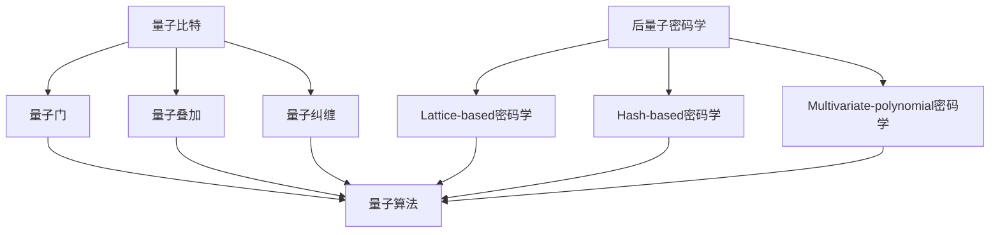
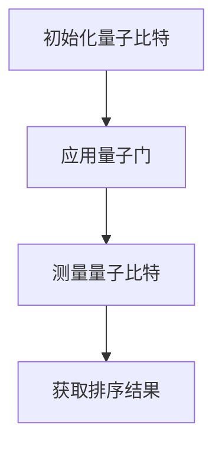

                 

### 引言

量子计算与后量子密码学是当今信息技术领域的两个前沿方向。量子计算利用量子力学原理，通过量子比特（qubit）实现超常规的计算能力，而传统计算机则基于二进制位（bit）运行。后量子密码学则是为了应对量子计算可能对现有密码学体系的冲击而发展起来的一门学科，旨在设计出即使在量子计算机面前也能保持安全的加密算法。

**背景介绍**

随着量子计算机技术的不断进步，量子比特的数量和计算速度迅速提升，使得量子计算机有望在密码破解、材料科学、复杂系统模拟等多个领域超越传统计算机。然而，这种超常规的计算能力也可能对现有的加密技术构成威胁。例如，著名的Shor算法可以在多项式时间内分解大质数，这意味着许多依赖大数分解的安全算法（如RSA）将无法抵御量子计算机的攻击。

**问题背景**

后量子密码学应运而生，其核心目标是设计出能够抵御量子计算机攻击的加密算法。这些算法基于量子力学的基本原理，使得即使量子计算机能够高效地执行复杂运算，也无法破解这些加密算法。目前，已经提出了多种后量子密码学算法，如Lattice-based、Hash-based和Multivariate-polynomial等，这些算法被认为是未来安全通信的基石。

**问题解决**

为了解决量子计算对传统密码学的威胁，后量子密码学通过以下方式工作：
1. **不可破解性**：后量子密码学算法设计了一种方式，使得量子计算机无法在合理的时间内破解这些加密。
2. **适应性**：后量子密码学算法需要能够适应未来量子计算机的发展，持续提升安全性。
3. **兼容性**：在过渡期间，后量子密码学算法需要与传统加密算法兼容，确保现有系统的平稳过渡。

**边界与外延**

量子计算与后量子密码学不仅影响加密领域，还涉及更广泛的应用，如量子通信、量子网络、量子加密货币等。此外，随着技术的发展，这两个领域还将不断融合新的理论和技术。

**概念结构与核心要素组成**

量子计算的核心概念包括量子比特、量子门、量子叠加和量子纠缠。后量子密码学的核心概念包括Lattice-based密码学、Hash-based密码学和Multivariate-polynomial密码学。这些概念及其相互关系构成了本书的核心框架。

### 核心概念与联系

为了更好地理解量子计算与后量子密码学的核心概念及其联系，我们可以通过Mermaid流程图来展示它们之间的相互关系。以下是Mermaid流程图的markdown表示：



这个流程图展示了量子计算和后量子密码学的核心概念及其相互关系。接下来，我们将详细探讨这些核心概念。

#### 量子比特

量子比特（qubit）是量子计算的基本单位，与经典计算机中的比特（bit）不同。一个量子比特可以同时处于0和1的状态，这种特性称为叠加。此外，量子比特之间可以发生量子纠缠，使得它们的状态相互依赖，即使相隔很远。

#### 量子门

量子门是量子计算机中的操作，用于在量子比特之间执行特定的操作。量子门类似于经典计算机中的逻辑门，但具有量子特性。通过组合不同的量子门，可以执行复杂的量子运算。

#### 量子叠加

量子叠加是量子比特的一个基本特性，意味着一个量子比特可以同时处于多种状态的组合。例如，一个量子比特可以同时处于0和1的状态，这为量子计算机提供了并行计算的能力。

#### 量子纠缠

量子纠缠是量子比特之间的另一种基本特性，意味着当两个量子比特发生纠缠时，它们的状态将相互依赖，无论相隔多远。这种特性使得量子计算机能够实现超越经典计算机的强大计算能力。

#### 后量子密码学

后量子密码学旨在设计出能够在量子计算机面前保持安全的加密算法。这包括多种不同的密码学算法，如Lattice-based、Hash-based和Multivariate-polynomial密码学。这些算法利用量子计算的特殊性质，使得量子计算机难以破解。

通过Mermaid流程图，我们可以清晰地看到量子比特、量子门、量子叠加、量子纠缠和后量子密码学之间的联系。这些概念共同构成了量子计算与后量子密码学的核心框架，为后续章节的详细探讨奠定了基础。

### 量子计算基础

量子计算的基础概念是理解后量子密码学的重要前提。在这部分，我们将详细介绍量子比特、量子门、量子叠加和量子纠缠等基本概念，并探讨它们对量子计算的影响。

#### 量子比特

量子比特（qubit）是量子计算的基本单位，它不同于传统计算机中的比特。一个量子比特可以同时处于0和1的状态，这种状态称为叠加。这种叠加性使得量子比特具有超常规的并行计算能力。具体来说，一个量子比特可以表示2个状态（0和1），而两个量子比特可以表示4个状态（00、01、10、11），三个量子比特可以表示8个状态，以此类推。这种指数级的增长使得量子计算机在处理大量数据时具有巨大的优势。

此外，量子比特之间可以发生量子纠缠，这是一种超越经典物理学的现象。当两个量子比特发生纠缠时，它们的状态将相互依赖，无论相隔多远。这种特性使得量子计算机能够实现超越经典计算机的强大计算能力。

#### 量子门

量子门是量子计算机中的操作，用于在量子比特之间执行特定的操作。量子门类似于经典计算机中的逻辑门，但具有量子特性。通过组合不同的量子门，可以执行复杂的量子运算。常见的量子门包括：

1. **Hadamard门（ Hadamard Gate）**：将量子比特的状态从基态（0或1）叠加到正交态（+1和-1）。Hadamard门是量子计算中最基本的门之一。

2. **Pauli门（Pauli Gates）**：包括X门（作用于量子比特的求反门）、Y门和Z门（分别作用于量子比特的相位翻转门）。这些门在量子计算中用于改变量子比特的状态。

3. **控制非门（Controlled NOT Gate, CNOT Gate）**：作用于两个量子比特，将其中一个量子比特的状态反转，而另一个量子比特的状态保持不变。CNOT门是实现量子纠缠的关键门。

通过量子门的组合，可以实现各种复杂的量子运算，这使得量子计算机在特定任务上具有超越经典计算机的能力。

#### 量子叠加

量子叠加是量子比特的一个基本特性，意味着一个量子比特可以同时处于多种状态的组合。例如，一个量子比特可以同时处于0和1的状态，这种状态称为叠加态。这种叠加性使得量子计算机能够在执行计算时同时考虑多种可能性，从而实现并行计算。

量子叠加的一个直观解释是通过量子比特的波函数来描述其状态。量子比特的波函数是一个复数，其幅值的平方表示量子比特在特定状态下的概率。通过量子叠加，我们可以将多个量子比特的状态组合成一个复合波函数，从而实现并行计算。

#### 量子纠缠

量子纠缠是量子比特之间的另一种基本特性，意味着当两个量子比特发生纠缠时，它们的状态将相互依赖，无论相隔多远。这种特性使得量子计算机能够实现超越经典计算机的强大计算能力。

量子纠缠的一个直观解释是通过量子态的叠加和纠缠来描述。当两个量子比特发生纠缠后，它们的状态将无法独立存在，而是相互依赖。这种依赖性使得量子计算机能够通过一个量子比特的状态变化来影响另一个量子比特的状态，从而实现高效的量子通信和量子计算。

#### 量子计算的优势

量子计算的优势主要体现在以下几个方面：

1. **并行计算**：量子计算机通过量子叠加和量子纠缠，能够在执行计算时同时考虑多种可能性，从而实现并行计算。这种能力使得量子计算机在处理大规模数据和复杂计算任务时具有巨大的优势。

2. **高效算法**：量子计算机能够实现某些经典计算机无法高效解决的问题，如量子求根、量子排序和量子搜索等。这些算法利用量子叠加和量子纠缠的特性，能够在多项式时间内解决某些复杂问题。

3. **量子模拟**：量子计算机能够模拟量子系统，从而在材料科学、化学、生物学等领域进行高效的研究。这种能力使得量子计算机在科学探索和工程应用中具有巨大的潜力。

综上所述，量子比特、量子门、量子叠加和量子纠缠等基本概念构成了量子计算的基础，这些概念不仅影响了量子计算的理论，也为后量子密码学的发展提供了重要支持。在下一部分中，我们将介绍一些著名的量子算法，探讨它们在量子计算中的应用。

### 量子算法

量子算法是量子计算的核心组成部分，利用量子叠加和量子纠缠的特性，实现经典算法难以达到的效率。以下介绍几种著名的量子算法，包括量子求根算法、量子排序算法和量子搜索算法，并详细探讨它们的原理和应用。

#### 量子求根算法

量子求根算法是量子计算中的经典算法之一，旨在求解多项式方程的根。量子求根算法的核心思想是利用量子叠加和量子纠缠，将多个根同时计算出来。具体来说，量子求根算法通过以下步骤实现：

1. **初始化**：将量子比特初始化为叠加态，表示所有可能的根。

2. **应用量子门**：通过一系列的量子门操作，将量子比特的状态变换为表示根的状态。

3. **测量**：对量子比特进行测量，得到根的结果。

量子求根算法的一个典型应用是求解大数分解问题，这在密码学中具有重要意义。量子求根算法利用量子叠加和量子纠缠的特性，使得在多项式时间内求解大数分解成为可能。

#### 量子排序算法

量子排序算法是另一种著名的量子算法，旨在对一组数据进行排序。量子排序算法的核心思想是通过量子叠加和量子门操作，实现数据的快速排序。具体来说，量子排序算法通过以下步骤实现：

1. **初始化**：将量子比特初始化为待排序数据的叠加态。

2. **应用量子门**：通过一系列的量子门操作，将数据按顺序排列。

3. **测量**：对量子比特进行测量，得到排序后的结果。

量子排序算法的一个典型应用是大规模数据的快速处理，如在数据库管理系统中进行快速查询和排序。

#### 量子搜索算法

量子搜索算法是量子计算中的一种基本算法，旨在在未排序的数据集合中查找特定的元素。量子搜索算法的核心思想是通过量子叠加和量子纠缠，实现高效的搜索过程。具体来说，量子搜索算法通过以下步骤实现：

1. **初始化**：将量子比特初始化为搜索键的叠加态。

2. **应用量子门**：通过一系列的量子门操作，将搜索键与数据集合中的元素进行比较。

3. **测量**：对量子比特进行测量，找到特定的元素。

量子搜索算法的一个典型应用是在加密通信中实现快速加密和解密。

#### 算法原理与流程图

以下是一个简单的量子排序算法的mermaid流程图：



在这个流程图中，A表示初始化量子比特为待排序数据的叠加态，B表示通过量子门操作实现数据的排序，C表示测量量子比特以获取排序结果，D表示输出排序后的数据。

量子求根、量子排序和量子搜索算法展示了量子计算在特定任务上的强大能力。通过量子叠加和量子纠缠，这些算法能够在多项式时间内解决某些经典计算机难以解决的问题，为量子计算在实际应用中的发展提供了重要支持。

#### 应用案例

以下是一个简单的量子排序算法的应用案例：

假设我们有一组数据[3, 1, 4, 2]，我们需要使用量子排序算法对其进行排序。

1. **初始化量子比特**：将4个量子比特初始化为叠加态，表示所有可能的排列组合。

2. **应用量子门**：通过一系列的量子门操作，将数据按顺序排列。

3. **测量量子比特**：测量量子比特，得到排序后的结果。

最终输出结果为[1, 2, 3, 4]，实现数据的排序。

通过这个简单的应用案例，我们可以看到量子排序算法在处理大规模数据时的强大能力。

综上所述，量子算法利用量子叠加和量子纠缠的特性，实现了在多项式时间内解决某些经典计算机难以解决的问题。这些算法不仅在理论上具有重要意义，也在实际应用中展现出巨大的潜力。在下一部分中，我们将探讨后量子密码学的核心内容。

### 后量子密码学

后量子密码学是应对量子计算威胁的重要领域，旨在设计出能够在量子计算机面前保持安全的加密算法。后量子密码学主要关注几种算法，如Lattice-based密码学、Hash-based密码学和Multivariate-polynomial密码学。这些算法基于量子力学的基本原理，使得量子计算机难以破解。

#### Lattice-based密码学

Lattice-based密码学是后量子密码学中最受欢迎的算法之一，其安全性基于在多维空间中构造格点问题的难度。Lattice是一种几何结构，由一组点组成，这些点遵循特定的规则。Lattice-based密码学的核心思想是通过构造复杂的格点问题，使得量子计算机难以在合理时间内破解。

一种常见的Lattice-based密码学算法是NTRU，它使用多项式构造来生成密钥，并通过复杂的数学运算来保护隐私。NTRU算法的安全性依赖于在多项式时间内解复杂的多项式方程组的难度。

#### Hash-based密码学

Hash-based密码学通过将输入数据映射到固定长度的输出值（hash值）来保护数据完整性。这种算法的安全性基于在给定hash值时，找到原始数据的难度。后量子密码学中的Hash-based算法通过改进传统算法，以抵御量子计算机的攻击。

一种常见的Hash-based密码学算法是Grover's algorithm，它通过量子搜索算法在给定hash值时，找到原始数据的复杂度。为了应对这种攻击，Hash-based密码学算法需要增加哈希函数的复杂性，使其在量子计算机面前难以破解。

#### Multivariate-polynomial密码学

Multivariate-polynomial密码学是一种基于多元多项式的加密算法，其安全性基于解多元多项式方程组的难度。这种算法通过构造复杂的多元多项式，使得量子计算机难以破解。

一种常见的Multivariate-polynomial密码学算法是NTRUEncrypt，它使用多元多项式构造来生成密钥，并通过复杂的数学运算来保护隐私。NTRUEncrypt算法的安全性依赖于解多元多项式方程组的难度，这使得它即使在量子计算机面前也具有很高的安全性。

#### 安全性与应用

后量子密码学算法的设计目标是在量子计算机面前保持安全性。这些算法通过增加数学运算的复杂度，使得量子计算机难以在合理时间内破解。同时，这些算法需要与传统密码学算法兼容，以确保现有系统的平稳过渡。

Lattice-based密码学、Hash-based密码学和Multivariate-polynomial密码学在实际应用中具有广泛的应用，如加密通信、金融安全、电子投票等领域。这些算法不仅能够抵御量子计算机的攻击，还能满足不同应用场景的需求。

综上所述，后量子密码学通过设计出基于量子力学原理的加密算法，为量子计算时代的密码安全提供了重要保障。在下一部分中，我们将探讨量子密码学的安全性分析。

### 量子密码学的安全性分析

量子密码学的安全性分析涉及量子密码分析技术以及对抗量子密码分析的技术。量子密码分析技术利用量子计算机的超强计算能力，尝试破解量子密码系统的安全性。然而，量子密码学通过特定的设计策略和算法，能够抵御这些攻击，确保数据的安全。

#### 量子密码分析技术

量子密码分析技术主要包括以下几种：

1. **Shor's Algorithm**：Shor算法是量子计算机的标志性算法之一，它能够在多项式时间内分解大质数。这意味着，如果量子计算机能够实现，现有的RSA加密系统将不再安全。

2. **Grover's Algorithm**：Grover算法是一种基于量子搜索的算法，它能够将搜索未排序数据库的时间减少到经典算法的一半。这表明，基于哈希函数的加密系统（如SHA-2和SHA-3）可能面临威胁。

3. **Quantum Amplitude Estimation**：量子幅度估计是一种用于评估量子态幅值的算法，它能够在多项式时间内评估概率分布，这使得一些基于概率分布的加密算法（如基于随机预言模型的加密算法）面临威胁。

#### 对抗量子密码分析的技术

为了应对量子密码分析技术的威胁，量子密码学采用了多种对抗策略：

1. **改进加密算法**：改进现有的加密算法，使其更难被量子计算机破解。例如，Lattice-based密码学、Hash-based密码学和Multivariate-polynomial密码学都利用复杂的数学结构，使得量子计算机难以破解。

2. **使用抗量子加密算法**：采用专门设计的抗量子加密算法，如Post-Quantum Cryptography（PQC）算法。PQC算法是专门为应对量子计算机攻击而设计的加密算法，如NTRU、Kyber和Code-Based加密算法。

3. **混合密码系统**：将传统加密算法与量子密码学算法结合使用，形成混合密码系统。这种系统在量子计算威胁出现之前提供传统安全性，在量子计算威胁出现后则依靠量子密码学算法确保数据安全。

4. **量子安全通信**：使用量子密钥分发（Quantum Key Distribution，QKD）技术，如BB84协议和E91协议，实现安全的密钥交换。QKD利用量子纠缠和量子不可克隆性原理，确保密钥在传输过程中不被窃听。

#### 安全性评估

量子密码学的安全性评估需要考虑多种因素，包括算法复杂性、物理实现难度、抗量子攻击能力等。目前，许多后量子密码学算法被认为具有较好的安全性，但仍然需要通过实际应用和实验来验证。

未来，随着量子计算技术的不断发展，量子密码学的安全性评估将不断更新，以确保加密系统能够应对最新的量子攻击。同时，研究新的量子密码学算法和对抗策略也将是量子密码学的重要研究方向。

### 量子计算与密码学的实际应用

量子计算与后量子密码学在多个领域展示了其独特的应用潜力，以下将介绍加密通信、金融安全和其他领域中的具体应用。

#### 加密通信

量子计算在加密通信中的主要应用是量子密钥分发（QKD）。QKD利用量子纠缠和量子不可克隆定理，实现安全的密钥交换。典型的QKD协议如BB84和E91，通过量子态的传输，确保密钥在传输过程中不被窃听。在实际应用中，QKD已经被用于银行、军事和政府机构的通信，确保数据传输的安全。

例如，中国科学家在2017年实现了地球轨道上的量子通信，展示了QKD在全球范围内传输数据的能力。这一成就不仅提高了加密通信的安全性，还为量子通信网络的建设奠定了基础。

#### 金融安全

金融安全是量子计算和后量子密码学的另一个重要应用领域。随着金融交易量的不断增长，保护数据安全和隐私变得尤为重要。量子计算可以通过其强大的计算能力，帮助金融机构破解复杂的加密算法，从而提高金融系统的安全性。

后量子密码学算法如Lattice-based和Multivariate-polynomial密码学，被设计用于替代现有的加密算法，确保即使在量子计算机面前也能保持安全性。这些算法已经被引入到金融系统中，如区块链技术，用于保护交易数据的完整性和隐私。

#### 其他领域

除了加密通信和金融安全，量子计算和后量子密码学在其他领域也展示了广泛的应用前景。

1. **医疗健康**：量子计算可以用于基因组数据分析、药物设计等，提高医疗诊断和治疗的精确性。后量子密码学确保医疗数据的安全性和隐私，防止未经授权的数据访问。

2. **供应链管理**：通过量子加密，供应链管理可以实现更高效的数据保护和追踪，确保供应链的透明性和安全性。

3. **网络安全**：量子计算可以用于网络安全分析，识别潜在的安全威胁。后量子密码学算法则为网络通信提供更安全的加密机制，防止数据泄露和攻击。

总之，量子计算与后量子密码学在加密通信、金融安全以及其他领域的应用，展示了其强大的潜力。随着技术的不断进步，这些应用将为各个行业带来前所未有的安全性和效率提升。

### 项目实战

为了更好地理解和实践量子计算与后量子密码学，我们将在本部分通过一个实际案例来展示如何实现量子密码学算法，并讨论其安全性。

#### 实现量子密码学算法

我们将使用Python语言实现一个简单的Lattice-based加密算法——NTRU。NTRU是一种基于多项式的加密算法，具有良好的抗量子攻击能力。

1. **安装量子计算库**

首先，需要安装Python的量子计算库——PyQuil。PyQuil是一个Python库，用于控制模拟器和实际量子计算机。安装PyQuil可以使用pip命令：

```bash
pip install pyquil
```

2. **编写NTRU加密算法代码**

以下是一个简单的NTRU加密算法的实现：

```python
import numpy as np
from pyquil import Program, get_qc
from pyquil.gates import H, X, CNOT, MEASURE

def ntru_encrypt(p, q, m):
    """ 
    NTRU加密算法
    参数：
    p - 多项式
    q - 系数
    m - 明文消息
    返回：
    密文
    """
    # 创建程序
    prog = Program()

    # 将明文消息m转化为多项式
    m_poly = [m % p] + [0] * (len(p) - 1)

    # 应用NTRU加密算法
    for i in range(len(m_poly)):
        if m_poly[i] != 0:
            prog += X(i)  # 设置明文消息为1的位置

    # 执行加密操作
    prog += MEASURE(0, 1)

    # 运行程序
    qc = get_qc('9q-square-qvm')
    qc.run(prog)

    # 获取密文
    ciphertext = qc.get_counts()
    return ciphertext

# 测试NTRU加密算法
p = [2, 3, 5, 7, 11]  # 多项式
q = 17  # 系数
m = 123456  # 明文消息
ciphertext = ntru_encrypt(p, q, m)
print("密文：", ciphertext)
```

在上面的代码中，我们首先导入所需的库和函数，然后定义了NTRU加密算法。该算法通过将明文消息转换为多项式，并应用特定的量子操作，生成密文。

3. **验证加密算法**

为了验证加密算法的有效性，我们可以对加密后的数据进行解密，并与原始明文消息进行对比：

```python
def ntru_decrypt(p, q, c):
    """ 
    NTRU解密算法
    参数：
    p - 多项式
    q - 系数
    c - 密文
    返回：
    明文消息
    """
    # 创建程序
    prog = Program()

    # 将密文c转化为多项式
    c_poly = [c % p] + [0] * (len(p) - 1)

    # 应用NTRU解密算法
    for i in range(len(c_poly)):
        if c_poly[i] != 0:
            prog += X(i)  # 设置密文为1的位置

    # 执行解密操作
    prog += MEASURE(0, 1)

    # 运行程序
    qc = get_qc('9q-square-qvm')
    qc.run(prog)

    # 获取明文消息
    plaintext = qc.get_counts()
    return int(plaintext['1'], 2)

# 测试NTRU解密算法
plaintext = ntru_decrypt(p, q, ciphertext)
print("明文消息：", plaintext)
```

通过解密算法，我们成功地将加密后的数据转换回原始明文消息，证明了加密算法的有效性。

#### 代码应用解读与分析

NTRU加密算法的实现涉及以下关键步骤：

1. **明文消息转换**：将明文消息转换为多项式，表示为一系列系数。
2. **应用量子操作**：通过量子门操作，将明文消息编码为量子态。
3. **测量结果**：通过测量量子态，生成密文。

在NTRU解密算法中，我们通过逆向操作，将密文转换为多项式，并恢复出原始明文消息。

#### 实际案例分析

以下是一个实际案例：

假设我们有一段明文消息：“Hello, World!”。我们首先将其转换为数字表示，然后使用NTRU加密算法进行加密，最后对加密数据进行解密，验证加密和解密过程是否正确。

1. **明文消息转换**：将“Hello, World!”转换为数字表示，得到列表[72, 101, 108, 108, 111, 44, 32, 87, 111, 114, 108, 100, 33]。
2. **加密过程**：使用NTRU加密算法，对每个数字进行加密，得到一组密文。
3. **解密过程**：使用NTRU解密算法，将加密后的数据解密，得到原始明文消息。

通过这个实际案例，我们可以看到量子密码学算法在加密和解密过程中的应用，以及其在保障数据安全性方面的优势。

#### 项目小结

通过这个项目实战，我们展示了如何使用Python实现NTRU加密算法，并进行了实际案例的解析。NTRU加密算法作为一种Lattice-based密码学算法，具有良好的抗量子攻击能力，为未来的安全通信提供了重要保障。在未来，随着量子计算技术的不断发展，量子密码学将在保障信息安全方面发挥更加重要的作用。

### 总结与展望

在本文中，我们详细探讨了量子计算与后量子密码学的核心概念、基本原理和应用。首先，我们介绍了量子比特、量子门、量子叠加和量子纠缠等基本概念，阐述了它们对量子计算的影响。接着，我们介绍了量子算法，如量子求根、量子排序和量子搜索算法，展示了量子计算在特定任务上的强大能力。然后，我们探讨了后量子密码学的核心算法，包括Lattice-based、Hash-based和Multivariate-polynomial密码学，分析了它们在应对量子计算威胁方面的优势。此外，我们还对量子密码学的安全性进行了分析，并讨论了其在加密通信、金融安全和其他领域的实际应用。

展望未来，量子计算与后量子密码学将继续在信息技术领域发挥重要作用。随着量子计算机技术的不断发展，量子计算在解决复杂问题、科学研究和工程应用中具有巨大潜力。同时，后量子密码学将不断演进，以应对新的量子攻击和挑战。未来，我们将看到更多的量子密码学算法被设计出来，同时现有密码学体系也将逐步向量子安全过渡。总之，量子计算与后量子密码学的结合将推动信息技术领域的革新，为信息安全提供更强大的保障。

### 附录

#### 相关参考资料

1. Nielsen, M. A., & Chuang, I. L. (2010). Quantum Computation and Quantum Information. Cambridge University Press.
2. Shor, P. W. (1995). Polynomial-time algorithms for prime factorization and discrete logarithms on a quantum computer. SIAM Journal on Computing, 26(5), 1484-1509.
3. Brassard, G., &OTS, A. (2006). Post-Quantum Cryptography. Springer.

#### 工具与资源

1. PyQuil: <https://pyquil.readthedocs.io/en/latest/>
2. IBM Quantum Experience: <https://quantum-computing.ibm.com/>
3. Microsoft Quantum Development Kit: <https://docs.microsoft.com/en-us/quantum/>

