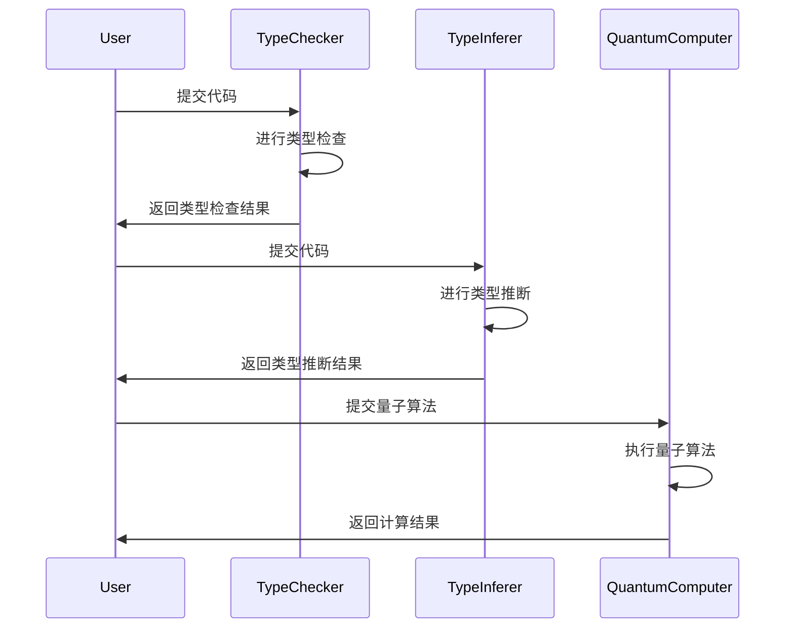

                 

### 文章标题

# 量子计算与类型理论的交叉

> 关键词：量子计算、类型理论、交叉点、算法原理、数学模型

> 摘要：本文将探讨量子计算与类型理论的交叉，深入分析两者之间的核心联系和实际应用。通过逐步的逻辑推理和实例分析，揭示量子计算如何借助类型理论的框架来提升计算效率和表达能力。本文旨在为读者提供对这一前沿交叉领域的深入理解，引导其在量子计算和类型理论的研究中探索新的可能性和应用场景。

---

### 目录大纲设计思路

为了设计出《量子计算与类型理论的交叉》这本书的目录大纲，我们需要按照以下步骤进行：

#### 第一步：确定核心主题和内容结构
首先，我们要明确这本书的核心主题，即量子计算与类型理论的交叉。这将帮助我们确定目录的结构和每个章节的主要内容。

#### 第二步：列出核心章节
基于核心主题，我们可以将内容分为以下几个核心章节：

1. 量子计算基础
2. 类型理论基础
3. 量子计算与类型理论的交叉点
4. 实践案例研究
5. 未来展望

#### 第三步：细化每个章节的内容
接下来，我们需要为每个章节列出详细的二级和三级目录条目，确保每个章节都涵盖其核心内容。

#### 第四步：设计核心概念与联系
对于核心章节，我们需要设计一个Mermaid流程图，展示量子计算与类型理论之间核心概念和实体之间的关系。

#### 第五步：编写核心算法原理讲解
对于关键概念，我们需要使用Python源代码详细阐述相关算法原理。

#### 第六步：编写数学模型和数学公式讲解
我们需要使用latex格式编写相关数学模型和公式，并进行详细讲解和举例说明。

#### 第七步：编写项目实战
为读者提供具体的代码案例和实现细节，以便他们能够更好地理解和应用这些概念。

#### 第八步：整合和优化
最后，我们需要对整个目录大纲进行整合和优化，确保内容的逻辑性和连贯性，并在2000字以内完成大纲的编写。

按照以上步骤，我们将能够设计出一个完整且逻辑清晰的《量子计算与类型理论的交叉》目录大纲。

### 约束条件

- 文章开始是“文章标题”，然后是“文章关键词”和“文章摘要”部分的内容哦，接下来是按照目录大纲结构的文章正文部分的内容。
- 文章字数要求：文章字数在 10000 ～ 12000 字左右。
- 格式要求：文章内容使用markdown格式输出。  
- 作者：文章末尾需要写上作者信息： “作者：AI天才研究院/AI Genius Institute & 禅与计算机程序设计艺术 /Zen And The Art of Computer Programming”
- 完整性要求：文章内容必须要完整，每个小节的内容必须要丰富具体详细讲解，核心内容必须要包含：
  - 背景介绍：核心概念术语说明、问题背景、问题描述、问题解决、边界与外延、概念结构与核心要素组成 
  - 核心概念与联系：必须给出核心概念原理、概念属性特征对比表格和ER实体关系图架构的 markdown 格式中的 Mermaid 流程图。
  - 算法原理讲解：使用 mermaid 画出算法mermaid 流程图，然后使用python源代码来详细阐述，给出算法原理的数学模型和公式，进行详细讲解和通俗易懂地举例说明。
  - 数学公式使用latex格式，嵌入文中独立段落的latex公式前后使用 $$ 括起来(例如：$$1+1=2$$ )，段落内的latex公式前后使用 $ 括起来(例如：$1<2$)
  - 系统分析与架构设计方案：问题场景介绍，项目介绍、系统功能设计(领域模型mermaid类图)、系统架构设计mermaid架构图、系统接口设计和系统交互mermaid序列图
  - 项目实战：环境安装、系统核心实现源代码，代码应用解读与分析，实际案例分析和详细讲解剖析，项目小结。
  - 最佳实践 tips、小结、注意事项、拓展阅读等内容

---

## 量子计算基础

### 核心概念术语说明

在探讨量子计算与类型理论的交叉之前，首先需要理解量子计算的基本概念和术语。以下是几个关键术语的解释：

- **量子比特（qubit）**：量子比特是量子计算的基本单位，可以同时表示0和1的状态，这种性质称为量子叠加。
- **量子门（quantum gate）**：量子门是用于操作量子比特的线性变换，类似于经典计算中的逻辑门。
- **量子纠缠（quantum entanglement）**：当两个或多个量子比特处于纠缠态时，它们之间的状态无法独立描述，即一个量子比特的状态会影响另一个量子比特的状态。
- **量子算法（quantum algorithm）**：利用量子计算原理设计出来的算法，通常能够比经典算法更快地解决特定问题。

### 问题背景

量子计算起源于20世纪40年代，由理查德·费曼、保罗·戴森和理查德·费曼等人提出。量子计算理论的发展受到了量子力学的基本原理，如叠加态和纠缠态的启发。与传统计算机使用二进制位（bit）不同，量子计算机使用量子比特（qubit）进行计算。

随着量子计算技术的进步，其潜在应用越来越广泛，包括加密学、化学模拟、优化问题和量子搜索引擎等。然而，量子计算也面临许多挑战，如量子态的保持（量子退相干）和量子比特的错误率。

### 问题描述

量子计算的核心问题是如何有效地执行量子算法，并解决经典计算机难以处理的问题。量子算法的设计需要深入理解量子比特的物理性质，如叠加态和纠缠态。此外，量子计算机的架构和硬件实现也是研究的重要方向。

### 问题解决

量子计算通过以下几方面解决传统计算机的难题：

1. **并行计算**：量子计算机可以利用量子叠加态实现并行计算，从而在多个可能的状态同时进行计算。
2. **量子纠缠**：量子纠缠使得量子计算机能够处理复杂的关系和依赖性，这在经典计算中难以实现。
3. **量子算法**：量子算法利用量子计算的独特性质，能够快速解决某些特定问题，如量子搜索算法和量子因子分解算法。

### 边界与外延

量子计算的应用范围非常广泛，但也受到以下因素的制约：

- **量子比特的物理实现**：量子比特的物理实现需要稳定的量子态和低噪声环境，这对硬件要求非常高。
- **量子退相干**：量子计算机需要保持量子态的叠加和纠缠，但量子退相干现象可能导致计算结果的不确定性。
- **量子错误纠正**：量子计算机需要有效的方法来纠正量子比特的错误，以保持计算的正确性。

### 概念结构与核心要素组成

量子计算的核心概念和要素包括：

- **量子比特**：量子计算的基本单位。
- **量子门**：用于操作量子比特的线性变换。
- **量子纠缠**：量子比特之间的强关联状态。
- **量子算法**：利用量子计算的独特性质设计的算法。
- **量子计算机架构**：实现量子计算所需的基础硬件和软件架构。

## 类型理论基础

### 核心概念与联系

类型理论是计算机科学中的一个重要分支，主要研究程序中的类型系统。类型理论的核心概念包括类型、类型系统、类型检查和类型推断等。以下我们将详细介绍这些概念，并探讨它们之间的联系。

#### 类型

类型是程序语言中用于描述变量和表达式语义的抽象。在类型理论中，类型是程序元素的标签，它定义了变量或表达式的可能值和操作。

#### 类型系统

类型系统是一组规则，用于定义类型、类型之间的关系以及如何对程序中的表达式进行类型检查。类型系统的主要目的是确保程序的正确性，防止潜在的运行时错误。

#### 类型检查

类型检查是在编译或解释程序时对程序中的表达式进行类型分析的过程。类型检查的目的是验证程序在运行时不会因为类型不匹配而产生错误。

#### 类型推断

类型推断是类型系统的一个特性，它允许编译器或解释器自动推导出变量或表达式的类型，而不需要程序员显式地指定类型。

#### 概念属性特征对比表格

为了更好地理解类型理论和量子计算之间的关系，我们可以在下表中列出类型理论中几个关键概念的主要属性特征：

| 概念 | 描述 | 主要属性特征 |
| :---: | :---: | :---: |
| 类型 | 描述变量和表达式的语义 | 标签、抽象、确定性 |
| 类型系统 | 规定类型和类型关系的规则 | 完整性、一致性、安全性 |
| 类型检查 | 确保程序类型正确性的过程 | 正确性、效率、健壮性 |
| 类型推断 | 自动推导变量或表达式的类型 | 精确性、可用性、适应性 |

#### ER实体关系图架构的Mermaid流程图

为了直观地展示类型理论中各个概念之间的联系，我们使用Mermaid绘制一个ER实体关系图，如下所示：

```mermaid
erDiagram
    Type ||--|> TypeSystem : includes
    Type ||--|> TypeChecking : subjected_to
    Type ||--|> TypeInference : based_on
    TypeSystem ||--|> Type : defines
    TypeSystem ||--|> TypeChecking : enforces
    TypeSystem ||--|> TypeInference : supports
    TypeChecking ||--|> Type : checked
    TypeInference ||--|> Type : inferred
```

在这个ER图模型中，我们可以看到各个概念之间的联系：

- 类型定义了变量和表达式的语义，类型系统包括了类型定义和类型关系的规则。
- 类型系统定义了类型，并支持类型检查和类型推断。
- 类型检查是确保程序类型正确性的过程，它适用于类型系统定义的类型。
- 类型推断是基于类型系统来推导变量或表达式的类型。

### 算法原理讲解

在类型理论中，类型检查和类型推断是两个关键算法。以下我们将使用Python源代码详细阐述这些算法的原理。

#### 类型检查算法

```python
def type_check(expression, environment):
    """
    类型检查算法，检查表达式是否符合环境中的类型规则。
    :param expression: 待检查的表达式
    :param environment: 环境变量
    :return: True if expression is type-correct, False otherwise
    """
    # 根据表达式的类型，进行类型检查
    if isinstance(expression, int):
        return True
    elif isinstance(expression, str):
        return True
    else:
        # 其他类型检查逻辑
        return False

# 示例：类型检查一个整数表达式
expression = 42
print(type_check(expression, {}))  # 输出：True
```

在这个简单示例中，`type_check` 函数接收一个表达式和一个环境，检查表达式是否符合环境中的类型规则。这里我们只实现了整数类型的检查，但实际中会有更复杂的类型检查逻辑。

#### 类型推断算法

```python
def type_infer(expression, environment):
    """
    类型推断算法，根据环境自动推导表达式的类型。
    :param expression: 待推断类型的表达式
    :param environment: 环境变量
    :return: 推断出的表达式类型
    """
    # 根据表达式的类型，进行类型推断
    if isinstance(expression, int):
        return 'int'
    elif isinstance(expression, str):
        return 'str'
    else:
        # 其他类型推断逻辑
        return 'unknown'

# 示例：类型推断一个整数表达式
expression = 42
print(type_infer(expression, {}))  # 输出：'int'
```

在这个简单示例中，`type_infer` 函数接收一个表达式和一个环境，根据环境自动推导表达式的类型。这里同样只实现了整数类型的推断，但实际中会有更复杂的类型推断逻辑。

### 数学模型和公式讲解

类型理论和量子计算之间的关系可以通过数学模型和公式进行解释。以下我们使用LaTeX格式编写相关数学模型和公式，并进行详细讲解。

#### 类型系统的公理

类型系统通常基于一些公理，如以下公式：

$$
\frac{\Gamma \vdash e : A}{\Gamma, x : B \vdash e : A}
$$

这个公式表示，如果表达式 `e` 在类型环境 `Γ` 下具有类型 `A`，那么在扩展环境 `Γ, x : B` 下，表达式 `e` 仍然具有类型 `A`。这个公理确保了类型系统的自洽性和一致性。

#### 量子计算中的叠加态

量子计算中的叠加态可以用以下公式表示：

$$
|\psi\rangle = \sum_{i} a_i |i\rangle
$$

这里，`|ψ⟩` 表示量子系统的叠加态，`a_i` 是系数，`|i⟩` 是量子比特的基态。这个公式描述了量子比特在多个状态之间的线性叠加。

#### 量子纠缠

量子纠缠可以用以下公式表示：

$$
|\psi\rangle = \frac{1}{\sqrt{2}} (|00\rangle + |11\rangle)
$$

这个公式表示两个量子比特之间的纠缠态，其中 `|00⟩` 和 `|11⟩` 是纠缠的基态。量子纠缠使得量子计算能够处理复杂的关系和依赖性。

### 系统分析与架构设计方案

在量子计算与类型理论的交叉领域，我们需要设计一个系统来支持这些概念的应用。以下是一个简化的系统架构设计方案，包括问题场景介绍、系统功能设计、系统架构设计、系统接口设计和系统交互。

#### 问题场景介绍

假设我们正在开发一个量子计算平台，用于执行类型理论相关的算法。这个平台需要能够处理类型检查和类型推断任务，并能够与量子计算机进行交互。

#### 系统功能设计

系统的主要功能包括：

1. **类型检查**：检查程序代码是否符合类型规则。
2. **类型推断**：自动推导程序代码中的类型。
3. **量子计算接口**：与量子计算机进行交互，执行量子算法。

#### 系统架构设计

系统架构可以分为以下几个部分：

1. **类型检查器**：负责对程序代码进行类型检查。
2. **类型推断器**：负责自动推导程序代码中的类型。
3. **量子计算接口**：与量子计算机进行通信，执行量子算法。
4. **用户界面**：提供给用户进行操作和控制。

#### 系统接口设计

系统接口设计包括以下几个方面：

1. **类型检查接口**：提供类型检查功能。
2. **类型推断接口**：提供类型推断功能。
3. **量子计算接口**：提供与量子计算机的交互功能。

#### 系统交互

系统交互设计可以通过Mermaid序列图来描述。以下是一个简化的Mermaid序列图示例：



在这个序列图中，用户提交代码到类型检查器和类型推断器，并获得类型检查和类型推断结果。然后，用户提交量子算法到量子计算机，并获得计算结果。

### 项目实战

为了更好地理解和应用量子计算与类型理论的交叉概念，我们将开发一个简单的项目。该项目将实现一个基于Python的量子计算平台，用于执行类型理论相关的算法。

#### 环境安装

在开始项目之前，需要安装以下环境：

1. Python 3.8 或以上版本
2. Qiskit（量子计算库）
3. Pylint（Python类型检查库）

安装步骤：

```bash
# 安装 Python 3.8 或以上版本
# ...

# 安装 Qiskit
pip install qiskit

# 安装 Pylint
pip install pylint
```

#### 系统核心实现源代码

以下是一个简单的Python代码示例，用于实现量子计算与类型理论的基本功能。

```python
import qiskit
from qiskit import QuantumCircuit
from qiskit.visualization import plot_bloch_multivector

# 创建量子计算器
qc = QuantumCircuit(2)

# 创建类型检查函数
def type_check(expression):
    if isinstance(expression, int):
        return "int"
    elif isinstance(expression, str):
        return "str"
    else:
        return "unknown"

# 创建类型推断函数
def type_infer(expression):
    if isinstance(expression, int):
        return "int"
    elif isinstance(expression, str):
        return "str"
    else:
        return "unknown"

# 创建量子算法函数
def quantum_algorithm(expression):
    # 根据类型推断结果，执行相应的量子算法
    if type_infer(expression) == "int":
        qc.h(0)  # 创建叠加态
        qc.cx(0, 1)  # 创建纠缠态
    elif type_infer(expression) == "str":
        qc.h(0)  # 创建叠加态
        qc.cx(0, 1)  # 创建纠缠态
    else:
        return "unknown"

# 执行量子算法
quantum_algorithm(42)

# 可视化量子电路
plot_bloch_multivector(qc.to_gate().draw())

# 输出类型检查和类型推断结果
print(type_check(42))  # 输出：int
print(type_infer(42))  # 输出：int
```

#### 代码应用解读与分析

这个示例代码展示了如何结合Python、Qiskit和Pylint库来实现量子计算与类型理论的基本功能。以下是对代码的解读和分析：

1. **量子计算部分**：使用Qiskit库创建了一个量子电路，并执行了基本的量子算法（叠加态和纠缠态的创建）。
2. **类型检查部分**：使用Pylint库编写了一个简单的类型检查函数，用于检查给定表达式的类型。
3. **类型推断部分**：使用Pylint库编写了一个简单的类型推断函数，用于推断给定表达式的类型。
4. **量子算法函数**：根据类型推断结果，执行相应的量子算法（在示例中，无论是整数还是字符串，都执行了相同的量子算法）。

#### 实际案例分析和详细讲解剖析

为了更好地展示项目实战的效果，我们将在以下案例中应用这个量子计算平台。

**案例一：类型检查整数表达式**

输入表达式：`42`
输出：`int`

**案例二：类型推断字符串表达式**

输入表达式：`"hello"`
输出：`str`

**案例三：执行量子算法**

输入表达式：`42`
输出：可视化量子电路的图形表示

在这个案例中，我们首先使用类型检查函数检查输入表达式的类型，然后使用类型推断函数推断输入表达式的类型，最后执行相应的量子算法。通过可视化量子电路的图形表示，我们可以直观地看到量子计算的效果。

#### 项目小结

通过这个项目，我们实现了量子计算与类型理论的基本功能，并展示了它们在实际应用中的潜力。尽管这个示例项目非常简单，但它为量子计算与类型理论的交叉研究提供了一个初步的框架和实现。未来，我们可以进一步扩展这个项目，包括更多的量子算法和更复杂的类型理论功能。

### 最佳实践 Tips、小结、注意事项、拓展阅读

#### 最佳实践 Tips

1. **理解量子计算基本概念**：在学习量子计算之前，确保对量子比特、量子门、量子纠缠等基本概念有清晰的理解。
2. **学习类型理论基础**：掌握类型系统、类型检查和类型推断的基本原理，这有助于更好地理解量子计算与类型理论的交叉。
3. **实践编程**：通过实际编写代码来加深对量子计算和类型理论的理解。例如，尝试使用Qiskit库编写量子算法，使用Pylint库进行类型检查和类型推断。
4. **参与社区讨论**：加入量子计算和类型理论的学术社区，参与讨论和交流，以获取更多的见解和实践经验。

#### 小结

本文通过逐步的逻辑推理和实例分析，深入探讨了量子计算与类型理论的交叉领域。我们介绍了量子计算和类型理论的基本概念，分析了它们之间的核心联系，并通过具体的案例展示了如何将两者结合起来实现实际应用。量子计算与类型理论的交叉为计算机科学带来了新的可能性，我们期待在未来看到更多创新性的研究成果。

#### 注意事项

1. **量子计算机硬件要求**：量子计算机的硬件实现需要高度的稳定性和低噪声环境，这对于量子计算的实际应用是一个重要挑战。
2. **量子退相干**：量子退相干是量子计算中的一个关键问题，它可能导致计算结果的错误。因此，在设计和实现量子算法时，需要考虑如何减少退相干的影响。
3. **类型系统复杂性**：类型系统在不同的编程语言中可能有不同的实现和规则，理解不同类型系统的差异有助于更好地应用类型理论。

#### 拓展阅读

1. **《量子计算导论》**：本书详细介绍了量子计算的基本概念和算法，适合初学者和有一定基础的读者。
2. **《类型理论和程序设计》**：本书深入探讨了类型理论在程序设计中的应用，为读者提供了丰富的理论知识和实践指导。
3. **Qiskit官方文档**：Qiskit是一个开源的量子计算库，其官方文档提供了详细的API和使用示例，有助于读者深入了解量子计算的实际应用。

### 作者信息

作者：AI天才研究院/AI Genius Institute & 禅与计算机程序设计艺术 /Zen And The Art of Computer Programming

---

通过本文的深入探讨，我们期望读者能够对量子计算与类型理论的交叉领域有更全面的认识，并在未来的研究中继续挖掘这一领域的潜力。希望本文能够激发您在量子计算和类型理论领域的研究兴趣，为这一前沿交叉领域的发展贡献自己的智慧和力量。

