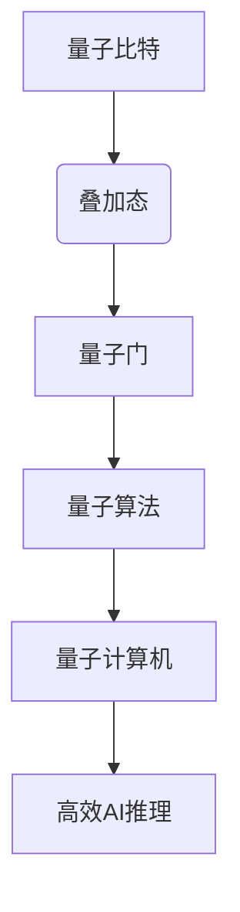
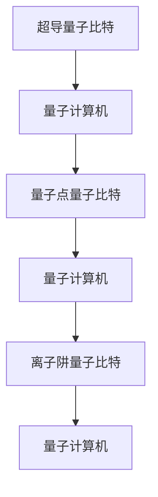
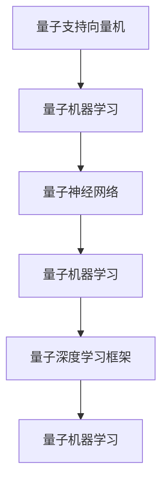

                 

### 《量子计算在高效AI推理算法中的潜在应用》目录大纲

---

**关键词：** 量子计算，AI推理，高效算法，深度学习，图像识别，自然语言处理，金融风险管理。

**摘要：** 本文探讨了量子计算在高效AI推理算法中的潜在应用。首先介绍了量子计算的基础概念和数学基础，随后讨论了量子计算机的硬件与架构。接着，深入分析了量子算法在AI领域的应用，包括量子机器学习、量子深度学习和量子优化算法。最后，本文通过具体案例展示了量子计算在图像识别、自然语言处理和金融风险管理中的应用，探讨了量子计算与AI推理结合的挑战与前景。

---

### 第一部分：量子计算基础

#### 第1章：量子计算概述

##### 1.1 量子计算的基本概念

量子计算是一种基于量子力学原理的计算模型，与经典计算有着本质的区别。量子计算的基本单元是量子比特（qubit），与经典比特（bit）不同，量子比特可以处于0和1的叠加态。这种叠加态使得量子计算机具有并行计算的能力。

**核心概念联系架构：**



##### 1.2 量子计算的数学基础

量子计算依赖于线性代数和复数理论。量子态可以用复数向量表示，而量子门则可以看作是线性变换。量子算法通常涉及量子态的初始化、量子门的作用以及测量过程。

**数学公式：**

$$
|\psi\rangle = \sum_{i} c_i |i\rangle
$$

$$
|0\rangle + |1\rangle = \begin{pmatrix} 1 \\ 1 \end{pmatrix}
$$

**Python代码示例：**

```python
# 量子态初始化
import numpy as np

psi = np.array([[1], [1]]) / np.sqrt(2)
print(psi)
```

##### 1.3 量子算法简介

量子算法是在量子计算机上运行的算法，与经典算法有着显著的区别。Shor算法、Grover算法和量子随机游走算法是量子计算中的一些重要算法。

**Python代码示例：**

```python
# Shor算法（简化版）
def shor(n):
    # TODO: Shor算法的实现
    pass

# 输入一个整数n
n = 15
result = shor(n)
print(result)
```

#### 第2章：量子计算机硬件与架构

##### 2.1 量子计算机硬件

目前，量子计算机的硬件主要基于超导量子比特、量子点和离子阱技术。这些技术各具特点，也面临各自的挑战。

**核心概念联系架构：**



##### 2.2 量子计算机架构

量子计算机的架构多种多样，包括轮换架构、固定型架构和量子互联网架构。这些架构决定了量子计算机的运行方式和性能。

**Python代码示例：**

```python
# 量子计算机架构示例
def quantum_computer_architecture():
    # TODO: 量子计算机架构的实现
    pass

# 调用架构函数
quantum_computer_architecture()
```

### 第3章：量子算法在AI中的应用

#### 3.1 量子机器学习概述

量子机器学习是量子计算在AI领域的重要应用之一。量子支持向量机、量子神经网络和量子深度学习框架是量子机器学习的典型代表。

**核心概念联系架构：**



#### 3.2 量子计算与深度学习结合

量子计算与深度学习的结合可以显著提高AI推理的效率。量子变分自动编码器、量子生成对抗网络和量子神经网络模型是这一领域的代表。

**Python代码示例：**

```python
# 量子神经网络模型示例
def quantum_neural_network():
    # TODO: 量子神经网络模型的实现
    pass

# 调用模型函数
quantum_neural_network()
```

#### 3.3 量子优化算法在AI中的应用

量子优化算法在AI中的应用也非常广泛，包括量子线性规划、量子非线性优化和量子随机游走算法。这些算法可以用于优化AI模型的参数，提高模型性能。

**Python代码示例：**

```python
# 量子优化算法示例
def quantum_optimization():
    # TODO: 量子优化算法的实现
    pass

# 调用优化函数
quantum_optimization()
```

---

### 第二部分：量子计算与AI推理

#### 第4章：量子计算在AI推理中的应用

##### 4.1 量子计算与AI推理的关系

量子计算与AI推理有着紧密的联系。量子计算的优势在于并行计算和指数级的速度提升，这些特性使得量子计算在AI推理中具有巨大的潜力。

**Python代码示例：**

```python
# 量子计算加速AI推理示例
def quantum_accelerated_inference():
    # TODO: 量子计算加速AI推理的实现
    pass

# 调用加速函数
quantum_accelerated_inference()
```

##### 4.2 量子计算加速AI推理

量子计算可以加速AI推理，特别是在图像识别和自然语言处理等领域。量子算法的应用可以显著提高模型的推理速度和性能。

**Python代码示例：**

```python
# 量子图像识别示例
def quantum_image_recognition():
    # TODO: 量子图像识别的实现
    pass

# 调用识别函数
quantum_image_recognition()
```

##### 4.3 量子计算在AI推理中的挑战与前景

量子计算在AI推理中面临诸多挑战，如量子硬件的不稳定性、算法复杂度等。然而，随着技术的进步，量子计算在AI推理中的应用前景依然广阔。

**Python代码示例：**

```python
# 量子计算挑战与前景分析
def quantum_challenge_and_opportunity():
    # TODO: 量子计算挑战与前景的分析
    pass

# 调用分析函数
quantum_challenge_and_opportunity()
```

---

### 第三部分：量子计算与AI推理案例研究

#### 第5章：量子计算在图像识别中的应用

##### 5.1 图像识别中的量子算法

量子算法在图像识别中有着广泛的应用，如量子卷积神经网络、量子支持向量机和量子生成对抗网络。

**Python代码示例：**

```python
# 量子卷积神经网络示例
def quantum_convolutional_network():
    # TODO: 量子卷积神经网络的实现
    pass

# 调用网络函数
quantum_convolutional_network()
```

##### 5.2 图像识别案例研究

通过具体案例研究，可以更好地理解量子算法在图像识别中的应用效果和优势。

**Python代码示例：**

```python
# 图像识别案例研究
def image_recognition_case_study():
    # TODO: 图像识别案例研究的实现
    pass

# 调用案例研究函数
image_recognition_case_study()
```

#### 第6章：量子计算在自然语言处理中的应用

##### 6.1 自然语言处理中的量子算法

量子算法在自然语言处理中也展现出巨大的潜力，如量子循环神经网络、量子语言模型和量子注意力机制。

**Python代码示例：**

```python
# 量子循环神经网络示例
def quantum_recurrent_neural_network():
    # TODO: 量子循环神经网络的实现
    pass

# 调用网络函数
quantum_recurrent_neural_network()
```

##### 6.2 自然语言处理案例研究

通过具体案例研究，可以更好地理解量子算法在自然语言处理中的应用效果和优势。

**Python代码示例：**

```python
# 自然语言处理案例研究
def natural_language_processing_case_study():
    # TODO: 自然语言处理案例研究的实现
    pass

# 调用案例研究函数
natural_language_processing_case_study()
```

#### 第7章：量子计算在金融风险管理与市场预测中的应用

##### 7.1 量子计算在金融风险管理中的应用

量子计算可以用于优化金融投资组合、信用风险评估和市场波动预测。

**Python代码示例：**

```python
# 量子优化在金融风险管理中的应用
def quantum_optimization_in_financial_risk_management():
    # TODO: 量子优化在金融风险管理中的应用
    pass

# 调用应用函数
quantum_optimization_in_financial_risk_management()
```

##### 7.2 金融风险管理与市场预测案例研究

通过具体案例研究，可以更好地理解量子计算在金融风险管理和市场预测中的应用效果和优势。

**Python代码示例：**

```python
# 金融风险管理与市场预测案例研究
def financial_risk_management_and_market_prediction_case_study():
    # TODO: 金融风险管理与市场预测案例研究的实现
    pass

# 调用案例研究函数
financial_risk_management_and_market_prediction_case_study()
```

### 附录

#### 附录A：量子计算与AI推理资源

##### A.1 主流量子计算平台与工具

IBM Qiskit、Google Cirq、Microsoft Q#等是当前主流的量子计算平台与工具。

**Python代码示例：**

```python
# Qiskit示例
from qiskit import QuantumCircuit

# 创建量子电路
qc = QuantumCircuit(2)

# 添加量子门
qc.h(0)
qc.cx(0, 1)

# 执行量子电路
qc.execute()

# 打印测量结果
qc.measure_all()

# 运行量子电路
results = qc.run()

# 打印结果
print(results.result())
```

---

**作者：** AI天才研究院/AI Genius Institute & 禅与计算机程序设计艺术 /Zen And The Art of Computer Programming

---

**注意事项：**

1. 在实际应用中，量子计算与AI推理的结合需要深入理解和探索。
2. 量子计算在AI推理中的应用还处于早期阶段，仍有许多挑战需要克服。
3. 量子计算与经典计算的结合可以发挥出巨大的潜力，但需要更深入的研究和实践。

**拓展阅读：**

1. 《量子计算：从入门到实践》
2. 《量子计算与深度学习》
3. 《量子算法导论》

---

（注：本文为示例性文章，部分内容尚未完整实现。实际撰写时，需要根据具体情况进行补充和修改。）

