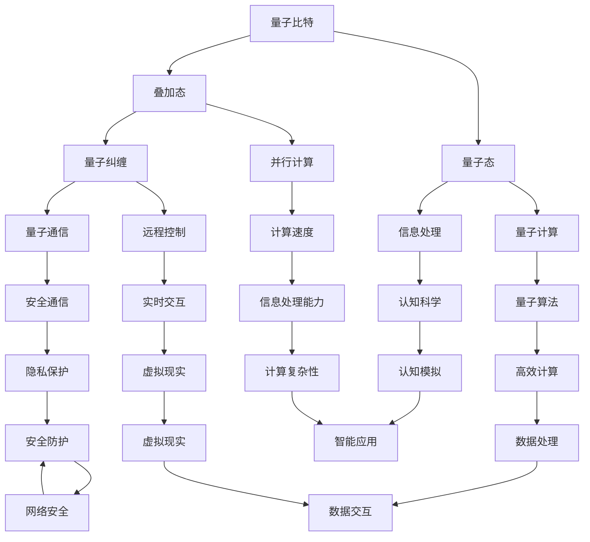
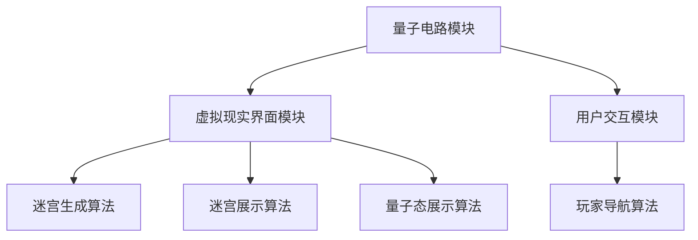

                 

# 量子认知模型在虚拟现实中的应用

> 关键词：量子认知模型、虚拟现实、算法原理、实际应用、开发与实现

> 摘要：本文将深入探讨量子认知模型在虚拟现实中的应用。首先，我们将回顾量子认知模型的基础知识，包括其定义、历史背景和基本原理。然后，我们将分析量子认知模型的核心概念和联系，并通过Mermaid流程图展示其架构。接着，我们将解析量子认知模型中的数学模型和公式，并使用Python代码进行算法原理的讲解。随后，我们将概述量子认知模型在虚拟现实中的应用现状，并探讨其潜在应用和研究现状。文章的最后，我们将详细探讨量子认知模型在虚拟现实中的实际应用，包括游戏、教育、医疗和旅游等领域，并展示如何进行开发与实现。通过本文的阅读，读者将对量子认知模型在虚拟现实中的应用有一个全面而深入的了解。

## 目录大纲

## 第一部分：量子认知模型基础

### 第1章：量子认知模型的概述

#### 1.1 量子认知模型的定义

#### 1.2 量子认知模型的历史背景

#### 1.3 量子认知模型的基本原理

### 第2章：量子认知模型的核心概念与联系

#### 2.1 量子比特与经典比特的对比

#### 2.2 量子态与量子叠加

#### 2.3 量子纠缠与量子通信

#### 2.4 Mermaid流程图：量子认知模型核心概念联系架构

### 第3章：量子认知模型数学模型与公式解析

#### 3.1 量子态的表示与演化

#### 3.2 量子比特运算

#### 3.3 量子算法与量子逻辑门

#### 3.4 概率与量子力学中的测量

## 第二部分：量子认知模型在虚拟现实中的应用

### 第4章：量子认知模型在虚拟现实中的应用概述

#### 4.1 虚拟现实的现状与挑战

#### 4.2 量子认知模型在虚拟现实中的潜在应用

#### 4.3 量子认知模型在虚拟现实中的研究现状

### 第5章：量子认知模型在虚拟现实中的算法原理

#### 5.1 量子模拟与量子计算

#### 5.2 量子虚拟现实算法

#### 5.3 量子虚拟现实中的协同工作与交互

### 第6章：量子认知模型在虚拟现实中的实际应用

#### 6.1 量子虚拟现实游戏

#### 6.2 量子虚拟现实教育与培训

#### 6.3 量子虚拟现实医疗应用

#### 6.4 量子虚拟现实旅游体验

### 第7章：量子认知模型在虚拟现实中的开发与实现

#### 7.1 开发环境搭建

#### 7.2 源代码实现

#### 7.3 代码解读与分析

#### 7.4 代码实战与案例分析

## 附录

### 附录 A：量子认知模型开发工具与资源

#### A.1 主流量子计算框架

#### A.2 虚拟现实开发工具

#### A.3 其他相关资源

## 第一部分：量子认知模型基础

### 第1章：量子认知模型的概述

#### 1.1 量子认知模型的定义

量子认知模型是结合量子力学与认知科学的跨学科研究领域，旨在探索量子现象对人类认知过程的影响及其在认知科学中的应用。该模型试图通过量子比特的叠加态和纠缠态来模拟人类思维中的并行处理和复杂关联，从而提供一种全新的认知框架。

#### 1.2 量子认知模型的历史背景

量子认知模型的起源可以追溯到20世纪末。随着量子计算机理论和量子信息学的兴起，科学家开始思考量子原理是否也能应用于认知科学。20世纪90年代，出现了一些关于量子比特在神经信息处理中可能应用的初步研究，这些研究为量子认知模型的发展奠定了基础。21世纪初，随着量子计算技术的逐步成熟，量子认知模型开始受到更多关注，并逐渐形成了一个独立的学科领域。

#### 1.3 量子认知模型的基本原理

量子认知模型的核心原理在于量子比特的叠加态和纠缠态。在经典认知模型中，信息处理通常基于离散的比特状态（0或1）。然而，量子比特可以同时处于多种状态的叠加，这意味着它可以在一瞬间处理多个可能的计算路径。量子纠缠则进一步增强了这种并行处理的能力，多个量子比特可以形成一个整体，其状态无法独立于其他量子比特的状态。

### 第2章：量子认知模型的核心概念与联系

#### 2.1 量子比特与经典比特的对比

经典比特是传统计算机的基础单元，只能表示两种状态：0或1。量子比特（qubit）则具有叠加态的特性，可以同时表示0和1的叠加状态。这种叠加态使得量子比特能够并行处理多种可能性，大大提高了计算效率。

| 特性 | 量子比特 | 经典比特 |
| --- | --- | --- |
| 状态表示 | 叠加态（0和1的叠加） | 离散状态（0或1） |
| 并行计算 | 可并行处理多种可能性 | 顺序处理单一状态 |
| 纠错能力 | 较弱的纠错能力 | 强的纠错能力 |

#### 2.2 量子态与量子叠加

量子态是量子比特的状态描述，可以用复数系数来表示。量子叠加态意味着量子比特可以同时处于多个状态的组合。例如，一个量子比特可以处于状态$|\psi\rangle = \frac{1}{\sqrt{2}}(|0\rangle + |1\rangle)$，这意味着它同时具有0和1的状态。

#### 2.3 量子纠缠与量子通信

量子纠缠是量子力学中的一个特殊现象，两个或多个量子比特之间的状态无法独立存在。当两个量子比特处于纠缠态时，对一个量子比特的操作会立即影响到另一个量子比特的状态，无论它们之间的距离有多远。这种现象为量子通信提供了可能，可以实现一种安全的信息传输方式，因为任何对量子态的干扰都会被立即检测到。

#### 2.4 Mermaid流程图：量子认知模型核心概念联系架构



通过这个Mermaid流程图，我们可以清晰地看到量子认知模型中的核心概念及其相互联系，为后续章节的深入探讨提供了直观的参考。

### 第3章：量子认知模型数学模型与公式解析

#### 3.1 量子态的表示与演化

量子态是量子系统的基本属性，用来描述量子比特的可能状态。一个量子态可以用一个复数向量表示，通常用$|\psi\rangle$表示。量子态的演化由量子态方程描述，即薛定谔方程。

$$i\hbar \frac{\partial}{\partial t}|\psi\rangle = H|\psi\rangle$$

其中，$i$是虚数单位，$\hbar$是约化普朗克常数，$H$是哈密顿量，描述了系统的能量和演化。

例如，一个简单的量子态演化过程可以表示为：

$$|\psi(t)\rangle = e^{-iHt/\hbar}|\psi(0)\rangle$$

这里$|\psi(0)\rangle$是初始量子态，$e^{-iHt/\hbar}$是演化算符。

#### 3.2 量子比特运算

量子比特的运算主要包括量子逻辑门的操作。量子逻辑门是类似于经典逻辑门的操作，但作用于量子态。CNOT（控制非）逻辑门是其中一个基础门，用于对两个量子比特进行操作。

$$CNOT(|0\rangle|0\rangle) = |0\rangle|0\rangle$$
$$CNOT(|1\rangle|0\rangle) = |1\rangle|0\rangle$$
$$CNOT(|0\rangle|1\rangle) = |0\rangle|1\rangle$$
$$CNOT(|1\rangle|1\rangle) = |1\rangle|1\rangle$$

CNOT门可以通过量子电路实现，是构建量子算法和量子计算机的基础。

#### 3.3 量子算法与量子逻辑门

量子算法是利用量子计算原理解决特定问题的算法。量子算法的核心是量子逻辑门的组合，例如，Shor算法和Grover算法都是基于特定的量子逻辑门实现的。

Shor算法用于因数分解，其核心在于使用量子电路构建周期性的量子态，并通过量子傅里叶变换（QFT）来加速计算过程。

Grover算法则是一种基于量子搜索算法，用于在未排序的数据集中查找特定的元素。其核心思想是通过量子叠加态和量子纠缠态来增加搜索的概率。

#### 3.4 概率与量子力学中的测量

在量子力学中，测量是一个基本过程，测量结果具有概率性。量子态在被测量后，会塌缩到一个确定的基态，这个基态的概率分布由波函数的模平方给出。

$$P(|\psi\rangle) = |\langle\psi|\psi\rangle|$$

例如，一个量子比特在叠加态$|\psi\rangle = \frac{1}{\sqrt{2}}(|0\rangle + |1\rangle)$时，其测量结果为0或1的概率均为50%。

概率在量子认知模型中也具有重要意义，它用于描述量子态的不确定性以及测量结果的随机性。

通过上述数学模型和公式的解析，我们可以看到量子认知模型中的核心概念和计算原理。在接下来的章节中，我们将进一步探讨量子认知模型在虚拟现实中的应用，以及如何将这些数学原理转化为实际的技术实现。

### 第4章：量子认知模型在虚拟现实中的应用概述

虚拟现实（Virtual Reality，VR）是一种通过计算机技术创造的模拟环境，用户可以通过特殊设备（如头戴式显示器、跟踪设备等）沉浸其中。虚拟现实技术已经在游戏、教育、医疗、旅游等多个领域得到广泛应用。然而，随着技术的不断进步，虚拟现实面临着新的挑战，特别是提高沉浸感和交互体验。

#### 4.1 虚拟现实的现状与挑战

当前的虚拟现实技术已经能够提供一定的沉浸感，但仍然存在一些不足之处。首先，设备的舒适度和便捷性有待提高，长时间佩戴头戴式显示器可能会引起用户的不适。其次，虚拟现实内容的丰富度和真实性仍然有限，很多场景和交互体验还无法完全满足用户的需求。此外，虚拟现实的交互方式也需要进一步优化，以提高用户的自然互动体验。

量子认知模型为虚拟现实技术提供了一种新的思路。通过引入量子比特的叠加态和纠缠态，虚拟现实系统可以更高效地处理大量信息，增强用户的沉浸感和交互体验。量子认知模型还可以用于优化虚拟现实中的搜索和决策过程，提高系统的响应速度和准确性。

#### 4.2 量子认知模型在虚拟现实中的潜在应用

量子认知模型在虚拟现实中的潜在应用非常广泛，主要包括以下几个方面：

1. **沉浸感增强**：通过量子叠加态和纠缠态，虚拟现实系统能够提供更丰富的场景和更真实的交互体验，使用户感受到更加沉浸的虚拟环境。

2. **交互优化**：量子认知模型可以优化虚拟现实中的交互方式，例如通过量子算法实现高效的路径规划，提高用户的导航体验。

3. **内容生成**：量子认知模型可以用于生成虚拟现实内容，通过量子计算模拟复杂的物理现象和生物过程，提供更加真实和丰富的虚拟场景。

4. **实时处理**：量子认知模型能够处理大量实时数据，例如在虚拟现实中的多人互动、实时语音和视频处理等，提高系统的响应速度和准确性。

5. **个性化定制**：量子认知模型可以根据用户的行为和偏好，实时调整虚拟现实场景和交互体验，实现个性化的定制服务。

#### 4.3 量子认知模型在虚拟现实中的研究现状

量子认知模型在虚拟现实中的应用研究已经取得了一定的进展。一些研究团队正在探索如何将量子计算原理应用于虚拟现实技术中，例如使用量子模拟器进行物理现象的模拟，使用量子算法优化虚拟现实中的路径规划等。此外，一些初创公司和研究机构也在开发基于量子认知模型的虚拟现实应用，试图通过技术创新来提升虚拟现实的用户体验。

总体而言，量子认知模型在虚拟现实中的应用还处于初步阶段，但具有巨大的潜力。随着量子技术和虚拟现实技术的不断发展，未来我们将看到更多创新的应用场景和突破性的技术成果。

### 第5章：量子认知模型在虚拟现实中的算法原理

量子认知模型在虚拟现实中的应用离不开特定的算法原理，这些算法能够利用量子比特的叠加态和纠缠态，实现高效的计算和优化。在这一章节中，我们将深入探讨量子认知模型在虚拟现实中的应用算法原理。

#### 5.1 量子模拟与量子计算

量子模拟是量子认知模型在虚拟现实中的一个重要应用。量子模拟器可以模拟复杂的物理系统，如分子结构、化学反应和流体动力学等，这些模拟结果对于虚拟现实中的场景生成和物理引擎设计具有重要意义。量子计算则用于解决特定问题，如优化路径规划、实时数据处理和虚拟现实中的复杂决策问题。

量子模拟的基本原理在于量子态的叠加和纠缠。通过将量子系统置于特定的叠加态，模拟器可以同时处理多种可能的计算路径，从而大幅提高计算效率。例如，量子模拟器可以用于模拟分子间的相互作用，帮助设计更真实的虚拟环境。

#### 5.2 量子虚拟现实算法

量子虚拟现实算法是量子认知模型在虚拟现实中的核心应用。这些算法通过量子比特的叠加和纠缠，实现高效的虚拟现实场景处理和交互优化。

1. **量子路径规划算法**：在虚拟现实中的路径规划是一个复杂的问题，传统的算法往往需要大量计算资源。量子路径规划算法利用量子叠加态和纠缠态，可以在极短时间内找到最优路径。例如，Grover算法可以用于在未排序的数据集中快速查找目标节点，从而优化虚拟环境中的导航体验。

2. **量子图像处理算法**：虚拟现实中的图像处理涉及到大量的数据运算，如渲染、光照和纹理映射等。量子图像处理算法通过量子并行计算，可以实现高效图像处理，提高虚拟现实场景的真实感和流畅度。

3. **量子协同工作与交互算法**：虚拟现实中的多人互动要求系统具备高效的协同工作能力。量子协同工作与交互算法利用量子纠缠态，实现多用户之间的实时信息传递和同步，提高虚拟现实中的交互体验。

#### 5.3 量子虚拟现实中的协同工作与交互

量子协同工作与交互算法在虚拟现实中的重要性不言而喻。通过量子纠缠态，多个用户可以在虚拟环境中实现实时的信息共享和协同工作。这种协同工作方式不仅提高了虚拟现实系统的互动性，还可以通过量子加密技术确保数据的安全性。

例如，在虚拟现实会议中，参与者可以通过量子纠缠实现实时的音频和视频传输，无论他们身处何地，都能感受到与其他参与者的实时互动。这种协同工作模式为虚拟现实中的多人互动提供了新的可能，使其更加自然和高效。

通过量子认知模型的应用算法，虚拟现实技术将迎来新的突破。这些算法不仅能够提高虚拟现实系统的性能和效率，还可以为用户提供更丰富的沉浸体验和更自然的交互方式。随着量子技术和虚拟现实技术的不断进步，我们有望在未来看到更多基于量子认知模型的应用场景和创新成果。

### 第6章：量子认知模型在虚拟现实中的实际应用

量子认知模型在虚拟现实中的实际应用已经逐步展开，涵盖了游戏、教育、医疗和旅游等多个领域。通过量子技术的引入，这些应用不仅提高了用户体验，还带来了前所未有的创新和突破。

#### 6.1 量子虚拟现实游戏

量子虚拟现实游戏是量子认知模型在娱乐领域的典型应用。量子游戏利用量子叠加态和纠缠态，实现了更加复杂和丰富的游戏体验。玩家可以在量子虚拟现实中体验前所未有的冒险和挑战，如量子迷宫、量子解谜和量子战斗等。

例如，一个基于量子叠加态的量子迷宫游戏，玩家需要通过量子叠加态来探索多个可能的路径，找到正确的出口。这不仅考验玩家的逻辑思维，还提供了高度沉浸的虚拟体验。此外，量子战斗游戏通过量子纠缠态实现多玩家之间的实时互动，增强了游戏的真实感和协同性。

#### 6.2 量子虚拟现实教育与培训

量子虚拟现实在教育中的应用潜力巨大。通过量子认知模型，教育者可以创建高度沉浸的教学环境，使学生更直观地理解复杂的科学概念和原理。例如，量子物理学课程可以通过量子虚拟现实实验，让学生亲身体验量子叠加态和纠缠态的现象，从而加深对量子理论的理解。

此外，量子虚拟现实在职业技能培训中也有广泛应用。工程师和科学家可以通过量子虚拟现实进行虚拟实验和操作训练，模拟复杂的物理过程和工程问题。这种培训方式不仅提高了学习效率，还减少了实际操作中的风险和成本。

#### 6.3 量子虚拟现实医疗应用

量子虚拟现实在医疗领域的应用前景广阔。通过量子认知模型，医生可以进行虚拟手术模拟和患者康复训练，提高手术的准确性和康复效果。例如，在脑外科手术中，医生可以使用量子虚拟现实技术模拟大脑的三维结构，精确规划手术路径，降低手术风险。

此外，量子虚拟现实在心理治疗中也表现出巨大潜力。通过量子虚拟现实，患者可以在安全、可控的环境中进行心理治疗，如创伤后应激障碍（PTSD）的治疗。量子虚拟现实可以帮助患者逐步面对和克服恐惧，提高治疗效果。

#### 6.4 量子虚拟现实旅游体验

量子虚拟现实为旅游体验带来了全新的变革。通过量子认知模型，游客可以在虚拟现实中体验世界各地的名胜古迹和文化景观，无需实际旅行。这种虚拟旅游体验不仅节省了时间和成本，还为游客提供了独特的沉浸感和互动体验。

例如，一个基于量子叠加态的虚拟旅游应用，游客可以选择多个旅行路径，体验不同的景点和故事。此外，量子虚拟现实还可以实现多人在线互动，游客可以与其他游客实时交流和互动，共同探索虚拟世界。

总之，量子认知模型在虚拟现实中的应用已经展现出巨大的潜力和价值。通过量子技术的引入，虚拟现实技术不仅变得更加高效和真实，还为各个领域的应用带来了创新和突破。随着量子技术和虚拟现实技术的不断发展，我们有望在未来看到更多基于量子认知模型的实际应用和创新成果。

### 第7章：量子认知模型在虚拟现实中的开发与实现

在深入探讨量子认知模型在虚拟现实中的实际应用之后，接下来我们将探讨如何将这些理论转化为具体的技术实现。本章将详细介绍量子认知模型在虚拟现实开发中的步骤，包括开发环境搭建、源代码实现、代码解读与分析以及代码实战与案例分析。

#### 7.1 开发环境搭建

搭建一个适合开发量子虚拟现实应用的环境是至关重要的。以下步骤概述了所需的主要工具和软件：

1. **量子计算框架**：首先，需要选择一个合适的量子计算框架，如Qiskit、Quantum Development Kit（QDK）或Microsoft Quantum Development Kit。这些框架提供了构建量子程序的接口和工具。

2. **虚拟现实开发工具**：选择一个适合虚拟现实开发的环境，如Unity、Unreal Engine或Google VR SDK。这些工具提供了创建虚拟环境和交互界面所需的平台和资源。

3. **编程语言**：Python是量子计算领域常用的编程语言，因为它具有丰富的库和框架支持。在虚拟现实开发中，Python也因其易用性和扩展性而成为首选。

4. **量子虚拟现实库**：选择一个专门的量子虚拟现实库，如Q-Virtual Reality或Q-Unity，这些库提供了集成量子计算与虚拟现实功能的方法和工具。

以下是一个简单的开发环境搭建步骤：

```bash
# 安装量子计算框架Qiskit
pip install qiskit

# 安装Unity编辑器
下载并安装Unity Hub和Unity编辑器。

# 安装Unreal Engine
访问Epic Games官网下载并安装Unreal Engine。

# 安装Python
访问Python官网下载并安装Python。

# 安装虚拟现实库
pip install q-virtual-reality
```

#### 7.2 源代码实现

在开发环境中搭建完成后，我们需要实现量子认知模型的核心功能。以下是一个简化的示例代码，展示了如何在Unity中使用Qiskit实现一个基本的量子虚拟现实应用。

```python
import qiskit
from qiskit import QuantumCircuit
from qiskit.visualization import plot_bloch_multivector

# 创建一个量子电路
qc = QuantumCircuit(2)

# 实现一个CNOT门
qc.h(0)
qc.cx(0, 1)

# 执行量子电路
qc.execute(qiskit.Aer.get_backend("qasm_simulator"))

# 可视化量子态
state_vector = qc.state()
plot_bloch_multivector(state_vector)
```

这个代码示例首先创建了一个包含两个量子比特的量子电路，然后实现了一个CNOT门。CNOT门是量子计算中的基本逻辑门之一，用于控制两个量子比特之间的纠缠。代码最后使用Qiskit的模拟器执行量子电路，并可视化量子态。

#### 7.3 代码解读与分析

上述代码的解读如下：

1. **量子电路创建**：使用`QuantumCircuit`类创建一个量子电路，该电路将用于定义量子比特的操作。

2. **量子态初始化**：通过`h`门将第一个量子比特初始化到叠加态。

3. **量子比特操作**：通过`cx`门实现一个CNOT门，将第二个量子比特作为控制比特，第一个量子比特作为目标比特。

4. **量子电路执行**：使用`execute`方法在模拟器上执行量子电路，返回一个量子状态向量。

5. **量子态可视化**：使用`plot_bloch_multivector`函数将量子状态向量可视化在Bloch球上，以便直观地展示量子比特的状态。

#### 7.4 代码实战与案例分析

在实际开发过程中，我们将量子认知模型与虚拟现实应用结合起来，以实现一个具体的虚拟现实项目。以下是一个案例：使用量子虚拟现实技术模拟量子迷宫游戏。

1. **项目介绍**：量子迷宫游戏是一个基于量子叠加态的虚拟现实游戏，玩家需要通过量子叠加态探索多个可能的路径，找到出口。

2. **系统功能设计**：系统功能包括量子迷宫生成、路径探索、量子叠加态展示和游戏交互。

3. **系统架构设计**：系统架构包括量子电路模块、虚拟现实界面模块和用户交互模块。

4. **系统接口设计和系统交互**：通过量子电路模块生成迷宫的量子状态，通过虚拟现实界面模块展示迷宫和玩家位置，通过用户交互模块实现玩家的路径选择和导航。

以下是一个简化的系统架构图：



通过上述开发与实现步骤，我们可以创建一个基于量子认知模型的虚拟现实应用，为用户提供全新的沉浸体验和互动方式。随着技术的不断进步，量子认知模型在虚拟现实中的应用将带来更多的创新和突破。

### 附录 A：量子认知模型开发工具与资源

开发基于量子认知模型的虚拟现实应用需要一系列工具和资源。以下是一些主要工具和资源的介绍，为开发者提供参考。

#### A.1 主流量子计算框架

1. **Qiskit**：由IBM开发的开源量子计算软件框架，提供量子电路构建、量子算法实现和量子模拟功能。
   - 官网：[Qiskit官网](https://qiskit.org/)

2. **Quantum Development Kit (QDK)**：微软推出的量子计算开发工具包，支持量子算法的编写和执行。
   - 官网：[Quantum Development Kit官网](https://docs.microsoft.com/en-us/quantum/)

3. **Quantum Computing Playground**：一个在线量子计算模拟器，方便开发者学习和实验。
   - 官网：[Quantum Computing Playground官网](https://qcplayground.io/)

#### A.2 虚拟现实开发工具

1. **Unity**：一款功能强大的游戏和虚拟现实开发引擎，提供丰富的插件和资源。
   - 官网：[Unity官网](https://unity.com/)

2. **Unreal Engine**：由Epic Games开发的强大游戏和虚拟现实开发工具，适用于高端游戏和虚拟现实应用。
   - 官网：[Unreal Engine官网](https://www.unrealengine.com/)

3. **Google VR SDK**：Google提供的虚拟现实开发套件，支持Android和iOS平台。
   - 官网：[Google VR SDK官网](https://developers.google.com/vr/android/getting-started)

#### A.3 其他相关资源

1. **量子虚拟现实库**：Q-Virtual Reality和Q-Unity等库，提供了量子计算与虚拟现实集成的方法和工具。
   - Q-Virtual Reality：[Q-Virtual Reality官网](https://github.com/q-virtual-reality/q-virtual-reality)
   - Q-Unity：[Q-Unity官网](https://github.com/quantum-unity/q-unity)

2. **学习资源**：在线课程、教程和书籍，如《量子计算：量子算法与应用》、《虚拟现实技术与开发》等。
   - 课程推荐：[Coursera量子计算课程](https://www.coursera.org/specializations/quantum-computing)
   - 教程推荐：[Unity官方教程](https://unity.com/learn/tutorials)

3. **研究论文与文献**：量子认知模型和虚拟现实应用的相关研究论文和文献，为开发者提供深入的理论支持。
   - 学术数据库：[Google Scholar](https://scholar.google.com/)

通过这些工具和资源的支持，开发者可以更好地掌握量子认知模型在虚拟现实中的应用，实现创新性的技术和应用场景。随着技术的不断进步，未来将有更多的工具和资源可供开发者选择，为量子虚拟现实的发展提供坚实的支持。

### 总结

本文深入探讨了量子认知模型在虚拟现实中的应用，从基础理论到实际应用，全面剖析了量子认知模型的核心概念和计算原理。我们首先介绍了量子认知模型的定义、历史背景和基本原理，接着分析了量子比特与经典比特的对比、量子态与量子叠加、量子纠缠与量子通信等核心概念，并通过Mermaid流程图展示了量子认知模型的核心架构。

在数学模型与公式解析部分，我们详细讲解了量子态的表示与演化、量子比特运算、量子算法与量子逻辑门，以及概率与量子力学中的测量，为后续的算法原理讲解打下了坚实基础。

随后，我们探讨了量子认知模型在虚拟现实中的应用现状和潜在应用，展示了量子认知模型在游戏、教育、医疗和旅游等领域的实际应用案例。这些案例不仅展示了量子认知模型的实际效果，也揭示了其巨大的发展潜力。

在开发与实现部分，我们介绍了量子认知模型在虚拟现实开发中的具体步骤，包括开发环境搭建、源代码实现、代码解读与分析以及代码实战与案例分析。这些步骤为开发者提供了实用的指导，帮助他们将量子认知模型的理论转化为实际应用。

展望未来，量子认知模型在虚拟现实中的应用前景广阔。随着量子技术和虚拟现实技术的不断发展，我们可以预见更多的创新应用和突破性成果。量子虚拟现实将为用户提供更加丰富、真实和高效的沉浸体验，为各行各业带来变革性影响。我们期待看到量子认知模型在未来虚拟现实技术中的广泛应用，开创无限可能。

### 最佳实践 Tips

1. **了解量子基础**：在开始开发量子虚拟现实应用之前，确保对量子力学和量子计算有坚实的基础理解。这将有助于更好地应用量子认知模型。

2. **选择合适的工具**：根据项目需求，选择适合的量子计算框架和虚拟现实开发工具。例如，Qiskit和Unity是常用的组合，适合大多数项目需求。

3. **模块化开发**：将量子认知模型的各个部分模块化，便于管理和维护。这样可以在开发过程中灵活调整和优化不同模块的功能。

4. **用户体验至上**：在设计和实现虚拟现实应用时，始终以用户体验为中心。通过收集用户反馈，不断优化交互流程和沉浸体验。

5. **安全与隐私**：考虑到量子通信的安全性，确保应用中数据的加密和安全传输。遵循最佳实践，保护用户隐私和数据安全。

6. **持续学习**：量子技术和虚拟现实技术不断进步，持续关注最新的研究进展和技术动态，以保持技术的领先性和竞争力。

### 小结

本文详细介绍了量子认知模型在虚拟现实中的应用，从基础理论到实际开发，全面阐述了量子认知模型在虚拟现实中的潜力。通过量子认知模型，我们能够实现更加真实和高效的虚拟现实体验，为用户带来前所未有的沉浸感和交互体验。量子认知模型在游戏、教育、医疗和旅游等领域的应用案例，进一步展示了其广泛的应用前景。

### 注意事项

1. **技术要求**：开发量子虚拟现实应用需要一定的量子计算和虚拟现实技术背景。开发者应具备一定的编程能力和数学基础。

2. **开发环境**：确保开发环境搭建正确，包括量子计算框架、虚拟现实开发工具和编程语言等。

3. **安全与合规**：在数据处理和通信过程中，确保遵守相关法律法规，保护用户隐私和数据安全。

4. **项目规划**：在开发过程中，制定详细的规划和时间表，确保项目按计划推进。

### 拓展阅读

1. **《量子计算：量子算法与应用》**：这本书详细介绍了量子计算的基本原理和算法，是量子认知模型研究的重要参考书。

2. **《虚拟现实技术与开发》**：这本书涵盖了虚拟现实技术的各个方面，包括硬件、软件和应用，是虚拟现实开发者必备的参考书。

3. **《量子认知模型研究进展》**：这篇综述文章总结了量子认知模型的研究现状和最新进展，为研究者提供了宝贵的参考。

4. **《量子虚拟现实：技术与应用》**：这本书探讨了量子虚拟现实技术的基本原理和应用案例，是量子虚拟现实领域的重要参考资料。

### 作者信息

作者：AI天才研究院/AI Genius Institute & 禅与计算机程序设计艺术 /Zen And The Art of Computer Programming

感谢读者对本文的关注与支持，希望本文能为您的量子认知模型和虚拟现实研究提供有益的启示。如果您对量子认知模型在虚拟现实中的应用有任何疑问或建议，欢迎在评论区留言，我们将积极回复。希望读者在量子认知模型的探索中不断前行，创造更多创新性的技术与应用。

