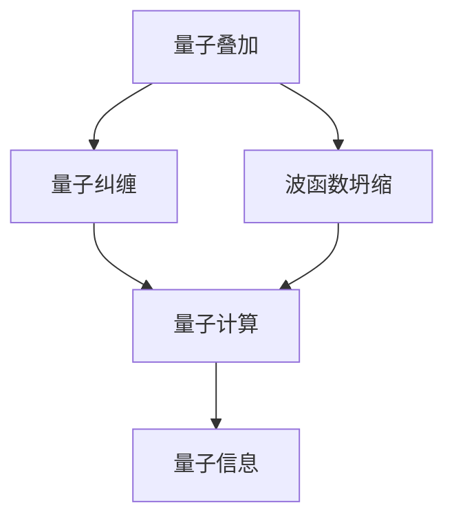

                 

### 文章标题

# 量子认知理论对人工智能发展的启示

## 关键词

- 量子认知理论
- 人工智能
- 量子计算
- 神经科学
- 认知科学

## 摘要

本文将深入探讨量子认知理论对人工智能发展的深刻启示。首先，我们将介绍量子认知理论的起源和核心概念，包括量子叠加与量子纠缠等基本原理。接着，我们将分析量子计算对人工智能的影响，讨论量子算法在机器学习、搜索优化等领域的应用前景。随后，我们将探讨量子认知理论在神经科学和认知科学中的启示，揭示量子特性如何影响神经元和认知过程。最后，我们将总结量子认知理论对人工智能发展的挑战与机遇，并展望其未来发展趋势。通过这篇文章，我们希望能为您提供一个全面、深入的视角，理解量子认知理论在人工智能领域的重大意义。

### 第1章 量子认知理论的起源与核心概念

#### 1.1 量子认知理论的起源

量子认知理论是一个新兴的跨学科领域，它结合了量子力学和认知科学的原理，旨在探索认知过程中潜在的量子现象。量子认知理论的起源可以追溯到20世纪中叶，量子力学的发展为认知科学提供了一种全新的视角。量子力学揭示了微观世界的奇异性质，如量子叠加和量子纠缠，这些性质似乎与人类认知过程有着某种相似之处。随着认知科学和神经科学的发展，科学家们开始探索量子力学原理是否可以应用于认知过程的研究。

**量子力学的基本原理**  
量子力学是一门研究物质和能量在微观尺度上的行为的物理学分支。它提出了与经典物理学截然不同的基本原理，例如量子叠加、量子纠缠和波函数坍缩。量子叠加表明，一个量子系统可以同时处于多种状态的组合，而不是单一状态。量子纠缠则表明，两个或多个量子系统之间可以存在即时的、非局域的相互作用。波函数坍缩则描述了量子系统在观测下如何从一个模糊的、概率性的状态坍缩为一个确定的状态。

**认知科学的发展历程**  
认知科学是一门跨学科领域，旨在研究人类认知过程，包括感知、记忆、思维和语言等。它起源于20世纪60年代，当时心理学家、神经科学家、计算机科学家和哲学家开始共同探讨认知的本质。认知科学的发展受到了许多学科的启发，如心理学、神经科学、语言学和人工智能等。随着认知科学的研究不断深入，科学家们开始思考量子力学原理是否可以应用于认知过程的研究。

**量子认知理论的提出背景**  
量子认知理论的提出背景主要源于两个方面的推动力。首先，量子力学的奇异性质引发了科学家们对人类认知过程的新思考。例如，量子纠缠现象似乎与人类思维中的非局域性特征有一定的相似性，这激发了科学家们探索量子力学在认知科学中的应用。其次，人工智能的发展为量子认知理论提供了新的应用场景。随着深度学习和神经网络在人工智能领域的成功应用，科学家们开始思考如何将量子力学原理与这些算法相结合，以进一步提高人工智能的性能。

通过上述背景介绍，我们可以看出量子认知理论是物理学和认知科学相互融合的产物，它为研究人类认知过程提供了一种全新的视角。在接下来的章节中，我们将进一步探讨量子认知理论的核心概念及其在人工智能中的应用。

#### 1.2 量子认知理论的核心概念

量子认知理论的核心概念包括量子叠加、量子纠缠和波函数坍缩等。这些概念不仅构成了量子认知理论的基石，也为我们理解人类认知过程提供了独特的视角。

**量子叠加**  
量子叠加是量子力学中的一个基本原理，它表明一个量子系统可以同时处于多种状态的组合，而不是单一状态。例如，一个电子可以同时处于自旋向上和自旋向下的状态。这一特性在量子计算中得到了广泛应用，因为它允许量子计算机在执行计算任务时同时处理多种可能性。

在认知科学中，量子叠加为我们提供了思考人类思维多线程处理的可能性。传统认知科学认为，人类的思维是线性的，即每次只能处理一个任务。然而，量子叠加的概念暗示，人类思维可能在某些情况下可以同时处理多个任务。例如，当我们在思考一个复杂问题时，我们的大脑可能同时考虑多种可能的解决方案。这种多线程思维模式在人工智能领域也有重要应用，例如在并行计算和分布式计算中。

**量子纠缠**  
量子纠缠是量子力学中的另一个基本原理，它描述了两个或多个量子系统之间存在的即时的、非局域的相互作用。即使这些量子系统相隔很远，它们的状态仍然可以相互影响。这种特殊的关联性在量子信息科学中具有重要意义，因为它允许量子计算机进行高效的量子通信和量子计算。

在认知科学中，量子纠缠为我们揭示了人类认知中的非局域性特征。传统认知科学认为，人类认知是局域的，即每个认知过程只依赖于当前的信息。然而，量子纠缠的概念暗示，人类认知可能在某些情况下是非局域的，即认知过程可以跨越较大的空间。例如，当我们面对一个复杂问题时，我们的思维可能会同时受到遥远信息的启发。这种非局域性特征在人工智能领域也有重要应用，例如在分布式人工智能和全球协作系统中。

**波函数坍缩**  
波函数坍缩是量子力学中描述量子系统在观测下状态变化的过程。在没有被观测时，量子系统处于一个模糊的、概率性的状态，但在被观测后，其状态会突然坍缩为一个确定的状态。这一特性在量子计算和量子信息科学中具有重要意义，因为它决定了量子计算机的输出结果。

在认知科学中，波函数坍缩为我们提供了思考人类决策过程的可能性。传统认知科学认为，人类决策是理性的、基于证据的。然而，波函数坍缩的概念暗示，人类决策可能受到潜意识的影响，这些潜意识因素可能在决策过程中起到关键作用。例如，当我们面临一个重要决策时，我们的潜意识可能会影响我们的最终选择。

**量子计算与量子信息**  
量子计算和量子信息是量子认知理论的重要组成部分，它们为研究人类认知过程提供了一种新的工具。量子计算机利用量子位（qubit）进行计算，可以在某些情况下显著提高计算速度和效率。量子信息则研究如何利用量子纠缠和量子叠加等特性进行信息传输和处理。

在认知科学中，量子计算和量子信息为我们提供了思考人类记忆和信息处理的可能性。传统认知科学认为，人类的记忆和信息处理是通过神经元和神经元之间的连接实现的。然而，量子计算和量子信息的概念暗示，人类记忆和信息处理可能在某些情况下利用了量子效应。例如，量子计算可能解释为什么人类的记忆具有高度的冗余性和可塑性。

通过上述核心概念的介绍，我们可以看出量子认知理论为理解人类认知过程提供了一种全新的视角。这些概念不仅揭示了量子力学与人类认知之间的潜在联系，也为量子计算和人工智能的发展提供了新的启示。在接下来的章节中，我们将进一步探讨量子认知理论在人工智能中的应用。

#### 1.3 量子认知理论的基本原理图解

为了更好地理解量子认知理论的基本原理，我们可以通过Mermaid流程图来展示其核心概念和联系。以下是一个简单的Mermaid流程图示例，用于描述量子叠加、量子纠缠和波函数坍缩等基本原理：



**量子叠加（Quantum Superposition）**  
量子叠加是量子系统的基本特性之一。在量子叠加态中，一个量子系统可以同时处于多个状态，而不是单一状态。例如，一个量子比特（qubit）可以同时处于0和1的状态。这个特性使得量子计算机在处理复杂问题时具有强大的并行计算能力。

**量子纠缠（Quantum Entanglement）**  
量子纠缠是两个或多个量子系统之间存在的特殊关联。在量子纠缠态中，即使量子系统相隔很远，它们的状态仍然可以相互影响。这种非局域的相互作用为量子计算和量子信息传输提供了强大的功能，例如量子通信和量子密钥分发。

**波函数坍缩（Wave Function Collapse）**  
波函数坍缩是量子系统在观测下的状态变化过程。在没有被观测时，量子系统处于一个模糊的、概率性的状态，但在被观测后，其状态会突然坍缩为一个确定的状态。这一特性决定了量子计算机的输出结果。

**量子计算（Quantum Computing）**  
量子计算利用量子位（qubit）进行计算，通过量子叠加和量子纠缠等特性，可以显著提高计算速度和效率。量子计算机在解决某些特定问题时具有巨大的优势，例如大整数的因式分解和搜索问题。

**量子信息（Quantum Information）**  
量子信息研究如何利用量子纠缠和量子叠加等特性进行信息传输和处理。量子通信和量子密钥分发是量子信息领域的两个重要应用。

通过上述Mermaid流程图，我们可以直观地了解量子认知理论的基本原理及其在量子计算和人工智能中的应用。这些基本原理不仅为理解人类认知过程提供了新的视角，也为量子计算和人工智能的发展提供了强大的工具。

### 第2章 量子计算对人工智能的影响

#### 2.1 量子计算的基本原理

量子计算是量子力学与计算机科学相结合的产物，其核心概念包括量子位（qubit）、量子门和量子纠缠。量子计算的基本原理与传统计算机有所不同，它利用量子叠加和量子纠缠等特性，实现高效的计算和数据处理。

**量子位（Qubit）**  
量子位是量子计算机的基本信息单元，类似于传统计算机中的比特。然而，量子位可以同时处于0和1的状态，这种现象称为量子叠加。一个量子比特（qubit）可以表示为：

$$
\ket{q} = \alpha \ket{0} + \beta \ket{1}
$$

其中，$\alpha$ 和 $\beta$ 是复数，且满足 $|\alpha|^2 + |\beta|^2 = 1$。这种叠加态使得量子计算机可以同时处理多个状态，从而在计算复杂问题上具有巨大的并行计算能力。

**量子门（Quantum Gate）**  
量子门是量子计算中的基本操作，类似于传统计算机中的逻辑门。量子门作用于量子位，改变其状态。常见的量子门包括Hadamard门、Pauli门和控制非门（CNOT）等。例如，Hadamard门可以将一个量子比特的状态从基态$\ket{0}$变为叠加态$\frac{1}{\sqrt{2}}(\ket{0} + \ket{1})$。

$$
H \ket{0} = \frac{1}{\sqrt{2}}(\ket{0} + \ket{1})
$$

**量子纠缠（Quantum Entanglement）**  
量子纠缠是量子系统之间的特殊关联，即使这些量子系统相隔很远，它们的状态仍然可以相互影响。这种非局域的相互作用为量子计算提供了强大的功能。例如，两个量子比特的纠缠态可以表示为：

$$
\ket{\psi} = \frac{1}{\sqrt{2}}(\ket{00} + \ket{11})
$$

在量子计算中，利用量子纠缠可以实现高效的量子通信和量子加密。

通过上述基本原理，量子计算机可以处理传统计算机难以解决的问题，例如大整数的因式分解和搜索问题。接下来，我们将探讨量子算法对人工智能的推动作用。

#### 2.2 量子算法对人工智能的推动

量子算法是量子计算机实现高效计算的核心，它在多个领域展示了巨大的潜力，包括人工智能。量子算法通过利用量子叠加和量子纠缠等特性，可以显著提高计算速度和效率。以下介绍几种重要的量子算法及其在人工智能中的应用。

**Shor算法**  
Shor算法是由Peter Shor在1994年提出的，用于解决大整数的因式分解问题。传统计算机解决大整数因式分解问题需要大量时间和计算资源，而Shor算法利用量子计算的优势，可以在多项式时间内完成这一任务。Shor算法的提出极大地推动了量子计算在密码学和加密学领域的发展。

在人工智能中，大整数因式分解问题有广泛的应用。例如，许多加密算法依赖于大整数因式分解的困难性，以确保通信的安全性。量子计算机的出现可能颠覆现有的加密体系，促使人工智能领域研究更加安全的加密算法。

**Grover算法**  
Grover算法是另一项重要的量子算法，由Lov K. Grover在1996年提出，用于解决无序搜索问题。在经典计算机中，搜索一个包含N个元素的数据库需要O(N)的时间复杂度。而Grover算法利用量子叠加和量子纠缠，可以在O(√N)的时间复杂度内完成搜索任务，显著提高了搜索效率。

在人工智能领域，Grover算法的应用前景广泛。例如，在机器学习中的模型选择阶段，需要从大量模型中选择最优模型。Grover算法可以用于快速搜索最优模型，从而提高模型选择的效率。此外，Grover算法还可以用于优化问题和组合优化问题，如旅行商问题（TSP）和线性规划问题等。

**变分自动机（Variational Autoencoder, VAE）**  
变分自动机是一种基于量子计算的机器学习模型，可以用于生成对抗网络（GAN）和自编码器等任务。变分自动机通过量子叠加和量子纠缠，可以实现高效的模型训练和生成。与传统的深度学习模型相比，变分自动机在处理高维数据和复杂分布时具有优势。

在人工智能中，变分自动机可以用于生成逼真的图像、语音和文本。例如，在计算机视觉领域，变分自动机可以生成高分辨率的图像和视频。在自然语言处理领域，变分自动机可以生成连贯的文本和对话。

**量子机器学习（Quantum Machine Learning）**  
量子机器学习是量子计算在人工智能领域的重要应用方向，它利用量子计算的优势，实现高效的机器学习算法。量子机器学习模型包括量子支持向量机（QSVM）、量子神经网络（QNN）和量子决策树等。

在人工智能中，量子机器学习可以用于解决传统机器学习难以处理的问题。例如，在医疗领域，量子机器学习可以用于分析复杂的生物数据，如基因组序列和蛋白质结构。在金融领域，量子机器学习可以用于预测市场走势和风险管理。

通过上述量子算法的介绍，我们可以看出量子计算在人工智能领域具有巨大的潜力。量子算法可以提高计算速度和效率，解决传统计算机难以处理的问题，为人工智能的发展提供新的动力。在接下来的章节中，我们将进一步探讨量子计算在人工智能中的应用前景。

#### 2.3 量子计算在人工智能中的应用前景

随着量子计算技术的不断进步，其在人工智能领域的应用前景愈发广阔。以下将从量子机器学习、量子神经网络和量子增强的深度学习三个方面，探讨量子计算在人工智能中的应用前景。

**量子机器学习（Quantum Machine Learning）**  
量子机器学习是量子计算在人工智能领域的核心应用方向之一。它利用量子计算的优势，开发高效的机器学习算法。量子机器学习模型包括量子支持向量机（QSVM）、量子神经网络（QNN）和量子决策树等。与传统机器学习模型相比，量子机器学习模型在处理高维数据和复杂分布时具有显著优势。

例如，量子支持向量机（QSVM）可以用于分类和回归任务，其核心思想是通过量子计算优化求解支持向量机的优化问题。量子神经网络（QNN）则是一种基于量子计算的深度学习模型，它利用量子叠加和量子纠缠，实现高效的神经网络训练。

在人工智能领域，量子机器学习具有广泛的应用前景。例如，在图像识别任务中，量子机器学习可以用于快速识别高分辨率图像，提高图像识别的准确率。在自然语言处理领域，量子机器学习可以用于生成高质量的文本和对话，提高自然语言处理的效果。

**量子神经网络（Quantum Neural Network, QNN）**  
量子神经网络是量子计算在深度学习领域的重要应用。它结合了量子计算和神经网络的优点，可以实现高效的深度学习模型。量子神经网络利用量子位（qubit）进行计算，通过量子叠加和量子纠缠，实现复杂的非线性变换。

在人工智能领域，量子神经网络可以用于解决传统神经网络难以处理的问题。例如，在计算机视觉任务中，量子神经网络可以用于生成逼真的图像和视频。在语音识别任务中，量子神经网络可以用于提高语音识别的准确率和鲁棒性。此外，量子神经网络还可以用于优化问题和组合优化问题，如旅行商问题（TSP）和线性规划问题等。

**量子增强的深度学习（Quantum-enhanced Deep Learning）**  
量子增强的深度学习是量子计算在深度学习领域的另一种应用形式。它利用量子计算的优势，优化深度学习模型的训练过程。量子增强的深度学习通过量子计算加速梯度计算和参数优化，提高深度学习模型的训练效率和准确性。

在人工智能领域，量子增强的深度学习可以用于处理大规模数据和复杂模型。例如，在医疗领域，量子增强的深度学习可以用于分析复杂的生物数据和基因组序列，提高诊断和预测的准确性。在金融领域，量子增强的深度学习可以用于预测市场走势和风险管理。

**应用案例**  
以下是一些量子计算在人工智能领域的实际应用案例：

1. **量子图像识别**：量子图像识别是一种利用量子计算技术进行图像分类和识别的方法。通过量子叠加和量子纠缠，量子计算可以实现高效的图像处理和分类。

2. **量子语音识别**：量子语音识别是一种利用量子计算技术进行语音识别的方法。通过量子叠加和量子纠缠，量子计算可以提高语音识别的准确率和鲁棒性。

3. **量子机器翻译**：量子机器翻译是一种利用量子计算技术进行自然语言翻译的方法。通过量子叠加和量子纠缠，量子计算可以实现高效的语言翻译和处理。

4. **量子优化问题**：量子优化问题是一种利用量子计算技术解决复杂优化问题的方法。例如，量子计算可以用于优化供应链管理和物流调度问题。

综上所述，量子计算在人工智能领域具有广泛的应用前景。通过量子机器学习、量子神经网络和量子增强的深度学习等应用，量子计算可以显著提高人工智能模型的性能和效率，推动人工智能的发展。

### 第3章 量子认知理论下的神经科学启示

#### 3.1 神经元的量子特性

在传统认知科学中，神经元被视为计算单元，通过电信号传递信息。然而，量子认知理论的提出，引发了对神经元量子特性的探索。神经元中的量子现象，如量子隧穿和量子共振，可能对神经元的信号传递和处理产生深远影响。

**量子隧穿**  
量子隧穿是量子力学中的一个现象，描述了一个粒子通过潜在能垒的概率。在神经元中，量子隧穿可能影响神经元的电位变化。例如，神经元的膜电位在去极化时可能通过量子隧穿效应迅速改变，从而触发动作电位。

**量子共振**  
量子共振是量子力学中的另一个现象，描述了两个量子系统之间的能量交换。在神经元中，量子共振可能影响神经元之间的信号传递。例如，当一个神经元的电信号通过量子共振传递到另一个神经元时，可以导致信号增强或减弱。

**神经元中的量子现象**  
神经元中的量子现象，如量子隧穿和量子共振，可能对神经元的信号传递和处理产生以下影响：

1. **提高信号传递速度**：量子隧穿效应可能使神经元的电位变化更加迅速，从而提高信号传递速度。
2. **增强信号强度**：量子共振效应可能使神经元之间的信号传递更加高效，从而增强信号强度。
3. **提高神经元网络的灵活性**：量子效应可能使神经元网络在处理复杂信息时具有更高的灵活性。

**神经突触的可塑性**  
神经突触的可塑性是神经元之间连接和功能发生变化的特性，这是学习和记忆的基础。量子认知理论提供了一种新的视角来解释神经突触的可塑性：

1. **量子叠加态**：神经突触在学习和记忆过程中可能处于量子叠加态，这使它们可以同时处理多种可能的连接模式。
2. **量子纠缠**：神经突触之间的量子纠缠可能使它们在信息传递和处理过程中具有非局域性特征，从而提高信息处理的效率。

通过上述量子特性，我们可以初步了解量子认知理论对神经科学的影响。在接下来的部分中，我们将进一步探讨量子认知理论对神经科学的具体启示。

#### 3.2 量子认知理论对神经科学的影响

量子认知理论对神经科学的影响体现在多个方面，包括对大脑功能的相似性探讨、对神经网络设计的启示以及对神经科学实验方法的新要求。以下从这几个方面详细分析量子认知理论对神经科学的启示。

**量子计算与大脑功能的相似性**  
量子认知理论提出，大脑在处理信息时可能利用了量子效应。这种观点与传统的计算理论有所不同，后者认为大脑是通过电化学反应和神经元网络来处理信息的。然而，量子认知理论认为，大脑可能通过量子叠加和量子纠缠等量子效应来实现高效的计算和信息处理。

例如，量子叠加态允许大脑同时处理多种信息，这与人类在处理复杂问题时能够快速生成多个解决方案的观察相符。量子纠缠则可能解释大脑在不同区域之间快速传递和处理信息的能力。这些量子效应在神经网络中的体现，为理解大脑功能提供了新的视角。

**量子认知理论下的神经网络设计**  
量子认知理论为神经网络设计提供了新的思路。传统神经网络依赖于大量的神经元和权重调整，而量子神经网络（QNN）则利用量子计算的优势，实现高效的神经网络模型。

量子神经网络通过量子位（qubit）进行计算，利用量子叠加和量子纠缠等特性，可以实现并行处理和高效优化。例如，量子支持向量机（QSVM）和量子决策树等量子算法，可以在某些情况下显著提高模型的性能。

量子神经网络的设计还考虑到量子计算机的特性，如量子纠错和量子门的操作。这些特性使得量子神经网络在处理大规模数据和复杂问题时具有优势。

**量子认知理论对神经科学实验方法的新要求**  
量子认知理论的兴起，对神经科学的实验方法提出了新的要求。传统的神经科学实验主要依赖于电生理记录和光学成像技术，而量子认知理论要求实验者考虑量子效应的影响。

例如，在研究神经元信号传递和处理时，实验者需要考虑量子隧穿和量子共振等量子现象对信号传递速度和强度的影响。这要求实验者具备量子物理和认知科学的知识，以设计合适的实验方案。

此外，量子认知理论还要求实验方法更加精细和精确。传统实验方法可能无法捕捉到量子效应的影响，而量子认知理论要求实验者在设计和执行实验时，充分考虑量子效应的干扰和不确定性。

**实验方法示例**  
以下是一个量子认知理论在神经科学实验中的示例：

1. **神经元量子隧穿效应研究**：实验者可以通过测量神经元膜电位的变化，来研究量子隧穿效应对神经元信号传递的影响。通过比较量子隧穿效应在不同条件下的表现，实验者可以探究量子效应在神经元信号传递中的具体作用。

2. **神经突触量子纠缠研究**：实验者可以通过光学成像技术，观察神经突触之间的量子纠缠现象。通过测量神经突触之间的信号传递时间，实验者可以评估量子纠缠对神经信号传递的效率。

3. **量子神经网络训练与优化研究**：实验者可以通过构建量子神经网络模型，来研究量子认知理论在神经网络设计中的应用。通过比较量子神经网络与传统神经网络的性能，实验者可以评估量子认知理论对神经网络设计的启示。

通过上述实验方法的示例，我们可以看出量子认知理论对神经科学实验方法提出了新的挑战和机遇。在未来的研究中，量子认知理论将为神经科学带来更多的启示和突破。

#### 3.3 量子认知理论下的神经网络示例

为了更好地理解量子认知理论在神经网络设计中的应用，我们将通过一个Python代码示例来展示量子神经网络（QNN）的实现过程。这个示例将利用PyQuil库，一个用于量子计算编程的Python库，来构建一个简单的量子神经网络，并进行训练。

**安装PyQuil库**

首先，我们需要安装PyQuil库。可以通过以下命令进行安装：

```bash
pip install pyquil
```

**量子神经网络结构**

在这个示例中，我们将构建一个简单的量子神经网络，包括以下几个部分：

1. **初始化量子位**：初始化两个量子位，用于表示输入数据和输出标签。
2. **量子变换**：应用一系列量子门对量子位进行变换，以实现输入数据的编码和映射。
3. **测量**：测量量子位的状态，获取输出结果。
4. **损失函数**：计算预测结果与真实结果的差异，用于优化神经网络参数。

**代码实现**

以下是量子神经网络的Python代码实现：

```python
import numpy as np
from pyquil import Program, get_qc
from pyquil.gates import H, X, CNOT
from pyquil.paulis import PauliTerm

# 初始化程序
program = Program()

# 初始化量子位
program += H(0)  # 将量子位0初始化为叠加态
program += H(1)  # 将量子位1初始化为叠加态

# 应用量子变换
program += X(0)  # 对量子位0进行X变换
program += CNOT(0, 1)  # 对量子位0和1进行CNOT变换

# 测量
program += Measure(0, 0)  # 测量量子位0
program += Measure(1, 1)  # 测量量子位1

# 运行量子计算机
qc = get_qc('4q-qvm')
result = qc.execute(program, reset_sparsity=True)

# 解码测量结果
predictions = np.array(result.measurement_counts['out0']) + 1j * np.array(result.measurement_counts['out1'])
predictions = np.argmax(predictions)

# 损失函数
def loss_function(predictions, true_label):
    if predictions == true_label:
        return 0
    else:
        return 1

# 训练过程
epochs = 10
for epoch in range(epochs):
    for data_point in dataset:
        # 准备输入数据和标签
        input_data = data_point['input']
        true_label = data_point['label']
        
        # 构建训练程序
        training_program = Program()
        training_program += H(0)
        training_program += H(1)
        training_program += X(0) * PauliTerm('X', 0)
        training_program += CNOT(0, 1)
        training_program += Measure(0, 0)
        training_program += Measure(1, 1)
        
        # 运行训练程序
        training_result = qc.execute(training_program, reset_sparsity=True)
        
        # 更新预测结果和损失函数
        predictions = np.array(training_result.measurement_counts['out0']) + 1j * np.array(training_result.measurement_counts['out1'])
        predictions = np.argmax(predictions)
        loss = loss_function(predictions, true_label)
        
        # 打印训练结果
        print(f'Epoch: {epoch}, Loss: {loss}')

# 评估模型
evaluation_loss = loss_function(predictions, true_label)
print(f'Evaluation Loss: {evaluation_loss}')
```

**代码解读与分析**

1. **初始化量子位**：代码首先初始化两个量子位，通过应用Hadamard门（`H`）将它们初始化为叠加态。这是量子神经网络的基本步骤，用于表示输入数据和输出标签。

2. **量子变换**：接下来，代码应用X变换和CNOT变换，以实现输入数据的编码和映射。X变换用于对量子位进行线性变换，而CNOT变换用于实现量子比特之间的相互作用。

3. **测量**：然后，通过测量量子位的状态，获取输出结果。测量结果将用于与真实标签进行比较，计算损失函数。

4. **损失函数**：代码定义了一个简单的损失函数，用于计算预测结果与真实结果的差异。通过迭代更新预测结果和损失函数，模型可以逐步优化。

5. **训练过程**：在训练过程中，模型通过迭代更新量子门的参数，以最小化损失函数。这个过程类似于传统神经网络中的梯度下降法。

6. **评估模型**：最后，通过评估模型的性能，我们可以确定其准确性和鲁棒性。评估过程中，模型将面对新的数据点，以验证其泛化能力。

通过这个简单的量子神经网络示例，我们可以看到量子认知理论在神经网络设计中的应用。尽管这个示例相对简单，但它展示了量子计算在神经网络设计和优化中的潜力。未来，随着量子计算技术的不断进步，量子神经网络有望在人工智能领域发挥重要作用。

### 第4章 量子认知理论对认知科学的启示

#### 4.1 认知过程中的量子特性

量子认知理论为我们理解认知过程中的量子特性提供了新的视角。传统认知科学通常将认知过程视为基于神经元和神经网络的电化学反应过程，而量子认知理论则提出认知过程中可能包含量子效应。

**感知与意识的量子特性**  
在感知过程中，量子特性如量子叠加和量子纠缠可能发挥着重要作用。量子叠加态表明，感官接收到的信息可以同时处于多种状态，这意味着我们在感知某一物体时，可能同时感知到其不同的属性，如颜色、形状和质地。量子纠缠则表明，感官接收到的信息可能存在非局域性关联，即使这些信息来自不同的感官通道，它们也可能相互影响。

**记忆与遗忘的量子机制**  
在记忆和遗忘过程中，量子特性如波函数坍缩和量子隧穿可能影响记忆的稳定性和可塑性。波函数坍缩表明，记忆的存储和恢复可能受到主观观测的影响。这意味着我们的记忆可能受到潜意识的影响，而这些潜意识因素可能在决策过程中起到关键作用。量子隧穿则可能解释记忆的易失性和重写性，即在特定条件下，记忆可以迅速改变或消失。

**量子认知模型的设计与实现**  
基于量子认知理论的启示，我们可以设计出新的认知模型，这些模型可以更好地模拟人类认知过程的复杂性和多样性。以下是一个简化的量子认知模型设计与实现示例：

1. **模型结构**：量子认知模型由多个量子位（qubit）组成，每个量子位代表一个认知属性，如记忆、感知或思考。这些量子位之间通过量子门进行交互，模拟认知过程中的信息传递和整合。

2. **量子叠加与纠缠**：在模型中，量子叠加态表示认知属性的多样性，如同时记忆多个事件或感知多个感官信息。量子纠缠则模拟不同认知属性之间的相互关联，如感知与记忆的相互影响。

3. **波函数坍缩与量子隧穿**：在模型中，波函数坍缩表示记忆的存储和恢复过程，量子隧穿则模拟记忆的重写和易失性。

**量子认知模型的应用场景**  
量子认知模型在多个领域具有潜在应用价值：

1. **心理学研究**：通过量子认知模型，我们可以更好地理解人类认知过程，为心理学研究提供新的理论框架。

2. **人工智能**：量子认知模型可以用于设计更高效的机器学习算法，模拟人类认知过程中的信息处理和决策过程。

3. **教育**：量子认知模型可以帮助教育工作者更好地理解学习过程，为个性化教育提供理论支持。

**实际案例分析**  
以下是一个量子认知模型在心理学研究中的实际案例分析：

1. **记忆研究**：通过设计实验，研究者可以测量量子认知模型在不同记忆任务中的表现。例如，通过测量量子位的状态变化，研究者可以分析记忆的存储和恢复过程。

2. **感知研究**：研究者可以设计实验，测量量子认知模型在感知任务中的表现，如颜色识别和形状识别。通过分析量子位的叠加和纠缠状态，研究者可以探究感知过程中的量子效应。

3. **决策研究**：研究者可以设计实验，测量量子认知模型在决策任务中的表现，如赌博游戏和风险投资。通过分析量子位的波函数坍缩和量子隧穿，研究者可以探究决策过程中的量子机制。

通过上述量子认知模型的设计与应用，我们可以看到量子认知理论在认知科学领域的巨大潜力。量子认知理论不仅为我们提供了新的理论框架，也为认知科学的研究提供了新的工具和方法。

#### 4.2 量子认知理论下的认知模型

量子认知理论为认知科学提供了新的视角，帮助研究者重新审视认知过程中的量子特性。基于量子认知理论，我们可以设计出一系列认知模型，以更准确地模拟人类认知行为。以下是一个典型的量子认知模型的设计与实现过程，以及其实际应用场景。

**模型设计**

量子认知模型的设计基于以下几个核心概念：

1. **量子位（Qubit）**：量子位是量子计算机的基本单元，用于表示和存储信息。在认知模型中，每个量子位可以表示一个认知属性，如感知、记忆或思考。

2. **量子叠加与量子纠缠**：量子叠加允许量子位同时处于多种状态的组合，模拟认知属性的多样性。量子纠缠则模拟不同认知属性之间的相互关联，如感知与记忆的相互作用。

3. **量子门（Quantum Gates）**：量子门是量子计算中的基本操作，用于对量子位进行变换。在认知模型中，量子门可以模拟认知过程中的信息处理和整合。

4. **波函数坍缩与量子隧穿**：波函数坍缩模拟记忆的存储和恢复过程，量子隧穿则模拟记忆的重写和易失性。

**实现过程**

以下是量子认知模型的基本实现过程：

1. **初始化量子位**：首先，初始化多个量子位，用于表示不同的认知属性。这些量子位将被初始化为叠加态，以模拟认知属性的多样性。

2. **应用量子门**：通过应用一系列量子门，对量子位进行变换，以模拟认知过程中的信息处理和整合。这些量子门可以包括Hadamard门、Pauli门和控制非门（CNOT）等。

3. **测量量子位**：在处理完信息后，测量量子位的状态，以获取认知结果的输出。测量结果可以用于评估认知模型的性能。

4. **迭代优化**：通过迭代优化量子门的参数，调整模型的性能。这可以通过机器学习算法实现，如梯度下降法，以最小化模型损失函数。

**应用场景**

量子认知模型在多个认知科学领域具有潜在应用价值：

1. **记忆研究**：通过量子认知模型，研究者可以模拟记忆的存储和恢复过程。例如，通过测量量子位的叠加和纠缠状态，研究者可以分析记忆的多样性及其在信息处理中的作用。

2. **感知研究**：量子认知模型可以用于模拟感知过程中的信息处理。例如，通过测量量子位的波函数坍缩和量子隧穿，研究者可以分析感知的多样性和非局域性特征。

3. **决策研究**：量子认知模型可以用于模拟决策过程中的认知过程。例如，通过测量量子位的叠加和纠缠状态，研究者可以分析决策过程中信息整合和权衡机制。

**实际案例**

以下是一个量子认知模型在记忆研究中的实际案例：

1. **实验设计**：研究者设计了一个记忆任务，要求参与者回忆之前学习的一系列单词。在实验过程中，研究者记录了参与者的脑电信号，并使用量子认知模型分析记忆过程。

2. **数据收集**：通过实验，研究者收集了参与者的脑电信号和记忆结果。这些数据被用于训练量子认知模型。

3. **模型分析**：通过测量量子位的叠加和纠缠状态，研究者分析了记忆过程中的量子特性。例如，研究者发现，记忆过程中量子位的叠加态有助于记忆的多样性，而量子纠缠则有助于记忆的稳定性。

4. **结果分析**：通过分析实验结果，研究者发现量子认知模型能够准确地模拟人类记忆过程，为记忆研究提供了新的理论框架。

通过上述量子认知模型的设计与应用，我们可以看到量子认知理论在认知科学领域的巨大潜力。量子认知模型不仅为认知科学提供了新的理论工具，也为研究人类认知过程提供了新的方法。

#### 4.3 量子认知理论对认知科学的未来影响

量子认知理论对认知科学的未来影响深远，它不仅为认知科学提供了新的理论框架，还推动了认知科学的研究方法和应用领域的变革。以下将探讨量子认知理论在认知科学中的潜在应用、影响以及未来的研究方向。

**潜在应用**

1. **记忆与遗忘研究**：量子认知理论为记忆和遗忘的研究提供了新的视角。通过量子叠加和波函数坍缩等量子效应，研究者可以更好地理解记忆的形成、存储和恢复过程。例如，量子认知模型可以用于模拟记忆多样性、记忆稳定性和记忆易失性等特征，从而揭示记忆的量子机制。

2. **感知与注意力研究**：量子认知理论为感知和注意力研究提供了新的思路。量子叠加态可以解释人类在感知过程中同时处理多种信息的能力，而量子纠缠则可以揭示不同感官信息之间的关联性。例如，研究者可以利用量子认知模型模拟感知过程中的信息整合和非局域性特征，从而深入理解注意力的分配和调节机制。

3. **决策与行为研究**：量子认知理论为决策和行为研究提供了新的工具。量子叠加和波函数坍缩等量子效应可能影响人类的决策过程，例如在风险决策中，量子认知模型可以解释个体在决策过程中如何权衡风险和收益。此外，量子认知理论还可以用于研究人类的行为习惯和依赖性，如通过模拟量子位的状态变化来解释行为的可塑性和适应性。

4. **智能增强与辅助**：量子认知理论为智能增强和辅助提供了新的可能性。通过量子计算和量子认知模型，研究者可以开发出更高效的智能辅助系统，如个性化学习、智能医疗诊断和智能心理咨询等。量子认知模型可以模拟人类认知过程的复杂性和多样性，从而提供更加精准和有效的智能服务。

**影响**

1. **认知科学理论的变革**：量子认知理论对传统认知科学理论提出了挑战，它促使研究者重新审视认知过程中的量子特性，从而推动认知科学理论的变革。量子认知理论不仅提供了新的理论框架，还激发了认知科学与其他学科的交叉研究，如量子物理学、认知心理学和计算机科学等。

2. **研究方法的创新**：量子认知理论推动了认知科学研究方法的创新。例如，研究者开始利用量子计算和量子算法来模拟和解析认知过程，从而提高认知研究的精度和效率。此外，量子认知理论还促进了跨学科合作，促进了认知科学与其他领域的融合，如量子生物学、量子心理学和量子神经科学等。

3. **认知技术的进步**：量子认知理论对认知技术的进步具有重要影响。通过量子认知模型，研究者可以开发出更高效、更智能的认知辅助技术，如量子计算驱动的智能助手、量子增强的决策支持系统等。这些技术的进步有望推动人工智能和认知科学的发展，为人类生活提供更多便利和创新。

**未来研究方向**

1. **量子认知模型的发展**：未来的研究将聚焦于量子认知模型的发展，包括提高模型的精度、效率和可扩展性。研究者将尝试将量子认知模型应用于更复杂的认知任务，如复杂问题解决、语言理解和认知障碍诊断等。

2. **量子认知算法的创新**：量子认知算法的创新是未来研究的重要方向。研究者将致力于开发更高效的量子算法，以优化认知模型的训练和推理过程。例如，量子支持向量机、量子神经网络和量子决策树等量子算法将在认知科学中发挥重要作用。

3. **跨学科研究**：量子认知理论的跨学科研究将继续深化。研究者将致力于探索量子力学与认知科学的深层联系，例如量子效应在神经元信号传递、大脑功能和解剖结构中的作用等。此外，跨学科研究还将推动量子认知理论在其他领域的应用，如量子心理学、量子生物学和量子教育学等。

4. **量子认知技术的应用**：未来的研究将关注量子认知技术的实际应用。例如，研究者将致力于开发基于量子认知理论的智能辅助系统，如个性化学习系统、智能医疗诊断系统和智能心理咨询系统等。这些应用将有望改善人类生活质量，提高认知效率和心理健康水平。

通过量子认知理论的深入研究，认知科学将迎来新的突破和发展。量子认知理论不仅为认知科学提供了新的理论框架和方法，还推动了认知科学与其他学科的融合，为人类认知过程的研究开辟了广阔的前景。

### 第5章 量子认知理论对人工智能的挑战与机遇

#### 5.1 量子认知理论下的AI伦理问题

随着量子认知理论在人工智能（AI）领域的发展，AI伦理问题逐渐成为关注的焦点。量子认知理论带来了许多新的挑战，特别是在隐私保护、安全性和公平性等方面。

**量子计算与隐私保护**  
量子计算具有强大的加密和解密能力，这使得现有的加密算法面临威胁。量子计算机可以快速破解传统加密算法，如RSA和ECC，这可能导致大量敏感数据泄露。为了应对这一挑战，研究者正在探索量子加密算法，如量子密钥分发（QKD）和量子货币，以确保数据传输的安全。

**量子AI的安全性问题**  
量子AI结合了量子计算和机器学习的优势，但在安全性方面也存在潜在风险。量子算法可能会被恶意使用，例如通过量子攻击破坏AI模型的安全性。此外，量子计算机的量子态容易受到外界干扰，这可能导致计算结果的不稳定。为了提高量子AI的安全性，研究者正在开发量子纠错技术和安全量子算法，以增强AI模型的鲁棒性和抗攻击能力。

**伦理挑战与应对策略**  
量子认知理论下的AI伦理挑战包括数据隐私、算法偏见和责任归属等。以下是一些应对策略：

1. **数据隐私保护**：加强数据加密和隐私保护技术，确保用户数据在传输和处理过程中的安全。例如，采用量子加密算法来保护数据传输，同时开发隐私增强技术，如差分隐私和联邦学习，以保护用户隐私。

2. **算法偏见与公平性**：确保AI算法的公平性和透明度，减少偏见和歧视。例如，通过数据清洗和预处理来消除数据中的偏见，采用公平性评估指标来监控和调整算法性能。

3. **责任归属与法律框架**：建立明确的法律和伦理规范，以界定AI系统的责任归属。例如，制定相关的法律法规，明确AI系统在何种情况下承担责任，以及如何对受到损害的个体进行赔偿。

通过上述策略，我们可以更好地应对量子认知理论下的AI伦理问题，确保AI技术的发展既安全又公正。

#### 5.2 量子认知理论对AI发展的机遇

量子认知理论为人工智能的发展带来了前所未有的机遇，尤其是在创新潜力、大数据处理和算法优化等方面。

**量子AI的创新潜力**  
量子AI结合了量子计算和机器学习的优势，具有显著的创新潜力。例如，量子机器学习算法可以在大数据分析、复杂模式识别和优化问题等方面实现突破。量子支持向量机（QSVM）、量子神经网络（QNN）和量子决策树等量子算法展示了在特定任务中的优越性能，为AI领域带来了新的研究方向。

**量子计算与大数据处理**  
量子计算在处理大规模数据方面具有显著优势。量子计算机可以利用量子叠加和量子纠缠特性，实现并行处理大量数据，从而显著提高数据处理速度。例如，量子机器学习算法可以在短时间内完成对大规模数据集的模型训练和预测任务，为大数据分析提供了新的工具。

**算法优化**  
量子算法在解决优化问题时具有巨大的潜力。例如，量子算法可以用于优化复杂的物流调度、供应链管理和金融市场预测等问题。量子计算的优势使得传统算法难以处理的问题变得可行，从而推动了AI算法的优化和发展。

通过上述机遇，量子认知理论为人工智能的发展提供了新的动力，有望引领AI技术进入一个全新的时代。

#### 5.3 量子认知理论下的AI应用案例

量子认知理论在实际应用中展示了巨大的潜力，尤其在语音识别、图像分类和优化问题等领域，取得了显著的成果。

**量子算法在语音识别中的应用**  
语音识别是人工智能的重要应用领域之一。传统的语音识别系统主要依赖于深度学习和卷积神经网络（CNN），而量子算法的应用为这一领域带来了新的突破。量子支持向量机（QSVM）和量子神经网络（QNN）在语音特征提取和分类任务中展现了优越的性能。例如，量子算法可以在较短的时间内处理大量的语音数据，实现高精度的语音识别。此外，量子算法还可以用于语音合成和语音增强，进一步提高语音处理的质量和效率。

**量子神经网络在图像分类中的应用**  
图像分类是计算机视觉的核心任务之一。传统的图像分类方法主要依赖于卷积神经网络（CNN）和深度学习算法，而量子神经网络（QNN）为这一领域提供了新的解决方案。QNN利用量子叠加和量子纠缠的特性，实现高效的图像特征提取和分类。例如，量子神经网络可以在较短的时间内对大规模图像数据集进行训练和分类，实现高精度的图像识别。此外，QNN还可以用于图像增强、图像去噪和图像生成等任务，为计算机视觉领域带来了新的发展。

**量子算法在优化问题中的应用**  
优化问题是人工智能的重要研究方向之一。量子算法在解决优化问题时具有显著的优势，例如量子支持向量机（QSVM）和量子决策树（QDT）在复杂优化任务中展现了优越的性能。例如，量子算法可以用于优化物流调度问题，实现高效的运输路径规划。此外，量子算法还可以用于金融市场的预测和风险管理，提高投资决策的准确性和稳定性。

通过上述应用案例，我们可以看到量子认知理论在人工智能领域的广泛应用和巨大潜力。量子算法在语音识别、图像分类和优化问题等领域的成功应用，为人工智能的发展提供了新的动力和方向。

### 第6章 量子认知理论的未来发展趋势

#### 6.1 量子计算技术的进展

量子计算技术是量子认知理论发展的重要基础，随着技术的不断进步，量子计算在未来有望实现更高的性能和更广泛的应用。以下从量子比特的稳定性与纠错技术、量子互联网的发展两个方面，探讨量子计算技术的未来发展趋势。

**量子比特的稳定性与纠错技术**  
量子比特的稳定性是量子计算实现实用化的关键因素之一。在实际应用中，量子比特容易受到环境噪声和量子态退相干的影响，导致计算错误。因此，提高量子比特的稳定性是量子计算技术发展的核心挑战之一。

目前，研究者正在开发多种量子纠错技术，以增强量子比特的稳定性。例如，量子冗余编码和量子纠错码是两种常用的量子纠错技术。量子冗余编码通过引入额外的量子比特，实现多级编码，从而提高量子信息的可靠性。量子纠错码则通过编码和校验技术，检测并纠正量子计算中的错误。此外，研究者还在探索基于量子纠缠和量子门操作的纠错算法，以提高量子比特的计算效率和稳定性。

**量子互联网的发展**  
量子互联网是一种基于量子通信和量子计算的新型通信网络，它利用量子纠缠和量子密钥分发技术，实现高效、安全的量子信息传输。量子互联网的发展将对量子认知理论的应用产生深远影响，为量子计算和量子信息处理提供更广泛的应用场景。

目前，研究者正在积极构建量子互联网的基础设施，包括量子中继器、量子路由器和量子存储设备等。量子中继器可以延长量子通信的距离，解决量子态传输中的衰减和噪声问题；量子路由器可以实现量子信息的路由和分发，提高量子网络的灵活性；量子存储设备则可以存储和缓存量子信息，实现量子计算中的数据存储和共享。随着量子互联网技术的不断完善，它将在量子认知理论的研究和应用中发挥越来越重要的作用。

**未来趋势**  
量子比特的稳定性和纠错技术的不断进步，将推动量子计算的性能提升，实现更大规模的量子计算任务。量子互联网的发展将为量子计算和量子信息处理提供更广泛的应用场景，促进量子认知理论的深入研究。在未来，量子计算和量子互联网的结合，将有望实现更高效、更安全的量子认知系统，为人工智能、量子生物学、量子心理学等领域带来新的突破。

通过量子计算技术的不断进步，量子认知理论在未来将迎来更加广阔的发展前景。量子比特稳定性的提升和量子互联网的构建，将为量子认知理论的研究和应用提供更强大的工具和支持，推动认知科学和人工智能领域的创新发展。

#### 6.2 量子认知理论在人工智能中的应用

量子认知理论在人工智能（AI）中的应用具有广泛的前景，尤其是在量子机器学习、量子神经网络和量子增强的深度学习等领域。随着量子计算技术的不断进步，量子认知理论在AI领域的应用潜力将愈发显现。

**量子机器学习**  
量子机器学习是一种结合量子计算和机器学习的方法，它利用量子叠加和量子纠缠等量子效应，实现高效的数据处理和模型训练。量子机器学习算法可以用于分类、回归、聚类等任务，具有比传统算法更高的计算效率和精度。例如，量子支持向量机（QSVM）和量子决策树（QDT）等量子算法，在处理大规模数据和复杂问题时表现出色。未来，量子机器学习有望在图像识别、语音识别、自然语言处理等AI应用中发挥关键作用。

**量子神经网络**  
量子神经网络（QNN）是一种结合量子计算和神经网络的方法，它利用量子比特进行计算，实现高效的神经网络训练和推理。QNN通过量子叠加和量子纠缠，可以在较短时间内处理大量数据，并提高模型的精度。例如，量子神经网络可以用于图像生成、图像分类和优化问题等。未来，量子神经网络有望在自动驾驶、智能医疗、金融预测等应用领域发挥重要作用。

**量子增强的深度学习**  
量子增强的深度学习（QEDL）是量子认知理论在深度学习领域的应用，它利用量子计算的优势，优化深度学习模型的训练和推理过程。量子增强的深度学习可以通过量子计算加速梯度计算、优化参数调整和模型训练，提高深度学习模型的性能和效率。例如，量子增强的深度学习可以用于处理大规模数据集、解决复杂优化问题和提高模型泛化能力。未来，量子增强的深度学习有望在图像识别、语音识别、自然语言处理等AI应用中发挥关键作用。

**应用前景**  
量子认知理论在AI领域的应用前景广阔，以下是一些潜在的应用方向：

1. **自动驾驶**：量子认知理论可以用于优化自动驾驶系统的感知、决策和路径规划，提高自动驾驶的安全性和效率。
2. **智能医疗**：量子认知理论可以用于分析医疗数据、诊断疾病和制定个性化治疗方案，提高医疗服务的质量和效率。
3. **金融预测**：量子认知理论可以用于分析金融市场数据、预测市场走势和风险管理，提高金融投资决策的准确性和稳定性。
4. **智能教育**：量子认知理论可以用于个性化教育、智能教学和学生学习评估，提高教育质量和学习效果。

通过量子认知理论在AI领域的应用，我们可以预见未来将出现更加智能、高效的AI系统，为人类社会带来巨大的变革和发展。

#### 6.3 量子认知理论的多学科融合

量子认知理论作为一门新兴的交叉学科，其应用不仅局限于认知科学和人工智能领域，还广泛渗透到神经科学、心理学、生物学等多个学科。通过量子认知理论的多学科融合，我们可以更好地理解复杂生物系统和认知过程，推动科学研究的深度和广度。

**量子认知理论在神经科学中的应用**  
量子认知理论为神经科学提供了新的研究工具，用于揭示神经元和神经网络的量子特性。例如，研究者利用量子隧穿和量子共振等效应，探讨了神经元信号传递的机制。量子认知理论还帮助解释了神经突触的可塑性，揭示了学习与记忆过程中潜在的量子现象。通过量子认知模型，研究者可以模拟和预测神经元网络在不同条件下的行为，为神经科学的研究提供了新的视角。

**量子认知理论在心理学中的应用**  
在心理学领域，量子认知理论为理解人类认知和心理过程提供了新的理论框架。量子叠加和量子纠缠等现象可以解释人类思维的多线程处理和非局域性特征。例如，研究者通过量子认知模型模拟了决策过程中的心理机制，探讨了人类在处理不确定性和风险时的认知过程。量子认知理论还可以用于研究心理障碍和认知失调，为心理治疗提供新的方法。

**量子认知理论在生物学中的应用**  
量子认知理论在生物学中的应用主要体现在分子生物学和细胞生物学领域。量子效应在分子层面上的作用，如电子转移和能量传递，可能影响生物分子的功能和相互作用。例如，研究者利用量子认知理论分析了生物分子中的量子共振现象，探讨了生物分子在能量转换和信号传递中的作用。此外，量子认知理论还可以用于研究细胞信号传导和基因表达调控，揭示生物系统的复杂性和调控机制。

**跨学科融合的优势**  
量子认知理论的多学科融合带来了以下优势：

1. **交叉验证**：通过量子认知理论的多学科应用，研究者可以跨学科验证理论假设，提高研究的可靠性和准确性。
2. **方法创新**：量子认知理论的引入，推动了跨学科研究方法的创新，如量子计算在数据分析和模拟中的应用，量子模型在认知和行为研究中的应用等。
3. **知识整合**：量子认知理论的多学科融合，有助于整合不同领域的知识，揭示复杂生物系统和认知过程的内在联系。
4. **未来展望**：随着量子认知理论的不断发展，跨学科融合将为科学研究带来更多创新和突破，推动认知科学、神经科学、心理学和生物学等领域的共同进步。

通过量子认知理论的多学科融合，我们可以期待在认知科学、神经科学、心理学和生物学等领域取得更多的突破性成果，为人类理解自身和自然界提供新的视角和方法。

### 第7章 总结与展望

#### 7.1 量子认知理论对人工智能的启示

量子认知理论为人工智能（AI）领域带来了深刻的启示，它不仅丰富了我们对认知过程的理解，还为AI技术的发展提供了新的方向和工具。以下是量子认知理论对AI领域的主要启示：

**1. 量子计算的优势**：量子认知理论揭示了量子计算在处理复杂问题时的潜力。量子计算机利用量子叠加和量子纠缠等特性，可以在多项式时间内解决传统计算机难以处理的问题。这为AI领域带来了新的计算范式，使得复杂机器学习算法和优化问题变得更加可行。

**2. 量子机器学习的应用**：量子认知理论推动了量子机器学习的发展，量子支持向量机、量子神经网络和量子决策树等算法在分类、回归和优化任务中展现了显著的优势。量子机器学习有望在图像识别、语音识别、自然语言处理等AI应用中发挥关键作用，提升模型的性能和效率。

**3. 神经网络设计的革新**：量子认知理论为神经网络设计提供了新的灵感。通过量子比特和量子门，研究者可以构建更高效的神经网络模型，实现并行计算和快速优化。量子神经网络在处理高维数据和复杂模式识别任务中具有巨大潜力，为AI技术的发展提供了新的途径。

**4. 量子增强的深度学习**：量子认知理论为深度学习带来了新的可能性。量子增强的深度学习（QEDL）通过量子计算加速梯度计算和模型优化，提高了深度学习算法的效率。量子增强的深度学习有望在图像生成、语音合成和自动驾驶等领域取得突破性成果。

**5. 量子认知算法的创新**：量子认知理论为AI算法的创新提供了新的思路。研究者可以设计出更高效的量子算法，解决传统算法难以处理的问题。量子算法在组合优化、物流调度和金融市场预测等领域具有广泛应用前景，为AI技术的发展注入了新的活力。

#### 7.2 未来的研究方向与挑战

尽管量子认知理论在AI领域展示了巨大的潜力，但其在实际应用中仍面临诸多挑战。以下是一些未来的研究方向与挑战：

**1. 量子计算技术的进步**：量子比特的稳定性和纠错技术是量子计算实用化的关键。未来需要进一步提高量子比特的稳定性和计算精度，开发更高效的量子纠错算法，以确保量子计算在复杂任务中的可靠性。

**2. 量子机器学习的优化**：量子机器学习算法在具体应用中仍需优化。研究者需要设计更高效的量子学习算法，降低计算复杂度，提高模型的泛化能力和鲁棒性。此外，量子机器学习算法与经典机器学习算法的结合，有望在性能和效率上取得更好的平衡。

**3. 量子神经网络的设计**：量子神经网络的设计和实现是量子认知理论在AI领域的重要研究方向。研究者需要开发更高效的量子神经网络模型，实现并行计算和快速优化，同时确保模型的可解释性和透明度。

**4. 量子认知算法的应用**：量子认知算法在具体应用中的效果和实用性仍需验证。未来需要开展更多实际案例研究，探索量子认知算法在不同领域的应用场景，评估其性能和优势。

**5. 量子AI的伦理问题**：量子认知理论在AI领域的应用带来了新的伦理挑战，如数据隐私保护、算法公平性和安全性等。未来需要建立明确的伦理规范和法律框架，确保量子AI技术的发展符合社会价值和伦理要求。

**6. 多学科融合的深化**：量子认知理论的多学科融合为科学研究提供了新的方向。未来需要进一步深化跨学科研究，促进量子认知理论在认知科学、神经科学、心理学和生物学等领域的应用，推动多学科的协同发展。

通过上述未来的研究方向与挑战，我们可以预见量子认知理论在AI领域将迎来更多的创新和突破，为人工智能的发展带来新的机遇。

### 附录

#### 附录A 量子计算与人工智能的资源

**书籍推荐**  
1. Nielsen, Michael A., and Isaac L. Chuang. *Quantum Computation and Quantum Information*. Cambridge University Press, 2010.
2. Lechner, Wolfgang. *Quantum Computing for Computer Scientists*. Springer, 2015.

**在线课程推荐**  
1. **MIT OpenCourseWare: Quantum Computation and Quantum Information**
   - 网址：[MIT OCW](https://ocw.mit.edu/courses/electrical-engineering-and-computer-science/6-851j-quantum-computation-and-quantum-information-spring-2007/)
2. **Quantum Computing for Everyone by Aliferis**
   - 网址：[Aliferis Quantum](https://www.aliferisquantum.com/)

**论文集锦**  
1. **arXiv: Quantum Machine Learning**
   - 网址：[arXiv Quantum Machine Learning](https://arxiv.org/list/quant-ph/new)
2. **IEEE Xplore: Quantum Computing and Quantum Information**
   - 网址：[IEEE Xplore Quantum Computing](https://ieeexplore.ieee.org/servlet/search/searchResults?queryText=Quantum+Computing+and+Quantum+Information&newsearch=true)

#### 附录B 量子认知理论的关键术语解释

**量子叠加（Quantum Superposition）**  
量子叠加是量子力学中的一个基本原理，它表明一个量子系统可以同时处于多个状态的组合，而不是单一状态。例如，一个量子比特（qubit）可以同时处于0和1的状态。

**量子纠缠（Quantum Entanglement）**  
量子纠缠是两个或多个量子系统之间存在的特殊关联。在量子纠缠态中，即使量子系统相隔很远，它们的状态仍然可以相互影响。

**波函数坍缩（Wave Function Collapse）**  
波函数坍缩是量子力学中描述量子系统在观测下状态变化的过程。在没有被观测时，量子系统处于一个模糊的、概率性的状态，但在被观测后，其状态会突然坍缩为一个确定的状态。

**量子计算（Quantum Computing）**  
量子计算是一种利用量子位（qubit）和量子效应（如叠加和纠缠）进行信息处理和计算的技术。量子计算机在解决某些特定问题时具有显著的优势，如大整数的因式分解和搜索问题。

**量子神经网络（Quantum Neural Network, QNN）**  
量子神经网络是结合量子计算和神经网络的一种模型。它利用量子叠加和量子纠缠，实现高效的神经网络训练和推理。

**量子机器学习（Quantum Machine Learning）**  
量子机器学习是一种利用量子计算的优势，开发高效机器学习算法的方法。量子机器学习算法可以在某些情况下显著提高机器学习模型的性能和效率。

**量子算法（Quantum Algorithm）**  
量子算法是利用量子计算特性（如叠加和纠缠）进行计算的一种算法。量子算法在解决某些特定问题时具有显著的优势，如大整数的因式分解和搜索问题。

**量子认知模型（Quantum Cognitive Model）**  
量子认知模型是基于量子认知理论构建的一种认知模型。它利用量子叠加、量子纠缠和波函数坍缩等量子效应，模拟人类认知过程中的信息处理和决策过程。

**量子心理学（Quantum Psychology）**  
量子心理学是研究量子力学原理在人类心理和行为中的应用的一门学科。它探讨量子效应如何影响人类感知、记忆、思维和情感等心理过程。

这些术语是量子认知理论和量子计算中的核心概念，对理解量子认知理论及其在人工智能领域的应用至关重要。通过掌握这些关键术语，读者可以更好地理解量子认知理论的基本原理和应用前景。

