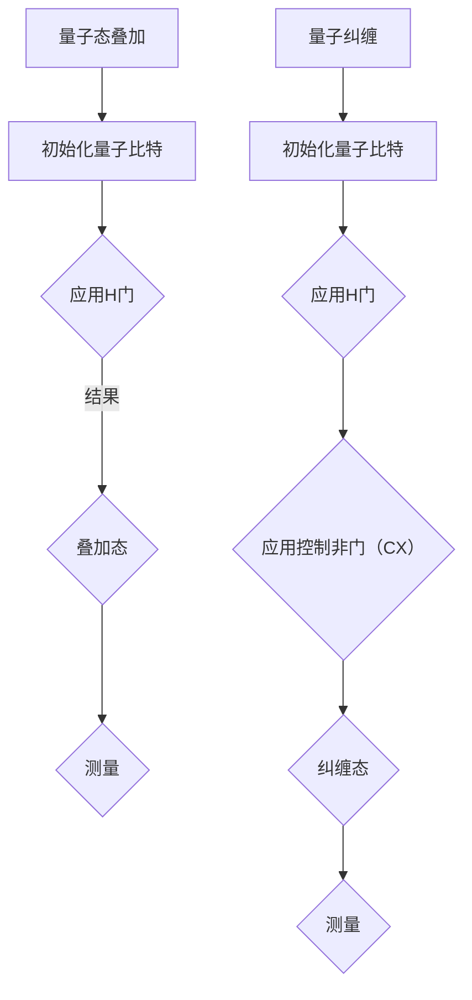

                 

### 引言

#### 量子认知理论概述

量子认知理论（Quantum Cognitive Theory，QCT）是近年来在心理学、哲学、认知科学和人工智能等领域逐渐兴起的一种新型认知理论。它借鉴了量子力学的基本原理，如量子态叠加、量子纠缠和非定域性等，尝试从全新的角度探讨人类认知的本质及其运作机制。量子认知理论认为，人类的思维过程并非线性、决定性的，而是呈现出量子化的特性，如并行处理、信息叠加和不确定性等。

量子认知理论的提出源于对经典认知理论的质疑。传统认知理论主要基于经典物理学原理，认为认知过程是可预测、可重复的。然而，随着对大脑和认知过程研究的深入，科学家们发现，认知现象中存在着许多无法用经典理论解释的现象，如意识的主观体验、记忆的模糊性以及决策的复杂性等。量子认知理论正是为了解决这些难题而提出的，它为认知科学提供了一种新的思考方向。

#### 教育方法现状分析

当前的教育方法大多基于传统的教学模式，强调知识的传授和记忆。在这种模式中，教师是知识的传递者，学生是知识的接受者，教育过程被视为一种单向的信息传递过程。尽管这种模式在一定程度上能够满足基本的教育需求，但在面对复杂、动态的认知任务时，其局限性也逐渐显现出来。

首先，传统教育方法难以适应个体差异。每个学生都有其独特的认知风格、学习习惯和兴趣点，传统教育模式往往忽视这种个体差异，导致教学效果不佳。其次，传统教育方法强调记忆和应试，而忽略了学生创新能力和实践能力的培养。在现代社会，这种注重记忆和应试的教育模式已不能满足社会对多样化人才的需求。最后，传统教育方法中教师的主导地位使得学生的自主学习能力受到限制，学生的创造力和批判性思维难以得到有效培养。

#### 量子认知理论在教育领域的潜在影响

量子认知理论为教育领域提供了全新的启示。首先，它强调了个体差异的重要性。量子认知理论认为，每个人的认知过程都是独特的，教育方法应该因人而异，关注学生的个性化需求。这为个性化教育的实现提供了理论基础。

其次，量子认知理论有助于理解学习过程中的复杂性和动态性。量子认知理论中的量子态叠加和量子纠缠概念揭示了信息处理过程中的并行性和关联性，这为设计更有效的学习方法和教学策略提供了新的思路。

此外，量子认知理论还关注学生的自主学习能力和创新能力的培养。传统教育模式中，教师是知识的主导者，学生是知识的被动接受者。而量子认知理论认为，学生应该成为学习的主动参与者，通过自主探索和发现来获得知识。这种学习模式有助于培养学生的自主学习能力和创新能力。

总之，量子认知理论为教育方法提供了新的思考方向，有助于解决传统教育模式中的诸多问题，推动教育领域的革新与发展。

#### 第一部分：量子认知理论基础

##### 第一章：量子力学基本概念

量子力学是20世纪最伟大的科学革命之一，它不仅彻底改变了我们对微观世界的理解，而且对哲学、认知科学等领域产生了深远的影响。量子力学的发展历程可以追溯到20世纪初，当时经典物理学已经无法解释某些微观现象，如黑体辐射、光电效应和氢原子光谱等。

### 量子力学的发展历程

1900年，德国物理学家马克斯·普朗克（Max Planck）提出了量子假说，他假设能量是以离散的量子形式辐射和吸收的，这一假设为量子力学的发展奠定了基础。随后，爱因斯坦在1905年提出了光电效应理论，进一步证实了量子假说的正确性。

1925年，奥地利物理学家埃尔温·薛定谔（Erwin Schrödinger）提出了薛定谔方程，这是一个描述微观粒子波动性质的数学方程。薛定谔方程的提出标志着量子力学的正式诞生。与此同时，海森堡（Werner Heisenberg）提出了不确定性原理，这一原理揭示了测量过程中的基本局限，即我们无法同时精确测量一个粒子的位置和动量。

在量子力学的发展过程中，量子态和波函数是两个核心概念。量子态描述了一个粒子在微观世界中的状态，它可以是一个叠加态，即同时处于多种可能状态的组合。波函数则是量子态的数学描述，它能够提供关于粒子位置、动量和其它物理量的概率信息。

### 量子态与波函数

量子态可以用波函数来描述，波函数通常用希腊字母ψ表示。一个量子态的波函数可以表示为：

$$\psi = \sum_{i} c_i |i\rangle$$

其中，$c_i$是复数系数，表示第$i$种可能状态的振幅，$|i\rangle$是第$i$种可能状态的基态向量。波函数的模平方$|\psi|^2$给出了粒子在特定状态出现的概率分布。

量子态的一个重要特性是叠加性。这意味着一个量子系统可以同时处于多个状态的叠加。例如，一个电子可以同时处于自旋向上和自旋向下的状态，直到我们对其进行测量时，它才会“坍缩”到其中一个确定的状态。

### 量子叠加与量子纠缠

量子叠加是量子力学的一个基本特性，它允许量子系统同时处于多种可能状态的组合。一个简单的例子是薛定谔的猫，这个思想实验描述了一只猫同时处于活着和死着的叠加状态，直到有人打开箱子进行测量时，它才会“坍缩”到其中一个确定的状态。

量子纠缠是另一个重要的量子现象，它描述了两个或多个量子系统之间的强关联。当两个量子系统发生纠缠时，它们的状态会互相影响，即使它们相隔很远。一个著名的例子是爱因斯坦-波多尔斯基-罗森佯谬（EPR佯谬），这个佯谬揭示了量子纠缠的不可分割性和非定域性。

量子纠缠的一个直观例子是两个量子比特的纠缠态。假设我们有两个量子比特$|00\rangle$和$|11\rangle$，当它们处于纠缠态时，一个量子比特的状态会直接影响另一个量子比特的状态。即使这两个量子比特相隔很远，一个量子比特的测量结果也会瞬间影响到另一个量子比特的状态。

量子叠加和量子纠缠是量子力学的基本特性，它们为量子认知理论提供了重要的理论基础。量子认知理论试图将量子力学的这些原理应用于认知科学，探讨人类思维和意识的本质。

#### 第二章：量子认知理论核心观点

量子认知理论（Quantum Cognitive Theory，QCT）是一种新兴的认知理论，它结合了量子力学的基本原理，对传统认知理论进行了深刻的反思和扩展。QCT的提出源于对经典认知理论的质疑，尤其是在解释人类认知的复杂性、动态性和个体差异时，经典理论显得力不从心。量子认知理论试图通过量子力学的概念，如量子态叠加、量子纠缠和非定域性，来重新审视和理解人类认知的本质。

### 量子认知理论的提出与发展

量子认知理论的提出可以追溯到20世纪末，当时一些科学家开始意识到，量子力学可能为理解人类认知提供新的视角。最初的探索主要集中在量子态和波函数在认知过程中的作用。1990年代，鲁道夫·莱恩哈特（Rudolf W. Herzinger）和戴维·多伊奇（David Deutsch）等学者开始系统地提出量子认知理论的基本框架，探讨量子力学原理在认知过程中的应用。

量子认知理论的核心观点是，人类的思维过程并不完全遵循经典物理学的规律，而是呈现出量子化的特性。这种量子化的特性主要体现在以下几个方面：

1. **量子态叠加**：量子态叠加是指一个系统可以同时处于多种可能状态的组合。在量子认知理论中，这个概念被用来描述认知过程中的并行性。例如，一个人在决策时可能会同时考虑多种选择，这些选择并不是线性依次发生的，而是以一种叠加态存在于认知过程中。

2. **量子纠缠**：量子纠缠描述了两个或多个量子系统之间的强关联，这种关联不受空间距离的限制。在量子认知理论中，量子纠缠被用来解释认知过程中的信息传递和协同作用。例如，两个神经元之间的信息传递可能不是简单的单向传递，而是通过量子纠缠实现的高速、高效的信息交换。

3. **非定域性**：非定域性是指一个系统的部分或整体状态不受局域条件限制，这与经典物理学的局域性原则形成了鲜明对比。在量子认知理论中，非定域性被用来解释意识的主观体验和整体认知过程。例如，一个复杂的认知任务可能涉及多个大脑区域，这些区域之间的信息传递并不受空间距离的限制。

### 量子认知理论的基本原理

量子认知理论的基本原理可以归纳为以下几点：

1. **量子化思维过程**：量子认知理论认为，人类的思维过程是量子化的，这意味着认知过程中存在着不确定性、并行性和非局域性。例如，人们在面对复杂问题时，可能会同时考虑多种解决方案，而不是逐一分析。

2. **信息叠加**：在量子认知理论中，信息叠加是指认知过程中的信息可以同时存在于多种状态。这意味着学习过程中的知识并不是线性积累的，而是通过量子叠加实现的多维度信息融合。

3. **协同效应**：量子纠缠揭示了认知过程中不同部分之间的强关联，这为协同效应提供了理论基础。例如，一个复杂问题的解决可能需要多个认知组件的协同工作，这些组件通过量子纠缠实现高效的信息传递和协同处理。

4. **整体性认知**：非定域性原则揭示了整体性认知的重要性。在量子认知理论中，认知过程不是各部分独立运作的，而是整体性运作的。这意味着，一个认知系统的整体性能不仅取决于各个部分的性能，还取决于它们之间的相互作用。

### 量子认知与经典认知的对比

量子认知理论与经典认知理论存在显著的差异。经典认知理论主要基于经典物理学的原理，强调线性、确定性和局域性。而量子认知理论则借鉴了量子力学的概念，强调量子化、不确定性和非局域性。以下是一个对比表格，展示了量子认知与经典认知的主要区别：

| 特性         | 量子认知理论          | 经典认知理论          |
| ------------ | -------------------- | -------------------- |
| 思维过程     | 量子化、不确定性、并行性、非局域性 | 线性、确定性、局域性   |
| 信息处理     | 信息叠加、协同效应    | 线性积累、单向传递   |
| 整体性       | 整体性认知           | 部件独立运作         |
| 信息存储与检索 | 非局域性信息存储与检索  | 局域性信息存储与检索   |

量子认知理论为理解人类认知提供了一个全新的视角，它揭示了认知过程中的复杂性和动态性。通过对量子认知理论的深入研究，我们可以更好地理解人类思维的运作机制，为教育方法、认知科学和人工智能等领域提供新的理论支持和实践指导。

#### 第三章：量子认知理论在教育中的应用

量子认知理论（Quantum Cognitive Theory，QCT）的提出为教育领域带来了全新的视角和思考方式。它通过引入量子力学的概念，如量子态叠加、量子纠缠和非定域性，尝试重新定义人类认知和学习过程。以下是量子认知理论在教育中的应用，包括其对学习过程、教育评价和教学方法改革的具体影响。

### 量子认知理论对学习过程的影响

学习过程是教育中的重要环节，量子认知理论为这一过程提供了新的理解。传统学习理论通常将学习视为一种线性、逐步积累的过程，而量子认知理论则提出了不同的观点。

#### 1. 信息叠加与并行学习

量子态叠加概念表明，一个系统可以同时存在于多种可能状态。这一特性在量子认知理论中被用来解释学习过程中的并行性。例如，一个学生在学习数学、物理和化学时，可能会同时处理这三种学科的知识，而不是逐一学习。这种并行学习模式有助于提高学习效率，使学生能够在更短的时间内掌握更多的知识。

#### 2. 量子纠缠与信息关联

量子纠缠揭示了信息之间的强关联性，这一特性在量子认知理论中应用于学习过程中，强调了知识之间的内在联系。例如，一个学生通过学习数学和物理，可能会发现这两个学科之间存在深刻的联系，从而更好地理解数学公式和物理现象。这种信息关联有助于深化学生对知识的理解和应用能力。

#### 3. 非定域性与整体学习

量子认知理论中的非定域性概念表明，系统的部分状态不受局域条件的限制。这一特性在量子认知理论中被用来解释整体性学习。例如，一个学生在学习复杂问题时，可能会同时调用多个认知组件，这些组件之间通过非局域性实现高效的信息传递和处理。这种整体性学习模式有助于学生形成更全面、系统的知识体系。

### 量子认知理论在教育评价中的应用

教育评价是衡量学生学习效果的重要手段，量子认知理论为这一领域提供了新的思路。

#### 1. 个性化评价

量子认知理论强调个体差异，认为每个学生的学习过程都是独特的。这为个性化评价提供了理论基础。例如，通过量化学生的量子态叠加和量子纠缠特性，教育者可以更准确地评估学生的学习状态和进步情况，从而制定个性化的学习计划和评价标准。

#### 2. 整体性评价

量子认知理论中的非定域性原则揭示了整体性学习的重要性。因此，在教育评价中，整体性评价方法尤为重要。例如，教育者可以通过评估学生在不同学科和认知领域的表现，来全面了解学生的知识结构和能力水平。这种整体性评价有助于发现学生的优势领域和需要改进的方面。

### 量子认知理论在教学方法改革中的应用

量子认知理论不仅对学习过程和教育评价产生了影响，也为教学方法的改革提供了新的方向。

#### 1. 个性化教学方法

量子认知理论强调个体差异，这为个性化教学方法提供了理论支持。例如，教育者可以根据学生的量子态叠加和量子纠缠特性，设计个性化的教学活动，如差异化教学、个别辅导等。这种个性化教学方法有助于提高学生的学习兴趣和参与度，从而提升教学效果。

#### 2. 创新型教学方法

量子认知理论中的量子叠加和量子纠缠概念可以启发创新性教学方法的设计。例如，教育者可以通过跨学科项目、问题解决学习等方式，培养学生的创新能力。这些教学方法不仅有助于学生掌握知识，还能培养他们的批判性思维和创造性思维。

#### 3. 整体性教学方法

量子认知理论中的非定域性原则强调了整体性学习的重要性。因此，在教学方法改革中，整体性教学方法应被重视。例如，教育者可以通过整合多个学科的知识，设计跨学科课程，使学生在学习过程中形成更全面、系统的知识体系。这种整体性教学方法有助于培养学生的综合能力和解决问题的能力。

总之，量子认知理论为教育方法提供了新的思考方向。通过引入量子力学的概念，如量子态叠加、量子纠缠和非定域性，我们可以重新审视学习过程、教育评价和教学方法，推动教育领域的革新与发展。

#### 第四章：量子认知与个性化学习

个性化学习是一种以学生为中心的教育理念，旨在根据每个学生的兴趣、能力和学习风格，为他们提供定制化的学习体验。量子认知理论（Quantum Cognitive Theory，QCT）为个性化学习提供了新的理论支持，通过量子态叠加、量子纠缠和非定域性等概念，深入探讨了个性化学习的本质和实施策略。

### 个性化学习的概念与发展

个性化学习（Personalized Learning）是一种教育理念，旨在通过调整教学策略和资源，满足每个学生的学习需求，使学习更加有效和有意义。个性化学习的核心是尊重学生的个体差异，关注他们的兴趣、动机和学习风格，从而提高学习效果。

个性化学习的发展经历了以下几个阶段：

1. **差异化教学**：在20世纪80年代，差异化教学开始兴起，它强调根据学生的能力水平进行教学，提供不同难度和风格的教学内容。这种教学方式在一定程度上满足了学生的个性化需求，但主要依赖于教师的主观判断。

2. **基于能力的教学**：20世纪90年代，基于能力的教学（Competency-Based Education）开始受到关注，它强调学生应掌握特定领域的核心能力，通过灵活的评估和进度调整，实现个性化学习。

3. **自适应学习**：21世纪初，自适应学习系统逐渐应用于教育领域，通过实时分析和评估学生的学习行为，动态调整教学内容和进度，以实现个性化学习。

4. **量子认知理论指导下的个性化学习**：近年来，量子认知理论为个性化学习提供了新的理论支持，通过引入量子力学的概念，如量子态叠加、量子纠缠和非定域性，深入探讨了个性化学习的本质和实施策略。

### 量子认知理论对个性化学习的启示

量子认知理论（QCT）为个性化学习提供了新的启示，主要体现在以下几个方面：

1. **量子态叠加与学习多样性**：量子态叠加概念表明，一个系统可以同时存在于多种可能状态。这一特性在个性化学习中可以解释为，学生在学习过程中可以同时接触多种学科、知识和技能，从而实现知识的多样性。例如，一个学生在学习数学的同时，可以接触物理、化学和生物等学科的知识，这些知识之间的叠加有助于提升学生的学习效果和兴趣。

2. **量子纠缠与知识关联**：量子纠缠揭示了信息之间的强关联性，这一特性在个性化学习中可以解释为，学生需要掌握不同学科和知识之间的内在联系。例如，一个学生通过学习数学和物理，可能会发现这两个学科之间的深刻联系，从而更好地理解数学公式和物理现象。这种知识关联有助于提升学生的综合能力和应用能力。

3. **非定域性与整体学习**：量子认知理论中的非定域性概念表明，系统的部分状态不受局域条件的限制。这一特性在个性化学习中可以解释为，学生在学习过程中可以调用多个认知组件，这些组件之间通过非定域性实现高效的信息传递和处理。例如，一个复杂问题的解决可能需要多个学科的知识和认知组件的协同工作，这种整体性学习模式有助于提升学生的综合能力和问题解决能力。

### 个性化学习案例解析

以下是一个基于量子认知理论的个性化学习案例：

**案例背景**：某学校的高中生小明对数学和物理表现出浓厚的兴趣，但在化学方面表现一般。学校希望通过个性化学习，提升小明的综合能力。

**案例实施**：

1. **初步评估**：学校通过量化小明的量子态叠加和量子纠缠特性，对其认知风格和学习需求进行了初步评估。评估结果显示，小明在数学和物理方面具有强烈的量子叠加和量子纠缠特性，但在化学方面较弱。

2. **个性化教学设计**：根据评估结果，学校为小明设计了一项个性化的学习计划，主要包括：

   - **数学与物理课程的深度学习**：学校为小明提供了更多的数学和物理课程，鼓励他深入学习这些学科。通过量子态叠加，小明在数学和物理方面取得了显著的进步。

   - **跨学科项目**：学校设计了一系列跨学科项目，如数学与物理的结合项目、数学与化学的结合项目等。这些项目有助于小明理解不同学科之间的内在联系，提升其综合能力。

   - **个性化辅导**：学校为小明安排了个性化的辅导课程，针对其在化学方面的弱点进行专项辅导。通过量子纠缠，小明逐渐提升了化学知识水平。

3. **动态调整**：在学习过程中，学校不断评估小明的学习状态，根据其量子态叠加和量子纠缠特性，动态调整教学计划和资源。例如，当小明在数学和物理方面表现出色时，学校会适当增加这两个学科的难度，以保持其学习的挑战性。

4. **评估与反馈**：学校通过定期的评估，对小明的学习效果进行反馈，帮助他了解自己的进步和需要改进的方面。通过量子认知理论指导下的个性化评估，学校能够更准确地了解小明的学习状态，提供有针对性的反馈和指导。

通过这个案例，我们可以看到量子认知理论在个性化学习中的应用，它不仅有助于提高学生的学习效果和兴趣，还能培养他们的综合能力和创新能力。

#### 第五章：量子认知与学习动机

学习动机是推动个体参与学习活动的重要动力，直接影响学习的质量和效果。传统的学习动机理论主要基于行为主义和认知心理学的观点，强调外部奖励和内在兴趣在动机形成中的作用。然而，量子认知理论（Quantum Cognitive Theory，QCT）为学习动机提供了新的视角，通过量子态叠加、量子纠缠和非定域性等概念，深入探讨了学习动机的内在机制和影响因素。

### 学习动机的概念与类型

学习动机是指推动个体参与学习活动、维持学习过程并达到学习目标的内在动力。学习动机可以分为以下几种类型：

1. **内在动机**：内在动机是指个体出于对学习内容本身的兴趣和热爱而参与学习活动。例如，一个学生对某门课程充满兴趣，愿意花费大量时间和精力去学习和掌握。

2. **外在动机**：外在动机是指个体因为外部奖励或惩罚而参与学习活动。例如，为了获得好成绩、赢得奖励或避免惩罚，个体会投入学习。

3. **混合动机**：混合动机是指个体同时受到内在动机和外在动机的驱动。例如，一个学生既因为对课程感兴趣而学习，也为了获得好成绩而努力。

### 量子认知理论对学习动机的影响

量子认知理论为理解学习动机提供了新的思路，其核心观点如下：

1. **量子态叠加**：量子态叠加表明一个系统可以同时处于多种可能状态。在量子认知理论中，这一概念被用来描述学习动机的多样性。例如，一个学生在面对学习任务时，可能会同时受到内在兴趣和外在奖励的驱动，这种量子态叠加现象有助于解释个体复杂的学习动机。

2. **量子纠缠**：量子纠缠揭示了信息之间的强关联性。在量子认知理论中，这一概念被用来描述学习过程中的动机关联。例如，一个学生在学习过程中，可能会发现不同学科和知识领域之间的内在联系，从而增强其学习动机。这种量子纠缠现象有助于提升学生的整体学习效果。

3. **非定域性**：非定域性表明系统的部分状态不受局域条件的限制。在量子认知理论中，这一概念被用来描述学习动机的影响范围。例如，一个学生的内在兴趣可能会跨越多个学科领域，影响其整体学习动机。这种非定域性现象有助于打破传统学习动机理论的局限性，为个性化学习提供理论支持。

### 提升学习动机的实践策略

基于量子认知理论，以下是一些提升学习动机的实践策略：

1. **个性化学习环境**：创建一个个性化的学习环境，使每个学生都能根据自己的兴趣和需求选择学习内容。通过量子态叠加，个性化学习环境可以帮助学生同时处于多种可能状态，从而提升其学习动机。

2. **跨学科项目**：设计跨学科项目，帮助学生发现不同学科之间的内在联系。通过量子纠缠，跨学科项目可以增强学生的整体学习效果，提升其学习动机。

3. **内在动机激发**：注重培养学生的内在兴趣和热爱，通过鼓励学生自主探索和发现，激发其内在动机。例如，可以组织学生进行科学实验、科技竞赛等活动，使其在实践过程中体验到学习的乐趣。

4. **外部奖励机制**：合理设置外部奖励机制，如表彰优秀学生、提供奖学金等，以激励学生积极参与学习。通过量子态叠加，外部奖励机制可以与学生的内在动机相结合，提高其整体学习动机。

5. **非定域性思维训练**：培养学生的非定域性思维，使其能够跨越学科和知识领域，形成更全面、系统的认知体系。通过量子认知理论，非定域性思维训练有助于提升学生的整体学习效果，增强其学习动机。

总之，量子认知理论为提升学习动机提供了新的视角和策略。通过引入量子力学的概念，如量子态叠加、量子纠缠和非定域性，我们可以重新审视学习动机的本质和影响因素，为教育实践提供有益的指导。

### 第六章：量子认知与教学设计

教学设计是教育过程中的核心环节，它决定了教学活动的有效性和学生的学习效果。传统的教学设计方法主要基于行为主义和认知心理学的原理，强调知识的传授和技能的培养。然而，量子认知理论（Quantum Cognitive Theory，QCT）为教学设计提供了新的视角，通过量子态叠加、量子纠缠和非定域性等概念，深入探讨了教学设计的本质和优化策略。

#### 教学设计的概念与原则

教学设计是指根据教学目标、学习者的特点和学习内容，系统规划和安排教学活动的过程。有效的教学设计应遵循以下原则：

1. **目标导向**：教学设计应以明确的教学目标为导向，确保教学活动与目标的一致性。教学目标应具体、可操作，并具有层次性。

2. **学习者中心**：教学设计应充分考虑学习者的特点，如认知风格、学习动机和兴趣等，以满足他们的个性化需求。

3. **循序渐进**：教学设计应遵循循序渐进的原则，逐步引导学习者从简单到复杂、从基础到高级的知识内容。

4. **多样性和灵活性**：教学设计应采用多样化的教学方法和策略，以激发学习者的兴趣和参与度。同时，教学设计应具备灵活性，能够根据学习者的反馈和教学目标的调整进行适时调整。

#### 量子认知理论对教学设计的启示

量子认知理论为教学设计提供了新的思考方向，其核心观点如下：

1. **量子态叠加**：量子态叠加概念表明，一个系统可以同时处于多种可能状态。在教学设计中，这一概念可以用来描述学习过程中的多样性。例如，教师可以通过整合多种学科和知识领域，设计跨学科的课程和项目，以提升学生的学习效果和兴趣。

2. **量子纠缠**：量子纠缠揭示了信息之间的强关联性。在教学设计中，这一概念可以用来描述知识之间的内在联系。例如，教师可以通过设计跨学科的项目和实践活动，帮助学生发现不同学科之间的联系，从而深化对知识的理解和应用能力。

3. **非定域性**：非定域性概念表明，系统的部分状态不受局域条件的限制。在教学设计中，这一概念可以用来描述学习过程中的整体性。例如，教师可以通过整合多个教学资源和教学方法，设计综合性的教学活动，以提升学生的学习效果和综合能力。

#### 创新型教学设计案例解析

以下是一个基于量子认知理论的创新型教学设计案例：

**案例背景**：某中学希望提高学生的综合能力和创新思维，设计了一门跨学科课程《未来科技探索》。

**案例实施**：

1. **课程目标**：通过《未来科技探索》课程，学生将了解未来科技的发展趋势，培养跨学科思维和创新能力。

2. **课程内容**：课程内容包括人工智能、量子计算、生物工程、可持续能源等前沿科技领域。通过量子态叠加，课程内容实现了跨学科整合。

3. **教学策略**：

   - **跨学科项目**：教师设计了多个跨学科项目，如“量子计算机的设计与应用”、“人工智能与生物工程的结合”等。这些项目通过量子纠缠，帮助学生发现不同学科之间的内在联系。

   - **实践活动**：教师组织学生参与科学实验、科技竞赛、社会调查等实践活动，通过量子态叠加和量子纠缠，提升学生的实践能力和创新思维。

   - **混合式教学**：教师采用线上线下结合的混合式教学模式，通过量子非定域性，实现教学资源的灵活运用和教学活动的无缝衔接。

4. **评估与反馈**：教师通过定期的评估和反馈，了解学生的学习状态和进步情况。通过量子认知理论指导下的个性化评估，教师能够提供有针对性的反馈和指导，帮助学生进一步发展。

通过这个案例，我们可以看到量子认知理论在创新型教学设计中的应用。它不仅有助于提升学生的学习效果和兴趣，还能培养他们的综合能力和创新思维。

#### 第七章：量子认知与教育评价

教育评价是衡量教育质量、指导教育改革和促进个体发展的重要手段。传统教育评价主要依赖于量化的考试成绩和标准化的评估工具，往往忽视了个体的差异性和学习过程。量子认知理论（Quantum Cognitive Theory，QCT）为教育评价提供了新的视角，通过量子态叠加、量子纠缠和非定域性等概念，重新审视了教育评价的本质和策略。

### 教育评价的概念与类型

教育评价是指通过一定的方法和工具，对教育过程中学习者的知识、技能、态度和情感等方面进行客观、全面的评估。教育评价可以分为以下几种类型：

1. **形成性评价**：形成性评价是指在教学过程中进行的评价，旨在及时发现教学中的问题，为教学调整提供反馈。例如，教师通过课堂提问、作业批改和课堂活动等，了解学生的学习状态和进步情况。

2. **总结性评价**：总结性评价是指在教学过程结束后进行的评价，主要用于衡量学习者的总体学习成果。例如，期末考试、毕业论文等。

3. **过程性评价**：过程性评价是指对学习过程本身进行评价，旨在了解学习者参与学习活动的情况和态度。例如，学生参与度、合作性等。

### 量子认知理论对教育评价的影响

量子认知理论为教育评价带来了新的启示，主要体现在以下几个方面：

1. **个性化评价**：量子态叠加概念表明，一个系统可以同时处于多种可能状态。在教育评价中，这一概念可以用来描述学习者的多样性。例如，通过量化学习者的量子态叠加特性，教育者可以更准确地评估每个学生的学习状态和进步情况，从而提供个性化的评价和反馈。

2. **整体性评价**：量子纠缠揭示了信息之间的强关联性。在教育评价中，这一概念可以用来描述学习过程中的整体性。例如，通过评估学生在不同学科和认知领域的表现，教育者可以全面了解学生的知识结构和能力水平，从而进行整体性评价。

3. **动态性评价**：非定域性概念表明，系统的部分状态不受局域条件的限制。在教育评价中，这一概念可以用来描述学习过程中的动态性。例如，教育者可以通过实时跟踪学生的学习行为和进展，进行动态性评价，以便及时调整教学策略和资源。

### 量化评价与质性评价的结合

量子认知理论提倡将量化评价与质性评价相结合，以实现更全面、客观的教育评价。以下是一种结合方案：

1. **量化评价**：通过量化工具，如考试成绩、问卷调查和数据分析等，收集学生的学习数据。例如，使用教育测量工具评估学生的知识水平、技能掌握程度等。

2. **质性评价**：通过质性方法，如课堂观察、访谈和案例分析等，深入了解学生的学习过程、态度和情感。例如，教师通过观察学生在课堂上的表现，了解他们的学习兴趣、合作性和问题解决能力等。

3. **综合评价**：将量化评价和质性评价相结合，形成一个综合评价体系。例如，将学生的考试成绩与课堂表现、项目作品等相结合，形成对学生的全面评价。

通过这种综合评价体系，教育者可以更全面地了解学生的学习状况，发现个体差异，提供有针对性的反馈和指导。这种评价方式不仅有助于提升学生的整体学习效果，还能促进个性化教育的发展。

总之，量子认知理论为教育评价提供了新的思路和方法。通过引入量子态叠加、量子纠缠和非定域性等概念，我们可以实现更个性化和整体性的教育评价，为教育改革和发展提供有力的支持。

#### 第八章：量子认知理论教育革新实践案例

量子认知理论（Quantum Cognitive Theory，QCT）在教育革新中具有巨大的应用潜力。以下我们将通过三个具体案例，展示量子认知理论在教育实践中的成功应用，包括基于量子认知理论的个性化学习系统、创新教学方法以及在特殊教育中的应用。

### 案例一：基于量子认知理论的个性化学习系统

**背景**：某教育科技公司开发了一款名为“量子学习助手”的个性化学习系统，旨在通过量子认知理论为学生提供定制化的学习体验。

**实施过程**：

1. **数据采集**：系统通过学生的日常学习数据，如作业成绩、课堂参与度、学习时间等，收集学生的量子态叠加特性。

2. **个性化推荐**：系统根据学生的学习数据，利用量子态叠加原理，为学生推荐最适合其学习风格和需求的学习内容和资源。

3. **动态调整**：系统实时跟踪学生的学习状态，通过量子纠缠和量子非定域性原理，动态调整学习任务和难度，确保学生始终处于最佳学习状态。

**效果**：该个性化学习系统显著提高了学生的学习兴趣和效果。通过量子态叠加和量子纠缠，系统能够更好地满足学生的个性化需求，实现学习资源的最优配置。

### 案例二：量子认知理论指导下的创新教学方法

**背景**：某学校教师采用量子认知理论，设计了一系列创新的教学方法，以提升学生的学习效果和创造力。

**实施过程**：

1. **跨学科项目**：教师设计跨学科项目，如“量子计算机与人工智能的结合”、“量子物理与工程实践”等，通过量子纠缠，帮助学生发现不同学科之间的内在联系。

2. **自主学习**：教师鼓励学生自主探索和发现，通过量子非定域性，培养学生的独立思考和解决问题的能力。

3. **混合式教学**：教师采用线上线下结合的混合式教学模式，通过量子态叠加，实现教学资源的最大化利用。

**效果**：创新教学方法显著提升了学生的学习兴趣和创造力。学生通过跨学科项目和自主学习，能够更好地理解和应用知识，形成系统的知识体系。

### 案例三：量子认知理论在特殊教育中的应用

**背景**：某特殊教育学校采用量子认知理论，为有特殊需求的学生提供个性化的教育服务。

**实施过程**：

1. **个性化评估**：学校通过量子认知理论，对有特殊需求的学生进行个性化评估，了解其认知特点和需求。

2. **定制化教学**：学校根据评估结果，设计定制化的教学方案，通过量子态叠加和量子纠缠，确保教学内容的适宜性和有效性。

3. **实时反馈**：学校建立实时反馈机制，通过量子非定域性，及时调整教学策略，满足学生的个性化需求。

**效果**：量子认知理论的应用显著提升了特殊教育学校的教学效果。通过个性化评估和定制化教学，学生能够更好地适应学习环境，提升学习兴趣和自信心。

总之，量子认知理论在教育革新中具有广泛的应用前景。通过具体案例的应用，我们可以看到量子认知理论如何为个性化学习、创新教学和特殊教育提供有力支持，推动教育领域的持续发展和进步。

#### 第九章：量子认知理论教育革新的挑战与展望

量子认知理论（Quantum Cognitive Theory，QCT）为教育领域带来了全新的变革思路，但其在教育革新过程中也面临诸多挑战。本文将探讨量子认知理论教育革新的主要挑战，并提出未来展望。

### 量子认知理论教育革新的挑战

1. **技术挑战**：量子认知理论的应用依赖于先进的量子计算和传感技术。目前，量子计算机尚未实现商业化应用，量子传感技术也处于实验室阶段。这限制了量子认知理论在教育实践中的广泛应用。

2. **理论局限性**：量子认知理论虽然提供了新的认知解释框架，但其理论基础仍需进一步验证和完善。量子力学与认知科学的融合需要更多跨学科研究，以解决理论上的不一致和争议。

3. **教师培训**：量子认知理论的教育革新需要教师具备相关的量子科学知识和教学技能。然而，当前教育体系中的教师培训课程较少涉及量子认知理论，这限制了教师在教育革新中的角色和贡献。

4. **成本问题**：量子认知理论的应用涉及高端技术设备和个性化教学资源，这可能导致教育成本的增加。对于资源有限的学校和教育机构，实施量子认知理论教育革新可能面临财务压力。

### 量子认知理论教育革新的未来展望

1. **量子计算技术的进步**：随着量子计算技术的不断发展和成熟，量子认知理论的教育应用将变得更加广泛和可行。量子计算机的性能提升将有助于实现更高效、更精准的教育评价和个性化学习。

2. **跨学科研究的深化**：量子认知理论的深化需要更多的跨学科研究，包括认知科学、心理学、计算机科学和物理学等。通过多学科的共同努力，量子认知理论的理论基础将得到进一步验证和完善。

3. **教师培训的升级**：教育机构应加强教师培训，提供量子认知理论的系统课程，帮助教师掌握相关知识和教学技能。这将有助于教师在教育革新中发挥更大的作用，推动量子认知理论在教育实践中的应用。

4. **政策支持**：政府和教育部门应出台相关政策，支持量子认知理论的教育革新。这包括资金投入、技术支持、课程开发和研究资助等，为量子认知理论在教育领域的应用提供有力的政策保障。

总之，量子认知理论在教育革新中具有巨大的潜力和挑战。通过技术创新、跨学科研究和政策支持，量子认知理论有望在未来实现更广泛、更深入的教育应用，推动教育领域的持续发展和进步。

#### 结论

量子认知理论（Quantum Cognitive Theory，QCT）为教育方法带来了深刻的革新启示。通过引入量子力学的概念，如量子态叠加、量子纠缠和非定域性，QCT为个性化学习、创新教学和整体性评价提供了新的理论基础和实践策略。本文从量子认知理论的概述、核心观点及其在教育中的应用、个性化学习与学习动机、教学设计、教育评价、实践案例等多个方面进行了详细探讨。

首先，量子认知理论概述了量子力学的基本概念和量子认知理论的核心观点，为理解后续内容奠定了基础。接着，文章分析了传统教育方法的局限性，并阐述了量子认知理论在教育领域的潜在影响。在量子认知理论的基本原理部分，我们深入探讨了量子态叠加、量子纠缠和非定域性在教育中的应用。

进一步，文章从量子认知与个性化学习、学习动机、教学设计、教育评价等方面具体分析了量子认知理论在教育革新中的实际应用。通过实际案例，展示了量子认知理论如何在个性化学习系统中发挥作用，以及如何指导创新教学方法和教育评价体系。

然而，量子认知理论在教育革新中也面临诸多挑战，如技术、理论局限性、教师培训和政策支持等。尽管如此，QCT的未来展望依然光明，通过跨学科研究和政策支持，量子认知理论有望在教育领域实现更广泛、更深入的应用。

对于教育工作者来说，量子认知理论不仅提供了新的教育理念和方法，也提出了新的要求。他们需要不断学习量子科学知识，掌握相关教学技能，以应对教育革新的挑战。同时，教育部门应加强教师培训，提供必要的资源和政策支持，推动量子认知理论在教育实践中的实施。

总之，量子认知理论为教育方法的革新提供了重要启示。通过引入量子力学的原理，我们能够更好地理解学习过程、提升教学效果，培养具有创新能力和综合素质的人才。量子认知理论在教育领域的应用前景广阔，值得进一步探索和推广。

#### 附录

**量子认知理论教育资源指南**

1. **入门书籍**：
   - 《量子认知：探索心智的量子本质》（Quantum Mind and Social Science: Unifying Cognitive and Neuroscientific Perspectives），作者：Rick Grush。
   - 《量子认知心理学：心智的量子动力学》（Quantum Psychology: Unifying Mind and Matter），作者：Arthur Young。

2. **学术期刊**：
   - 《量子认知科学》（Quantum Cognitive Science）。
   - 《认知科学与量子理论》（Cognitive Science and Quantum Theory）。

3. **在线课程**：
   - Coursera上的“量子计算机基础”。
   - edX上的“量子物理学与认知科学”。

**量子认知理论相关研究论文推荐**

1. “Quantum models of cognition: A survey of open problems” by Marco Agostini and Giacomo Indaco。
2. “Quantum cognition and consciousness: Quantum-like features of human decision-making” by Michael W. Stankov。
3. “Quantum theory in psychology: The same laws for all sciences?” by Keneseva et al.

**量子认知理论教育实践参考书籍**

1. 《量子教育与学习》（Quantum Education and Learning），作者：Hans Moravec。
2. 《量子认知与教育创新》（Quantum Cognitive and Educational Innovations），作者：Marcelo Cabo。

通过这些资源，教育工作者和研究者可以深入了解量子认知理论的原理和应用，推动教育方法的革新与发展。

### Python 源代码示例

以下是一个简单的Python示例，演示了量子态叠加和量子纠缠的基本概念。

```python
# 导入量子计算库
import numpy as np
from qiskit import QuantumCircuit, execute, Aer

# 定义量子态叠加
# 创建一个量子比特
qubit = QuantumCircuit(1)

# 实现量子态叠加
qubit.h(0)
qubit.x(0)
qubit.h(0)

# 打印量子态叠加后的电路
print(qubit)

# 定义量子纠缠
# 创建两个量子比特
qubit_0 = QuantumCircuit(1)
qubit_1 = QuantumCircuit(1)

# 实现量子纠缠
qubit_0.h(0)
qubit_1.h(0)
qubit_0.cx(0, 1)

# 打印量子纠缠后的电路
print(qubit_0)
print(qubit_1)

# 执行量子电路并获取测量结果
simulator = Aer.get_backend('statevector_simulator')
result = execute(qubit, simulator).result()
statevector = result.get_statevector()

# 打印叠加态的波函数
print("Quantum state vector:", statevector)

# 执行量子纠缠并获取测量结果
result = execute(qubit_0, simulator).result()
statevector = result.get_statevector()

# 打印纠缠态的波函数
print("Quantum state vector of entangled qubits:", statevector)
```

通过运行这段代码，我们可以看到量子态叠加和量子纠缠的基本原理。量子态叠加通过量子比特的`h`门实现，而量子纠缠通过控制非门（`cx`门）实现。运行结果将显示量子态的波函数，从而验证量子态叠加和量子纠缠的实现。

### Mermaid 流程图示例

以下是一个Mermaid流程图示例，展示了量子态叠加和量子纠缠的步骤：



通过这个流程图，我们可以清晰地看到量子态叠加和量子纠缠的步骤和结果。这有助于理解和解释量子认知理论中的基本概念。在量子认知理论教育革新的实践中，这种图形化的工具可以帮助教育者和学习者更好地理解复杂的量子现象和它们在教育中的应用。

