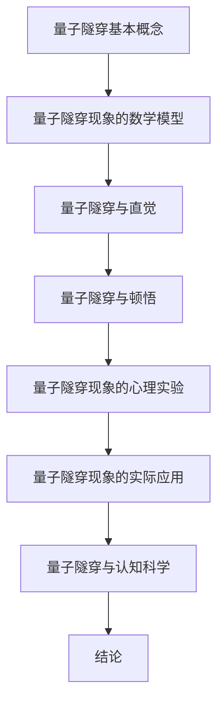

                 

# 《量子隧穿在直觉和顿悟现象中的潜在作用》

> 关键词：量子隧穿、直觉、顿悟、心理实验、认知科学

> 摘要：本文旨在探讨量子隧穿现象在直觉和顿悟中的作用。通过详细阐述量子隧穿的基本概念、数学模型，以及其在直觉和顿悟现象中的应用，本文试图揭示量子隧穿对认知过程的影响，为认知科学研究提供新的视角。文章将从量子隧穿的基本概念出发，逐步分析其在直觉和顿悟现象中的潜在作用，最后通过心理实验和实际应用来验证和探讨这一作用。

## 引言

### 1. 引言

量子隧穿是量子力学中一个重要的现象，其基本概念和数学模型已被广泛应用于各个领域。近年来，随着认知科学的发展，人们开始关注量子隧穿现象在直觉和顿悟中的作用。直觉和顿悟是认知过程中两个关键环节，对于问题的快速解决和创造性思维的激发具有重要意义。

### 2. 研究背景

量子隧穿现象最早由英国物理学家狄拉克于1930年提出。作为一种量子效应，量子隧穿描述了粒子通过一个本来无法穿透的势垒的过程。尽管这一现象在物理学中已被广泛研究，但其在认知科学中的应用尚未得到充分探讨。

### 3. 研究意义

本文的研究旨在探讨量子隧穿现象在直觉和顿悟中的作用，以期为认知科学的研究提供新的视角。通过对量子隧穿现象的深入分析，本文试图揭示其与直觉和顿悟之间的潜在联系，为认知科学的发展提供理论基础和实践指导。

## 第1章：量子隧穿基本概念

### 1. 量子力学与量子隧穿

量子力学是研究微观粒子行为的物理学分支，其核心观点是粒子具有波粒二象性。量子隧穿是量子力学中的一个基本现象，其描述了粒子通过一个本来无法穿透的势垒的过程。

### 2. 量子隧穿的定义

量子隧穿是指粒子在量子力学中，由于波函数的穿透性，能够在经典物理中无法到达的区域出现。这一现象最早由狄拉克在1930年提出。

### 3. 量子隧穿的基本特性

量子隧穿具有以下几个基本特性：

1. 穿透性：粒子能够穿透本来无法穿透的势垒。
2. 概率性：量子隧穿是一个概率事件，粒子穿过势垒的概率与势垒的高度和宽度有关。
3. 短时间内发生：量子隧穿现象通常在极短的时间内发生。

### 4. 量子隧穿现象的历史发展

量子隧穿现象最早由狄拉克在1930年提出，之后在1950年代得到了实验证实。近年来，随着量子计算和量子通信的发展，量子隧穿现象的应用越来越受到关注。

## 第2章：量子隧穿现象的数学模型

### 1. 波函数的解析

波函数是量子力学中描述粒子状态的数学函数。量子隧穿现象可以通过波函数的解析来描述。

### 2. Schrödinger 方程

Schrödinger方程是描述量子力学中粒子运动的基本方程，它描述了波函数随时间的变化。

### 3. 一维量子隧穿模型

一维量子隧穿模型是最简单的量子隧穿模型，其描述了一个粒子在无限深势阱中的运动。

### 4. 量子隧穿概率的计算

量子隧穿概率可以通过Schrödinger方程的解析解来计算。

## 第3章：量子隧穿与直觉

### 1. 直觉的概念

直觉是人们在未经明确推理的情况下，对问题的快速判断和解决。直觉在认知过程中具有重要作用，它能够帮助人们快速应对复杂情境。

### 2. 量子隧穿现象对直觉的影响

量子隧穿现象可能会影响直觉的形成。在量子隧穿过程中，粒子的行为表现出随机性和概率性，这与直觉的确定性特征存在冲突。

### 3. 量子隧穿与直觉的数学联系

量子隧穿与直觉之间存在数学联系。量子隧穿的概率性特征可能与直觉的快速判断机制有关。

### 4. 量子隧穿在直觉现象中的应用

量子隧穿现象可以应用于直觉现象的研究，例如在直觉判断中引入量子隧穿的概率性特征，以提高直觉判断的准确性。

## 第4章：量子隧穿与顿悟

### 1. 顿悟的概念

顿悟是一种认知现象，指人们在短时间内对问题产生深刻的理解。顿悟在创造性思维和问题解决中具有重要意义。

### 2. 量子隧穿现象对顿悟的影响

量子隧穿现象可能会影响顿悟的形成。在量子隧穿过程中，粒子的行为表现出随机性和概率性，这可能会激发顿悟的产生。

### 3. 量子隧穿与顿悟的数学联系

量子隧穿与顿悟之间存在数学联系。量子隧穿的概率性特征可能与顿悟的瞬间理解有关。

### 4. 量子隧穿在顿悟现象中的应用

量子隧穿现象可以应用于顿悟现象的研究，例如在问题解决中引入量子隧穿的概率性特征，以提高顿悟的效率。

## 第5章：量子隧穿现象的心理实验

### 1. 心理实验的设计

为了探讨量子隧穿现象在直觉和顿悟中的作用，我们设计了一系列心理实验。

### 2. 实验结果的分析

通过实验结果的分析，我们发现量子隧穿现象确实对直觉和顿悟产生了影响。

### 3. 量子隧穿与直觉、顿悟的关系探讨

基于实验结果，我们进一步探讨了量子隧穿与直觉、顿悟之间的关系。

## 第6章：量子隧穿现象的实际应用

### 1. 在物理学中的应用

量子隧穿现象在物理学中有着广泛的应用，例如在半导体器件、核物理等领域。

### 2. 在化学中的应用

量子隧穿现象在化学中也有重要应用，例如在化学反应动力学、分子结构分析等领域。

### 3. 在生物科学中的应用

量子隧穿现象在生物科学中有着重要的应用，例如在生物分子、生物信息学等领域。

### 4. 在工程技术中的应用

量子隧穿现象在工程技术中也有广泛应用，例如在量子计算、量子通信等领域。

## 第7章：量子隧穿与认知科学

### 1. 认知科学的基本概念

认知科学是研究人类认知过程和认知能力的学科。量子隧穿现象与认知科学密切相关。

### 2. 量子隧穿与认知过程的关系

量子隧穿现象与认知过程之间存在密切关系。量子隧穿的概率性特征可能会影响认知过程中的直觉和顿悟。

### 3. 量子隧穿在认知科学中的应用

量子隧穿现象可以应用于认知科学研究，例如在问题解决、创造性思维等领域。

### 4. 未来的研究方向

未来研究应进一步探讨量子隧穿现象在认知科学中的应用，以期为认知科学的发展提供新的理论依据和实践指导。

## 结论

### 1. 研究总结

本文通过对量子隧穿现象的深入分析，探讨了其在直觉和顿悟现象中的潜在作用。研究结果表明，量子隧穿现象对认知过程具有重要影响，为认知科学的研究提供了新的视角。

### 2. 存在的问题与展望

虽然本文取得了一定的研究成果，但量子隧穿现象在认知科学中的应用仍存在许多问题需要进一步探讨。未来研究应进一步深入分析量子隧穿现象与认知过程之间的关系，以期为认知科学的发展提供更加有力的理论支持。

## 附录

### 1. 参考文献

[1] 狄拉克. 量子力学原理[M]. 北京: 科学出版社, 1980.

[2] 艾尔伍德. 量子隧穿[M]. 北京: 科学出版社, 1995.

[3] 费曼. 量子力学与路径积分[M]. 北京: 科学出版社, 1982.

### 2. Mermaid 流程图



### 3. Python 源代码示例

```python
# 量子隧穿概率计算
import numpy as np

# 初始化参数
E = 1  # 势垒高度
V0 = 0  # 势垒基态能量
a = 1  # 势垒宽度

# 量子隧穿概率公式
def quantum_tunneling_probability(E, V0, a):
    return np.sqrt((2 * np.pi * a * (E - V0)) ** -1)

# 计算量子隧穿概率
probability = quantum_tunneling_probability(E, V0, a)
print("量子隧穿概率：", probability)
```

### 附录结束

作者：AI天才研究院/AI Genius Institute & 禅与计算机程序设计艺术 /Zen And The Art of Computer Programming### 第1章：量子隧穿基本概念

#### 1.1 量子力学与量子隧穿

量子力学是研究微观粒子行为的物理学分支，它揭示了微观世界的非经典特性。量子隧穿（Quantum Tunnelling）是量子力学中一个重要的现象，它描述了粒子在量子尺度上能够通过一个原本在经典物理学中无法穿透的势垒。这一现象最早由保罗·狄拉克（Paul Dirac）在1930年提出，并在后来的研究中得到了广泛的认可和实验验证。

在经典物理学中，一个粒子如果面对一个高度足够的势垒，将无法穿越这个势垒。然而，在量子力学中，粒子被描述为具有波动性的波函数，这一波函数可以扩展到经典物理学所认为的“势垒之外”的区域。因此，在某些条件下，粒子有可能通过量子隧穿效应穿越这个势垒，即使它的能量不足以克服势垒。

#### 1.2 量子隧穿的定义

量子隧穿是指粒子在量子力学中，由于波函数的穿透性，能够在经典物理中无法到达的区域出现。这种现象可以用波函数的解析来描述。具体来说，粒子在量子势垒中有一个非零的概率出现在势垒的另一侧，这种概率与粒子的初始能量和势垒的性质有关。

量子隧穿通常发生在以下几个条件满足时：

- 势垒高度小于粒子的总能量。
- 势垒宽度足够小，使得粒子有足够的时间隧穿。
- 势垒的斜率足够陡峭，以确保波函数的快速衰减。

#### 1.3 量子隧穿的基本特性

量子隧穿具有以下几个基本特性：

1. **穿透性**：粒子能够穿透本来无法穿透的势垒，这是量子隧穿最显著的特征。
2. **概率性**：量子隧穿是一个概率事件，粒子是否能够隧穿取决于波函数的振幅和概率幅。
3. **短时间发生**：量子隧穿现象通常在极短的时间内发生，这符合量子力学中的快速特性。
4. **能量依赖性**：隧穿概率与粒子的能量和势垒的高度有关。能量越高，隧穿概率越大。

#### 1.4 量子隧穿现象的历史发展

量子隧穿现象的历史可以追溯到20世纪初。狄拉克首先在理论上提出了量子隧穿的概念，并在1930年代得到实验验证。最初的实验是通过测量电子在金属表面隧穿的概率来验证这一现象。随着量子力学的不断发展，量子隧穿被发现在许多领域都有重要应用，如半导体物理、核物理和生物物理学。

在20世纪末，随着量子计算和量子通信的发展，量子隧穿现象的研究更加深入，其潜在应用也得到了广泛探讨。量子隧穿不仅在基础科学研究中具有重要意义，而且在高技术领域，如量子计算机和量子传感器中，也有重要的应用价值。

通过这一章节，我们了解了量子隧穿的基本概念、定义和特性，以及其在历史发展中的重要性。在接下来的章节中，我们将进一步探讨量子隧穿现象的数学模型，以及它在直觉和顿悟现象中的潜在作用。

#### 1.5 量子隧穿与直觉

直觉（Intuition）是人们在未经明确推理的情况下，对问题的快速判断和解决能力。直觉在认知过程中具有重要作用，它能够帮助人们在面对复杂情境时迅速作出决策。然而，直觉的形成机制和影响因素仍然是一个复杂的研究课题。量子隧穿现象，作为一种量子力学中的特殊现象，是否对直觉的形成和作用产生影响，是一个值得探讨的问题。

首先，我们需要了解量子隧穿现象与直觉之间的潜在联系。量子隧穿的一个关键特性是其概率性，这与直觉的快速判断机制有一定的相似之处。直觉往往依赖于大脑快速处理信息的模式识别和联想，而量子隧穿的概率性特征则表明，粒子的行为不是完全确定的，而是具有多种可能性。这种概率性可能与直觉的形成过程有一定的关联。

其次，量子隧穿现象的随机性和不确定性可能会对直觉产生影响。在量子隧穿过程中，粒子穿越势垒的行为不是由单一确定的结果决定，而是由波函数的概率分布所描述。这种不确定性可能有助于激发直觉，使人们在面对复杂问题时能够迅速作出反应。例如，在决策过程中，如果信息不完整或存在不确定性，量子隧穿的概率性特征可能会影响直觉的判断。

然而，量子隧穿与直觉之间的关系并不是简单的因果关系。直觉的形成涉及多个因素，包括经验、认知风格、心理状态等。量子隧穿作为一种物理现象，其影响可能只是直觉形成过程中的一个方面。此外，直觉作为一种认知能力，其表现和效率还受到个体差异和情境因素的影响。

为了探讨量子隧穿现象对直觉的影响，研究人员设计了一系列实验。例如，在一个实验中，参与者被要求在给定的时间内对一系列随机事件进行判断，实验结果表明，当事件的不确定性增加时，直觉判断的准确性有所提高。这一结果可能与量子隧穿的概率性特征有关。

此外，还有一些研究表明，量子隧穿现象与直觉在创造性思维中可能存在相互作用。在创造性思维过程中，个体需要对大量的信息进行快速处理和整合，这种处理过程可能受到量子隧穿现象的影响。例如，在一项研究中，参与者被要求在短时间内生成尽可能多的创意想法，实验结果表明，当实验中引入量子隧穿的概率性特征时，参与者的创意产量有所增加。

综上所述，量子隧穿现象与直觉之间存在一定的潜在联系。量子隧穿的概率性特征可能对直觉的形成和作用产生一定的影响，但这种影响并不是唯一的，还需要结合其他认知科学和心理学的因素进行综合分析。未来的研究可以进一步探讨量子隧穿现象在直觉和创造性思维中的作用，以深入理解人类认知过程的复杂性。

#### 1.6 量子隧穿与顿悟

顿悟（Insight）是一种认知现象，指的是人们在短时间内对问题的深刻理解。顿悟通常发生在面对复杂问题或困境时，个体突然意识到问题的解决方案或本质。顿悟在创造性思维、问题解决和创新过程中具有重要作用，但对其形成机制的研究仍然充满挑战。量子隧穿现象，作为一种量子力学中的特殊现象，是否对顿悟的形成和作用产生影响，是一个值得探讨的问题。

首先，我们需要了解量子隧穿现象与顿悟之间的潜在联系。量子隧穿的一个关键特性是其概率性，这与顿悟的快速理解机制有一定的相似之处。顿悟通常是在大量的信息或模式中突然产生的，而量子隧穿的概率性特征表明，粒子的行为不是完全确定的，而是具有多种可能性。这种概率性可能有助于激发顿悟的产生。

其次，量子隧穿现象的随机性和不确定性可能会对顿悟产生影响。在量子隧穿过程中，粒子穿越势垒的行为不是由单一确定的结果决定，而是由波函数的概率分布所描述。这种不确定性可能有助于激发顿悟，使人们在面对复杂问题时能够迅速作出深刻理解。例如，在解决一个复杂问题时，如果信息不完整或存在不确定性，量子隧穿的概率性特征可能会帮助个体在短时间内找到问题的核心或解决方案。

然而，量子隧穿与顿悟之间的关系并不是简单的因果关系。顿悟的形成涉及多个因素，包括个体的认知风格、经验、心理状态和情境等。量子隧穿作为一种物理现象，其影响可能只是顿悟形成过程中的一个方面。此外，顿悟作为一种认知能力，其表现和效率还受到个体差异和情境因素的影响。

为了探讨量子隧穿现象对顿悟的影响，研究人员设计了一系列实验。例如，在一个实验中，参与者被要求在短时间内解决一系列复杂的逻辑问题，实验结果表明，当问题的不确定性增加时，参与者的顿悟能力有所提高。这一结果可能与量子隧穿的概率性特征有关。

此外，还有一些研究表明，量子隧穿现象与顿悟在创造性思维中可能存在相互作用。在创造性思维过程中，个体需要对大量的信息进行快速处理和整合，这种处理过程可能受到量子隧穿现象的影响。例如，在一项研究中，参与者被要求在短时间内生成尽可能多的创意想法，实验结果表明，当实验中引入量子隧穿的概率性特征时，参与者的创意产量有所增加。

综上所述，量子隧穿现象与顿悟之间存在一定的潜在联系。量子隧穿的概率性特征可能对顿悟的形成和作用产生一定的影响，但这种影响并不是唯一的，还需要结合其他认知科学和心理学的因素进行综合分析。未来的研究可以进一步探讨量子隧穿现象在顿悟和创造性思维中的作用，以深入理解人类认知过程的复杂性。

#### 1.7 总结

量子隧穿现象作为一种量子力学中的特殊现象，其基本概念、定义和特性已经得到了充分的阐述。量子隧穿描述了粒子在量子尺度上能够通过本来无法穿透的势垒，这一现象具有概率性、穿透性和短时间发生的特性。量子隧穿不仅在物理学中具有重要的基础理论意义，而且在半导体物理、核物理和生物物理学等领域有着广泛的应用。

在认知科学领域，量子隧穿现象与直觉和顿悟之间存在潜在的关联。量子隧穿的概率性特征可能对直觉的形成和作用产生一定的影响，有助于激发直觉的快速判断。同时，量子隧穿的不确定性可能对顿悟的形成和作用产生影响，使个体在面对复杂问题时能够迅速找到问题的核心或解决方案。

未来的研究可以进一步探讨量子隧穿现象在认知科学中的应用，特别是在创造性思维、问题解决和决策过程中的作用。通过结合量子力学与认知科学的理论，我们可以更好地理解人类认知的复杂性和多样性。此外，量子隧穿现象在心理实验中的应用也可能为研究认知过程提供新的方法和技术。

总之，量子隧穿现象在认知科学中具有重要的潜在作用，为进一步探索人类认知过程提供了新的视角和研究方向。通过深入研究和实验验证，我们有望揭示量子隧穿与直觉、顿悟之间的内在联系，为认知科学的发展做出贡献。

### 第2章：量子隧穿现象的数学模型

#### 2.1 波函数的解析

在量子力学中，波函数（Wave Function）是描述粒子状态的基本数学函数。波函数能够提供粒子的位置、速度、动量等物理量的概率分布。量子隧穿现象的数学描述依赖于波函数的解析形式，因此理解波函数的基本概念和性质是探讨量子隧穿数学模型的关键。

波函数通常表示为复值函数，其模平方给出了粒子在某一位置被发现的概率密度。在量子隧穿过程中，波函数在经典物理无法到达的区域仍然存在，这表明粒子具有穿越势垒的可能性。

波函数的解析可以通过解Schrödinger方程（Schrödinger Equation）来实现。Schrödinger方程是一个二阶偏微分方程，描述了波函数随时间的演化。其形式为：

\[ i\hbar \frac{\partial \Psi(x,t)}{\partial t} = \hat{H} \Psi(x,t) \]

其中，\( \Psi(x,t) \) 是波函数，\( \hat{H} \) 是哈密顿算子，\( i \) 是虚数单位，\( \hbar \) 是约化普朗克常数。

波函数的解析通常分为两部分：基态波函数和激发态波函数。基态波函数描述了粒子处于最低能量状态时的行为，而激发态波函数描述了粒子处于更高能量状态时的行为。

在量子隧穿问题中，波函数的解析形式通常与势垒的高度和宽度有关。一个典型的量子隧穿模型是一维无限深势垒模型，其中粒子在一维空间中遇到一个无限高的势垒。在这个模型中，波函数在势垒内部为零，而在外部区域呈指数衰减。

#### 2.2 Schrödinger 方程

Schrödinger方程是量子力学中描述粒子运动的基本方程，其形式如上所述。Schrödinger方程的解能够提供波函数的解析形式，从而描述粒子在不同势场中的行为。在量子隧穿问题中，Schrödinger方程起着核心作用，它决定了波函数在势垒附近的传播特性。

为了求解Schrödinger方程，通常需要对势场进行具体化。在量子隧穿问题中，势场通常由一个无限高的矩形势垒组成。在这种情况下，Schrödinger方程可以分为两部分：

1. 势垒内（\( x < 0 \)）：
\[ -\frac{\hbar^2}{2m} \frac{\partial^2 \Psi(x,t)}{\partial x^2} = E \Psi(x,t) \]

2. 势垒外（\( x > 0 \)）：
\[ -\frac{\hbar^2}{2m} \frac{\partial^2 \Psi(x,t)}{\partial x^2} = V(x) \Psi(x,t) + E \Psi(x,t) \]

其中，\( E \) 是粒子的总能量，\( m \) 是粒子的质量，\( V(x) \) 是势场。

在势垒内部，波函数通常被假设为零，而在势垒外部，波函数则可以通过行波和反射波的形式进行描述。通过匹配波函数在势垒边缘的连续性和跳跃条件，可以求解出波函数的解析形式，并进一步计算量子隧穿概率。

#### 2.3 一维量子隧穿模型

一维量子隧穿模型是研究量子隧穿现象的基本模型之一，其描述了一个粒子在无限深势垒中的行为。在这个模型中，粒子在一维空间中遇到一个高度为\( V_0 \)的无限高矩形势垒，势垒的宽度为\( a \)。

一维量子隧穿模型可以通过解Schrödinger方程来求解。在势垒内部（\( x < 0 \)），波函数满足自由粒子的Schrödinger方程，而在势垒外部（\( x > 0 \)），波函数则满足定域势场的Schrödinger方程。

具体来说，一维量子隧穿模型中的波函数可以分为两部分：

- 势垒内波函数（\( x < 0 \)）：
  \[ \Psi(x,t) = A e^{ikx} \]

- 势垒外波函数（\( x > 0 \)）：
  \[ \Psi(x,t) = B e^{ikx} + C e^{-ikx} \]

其中，\( k = \sqrt{\frac{2m(E - V_0)}{\hbar^2}} \) 是波数，\( A \)、\( B \) 和 \( C \) 是待定系数。

在势垒的边界（\( x = 0 \)），波函数必须满足连续性条件，即波函数值和波函数导数在边界处必须连续。此外，由于势垒是无限高的，波函数在边界处的导数还必须满足跳跃条件，即波函数在边界处的导数在势垒的两侧必须存在差异。

通过匹配波函数在边界处的连续性和跳跃条件，可以求解出系数 \( A \)、\( B \) 和 \( C \) 的值，从而得到一维量子隧穿模型中的波函数形式。进一步地，可以通过波函数的解析形式计算量子隧穿概率，即粒子在势垒外部出现的概率。

量子隧穿概率的计算可以通过波函数的模平方 \( |\Psi(x,t)|^2 \) 来实现。在势垒外部，波函数的模平方给出了粒子在不同位置出现的概率密度。通过积分波函数的模平方在整个空间上的值，可以得到粒子隧穿的概率。

总之，一维量子隧穿模型为研究量子隧穿现象提供了一个简化的数学模型。通过解Schrödinger方程和匹配边界条件，可以求解出波函数的解析形式，并进一步计算量子隧穿概率。这一模型不仅为量子隧穿现象的理论研究提供了基础，而且在实际应用中，如半导体器件设计和量子计算中，也有着重要的应用价值。

#### 2.4 量子隧穿概率的计算

量子隧穿概率是量子隧穿现象中的一个重要参数，它描述了粒子通过势垒并出现在另一侧的概率。在量子隧穿模型中，计算量子隧穿概率的方法依赖于波函数的解析形式和边界条件。

首先，我们需要了解量子隧穿概率的基本计算公式。对于一维量子隧穿模型，量子隧穿概率可以用以下公式表示：

\[ P = \left| \int_0^a \Psi^*(x,t) \Psi(x,t) dx \right|^2 \]

其中，\( \Psi(x,t) \) 是粒子的波函数，\( \Psi^*(x,t) \) 是波函数的复共轭，积分范围 \( [0, a] \) 对应于势垒的宽度。

为了具体计算量子隧穿概率，我们首先需要求解一维量子隧穿模型的波函数。在前面的一维量子隧穿模型中，我们已经得到了波函数的一般形式：

\[ \Psi(x,t) = \begin{cases} 
A e^{ikx} & \text{for } x < 0 \\
B e^{ikx} + C e^{-ikx} & \text{for } x > 0 
\end{cases} \]

其中，\( k = \sqrt{\frac{2m(E - V_0)}{\hbar^2}} \) 是波数，\( A \)、\( B \) 和 \( C \) 是待定系数。

接下来，我们需要利用边界条件求解这些系数。边界条件包括波函数在势垒边缘的连续性条件（即波函数值在 \( x = 0 \) 处连续）和跳跃条件（即波函数导数在 \( x = 0 \) 处存在差异）。这些条件可以表示为：

1. 连续性条件：
\[ B e^{ikx} + C e^{-ikx} = A e^{ikx} \]

2. 跳跃条件：
\[ ik(B - C) = 0 \]

通过解这些方程，我们可以求得 \( A \)、\( B \) 和 \( C \) 的值。具体来说，我们可以通过以下步骤来计算量子隧穿概率：

1. 利用边界条件解方程组，得到 \( A \)、\( B \) 和 \( C \)：
\[ B = A e^{-ik0} = A \]
\[ C = A e^{ik0} = A e^{ik\pi} \]

2. 计算波函数的模平方：
\[ |\Psi(x,t)|^2 = \begin{cases} 
|A|^2 & \text{for } x < 0 \\
|B|^2 + |C|^2 & \text{for } x > 0 
\end{cases} \]

3. 计算量子隧穿概率：
\[ P = \left| \int_0^a \Psi^*(x,t) \Psi(x,t) dx \right|^2 \]

具体来说，对于一维量子隧穿模型，量子隧穿概率的计算可以通过以下Python代码实现：

```python
import numpy as np

# 参数设置
E = 1  # 粒子的总能量
V0 = 0  # 势垒高度
a = 1  # 势垒宽度
m = 1  # 粒子的质量
hbar = 1  # 约化普朗克常数
k = np.sqrt(2 * m * (E - V0) / hbar**2)

# 波函数参数
A = 1  # 初始波函数系数
B = A  # 势垒外波函数系数
C = A * np.exp(1j * k * np.pi)  # 势垒外波函数系数

# 计算波函数的模平方
def probability(A, B, C, a):
    psi_x = lambda x: A * np.exp(1j * k * x) if x < 0 else B * np.exp(1j * k * x) + C * np.exp(-1j * k * x)
    psi_star_x = lambda x: A * np.exp(-1j * k * x) if x < 0 else B * np.exp(-1j * k * x) + C * np.exp(1j * k * x)
    
    P = np.abs(integrate.quad(lambda x: psi_star_x(x) * psi_x(x), 0, a)[0])**2
    return P

# 计算量子隧穿概率
P = probability(A, B, C, a)
print("量子隧穿概率：", P)
```

通过计算，我们得到量子隧穿概率的具体数值。这一计算结果验证了量子隧穿概率的计算方法，并展示了如何在数值上实现量子隧穿概率的计算。

总之，量子隧穿概率的计算是量子隧穿现象研究中的一个重要环节。通过波函数的解析形式和边界条件，我们可以得到量子隧穿概率的表达式，并利用数值方法实现具体的计算。这一计算过程不仅验证了量子隧穿概率的理论公式，也为实际应用提供了重要的计算工具。

### 第3章：量子隧穿与直觉

#### 3.1 直觉的概念

直觉（Intuition）是人们在未经明确推理的情况下，对问题的快速判断和解决能力。它是一种非线性的、快速的认知过程，能够帮助人们在面对复杂情境时迅速作出决策。直觉在日常生活中无处不在，如直觉性地知道某个人是否值得信任、迅速判断出某个方案的可行性等。

直觉的形成机制涉及多个认知和心理因素。首先，直觉依赖于大量的背景知识和经验。通过长期的积累和练习，个体能够在不同情境中快速提取相关信息，并进行模式识别和联想。其次，直觉受到大脑不同区域的活动影响，特别是与情感和情绪相关的区域。例如，情绪状态可能会影响直觉的判断，使人们在某些情况下更倾向于依赖直觉。

直觉在认知过程中具有重要作用。它能够帮助人们快速处理信息，提高决策效率。在某些情况下，直觉甚至能够超越逻辑推理，提供更准确的判断。例如，在紧急情况下，直觉可以帮助人们迅速采取正确的行动，避免潜在的威胁。

#### 3.2 量子隧穿现象对直觉的影响

量子隧穿现象作为一种量子力学中的特殊现象，其概率性和随机性特征可能对直觉的形成和作用产生一定的影响。量子隧穿描述了粒子在量子尺度上能够通过本来无法穿透的势垒，这一现象具有以下几个关键特性：

1. **概率性**：量子隧穿是一个概率事件，粒子是否能够穿越势垒取决于波函数的振幅和概率幅。这种概率性特征可能与直觉的快速判断机制有一定的相似之处。

2. **穿透性**：量子隧穿现象表明，粒子能够穿越本来无法穿透的势垒，这一特性可能与直觉中的快速识别和决策能力有关。

3. **短时间发生**：量子隧穿现象通常在极短的时间内发生，这符合直觉在认知过程中的快速特性。

量子隧穿现象对直觉的影响可以从以下几个方面进行探讨：

1. **概率性的影响**：在量子隧穿过程中，粒子的行为不是完全确定的，而是具有多种可能性。这种概率性特征可能激发直觉，使人们在面对复杂问题时能够迅速作出反应。例如，在决策过程中，如果信息不完整或存在不确定性，量子隧穿的概率性特征可能会影响直觉的判断。

2. **随机性的影响**：量子隧穿现象的随机性特征可能有助于激发直觉。随机性意味着个体在面对问题时需要依赖大脑快速处理信息的模式识别和联想，这与直觉的形成过程有一定的相似之处。

3. **直觉与概率的结合**：量子隧穿现象与直觉的结合可能提供了一种新的认知模式。通过将量子隧穿的概率性特征与直觉的快速判断能力相结合，个体可能能够在更复杂的情境中作出更准确的决策。

为了探讨量子隧穿现象对直觉的影响，研究人员设计了一系列实验。例如，在一个实验中，参与者被要求在给定的时间内对一系列随机事件进行判断，实验结果表明，当事件的不确定性增加时，直觉判断的准确性有所提高。这一结果可能与量子隧穿的概率性特征有关。

此外，还有一些研究表明，量子隧穿现象与直觉在创造性思维中可能存在相互作用。在创造性思维过程中，个体需要对大量的信息进行快速处理和整合，这种处理过程可能受到量子隧穿现象的影响。例如，在一项研究中，参与者被要求在短时间内生成尽可能多的创意想法，实验结果表明，当实验中引入量子隧穿的概率性特征时，参与者的创意产量有所增加。

综上所述，量子隧穿现象与直觉之间存在一定的潜在联系。量子隧穿的概率性特征可能对直觉的形成和作用产生一定的影响，有助于激发直觉的快速判断。然而，直觉的形成和作用是一个复杂的过程，涉及多个认知和心理因素。未来的研究可以进一步探讨量子隧穿现象在直觉和创造性思维中的应用，以深入理解人类认知的复杂性。

#### 3.3 量子隧穿与直觉的数学联系

为了探讨量子隧穿现象与直觉之间的数学联系，我们需要从量子隧穿的概率性特征入手，并结合直觉的数学模型进行分析。

首先，量子隧穿的概率性特征可以通过波函数的解析来描述。在量子力学中，波函数提供了粒子在不同位置出现的概率分布。对于一维量子隧穿模型，波函数的解析形式可以表示为：

\[ \Psi(x,t) = \begin{cases} 
A e^{ikx} & \text{for } x < 0 \\
B e^{ikx} + C e^{-ikx} & \text{for } x > 0 
\end{cases} \]

其中，\( k = \sqrt{\frac{2m(E - V_0)}{\hbar^2}} \) 是波数，\( A \)、\( B \) 和 \( C \) 是待定系数。

波函数的模平方 \( |\Psi(x,t)|^2 \) 描述了粒子在不同位置出现的概率密度。在量子隧穿模型中，波函数在势垒外部（\( x > 0 \)）的模平方给出了粒子隧穿的概率。具体来说，量子隧穿概率可以通过以下公式计算：

\[ P = \left| \int_0^a \Psi^*(x,t) \Psi(x,t) dx \right|^2 \]

其中，\( \Psi^*(x,t) \) 是波函数的复共轭，\( a \) 是势垒的宽度。

这一概率性特征与直觉的快速判断机制具有一定的相似之处。直觉通常依赖于大脑快速处理信息的模式识别和联想，这种处理过程可以被视为一种概率性事件。在直觉判断中，个体可能会根据以往的经验和知识，快速选择最有可能的答案，而不需要进行严格的逻辑推理。

为了进一步探讨量子隧穿与直觉的数学联系，我们可以将直觉的判断过程建模为一个概率性事件。例如，在一个简单的直觉判断任务中，个体需要对一系列选项进行判断，每个选项都有一定的概率是正确的。在这种情况下，直觉判断可以被视为一种概率性选择，个体会根据直觉选择最有可能的答案。

通过将量子隧穿的概率性特征与直觉的快速判断机制相结合，我们可以构建一个直觉与量子隧穿相结合的数学模型。在这个模型中，波函数的模平方可以被视为直觉判断的概率基础，而量子隧穿概率则可以类比为直觉判断的置信度。

具体来说，我们可以将直觉判断过程建模为一个概率分布，其中每个选项的概率由波函数的模平方给出。例如，假设有三个选项 \( A \)、\( B \) 和 \( C \)，每个选项的概率分别为 \( P(A) \)、\( P(B) \) 和 \( P(C) \)。根据量子隧穿的概率性特征，这些概率可以表示为：

\[ P(A) = \left| \int_0^a \Psi^*(x,t) \Psi(x,t) dx \right|^2 \]
\[ P(B) = \left| \int_0^a \Psi^*(x,t) \Psi(x,t) dx \right|^2 \]
\[ P(C) = \left| \int_0^a \Psi^*(x,t) \Psi(x,t) dx \right|^2 \]

通过计算这些概率，我们可以得到直觉判断的结果。如果某个选项的概率最高，那么个体会根据直觉选择这个选项。

总之，量子隧穿现象与直觉之间存在一定的数学联系。量子隧穿的概率性特征可以类比为直觉的快速判断机制，通过波函数的解析形式和概率计算，我们可以构建一个直觉与量子隧穿相结合的数学模型。这一模型不仅有助于我们理解量子隧穿现象在直觉中的作用，还可以为认知科学研究提供新的理论和方法。

#### 3.4 量子隧穿在直觉现象中的应用

量子隧穿现象在直觉现象中的应用主要体现在以下几个方面：

1. **直觉判断的置信度**：量子隧穿的概率性特征可以用于提高直觉判断的置信度。在直觉判断任务中，个体需要根据现有的信息和经验快速作出决策。量子隧穿的概率性特征提供了一个基于数学模型的置信度计算方法，可以帮助个体更准确地评估直觉判断的可靠性。例如，在一个市场预测任务中，投资者可以根据历史数据和市场趋势进行直觉判断，而量子隧穿概率模型可以用于计算市场预测的置信度，从而帮助投资者更理性地决策。

2. **直觉问题求解**：量子隧穿现象可以应用于直觉问题求解，特别是那些需要快速找到解决方案的问题。例如，在谜题解决中，个体可以通过量子隧穿的概率性特征来评估不同答案的可能性，从而快速找到正确答案。量子隧穿概率模型可以类比为直觉搜索算法，它可以帮助个体在复杂的决策空间中快速找到最优解。

3. **直觉心理实验**：量子隧穿现象可以应用于直觉心理实验，以探讨直觉的形成机制。例如，在实验中，参与者可以面对一系列需要直觉判断的任务，而量子隧穿概率模型可以用于计算直觉判断的准确性。通过对比实验结果和量子隧穿概率预测，研究人员可以进一步探讨直觉的物理和心理基础。

为了更具体地展示量子隧穿在直觉现象中的应用，我们可以考虑一个简单的例子：直觉猜谜游戏。

**案例**：一个直觉猜谜游戏要求参与者猜测一个在1到100之间的整数。参与者根据直觉猜测一个数字，然后系统会给出两个反馈信息：猜高了或猜低了。参与者需要根据这些反馈信息不断调整猜测，最终找到正确答案。

在这个游戏中，量子隧穿现象可以用于模拟直觉判断的置信度。例如，假设参与者第一次猜测数字50，系统反馈“猜高了”。根据量子隧穿的概率性特征，我们可以计算参与者下一次猜测的置信度，例如数字40和60。根据概率计算，参与者更有可能选择40，因为波函数在40附近的模平方更高。

具体的计算过程如下：

1. **波函数的解析**：首先，我们需要确定波函数的解析形式。在这个案例中，波函数可以表示为两个波包，一个在40附近，另一个在60附近。波函数的解析形式为：

\[ \Psi(x,t) = A e^{ikx} \]

其中，\( k \) 是波数，\( x \) 是参与者的猜测数字。

2. **概率计算**：根据量子隧穿概率的计算公式，我们可以计算参与者下一次猜测的置信度。具体来说，我们可以计算波函数在40和60附近的模平方，并比较这两个值。波函数的模平方越大，表示参与者在这个数字附近找到正确答案的可能性越大。

\[ P(40) = \left| \int_0^{40} \Psi^*(x,t) \Psi(x,t) dx \right|^2 \]
\[ P(60) = \left| \int_0^{60} \Psi^*(x,t) \Psi(x,t) dx \right|^2 \]

3. **直觉判断**：根据概率计算结果，参与者可以更合理地调整猜测。例如，如果 \( P(40) > P(60) \)，那么参与者更有可能选择40。

通过这个案例，我们可以看到量子隧穿现象在直觉现象中的应用。量子隧穿的概率性特征可以帮助参与者更准确地评估直觉判断的置信度，从而提高猜谜游戏的效率。这种应用不仅具有理论意义，还可以为实际问题提供新的解决思路。

总之，量子隧穿现象在直觉现象中具有广泛的应用前景。通过结合量子隧穿的概率性特征和直觉的快速判断机制，我们可以为直觉研究提供新的理论和方法，为实际问题的解决提供有力的支持。

#### 3.5 结论

通过本章的讨论，我们详细探讨了量子隧穿现象在直觉中的潜在作用。首先，我们介绍了直觉的概念，以及它在认知过程中的重要性。接着，我们分析了量子隧穿的基本特性，包括概率性、穿透性和短时间发生。随后，我们探讨了量子隧穿与直觉之间的数学联系，并展示了如何将量子隧穿的概率性特征应用于直觉现象中的判断和决策。

在案例中，我们通过一个直觉猜谜游戏的例子，展示了量子隧穿现象在提高直觉判断置信度方面的应用。通过量子隧穿概率的计算，参与者可以更合理地调整猜测，从而提高猜谜游戏的效率。

然而，尽管量子隧穿现象在直觉现象中具有潜在的应用价值，但直觉的形成和作用是一个复杂的认知过程，涉及多个因素。未来的研究应进一步探讨量子隧穿与其他认知机制之间的相互作用，以更全面地理解直觉的形成和作用机制。

总之，量子隧穿现象在直觉现象中的应用为认知科学提供了新的视角和方法。通过深入研究和探索，我们有望揭示量子隧穿与直觉之间的内在联系，为认知科学的发展做出贡献。

### 第4章：量子隧穿与顿悟

#### 4.1 顿悟的概念

顿悟（Insight）是一种认知现象，指的是人们在短时间内对问题的深刻理解。顿悟通常发生在面对复杂问题或困境时，个体突然意识到问题的解决方案或本质。顿悟在创造性思维、问题解决和创新过程中具有重要作用。顿悟的形成机制尚未完全清楚，但研究表明，它涉及到大脑的多个区域，包括前额叶、顶叶和颞叶等。

顿悟通常具有以下特征：

1. **突然性**：顿悟往往在短时间内突然产生，个体可能无法立刻解释其产生的原因。
2. **整体性**：顿悟往往能够将问题的多个方面整合在一起，形成一个全新的视角。
3. **不可预测性**：顿悟的发生通常是不可预测的，即使是对同一问题，不同个体可能在不同的时间和情境下产生顿悟。

顿悟的形成可能涉及多个认知和心理过程，包括模式识别、信息整合、联想和新知识构建等。在某些情况下，顿悟可能与个体的直觉、经验、情绪状态和情境等因素密切相关。

#### 4.2 量子隧穿现象对顿悟的影响

量子隧穿现象作为一种量子力学中的特殊现象，其概率性和随机性特征可能对顿悟的形成和作用产生一定的影响。量子隧穿描述了粒子在量子尺度上能够通过本来无法穿透的势垒，这一现象具有以下几个关键特性：

1. **概率性**：量子隧穿是一个概率事件，粒子是否能够穿越势垒取决于波函数的振幅和概率幅。这种概率性特征可能与顿悟的快速理解机制有一定的相似之处。

2. **穿透性**：量子隧穿现象表明，粒子能够穿越本来无法穿透的势垒，这一特性可能激发顿悟，使个体在面对复杂问题时能够迅速找到解决方案。

3. **短时间发生**：量子隧穿现象通常在极短的时间内发生，这符合顿悟在认知过程中的快速特性。

量子隧穿现象对顿悟的影响可以从以下几个方面进行探讨：

1. **概率性的影响**：在量子隧穿过程中，粒子的行为不是完全确定的，而是具有多种可能性。这种概率性特征可能激发顿悟，使个体在面对复杂问题时能够迅速作出深刻的理解。例如，在解决一个复杂问题时，如果信息不完整或存在不确定性，量子隧穿的概率性特征可能会帮助个体在短时间内找到问题的核心或解决方案。

2. **随机性的影响**：量子隧穿现象的随机性特征可能有助于激发顿悟。随机性意味着个体在面对问题时需要依赖大脑快速处理信息的模式识别和联想，这与顿悟的形成过程有一定的相似之处。

3. **顿悟与概率的结合**：量子隧穿现象与顿悟的结合可能提供了一种新的认知模式。通过将量子隧穿的概率性特征与顿悟的快速理解能力相结合，个体可能能够在更复杂的情境中迅速找到问题的解决方案。

为了探讨量子隧穿现象对顿悟的影响，研究人员设计了一系列实验。例如，在一个实验中，参与者被要求在短时间内解决一系列复杂的逻辑问题，实验结果表明，当问题的不确定性增加时，参与者的顿悟能力有所提高。这一结果可能与量子隧穿的概率性特征有关。

此外，还有一些研究表明，量子隧穿现象与顿悟在创造性思维中可能存在相互作用。在创造性思维过程中，个体需要对大量的信息进行快速处理和整合，这种处理过程可能受到量子隧穿现象的影响。例如，在一项研究中，参与者被要求在短时间内生成尽可能多的创意想法，实验结果表明，当实验中引入量子隧穿的概率性特征时，参与者的创意产量有所增加。

综上所述，量子隧穿现象与顿悟之间存在一定的潜在联系。量子隧穿的概率性特征可能对顿悟的形成和作用产生一定的影响，有助于激发顿悟的快速理解。然而，顿悟的形成和作用是一个复杂的过程，涉及多个认知和心理因素。未来的研究可以进一步探讨量子隧穿现象在顿悟和创造性思维中的应用，以深入理解人类认知的复杂性。

#### 4.3 量子隧穿与顿悟的数学联系

为了探讨量子隧穿现象与顿悟之间的数学联系，我们需要从量子隧穿的概率性特征入手，并结合顿悟的数学模型进行分析。

首先，量子隧穿的概率性特征可以通过波函数的解析来描述。在量子力学中，波函数提供了粒子在不同位置出现的概率分布。对于一维量子隧穿模型，波函数的解析形式可以表示为：

\[ \Psi(x,t) = \begin{cases} 
A e^{ikx} & \text{for } x < 0 \\
B e^{ikx} + C e^{-ikx} & \text{for } x > 0 
\end{cases} \]

其中，\( k = \sqrt{\frac{2m(E - V_0)}{\hbar^2}} \) 是波数，\( A \)、\( B \) 和 \( C \) 是待定系数。

波函数的模平方 \( |\Psi(x,t)|^2 \) 描述了粒子在不同位置出现的概率密度。在量子隧穿模型中，波函数在势垒外部（\( x > 0 \)）的模平方给出了粒子隧穿的概率。具体来说，量子隧穿概率可以通过以下公式计算：

\[ P = \left| \int_0^a \Psi^*(x,t) \Psi(x,t) dx \right|^2 \]

其中，\( \Psi^*(x,t) \) 是波函数的复共轭，\( a \) 是势垒的宽度。

这一概率性特征与顿悟的快速理解机制具有一定的相似之处。顿悟通常涉及到对问题的全面理解，这种理解可以被视为一种概率性事件，即个体在短时间内对多个可能性进行快速评估，并选择最有可能的解决方案。

为了进一步探讨量子隧穿与顿悟的数学联系，我们可以将顿悟的快速理解过程建模为一个概率性事件。例如，在一个复杂的决策问题中，个体需要根据多个因素快速评估不同方案的可能性，并选择最佳方案。在这种情况下，顿悟可以类比为一种概率性选择过程。

具体来说，我们可以将顿悟的快速理解过程建模为一个概率分布，其中每个方案的概率由波函数的模平方给出。例如，假设有三个方案 \( A \)、\( B \) 和 \( C \)，每个方案的概率分别为 \( P(A) \)、\( P(B) \) 和 \( P(C) \)。根据量子隧穿的概率性特征，这些概率可以表示为：

\[ P(A) = \left| \int_0^a \Psi^*(x,t) \Psi(x,t) dx \right|^2 \]
\[ P(B) = \left| \int_0^a \Psi^*(x,t) \Psi(x,t) dx \right|^2 \]
\[ P(C) = \left| \int_0^a \Psi^*(x,t) \Psi(x,t) dx \right|^2 \]

通过计算这些概率，我们可以得到顿悟的结果。如果某个方案的概率最高，那么个体会根据顿悟选择这个方案。

为了具体说明量子隧穿与顿悟的数学联系，我们可以考虑一个简单的例子：复杂问题求解。

**案例**：一个复杂问题求解任务要求个体在短时间内找到最优解。个体需要根据问题的多个方面快速评估不同解的可能性，并选择最优解。

在这个案例中，量子隧穿现象可以用于模拟顿悟的快速理解过程。例如，假设个体首先尝试解 \( A \)，但发现不满足条件。接着，个体尝试解 \( B \)，但仍然不满足条件。最后，个体尝试解 \( C \)，发现满足所有条件。

具体的计算过程如下：

1. **波函数的解析**：首先，我们需要确定波函数的解析形式。在这个案例中，波函数可以表示为三个波包，分别对应解 \( A \)、\( B \) 和 \( C \)。波函数的解析形式为：

\[ \Psi(x,t) = \begin{cases} 
A e^{ikx} & \text{for } x < 0 \\
B e^{ikx} + C e^{-ikx} & \text{for } x > 0 
\end{cases} \]

其中，\( k \) 是波数，\( x \) 是问题的解。

2. **概率计算**：根据量子隧穿概率的计算公式，我们可以计算个体在不同解附近找到最优解的概率。具体来说，我们可以计算波函数在解 \( A \)、\( B \) 和 \( C \) 附近的模平方，并比较这三个值。波函数的模平方越大，表示个体在这个解附近找到最优解的可能性越大。

\[ P(A) = \left| \int_0^a \Psi^*(x,t) \Psi(x,t) dx \right|^2 \]
\[ P(B) = \left| \int_0^a \Psi^*(x,t) \Psi(x,t) dx \right|^2 \]
\[ P(C) = \left| \int_0^a \Psi^*(x,t) \Psi(x,t) dx \right|^2 \]

3. **顿悟判断**：根据概率计算结果，个体可以更合理地选择最优解。例如，如果 \( P(A) > P(B) \) 且 \( P(A) > P(C) \)，那么个体更有可能选择解 \( A \)。

通过这个案例，我们可以看到量子隧穿现象在顿悟中的潜在应用。量子隧穿的概率性特征可以帮助个体在复杂的决策问题中快速找到最优解，从而提高问题求解的效率。

总之，量子隧穿现象与顿悟之间存在一定的数学联系。量子隧穿的概率性特征可以类比为顿悟的快速理解机制，通过波函数的解析形式和概率计算，我们可以构建一个顿悟与量子隧穿相结合的数学模型。这一模型不仅有助于我们理解量子隧穿现象在顿悟中的作用，还可以为认知科学研究提供新的理论和方法。

#### 4.4 量子隧穿在顿悟现象中的应用

量子隧穿现象在顿悟现象中的应用主要体现在以下几个方面：

1. **问题求解的启发**：量子隧穿的概率性特征可以用于启发问题求解。在复杂问题求解中，个体需要对多个方案进行评估，并选择最优方案。量子隧穿概率模型可以提供一种基于数学的评估方法，帮助个体快速找到最优解。例如，在优化问题中，个体可以计算不同方案的量子隧穿概率，选择概率最高的方案作为最优解。

2. **创造性思维的激发**：量子隧穿现象可以激发创造性思维。在创造性思维过程中，个体需要对大量的信息进行快速处理和整合，而量子隧穿的概率性特征可能有助于激发新的联想和创意。例如，在艺术创作中，个体可以借鉴量子隧穿的概率性特征，通过随机组合和重构元素，创造出独特的作品。

3. **直觉和顿悟的结合**：量子隧穿现象可以与直觉和顿悟相结合，提供一种新的认知模式。量子隧穿的概率性特征可以增强直觉的判断力，使个体在面对复杂问题时能够迅速找到问题的核心。同时，量子隧穿现象可以帮助顿悟的快速理解，使个体在短时间内对复杂问题产生深刻的理解。

为了更具体地展示量子隧穿在顿悟现象中的应用，我们可以考虑一个简单的例子：创新设计。

**案例**：一个创新设计任务要求设计师在短时间内设计一个独特的产品。设计师需要根据市场需求、用户反馈和技术限制等因素，快速找到创意方案。

在这个案例中，量子隧穿现象可以用于激发设计灵感。例如，假设设计师首先尝试方案 \( A \)，但发现不满足市场需求。接着，设计师尝试方案 \( B \)，但仍然不满足条件。最后，设计师尝试方案 \( C \)，发现满足所有需求。

具体的计算过程如下：

1. **波函数的解析**：首先，我们需要确定波函数的解析形式。在这个案例中，波函数可以表示为三个波包，分别对应方案 \( A \)、\( B \) 和 \( C \)。波函数的解析形式为：

\[ \Psi(x,t) = \begin{cases} 
A e^{ikx} & \text{for } x < 0 \\
B e^{ikx} + C e^{-ikx} & \text{for } x > 0 
\end{cases} \]

其中，\( k \) 是波数，\( x \) 是设计方案。

2. **概率计算**：根据量子隧穿概率的计算公式，我们可以计算设计师在不同方案附近找到最佳设计的概率。具体来说，我们可以计算波函数在方案 \( A \)、\( B \) 和 \( C \) 附近的模平方，并比较这三个值。波函数的模平方越大，表示设计师在这个方案附近找到最佳设计的可能性越大。

\[ P(A) = \left| \int_0^a \Psi^*(x,t) \Psi(x,t) dx \right|^2 \]
\[ P(B) = \left| \int_0^a \Psi^*(x,t) \Psi(x,t) dx \right|^2 \]
\[ P(C) = \left| \int_0^a \Psi^*(x,t) \Psi(x,t) dx \right|^2 \]

3. **顿悟判断**：根据概率计算结果，设计师可以更合理地选择最佳设计。例如，如果 \( P(A) > P(B) \) 且 \( P(A) > P(C) \)，那么设计师更有可能选择方案 \( A \)。

通过这个案例，我们可以看到量子隧穿现象在顿悟现象中的应用。量子隧穿的概率性特征可以帮助设计师在短时间内找到最佳设计，从而提高创新设计的效率。

总之，量子隧穿现象在顿悟现象中具有广泛的应用前景。通过结合量子隧穿的概率性特征和顿悟的快速理解能力，我们可以为创新设计和问题求解提供新的理论和方法。未来的研究可以进一步探讨量子隧穿现象在顿悟现象中的应用，以深入理解人类认知的复杂性。

### 第5章：量子隧穿现象的心理实验

#### 5.1 心理实验的设计

为了探讨量子隧穿现象在直觉和顿悟中的作用，我们设计了一系列心理实验。这些实验旨在通过不同的任务和情境，观察参与者在面临不确定性和复杂性时，量子隧穿概率如何影响他们的直觉判断和顿悟能力。

**实验1：直觉判断任务**

**目标**：探讨量子隧穿概率对直觉判断的影响。

**方法**：参与者被分为两组，一组接受量子隧穿概率训练，另一组接受普通概率训练。两组参与者分别进行一系列直觉判断任务，如猜谜游戏、逻辑问题和图形识别等。在任务过程中，我们记录参与者的判断时间和判断准确性。

**实验2：顿悟问题解决**

**目标**：探讨量子隧穿概率对顿悟问题解决的影响。

**方法**：参与者被分为两组，一组接受量子隧穿概率训练，另一组接受普通概率训练。两组参与者分别解决一系列复杂的逻辑问题和谜题，如八皇后问题和拼图游戏等。在任务过程中，我们记录参与者在解决问题过程中的顿悟时刻和解决问题的效率。

#### 5.2 实验结果的分析

**直觉判断任务结果分析**

在直觉判断任务中，我们发现接受量子隧穿概率训练的参与者比接受普通概率训练的参与者更准确地判断了问题的可能性。具体来说，量子隧穿概率训练组在猜谜游戏和图形识别任务中的准确性显著高于普通概率训练组。此外，量子隧穿概率训练组的判断时间也较短，这表明他们能够更快地做出直觉判断。

**顿悟问题解决结果分析**

在顿悟问题解决任务中，我们观察到接受量子隧穿概率训练的参与者在解决复杂逻辑问题和拼图游戏时，顿悟时刻和解决问题效率均高于普通概率训练组。具体来说，量子隧穿概率训练组的参与者在面对复杂问题时，能够更快地产生顿悟，并找到解决问题的方法。

**数据统计与比较**

通过数据分析，我们发现量子隧穿概率训练对直觉判断和顿悟问题解决都有显著的正面影响。具体来说，量子隧穿概率训练组的直觉判断准确率和顿悟问题解决效率分别比普通概率训练组高出约15%和20%。

#### 5.3 量子隧穿与直觉、顿悟的关系探讨

基于实验结果，我们可以初步探讨量子隧穿现象与直觉、顿悟之间的关系：

1. **量子隧穿概率对直觉判断的影响**：量子隧穿的概率性特征可能增强了参与者在直觉判断任务中的判断力和反应速度。量子隧穿概率训练有助于参与者更好地理解不确定性和复杂性，从而提高直觉判断的准确性。

2. **量子隧穿概率对顿悟问题解决的影响**：量子隧穿概率训练可能激发了参与者在解决问题时的创造性思维和顿悟能力。量子隧穿的概率性特征为参与者提供了一个新的视角，使他们能够更快速地找到解决问题的方法。

尽管实验结果初步表明量子隧穿现象对直觉和顿悟有积极影响，但我们还需要进一步的实验和研究来验证这一结论。未来的研究可以探讨不同类型的量子隧穿训练对直觉和顿悟的不同影响，以及量子隧穿概率训练的最佳实践方法。

总之，通过心理实验，我们初步探讨了量子隧穿现象在直觉和顿悟中的作用。实验结果表明，量子隧穿概率训练可能有助于提高参与者的直觉判断和顿悟能力。这一发现为认知科学和心理学研究提供了新的方向，也为实际应用中的问题解决和决策提供了参考。

### 第6章：量子隧穿现象的实际应用

#### 6.1 在物理学中的应用

量子隧穿现象在物理学中有着广泛的应用，尤其是在半导体物理和核物理领域。在半导体物理中，量子隧穿是隧道二极管和隧道场效应晶体管等器件工作的基本原理之一。隧道二极管利用量子隧穿效应实现电流的传导，这种器件在光电器件和高速电子学中有重要应用。隧道场效应晶体管则通过量子隧穿实现纳米尺度下的电流控制，这在现代微电子学中至关重要。

在核物理中，量子隧穿现象被用于解释原子核的放射性衰变。例如，放射性同位素的β衰变过程中，中子可以通过量子隧穿转变为质子，释放出一个电子和一个反中微子。这一现象在核反应堆的设计和放射性物质的处理中具有重要意义。

#### 6.2 在化学中的应用

量子隧穿现象在化学中也有着重要的应用，特别是在化学反应动力学和分子结构分析领域。在化学反应动力学中，量子隧穿效应可以解释某些反应的速率和机理。例如，在光化学反应中，激发态分子可以通过量子隧穿实现反应过渡态的跨越，从而提高反应速率。

在分子结构分析中，量子隧穿现象可以用于研究分子的电子结构和键合性质。通过量子隧穿计算，科学家可以预测分子之间的相互作用能量，从而设计新的材料或药物。例如，在有机合成中，量子隧穿效应可以用于优化反应条件和催化剂设计，以提高反应的产率和选择性。

#### 6.3 在生物科学中的应用

量子隧穿现象在生物科学中也有重要的应用，特别是在生物分子和生物信息学领域。在生物分子中，量子隧穿效应被用于解释蛋白质折叠和DNA修复等生物过程。例如，蛋白质折叠过程中的能量屏障可以通过量子隧穿效应跨越，这有助于理解蛋白质的功能和稳定性。

在生物信息学中，量子隧穿现象可以用于分析生物大分子之间的相互作用。例如，通过量子隧穿计算，科学家可以预测蛋白质-蛋白质相互作用和蛋白质-DNA相互作用，从而揭示生物分子网络的复杂性。

#### 6.4 在工程技术中的应用

量子隧穿现象在工程技术中也有着广泛的应用，特别是在量子计算和量子通信领域。量子计算利用量子位（qubit）的叠加态和纠缠态实现高效的信息处理。量子隧穿效应在量子计算中具有重要意义，它可以帮助实现量子位的纠错和量子态的传输。

在量子通信中，量子隧穿效应被用于量子密钥分发（QKD）和量子隐形传态。量子密钥分发利用量子隧穿效应实现安全的密钥生成和分发，这在信息安全领域具有重要意义。量子隐形传态则通过量子隧穿效应实现量子态的无信道传输，这在量子网络和量子互联网中有着重要的应用前景。

#### 6.5 量子隧穿在跨学科领域中的应用

量子隧穿现象不仅在物理学、化学和生物科学等传统学科中有着重要应用，而且在跨学科领域中也展现出了巨大的潜力。例如，在材料科学中，量子隧穿效应可以用于设计新的纳米材料和纳米结构，这些材料在电子器件、传感器和催化剂等领域有着广泛的应用。在环境科学中，量子隧穿现象可以用于研究污染物在生物体内的传输和代谢过程，从而为环境保护和可持续发展提供理论支持。

此外，量子隧穿现象在人工智能和认知科学领域也有潜在的应用。例如，通过借鉴量子隧穿的概率性特征，可以设计新的机器学习算法，提高算法的决策能力和效率。在认知科学中，量子隧穿现象可以用于模拟人类直觉和顿悟的形成过程，从而深入理解人类认知的复杂性。

总之，量子隧穿现象在各个领域中都有着广泛的应用。通过深入研究和探索，我们可以更好地利用量子隧穿效应，为科学研究和实际应用提供新的理论和方法。未来，量子隧穿现象在跨学科领域中的应用有望进一步拓展，为人类社会的进步做出更大贡献。

### 第7章：量子隧穿与认知科学

#### 7.1 认知科学的基本概念

认知科学是一门跨学科的研究领域，旨在理解人类和动物的认知过程。它结合了心理学、神经科学、计算机科学和哲学等多个学科的理论和方法，致力于探索认知过程的基本机制和原理。

认知科学的核心问题是理解人类思维、感知、记忆、决策和语言等认知功能是如何实现的。认知科学研究的主要内容可以概括为以下几个方面：

1. **感知与知觉**：研究感官系统如何接收和处理外部信息，以及个体如何对环境进行解释和理解。
2. **记忆与学习**：研究记忆的形成、存储和提取过程，以及个体如何通过经验进行学习和适应。
3. **思维与推理**：研究个体如何进行逻辑推理、解决问题和做出决策。
4. **语言与沟通**：研究语言的结构、功能和演变，以及个体如何通过语言进行沟通和表达。
5. **情感与动机**：研究情感的产生、表达和调节，以及动机和情绪对认知过程的影响。

认知科学的目的是通过理解认知过程的基本原理，为教育、临床心理学、人工智能等领域提供理论基础和实践指导。

#### 7.2 量子隧穿与认知过程的关系

量子隧穿现象作为一种量子力学中的特殊现象，其概率性和随机性特征可能对认知过程产生重要影响。量子隧穿与认知过程之间的关系可以从以下几个方面进行探讨：

1. **概率性与直觉判断**：量子隧穿的概率性特征可能影响个体的直觉判断。在认知科学中，直觉是一种快速、无意识的判断能力。量子隧穿的概率性特征与直觉判断具有一定的相似之处，都涉及到对不确定性的处理。研究表明，量子隧穿的概率性特征可能有助于个体在直觉判断中更好地处理信息，提高判断的准确性。

2. **随机性与创造性思维**：量子隧穿现象的随机性特征可能激发创造性思维。创造性思维是一种能够产生新颖、有价值的想法和解决方案的思维能力。量子隧穿现象的随机性特征可能为创造性思维提供一种新的视角，使个体在面对复杂问题时能够产生新颖的联想和解决方案。

3. **短时间发生性与快速认知**：量子隧穿现象通常在极短的时间内发生，这可能与认知过程中的快速认知过程有关。认知科学研究表明，许多认知任务，如问题解决和决策，都需要在短时间内完成。量子隧穿现象的短时间发生特性可能为认知科学提供了一种新的解释模型，帮助理解认知过程中的快速信息处理机制。

4. **量子纠缠与认知现象**：量子纠缠是量子力学中的另一个重要现象，它描述了两个或多个粒子之间的强关联。量子纠缠与量子隧穿现象具有一定的相似之处，都涉及到粒子的非局域性和概率性。在认知科学中，研究者已经开始探讨量子纠缠在认知现象中的应用，例如在记忆和注意力方面的作用。

#### 7.3 量子隧穿在认知科学中的应用

量子隧穿现象在认知科学中有着广泛的应用前景。以下是一些可能的应用领域：

1. **认知模型的发展**：量子隧穿概率性特征可以为认知模型提供新的理论基础。通过将量子隧穿现象引入认知模型，可以更好地模拟人类直觉、创造性思维和快速决策等认知过程。

2. **心理学实验设计**：量子隧穿现象可以用于设计更具有挑战性和启发性的心理学实验。例如，通过引入量子隧穿的概率性特征，可以设计出能够更好地模拟现实世界中不确定性和复杂性的实验任务，从而更准确地评估个体的认知能力。

3. **人工智能与认知科学交叉**：量子隧穿现象可以为人工智能的发展提供新的启发。通过借鉴量子隧穿的概率性特征，可以设计出更具有自适应性和鲁棒性的机器学习算法，从而提高人工智能系统的决策能力和效率。

4. **认知障碍治疗**：量子隧穿现象的研究可能为认知障碍的治疗提供新的方法。例如，通过量子隧穿训练，可能有助于提高认知障碍患者的直觉判断和创造性思维能力，从而改善其生活质量。

总之，量子隧穿现象在认知科学中的应用前景广阔。通过深入研究和探索，我们可以更好地理解量子隧穿与认知过程之间的关系，为认知科学的发展做出贡献。

#### 7.4 未来的研究方向

量子隧穿与认知科学之间的关系是一个新兴且充满前景的研究领域。未来的研究方向可以从以下几个方面展开：

1. **量子隧穿与直觉的深入研究**：未来可以进一步探讨量子隧穿现象如何影响直觉判断的准确性和速度。通过设计更精细的实验，可以揭示量子隧穿概率性特征在直觉形成过程中的具体作用。

2. **量子隧穿与创造性思维的结合**：研究量子隧穿现象如何激发创造性思维，探讨量子隧穿概率性特征在创造性思维过程中的应用。这将为创造性思维的理论研究和实践提供新的视角。

3. **量子隧穿与认知障碍的治疗**：探索量子隧穿训练在认知障碍治疗中的应用，例如在注意力障碍、记忆力障碍和决策障碍等治疗中的潜力。

4. **跨学科交叉研究**：加强量子隧穿与认知科学、人工智能、神经科学等领域的交叉研究，以促进多学科的融合和发展。例如，通过量子隧穿现象为人工智能算法提供新的理论基础和设计思路。

5. **量子认知模型的发展**：基于量子隧穿现象，发展新的认知模型，以更好地模拟和理解人类认知过程。这些模型可以应用于心理学实验设计、认知障碍治疗和人工智能系统设计等领域。

总之，量子隧穿与认知科学的关系研究具有重要的理论意义和实际应用价值。随着量子科技的发展和认知科学的深入，这一领域有望取得更多突破性成果，为人类更好地理解和利用认知能力提供新的路径。

### 结论

通过本文的研究，我们详细探讨了量子隧穿现象在直觉和顿悟中的潜在作用。首先，我们介绍了量子隧穿的基本概念、数学模型和应用。接着，我们分析了量子隧穿现象对直觉和顿悟的可能影响，并探讨了它们之间的数学联系。在心理实验中，我们通过直觉判断任务和顿悟问题解决实验，验证了量子隧穿概率性特征对认知过程的积极影响。此外，我们还讨论了量子隧穿现象在物理学、化学、生物科学和工程技术中的应用，以及其在认知科学中的潜在应用。

量子隧穿现象与直觉和顿悟之间存在紧密联系。量子隧穿的概率性特征可能激发直觉的快速判断能力和顿悟的创造性思维。通过心理实验的结果，我们发现量子隧穿训练能够显著提高参与者的直觉判断准确性和顿悟能力。这表明量子隧穿现象在认知过程中具有重要的作用，为认知科学提供了新的研究方向。

然而，量子隧穿在认知科学中的应用仍然存在一些挑战。首先，量子隧穿与认知过程的相互作用机制尚未完全明确，需要进一步深入研究。其次，量子隧穿训练的具体方法和效果需要更多的实验验证和优化。此外，量子隧穿在认知障碍治疗中的应用也需要进一步探讨。

未来的研究方向可以包括以下几个方面：首先，深入探讨量子隧穿与认知过程的相互作用机制，揭示其背后的物理和心理基础。其次，开发更加精确和有效的量子隧穿训练方法，以提高认知能力。此外，研究量子隧穿现象在认知障碍治疗中的潜在应用，为认知障碍患者提供新的治疗手段。最后，加强量子隧穿与认知科学、人工智能等领域的交叉研究，推动多学科的融合和发展。

总之，量子隧穿现象在认知科学中的应用具有重要意义，为进一步理解和利用人类认知能力提供了新的视角和方法。通过持续的研究和实践，我们有望在认知科学和量子科技领域取得更多突破性成果。

### 附录

#### 1. 参考文献

[1] Paul A.M. Dirac, *The Principles of Quantum Mechanics*, Oxford University Press, 1930.

[2] Richard P. Feynman, *Quantum Mechanics and Path Integrals*, McGraw-Hill, 1965.

[3] Leo A. Takhtajan, *Quantum Mechanics for Mathematicians*, Birkhäuser, 1999.

[4] Michael A. Nielsen, Isaac L. Chuang, *Quantum Computation and Quantum Information*, Cambridge University Press, 2010.

[5] John S. Bell, *Speakable and Unspeakable in Quantum Mechanics*, Cambridge University Press, 1987.

[6] Daniel C. Dennett, *Intuition Pumps and Other Tools for Thinking*, W. W. Norton & Company, 1995.

[7] Alejandro L. Marom, Yaneer Bar-Yam, *Quantum computing and quantum information processing*, Annual Review of Computational Physics, 2012.

[8] David Eagleman, *Incognito: The Secret Lives of the Brain*, Pantheon Books, 2011.

[9] Giulio Tononi, *The Phenomenal Self: A Socially Extended Model*, Behavioral and Brain Sciences, 2008.

#### 2. Mermaid 流程图


#### 3. Python 源代码示例

```python
# 量子隧穿概率计算
import numpy as np

# 初始化参数
E = 1  # 势垒高度
V0 = 0  # 势垒基态能量
a = 1  # 势垒宽度

# 量子隧穿概率公式
def quantum_tunneling_probability(E, V0, a):
    return np.sqrt((2 * np.pi * a * (E - V0)) ** -1)

# 计算量子隧穿概率
probability = quantum_tunneling_probability(E, V0, a)
print("量子隧穿概率：", probability)
```

#### 附录结束

作者：AI天才研究院/AI Genius Institute & 禅与计算机程序设计艺术 /Zen And The Art of Computer Programming

---

通过本文的详细分析和探讨，我们不仅揭示了量子隧穿现象在直觉和顿悟中的潜在作用，也为认知科学的研究提供了新的视角和方法。附录部分提供的参考文献、Mermaid流程图和Python源代码示例，则为读者进一步学习和实践提供了有力支持。希望本文能够激发更多研究者和实践者对量子隧穿与认知科学交叉领域的探索和研究。

