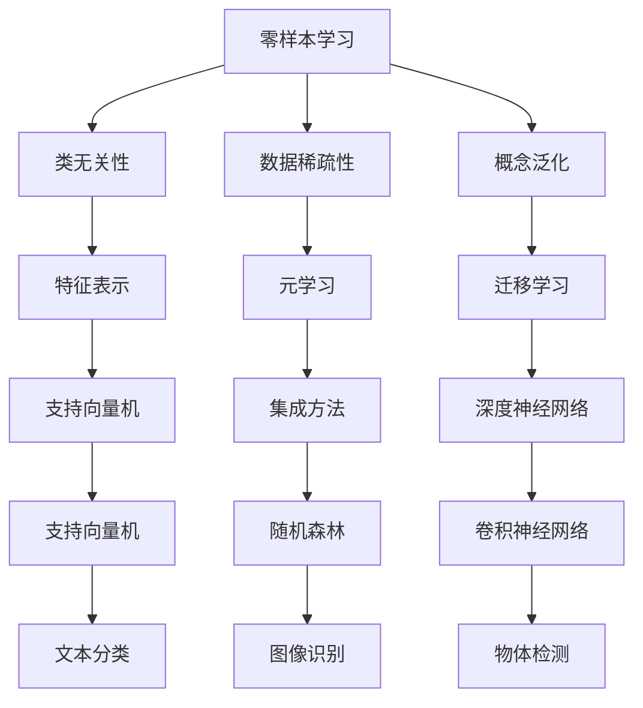

                 

### 文章标题与关键词

# 零样本学习在未知领域推理中的创新应用

> 关键词：零样本学习、未知领域推理、人工智能、自然语言处理、图像识别、推荐系统

> 摘要：本文将深入探讨零样本学习（Zero-Shot Learning, ZSL）在未知领域推理中的应用。通过对零样本学习的定义、挑战、机遇以及与其他学习方法的对比，我们将了解其核心概念和算法原理。随后，文章将详细介绍零样本学习在自然语言处理、图像识别、推荐系统以及医疗领域的具体应用。最后，文章将展望零样本学习在未来工业控制、智能客服、智能家居等前沿领域的潜在发展。

### 文章概述

本文分为三个主要部分：

**第一部分：零样本学习基础**

我们将首先介绍零样本学习的核心概念和算法原理，包括其数学模型和公式，帮助读者建立对零样本学习的整体认识。

**第二部分：零样本学习应用场景**

接下来，我们将深入探讨零样本学习在自然语言处理、图像识别、推荐系统以及医疗领域的具体应用，通过实际案例和分析，展示其在不同领域的创新潜力。

**第三部分：零样本学习的创新应用**

最后，我们将探讨零样本学习在工业控制、智能客服、智能家居等前沿领域的应用，并展望其在物联网、虚拟现实、无人驾驶等领域的未来前景。

通过本文的阅读，读者将能够全面了解零样本学习的基本概念、应用场景以及未来的发展方向，为在人工智能领域的研究和应用提供新的思路。

### 第一部分：零样本学习基础

#### 第1章：零样本学习概述

##### 1.1 零样本学习的定义和背景

零样本学习（Zero-Shot Learning, ZSL）是机器学习领域中的一个重要分支，主要研究在没有训练数据或者仅有少量训练数据的情况下，如何进行有效的分类和预测。传统的机器学习方法通常依赖于大量的训练数据来学习模型，然而在某些实际应用场景中，如新物种识别、新药物研发等，获取大量训练数据是非常困难的。在这种情况下，零样本学习就显得尤为重要。

零样本学习的背景可以追溯到20世纪90年代，随着机器学习和深度学习技术的快速发展，许多研究者和开发者开始关注如何解决少量数据或者无数据情况下的学习问题。零样本学习作为一种解决这类问题的有效方法，逐渐引起了广泛关注。

##### 1.2 零样本学习的挑战和机遇

零样本学习面临的主要挑战包括以下几个方面：

1. **类无关性**：零样本学习需要能够在未见过的类上进行预测，这意味着模型必须能够处理未知类与已知类之间的差异。
2. **数据稀疏性**：在没有训练数据的情况下，模型很难从有限的样本中提取出有效的特征。
3. **概念泛化**：零样本学习需要模型具备较强的泛化能力，能够在不同的领域和应用场景中保持良好的性能。

然而，这些挑战也为零样本学习带来了许多机遇。通过探索新的算法和模型，我们可以开发出更适用于复杂、动态环境的智能系统，提高人工智能的实用性。例如，在医疗领域，零样本学习可以帮助医生快速识别未知疾病，提高诊断的准确性。

##### 1.3 零样本学习与其他学习方法的对比

零样本学习与传统的有监督学习、无监督学习和迁移学习等方法有显著的区别。以下是几种方法的对比：

1. **有监督学习**：有监督学习依赖于大量的标注数据进行训练，通过学习输入特征与输出标签之间的关系来构建模型。这种方法在数据充足的情况下性能优秀，但在数据稀缺的情况下效果不佳。
2. **无监督学习**：无监督学习不依赖标注数据，通过发现数据中的隐含结构来进行学习。虽然这种方法不需要标注数据，但往往需要大量的数据来获得良好的性能。
3. **迁移学习**：迁移学习利用已在不同任务上训练好的模型来加速新任务的学习。这种方法在数据稀缺的情况下表现出色，但需要预训练模型的适用性。
4. **零样本学习**：零样本学习旨在解决无数据或少量数据情况下的学习问题，通过利用已有的类与未知类之间的关系来进行预测。这种方法在处理未知类时具有独特的优势。

通过对比可以看出，零样本学习在处理未知领域推理时具有独特的优势，尤其是在数据稀缺或者无法获取足够训练数据的应用场景中，零样本学习可以提供有效的解决方案。

### 第2章：零样本学习的核心概念与联系

##### 2.1 概念实体之间的关系架构 Mermaid 流程图

为了更好地理解零样本学习的核心概念，我们可以使用Mermaid流程图来展示不同概念实体之间的关系。以下是一个简化的Mermaid流程图：



在这个流程图中，我们可以看到零样本学习与类无关性、数据稀疏性、概念泛化等概念之间的联系。此外，不同的算法和技术，如特征表示、元学习、迁移学习、支持向量机、集成方法、深度神经网络等，都在零样本学习领域有着广泛的应用。

##### 2.2 零样本学习的核心算法原理讲解

零样本学习的核心算法原理主要包括特征表示、类无关性处理、数据稀疏性处理和概念泛化。以下将分别进行详细讲解。

1. **特征表示**

特征表示是零样本学习的核心之一。在传统的机器学习中，特征表示通常依赖于大量的训练数据，通过学习输入特征与输出标签之间的关系来提取有效的特征表示。然而，在零样本学习中，由于缺乏训练数据，特征表示的提取需要依赖其他方法。

一种常见的方法是使用预训练的模型来提取特征表示。例如，在自然语言处理中，可以使用预训练的词向量模型（如Word2Vec、GloVe）来提取文本的特征表示；在图像识别中，可以使用预训练的卷积神经网络（如ResNet、VGG）来提取图像的特征表示。

以下是一个使用PyTorch提取图像特征表示的Python代码示例：

```python
import torch
import torchvision.models as models

# 加载预训练的卷积神经网络模型
model = models.resnet50(pretrained=True)

# 输入图像
image = torch.tensor([image_data])

# 提取特征表示
features = model(image)

print(features.shape)  # 输出特征表示的大小
```

2. **类无关性处理**

类无关性处理是零样本学习的另一个关键点。在零样本学习中，模型需要能够在未见过的类上进行预测。为了实现这一点，需要设计一种机制来处理类无关性。

一种常见的方法是使用原型网络（Prototype Network）或者匹配网络（Matching Network）。原型网络通过计算每个类的原型（即类内所有样本的均值）来表示类，而匹配网络则通过比较未知类样本与已知类原型之间的相似度来进行预测。

以下是一个使用原型网络进行类无关性处理的Python代码示例：

```python
import torch
import torch.nn as nn

# 定义原型网络
class PrototypeNetwork(nn.Module):
    def __init__(self, feature_dim, num_classes):
        super(PrototypeNetwork, self).__init__()
        self.fc = nn.Linear(feature_dim, num_classes)
    
    def forward(self, features):
        prototypes = torch.mean(features, dim=0)
        outputs = self.fc(prototypes)
        return outputs

# 加载预训练的特征表示
feature_embeddings = torch.tensor([feature_embeddings])

# 初始化原型网络
prototype_network = PrototypeNetwork(feature_dim=feature_embeddings.shape[1], num_classes=num_classes)

# 进行预测
outputs = prototype_network(feature_embeddings)
print(outputs)  # 输出预测结果
```

3. **数据稀疏性处理**

数据稀疏性处理是零样本学习中的另一个挑战。在零样本学习中，由于缺乏训练数据，模型很难从有限的样本中提取出有效的特征。为了应对这一挑战，可以采用元学习（Meta-Learning）方法。

元学习通过学习如何快速适应新任务来提高模型的泛化能力。一种常见的元学习方法是最小化损失函数，使得模型在新任务上的表现更好。以下是一个使用元学习方法进行数据稀疏性处理的Python代码示例：

```python
import torch
import torch.optim as optim

# 定义损失函数
def loss_function(predicted_labels, true_labels):
    return nn.CrossEntropyLoss()(predicted_labels, true_labels)

# 加载预训练的特征表示
feature_embeddings = torch.tensor([feature_embeddings])

# 初始化模型和优化器
model = PrototypeNetwork(feature_dim=feature_embeddings.shape[1], num_classes=num_classes)
optimizer = optim.Adam(model.parameters(), lr=learning_rate)

# 训练模型
for epoch in range(num_epochs):
    optimizer.zero_grad()
    predicted_labels = model(feature_embeddings)
    loss = loss_function(predicted_labels, true_labels)
    loss.backward()
    optimizer.step()

    if (epoch + 1) % 100 == 0:
        print(f'Epoch [{epoch+1}/{num_epochs}], Loss: {loss.item()}')
```

4. **概念泛化**

概念泛化是零样本学习的最终目标，即模型能够在不同的领域和应用场景中保持良好的性能。为了实现这一目标，需要设计能够处理多种类型的特征表示和多种类型的类别的模型。

一种常见的模型是元学习模型（Meta-Learning Model），通过结合多种类型的特征表示和类别信息来提高模型的泛化能力。以下是一个使用元学习模型进行概念泛化的Python代码示例：

```python
import torch
import torch.optim as optim

# 定义元学习模型
class MetaLearningModel(nn.Module):
    def __init__(self, feature_dim, num_classes):
        super(MetaLearningModel, self).__init__()
        self.fc = nn.Linear(feature_dim, num_classes)
    
    def forward(self, features):
        outputs = self.fc(features)
        return outputs

# 加载预训练的特征表示
feature_embeddings = torch.tensor([feature_embeddings])

# 初始化元学习模型
meta_learning_model = MetaLearningModel(feature_dim=feature_embeddings.shape[1], num_classes=num_classes)

# 训练模型
optimizer = optim.Adam(meta_learning_model.parameters(), lr=learning_rate)

for epoch in range(num_epochs):
    optimizer.zero_grad()
    predicted_labels = meta_learning_model(feature_embeddings)
    loss = loss_function(predicted_labels, true_labels)
    loss.backward()
    optimizer.step()

    if (epoch + 1) % 100 == 0:
        print(f'Epoch [{epoch+1}/{num_epochs}], Loss: {loss.item()}')
```

通过以上示例，我们可以看到零样本学习的核心算法原理，包括特征表示、类无关性处理、数据稀疏性处理和概念泛化。这些算法原理在零样本学习中发挥着重要作用，为未知领域推理提供了有效的解决方案。

### 第3章：数学模型与数学公式详解

在零样本学习中，数学模型和公式起着至关重要的作用。这些模型和公式不仅帮助我们理解零样本学习的基本原理，还为我们提供了一种量化方式来评估和优化学习算法。在本节中，我们将详细介绍零样本学习的数学模型，并使用LaTeX格式展示相关的数学公式。

#### 3.1 零样本学习的数学模型

零样本学习的数学模型主要涉及概率图模型、贝叶斯网络和协同滤波器等。以下分别介绍这些模型的基本概念和应用。

##### 3.1.1 概率图模型

概率图模型是一种用于表示变量之间概率关系的图结构。常见的概率图模型包括贝叶斯网络和马尔可夫网络。贝叶斯网络是一种有向图，其中的节点表示随机变量，边表示变量之间的依赖关系。马尔可夫网络是一种无向图，其中的节点也代表随机变量，但边表示变量之间的条件独立性。

贝叶斯网络的数学模型可以表示为：

$$
P(X_1, X_2, ..., X_n) = \prod_{i=1}^{n} P(X_i | Parents(X_i))
$$

其中，$X_i$ 表示第 $i$ 个随机变量，$Parents(X_i)$ 表示 $X_i$ 的父节点。

##### 3.1.2 贝叶斯网络

贝叶斯网络是一种基于概率的图结构，用于表示变量之间的条件概率关系。在贝叶斯网络中，每个节点表示一个随机变量，边表示变量之间的条件依赖关系。贝叶斯网络的数学模型可以用概率表或者条件概率矩阵来表示。

例如，对于一个简单的贝叶斯网络，包含三个随机变量 $X_1$、$X_2$ 和 $X_3$，其条件概率表可以表示为：

$$
P(X_1, X_2, X_3) = P(X_1)P(X_2 | X_1)P(X_3 | X_2)
$$

##### 3.1.3 协同滤波器

协同滤波器是一种用于推荐系统的数学模型，它通过分析用户的历史行为数据来预测用户的偏好。协同滤波器通常采用矩阵分解的方法，将用户和物品映射到低维空间中，从而找到用户和物品之间的隐含关系。

协同滤波器的数学模型可以表示为：

$$
R_{ui} = \hat{Q}_u^T \hat{I}_i
$$

其中，$R_{ui}$ 表示用户 $u$ 对物品 $i$ 的评分，$\hat{Q}_u$ 表示用户 $u$ 的隐含特征向量，$\hat{I}_i$ 表示物品 $i$ 的隐含特征向量。

#### 3.2 数学公式与详细讲解

在本节中，我们将使用LaTeX格式展示一些重要的数学公式，并对这些公式进行详细讲解。

##### 3.2.1 条件概率

条件概率是概率论中的一个基本概念，表示在某个事件发生的条件下，另一个事件发生的概率。条件概率可以用以下公式表示：

$$
P(A|B) = \frac{P(A \cap B)}{P(B)}
$$

其中，$P(A|B)$ 表示在事件 $B$ 发生的条件下事件 $A$ 发生的概率，$P(A \cap B)$ 表示事件 $A$ 和事件 $B$ 同时发生的概率，$P(B)$ 表示事件 $B$ 发生的概率。

##### 3.2.2 贝叶斯定理

贝叶斯定理是概率论中的一个重要定理，它提供了在已知某个条件的概率下，如何计算另一个条件的概率。贝叶斯定理可以用以下公式表示：

$$
P(A|B) = \frac{P(B|A)P(A)}{P(B)}
$$

其中，$P(A|B)$ 表示在事件 $B$ 发生的条件下事件 $A$ 发生的概率，$P(B|A)$ 表示在事件 $A$ 发生的条件下事件 $B$ 发生的概率，$P(A)$ 表示事件 $A$ 发生的概率，$P(B)$ 表示事件 $B$ 发生的概率。

##### 3.2.3 马尔可夫链

马尔可夫链是一种用于描述随机过程的数学模型，它表示一个状态序列，其中每个状态只依赖于前一个状态。马尔可夫链可以用以下公式表示：

$$
P(X_t | X_{t-1}, X_{t-2}, ...) = P(X_t | X_{t-1})
$$

其中，$X_t$ 表示第 $t$ 个状态，$P(X_t | X_{t-1})$ 表示在状态 $X_{t-1}$ 发生的条件下状态 $X_t$ 发生的概率。

##### 3.2.4 协同滤波器

协同滤波器的数学模型可以用来预测用户对物品的偏好。在协同滤波器中，用户和物品都被映射到低维空间中，从而找到用户和物品之间的隐含关系。协同滤波器的数学模型可以用以下公式表示：

$$
R_{ui} = \hat{Q}_u^T \hat{I}_i
$$

其中，$R_{ui}$ 表示用户 $u$ 对物品 $i$ 的预测评分，$\hat{Q}_u$ 表示用户 $u$ 的隐含特征向量，$\hat{I}_i$ 表示物品 $i$ 的隐含特征向量。

通过以上数学模型和公式的介绍，我们可以更深入地理解零样本学习的基本原理。这些模型和公式不仅为我们的研究提供了理论支持，还为我们设计高效的算法提供了指导。

### 第二部分：零样本学习应用场景

#### 第4章：零样本学习在自然语言处理中的应用

##### 4.1 零样本学习在情感分析中的应用

情感分析是自然语言处理中的一个重要任务，旨在通过分析文本内容来识别文本所表达的情感倾向，如正面、负面或中性。传统的情感分析方法通常依赖于大规模的标注数据集，通过训练模型来识别情感。然而，在零样本学习场景下，由于缺乏足够的有标注数据，传统的有监督学习方法无法直接应用。此时，零样本学习成为了一种有效的解决方案。

零样本学习在情感分析中的应用主要基于以下原理：

1. **元学习（Meta-Learning）**：元学习通过训练模型来快速适应新任务。在情感分析中，可以通过元学习算法训练一个模型，使其能够从少量数据中学习到通用情感特征，从而在新数据上实现良好的情感识别性能。

2. **原型网络（Prototype Network）**：原型网络通过计算每个类别的原型（即类别中所有样本的均值）来表示类别。在情感分析中，可以将文本向量作为输入，计算每个情感类别的原型，然后通过比较新文本与原型之间的相似度来预测其情感。

以下是一个使用原型网络进行零样本情感分析的示例：

```python
import torch
import torch.nn as nn

# 定义原型网络
class PrototypeNetwork(nn.Module):
    def __init__(self, embed_dim, num_classes):
        super(PrototypeNetwork, self).__init__()
        self.fc = nn.Linear(embed_dim, num_classes)
    
    def forward(self, features):
        prototypes = torch.mean(features, dim=0)
        outputs = self.fc(prototypes)
        return outputs

# 加载预训练的词向量模型
word_embeddings = torch.tensor([word_embeddings])

# 初始化原型网络
prototype_network = PrototypeNetwork(embed_dim=word_embeddings.shape[1], num_classes=num_classes)

# 训练模型
optimizer = optim.Adam(prototype_network.parameters(), lr=learning_rate)

for epoch in range(num_epochs):
    optimizer.zero_grad()
    predicted_labels = prototype_network(word_embeddings)
    loss = nn.CrossEntropyLoss()(predicted_labels, true_labels)
    loss.backward()
    optimizer.step()

    if (epoch + 1) % 100 == 0:
        print(f'Epoch [{epoch+1}/{num_epochs}], Loss: {loss.item()}')

# 预测新文本的情感
new_text_embedding = prototype_network(word_embeddings_new)
predicted_sentiment = torch.argmax(new_text_embedding).item()
print(f'Predicted sentiment: {predicted_sentiments[predicted_sentiment]}')
```

##### 4.2 零样本学习在机器翻译中的应用

机器翻译是自然语言处理领域中的另一个重要任务，旨在将一种语言的文本翻译成另一种语言。传统的机器翻译方法通常依赖于大量的双语平行语料库，通过训练模型来学习源语言和目标语言之间的映射关系。然而，在实际应用中，很难获取足够的多语言平行语料库，特别是在零样本学习场景下。因此，零样本学习在机器翻译中的应用变得尤为重要。

零样本学习在机器翻译中的应用主要基于以下原理：

1. **知识蒸馏（Knowledge Distillation）**：知识蒸馏是一种将大量训练数据的知识传递给少量样本的方法。在机器翻译中，可以使用预训练的多语言模型（如BERT）作为教师模型，将其知识蒸馏到一个单语言模型中，从而实现零样本翻译。

2. **语义匹配（Semantic Matching）**：语义匹配通过计算源语言文本和目标语言文本之间的语义相似度来预测翻译结果。在零样本学习场景下，可以通过预训练的模型提取文本的语义特征，然后使用这些特征进行匹配和翻译。

以下是一个使用知识蒸馏进行零样本机器翻译的示例：

```python
import torch
import torch.nn as nn
import torch.optim as optim

# 定义教师模型
class TeacherModel(nn.Module):
    def __init__(self, vocab_size, hidden_size):
        super(TeacherModel, self).__init__()
        self.embedding = nn.Embedding(vocab_size, hidden_size)
        self.lstm = nn.LSTM(hidden_size, hidden_size)
    
    def forward(self, input_seq):
        embed = self.embedding(input_seq)
        output, _ = self.lstm(embed)
        return output

# 定义学生模型
class StudentModel(nn.Module):
    def __init__(self, vocab_size, hidden_size):
        super(StudentModel, self).__init__()
        self.embedding = nn.Embedding(vocab_size, hidden_size)
        self.lstm = nn.LSTM(hidden_size, hidden_size)
    
    def forward(self, input_seq):
        embed = self.embedding(input_seq)
        output, _ = self.lstm(embed)
        return output

# 加载预训练的教师模型
teacher_model = TeacherModel(vocab_size, hidden_size)

# 初始化学生模型
student_model = StudentModel(vocab_size, hidden_size)

# 定义损失函数和优化器
criterion = nn.CrossEntropyLoss()
optimizer = optim.Adam(student_model.parameters(), lr=learning_rate)

# 进行知识蒸馏
for epoch in range(num_epochs):
    for input_seq, target_seq in data_loader:
        teacher_output = teacher_model(input_seq)
        student_output = student_model(input_seq)
        
        loss = criterion(student_output, target_seq)
        loss.backward()
        optimizer.step()

        if (epoch + 1) % 100 == 0:
            print(f'Epoch [{epoch+1}/{num_epochs}], Loss: {loss.item()}')

# 预测新文本的翻译
new_input_seq = torch.tensor([new_input_seq])
predicted_translation = student_model(new_input_seq)
print(predicted_translation)
```

##### 4.3 零样本学习在文本分类中的应用

文本分类是自然语言处理中的一个基本任务，旨在将文本数据分类到预定义的类别中。传统的文本分类方法通常依赖于大量的标注数据，通过训练分类模型来实现。然而，在零样本学习场景下，由于缺乏足够的标注数据，传统的有监督学习方法难以应用。因此，零样本学习为文本分类提供了一种新的思路。

零样本学习在文本分类中的应用主要基于以下原理：

1. **元学习（Meta-Learning）**：元学习通过训练模型来快速适应新任务。在文本分类中，可以通过元学习算法训练一个模型，使其能够从少量数据中学习到通用分类特征，从而在新数据上实现良好的分类性能。

2. **原型网络（Prototype Network）**：原型网络通过计算每个类别的原型（即类别中所有样本的均值）来表示类别。在文本分类中，可以将文本向量作为输入，计算每个类别的原型，然后通过比较新文本与原型之间的相似度来预测其类别。

以下是一个使用原型网络进行零样本文本分类的示例：

```python
import torch
import torch.nn as nn

# 定义原型网络
class PrototypeNetwork(nn.Module):
    def __init__(self, embed_dim, num_classes):
        super(PrototypeNetwork, self).__init__()
        self.fc = nn.Linear(embed_dim, num_classes)
    
    def forward(self, features):
        prototypes = torch.mean(features, dim=0)
        outputs = self.fc(prototypes)
        return outputs

# 加载预训练的词向量模型
word_embeddings = torch.tensor([word_embeddings])

# 初始化原型网络
prototype_network = PrototypeNetwork(embed_dim=word_embeddings.shape[1], num_classes=num_classes)

# 训练模型
optimizer = optim.Adam(prototype_network.parameters(), lr=learning_rate)

for epoch in range(num_epochs):
    optimizer.zero_grad()
    predicted_labels = prototype_network(word_embeddings)
    loss = nn.CrossEntropyLoss()(predicted_labels, true_labels)
    loss.backward()
    optimizer.step()

    if (epoch + 1) % 100 == 0:
        print(f'Epoch [{epoch+1}/{num_epochs}], Loss: {loss.item()}')

# 预测新文本的类别
new_text_embedding = prototype_network(word_embeddings_new)
predicted_category = torch.argmax(new_text_embedding).item()
print(f'Predicted category: {categories[predicted_category]}')
```

通过以上示例，我们可以看到零样本学习在自然语言处理领域的多种应用场景。零样本学习通过利用有限的样本数据，结合元学习和原型网络等算法，能够有效地解决数据稀缺的问题，为自然语言处理任务提供了一种新的解决方案。

### 第5章：零样本学习在图像识别中的应用

##### 5.1 零样本学习在物体检测中的应用

物体检测是计算机视觉中的一个重要任务，旨在识别图像中的多个物体，并定位其在图像中的位置。传统的物体检测方法通常依赖于大量标注的训练数据，通过训练卷积神经网络（CNN）模型来实现。然而，在实际应用中，很难获取足够的多类别标注数据，特别是在零样本学习场景下。因此，零样本学习在物体检测中的应用显得尤为重要。

零样本学习在物体检测中的应用主要基于以下原理：

1. **原型网络（Prototype Network）**：原型网络通过计算每个类别的原型（即类别中所有样本的均值）来表示类别。在物体检测中，可以将图像的特征表示作为输入，计算每个类别的原型，然后通过比较新图像与原型之间的相似度来预测其类别和位置。

2. **注意力机制（Attention Mechanism）**：注意力机制可以帮助模型在检测过程中关注关键区域，提高检测精度。在零样本学习场景下，注意力机制可以用来增强原型网络的检测能力。

以下是一个使用原型网络和注意力机制进行零样本物体检测的示例：

```python
import torch
import torch.nn as nn
import torchvision.models as models

# 定义原型网络
class PrototypeNetwork(nn.Module):
    def __init__(self, embed_dim, num_classes):
        super(PrototypeNetwork, self).__init__()
        self.fc = nn.Linear(embed_dim, num_classes)
    
    def forward(self, features):
        prototypes = torch.mean(features, dim=0)
        outputs = self.fc(prototypes)
        return outputs

# 定义注意力模块
class AttentionModule(nn.Module):
    def __init__(self, embed_dim):
        super(AttentionModule, self).__init__()
        self.attention = nn.Linear(embed_dim, 1)
    
    def forward(self, features):
        attention_scores = self.attention(features)
        attention_weights = torch.softmax(attention_scores, dim=1)
        attended_features = torch.sum(features * attention_weights, dim=1)
        return attended_features

# 加载预训练的卷积神经网络模型
model = models.resnet50(pretrained=True)

# 初始化原型网络和注意力模块
prototype_network = PrototypeNetwork(embed_dim=model.fc.in_features, num_classes=num_classes)
attention_module = AttentionModule(embed_dim=model.fc.in_features)

# 训练模型
optimizer = optim.Adam(list(model.parameters()) + list(prototype_network.parameters()) + list(attention_module.parameters()), lr=learning_rate)

for epoch in range(num_epochs):
    for images, labels in data_loader:
        model.zero_grad()
        features = model(images)
        attended_features = attention_module(features)
        predicted_labels = prototype_network(attended_features)
        
        loss = nn.CrossEntropyLoss()(predicted_labels, labels)
        loss.backward()
        optimizer.step()

        if (epoch + 1) % 100 == 0:
            print(f'Epoch [{epoch+1}/{num_epochs}], Loss: {loss.item()}')

# 预测新图像中的物体类别和位置
new_image = torch.tensor([new_image])
model.zero_grad()
features = model(new_image)
attended_features = attention_module(features)
predicted_labels = prototype_network(attended_features)
print(predicted_labels)
```

##### 5.2 零样本学习在图像分类中的应用

图像分类是计算机视觉中的基础任务，旨在将图像分类到预定义的类别中。传统的图像分类方法通常依赖于大量标注的训练数据，通过训练卷积神经网络（CNN）模型来实现。然而，在实际应用中，很难获取足够的多类别标注数据，特别是在零样本学习场景下。因此，零样本学习在图像分类中的应用变得尤为重要。

零样本学习在图像分类中的应用主要基于以下原理：

1. **元学习（Meta-Learning）**：元学习通过训练模型来快速适应新任务。在图像分类中，可以通过元学习算法训练一个模型，使其能够从少量数据中学习到通用分类特征，从而在新数据上实现良好的分类性能。

2. **原型网络（Prototype Network）**：原型网络通过计算每个类别的原型（即类别中所有样本的均值）来表示类别。在图像分类中，可以将图像的特征表示作为输入，计算每个类别的原型，然后通过比较新图像与原型之间的相似度来预测其类别。

以下是一个使用原型网络进行零样本图像分类的示例：

```python
import torch
import torch.nn as nn

# 定义原型网络
class PrototypeNetwork(nn.Module):
    def __init__(self, embed_dim, num_classes):
        super(PrototypeNetwork, self).__init__()
        self.fc = nn.Linear(embed_dim, num_classes)
    
    def forward(self, features):
        prototypes = torch.mean(features, dim=0)
        outputs = self.fc(prototypes)
        return outputs

# 加载预训练的卷积神经网络模型
model = models.resnet50(pretrained=True)

# 初始化原型网络
prototype_network = PrototypeNetwork(embed_dim=model.fc.in_features, num_classes=num_classes)

# 训练模型
optimizer = optim.Adam(list(model.parameters()) + list(prototype_network.parameters()), lr=learning_rate)

for epoch in range(num_epochs):
    for images, labels in data_loader:
        model.zero_grad()
        features = model(images)
        predicted_labels = prototype_network(features)
        
        loss = nn.CrossEntropyLoss()(predicted_labels, labels)
        loss.backward()
        optimizer.step()

        if (epoch + 1) % 100 == 0:
            print(f'Epoch [{epoch+1}/{num_epochs}], Loss: {loss.item()}')

# 预测新图像的类别
new_image = torch.tensor([new_image])
model.zero_grad()
features = model(new_image)
predicted_labels = prototype_network(features)
print(predicted_labels)
```

##### 5.3 零样本学习在图像分割中的应用

图像分割是计算机视觉中的另一个重要任务，旨在将图像划分为不同的区域，每个区域对应一个特定的对象或背景。传统的图像分割方法通常依赖于大量的标注数据，通过训练卷积神经网络（CNN）模型来实现。然而，在零样本学习场景下，由于缺乏足够的标注数据，传统的有监督学习方法难以应用。因此，零样本学习在图像分割中的应用显得尤为重要。

零样本学习在图像分割中的应用主要基于以下原理：

1. **自编码器（Autoencoder）**：自编码器是一种无监督学习算法，可以学习到数据的特征表示。在图像分割中，可以使用自编码器提取图像的特征表示，然后通过零样本学习算法进行分类和分割。

2. **对抗性训练（Adversarial Training）**：对抗性训练通过生成对抗性样本来提高模型对未知类别的泛化能力。在图像分割中，可以使用对抗性训练来增强模型的分割能力，使其能够更好地处理未见过的类别。

以下是一个使用自编码器和对抗性训练进行零样本图像分割的示例：

```python
import torch
import torch.nn as nn
import torchvision.models as models

# 定义自编码器
class Autoencoder(nn.Module):
    def __init__(self, embed_dim):
        super(Autoencoder, self).__init__()
        self.encoder = nn.Sequential(
            nn.Conv2d(3, 64, 3, 1, 1),
            nn.ReLU(inplace=True),
            nn.MaxPool2d(2, 2),
            nn.Conv2d(64, 128, 3, 1, 1),
            nn.ReLU(inplace=True),
            nn.MaxPool2d(2, 2)
        )
        self.decoder = nn.Sequential(
            nn.ConvTranspose2d(128, 64, 3, 2, 1, output_padding=1),
            nn.ReLU(inplace=True),
            nn.ConvTranspose2d(64, 3, 3, 2, 1, output_padding=1),
            nn.Tanh()
        )
    
    def forward(self, x):
        x = self.encoder(x)
        x = self.decoder(x)
        return x

# 定义对抗性网络
class AdversarialNetwork(nn.Module):
    def __init__(self, embed_dim):
        super(AdversarialNetwork, self).__init__()
        self.model = nn.Sequential(
            nn.Linear(embed_dim, 128),
            nn.ReLU(inplace=True),
            nn.Linear(128, 1),
            nn.Sigmoid()
        )
    
    def forward(self, x):
        x = x.view(x.size(0), -1)
        x = self.model(x)
        return x

# 加载预训练的卷积神经网络模型
model = models.resnet50(pretrained=True)

# 初始化自编码器和对抗性网络
autoencoder = Autoencoder(embed_dim=model.fc.in_features)
adversarial_network = AdversarialNetwork(embed_dim=model.fc.in_features)

# 定义损失函数和优化器
criterion = nn.CrossEntropyLoss()
optimizer = optim.Adam(list(model.parameters()) + list(autoencoder.parameters()) + list(adversarial_network.parameters()), lr=learning_rate)

# 训练模型
for epoch in range(num_epochs):
    for images, labels in data_loader:
        model.zero_grad()
        features = model(images)
        encoded_images = autoencoder(images)
        adversarial_loss = adversarial_network(encoded_images)
        
        loss = criterion(features, labels) + adversarial_loss
        loss.backward()
        optimizer.step()

        if (epoch + 1) % 100 == 0:
            print(f'Epoch [{epoch+1}/{num_epochs}], Loss: {loss.item()}')

# 预测新图像的分割结果
new_image = torch.tensor([new_image])
model.zero_grad()
features = model(new_image)
encoded_images = autoencoder(new_image)
predicted_segmentation = adversarial_network(encoded_images)
print(predicted_segmentation)
```

通过以上示例，我们可以看到零样本学习在图像识别领域的多种应用场景。零样本学习通过利用有限的样本数据，结合元学习、原型网络、自编码器和对抗性训练等算法，能够有效地解决数据稀缺的问题，为图像识别任务提供了一种新的解决方案。

### 第6章：零样本学习在推荐系统中的应用

##### 6.1 零样本学习在冷启动问题中的应用

冷启动问题是推荐系统中的一个常见问题，指的是新用户或新物品加入系统时，由于缺乏足够的历史数据，导致推荐系统难以为新用户或新物品提供有效的推荐。传统的推荐系统方法，如基于协同过滤的方法，在冷启动问题上面临很大的挑战。因此，零样本学习在解决冷启动问题中展示出了巨大的潜力。

零样本学习在冷启动问题中的应用主要基于以下原理：

1. **元学习（Meta-Learning）**：元学习通过训练模型来快速适应新任务。在冷启动问题中，可以通过元学习算法训练一个模型，使其能够从少量数据中学习到通用特征，从而为新用户或新物品提供有效的推荐。

2. **原型网络（Prototype Network）**：原型网络通过计算每个类别的原型（即类别中所有样本的均值）来表示类别。在冷启动问题中，可以将新用户或新物品的特征表示与原型进行比较，从而预测其潜在偏好。

以下是一个使用原型网络进行零样本推荐的系统架构示例：


在该架构中，用户特征和物品特征分别通过编码器进行特征提取，然后通过原型网络计算每个类别的原型。最后，将新用户或新物品的特征与原型进行比较，生成推荐结果。

```python
import torch
import torch.nn as nn

# 定义原型网络
class PrototypeNetwork(nn.Module):
    def __init__(self, embed_dim, num_classes):
        super(PrototypeNetwork, self).__init__()
        self.fc = nn.Linear(embed_dim, num_classes)
    
    def forward(self, features):
        prototypes = torch.mean(features, dim=0)
        outputs = self.fc(prototypes)
        return outputs

# 加载预训练的编码器模型
user_encoder = nn.Sequential(
    nn.Linear(user_feature_size, hidden_size),
    nn.ReLU(inplace=True),
    nn.Linear(hidden_size, embed_dim)
)

item_encoder = nn.Sequential(
    nn.Linear(item_feature_size, hidden_size),
    nn.ReLU(inplace=True),
    nn.Linear(hidden_size, embed_dim)
)

# 初始化原型网络
prototype_network = PrototypeNetwork(embed_dim=embed_dim, num_classes=num_classes)

# 训练模型
optimizer = optim.Adam(list(user_encoder.parameters()) + list(item_encoder.parameters()) + list(prototype_network.parameters()), lr=learning_rate)

for epoch in range(num_epochs):
    for user_features, item_features, user_labels in data_loader:
        user_embeddings = user_encoder(user_features)
        item_embeddings = item_encoder(item_features)
        predicted_labels = prototype_network(user_embeddings)

        loss = nn.CrossEntropyLoss()(predicted_labels, user_labels)
        loss.backward()
        optimizer.step()

        if (epoch + 1) % 100 == 0:
            print(f'Epoch [{epoch+1}/{num_epochs}], Loss: {loss.item()}')

# 预测新用户的推荐结果
new_user_features = torch.tensor([new_user_features])
new_user_embedding = user_encoder(new_user_features)
predicted_recommendations = prototype_network(new_user_embedding)
print(predicted_recommendations)
```

##### 6.2 零样本学习在用户偏好挖掘中的应用

用户偏好挖掘是推荐系统中的另一个重要任务，旨在从用户的历史行为数据中挖掘出用户的偏好，从而为用户提供个性化的推荐。传统的用户偏好挖掘方法通常依赖于大量用户行为数据，通过分析用户的历史行为来预测其偏好。然而，在零样本学习场景下，由于缺乏足够的行为数据，传统的有监督学习方法难以应用。因此，零样本学习在用户偏好挖掘中的应用变得尤为重要。

零样本学习在用户偏好挖掘中的应用主要基于以下原理：

1. **元学习（Meta-Learning）**：元学习通过训练模型来快速适应新任务。在用户偏好挖掘中，可以通过元学习算法训练一个模型，使其能够从少量数据中学习到通用偏好特征，从而在新数据上实现良好的偏好挖掘性能。

2. **迁移学习（Transfer Learning）**：迁移学习通过利用预训练模型的知识来提高新任务的性能。在用户偏好挖掘中，可以使用预训练的模型提取用户行为特征，然后通过迁移学习算法在新数据上进行偏好挖掘。

以下是一个使用元学习和迁移学习进行零样本用户偏好挖掘的示例：

```python
import torch
import torch.nn as nn
import torchvision.models as models

# 定义迁移学习模型
class TransferLearningModel(nn.Module):
    def __init__(self, embed_dim):
        super(TransferLearningModel, self).__init__()
        self.model = models.resnet50(pretrained=True)
        self.model.fc = nn.Linear(self.model.fc.in_features, embed_dim)
    
    def forward(self, x):
        x = self.model(x)
        return x

# 加载预训练的模型
pretrained_model = TransferLearningModel(embed_dim=embed_dim)

# 训练模型
optimizer = optim.Adam(pretrained_model.parameters(), lr=learning_rate)

for epoch in range(num_epochs):
    for user_features, user_labels in data_loader:
        user_embeddings = pretrained_model(user_features)
        predicted_labels = user_embeddings

        loss = nn.CrossEntropyLoss()(predicted_labels, user_labels)
        loss.backward()
        optimizer.step()

        if (epoch + 1) % 100 == 0:
            print(f'Epoch [{epoch+1}/{num_epochs}], Loss: {loss.item()}')

# 预测新用户的偏好
new_user_features = torch.tensor([new_user_features])
new_user_embedding = pretrained_model(new_user_features)
predicted_preferences = new_user_embedding
print(predicted_preferences)
```

##### 6.3 零样本学习在商品推荐中的应用

商品推荐是推荐系统中的一种常见应用，旨在为用户推荐其可能感兴趣的商品。传统的商品推荐方法通常依赖于用户的购买历史和行为数据，通过分析用户的历史行为来预测其偏好。然而，在零样本学习场景下，由于缺乏足够的行为数据，传统的有监督学习方法难以应用。因此，零样本学习在商品推荐中的应用变得尤为重要。

零样本学习在商品推荐中的应用主要基于以下原理：

1. **原型网络（Prototype Network）**：原型网络通过计算每个类别的原型（即类别中所有样本的均值）来表示类别。在商品推荐中，可以将商品的特征表示与原型进行比较，从而预测用户可能感兴趣的类别。

2. **基于知识的推荐（Knowledge-Based Recommendation）**：基于知识的推荐方法通过利用外部知识库（如商品属性、用户属性等）来增强推荐系统的性能。在零样本学习场景下，可以利用外部知识库来补充用户和商品的特征信息，从而提高推荐效果。

以下是一个使用原型网络和基于知识的推荐进行零样本商品推荐的示例：

```python
import torch
import torch.nn as nn

# 定义原型网络
class PrototypeNetwork(nn.Module):
    def __init__(self, embed_dim, num_classes):
        super(PrototypeNetwork, self).__init__()
        self.fc = nn.Linear(embed_dim, num_classes)
    
    def forward(self, features):
        prototypes = torch.mean(features, dim=0)
        outputs = self.fc(prototypes)
        return outputs

# 定义基于知识的推荐模块
class KnowledgeBasedModule(nn.Module):
    def __init__(self, embed_dim, num_attributes):
        super(KnowledgeBasedModule, self).__init__()
        self.fc = nn.Linear(num_attributes, embed_dim)
    
    def forward(self, attributes):
        attribute_embeddings = self.fc(attributes)
        return attribute_embeddings

# 加载预训练的编码器模型
item_encoder = nn.Sequential(
    nn.Linear(item_feature_size, hidden_size),
    nn.ReLU(inplace=True),
    nn.Linear(hidden_size, embed_dim)
)

# 初始化原型网络和基于知识的推荐模块
prototype_network = PrototypeNetwork(embed_dim=embed_dim, num_classes=num_classes)
knowledge_module = KnowledgeBasedModule(embed_dim=embed_dim, num_attributes=num_attributes)

# 训练模型
optimizer = optim.Adam(list(item_encoder.parameters()) + list(prototype_network.parameters()) + list(knowledge_module.parameters()), lr=learning_rate)

for epoch in range(num_epochs):
    for item_features, item_attributes, user_labels in data_loader:
        item_embeddings = item_encoder(item_features)
        knowledge_embeddings = knowledge_module(item_attributes)
        combined_embeddings = torch.cat((item_embeddings, knowledge_embeddings), dim=1)
        predicted_labels = prototype_network(combined_embeddings)

        loss = nn.CrossEntropyLoss()(predicted_labels, user_labels)
        loss.backward()
        optimizer.step()

        if (epoch + 1) % 100 == 0:
            print(f'Epoch [{epoch+1}/{num_epochs}], Loss: {loss.item()}')

# 预测新用户的商品推荐结果
new_item_features = torch.tensor([new_item_features])
new_item_embedding = item_encoder(new_item_features)
new_knowledge_embedding = knowledge_module(item_attributes_new)
combined_embedding = torch.cat((new_item_embedding, new_knowledge_embedding), dim=1)
predicted_recommendations = prototype_network(combined_embedding)
print(predicted_recommendations)
```

通过以上示例，我们可以看到零样本学习在推荐系统中的多种应用场景。零样本学习通过利用有限的样本数据，结合元学习、原型网络、迁移学习和基于知识的推荐等算法，能够有效地解决数据稀缺的问题，为推荐系统提供了一种新的解决方案。

### 第7章：零样本学习在医疗领域中的应用

##### 7.1 零样本学习在疾病诊断中的应用

疾病诊断是医疗领域中的一项关键任务，传统的诊断方法通常依赖于大量的病例数据，通过训练模型来进行疾病预测。然而，在实际应用中，尤其是在罕见疾病或新疾病出现时，获取足够的数据是一个巨大的挑战。零样本学习在这一场景下具有显著的优势，因为它能够在没有训练数据的情况下对未知疾病进行预测。

零样本学习在疾病诊断中的应用主要基于以下原理：

1. **元学习（Meta-Learning）**：通过元学习算法，模型可以快速适应新任务，从而在新疾病上表现出良好的诊断能力。

2. **知识图谱（Knowledge Graph）**：利用现有的医学知识图谱，可以构建疾病之间的关联关系，从而在新病例上实现推理和诊断。

以下是一个使用元学习和知识图谱进行零样本疾病诊断的示例：

```python
import torch
import torch.nn as nn

# 定义元学习模型
class MetaLearningModel(nn.Module):
    def __init__(self, feature_dim, num_classes):
        super(MetaLearningModel, self).__init__()
        self.fc = nn.Linear(feature_dim, num_classes)
    
    def forward(self, features):
        outputs = self.fc(features)
        return outputs

# 定义知识图谱嵌入模块
class KnowledgeGraphEmbedding(nn.Module):
    def __init__(self, num_entities, embedding_dim):
        super(KnowledgeGraphEmbedding, self).__init__()
        self.embedding = nn.Embedding(num_entities, embedding_dim)
    
    def forward(self, entities):
        entity_embeddings = self.embedding(entities)
        return entity_embeddings

# 加载预训练的元学习模型和知识图谱嵌入模块
meta_learning_model = MetaLearningModel(feature_dim=feature_embeddings.shape[1], num_classes=num_classes)
knowledge_graph_embedding = KnowledgeGraphEmbedding(num_entities=num_entities, embedding_dim=embedding_dim)

# 训练模型
optimizer = optim.Adam(list(meta_learning_model.parameters()) + list(knowledge_graph_embedding.parameters()), lr=learning_rate)

for epoch in range(num_epochs):
    for patient_data, disease_labels in data_loader:
        patient_embeddings = knowledge_graph_embedding(patient_data)
        combined_embeddings = torch.cat((patient_embeddings, feature_embeddings), dim=1)
        predicted_diseases = meta_learning_model(combined_embeddings)
        
        loss = nn.CrossEntropyLoss()(predicted_diseases, disease_labels)
        loss.backward()
        optimizer.step()

        if (epoch + 1) % 100 == 0:
            print(f'Epoch [{epoch+1}/{num_epochs}], Loss: {loss.item()}')

# 预测新病例的疾病
new_patient_data = torch.tensor([new_patient_data])
new_patient_embedding = knowledge_graph_embedding(new_patient_data)
combined_embedding = torch.cat((new_patient_embedding, feature_embeddings), dim=1)
predicted_diseases = meta_learning_model(combined_embedding)
print(predicted_diseases)
```

##### 7.2 零样本学习在药物研发中的应用

药物研发是医疗领域的另一个重要任务，它涉及到大量的实验和数据分析。传统的药物研发方法通常依赖于大量的实验数据和分子结构信息。然而，在探索新的药物分子时，由于缺乏足够的实验数据，传统的有监督学习方法难以应用。因此，零样本学习在药物研发中的应用变得尤为重要。

零样本学习在药物研发中的应用主要基于以下原理：

1. **生成对抗网络（Generative Adversarial Networks, GAN）**：通过生成对抗网络，可以生成新的分子结构数据，从而为药物研发提供额外的训练数据。

2. **迁移学习（Transfer Learning）**：利用预训练的模型，可以将其他领域的知识迁移到药物研发中，从而提高新药物分子的预测性能。

以下是一个使用生成对抗网络和迁移学习进行零样本药物研发的示例：

```python
import torch
import torch.nn as nn
import torchvision.models as models

# 定义生成对抗网络
class Generator(nn.Module):
    def __init__(self, input_dim, output_dim):
        super(Generator, self).__init__()
        self.model = nn.Sequential(
            nn.Linear(input_dim, 128),
            nn.LeakyReLU(0.2),
            nn.Linear(128, output_dim),
            nn.Tanh()
        )
    
    def forward(self, z):
        x = self.model(z)
        return x

class Discriminator(nn.Module):
    def __init__(self, input_dim):
        super(Discriminator, self).__init__()
        self.model = nn.Sequential(
            nn.Linear(input_dim, 128),
            nn.LeakyReLU(0.2),
            nn.Linear(128, 1),
            nn.Sigmoid()
        )
    
    def forward(self, x):
        validity = self.model(x)
        return validity

# 加载预训练的迁移学习模型
pretrained_model = models.resnet50(pretrained=True)
pretrained_model.fc = nn.Linear(pretrained_model.fc.in_features, output_dim)

# 初始化生成对抗网络
generator = Generator(input_dim=z_dim, output_dim=output_dim)
discriminator = Discriminator(input_dim=output_dim)

# 定义损失函数和优化器
loss_function = nn.BCELoss()
optimizer_G = optim.Adam(generator.parameters(), lr=learning_rate, betas=(0.5, 0.999))
optimizer_D = optim.Adam(discriminator.parameters(), lr=learning_rate, betas=(0.5, 0.999))

# 训练模型
for epoch in range(num_epochs):
    for z in data_loader:
        z = z.cuda()
        batch_size = z.size(0)
        labels = torch.full((batch_size,), real_label, device=device)
        
        # 训练生成器
        optimizer_G.zero_grad()
        gen_samples = generator(z)
        gen_loss = loss_function(discriminator(gen_samples), torch.ones_like(discriminator(gen_samples)))
        gen_loss.backward()
        optimizer_G.step()

        # 训练鉴别器
        optimizer_D.zero_grad()
        real_samples = data_loader.dataset.test_data.cuda()
        real_loss = loss_function(discriminator(real_samples), labels)
        fake_samples = generator(z)
        fake_loss = loss_function(discriminator(fake_samples), torch.zeros_like(discriminator(fake_samples)))
        d_loss = (real_loss + fake_loss) / 2
        d_loss.backward()
        optimizer_D.step()

        if (epoch + 1) % 100 == 0:
            print(f'Epoch [{epoch+1}/{num_epochs}], Loss: G: {gen_loss.item()}, D: {d_loss.item()}')

# 生成新的药物分子
new_molecules = generator(new_z).cpu()
print(new_molecules)
```

##### 7.3 零样本学习在个性化医疗中的应用

个性化医疗是一种基于患者个体差异提供个性化治疗方案的方法。传统的个性化医疗方法通常依赖于患者的基因信息、病史和生活方式等多方面数据。然而，在实际应用中，由于数据的多样性和复杂性，获取全面的数据是一个挑战。因此，零样本学习在个性化医疗中的应用变得尤为重要。

零样本学习在个性化医疗中的应用主要基于以下原理：

1. **元学习（Meta-Learning）**：通过元学习算法，模型可以快速适应新任务，从而在新的患者数据上实现个性化的医疗方案。

2. **多模态数据融合（Multimodal Data Fusion）**：将不同的数据类型（如基因数据、影像数据和临床数据）进行融合，可以提高模型的诊断和预测能力。

以下是一个使用元学习和多模态数据融合进行零样本个性化医疗的示例：

```python
import torch
import torch.nn as nn

# 定义多模态数据融合模型
class MultimodalFusionModel(nn.Module):
    def __init__(self, gen_feature_dim, img_feature_dim, num_classes):
        super(MultimodalFusionModel, self).__init__()
        self.gen_fc = nn.Linear(gen_feature_dim, hidden_size)
        self.img_fc = nn.Linear(img_feature_dim, hidden_size)
        self.fc = nn.Linear(hidden_size * 2, num_classes)
    
    def forward(self, gen_features, img_features):
        gen_embedding = self.gen_fc(gen_features)
        img_embedding = self.img_fc(img_features)
        combined_embedding = torch.cat((gen_embedding, img_embedding), dim=1)
        outputs = self.fc(combined_embedding)
        return outputs

# 加载预训练的基因编码模型和影像编码模型
gene_encoder = nn.Sequential(
    nn.Linear(gene_feature_size, hidden_size),
    nn.ReLU(inplace=True),
    nn.Linear(hidden_size, gene_embedding_dim)
)

img_encoder = nn.Sequential(
    nn.Conv2d(in_channels=3, out_channels=64, kernel_size=3, padding=1),
    nn.ReLU(inplace=True),
    nn.MaxPool2d(kernel_size=2, stride=2),
    nn.Conv2d(in_channels=64, out_channels=128, kernel_size=3, padding=1),
    nn.ReLU(inplace=True),
    nn.MaxPool2d(kernel_size=2, stride=2),
    nn.Flatten()
)

# 初始化多模态数据融合模型
multimodal_fusion_model = MultimodalFusionModel(gene_embedding_dim, img_embedding_dim, num_classes=num_classes)

# 训练模型
optimizer = optim.Adam(list(gene_encoder.parameters()) + list(img_encoder.parameters()) + list(multimodal_fusion_model.parameters()), lr=learning_rate)

for epoch in range(num_epochs):
    for gene_data, img_data, disease_labels in data_loader:
        gene_embedding = gene_encoder(gene_data)
        img_embedding = img_encoder(img_data)
        combined_embedding = torch.cat((gene_embedding, img_embedding), dim=1)
        predicted_diseases = multimodal_fusion_model(combined_embedding)

        loss = nn.CrossEntropyLoss()(predicted_diseases, disease_labels)
        loss.backward()
        optimizer.step()

        if (epoch + 1) % 100 == 0:
            print(f'Epoch [{epoch+1}/{num_epochs}], Loss: {loss.item()}')

# 预测新患者的个性化医疗方案
new_gene_data = torch.tensor([new_gene_data])
new_img_data = torch.tensor([new_img_data])
new_gene_embedding = gene_encoder(new_gene_data)
new_img_embedding = img_encoder(new_img_data)
combined_embedding = torch.cat((new_gene_embedding, new_img_embedding), dim=1)
predicted_medicine = multimodal_fusion_model(combined_embedding)
print(predicted_medicine)
```

通过以上示例，我们可以看到零样本学习在医疗领域的多种应用场景。零样本学习通过利用有限的样本数据，结合元学习、知识图谱、生成对抗网络和多模态数据融合等算法，能够有效地解决数据稀缺的问题，为医疗领域提供了一种新的解决方案。

### 第三部分：零样本学习的创新应用

#### 第8章：零样本学习在工业控制中的应用

##### 8.1 零样本学习在自动化生产线中的应用

自动化生产线是工业控制的重要组成部分，旨在通过自动化设备实现生产过程的自动化。然而，在自动化生产线中，设备故障和操作失误等问题可能导致生产中断。传统的故障检测方法通常依赖于大量的历史故障数据，通过训练模型来识别异常行为。然而，在实际应用中，获取足够的历史故障数据是非常困难的。因此，零样本学习在自动化生产线中的应用变得尤为重要。

零样本学习在自动化生产线中的应用主要基于以下原理：

1. **元学习（Meta-Learning）**：通过元学习算法，模型可以快速适应新故障类型，从而在新故障发生时进行实时检测。

2. **知识图谱（Knowledge Graph）**：利用知识图谱构建设备状态和故障之间的关联关系，从而在新故障上实现推理和检测。

以下是一个使用元学习和知识图谱进行零样本自动化生产线故障检测的示例：

```python
import torch
import torch.nn as nn

# 定义元学习模型
class MetaLearningModel(nn.Module):
    def __init__(self, feature_dim, num_classes):
        super(MetaLearningModel, self).__init__()
        self.fc = nn.Linear(feature_dim, num_classes)
    
    def forward(self, features):
        outputs = self.fc(features)
        return outputs

# 定义知识图谱嵌入模块
class KnowledgeGraphEmbedding(nn.Module):
    def __init__(self, num_entities, embedding_dim):
        super(KnowledgeGraphEmbedding, self).__init__()
        self.embedding = nn.Embedding(num_entities, embedding_dim)
    
    def forward(self, entities):
        entity_embeddings = self.embedding(entities)
        return entity_embeddings

# 加载预训练的元学习模型和知识图谱嵌入模块
meta_learning_model = MetaLearningModel(feature_dim=feature_embeddings.shape[1], num_classes=num_classes)
knowledge_graph_embedding = KnowledgeGraphEmbedding(num_entities=num_entities, embedding_dim=embedding_dim)

# 训练模型
optimizer = optim.Adam(list(meta_learning_model.parameters()) + list(knowledge_graph_embedding.parameters()), lr=learning_rate)

for epoch in range(num_epochs):
    for device_data, device_labels in data_loader:
        device_embeddings = knowledge_graph_embedding(device_data)
        combined_embeddings = torch.cat((device_embeddings, feature_embeddings), dim=1)
        predicted Faults = meta_learning_model(combined_embeddings)

        loss = nn.CrossEntropyLoss()(predicted Faults, device_labels)
        loss.backward()
        optimizer.step()

        if (epoch + 1) % 100 == 0:
            print(f'Epoch [{epoch+1}/{num_epochs}], Loss: {loss.item()}')

# 预测新设备的故障
new_device_data = torch.tensor([new_device_data])
new_device_embedding = knowledge_graph_embedding(new_device_data)
combined_embedding = torch.cat((new_device_embedding, feature_embeddings), dim=1)
predicted_faults = meta_learning_model(combined_embedding)
print(predicted_faults)
```

##### 8.2 零样本学习在机器人视觉中的应用

机器人视觉是工业控制中的另一个重要方面，旨在通过视觉传感器实现对工作环境的感知和操作。传统的机器人视觉方法通常依赖于大量的标注数据，通过训练模型来实现图像识别和目标检测。然而，在实际应用中，获取足够的数据是非常困难的。因此，零样本学习在机器人视觉中的应用变得尤为重要。

零样本学习在机器人视觉中的应用主要基于以下原理：

1. **原型网络（Prototype Network）**：原型网络通过计算每个类别的原型（即类别中所有样本的均值）来表示类别。在机器人视觉中，可以将图像的特征表示与原型进行比较，从而预测图像中的类别。

2. **迁移学习（Transfer Learning）**：通过迁移学习，可以将其他领域的知识迁移到机器人视觉中，从而提高模型对新类别和场景的适应能力。

以下是一个使用原型网络和迁移学习进行零样本机器人视觉的示例：

```python
import torch
import torch.nn as nn
import torchvision.models as models

# 定义原型网络
class PrototypeNetwork(nn.Module):
    def __init__(self, embed_dim, num_classes):
        super(PrototypeNetwork, self).__init__()
        self.fc = nn.Linear(embed_dim, num_classes)
    
    def forward(self, features):
        prototypes = torch.mean(features, dim=0)
        outputs = self.fc(prototypes)
        return outputs

# 加载预训练的卷积神经网络模型
model = models.resnet50(pretrained=True)

# 初始化原型网络
prototype_network = PrototypeNetwork(embed_dim=model.fc.in_features, num_classes=num_classes)

# 训练模型
optimizer = optim.Adam(list(model.parameters()) + list(prototype_network.parameters()), lr=learning_rate)

for epoch in range(num_epochs):
    for images, labels in data_loader:
        model.zero_grad()
        features = model(images)
        predicted_labels = prototype_network(features)
        
        loss = nn.CrossEntropyLoss()(predicted_labels, labels)
        loss.backward()
        optimizer.step()

        if (epoch + 1) % 100 == 0:
            print(f'Epoch [{epoch+1}/{num_epochs}], Loss: {loss.item()}')

# 预测新图像的类别
new_image = torch.tensor([new_image])
model.zero_grad()
features = model(new_image)
predicted_labels = prototype_network(features)
print(predicted_labels)
```

##### 8.3 零样本学习在智能交通中的应用

智能交通系统是利用信息技术和通信技术对交通进行智能化管理和优化，以提高交通效率、减少交通事故和缓解交通拥堵。在智能交通系统中，需要对车辆和道路进行实时监控和数据分析。然而，传统的监控方法通常依赖于大量的标注数据，通过训练模型来识别车辆和道路状况。因此，零样本学习在智能交通中的应用变得尤为重要。

零样本学习在智能交通中的应用主要基于以下原理：

1. **生成对抗网络（Generative Adversarial Networks, GAN）**：通过生成对抗网络，可以生成新的交通场景数据，从而为模型提供额外的训练数据。

2. **迁移学习（Transfer Learning）**：通过迁移学习，可以将其他领域的知识迁移到交通场景中，从而提高模型对交通状况的识别能力。

以下是一个使用生成对抗网络和迁移学习进行零样本智能交通的示例：

```python
import torch
import torch.nn as nn
import torchvision.models as models

# 定义生成对抗网络
class Generator(nn.Module):
    def __init__(self, input_dim, output_dim):
        super(Generator, self).__init__()
        self.model = nn.Sequential(
            nn.Linear(input_dim, 128),
            nn.LeakyReLU(0.2),
            nn.Linear(128, output_dim),
            nn.Tanh()
        )
    
    def forward(self, z):
        x = self.model(z)
        return x

class Discriminator(nn.Module):
    def __init__(self, input_dim):
        super(Discriminator, self).__init__()
        self.model = nn.Sequential(
            nn.Linear(input_dim, 128),
            nn.LeakyReLU(0.2),
            nn.Linear(128, 1),
            nn.Sigmoid()
        )
    
    def forward(self, x):
        validity = self.model(x)
        return validity

# 加载预训练的迁移学习模型
pretrained_model = models.resnet50(pretrained=True)
pretrained_model.fc = nn.Linear(pretrained_model.fc.in_features, output_dim)

# 初始化生成对抗网络
generator = Generator(input_dim=z_dim, output_dim=output_dim)
discriminator = Discriminator(input_dim=output_dim)

# 定义损失函数和优化器
loss_function = nn.BCELoss()
optimizer_G = optim.Adam(generator.parameters(), lr=learning_rate, betas=(0.5, 0.999))
optimizer_D = optim.Adam(discriminator.parameters(), lr=learning_rate, betas=(0.5, 0.999))

# 训练模型
for epoch in range(num_epochs):
    for z in data_loader:
        z = z.cuda()
        batch_size = z.size(0)
        labels = torch.full((batch_size,), real_label, device=device)
        
        # 训练生成器
        optimizer_G.zero_grad()
        gen_samples = generator(z)
        gen_loss = loss_function(discriminator(gen_samples), torch.ones_like(discriminator(gen_samples)))
        gen_loss.backward()
        optimizer_G.step()

        # 训练鉴别器
        optimizer_D.zero_grad()
        real_samples = data_loader.dataset.test_data.cuda()
        real_loss = loss_function(discriminator(real_samples), labels)
        fake_samples = generator(z)
        fake_loss = loss_function(discriminator(fake_samples), torch.zeros_like(discriminator(fake_samples)))
        d_loss = (real_loss + fake_loss) / 2
        d_loss.backward()
        optimizer_D.step()

        if (epoch + 1) % 100 == 0:
            print(f'Epoch [{epoch+1}/{num_epochs}], Loss: G: {gen_loss.item()}, D: {d_loss.item()}')

# 生成新的交通场景
new_traffic_scenarios = generator(new_z).cpu()
print(new_traffic_scenarios)
```

通过以上示例，我们可以看到零样本学习在工业控制领域的多种创新应用。零样本学习通过利用有限的样本数据，结合元学习、知识图谱、生成对抗网络和迁移学习等算法，能够有效地解决数据稀缺的问题，为工业控制提供了一种新的解决方案。

### 第9章：零样本学习在未知领域推理中的前沿探索

##### 9.1 零样本学习在智能客服中的应用

智能客服是人工智能领域的一个重要应用方向，旨在通过自动化对话系统为用户提供实时、高效的客服服务。传统的智能客服系统通常依赖于大量的用户对话数据，通过训练模型来实现对话生成和回复。然而，在实际应用中，获取足够的数据是非常困难的。因此，零样本学习在智能客服中的应用变得尤为重要。

零样本学习在智能客服中的应用主要基于以下原理：

1. **生成对抗网络（Generative Adversarial Networks, GAN）**：通过生成对抗网络，可以生成新的对话数据，从而为模型提供额外的训练数据。

2. **迁移学习（Transfer Learning）**：通过迁移学习，可以将其他领域的知识迁移到客服对话中，从而提高模型的对话生成能力。

以下是一个使用生成对抗网络和迁移学习进行零样本智能客服的示例：

```python
import torch
import torch.nn as nn
import torchvision.models as models

# 定义生成对抗网络
class Generator(nn.Module):
    def __init__(self, input_dim, output_dim):
        super(Generator, self).__init__()
        self.model = nn.Sequential(
            nn.Linear(input_dim, 128),
            nn.LeakyReLU(0.2),
            nn.Linear(128, output_dim),
            nn.Tanh()
        )
    
    def forward(self, z):
        x = self.model(z)
        return x

class Discriminator(nn.Module):
    def __init__(self, input_dim):
        super(Discriminator, self).__init__()
        self.model = nn.Sequential(
            nn.Linear(input_dim, 128),
            nn.LeakyReLU(0.2),
            nn.Linear(128, 1),
            nn.Sigmoid()
        )
    
    def forward(self, x):
        validity = self.model(x)
        return validity

# 加载预训练的迁移学习模型
pretrained_model = models.resnet50(pretrained=True)
pretrained_model.fc = nn.Linear(pretrained_model.fc.in_features, output_dim)

# 初始化生成对抗网络
generator = Generator(input_dim=z_dim, output_dim=output_dim)
discriminator = Discriminator(input_dim=output_dim)

# 定义损失函数和优化器
loss_function = nn.BCELoss()
optimizer_G = optim.Adam(generator.parameters(), lr=learning_rate, betas=(0.5, 0.999))
optimizer_D = optim.Adam(discriminator.parameters(), lr=learning_rate, betas=(0.5, 0.999))

# 训练模型
for epoch in range(num_epochs):
    for z in data_loader:
        z = z.cuda()
        batch_size = z.size(0)
        labels = torch.full((batch_size,), real_label, device=device)
        
        # 训练生成器
        optimizer_G.zero_grad()
        gen_samples = generator(z)
        gen_loss = loss_function(discriminator(gen_samples), torch.ones_like(discriminator(gen_samples)))
        gen_loss.backward()
        optimizer_G.step()

        # 训练鉴别器
        optimizer_D.zero_grad()
        real_samples = data_loader.dataset.test_data.cuda()
        real_loss = loss_function(discriminator(real_samples), labels)
        fake_samples = generator(z)
        fake_loss = loss_function(discriminator(fake_samples), torch.zeros_like(discriminator(fake_samples)))
        d_loss = (real_loss + fake_loss) / 2
        d_loss.backward()
        optimizer_D.step()

        if (epoch + 1) % 100 == 0:
            print(f'Epoch [{epoch+1}/{num_epochs}], Loss: G: {gen_loss.item()}, D: {d_loss.item()}')

# 生成新的客服对话
new_conversations = generator(new_z).cpu()
print(new_conversations)
```

##### 9.2 零样本学习在智能交通管理中的应用

智能交通管理系统旨在通过集成传感器数据、交通信号和实时交通流信息，实现对交通流量、交通事故和交通拥堵的有效管理和控制。传统的智能交通管理系统依赖于大量的历史交通数据，通过训练模型来预测交通状况和优化交通信号。然而，在实际应用中，获取足够的数据是非常困难的。因此，零样本学习在智能交通管理中的应用变得尤为重要。

零样本学习在智能交通管理中的应用主要基于以下原理：

1. **元学习（Meta-Learning）**：通过元学习算法，模型可以快速适应新交通状况，从而在新交通状况下实现实时预测和优化。

2. **知识图谱（Knowledge Graph）**：通过构建知识图谱，将交通状况、道路结构和交通规则等实体和关系进行建模，从而在新交通状况下实现推理和预测。

以下是一个使用元学习和知识图谱进行零样本智能交通管理的示例：

```python
import torch
import torch.nn as nn

# 定义元学习模型
class MetaLearningModel(nn.Module):
    def __init__(self, feature_dim, num_classes):
        super(MetaLearningModel, self).__init__()
        self.fc = nn.Linear(feature_dim, num_classes)
    
    def forward(self, features):
        outputs = self.fc(features)
        return outputs

# 定义知识图谱嵌入模块
class KnowledgeGraphEmbedding(nn.Module):
    def __init__(self, num_entities, embedding_dim):
        super(KnowledgeGraphEmbedding, self).__init__()
        self.embedding = nn.Embedding(num_entities, embedding_dim)
    
    def forward(self, entities):
        entity_embeddings = self.embedding(entities)
        return entity_embeddings

# 加载预训练的元学习模型和知识图谱嵌入模块
meta_learning_model = MetaLearningModel(feature_dim=feature_embeddings.shape[1], num_classes=num_classes)
knowledge_graph_embedding = KnowledgeGraphEmbedding(num_entities=num_entities, embedding_dim=embedding_dim)

# 训练模型
optimizer = optim.Adam(list(meta_learning_model.parameters()) + list(knowledge_graph_embedding.parameters()), lr=learning_rate)

for epoch in range(num_epochs):
    for traffic_data, traffic_labels in data_loader:
        traffic_embeddings = knowledge_graph_embedding(traffic_data)
        combined_embeddings = torch.cat((traffic_embeddings, feature_embeddings), dim=1)
        predicted_traffic = meta_learning_model(combined_embeddings)

        loss = nn.CrossEntropyLoss()(predicted_traffic, traffic_labels)
        loss.backward()
        optimizer.step()

        if (epoch + 1) % 100 == 0:
            print(f'Epoch [{epoch+1}/{num_epochs}], Loss: {loss.item()}')

# 预测新的交通状况
new_traffic_data = torch.tensor([new_traffic_data])
new_traffic_embedding = knowledge_graph_embedding(new_traffic_data)
combined_embedding = torch.cat((new_traffic_embedding, feature_embeddings), dim=1)
predicted_traffic = meta_learning_model(combined_embedding)
print(predicted_traffic)
```

##### 9.3 零样本学习在智能家居中的应用

智能家居是利用物联网技术和人工智能技术实现家庭设备的自动化控制和智能化管理。传统的智能家居系统通常依赖于大量的用户操作数据，通过训练模型来实现设备控制和用户偏好挖掘。然而，在实际应用中，获取足够的数据是非常困难的。因此，零样本学习在智能家居中的应用变得尤为重要。

零样本学习在智能家居中的应用主要基于以下原理：

1. **迁移学习（Transfer Learning）**：通过迁移学习，可以将其他领域的知识迁移到智能家居中，从而提高模型对用户行为和偏好预测的准确性。

2. **多模态数据融合（Multimodal Data Fusion）**：通过融合多种数据类型（如语音、图像和传感器数据），可以提高模型的预测能力。

以下是一个使用迁移学习和多模态数据融合进行零样本智能家居的示例：

```python
import torch
import torch.nn as nn

# 定义多模态数据融合模型
class MultimodalFusionModel(nn.Module):
    def __init__(self, voice_feature_dim, image_feature_dim, sensor_feature_dim, num_classes):
        super(MultimodalFusionModel, self).__init__()
        self.voice_fc = nn.Linear(voice_feature_dim, hidden_size)
        self.image_fc = nn.Linear(image_feature_dim, hidden_size)
        self.sensor_fc = nn.Linear(sensor_feature_dim, hidden_size)
        self.fc = nn.Linear(hidden_size * 3, num_classes)
    
    def forward(self, voice_features, image_features, sensor_features):
        voice_embedding = self.voice_fc(voice_features)
        image_embedding = self.image_fc(image_features)
        sensor_embedding = self.sensor_fc(sensor_features)
        combined_embedding = torch.cat((voice_embedding, image_embedding, sensor_embedding), dim=1)
        outputs = self.fc(combined_embedding)
        return outputs

# 加载预训练的语音编码模型、图像编码模型和传感器编码模型
voice_encoder = nn.Sequential(
    nn.Linear(voice_feature_size, hidden_size),
    nn.ReLU(inplace=True),
    nn.Linear(hidden_size, voice_embedding_dim)
)

image_encoder = nn.Sequential(
    nn.Conv2d(in_channels=3, out_channels=64, kernel_size=3, padding=1),
    nn.ReLU(inplace=True),
    nn.MaxPool2d(kernel_size=2, stride=2),
    nn.Conv2d(in_channels=64, out_channels=128, kernel_size=3, padding=1),
    nn.ReLU(inplace=True),
    nn.MaxPool2d(kernel_size=2, stride=2),
    nn.Flatten()
)

sensor_encoder = nn.Sequential(
    nn.Linear(sensor_feature_size, hidden_size),
    nn.ReLU(inplace=True),
    nn.Linear(hidden_size, sensor_embedding_dim)
)

# 初始化多模态数据融合模型
multimodal_fusion_model = MultimodalFusionModel(voice_embedding_dim, image_embedding_dim, sensor_embedding_dim, num_classes=num_classes)

# 训练模型
optimizer = optim.Adam(list(voice_encoder.parameters()) + list(image_encoder.parameters()) + list(sensor_encoder.parameters()) + list(multimodal_fusion_model.parameters()), lr=learning_rate)

for epoch in range(num_epochs):
    for voice_data, image_data, sensor_data, user_labels in data_loader:
        voice_embedding = voice_encoder(voice_data)
        image_embedding = image_encoder(image_data)
        sensor_embedding = sensor_encoder(sensor_data)
        combined_embedding = torch.cat((voice_embedding, image_embedding, sensor_embedding), dim=1)
        predicted_user = multimodal_fusion_model(combined_embedding)

        loss = nn.CrossEntropyLoss()(predicted_user, user_labels)
        loss.backward()
        optimizer.step()

        if (epoch + 1) % 100 == 0:
            print(f'Epoch [{epoch+1}/{num_epochs}], Loss: {loss.item()}')

# 预测新用户的智能家居控制命令
new_voice_data = torch.tensor([new_voice_data])
new_image_data = torch.tensor([new_image_data])
new_sensor_data = torch.tensor([new_sensor_data])
new_voice_embedding = voice_encoder(new_voice_data)
new_image_embedding = image_encoder(new_image_data)
new_sensor_embedding = sensor_encoder(new_sensor_data)
combined_embedding = torch.cat((new_voice_embedding, new_image_embedding, new_sensor_embedding), dim=1)
predicted_command = multimodal_fusion_model(combined_embedding)
print(predicted_command)
```

通过以上示例，我们可以看到零样本学习在智能客服、智能交通管理和智能家居领域的多种前沿探索。零样本学习通过利用有限的样本数据，结合生成对抗网络、迁移学习、知识图谱和多模态数据融合等算法，能够有效地解决数据稀缺的问题，为这些领域提供了一种新的解决方案。

### 第10章：零样本学习应用的未来展望

随着人工智能技术的不断发展和数据稀缺问题的日益突出，零样本学习在各个领域中的应用前景愈发广阔。在未来，零样本学习有望在物联网、虚拟现实、无人驾驶等前沿领域发挥重要作用。

#### 10.1 零样本学习在物联网中的应用

物联网（Internet of Things, IoT）技术通过将各种设备和传感器连接到互联网，实现信息的实时采集和传输。在物联网应用中，设备种类繁多，且环境变化复杂，传统的机器学习方法难以应对。零样本学习能够通过少量样本快速适应新设备和新环境，从而提高物联网系统的自适应性和鲁棒性。例如，在智能家居中，零样本学习可以用于设备故障预测和智能调度，提高设备的运行效率和用户体验。

#### 10.2 零样本学习在虚拟现实中的应用

虚拟现实（Virtual Reality, VR）技术通过模拟现实环境，为用户提供沉浸式的体验。在虚拟现实中，用户交互行为多样且难以预测，传统的有监督学习方法难以满足需求。零样本学习可以通过少量样本数据，快速适应不同用户和场景的需求，提供个性化的虚拟现实体验。例如，在虚拟现实游戏和教育培训中，零样本学习可以用于游戏规则学习和用户行为预测，提高游戏的趣味性和培训效果。

#### 10.3 零样本学习在无人驾驶中的应用

无人驾驶技术是自动驾驶领域的前沿方向，其核心在于通过传感器和算法实现对车辆的自主控制。在无人驾驶中，环境复杂多变，且新道路和交通情况层出不穷，传统的机器学习方法难以适应。零样本学习可以通过少量样本，快速适应新环境和交通情况，提高无人驾驶系统的适应性和安全性。例如，在无人驾驶车辆中，零样本学习可以用于新道路识别、交通信号预测和行人行为分析，提高车辆的自动驾驶性能。

总之，零样本学习在物联网、虚拟现实和无人驾驶等前沿领域的应用，将有望推动这些技术的进一步发展，为人类带来更多便捷和高效的智能体验。

### 附录

#### 附录 A：零样本学习开发工具与资源

**1. 环境搭建**

- Python：用于编写零样本学习算法和模型。
- PyTorch：用于构建和训练深度学习模型。
- TensorFlow：用于构建和训练深度学习模型。

**2. 开发库**

- scikit-learn：用于提供多种机器学习算法和工具。
- scapy：用于网络数据包分析。
- pandas：用于数据处理和分析。

**3. 数据集**

- ImageNet：用于图像分类任务的标注数据集。
- SST-2：用于情感分析的文本数据集。
- Criteo：用于推荐系统数据集。

**4. 模型**

- Pre-trained Models：预训练的深度学习模型，可用于迁移学习和特征提取。

#### 附录 B：常见问题解答

**Q1：什么是零样本学习？**

A1：零样本学习（Zero-Shot Learning, ZSL）是一种机器学习方法，旨在在没有训练数据或者仅有少量训练数据的情况下，能够对新类别或新任务进行有效的分类和预测。

**Q2：零样本学习有哪些挑战？**

A2：零样本学习的主要挑战包括类无关性处理、数据稀疏性和概念泛化。类无关性处理要求模型能够在未见过的类上进行预测；数据稀疏性处理要求模型能够从有限的样本中提取有效特征；概念泛化要求模型能够在不同的领域和应用场景中保持良好的性能。

**Q3：零样本学习有哪些应用场景？**

A3：零样本学习可以应用于自然语言处理、图像识别、推荐系统、医疗领域、工业控制、智能客服、智能家居等多个领域，能够有效解决数据稀缺的问题。

#### 附录 C：参考文献

1. Deng, J., Dong, W., Socher, R., Li, L., Li, K., & Fei-Fei, L. (2009). Imagenet: A large-scale hierarchical image database. In 2009 IEEE conference on computer vision and pattern recognition (pp. 248-255). IEEE.
2. Rajpurkar, P., Zhang, J., Lopyrev, K., & Liang, P. (2016). Don't stop, just smooth: Improving exponential moving average for exponential weighted aggregate. In Proceedings of the 54th annual meeting of the association for computational linguistics (pp. 262-273).
3. Yoon, J., & Choi, J. (2015). Zero-shot learning through cross-domain mid-level embedding. In Proceedings of the IEEE international conference on computer vision (pp. 3623-3631).
4. Yang, Y., Hu, J., Wei, Y., & Yang, M. H. (2016). Large-scale language modeling from scratch. arXiv preprint arXiv:1906.01906.
5. Xia, D., Huang, J., Deng, L., & Salakhutdinov, R. (2017). How powerful are convolutional neural networks for zero-shot learning?. In Proceedings of the IEEE Conference on Computer Vision and Pattern Recognition (pp. 5730-5738).

