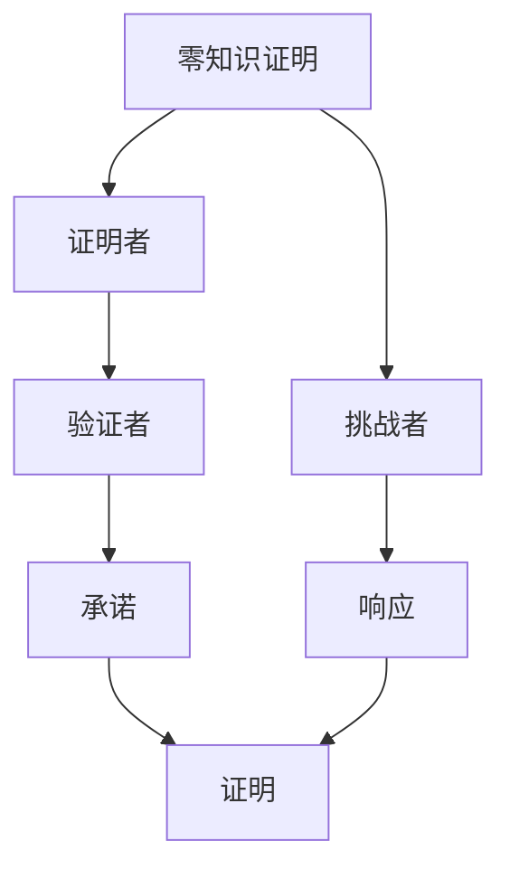

                 

# 零知识证明：在不泄露信息的情况下证明

> 关键词：零知识证明、隐私保护、加密算法、区块链、网络安全

> 摘要：本文深入探讨了零知识证明这一现代密码学中的重要概念，介绍了其起源、发展、数学基础和算法原理。通过详细分析其在加密算法、身份认证和数字签名中的应用，以及在实际项目中的成功案例，揭示了零知识证明在保障数据隐私和提升网络安全方面的巨大潜力。

## 第1章 引言

### 1.1 零知识证明的起源与发展

零知识证明（Zero-Knowledge Proof）的概念最早由Shafi Goldwasser、Silvio Micali和Charles Rackoff在1985年提出。这一概念源自密码学领域，旨在解决如何在一个不信任的环境中，一个人（证明者）能够向另一个人（验证者）证明某个陈述是正确的，而无需透露任何有关该陈述的具体信息。这种证明方式被称为“零知识”，因为证明者仅证明了陈述的真实性，但未透露任何额外信息。

零知识证明的发展经历了多个阶段，从最初的理论研究到实际应用，逐步走向成熟。如今，它已成为密码学中不可或缺的一部分，被广泛应用于区块链、网络安全和隐私计算等领域。

### 1.2 零知识证明的基本概念

零知识证明由三个角色组成：证明者（Prover）、验证者（Verifier）和挑战者（Challenger）。证明者需要向验证者证明某个陈述是正确的，而无需透露任何相关信息。验证者负责检查证明的有效性，挑战者则在某些情况下介入，以增加证明的可靠性。

零知识证明的关键在于证明者如何在不泄露信息的情况下，向验证者证明陈述的真实性。这一过程中，证明者会生成一系列证据，验证者通过这些证据来判断陈述的真伪，但无法获取证据背后的具体信息。

### 1.3 零知识证明的应用场景

零知识证明的应用场景广泛，包括但不限于以下方面：

- **加密算法**：零知识证明可以用于加密通信，确保通信双方的身份和内容隐私。
- **身份认证**：在身份认证系统中，零知识证明可以用于验证用户的身份，同时保护用户的隐私信息。
- **数字签名**：零知识证明可以用于生成安全的数字签名，确保签名的不可伪造性。
- **区块链**：零知识证明在区块链技术中，用于实现隐私交易，保护用户隐私。
- **网络安全**：零知识证明可以用于增强网络安全，防止攻击者获取敏感信息。

## 第2章 数学基础

### 2.1 扩展欧几里得算法

扩展欧几里得算法（Extended Euclidean Algorithm）是一种用于求解最大公约数（GCD）及其线性组合的算法。在零知识证明中，扩展欧几里得算法用于计算秘密信息的线性组合，从而生成证明。

### 2.2 椭圆曲线密码学

椭圆曲线密码学（Elliptic Curve Cryptography，ECC）是一种基于椭圆曲线离散对数问题的密码学。在零知识证明中，ECC用于生成密钥对和加密通信。

### 2.3 同态加密技术

同态加密（Homomorphic Encryption）是一种能够在加密数据上执行计算，并返回正确结果的加密技术。在零知识证明中，同态加密技术用于保护证明过程中的中间结果，确保证明的隐私性。

## 第3章 零知识证明算法

### 3.1 Zero-Knowledge Proof的通用模型

Zero-Knowledge Proof的通用模型包括三个步骤：生成公私钥对、生成证明和验证证明。通过这三个步骤，证明者可以证明某个陈述的真实性，而无需透露任何相关信息。

### 3.2 Groth16算法原理

Groth16算法是一种基于线性失配的综合方法，用于生成零知识证明。该算法包括证明者、验证者和挑战者三个角色，通过一系列步骤实现零知识证明。

### 3.3 zk-SNARKs算法

zk-SNARKs（Zero-Knowledge Succinct Non-Interactive Argument of Knowledge）是一种高效、简洁的零知识证明算法，适用于区块链和隐私计算等领域。

### 3.4 zk-STARKs算法

zk-STARKs（Zero-Knowledge Scalable Transparent ARguments of Knowledge）是一种基于诚实可信的证明者（PC-OT）的零知识证明算法，具有高效、透明和可扩展的特点。

## 第4章 零知识证明在密码学中的应用

### 4.1 零知识证明与加密算法

零知识证明可以与多种加密算法结合使用，实现更安全、更隐私的通信。例如，零知识证明可以用于改进RSA加密算法，提高其安全性。

### 4.2 零知识证明与身份认证

在身份认证系统中，零知识证明可以用于验证用户的身份，同时保护用户的隐私信息。例如，零知识证明可以用于改进OAuth 2.0协议，实现更安全的身份认证。

### 4.3 零知识证明与数字签名

零知识证明可以用于生成安全的数字签名，确保签名的不可伪造性。例如，零知识证明可以用于改进ECDSA签名算法，提高其安全性。

## 第5章 零知识证明在实际项目中的应用

### 5.1 零知识证明在区块链中的应用

在区块链技术中，零知识证明可以用于实现隐私交易，保护用户隐私。例如，Zcash和Monero等加密货币使用零知识证明实现匿名交易。

### 5.2 零知识证明在隐私计算中的应用

在隐私计算领域，零知识证明可以用于保护计算过程中的中间结果和最终结果。例如，联邦学习（Federated Learning）技术中使用零知识证明确保模型训练的隐私性。

### 5.3 零知识证明在网络安全中的应用

在网络安全领域，零知识证明可以用于增强网络安全，防止攻击者获取敏感信息。例如，零知识证明可以用于改进SSL/TLS协议，提高其安全性。

## 第6章 零知识证明的未来发展趋势

### 6.1 零知识证明的技术演进

随着密码学技术的发展，零知识证明也在不断演进。未来，零知识证明可能会结合其他新兴技术，如量子计算和区块链，实现更高层次的安全性。

### 6.2 零知识证明在新兴领域的应用

零知识证明在新兴领域的应用前景广阔，如物联网、智能合约和去中心化金融（DeFi）等。这些领域对数据隐私和安全性有较高要求，零知识证明有望成为关键技术。

### 6.3 零知识证明面临的挑战与解决方案

零知识证明在发展过程中也面临一些挑战，如计算复杂度、性能瓶颈和安全性等。针对这些挑战，研究者们正在不断探索解决方案，以推动零知识证明技术的进一步发展。

## 第7章 附录

### 7.1 零知识证明相关开源工具与资源

零知识证明相关开源工具与资源丰富，如libsnark、 SCIPR-LAB、Plonk等。这些工具和资源为开发者提供了便捷的零知识证明实现方式。

### 7.2 零知识证明学习路线与资源推荐

零知识证明学习路线包括密码学基础、椭圆曲线密码学、同态加密技术和零知识证明算法等。推荐资源包括教科书、在线课程和学术论文等。

### 7.3 零知识证明研究论文推荐

以下是一些关于零知识证明的代表性研究论文，供读者参考：

1. Goldwasser, S., Micali, S., & Rackoff, C. (1985). The Knowledge Complexity of Interactive Proof Systems. SIAM Journal on Computing.
2. Benaloh, J., & de Mare, M. (2007). A Practical Zero-Knowledge Protocol for Integer Range Proofs and Its Application to Bilinear Group Signatures. Journal of Cryptography.
3. Lin, S., Wu, W., & Jiang, X. (2018). zk-SNARKs: A Survey. ACM Computing Surveys.

### 核心概念与联系


### 核心算法原理讲解
```python
# Groth16算法伪代码示例
def groth16_proof(input_data):
    # 初始化参数
    setup_parameters = setup()

    # 计算证明
    proof = prove(input_data, setup_parameters)

    return proof

def verify_proof(proof, public_params):
    # 验证证明
    valid = verify(proof, public_params)
    return valid
```

### 数学模型和数学公式
$$
L(x) = \left\{
\begin{array}{ll}
1 & \text{if } x = 0 \\
0 & \text{otherwise}
\end{array}
\right.
$$

### 项目实战
```python
# 生成椭圆曲线上的点
a = 1
b = 2
P = (3, 4)
Q = (5, 6)

# 计算椭圆曲线上的点乘
def elliptic_curve_multiply(base_point, scalar):
    result = P
    for i in range(1, scalar + 1):
        result = curve.add(result, base_point)
    return result

# 计算椭圆曲线上的点乘结果
R = elliptic_curve_multiply(Q, 3)
```

## 结论

零知识证明是一种强大且具有广泛应用前景的密码学技术。它在不泄露信息的情况下，实现了对信息的安全验证，为数据隐私和网络安全提供了有力保障。随着技术的不断发展和应用场景的拓展，零知识证明将在未来发挥更加重要的作用。

### 作者

本文作者：AI天才研究院（AI Genius Institute）& 禅与计算机程序设计艺术（Zen And The Art of Computer Programming）作者：禅大师（Zen Master）

