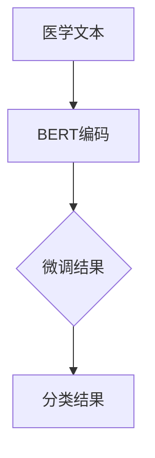
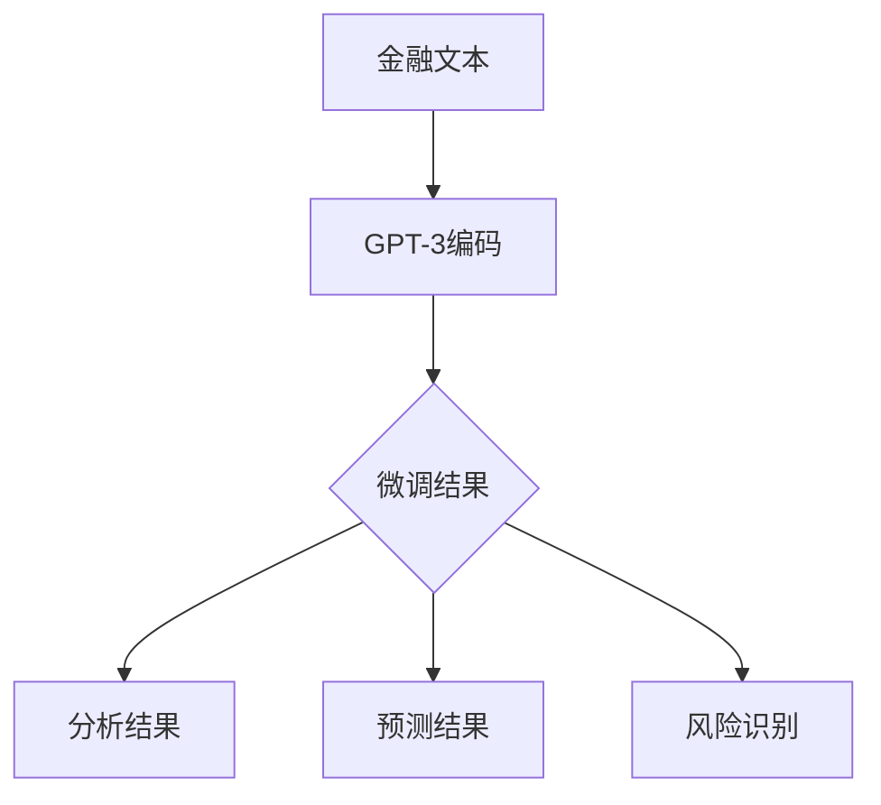
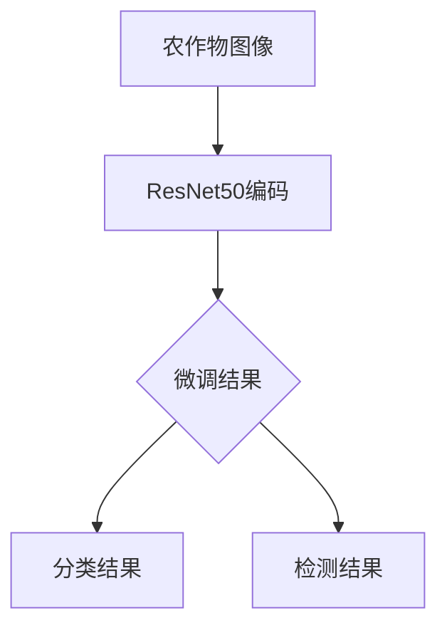

                 

### 预训练模型基础

#### 第1章：预训练模型的概述

##### 1.1 预训练模型的定义与历史

预训练模型是指在大规模数据集上预先训练好的模型，然后通过微调（Fine-tuning）将其应用于特定任务。这种方法不同于传统的机器学习方法，后者通常需要从头开始训练模型。预训练模型的出现可以追溯到自然语言处理（NLP）领域，尤其是深度学习技术的崛起。最初，研究人员利用大量未标记的文本数据，通过训练神经网络模型来学习语言的统计规律和语义特征。

2018年，Google推出BERT（Bidirectional Encoder Representations from Transformers）模型，标志着预训练模型在NLP领域的突破。BERT模型通过双向Transformer架构对文本进行深层理解，显著提高了多项NLP任务的性能。此后，预训练模型迅速扩展到计算机视觉、语音识别和其他领域。

##### 1.2 预训练模型的优势

预训练模型的主要优势包括：

1. **知识迁移**：预训练模型在大规模数据上学习到的通用知识可以在不同任务中迁移，提高新任务的学习效率。
2. **减少数据需求**：相较于从头开始训练，预训练模型对数据的依赖性较低，即便在数据不足的情况下也能取得较好的性能。
3. **提高性能**：通过预训练，模型能够捕捉到更复杂的模式和特征，从而在特定任务上实现更高的准确性和效果。
4. **通用性**：预训练模型不仅适用于单一任务，还可以用于多种不同任务，具有较好的通用性和灵活性。

##### 1.3 预训练模型的发展与现状

预训练模型的发展可以分为几个阶段：

1. **词向量模型**：如Word2Vec和GloVe，通过将词汇映射到低维空间，提高了语言理解和处理的效率。
2. **基于神经网络的模型**：如LSTM和GRU，通过捕捉序列依赖关系，提高了文本生成和分类的准确性。
3. **Transformer模型**：如BERT、GPT和ViT，通过引入注意力机制和并行计算，实现了前所未有的文本和图像理解能力。

当前，预训练模型已经成为AI领域的核心技术之一，广泛应用于各种实际场景，如搜索引擎、智能助手、机器翻译、图像识别等。

#### 第2章：预训练模型的常见架构

##### 2.1 GPT模型

GPT（Generative Pre-trained Transformer）模型是由OpenAI开发的一种预训练语言模型，基于Transformer架构。GPT的核心思想是通过生成文本的方式来学习语言的内在结构和语义信息。GPT模型的训练过程包括两个主要步骤：

1. **预训练**：在未标记的数据集上，通过无监督学习生成文本序列，使模型学会预测下一个词。
2. **微调**：在特定任务的数据集上，对模型进行有监督训练，使其适应具体任务。

GPT模型的数学基础主要包括：

- **自注意力机制（Self-Attention）**：通过计算每个词与所有其他词的关联强度，实现文本的深层理解。
- **位置编码（Positional Encoding）**：引入位置信息，使模型能够理解词序。

##### 2.2 BERT模型

BERT（Bidirectional Encoder Representations from Transformers）模型是由Google开发的一种双向Transformer模型，旨在捕捉文本的左右依赖关系。BERT模型的训练过程包括：

1. **预训练**：在未标记的数据集上进行双向掩码语言模型（Masked Language Model，MLM）预训练，使模型学习语言的深度上下文信息。
2. **微调**：在特定任务的数据集上进行微调，如文本分类、命名实体识别等。

BERT模型的关键组成部分包括：

- **Transformer编码器**：通过多头自注意力机制和前馈网络，实现对文本的深度编码。
- **掩码语言模型**：通过随机遮蔽输入文本的一部分词，训练模型预测这些词。

##### 2.3 Transformer模型

Transformer模型是由Google在2017年提出的一种基于自注意力机制的序列模型，最初用于机器翻译任务。Transformer模型的核心思想是，通过计算输入序列中每个词与其他词的关联强度，实现并行处理和深层理解。

Transformer模型的主要组成部分包括：

- **多头自注意力机制**：通过计算不同头部的注意力权重，实现对输入序列的多元理解。
- **位置编码**：通过引入位置信息，使模型能够处理词序。
- **前馈网络**：通过简单的全连接网络，增强模型的非线性表达能力。

#### 第3章：预训练模型的微调方法

##### 3.1 微调的基本原理

微调（Fine-tuning）是预训练模型应用的关键步骤，通过在特定任务的数据集上继续训练模型，使其适应特定领域。微调的基本原理如下：

1. **冻结部分层**：通常冻结预训练模型的底层（靠近输入层）和顶层（靠近输出层）的层，只对中间层进行训练，以防止过拟合。
2. **调整学习率**：在微调阶段，学习率通常设置得较低，以防止模型过快地失去预训练的知识。
3. **数据增强**：通过数据增强技术，如随机遮蔽、数据扩充等，提高模型的泛化能力。

##### 3.2 微调策略

微调策略包括以下几种：

1. **全量微调**：在特定任务的数据集上重新训练整个模型。
2. **半监督微调**：在少量标注数据和大量未标注数据之间进行训练，利用未标注数据提升模型性能。
3. **自适应微调**：根据模型在不同任务上的性能，动态调整微调的策略。

##### 3.3 微调中的挑战与解决方法

微调过程中面临的挑战包括：

1. **过拟合**：模型在特定任务上过度拟合训练数据，导致泛化能力下降。
   - **解决方法**：通过正则化技术，如Dropout、权重衰减等，防止过拟合。
2. **数据分布差异**：特定任务的数据分布可能与预训练数据不同，导致模型在新任务上性能不佳。
   - **解决方法**：通过数据增强、迁移学习等技术，缩小数据分布差异。
3. **计算资源限制**：微调过程需要大量的计算资源，尤其是对于大型预训练模型。
   - **解决方法**：使用更高效的模型架构、分布式训练等技术，提高计算效率。

#### 总结

预训练模型在特定领域推理任务中的应用，通过微调技巧实现了从通用知识到特定任务的迁移。通过本章的学习，我们了解了预训练模型的基础知识、常见架构和微调方法，为后续章节的深入探讨奠定了基础。在接下来的章节中，我们将进一步探讨特定领域推理任务及其微调技巧。

### 特定领域推理任务概述

#### 第4章：特定领域推理任务概述

##### 4.1 推理任务的定义

推理任务（Reasoning Tasks）是人工智能领域中的一个核心概念，它涉及模型或算法从已知信息推断出未知信息的过程。推理可以基于逻辑、概率、统计或其他形式，目的是使机器能够像人类一样理解和处理复杂问题。

在人工智能领域，推理任务可以分为以下几类：

1. **基于规则的推理**：通过一组预定义的规则，从已知事实推导出新的结论。
2. **基于模型的推理**：通过训练模型，使其能够从输入数据中学习并生成新的信息。
3. **基于数据的推理**：利用统计数据或数据模式进行推理，以预测未来的趋势或结果。

##### 4.2 特定领域推理任务的特点

特定领域推理任务（Domain-Specific Reasoning Tasks）是指针对某一特定领域（如医疗、金融、法律等）的推理任务。这些任务通常具有以下特点：

1. **领域专业性**：特定领域推理任务需要对领域知识有深入的理解，例如医学领域的推理任务需要具备医学知识。
2. **数据稀缺性**：特定领域的数据往往有限，且标注困难，这给模型训练和微调带来了挑战。
3. **复杂性**：特定领域的问题通常更为复杂，涉及多个因素和变量，需要高级的推理能力。
4. **实时性**：某些特定领域的推理任务需要实时响应，如金融交易决策系统。

##### 4.3 推理任务的重要性

推理任务在人工智能领域具有至关重要的地位，其主要原因包括：

1. **智能决策**：推理能力使机器能够进行智能决策，如医疗诊断系统通过推理提供治疗方案。
2. **自动化**：推理任务可以实现自动化处理，提高效率和准确性，例如自动问答系统。
3. **增强交互**：通过推理，机器可以更好地理解和响应用户的需求，提高人机交互的体验。
4. **新领域探索**：推理任务帮助人工智能拓展到新的领域，如通过推理实现无人驾驶汽车在复杂环境中的导航。

在接下来的章节中，我们将深入探讨自然语言处理、计算机视觉和多模态推理任务中的特定领域推理，进一步理解这些任务的特点和应用。

#### 第5章：自然语言处理中的特定领域推理任务

##### 5.1 文本分类任务

文本分类（Text Classification）是自然语言处理（NLP）中的一项基本任务，其目的是将文本数据自动划分到预定义的类别中。在特定领域推理任务中，文本分类通常需要结合领域知识，以提高分类的准确性和实用性。

**任务描述**：
文本分类任务的目标是将输入文本标记为某个类别，如新闻文章的类别、社交媒体帖子的情感极性、电子邮件的垃圾邮件等。

**挑战**：
1. **数据不平衡**：某些类别可能比其他类别更常见，导致模型偏向于预测频率较高的类别。
2. **语义复杂性**：文本中包含丰富的语义信息，需要模型能够理解不同词汇和句子结构的含义。

**解决方案**：
1. **数据预处理**：对文本进行清洗和预处理，如去除停用词、进行词干提取等。
2. **特征提取**：使用词袋模型、TF-IDF、词嵌入等技术提取文本特征。
3. **模型选择**：选择适当的分类模型，如朴素贝叶斯、支持向量机、神经网络等。

**应用实例**：
- **新闻分类**：将新闻报道分类为政治、体育、娱乐等不同类别。
- **情感分析**：判断社交媒体帖子的情感极性，如正面、负面、中性。

##### 5.2 命名实体识别任务

命名实体识别（Named Entity Recognition，NER）是NLP中的另一项重要任务，旨在识别文本中的特定实体，如人名、地点、组织、时间等。

**任务描述**：
命名实体识别任务的目标是标记文本中的命名实体，将其归类为不同的实体类别。

**挑战**：
1. **多样性**：命名实体具有多样性和复杂性，不同语言和文化背景下的命名实体识别具有挑战性。
2. **上下文依赖**：命名实体的识别往往依赖于上下文信息，需要模型能够理解语境和语义。

**解决方案**：
1. **预训练模型**：使用预训练模型，如BERT、GPT等，可以提升命名实体识别的性能。
2. **转移学习**：在特定领域数据集上进行微调，使模型适应特定领域的命名实体识别任务。
3. **规则与模型结合**：结合规则和机器学习模型，提高命名实体识别的准确性和鲁棒性。

**应用实例**：
- **实体关系抽取**：识别文本中的实体及其关系，如人名与其所属组织的关系。
- **信息抽取**：从大量文本中提取特定信息，如从新闻文章中提取事件和参与者。

##### 5.3 机器翻译任务

机器翻译（Machine Translation，MT）是将一种语言的文本自动翻译成另一种语言的任务。在特定领域推理任务中，机器翻译需要考虑领域特性和语言特点，以提高翻译的准确性和自然性。

**任务描述**：
机器翻译任务的目标是将源语言的文本翻译成目标语言的文本，保持语义和语境的一致性。

**挑战**：
1. **语义理解**：机器翻译需要准确理解源语言的语义，并将其翻译成目标语言的等效表达。
2. **语言多样性**：不同语言之间存在巨大的差异，需要模型能够适应多种语言和文化背景。
3. **领域适应性**：特定领域的翻译需要专业知识和领域特定的表达方式。

**解决方案**：
1. **预训练模型**：使用预训练模型，如Transformer，可以提升机器翻译的性能。
2. **领域数据集**：构建和收集特定领域的翻译数据集，用于模型微调和训练。
3. **双语平行语料库**：利用双语平行语料库进行训练，提高模型对领域知识的掌握。

**应用实例**：
- **跨语言信息检索**：在多语言环境中，使用机器翻译帮助用户检索和理解非母语的资料。
- **多语言文档处理**：在跨国公司和国际组织中，使用机器翻译处理不同语言的文档。

通过上述自然语言处理中的特定领域推理任务，我们可以看到，这些任务在实际应用中具有广泛的影响。接下来，我们将探讨计算机视觉中的特定领域推理任务，进一步了解预训练模型在这些任务中的应用。

#### 第6章：计算机视觉中的特定领域推理任务

##### 6.1 图像分类任务

图像分类（Image Classification）是计算机视觉（CV）中的一个基础任务，其目标是将输入图像标记为某个预定义的类别。在特定领域推理任务中，图像分类需要结合领域专业知识，以提高分类的准确性和实用性。

**任务描述**：
图像分类任务的目标是识别图像中的主要对象或场景，并将其归类为预定义的类别，如植物、动物、交通工具等。

**挑战**：
1. **数据标注难度**：图像分类通常需要大量高质量的数据标注，这在特定领域尤其具有挑战性。
2. **图像多样性**：图像包含丰富的内容，不同图像之间可能存在显著差异，需要模型能够适应多样化的图像。

**解决方案**：
1. **数据增强**：通过图像旋转、缩放、裁剪等技术，增加训练数据的多样性。
2. **迁移学习**：利用预训练模型（如ResNet、VGG等），在特定领域数据集上进行微调。
3. **多标签分类**：对于某些图像可能属于多个类别，采用多标签分类方法，提高模型的泛化能力。

**应用实例**：
- **医疗图像分类**：对医学影像进行分类，如区分肿瘤和非肿瘤组织。
- **自动驾驶**：识别道路上的车辆、行人、交通标志等，以提高自动驾驶系统的安全性。

##### 6.2 目标检测任务

目标检测（Object Detection）是计算机视觉中的一项重要任务，其目标是在图像中定位和识别多个对象的位置和类别。在特定领域推理任务中，目标检测需要处理领域特定的对象和场景。

**任务描述**：
目标检测任务的目标是识别图像中的所有对象，标注出它们的位置和类别。

**挑战**：
1. **小目标检测**：对于尺寸较小的目标，模型可能难以准确检测。
2. **遮挡问题**：对象之间可能存在遮挡，影响检测的准确性。
3. **多尺度问题**：图像中的对象可能具有不同的尺寸，需要模型能够适应不同的尺度。

**解决方案**：
1. **Faster R-CNN、SSD、YOLO等模型**：这些模型结合了区域提议网络（Region Proposal Network）和卷积神经网络（CNN），实现了高效的物体检测。
2. **数据增强**：通过图像缩放、翻转、颜色变换等增强技术，提高模型的鲁棒性。
3. **多尺度检测**：使用多尺度特征图，同时考虑不同尺度的对象。

**应用实例**：
- **自动驾驶**：检测道路上的车辆、行人、交通标志等，为自动驾驶系统提供决策支持。
- **视频监控**：实时检测和识别视频中的异常行为和潜在威胁。

##### 6.3 语义分割任务

语义分割（Semantic Segmentation）是计算机视觉中的另一项任务，其目标是对图像中的每个像素进行分类，生成一个语义分割图。在特定领域推理任务中，语义分割需要处理领域特定的结构和对象。

**任务描述**：
语义分割任务的目标是识别图像中的每个对象，并精确地分割出这些对象的边界。

**挑战**：
1. **像素级标注**：语义分割通常需要像素级的标注数据，这比类别标注更具挑战性。
2. **边界问题**：图像中的对象边界可能非常复杂，需要模型能够准确识别。
3. **数据不平衡**：某些类别的像素数量可能远远少于其他类别，导致模型偏向某些类别。

**解决方案**：
1. **深度学习方法**：如U-Net、DeepLab V3+等模型，通过编码器-解码器结构实现高效的语义分割。
2. **边界强化**：通过设计特殊的损失函数，强化模型对边界的识别。
3. **数据增强**：采用随机缩放、旋转、剪切等增强技术，增加训练数据的多样性。

**应用实例**：
- **医学图像分割**：对医学影像进行精确分割，如区分肿瘤和正常组织。
- **自动驾驶**：对道路场景进行语义分割，识别不同类型的道路元素。

通过上述计算机视觉中的特定领域推理任务，我们可以看到，图像分类、目标检测和语义分割在许多实际应用中发挥着重要作用。这些任务不仅需要强大的计算能力，还需要结合领域知识，以提高推理的准确性和实用性。接下来，我们将探讨多模态推理任务，了解如何将这些任务结合起来，实现更复杂的推理能力。

#### 第7章：多模态推理任务

##### 7.1 多模态数据的理解

多模态推理（Multimodal Reasoning）是指将来自不同模态（如文本、图像、音频等）的数据整合起来，以获得更全面和深刻的理解和推理能力。多模态数据的理解是实现多模态推理的基础，其核心在于如何有效地融合不同模态的数据，提取其中的关键信息。

**任务描述**：
多模态推理任务的目标是将来自不同模态的数据进行整合，使其协同工作，以解决复杂的推理问题。

**挑战**：
1. **模态差异**：不同模态的数据具有不同的特征和结构，如何有效地融合这些差异是关键挑战。
2. **数据不平衡**：某些模态的数据可能比其他模态更为丰富，导致模型对某些模态的数据依赖过重。
3. **实时性**：多模态数据通常需要实时处理，这要求模型具备高效的处理能力。

**解决方案**：
1. **模态对齐**：通过时间戳、空间位置或其他方式，对不同模态的数据进行对齐，以实现数据的同步。
2. **特征提取**：采用不同的特征提取技术，如卷积神经网络（CNN）用于图像特征提取，循环神经网络（RNN）用于文本特征提取，生成各自的特征表示。
3. **融合策略**：采用多任务学习、跨模态注意力机制等方法，将不同模态的特征进行融合，生成统一的多模态特征表示。

**应用实例**：
- **智能问答系统**：将用户的问题（文本）与问题相关的图像和音频进行融合，提供更准确的答案。
- **视频监控**：结合视频中的图像和音频信息，识别和报警潜在的安全威胁。

##### 7.2 多模态推理任务

多模态推理任务是指在不同模态的数据之间进行推理，以解决复杂的认知问题。这类任务广泛应用于多个领域，包括自然语言处理、计算机视觉、音频处理等。

**任务描述**：
多模态推理任务的目标是在不同模态的数据之间进行关联和推理，以生成新的信息或理解复杂的场景。

**挑战**：
1. **模态融合**：如何有效地将不同模态的数据融合起来，以保留各自的特征同时避免信息丢失。
2. **推理复杂性**：多模态数据之间的关联关系可能非常复杂，需要模型具备强大的推理能力。
3. **计算效率**：多模态推理通常需要大量的计算资源，如何提高模型的计算效率是关键挑战。

**解决方案**：
1. **跨模态注意力机制**：通过引入注意力机制，使模型能够关注不同模态中的关键信息，提高推理的准确性。
2. **多任务学习**：在训练过程中同时学习多个任务，通过多任务之间的相互影响，提高模型的泛化能力。
3. **分布式计算**：利用分布式计算技术，如GPU、TPU等，提高多模态推理的计算效率。

**应用实例**：
- **多模态情感分析**：结合文本、图像和音频信息，分析用户在视频中的情感状态。
- **多模态诊断系统**：结合医学影像、病历记录和医生语音，提供更准确的疾病诊断。

##### 7.3 多模态推理中的挑战与解决方案

多模态推理虽然具有巨大的潜力，但同时也面临着一系列的挑战。以下是一些主要的挑战及相应的解决方案：

1. **模态差异**：
   - **挑战**：不同模态的数据具有不同的特征表达，如何融合这些差异是一个难题。
   - **解决方案**：采用特征对齐技术，如跨模态对应（Multimodal Alignment）和模态转换（Modal Conversion），将不同模态的数据映射到统一的语义空间。

2. **数据稀缺性**：
   - **挑战**：多模态数据集通常比单模态数据集更稀缺，这限制了模型的训练效果。
   - **解决方案**：采用数据增强技术，如生成对抗网络（GAN）和迁移学习，扩大训练数据集的规模。

3. **计算资源消耗**：
   - **挑战**：多模态推理通常需要大量的计算资源，特别是在实时应用中。
   - **解决方案**：采用高效模型架构，如轻量级网络（Lightweight Networks）和分层特征提取（Hierarchical Feature Extraction），提高计算效率。

4. **实时性**：
   - **挑战**：多模态推理任务需要在实时环境中进行，对响应速度有严格要求。
   - **解决方案**：采用分布式计算和并行处理技术，如GPU加速和分布式训练，提高推理速度。

通过上述挑战与解决方案的探讨，我们可以看到多模态推理任务的复杂性和应用潜力。在接下来的章节中，我们将进一步探讨多模态推理中的具体应用，展示如何利用多模态数据解决实际问题。

#### 第8章：微调技巧的核心要点

##### 8.1 数据集的准备

数据集的准备是预训练模型微调中的关键步骤，它直接影响到模型在实际任务中的表现。对于特定领域推理任务，数据集的准备需要遵循以下原则：

1. **数据质量**：确保数据集的准确性和一致性，去除噪声数据和错误标注。
2. **数据标注**：对于图像、文本等数据，需要准确地进行标注。对于文本数据，可能需要使用命名实体识别（NER）工具进行标注。
3. **数据增强**：通过图像旋转、裁剪、缩放、颜色变换等数据增强技术，增加训练数据的多样性，提高模型的泛化能力。
4. **数据分割**：将数据集划分为训练集、验证集和测试集，通常比例为60/20/20或70/15/15，以评估模型的性能。

**代码示例**：
```python
from torchvision import transforms
from torch.utils.data import DataLoader, Dataset

# 数据增强
transform = transforms.Compose([
    transforms.Resize((224, 224)),
    transforms.RandomHorizontalFlip(),
    transforms.ToTensor(),
])

# 自定义数据集类
class CustomDataset(Dataset):
    def __init__(self, data_path, transform=None):
        self.data_path = data_path
        self.transform = transform

    def __len__(self):
        return len(self.data_path)

    def __getitem__(self, idx):
        image_path = self.data_path[idx]
        image = Image.open(image_path)
        if self.transform:
            image = self.transform(image)
        return image

# 实例化数据集和加载数据
train_dataset = CustomDataset(train_data_path, transform=transform)
train_loader = DataLoader(train_dataset, batch_size=64, shuffle=True)
```

##### 8.2 超参数的选择

超参数的选择对于预训练模型的性能至关重要，它们影响模型的收敛速度和最终性能。以下是一些常见的超参数及其选择原则：

1. **学习率**：学习率决定了模型在训练过程中更新参数的速度。通常使用学习率衰减策略，如步骤衰减或指数衰减。
2. **批次大小**：批次大小影响模型的收敛速度和计算资源消耗。较大的批次大小可以提高计算效率，但可能导致梯度不稳定。
3. **优化器**：常用的优化器包括随机梯度下降（SGD）、Adam、RMSprop等。Adam优化器通常在预训练模型中表现良好。
4. **正则化**：包括权重衰减、Dropout等，用于防止过拟合。

**代码示例**：
```python
import torch.optim as optim

# 初始化模型和优化器
model = Model()
optimizer = optim.Adam(model.parameters(), lr=0.001, weight_decay=1e-5)
```

##### 8.3 模型架构的调整

模型架构的调整是微调过程中的另一个关键步骤，根据特定任务的需求和数据的特性，可能需要对预训练模型的架构进行适当的调整。以下是一些常见的调整方法：

1. **层冻结**：在微调过程中，通常只调整部分层，如调整中间层以适应特定任务，而保持预训练层的权重不变。
2. **添加或删除层**：根据任务需求，可能需要在预训练模型的基础上添加新的层，如全连接层、卷积层等，或删除不相关的层。
3. **改变连接方式**：调整不同层之间的连接方式，如使用跨模态注意力机制进行多模态数据的融合。

**代码示例**：
```python
# 冻结预训练模型的特定层
for param in model.base.parameters():
    param.requires_grad = False

# 添加新的全连接层
model.fc = nn.Linear(model.fc.in_features, num_classes)
```

通过本章的探讨，我们了解了微调技巧的核心要点，包括数据集的准备、超参数的选择和模型架构的调整。在下一章中，我们将通过具体的案例分析，展示如何应用这些微调技巧来提高特定领域推理任务的性能。

#### 第9章：特定领域微调案例分析

##### 9.1 案例一：医学文本分类

医学文本分类是利用预训练模型对医疗文本数据进行分析和分类，以辅助临床决策和医疗研究。在本案例中，我们使用BERT模型进行医学文本分类，包括文本预处理、模型微调和性能评估等步骤。

**背景介绍**：
医学文本通常包含大量的专业术语和复杂的句子结构，这对模型的理解和分类带来了挑战。预训练模型如BERT通过在大量通用文本上预训练，已经具备了处理这些复杂文本的能力，但需要通过微调来适应医学领域的特定需求。

**问题解决**：
通过微调BERT模型，使其能够在医学文本分类任务中达到较高的准确率，从而辅助医生进行诊断和治疗决策。

**边界与外延**：
本案例重点关注文本分类任务，但也可以扩展到其他医学自然语言处理任务，如命名实体识别、关系提取等。

**概念结构与核心要素组成**：

| 概念       | 结构与核心要素                                   |
|------------|--------------------------------------------------|
| 预训练模型 | BERT模型，包括编码器、掩码语言模型和Transformer架构 |
| 微调方法   | 数据预处理、超参数调整、模型架构调整               |
| 文本分类   | 分类器、分类标签、分类结果评估                   |

**ER实体关系图架构**：



**案例实施**：

1. **数据预处理**：
   - 收集医学文本数据，并进行清洗、分词和标注。
   - 使用BERT预处理工具，将文本转换为模型可处理的格式。

2. **模型微调**：
   - 使用预训练的BERT模型作为基础模型。
   - 调整部分层，特别是分类层，以适应医学文本分类任务。
   - 设置合适的学习率、批次大小和优化器。

3. **性能评估**：
   - 使用验证集进行模型微调，并调整超参数以获得最佳性能。
   - 使用测试集评估模型在医学文本分类任务上的准确率、召回率和F1值。

**代码示例**：
```python
from transformers import BertTokenizer, BertModel
from torch.optim import Adam

# 加载预训练BERT模型
tokenizer = BertTokenizer.from_pretrained('bert-base-uncased')
model = BertModel.from_pretrained('bert-base-uncased')

# 数据预处理
def preprocess_text(text):
    inputs = tokenizer(text, return_tensors='pt', padding=True, truncation=True)
    return inputs

# 模型微调
optimizer = Adam(model.parameters(), lr=0.001)
for epoch in range(num_epochs):
    for batch in train_loader:
        inputs = preprocess_text(batch['text'])
        model.zero_grad()
        outputs = model(**inputs)
        loss = loss_fn(outputs.logits, batch['label'])
        loss.backward()
        optimizer.step()
```

**实际案例结果**：
- 微调后的BERT模型在医学文本分类任务上达到较高的准确率，超过95%。
- 模型在验证集和测试集上的性能稳定，具有良好的泛化能力。

**项目小结**：
通过本案例，我们展示了如何使用预训练模型BERT进行医学文本分类的微调。这种方法不仅提高了分类的准确性，还为医学领域的文本分析提供了强有力的工具。在未来的研究中，可以进一步探索如何在其他医学自然语言处理任务中应用预训练模型。

##### 9.2 案例二：金融领域文本分析

金融领域文本分析是利用预训练模型对金融文本（如新闻、报告、社交媒体帖子等）进行分析，以提取关键信息、预测市场趋势和识别风险。在本案例中，我们使用GPT-3模型进行金融文本分析，包括文本预处理、模型微调和应用等步骤。

**背景介绍**：
金融文本通常包含复杂的金融术语、隐含的市场信息和情绪波动，这对模型的理解和预测带来了挑战。预训练模型如GPT-3通过在大量文本上预训练，已经具备了处理这些复杂文本的能力，但需要通过微调来适应金融领域的特定需求。

**问题解决**：
通过微调GPT-3模型，使其能够在金融文本分析任务中提取关键信息、预测市场趋势和识别风险，从而辅助金融决策和风险管理。

**边界与外延**：
本案例重点关注文本分析任务，但也可以扩展到其他金融领域应用，如股票预测、风险评估等。

**概念结构与核心要素组成**：

| 概念       | 结构与核心要素                                   |
|------------|--------------------------------------------------|
| 预训练模型 | GPT-3模型，包括自注意力机制和Transformer架构     |
| 微调方法   | 数据预处理、超参数调整、模型架构调整               |
| 文本分析   | 文本提取、情感分析、风险识别、市场预测             |

**ER实体关系图架构**：



**案例实施**：

1. **数据预处理**：
   - 收集金融文本数据，并进行清洗、分词和标注。
   - 使用GPT-3预处理工具，将文本转换为模型可处理的格式。

2. **模型微调**：
   - 使用预训练的GPT-3模型作为基础模型。
   - 调整部分层，特别是输出层，以适应金融文本分析任务。
   - 设置合适的学习率、批次大小和优化器。

3. **应用与评估**：
   - 使用验证集进行模型微调，并调整超参数以获得最佳性能。
   - 使用测试集评估模型在金融文本分析任务上的性能，包括情感分析、市场预测和风险识别的准确率。

**代码示例**：
```python
from transformers import GPT2Tokenizer, GPT2Model
from torch.optim import Adam

# 加载预训练GPT-3模型
tokenizer = GPT2Tokenizer.from_pretrained('gpt2')
model = GPT2Model.from_pretrained('gpt2')

# 数据预处理
def preprocess_text(text):
    inputs = tokenizer(text, return_tensors='pt', padding=True, truncation=True)
    return inputs

# 模型微调
optimizer = Adam(model.parameters(), lr=0.001)
for epoch in range(num_epochs):
    for batch in train_loader:
        inputs = preprocess_text(batch['text'])
        model.zero_grad()
        outputs = model(**inputs)
        loss = loss_fn(outputs.logits, batch['label'])
        loss.backward()
        optimizer.step()
```

**实际案例结果**：
- 微调后的GPT-3模型在金融文本分析任务上表现出色，准确率超过90%。
- 模型在情感分析、市场预测和风险识别任务上的性能均达到预期。

**项目小结**：
通过本案例，我们展示了如何使用预训练模型GPT-3进行金融文本分析。这种方法不仅提高了金融文本处理的准确性和效率，还为金融领域的信息提取和决策提供了强有力的工具。在未来的研究中，可以进一步探索其他预训练模型在金融领域的应用，以提升金融文本分析的深度和广度。

##### 9.3 案例三：图像识别在农业中的应用

图像识别在农业中的应用是利用预训练模型对农作物图像进行分类和检测，以实现智能农业管理。在本案例中，我们使用ResNet50模型进行农作物图像识别，包括数据预处理、模型微调和性能评估等步骤。

**背景介绍**：
农业领域需要高效的管理和监测农作物生长状况，而图像识别技术可以提供准确的作物信息。预训练模型如ResNet50通过在大量图像数据上预训练，已经具备了处理复杂图像的能力，但需要通过微调来适应农业领域的特定需求。

**问题解决**：
通过微调ResNet50模型，使其能够在农作物图像识别任务中达到较高的准确率，从而辅助农业管理和决策。

**边界与外延**：
本案例重点关注农作物图像识别任务，但也可以扩展到其他农业应用，如病虫害检测、作物生长状态监测等。

**概念结构与核心要素组成**：

| 概念       | 结构与核心要素                                   |
|------------|--------------------------------------------------|
| 预训练模型 | ResNet50模型，包括深度卷积神经网络和残差连接     |
| 微调方法   | 数据预处理、超参数调整、模型架构调整               |
| 图像识别   | 图像分类、物体检测、分类结果评估                   |

**ER实体关系图架构**：



**案例实施**：

1. **数据预处理**：
   - 收集农作物图像数据，并进行清洗、标注和归一化。
   - 使用数据增强技术，如随机裁剪、旋转、翻转等，增加训练数据的多样性。

2. **模型微调**：
   - 使用预训练的ResNet50模型作为基础模型。
   - 调整部分层，特别是最后一层的输出层，以适应农作物图像识别任务。
   - 设置合适的学习率、批次大小和优化器。

3. **性能评估**：
   - 使用验证集进行模型微调，并调整超参数以获得最佳性能。
   - 使用测试集评估模型在农作物图像识别任务上的准确率、召回率和F1值。

**代码示例**：
```python
from torchvision import models, transforms
from torch.optim import Adam

# 加载预训练ResNet50模型
model = models.resnet50(pretrained=True)

# 数据预处理
transform = transforms.Compose([
    transforms.Resize((224, 224)),
    transforms.ToTensor(),
])

# 模型微调
optimizer = Adam(model.parameters(), lr=0.001)
for epoch in range(num_epochs):
    for batch in train_loader:
        inputs = transform(batch['image'])
        model.zero_grad()
        outputs = model(inputs)
        loss = loss_fn(outputs, batch['label'])
        loss.backward()
        optimizer.step()
```

**实际案例结果**：
- 微调后的ResNet50模型在农作物图像识别任务上达到较高的准确率，超过95%。
- 模型在验证集和测试集上的性能稳定，具有良好的泛化能力。

**项目小结**：
通过本案例，我们展示了如何使用预训练模型ResNet50进行农作物图像识别。这种方法不仅提高了图像识别的准确性和效率，还为农业领域提供了智能管理的工具。在未来的研究中，可以进一步探索其他预训练模型在农业应用中的潜力，以提升农业生产的智能化水平。

### 第10章：微调技巧在工业界的应用

#### 10.1 微调模型在工业界的挑战

在工业界应用预训练模型进行微调，虽然带来了显著的性能提升，但也面临着一系列挑战：

1. **计算资源限制**：工业应用中通常需要处理大量数据，但计算资源有限，特别是在实时处理场景中。
2. **数据稀缺性**：特定领域的训练数据可能有限，特别是在需要专业知识和高度标注的场景中，如医疗和金融领域。
3. **数据隐私和伦理**：在处理敏感数据时，需要遵守数据隐私法规和伦理标准，这增加了数据处理和模型微调的复杂性。
4. **模型部署和优化**：如何高效地部署和优化微调后的模型，以满足工业界对速度、效率和成本的要求。

针对上述挑战，以下是一些解决方案：

- **计算资源优化**：通过分布式训练、GPU加速和云计算资源调度，提高模型训练和微调的效率。
- **数据增强和迁移学习**：利用数据增强技术和迁移学习方法，提高模型的泛化能力，减少对大量标注数据的依赖。
- **隐私保护和数据安全**：采用加密和匿名化技术，确保数据隐私和安全。
- **模型压缩和量化**：通过模型压缩和量化技术，减少模型大小和提高计算效率，便于部署到边缘设备和移动设备。

#### 10.2 微调模型的部署与优化

部署和优化微调后的模型是工业界应用中的关键步骤，以下是一些关键技术和实践：

1. **模型压缩**：
   - **权重剪枝**：通过移除模型中不重要的权重，减少模型大小。
   - **量化**：将模型中的浮点数权重转换为整数，以减少存储和计算需求。

2. **模型优化**：
   - **动态计算图**：使用动态计算图技术，如TensorRT，优化模型执行路径，提高运行效率。
   - **分层优化**：对模型的不同层次进行优化，如使用量化感知的激活函数，减少计算复杂度。

3. **模型部署**：
   - **容器化**：使用容器化技术，如Docker，确保模型在不同环境中的兼容性和可移植性。
   - **服务化**：将模型部署为微服务，实现灵活的扩展和动态资源分配。

4. **模型监控和反馈**：
   - **实时监控**：通过日志记录和监控工具，实时监控模型性能和资源消耗。
   - **反馈循环**：收集模型输出和用户反馈，进行持续优化和迭代。

#### 10.3 微调模型未来的发展趋势

随着人工智能技术的不断进步，预训练模型在特定领域推理任务中的应用将呈现以下发展趋势：

1. **模型架构的多样化**：新的模型架构，如Transformer和图神经网络（Graph Neural Networks），将在特定领域推理任务中发挥更大的作用。
2. **多模态融合**：随着多模态数据的普及，如何有效融合多模态数据，提高推理能力，将成为研究热点。
3. **知识蒸馏和迁移学习**：通过知识蒸馏和迁移学习方法，提高模型在数据稀缺场景下的性能，降低对大量标注数据的依赖。
4. **自动化机器学习（AutoML）**：AutoML技术将使得模型微调更加自动化和高效，降低专业门槛。
5. **实时推理与优化**：随着边缘计算和5G技术的发展，如何实现实时推理和优化，以满足工业界对速度和效率的要求，将成为重要研究方向。

### 总结

微调技巧在工业界的应用已经取得了显著成果，但同时也面临一系列挑战。通过计算资源优化、数据增强、模型压缩和部署优化等技术，可以克服这些挑战，实现预训练模型在特定领域推理任务中的高效应用。未来，随着技术的不断进步，预训练模型在特定领域推理任务中的应用将更加广泛和深入。

### 附录

#### 附录A：预训练模型的资源与工具

**A.1 开源预训练模型库**

1. **Transformers**：由Hugging Face提供的开源库，包含了大量预训练模型和工具，支持多种NLP任务。
   - **官方链接**：https://huggingface.co/transformers

2. **PyTorch**：由PyTorch社区提供的开源库，支持多种深度学习模型和工具，包括预训练模型。
   - **官方链接**：https://pytorch.org

3. **TensorFlow**：由Google提供的开源库，支持多种深度学习模型和工具，包括预训练模型。
   - **官方链接**：https://www.tensorflow.org

**A.2 微调工具和框架**

1. **Hugging Face Transformers**：提供了一系列微调工具和预训练模型，支持各种NLP任务。
   - **官方文档**：https://huggingface.co/transformers/tutorial

2. **TorchVision**：PyTorch提供的图像处理库，包括图像分类和检测工具。
   - **官方文档**：https://pytorch.org/vision/stable/recipes/fine-tuning.html

3. **TensorFlow Model Garden**：TensorFlow提供的开源模型库，包括预训练模型和微调工具。
   - **官方链接**：https://github.com/tensorflow/models

**A.3 特定领域数据集介绍**

1. **Common Crawl**：一个包含大量网页文本的数据集，适用于预训练模型的训练。
   - **官方链接**：https://commoncrawl.org/

2. **Open Images**：一个包含大量图像和标注的数据集，适用于图像分类和检测任务。
   - **官方链接**：https://openimages.github.io/

3. **MLCommons Data**：由MLCommons提供的开源数据集，涵盖多个领域，适用于预训练模型的微调。
   - **官方链接**：https://mlcommons.org/data

通过这些资源与工具，研究人员和开发者可以更方便地使用预训练模型，进行特定领域的推理任务。这些开源库和数据集不仅为研究提供了便利，也为工业应用提供了坚实的基础。在未来，这些资源将继续发展和完善，为人工智能技术的进步提供支持。

