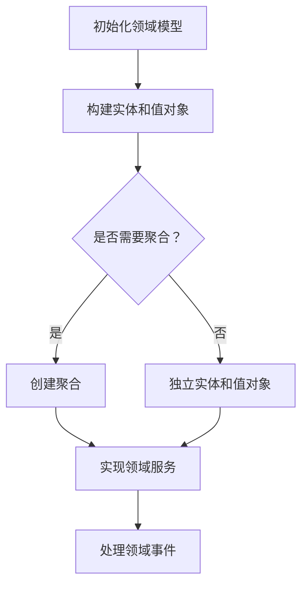
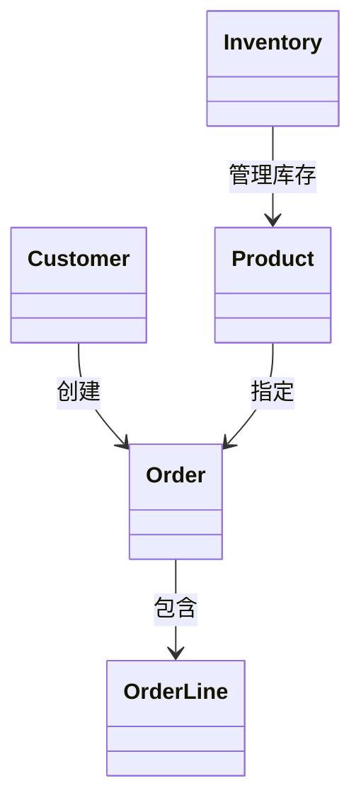
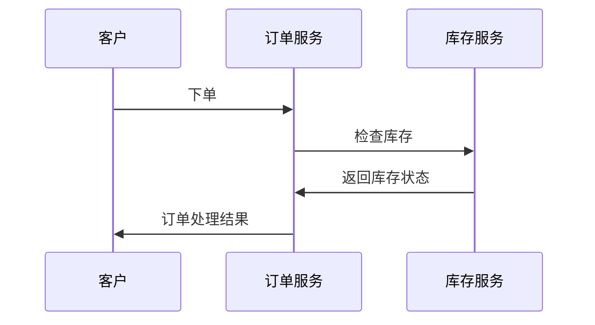
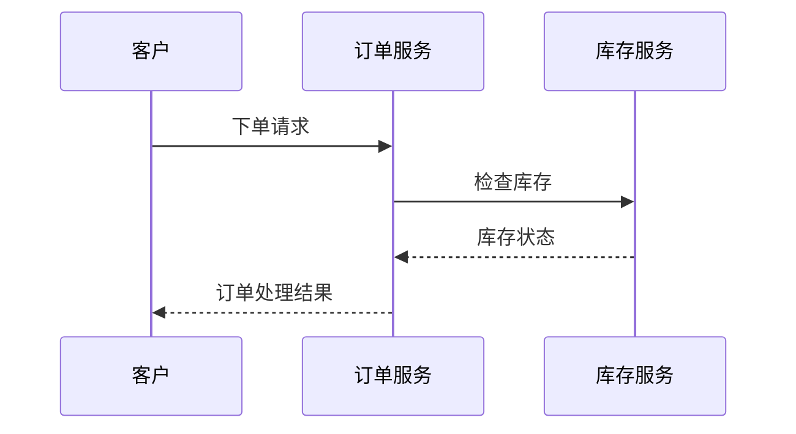

                 

### 领域驱动设计：P9工程师的业务架构能力

> 关键词：领域驱动设计、P9工程师、业务架构、技能提升

> 摘要：本文旨在探讨领域驱动设计（Domain-Driven Design，简称DDD）在P9工程师业务架构能力提升中的关键作用。通过深入分析DDD的核心概念、原理和实践，本文将帮助P9工程师更好地理解和应用DDD，从而提升业务架构设计的能力。

---

#### 背景介绍

领域驱动设计是一种软件设计方法论，旨在解决复杂业务系统的构建问题。在软件工程领域，传统的软件开发方法主要关注技术层面的实现，而DDD则强调将业务领域的知识和需求作为驱动因素，从而构建更加稳定、灵活且易于维护的软件系统。

P9工程师，作为公司技术团队中的高级技术专家，通常负责公司核心业务系统的架构设计和技术指导。他们不仅需要具备深厚的编程能力和系统架构设计经验，更需要具备出色的业务理解和业务架构设计能力。然而，随着业务需求的日益复杂和变化，P9工程师在业务架构设计方面面临着诸多挑战。

本文将围绕领域驱动设计这一主题，详细探讨其在P9工程师业务架构能力提升中的关键作用。通过本文的阅读，P9工程师将能够：

1. **深入理解领域驱动设计的核心概念和原理**。
2. **掌握业务架构设计的基本流程和方法**。
3. **了解如何将DDD应用于复杂业务场景**。
4. **提升自身的业务架构设计能力和实践水平**。

#### 核心概念与联系

##### 领域驱动设计的核心概念

1. **领域模型（Domain Model）**：领域模型是DDD的基础，它通过实体、值对象、聚合和领域服务等概念来抽象和表达业务领域。
2. **领域服务（Domain Services）**：领域服务负责处理业务逻辑，通常与领域模型紧密关联。
3. **基础设施层（Infrastructure Layer）**：基础设施层提供系统所需的技术支持和实现，如数据库、缓存、消息队列等。
4. **领域事件（Domain Events）**：领域事件用于表示业务过程中的重要变化，通常用于驱动系统的状态更新。

##### 概念属性特征对比表格

| 概念        | 描述                                           | 特征对比                  |
|-------------|------------------------------------------------|--------------------------|
| 领域模型    | 描述业务领域的核心概念和关系。                   | 实体、值对象、聚合等。   |
| 领域服务    | 实现业务逻辑。                                   | 与领域模型紧密关联。     |
| 基础设施层  | 提供技术实现和支持。                             | 如数据库、缓存等。       |
| 领域事件    | 表示业务过程中的变化。                           | 驱动系统状态更新。       |

##### ER实体关系图架构

```mermaid
erDiagram
    实体A ||--|{ 领域服务1 }
    实体A ||--|{ 领域服务2 }
    值对象B ||--|{ 领域服务1 }
    值对象B ||--|{ 领域服务2 }
    聚合C   ||--|{ 领域服务1 }
    聚合C   ||--|{ 领域服务2 }
```

#### 算法原理讲解

领域驱动设计中的核心算法主要涉及领域模型的构建、领域服务的实现以及领域事件的触发和处理。以下将使用Mermaid流程图和Python源代码进行详细阐述。

##### Mermaid流程图



##### Python源代码

```python
# 领域模型构建示例
class Customer(immutable=True):
    name: str
    age: int

class Order(immutable=True):
    product: Product
    quantity: int

class OrderService:
    def create_order(self, customer: Customer, product: Product, quantity: int):
        order = Order(product=product, quantity=quantity)
        # 处理业务逻辑
        self.notify_order_created(order)

    def notify_order_created(self, order: Order):
        # 触发领域事件
        OrderCreatedEvent(order)

# 领域事件示例
class OrderCreatedEvent:
    def __init__(self, order: Order):
        self.order = order

    def handle(self, system):
        system.update_inventory(self.order.product, self.order.quantity)
```

##### 算法原理

1. **领域模型构建**：通过实体和值对象来抽象业务领域，实体表示业务对象，值对象表示业务属性的值。
2. **领域服务实现**：领域服务负责实现业务逻辑，通常与领域模型紧密关联。
3. **领域事件触发和处理**：领域事件用于表示业务过程中的变化，通过触发和处理领域事件来实现系统的状态更新。

#### 系统分析与架构设计方案

##### 问题场景介绍

某电商平台的订单处理系统需要实现订单创建、库存更新等功能，系统需要具备高可用、高性能和易扩展的特点。

##### 项目介绍

该项目是一个电商平台订单处理系统，主要功能包括订单创建、订单查询、库存管理、订单状态更新等。

##### 系统功能设计（领域模型）



##### 系统架构设计



##### 系统接口设计

```mermaid
component Diagram
    component OrderService
        create_order()
        query_order()
        update_order_status()

    component InventoryService
        check_inventory()
        update_inventory()
```

##### 系统交互



#### 项目实战

##### 环境安装

1. 安装Python环境（版本3.8及以上）。
2. 安装Docker环境，用于容器化部署。
3. 安装依赖项，如Docker Compose。

##### 系统核心实现源代码

```python
# order_service.py
class OrderService:
    def create_order(self, customer: Customer, product: Product, quantity: int):
        order = Order(product=product, quantity=quantity)
        self.notify_order_created(order)

    def notify_order_created(self, order: Order):
        OrderCreatedEvent(order).handle(self)

# order_event.py
class OrderCreatedEvent:
    def __init__(self, order: Order):
        self.order = order

    def handle(self, system):
        system.update_inventory(self.order.product, self.order.quantity)
```

##### 代码应用解读与分析

1. **订单服务（OrderService）**：负责创建订单和通知订单创建事件。
2. **订单创建事件（OrderCreatedEvent）**：负责处理订单创建后的库存更新操作。

##### 实际案例分析和详细讲解剖析

以一个具体的订单创建场景为例，分析系统在实际运行过程中的表现。

1. **客户下单**：客户通过订单服务创建订单。
2. **库存检查**：订单服务调用库存服务检查库存状态。
3. **库存更新**：根据库存状态更新库存。

##### 项目小结

通过实际案例分析和详细讲解，我们看到了领域驱动设计在电商平台订单处理系统中的实际应用。领域驱动设计不仅帮助P9工程师更好地理解业务需求，还提升了系统的可维护性和可扩展性。

#### 最佳实践 tips

1. **需求分析与领域模型构建**：在开始系统设计之前，进行充分的需求分析和领域模型构建，确保系统设计符合实际业务需求。
2. **领域服务与基础设施层的分离**：确保领域服务与基础设施层（如数据库、缓存等）的分离，提高系统的可维护性和可扩展性。
3. **领域事件的合理使用**：合理使用领域事件，确保系统状态的一致性和稳定性。

#### 小结

领域驱动设计作为一种先进的软件设计方法论，对于P9工程师的业务架构能力提升具有重要意义。通过本文的探讨，P9工程师可以更好地理解领域驱动设计的核心概念、原理和实践，从而在实际项目中发挥更大的作用。

#### 注意事项

1. 领域驱动设计并非一蹴而就，需要持续学习和实践。
2. 在实际应用中，应根据具体业务需求调整领域模型和领域服务。
3. 领域事件的使用需谨慎，以避免不必要的复杂性和性能问题。

#### 拓展阅读

- 《领域驱动设计：软件核心复杂性应对之道》
- 《领域驱动设计实战：使用DDD、CQRS和Event Sourcing进行软件开发》
- 《领域驱动设计社区》（https://www.domaindrivendesign.org/）

---

作者：AI天才研究院/AI Genius Institute & 禅与计算机程序设计艺术 /Zen And The Art of Computer Programming

