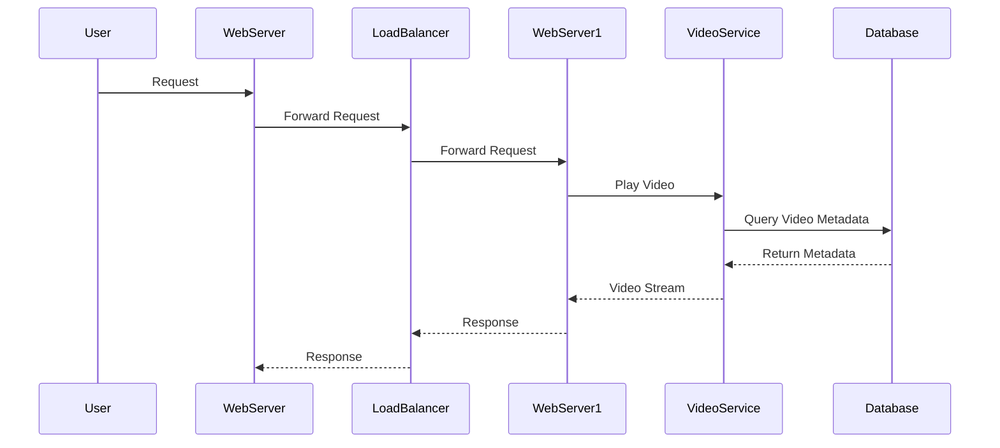
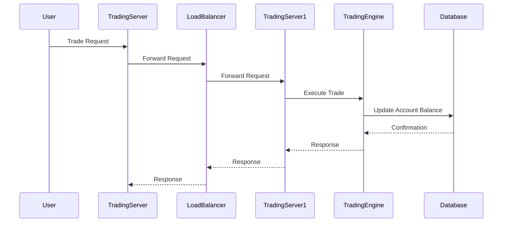

                 


### 第1章：高可用性的核心概念

#### 1.1 高可用性的定义

**定义**：高可用性（High Availability，简称HA）是指系统在长时间运行中，能够以尽可能高的概率保持可用状态的能力。高可用性通常用于描述关键业务系统，如金融系统、电子商务平台等，需要高可靠性以避免因系统故障导致的经济损失和品牌形象损害。

**背景**：在现代信息技术环境中，随着云计算、大数据和物联网等技术的发展，系统的复杂性和依赖性不断增加。系统的高可用性成为了企业和组织关注的重要问题，因为系统故障可能导致业务中断、数据丢失和服务不可用。

**问题描述**：高可用性的核心问题是，如何在系统面临各种潜在风险（如硬件故障、软件错误、网络问题等）时，保证系统能够快速恢复并继续提供服务。

**问题解决**：高可用性主要通过以下方式实现：
1. **冗余设计**：通过硬件冗余、软件冗余和数据冗余来提高系统的可靠性。
2. **故障检测与恢复**：实时监控系统的运行状态，并在检测到故障时迅速切换到备用系统或服务。
3. **负载均衡**：将工作负载分配到多个节点，避免单点故障。

**边界与外延**：高可用性与可靠性、可用性、可持续性等概念紧密相关。虽然高可用性主要关注系统在运行中的可用性，但实现高可用性通常需要考虑系统的可靠性、安全性和可持续性。

**核心要素组成**：
1. **硬件冗余**：通过多台服务器、存储设备和网络设备来实现冗余。
2. **软件冗余**：通过冗余的软件组件或服务来实现故障转移。
3. **数据冗余**：通过数据备份和灾难恢复策略来保护数据完整性。
4. **监控和告警**：通过实时监控系统状态，并设置告警机制来快速响应故障。

#### 1.2 高可用性与可靠性

**定义**：可靠性（Reliability）是指系统在特定条件下，能够正确执行预定功能的概率。高可靠性系统通常具有较高的无故障运行时间（Mean Time To Failure, MTTF）和较低的故障率。

**核心概念与联系**：

| 概念          | 定义                                                     | 联系                                               |
|---------------|----------------------------------------------------------|----------------------------------------------------|
| 可用性（Availability） | 系统在运行过程中可用的概率。                             | 高可用性与可靠性密切相关，可用性是衡量可靠性的一个指标。 |
| 故障率（Failure Rate）  | 单位时间内系统发生故障的次数。                           | 故障率与可靠性成反比，即故障率越低，系统越可靠。         |
| MTTF          | 平均无故障时间，即系统从开始运行到首次发生故障的平均时间。 | MTTF是衡量系统可靠性的重要指标。                     |

**对比表格**：

| 指标       | 含义                                                     | 与高可用性的关系                                  |
|------------|----------------------------------------------------------|---------------------------------------------------|
| 可用性     | 系统在运行中可用的概率。                                 | 高可用性的核心指标，越高越好。                     |
| 故障率     | 系统在运行中发生故障的频率。                             | 低故障率有助于提高高可用性。                       |
| MTTF       | 系统平均无故障运行时间。                                 | MTTF越长，系统高可用性越高。                      |
| MTTR       | 平均故障恢复时间。                                       | MTTR越短，系统高可用性越高。                      |

#### 1.3 高可用性的关键指标

**关键指标**：

1. **平均无故障时间（MTTF）**：系统平均无故障运行的时间长度。
2. **平均故障恢复时间（MTTR）**：系统从故障发生到恢复正常运行的平均时间。
3. **系统整体可用性**：系统的整体可用性通常用百分比表示，计算公式为：\[ \text{系统整体可用性} = \frac{\text{MTTF}}{\text{MTTF} + \text{MTTR}} \]

**Mermaid ER实体关系图架构**：

```mermaid
erDiagram
  MTTF ||--|{ Availability }|--|| MTTR
  Availability ||--|{ Overall Availability }|--|| MTTF
```

### 第2章：常见高可用性误区

#### 2.1 误区1：高可用性意味着100%可用

**误区描述**：许多人对高可用性存在误解，认为高可用性等同于100%可用性。

**误区分析**：实际上，100%的高可用性几乎是不可能实现的。任何系统都会面临潜在的风险和故障，例如硬件故障、软件错误、网络问题等。即使采用了冗余设计和故障转移机制，也无法完全消除所有故障。

**解决方案**：应设定合理的可用性目标，并根据业务需求进行平衡。例如，金融行业可能要求99.9%的可用性，而一些非关键业务可能接受99%的可用性。

#### 2.2 误区2：硬件冗余即可保证高可用性

**误区描述**：有些人认为，通过增加硬件冗余（如多台服务器、存储设备等）即可实现高可用性。

**误区分析**：硬件冗余是提高系统可靠性的重要手段，但高可用性不仅仅依赖于硬件。软件层面也需要冗余和容错机制，例如数据库复制、分布式缓存等。

**解决方案**：应综合考虑硬件和软件冗余，确保系统在多个层面上具有高可用性。

#### 2.3 误区3：高可用性不需要定期维护

**误区描述**：一些人认为，一旦系统实现了高可用性，就可以长期不用维护。

**误区分析**：高可用性系统需要定期维护和更新，以应对潜在的风险和故障。维护包括硬件检查、软件升级、安全漏洞修复等。

**解决方案**：应建立定期维护计划，并确保维护工作按时完成。

#### 2.4 误区4：高可用性只针对关键业务

**误区描述**：有些人认为，只有关键业务才需要高可用性。

**误区分析**：高可用性不仅仅是关键业务的保障，对任何有业务连续性需求的系统都至关重要。即使是非关键业务，一旦系统故障，也会对业务运营造成影响。

**解决方案**：应对所有有业务连续性需求的系统实施高可用性设计。

### 第3章：高可用性设计原则

#### 3.1 设计原则1：确保系统的弹性

**原则描述**：弹性是指系统能够在资源紧张或故障发生时，自动调整资源分配和处理能力。

**应用场景**：例如，当系统处理负载增加时，自动增加服务器资源以应对高峰期；当服务器发生故障时，自动切换到备用服务器。

**实现方法**：
1. **自动扩展**：使用云计算平台，如AWS、Azure等，根据负载自动扩展资源。
2. **负载均衡**：将工作负载分配到多个节点，避免单点故障。

#### 3.2 设计原则2：优化系统的容错性

**原则描述**：容错性是指系统能够在部分组件失效时，仍然能够正常运行。

**应用场景**：例如，当数据库服务器发生故障时，系统可以自动切换到备用数据库服务器。

**实现方法**：
1. **冗余设计**：通过硬件冗余、软件冗余和数据冗余来提高系统的容错性。
2. **故障转移**：在检测到故障时，自动切换到备用系统或服务。

#### 3.3 设计原则3：合理利用负载均衡

**原则描述**：负载均衡是将工作负载分配到多个节点，以避免单点过载。

**应用场景**：例如，在电子商务平台上，多个前端服务器共同承载用户请求，避免单台服务器过载。

**实现方法**：
1. **软件负载均衡器**：如Nginx、HAProxy等，可以动态分配请求到不同的后端节点。
2. **硬件负载均衡器**：如F5 BIG-IP，提供高吞吐量和低延迟的负载均衡能力。

### 第4章：高可用性架构案例分析

#### 4.1 案例分析1：互联网公司高可用架构设计

**背景介绍**：某互联网公司是一家提供在线视频服务的公司，用户量巨大，对系统的可用性要求极高。

**项目介绍**：
- **系统功能设计**：包括视频播放、用户管理、支付处理等。
- **系统架构设计**：采用分布式架构，包括前端负载均衡、后端数据库集群、缓存层等。
- **系统接口设计**：提供RESTful API接口，实现前后端分离。

**系统架构图**：



**实际案例分析与详细讲解**：

- **弹性设计**：通过负载均衡器动态分配请求，实现自动扩展和负载均衡。
- **容错设计**：采用数据库集群和备份策略，确保数据的高可用性。
- **安全设计**：通过SSL/TLS加密通信，确保数据传输安全。

**项目小结**：该互联网公司通过合理的高可用性设计，实现了系统的弹性、容错性和安全性，满足了大规模用户的需求。

#### 4.2 案例分析2：金融行业高可用性实践

**背景介绍**：某金融公司是一家提供在线交易服务的公司，对系统的高可用性要求极高，以确保交易数据的安全和交易的连续性。

**项目介绍**：
- **系统功能设计**：包括交易处理、账户管理、风险控制等。
- **系统架构设计**：采用分布式架构，包括交易服务器集群、数据库集群、备份系统等。
- **系统接口设计**：提供高吞吐量的交易API接口，确保交易数据的实时性和准确性。

**系统架构图**：



**实际案例分析与详细讲解**：

- **冗余设计**：通过交易服务器集群和数据库集群实现冗余，确保系统在故障时能够快速切换。
- **故障转移**：在检测到服务器或数据库故障时，自动切换到备用服务器或数据库。
- **数据备份**：定期进行数据备份，确保在数据损坏或丢失时能够快速恢复。

**项目小结**：该金融公司通过合理的高可用性设计和实践，确保了在线交易系统的稳定性和安全性，满足了高频率交易的需求。

## 第二部分：高可用性实践与建议

### 第5章：高可用性实践方法

#### 5.1 实践方法1：故障转移与故障恢复

**故障转移**：
- **定义**：故障转移（Failover）是指系统在检测到主节点故障时，自动切换到备用节点继续提供服务。
- **实现方法**：
  - **主备模式**：主节点故障时，备用节点立即接管工作。
  - **双主模式**：两个节点同时提供服务，任何一个节点故障，另一个节点立即接管。

**故障恢复**：
- **定义**：故障恢复（Recovery）是指系统在故障发生后，恢复正常运行的过程。
- **实现方法**：
  - **自动恢复**：系统自动检测故障，并执行恢复操作。
  - **手动恢复**：人工干预，根据故障情况和恢复策略执行恢复操作。

#### 5.2 实践方法2：集群部署与状态监控

**集群部署**：
- **定义**：集群部署（Cluster Deployment）是指将多个节点组成一个集群，共同提供服务。
- **实现方法**：
  - **节点添加与删除**：根据负载和故障情况，动态添加或删除节点。
  - **负载均衡**：将工作负载均衡分配到集群中的各个节点。

**状态监控**：
- **定义**：状态监控（State Monitoring）是指实时监控系统的运行状态，及时发现和处理故障。
- **实现方法**：
  - **监控系统**：如Zabbix、Nagios等，监控系统的各种指标（如CPU使用率、内存使用率、磁盘使用率等）。
  - **告警机制**：当监控到异常时，发送告警通知相关人员。

#### 5.3 实践方法3：数据备份与恢复

**数据备份**：
- **定义**：数据备份（Data Backup）是指将系统数据复制到其他存储介质中，以备不时之需。
- **实现方法**：
  - **全量备份**：定期对整个系统数据进行备份。
  - **增量备份**：只备份自上次备份以来发生变化的数据。

**数据恢复**：
- **定义**：数据恢复（Data Recovery）是指在数据丢失或损坏后，将数据恢复到原始状态。
- **实现方法**：
  - **自动恢复**：系统自动执行数据恢复操作。
  - **手动恢复**：人工干预，根据备份策略和数据恢复工具执行恢复操作。

### 第6章：高可用性方案设计与实现

#### 6.1 方案设计1：高可用数据库方案

**方案设计目标**：
- 保证数据库的高可用性，确保数据的一致性和完整性。
- 提高数据库的性能和可扩展性。

**方案设计内容**：
- **主从复制**：通过主从复制，确保数据在主节点和从节点之间保持同步。
- **双主模式**：实现双主模式，提高系统的容错能力。
- **读写分离**：将读操作和写操作分离到不同的节点，提高系统的性能。

**实现步骤**：
1. 设计数据库架构，确定主从复制和双主模式的配置。
2. 实现主从复制和双主模式的部署。
3. 配置读写分离，优化性能。

#### 6.2 方案设计2：高可用网络方案

**方案设计目标**：
- 提高网络的可靠性，确保数据传输的稳定性和安全性。
- 提高网络的性能和可扩展性。

**方案设计内容**：
- **负载均衡**：通过负载均衡器，将网络流量分配到不同的网络设备，避免单点过载。
- **冗余网络**：通过多个网络路径，确保数据传输的稳定性。
- **安全策略**：实施安全策略，如防火墙、入侵检测等，保障网络的安全性。

**实现步骤**：
1. 设计网络拓扑结构，确定负载均衡和冗余网络的配置。
2. 部署负载均衡器和网络设备。
3. 配置安全策略，确保网络的安全性。

#### 6.3 方案设计3：高可用存储方案

**方案设计目标**：
- 保证存储的高可用性，确保数据的持久性和可靠性。
- 提高存储的性能和可扩展性。

**方案设计内容**：
- **存储冗余**：通过冗余的存储设备，确保数据的高可靠性。
- **数据备份**：定期进行数据备份，确保在数据丢失或损坏时能够快速恢复。
- **存储虚拟化**：通过存储虚拟化技术，提高存储的性能和可扩展性。

**实现步骤**：
1. 设计存储架构，确定存储冗余和数据备份的配置。
2. 部署存储设备和虚拟化平台。
3. 配置数据备份策略，确保数据的安全。

### 第7章：高可用性常见问题与解决方案

#### 7.1 常见问题1：高可用性成本控制

**问题描述**：实现高可用性通常需要投入大量资金和人力资源，如何在不增加成本的情况下提高系统的可用性？

**解决方案**：
- **成本效益分析**：在实施高可用性之前，进行成本效益分析，确保投资回报率（ROI）。
- **优化资源利用**：通过虚拟化技术，提高硬件资源利用率，降低硬件采购成本。
- **自动化运维**：通过自动化工具，降低运维成本，提高运维效率。

#### 7.2 常见问题2：高可用性性能优化

**问题描述**：高可用性设计是否会影响系统的性能？如何优化系统性能？

**解决方案**：
- **负载均衡**：通过负载均衡，将工作负载分配到多个节点，提高系统的吞吐量。
- **缓存技术**：使用缓存技术，减少数据库的访问频率，提高系统的响应速度。
- **优化数据库查询**：通过优化数据库查询，减少查询时间，提高系统性能。

#### 7.3 常见问题3：高可用性安全策略

**问题描述**：在高可用性设计中，如何确保系统的安全性？

**解决方案**：
- **安全策略**：实施严格的安全策略，如访问控制、数据加密等，保障系统的安全性。
- **入侵检测**：使用入侵检测系统（IDS），实时监控系统的安全状态，及时发现和处理安全威胁。
- **定期安全审计**：定期进行安全审计，评估系统的安全性，及时修复漏洞。

### 第8章：高可用性最佳实践

#### 8.1 最佳实践1：定期审查和更新高可用性策略

**实践内容**：定期审查和更新高可用性策略，确保策略与业务需求和技术发展保持一致。

**实施步骤**：
1. 定期评估高可用性策略的有效性。
2. 更新策略，以适应业务发展和技术变化。
3. 实施更新后的策略。

#### 8.2 最佳实践2：高可用性培训和意识提升

**实践内容**：对相关人员进行高可用性培训和意识提升，确保团队成员了解高可用性原理和实践。

**实施步骤**：
1. 设计培训课程，包括高可用性原理、实践方法和案例分析。
2. 组织培训活动，提高团队成员的高可用性意识。
3. 定期进行培训效果评估，持续改进培训内容。

#### 8.3 最佳实践3：持续集成与持续部署

**实践内容**：通过持续集成（CI）和持续部署（CD），确保系统在开发、测试和生产环境之间的高可用性。

**实施步骤**：
1. 设计CI/CD流程，包括代码仓库管理、自动化测试和自动化部署。
2. 实施CI/CD流程，确保系统的稳定性和可靠性。
3. 定期评估CI/CD流程的效果，持续优化流程。

## 附录A：高可用性技术选型指南

**附录内容**：
- **硬件选型**：包括服务器、存储设备和网络设备的选型指南。
- **软件选型**：包括操作系统、数据库、负载均衡器和监控工具的选型指南。
- **服务提供商**：介绍高可用性服务的提供商，如云计算平台、数据库服务提供商等。

**附录实施步骤**：
1. 根据业务需求和预算，确定硬件和软件的需求。
2. 选择合适的硬件和软件供应商。
3. 实施选型方案，确保系统的可用性和可靠性。

## 附录B：高可用性相关工具与资源

**附录内容**：
- **高可用性工具**：介绍常用的高可用性工具，如负载均衡器、监控工具、备份工具等。
- **学习资源**：推荐高可用性相关的书籍、在线课程和博客文章。
- **技术社区**：介绍高可用性相关的技术社区和论坛，如Stack Overflow、Reddit等。

**附录实施步骤**：
1. 确定所需的高可用性工具和资源。
2. 评估和选择合适的工具和资源。
3. 应用工具和资源，提高系统的高可用性。

# 附录

## 附录A：高可用性技术选型指南

### 附录A.1：硬件选型指南

**服务器选型**：
- **需求分析**：根据业务需求和预算，确定服务器的CPU、内存、存储和带宽需求。
- **硬件选择**：选择满足需求的服务器，如高性能服务器、虚拟化服务器等。

**存储设备选型**：
- **需求分析**：根据数据量和读写性能需求，确定存储设备的类型和容量。
- **硬件选择**：选择满足需求的存储设备，如固态硬盘（SSD）、分布式存储系统等。

**网络设备选型**：
- **需求分析**：根据网络流量和带宽需求，确定网络设备的类型和容量。
- **硬件选择**：选择满足需求的网络设备，如交换机、路由器、防火墙等。

### 附录A.2：软件选型指南

**操作系统选型**：
- **需求分析**：根据业务需求和硬件环境，确定操作系统的类型和版本。
- **软件选择**：选择满足需求的操作系统，如Linux、Windows Server等。

**数据库选型**：
- **需求分析**：根据数据量和查询性能需求，确定数据库的类型和版本。
- **软件选择**：选择满足需求的数据库，如MySQL、PostgreSQL、MongoDB等。

**负载均衡器选型**：
- **需求分析**：根据网络流量和并发连接数，确定负载均衡器的类型和性能。
- **软件选择**：选择满足需求的负载均衡器，如Nginx、HAProxy等。

**监控工具选型**：
- **需求分析**：根据监控需求和性能指标，确定监控工具的类型和功能。
- **软件选择**：选择满足需求的监控工具，如Zabbix、Nagios、Prometheus等。

### 附录A.3：服务提供商选型指南

**云计算平台**：
- **需求分析**：根据业务需求和预算，确定合适的云计算平台。
- **服务提供商**：选择满足需求的云计算平台，如AWS、Azure、Google Cloud等。

**数据库服务提供商**：
- **需求分析**：根据数据库需求和性能要求，确定合适的数据库服务提供商。
- **服务提供商**：选择满足需求的数据库服务提供商，如Amazon RDS、Google Cloud SQL、Azure Database等。

## 附录B：高可用性相关工具与资源

### 附录B.1：高可用性工具

**负载均衡器**：
- **Nginx**：高性能的Web服务器和反向代理服务器。
- **HAProxy**：开源的高性能负载均衡器。

**监控工具**：
- **Zabbix**：开源的企业级监控解决方案。
- **Nagios**：开源的IT基础设施监控工具。
- **Prometheus**：开源的监控、报警和可视化工具。

**备份工具**：
- **Bacula**：开源的备份解决方案。
- **Veeam**：商业备份和恢复软件。

### 附录B.2：学习资源

**书籍**：
- 《高可用性系统设计》
- 《云计算与大数据》
- 《系统架构：设计与实践》

**在线课程**：
- Coursera上的《云计算基础》
- Udemy上的《高可用性设计实战》
- edX上的《数据结构与算法》

**博客文章**：
- 《深入理解分布式系统》
- 《如何设计高并发系统》
- 《云计算实战》

### 附录B.3：技术社区

**社区论坛**：
- Stack Overflow：编程和技术问答社区。
- Reddit：技术讨论和分享社区。
- GitHub：代码托管和协作平台。

**专业组织**：
- IEEE：电气和电子工程师协会。
- ACM：计算机协会。
- 云计算协会：专注于云计算的协会。

