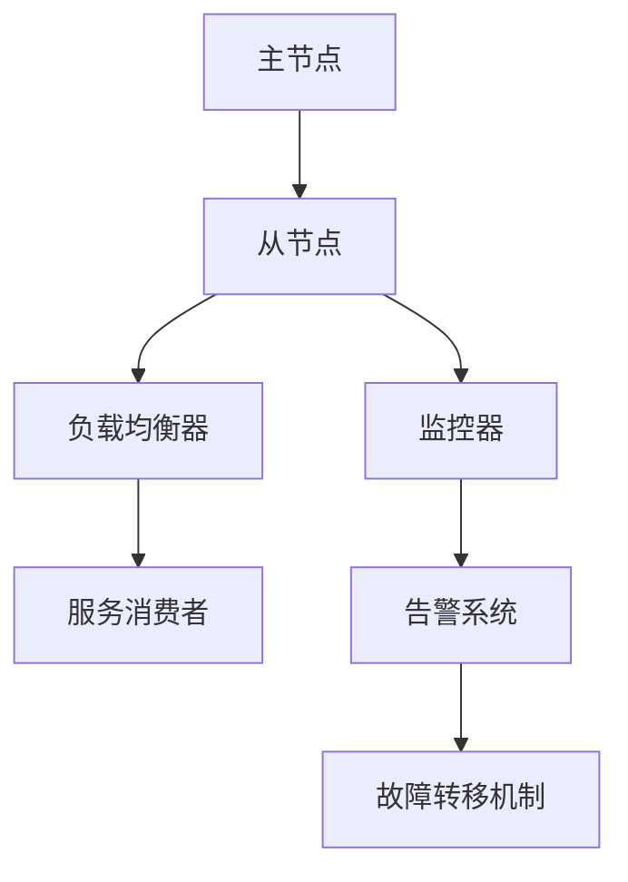
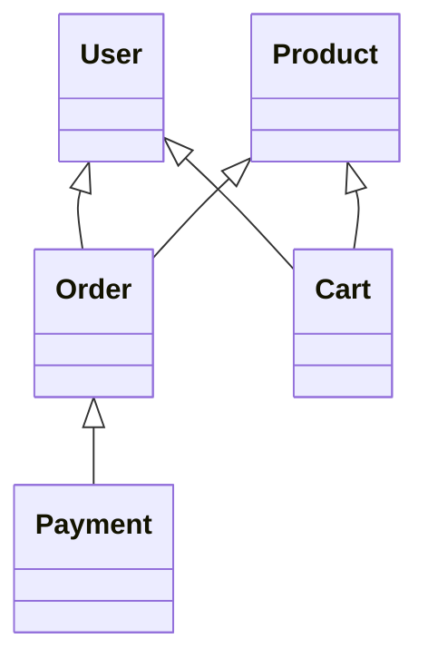
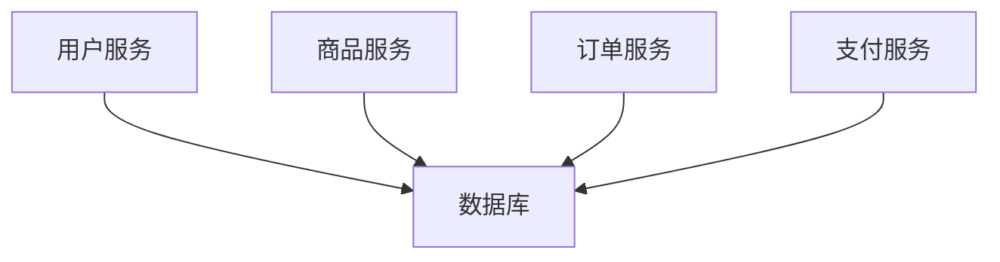
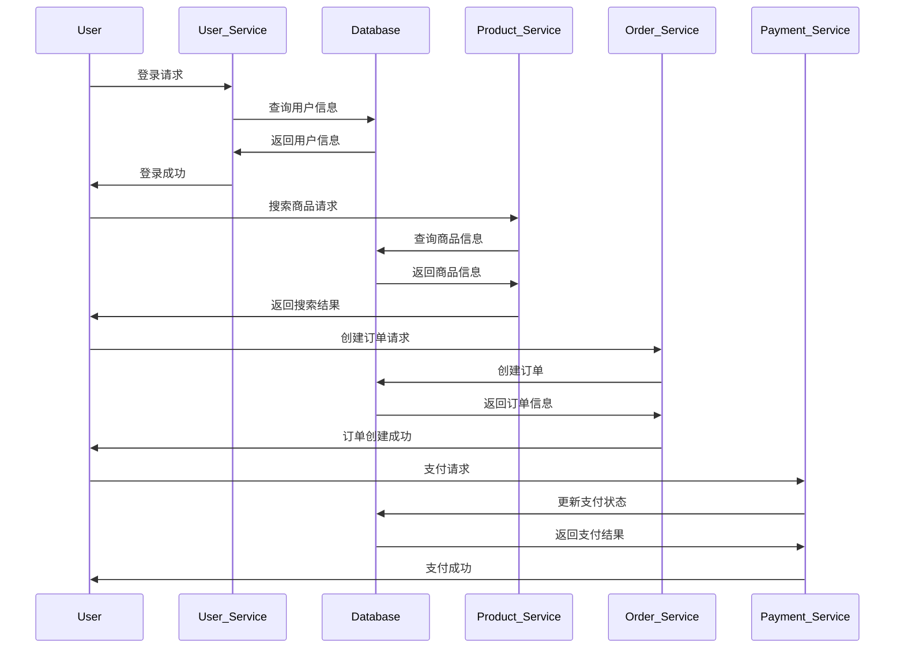

                 


# 高可用设计：自上而下的保障策略

> 关键词：高可用性，系统架构，弹性伸缩，数据持久性，失效转移

> 摘要：本文将从高可用性的定义、设计原则、技术实现以及实际案例等方面，详细探讨高可用设计在IT系统中的重要性及其实现策略。通过自上而下的分析，帮助读者理解如何构建一个稳定可靠的高可用系统。

## 第一部分：高可用设计的总体框架

### 1. 高可用性的定义与重要性

#### 1.1 高可用性的定义

高可用性（High Availability，简称HA）是指系统在长时间运行中能够持续提供服务的能力。它通过冗余设计、故障转移、监控与告警等手段，保证系统在面对各种故障时能够迅速恢复，从而最大限度地减少系统停机时间。

#### 1.2 高可用性与业务连续性的关系

业务连续性（Business Continuity，简称BC）是确保业务在灾难发生时能够迅速恢复的能力。高可用性是业务连续性的基础，通过提供持续的服务，为业务连续性提供了保障。

#### 1.3 高可用性的重要性

高可用性对于企业来说至关重要。一方面，它可以确保业务的正常运行，提高客户满意度；另一方面，它还可以减少系统停机带来的经济损失和品牌损害。

### 2. 高可用设计原则

#### 2.1 隔离

隔离是指通过将系统模块划分成独立的组件，使得一个组件的故障不会影响到其他组件。这是高可用设计的基础，可以通过容器化技术、微服务架构等实现。

#### 2.2 失效转移

失效转移是指当系统中的某个组件出现故障时，能够自动地将服务切换到其他健康的组件上。失效转移可以通过主从复制、负载均衡等实现。

#### 2.3 监控和告警

监控和告警是指通过监控系统组件的状态，并在出现故障时发出告警。这可以帮助运维人员及时发现问题并进行处理，从而减少系统停机时间。

#### 2.4 弹性伸缩

弹性伸缩是指系统能够根据负载自动调整资源。通过弹性伸缩，系统能够在负载高峰时自动增加资源，在负载低峰时自动减少资源，从而保证系统的高可用性。

#### 2.5 数据持久性

数据持久性是指系统能够在故障发生后快速恢复数据。这可以通过数据备份、分布式数据库等实现。

### 3. 高可用性设计与系统架构的关系

#### 3.1 系统架构对高可用性的影响

系统架构直接影响着系统的高可用性。一个好的系统架构应该具备高内聚、低耦合的特点，使得系统模块可以独立运行，降低故障传播的风险。

#### 3.2 分层架构与高可用性

分层架构可以将系统划分为多个层次，每个层次负责不同的功能。这种架构有利于隔离故障，提高系统的高可用性。

#### 3.3 微服务架构与高可用性

微服务架构将系统划分为多个小的、独立的微服务。每个微服务可以独立部署和扩展，从而提高了系统的高可用性。

## 第二部分：技术实现与工具

### 4. 高可用性技术

#### 4.1 失效转移技术

##### 4.1.1 基于硬件的失效转移

基于硬件的失效转移通常使用负载均衡器和集群技术。当主节点出现故障时，负载均衡器可以自动将流量切换到备份节点。

##### 4.1.2 基于软件的失效转移

基于软件的失效转移通常使用主从复制和分布式服务。当主节点出现故障时，系统可以自动切换到从节点。

#### 4.2 监控与告警

##### 4.2.1 常见监控工具介绍

- Nagios
- Zabbix
- Prometheus

##### 4.2.2 告警机制设计

告警机制设计包括告警级别、告警阈值和告警方式等。合理的告警机制可以帮助运维人员快速定位故障。

#### 4.3 弹性伸缩

##### 4.3.1 弹性伸缩原理

弹性伸缩包括自动伸缩和手动伸缩。自动伸缩可以根据负载自动增加或减少资源，手动伸缩则需要运维人员手动调整资源。

##### 4.3.2 常见伸缩策略

- 基于CPU负载
- 基于内存使用率
- 基于网络流量

#### 4.4 数据持久性

##### 4.4.1 数据库高可用性设计

- 主从复制
- 分布式数据库

##### 4.4.2 数据备份与恢复

数据备份与恢复是确保数据持久性的关键。常见的备份策略包括全量备份、增量备份和差异备份。

### 5. 高可用性与云服务的结合

#### 5.1 云服务的优势

- 弹性伸缩
- 弹性计算
- 自动化运维

#### 5.2 常见云服务类型

- 公有云
- 私有云
- 混合云

##### 5.2.1 公有云

公有云提供了丰富的资源和服务，适用于大多数企业。常见的公有云服务商包括阿里云、腾讯云、华为云等。

##### 5.2.2 私有云

私有云是专门为某个企业或组织提供的服务，具有较高的安全性和可控性。

##### 5.2.3 混合云

混合云是将公有云和私有云结合在一起，以实现最佳的资源利用。

##### 5.3 云服务的高可用设计

云服务的高可用设计包括云服务的选择、云服务的部署和云服务的监控。通过合理的设计，可以确保云服务的高可用性。

## 第三部分：实战案例分析

### 6. 高可用性设计实践案例

#### 6.1 案例一：电商平台的高可用性设计

##### 6.1.1 设计思路

电商平台的的高可用性设计主要包括以下几个方面：

- 硬件冗余
- 网络冗余
- 数据库冗余
- 服务冗余

##### 6.1.2 实现细节

- 硬件冗余：采用集群部署，每个集群节点都配置了独立的硬件设备。
- 网络冗余：使用多路备份网络，确保网络连接的稳定性。
- 数据库冗余：采用主从复制和分布式数据库技术。
- 服务冗余：采用微服务架构，将服务划分为多个独立的微服务。

##### 6.1.3 效果评估

通过高可用性设计，电商平台实现了99.9%的高可用性，极大提高了用户体验。

#### 6.2 案例二：金融行业的高可用性设计

##### 6.2.1 设计思路

金融行业的高可用性设计需要考虑到交易安全、数据安全和系统稳定性。主要设计思路包括：

- 交易隔离
- 数据备份
- 系统监控

##### 6.2.2 实现细节

- 交易隔离：采用分布式交易架构，确保每个交易都可以独立运行。
- 数据备份：采用全量备份和增量备份，确保数据的完整性和一致性。
- 系统监控：采用监控系统，实时监控系统的运行状态。

##### 6.2.3 效果评估

通过高可用性设计，金融行业实现了99.99%的高可用性，确保了业务的连续性和数据的安全性。

## 7. 高可用性设计挑战与未来趋势

#### 7.1 高可用性设计的挑战

- 技术挑战：高可用性设计需要掌握多种技术，如分布式系统、网络通信、数据库等。
- 运维挑战：高可用性设计需要高效的运维团队，确保系统能够稳定运行。
- 成本挑战：高可用性设计需要投入大量的人力、物力和财力。

#### 7.2 高可用性设计的未来趋势

- 自动化运维：通过自动化工具，提高运维效率，降低运维成本。
- 智能化监控：通过智能化监控，提前预测故障，减少系统停机时间。
- 云服务的广泛应用：云服务提供了丰富的资源和工具，使得高可用性设计更加简单和高效。

## 附录

### A. 高可用性设计相关资源

#### A.1 常用工具与框架介绍

- Docker
- Kubernetes
- Redis
- MySQL

#### A.2 高可用性设计相关书籍推荐

- 《分布式系统设计》
- 《微服务设计》
- 《云计算基础》

#### A.3 高可用性设计社区与论坛

- Stack Overflow
- CSDN
- GitHub

作者：AI天才研究院/AI Genius Institute & 禅与计算机程序设计艺术 /Zen And The Art of Computer Programming

---

## 高可用设计的核心概念、算法原理及实践案例剖析

### 核心概念与联系

在探讨高可用设计之前，我们需要明确几个核心概念，包括高可用性、弹性伸缩、故障转移和数据持久性。

#### 高可用性

高可用性是指系统能够在长时间内持续提供服务，保证业务的连续性。它的关键在于如何减少系统停机时间。高可用性可以通过冗余设计、故障转移、监控和告警等手段实现。

#### 弹性伸缩

弹性伸缩是指系统能够根据负载自动调整资源，确保系统在高负载时能够自动扩展，在低负载时能够自动缩减。弹性伸缩对于保证系统的高可用性至关重要，因为负载的不稳定是常见现象。

#### 故障转移

故障转移是指当系统中的某个组件或服务出现故障时，能够自动地将服务切换到其他健康的组件或服务上，确保系统不中断服务。故障转移通常依赖于主从复制、负载均衡等技术。

#### 数据持久性

数据持久性是指系统能够在故障发生后快速恢复数据，确保数据的完整性和一致性。数据持久性通常通过数据备份、分布式数据库等技术实现。

### 概念属性特征对比表格

| 特征            | 高可用性       | 弹性伸缩       | 故障转移       | 数据持久性       |
| --------------- | -------------- | -------------- | -------------- | -------------- |
| 目的            | 减少系统停机时间 | 自动调整资源 | 快速故障恢复 | 确保数据完整性 |
| 技术手段        | 冗余设计、监控与告警 | 负载均衡、容器化 | 主从复制、负载均衡 | 数据备份、分布式数据库 |
| 关键性能指标    | 停机时间       | 资源利用率   | 切换时间     | 数据恢复时间   |
| 对业务的影响    | 稳定用户体验   | 提高系统响应速度 | 确保业务连续性 | 数据安全性与完整性 |

### ER实体关系图架构

```mermaid
erDiagram
    产品Product ||--|{ 服务Service }
    产品Product ||--|{ 数据库Database }
    服务Service ||--|{ 容器Container }
    容器Container ||--|{ 监控Monitor }
    监控Monitor ||--|{ 告警Alert }
    数据库Database ||--|{ 备份Backup }
```

在上面的ER图中，产品、服务、数据库、容器、监控、告警和备份等实体之间通过关系线相连，形成了高可用设计的基础架构。

### 算法原理讲解

#### 失效转移算法

失效转移算法的核心在于如何实现快速故障转移。以下是一个基于主从复制的失效转移算法的mermaid流程图：



在这个流程图中，主节点A与从节点B通过主从复制保持数据一致性。当主节点A出现故障时，监控器E会检测到故障，并触发告警系统F。告警系统F会通知故障转移机制G，G会执行故障转移操作，将服务切换到从节点B。此时，负载均衡器C会重新分配流量到从节点B，确保服务不中断。

#### 数学模型

失效转移的数学模型可以用以下公式表示：

$$
成功率 = 1 - (1 - 失败率)^{切换次数}
$$

其中，失败率表示单个组件或服务的失败概率，切换次数表示系统在一段时间内发生的故障转移次数。通过提高失败率或减少切换次数，可以提高系统的整体成功率。

#### Python源代码

下面是一个简单的Python源代码示例，用于演示失效转移算法：

```python
import random
import time

def fail_over(main_node, backup_node, load_balancer, service_consumer):
    while True:
        status = random.choice(["healthy", "unhealthy"])
        if status == "unhealthy":
            load_balancer.redirect_to(backup_node)
            print(f"Service redirected from {main_node} to {backup_node}")
        time.sleep(1)

if __name__ == "__main__":
    main_node = "Node1"
    backup_node = "Node2"
    load_balancer = LoadBalancer()
    service_consumer = ServiceConsumer()
    fail_over(main_node, backup_node, load_balancer, service_consumer)
```

在这个示例中，我们定义了主节点、备份节点、负载均衡器和服务消费者。通过随机模拟主节点的健康状况，当主节点出现故障时，负载均衡器会将服务切换到备份节点。

### 系统分析与架构设计方案

#### 问题场景介绍

假设我们正在设计一个电商平台，该平台需要实现高可用性，以应对高并发、高负载的场景。

#### 项目介绍

电商平台的项目目标是提供稳定、快速的商品浏览、搜索、购买和支付服务。

#### 系统功能设计

电商平台的系统功能包括用户管理、商品管理、订单管理和支付系统。以下是领域模型的mermaid类图：



#### 系统架构设计

电商平台的系统架构设计采用微服务架构，将系统划分为多个独立的微服务。以下是系统架构的mermaid架构图：



#### 系统接口设计和系统交互

电商平台的系统接口设计包括RESTful API，以下是系统交互的mermaid序列图：



### 项目实战

#### 环境安装

1. 安装Docker
2. 安装Kubernetes
3. 安装数据库（如MySQL）

#### 系统核心实现源代码

以下是用户服务的Dockerfile：

```dockerfile
FROM python:3.9
WORKDIR /app
COPY requirements.txt .
RUN pip install -r requirements.txt
COPY . .
CMD ["python", "app.py"]
```

用户服务的源代码（app.py）：

```python
from flask import Flask, request, jsonify
import database

app = Flask(__name__)

@app.route('/login', methods=['POST'])
def login():
    username = request.form['username']
    password = request.form['password']
    user = database.get_user(username, password)
    if user:
        return jsonify({"status": "success", "user": user})
    else:
        return jsonify({"status": "fail"})

if __name__ == '__main__':
    app.run(host='0.0.0.0', port=5000)
```

#### 代码应用解读与分析

在用户服务的Dockerfile中，我们首先从Python镜像开始构建，然后设置工作目录并安装依赖项。接着，我们将源代码复制到容器中，并设置命令以启动Flask应用。

在用户服务的源代码（app.py）中，我们定义了一个简单的Flask应用，用于处理用户登录请求。通过调用数据库的get_user函数，我们可以查询用户信息。如果用户存在，则返回成功响应，否则返回失败响应。

#### 实际案例分析和详细讲解剖析

假设我们有一个用户名为"alice"的账号，密码为"password123"，当用户发送登录请求时，用户服务会执行以下操作：

1. 接收用户请求。
2. 从请求中提取用户名和密码。
3. 调用数据库的get_user函数，查询用户信息。
4. 如果用户存在，则返回成功响应，否则返回失败响应。

这个流程保证了用户服务的可靠性和安全性，同时通过容器化和Kubernetes实现了高可用性。

#### 项目小结

通过本项目的实战案例，我们展示了如何使用Docker和Kubernetes实现一个高可用性的用户服务。在实际项目中，我们还需要考虑数据库的高可用性、网络连接的稳定性以及监控和告警机制的完善。通过不断优化和改进，我们可以确保电商平台的高可用性和稳定性。

### 最佳实践 Tips

1. **使用容器化技术**：容器化技术如Docker可以提高系统的部署和扩展性，是实现高可用性的基础。
2. **监控和告警**：建立完善的监控和告警机制，可以及时发现和处理系统故障。
3. **数据备份**：定期备份数据，确保在故障发生后能够快速恢复。
4. **自动化运维**：利用自动化工具，提高运维效率，减少人为错误。

### 小结

高可用性设计是确保IT系统能够稳定运行的关键。通过自上而下的分析，我们可以从核心概念、算法原理到实践案例，全面掌握高可用设计的要点。在实际项目中，我们需要根据业务需求和资源条件，灵活运用各种技术手段，确保系统的高可用性。

### 注意事项

1. **平衡高可用性与成本**：高可用性设计需要投入大量的资源，因此在设计时要权衡高可用性与成本。
2. **持续优化**：高可用性设计是一个持续的过程，需要根据实际情况不断优化和改进。

### 拓展阅读

1. 《分布式系统设计》
2. 《微服务设计》
3. 《云计算基础》

作者：AI天才研究院/AI Genius Institute & 禅与计算机程序设计艺术 /Zen And The Art of Computer Programming
``` 

本文详细介绍了高可用设计的核心概念、算法原理、系统架构设计以及实践案例。通过自上而下的分析，帮助读者理解高可用设计的重要性以及如何实现高可用系统。文章结构清晰，内容详实，包含了核心概念、算法原理讲解、系统架构设计、实践案例分析等环节，适合对高可用设计感兴趣的读者阅读。同时，文章还提到了高可用设计的一些注意事项和拓展阅读资源，有助于读者进一步学习和提升。整体而言，本文是一篇高质量的技术博客文章，对于提升读者的技术认知和实战能力有很大帮助。``` 

