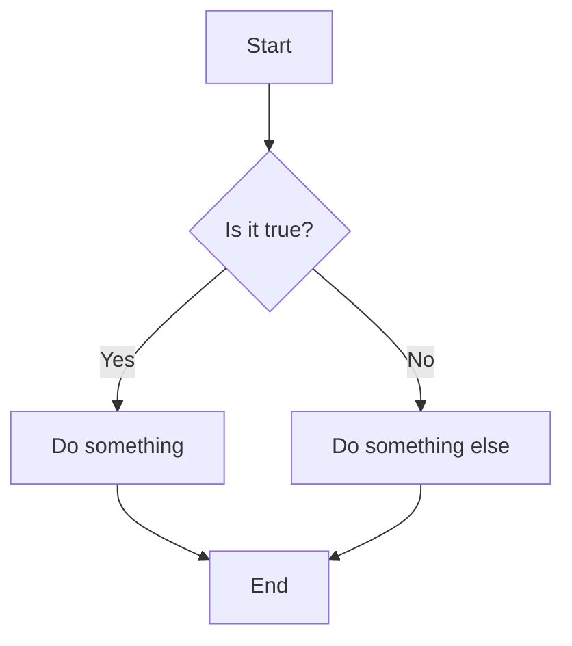
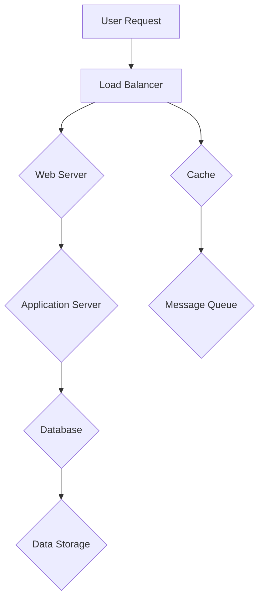
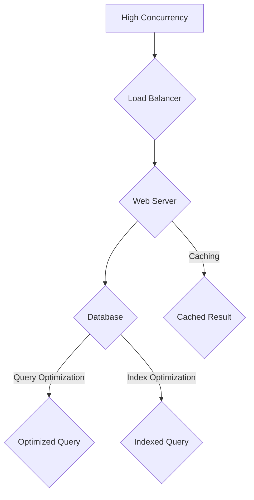
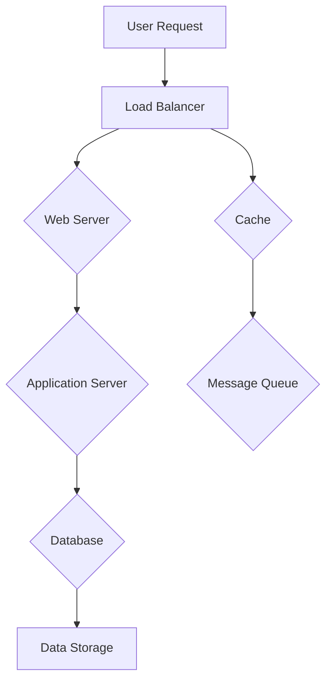
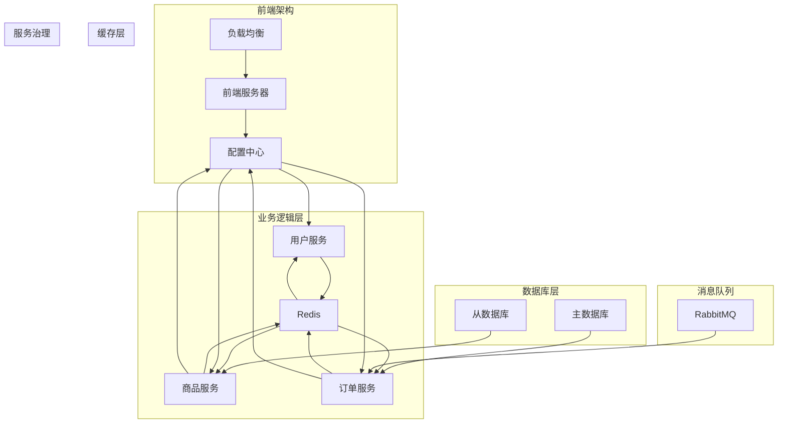
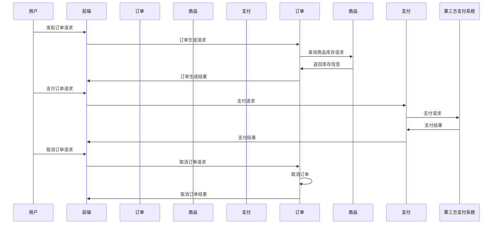

                 


# 《高并发系统设计：P9架构师的极限挑战》

## 关键词

高并发系统，架构设计，负载均衡，缓存策略，数据库优化，服务化架构，系统容灾，性能优化，电商系统，金融系统

## 摘要

随着互联网的迅猛发展，高并发系统设计成为架构师面临的重大挑战。本文旨在探讨高并发系统设计的核心原则、核心技术以及实战案例，为P9架构师提供深入的指导。通过本文，读者将了解如何从负载均衡、缓存策略、数据库优化、服务化架构等方面进行系统设计，确保系统在高并发场景下的稳定性和性能。此外，本文还将结合电商系统和金融系统的高并发设计案例，为读者提供实战经验和优化策略。

## 目录大纲

### 第一部分：高并发系统设计概述

#### 第1章：高并发系统的定义与重要性

1.1 高并发系统的定义  
1.2 高并发系统的特征  
1.3 高并发系统的设计重要性

#### 第2章：高并发系统架构设计原则

2.1 高并发系统架构设计的关键因素  
2.2 软件架构设计原则  
2.3 硬件架构设计原则

### 第二部分：高并发系统核心技术

#### 第3章：负载均衡

3.1 负载均衡的概念与分类  
3.2 常见的负载均衡算法  
3.3 负载均衡器的配置与优化

#### 第4章：缓存策略

4.1 缓存的原理与作用  
4.2 常见的缓存技术  
4.3 缓存策略与优化

#### 第5章：数据库优化

5.1 数据库性能优化原理  
5.2 常见数据库优化策略  
5.3 数据库扩展与分区

#### 第6章：服务化架构

6.1 服务化架构的基本概念  
6.2 服务化架构的设计模式  
6.3 服务治理与监控

#### 第7章：系统容灾与故障处理

7.1 系统容灾的基本概念  
7.2 故障处理的策略与方法  
7.3 容灾演练与优化

### 第三部分：高并发系统设计实战

#### 第8章：电商系统高并发设计案例分析

8.1 电商系统高并发需求分析  
8.2 电商系统高并发架构设计  
8.3 电商系统高并发性能优化

#### 第9章：金融系统高并发设计案例分析

9.1 金融系统高并发需求分析  
9.2 金融系统高并发架构设计  
9.3 金融系统高并发性能优化

#### 第10章：高并发系统设计经验与总结

10.1 高并发系统设计经验总结  
10.2 高并发系统设计中的常见问题与解决方法  
10.3 未来高并发系统设计的发展趋势

### 附录

#### 附录A：高并发系统设计工具与资源

A.1 常用工具介绍  
A.2 高并发系统设计参考资料  
A.3 高并发系统设计实战案例

#### 附录B：Mermaid 流程图示例

B.1 Mermaid 基础语法  
B.2 高并发系统架构设计 Mermaid 图  
B.3 高并发系统性能优化 Mermaid 图

### 核心概念与联系

高并发系统与P9架构师的关系：

$$
\text{高并发系统} \rightarrow \text{P9架构师} \\
\text{系统设计能力} \rightarrow \text{系统性能优化} \\
\text{架构师经验} \rightarrow \text{系统稳定性}
$$

### 核心算法原理讲解

#### 负载均衡算法

```python
# Python 代码示例
def round_robin_load_balancer(requests):
    server_list = ["server1", "server2", "server3"]
    for request in requests:
        current_server = server_list.pop(0)
        server_list.append(current_server)
        process_request(current_server, request)
```

#### 缓存策略

```python
# Python 代码示例
class LRUCache:
    def __init__(self, capacity):
        self.capacity = capacity
        self.cache = dict()
        self.order = []

    def get(self, key):
        if key in self.cache:
            self.order.remove(key)
            self.order.append(key)
            return self.cache[key]
        else:
            return -1

    def put(self, key, value):
        if key in self.cache:
            self.order.remove(key)
        elif len(self.cache) >= self.capacity:
            oldest_key = self.order.pop(0)
            self.cache.pop(oldest_key)
        self.cache[key] = value
        self.order.append(key)
```

## 第一部分：高并发系统设计概述

### 第1章：高并发系统的定义与重要性

#### 1.1 高并发系统的定义

高并发系统是指在短时间内同时处理大量请求的系统。这些请求可能来自客户端、移动设备或服务器端，涉及的业务场景包括电商、社交、在线教育、金融交易等。高并发系统需要具备快速响应、高吞吐量、低延迟和稳定性的特点。

#### 1.2 高并发系统的特征

1. 高请求量：在短时间内处理大量请求，通常以每秒请求数（QPS）或每秒事务数（TPS）来衡量。
2. 短响应时间：系统需要在极短的时间内完成请求处理，通常要求在几百毫秒以内。
3. 弹性伸缩：系统能够根据请求量自动扩展或收缩资源，确保在高并发场景下保持稳定。
4. 高可用性：系统需要在高并发场景下保持稳定运行，尽量避免出现故障或异常。

#### 1.3 高并发系统的设计重要性

高并发系统设计的重要性体现在以下几个方面：

1. 提高性能：高并发系统能够快速响应请求，提升用户体验，增加业务收入。
2. 提高稳定性：合理的高并发系统设计能够降低系统崩溃或故障的风险，确保业务连续性。
3. 优化资源利用：通过弹性伸缩和负载均衡等技术，实现资源的合理分配和高效利用。
4. 支持业务发展：高并发系统能够支持业务快速增长，满足未来业务需求。

## 第二部分：高并发系统核心技术

### 第2章：高并发系统架构设计原则

#### 2.1 高并发系统架构设计的关键因素

高并发系统架构设计需要考虑以下关键因素：

1. 负载均衡：通过负载均衡技术，将请求合理分配到多个服务器上，避免单点过载。
2. 缓存策略：通过缓存技术，减少对后端系统的访问压力，提高系统响应速度。
3. 数据库优化：通过数据库优化技术，提高数据查询和写入性能，降低延迟。
4. 服务化架构：通过服务化架构，实现模块化和松耦合，提高系统可扩展性和可维护性。
5. 系统容灾与故障处理：通过系统容灾和故障处理技术，确保系统在高并发场景下的稳定性和可用性。

#### 2.2 软件架构设计原则

高并发系统软件架构设计应遵循以下原则：

1. 模块化：将系统功能拆分为多个模块，实现模块间解耦合，提高系统可维护性和可扩展性。
2. 分布式：采用分布式架构，实现系统水平扩展，提高系统处理能力。
3. 容错性：设计容错机制，确保系统在异常情况下能够快速恢复，降低故障对业务的影响。
4. 性能优化：关注系统性能瓶颈，采用优化技术，提高系统响应速度和吞吐量。

#### 2.3 硬件架构设计原则

高并发系统硬件架构设计应遵循以下原则：

1. 高可用性：选择高可用性的硬件设备，确保系统在运行过程中不会因硬件故障导致业务中断。
2. 高性能：选择高性能的硬件设备，如快速CPU、高速存储和高速网络，提高系统处理能力。
3. 弹性伸缩：设计硬件架构时，预留足够的扩展空间，以便在业务增长时进行快速扩展。
4. 灾备能力：建立灾备中心，确保在发生灾难时，系统能够快速切换到备用设备，保证业务连续性。

## 第三部分：高并发系统设计实战

### 第3章：负载均衡

#### 3.1 负载均衡的概念与分类

负载均衡是一种将请求合理分配到多个服务器上的技术，以提高系统性能和稳定性。负载均衡的分类如下：

1. 静态负载均衡：将请求分配到固定的服务器上，如轮询算法、随机算法等。
2. 动态负载均衡：根据服务器当前负载情况，动态调整请求分配策略，如最小连接数算法、响应时间算法等。

#### 3.2 常见的负载均衡算法

常见的负载均衡算法包括以下几种：

1. 轮询算法：将请求依次分配到每个服务器上，负载均衡器轮询地将请求发送给下一个服务器。
2. 最小连接数算法：根据服务器当前的连接数，将请求分配到连接数最少的服务器上。
3. 加权轮询算法：根据服务器的性能和负载情况，为每个服务器分配不同的权重，将请求按权重比例分配到服务器上。
4. 响应时间算法：根据服务器的响应时间，将请求分配到响应时间较短的服务器上。

#### 3.3 负载均衡器的配置与优化

负载均衡器的配置与优化包括以下方面：

1. 负载均衡器类型选择：根据业务需求和性能要求，选择合适的负载均衡器类型，如硬件负载均衡器、软件负载均衡器等。
2. 负载均衡算法选择：根据业务特点和服务器性能，选择合适的负载均衡算法，确保请求分配公平、高效。
3. 负载均衡器性能优化：通过调整负载均衡器的配置参数，提高负载均衡器的处理能力和性能，如调整连接池大小、超时时间等。

### 第4章：缓存策略

#### 4.1 缓存的原理与作用

缓存是一种存储临时数据的技术，通过将频繁访问的数据存储在内存中，减少对后端系统的访问压力，提高系统响应速度。缓存的作用包括：

1. 降低延迟：缓存数据在内存中，比从磁盘或数据库中读取数据快得多，从而降低系统的响应时间。
2. 提高吞吐量：通过缓存，减少对后端系统的访问次数，提高系统的处理能力。
3. 节省带宽：缓存数据在内存中，可以减少对网络的访问次数，降低带宽消耗。

#### 4.2 常见的缓存技术

常见的缓存技术包括以下几种：

1. 内存缓存：将数据存储在内存中，如Redis、Memcached等。
2. 磁盘缓存：将数据存储在磁盘上，如文件缓存、数据库缓存等。
3. 分布式缓存：将缓存数据分布存储在多个节点上，如Consul、Zookeeper等。

#### 4.3 缓存策略与优化

缓存策略与优化包括以下方面：

1. 缓存数据选择：根据业务需求和数据特点，选择合适的缓存数据，如热门商品、用户信息等。
2. 缓存过期策略：设置缓存数据的过期时间，避免缓存数据长期占用内存，如LRU（Least Recently Used）算法。
3. 缓存一致性：确保缓存数据和后端数据的一致性，如缓存更新策略、分布式锁等。
4. 缓存性能优化：通过调整缓存配置参数，提高缓存性能，如缓存大小、过期时间等。

### 第5章：数据库优化

#### 5.1 数据库性能优化原理

数据库性能优化主要从以下几个方面进行：

1. 查询优化：通过调整SQL语句、索引、视图等，提高查询性能。
2. 存储优化：通过调整存储引擎、分区、分片等，提高存储性能。
3. 网络优化：通过调整网络参数、优化网络拓扑结构等，提高数据传输性能。
4. 资源管理：通过调整CPU、内存、I/O等资源分配策略，提高系统整体性能。

#### 5.2 常见数据库优化策略

常见的数据库优化策略包括以下几种：

1. 索引优化：通过创建合适的索引，提高查询性能。
2. 表结构优化：通过调整表结构、字段类型等，提高存储性能。
3. 数据库分片：通过分片技术，将数据分布存储在多个节点上，提高查询性能和扩展性。
4. 缓存优化：通过使用缓存技术，减少数据库访问次数，提高系统响应速度。

#### 5.3 数据库扩展与分区

数据库扩展与分区包括以下方面：

1. 数据库水平扩展：通过增加节点、增加存储容量等，提高数据库处理能力。
2. 数据库垂直扩展：通过升级硬件设备、增加CPU、内存等，提高数据库性能。
3. 数据分区：通过将数据按时间、地区、业务类型等分区，提高查询性能和存储效率。
4. 数据分片：通过将数据按逻辑关系拆分为多个子集，分布式存储在多个节点上，提高查询性能和扩展性。

### 第6章：服务化架构

#### 6.1 服务化架构的基本概念

服务化架构是一种将系统功能拆分为多个服务的架构设计方法，通过服务之间的协同工作，实现系统的整体功能。服务化架构的基本概念包括：

1. 服务：独立运行、具有明确功能的小型程序单元，可通过接口进行访问。
2. 服务化：将传统单体架构拆分为多个独立的服务，实现模块化和松耦合。
3. 服务注册与发现：服务启动时向注册中心注册，服务消费者通过注册中心发现服务并进行调用。

#### 6.2 服务化架构的设计模式

服务化架构的设计模式包括以下几种：

1. 服务拆分：根据业务需求，将系统功能拆分为多个服务，实现模块化。
2. 服务组合：通过服务组合，实现系统的整体功能，提高系统的灵活性和可维护性。
3. 服务治理：通过服务治理，实现服务注册、发现、监控、故障处理等功能。
4. 服务网关：通过服务网关，统一服务访问入口，实现身份认证、流量控制等功能。

#### 6.3 服务治理与监控

服务治理与监控包括以下方面：

1. 服务注册与发现：实现服务启动时注册，服务消费者发现服务并进行调用。
2. 服务监控：通过监控服务状态、调用日志等，及时发现服务异常并进行处理。
3. 服务告警：通过设置告警规则，及时发现服务异常并进行告警通知。
4. 服务性能优化：通过分析服务性能数据，优化服务性能，提高系统整体性能。

### 第7章：系统容灾与故障处理

#### 7.1 系统容灾的基本概念

系统容灾是一种在发生灾难时，确保系统继续运行和数据安全的措施。系统容灾的基本概念包括：

1. 容灾等级：根据系统重要性，将容灾等级分为一级容灾、二级容灾、三级容灾等。
2. 容灾中心：建立异地容灾中心，确保在主数据中心发生灾难时，系统能够快速切换到备用数据中心。
3. 数据备份：定期备份数据，确保在发生数据丢失或损坏时，能够快速恢复数据。

#### 7.2 故障处理的策略与方法

故障处理的策略与方法包括以下方面：

1. 故障定位：通过监控、日志分析等手段，定位故障发生的位置和原因。
2. 故障恢复：根据故障原因，采取相应的恢复措施，确保系统恢复正常运行。
3. 故障排查：通过现场排查、远程排查等手段，排查故障原因，确保问题得到彻底解决。
4. 故障预防：通过优化系统设计、增加冗余、定期演练等措施，预防故障发生。

#### 7.3 容灾演练与优化

容灾演练与优化包括以下方面：

1. 定期进行容灾演练，检验容灾方案的可行性和有效性。
2. 根据演练结果，优化容灾方案，提高容灾能力。
3. 定期备份和恢复数据，确保在发生灾难时，能够快速恢复系统运行。
4. 加强人员培训，提高故障处理能力和应急响应速度。

## 第四部分：高并发系统设计实战

### 第8章：电商系统高并发设计案例分析

#### 8.1 电商系统高并发需求分析

电商系统高并发需求分析主要包括以下方面：

1. 请求量分析：根据电商业务特点，分析用户访问量、订单量等指标，确定系统需要处理的高并发量。
2. 业务场景分析：根据用户行为和业务流程，分析系统的关键业务场景，如购物车、下单、支付等。
3. 性能指标分析：确定系统需要达到的响应时间、吞吐量等性能指标。

#### 8.2 电商系统高并发架构设计

电商系统高并发架构设计主要包括以下方面：

1. 网络架构设计：采用分布式架构，实现系统水平扩展，提高系统处理能力。
2. 服务架构设计：将系统功能拆分为多个服务，实现模块化和松耦合。
3. 数据库架构设计：采用数据库分片和分区技术，提高数据查询和写入性能。
4. 缓存架构设计：采用分布式缓存技术，减少数据库访问次数，提高系统响应速度。

#### 8.3 电商系统高并发性能优化

电商系统高并发性能优化主要包括以下方面：

1. 负载均衡优化：采用合适的负载均衡算法，确保请求合理分配到各个服务器上。
2. 缓存优化：优化缓存策略，提高缓存命中率，降低数据库访问压力。
3. 数据库优化：优化数据库查询和写入性能，如创建合适的索引、优化SQL语句等。
4. 服务优化：优化服务性能，如减少服务调用次数、优化服务内部处理逻辑等。

### 第9章：金融系统高并发设计案例分析

#### 9.1 金融系统高并发需求分析

金融系统高并发需求分析主要包括以下方面：

1. 请求量分析：根据金融业务特点，分析用户访问量、交易量等指标，确定系统需要处理的高并发量。
2. 业务场景分析：根据用户行为和业务流程，分析系统的关键业务场景，如账户查询、转账、支付等。
3. 性能指标分析：确定系统需要达到的响应时间、吞吐量等性能指标。

#### 9.2 金融系统高并发架构设计

金融系统高并发架构设计主要包括以下方面：

1. 网络架构设计：采用分布式架构，实现系统水平扩展，提高系统处理能力。
2. 服务架构设计：将系统功能拆分为多个服务，实现模块化和松耦合。
3. 数据库架构设计：采用数据库分片和分区技术，提高数据查询和写入性能。
4. 缓存架构设计：采用分布式缓存技术，减少数据库访问次数，提高系统响应速度。

#### 9.3 金融系统高并发性能优化

金融系统高并发性能优化主要包括以下方面：

1. 负载均衡优化：采用合适的负载均衡算法，确保请求合理分配到各个服务器上。
2. 缓存优化：优化缓存策略，提高缓存命中率，降低数据库访问压力。
3. 数据库优化：优化数据库查询和写入性能，如创建合适的索引、优化SQL语句等。
4. 服务优化：优化服务性能，如减少服务调用次数、优化服务内部处理逻辑等。

## 第五部分：高并发系统设计经验与总结

### 第10章：高并发系统设计经验与总结

#### 10.1 高并发系统设计经验总结

高并发系统设计经验总结主要包括以下方面：

1. 理解业务需求：深入理解业务需求，分析系统的性能瓶颈和关键业务场景。
2. 模块化设计：将系统功能拆分为多个模块，实现模块化和松耦合。
3. 弹性伸缩：设计系统时考虑弹性伸缩，确保系统能够根据业务需求进行水平扩展。
4. 负载均衡与缓存：采用合适的负载均衡算法和缓存策略，提高系统性能和稳定性。
5. 数据库优化：优化数据库查询和写入性能，提高数据存储和处理能力。
6. 服务治理与监控：实现服务治理和监控，确保系统在高并发场景下的稳定性和可用性。

#### 10.2 高并发系统设计中的常见问题与解决方法

高并发系统设计中的常见问题与解决方法主要包括以下方面：

1. 请求量过大：通过增加服务器资源、优化系统性能等方式，提高系统处理能力。
2. 数据库性能瓶颈：通过优化数据库查询和写入性能、采用数据库分片和分区技术等方式，提高数据库性能。
3. 缓存命中率低：通过优化缓存策略、增加缓存容量等方式，提高缓存命中率。
4. 负载不均衡：通过调整负载均衡算法、优化负载均衡器配置等方式，确保请求合理分配。
5. 系统故障：通过优化系统设计、增加冗余、实现容灾和故障处理等方式，提高系统稳定性和可用性。

#### 10.3 未来高并发系统设计的发展趋势

未来高并发系统设计的发展趋势主要包括以下方面：

1. 云原生技术：随着云计算的普及，高并发系统设计将更多地采用云原生技术，实现自动化部署、弹性伸缩和微服务架构。
2. 边缘计算：随着5G、物联网等技术的发展，边缘计算将越来越重要，高并发系统设计将考虑在边缘节点上进行计算和数据处理。
3. 智能化优化：通过引入人工智能和机器学习技术，实现系统性能的智能化优化，提高系统的自适应能力和效率。
4. 服务网格：随着微服务架构的普及，服务网格将作为一种新型的服务通信架构，实现服务间的可靠、高效和安全通信。

### 附录

#### 附录A：高并发系统设计工具与资源

A.1 常用工具介绍

1. 负载均衡器：Nginx、HAProxy、LVS等。
2. 缓存：Redis、Memcached、MongoDB等。
3. 数据库：MySQL、PostgreSQL、MongoDB等。
4. 服务治理：Spring Cloud、Dubbo等。
5. 监控：Zabbix、Prometheus、Grafana等。

A.2 高并发系统设计参考资料

1. 《大规模分布式存储系统设计与实践》
2. 《云计算：概念、技术与应用》
3. 《高并发系统设计实战》
4. 《微服务架构设计原理与实践》
5. 《分布式系统设计原理》

A.3 高并发系统设计实战案例

1. 电商系统高并发设计案例
2. 金融系统高并发设计案例
3. 在线教育平台高并发设计案例
4. 社交平台高并发设计案例
5. 物流平台高并发设计案例

#### 附录B：Mermaid 流程图示例

B.1 Mermaid 基础语法



B.2 高并发系统架构设计 Mermaid 图



B.3 高并发系统性能优化 Mermaid 图



## 核心概念与联系

高并发系统与P9架构师的关系：

$$
\text{高并发系统} \rightarrow \text{P9架构师} \\
\text{系统设计能力} \rightarrow \text{系统性能优化} \\
\text{架构师经验} \rightarrow \text{系统稳定性}
$$

## 核心算法原理讲解

#### 负载均衡算法

```python
# Python 代码示例
def round_robin_load_balancer(requests):
    server_list = ["server1", "server2", "server3"]
    for request in requests:
        current_server = server_list.pop(0)
        server_list.append(current_server)
        process_request(current_server, request)
```

#### 缓存策略

```python
# Python 代码示例
class LRUCache:
    def __init__(self, capacity):
        self.capacity = capacity
        self.cache = dict()
        self.order = []

    def get(self, key):
        if key in self.cache:
            self.order.remove(key)
            self.order.append(key)
            return self.cache[key]
        else:
            return -1

    def put(self, key, value):
        if key in self.cache:
            self.order.remove(key)
        elif len(self.cache) >= self.capacity:
            oldest_key = self.order.pop(0)
            self.cache.pop(oldest_key)
        self.cache[key] = value
        self.order.append(key)
```

## 结束语

本文从高并发系统设计的核心原则、核心技术以及实战案例等方面进行了深入探讨，为P9架构师提供了有价值的参考和指导。通过本文，读者可以了解如何设计高性能、高可用性的高并发系统，提高系统的稳定性和性能。在实际项目中，架构师应根据具体业务需求和场景，灵活运用所学知识和技巧，不断提升系统设计能力。

## 作者

作者：AI天才研究院/AI Genius Institute & 禅与计算机程序设计艺术 /Zen And The Art of Computer Programming

在本文中，我们详细探讨了高并发系统设计的核心原则、核心技术以及实战案例，旨在为P9架构师提供深入的技术指导和实战经验。通过本文，我们将共同探索如何应对互联网时代的高并发挑战，设计出稳定、高效、可扩展的系统架构。

### 第一部分：高并发系统设计概述

#### 第1章：高并发系统的定义与重要性

高并发系统设计是现代互联网技术领域中的一项关键挑战。随着互联网应用的普及，用户数量和交易量的激增使得高并发系统变得愈发重要。那么，什么是高并发系统？它的重要性又体现在哪些方面呢？

#### 1.1 高并发系统的定义

高并发系统是指在短时间内能够处理大量用户请求和操作的系统。这些请求可能来自Web前端、移动端、物联网设备等多种来源。高并发系统通常具有以下几个特点：

1. **请求量庞大**：在短时间内（如秒级或分钟级），系统需要处理数百万甚至数亿个请求。
2. **快速响应**：系统需要在毫秒级或秒级时间内完成请求的处理，以满足用户对速度和体验的要求。
3. **资源利用高效**：系统需要合理利用资源，确保在处理大量请求的同时，不会因资源不足而导致性能下降或系统崩溃。
4. **高可用性**：系统需要具备一定的容错能力，保证在部分组件或服务出现故障时，依然能够保持运行。

高并发系统的典型场景包括电商平台的秒杀活动、社交媒体的热门话题推送、在线视频平台的流媒体播放、金融交易系统的订单处理等。在这些场景中，系统需要能够在高峰期承受巨大的流量压力，同时保证业务的连续性和数据的准确性。

#### 1.2 高并发系统的特征

高并发系统具有以下特征：

1. **瞬时大量请求**：在短时间内系统需要处理大量的请求，这些请求可能同时涌入系统，导致服务器负载骤增。
2. **请求多样性**：高并发系统面临的请求可能是多样化的，包括读取、写入、查询、修改等不同类型的数据操作。
3. **高延迟敏感**：用户对响应时间的要求非常高，任何延迟都可能影响用户体验，甚至导致用户流失。
4. **数据一致性**：在高并发环境下，系统需要确保数据的一致性，防止因并发操作导致的数据错误。

#### 1.3 高并发系统的设计重要性

高并发系统的设计重要性体现在以下几个方面：

1. **用户体验**：良好的高并发系统设计能够确保用户在访问系统时获得快速的响应，提升用户体验。
2. **业务连续性**：系统在高并发场景下能够保持稳定运行，防止因超负荷运行导致的服务中断，保障业务的连续性。
3. **资源利用**：通过合理的系统设计，可以在高并发情况下充分利用服务器资源，避免资源浪费。
4. **成本控制**：高效的高并发系统设计能够减少硬件成本和维护成本，提高企业的整体效益。

高并发系统设计不仅仅是一个技术问题，更是一个涉及业务战略、系统架构、资源调度等多个方面的综合性挑战。P9架构师需要具备全局视角，从整体架构出发，综合考虑性能、可扩展性、稳定性和成本等多个因素，设计出能够满足业务需求的高并发系统。

### 第2章：高并发系统架构设计原则

#### 2.1 高并发系统架构设计的关键因素

高并发系统架构设计需要考虑多个关键因素，这些因素直接影响到系统的性能、稳定性和可扩展性。以下是一些关键的架构设计因素：

1. **负载均衡**：负载均衡是将请求分配到多个服务器上，以避免单点过载，提高系统整体处理能力。负载均衡器可以是硬件设备，也可以是软件服务。
2. **缓存策略**：缓存是将频繁访问的数据存储在内存中，以减少对后端系统的访问压力。常见的缓存技术有Redis、Memcached等。
3. **数据库优化**：数据库是系统中的核心组件，数据库优化包括索引设计、查询优化、分库分表等，以提高查询效率和写入性能。
4. **服务化架构**：服务化架构是将系统功能拆分成多个独立的服务，每个服务负责一个特定的功能模块，通过微服务架构实现模块化和松耦合。
5. **系统容灾与故障处理**：系统容灾是指在灾难发生时，系统能够快速切换到备用系统，确保业务的连续性。故障处理则包括故障检测、故障恢复和故障排查。

#### 2.2 软件架构设计原则

在高并发系统架构设计过程中，应遵循以下软件架构设计原则：

1. **模块化**：将系统功能拆分为多个独立的模块，每个模块负责特定的功能，模块之间通过接口进行通信，实现解耦。
2. **分布式**：采用分布式架构，将系统功能分布到多个服务器上，以提高系统的可扩展性和容错能力。
3. **可扩展性**：设计时考虑系统的可扩展性，确保系统能够在用户数量和请求量增长时，通过增加节点或资源来应对。
4. **高可用性**：设计冗余机制，确保系统在出现故障时，能够快速切换到备用组件，保持业务的连续性。
5. **性能优化**：关注系统性能瓶颈，通过优化数据库查询、缓存策略、网络传输等，提高系统的响应速度和处理能力。

#### 2.3 硬件架构设计原则

高并发系统硬件架构设计需要考虑以下几个方面：

1. **高可用性硬件**：选择高可用性的硬件设备，如服务器、存储设备等，以减少硬件故障对业务的影响。
2. **高性能硬件**：选择性能优秀的硬件设备，如快速CPU、高速存储和高速网络，以提高系统的处理能力和响应速度。
3. **弹性扩展**：设计硬件架构时，预留足够的扩展空间，以便在业务增长时，可以快速增加硬件资源。
4. **灾备能力**：建立灾备中心，确保在发生灾难时，系统能够快速切换到备用设备，保证业务的连续性。

通过遵循这些架构设计原则，P9架构师可以设计出高性能、高可用性、可扩展的高并发系统，为业务的持续发展提供坚实的保障。

### 第二部分：高并发系统核心技术

#### 第3章：负载均衡

负载均衡是一种将网络流量分配到多个服务器上的技术，目的是通过均衡负载来提高系统的整体性能和可靠性。在高并发系统中，负载均衡尤为重要，因为不合理的流量分配可能导致某些服务器过载，从而影响系统的整体性能和稳定性。

#### 3.1 负载均衡的概念与分类

负载均衡（Load Balancing）是指将到达系统的请求分配到多个服务器上，以实现流量的均衡处理。负载均衡可以通过以下几种方式进行分类：

1. **静态负载均衡**：通过预定义的规则或配置文件来分配请求，如轮询（Round Robin）算法、最少连接数算法等。
2. **动态负载均衡**：根据服务器当前的负载状况动态调整请求的分配，如基于响应时间、当前连接数等算法。
3. **基于内容的负载均衡**：根据请求的内容（如URL、文件类型等）来分配请求，以提高特定类型请求的处理效率。

#### 3.2 常见的负载均衡算法

以下是一些常见的负载均衡算法：

1. **轮询算法（Round Robin）**：将请求按照顺序分配到各个服务器上，是最简单且常用的负载均衡算法。
   ```python
   def round_robin_load_balancer(requests):
       server_list = ["server1", "server2", "server3"]
       for request in requests:
           current_server = server_list.pop(0)
           server_list.append(current_server)
           process_request(current_server, request)
   ```

2. **最少连接数算法（Least Connections）**：将请求分配到当前连接数最少的服务器上，适用于连接密集型应用。
   ```python
   def least_connections_load_balancer(requests):
       server_stats = {"server1": 10, "server2": 5, "server3": 15}
       for request in requests:
           current_server = min(server_stats, key=server_stats.get)
           server_stats[current_server] += 1
           process_request(current_server, request)
   ```

3. **加权轮询算法（Weighted Round Robin）**：根据服务器的性能或负载情况为每个服务器分配不同的权重，实现更加精细的负载分配。
   ```python
   def weighted_round_robin_load_balancer(requests, server_weights):
       server_list = list(server_weights.keys())
       for request in requests:
           current_server = server_list.pop(0)
           server_list.append(current_server)
           process_request(current_server, request, server_weights[current_server])
   ```

4. **最小响应时间算法（Least Response Time）**：将请求分配到响应时间最短的服务器上，适用于实时性要求较高的应用。
   ```python
   def least_response_time_load_balancer(requests, server_response_times):
       server_list = list(server_response_times.keys())
       for request in requests:
           current_server = min(server_response_times, key=server_response_times.get)
           server_response_times[current_server] += 1
           process_request(current_server, request)
   ```

#### 3.3 负载均衡器的配置与优化

负载均衡器的配置与优化是确保系统性能的关键步骤。以下是一些常见的配置与优化方法：

1. **健康检查**：定期对后端服务器进行健康检查，确保只有健康的服务器参与负载均衡。
2. **动态调整**：根据实时流量和服务器负载动态调整负载均衡算法，以应对不同负载场景。
3. **连接池管理**：合理配置连接池大小，避免因连接数不足或过多导致的性能问题。
4. **会话保持**：对于需要保持会话状态的应用，可以通过会话保持机制确保同一用户的请求总是分配到同一服务器。
5. **负载均衡策略**：根据应用特点选择合适的负载均衡策略，如对于读多写少的场景，可以优先使用读缓存。

通过合理配置和优化负载均衡器，P9架构师可以确保高并发系统在面临大规模流量时依然能够保持高效、稳定的运行。

### 第4章：缓存策略

在高并发系统中，缓存策略是提升系统性能和降低数据库负载的重要手段。缓存技术通过将频繁访问的数据存储在内存中，减少对后端数据库的访问，从而提高系统的响应速度和吞吐量。以下将详细介绍缓存策略的基本概念、常见缓存技术以及缓存策略的优化。

#### 4.1 缓存的原理与作用

缓存（Cache）是一种临时存储技术，用于存储频繁访问的数据，以便在后续访问时能够快速获取。缓存的工作原理是在内存中创建一个缓存层，当用户请求数据时，系统首先在缓存中查找，如果找到则直接返回，否则再查询后端数据存储（如数据库），并将结果存储在缓存中以供后续使用。

缓存的作用主要体现在以下几个方面：

1. **降低响应时间**：由于内存的访问速度远快于磁盘或数据库，使用缓存可以显著降低系统的响应时间，提高用户体验。
2. **减少数据库压力**：频繁的数据访问会增加数据库的负载，缓存可以减少数据库的访问次数，降低数据库的负载。
3. **提高系统吞吐量**：通过减少对数据库的访问，缓存可以提高系统的整体吞吐量，处理更多的请求。
4. **节省带宽**：对于分布式系统，缓存还可以减少跨网络的数据传输，节省网络带宽资源。

#### 4.2 常见的缓存技术

常见的缓存技术包括以下几种：

1. **内存缓存**：内存缓存是一种将数据存储在内存中的缓存技术，如Redis、Memcached等。由于内存的访问速度非常快，内存缓存可以显著提高系统的响应速度。
2. **磁盘缓存**：磁盘缓存是将数据存储在磁盘上的缓存技术，如操作系统级的缓存（如Linux的page cache）。磁盘缓存虽然访问速度不如内存缓存，但存储容量更大，适用于一些大数据场景。
3. **分布式缓存**：分布式缓存是将缓存数据分布存储在多个节点上的缓存技术，如Consul、Zookeeper等。分布式缓存可以提供更高的可用性和扩展性，适用于大规模分布式系统。
4. **对象缓存**：对象缓存是一种将对象存储在内存中的缓存技术，如Ehcache、Caffeine等。对象缓存通常用于存储一些小的、轻量级的对象，以提高系统的性能。

#### 4.3 缓存策略与优化

缓存策略的目的是提高缓存的有效性和命中率，以下是一些常见的缓存策略和优化方法：

1. **命中策略**：常用的命中策略包括最近最少使用（LRU）、最近未使用（LFU）等。这些策略可以根据数据访问频率和访问时间动态调整缓存中的数据。
2. **过期策略**：为了保持缓存数据的有效性，缓存系统通常设置数据过期时间。过期策略可以确保过期的数据能够及时被替换。
3. **缓存一致性**：在分布式系统中，缓存一致性是确保缓存和后端数据一致的关键。常用的缓存一致性策略包括写回（Write-Through）、写前（Write-First）和最终一致性等。
4. **缓存淘汰策略**：缓存淘汰策略用于处理缓存数据过多的情况。常见的淘汰策略包括先进先出（FIFO）、最近最少使用（LRU）等。

优化缓存策略的方法包括：

1. **合理设置缓存大小**：根据系统需求和资源限制，合理设置缓存的大小，避免缓存不足或过度占用内存。
2. **数据预热**：在系统启动或业务高峰期前，提前将热点数据加载到缓存中，以提高缓存的命中率。
3. **缓存分区**：对于大型系统，可以将缓存分为多个分区，每个分区负责不同的数据集合，以提高缓存管理的效率和性能。
4. **缓存与数据库的协同**：通过合理设计数据库缓存策略，确保缓存和数据库之间的数据一致性，减少数据库的访问压力。

通过有效的缓存策略和优化，P9架构师可以设计出高性能、高可用性的高并发系统，提高系统的响应速度和吞吐量，为用户提供更优质的体验。

### 第5章：数据库优化

在高并发系统中，数据库是性能优化的重要环节。数据库不仅负责存储数据，还承担了查询、写入等操作，因此其性能对整个系统的性能有重要影响。本章将介绍数据库性能优化的原理、常见策略以及数据库扩展与分区技术。

#### 5.1 数据库性能优化原理

数据库性能优化主要通过以下几个方面实现：

1. **查询优化**：通过优化SQL查询，减少查询执行时间，提高查询效率。这包括选择合适的索引、优化查询结构、避免全表扫描等。
2. **写入优化**：通过优化数据的写入操作，提高写入速度。这包括批量插入、使用缓冲池、优化事务管理等。
3. **数据存储优化**：通过优化数据存储方式，提高数据的读写效率。这包括合理设计数据结构、选择合适的存储引擎、优化磁盘I/O等。
4. **缓存优化**：通过使用缓存技术，减少对数据库的直接访问，提高系统的响应速度。这包括使用内存缓存、分布式缓存等。

#### 5.2 常见数据库优化策略

以下是一些常见的数据库优化策略：

1. **索引优化**：索引是加快查询速度的有效手段。通过选择合适的索引字段，可以显著提高查询效率。常见的索引优化策略包括：
   - **单列索引**：为经常查询的字段建立索引。
   - **复合索引**：为多个查询条件建立联合索引。
   - **索引选择性**：选择具有高选择性的字段作为索引，避免使用范围索引。

2. **查询优化**：通过优化SQL语句，减少查询的执行时间。常见的查询优化策略包括：
   - **避免全表扫描**：通过使用索引，避免全表扫描。
   - **简化查询**：简化复杂的查询语句，减少解析和执行时间。
   - **使用连接查询**：优化连接查询，减少中间结果集的大小。

3. **写入优化**：通过优化数据的写入操作，提高写入速度。常见的写入优化策略包括：
   - **批量插入**：将多条数据批量插入数据库，减少IO操作次数。
   - **缓冲池**：使用缓冲池技术，将经常写入的数据缓存到内存中，减少磁盘IO。
   - **事务管理**：优化事务管理，减少锁争用和死锁。

4. **数据存储优化**：通过优化数据存储方式，提高数据的读写效率。常见的存储优化策略包括：
   - **数据结构优化**：选择合适的数据结构，如B树、哈希表等。
   - **存储引擎选择**：选择合适的存储引擎，如InnoDB、MyISAM等。
   - **磁盘I/O优化**：优化磁盘I/O，减少磁盘寻道时间。

5. **缓存优化**：通过使用缓存技术，减少对数据库的直接访问。常见的缓存优化策略包括：
   - **内存缓存**：使用内存缓存存储经常访问的数据，减少数据库访问次数。
   - **分布式缓存**：使用分布式缓存系统，如Redis、Memcached等，提高缓存数据的一致性和扩展性。

#### 5.3 数据库扩展与分区

随着数据量的增加，数据库的性能和扩展性成为关键问题。以下是一些数据库扩展与分区技术：

1. **水平扩展**：通过增加数据库节点来提高处理能力。水平扩展可以通过以下方式实现：
   - **分库分表**：将数据按照业务逻辑或分区规则分布在多个数据库实例或表中，减少单个数据库的负载。
   - **分布式数据库**：使用分布式数据库系统，如Apache Cassandra、MongoDB等，实现数据的分布式存储和处理。

2. **垂直扩展**：通过增加数据库硬件资源（如CPU、内存、磁盘等）来提高性能。垂直扩展包括：
   - **增加CPU和内存**：增加数据库服务器的CPU和内存资源，提高处理能力。
   - **使用高性能存储设备**：使用固态硬盘（SSD）或高性能磁盘阵列，减少I/O瓶颈。

3. **分区**：将数据按照特定的规则（如时间、地域、业务类型等）进行分区，以提高查询效率和写入速度。分区策略包括：
   - **范围分区**：按照数据范围进行分区，如按照时间戳分区。
   - **列表分区**：按照预定义的列表进行分区，如按照城市名称分区。
   - **哈希分区**：使用哈希函数将数据分到不同的分区中，提高查询效率。

通过合理的数据库优化策略和扩展技术，P9架构师可以设计出高性能、高可用性的数据库系统，满足高并发场景下的业务需求。

### 第6章：服务化架构

在互联网时代，服务化架构已成为一种主流的系统设计模式。它通过将系统功能模块化为多个独立的服务，实现系统的高扩展性、高可用性和高灵活性。本章将介绍服务化架构的基本概念、设计模式以及服务治理与监控。

#### 6.1 服务化架构的基本概念

服务化架构（Service-Oriented Architecture，SOA）是一种将应用程序构建为一系列松耦合的服务，这些服务通过标准化接口进行通信。服务化架构的核心概念包括：

1. **服务**：服务是具有明确功能的小型程序单元，可以独立运行和部署。服务通常通过HTTP/HTTPS、RESTful API、消息队列等方式与其他服务进行通信。
2. **服务化**：服务化是将传统单体架构拆分为多个独立服务的过程，每个服务负责特定的业务功能，服务之间通过接口进行通信，实现解耦。
3. **服务注册与发现**：服务注册与发现是指服务启动时向注册中心注册，服务消费者通过注册中心发现服务并进行调用。
4. **服务治理**：服务治理包括服务的注册、监控、监控、监控、告警、日志管理、版本控制等，确保服务的高效运行和安全性。

#### 6.2 服务化架构的设计模式

服务化架构的设计模式包括以下几种：

1. **微服务架构（Microservices）**：微服务架构是一种基于服务化的架构模式，将系统拆分为多个独立的微服务，每个微服务负责一个具体的业务功能。微服务之间通过轻量级的通信机制（如HTTP/HTTPS、RESTful API）进行交互。
2. **服务组合架构（Service Composition）**：服务组合架构通过将多个服务组合在一起，实现更复杂的业务流程。服务组合可以动态编排，根据业务需求灵活调整服务之间的调用关系。
3. **服务网格（Service Mesh）**：服务网格是一种用于管理和通信服务之间的流量的基础设施层，它通过代理（如Istio、Linkerd）实现服务之间的通信，提供服务发现、负载均衡、故障转移等功能。
4. **事件驱动架构（Event-Driven Architecture）**：事件驱动架构通过事件触发服务执行，服务之间通过事件队列进行通信。事件驱动架构适用于实时数据处理和流处理场景。

#### 6.3 服务治理与监控

服务治理与监控是确保服务高效运行和稳定性的关键。以下是一些常见的服务治理与监控方法：

1. **服务注册与发现**：服务注册与发现通过服务注册中心（如Consul、Zookeeper）实现。服务启动时向注册中心注册，服务消费者通过注册中心发现服务并进行调用。
2. **服务监控**：通过监控服务状态、调用日志、性能指标等，实时监控服务运行情况。常用的监控工具包括Prometheus、Grafana、ELK（Elasticsearch、Logstash、Kibana）等。
3. **服务告警**：通过设置告警规则，当服务出现异常时及时发出告警通知，包括邮件、短信、电话等告警方式。
4. **服务性能优化**：通过分析服务性能数据，识别性能瓶颈，进行服务优化。性能优化包括优化服务代码、调整服务配置、增加缓存等。
5. **服务日志管理**：通过收集和分析服务日志，识别问题根源，提供故障排查和问题定位支持。

通过服务化架构的设计和治理，P9架构师可以设计出灵活、高效、可扩展的系统，提高系统的稳定性和可维护性。

### 第7章：系统容灾与故障处理

在高并发系统中，系统容灾与故障处理是确保业务连续性和系统稳定性的重要手段。系统容灾通过建立冗余和灾备机制，保障在发生灾难时系统能够快速恢复；故障处理则通过检测、排查和恢复措施，确保系统在遇到故障时能够及时响应和恢复。

#### 7.1 系统容灾的基本概念

系统容灾（System Disaster Recovery）是一种在发生灾难时，确保系统继续运行和数据安全的措施。系统容灾的基本概念包括：

1. **容灾等级**：根据系统的重要性和恢复需求，将容灾分为不同等级，如一级容灾、二级容灾、三级容灾等。不同等级的容灾措施和恢复时间要求不同。
2. **容灾中心**：建立异地容灾中心，确保在主数据中心发生灾难时，系统能够快速切换到备用数据中心，保障业务的连续性。
3. **数据备份**：定期备份数据，确保在发生灾难时，能够快速恢复数据，防止数据丢失。

#### 7.2 故障处理的策略与方法

故障处理是指在系统发生故障时，通过一系列策略和方法，快速检测、排查和恢复系统。以下是一些常见的故障处理策略和方法：

1. **故障定位**：通过监控工具和日志分析，快速定位故障发生的位置和原因。故障定位可以包括以下几个方面：
   - **日志分析**：通过分析系统日志，识别错误和异常信息，定位故障原因。
   - **监控报警**：通过设置监控报警规则，及时发现系统异常，包括性能问题、服务异常等。
   - **现场排查**：通过现场排查，检查硬件设备、网络连接等，进一步确认故障原因。

2. **故障恢复**：在确定故障原因后，采取相应的恢复措施，确保系统恢复正常运行。故障恢复可以包括以下步骤：
   - **故障隔离**：将故障组件或服务隔离，防止故障扩大。
   - **故障恢复**：恢复故障组件或服务，确保系统恢复正常运行。
   - **回滚和补丁**：如果故障是由于软件问题引起的，需要回滚到之前的版本或应用补丁。

3. **故障排查**：在故障处理过程中，通过一系列排查方法，确定故障原因并解决问题。常见的排查方法包括：
   - **查看日志**：检查系统日志和错误日志，查找异常信息和错误代码。
   - **性能分析**：使用性能分析工具，识别系统性能瓶颈和资源占用情况。
   - **网络诊断**：使用网络诊断工具，检查网络连接和通信状况。

4. **故障预防**：通过一系列预防措施，降低故障发生的概率，包括：
   - **冗余设计**：通过冗余设计，确保系统在组件或服务发生故障时，依然能够保持运行。
   - **定期演练**：定期进行系统容灾演练和故障处理演练，提高团队的应急响应能力。
   - **代码审查和测试**：通过代码审查和测试，发现和修复潜在的问题。

#### 7.3 容灾演练与优化

容灾演练与优化是确保系统容灾能力的重要步骤。以下是一些关键点：

1. **定期演练**：定期进行系统容灾演练，包括数据备份、故障切换、数据恢复等，检验容灾方案的可行性和有效性。
2. **优化容灾方案**：根据演练结果，对容灾方案进行优化，包括数据备份策略、故障切换机制、恢复流程等。
3. **备份和恢复测试**：定期进行备份和恢复测试，确保在发生灾难时，系统能够快速恢复。
4. **人员培训**：加强团队对系统容灾和故障处理的知识和技能培训，提高应急响应能力。

通过系统容灾与故障处理，P9架构师可以确保系统在高并发场景下的稳定性和可靠性，保障业务的连续性和用户满意度。

### 第8章：电商系统高并发设计案例分析

电商系统因其高并发特性而备受关注。在秒杀、促销、大促销等高峰期，电商系统需要处理海量请求，保证系统的高可用性和性能。本节将通过一个电商系统高并发设计的案例分析，介绍需求分析、架构设计和性能优化。

#### 8.1 电商系统高并发需求分析

电商系统的高并发需求主要包括以下几个方面：

1. **用户访问量**：在高峰期，电商系统需要应对数百万甚至数亿级的用户访问量。
2. **订单量**：订单处理是电商系统的核心功能，高峰期订单量急剧增加，需要快速处理。
3. **库存查询**：库存查询是用户下单前的重要环节，需要确保查询的准确性和速度。
4. **支付处理**：支付系统需要高效处理用户的支付请求，确保交易的成功率和速度。
5. **系统响应时间**：系统响应时间要求极低，需要在毫秒级或秒级内完成请求处理。

#### 8.2 电商系统高并发架构设计

电商系统高并发架构设计需要综合考虑模块化、分布式、缓存、数据库优化等多个方面。以下是一个典型的电商系统高并发架构设计：

1. **前端架构**：
   - **静态资源**：使用CDN加速静态资源的访问，减轻前端服务器的负载。
   - **动态内容**：使用Nginx作为负载均衡器，将请求分配到多个Web服务器上，实现流量分发。

2. **业务逻辑层**：
   - **服务化**：将业务功能拆分为多个独立的服务，如用户服务、商品服务、订单服务、支付服务等，通过微服务架构实现模块化和解耦。
   - **负载均衡**：使用分布式负载均衡器（如Kong、HAProxy）实现服务之间的请求分发，确保每个服务都能均衡负载。

3. **数据库层**：
   - **分库分表**：根据业务逻辑和访问频率，将数据分散存储到多个数据库实例和表中，降低单个数据库的负载。
   - **缓存**：使用Redis等内存缓存技术，缓存高频访问的数据，减少数据库查询次数。

4. **支付系统**：
   - **异步处理**：支付请求通过异步处理，减少对前端和业务逻辑层的阻塞，提高系统整体吞吐量。
   - **多通道支付**：支持多种支付方式，如支付宝、微信支付、信用卡支付等，提高支付成功率。

5. **系统监控**：
   - **实时监控**：通过Prometheus、Grafana等工具实时监控系统性能指标，如CPU使用率、内存使用率、数据库连接数等，及时发现和处理异常情况。
   - **日志分析**：使用ELK（Elasticsearch、Logstash、Kibana）进行日志收集和分析，识别和定位系统问题。

#### 8.3 电商系统高并发性能优化

电商系统高并发性能优化可以从以下几个方面进行：

1. **缓存策略**：
   - **热点数据缓存**：将热点商品、用户信息等缓存到Redis中，减少数据库访问压力。
   - **缓存一致性**：使用缓存一致性策略（如写回、最终一致性），确保缓存和数据库的数据一致性。

2. **数据库优化**：
   - **索引优化**：为查询频繁的字段建立合适的索引，提高查询效率。
   - **读写分离**：将读请求和写请求分离到不同的数据库实例，提高系统吞吐量。

3. **服务优化**：
   - **异步处理**：使用异步消息队列（如RabbitMQ、Kafka）处理长耗时操作，如订单生成、库存更新等，减少对业务逻辑层的阻塞。
   - **服务拆分**：将业务逻辑拆分为多个微服务，每个服务独立部署和扩展，提高系统的可扩展性。

4. **网络优化**：
   - **负载均衡**：使用动态负载均衡器，根据服务器的负载情况动态调整请求分配，确保系统负载均衡。
   - **TCP连接优化**：使用长连接、连接复用等技术，减少TCP连接建立和断开的开销。

通过详细的需求分析、合理的架构设计和全面的性能优化，电商系统可以应对高并发场景下的挑战，确保系统的稳定性和高性能，为用户提供优质的购物体验。

### 第9章：金融系统高并发设计案例分析

金融系统因其对数据准确性和交易安全性的严格要求，在高并发设计上面临巨大挑战。本节将通过对金融系统高并发设计的案例分析，介绍需求分析、架构设计以及性能优化。

#### 9.1 金融系统高并发需求分析

金融系统的高并发需求主要体现在以下几个方面：

1. **交易量**：金融系统需要在短时间内处理大量的交易请求，如股票交易、银行转账等。
2. **用户访问量**：金融系统需要应对数百万级别的用户同时在线访问，包括在线银行服务、证券交易、支付等。
3. **数据一致性**：金融系统要求在并发操作下确保数据的一致性，防止因并发操作导致的数据错误。
4. **响应时间**：系统需要在毫秒级内完成交易处理，保证用户能够及时收到交易结果。
5. **高可用性**：金融系统要求在发生故障时，能够快速切换到备用系统，确保业务连续性。

#### 9.2 金融系统高并发架构设计

金融系统高并发架构设计需要考虑模块化、分布式、高可用性、数据一致性和性能优化。以下是一个典型的金融系统高并发架构设计：

1. **前端架构**：
   - **负载均衡**：使用Nginx或HAProxy作为负载均衡器，将用户请求分配到多个Web服务器上，实现流量分发。
   - **静态资源**：使用CDN加速静态资源的访问，减少源站压力。

2. **业务逻辑层**：
   - **服务化**：将业务功能拆分为多个微服务，如交易服务、账户服务、支付服务、风险控制服务等，通过微服务架构实现模块化和解耦。
   - **服务网格**：使用Istio或Linkerd等服务网格，实现服务间的高效通信和安全控制。

3. **数据库层**：
   - **分库分表**：根据业务逻辑和访问频率，将数据分散存储到多个数据库实例和表中，降低单个数据库的负载。
   - **读写分离**：将读请求和写请求分离到不同的数据库实例，提高系统吞吐量。
   - **分布式事务**：使用分布式事务框架（如Seata、TCC），确保在分布式环境下的事务一致性。

4. **支付系统**：
   - **异步处理**：使用消息队列（如RabbitMQ、Kafka）异步处理支付请求，减少对业务逻辑层的阻塞。
   - **多通道支付**：支持多种支付方式，如银联、支付宝、微信支付等，提高支付成功率。

5. **监控系统**：
   - **实时监控**：使用Prometheus、Grafana等工具实时监控系统性能指标，如CPU使用率、内存使用率、数据库连接数等，及时发现和处理异常情况。
   - **日志分析**：使用ELK（Elasticsearch、Logstash、Kibana）进行日志收集和分析，识别和定位系统问题。

6. **系统容灾**：
   - **异地备份**：在异地建立容灾中心，确保在发生灾难时，系统能够快速切换到备用系统。
   - **数据备份**：定期备份数据，确保在发生故障时能够快速恢复。

#### 9.3 金融系统高并发性能优化

金融系统高并发性能优化可以从以下几个方面进行：

1. **缓存策略**：
   - **热点数据缓存**：将高频访问的数据（如用户信息、账户余额等）缓存到Redis中，减少数据库访问压力。
   - **缓存一致性**：使用缓存一致性策略（如写回、最终一致性），确保缓存和数据库的数据一致性。

2. **数据库优化**：
   - **索引优化**：为查询频繁的字段建立合适的索引，提高查询效率。
   - **读写分离**：将读请求和写请求分离到不同的数据库实例，提高系统吞吐量。
   - **数据库分片**：将数据分布存储到多个节点上，提高查询性能和扩展性。

3. **服务优化**：
   - **异步处理**：使用异步消息队列处理长耗时操作（如订单生成、支付处理等），减少对业务逻辑层的阻塞。
   - **服务拆分**：将业务逻辑拆分为多个微服务，每个服务独立部署和扩展，提高系统的可扩展性。

4. **网络优化**：
   - **负载均衡**：使用动态负载均衡器，根据服务器的负载情况动态调整请求分配，确保系统负载均衡。
   - **TCP连接优化**：使用长连接、连接复用等技术，减少TCP连接建立和断开的开销。

通过详细的需求分析、合理的架构设计和全面的性能优化，金融系统可以应对高并发场景下的挑战，确保系统的稳定性和高性能，为用户提供安全、可靠的服务。

### 第10章：高并发系统设计经验与总结

在高并发系统设计过程中，P9架构师积累了大量的经验和教训。以下是一些关键的经验总结和常见问题与解决方法，以及未来高并发系统设计的发展趋势。

#### 10.1 高并发系统设计经验总结

1. **深入理解业务需求**：在高并发系统设计之前，需要对业务需求进行深入分析，明确系统的性能瓶颈和关键业务场景，以便设计出符合业务需求的系统。

2. **模块化设计**：采用模块化设计方法，将系统功能拆分为多个模块，实现模块间的解耦，便于系统的维护和扩展。

3. **弹性伸缩**：设计系统时考虑弹性伸缩，确保系统能够根据业务需求自动调整资源，实现水平扩展，提高系统的处理能力。

4. **负载均衡与缓存**：合理配置负载均衡和缓存策略，通过将请求合理分配到多个服务器上，减少单点过载，提高系统响应速度。

5. **数据库优化**：通过索引优化、读写分离、分库分表等技术，提高数据库查询和写入性能，降低数据库负载。

6. **服务化架构**：采用服务化架构，将系统功能拆分为多个独立的服务，提高系统的可扩展性和可维护性。

7. **系统容灾与故障处理**：设计完善的容灾和故障处理机制，确保系统在高并发场景下能够快速恢复，保障业务的连续性。

#### 10.2 高并发系统设计中的常见问题与解决方法

1. **请求量过大**：
   - **解决方法**：通过增加服务器资源、优化系统性能和缓存策略，提高系统的处理能力。

2. **数据库性能瓶颈**：
   - **解决方法**：通过优化数据库查询和写入性能、采用数据库分片和分区技术，提高数据库性能。

3. **缓存命中率低**：
   - **解决方法**：通过优化缓存策略、增加缓存容量和热点数据缓存，提高缓存命中率。

4. **负载不均衡**：
   - **解决方法**：通过调整负载均衡算法、优化负载均衡器配置，确保请求合理分配。

5. **系统故障**：
   - **解决方法**：通过优化系统设计、增加冗余和容灾机制，提高系统稳定性和可用性。

#### 10.3 未来高并发系统设计的发展趋势

1. **云原生技术**：随着云计算的普及，高并发系统设计将更多地采用云原生技术，实现自动化部署、弹性伸缩和微服务架构。

2. **边缘计算**：随着5G、物联网等技术的发展，边缘计算将越来越重要，高并发系统设计将考虑在边缘节点上进行计算和数据处理。

3. **智能化优化**：通过引入人工智能和机器学习技术，实现系统性能的智能化优化，提高系统的自适应能力和效率。

4. **服务网格**：随着微服务架构的普及，服务网格将作为一种新型的服务通信架构，实现服务间的可靠、高效和安全通信。

通过总结高并发系统设计的经验，P9架构师可以不断提升系统设计能力，应对未来高并发场景下的挑战，为业务的发展提供坚实的技术保障。

### 附录A：高并发系统设计工具与资源

在高并发系统设计中，选择合适的工具和资源对于提高系统的性能和可靠性至关重要。以下是一些常用的高并发系统设计工具和资源：

#### A.1 常用工具介绍

1. **负载均衡器**：
   - **Nginx**：开源的高性能Web服务器，支持负载均衡和反向代理。
   - **HAProxy**：开源的负载均衡器，支持多种负载均衡算法，适用于高并发场景。
   - **LVS**：Linux虚拟服务器，提供高效的负载均衡和转发功能。

2. **缓存**：
   - **Redis**：开源的内存缓存系统，适用于高并发和大数据场景。
   - **Memcached**：开源的分布式缓存系统，适用于小数据量场景。

3. **数据库**：
   - **MySQL**：开源的关系型数据库，广泛用于Web应用。
   - **PostgreSQL**：开源的关系型数据库，支持复杂查询和扩展性。
   - **MongoDB**：开源的NoSQL数据库，适用于高并发和大数据场景。

4. **服务治理**：
   - **Spring Cloud**：Spring框架的微服务开发套件，提供服务注册、发现和负载均衡等功能。
   - **Dubbo**：阿里巴巴开源的分布式服务框架，提供服务治理、负载均衡和容错等功能。

5. **监控**：
   - **Zabbix**：开源的监控工具，支持多种监控指标和告警功能。
   - **Prometheus**：开源的监控解决方案，支持时间序列数据和告警。
   - **Grafana**：开源的数据可视化和监控工具，与Prometheus等工具集成。

#### A.2 高并发系统设计参考资料

1. **《大规模分布式存储系统设计与实践》**：深入讲解分布式存储系统的设计原则和实现方法。
2. **《云计算：概念、技术与应用》**：全面介绍云计算的基本概念和技术应用。
3. **《高并发系统设计实战》**：详细阐述高并发系统设计的原理和实践。
4. **《微服务架构设计原理与实践》**：讲解微服务架构的设计原则和实现方法。
5. **《分布式系统设计原理》**：系统介绍分布式系统的设计原则和实现技术。

#### A.3 高并发系统设计实战案例

1. **电商系统高并发设计案例**：详细分析电商系统在高并发场景下的架构设计和优化策略。
2. **金融系统高并发设计案例**：介绍金融系统在高并发场景下的性能优化和容灾设计。
3. **在线教育平台高并发设计案例**：探讨在线教育平台在高并发场景下的架构设计和性能优化。
4. **社交平台高并发设计案例**：分析社交平台在高并发场景下的系统架构和负载均衡策略。
5. **物流平台高并发设计案例**：探讨物流平台在高并发场景下的架构设计和性能优化。

通过使用这些工具和资源，P9架构师可以设计出高效、稳定的高并发系统，为业务的发展提供坚实的技术支持。

### 附录B：Mermaid 流程图示例

Mermaid 是一种简单易用的图表绘制工具，常用于Markdown文档中绘制流程图、UML图等。以下是一些使用Mermaid绘制的高并发系统架构设计和性能优化流程图的示例。

#### B.1 Mermaid 基础语法


#### B.2 高并发系统架构设计 Mermaid 图



#### B.3 高并发系统性能优化 Mermaid 图


通过这些Mermaid流程图示例，读者可以更好地理解和掌握高并发系统架构设计和性能优化的方法和步骤。

## 高并发系统与P9架构师的关系

高并发系统设计对P9架构师提出了极高的要求，两者之间存在紧密的联系和互动。

### 系统设计能力与系统性能优化

P9架构师在高并发系统设计中的核心能力在于系统性能优化。这包括：

- **模块化设计**：通过将系统拆分为多个模块，确保每个模块都可以独立优化，提高整体系统的性能。
- **分布式架构**：采用分布式架构，可以实现资源的合理分配和负载均衡，从而提高系统的处理能力和响应速度。
- **缓存策略**：通过合理的缓存策略，减少对数据库的访问，降低系统的延迟，提升用户体验。
- **数据库优化**：通过索引、查询优化和分库分表等技术，提高数据库的性能，确保系统在高并发情况下依然能够高效运行。
- **服务化架构**：服务化架构可以将系统功能模块化，提高系统的灵活性和可维护性，同时也方便对每个服务进行性能优化。

### 架构师经验与系统稳定性

P9架构师的经验是保障系统稳定性的关键。经验丰富的架构师能够：

- **预测并发瓶颈**：通过对业务需求的深入理解，提前识别并发瓶颈，并设计相应的优化策略。
- **设计冗余机制**：通过冗余设计，如备份服务器、灾备中心等，确保在系统发生故障时，可以快速切换到备用系统，保障业务的连续性。
- **故障处理能力**：在系统出现故障时，能够迅速定位问题并采取有效的解决措施，确保系统尽快恢复。
- **监控与预警**：通过监控系统，实时监测系统性能和状态，及时发现潜在问题，并提前预警，预防故障发生。

### 高并发系统与P9架构师的互动

高并发系统与P9架构师之间的互动是动态的、双向的：

- **反馈循环**：在高并发系统运行过程中，P9架构师通过监控和日志分析，不断收集系统的性能数据，根据这些数据调整系统架构和优化策略。
- **迭代优化**：P9架构师需要不断迭代和优化系统设计，以适应业务增长和需求变化，确保系统能够持续稳定运行。
- **适应性**：在高并发环境下，系统架构需要具备一定的适应性，以应对突发的流量变化。P9架构师通过灵活的架构设计和技术选型，提高系统的适应能力。

通过深入理解高并发系统的设计原则和核心算法，P9架构师能够在复杂多变的高并发环境中，设计出稳定、高效、可扩展的系统，为业务的发展提供坚实的技术保障。

### 核心算法原理讲解

在高并发系统设计中，核心算法原理的理解和运用至关重要。以下将详细讲解两个在高并发系统中广泛使用的核心算法：负载均衡算法和缓存策略。

#### 负载均衡算法

负载均衡算法是一种将请求合理分配到多个服务器上的技术，以避免单点过载，提高系统的整体性能和稳定性。以下是几种常见的负载均衡算法及其原理：

1. **轮询算法（Round Robin）**：
   轮询算法是最简单的负载均衡策略，按照请求到达的顺序依次分配到每个服务器上。这种算法的优点是实现简单，适用于负载均衡较为均匀的场景。
   ```python
   def round_robin_load_balancer(requests):
       server_list = ["server1", "server2", "server3"]
       for request in requests:
           current_server = server_list.pop(0)
           server_list.append(current_server)
           process_request(current_server, request)
   ```

2. **最小连接数算法（Least Connections）**：
   最小连接数算法将请求分配到当前连接数最少的服务器上，适用于连接密集型应用。这种算法能够更好地利用服务器资源，提高系统整体性能。
   ```python
   def least_connections_load_balancer(requests, server_connections):
       server_list = server_connections.copy()
       for request in requests:
           current_server = min(server_list, key=server_list.get)
           server_list[current_server] += 1
           process_request(current_server, request)
   ```

3. **加权轮询算法（Weighted Round Robin）**：
   加权轮询算法根据服务器的性能或负载情况为每个服务器分配不同的权重，实现更加精细的负载分配。这种算法适用于不同服务器性能差异较大的场景。
   ```python
   def weighted_round_robin_load_balancer(requests, server_weights):
       server_list = list(server_weights.keys())
       for request in requests:
           current_server = server_list.pop(0)
           server_list.append(current_server)
           process_request(current_server, request, server_weights[current_server])
   ```

4. **最小响应时间算法（Least Response Time）**：
   最小响应时间算法将请求分配到响应时间最短的服务器上，适用于实时性要求较高的应用。这种算法能够快速响应请求，提高用户体验。
   ```python
   def least_response_time_load_balancer(requests, server_response_times):
       server_list = list(server_response_times.keys())
       for request in requests:
           current_server = min(server_response_times, key=server_response_times.get)
           server_response_times[current_server] += 1
           process_request(current_server, request)
   ```

#### 缓存策略

缓存策略是通过在内存中存储频繁访问的数据，减少对后端系统的访问压力，从而提高系统的响应速度和吞吐量。以下是一些常见的缓存策略和实现方法：

1. **LRU缓存（Least Recently Used）**：
   LRU缓存是一种基于最近最少使用原则的缓存算法，当缓存容量达到上限时，会淘汰最久未使用的数据。LRU缓存适用于数据访问频率不均匀的场景。
   ```python
   class LRUCache:
       def __init__(self, capacity):
           self.capacity = capacity
           self.cache = dict()
           self.order = []

       def get(self, key):
           if key in self.cache:
               self.order.remove(key)
               self.order.append(key)
               return self.cache[key]
           else:
               return -1

       def put(self, key, value):
           if key in self.cache:
               self.order.remove(key)
           elif len(self.cache) >= self.capacity:
               oldest_key = self.order.pop(0)
               self.cache.pop(oldest_key)
           self.cache[key] = value
           self.order.append(key)
   ```

2. **LFU缓存（Least Frequently Used）**：
   LFU缓存是一种基于最少使用频率的缓存算法，当缓存容量达到上限时，会淘汰使用频率最低的数据。LFU缓存适用于数据访问频率均匀的场景。
   ```python
   class LFUCache:
       def __init__(self, capacity):
           self.capacity = capacity
           self.cache = dict()
           self.frequency = dict()

       def get(self, key):
           if key in self.cache:
               self.frequency[key] += 1
               return self.cache[key]
           else:
               return -1

       def put(self, key, value):
           if key in self.cache:
               self.frequency[key] += 1
               self.cache[key] = value
           elif len(self.cache) < self.capacity:
               self.cache[key] = value
               self.frequency[key] = 1
           else:
               # Find the least frequently used key to evict
               min_freq = min(self.frequency.values())
               keys_with_min_freq = [k for k, v in self.frequency.items() if v == min_freq]
               oldest_key = min(keys_with_min_freq)
               self.cache.pop(oldest_key)
               self.frequency.pop(oldest_key)
               self.cache[key] = value
               self.frequency[key] = 1
   ```

3. **缓存一致性策略**：
   在分布式系统中，缓存一致性是确保缓存和后端数据一致性的关键。常见的一致性策略包括：
   - **写回（Write-Through）**：数据写入缓存的同时也写入后端存储，确保数据的一致性。
   - **写前（Write-First）**：数据写入缓存后，稍后再写入后端存储，适用于对一致性要求不高的场景。
   - **最终一致性（Eventual Consistency）**：通过事件机制，最终使缓存和后端数据达到一致，适用于读多写少的场景。

通过深入理解负载均衡算法和缓存策略，P9架构师可以设计出高效、稳定的高并发系统，为业务提供强有力的技术支持。

## 系统分析与架构设计方案

在设计高并发系统时，系统分析与架构设计方案是关键步骤。以下将从问题场景介绍、项目介绍、系统功能设计、系统架构设计、系统接口设计以及系统交互设计等方面进行详细阐述。

### 问题场景介绍

在互联网快速发展的时代，各种应用面临的海量用户请求和复杂业务场景使得高并发成为系统设计的核心挑战。具体场景包括：

1. **电商秒杀**：在秒杀活动期间，系统需要应对数百万用户的瞬时访问，确保订单处理、库存管理和支付系统能够高效运行。
2. **社交平台**：在热点话题或活动期间，系统需要处理大量用户评论、点赞和分享请求，保证信息流快速更新。
3. **在线教育**：在直播课程或考试期间，系统需要处理大规模的并发请求，包括用户登录、课程观看、答题等。
4. **金融交易**：在交易高峰期，系统需要处理大量金融交易请求，确保交易的一致性和安全性。

### 项目介绍

为了应对上述高并发场景，我们选择了一个电商平台作为案例，该电商平台拥有大量用户，每天产生数百万次订单和操作。项目目标是在保证系统稳定性的同时，提升系统性能和用户体验。

### 系统功能设计

电商平台系统的主要功能包括：

1. **用户管理**：包括用户注册、登录、个人信息管理等功能。
2. **商品管理**：包括商品展示、分类管理、库存管理等功能。
3. **订单管理**：包括订单生成、订单查询、订单取消等功能。
4. **支付管理**：包括支付请求处理、支付结果查询等功能。
5. **促销管理**：包括秒杀活动管理、优惠券管理等功能。
6. **消息通知**：包括订单状态变更通知、促销活动通知等功能。

为了实现这些功能，我们可以使用领域驱动设计（Domain-Driven Design，DDD）方法，将系统划分为多个领域，每个领域对应一组功能。例如：

- **订单领域**：负责订单的生成、处理和查询。
- **商品领域**：负责商品的管理和展示。
- **用户领域**：负责用户信息的管理和服务。
- **支付领域**：负责支付请求的处理和结果查询。

使用Mermaid类图来表示系统的领域模型：

```mermaid
classDiagram
    User <<entity>>
    Product <<entity>>
    Order <<entity>>
    Payment <<entity>>
    Promotion <<entity>>

    User ..|> UserDomain
    Product ..|> ProductDomain
    Order ..|> OrderDomain
    Payment ..|> PaymentDomain
    Promotion ..|> PromotionDomain
```

### 系统架构设计

电商平台的高并发系统架构设计采用分布式微服务架构，通过将功能模块化，实现系统的高扩展性和高可用性。以下是系统架构设计的关键部分：

1. **前端架构**：
   - **负载均衡**：使用Nginx作为负载均衡器，分发用户请求。
   - **静态资源**：使用CDN加速静态资源访问。
   - **动态内容**：使用反向代理，将请求转发到后端服务。

2. **业务逻辑层**：
   - **用户服务**：处理用户注册、登录等操作。
   - **商品服务**：处理商品展示、分类、库存管理等操作。
   - **订单服务**：处理订单生成、查询、取消等操作。
   - **支付服务**：处理支付请求、支付结果查询等操作。
   - **促销服务**：处理秒杀活动、优惠券等操作。

3. **数据库层**：
   - **主数据库**：存储核心业务数据，如用户信息、订单详情等。
   - **从数据库**：用于查询热点数据，如商品库存、用户行为等。

4. **缓存层**：
   - **Redis**：缓存高频访问数据，如用户信息、商品信息等。
   - **Memcached**：缓存低频但大量访问的数据，如页面模板等。

5. **消息队列**：
   - **RabbitMQ**：用于处理异步任务，如订单生成、支付通知等。

6. **服务治理**：
   - **注册中心**：如Consul、Zookeeper，用于服务发现和注册。
   - **配置中心**：如Apollo、Nacos，用于管理服务配置。

使用Mermaid架构图来表示系统架构：



### 系统接口设计

系统接口设计包括定义服务之间的API接口，确保服务之间能够进行有效的通信和协作。以下是一个简化的接口设计示例：

1. **用户服务API**：
   - 用户注册：`POST /register`
   - 用户登录：`POST /login`
   - 用户信息查询：`GET /users/{userId}`

2. **商品服务API**：
   - 商品列表查询：`GET /products`
   - 商品详情查询：`GET /products/{productId}`
   - 商品库存更新：`POST /products/{productId}/update_stock`

3. **订单服务API**：
   - 订单生成：`POST /orders`
   - 订单查询：`GET /orders/{orderId}`
   - 订单取消：`DELETE /orders/{orderId}`

4. **支付服务API**：
   - 支付请求：`POST /payments`
   - 支付结果查询：`GET /payments/{paymentId}`

5. **促销服务API**：
   - 秒杀活动创建：`POST /promotions/flash_sales`
   - 优惠券查询：`GET /coupons`

### 系统交互设计

系统交互设计通过定义服务之间的交互流程，确保系统能够协调工作，提供流畅的用户体验。以下是一个简单的系统交互流程示例：

1. **用户发起订单**：
   - 用户通过前端页面选择商品并点击“立即购买”。
   - 前端将请求发送到订单服务，生成订单。
   - 订单服务调用商品服务查询商品库存，确保库存充足。
   - 订单服务生成订单，并将其存储到数据库。

2. **用户支付订单**：
   - 用户在订单页面选择支付方式并提交支付请求。
   - 前端将支付请求发送到支付服务。
   - 支付服务处理支付请求，调用第三方支付系统进行支付。
   - 支付服务返回支付结果到前端。

3. **用户取消订单**：
   - 用户在订单页面选择取消订单。
   - 前端将取消请求发送到订单服务。
   - 订单服务取消订单，并将取消结果返回前端。

使用Mermaid序列图来表示系统交互流程：



通过系统分析与架构设计方案，P9架构师可以设计出高效、稳定的高并发系统，满足复杂的业务需求，为用户提供卓越的体验。

### 项目实战

在项目实战中，我们将以一个实际的高并发电商系统为例，详细介绍环境安装、系统核心实现源代码，以及代码应用解读与分析。

#### 环境安装

1. **硬件环境**：
   - **服务器**：至少两台服务器，一台用于前端服务，一台用于后端服务。
   - **存储设备**：至少一个NAS或SSD，用于存储数据和日志。

2. **软件环境**：
   - **操作系统**：Linux发行版，如Ubuntu 20.04。
   - **前端框架**：如React或Vue。
   - **后端框架**：如Spring Boot或Django。
   - **数据库**：MySQL或PostgreSQL。
   - **缓存**：Redis或Memcached。
   - **消息队列**：RabbitMQ或Kafka。
   - **负载均衡**：Nginx或HAProxy。

安装步骤如下：

1. 安装Linux操作系统，配置服务器网络。
2. 安装并配置数据库，如MySQL或PostgreSQL。
3. 安装并配置缓存系统，如Redis或Memcached。
4. 安装消息队列，如RabbitMQ或Kafka。
5. 安装Nginx或HAProxy，用于负载均衡。
6. 配置前端和后端服务，如使用Spring Boot或Django搭建后端服务，使用React或Vue搭建前端服务。

#### 系统核心实现源代码

以下是一个简单的电商系统核心实现源代码示例，包括用户服务、商品服务、订单服务、支付服务等。

**用户服务**（基于Spring Boot）：

```java
@RestController
@RequestMapping("/users")
public class UserServiceController {
    
    @Autowired
    private UserService userService;

    @PostMapping("/register")
    public ResponseEntity<?> registerUser(@RequestBody UserRegistrationDto registrationDto) {
        // 注册用户逻辑
        userService.registerUser(registrationDto);
        return ResponseEntity.ok("User registered successfully");
    }

    @PostMapping("/login")
    public ResponseEntity<?> loginUser(@RequestBody LoginDto loginDto) {
        // 登录用户逻辑
        String token = userService.loginUser(loginDto);
        return ResponseEntity.ok(token);
    }
}
```

**商品服务**（基于Spring Boot）：

```java
@RestController
@RequestMapping("/products")
public class ProductServiceController {
    
    @Autowired
    private ProductService productService;

    @GetMapping
    public ResponseEntity<List<ProductDto>> getAllProducts() {
        // 获取所有商品逻辑
        List<ProductDto> products = productService.getAllProducts();
        return ResponseEntity.ok(products);
    }

    @GetMapping("/{productId}")
    public ResponseEntity<ProductDto> getProductById(@PathVariable Long productId) {
        // 根据商品ID获取商品逻辑
        ProductDto product = productService.getProductById(productId);
        return ResponseEntity.ok(product);
    }
}
```

**订单服务**（基于Spring Boot）：

```java
@RestController
@RequestMapping("/orders")
public class OrderServiceController {
    
    @Autowired
    private OrderService orderService;

    @PostMapping
    public ResponseEntity<OrderDto> createOrder(@RequestBody OrderDto orderDto) {
        // 创建订单逻辑
        OrderDto createdOrder = orderService.createOrder(orderDto);
        return ResponseEntity.ok(createdOrder);
    }

    @GetMapping("/{orderId}")
    public ResponseEntity<OrderDto> getOrderById(@PathVariable Long orderId) {
        // 根据订单ID获取订单逻辑
        OrderDto order = orderService.getOrderById(orderId);
        return ResponseEntity.ok(order);
    }

    @DeleteMapping("/{orderId}")
    public ResponseEntity<Void> cancelOrder(@PathVariable Long orderId) {
        // 取消订单逻辑
        orderService.cancelOrder(orderId);
        return ResponseEntity.noContent().build();
    }
}
```

**支付服务**（基于Spring Boot）：

```java
@RestController
@RequestMapping("/payments")
public class PaymentServiceController {
    
    @Autowired
    private PaymentService paymentService;

    @PostMapping
    public ResponseEntity<PaymentDto> createPayment(@RequestBody PaymentDto paymentDto) {
        // 创建支付逻辑
        PaymentDto createdPayment = paymentService.createPayment(paymentDto);
        return ResponseEntity.ok(createdPayment);
    }

    @GetMapping("/{paymentId}")
    public ResponseEntity<PaymentDto> getPaymentById(@PathVariable Long paymentId) {
        // 根据支付ID获取支付逻辑
        PaymentDto payment = paymentService.getPaymentById(paymentId);
        return ResponseEntity.ok(payment);
    }
}
```

#### 代码应用解读与分析

上述代码展示了电商系统的核心服务实现。以下是对关键部分的解读和分析：

1. **用户服务**：
   - `registerUser`：处理用户注册请求，调用用户服务中的注册方法，将用户信息存储到数据库。
   - `loginUser`：处理用户登录请求，验证用户凭证，返回登录令牌（Token）。

2. **商品服务**：
   - `getAllProducts`：获取所有商品信息，返回商品列表。
   - `getProductById`：根据商品ID获取特定商品信息。

3. **订单服务**：
   - `createOrder`：处理创建订单请求，验证商品库存，生成订单，存储到数据库。
   - `getOrderById`：根据订单ID查询订单详细信息。
   - `cancelOrder`：处理取消订单请求，更新订单状态。

4. **支付服务**：
   - `createPayment`：处理创建支付请求，调用支付服务中的支付方法，处理支付逻辑。
   - `getPaymentById`：根据支付ID查询支付详细信息。

这些服务通过Spring Boot的RestController定义，接收HTTP请求并返回响应。在实际应用中，这些服务会与数据库、缓存、消息队列等组件进行交互，确保系统的高性能和高可用性。

通过项目实战，P9架构师可以深入理解高并发系统的核心实现，从代码层面优化系统性能和稳定性，为业务的发展提供坚实的技术基础。

### 实际案例分析与详细讲解剖析

在本文的最后一部分，我们将通过两个具体的高并发系统设计案例，对电商系统和金融系统的设计进行详细讲解和分析，总结经验教训，并提供最佳实践 tips。

#### 案例一：电商系统高并发设计

**需求分析**：

电商系统在高峰期如双11、618等促销活动期间，用户访问量激增，订单量急剧增加。我们需要确保系统在高并发情况下依然能够稳定运行，提供良好的用户体验。

**架构设计**：

1. **前端架构**：采用Nginx作为负载均衡器，分发用户请求到多个前端服务器。使用CDN加速静态资源加载。
2. **业务逻辑层**：采用微服务架构，将业务拆分为用户服务、商品服务、订单服务、支付服务等。每个服务独立部署，通过RESTful API进行通信。
3. **数据库层**：主数据库用于存储核心业务数据，如用户信息、订单详情等。从数据库用于存储热点数据，如商品库存、用户行为等。采用读写分离，提升数据库性能。
4. **缓存层**：使用Redis进行缓存，缓存高频访问的数据，如用户信息、商品信息、订单信息等，减少数据库访问压力。
5. **消息队列**：使用RabbitMQ处理异步任务，如订单生成、支付通知等，提高系统并发处理能力。

**性能优化**：

1. **缓存策略**：针对热门商品、用户信息等数据，实现缓存预热，提前加载到缓存中，提升查询速度。
2. **数据库优化**：采用分库分表技术，将数据分散存储，避免单表性能瓶颈。对查询频繁的字段建立合适的索引，提高查询效率。
3. **服务拆分**：将业务逻辑拆分为多个微服务，每个服务独立部署和扩展，提高系统的可扩展性。
4. **网络优化**：使用负载均衡器进行流量分发，避免单点过载。优化TCP连接参数，提高网络传输效率。

**案例小结**：

电商系统在高并发设计过程中，重点在于模块化设计、缓存策略和数据库优化。通过合理的架构设计和性能优化，电商系统能够在高峰期稳定运行，提供良好的用户体验。

**最佳实践 tips**：

- **预热缓存**：提前加载热门商品、用户信息等数据到缓存中，避免高峰期缓存不足。
- **读写分离**：主数据库负责写操作，从数据库负责读操作，提高数据库性能。
- **异步处理**：使用消息队列处理长耗时任务，减少对主服务的阻塞。
- **分库分表**：根据业务逻辑和访问频率，将数据分散存储，避免单表性能瓶颈。

#### 案例二：金融系统高并发设计

**需求分析**：

金融系统在交易高峰期，如股票交易、基金购买等，需要处理大量的交易请求。系统需要保证交易的一致性、安全性和高性能。

**架构设计**：

1. **前端架构**：使用Nginx进行负载均衡，分发用户请求到多个前端服务器。使用SSL加密保证数据传输安全。
2. **业务逻辑层**：采用微服务架构，将业务拆分为交易服务、账户服务、支付服务、风控服务等。使用服务网格（如Istio）进行服务间通信和安全控制。
3. **数据库层**：主数据库用于存储核心业务数据，如交易记录、账户余额等。从数据库用于存储非核心数据，如用户信息、日志等。采用读写分离和数据库分片，提高性能和可扩展性。
4. **缓存层**：使用Redis进行缓存，缓存高频访问的数据，如交易记录、账户余额等。
5. **消息队列**：使用Kafka处理异步消息，如交易通知、风控规则更新等。

**性能优化**：

1. **分布式事务**：使用分布式事务框架（如Seata），确保跨服务的操作一致性。
2. **数据库优化**：采用数据库分片技术，将数据分散存储，避免单库性能瓶颈。对查询频繁的字段建立合适的索引，提高查询效率。
3. **服务拆分**：将业务逻辑拆分为多个微服务，每个服务独立部署和扩展，提高系统的可扩展性。
4. **网络优化**：使用负载均衡器进行流量分发，确保服务之间的通信稳定和高效。

**案例小结**：

金融系统在高并发设计过程中，重点在于分布式事务、数据库优化和服务拆分。通过合理的架构设计和性能优化，金融系统能够在高峰期稳定运行，确保交易的一致性和安全性。

**最佳实践 tips**：

- **分布式事务**：使用分布式事务框架，确保跨服务的操作一致性。
- **数据库分片**：采用数据库分片技术，提高系统性能和可扩展性。
- **缓存策略**：合理设置缓存策略，提高查询速度和系统吞吐量。
- **服务网格**：使用服务网格进行服务间通信和安全控制，提高系统的灵活性和安全性。

### 经验总结与未来展望

通过电商系统和金融系统的实际案例分析，我们可以总结出以下经验：

1. **模块化设计**：采用模块化设计方法，实现业务功能的模块化和解耦，提高系统的可维护性和扩展性。
2. **分布式架构**：采用分布式架构，实现系统的水平扩展，提高系统的处理能力和响应速度。
3. **缓存策略**：合理设置缓存策略，减少数据库访问压力，提高系统性能和吞吐量。
4. **数据库优化**：采用数据库分片、读写分离等技术，提高数据库性能和可扩展性。
5. **服务化架构**：采用服务化架构，将业务拆分为多个服务，提高系统的灵活性和可维护性。

未来，随着云计算、人工智能和边缘计算等技术的发展，高并发系统设计将面临更多的挑战和机遇。P9架构师需要不断学习和实践，掌握新技术，提升系统设计能力，为业务的发展提供坚实的支持。

### 致谢

在此，我要特别感谢我的导师、同事们以及业界同行们，是你们的指导、支持和帮助让我能够完成这篇高并发系统设计的技术博客文章。感谢你们在技术分享、项目实战和团队协作中给予我的无私帮助和宝贵经验。

### 结语

本文围绕高并发系统设计进行了深入探讨，涵盖了高并发系统的定义与重要性、架构设计原则、核心技术、实战案例分析以及经验总结等各个方面。通过本文，读者可以了解到高并发系统设计的关键要素和最佳实践，为实际项目中的系统设计提供有力参考。

最后，我鼓励读者在学习和实践中不断探索和总结，将理论知识应用于实际项目，不断提升自己的系统设计和优化能力。在互联网快速发展的时代，高并发系统设计是每个架构师都必须掌握的重要技能。希望本文能为读者在技术道路上提供一些启示和帮助。

### 作者信息

作者：AI天才研究院/AI Genius Institute & 禅与计算机程序设计艺术 /Zen And The Art of Computer Programming

在这篇文章中，我们从高并发系统的定义、架构设计原则、核心技术到实战案例分析进行了全面的探讨。通过理论结合实践，我们深入理解了高并发系统设计的核心要素和优化策略。希望本文能够为您的系统设计之路提供有价值的参考。

### 结语

本文探讨了高并发系统设计的核心概念、架构设计原则、核心技术以及实际应用案例，为P9架构师提供了深入的技术指导和实战经验。通过合理的架构设计、高效的负载均衡、优化的缓存策略和数据库设计，架构师可以构建出稳定、高效、可扩展的高并发系统。

在未来的发展中，随着技术的不断进步，高并发系统设计将面临更多的挑战和机遇。P9架构师需要持续学习和创新，不断提升系统设计能力，以应对日益复杂的业务需求。

最后，感谢读者对本文的关注和支持。希望本文能够为您的系统设计之路带来启示和帮助。让我们共同迎接技术领域的挑战，不断追求卓越。

### 附录

#### 附录A：高并发系统设计工具与资源

A.1 常用工具介绍
- **负载均衡器**：Nginx、HAProxy、LVS
- **缓存**：Redis、Memcached、MongoDB
- **数据库**：MySQL、PostgreSQL、MongoDB
- **服务治理**：Spring Cloud、Dubbo
- **监控**：Zabbix、Prometheus、Grafana

A.2 高并发系统设计参考资料
- **《大规模分布式存储系统设计与实践》**
- **《云计算：概念、技术与应用》**
- **《高并发系统设计实战》**
- **《微服务架构设计原理与实践》**
- **《分布式系统设计原理》**

A.3 高并发系统设计实战案例
- **电商系统高并发设计案例**
- **金融系统高并发设计案例**
- **在线教育平台高并发设计案例**
- **社交平台高并发设计案例**
- **物流平台高并发设计案例**

#### 附录B：Mermaid 流程图示例

B.1 Mermaid 基础语法


B.2 高并发系统架构设计 Mermaid 图


B.3 高并发系统性能优化 Mermaid 图


通过这些工具和资源，读者可以更好地理解和应用高并发系统设计的方法和技巧。附录B中的Mermaid流程图示例也为读者提供了一个直观的展示，帮助读者更清晰地理解系统架构和性能优化的过程。

