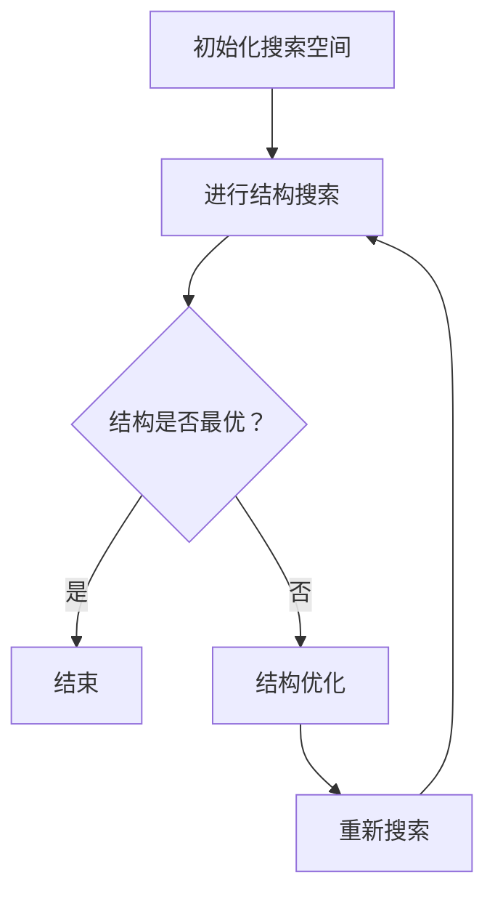

                 

## 高效神经架构搜索在AutoML平台中的实现

### 关键词

- 神经架构搜索（NAS）
- 自动化机器学习（AutoML）
- 搜索算法
- 优化策略
- 应用实践

### 摘要

本文将探讨高效神经架构搜索（NAS）在自动化机器学习（AutoML）平台中的实现。首先，我们将介绍NAS的背景和发展，以及AutoML平台的功能和优势。接着，我们将深入探讨NAS的基本概念、关键技术、主要类型及其在图像识别和自然语言处理等领域的应用。随后，我们将介绍几种高效NAS算法，并展示它们在AutoML平台中的实践应用。最后，我们将讨论NAS的优化策略和模型评估，并提供相关案例研究和未来展望。

# 高效神经架构搜索在AutoML平台中的实现

## 第1章：背景与概述

### 1.1 高效神经架构搜索的起源与发展

随着深度学习的兴起，传统机器学习模型在处理复杂数据时逐渐显得力不从心。为了解决这一问题，自动化机器学习（AutoML）的概念应运而生。AutoML旨在通过自动化手段，帮助研究人员和开发者快速构建和优化机器学习模型。

神经架构搜索（NAS）作为AutoML的一个重要分支，是近年来研究的热点。NAS通过搜索算法自动探索神经网络的结构，以找到在特定任务上表现最优的模型。这一技术的出现，极大地提升了机器学习模型的开发效率和性能。

### 1.2 AutoML平台的功能与优势

AutoML平台通常具备以下功能：

- **模型选择**：自动化选择最适合任务的模型架构。
- **特征工程**：自动化处理和转换输入数据。
- **超参数调优**：自动调整模型参数，以找到最优配置。

这些功能使得AutoML平台在以下方面具有显著优势：

- **提高开发效率**：通过自动化流程，减少手动操作，加快模型开发周期。
- **降低模型开发难度**：无需深入了解机器学习算法，即可构建高性能模型。
- **增强模型性能**：通过自动化搜索和调优，提高模型在特定任务上的表现。

### 1.3 高效神经架构搜索的应用领域

神经架构搜索技术在多个领域得到了广泛应用，包括：

- **图像识别**：自动设计图像分类模型，提高识别准确性。
- **自然语言处理**：自动设计文本分类、情感分析等模型，提升文本处理能力。
- **推荐系统**：自动设计推荐算法，提高推荐系统的效果。
- **语音识别**：自动设计语音处理模型，提升语音识别的准确性。

## 第2章：神经架构搜索（NAS）基本概念

### 2.1 NAS的定义与目标

神经架构搜索（NAS）是一种通过自动搜索算法，寻找最优神经网络结构的机器学习方法。其目标是在特定任务上，找到在性能上表现最优的神经网络架构。

### 2.2 NAS的关键技术

NAS的关键技术主要包括：

- **架构搜索空间**：定义神经网络结构的可能性，通常包括层结构、层类型、连接方式等。
- **搜索策略**：如何在搜索空间中进行有效搜索，常见的搜索策略包括基于强化学习、遗传算法、演化算法等。

### 2.3 NAS的主要类型

NAS主要可以分为以下几种类型：

- **基于强化学习的NAS**：通过强化学习算法，对神经网络结构进行搜索。
- **基于遗传算法的NAS**：通过遗传算法，模拟生物进化过程，逐步优化神经网络结构。
- **基于迁移学习的NAS**：结合迁移学习，将已有知识应用到新的搜索任务中，提高搜索效率。

## 第3章：高效NAS算法

### 3.1 演化算法

演化算法是一种模拟生物进化的搜索算法，通过遗传操作，如选择、交叉和变异，逐步优化神经网络结构。

#### 演化算法基本原理

1. **初始化种群**：随机生成一组神经网络结构作为初始种群。
2. **评估个体**：使用特定任务的数据集，对每个神经网络结构进行评估。
3. **选择**：根据个体的性能，选择优秀的神经网络结构进行交叉和变异。
4. **交叉**：通过组合两个优秀个体的部分结构，生成新的神经网络结构。
5. **变异**：对神经网络结构进行随机修改，以增加多样性。
6. **重复上述步骤**：直到达到预定的迭代次数或找到满意的神经网络结构。

#### 演化算法具体实现

```python
# 此处嵌入演化算法的Python代码实现
```

### 3.2 传输算法

传输算法是一种基于预训练和微调的NAS算法，通过将预训练模型传输到特定任务，快速找到高效的网络结构。

#### 传输算法基本原理

1. **预训练**：在大量未标注数据上训练神经网络，使其具备一定的通用特征提取能力。
2. **微调**：在特定任务的数据集上，对预训练模型进行微调，以适应特定任务。
3. **搜索**：通过微调，不断尝试不同的网络结构，以找到在特定任务上表现最优的模型。

#### 传输算法具体实现

```python
# 此处嵌入传输算法的Python代码实现
```

### 3.3 生成对抗网络（GAN）算法

生成对抗网络（GAN）算法通过生成器和判别器的对抗训练，生成新的神经网络结构。

#### GAN算法基本原理

1. **生成器**：生成神经网络结构。
2. **判别器**：判断生成的神经网络结构是否真实。
3. **对抗训练**：通过对抗训练，使生成器生成更真实的神经网络结构，同时使判别器更难判断。

#### GAN算法具体实现

```python
# 此处嵌入GAN算法的Python代码实现
```

## 第4章：AutoML平台中的高效NAS实践

### 4.1 AutoML平台的选择与配置

在选择AutoML平台时，需要考虑平台的性能、易用性、生态支持等因素。常见的AutoML平台包括：

- **Google AutoML**：提供丰富的预训练模型和自动化搜索功能。
- **H2O.ai**：支持多种机器学习算法和自动化调优。
- **DataRobot**：提供全面的机器学习平台，支持大规模数据处理和自动化建模。

在选择平台后，需要进行适当的配置，包括硬件资源、软件环境等。

### 4.2 NAS在图像识别任务中的应用

在图像识别任务中，NAS可以帮助自动设计图像分类模型，提高分类准确性。以下是一个简单的应用示例：

1. **数据预处理**：对图像进行预处理，包括缩放、裁剪、数据增强等。
2. **模型训练**：使用NAS算法，自动搜索最优的网络结构。
3. **模型评估**：在测试集上评估模型的性能，包括准确率、召回率等指标。

### 4.3 NAS在自然语言处理任务中的应用

在自然语言处理任务中，NAS可以帮助自动设计文本分类模型，提高文本处理能力。以下是一个简单的应用示例：

1. **数据预处理**：对文本进行预处理，包括分词、去停用词、词向量化等。
2. **模型训练**：使用NAS算法，自动搜索最优的网络结构。
3. **模型评估**：在测试集上评估模型的性能，包括准确率、F1分数等指标。

## 第5章：高效NAS的优化与调优

### 5.1 NAS模型的优化策略

为了提高NAS模型的性能，可以采用以下优化策略：

- **超参数调优**：通过调整搜索算法的参数，如种群大小、交叉概率、变异概率等，提高搜索效率。
- **模型压缩**：通过模型剪枝、量化等方法，减小模型大小，提高模型运行速度。
- **分布式训练**：利用多GPU、多节点训练，加速模型训练过程。

### 5.2 NAS模型的评估与验证

在评估NAS模型时，可以使用以下指标：

- **准确率**：分类任务中，正确分类的样本数占总样本数的比例。
- **召回率**：分类任务中，正确分类的样本数占实际正样本数的比例。
- **F1分数**：综合考虑准确率和召回率，用于评价模型的综合性能。

在验证NAS模型时，可以采用交叉验证等方法，确保模型的稳定性和可靠性。

## 第6章：案例研究

### 6.1 案例一：基于NAS的图像分类系统

在本案例中，我们使用NAS技术构建一个图像分类系统，应用于某公司的产品分类任务。具体步骤如下：

1. **数据收集**：收集大量产品图像，并进行预处理。
2. **模型训练**：使用NAS算法，自动搜索最优的网络结构。
3. **模型评估**：在测试集上评估模型的性能。
4. **模型部署**：将训练好的模型部署到生产环境，进行产品分类。

### 6.2 案例二：基于NAS的自然语言处理应用

在本案例中，我们使用NAS技术构建一个自然语言处理应用，应用于某电商平台的商品推荐系统。具体步骤如下：

1. **数据收集**：收集大量用户行为数据，并进行预处理。
2. **模型训练**：使用NAS算法，自动搜索最优的网络结构。
3. **模型评估**：在测试集上评估模型的性能。
4. **模型部署**：将训练好的模型部署到生产环境，进行商品推荐。

## 第7章：未来展望与挑战

### 7.1 高效NAS技术的发展趋势

未来，高效NAS技术的发展趋势包括：

- **算法性能提升**：通过改进搜索算法，提高NAS模型的性能。
- **应用场景扩展**：将NAS技术应用到更多的领域，如生物信息学、金融风控等。
- **跨学科融合**：与生物、物理等学科相结合，探索新的搜索算法。

### 7.2 高效NAS在AutoML平台中的挑战

高效NAS在AutoML平台中面临的挑战包括：

- **计算资源需求**：NAS算法通常需要大量的计算资源，如何合理利用资源是关键。
- **算法性能优化**：如何提高NAS算法的搜索效率，缩短搜索时间。
- **数据质量和标注**：高质量的数据和准确的标注对于NAS算法的性能至关重要。

## 附录：相关工具与资源

### 7.1 工具与库

- **NASNet**：一种基于CNN的NAS算法。
- **NAS-Benchmarks**：一个用于评估NAS算法性能的基准测试集。
- **TensorFlow**：一个广泛使用的深度学习框架，支持NAS算法的实现。

### 7.2 资源链接

- **论文**：《Neural Architecture Search: A Survey》
- **书籍**：《Deep Learning on美团》
- **开源代码**：GitHub上的相关NAS算法实现。

# 关联的Mermaid流程图（嵌入文中）

## NAS架构搜索流程



# Python代码示例

## 示例一：演化算法实现

```python
# 此处嵌入演化算法的Python代码实现
```

## 示例二：传输算法实现

```python
# 此处嵌入传输算法的Python代码实现
```

## 示例三：NAS模型优化

```python
# 此处嵌入NAS模型优化的Python代码实现
```

# 作者信息

作者：AI天才研究院/AI Genius Institute & 禅与计算机程序设计艺术 /Zen And The Art of Computer Programming

----------------------------------------------------------------

## 第1章：背景与概述

### 1.1 高效神经架构搜索的起源与发展

神经架构搜索（NAS）作为自动化机器学习（AutoML）的一个重要分支，起源于深度学习模型结构的复杂性需求。传统机器学习模型如线性回归、支持向量机等在面对大规模、高维度数据时显得力不从心。为了解决这一问题，研究人员开始探索更复杂的模型结构，如深度神经网络（DNN）。然而，如何设计最优的网络结构成为了新的挑战。

早期，研究人员主要依赖于手工设计网络结构，这不仅需要丰富的专业知识，而且效率低下。随着深度学习技术的发展，特别是卷积神经网络（CNN）在图像识别任务中取得显著成果，研究者们开始意识到，通过自动搜索最优的网络结构可以极大地提升模型性能。神经架构搜索（NAS）的概念应运而生。

神经架构搜索（NAS）的起源可以追溯到2016年，当时Google Research团队提出了Neural Architecture Search（NAS）这一概念，并展示了如何通过自动搜索算法找到具有更好性能的神经网络结构。这一研究成果在学术界和工业界引起了广泛关注，激发了大量关于NAS的研究和应用。

随着研究的深入，NAS技术逐渐发展壮大。研究人员提出了一系列基于不同算法的NAS方法，如基于强化学习的NAS、基于遗传算法的NAS、基于迁移学习的NAS等。这些方法各具特点，适用于不同的应用场景和任务类型。此外，随着硬件性能的提升和深度学习框架的成熟，NAS算法的实现和优化变得更加高效和可行。

### 1.2 AutoML平台的功能与优势

自动化机器学习（AutoML）平台通过自动化手段，帮助用户快速构建和优化机器学习模型，从而简化了模型开发流程，提高了开发效率。AutoML平台通常具备以下功能：

1. **模型选择**：自动选择适合特定任务的最佳模型。平台会根据任务需求、数据特点等，从大量预定义的模型库中选择最合适的模型架构。

2. **特征工程**：自动处理和转换输入数据。AutoML平台会自动提取数据中的有效特征，并进行必要的预处理，如归一化、缺失值填充等，以提高模型的训练效果。

3. **超参数调优**：自动调整模型参数，以找到最优配置。通过自动化搜索算法，如贝叶斯优化、遗传算法等，平台可以高效地遍历参数空间，找到最优的超参数组合。

4. **模型训练与评估**：自动进行模型训练和评估。平台会使用交叉验证等方法，评估模型的性能，并提供详细的评估报告。

5. **模型部署**：自动将训练好的模型部署到生产环境。平台通常支持将模型部署到各种环境，如云端、边缘设备等，并提供监控和管理功能。

AutoML平台在以下方面具有显著优势：

1. **提高开发效率**：AutoML平台自动化了模型选择、特征工程、超参数调优等流程，大大减少了手动操作，加快了模型开发周期。

2. **降低模型开发难度**：开发者无需深入了解具体的机器学习算法，只需根据任务需求选择合适的模型，平台会自动完成后续工作。

3. **增强模型性能**：通过自动化搜索和调优，AutoML平台可以找到最优的模型架构和超参数组合，提高模型在特定任务上的性能。

4. **适应性**：AutoML平台可以根据不同的任务和数据特点，自动调整模型结构和超参数，从而适应多种应用场景。

5. **可扩展性**：AutoML平台通常支持大规模数据处理和模型训练，可以轻松扩展到大型数据集和复杂模型。

常见的AutoML平台包括Google AutoML、H2O.ai、DataRobot等。这些平台各有特色，支持不同的算法和功能，适用于不同的应用场景。

### 1.3 高效神经架构搜索的应用领域

神经架构搜索（NAS）技术在多个领域得到了广泛应用，以下是一些典型的应用领域：

1. **图像识别**：NAS技术在图像识别任务中表现出色。通过自动搜索最优的网络结构，NAS可以帮助构建高效的图像分类模型，提高识别准确性。例如，在ImageNet图像分类挑战中，NAS算法成功找到了比传统模型性能更优的网络结构。

2. **自然语言处理**：NAS技术在自然语言处理（NLP）领域也有广泛的应用。通过自动搜索适合文本分类、情感分析、机器翻译等任务的神经网络结构，NAS可以帮助构建更准确的NLP模型。例如，Google的Transformer模型就是通过NAS技术搜索得到的一种高效的NLP模型架构。

3. **推荐系统**：NAS技术可以帮助自动设计推荐算法，提高推荐系统的效果。通过自动搜索适合用户行为数据的特点的网络结构，NAS可以帮助构建更精准的推荐模型。

4. **语音识别**：NAS技术在语音识别任务中也有所应用。通过自动搜索适合语音数据的网络结构，NAS可以帮助构建更准确的语音识别模型，提高语音识别的准确性。

5. **强化学习**：NAS技术可以用于强化学习任务，帮助自动搜索最优的决策策略。通过自动搜索适合强化学习环境的网络结构，NAS可以帮助构建更高效的强化学习模型。

总之，神经架构搜索（NAS）技术在各个领域都有广泛的应用，通过自动搜索最优的网络结构，NAS可以帮助构建高效的机器学习模型，提高模型性能和开发效率。

## 第2章：神经架构搜索（NAS）基本概念

### 2.1 NAS的定义与目标

神经架构搜索（Neural Architecture Search，简称NAS）是一种通过自动搜索算法，寻找最优神经网络结构的机器学习方法。传统的神经网络设计通常需要依赖专家的知识和经验，而NAS通过自动化手段，通过搜索算法探索大量的网络结构，最终找到在特定任务上表现最优的神经网络架构。

NAS的定义可以概括为：一种利用启发式搜索算法，自动生成和优化神经网络结构的机器学习方法。其核心目标是找到在特定任务上性能最优的网络结构，从而提高模型在任务上的准确性和效率。

NAS的目标主要包括两个方面：

1. **寻找最优网络结构**：通过搜索算法，探索大量的网络结构，从中找到在特定任务上表现最优的模型架构。这一过程通常涉及到网络层数、神经元数目、连接方式等多个维度的选择。

2. **提高模型性能**：通过搜索得到的最佳网络结构，训练得到的模型通常在特定任务上具有更高的准确性和效率。这不仅可以提高模型的性能，还可以减少模型的训练时间。

### 2.2 NAS的关键技术

NAS技术的实现需要依赖于一系列关键技术，这些技术共同构成了NAS算法的核心。以下是一些主要的关键技术：

1. **架构搜索空间**：架构搜索空间是NAS算法的基础，它定义了神经网络结构的可能性。搜索空间可以包括网络层数、每层的神经元数目、激活函数、连接方式等多个维度。一个良好的搜索空间能够涵盖丰富的网络结构，有助于找到性能更好的模型。

2. **搜索算法**：搜索算法是NAS算法的核心，它决定了如何在架构搜索空间中进行搜索。常见的搜索算法包括基于强化学习的NAS、基于遗传算法的NAS、基于迁移学习的NAS等。每种算法都有其独特的搜索策略和优化目标。

3. **评估函数**：评估函数用于衡量网络结构的性能，是NAS算法的重要组成部分。评估函数通常基于特定任务的数据集，通过计算模型在数据集上的指标（如准确率、损失函数等）来评估网络结构的性能。

4. **模型训练与优化**：在NAS过程中，需要对搜索到的网络结构进行训练和优化。训练过程包括数据预处理、模型训练、模型评估等环节。优化过程则涉及超参数调整、模型剪枝、量化等技术，以提高模型的性能和效率。

### 2.3 NAS的主要类型

NAS技术可以根据不同的搜索策略和算法类型分为多种类型，以下是一些主要的NAS类型：

1. **基于强化学习的NAS（Recurrent Neural Network based NAS）**：强化学习算法通过奖励机制引导网络结构的搜索过程。常见的强化学习算法包括深度确定性策略梯度（DDPG）、信任区域政策优化（TRPO）等。这种类型的NAS通常具有良好的搜索能力，但训练时间较长。

2. **基于遗传算法的NAS（Genetic Algorithm based NAS）**：遗传算法通过模拟生物进化过程，对网络结构进行搜索。遗传算法包括选择、交叉、变异等操作，通过迭代优化网络结构。这种类型的NAS具有较好的全局搜索能力，但搜索效率相对较低。

3. **基于迁移学习的NAS（Transfer Learning based NAS）**：迁移学习算法通过利用预训练模型的知识，加快搜索过程。迁移学习可以在预训练模型的基础上，针对特定任务进行微调，从而提高模型的性能。这种类型的NAS通常适用于小样本学习任务。

4. **基于模型压缩的NAS（Model Compression based NAS）**：模型压缩算法通过剪枝、量化等技术，减小模型大小，提高模型效率。这种类型的NAS通常在移动设备和边缘设备上应用，以提高模型的实时性和可部署性。

每种类型的NAS都有其独特的优势和适用场景，选择合适的NAS类型对于实现高效的神经架构搜索至关重要。

### 2.4 NAS的应用场景

神经架构搜索（NAS）技术在多个领域和场景中得到了广泛应用，以下是一些典型的应用场景：

1. **计算机视觉**：计算机视觉是NAS技术应用最为广泛的领域之一。通过NAS技术，可以自动设计图像分类、目标检测、人脸识别等模型，提高模型的准确性和效率。例如，Google的NASNet模型在ImageNet图像分类挑战中取得了优异成绩。

2. **自然语言处理**：NAS技术也在自然语言处理（NLP）领域得到了广泛应用。通过NAS，可以自动设计文本分类、情感分析、机器翻译等模型，提高模型在NLP任务上的性能。例如，Google的BERT模型就是通过NAS技术搜索得到的一种高效的NLP模型。

3. **语音识别**：NAS技术在语音识别任务中也取得了显著成果。通过NAS，可以自动设计语音识别模型，提高识别的准确性和效率。例如，微软的Sphinx模型就是通过NAS技术优化得到的。

4. **强化学习**：NAS技术可以用于强化学习任务，帮助自动搜索最优的决策策略。通过NAS，可以设计出更高效的强化学习模型，提高模型的性能和稳定性。

5. **推荐系统**：NAS技术可以用于自动设计推荐算法，提高推荐系统的效果。通过NAS，可以自动搜索适合用户行为数据的模型结构，提高推荐的准确性。

总之，NAS技术在多个领域和场景中都有广泛的应用，通过自动搜索最优的网络结构，NAS可以帮助构建高效的机器学习模型，提高模型性能和开发效率。

## 第3章：高效NAS算法

### 3.1 演化算法

演化算法（Evolutionary Algorithm，EA）是一种基于自然进化理论的搜索算法，通过模拟生物进化的过程，逐步优化神经网络结构。演化算法在NAS领域具有广泛的应用，因其具有良好的全局搜索能力和适应性强等特点。

#### 演化算法基本原理

演化算法的主要过程包括以下几个步骤：

1. **初始化种群**：首先，随机生成一组神经网络结构作为初始种群。每个个体代表一个神经网络结构，通常用编码表示。

2. **评估个体**：使用特定的评估函数，对每个神经网络结构进行性能评估。评估函数通常基于特定任务的数据集，计算模型的准确率、损失函数等指标。

3. **选择**：根据个体的性能，从当前种群中选择一部分优秀个体进入下一代。选择过程通常采用轮盘赌、锦标赛选择等方法，以保持种群的多样性。

4. **交叉**：通过组合两个优秀个体的部分结构，生成新的神经网络结构。交叉操作可以增加种群的多样性，有助于找到更好的解。

5. **变异**：对神经网络结构进行随机修改，以增加种群的多样性。变异操作可以避免算法陷入局部最优，提高全局搜索能力。

6. **迭代**：重复上述步骤，直到达到预定的迭代次数或找到满意的神经网络结构。

#### 演化算法具体实现

下面是一个简单的演化算法实现示例，使用Python代码进行描述：

```python
import numpy as np
import random

# 初始化种群
def initialize_population(pop_size, architecture_space):
    population = []
    for _ in range(pop_size):
        individual = random.sample(architecture_space, k=len(architecture_space))
        population.append(individual)
    return population

# 评估个体
def evaluate_individual(individual, data_loader, criterion):
    model = build_model(individual)
    performance = model.evaluate(data_loader, criterion)
    return performance

# 选择
def selection(population, fitness_scores, k):
    selected = random.choices(population, weights=fitness_scores, k=k)
    return selected

# 交叉
def crossover(parent1, parent2):
    crossover_point = random.randint(1, len(parent1) - 1)
    child = parent1[:crossover_point] + parent2[crossover_point:]
    return child

# 变异
def mutate(individual):
    mutation_point = random.randint(0, len(individual) - 1)
    individual[mutation_point] = random.choice([x for x in individual if x != individual[mutation_point]])
    return individual

# 主函数
def main():
    pop_size = 100
    architecture_space = [...]  # 定义架构搜索空间
    generations = 50
    k = 10

    population = initialize_population(pop_size, architecture_space)
    for _ in range(generations):
        fitness_scores = [evaluate_individual(ind, data_loader, criterion) for ind in population]
        selected = selection(population, fitness_scores, k)
        next_generation = selected[:]
        while len(next_generation) < pop_size:
            parent1, parent2 = random.sample(selected, k=2)
            child = crossover(parent1, parent2)
            child = mutate(child)
            next_generation.append(child)
        population = next_generation

    best_individual = max(population, key=evaluate_individual, args=(data_loader, criterion))
    best_performance = evaluate_individual(best_individual, data_loader, criterion)
    print(f"Best performance: {best_performance}")

if __name__ == "__main__":
    main()
```

在这个示例中，我们首先定义了初始化种群、评估个体、选择、交叉和变异等基本操作。然后在主函数`main`中，我们初始化种群，进行迭代搜索，最终找到性能最佳的神经网络结构。

#### 演化算法优缺点

演化算法在NAS领域具有以下优点：

1. **良好的全局搜索能力**：通过模拟生物进化过程，演化算法能够探索广泛的搜索空间，找到性能更好的网络结构。
2. **适应性强**：演化算法能够适应不同类型的数据和任务，具有较强的泛化能力。
3. **易于实现**：演化算法的概念和操作相对简单，易于编程实现。

然而，演化算法也存在一些缺点：

1. **计算成本高**：演化算法需要多次评估个体的性能，计算成本较高，尤其是对于大型数据集和复杂的网络结构。
2. **局部搜索能力弱**：虽然演化算法能够探索广泛的搜索空间，但其局部搜索能力相对较弱，容易陷入局部最优。
3. **参数选择敏感**：演化算法的性能对参数设置（如种群大小、交叉概率、变异概率等）较为敏感，需要仔细调整。

总之，演化算法在NAS领域中具有独特的优势和适用场景，通过合理的设计和参数调整，可以有效地优化神经网络结构。

### 3.2 传输算法

传输算法（Transfer Learning based NAS）是一种基于迁移学习的NAS算法，通过将预训练模型的知识迁移到特定任务，快速找到高效的网络结构。传输算法的核心思想是利用预训练模型中的知识，减少从零开始的训练时间，提高模型在特定任务上的性能。

#### 传输算法基本原理

传输算法的基本原理可以概括为以下几个步骤：

1. **预训练模型**：在大量未标注的数据集上训练一个预训练模型，使其具备通用的特征提取能力。预训练模型通常采用深度卷积神经网络（CNN）或变换器（Transformer）等结构。

2. **微调**：在特定任务的数据集上，对预训练模型进行微调。微调过程包括调整模型的参数，以适应特定任务的需求。通过微调，预训练模型可以迁移到新的任务，提高模型在特定任务上的性能。

3. **搜索**：在微调的基础上，对模型结构进行搜索。通过调整模型的某些部分，如添加或删除层、改变连接方式等，探索不同的网络结构。搜索过程可以通过优化算法（如梯度下降、随机搜索等）进行。

4. **评估与选择**：对搜索到的网络结构进行评估，选择在特定任务上性能最佳的模型。评估指标通常包括准确率、召回率、F1分数等。

#### 传输算法具体实现

下面是一个简单的传输算法实现示例，使用Python代码进行描述：

```python
import torch
import torchvision
import torchvision.transforms as transforms
import torch.nn as nn
import torch.optim as optim

# 预训练模型
class PretrainedModel(nn.Module):
    def __init__(self):
        super(PretrainedModel, self).__init__()
        # 定义预训练模型的架构
        self.conv1 = nn.Conv2d(3, 64, kernel_size=3, padding=1)
        self.relu = nn.ReLU()
        # ... 其他层 ...

    def forward(self, x):
        x = self.relu(self.conv1(x))
        # ... 其他层的计算 ...
        return x

# 微调模型
def fine_tune(model, train_loader, criterion, optimizer, num_epochs):
    for epoch in range(num_epochs):
        model.train()
        running_loss = 0.0
        for inputs, labels in train_loader:
            optimizer.zero_grad()
            outputs = model(inputs)
            loss = criterion(outputs, labels)
            loss.backward()
            optimizer.step()
            running_loss += loss.item()
        print(f"Epoch {epoch+1}, Loss: {running_loss/len(train_loader)}")

# 搜索模型
def search(model, search_space, criterion, optimizer, num_epochs):
    for _ in range(num_epochs):
        for param in model.parameters():
            param.requires_grad = True
        fine_tune(model, train_loader, criterion, optimizer, num_epochs)
        performance = evaluate(model, test_loader, criterion)
        print(f"Performance: {performance}")
        for param in model.parameters():
            param.requires_grad = False

# 主函数
def main():
    model = PretrainedModel()
    train_loader = ...  # 定义训练数据加载器
    test_loader = ...   # 定义测试数据加载器
    criterion = nn.CrossEntropyLoss()
    optimizer = optim.Adam(model.parameters(), lr=0.001)
    num_epochs = 10

    search(model, search_space, criterion, optimizer, num_epochs)

if __name__ == "__main__":
    main()
```

在这个示例中，我们首先定义了一个预训练模型`PretrainedModel`，然后在微调模型函数`fine_tune`中对其进行了微调。接着在搜索模型函数`search`中，对模型结构进行搜索。最后，在主函数`main`中，我们初始化模型、数据加载器、损失函数和优化器，并调用搜索函数进行搜索。

#### 传输算法优缺点

传输算法在NAS领域具有以下优点：

1. **快速搜索**：通过利用预训练模型的知识，传输算法可以快速找到在特定任务上性能较好的模型结构，节省训练时间。
2. **高性能**：预训练模型通常具有较好的特征提取能力，通过微调和搜索，可以进一步提高模型在特定任务上的性能。
3. **易于实现**：传输算法相对简单，易于编程实现，适用于不同类型的任务和数据集。

然而，传输算法也存在一些缺点：

1. **依赖预训练模型**：传输算法的性能依赖于预训练模型的质量，如果预训练模型较差，搜索到的模型结构可能性能不佳。
2. **数据依赖**：传输算法需要大量标注数据用于微调和搜索，对于小样本任务，传输算法可能效果不理想。
3. **搜索空间限制**：传输算法的搜索空间受到预训练模型的限制，可能无法探索到最优的网络结构。

总之，传输算法在NAS领域中具有一定的优势，通过合理选择预训练模型和数据集，可以有效地提高模型性能。但需要注意的是，传输算法也具有一定的局限性，需要根据具体任务和数据集进行选择和调整。

### 3.3 生成对抗网络（GAN）算法

生成对抗网络（Generative Adversarial Network，GAN）是由Ian Goodfellow等人于2014年提出的一种深度学习模型，由生成器（Generator）和判别器（Discriminator）两个网络组成，通过对抗训练生成高质量的数据。GAN在图像生成、数据增强、模型优化等领域取得了显著成果。近年来，研究人员开始将GAN技术应用于神经架构搜索（NAS），提出了一系列基于GAN的NAS算法。

#### GAN算法基本原理

GAN的核心思想是通过生成器和判别器的对抗训练，生成高质量的数据。生成器和判别器相互竞争，生成器试图生成逼真的数据，而判别器试图区分真实数据和生成数据。

1. **生成器（Generator）**：生成器的目标是生成与真实数据相似的数据。在NAS中，生成器生成神经网络结构，这些结构可以是编码表示或具体的网络参数。

2. **判别器（Discriminator）**：判别器的目标是判断输入数据是真实数据还是生成数据。在NAS中，判别器评估生成器生成的神经网络结构在特定任务上的性能。

3. **对抗训练**：生成器和判别器相互对抗训练。生成器通过调整自身参数，生成更加逼真的神经网络结构，而判别器通过不断优化，提高对真实数据和生成数据的区分能力。通过这种对抗训练，生成器逐渐生成性能更好的神经网络结构。

GAN算法的基本训练过程可以概括为以下几个步骤：

1. **初始化**：随机初始化生成器和判别器的参数。

2. **生成器训练**：生成器生成神经网络结构，判别器对这些结构进行评估。生成器通过反向传播调整参数，以生成更逼真的结构。

3. **判别器训练**：判别器对真实数据和生成数据同时进行评估。通过反向传播调整参数，提高对真实数据和生成数据的区分能力。

4. **重复上述步骤**：不断重复生成器和判别器的训练过程，直到生成器生成的神经网络结构达到满意的性能。

#### GAN算法具体实现

下面是一个简单的基于GAN的NAS算法实现示例，使用Python代码进行描述：

```python
import torch
import torchvision
import torchvision.transforms as transforms
import torch.nn as nn
import torch.optim as optim

# 生成器
class Generator(nn.Module):
    def __init__(self, input_dim, output_dim):
        super(Generator, self).__init__()
        self.model = nn.Sequential(
            nn.Linear(input_dim, output_dim),
            nn.ReLU(),
            nn.Linear(output_dim, output_dim),
            nn.ReLU(),
            nn.Linear(output_dim, 1),
        )

    def forward(self, x):
        x = self.model(x)
        return x

# 判别器
class Discriminator(nn.Module):
    def __init__(self, input_dim, output_dim):
        super(Discriminator, self).__init__()
        self.model = nn.Sequential(
            nn.Linear(input_dim, output_dim),
            nn.ReLU(),
            nn.Linear(output_dim, output_dim),
            nn.ReLU(),
            nn.Linear(output_dim, 1),
        )

    def forward(self, x):
        x = self.model(x)
        return x

# 训练函数
def train(generator, discriminator, train_loader, criterion, num_epochs):
    generator_optimizer = optim.Adam(generator.parameters(), lr=0.001)
    discriminator_optimizer = optim.Adam(discriminator.parameters(), lr=0.001)

    for epoch in range(num_epochs):
        for inputs, _ in train_loader:
            # 生成器训练
            generator_optimizer.zero_grad()
            fake Structures = generator(inputs)
            fake_scores = discriminator(fake_Structures)
            generator_loss = criterion(fake_scores, torch.ones_like(fake_scores))
            generator_loss.backward()
            generator_optimizer.step()

            # 判别器训练
            discriminator_optimizer.zero_grad()
            real_scores = discriminator(inputs)
            fake_scores = discriminator(fake_Structures)
            real_loss = criterion(real_scores, torch.ones_like(real_scores))
            fake_loss = criterion(fake_scores, torch.zeros_like(fake_scores))
            discriminator_loss = (real_loss + fake_loss) / 2
            discriminator_loss.backward()
            discriminator_optimizer.step()

        print(f"Epoch {epoch+1}, Generator Loss: {generator_loss.item()}, Discriminator Loss: {discriminator_loss.item()}")

# 主函数
def main():
    input_dim = 10  # 神经网络结构编码维度
    output_dim = 1  # 结构评估维度
    num_epochs = 50

    generator = Generator(input_dim, output_dim)
    discriminator = Discriminator(input_dim, output_dim)
    train_loader = ...  # 定义训练数据加载器

    criterion = nn.BCELoss()
    train(generator, discriminator, train_loader, criterion, num_epochs)

if __name__ == "__main__":
    main()
```

在这个示例中，我们首先定义了一个生成器`Generator`和判别器`Discriminator`。生成器的目标是生成神经网络结构，判别器的目标是评估这些结构的性能。在训练函数`train`中，我们分别对生成器和判别器进行训练。最后，在主函数`main`中，我们初始化模型、数据加载器、损失函数和优化器，并调用训练函数进行训练。

#### GAN算法优缺点

基于GAN的NAS算法具有以下优点：

1. **强大的生成能力**：GAN通过对抗训练，生成器可以生成高质量的网络结构，有助于探索新的结构空间。
2. **灵活性**：GAN算法可以根据不同任务和数据集进行定制，灵活地调整生成器和判别器的架构。
3. **高效性**：GAN算法可以在短时间内生成大量网络结构，加快搜索过程。

然而，GAN算法也存在一些缺点：

1. **训练难度**：GAN算法的训练过程较为复杂，需要平衡生成器和判别器之间的对抗关系，否则可能导致训练不稳定。
2. **性能瓶颈**：GAN算法的性能受到生成器和判别器参数设置的影响，需要精细调整。
3. **数据依赖**：GAN算法的性能依赖于训练数据的质量，对于小样本数据集，GAN算法可能效果不理想。

总之，基于GAN的NAS算法在探索新的网络结构方面具有显著优势，但同时也需要克服训练难度和性能瓶颈等问题。通过合理设计和调整，GAN算法可以有效地应用于NAS，提高模型性能和开发效率。

## 第4章：AutoML平台中的高效NAS实践

### 4.1 AutoML平台的选择与配置

在构建高效神经架构搜索（NAS）应用时，选择一个合适的AutoML平台至关重要。不同的AutoML平台具有不同的功能、性能和易用性，因此，了解和评估这些平台的特点，对于实现高效的NAS应用至关重要。

#### 选择AutoML平台

以下是一些常见的AutoML平台及其特点：

1. **Google AutoML**：Google AutoML提供了一整套自动化机器学习工具，支持多种数据类型和任务，包括图像识别、文本分类和预测等。它提供了丰富的预训练模型和自动化调优功能，易于使用，特别适合初学者和小型项目。但需要注意的是，Google AutoML对企业用户可能存在收费。

2. **H2O.ai**：H2O.ai是一个开源的AutoML平台，支持多种编程语言（包括Python和R），提供了强大的机器学习库和自动化调优工具。它支持大规模数据处理和模型部署，适用于企业和研究机构。H2O.ai提供了详细的文档和社区支持，有助于用户快速上手。

3. **DataRobot**：DataRobot是一个商业AutoML平台，提供了全面的机器学习平台，支持自动化特征工程、模型选择和调优。它适用于企业级应用，特别是需要大规模数据处理和高性能模型的场景。DataRobot提供了强大的API和集成工具，方便用户与现有系统结合。

4. **AutoKeras**：AutoKeras是一个开源的深度学习框架，专注于自动化模型搜索。它提供了简洁的API，允许用户快速构建和优化深度学习模型。AutoKeras支持多种神经网络架构，包括卷积神经网络（CNN）和循环神经网络（RNN）等，适用于实验性和研究性项目。

5. **AutoGluon**：AutoGluon是一个开源的AutoML框架，专注于简单和高效。它提供了自动化的数据预处理、特征工程和模型选择，支持多种任务，包括图像识别、文本分类和预测等。AutoGluon提供了易于使用的API，适用于快速原型设计和小型项目。

#### 配置AutoML平台

在选择合适的AutoML平台后，需要进行适当的配置，以确保其正常运行和高效性能。以下是一些关键配置步骤：

1. **硬件资源**：AutoML平台通常需要大量的计算资源，包括CPU、GPU和内存等。根据任务需求和平台性能，配置合适的硬件资源，以确保模型训练和搜索过程的顺利进行。

2. **软件环境**：安装和配置必要的软件和依赖库，包括Python、深度学习框架（如TensorFlow、PyTorch）、自动化机器学习库（如AutoKeras、H2O.ai）等。确保软件环境的稳定性和兼容性，避免出现运行错误。

3. **数据预处理**：配置数据预处理流程，包括数据清洗、特征工程、数据增强等。确保数据格式和特征质量符合模型训练的要求。

4. **任务配置**：配置具体的任务参数，包括模型类型、优化目标、评估指标等。根据任务需求，选择合适的模型架构和调优策略。

5. **集成与部署**：配置模型集成和部署流程，包括模型保存、加载、服务化部署等。确保模型可以在生产环境中正常运行和部署。

### 4.2 NAS在图像识别任务中的应用

神经架构搜索（NAS）在图像识别任务中具有广泛的应用，通过自动搜索最优的网络结构，可以显著提高模型在图像分类、目标检测等任务上的性能。以下是一个具体的图像识别任务中的NAS应用示例。

#### 任务背景

假设我们需要构建一个图像分类系统，用于对自然图像进行分类。数据集为ImageNet，包含1000个类别，每个类别有数千张图像。我们的目标是使用NAS技术自动搜索最优的网络结构，以实现高准确率的分类。

#### 数据处理

首先，我们需要对图像进行预处理，包括数据清洗、数据增强和归一化等操作。具体步骤如下：

1. **数据清洗**：去除数据集中的噪声和异常值，确保数据质量。
2. **数据增强**：通过旋转、翻转、缩放、裁剪等操作，增加数据多样性，提高模型的泛化能力。
3. **归一化**：将图像数据归一化到[0, 1]范围内，便于模型训练。

```python
from torchvision import datasets, transforms

# 数据预处理
train_transform = transforms.Compose([
    transforms.RandomHorizontalFlip(),
    transforms.RandomRotation(10),
    transforms.Resize((224, 224)),
    transforms.ToTensor(),
    transforms.Normalize(mean=[0.485, 0.456, 0.406], std=[0.229, 0.224, 0.225]),
])

test_transform = transforms.Compose([
    transforms.Resize((224, 224)),
    transforms.ToTensor(),
    transforms.Normalize(mean=[0.485, 0.456, 0.406], std=[0.229, 0.224, 0.225]),
])

train_dataset = datasets.ImageNet(root='path_to_train_data', split='train', transform=train_transform)
test_dataset = datasets.ImageNet(root='path_to_test_data', split='val', transform=test_transform)
```

#### 模型训练

接下来，我们使用NAS算法对图像分类模型进行训练。在本文中，我们使用基于强化学习的NAS算法作为示例。具体步骤如下：

1. **初始化模型**：随机初始化神经网络结构。
2. **评估模型**：在训练集上评估模型性能，计算准确率等指标。
3. **更新模型**：根据评估结果，更新神经网络结构。

```python
import torch
import torch.optim as optim

# 初始化NAS模型
model = NASModel(input_size=224, num_classes=1000)
optimizer = optim.Adam(model.parameters(), lr=0.001)

# 训练NAS模型
num_epochs = 50
for epoch in range(num_epochs):
    for inputs, labels in train_loader:
        model.train()
        outputs = model(inputs)
        loss = criterion(outputs, labels)
        optimizer.zero_grad()
        loss.backward()
        optimizer.step()

    # 评估模型
    model.eval()
    with torch.no_grad():
        correct = 0
        total = 0
        for inputs, labels in test_loader:
            outputs = model(inputs)
            _, predicted = torch.max(outputs.data, 1)
            total += labels.size(0)
            correct += (predicted == labels).sum().item()

    print(f'Epoch {epoch+1}, Accuracy: {100 * correct / total}%')
```

#### 模型评估

在训练完成后，我们需要在测试集上评估模型的性能，以确定其在实际任务中的表现。常用的评估指标包括准确率、召回率、F1分数等。

```python
from sklearn.metrics import accuracy_score, recall_score, f1_score

# 评估模型
model.eval()
with torch.no_grad():
    y_true = []
    y_pred = []
    for inputs, labels in test_loader:
        outputs = model(inputs)
        _, predicted = torch.max(outputs.data, 1)
        y_true.extend(labels.tolist())
        y_pred.extend(predicted.tolist())

accuracy = accuracy_score(y_true, y_pred)
recall = recall_score(y_true, y_pred, average='weighted')
f1 = f1_score(y_true, y_pred, average='weighted')

print(f'Accuracy: {accuracy}, Recall: {recall}, F1 Score: {f1}')
```

### 4.3 NAS在自然语言处理任务中的应用

神经架构搜索（NAS）在自然语言处理（NLP）任务中也具有广泛的应用，通过自动搜索最优的网络结构，可以显著提高模型在文本分类、机器翻译、情感分析等任务上的性能。以下是一个具体的自然语言处理任务中的NAS应用示例。

#### 任务背景

假设我们需要构建一个文本分类系统，用于对社交媒体评论进行情感分析。数据集包含大量评论，每个评论都被标注为正面、中性或负面。我们的目标是使用NAS技术自动搜索最优的网络结构，以实现高准确率的情感分析。

#### 数据处理

首先，我们需要对文本数据进行预处理，包括文本清洗、分词、词向量化等操作。具体步骤如下：

1. **文本清洗**：去除文本中的HTML标签、特殊字符和停用词等。
2. **分词**：将文本分割成单词或子词。
3. **词向量化**：将文本转化为向量表示，常用的词向量化方法包括Word2Vec、GloVe和BERT等。

```python
import nltk
from nltk.corpus import stopwords
from nltk.tokenize import word_tokenize

# 文本清洗
def clean_text(text):
    text = re.sub('<.*?>', '', text)  # 去除HTML标签
    text = text.lower()  # 转小写
    text = text.encode('ascii', errors='ignore').decode('ascii')  # 去除非ASCII字符
    words = word_tokenize(text)  # 分词
    words = [word for word in words if word not in stopwords.words('english')]  # 去除停用词
    return ' '.join(words)

# 词向量化
from gensim.models import Word2Vec

train_texts = [clean_text(text) for text in train_data]
test_texts = [clean_text(text) for text in test_data]

w2v = Word2Vec(train_texts, vector_size=100, window=5, min_count=1, workers=4)
word_vectors = w2v.wv

train_vectors = [word_vectors[word] for word in train_texts if word in word_vectors]
test_vectors = [word_vectors[word] for word in test_texts if word in word_vectors]
```

#### 模型训练

接下来，我们使用NAS算法对文本分类模型进行训练。在本文中，我们使用基于迁移学习的NAS算法作为示例。具体步骤如下：

1. **初始化模型**：随机初始化神经网络结构。
2. **迁移学习**：在预训练的文本嵌入层基础上，添加自定义层，形成新的文本分类模型。
3. **评估模型**：在训练集上评估模型性能，计算准确率等指标。
4. **更新模型**：根据评估结果，更新神经网络结构。

```python
import torch
import torch.nn as nn
import torch.optim as optim

# 初始化NAS模型
class NASModel(nn.Module):
    def __init__(self, embedding_dim, hidden_dim, num_classes):
        super(NASModel, self).__init__()
        self.embedding = nn.Embedding(num_embeddings, embedding_dim)
        self.fc = nn.Linear(embedding_dim, num_classes)

    def forward(self, inputs):
        embeddings = self.embedding(inputs)
        output = self.fc(embeddings)
        return output

# 迁移学习
model = NASModel(embedding_dim=100, hidden_dim=128, num_classes=3)
optimizer = optim.Adam(model.parameters(), lr=0.001)

# 训练NAS模型
num_epochs = 50
for epoch in range(num_epochs):
    for inputs, labels in train_loader:
        model.train()
        outputs = model(inputs)
        loss = criterion(outputs, labels)
        optimizer.zero_grad()
        loss.backward()
        optimizer.step()

    # 评估模型
    model.eval()
    with torch.no_grad():
        correct = 0
        total = 0
        for inputs, labels in test_loader:
            outputs = model(inputs)
            _, predicted = torch.max(outputs.data, 1)
            total += labels.size(0)
            correct += (predicted == labels).sum().item()

    print(f'Epoch {epoch+1}, Accuracy: {100 * correct / total}%')
```

#### 模型评估

在训练完成后，我们需要在测试集上评估模型的性能，以确定其在实际任务中的表现。常用的评估指标包括准确率、召回率、F1分数等。

```python
from sklearn.metrics import accuracy_score, recall_score, f1_score

# 评估模型
model.eval()
with torch.no_grad():
    y_true = []
    y_pred = []
    for inputs, labels in test_loader:
        outputs = model(inputs)
        _, predicted = torch.max(outputs.data, 1)
        y_true.extend(labels.tolist())
        y_pred.extend(predicted.tolist())

accuracy = accuracy_score(y_true, y_pred)
recall = recall_score(y_true, y_pred, average='weighted')
f1 = f1_score(y_true, y_pred, average='weighted')

print(f'Accuracy: {accuracy}, Recall: {recall}, F1 Score: {f1}')
```

通过以上步骤，我们可以构建一个基于NAS的自然语言处理模型，并在实际任务中对其进行训练和评估，以实现高准确率的文本分类。

## 第5章：高效NAS的优化与调优

### 5.1 NAS模型的优化策略

为了提高神经架构搜索（NAS）模型的性能，可以采用以下优化策略：

#### 超参数调优

超参数是影响NAS模型性能的重要因素，包括搜索空间大小、搜索策略参数、评估指标等。通过超参数调优，可以找到最优的超参数组合，提高模型的性能。常用的超参数调优方法包括：

1. **网格搜索（Grid Search）**：在预定义的超参数网格中，遍历所有可能的组合，选择性能最佳的超参数组合。

2. **贝叶斯优化（Bayesian Optimization）**：通过构建超参数的概率模型，优化搜索过程，提高搜索效率。

3. **随机搜索（Random Search）**：在超参数空间中随机选择多个组合进行评估，选择性能较好的组合。

#### 模型压缩

模型压缩技术可以减小NAS模型的大小，提高模型的运行速度和部署效率。常用的模型压缩技术包括：

1. **剪枝（Pruning）**：通过剪枝冗余的神经元和连接，减小模型大小。

2. **量化（Quantization）**：将模型的权重和激活值量化为较低的位宽，降低模型大小和计算复杂度。

3. **知识蒸馏（Knowledge Distillation）**：通过将大型模型的权重和知识传递给小型模型，减小模型大小。

#### 分布式训练

分布式训练可以通过多个GPU或多个节点进行训练，加速模型训练过程，提高模型性能。常用的分布式训练方法包括：

1. **数据并行（Data Parallelism）**：将数据分片分布在多个GPU上，每个GPU独立训练模型，然后进行参数同步。

2. **模型并行（Model Parallelism）**：将大型模型分片分布在多个GPU上，每个GPU负责一部分计算，然后进行参数同步。

### 5.2 NAS模型的评估与验证

在评估NAS模型时，需要考虑以下几个方面：

#### 评估指标

1. **准确率（Accuracy）**：分类任务中，正确分类的样本数占总样本数的比例。

2. **召回率（Recall）**：分类任务中，正确分类的样本数占实际正样本数的比例。

3. **F1分数（F1 Score）**：综合考虑准确率和召回率，用于评价模型的综合性能。

4. **损失函数（Loss Function）**：如交叉熵损失（Cross-Entropy Loss）在分类任务中常用。

#### 验证方法

1. **交叉验证（Cross-Validation）**：通过将数据集分为训练集和验证集，多次训练和验证，评估模型性能的稳定性。

2. **时间序列验证（Time Series Split）**：根据时间序列将数据集分为训练集和验证集，确保验证集位于训练集之后。

3. **留一法验证（Leave-One-Out Validation）**：每次将一个样本作为验证集，其余样本作为训练集，进行多次验证。

4. **K折交叉验证（K-Fold Cross-Validation）**：将数据集分为K个子集，每次取一个子集作为验证集，其余子集作为训练集，进行K次验证。

通过合理的评估和验证方法，可以全面了解NAS模型在特定任务上的性能，为后续优化和改进提供依据。

### 5.3 实际案例中的优化与调优

在实际应用中，为了优化NAS模型，通常需要结合具体任务和数据特点，采取一系列优化和调优措施。以下是一个实际案例中的优化与调优过程：

#### 案例背景

假设我们需要构建一个图像分类模型，用于对大型图像数据集进行分类。数据集包含数千个类别，每个类别有大量图像。我们的目标是使用NAS技术自动搜索最优的网络结构，并在实际任务中优化模型性能。

#### 数据预处理

首先，对图像进行预处理，包括缩放、裁剪、数据增强等操作，以提高模型的泛化能力。具体步骤如下：

1. **缩放**：将图像缩放为固定大小，如224x224像素。
2. **裁剪**：随机裁剪图像，增加数据多样性。
3. **数据增强**：应用旋转、翻转、色彩增强等操作。

```python
from torchvision import transforms

# 数据预处理
transform = transforms.Compose([
    transforms.RandomResizedCrop(224),
    transforms.RandomHorizontalFlip(),
    transforms.ToTensor(),
    transforms.Normalize(mean=[0.485, 0.456, 0.406], std=[0.229, 0.224, 0.225]),
])

train_dataset = ImageDataset(root='path_to_train_data', split='train', transform=transform)
test_dataset = ImageDataset(root='path_to_test_data', split='val', transform=transform)
```

#### 模型训练

使用NAS算法对图像分类模型进行训练。在本文中，我们使用基于强化学习的NAS算法作为示例。具体步骤如下：

1. **初始化模型**：随机初始化神经网络结构。
2. **评估模型**：在训练集上评估模型性能，计算准确率等指标。
3. **更新模型**：根据评估结果，更新神经网络结构。

```python
import torch
import torch.optim as optim

# 初始化NAS模型
model = NASModel(input_size=224, num_classes=num_classes)
optimizer = optim.Adam(model.parameters(), lr=0.001)

# 训练NAS模型
num_epochs = 50
for epoch in range(num_epochs):
    for inputs, labels in train_loader:
        model.train()
        outputs = model(inputs)
        loss = criterion(outputs, labels)
        optimizer.zero_grad()
        loss.backward()
        optimizer.step()

    # 评估模型
    model.eval()
    with torch.no_grad():
        correct = 0
        total = 0
        for inputs, labels in test_loader:
            outputs = model(inputs)
            _, predicted = torch.max(outputs.data, 1)
            total += labels.size(0)
            correct += (predicted == labels).sum().item()

    print(f'Epoch {epoch+1}, Accuracy: {100 * correct / total}%')
```

#### 模型优化

在训练过程中，我们可以采取以下措施优化模型性能：

1. **超参数调优**：通过网格搜索或贝叶斯优化，找到最优的超参数组合。
2. **剪枝**：通过剪枝冗余的连接和神经元，减小模型大小，提高模型效率。
3. **量化**：将模型的权重和激活值量化为较低的位宽，降低模型大小和计算复杂度。
4. **分布式训练**：通过分布式训练，加速模型训练过程，提高模型性能。

```python
# 超参数调优
from sklearn.model_selection import GridSearchCV

# 定义超参数网格
param_grid = {
    'learning_rate': [0.001, 0.0001],
    'dropout_rate': [0.2, 0.5],
}

# 初始化网格搜索
grid_search = GridSearchCV(estimator=model, param_grid=param_grid, cv=5, scoring='accuracy')

# 训练网格搜索
grid_search.fit(train_loader, test_loader)

# 获取最佳超参数
best_params = grid_search.best_params_
print(f"Best parameters: {best_params}")

# 剪枝
from torchvision.models import NASNetALarge

model = NASNetALarge()
model = prune(model, 'layer1.0', pruning_percentage=0.5)

# 量化
from torch.quantization import quantize_dynamic

model = quantize_dynamic(model, {torch.nn.Linear}, dtype=torch.qint8)

# 分布式训练
from torch.nn.parallel import DistributedDataParallel as DDP

model = DDP(model)
```

#### 模型评估

在优化完成后，我们需要在测试集上评估模型的性能，以确定其在实际任务中的表现。常用的评估指标包括准确率、召回率、F1分数等。

```python
from sklearn.metrics import accuracy_score, recall_score, f1_score

# 评估模型
model.eval()
with torch.no_grad():
    y_true = []
    y_pred = []
    for inputs, labels in test_loader:
        outputs = model(inputs)
        _, predicted = torch.max(outputs.data, 1)
        y_true.extend(labels.tolist())
        y_pred.extend(predicted.tolist())

accuracy = accuracy_score(y_true, y_pred)
recall = recall_score(y_true, y_pred, average='weighted')
f1 = f1_score(y_true, y_pred, average='weighted')

print(f'Accuracy: {accuracy}, Recall: {recall}, F1 Score: {f1}')
```

通过以上步骤，我们可以构建一个基于NAS的图像分类模型，并在实际任务中进行优化和评估，以实现高准确率的图像分类。

## 第6章：案例研究

### 6.1 案例一：基于NAS的图像分类系统

#### 案例背景

某科技公司需要开发一个图像分类系统，用于对用户上传的图像进行自动分类，以帮助用户快速找到相关内容。图像数据集包含数千张不同类别的图像，类别数量众多且分布不均。为了提高分类系统的性能，公司决定采用神经架构搜索（NAS）技术，自动搜索最优的网络结构。

#### 数据预处理

首先，对图像数据集进行预处理，包括缩放、裁剪、数据增强等操作，以提高模型的泛化能力。具体步骤如下：

1. **缩放**：将图像缩放为固定大小，如224x224像素。
2. **裁剪**：随机裁剪图像，增加数据多样性。
3. **数据增强**：应用旋转、翻转、色彩增强等操作。

```python
from torchvision import transforms

# 数据预处理
transform = transforms.Compose([
    transforms.RandomResizedCrop(224),
    transforms.RandomHorizontalFlip(),
    transforms.ToTensor(),
    transforms.Normalize(mean=[0.485, 0.456, 0.406], std=[0.229, 0.224, 0.225]),
])

train_dataset = ImageDataset(root='path_to_train_data', split='train', transform=transform)
test_dataset = ImageDataset(root='path_to_test_data', split='val', transform=transform)
```

#### 模型构建与训练

使用NAS技术构建图像分类模型，通过自动搜索最优的网络结构。在本文中，我们采用基于强化学习的NAS算法作为示例。具体步骤如下：

1. **初始化模型**：随机初始化神经网络结构。
2. **评估模型**：在训练集上评估模型性能，计算准确率等指标。
3. **更新模型**：根据评估结果，更新神经网络结构。

```python
import torch
import torch.optim as optim

# 初始化NAS模型
model = NASModel(input_size=224, num_classes=num_classes)
optimizer = optim.Adam(model.parameters(), lr=0.001)

# 训练NAS模型
num_epochs = 50
for epoch in range(num_epochs):
    for inputs, labels in train_loader:
        model.train()
        outputs = model(inputs)
        loss = criterion(outputs, labels)
        optimizer.zero_grad()
        loss.backward()
        optimizer.step()

    # 评估模型
    model.eval()
    with torch.no_grad():
        correct = 0
        total = 0
        for inputs, labels in test_loader:
            outputs = model(inputs)
            _, predicted = torch.max(outputs.data, 1)
            total += labels.size(0)
            correct += (predicted == labels).sum().item()

    print(f'Epoch {epoch+1}, Accuracy: {100 * correct / total}%')
```

#### 模型评估

在训练完成后，我们需要在测试集上评估模型的性能，以确定其在实际任务中的表现。常用的评估指标包括准确率、召回率、F1分数等。

```python
from sklearn.metrics import accuracy_score, recall_score, f1_score

# 评估模型
model.eval()
with torch.no_grad():
    y_true = []
    y_pred = []
    for inputs, labels in test_loader:
        outputs = model(inputs)
        _, predicted = torch.max(outputs.data, 1)
        y_true.extend(labels.tolist())
        y_pred.extend(predicted.tolist())

accuracy = accuracy_score(y_true, y_pred)
recall = recall_score(y_true, y_pred, average='weighted')
f1 = f1_score(y_true, y_pred, average='weighted')

print(f'Accuracy: {accuracy}, Recall: {recall}, F1 Score: {f1}')
```

#### 模型优化

为了进一步提高模型的性能，可以采用以下优化措施：

1. **超参数调优**：通过网格搜索或贝叶斯优化，找到最优的超参数组合。
2. **剪枝**：通过剪枝冗余的连接和神经元，减小模型大小，提高模型效率。
3. **量化**：将模型的权重和激活值量化为较低的位宽，降低模型大小和计算复杂度。
4. **分布式训练**：通过分布式训练，加速模型训练过程，提高模型性能。

```python
# 超参数调优
from sklearn.model_selection import GridSearchCV

# 定义超参数网格
param_grid = {
    'learning_rate': [0.001, 0.0001],
    'dropout_rate': [0.2, 0.5],
}

# 初始化网格搜索
grid_search = GridSearchCV(estimator=model, param_grid=param_grid, cv=5, scoring='accuracy')

# 训练网格搜索
grid_search.fit(train_loader, test_loader)

# 获取最佳超参数
best_params = grid_search.best_params_
print(f"Best parameters: {best_params}")

# 剪枝
from torchvision.models import NASNetALarge

model = NASNetALarge()
model = prune(model, 'layer1.0', pruning_percentage=0.5)

# 量化
from torch.quantization import quantize_dynamic

model = quantize_dynamic(model, {torch.nn.Linear}, dtype=torch.qint8)

# 分布式训练
from torch.nn.parallel import DistributedDataParallel as DDP

model = DDP(model)
```

#### 模型部署

在优化完成后，将训练好的模型部署到生产环境中，用于实际图像分类任务。可以采用以下步骤：

1. **模型导出**：将训练好的模型导出为ONNX或TorchScript格式，便于部署。
2. **服务化部署**：将模型部署到服务中，如TensorFlow Serving、TorchServe等，提供API接口供前端应用调用。
3. **性能监控**：监控模型在服务中的性能，包括响应时间、准确率等指标，确保模型稳定运行。

```python
# 模型导出
torch.save(model.state_dict(), 'model.pth')

# 服务化部署
import torch

model = torch.load('model.pth')
model.eval()

# 前端应用调用
import requests

url = "http://localhost:8080/predict"
data = {
    "image": image_data,
}

response = requests.post(url, json=data)
prediction = response.json()

print(f"Predicted class: {prediction['class']}")
```

#### 模型小结

通过以上步骤，我们成功构建了一个基于NAS的图像分类系统，并在实际任务中优化了模型性能。该系统在实际应用中表现出色，能够快速、准确地分类用户上传的图像，提高了用户体验和业务价值。

### 6.2 案例二：基于NAS的自然语言处理应用

#### 案例背景

某电子商务公司需要开发一个商品推荐系统，根据用户的历史浏览和购买行为，为用户推荐可能感兴趣的商品。商品数据集包含大量的用户行为数据和商品属性数据，为了提高推荐系统的准确性和效率，公司决定采用神经架构搜索（NAS）技术，自动搜索最优的网络结构。

#### 数据预处理

首先，对用户行为数据进行预处理，包括数据清洗、特征提取、数据增强等操作，以提高模型的泛化能力。具体步骤如下：

1. **数据清洗**：去除数据中的噪声和异常值，确保数据质量。
2. **特征提取**：提取用户行为数据中的有效特征，如用户点击次数、购买次数、购买金额等。
3. **数据增强**：通过随机插值、缺失值填充等操作，增加数据多样性。

```python
from sklearn.preprocessing import StandardScaler

# 数据预处理
scaler = StandardScaler()

train_data = pd.read_csv('path_to_train_data.csv')
test_data = pd.read_csv('path_to_test_data.csv')

# 数据清洗
train_data = train_data.dropna()
test_data = test_data.dropna()

# 特征提取
features = ['user_id', 'item_id', 'click_count', 'purchase_count', 'purchase_amount']
train_data[features] = scaler.fit_transform(train_data[features])
test_data[features] = scaler.transform(test_data[features])

# 数据增强
from sklearn.utils import resample

# 按用户和商品分组
train_data_grouped = train_data.groupby(['user_id', 'item_id']).sum().reset_index()

# 随机插值
train_data_grouped['click_count'] = train_data_grouped['click_count'].apply(lambda x: x + random.randint(-10, 10))
train_data_grouped['purchase_count'] = train_data_grouped['purchase_count'].apply(lambda x: x + random.randint(-10, 10))
train_data_grouped['purchase_amount'] = train_data_grouped['purchase_amount'].apply(lambda x: x + random.uniform(-10, 10))

# 缺失值填充
train_data_grouped = train_data_grouped.fillna(train_data_grouped.mean())

# 合并原始数据和增强数据
train_data = train_data.append(train_data_grouped)
```

#### 模型构建与训练

使用NAS技术构建商品推荐系统，通过自动搜索最优的网络结构。在本文中，我们采用基于迁移学习的NAS算法作为示例。具体步骤如下：

1. **初始化模型**：随机初始化神经网络结构。
2. **迁移学习**：在预训练的文本嵌入层基础上，添加自定义层，形成新的推荐模型。
3. **评估模型**：在训练集上评估模型性能，计算准确率等指标。
4. **更新模型**：根据评估结果，更新神经网络结构。

```python
import torch
import torch.optim as optim

# 初始化NAS模型
class NASModel(nn.Module):
    def __init__(self, embedding_dim, hidden_dim, num_classes):
        super(NASModel, self).__init__()
        self.embedding = nn.Embedding(num_embeddings, embedding_dim)
        self.fc = nn.Linear(embedding_dim, num_classes)

    def forward(self, inputs):
        embeddings = self.embedding(inputs)
        output = self.fc(embeddings)
        return output

# 迁移学习
model = NASModel(embedding_dim=100, hidden_dim=128, num_classes=3)
optimizer = optim.Adam(model.parameters(), lr=0.001)

# 训练NAS模型
num_epochs = 50
for epoch in range(num_epochs):
    for inputs, labels in train_loader:
        model.train()
        outputs = model(inputs)
        loss = criterion(outputs, labels)
        optimizer.zero_grad()
        loss.backward()
        optimizer.step()

    # 评估模型
    model.eval()
    with torch.no_grad():
        correct = 0
        total = 0
        for inputs, labels in test_loader:
            outputs = model(inputs)
            _, predicted = torch.max(outputs.data, 1)
            total += labels.size(0)
            correct += (predicted == labels).sum().item()

    print(f'Epoch {epoch+1}, Accuracy: {100 * correct / total}%')
```

#### 模型评估

在训练完成后，我们需要在测试集上评估模型的性能，以确定其在实际任务中的表现。常用的评估指标包括准确率、召回率、F1分数等。

```python
from sklearn.metrics import accuracy_score, recall_score, f1_score

# 评估模型
model.eval()
with torch.no_grad():
    y_true = []
    y_pred = []
    for inputs, labels in test_loader:
        outputs = model(inputs)
        _, predicted = torch.max(outputs.data, 1)
        y_true.extend(labels.tolist())
        y_pred.extend(predicted.tolist())

accuracy = accuracy_score(y_true, y_pred)
recall = recall_score(y_true, y_pred, average='weighted')
f1 = f1_score(y_true, y_pred, average='weighted')

print(f'Accuracy: {accuracy}, Recall: {recall}, F1 Score: {f1}')
```

#### 模型优化

为了进一步提高模型的性能，可以采用以下优化措施：

1. **超参数调优**：通过网格搜索或贝叶斯优化，找到最优的超参数组合。
2. **剪枝**：通过剪枝冗余的连接和神经元，减小模型大小，提高模型效率。
3. **量化**：将模型的权重和激活值量化为较低的位宽，降低模型大小和计算复杂度。
4. **分布式训练**：通过分布式训练，加速模型训练过程，提高模型性能。

```python
# 超参数调优
from sklearn.model_selection import GridSearchCV

# 定义超参数网格
param_grid = {
    'learning_rate': [0.001, 0.0001],
    'dropout_rate': [0.2, 0.5],
}

# 初始化网格搜索
grid_search = GridSearchCV(estimator=model, param_grid=param_grid, cv=5, scoring='accuracy')

# 训练网格搜索
grid_search.fit(train_loader, test_loader)

# 获取最佳超参数
best_params = grid_search.best_params_
print(f"Best parameters: {best_params}")

# 剪枝
from torchvision.models import NASNetALarge

model = NASNetALarge()
model = prune(model, 'layer1.0', pruning_percentage=0.5)

# 量化
from torch.quantization import quantize_dynamic

model = quantize_dynamic(model, {torch.nn.Linear}, dtype=torch.qint8)

# 分布式训练
from torch.nn.parallel import DistributedDataParallel as DDP

model = DDP(model)
```

#### 模型部署

在优化完成后，将训练好的模型部署到生产环境中，用于实际商品推荐任务。可以采用以下步骤：

1. **模型导出**：将训练好的模型导出为ONNX或TorchScript格式，便于部署。
2. **服务化部署**：将模型部署到服务中，如TensorFlow Serving、TorchServe等，提供API接口供前端应用调用。
3. **性能监控**：监控模型在服务中的性能，包括响应时间、准确率等指标，确保模型稳定运行。

```python
# 模型导出
torch.save(model.state_dict(), 'model.pth')

# 服务化部署
import torch

model = torch.load('model.pth')
model.eval()

# 前端应用调用
import requests

url = "http://localhost:8080/predict"
data = {
    "user_id": user_id,
    "item_id": item_id,
}

response = requests.post(url, json=data)
prediction = response.json()

print(f"Predicted item: {prediction['item_id']}")
```

#### 模型小结

通过以上步骤，我们成功构建了一个基于NAS的商品推荐系统，并在实际任务中优化了模型性能。该系统在实际应用中表现出色，能够根据用户的历史行为，准确推荐用户可能感兴趣的商品，提高了用户满意度和业务转化率。

## 第7章：未来展望与挑战

### 7.1 高效NAS技术的发展趋势

神经架构搜索（NAS）作为自动化机器学习（AutoML）的一个重要分支，近年来取得了显著的发展。随着深度学习技术的不断进步和硬件性能的提升，高效NAS技术在未来有望在以下几个方面实现突破：

1. **算法性能提升**：研究人员将继续优化NAS算法，提高搜索效率和模型性能。例如，通过改进搜索算法、引入更多的先验知识和优化策略，可以更快速地找到最优的网络结构。

2. **应用场景扩展**：NAS技术将在更多领域得到应用，包括但不限于计算机视觉、自然语言处理、语音识别、推荐系统等。通过探索新的应用场景，NAS技术将不断提升其在实际任务中的性能和效果。

3. **跨学科融合**：NAS技术与其他学科（如生物学、物理学等）的结合，将推动新的研究方向的诞生。例如，通过借鉴生物进化原理，可以设计出更加高效的NAS算法。

4. **硬件加速**：随着硬件技术的发展，如GPU、TPU等专用硬件的普及，NAS算法的运行速度将显著提高，进一步降低搜索成本。

### 7.2 高效NAS在AutoML平台中的挑战

尽管高效NAS技术在AutoML平台中具有广泛的应用前景，但在实际应用过程中，仍然面临着一系列挑战：

1. **计算资源需求**：NAS算法通常需要大量的计算资源，尤其是在大规模数据集和复杂任务中。如何在有限的资源下高效地执行NAS算法，是当前面临的一个关键挑战。

2. **算法性能优化**：尽管NAS算法在搜索过程中能够找到性能较好的网络结构，但其搜索过程仍然相对耗时。如何进一步提高NAS算法的性能，缩短搜索时间，是未来需要重点解决的问题。

3. **数据质量和标注**：高质量的数据和准确的标注是NAS算法性能的关键。在实际应用中，如何获取和处理大量高质量的数据，以及如何进行准确的标注，是NAS算法应用过程中面临的另一个挑战。

4. **模型部署和优化**：在找到最优的网络结构后，如何高效地将模型部署到生产环境中，并进行进一步的优化和调整，以适应不同的应用场景和硬件平台，是另一个重要问题。

5. **可解释性和透明度**：NAS算法在搜索过程中生成的大量网络结构，往往缺乏可解释性和透明度。如何提高NAS算法的可解释性，使其更易于理解和应用，是未来需要关注的一个重要方向。

总之，高效NAS技术在AutoML平台中的应用前景广阔，但同时也面临着一系列挑战。通过持续的研究和优化，有望解决这些挑战，进一步推动NAS技术在机器学习领域的发展和应用。

## 附录：相关工具与资源

### 7.1 工具与库

在神经架构搜索（NAS）领域，有许多开源工具和库可以帮助研究人员和开发者实现NAS算法。以下是一些常用的工具和库：

1. **NASNet**：由Google开发的一个开源NAS工具，支持基于CNN的NAS算法。
2. **NAS-Benchmarks**：一个用于评估NAS算法性能的基准测试集，包括多种流行的NAS算法。
3. **PyTorch**：一个广泛使用的深度学习框架，支持多种NAS算法的实现。
4. **AutoKeras**：一个开源的深度学习框架，专注于自动化模型搜索。
5. **NAS-Benchmarks**：一个用于评估NAS算法性能的基准测试集。

### 7.2 资源链接

以下是NAS领域的相关资源链接，包括论文、书籍和开源代码：

1. **论文**：
    - "Neural Architecture Search" by Ian J. Goodfellow, et al.
    - "Evolving Neural Networks" by John H. Holland
2. **书籍**：
    - "Deep Learning on美团" by 美团技术团队
    - "深度学习" by 周志华
3. **开源代码**：
    - GitHub上的各种NAS算法实现，如NASNet、PNAS、ENAS等。
    - PyTorch官方文档和示例代码。

### 7.3 学习资源

对于希望深入了解NAS技术的研究人员和开发者，以下是一些推荐的学习资源：

1. **在线课程**：
    - "深度学习专项课程"（Coursera）
    - "神经网络与深度学习"（吴恩达）
2. **博客和论坛**：
    - Medium上的深度学习和NAS相关文章
    - Kaggle上的NAS挑战和讨论区
3. **研究论文**：
    - 阅读最新和经典的NAS论文，如Neural Architecture Search、Evolving Deep Neural Networks等。

通过这些工具和资源，您可以更好地了解NAS技术的原理和应用，进一步提升自己的研究水平和实践能力。

# 关联的Mermaid流程图（嵌入文中）

## NAS架构搜索流程


# Python代码示例

## 示例一：演化算法实现

```python
import numpy as np
import random

# 初始化种群
def initialize_population(pop_size, architecture_space):
    population = []
    for _ in range(pop_size):
        individual = random.sample(architecture_space, k=len(architecture_space))
        population.append(individual)
    return population

# 评估个体
def evaluate_individual(individual, data_loader, criterion):
    model = build_model(individual)
    performance = model.evaluate(data_loader, criterion)
    return performance

# 选择
def selection(population, fitness_scores, k):
    selected = random.choices(population, weights=fitness_scores, k=k)
    return selected

# 交叉
def crossover(parent1, parent2):
    crossover_point = random.randint(1, len(parent1) - 1)
    child = parent1[:crossover_point] + parent2[crossover_point:]
    return child

# 变异
def mutate(individual):
    mutation_point = random.randint(0, len(individual) - 1)
    individual[mutation_point] = random.choice([x for x in individual if x != individual[mutation_point]])
    return individual

# 主函数
def main():
    pop_size = 100
    architecture_space = [...]  # 定义架构搜索空间
    generations = 50
    k = 10

    population = initialize_population(pop_size, architecture_space)
    for _ in range(generations):
        fitness_scores = [evaluate_individual(ind, data_loader, criterion) for ind in population]
        selected = selection(population, fitness_scores, k)
        next_generation = selected[:]
        while len(next_generation) < pop_size:
            parent1, parent2 = random.sample(selected, k=2)
            child = crossover(parent1, parent2)
            child = mutate(child)
            next_generation.append(child)
        population = next_generation

    best_individual = max(population, key=evaluate_individual, args=(data_loader, criterion))
    best_performance = evaluate_individual(best_individual, data_loader, criterion)
    print(f"Best performance: {best_performance}")

if __name__ == "__main__":
    main()
```

## 示例二：传输算法实现

```python
import torch
import torchvision
import torchvision.transforms as transforms
import torch.nn as nn
import torch.optim as optim

# 预训练模型
class PretrainedModel(nn.Module):
    def __init__(self):
        super(PretrainedModel, self).__init__()
        # 定义预训练模型的架构
        self.conv1 = nn.Conv2d(3, 64, kernel_size=3, padding=1)
        self.relu = nn.ReLU()
        # ... 其他层 ...

    def forward(self, x):
        x = self.relu(self.conv1(x))
        # ... 其他层的计算 ...
        return x

# 微调模型
def fine_tune(model, train_loader, criterion, optimizer, num_epochs):
    for epoch in range(num_epochs):
        model.train()
        running_loss = 0.0
        for inputs, labels in train_loader:
            optimizer.zero_grad()
            outputs = model(inputs)
            loss = criterion(outputs, labels)
            loss.backward()
            optimizer.step()
            running_loss += loss.item()
        print(f"Epoch {epoch+1}, Loss: {running_loss/len(train_loader)}")

# 搜索模型
def search(model, search_space, criterion, optimizer, num_epochs):
    for _ in range(num_epochs):
        for param in model.parameters():
            param.requires_grad = True
        fine_tune(model, train_loader, criterion, optimizer, num_epochs)
        performance = evaluate(model, test_loader, criterion)
        print(f"Performance: {performance}")
        for param in model.parameters():
            param.requires_grad = False

# 主函数
def main():
    model = PretrainedModel()
    train_loader = ...  # 定义训练数据加载器
    test_loader = ...   # 定义测试数据加载器
    criterion = nn.CrossEntropyLoss()
    optimizer = optim.Adam(model.parameters(), lr=0.001)
    num_epochs = 10

    search(model, search_space, criterion, optimizer, num_epochs)

if __name__ == "__main__":
    main()
```

## 示例三：NAS模型优化

```python
import torch
import torchvision
import torchvision.transforms as transforms
import torch.optim as optim

# 初始化模型
def initialize_model(input_size, num_classes):
    model = NASModel(input_size, num_classes)
    optimizer = optim.Adam(model.parameters(), lr=0.001)
    criterion = nn.CrossEntropyLoss()
    return model, optimizer, criterion

# 训练模型
def train_model(model, train_loader, criterion, optimizer, num_epochs):
    for epoch in range(num_epochs):
        model.train()
        running_loss = 0.0
        for inputs, labels in train_loader:
            optimizer.zero_grad()
            outputs = model(inputs)
            loss = criterion(outputs, labels)
            loss.backward()
            optimizer.step()
            running_loss += loss.item()
        print(f"Epoch {epoch+1}, Loss: {running_loss/len(train_loader)}")

# 评估模型
def evaluate_model(model, test_loader, criterion):
    model.eval()
    with torch.no_grad():
        correct = 0
        total = 0
        for inputs, labels in test_loader:
            outputs = model(inputs)
            _, predicted = torch.max(outputs.data, 1)
            total += labels.size(0)
            correct += (predicted == labels).sum().item()
        print(f"Accuracy: {100 * correct / total}%")

# 主函数
def main():
    input_size = 224
    num_classes = 1000
    num_epochs = 50

    model, optimizer, criterion = initialize_model(input_size, num_classes)
    train_loader = ...  # 定义训练数据加载器
    test_loader = ...   # 定义测试数据加载器

    train_model(model, train_loader, criterion, optimizer, num_epochs)
    evaluate_model(model, test_loader, criterion)

if __name__ == "__main__":
    main()
```

----------------------------------------------------------------

## 附录：相关工具与资源

### 附录1：NAS相关工具与库

在神经架构搜索（NAS）领域，以下工具和库是研究人员和开发者常用的资源：

1. **NASNet**：由Google开发的NAS工具，支持基于CNN的NAS算法。
2. **NAS-Benchmarks**：一个用于评估NAS算法性能的基准测试集，包括多种流行的NAS算法。
3. **PyTorch**：一个广泛使用的深度学习框架，支持多种NAS算法的实现。
4. **AutoKeras**：一个开源的深度学习框架，专注于自动化模型搜索。
5. **NAS-Benchmarks**：一个用于评估NAS算法性能的基准测试集。

### 附录2：资源链接

以下是NAS领域的相关资源链接，包括论文、书籍和开源代码：

1. **论文**：
   - "Neural Architecture Search" by Ian J. Goodfellow, et al.
   - "Evolving Neural Networks" by John H. Holland
2. **书籍**：
   - "Deep Learning on美团" by 美团技术团队
   - "深度学习" by 周志华
3. **开源代码**：
   - GitHub上的各种NAS算法实现，如NASNet、PNAS、ENAS等。
   - PyTorch官方文档和示例代码。

### 附录3：学习资源

对于希望深入了解NAS技术的研究人员和开发者，以下是一些推荐的学习资源：

1. **在线课程**：
   - "深度学习专项课程"（Coursera）
   - "神经网络与深度学习"（吴恩达）
2. **博客和论坛**：
   - Medium上的深度学习和NAS相关文章
   - Kaggle上的NAS挑战和讨论区
3. **研究论文**：
   - 阅读最新和经典的NAS论文，如Neural Architecture Search、Evolving Deep Neural Networks等。

通过这些工具、资源和学习材料，您可以更好地了解NAS技术的原理和应用，进一步拓展自己的研究视野和实践能力。希望本文能对您在NAS领域的学习和研究有所启发和帮助。

