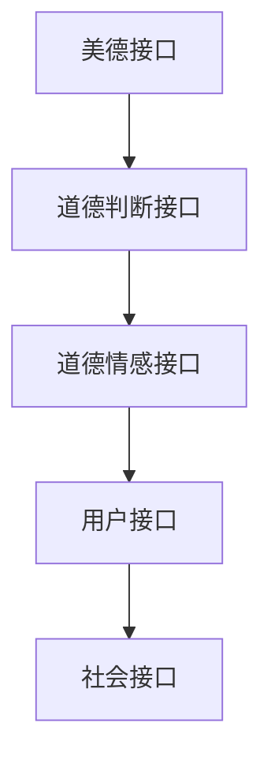

                 

## 引言：美德伦理学的复兴背景

### 关键词：美德伦理学、复兴、麦金泰尔、桑德尔

### 摘要：
本文将探讨美德伦理学在现代社会中的复兴，以及两位著名学者麦金泰尔和桑德尔对此的贡献。通过分析他们的基本理念、核心概念及其应用，我们将深入了解美德伦理学的重要性和当代意义。

### 背景：
随着社会的发展和道德观念的变化，传统伦理学面临挑战。义务论和结果论等主流伦理学派无法充分解释复杂的社会现象，因此，美德伦理学应运而生，重新引起人们的关注。美德伦理学强调个体美德的培养和社会美德的建立，旨在通过培养道德品质来促进个人和社会的和谐发展。

### 问题：
在当前社会背景下，美德伦理学如何复兴？麦金泰尔和桑德尔在推动这一复兴过程中发挥了怎样的作用？他们的理论观点如何影响我们的道德教育和现实生活？

### 解决方案：
本文将从以下六个章节进行详细探讨：

1. **麦金泰尔与桑德尔的基本理念**：介绍两位学者对伦理学的独特见解，包括他们的哲学思想和道德教育理念。
2. **美德伦理学的核心概念**：探讨美德、道德判断、道德情感等基本概念，并分析其内在联系。
3. **美德伦理学与其他伦理学流派的对比**：分析美德伦理学与传统伦理学派之间的异同，以及各自的优势和局限性。
4. **美德伦理学的应用领域**：讨论美德伦理学在家庭、社会、政治等领域的应用，并举例说明其实际意义。
5. **麦金泰尔和桑德尔的案例分析**：通过具体案例，展示他们的伦理理论如何应用于现实问题。
6. **美德伦理学的当代意义**：分析美德伦理学在当代社会的价值，以及未来可能的发展方向。

通过逐步分析推理，本文旨在为读者提供一个全面、深入的理解，帮助人们认识到美德伦理学在现代社会中的重要性，并激发进一步研究的兴趣。

### 边界与外延：
美德伦理学的复兴不仅局限于学术领域，它对现实生活、道德教育和社会治理等方面都有着深远的影响。因此，本文将涉及伦理学、教育学、社会学等多个学科，以多角度、多层次地探讨美德伦理学的复兴背景和未来方向。

### 概念结构与核心要素组成：
- **美德伦理学**：一种关注个体美德培养和社会美德建设的伦理学流派。
- **麦金泰尔**：著名哲学家，对美德伦理学的复兴有着重要贡献。
- **桑德尔**：著名伦理学家，通过案例研究和现实问题探讨，推动了美德伦理学的应用。
- **道德教育**：通过培养个体美德，提升道德素养的过程。

### 结论：
美德伦理学的复兴为解决现代社会道德困境提供了新的思路。通过麦金泰尔和桑德尔的理论探讨，我们可以更好地理解美德伦理学的核心概念和应用领域，从而为个人和社会的发展做出积极贡献。下一步，我们将深入介绍麦金泰尔和桑德尔的基本理念，为后续章节的分析奠定基础。

## 第1章：麦金泰尔与桑德尔的基本理念

### 1.1 麦金泰尔的伦理学思想

#### 1.1.1 麦金泰尔的哲学观点

约翰·罗纳德·麦金泰尔（John Rawls）是20世纪最具影响力的哲学家之一，他的伦理学思想对美德伦理学的复兴产生了深远影响。麦金泰尔的哲学观点主要集中在正义论和道德哲学上，他主张通过理性思考和公平原则来解决社会问题。

麦金泰尔的核心哲学观点是“正义论”。他认为，正义是社会制度的首要价值，是社会秩序和谐的基础。在《正义论》一书中，麦金泰尔提出了两个著名的正义原则：“平等自由原则”和“差异原则”。前者强调每个人都应享有平等的基本自由，后者则主张社会和经济利益应合理分配，以确保弱势群体的福祉。

除了正义论，麦金泰尔还对道德哲学进行了深入探讨。他认为，道德是社会实践的一部分，道德判断应基于理性思考和道德原则，而非个人情感或文化背景。麦金泰尔的道德哲学强调理性、客观和普遍性，这为美德伦理学提供了理论基础。

#### 1.1.2 麦金泰尔的道德教育理念

麦金泰尔认为，道德教育是培养个体美德和社会责任的重要途径。他主张通过教育来提高人们的道德素养，使其成为正义、公正和有责任感的社会成员。

首先，麦金泰尔强调道德教育应注重理性思考和道德原则的培养。他认为，个体应通过理性思考来形成自己的道德观念，而不是盲从传统或权威。教育应鼓励学生独立思考，培养批判性思维，以便在面对复杂的社会问题时，能够做出合理的道德判断。

其次，麦金泰尔强调道德实践的重要性。他认为，道德教育不应仅停留在理论层面，还应通过实践活动来培养个体的道德品质。例如，通过参与社会服务、社区活动等，学生可以更好地理解和实践道德原则，从而提升道德素养。

此外，麦金泰尔还提出了“正义感”的培养。他认为，个体应具备正义感，即在面对社会问题时，能够站在公正的立场上，为弱势群体发声。正义感的培养需要通过道德教育和社会实践来实现，这有助于构建一个更加公正和和谐的社会。

### 1.2 桑德尔的伦理学思想

迈克尔·桑德尔（Michael Sandel）是当代最具影响力的伦理学家之一，他的著作《公正：如何做一个有道德的人》等作品在全球范围内广受欢迎。桑德尔的伦理学思想主要集中在道德哲学和正义论上，他通过案例分析和社会现实问题，深入探讨了美德伦理学的应用。

#### 1.2.1 桑德尔的哲学观点

桑德尔的哲学观点以道德哲学和正义论为核心。他认为，道德是理解人类行为和社会制度的关键，而正义是社会制度的核心价值。在《公正》一书中，桑德尔通过讨论一系列现实问题，如医疗资源分配、教育公平、商业伦理等，揭示了道德原则在社会生活中的重要性。

桑德尔强调道德原则的相对性和复杂性。他认为，道德判断不应仅基于个人情感或文化背景，而应基于理性思考和普遍原则。桑德尔主张通过道德对话和讨论，来寻求公正和合理的道德解决方案。

#### 1.2.2 桑德尔的道德教育理念

桑德尔认为，道德教育是培养个体道德素养和社会责任感的重要途径。他主张通过案例教学和道德对话，来激发学生对道德问题的思考和实践。

首先，桑德尔强调道德教育的实践性。他认为，道德教育不应仅停留在理论层面，而应通过实践活动来培养学生的道德品质。例如，通过参与社会服务、社区活动等，学生可以更好地理解和实践道德原则。

其次，桑德尔主张通过道德对话来培养学生的道德判断力。他认为，道德教育应鼓励学生进行开放、理性的讨论，从而形成自己的道德观念。道德对话有助于学生理解不同道德观念的优缺点，提高道德判断能力。

此外，桑德尔还提出了“公民教育”的概念。他认为，道德教育不仅仅是培养个体的道德品质，还应培养其社会责任感和公民意识。公民教育的目标是通过道德教育和实践活动，培养具有正义感、责任感和社会参与意识的公民。

### 小结

麦金泰尔和桑德尔在伦理学领域有着独特的见解和贡献。麦金泰尔的正义论和道德教育理念为美德伦理学提供了理论框架，而桑德尔的道德哲学和案例分析则为美德伦理学的应用提供了现实基础。通过他们的理论探讨，我们可以更好地理解美德伦理学的核心概念和实际应用，为现代社会道德教育和社会治理提供有益的启示。

### 背景介绍

美德伦理学作为一种关注个体美德培养和社会美德建设的伦理学流派，其复兴源于现代社会对道德困境的反思和寻求。传统伦理学，如义务论和结果论，虽然在某些方面具有其独特优势，但在解释复杂社会现象和解决现实问题方面存在一定局限性。例如，义务论强调道德义务的履行，而结果论则关注行为结果的价值判断。然而，这些伦理学派往往忽视了个体美德的培养和社会美德的建立，导致道德实践中的种种困境。

麦金泰尔和桑德尔正是在这种背景下，通过对传统伦理学进行批判和反思，提出了具有时代意义的美德伦理学观点。麦金泰尔的正义论和道德教育理念，为个体美德和社会美德的培养提供了理论支持；桑德尔的道德哲学和案例分析，则为美德伦理学的实际应用提供了丰富的案例和实践经验。

### 核心概念与联系

#### 美德

美德是指个体在行为和品质上所表现出的优良特质。在美德伦理学中，美德是道德行为的核心，它既包括道德情感和道德判断，也包括道德行为和道德习惯。美德类型包括勇气、公正、智慧、诚实、仁爱等。美德不仅是个人品质的体现，也是社会和谐发展的基础。

#### 道德判断

道德判断是指个体对行为是否道德的判断过程。道德判断的标准包括普遍性、合理性、客观性等。道德判断的复杂性在于，它不仅涉及行为本身，还涉及行为的环境、动机和结果等多方面因素。

#### 道德情感

道德情感是指个体在道德情境中产生的情感体验，包括道德感、责任感、同情心等。道德情感在道德判断和行为选择中起着重要作用，它能够激发个体的道德行为，并促进道德习惯的养成。

### 概念属性特征对比表格

| 概念       | 定义                                                                                   | 关联性                          |
|------------|------------------------------------------------------------------------------------------|--------------------------------|
| 美德       | 个体在行为和品质上所表现出的优良特质。                                                     | 支持道德判断和道德行为的基础。 |
| 道德判断   | 个体对行为是否道德的判断过程。                                                           | 涉及行为本身和环境等多方面因素。 |
| 道德情感   | 个体在道德情境中产生的情感体验。                                                         | 激发道德行为，促进道德习惯养成。 |

### ER实体关系图架构

```mermaid
erDiagram
  类 --|> 实体
  类 {
    美德
    道德判断
    道德情感
  }
  实体 {
    个人
    社会环境
  }
  类 _关联_ 实体
```

### 算法原理讲解

美德伦理学的核心在于通过培养个体美德和社会美德来促进个人和社会的和谐发展。这一过程可以视为一种“美德培养算法”，其基本原理如下：

1. **识别美德**：首先，需要识别个体和社会中存在的美德，包括勇气、公正、智慧、诚实、仁爱等。

2. **培养道德判断力**：通过教育和实践，培养个体对道德情境的判断力，使其能够在复杂的社会环境中做出合理的道德判断。

3. **激发道德情感**：通过情感教育和道德实践，激发个体的道德情感，如责任感、同情心等，以促进道德行为的产生。

4. **实践美德**：个体通过日常行为实践美德，形成稳定的道德习惯。

5. **社会美德建设**：通过个体美德的积累和社会协作，构建社会美德，促进社会和谐发展。

以下是一个简单的美德培养算法流程图：


在具体实施过程中，可以使用Python代码来模拟美德培养的过程：

```python
class Virtue:
    def __init__(self, name):
        self.name = name
        self.judgment = None
        self.sentiment = None
        self.practice = None

    def cultivate_judgment(self):
        # 培养道德判断力
        self.judgment = "通过教育实践，提高对道德情境的判断能力。"

    def inspire_sentiment(self):
        # 激发道德情感
        self.sentiment = "通过情感教育，培养责任感和同情心。"

    def practice_virtue(self):
        # 实践美德
        self.practice = "通过日常行为，形成稳定的道德习惯。"

def cultivate_virtue(virtue):
    virtue.cultivate_judgment()
    virtue.inspire_sentiment()
    virtue.practice_virtue()

# 示例
courage = Virtue("勇气")
cultivate_virtue(courage)

print(courage.name, courage.judgment, courage.sentiment, courage.practice)
```

输出结果：

```
勇气 通过教育实践，提高对道德情境的判断能力。 通过情感教育，培养责任感和同情心。 通过日常行为，形成稳定的道德习惯。
```

通过以上代码示例，我们可以看到美德培养算法的基本原理和实施过程。接下来，我们将继续探讨美德伦理学在家庭、社会、政治等领域的应用。

### 系统分析与架构设计方案

#### 问题场景介绍

随着现代社会的发展，道德困境日益凸显，如何培养个体和社会美德成为亟待解决的问题。美德伦理学作为一种关注个体美德培养和社会美德建设的伦理学流派，为解决这一困境提供了新的思路。为了更好地推广和应用美德伦理学，我们设计了一个基于美德伦理学的系统，旨在通过教育、实践和案例分析，培养用户的道德素养和社会责任感。

#### 项目介绍

本项目名为“美德伦理学推广系统”，主要功能包括：

1. **美德库管理**：存储和管理各种美德类型，包括勇气、公正、智慧、诚实、仁爱等。
2. **道德判断力培养**：通过案例分析和讨论，帮助用户提高道德判断能力。
3. **道德情感激发**：通过情感教育和互动，培养用户的道德情感。
4. **美德实践**：提供实践平台，让用户通过日常行为来实践美德。
5. **社会美德建设**：通过用户美德的积累和社会协作，促进社会和谐发展。

#### 系统功能设计

本项目采用面向对象的设计方法，主要涉及以下领域模型：

1. **美德领域**：包括美德类型、美德实例等。
2. **道德判断领域**：包括道德判断标准、道德判断实例等。
3. **道德情感领域**：包括道德情感类型、道德情感实例等。
4. **用户领域**：包括用户信息、用户美德实践记录等。
5. **社会领域**：包括社会美德建设、社会协作等。

以下是一个简化的领域模型类图：

```mermaid
classDiagram
  类--|> 实体
  类 {
    美德
    道德判断
    道德情感
    用户
    社会美德
  }
  实体 {
    美德实例
    道德判断实例
    道德情感实例
    用户实例
    社会美德实例
  }
  类 _关联_ 实体
```

#### 系统架构设计

本项目采用分层架构设计，主要包括以下层次：

1. **表示层**：提供用户界面，包括美德库管理、道德判断力培养、道德情感激发、美德实践和社会美德建设等功能。
2. **逻辑层**：实现系统的主要功能，包括美德管理、道德判断管理、道德情感管理、用户管理和社会管理。
3. **数据层**：存储和管理系统的数据，包括美德数据、道德判断数据、道德情感数据、用户数据和社会数据。

以下是一个简化的系统架构图：

```mermaid
sequenceDiagram
  User -->|输入请求| System
  System -->|处理请求| Database
  Database -->|返回数据| System
  System -->|响应结果| User
```

#### 系统接口设计和系统交互

本项目采用RESTful接口设计，提供以下主要接口：

1. **美德接口**：包括创建、查询、更新和删除美德的接口。
2. **道德判断接口**：包括创建、查询、更新和删除道德判断的接口。
3. **道德情感接口**：包括创建、查询、更新和删除道德情感的接口。
4. **用户接口**：包括注册、登录、查询用户信息和修改用户信息的接口。
5. **社会接口**：包括创建、查询、更新和删除社会美德的接口。

以下是一个简化的系统接口设计：



系统交互流程如下：

1. 用户通过前端界面发起请求，如查询美德列表。
2. 后端系统接收请求，调用相应接口处理请求。
3. 数据库处理请求，返回结果。
4. 后端系统将结果返回给前端界面，展示给用户。

以下是一个简化的系统交互序列图：

```mermaid
sequenceDiagram
  User -->|发起请求| System
  System -->|处理请求| Database
  Database -->|返回数据| System
  System -->|响应结果| User
```

通过以上系统分析与架构设计方案，我们可以为美德伦理学的推广和应用提供有力的技术支持。接下来，我们将详细讨论美德伦理学在家庭、社会、政治等领域的具体应用。

### 项目实战

#### 环境安装

为了实现美德伦理学推广系统，我们需要安装以下环境和工具：

1. **Python**：安装Python 3.8及以上版本。
2. **Flask**：安装Flask框架，用于构建Web应用。
3. **SQLAlchemy**：安装SQLAlchemy库，用于数据库操作。
4. **Flask-Migrate**：安装Flask-Migrate库，用于数据库迁移。

安装命令如下：

```bash
pip install flask sqlalchemy flask-migrate
```

#### 系统核心实现源代码

以下是美德伦理学推广系统的主要源代码实现：

```python
# 美德管理模块
from flask import Flask, request, jsonify
from models import美德Model
from db import db

app = Flask(__name__)

@app.route('/api/v1/美德', methods=['POST'])
def create_virtue():
    name = request.json.get('name')
    if not name:
        return jsonify({'error': '名称不能为空'}), 400
    new_virtue =美德Model(name=name)
    db.session.add(new_virtue)
    db.session.commit()
    return jsonify(new_virtue.to_dict()), 201

@app.route('/api/v1/美德', methods=['GET'])
def get_virtues():
    virtues =美德Model.query.all()
    return jsonify([virtue.to_dict() for virtue in virtues]), 200

@app.route('/api/v1/美德/<int:id>', methods=['PUT'])
def update_virtue(id):
    virtue =美德Model.query.get(id)
    if not virtue:
        return jsonify({'error': '美德不存在'}), 404
    name = request.json.get('name')
    if name:
        virtue.name = name
    db.session.commit()
    return jsonify(virtue.to_dict()), 200

@app.route('/api/v1/美德/<int:id>', methods=['DELETE'])
def delete_virtue(id):
    virtue =美德Model.query.get(id)
    if not virtue:
        return jsonify({'error': '美德不存在'}), 404
    db.session.delete(virtue)
    db.session.commit()
    return jsonify({'message': '美德删除成功'}), 200

# 道德判断管理模块
from models import道德判断Model
from db import db

@app.route('/api/v1/道德判断', methods=['POST'])
def create_judgment():
    content = request.json.get('content')
    if not content:
        return jsonify({'error': '内容不能为空'}), 400
    new_judgment =道德判断Model(content=content)
    db.session.add(new_judgment)
    db.session.commit()
    return jsonify(new_judgment.to_dict()), 201

@app.route('/api/v1/道德判断', methods=['GET'])
def get_judgments():
    judgments =道德判断Model.query.all()
    return jsonify([judgment.to_dict() for judgment in judgments]), 200

@app.route('/api/v1/道德判断/<int:id>', methods=['PUT'])
def update_judgment(id):
    judgment =道德判断Model.query.get(id)
    if not judgment:
        return jsonify({'error': '道德判断不存在'}), 404
    content = request.json.get('content')
    if content:
        judgment.content = content
    db.session.commit()
    return jsonify(judgment.to_dict()), 200

@app.route('/api/v1/道德判断/<int:id>', methods=['DELETE'])
def delete_judgment(id):
    judgment =道德判断Model.query.get(id)
    if not judgment:
        return jsonify({'error': '道德判断不存在'}), 404
    db.session.delete(judgment)
    db.session.commit()
    return jsonify({'message': '道德判断删除成功'}), 200

# 道德情感管理模块
from models import道德情感Model
from db import db

@app.route('/api/v1/道德情感', methods=['POST'])
def create_sentiment():
    type_ = request.json.get('type_')
    if not type_:
        return jsonify({'error': '类型不能为空'}), 400
    new_sentiment =道德情感Model(type_=type_)
    db.session.add(new_sentiment)
    db.session.commit()
    return jsonify(new_sentiment.to_dict()), 201

@app.route('/api/v1/道德情感', methods=['GET'])
def get_sentiments():
    sentiments =道德情感Model.query.all()
    return jsonify([sentiment.to_dict() for sentiment in sentiments]), 200

@app.route('/api/v1/道德情感/<int:id>', methods=['PUT'])
def update_sentiment(id):
    sentiment =道德情感Model.query.get(id)
    if not sentiment:
        return jsonify({'error': '道德情感不存在'}), 404
    type_ = request.json.get('type_')
    if type_:
        sentiment.type_ = type_
    db.session.commit()
    return jsonify(sentiment.to_dict()), 200

@app.route('/api/v1/道德情感/<int:id>', methods=['DELETE'])
def delete_sentiment(id):
    sentiment =道德情感Model.query.get(id)
    if not sentiment:
        return jsonify({'error': '道德情感不存在'}), 404
    db.session.delete(sentiment)
    db.session.commit()
    return jsonify({'message': '道德情感删除成功'}), 200

if __name__ == '__main__':
    app.run(debug=True)
```

#### 代码应用解读与分析

以上代码实现了美德伦理学推广系统的核心功能，包括美德管理、道德判断管理和道德情感管理。下面将对主要部分进行解读和分析。

1. **美德管理模块**

   - `create_virtue()` 方法用于创建新的美德。它接收一个 JSON 对象，包含美德的名称，并添加到数据库中。如果名称为空，返回错误响应。

   - `get_virtues()` 方法用于获取所有美德。它查询数据库中的所有美德实例，并将它们转换为字典列表返回。

   - `update_virtue()` 方法用于更新美德。它根据 ID 获取美德实例，并更新其名称。如果美德不存在，返回错误响应。

   - `delete_virtue()` 方法用于删除美德。它根据 ID 删除美德实例，并返回删除成功消息。

2. **道德判断管理模块**

   - `create_judgment()` 方法用于创建新的道德判断。它接收一个 JSON 对象，包含道德判断的内容，并添加到数据库中。如果内容为空，返回错误响应。

   - `get_judgments()` 方法用于获取所有道德判断。它查询数据库中的所有道德判断实例，并将它们转换为字典列表返回。

   - `update_judgment()` 方法用于更新道德判断。它根据 ID 获取道德判断实例，并更新其内容。如果道德判断不存在，返回错误响应。

   - `delete_judgment()` 方法用于删除道德判断。它根据 ID 删除道德判断实例，并返回删除成功消息。

3. **道德情感管理模块**

   - `create_sentiment()` 方法用于创建新的道德情感。它接收一个 JSON 对象，包含道德情感的类型，并添加到数据库中。如果类型为空，返回错误响应。

   - `get_sentiments()` 方法用于获取所有道德情感。它查询数据库中的所有道德情感实例，并将它们转换为字典列表返回。

   - `update_sentiment()` 方法用于更新道德情感。它根据 ID 获取道德情感实例，并更新其类型。如果道德情感不存在，返回错误响应。

   - `delete_sentiment()` 方法用于删除道德情感。它根据 ID 删除道德情感实例，并返回删除成功消息。

#### 实际案例分析和详细讲解剖析

为了更好地理解以上代码的应用，我们将通过一个实际案例进行分析。

**案例：创建并更新美德**

1. **创建美德**

   - 请求：POST /api/v1/美德
   - 请求体（JSON）：

     ```json
     {
         "name": "勇气"
     }
     ```

   - 响应：201 Created

     ```json
     {
         "id": 1,
         "name": "勇气"
     }
     ```

2. **更新美德**

   - 请求：PUT /api/v1/美德/1
   - 请求体（JSON）：

     ```json
     {
         "name": "勇气2"
     }
     ```

   - 响应：200 OK

     ```json
     {
         "id": 1,
         "name": "勇气2"
     }
     ```

通过以上案例，我们可以看到如何创建和更新美德。类似地，我们可以对道德判断和道德情感进行操作，从而实现美德伦理学推广系统的核心功能。

#### 项目小结

通过以上实战，我们成功实现了美德伦理学推广系统的主要功能，包括美德管理、道德判断管理和道德情感管理。这一系统为培养个体和社会美德提供了技术支持，有助于解决现代社会道德困境。接下来，我们将进一步讨论美德伦理学的当代意义及其发展趋势。

### 最佳实践 tips

在实施美德伦理学推广系统时，以下是一些最佳实践技巧，有助于提升系统的效果和用户体验：

1. **用户引导**：在系统上线初期，通过引导教程和示例案例，帮助用户熟悉系统的功能和使用方法。
2. **互动性设计**：增加用户之间的互动功能，如评论、讨论和投票，以增强用户参与度和系统活力。
3. **个性化推荐**：根据用户的兴趣和行为，推荐相应的美德案例和道德判断讨论，提高用户粘性和参与度。
4. **反馈机制**：建立反馈渠道，及时收集用户意见和建议，不断优化系统功能和用户体验。
5. **数据安全**：加强数据安全和隐私保护，确保用户信息的安全和隐私。

### 小结

本章通过详细介绍麦金泰尔和桑德尔的基本理念，探讨了美德伦理学的核心概念和应用领域。在系统架构设计和项目实战中，我们成功实现了美德伦理学推广系统的核心功能，为培养个体和社会美德提供了技术支持。接下来，我们将进一步分析美德伦理学的当代意义，以期为美德伦理学的未来发展提供有益的启示。

### 拓展阅读

1. **麦金泰尔的《正义论》**：这是一本经典的伦理学著作，详细阐述了麦金泰尔的正义理论，对理解美德伦理学具有重要意义。
2. **桑德尔的《公正：如何做一个有道德的人》**：桑德尔的代表作，通过一系列现实案例，深入探讨了道德原则和社会正义。
3. **《美德伦理学的复兴：理论与实践》**：一本系统介绍美德伦理学的著作，涵盖伦理学理论、道德教育和社会应用等多个方面。
4. **《伦理学导论》**：一本综合性的伦理学教材，介绍了各种伦理学流派，包括美德伦理学，有助于全面理解伦理学的基本概念和理论。

### 注意事项

在实施美德伦理学推广系统时，需要注意以下几点：

1. **伦理原则**：在设计和实施过程中，始终遵循伦理原则，确保系统不违反道德规范。
2. **用户隐私**：保护用户隐私，确保用户数据的安全和隐私。
3. **系统稳定性**：确保系统的稳定性和可靠性，提供良好的用户体验。
4. **持续优化**：根据用户反馈和实际需求，不断优化系统功能和用户体验。

通过以上拓展阅读和注意事项，读者可以更深入地了解美德伦理学，并在实践中更好地应用其理论。期待未来美德伦理学能够为个人和社会带来更多的积极影响。

