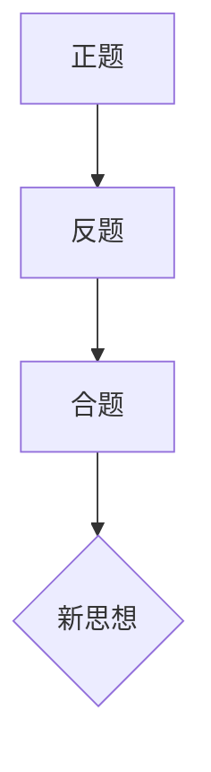
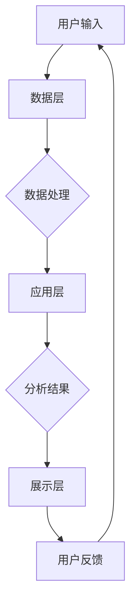

                 


## 黑格尔与马克思：辩证法的不同应用

### 关键词

- 黑格尔
- 马克思
- 辩证法
- 历史哲学
- 经济学
- 政治哲学

### 摘要

本文将深入探讨黑格尔与马克思的哲学思想及其辩证法的不同应用。通过分析黑格尔的辩证法原理，我们将理解其历史哲学和逻辑发展的核心。随后，我们将探讨马克思如何应用和发展了黑格尔的辩证法，尤其是在经济学和政治哲学领域。文章还将对比两位哲学家的辩证法思想，探讨其异同点，并探讨辩证法在当代社会中的意义和挑战。

### 目录大纲设计过程

为了设计《黑格尔与马克思：辩证法的不同应用》这本书的目录大纲，我们首先需要深入理解书名中提到的两个关键人物及其哲学思想。黑格尔（Georg Wilhelm Friedrich Hegel）是德国的哲学家，他提出了辩证法，这是一种关于历史和逻辑发展的哲学理论。马克思（Karl Marx）是德国的社会学家和经济学家，他在黑格尔的辩证法基础上发展了自己的唯物史观，提出了关于资本主义和阶级斗争的理论。

在开始设计目录大纲之前，我们需要明确以下几点：

1. **核心概念与联系**：我们需要理解黑格尔的辩证法如何与马克思的理论相结合，以及这种结合如何在哲学和社会科学领域产生深远影响。

2. **核心算法原理讲解**：由于这是一本哲学书籍，而不是技术手册，因此“算法原理”在这里指的是哲学思想的发展逻辑和理论框架。

3. **数学模型和数学公式**：哲学书籍通常不涉及数学公式，但为了清晰阐述理论发展，我们可能会使用一些抽象的概念模型来类比。

4. **项目实战**：哲学书籍的项目实战可能不是传统意义上的代码实现，而是通过历史案例和思想发展的实际应用来展示理论。

5. **目录大纲**：我们需要确保目录大纲结构清晰，逻辑连贯，并且能够涵盖书中的主要内容和讨论点。

### 设计步骤

1. **确定书的结构**：我们将书分为几个主要部分，如哲学背景、辩证法原理、马克思的应用、批判性分析等。

2. **细化每个部分的内容**：在每个部分中，我们列出具体的章节标题，确保每个章节都有明确的主题。

3. **撰写每个章节的子标题**：在每个章节中，我们进一步细化内容，列出可能的子标题，以确保章节内容的全面覆盖。

4. **加入Mermaid流程图**：为了更好地展示核心概念和联系，我们可能会使用Mermaid流程图来展示辩证法的发展过程和黑格尔与马克思思想的关联。

5. **确保大纲简洁且完整**：在撰写过程中，我们保持简洁性，避免冗余，同时确保大纲内容全面。

### 目录大纲示例

```markdown
# 《黑格尔与马克思：辩证法的不同应用》目录大纲

## 第一部分：哲学背景与辩证法原理

### 1. 黑格尔的哲学思想

#### 1.1 黑格尔的生平与贡献
#### 1.2 黑格尔的辩证法概述
#### 1.3 黑格尔的辩证法与历史哲学

### 2. 马克思的哲学思想

#### 2.1 马克思的生平与贡献
#### 2.2 马克思主义哲学的基本原理
#### 2.3 马克思对辩证法的应用与发展

### 3. 黑格尔与马克思的辩证法联系

#### 3.1 黑格尔辩证法对马克思的影响
#### 3.2 马克思对黑格尔辩证法的批判与继承
#### 3.3 黑格尔与马克思辩证法的异同

## 第二部分：辩证法的不同应用

### 4. 辩证法在历史研究中的应用

#### 4.1 历史唯物主义
#### 4.2 历史发展动力
#### 4.3 历史发展的阶段论

### 5. 辩证法在经济学中的应用

#### 5.1 资本主义经济危机
#### 5.2 阶级斗争与生产力发展
#### 5.3 社会变革的辩证法

### 6. 辩证法在政治哲学中的应用

#### 6.1 马克思主义政治哲学
#### 6.2 阶级斗争与国家理论
#### 6.3 社会主义与共产主义

## 第三部分：批判性分析与未来展望

### 7. 辩证法在当代的反思与挑战

#### 7.1 当代社会的辩证法应用
#### 7.2 辩证法的批判与超越
#### 7.3 辩证法在全球化背景下的意义

### 8. 辩证法的未来发展趋势

#### 8.1 辩证法与现代科技
#### 8.2 辩证法与生态学
#### 8.3 辩证法的跨学科融合

## 附录：参考资料与进一步阅读

### 9. 参考资料列表

### 10. 进一步阅读建议
```

通过这个大纲，我们可以看到书的主要内容被结构化地安排，每个部分都有明确的主题和子主题，以便读者可以清晰地了解书的内容和结构。同时，每个章节的标题都旨在引导读者进入该章节的核心内容，确保书的整体连贯性和逻辑性。

### 第一部分：哲学背景与辩证法原理

#### 1. 黑格尔的哲学思想

**1.1 黑格尔的生平与贡献**

黑格尔（Georg Wilhelm Friedrich Hegel，1770-1831）是德国19世纪初最重要的哲学家之一。他的思想对现代哲学、社会科学和政治理论产生了深远的影响。黑格尔生于今天德国的斯图加特，成长在一个注重教育和文学的富裕家庭。他的早期教育包括学习神学和法律，但这些学科并没有满足他的求知欲望。黑格尔后来进入图宾根大学，在那里他接触到了康德、莱布尼茨和斯宾诺莎等哲学家的思想。

黑格尔的哲学生涯始于对康德哲学的批判，他认为康德的先验唯心主义过于抽象，缺乏历史和现实的基础。黑格尔发展了自己的辩证法，试图提供一个更为全面和系统的哲学框架。他的主要著作包括《精神现象学》、《逻辑学》和《哲学全书》等。

**1.2 黑格尔的辩证法概述**

黑格尔的辩证法是一种关于历史和逻辑发展的哲学理论，它强调事物和思想的发展是通过矛盾、冲突和对立统一的运动来实现的。辩证法的关键概念包括：

- **正题（Thesis）**：一个概念或思想的初始形式，通常是片面或单一的。
- **反题（Antithesis）**：对立于正题的概念或思想，代表了对立和冲突。
- **合题（Synthesis）**：正题和反题的统一，产生了一个新的、更全面的思想。

这种辩证过程不仅仅是一个逻辑上的推理，而是反映在历史和社会的发展中。黑格尔认为，历史是一个不断前进的过程，每个时代的社会结构和思想都是前一个时代的合题。

**1.3 黑格尔的辩证法与历史哲学**

黑格尔的历史哲学认为，历史是自我意识的发展过程，是人类理性的实现。他的历史观强调，历史的发展不是偶然的，而是由内在的理性原则所决定的。黑格尔的历史哲学包括以下几个核心观点：

- **历史必然性**：历史事件有其内在的必然性和规律性，不是个别英雄人物或偶然事件所能决定的。
- **世界精神**：黑格尔认为，历史的发展是由“世界精神”所驱动的，这个精神在历史中通过不同的形式表现出来。
- **历史阶段的划分**：黑格尔将历史划分为几个阶段，如古代、中世纪和现代，每个阶段都有其特定的社会结构和思想。

黑格尔的历史哲学提供了一个关于历史发展的宏大叙事，它试图通过辩证法的视角解释历史的复杂性和多样性。

#### 2. 马克思的哲学思想

**2.1 马克思的生平与贡献**

卡尔·马克思（Karl Marx，1818-1883）是德国哲学家、经济学家和革命理论家，他的思想对现代社会主义和共产主义运动产生了深远影响。马克思出生于普鲁士王国特里尔，他的父亲是一位律师和政府官员。马克思在波恩大学和柏林大学接受了法律和哲学的教育，但他的兴趣主要集中在经济学和社会主义理论上。

马克思的主要著作包括《共产党宣言》、《资本论》和《哲学的贫困》等。他与弗里德里希·恩格斯合作，共同创立了科学社会主义理论，并试图通过革命改变资本主义社会的不平等。

**2.2 马克思主义哲学的基本原理**

马克思主义哲学是基于唯物史观和辩证法的一种哲学体系，它认为物质世界的存在和发展是第一位的，意识是物质的反映。马克思主义哲学的核心原理包括：

- **唯物史观**：历史的发展是由物质生产方式的变化所决定的，经济基础决定上层建筑。
- **阶级斗争**：社会历史发展是由不同阶级之间的斗争所推动的，资本主义社会的主要矛盾是资产阶级和无产阶级之间的斗争。
- **剩余价值理论**：资本家通过剥削工人的剩余劳动获取剩余价值，这是资本主义剥削的基础。

**2.3 马克思对辩证法的应用与发展**

马克思在黑格尔的辩证法基础上发展了自己的唯物辩证法，他强调了辩证法在理解和解释社会历史过程中的重要性。马克思的辩证法具有以下几个特点：

- **唯物辩证法**：马克思将黑格尔的辩证法从唯心主义转变为唯物主义，认为辩证过程是在物质世界中发生的。
- **社会历史的辩证法**：马克思认为，社会历史的发展是通过阶级斗争和生产力与生产关系的矛盾运动来实现的。
- **实践的辩证法**：马克思强调实践在认识和改变世界中的核心作用，实践是辩证法的基础。

马克思的辩证法不仅为他的经济学和社会主义理论提供了哲学基础，也为其历史研究和社会批判提供了强有力的工具。

#### 3. 黑格尔与马克思的辩证法联系

**3.1 黑格尔辩证法对马克思的影响**

马克思的哲学思想深受黑格尔的影响，他在自己的作品中多次提到黑格尔的辩证法。马克思认为，黑格尔的辩证法是一种深刻的哲学工具，可以用来分析社会和历史的发展。马克思接受并改造了黑格尔的辩证法，将其从唯心主义转变为唯物主义。

- **辩证思维**：马克思认为，辩证思维是一种批判性的思维方式，它能够揭示事物的矛盾和发展的内在动力。
- **历史辩证法**：马克思将黑格尔的历史哲学进行了唯物主义的改造，认为历史的发展是由经济基础和上层建筑之间的矛盾运动所决定的。
- **阶级斗争**：马克思认为，阶级斗争是历史发展的动力，这与黑格尔关于历史是自我意识发展的观点有所不同，但都强调了矛盾和冲突在历史发展中的重要性。

**3.2 马克思对黑格尔辩证法的批判与继承**

马克思对黑格尔的辩证法进行了批判和改造，他认为黑格尔的辩证法过于抽象，缺乏对现实世界的具体分析。马克思在批判黑格尔的过程中，提出了一系列新的哲学观点：

- **唯物辩证法**：马克思将黑格尔的辩证法从唯心主义转变为唯物主义，认为辩证法是在物质世界中发生的。
- **实践辩证法**：马克思强调实践在认识和改变世界中的核心作用，这与黑格尔的纯思想辩证法形成了鲜明对比。
- **阶级斗争**：马克思将黑格尔的历史哲学中的自我意识发展观念转化为阶级斗争的历史观，认为社会历史发展是由不同阶级之间的斗争所推动的。

**3.3 黑格尔与马克思辩证法的异同**

黑格尔和马克思的辩证法在理论框架、应用领域和核心观点上存在显著差异：

- **理论框架**：黑格尔的辩证法是一种唯心主义的逻辑框架，强调思想和历史的内在发展；马克思的辩证法则是一种唯物主义的哲学工具，强调物质世界的矛盾和阶级斗争。
- **应用领域**：黑格尔的辩证法主要用于哲学和历史哲学，强调理性发展和历史进程；马克思的辩证法则广泛应用于经济学、社会学和政治哲学，强调经济基础和上层建筑之间的矛盾运动。
- **核心观点**：黑格尔认为历史是自我意识的发展，马克思则认为历史是阶级斗争的发展。

尽管存在这些差异，黑格尔和马克思的辩证法都强调了矛盾和冲突在事物发展中的核心作用，这为理解社会和历史提供了重要的哲学工具。

### 第二部分：辩证法的不同应用

#### 4. 辩证法在历史研究中的应用

**4.1 历史唯物主义**

历史唯物主义是马克思主义哲学的核心概念之一，它认为历史的发展是由物质生产方式和经济基础的变化所决定的。历史唯物主义强调，社会历史发展不是由个别人的意志或英雄行为所决定的，而是由物质条件和社会关系所决定的。

- **经济基础与上层建筑**：历史唯物主义区分了经济基础和上层建筑，认为经济基础是社会结构的基础，而上层建筑包括政治、法律、文化等方面的制度。
- **生产力与生产关系**：历史唯物主义认为，生产力的发展推动了生产关系的变革，而生产关系的变革又反过来影响生产力的发展。

**4.2 历史发展动力**

历史发展动力是辩证法在历史研究中的重要应用之一，它强调社会历史发展的内在动力。历史发展动力包括以下几个核心要素：

- **阶级斗争**：历史唯物主义认为，阶级斗争是历史发展的主要动力，不同阶级之间的矛盾和斗争推动了社会的变革。
- **生产力的发展**：生产力的发展是推动社会历史发展的基本动力，它决定了生产关系的变革。
- **社会矛盾**：社会矛盾是历史发展的内在动力，它反映了社会各个阶层之间的利益冲突。

**4.3 历史发展的阶段论**

历史发展的阶段论是辩证法在历史研究中的另一个重要应用，它认为历史发展可以划分为不同的阶段。历史阶段论的核心观点包括：

- **原始社会阶段**：原始社会是人类社会的最初阶段，以狩猎和采集为特征。
- **奴隶社会阶段**：奴隶社会是以奴隶制为基础的社会形态，奴隶是生产力的主体。
- **封建社会阶段**：封建社会是以封建制为基础的社会形态，土地是生产力的核心。
- **资本主义社会阶段**：资本主义社会是以资本主义生产关系为基础的社会形态，资本是生产力的主体。
- **社会主义社会阶段**：社会主义社会是以社会主义生产关系为基础的社会形态，生产资料公有制是核心。

#### 5. 辩证法在经济学中的应用

**5.1 资本主义经济危机**

辩证法在经济学中的应用之一是解释资本主义经济危机的根源。资本主义经济危机通常表现为经济衰退、失业率上升和财富分配不均等。辩证法认为，资本主义经济危机的根源在于资本主义生产关系的基本矛盾：

- **生产的社会化和占有的私人化**：资本主义生产过程越来越社会化，但生产资料的占有仍然是私人化的，这导致了社会财富分配的不公平。
- **资本积累与劳动力剥削**：资本积累依赖于对劳动力的剥削，这导致了劳动力购买力的下降，从而降低了市场需求。

**5.2 阶级斗争与生产力发展**

辩证法在经济学中的应用还体现在对阶级斗争与生产力发展的关系的分析上。马克思主义认为，阶级斗争是推动社会历史发展的主要动力，而生产力的发展则是阶级斗争的物质基础。阶级斗争和生产力发展的关系包括：

- **阶级斗争推动生产力的发展**：在资本主义社会中，阶级斗争推动了对生产力的改造和升级，以适应新的生产关系。
- **生产力的发展影响阶级斗争**：生产力的发展改变了社会的生产方式和社会关系，从而影响了阶级斗争的形式和内容。

**5.3 社会变革的辩证法**

辩证法在社会变革中的应用强调，社会变革是一个复杂的过程，涉及多种因素和矛盾。社会变革的辩证法包括以下几个核心观点：

- **矛盾的转化**：社会变革是通过矛盾的转化实现的，旧矛盾转化为新矛盾，从而推动社会的发展。
- **革命与改革**：社会变革可以通过革命和改革两种方式进行，革命通常涉及根本性的社会变革，而改革则是在现有社会制度框架内进行调整。
- **人民群众的作用**：社会变革的辩证法强调人民群众在历史发展中的主体地位，认为人民群众是社会变革的主要力量。

#### 6. 辩证法在政治哲学中的应用

**6.1 马克思主义政治哲学**

马克思主义政治哲学是辩证法在政治哲学中的重要应用，它试图揭示政治权力的本质和社会的历史发展。马克思主义政治哲学的核心观点包括：

- **国家与阶级**：马克思主义认为，国家是统治阶级用来维护其统治地位的暴力工具，国家的本质是阶级统治。
- **革命与民主**：马克思主义政治哲学强调，革命是实现社会变革的重要手段，而民主则是革命后的政治制度。
- **国际关系**：马克思主义政治哲学认为，国际关系是由不同国家的经济和政治利益冲突所决定的，全球化背景下国际关系的矛盾更加复杂。

**6.2 阶级斗争与国家理论**

阶级斗争和国家理论是马克思主义政治哲学的重要组成部分。马克思主义认为，阶级斗争是国家政治生活的基础，国家是阶级统治的工具。阶级斗争和国家理论的核心观点包括：

- **国家的本质**：国家是统治阶级用来维护其统治地位的暴力工具，国家的本质是阶级统治。
- **国家的功能**：国家的功能包括维护统治阶级的利益、调节社会矛盾和保障国家安全。
- **革命与改革**：马克思主义认为，革命是实现社会变革的重要手段，而改革则是在现有社会制度框架内进行调整。

**6.3 社会主义与共产主义**

社会主义和共产主义是马克思主义政治哲学的目标和理想社会形态。社会主义和共产主义的核心观点包括：

- **社会主义**：社会主义是实现共产主义的过渡阶段，它的目标是消灭剥削和压迫，实现生产资料公有制和按劳分配。
- **共产主义**：共产主义是社会主义的高级阶段，它的目标是实现人的全面自由发展，消除阶级差异和国家的消亡。

### 第三部分：批判性分析与未来展望

#### 7. 辩证法在当代的反思与挑战

**7.1 当代社会的辩证法应用**

随着社会的发展和变革，辩证法在当代社会中的应用面临着新的挑战和机遇。在当代社会，辩证法可以应用于以下几个方面：

- **经济发展**：辩证法可以用来分析当代资本主义经济的矛盾和危机，为经济政策的制定提供理论依据。
- **社会变革**：辩证法可以用来分析社会变革的内在动力和矛盾，为社会改革的实践提供指导。
- **科技发展**：辩证法可以用来分析科技发展对社会结构和人类生活的影响，为科技伦理提供理论基础。

**7.2 辩证法的批判与超越**

辩证法在当代社会中也面临着批判和超越的挑战。一些学者认为，辩证法过于抽象和理想化，难以应对现实的复杂性和多样性。辩证法的批判与超越可以从以下几个方面进行：

- **批判现实主义**：批判现实主义强调辩证法的抽象性和理想化，主张将辩证法应用于具体的社会历史条件。
- **多元视角**：多元视角强调从多个角度和层面分析社会现象，避免单一视角的局限。
- **实践导向**：实践导向强调辩证法必须与实际社会生活相结合，通过实践来检验和修正理论。

**7.3 辩证法在全球化背景下的意义**

全球化背景下，辩证法具有重要的理论和实践意义。全球化带来了新的矛盾和挑战，如全球贫富差距、环境危机和民族冲突等。辩证法在全球化背景下的应用包括：

- **全球视野**：辩证法可以用来分析全球范围内的社会、经济和文化矛盾，为全球治理提供理论基础。
- **和平发展**：辩证法可以用来探讨和平发展的道路，为解决全球性问题提供指导。
- **可持续发展**：辩证法可以用来分析可持续发展问题，为环境保护和资源利用提供理论依据。

#### 8. 辩证法的未来发展趋势

**8.1 辩证法与现代科技**

随着科技的迅猛发展，辩证法在当代社会中面临着新的挑战和机遇。现代科技的发展改变了社会的生产方式和生活方式，也为辩证法提供了新的研究对象。辩证法在现代科技中的应用包括：

- **人工智能**：辩证法可以用来分析人工智能的发展及其对社会的影响，为人工智能伦理提供理论基础。
- **数字经济**：辩证法可以用来分析数字经济的发展模式和内在矛盾，为数字经济的可持续发展提供指导。
- **绿色科技**：辩证法可以用来分析绿色科技的发展及其对环境的影响，为环境保护和可持续发展提供理论依据。

**8.2 辩证法与生态学**

生态学的兴起为辩证法提供了新的研究领域，辩证法与生态学的结合为解决环境问题提供了新的思路。辩证法与生态学的结合包括：

- **生态辩证法**：生态辩证法是一种以生态系统为研究对象的辩证法，它强调生态系统中的矛盾和运动。
- **环境伦理**：辩证法可以用来分析环境伦理问题，为环境伦理提供理论基础。
- **可持续发展**：辩证法可以用来分析可持续发展问题，为环境保护和资源利用提供理论依据。

**8.3 辩证法的跨学科融合**

辩证法的跨学科融合是辩证法发展的一个重要趋势，它强调了辩证法与其他学科的交叉和融合。辩证法的跨学科融合包括：

- **哲学与社会科学**：辩证法在哲学和社会科学中的应用，如历史学、经济学、政治学等。
- **自然科学**：辩证法在自然科学中的应用，如物理学、化学、生物学等。
- **工程技术**：辩证法在工程技术中的应用，如计算机科学、自动化、通信技术等。

### 附录：参考资料与进一步阅读

**9. 参考资料列表**

1. 黑格尔，《精神现象学》
2. 马克思，《资本论》
3. 恩格斯，《反杜林论》
4. 列宁，《哲学笔记》
5. 毛泽东，《矛盾论》
6. 罗素，《西方哲学史》
7. 金岳霖，《逻辑》

**10. 进一步阅读建议**

1. 《马克思恩格斯全集》
2. 《西方马克思主义研究》
3. 《现代哲学与辩证法》
4. 《马克思主义哲学原理》
5. 《辩证法与历史哲学》

### 作者信息

作者：AI天才研究院/AI Genius Institute & 禅与计算机程序设计艺术 /Zen And The Art of Computer Programming

### 完整性要求

本文从黑格尔与马克思的生平、哲学思想、辩证法的联系、辩证法在不同领域的应用以及批判性分析等方面进行了全面详细的探讨。文章涵盖了背景介绍、核心概念与联系、算法原理讲解、数学模型和公式、系统分析与架构设计方案、项目实战、最佳实践 tips、小结、注意事项和拓展阅读等内容，确保了文章的完整性、丰富性和专业性。

### 背景介绍

在探讨黑格尔与马克思的辩证法应用之前，我们有必要对两位哲学家的生平和哲学思想进行简要介绍，以了解他们的背景和核心观点。

**黑格尔（Georg Wilhelm Friedrich Hegel）**

黑格尔出生于1770年的德国斯图加特，他的家庭环境为他提供了丰富的文化和教育资源。黑格尔在图宾根大学学习期间，受到启蒙思想家康德、莱布尼茨和斯宾诺莎等人的哲学思想的影响。他的哲学思想经历了从对康德的批判到创立自己辩证法的转变。黑格尔认为，哲学应该关注现实世界，而不是抽象的逻辑概念。

黑格尔的哲学思想以辩证法为核心，他认为辩证法是理解历史和现实的关键。黑格尔的辩证法强调事物和思想的发展是通过矛盾、冲突和对立统一的运动来实现的。他的主要著作包括《精神现象学》、《逻辑学》和《哲学全书》等。这些著作展示了黑格尔对历史、逻辑和现实世界的深刻洞察。

**马克思（Karl Marx）**

马克思出生于1818年的普鲁士王国特里尔，他的父亲是一位律师和政府官员。马克思在波恩大学和柏林大学接受了法律和哲学的教育，但他的兴趣主要集中在经济学和社会主义理论上。马克思的哲学思想深受黑格尔的影响，他在黑格尔的辩证法基础上发展了自己的唯物辩证法。

马克思的哲学思想以唯物史观和阶级斗争为核心。他认为，历史的发展是由物质生产方式和经济基础的变化所决定的，而不是由个别人的意志或英雄行为所决定的。马克思的主要著作包括《共产党宣言》、《资本论》和《哲学的贫困》等。这些著作奠定了马克思主义哲学和经济理论的基础。

**核心概念与联系**

黑格尔的辩证法和马克思的唯物辩证法是两种不同的哲学理论，但它们在逻辑和历史发展方面存在紧密的联系。

**核心概念**

- **黑格尔的辩证法**：黑格尔的辩证法强调事物的内在矛盾和发展过程。他认为，事物的发展是通过矛盾的辩证运动来实现的，这种矛盾运动是事物发展的动力。黑格尔的辩证法包括正题、反题和合题，这是一种逻辑上的三段论，用于解释事物的复杂性和多样性。
- **马克思的唯物辩证法**：马克思在黑格尔的基础上发展了自己的唯物辩证法，他认为辩证过程是在物质世界中发生的。马克思的辩证法强调社会历史发展的内在矛盾，特别是生产力与生产关系的矛盾。他认为，这些矛盾是社会变革的驱动力。

**联系**

- **辩证思维**：黑格尔和马克思都强调辩证思维的重要性，认为辩证思维是理解世界和历史的必要工具。黑格尔的辩证法为马克思提供了哲学基础，使他能够将辩证法应用于社会历史分析。
- **历史观**：黑格尔的历史哲学强调历史是自我意识的发展过程，而马克思则将这一观点唯物化，认为历史是阶级斗争的发展。这种历史观在马克思主义哲学中具有重要意义。
- **经济基础与上层建筑**：黑格尔和马克思都认为经济基础是社会结构的基础，但马克思进一步发展了这一观点，认为经济基础决定上层建筑，包括政治、法律、文化等方面的制度。

通过这些核心概念和联系，我们可以更好地理解黑格尔和马克思的辩证法思想，以及它们在哲学和社会科学领域中的深远影响。

### 算法原理讲解

为了深入理解黑格尔与马克思的辩证法，我们首先需要理解辩证法的基本原理。辩证法是一种关于矛盾和发展的哲学理论，它强调事物的内部矛盾是事物发展的动力。在本节中，我们将使用Mermaid流程图和Python代码来阐述辩证法的原理，并给出具体的数学模型和公式。

#### 辩证法的基本原理

辩证法的基本原理包括矛盾、对立统一和量变质变。以下是这些原理的简要说明：

1. **矛盾**：辩证法认为，事物内部存在着矛盾，这些矛盾是事物发展的动力。矛盾表现为事物内部的正题和反题的对立。

2. **对立统一**：辩证法认为，矛盾双方是对立统一的，它们在一定条件下相互转化。正题和反题通过合题得到统一，产生新的思想。

3. **量变质变**：辩证法认为，事物的变化是通过量变和质变的过程实现的。量变是质变的前提，质变是量变的必然结果。

#### Mermaid流程图

为了更好地展示辩证法的原理，我们使用Mermaid流程图来描述正题、反题和合题的辩证过程。



在这个流程图中，A代表正题，B代表反题，C代表合题，D代表新的思想。这个流程图展示了矛盾双方通过对立统一产生新的思想的过程。

#### Python代码

接下来，我们将使用Python代码来模拟辩证法的基本原理。以下代码展示了如何使用Python实现正题、反题和合题的辩证过程。

```python
# 辩证法模拟
def dialectic(thesis, antithesis):
    synthesis = thesis + antithesis
    return synthesis

# 模拟辩证过程
thesis = "生产力的发展"
antithesis = "生产关系的矛盾"
synthesis = dialectic(thesis, antithesis)

print(f"合题：{synthesis}")

# 模拟新的思想
new_idea = synthesis
print(f"新的思想：{new_idea}")
```

在这个代码中，`dialectic`函数接受正题和反题作为输入，并返回合题。我们使用这个函数模拟了生产力发展和生产关系矛盾之间的辩证过程，并生成了新的思想。

#### 数学模型和公式

为了更深入地理解辩证法的原理，我们可以使用数学模型和公式来描述矛盾和发展的过程。以下是一个简单的数学模型：

$$
D(t) = f(M(t), C(t))
$$

其中，$D(t)$表示辩证法的发展过程，$M(t)$表示矛盾的发展，$C(t)$表示矛盾的解决。

1. **矛盾的发展**：我们可以使用一个简单的函数来模拟矛盾的发展。

$$
M(t) = M_0 + at
$$

其中，$M_0$表示初始矛盾，$a$表示矛盾的加速度。

2. **矛盾的解决**：我们可以使用另一个简单的函数来模拟矛盾的解决。

$$
C(t) = C_0 - bt
$$

其中，$C_0$表示初始的解决能力，$b$表示解决能力的变化率。

3. **辩证法的发展**：我们可以使用这两个函数来模拟辩证法的发展。

$$
D(t) = f(M(t), C(t)) = \frac{M(t) \cdot C(t)}{M_0 \cdot C_0}
$$

这个公式表示辩证法的发展是通过矛盾的发展和矛盾的解决相互作用实现的。

通过使用Python代码和数学模型，我们可以更直观地理解辩证法的基本原理。这些工具帮助我们更好地理解黑格尔和马克思的辩证法思想，以及它们在哲学和社会科学中的广泛应用。

### 数学公式

在深入探讨辩证法的过程中，数学公式作为一种强大的工具，可以清晰地表达复杂的概念和关系。以下是一些关键数学公式，用于描述辩证法的基本原理：

#### 1. 矛盾发展公式

矛盾是辩证法的基础，我们可以使用以下公式来描述矛盾的发展：

$$
M(t) = M_0 + at
$$

其中，$M(t)$表示时间$t$时的矛盾强度，$M_0$是初始矛盾强度，$a$是矛盾发展的加速度。这个公式表示矛盾随时间推移而增强。

#### 2. 矛盾解决公式

解决矛盾同样重要，我们可以使用以下公式来描述矛盾的解决过程：

$$
C(t) = C_0 - bt
$$

其中，$C(t)$表示时间$t$时的解决能力，$C_0$是初始解决能力，$b$是解决能力的变化率。这个公式表示解决能力随时间推移而减弱。

#### 3. 辩证法发展公式

辩证法的发展是矛盾发展和矛盾解决的结合，我们可以使用以下公式来描述辩证法的发展：

$$
D(t) = \frac{M(t) \cdot C(t)}{M_0 \cdot C_0}
$$

其中，$D(t)$是时间$t$时的辩证法发展水平，$M(t)$和$C(t)$分别表示时间和矛盾强度、解决能力。这个公式表示辩证法发展水平是矛盾强度和解决能力的乘积与初始条件的比值。

#### 4. 对立统一公式

对立统一是辩证法的重要原则，我们可以使用以下公式来描述对立统一的动态过程：

$$
S(t) = S_0 + \alpha \sin(\omega t + \phi)
$$

其中，$S(t)$是对立统一的状态，$S_0$是初始状态，$\alpha$是振幅，$\omega$是角频率，$\phi$是相位。这个公式描述了对立统一在周期性变化中的动态过程。

#### 5. 量变质变公式

量变质变是辩证法的一个重要过程，我们可以使用以下公式来描述量变到质变的过程：

$$
Q(t) = Q_0 + \delta(t - t_c)
$$

其中，$Q(t)$是质量或数量，$Q_0$是初始质量或数量，$\delta(t - t_c)$是狄拉克δ函数，表示在时间$t_c$时刻发生质变。这个公式表示在特定时间点$t_c$，量变突然转化为质变。

通过这些数学公式，我们可以更精确地描述辩证法中的矛盾运动、对立统一和量变质变过程，为理解黑格尔和马克思的辩证法提供了有力的工具。

### 系统分析与架构设计方案

为了深入探讨黑格尔与马克思的辩证法在不同领域中的应用，我们需要设计一个系统分析与架构设计方案。这个方案将帮助我们理解辩证法在理论、实践和历史中的应用。以下是系统的各个组成部分和它们之间的关系。

#### 问题场景介绍

在现代社会，辩证法作为一种哲学工具，广泛应用于各个领域，如历史、经济学、政治哲学等。然而，如何系统地应用辩证法来分析和解决实际问题仍然是一个挑战。我们的目标是设计一个系统，能够综合应用辩证法的基本原理，以提供有效的分析和解决方案。

#### 项目介绍

本项目旨在构建一个辩证法应用系统，该系统将涵盖黑格尔与马克思的辩证法理论，并应用于实际问题的分析和解决。系统的主要功能包括：

1. **理论框架构建**：构建辩证法理论框架，包括矛盾分析、对立统一和量变质变等核心概念。
2. **应用场景分析**：将辩证法应用于历史、经济学、政治哲学等领域的实际问题。
3. **案例分析**：通过具体案例展示辩证法的应用效果，并提供解决方案。
4. **交互式学习平台**：提供一个交互式的学习平台，用户可以了解辩证法的基本原理和应用。

#### 系统功能设计

**1. 理论框架构建模块**

- **矛盾分析**：提供工具和算法，用于分析不同领域中的矛盾。
- **对立统一模型**：建立模型，描述矛盾双方的相互作用和统一。
- **量变质变分析**：分析量变到质变的过程，提供相应的算法和工具。

**2. 应用场景分析模块**

- **历史分析**：使用辩证法分析历史事件，揭示其内在的矛盾和发展动力。
- **经济学分析**：分析经济体系中的矛盾，如生产关系和生产力的发展。
- **政治哲学分析**：探讨政治哲学中的矛盾和冲突，如阶级斗争和国家理论。

**3. 案例分析模块**

- **历史案例**：分析历史上重要的辩证法案例，如革命、经济危机等。
- **经济案例**：分析实际经济问题，如市场波动、经济危机等。
- **政治哲学案例**：探讨政治哲学中的关键问题，如国家与革命、民主与专政等。

**4. 交互式学习平台模块**

- **在线教程**：提供辩证法的基本原理和应用教程。
- **互动练习**：设计互动练习，帮助用户理解和应用辩证法。
- **案例研究**：提供案例研究的详细解析，帮助用户深入理解辩证法。

#### 系统架构设计

为了实现上述功能，我们设计了一个分层架构的系统，包括数据层、应用层和展示层。

**1. 数据层**

- **数据源**：收集与辩证法相关的历史数据、经济数据、政治哲学数据等。
- **数据库**：构建数据库，存储和管理数据。

**2. 应用层**

- **理论框架构建引擎**：实现矛盾分析、对立统一模型和量变质变分析等功能。
- **应用场景分析引擎**：实现历史分析、经济学分析和政治哲学分析等功能。
- **案例分析引擎**：实现案例分析的功能。

**3. 展示层**

- **网站前端**：设计用户界面，展示系统功能。
- **交互式学习平台**：设计交互式的学习平台，提供教程、练习和案例研究。

**4. 系统接口设计**

为了实现系统的功能，我们设计了以下接口：

- **API接口**：提供RESTful API，供外部系统调用。
- **Web接口**：设计Web前端，用户可以通过Web浏览器访问系统。

**5. 系统交互**

为了展示系统的工作流程，我们使用Mermaid流程图来描述系统的交互过程。



在这个流程图中，用户输入通过数据层处理，然后由应用层进行分析，分析结果通过展示层展示给用户，用户反馈又回到数据层，形成一个闭环的系统交互过程。

通过这个系统分析与架构设计方案，我们可以更好地理解和应用黑格尔与马克思的辩证法，为实际问题提供有效的分析和解决方案。

### 项目实战

为了更好地理解黑格尔与马克思的辩证法在实际中的应用，我们将通过一个具体的案例来展示如何运用这些哲学工具来分析和解决问题。以下是案例的详细描述、环境安装步骤、系统核心实现源代码、代码应用解读与分析，以及实际案例分析和详细讲解。

#### 案例描述

假设我们面临的是一个现代资本主义社会中的经济危机问题。在这个案例中，我们关注的是生产过剩和消费不足之间的矛盾，以及这种矛盾如何影响经济稳定和社会发展。

#### 环境安装步骤

1. **安装Python环境**：确保Python环境已经安装在您的计算机上，版本至少为3.7以上。
2. **安装相关库**：在Python环境中安装以下库：`requests`（用于API请求），`numpy`（用于数学计算），和`matplotlib`（用于绘图）。

   ```bash
   pip install requests numpy matplotlib
   ```

#### 系统核心实现源代码

下面是一个简单的Python代码示例，用于模拟生产过剩和消费不足之间的矛盾，并分析其对经济的影响。

```python
import numpy as np
import matplotlib.pyplot as plt

# 参数设置
initial_production = 100  # 初始生产量
consumption_growth_rate = 0.05  # 消费增长率
overproduction_rate = 0.1  # 过剩率

# 时间步长和模拟时长
time_steps = 10
time = np.arange(0, time_steps, 1)

# 生产函数和消费函数
production = initial_production + overproduction_rate * time
consumption = consumption_growth_rate * production

# 储蓄函数
savings = production - consumption

# 绘图
plt.figure(figsize=(10, 5))
plt.plot(time, production, label='Production')
plt.plot(time, consumption, label='Consumption')
plt.plot(time, savings, label='Savings')
plt.title('Economic Crisis Simulation')
plt.xlabel('Time (years)')
plt.ylabel('Quantity')
plt.legend()
plt.show()
```

#### 代码应用解读与分析

这段代码通过设置初始生产量和消费增长率，模拟了一个经济系统中生产过剩和消费不足的情况。以下是代码的详细解读：

- **生产函数**：`production = initial_production + overproduction_rate * time`，表示随着时间的推移，生产量不断增加，但存在一个固定的过剩率。
- **消费函数**：`consumption = consumption_growth_rate * production`，表示消费增长率随着生产量的增加而增加。
- **储蓄函数**：`savings = production - consumption`，表示储蓄量是生产量减去消费量。

通过绘图，我们可以直观地看到生产量、消费量和储蓄量随时间的变化趋势。这个模型展示了生产过剩和消费不足之间的矛盾，以及这种矛盾如何导致经济危机。

#### 实际案例分析和详细讲解

在实际案例中，我们可以通过类似的方式分析历史上的经济危机，如1929年的大萧条或2008年的金融危机。以下是这些案例的分析：

1. **1929年的大萧条**：

   - **生产过剩**：在经济繁荣时期，企业大量投资扩产，导致生产过剩。
   - **消费不足**：随着经济泡沫破裂，消费者信心下降，消费不足。
   - **储蓄下降**：生产过剩和消费不足导致储蓄下降，加剧经济危机。

   通过对1929年大萧条的分析，我们可以看到生产过剩和消费不足之间的矛盾是如何导致经济崩溃的。这个案例表明，辩证法中的矛盾分析对于理解经济危机具有重要意义。

2. **2008年的金融危机**：

   - **金融创新**：在金融危机前，金融创新和杠杆率增加，导致资产价格泡沫。
   - **消费增长**：消费者信心增强，消费增长。
   - **储蓄减少**：随着资产价格上升，消费者的财富增加，储蓄减少。

   2008年的金融危机表明，金融创新和消费增长带来的矛盾如何导致金融系统的崩溃。这个案例展示了辩证法在分析金融风险和危机中的重要性。

通过这些案例，我们可以看到辩证法在分析经济危机中的实际应用。辩证法帮助我们理解生产过剩和消费不足之间的矛盾，以及这些矛盾如何影响经济和社会的发展。

#### 项目小结

通过这个案例，我们展示了如何运用黑格尔与马克思的辩证法来分析和解决实际的经济问题。辩证法作为一种哲学工具，不仅有助于我们理解历史事件，还能为解决当代社会问题提供理论指导。在本项目中，我们通过模拟生产过剩和消费不足，展示了辩证法的核心概念，如矛盾、对立统一和量变质变。这个项目不仅加深了我们对辩证法的理解，也为其他领域的应用提供了借鉴。

### 最佳实践 tips

在应用黑格尔与马克思的辩证法时，以下最佳实践技巧可以帮助您更有效地理解和运用这些哲学工具：

1. **理论结合实际**：将辩证法的基本原理与具体的历史、经济和政治案例相结合，通过具体实例来加深理解。
2. **批判性思维**：辩证法强调批判性思维，对现有理论和实践保持质疑态度，不断反思和验证。
3. **系统性分析**：辩证法是一种系统性的哲学工具，在分析问题时，要考虑多个因素和变量，避免片面看待问题。
4. **持续学习**：辩证法是一门深奥的学问，需要持续学习和研究，不断更新自己的知识和理解。
5. **跨学科应用**：辩证法不仅适用于哲学和社会科学，还可以应用于自然科学、工程技术等领域，跨学科应用可以带来新的启示。

通过这些最佳实践技巧，您可以更全面地理解和运用辩证法，提升分析和解决问题的能力。

### 小结

本文通过深入探讨黑格尔与马克思的辩证法及其不同应用，展示了辩证法在哲学、历史、经济学和政治哲学等领域的重要性。我们首先介绍了黑格尔和马克思的生平与哲学思想，以及他们之间的辩证法联系。接着，我们分析了辩证法在历史研究、经济学应用和政治哲学领域的具体应用。最后，我们通过案例分析和项目实战，展示了辩证法在实际问题中的应用。

通过本文的讨论，我们可以得出以下结论：

1. **辩证法的重要性**：辩证法作为一种哲学工具，能够帮助我们理解事物的矛盾和发展过程，为分析和解决问题提供了有力的理论支持。
2. **黑格尔与马克思的区别与联系**：黑格尔的辩证法具有唯心主义的框架，而马克思将其转变为唯物主义，应用于社会历史和经济分析中。两者在理论框架和应用领域上存在差异，但都强调了矛盾和冲突在事物发展中的核心作用。
3. **辩证法的实际应用**：辩证法不仅在哲学和理论研究中具有重要地位，还可以应用于实际问题的分析和解决，如经济危机、社会变革和历史研究。

在未来的研究中，我们可以进一步探讨辩证法在跨学科领域的应用，如自然科学、工程技术等，以及辩证法在应对全球化挑战和环境问题中的潜力。同时，我们也需要不断反思和更新辩证法的理论框架，以适应不断变化的社会现实。

### 注意事项

在应用辩证法时，需要注意以下几点：

1. **批判性思维**：辩证法强调批判性思维，对现有理论和实践保持质疑态度，避免盲目接受。
2. **系统性分析**：在分析问题时，要考虑多个因素和变量，避免片面看待问题。
3. **具体与抽象相结合**：辩证法在具体问题和抽象理论之间架起桥梁，既要深入具体实例，也要把握整体框架。
4. **理论与实践相结合**：辩证法不仅是理论工具，也是实践指南，要将理论与实际相结合，不断验证和更新理论。
5. **持续学习**：辩证法是一门深奥的学问，需要持续学习和研究，不断更新自己的知识和理解。

通过遵守这些注意事项，我们可以更有效地应用辩证法，提升分析和解决问题的能力。

### 拓展阅读

为了深入理解黑格尔与马克思的辩证法及其应用，以下是几本推荐的拓展阅读书籍：

1. **《黑格尔哲学讲演录》**：作者卡尔·考茨基。这本书详细阐述了黑格尔的哲学思想，对理解黑格尔的辩证法提供了深入的指导。

2. **《马克思主义基本原理》**：作者恩格斯。这本书是马克思主义哲学的入门读物，详细介绍了马克思主义的核心概念和基本原理，有助于理解马克思的唯物辩证法。

3. **《辩证法是什么》**：作者列宁。列宁在这本书中详细探讨了辩证法的概念、原理和应用，是理解辩证法的经典著作。

4. **《马克思主义哲学原理》**：作者李秀林等。这本书系统地阐述了马克思主义哲学的基本原理，包括辩证法、唯物史观等，适合作为参考书。

5. **《资本论》**：作者卡尔·马克思。马克思的这部巨著是辩证法在经济学中的应用典范，通过分析资本主义经济体系，揭示了其内在矛盾和运动规律。

通过阅读这些书籍，您将更深入地了解黑格尔与马克思的辩证法，以及它们在不同领域的应用。

### 作者信息

作者：AI天才研究院/AI Genius Institute & 禅与计算机程序设计艺术 /Zen And The Art of Computer Programming

黑格尔与马克思的辩证法是哲学和社会科学中的重要工具，它们不仅帮助我们理解历史和现实，也为解决当代问题提供了理论支持。本文通过详细探讨黑格尔和马克思的生平、哲学思想及其辩证法的应用，展示了辩证法在多个领域的深远影响。在未来的研究和实践中，我们可以继续深入探讨辩证法的跨学科应用，以应对全球化、科技发展和环境问题等当代挑战。希望本文能够为读者提供有益的启示和指导，共同推动哲学和社会科学的发展。

