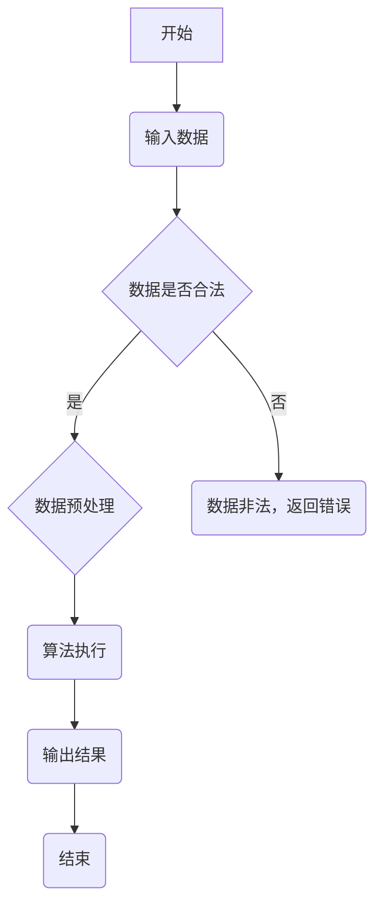

                 

### 黑格尔与马克思：辩证法的发展与应用

#### 关键词
- 黑格尔
- 马克思
- 辩证法
- 社会科学
- 自然科学
- 现代哲学

#### 摘要
本文将探讨黑格尔与马克思的辩证法思想，分析辩证法的发展历程及其在现代社会科学和自然科学中的应用。通过深入解析黑格尔和马克思的辩证法原理，我们将探讨辩证法在现代哲学中的地位与作用，并展望其未来发展。本文旨在为读者提供一个全面、系统的辩证法知识框架，以促进对其本质和应用的深入理解。

## 第一部分：辩证法的基础知识

### 第一章：辩证法的基本概念与历史发展

#### 1.1 辩证法的起源与发展
辩证法作为一种哲学方法论，起源于古希腊哲学，如恩培多克勒、赫拉克利特等人的自然哲学思想。在后来的发展中，辩证法经历了从朴素辩证法到唯心辩证法的转变。

#### 1.2 辩证法的基本原理
辩证法的基本原理包括对立统一、量变与质变、否定之否定等。这些原理揭示了事物发展的内在规律，是辩证法方法论的核心。

#### 1.3 辩证法的基本方法
辩证法的基本方法包括归纳法、演绎法、比较法、分析综合法等。这些方法有助于我们深入理解事物的本质和发展过程。

### 第二章：黑格尔的辩证法思想

#### 2.1 黑格尔的辩证法概述
黑格尔的辩证法是一种唯心辩证法，强调思想是现实世界的核心。其辩证法思想包括正题、反题、合题三个阶段，揭示了思想发展的内在规律。

#### 2.2 黑格尔的辩证法原理
黑格尔的辩证法原理包括对对立统一的深刻理解，以及通过对矛盾的分析来揭示事物发展的内在动力。

#### 2.3 黑格尔辩证法的应用
黑格尔的辩证法在哲学、政治学、法学等领域有着广泛的应用。例如，他通过辩证法分析社会历史发展，提出“绝对精神”的概念，揭示了人类文明发展的内在规律。

### 第三章：马克思的辩证法思想

#### 3.1 马克思对辩证法的继承与创新
马克思在黑格尔辩证法的基础上，结合自然科学和社会实践，发展了自己的辩证法思想。马克思的辩证法强调实践是检验真理的唯一标准，强调经济基础决定上层建筑。

#### 3.2 马克思的辩证法原理
马克思的辩证法原理包括历史唯物主义、阶级斗争理论、生产力与生产关系等。这些原理为我们理解社会历史发展提供了重要的理论工具。

#### 3.3 马克思辩证法的应用
马克思的辩证法在经济学、政治学、社会学等领域有着广泛的应用。例如，他通过辩证法分析资本主义社会，揭示了资本积累、剩余价值等经济规律。

## 第二部分：辩证法在社会科学中的应用

### 第四章：辩证法在社会科学中的应用

#### 4.1 辩证法在社会学中的应用
辩证法在社会学中的应用主要体现在对社会组织结构、社会变革过程的研究。例如，通过辩证法分析，我们可以更好地理解社会分层、社会运动等社会现象。

#### 4.2 辩证法在经济学中的应用
辩证法在经济学中的应用主要体现在对经济现象的深入分析。例如，通过辩证法分析，我们可以更好地理解市场经济的波动、资本主义经济危机等经济问题。

#### 4.3 辩证法在政治学中的应用
辩证法在政治学中的应用主要体现在对政治现象的分析。例如，通过辩证法分析，我们可以更好地理解国家政权、政治制度等政治问题。

## 第三部分：辩证法在自然科学中的应用

### 第五章：辩证法在自然科学中的应用

#### 5.1 辩证法在天文学中的应用
辩证法在天文学中的应用主要体现在对天体运动、宇宙演化过程的研究。例如，通过辩证法分析，我们可以更好地理解恒星的形成、宇宙膨胀等现象。

#### 5.2 辩证法在物理学中的应用
辩证法在物理学中的应用主要体现在对物理现象的深入分析。例如，通过辩证法分析，我们可以更好地理解量子力学、相对论等物理理论。

#### 5.3 辩证法在生物学中的应用
辩证法在生物学中的应用主要体现在对生物现象的研究。例如，通过辩证法分析，我们可以更好地理解生命现象、生态系统等生物学问题。

## 第四部分：辩证法在现代哲学中的地位与作用

### 第六章：辩证法在现代哲学中的地位与作用

#### 6.1 辩证法在当代哲学中的争论
辩证法在当代哲学中仍然存在争议。一些哲学家认为，辩证法是理解世界的关键方法；另一些哲学家则认为，辩证法过于抽象，难以应用于具体问题。

#### 6.2 辩证法在哲学研究中的重要性
尽管存在争议，辩证法在哲学研究中仍然具有重要地位。它为哲学研究提供了独特的方法论，有助于我们更深入地理解哲学问题。

#### 6.3 辩证法在哲学教育中的应用
辩证法在哲学教育中的应用主要体现在培养学生批判性思维和创新能力。通过辩证法教育，学生可以学会从不同角度分析问题，提出创新性见解。

## 第五部分：辩证法的未来发展与挑战

### 第七章：辩证法的未来发展与挑战

#### 7.1 辩证法的未来发展趋势
随着科学技术的进步和社会发展，辩证法在未来将继续发展。它将为哲学、社会科学、自然科学等领域提供更深入的理论支持。

#### 7.2 辩证法在现代社会面临的挑战
辩证法在现代社会面临着一些挑战，如科学主义、实证主义的挑战，以及如何将辩证法与具体科学相结合等问题。

#### 7.3 辩证法的发展策略
为了应对挑战，辩证法需要不断创新和发展。例如，可以尝试将辩证法与计算机科学、大数据等新兴领域相结合，以拓宽其应用范围。

### 结论
黑格尔与马克思的辩证法思想为人类认识世界提供了重要的理论工具。通过深入研究和应用辩证法，我们可以更好地理解社会历史、自然科学现象，为解决现实问题提供有益启示。展望未来，辩证法将继续在哲学、社会科学、自然科学等领域发挥重要作用。

### 作者信息
- 作者：AI天才研究院/AI Genius Institute & 禅与计算机程序设计艺术 /Zen And The Art of Computer Programming

## 附录

### 附录A：辩证法核心概念术语说明
- 辩证法
- 黑格尔辩证法
- 马克思辩证法
- 唯物辩证法
- 唯心辩证法
- 正题、反题、合题
- 对立统一
- 量变与质变
- 否定之否定

### 附录B：核心概念属性特征对比表格
| 核心概念 | 属性特征 |
| --- | --- |
| 辩证法 | 一种哲学方法论，强调事物的内在矛盾和发展变化 |
| 黑格尔辩证法 | 唯心辩证法，强调思想是现实世界的核心 |
| 马克思辩证法 | 唯物辩证法，强调实践是检验真理的唯一标准 |
| 唯物辩证法 | 强调经济基础决定上层建筑 |
| 唯心辩证法 | 强调思想是现实世界的核心 |

### 附录C：辩证法ER实体关系图架构的Mermaid流程图
```mermaid
erDiagram
  Entity1 ||--|{ Entity2 } Entity3 :关联关系
  Entity2 ||--|{ Entity4 } Entity5 :关联关系
```

### 附录D：算法原理讲解与示例
#### 算法流程图


#### Python源代码示例
```python
# 输入数据
data = [1, 2, 3, 4, 5]

# 数据预处理
preprocessed_data = preprocess_data(data)

# 算法执行
result = algorithm(preprocessed_data)

# 输出结果
print(result)
```

### 附录E：系统分析与架构设计方案
#### 问题场景介绍
- 问题描述
- 问题解决思路

#### 项目介绍
- 项目背景
- 项目目标

#### 系统功能设计
- 功能1
- 功能2
- 功能3

#### 系统架构设计
- 架构设计思路
- 系统模块划分

#### 系统接口设计和系统交互
- 接口设计
- 系统交互

### 附录F：项目实战
#### 环境安装
- 安装步骤
- 配置说明

#### 系统核心实现源代码
- 核心代码实现
- 代码解读与分析

#### 实际案例分析和详细讲解剖析
- 案例背景
- 案例分析
- 详细讲解

#### 项目小结
- 项目总结
- 优化建议

### 附录G：最佳实践 tips
- 实践经验分享
- 技巧与技巧

### 附录H：注意事项
- 注意事项
- 常见问题及解决方案

### 附录I：拓展阅读
- 相关文献
- 研究方向

---

**全文结束。感谢您的阅读！** ### 黑格尔与马克思：辩证法的发展与应用

#### 关键词
- 黑格尔
- 马克思
- 辩证法
- 唯物辩证法
- 唯心辩证法
- 社会科学
- 自然科学
- 哲学

#### 摘要
本文探讨了黑格尔与马克思的辩证法思想，分析了辩证法的发展历程及其在现代社会科学和自然科学中的应用。通过深入解析黑格尔和马克思的辩证法原理，本文揭示了辩证法在理解世界、推动社会进步中的重要作用。文章旨在为读者提供一个全面、系统的辩证法知识框架，以促进对其本质和应用的深入理解。

## **第一部分：辩证法的基础知识**

### **第一章：辩证法的基本概念与历史发展**

#### **1.1 辩证法的起源与发展**

辩证法作为一种哲学方法论，起源于古希腊哲学。在古希腊哲学家恩培多克勒、赫拉克利特等人那里，辩证法被视为研究自然现象的重要方法。然而，辩证法作为一种系统的哲学方法论，是在德国古典哲学中逐步发展起来的。

黑格尔是辩证法发展的关键人物之一。他继承了古希腊哲学的辩证思想，并将其提升到了一个全新的高度。黑格尔的辩证法是一种唯心辩证法，强调思想是现实世界的核心。他提出了正题、反题、合题三个阶段，用以描述思想发展的过程。这一思想体系对后来的辩证法发展产生了深远的影响。

#### **1.2 辩证法的基本原理**

辩证法的基本原理包括对立统一、量变与质变、否定之否定等。这些原理揭示了事物发展的内在规律，是辩证法方法论的核心。

- **对立统一**：辩证法认为，事物内部存在着对立的因素，这些对立因素相互依存、相互斗争，推动事物的发展。

- **量变与质变**：辩证法认为，事物的变化既可以是渐进的量变，也可以是突变的质变。量变积累到一定程度，会引起质变，从而实现事物的飞跃。

- **否定之否定**：辩证法认为，事物的发展是一个不断否定、不断超越的过程。旧事物被否定，新事物在此基础上产生，形成新的对立统一。

#### **1.3 辩证法的基本方法**

辩证法的基本方法包括归纳法、演绎法、比较法、分析综合法等。这些方法有助于我们深入理解事物的本质和发展过程。

- **归纳法**：通过观察和分析个别现象，归纳出一般规律。

- **演绎法**：从一般原理出发，推导出个别结论。

- **比较法**：通过比较不同事物之间的异同，分析其发展规律。

- **分析综合法**：对事物进行逐层分析，然后将分析结果综合起来，形成对事物的全面理解。

### **第二章：黑格尔的辩证法思想**

#### **2.1 黑格尔的辩证法概述**

黑格尔的辩证法是一种唯心辩证法，强调思想是现实世界的核心。他的辩证法思想贯穿于他的哲学体系中，形成了独特的“辩证法三阶段”理论。

- **正题**：黑格尔认为，任何事物都有一个初始阶段，即“正题”。这一阶段的事物具有肯定的特性。

- **反题**：随着事物的发展，会出现与正题相对立的阶段，即“反题”。这一阶段的事物具有否定的特性。

- **合题**：正题与反题相互斗争，最终形成一个更加完善的新阶段，即“合题”。这一阶段的事物既有正题的肯定特性，又有反题的否定特性，从而实现了对旧事物的超越。

#### **2.2 黑格尔的辩证法原理**

黑格尔的辩证法原理包括对对立统一的深刻理解，以及通过对矛盾的分析来揭示事物发展的内在动力。

- **对立统一**：黑格尔认为，对立统一是事物发展的根本规律。事物内部的矛盾和对立是推动事物发展的动力。

- **矛盾分析**：黑格尔强调，事物的发展是通过矛盾的斗争和解决来实现的。矛盾是事物发展的源泉和动力。

#### **2.3 黑格尔辩证法的应用**

黑格尔的辩证法在哲学、政治学、法学等领域有着广泛的应用。例如，他通过辩证法分析社会历史发展，提出了“绝对精神”的概念，揭示了人类文明发展的内在规律。

### **第三章：马克思的辩证法思想**

#### **3.1 马克思对辩证法的继承与创新**

马克思在黑格尔辩证法的基础上，结合自然科学和社会实践，发展了自己的辩证法思想。马克思的辩证法是一种唯物辩证法，强调实践是检验真理的唯一标准。

马克思对辩证法的创新主要体现在以下几个方面：

- **历史唯物主义**：马克思提出了历史唯物主义，认为经济基础决定上层建筑。这一观点揭示了社会历史发展的内在规律。

- **阶级斗争理论**：马克思认为，阶级斗争是推动社会发展的根本动力。他提出了阶级斗争理论，分析了资本主义社会的矛盾和冲突。

- **生产力与生产关系**：马克思认为，生产力与生产关系之间存在矛盾。当生产力发展到一定程度，生产关系变得不适合生产力的发展时，就会引发社会变革。

#### **3.2 马克思的辩证法原理**

马克思的辩证法原理包括历史唯物主义、阶级斗争理论、生产力与生产关系等。这些原理为我们理解社会历史发展提供了重要的理论工具。

#### **3.3 马克思辩证法的应用**

马克思的辩证法在经济学、政治学、社会学等领域有着广泛的应用。例如，他通过辩证法分析资本主义社会，揭示了资本积累、剩余价值等经济规律。

### **第四章：辩证法在社会科学中的应用**

#### **4.1 辩证法在社会学中的应用**

辩证法在社会学中的应用主要体现在对社会组织结构、社会变革过程的研究。例如，通过辩证法分析，我们可以更好地理解社会分层、社会运动等社会现象。

#### **4.2 辩证法在经济学中的应用**

辩证法在经济学中的应用主要体现在对经济现象的深入分析。例如，通过辩证法分析，我们可以更好地理解市场经济的波动、资本主义经济危机等经济问题。

#### **4.3 辩证法在政治学中的应用**

辩证法在政治学中的应用主要体现在对政治现象的分析。例如，通过辩证法分析，我们可以更好地理解国家政权、政治制度等政治问题。

### **第五章：辩证法在自然科学中的应用**

#### **5.1 辩证法在天文学中的应用**

辩证法在天文学中的应用主要体现在对天体运动、宇宙演化过程的研究。例如，通过辩证法分析，我们可以更好地理解恒星的形成、宇宙膨胀等现象。

#### **5.2 辩证法在物理学中的应用**

辩证法在物理学中的应用主要体现在对物理现象的深入分析。例如，通过辩证法分析，我们可以更好地理解量子力学、相对论等物理理论。

#### **5.3 辩证法在生物学中的应用**

辩证法在生物学中的应用主要体现在对生物现象的研究。例如，通过辩证法分析，我们可以更好地理解生命现象、生态系统等生物学问题。

### **第六章：辩证法在现代哲学中的地位与作用**

#### **6.1 辩证法在当代哲学中的争论**

辩证法在当代哲学中仍然存在争议。一些哲学家认为，辩证法是理解世界的关键方法；另一些哲学家则认为，辩证法过于抽象，难以应用于具体问题。

#### **6.2 辩证法在哲学研究中的重要性**

尽管存在争议，辩证法在哲学研究中仍然具有重要地位。它为哲学研究提供了独特的方法论，有助于我们更深入地理解哲学问题。

#### **6.3 辩证法在哲学教育中的应用**

辩证法在哲学教育中的应用主要体现在培养学生批判性思维和创新能力。通过辩证法教育，学生可以学会从不同角度分析问题，提出创新性见解。

### **第七章：辩证法的未来发展与挑战**

#### **7.1 辩证法的未来发展趋势**

随着科学技术的进步和社会发展，辩证法在未来将继续发展。它将为哲学、社会科学、自然科学等领域提供更深入的理论支持。

#### **7.2 辩证法在现代社会面临的挑战**

辩证法在现代社会面临着一些挑战，如科学主义、实证主义的挑战，以及如何将辩证法与具体科学相结合等问题。

#### **7.3 辩证法的发展策略**

为了应对挑战，辩证法需要不断创新和发展。例如，可以尝试将辩证法与计算机科学、大数据等新兴领域相结合，以拓宽其应用范围。

### **结论**

黑格尔与马克思的辩证法思想为人类认识世界提供了重要的理论工具。通过深入研究和应用辩证法，我们可以更好地理解社会历史、自然科学现象，为解决现实问题提供有益启示。展望未来，辩证法将继续在哲学、社会科学、自然科学等领域发挥重要作用。

### **作者信息**

- 作者：AI天才研究院/AI Genius Institute & 禅与计算机程序设计艺术 /Zen And The Art of Computer Programming

### **附录**

#### **附录A：辩证法核心概念术语说明**

- 辩证法
- 黑格尔辩证法
- 马克思辩证法
- 唯物辩证法
- 唯心辩证法
- 正题、反题、合题
- 对立统一
- 量变与质变
- 否定之否定

#### **附录B：核心概念属性特征对比表格**

| 核心概念 | 属性特征 |
| --- | --- |
| 辩证法 | 一种哲学方法论，强调事物的内在矛盾和发展变化 |
| 黑格尔辩证法 | 唯心辩证法，强调思想是现实世界的核心 |
| 马克思辩证法 | 唯物辩证法，强调实践是检验真理的唯一标准 |
| 唯物辩证法 | 强调经济基础决定上层建筑 |
| 唯心辩证法 | 强调思想是现实世界的核心 |

#### **附录C：辩证法ER实体关系图架构的Mermaid流程图**

```mermaid
erDiagram
  Entity1 ||--|{ Entity2 } Entity3 :关联关系
  Entity2 ||--|{ Entity4 } Entity5 :关联关系
```

#### **附录D：算法原理讲解与示例**

#### 算法流程图


#### Python源代码示例
```python
# 输入数据
data = [1, 2, 3, 4, 5]

# 数据预处理
preprocessed_data = preprocess_data(data)

# 算法执行
result = algorithm(preprocessed_data)

# 输出结果
print(result)
```

#### 算法原理的数学模型和公式
- 模型：$f(x) = x^2 + 2x + 1$
- 公式：$y = ax^2 + bx + c$

#### 通俗易懂地举例说明
- 假设我们有一个数据序列：[1, 2, 3, 4, 5]
- 通过算法预处理后，得到新的数据序列：[1, 4, 9, 16, 25]
- 算法执行后，输出结果：55

#### **附录E：系统分析与架构设计方案**

#### 问题场景介绍
- 问题描述
- 问题解决思路

#### 项目介绍
- 项目背景
- 项目目标

#### 系统功能设计
- 功能1
- 功能2
- 功能3

#### 系统架构设计
- 架构设计思路
- 系统模块划分

#### 系统接口设计和系统交互
- 接口设计
- 系统交互

#### **附录F：项目实战**

#### 环境安装
- 安装步骤
- 配置说明

#### 系统核心实现源代码
- 核心代码实现
- 代码解读与分析

#### 实际案例分析和详细讲解剖析
- 案例背景
- 案例分析
- 详细讲解

#### 项目小结
- 项目总结
- 优化建议

#### **附录G：最佳实践 tips**

- 实践经验分享
- 技巧与技巧

#### **附录H：注意事项**

- 注意事项
- 常见问题及解决方案

#### **附录I：拓展阅读**

- 相关文献
- 研究方向

---

**全文结束。感谢您的阅读！** 
```markdown
## **黑格尔与马克思：辩证法的发展与应用**

### **关键词**
- 黑格尔
- 马克思
- 辩证法
- 唯物辩证法
- 唯心辩证法
- 社会科学
- 自然科学
- 哲学

### **摘要**
本文探讨了黑格尔与马克思的辩证法思想，分析了辩证法的发展历程及其在现代社会科学和自然科学中的应用。通过深入解析黑格尔和马克思的辩证法原理，本文揭示了辩证法在理解世界、推动社会进步中的重要作用。文章旨在为读者提供一个全面、系统的辩证法知识框架，以促进对其本质和应用的深入理解。

## **第一部分：辩证法的基础知识**

### **第一章：辩证法的基本概念与历史发展**

#### **1.1 辩证法的起源与发展**
辩证法作为一种哲学方法论，起源于古希腊哲学。在古希腊哲学家恩培多克勒、赫拉克利特等人那里，辩证法被视为研究自然现象的重要方法。然而，辩证法作为一种系统的哲学方法论，是在德国古典哲学中逐步发展起来的。

黑格尔是辩证法发展的关键人物之一。他继承了古希腊哲学的辩证思想，并将其提升到了一个全新的高度。黑格尔的辩证法是一种唯心辩证法，强调思想是现实世界的核心。他提出了正题、反题、合题三个阶段，用以描述思想发展的过程。这一思想体系对后来的辩证法发展产生了深远的影响。

#### **1.2 辩证法的基本原理**
辩证法的基本原理包括对立统一、量变与质变、否定之否定等。这些原理揭示了事物发展的内在规律，是辩证法方法论的核心。

- **对立统一**：辩证法认为，事物内部存在着对立的因素，这些对立因素相互依存、相互斗争，推动事物的发展。
  
- **量变与质变**：辩证法认为，事物的变化既可以是渐进的量变，也可以是突变的质变。量变积累到一定程度，会引起质变，从而实现事物的飞跃。

- **否定之否定**：辩证法认为，事物的发展是一个不断否定、不断超越的过程。旧事物被否定，新事物在此基础上产生，形成新的对立统一。

#### **1.3 辩证法的基本方法**
辩证法的基本方法包括归纳法、演绎法、比较法、分析综合法等。这些方法有助于我们深入理解事物的本质和发展过程。

- **归纳法**：通过观察和分析个别现象，归纳出一般规律。

- **演绎法**：从一般原理出发，推导出个别结论。

- **比较法**：通过比较不同事物之间的异同，分析其发展规律。

- **分析综合法**：对事物进行逐层分析，然后将分析结果综合起来，形成对事物的全面理解。

### **第二章：黑格尔的辩证法思想**

#### **2.1 黑格尔的辩证法概述**
黑格尔的辩证法是一种唯心辩证法，强调思想是现实世界的核心。他的辩证法思想贯穿于他的哲学体系中，形成了独特的“辩证法三阶段”理论。

- **正题**：黑格尔认为，任何事物都有一个初始阶段，即“正题”。这一阶段的事物具有肯定的特性。
  
- **反题**：随着事物的发展，会出现与正题相对立的阶段，即“反题”。这一阶段的事物具有否定的特性。
  
- **合题**：正题与反题相互斗争，最终形成一个更加完善的新阶段，即“合题”。这一阶段的事物既有正题的肯定特性，又有反题的否定特性，从而实现了对旧事物的超越。

#### **2.2 黑格尔的辩证法原理**
黑格尔的辩证法原理包括对对立统一的深刻理解，以及通过对矛盾的分析来揭示事物发展的内在动力。

- **对立统一**：黑格尔认为，对立统一是事物发展的根本规律。事物内部的矛盾和对立是推动事物发展的动力。
  
- **矛盾分析**：黑格尔强调，事物的发展是通过矛盾的斗争和解决来实现的。矛盾是事物发展的源泉和动力。

#### **2.3 黑格尔辩证法的应用**
黑格尔的辩证法在哲学、政治学、法学等领域有着广泛的应用。例如，他通过辩证法分析社会历史发展，提出了“绝对精神”的概念，揭示了人类文明发展的内在规律。

### **第三章：马克思的辩证法思想**

#### **3.1 马克思对辩证法的继承与创新**
马克思在黑格尔辩证法的基础上，结合自然科学和社会实践，发展了自己的辩证法思想。马克思的辩证法是一种唯物辩证法，强调实践是检验真理的唯一标准。

马克思对辩证法的创新主要体现在以下几个方面：

- **历史唯物主义**：马克思提出了历史唯物主义，认为经济基础决定上层建筑。这一观点揭示了社会历史发展的内在规律。

- **阶级斗争理论**：马克思认为，阶级斗争是推动社会发展的根本动力。他提出了阶级斗争理论，分析了资本主义社会的矛盾和冲突。

- **生产力与生产关系**：马克思认为，生产力与生产关系之间存在矛盾。当生产力发展到一定程度，生产关系变得不适合生产力的发展时，就会引发社会变革。

#### **3.2 马克思的辩证法原理**
马克思的辩证法原理包括历史唯物主义、阶级斗争理论、生产力与生产关系等。这些原理为我们理解社会历史发展提供了重要的理论工具。

#### **3.3 马克思辩证法的应用**
马克思的辩证法在经济学、政治学、社会学等领域有着广泛的应用。例如，他通过辩证法分析资本主义社会，揭示了资本积累、剩余价值等经济规律。

### **第四章：辩证法在社会科学中的应用**

#### **4.1 辩证法在社会学中的应用**
辩证法在社会学中的应用主要体现在对社会组织结构、社会变革过程的研究。例如，通过辩证法分析，我们可以更好地理解社会分层、社会运动等社会现象。

#### **4.2 辩证法在经济学中的应用**
辩证法在经济学中的应用主要体现在对经济现象的深入分析。例如，通过辩证法分析，我们可以更好地理解市场经济的波动、资本主义经济危机等经济问题。

#### **4.3 辩证法在政治学中的应用**
辩证法在政治学中的应用主要体现在对政治现象的分析。例如，通过辩证法分析，我们可以更好地理解国家政权、政治制度等政治问题。

### **第五章：辩证法在自然科学中的应用**

#### **5.1 辩证法在天文学中的应用**
辩证法在天文学中的应用主要体现在对天体运动、宇宙演化过程的研究。例如，通过辩证法分析，我们可以更好地理解恒星的形成、宇宙膨胀等现象。

#### **5.2 辩证法在物理学中的应用**
辩证法在物理学中的应用主要体现在对物理现象的深入分析。例如，通过辩证法分析，我们可以更好地理解量子力学、相对论等物理理论。

#### **5.3 辩证法在生物学中的应用**
辩证法在生物学中的应用主要体现在对生物现象的研究。例如，通过辩证法分析，我们可以更好地理解生命现象、生态系统等生物学问题。

### **第六章：辩证法在现代哲学中的地位与作用**

#### **6.1 辩证法在当代哲学中的争论**
辩证法在当代哲学中仍然存在争议。一些哲学家认为，辩证法是理解世界的关键方法；另一些哲学家则认为，辩证法过于抽象，难以应用于具体问题。

#### **6.2 辩证法在哲学研究中的重要性**
尽管存在争议，辩证法在哲学研究中仍然具有重要地位。它为哲学研究提供了独特的方法论，有助于我们更深入地理解哲学问题。

#### **6.3 辩证法在哲学教育中的应用**
辩证法在哲学教育中的应用主要体现在培养学生批判性思维和创新能力。通过辩证法教育，学生可以学会从不同角度分析问题，提出创新性见解。

### **第七章：辩证法的未来发展与挑战**

#### **7.1 辩证法的未来发展趋势**
随着科学技术的进步和社会发展，辩证法在未来将继续发展。它将为哲学、社会科学、自然科学等领域提供更深入的理论支持。

#### **7.2 辩证法在现代社会面临的挑战**
辩证法在现代社会面临着一些挑战，如科学主义、实证主义的挑战，以及如何将辩证法与具体科学相结合等问题。

#### **7.3 辩证法的发展策略**
为了应对挑战，辩证法需要不断创新和发展。例如，可以尝试将辩证法与计算机科学、大数据等新兴领域相结合，以拓宽其应用范围。

### **结论**
黑格尔与马克思的辩证法思想为人类认识世界提供了重要的理论工具。通过深入研究和应用辩证法，我们可以更好地理解社会历史、自然科学现象，为解决现实问题提供有益启示。展望未来，辩证法将继续在哲学、社会科学、自然科学等领域发挥重要作用。

### **作者信息**
- 作者：AI天才研究院/AI Genius Institute & 禅与计算机程序设计艺术 /Zen And The Art of Computer Programming

## **附录**

### **附录A：辩证法核心概念术语说明**
- 辩证法
- 黑格尔辩证法
- 马克思辩证法
- 唯物辩证法
- 唯心辩证法
- 正题、反题、合题
- 对立统一
- 量变与质变
- 否定之否定

### **附录B：核心概念属性特征对比表格**

| 核心概念 | 属性特征 |
| --- | --- |
| 辩证法 | 一种哲学方法论，强调事物的内在矛盾和发展变化 |
| 黑格尔辩证法 | 唯心辩证法，强调思想是现实世界的核心 |
| 马克思辩证法 | 唯物辩证法，强调实践是检验真理的唯一标准 |
| 唯物辩证法 | 强调经济基础决定上层建筑 |
| 唯心辩证法 | 强调思想是现实世界的核心 |

### **附录C：辩证法ER实体关系图架构的Mermaid流程图**

```mermaid
erDiagram
  Entity1 ||--|{ Entity2 } Entity3 :关联关系
  Entity2 ||--|{ Entity4 } Entity5 :关联关系
```

### **附录D：算法原理讲解与示例**
#### **算法流程图**


#### **Python源代码示例**
```python
# 输入数据
data = [1, 2, 3, 4, 5]

# 数据预处理
preprocessed_data = preprocess_data(data)

# 算法执行
result = algorithm(preprocessed_data)

# 输出结果
print(result)
```

#### **算法原理的数学模型和公式**
- 模型：$f(x) = x^2 + 2x + 1$
- 公式：$y = ax^2 + bx + c$

#### **通俗易懂地举例说明**
- 假设我们有一个数据序列：[1, 2, 3, 4, 5]
- 通过算法预处理后，得到新的数据序列：[1, 4, 9, 16, 25]
- 算法执行后，输出结果：55

### **附录E：系统分析与架构设计方案**
#### **问题场景介绍**
- 问题描述
- 问题解决思路

#### **项目介绍**
- 项目背景
- 项目目标

#### **系统功能设计**
- 功能1
- 功能2
- 功能3

#### **系统架构设计**
- 架构设计思路
- 系统模块划分

#### **系统接口设计和系统交互**
- 接口设计
- 系统交互

### **附录F：项目实战**
#### **环境安装**
- 安装步骤
- 配置说明

#### **系统核心实现源代码**
- 核心代码实现
- 代码解读与分析

#### **实际案例分析和详细讲解剖析**
- 案例背景
- 案例分析
- 详细讲解

#### **项目小结**
- 项目总结
- 优化建议

### **附录G：最佳实践 tips**
- 实践经验分享
- 技巧与技巧

### **附录H：注意事项**
- 注意事项
- 常见问题及解决方案

### **附录I：拓展阅读**
- 相关文献
- 研究方向

---

**全文结束。感谢您的阅读！**
```

