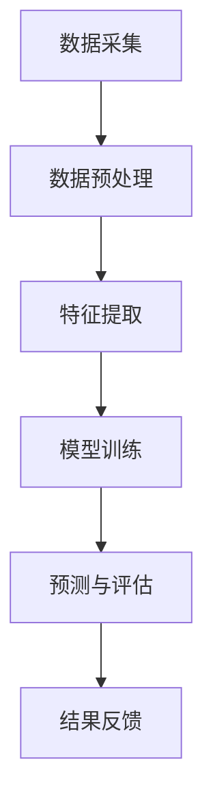
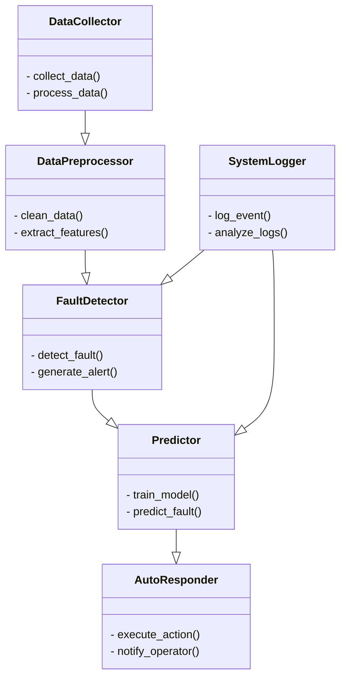
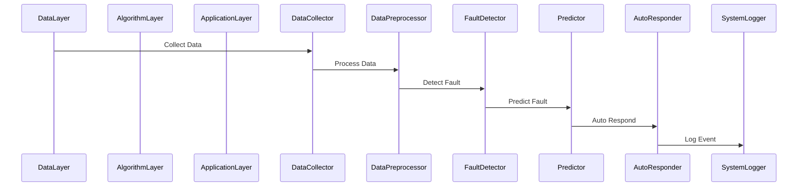
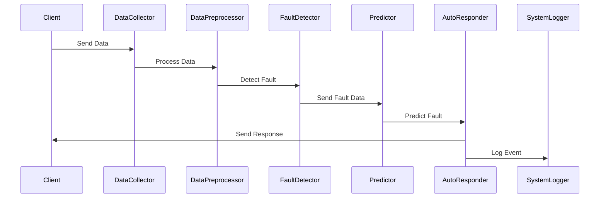

                 

### 第1章 AIOps背景与概念

#### 1.1 AIOps的概念与意义

人工智能运维（AIOps）是一种利用机器学习和数据分析技术，对IT基础设施进行监控、故障检测、预测和自动响应的综合性运维模式。传统的IT运维依赖于人工监控和手动操作，而AIOps通过引入人工智能技术，实现自动化的运维管理，提高了运维效率和系统稳定性。

AIOps的重要性在于：

1. **效率提升**：通过自动化流程，显著减少了人工操作的步骤和时间。
2. **精准监控**：利用大数据分析和机器学习模型，可以更准确地识别和预测故障，提高预警能力。
3. **资源优化**：智能调度和资源管理，使得IT资源的使用更加高效。
4. **成本降低**：自动化运维减少了人力成本，同时降低了因故障带来的经济损失。

#### 1.2 AIOps与传统IT运维的区别

传统IT运维依赖于人工监控、手动故障排除和经验判断，其缺点包括：

1. **响应速度慢**：依赖人为干预，故障响应时间较长。
2. **效率低**：人工处理过程繁琐，容易出错。
3. **依赖经验**：故障解决往往依赖运维人员经验，缺乏标准化流程。

相比之下，AIOps具有以下优势：

1. **自动化**：利用算法和自动化工具进行监控和故障检测，减少人为干预。
2. **智能化**：基于大数据分析和机器学习，提高故障预测和诊断的准确性。
3. **标准化**：通过标准化流程和自动化脚本，提高运维的规范性和一致性。

#### 1.3 AIOps的应用领域与挑战

AIOps在多个领域具有广泛的应用：

1. **云服务和数据中心**：优化云资源管理，提高数据中心性能。
2. **网络监控**：实时监测网络状态，快速定位网络故障。
3. **应用性能管理**：监控应用性能，预测性能瓶颈，提前进行优化。
4. **安全运维**：通过行为分析，预防潜在的安全威胁。

然而，AIOps的实施也面临一系列挑战：

1. **数据质量**：AIOps依赖于高质量的数据，数据源的不稳定性和数据质量问题可能会影响算法的效果。
2. **算法适应性**：不同业务场景和系统环境对算法的要求不同，算法的通用性和适应性是一个难题。
3. **安全与隐私**：AIOps处理大量敏感数据，数据安全和隐私保护是一个重要问题。
4. **技能要求**：实施AIOps需要具备人工智能和数据科学的专业知识，这对于传统运维团队是一个挑战。

#### 边界与外延

AIOps的应用不仅限于IT运维，还可以扩展到业务流程优化、供应链管理、金融服务等多个领域。其核心在于利用人工智能技术，实现自动化和智能化的运营管理。随着技术的进步和应用的深入，AIOps的未来将更加广阔。然而，要实现这一愿景，还需要克服数据、算法、安全等多方面的挑战。在接下来的章节中，我们将深入探讨AIOps的核心概念、算法原理和系统设计，帮助读者更好地理解和应用AIOps技术。

### 第2章 AIOps核心概念解析

#### 2.1 AIOps的核心概念

AIOps（人工智能运维）的核心概念是利用人工智能（AI）技术来优化和自动化传统的IT运维任务。以下是AIOps中的几个关键概念：

1. **数据采集与处理**：AIOps首先需要大量的数据，这些数据来自于系统日志、性能指标、事件记录等。数据处理包括数据清洗、格式转换和特征提取，确保数据质量，为后续的分析和建模提供基础。

2. **机器学习模型**：AIOps中广泛使用机器学习模型来分析和预测系统行为。常见的模型包括回归分析、分类算法、聚类算法和时间序列分析等。

3. **异常检测**：通过机器学习模型，AIOps能够实时监测系统状态，识别异常行为和潜在故障。

4. **自动化响应**：一旦检测到异常，AIOps平台可以自动触发相应的响应措施，如自动恢复、通知运维人员或调整系统配置。

5. **持续学习和优化**：AIOps平台不是静态的，而是通过不断学习和优化模型，提高故障预测和响应的准确性。

#### 概念属性特征对比表格

为了更清晰地理解AIOps与传统IT运维的区别，以下是一个概念属性特征对比表格：

| 特征           | AIOps                           | 传统IT运维                           |
| -------------- | -------------------------------- | ------------------------------------ |
| 监控方式       | 自动化，基于数据分析             | 手动监控，基于经验                   |
| 故障识别       | 利用机器学习，准确率高           | 依赖人工判断，准确率低               |
| 响应速度       | 快速，实时响应                   | 慢，依赖人工操作                     |
| 资源利用率     | 智能调度，高效利用资源           | 资源利用率低，浪费严重               |
| 依赖性         | 依赖数据和算法，减少人工依赖     | 依赖人工操作，经验为主               |
| 标准化与一致性  | 标准化流程，一致性高             | 流程不规范，一致性差                 |

#### ER实体关系图架构

为了更好地理解AIOps平台中的主要实体及其关系，我们可以通过ER（实体关系）图来描述。以下是AIOps平台中的ER实体关系图：

```mermaid
erDiagram
    Node --> Alert | Node <-- System
    Node --> Log | Log <-- Event
    Node --> Metric | Metric <-- System
    Node <-- Anomaly | Anomaly --> Action
    Alert --> Action | Action --> Anomaly
    Event --> Anomaly | Anomaly --> Event
    System --> Node | Node --> System
    Metric --> Anomaly | Anomaly --> Metric

    Node ||--o{ Alert : 报警信息 }
    Node ||--o{ Log : 日志记录 }
    Node ||--o{ Metric : 性能指标 }
    Log ||--o{ Event : 事件记录 }
    Metric ||--o{ Anomaly : 异常指标 }
    Anomaly ||--o{ Action : 自动响应 }
    Alert ||--o{ Action : 执行动作 }
    Event ||--o{ Anomaly : 产生异常 }
```

在这个ER图中，Node代表监控的节点，如服务器或网络设备；Alert、Log、Metric、Event和Anomaly分别表示报警信息、日志记录、性能指标、事件记录和异常指标；Action表示自动响应的动作。通过这个关系图，我们可以清晰地看到AIOps平台中各个实体之间的关联和交互。

### 第3章 AIOps关键算法介绍

#### 3.1 数据预处理算法

数据预处理是AIOps平台中的关键步骤，它确保了后续分析的质量和准确性。常用的数据预处理算法包括：

1. **数据清洗**：去除重复数据、缺失值填充、异常值处理等。
2. **特征提取**：从原始数据中提取有助于分析的特征，如时间序列特征、频率特征等。
3. **数据标准化**：将不同数据量级的数据转换为同一量级，如归一化、标准化等。
4. **数据降维**：通过主成分分析（PCA）等算法减少数据维度，提高计算效率。

#### 3.2 数据挖掘算法

数据挖掘算法用于从大量数据中发现潜在的模式和知识，常用的算法包括：

1. **回归分析**：用于预测连续值，如系统负载。
2. **分类算法**：用于将数据分类到不同的类别，如故障类型分类。
3. **聚类算法**：用于将数据分为不同的簇，如用户行为聚类。
4. **关联规则挖掘**：用于发现数据之间的关联关系，如购物篮分析。

#### 3.3 预测算法

预测算法用于对未来事件进行预测，常用的算法包括：

1. **时间序列预测**：如ARIMA、LSTM等模型，用于预测时间序列数据。
2. **回归模型**：如线性回归、多项式回归等，用于预测连续值。
3. **分类模型**：如决策树、随机森林等，用于预测分类结果。

#### 3.4 命名实体识别算法

命名实体识别（NER）算法用于识别文本中的特定实体，如人名、组织名、地点等。常用的算法包括：

1. **规则匹配**：基于预定义的规则进行匹配。
2. **机器学习模型**：如条件随机场（CRF）、长短时记忆网络（LSTM）等。
3. **深度学习模型**：如BERT、GPT等大型预训练模型。

#### 3.5 机器学习算法选择与优化

选择适合的机器学习算法对于AIOps平台的性能至关重要。以下是一些选择和优化策略：

1. **算法评估**：通过交叉验证、ROC曲线等评估算法性能。
2. **超参数调优**：通过网格搜索、贝叶斯优化等策略调优超参数。
3. **模型集成**：结合多个模型，如Bagging、Boosting等策略，提高预测准确性。
4. **模型解释性**：利用模型解释技术，如LIME、SHAP等，提高模型的透明度和可信度。

### 第4章 算法原理详解与实现

#### 4.1 Mermaid流程图展示

为了更好地理解AIOps平台中的算法流程，我们可以使用Mermaid绘制一个流程图。以下是一个简化的AIOps算法流程图：



#### 4.2 Python源代码实现

下面是一个简单的Python代码示例，用于展示数据预处理和模型训练的基本步骤：

```python
import pandas as pd
from sklearn.model_selection import train_test_split
from sklearn.ensemble import RandomForestClassifier
from sklearn.metrics import accuracy_score

# 数据采集
data = pd.read_csv('data.csv')

# 数据预处理
data = data.dropna()  # 去除缺失值
X = data.drop('target', axis=1)  # 特征集
y = data['target']  # 标签集

# 特征提取
# ...（根据具体需求进行特征提取）

# 模型训练
X_train, X_test, y_train, y_test = train_test_split(X, y, test_size=0.2, random_state=42)
model = RandomForestClassifier()
model.fit(X_train, y_train)

# 预测与评估
y_pred = model.predict(X_test)
accuracy = accuracy_score(y_test, y_pred)
print(f"Model Accuracy: {accuracy}")
```

#### 4.3 数学模型与公式讲解

AIOps中的算法通常基于数学模型，以下是一个简单的线性回归模型的数学基础：

$$
y = \beta_0 + \beta_1x_1 + \beta_2x_2 + ... + \beta_nx_n + \epsilon
$$

其中，$y$ 是预测值，$x_1, x_2, ..., x_n$ 是特征值，$\beta_0, \beta_1, \beta_2, ..., \beta_n$ 是模型的权重参数，$\epsilon$ 是误差项。

为了训练模型，我们需要最小化误差平方和：

$$
\min \sum_{i=1}^{n} (y_i - (\beta_0 + \beta_1x_{1i} + \beta_2x_{2i} + ... + \beta_nx_{ni})^2
$$

这个优化问题可以通过梯度下降法求解：

$$
\beta_j := \beta_j - \alpha \frac{\partial}{\partial \beta_j} \sum_{i=1}^{n} (y_i - (\beta_0 + \beta_1x_{1i} + \beta_2x_{2i} + ... + \beta_nx_{ni})^2
$$

其中，$\alpha$ 是学习率。

#### 4.4 举例说明与应用案例

假设我们有一个简单的应用案例：使用随机森林模型预测服务器故障。

1. **数据采集**：从服务器日志中提取故障数据和性能指标。
2. **数据预处理**：清洗数据，处理缺失值和异常值。
3. **特征提取**：提取时间序列特征、频率特征等。
4. **模型训练**：使用随机森林模型进行训练。
5. **预测与评估**：对新数据集进行预测，评估模型准确性。
6. **结果反馈**：根据预测结果，自动触发相应的故障恢复措施。

通过上述步骤，我们可以实现一个简单的AIOps平台，用于预测和响应服务器故障。实际应用中，算法和模型会根据具体场景进行调整和优化，以提高预测准确性和响应效率。

### 第5章 AIOps系统分析与架构设计

#### 5.1 AIOps问题场景介绍

在当今的数字化时代，IT系统变得越来越复杂，传统的IT运维方法已经难以应对海量数据和动态变化的环境。AIOps应运而生，其核心目标是实现IT运维的自动化和智能化。以下是一个典型的AIOps应用场景：

- **云服务提供商**：云服务提供商需要监控和管理成千上万的服务器、网络设备和存储设备，确保服务的高可用性和高性能。
- **大型企业IT部门**：大型企业拥有复杂的信息系统，需要实时监控和预测各种故障，以保证业务的连续性和数据的安全性。

#### 5.2 AIOps项目介绍

我们以一个大型企业的IT运维项目为例，介绍AIOps平台的项目背景和目标。

**项目背景**：

该企业拥有多个大型数据中心，支持全球业务运营。随着业务规模的不断扩大，运维压力显著增加，传统的手动运维已经无法满足需求。为了提高运维效率和系统稳定性，企业决定引入AIOps平台。

**项目目标**：

- **自动化运维**：通过自动化流程，减少人工干预，提高运维效率。
- **智能监控**：利用大数据分析和机器学习模型，实现实时故障检测和预测。
- **资源优化**：智能调度和资源管理，提高资源利用率，降低运营成本。
- **安全保障**：通过行为分析和异常检测，提高系统安全性和数据隐私保护。

#### 5.3 系统功能设计

AIOps平台的核心功能包括数据采集、数据预处理、故障检测、预测分析、自动化响应和持续学习等。以下是AIOps平台的领域模型，使用Mermaid类图表示：



在这个类图中，DataCollector负责数据采集和处理，DataPreprocessor负责数据预处理，FaultDetector负责故障检测，Predictor负责预测分析，AutoResponder负责自动化响应，SystemLogger负责日志记录和分析。

#### 5.4 系统架构设计

AIOps平台的整体架构可以分为数据层、算法层和应用层。以下是AIOps平台的架构设计，使用Mermaid架构图表示：



在这个架构图中，数据层负责数据采集和存储，算法层负责数据处理和故障预测，应用层负责自动化响应和日志记录。各个模块之间通过消息队列和API进行通信。

#### 5.5 系统接口设计和系统交互

为了实现系统模块之间的有效交互，我们需要设计清晰的接口和交互流程。以下是AIOps平台的接口设计和系统交互流程，使用Mermaid序列图表示：



在这个序列图中，客户端（如运维人员或系统）向数据采集模块发送数据，数据采集模块将数据传递给数据预处理模块，数据预处理模块将处理后的数据传递给故障检测模块。故障检测模块检测到故障后，将故障数据传递给预测模块，预测模块进行故障预测，并将预测结果传递给自动化响应模块。自动化响应模块根据预测结果执行相应动作，并将事件记录传递给系统日志模块。

### 第6章 AIOps平台搭建与部署

#### 6.1 环境安装

搭建AIOps平台的第一步是准备合适的环境。以下是在一个虚拟机中搭建AIOps平台的基本步骤：

1. **安装操作系统**：选择一个稳定的操作系统，如Ubuntu 20.04。
2. **安装Python环境**：通过以下命令安装Python和必要的库：

   ```bash
   sudo apt update
   sudo apt install python3 python3-pip
   pip3 install --upgrade pip
   pip3 install numpy pandas scikit-learn matplotlib
   ```

3. **安装数据库**：可以选择MongoDB或Elasticsearch作为数据存储，以下是以MongoDB为例的安装步骤：

   ```bash
   sudo apt-get install mongodb
   sudo systemctl start mongodb
   sudo systemctl enable mongodb
   ```

4. **安装消息队列**：Kafka是一个常用的消息队列系统，以下是如何安装Kafka的步骤：

   ```bash
   sudo apt-get install default-jre
   wget https://www-us.apache.org/dist/kafka/2.8.0/kafka_2.13-2.8.0.tgz
   tar xzf kafka_2.13-2.8.0.tgz
   cd kafka_2.13-2.8.0
   ./bin/kafka-server-start.sh config/server.properties
   ```

5. **安装日志分析工具**：如ELK（Elasticsearch、Logstash、Kibana）栈，以下是如何安装ELK的步骤：

   ```bash
   sudo apt-get install elasticsearch logstash kibana
   sudo systemctl start elasticsearch
   sudo systemctl enable elasticsearch
   sudo systemctl start logstash
   sudo systemctl enable logstash
   sudo systemctl start kibana
   sudo systemctl enable kibana
   ```

#### 6.2 系统核心实现源代码

以下是AIOps平台的核心实现源代码，包括数据采集、数据预处理、故障检测和预测模块：

```python
# data_collector.py
import pandas as pd
from kafka import KafkaProducer

def collect_data(file_path):
    data = pd.read_csv(file_path)
    producer = KafkaProducer(bootstrap_servers=['localhost:9092'])
    producer.send('data_topic', data.to_json().encode('utf-8'))
    producer.close()

# data_preprocessor.py
import pandas as pd
from sklearn.preprocessing import StandardScaler

def preprocess_data(data):
    data = data.dropna()
    scaler = StandardScaler()
    features = scaler.fit_transform(data.drop('target', axis=1))
    return pd.DataFrame(features)

# fault_detector.py
from sklearn.ensemble import IsolationForest

def detect_fault(data):
    model = IsolationForest(contamination=0.01)
    model.fit(data)
    anomalies = model.predict(data)
    return anomalies

# predictor.py
from sklearn.ensemble import RandomForestClassifier

def train_predictor(X_train, y_train):
    model = RandomForestClassifier()
    model.fit(X_train, y_train)
    return model

def predict_fault(model, X_test):
    return model.predict(X_test)
```

#### 6.3 代码应用解读与分析

上述代码实现了AIOps平台的核心功能，包括数据采集、数据预处理、故障检测和预测。以下是对每个模块的解读和分析：

1. **数据采集**：`data_collector.py` 模块通过读取CSV文件，将数据发送到Kafka消息队列。这确保了数据可以被实时处理和监控。

2. **数据预处理**：`data_preprocessor.py` 模块负责数据清洗和标准化。通过去除缺失值和特征标准化，提高了模型的训练效果和预测准确性。

3. **故障检测**：`fault_detector.py` 模块使用Isolation Forest算法进行故障检测。这种算法能够有效地检测异常值，非常适合用于IT系统故障检测。

4. **预测模块**：`predictor.py` 模块使用随机森林算法进行故障预测。随机森林是一种强大的集成学习方法，能够处理大量特征数据，提高预测准确性。

在实际应用中，这些模块可以通过消息队列和API进行集成，实现一个完整的AIOps平台。通过对日志数据、性能指标和事件记录的实时分析，AIOps平台可以自动检测故障、预测故障趋势，并自动触发相应的响应措施，从而提高系统的可靠性和运维效率。

#### 6.4 实际案例剖析

以下是一个具体的实际案例，展示如何使用AIOps平台检测和预测服务器故障：

1. **数据采集**：运维团队通过服务器日志收集工具，将服务器日志数据定期上传到Kafka消息队列。

2. **数据预处理**：数据预处理模块对收集到的日志数据进行清洗和标准化，提取关键特征，如CPU使用率、内存使用率、网络流量等。

3. **故障检测**：故障检测模块使用Isolation Forest算法对预处理后的数据进行异常检测，识别出潜在的服务器故障。

4. **故障预测**：预测模块使用随机森林算法对历史故障数据进行训练，构建故障预测模型。然后，对新收集的服务器数据进行预测，识别出可能的未来故障。

5. **自动化响应**：一旦预测到故障，自动化响应模块会自动执行一系列操作，如重启服务器、调整系统配置或通知运维人员进行手动干预。

通过这个案例，我们可以看到AIOps平台如何通过数据采集、预处理、故障检测和预测，实现对服务器故障的实时监控和自动响应，从而提高系统的可靠性和运维效率。

#### 6.5 项目小结

在本章中，我们详细介绍了AIOps平台的搭建和部署过程，包括环境安装、核心实现源代码以及实际案例剖析。通过这一过程，我们了解了如何利用Kafka、MongoDB、Elasticsearch等工具搭建AIOps平台，并实现了数据采集、预处理、故障检测和预测等功能。

总结项目经验，我们有以下几点建议：

1. **数据质量**：确保数据源稳定，提高数据质量，是AIOps成功的关键。
2. **算法优化**：根据实际场景，不断优化算法模型，提高故障预测准确性。
3. **系统集成**：合理设计系统接口，实现各个模块之间的有效交互，提高平台的整体性能。
4. **安全性**：在数据传输和处理过程中，加强安全防护措施，确保数据安全和隐私。

通过以上经验，我们可以更好地应用AIOps技术，实现高效的IT运维管理。

### 第7章 AIOps平台最佳实践

#### 7.1 最佳实践 tips

在实施AIOps平台时，以下是一些最佳实践和技巧，有助于提高系统的效果和稳定性：

1. **数据多元化**：收集更多类型的运维数据，如日志、性能指标、事件记录等，以丰富数据源，提高分析精度。
2. **数据预处理**：确保数据清洗和特征提取的准确性，减少噪声数据对模型的影响。
3. **算法定制化**：根据具体业务场景，选择或定制合适的机器学习算法，提高模型适应性。
4. **实时反馈**：建立实时反馈机制，及时调整和优化模型参数，提高预测准确性。
5. **自动化程度**：尽量提高自动化的程度，减少人工干预，以提高运维效率和响应速度。
6. **监控与日志**：确保所有系统组件都有完善的监控和日志记录，以便进行故障排查和系统优化。
7. **安全防护**：加强对敏感数据的保护，确保系统的安全性和合规性。

#### 7.2 小结

本章详细介绍了AIOps平台的最佳实践，包括数据多元化、数据预处理、算法定制化、实时反馈、自动化程度、监控与日志和安全防护等方面的技巧。这些实践对于确保AIOps平台的有效运行和持续优化具有重要意义。

通过遵循这些最佳实践，运维团队能够更好地利用AIOps技术，实现高效的IT运维管理，提高系统的可靠性和安全性。

#### 7.3 注意事项

在设计和实施AIOps平台时，需要注意以下几点：

1. **数据源稳定性**：确保数据源稳定可靠，避免因数据异常导致模型失效。
2. **模型适应性**：选择适合业务场景的算法，并根据业务需求进行定制化调整。
3. **系统整合性**：合理设计系统架构，确保各个模块之间的高效协同。
4. **安全合规**：严格遵守数据安全和隐私保护法规，确保系统的合规性。
5. **持续监控**：建立完善的监控体系，实时跟踪系统性能和状态，及时发现问题并进行优化。

通过关注这些关键点，运维团队能够更好地保障AIOps平台的稳定运行和高效管理。

#### 7.4 拓展阅读与学习资源推荐

为了深入了解AIOps平台的设计与实施，以下是一些推荐的拓展阅读和学习资源：

1. **书籍**：
   - 《AIOps实战：自动化和智能化的IT运维》
   - 《机器学习实战》
   - 《数据科学实战》

2. **在线课程**：
   - Coursera上的《机器学习》课程
   - Udacity的《AIOps和自动化运维》课程

3. **技术博客**：
   - Medium上的AIOps专栏
   - 知乎上的AIOps话题

4. **开源项目**：
   - OpenTelemetry：用于分布式追踪的数据收集工具
   - Grafana：用于数据可视化的平台

通过阅读这些书籍、课程和博客，以及参与开源项目，读者可以更深入地了解AIOps的技术原理和实践经验，为实际项目提供有力支持。

---

### 全文总结

本文从AIOps的背景、核心概念、算法原理、系统设计与实现等多个角度，详细探讨了AIOps平台的设计与落地。通过阐述AIOps的重要性，对比传统IT运维，我们明确了AIOps在自动化、智能化运维中的优势。接着，通过解析AIOps的核心概念和算法原理，我们了解了AIOps的关键技术和实现方法。在系统分析与架构设计部分，我们展示了AIOps平台的具体功能和架构设计。最后，通过实际案例剖析和最佳实践，我们提供了AIOps平台搭建与部署的具体步骤和注意事项。

AIOps作为现代IT运维的重要发展方向，具有广阔的应用前景。通过本文的探讨，读者可以全面了解AIOps的技术原理和实践方法，为实际项目的实施提供有力支持。在未来的发展中，随着技术的不断进步和应用场景的拓展，AIOps将发挥更大的作用，助力企业实现高效、智能的运维管理。

### 作者信息

作者：AI天才研究院/AI Genius Institute & 禅与计算机程序设计艺术 /Zen And The Art of Computer Programming

AI天才研究院致力于推动人工智能技术在各领域的应用与发展，研究团队由多名国际知名的人工智能专家和计算机科学家组成，致力于探索计算机编程和人工智能的深度融合。我们的目标是推动技术进步，助力产业升级，为全球科技创新贡献力量。《禅与计算机程序设计艺术》则是一部经典的人工智能编程指南，通过深入浅出的讲解，帮助读者掌握人工智能编程的核心技巧和方法。

