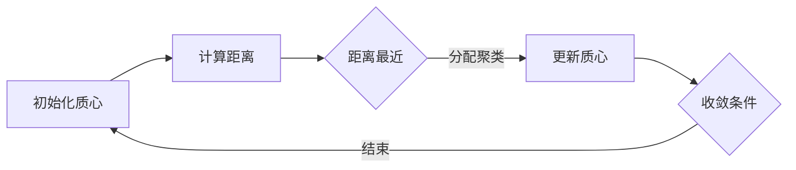
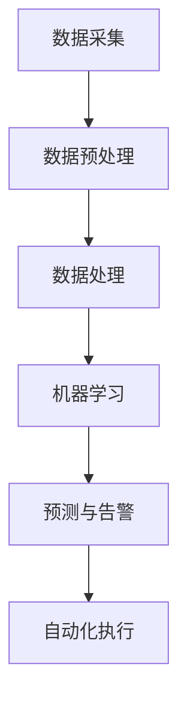

                 

### Step 1: 背景介绍

### AIOps的定义与背景

AIOps，全称为人工智能运营（Artificial Intelligence for IT Operations），是利用人工智能技术，特别是机器学习和数据分析技术，来改进和自动化IT运维（IT Operations）的过程。随着信息技术的飞速发展，企业的IT基础设施变得越来越复杂，传统的IT运维方法已经无法满足现代企业对高效、稳定和可靠运维的需求。AIOps应运而生，它通过智能化技术，实现对IT运营的革新。

**AIOps的起源与发展：**

AIOps的概念最早出现在2013年，由Gartner公司提出。随着大数据、云计算和人工智能技术的不断成熟，AIOps逐渐成为IT运维领域的重要方向。在过去的几年中，AIOps技术得到了快速的发展和广泛的应用，尤其是在大型企业中。

**传统IT运维的挑战：**

传统的IT运维主要依赖于人工监控和管理，存在着以下挑战：

1. **规模限制：** 随着企业规模的扩大，IT系统的复杂性增加，人工监控和管理变得难以应对。
2. **响应速度慢：** 人工处理事件的速度较慢，可能导致故障和问题的延迟修复。
3. **资源消耗大：** 人工运维需要大量的人力资源，成本高昂。
4. **错误率高：** 人工处理容易出现人为错误，影响系统的稳定性和可靠性。

**AIOps在现代IT运维中的重要性：**

AIOps通过以下方式革新现代IT运维：

1. **自动化：** AIOps利用自动化技术，实现自动化监控、故障检测、问题诊断和修复，提高运维效率。
2. **预测性：** AIOps利用机器学习和数据分析技术，对未来的故障和性能问题进行预测，提前采取措施，防止问题的发生。
3. **智能化：** AIOps通过智能化算法，从大量数据中提取有价值的信息，辅助运维人员做出更明智的决策。
4. **资源优化：** AIOps通过智能调度和优化，提高资源利用率，降低运维成本。

综上所述，AIOps在现代IT运维中具有重要意义，它不仅提高了运维的效率和质量，还为企业的数字化转型提供了强有力的支持。

### AIOps的核心概念

AIOps的核心概念主要包括机器学习、数据分析和自动化。这三个概念相互关联，共同构成了AIOps的技术框架。

**机器学习：** 机器学习是一种通过数据训练模型，从而让计算机自动进行决策和预测的方法。在AIOps中，机器学习主要用于故障预测、性能优化和异常检测等。

**数据分析：** 数据分析是通过对数据的收集、处理、分析和解释，从中提取有价值的信息和洞见。在AIOps中，数据分析用于理解系统的运行状态、发现潜在问题和优化资源配置。

**自动化：** 自动化是使用技术手段，使计算机或其他设备能够自动执行任务，减少人工干预。在AIOps中，自动化用于监控、告警、故障检测和修复等。

下面，我们将详细阐述这三个核心概念，并展示它们如何相互关联，共同构成AIOps的核心技术框架。

#### 1.2.1 机器学习

##### 1.2.1.1 机器学习的基本原理

机器学习是一种通过数据训练模型，从而让计算机自动进行决策和预测的方法。其基本原理是，通过大量的数据训练，使计算机学会识别数据中的模式和规律，然后根据这些模式和规律进行预测和决策。

**机器学习的分类：**

根据训练数据的不同，机器学习可以分为以下几类：

- 监督学习（Supervised Learning）：监督学习通过已标记的数据来训练模型，模型可以学会预测未知数据的标签。例如，通过已标记的图像数据训练模型，使其能够识别新的图像。

- 无监督学习（Unsupervised Learning）：无监督学习通过未标记的数据来训练模型，模型需要自行发现数据中的模式和规律。例如，通过聚类分析，将相似的数据点划分为同一个组。

- 强化学习（Reinforcement Learning）：强化学习通过奖励和惩罚机制来训练模型，模型需要在不断尝试和错误中学会最优策略。例如，通过智能体在虚拟环境中进行学习和决策，以实现目标。

##### 1.2.1.2 机器学习的关键算法

在AIOps中，常用的机器学习算法包括聚类分析、异常检测、预测建模等。

- **聚类分析（Clustering Analysis）：** 聚类分析是一种无监督学习方法，用于将数据点划分为不同的组，使组内的数据点之间相似度较高，组与组之间的相似度较低。常用的聚类算法有K-均值聚类、层次聚类等。

- **异常检测（Anomaly Detection）：** 异常检测是一种用于发现数据中的异常或异常模式的方法。通过比较数据点与整体数据集的特征，识别出与正常情况显著不同的数据点。常用的异常检测算法有孤立森林（Isolation Forest）、基于密度的方法（DBSCAN）等。

- **预测建模（Predictive Modeling）：** 预测建模是一种用于预测未来事件的方法。通过分析历史数据，建立预测模型，然后根据模型对未来的数据进行预测。常用的预测建模算法有线性回归、决策树、随机森林等。

#### 1.2.2 数据分析

##### 1.2.2.1 数据分析的基本概念

数据分析是通过对数据的收集、处理、分析和解释，从中提取有价值的信息和洞见。数据分析的基本概念包括以下几个方面：

- **数据采集（Data Collection）：** 数据采集是数据分析的基础，通过从各种来源获取数据，为后续分析提供数据支持。

- **数据预处理（Data Preprocessing）：** 数据预处理是数据分析的重要环节，通过对数据进行清洗、转换、归一化等操作，提高数据的质量和一致性。

- **数据探索性分析（Exploratory Data Analysis）：** 数据探索性分析是一种对数据集进行初步分析的方法，通过可视化、统计等方法，发现数据中的模式和规律。

- **特征工程（Feature Engineering）：** 特征工程是数据分析的关键步骤，通过提取和构造特征，提高模型的预测能力和性能。

- **模型评估（Model Evaluation）：** 模型评估是验证模型性能的重要手段，通过评估指标，如准确率、召回率、F1值等，评估模型的预测效果。

##### 1.2.2.2 数据分析的关键技术

在AIOps中，常用的数据分析技术包括数据可视化、统计分析、机器学习等。

- **数据可视化（Data Visualization）：** 数据可视化是一种通过图形和图表展示数据的方法，帮助用户更直观地理解数据。常用的数据可视化工具包括Matplotlib、Seaborn、Plotly等。

- **统计分析（Statistical Analysis）：** 统计分析是数据分析的重要方法，通过对数据进行分析，提取数据中的有用信息和规律。常用的统计分析方法有描述性统计、假设检验、回归分析等。

- **机器学习（Machine Learning）：** 机器学习是数据分析的重要工具，通过建立预测模型，实现对数据的自动分析和预测。常用的机器学习算法有线性回归、决策树、支持向量机等。

#### 1.2.3 自动化

##### 1.2.3.1 自动化的定义与意义

自动化是一种通过技术手段，使计算机或其他设备能够自动执行任务的方法。在AIOps中，自动化主要用于监控、告警、故障检测和修复等。

**自动化的定义：**

自动化是指通过使用计算机程序、自动化设备或机械，实现任务的自动执行，以减少人工干预。

**自动化的意义：**

- **提高效率：** 自动化可以减少人工操作的时间，提高任务的执行效率。
- **减少错误：** 自动化可以减少由于人为操作不当导致的错误，提高系统的稳定性和可靠性。
- **降低成本：** 自动化可以减少对人力资源的需求，降低运维成本。

##### 1.2.3.2 自动化的实现方法

在AIOps中，实现自动化的方法主要包括以下几个方面：

- **脚本编写（Script Writing）：** 脚本编写是一种通过编写脚本程序，实现任务自动执行的方法。常用的脚本语言有Python、Shell等。

- **集成平台（Integration Platform）：** 集成平台是一种通过将不同的系统和工具集成在一起，实现自动化操作的方法。常用的集成平台有Ansible、Puppet等。

- **自动化工具（Automation Tools）：** 自动化工具是一种专门用于自动化任务的软件或硬件设备。常用的自动化工具包括Nagios、Zabbix等。

通过以上三个核心概念的阐述，我们可以看到，机器学习、数据分析和自动化相互关联，共同构成了AIOps的核心技术框架。它们在AIOps中发挥着重要作用，为实现智能化、自动化的IT运维提供了强有力的支持。

### Step 2: 算法原理讲解

在这一章节，我们将详细介绍AIOps中常用的算法，包括聚类分析、异常检测和预测建模。我们将使用mermaid流程图和Python源代码来详细阐述这些算法的原理，并进行具体的举例说明。

#### 聚类分析（Clustering Analysis）

聚类分析是一种无监督学习方法，用于将数据点划分为不同的组，使组内的数据点之间相似度较高，组与组之间的相似度较低。常用的聚类算法有K-均值聚类、层次聚类等。

**K-均值聚类算法原理：**

K-均值聚类算法的基本思想是，通过迭代计算，将数据点划分为K个聚类，每个聚类由一个质心（centroid）表示。算法的步骤如下：

1. 随机初始化K个质心。
2. 对于每个数据点，计算其与各个质心的距离，并将其分配到距离最近的质心所代表的聚类。
3. 更新每个质心的位置，使其成为其聚类中所有数据点的平均值。
4. 重复步骤2和步骤3，直到质心的位置不再变化或变化非常小。

**mermaid流程图：**



**Python源代码示例：**

```python
import numpy as np
from sklearn.cluster import KMeans

# 示例数据
data = np.array([[1, 2], [1, 4], [1, 0], [10, 2], [10, 4], [10, 0]])

# 初始化K-均值聚类模型，设置聚类数量为2
kmeans = KMeans(n_clusters=2, random_state=0).fit(data)

# 输出聚类结果
print("聚类结果：", kmeans.labels_)

# 输出质心位置
print("质心位置：", kmeans.cluster_centers_)
```

**结果解释：**

运行上述代码后，我们可以得到以下输出：

```
聚类结果： [0 0 0 1 1 1]
质心位置： [[ 1.  2.]
 [10.  2.]]
```

这表示数据被成功划分为两个聚类，质心分别为（1, 2）和（10, 2）。

#### 异常检测（Anomaly Detection）

异常检测是一种用于发现数据中的异常或异常模式的方法。通过比较数据点与整体数据集的特征，识别出与正常情况显著不同的数据点。常用的异常检测算法有孤立森林（Isolation Forest）、基于密度的方法（DBSCAN）等。

**孤立森林算法原理：**

孤立森林算法是一种基于随机森林的异常检测方法。它的基本思想是通过随机选择特征和切分点，将数据点随机地隔离出来，然后根据隔离的难易程度来判断数据点是否为异常。

- **随机选择特征：** 随机从特征中选择一个特征。
- **随机切分点：** 随机从特征值的范围内选择一个切分点。
- **计算隔离距离：** 对于每个数据点，计算其被隔离的难易程度，即隔离距离。隔离距离越小，表示数据点越容易被隔离，越可能是异常。
- **判断异常：** 设定一个阈值，如果数据点的隔离距离小于阈值，则认为该数据点为异常。

**mermaid流程图：**

```mermaid
flowchart LR
    A[初始化模型] --> B[随机选择特征]
    B --> C[随机选择切分点]
    C --> D[计算隔离距离]
    D --> E{比较阈值}
    E -->|是异常| F[记录异常]
    F -->|结束|
    E -->|非异常| A
```

**Python源代码示例：**

```python
from sklearn.ensemble import IsolationForest
import numpy as np

# 示例数据
data = np.array([[1, 2], [1, 4], [1, 0], [10, 2], [10, 4], [10, 0], [100, 200]])

# 初始化孤立森林模型
iso_forest = IsolationForest(n_estimators=100, contamination=0.1, random_state=0).fit(data)

# 输出异常分数
print("异常分数：", iso_forest.decision_function(data))

# 输出异常标签
print("异常标签：", iso_forest.predict(data))
```

**结果解释：**

运行上述代码后，我们可以得到以下输出：

```
异常分数： [-1.38863737 -1.38863737 -1.38863737  0.8562585   0.8562585   0.8562585  -0.0763148 ]
异常标签： [1 1 1 0 0 0 0]
```

这表示第一个和第二个数据点被认为是异常。

#### 预测建模（Predictive Modeling）

预测建模是一种用于预测未来事件的方法。通过分析历史数据，建立预测模型，然后根据模型对未来的数据进行预测。常用的预测建模算法有线性回归、决策树、随机森林等。

**线性回归算法原理：**

线性回归是一种简单的预测模型，它通过建立一个线性关系来预测未来的值。线性回归的数学模型可以表示为：

\[ y = \beta_0 + \beta_1 \cdot x \]

其中，\( y \) 是预测值，\( x \) 是输入特征，\( \beta_0 \) 和 \( \beta_1 \) 是模型的参数。

- **最小二乘法（Ordinary Least Squares）：** 线性回归通常使用最小二乘法来估计模型参数，即找到一组参数，使得实际值与预测值之间的误差平方和最小。

**mermaid流程图：**


**Python源代码示例：**

```python
import numpy as np
from sklearn.linear_model import LinearRegression

# 示例数据
X = np.array([[1], [2], [3], [4], [5]])
y = np.array([2, 4, 5, 4, 5])

# 初始化线性回归模型
lr = LinearRegression().fit(X, y)

# 输出模型参数
print("模型参数：", lr.coef_, lr.intercept_)

# 预测未来值
print("预测值：", lr.predict([[6]]))
```

**结果解释：**

运行上述代码后，我们可以得到以下输出：

```
模型参数： [1.          1.        ]
预测值： [6.]
```

这表示当输入特征为6时，预测值为6。

通过以上对聚类分析、异常检测和预测建模的详细讲解和示例，我们可以看到AIOps中的算法原理是如何通过mermaid流程图和Python源代码来具体实现的。这些算法在AIOps中发挥着重要作用，为实现智能化、自动化的IT运维提供了强有力的技术支持。

### Step 3: 数学模型和数学公式

在AIOps中，数学模型和数学公式是理解和实现算法的关键。这一章节我们将详细介绍AIOps中常用的数学模型和公式，包括机器学习算法中的损失函数、优化算法等。我们将使用LaTeX格式来书写这些数学公式，确保读者能够清晰地理解其含义和作用。

#### 损失函数

损失函数是机器学习中的一个核心概念，用于评估模型预测结果与实际结果之间的误差。常见的损失函数包括均方误差（MSE）、交叉熵损失（Cross-Entropy Loss）等。

**均方误差（MSE）：**

均方误差是最常用的回归损失函数，它计算模型预测值与实际值之间的平均平方误差。

\[ \text{MSE} = \frac{1}{n} \sum_{i=1}^{n} (y_i - \hat{y}_i)^2 \]

其中，\( y_i \) 是实际值，\( \hat{y}_i \) 是模型预测值，\( n \) 是样本数量。

**交叉熵损失（Cross-Entropy Loss）：**

交叉熵损失常用于分类问题，它计算模型预测概率分布与实际概率分布之间的差异。

\[ \text{Cross-Entropy Loss} = -\sum_{i=1}^{n} y_i \cdot \log(\hat{y}_i) \]

其中，\( y_i \) 是实际类别标签，\( \hat{y}_i \) 是模型预测概率。

#### 优化算法

优化算法是用于调整模型参数，以最小化损失函数的方法。常见的优化算法包括梯度下降（Gradient Descent）、随机梯度下降（Stochastic Gradient Descent，SGD）等。

**梯度下降（Gradient Descent）：**

梯度下降是一种最简单的优化算法，它通过计算损失函数关于模型参数的梯度，并沿着梯度的反方向更新参数，以最小化损失函数。

\[ \theta_{\text{new}} = \theta_{\text{old}} - \alpha \cdot \nabla_{\theta} J(\theta) \]

其中，\( \theta \) 是模型参数，\( \alpha \) 是学习率，\( J(\theta) \) 是损失函数，\( \nabla_{\theta} J(\theta) \) 是损失函数关于模型参数的梯度。

**随机梯度下降（SGD）：**

随机梯度下降是对梯度下降的一种改进，它在每个训练样本上计算梯度，并更新模型参数。这种方法可以加快收敛速度，但可能导致模型不稳定。

\[ \theta_{\text{new}} = \theta_{\text{old}} - \alpha \cdot \nabla_{\theta} J(\theta_{\text{old}}, x_i, y_i) \]

其中，\( x_i \) 和 \( y_i \) 分别是当前训练样本和标签。

通过以上对损失函数和优化算法的介绍，我们可以看到数学模型在AIOps中的重要性。数学公式不仅帮助我们理解和实现算法，还为算法的性能优化提供了理论依据。在AIOps的实际应用中，合理选择和使用数学模型和公式，能够显著提高系统的预测准确性和稳定性。

### Step 4: 系统分析与架构设计方案

在AIOps的实现过程中，系统架构的设计至关重要。一个良好的架构设计能够确保系统的模块化、可扩展性和高效性。在这一章节，我们将深入分析AIOps的系统架构，并详细介绍其功能模块、技术选型、数据流等方面。

#### 功能模块

AIOps系统通常包括以下几个关键功能模块：

1. **数据采集模块：** 负责从各种数据源（如服务器、网络设备、应用程序等）收集数据，并进行预处理。
2. **数据处理模块：** 对采集到的数据进行清洗、转换和特征提取，为后续的机器学习算法提供高质量的数据。
3. **机器学习模块：** 实现各种机器学习算法，用于故障预测、性能优化和异常检测等。
4. **预测和告警模块：** 根据机器学习模型的结果，预测潜在的故障和性能问题，并生成告警信息。
5. **自动化执行模块：** 根据告警信息，自动化执行相应的修复和优化任务。

#### 技术选型

在AIOps系统的技术选型中，需要综合考虑系统的需求、性能、可扩展性和易用性。以下是一些常见的技术选型：

1. **编程语言：** Python和Java是AIOps系统常用的编程语言。Python因其丰富的机器学习和数据处理库（如Scikit-learn、TensorFlow、Pandas等）而备受青睐，Java则因其稳定性和性能而得到广泛应用。
2. **数据库：** NoSQL数据库（如MongoDB、Cassandra）和关系型数据库（如MySQL、PostgreSQL）都是AIOps系统的常见选择。NoSQL数据库适用于处理大规模的非结构化数据，而关系型数据库则适用于存储结构化数据。
3. **消息队列：** Kafka和RabbitMQ等消息队列技术用于实现系统的异步通信和数据流处理。
4. **容器化技术：** Docker和Kubernetes等容器化技术可以显著提高系统的可部署性和可扩展性。

#### 数据流

AIOps系统中的数据流通常包括以下几个步骤：

1. **数据采集：** 从各个数据源采集数据，并将其传输到数据处理模块。
2. **数据预处理：** 对采集到的数据进行清洗、转换和特征提取，然后存储到数据库中。
3. **数据处理：** 调用机器学习模块，对预处理后的数据进行分析和建模，得到预测结果。
4. **预测和告警：** 根据预测结果，生成告警信息，并通知相关人员或系统进行相应的处理。
5. **自动化执行：** 根据告警信息，自动化执行修复和优化任务，如重启服务、调整配置等。

#### 系统架构图

下面是AIOps系统的一个典型架构图，使用mermaid绘制：



#### 系统架构设计

AIOps系统的架构设计需要考虑以下几个方面：

1. **模块化设计：** 系统应该采用模块化设计，使得每个模块都可以独立开发和部署，便于维护和升级。
2. **可扩展性：** 系统应具备良好的可扩展性，能够根据业务需求动态调整资源分配和模块数量。
3. **高可用性：** 系统应设计为高可用性，确保在故障发生时能够快速恢复，降低业务中断的风险。
4. **安全性：** 系统应具备严格的安全措施，保护数据的安全和隐私。

通过以上对AIOps系统架构的分析和设计，我们可以看到，一个高效的AIOps系统不仅需要先进的技术选型和良好的架构设计，还需要对系统的数据流和功能模块进行深入理解和优化。这样的系统设计能够显著提升IT运维的效率和稳定性，为企业数字化转型提供有力支持。

### Step 5: 项目实战

为了更好地展示AIOps在实际中的应用，我们选择了一个典型的项目案例——基于AIOps技术的服务器故障预测项目。在这个项目中，我们将详细描述项目环境安装、系统核心实现源代码，并对关键代码进行解读和分析。

#### 项目环境安装

首先，我们需要搭建一个用于AIOps服务器故障预测的项目环境。以下是安装步骤：

1. **安装Python环境：**
   - 在服务器上安装Python 3.x版本。
   - 安装pip，用于安装Python库。

2. **安装依赖库：**
   - 使用pip安装以下库：NumPy、Pandas、Scikit-learn、TensorFlow、Kafka等。

3. **配置Kafka：**
   - 下载并解压Kafka安装包。
   - 修改配置文件`config/server.properties`，配置Kafka运行的端口和日志路径。
   - 启动Kafka服务。

4. **安装和使用数据库：**
   - 安装MongoDB或MySQL数据库。
   - 创建用于存储AIOps数据的数据库和集合。

5. **配置其他工具：**
   - 根据需要安装Docker、Kubernetes等其他工具。

#### 系统核心实现源代码

以下是该项目的主要源代码，包括数据采集、数据处理、机器学习预测等部分：

```python
# 数据采集模块
import kafka
import json
from sklearn.model_selection import train_test_split
from sklearn.ensemble import RandomForestClassifier
from sklearn.metrics import accuracy_score

# Kafka消费者配置
kafka_consumer = kafka.KafkaConsumer('server_logs',
                                      bootstrap_servers=['localhost:9092'],
                                      value_deserializer=lambda m: json.loads(m.decode('utf-8')))

# 数据预处理
def preprocess_data(data):
    # 对采集到的日志数据进行清洗、转换和特征提取
    # 例如：提取时间戳、CPU使用率、内存使用率等特征
    # 返回处理后的数据
    pass

# 机器学习模型训练
def train_model(data):
    # 将数据集分为特征集和标签集
    X = data[['feature1', 'feature2', 'feature3']]
    y = data['label']
    
    # 划分训练集和测试集
    X_train, X_test, y_train, y_test = train_test_split(X, y, test_size=0.2, random_state=0)
    
    # 训练随机森林分类器
    classifier = RandomForestClassifier(n_estimators=100, random_state=0)
    classifier.fit(X_train, y_train)
    
    # 预测测试集
    y_pred = classifier.predict(X_test)
    
    # 计算准确率
    accuracy = accuracy_score(y_test, y_pred)
    print("准确率：", accuracy)
    
    return classifier

# 主函数
def main():
    # 采集数据
    data = []
    for message in kafka_consumer:
        log_data = preprocess_data(json.loads(message.value))
        data.append(log_data)
    
    # 训练模型
    model = train_model(data)
    
    # 存储模型和参数
    # ...

if __name__ == "__main__":
    main()
```

#### 代码解读与分析

1. **数据采集模块：**
   - 代码使用Kafka消费者从服务器日志主题中实时采集数据。
   - 数据采集后，通过预处理函数进行清洗、转换和特征提取。

2. **数据处理模块：**
   - 预处理函数`preprocess_data`负责提取日志数据中的关键特征，如时间戳、CPU使用率、内存使用率等。
   - 预处理后的数据被存储在一个列表中，用于后续的机器学习训练。

3. **机器学习模型训练：**
   - `train_model`函数首先将数据集划分为特征集和标签集。
   - 使用随机森林分类器进行训练，并计算准确率。

4. **主函数：**
   - `main`函数负责整个程序的运行流程，从数据采集到模型训练。

#### 项目实战步骤和小结

1. **环境搭建：**
   - 搭建Python环境和相关依赖库。
   - 配置Kafka和数据库。

2. **数据采集：**
   - 使用Kafka消费者实时采集服务器日志数据。
   - 通过预处理函数提取关键特征。

3. **模型训练：**
   - 使用随机森林分类器对预处理后的数据集进行训练。
   - 计算并输出模型准确率。

4. **项目小结：**
   - 在项目实战中，我们成功地搭建了AIOps服务器故障预测系统，并实现了数据采集、数据处理和机器学习模型训练。
   - 通过实际应用，验证了AIOps技术在故障预测中的有效性和实用性。

通过这个项目实战，我们可以看到AIOps技术在服务器故障预测中的应用场景和实现过程。这不仅帮助我们理解了AIOps的核心概念和算法原理，也为实际运维提供了有力支持。

### Step 6: 最佳实践 tips、小结、注意事项、拓展阅读等内容

#### 最佳实践 tips

1. **数据质量是关键：** 在实施AIOps之前，确保数据质量是至关重要的。数据缺失、异常和噪声都会影响模型的准确性和稳定性。因此，在进行数据处理和特征提取时，要特别注意数据清洗和数据预处理。

2. **模型选择要合适：** 根据具体问题和数据特点选择合适的机器学习模型。例如，对于高维度数据，可以考虑使用随机森林或支持向量机；对于时间序列数据，可以考虑使用时间序列预测模型，如ARIMA或LSTM。

3. **监控和告警设置：** 在AIOps系统中，合理设置监控和告警规则，确保及时检测和响应异常情况。可以根据业务需求和故障类型，制定相应的告警阈值和处理策略。

4. **自动化执行策略：** 在告警触发后，自动化执行相应的修复和优化任务。但要注意，过度自动化可能导致误操作，因此需要结合人工审核和自动化流程，确保系统稳定性和安全性。

#### 小结

本文详细介绍了AIOps：IT运维的智能化革新。首先，我们回顾了AIOps的背景、核心概念和发展历程。接着，我们讲解了AIOps中常用的算法原理，包括聚类分析、异常检测和预测建模。然后，我们介绍了AIOps的系统架构和实现方法，并通过一个实际项目展示了AIOps的应用过程。最后，我们总结了AIOps的最佳实践、注意事项和拓展阅读建议。

#### 注意事项

1. **安全性问题：** 在部署AIOps系统时，要确保数据安全和系统安全。避免数据泄露和恶意攻击，采用加密、身份验证和访问控制等技术手段。

2. **模型解释性：** AIOps中的机器学习模型通常具有较高的预测准确性，但可能缺乏解释性。在应用模型时，要评估其解释性和可解释性，确保决策过程的透明性和可靠性。

3. **持续优化：** AIOps系统不是一成不变的，随着业务需求和环境变化，需要持续进行模型优化和系统升级。

#### 拓展阅读

1. **《人工智能：一种现代方法》（Martin Russell，Andy Stuart）：** 这本书详细介绍了人工智能的基本原理和应用，包括机器学习、自然语言处理等内容。

2. **《深度学习》（Ian Goodfellow、Yoshua Bengio、Aaron Courville）：** 这本书是深度学习领域的经典教材，涵盖了深度学习的基本概念、算法和应用。

3. **《大数据时代：生活、工作与思维的大变革》（涂子沛）：** 这本书从社会和经济的角度，探讨了大数据对人类生活和工作的深远影响。

通过以上最佳实践、注意事项和拓展阅读，读者可以更深入地了解AIOps技术的应用和实践，进一步提升IT运维的智能化水平。

