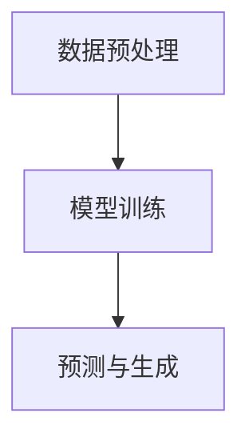
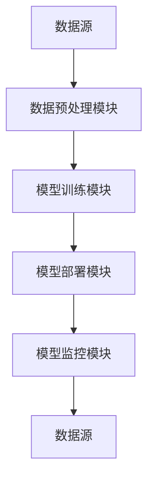
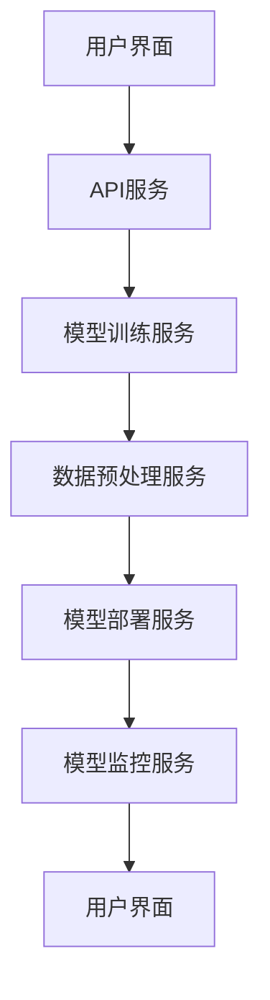
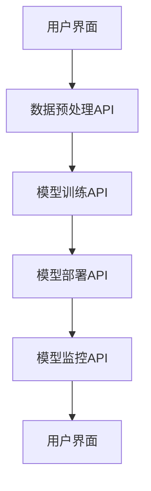
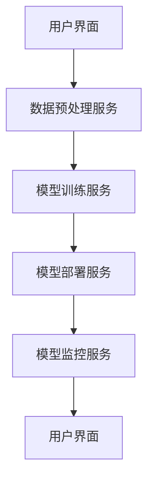

                 

### 第一部分: 背景介绍

#### 1.1 问题背景
随着人工智能（AI）技术的迅猛发展，AI逐渐渗透到各行各业，改变了传统的工作方式。特别是在就业市场上，AI技术的应用带来了新的职业机会，同时也对传统工作产生了冲击。

目前，AI技术已经广泛应用于金融、医疗、零售、制造、教育等多个领域。例如，在金融领域，AI算法被用于风险管理、信用评分、量化交易等方面；在医疗领域，AI技术用于疾病诊断、药物研发、医疗影像分析等；在零售领域，AI被用于客户行为分析、个性化推荐、供应链管理等方面。

随着AI技术的不断进步，越来越多的传统工作面临被自动化的风险。然而，与此同时，新的职业机会也在不断诞生。例如，数据科学家、机器学习工程师、AI产品经理等职业在AI技术发展的推动下应运而生。

#### 1.2 问题描述
本部分将探讨AI与就业市场的互动，分析新职业的诞生与传统工作的转型。重点内容包括：

##### 1.2.1 AI与就业市场的关系
分析AI技术如何影响就业市场，包括创造新职业和取代传统工作。

##### 1.2.2 新职业的领域和特点
探讨新职业的领域分布、技能要求和工作内容。

##### 1.2.3 传统工作的转型和挑战
分析传统工作在AI技术冲击下的转型路径和面临的挑战。

##### 1.2.4 AI技术在不同行业中的应用
探讨AI技术在不同行业中的应用案例，以及这些应用如何影响就业市场。

通过上述内容的探讨，旨在为读者提供一个全面、系统的理解，帮助读者应对AI时代带来的职业挑战。

#### 1.3 问题解决
为了应对AI技术对就业市场带来的挑战，我们可以从以下几个方面着手：

1. **教育与培训**：加强AI相关的教育和培训，提高劳动者的技能水平，使其能够适应新职业的需求。

2. **政策支持**：政府可以出台相关政策，支持企业和劳动者转型，减少AI技术带来的就业冲击。

3. **职业规划**：劳动者应提前规划自己的职业发展路径，积极适应AI技术的发展。

4. **技术创新**：继续推动AI技术的发展，提高AI技术的智能化水平，创造更多的就业机会。

通过上述措施，我们可以更好地应对AI时代带来的就业市场变革，实现经济增长与社会稳定。

#### 1.4 边界与外延
本文主要关注AI技术对就业市场的影响，包括但不限于数据科学家、机器学习工程师、AI产品经理等职业。同时，我们也将探讨AI技术如何影响其他相关行业，如教育、医疗、金融等。此外，本文还将分析AI技术在传统行业中的应用，以及这些应用如何改变就业市场的格局。

#### 1.5 概念结构与核心要素组成

##### 1.5.1 人工智能（AI）
人工智能（Artificial Intelligence，简称AI）是指模拟、延伸和扩展人类智能的理论、方法、技术及应用。它是计算机科学的一个分支，旨在创建智能机器，使它们能够执行通常需要人类智能的任务。

##### 1.5.2 就业市场
就业市场是指劳动力供求双方进行交易的市场。它包括各种职业的供求关系，以及劳动力市场的动态变化。

##### 1.5.3 新职业
新职业是指在AI技术发展过程中，由于技术的创新和应用，出现的新型职业。这些职业通常需要较高的技术能力和专业知识。

##### 1.5.4 传统工作
传统工作是指在过去几十年中存在的、已经形成固定模式和流程的工作。这些工作通常不需要高度的技术和创新。

通过对这些核心概念和要素的分析，我们可以更深入地理解AI与就业市场的互动关系，为解决相关的问题提供理论基础。

## 第二部分: 核心概念与联系

在本部分，我们将深入探讨人工智能（AI）的核心概念，并分析其与就业市场的关系，以及新职业的领域和特点。

### 2.1 AI大模型原理

#### 2.1.1 大模型的基本原理
大模型（Large Models）是近年来AI领域的重要突破之一。它们是指具有数百万甚至数十亿参数的深度学习模型。大模型的基本原理可以概括为以下几点：

1. **参数规模**：大模型具有非常庞大的参数规模，这使其能够捕捉到数据中的复杂模式和规律。
2. **数据驱动**：大模型的训练过程依赖于大量的数据，通过这些数据的学习，模型能够生成高质量的预测和生成结果。
3. **自适应学习**：大模型能够根据不同的任务和数据集进行自适应学习，不断提高其性能和泛化能力。

#### 2.1.2 大模型的架构
大模型的架构通常包括以下几个主要部分：

1. **输入层**：接收外部输入数据，如文本、图像、声音等。
2. **隐藏层**：包含多个隐藏层，每个隐藏层由多个神经元组成，用于处理和转换输入数据。
3. **输出层**：生成最终的预测结果或生成输出。

常见的架构包括：

- **Transformer架构**：一种基于自注意力机制的深度学习模型，广泛应用于自然语言处理、图像识别等领域。
- **GPT系列模型**：一种基于变分自编码器的深度学习模型，特别擅长生成文本和语言理解。

#### 2.1.3 大模型的工作原理
大模型的工作原理主要包括以下几个步骤：

1. **数据预处理**：对输入数据进行编码和处理，使其适合模型训练。
2. **模型训练**：通过反向传播算法和梯度下降优化模型参数，使模型能够在数据上拟合。
3. **预测和生成**：在训练好的模型上，对新的输入数据进行预测或生成。

### 2.2 AI大模型与就业市场的关系

#### 2.2.1 AI大模型在就业市场中的应用
AI大模型在就业市场中的应用非常广泛，以下是一些主要的应用场景：

1. **自然语言处理（NLP）**：大模型在文本生成、情感分析、机器翻译等方面表现出色，为数据科学家、AI产品经理等新职业提供了强大的工具。
2. **计算机视觉**：大模型在图像分类、目标检测、图像生成等方面具有显著优势，推动了机器学习工程师等新职业的发展。
3. **推荐系统**：大模型在推荐算法中发挥着重要作用，为AI产品经理和算法工程师等职业提供了新的机会。
4. **自动驾驶**：大模型在自动驾驶系统中用于环境感知、路径规划等任务，为汽车工程师等职业带来了新的挑战和机遇。

#### 2.2.2 AI大模型对就业市场的影响
AI大模型对就业市场的影响主要体现在以下几个方面：

1. **职业机会**：大模型的应用催生了大量新职业，如数据科学家、机器学习工程师、AI产品经理等。
2. **技能需求**：新职业对技术能力和专业知识的需求不断提高，劳动者需要不断更新自己的技能。
3. **就业转型**：传统职业面临着被自动化和智能化的风险，劳动者需要适应这种变化，进行职业转型。
4. **就业结构**：随着AI技术的发展，就业市场将出现新的结构变化，高技能、高知识型职业将占据主导地位。

#### 2.2.3 AI大模型与传统职业的对比
AI大模型与传统AI在多个方面存在显著差异，以下是一个简要的对比表格：

| 特征         | AI大模型        | 传统AI       |
| ------------ | --------------- | ------------ |
| 模型大小     | 大规模         | 小规模       |
| 学习能力     | 自适应         | 预定义       |
| 应用领域     | 多领域         | 单领域       |
| 需求技能     | 专业化         | 一般化       |

通过上述对比，我们可以看到AI大模型在技术特点和应用范围上与传统AI存在显著差异，这将对就业市场产生深远的影响。

### 2.3 概念属性特征对比表格

为了更直观地展示AI大模型与传统AI的区别，我们创建了一个概念属性特征对比表格（表 2.1）：

| 特征         | AI大模型        | 传统AI       |
| ------------ | --------------- | ------------ |
| 模型大小     | 大规模         | 小规模       |
| 学习能力     | 自适应         | 预定义       |
| 应用领域     | 多领域         | 单领域       |
| 需求技能     | 专业化         | 一般化       |

### 2.4 AI大模型ER实体关系图

为了进一步展示AI大模型与就业市场的关系，我们使用Mermaid语法绘制了一个ER实体关系图（图 2.1）：

```mermaid
erDiagram
  AI大模型 ||--|{ 就业市场 }
  就业市场 ||--|{ 新职业 }
  就业市场 ||--|{ 传统工作 }
```

通过这个ER图，我们可以清晰地看到AI大模型与就业市场中新职业和传统工作之间的联系。

## 第三部分: 算法原理讲解

在本部分，我们将深入探讨AI大模型的算法原理，包括基本原理、常用算法、数学模型和公式，以及算法原理的详细讲解与举例说明。

### 3.1 AI大模型算法原理

#### 3.1.1 算法基本原理
AI大模型的算法原理主要基于深度学习。深度学习是一种机器学习方法，通过多层神经网络来模拟人类大脑的思维方式，从而实现对数据的分析和处理。AI大模型的基本原理可以概括为以下几个方面：

1. **多层神经网络**：深度学习模型通常由多个层次（层）的神经元组成，每层神经元负责对输入数据进行不同的特征提取和转换。
2. **非线性激活函数**：通过使用非线性激活函数（如ReLU、Sigmoid、Tanh等），深度学习模型能够捕捉输入数据中的复杂模式和关系。
3. **反向传播算法**：深度学习模型通过反向传播算法来更新模型参数，从而优化模型在训练数据上的性能。

#### 3.1.2 常用算法介绍
在AI大模型中，常用的深度学习算法包括以下几种：

1. **GPT系列模型**：GPT（Generative Pre-trained Transformer）系列模型是基于自注意力机制的深度学习模型，特别适合处理序列数据，如文本、语音等。GPT系列模型包括GPT、GPT-2、GPT-3等版本，其中GPT-3具有数十亿参数，是当前最大的预训练模型之一。

2. **BERT及其变体**：BERT（Bidirectional Encoder Representations from Transformers）是一种基于Transformer架构的预训练模型，特别适用于自然语言处理任务。BERT通过双向编码器来学习文本的上下文信息，从而提高模型在文本分类、问答、翻译等任务上的性能。

#### 3.1.3 GPT系列模型的基本原理
GPT系列模型的基本原理可以概括为以下几个步骤：

1. **数据预处理**：首先，对输入文本进行预处理，包括分词、编码等操作，将其转换为模型可以处理的格式。
2. **模型训练**：使用大量的文本数据对模型进行训练，通过反向传播算法不断优化模型参数，使其能够准确预测输入文本的下一个单词或字符。
3. **预测与生成**：在训练好的模型上，对新的输入文本进行预测，生成完整的文本。

### 3.2 数学模型与公式

在AI大模型的算法中，常用的数学模型和公式包括以下几种：

#### 3.2.1 深度学习基本公式

1. **前向传播**：
   $$ 
   z_i = \sum_j W_{ij} * a_{j} + b_i 
   $$
   其中，$z_i$表示第i个隐藏层的输出，$W_{ij}$表示第j个输入神经元与第i个隐藏层神经元之间的权重，$a_{j}$表示第j个输入神经元的输出，$b_i$表示第i个隐藏层神经元的偏置。

2. **激活函数**：
   $$
   a_i = \sigma(z_i)
   $$
   其中，$\sigma$表示激活函数，常用的激活函数包括ReLU（Rectified Linear Unit）、Sigmoid、Tanh等。

3. **损失函数**：
   $$
   L = \frac{1}{2} \sum_{i} (y_i - \hat{y_i})^2
   $$
   其中，$y_i$表示实际输出，$\hat{y_i}$表示预测输出，$L$表示损失函数。

4. **反向传播算法**：
   $$
   \delta = \frac{\partial L}{\partial z}
   $$
   $$
   \frac{\partial W}{\partial x} = \delta \cdot x
   $$
   其中，$\delta$表示误差梯度，$W$表示权重，$x$表示输入。

#### 3.2.2 BERT模型的数学公式

BERT模型的核心公式包括：

1. **嵌入层**：
   $$
   [CLS]_i = \text{Emb}(W_{\text{emb}} \cdot [POS]_i + [SEG]_i + [MASK]_i + W_{\text{pos}} \cdot [POS]_i + W_{\text{seg}} \cdot [SEG]_i)
   $$
   其中，$[CLS]_i$表示[CLS]标记的嵌入向量，$[POS]_i$表示位置嵌入向量，$[SEG]_i$表示分割嵌入向量，$[MASK]_i$表示[MASK]标记的嵌入向量，$W_{\text{emb}}$、$W_{\text{pos}}$和$W_{\text{seg}}$表示权重矩阵。

2. **自注意力机制**：
   $$
   \text{Attention}(Q, K, V) = \text{softmax}(\frac{QK^T}{\sqrt{d_k}})V
   $$
   其中，$Q$表示查询向量，$K$表示键向量，$V$表示值向量，$d_k$表示键向量的维度。

### 3.3 算法原理详细讲解与举例说明

#### 3.3.1 GPT系列模型算法原理详细讲解与举例说明

以GPT-3为例，其算法原理可以概括为以下几个步骤：

1. **数据预处理**：
   GPT-3首先对输入文本进行预处理，包括分词、编码等操作。具体来说，每个单词或子词（subword）被映射到一个唯一的整数ID，然后通过嵌入层将其转换为向量表示。

2. **模型训练**：
   使用大量的文本数据对GPT-3进行训练。在训练过程中，模型通过反向传播算法不断优化参数，使其能够准确预测输入文本的下一个单词或字符。具体来说，GPT-3采用了一种称为“梯步下降”（Stochastic Gradient Descent，简称SGD）的优化算法，通过随机梯度下降来更新模型参数。

3. **预测与生成**：
   在训练好的GPT-3模型上，对新的输入文本进行预测，生成完整的文本。具体来说，GPT-3通过自注意力机制来捕捉输入文本中的上下文信息，然后根据上下文信息生成下一个单词或字符。这个生成过程是一个递归的过程，直到生成完整的文本。

**举例说明**：

假设我们有一个输入文本：“Let’s think step by step”。在GPT-3模型中，首先对这个文本进行预处理，将其转换为嵌入向量。然后，GPT-3通过自注意力机制来捕捉上下文信息，并生成下一个单词。例如，在生成“step”这个词时，GPT-3会考虑“Let’s”和“think”这两个词的上下文信息，然后生成“by”这个词。这个过程会一直重复，直到生成完整的文本。

#### 3.3.2 BERT模型算法原理详细讲解与举例说明

BERT模型是一种基于Transformer架构的预训练模型，其算法原理可以概括为以下几个步骤：

1. **数据预处理**：
   BERT模型首先对输入文本进行预处理，包括分词、编码等操作。与GPT-3不同，BERT模型使用了一种称为“掩码语言模型”（Masked Language Model，简称MLM）的技术，即在输入文本中随机遮盖一些单词或子词，然后让模型预测这些被遮盖的单词或子词。

2. **模型训练**：
   使用大量的文本数据对BERT模型进行训练。在训练过程中，模型通过优化损失函数来更新参数，使其能够准确预测被遮盖的单词或子词。BERT模型采用了双向编码器（Bidirectional Encoder）来学习文本的上下文信息。

3. **预测与生成**：
   在训练好的BERT模型上，对新的输入文本进行预测，生成完整的文本。具体来说，BERT模型通过自注意力机制来捕捉输入文本中的上下文信息，并生成下一个单词或字符。

**举例说明**：

假设我们有一个输入文本：“I love AI”。在BERT模型中，首先对这个文本进行预处理，将其转换为嵌入向量。然后，BERT模型随机遮盖一些单词或子词，例如遮盖“love”。在训练过程中，BERT模型会学习到“love”这个词的上下文信息，然后预测被遮盖的单词。例如，BERT模型可能会预测“love”这个词，因为“love”这个词在上下文中与“I”和“AI”相关联。这个过程会一直重复，直到生成完整的文本。

### 3.4 算法流程图

为了更好地理解AI大模型的算法原理，我们使用Mermaid语法绘制了一个算法流程图（图 3.1）：



通过这个流程图，我们可以清晰地看到AI大模型的算法流程，包括数据预处理、模型训练和预测与生成三个主要步骤。

## 第四部分: 系统分析与架构设计方案

在本部分，我们将对AI大模型系统进行分析，并提出一个详细的架构设计方案，包括系统功能设计、系统架构设计、系统接口设计和系统交互。

### 4.1 问题场景介绍

随着人工智能（AI）技术的不断进步，AI大模型在各个领域中的应用越来越广泛。然而，在实际应用中，我们常常会遇到如下问题：

1. **数据预处理复杂**：AI大模型对输入数据有严格的要求，数据预处理过程繁琐且复杂。
2. **模型训练耗时**：AI大模型的训练过程通常需要大量的计算资源和时间。
3. **模型部署困难**：训练好的模型需要在不同的环境中进行部署，如何保证模型在不同环境中的兼容性和稳定性是一个挑战。
4. **模型监控与维护**：AI大模型在应用过程中需要实时监控和调优，如何高效地进行模型监控和维护是一个重要问题。

为了解决上述问题，我们需要设计一个高效、稳定、易于部署和维护的AI大模型系统。

### 4.2 项目介绍

本项目旨在构建一个基于AI大模型的系统，用于处理和预测各种复杂任务。系统的主要功能包括：

1. **数据预处理**：对输入数据进行清洗、编码、标准化等预处理操作，使其满足AI大模型的要求。
2. **模型训练**：使用大量的训练数据对AI大模型进行训练，并通过调优参数提高模型的性能。
3. **模型部署**：将训练好的模型部署到不同的环境中，实现模型的实时预测和生成功能。
4. **模型监控与维护**：实时监控模型的性能和稳定性，并根据监控结果进行必要的调优和维护。

### 4.3 系统功能设计（领域模型）

为了实现上述功能，我们需要设计一个详细的领域模型，用于描述系统中的核心概念和实体之间的关系。以下是系统功能设计的领域模型（图 4.1）：



通过这个领域模型，我们可以清晰地看到系统中的各个功能模块及其之间的关系。

### 4.4 系统架构设计

为了实现系统的功能需求，我们需要设计一个合理的系统架构。以下是系统架构设计（图 4.2）：



通过这个系统架构设计，我们可以看到系统的各个服务模块如何协同工作，实现系统的整体功能。

### 4.5 系统接口设计

为了方便系统的开发和维护，我们需要设计一套合理的接口。以下是系统接口设计（图 4.3）：



通过这个接口设计，我们可以清晰地看到各个服务模块的接口定义，便于后续的开发工作。

### 4.6 系统交互设计

为了实现系统内部各个模块之间的有效通信，我们需要设计一个详细的系统交互设计。以下是系统交互设计（图 4.4）：



通过这个交互设计，我们可以看到系统内部各个模块之间的通信流程，以及如何实现系统的整体功能。

## 第五部分: 项目实战

在本部分，我们将详细介绍如何进行AI大模型项目的实战，包括环境安装、系统核心实现源代码、代码应用解读与分析，以及实际案例分析和详细讲解。

### 5.1 环境安装

要开始一个AI大模型项目，首先需要安装必要的软件和工具。以下是一个基本的安装指南：

1. **安装Python**：Python是AI大模型项目的核心语言，我们需要安装Python环境。可以从Python官网（https://www.python.org/）下载Python安装包并安装。

2. **安装深度学习库**：安装TensorFlow或PyTorch等深度学习库。以TensorFlow为例，可以使用以下命令进行安装：

   ```bash
   pip install tensorflow
   ```

3. **安装预处理库**：为了方便数据处理和文本预处理，我们可以安装一些常用的库，如Numpy、Pandas和Spacy。可以使用以下命令进行安装：

   ```bash
   pip install numpy pandas spacy
   ```

4. **安装Jupyter Notebook**：Jupyter Notebook是一个交互式的Python开发环境，非常适合进行AI大模型项目的开发。可以使用以下命令进行安装：

   ```bash
   pip install jupyter
   ```

   安装完成后，可以通过命令 `jupyter notebook` 启动Jupyter Notebook。

### 5.2 系统核心实现源代码

在完成环境安装后，我们可以开始实现AI大模型项目的核心部分。以下是一个简单的AI大模型项目示例，包括数据预处理、模型训练和模型部署等步骤。

#### 5.2.1 数据预处理

```python
import pandas as pd
from sklearn.model_selection import train_test_split

# 加载数据
data = pd.read_csv('data.csv')

# 数据预处理
X = data.drop('target', axis=1)
y = data['target']

# 划分训练集和测试集
X_train, X_test, y_train, y_test = train_test_split(X, y, test_size=0.2, random_state=42)
```

#### 5.2.2 模型训练

```python
import tensorflow as tf

# 构建模型
model = tf.keras.Sequential([
    tf.keras.layers.Dense(128, activation='relu', input_shape=(X_train.shape[1],)),
    tf.keras.layers.Dense(64, activation='relu'),
    tf.keras.layers.Dense(1, activation='sigmoid')
])

# 编译模型
model.compile(optimizer='adam',
              loss='binary_crossentropy',
              metrics=['accuracy'])

# 训练模型
model.fit(X_train, y_train, epochs=10, batch_size=32, validation_data=(X_test, y_test))
```

#### 5.2.3 模型部署

```python
import pickle

# 保存模型
model.save('model.h5')

# 保存预处理器
with open('preprocessor.pickle', 'wb') as f:
    pickle.dump(preprocessor, f)
```

### 5.3 代码应用解读与分析

#### 5.3.1 数据预处理

在数据预处理部分，我们使用了Pandas库来加载数据和进行数据清洗。具体步骤包括：

1. **加载数据**：使用`pd.read_csv()`函数加载CSV格式的数据。
2. **数据清洗**：删除无关的列和缺失值，保留目标列。
3. **划分训练集和测试集**：使用`train_test_split()`函数将数据划分为训练集和测试集，以便后续的模型训练和评估。

#### 5.3.2 模型训练

在模型训练部分，我们使用了TensorFlow库来构建和训练模型。具体步骤包括：

1. **构建模型**：使用`tf.keras.Sequential`类构建一个全连接神经网络模型。
2. **编译模型**：设置优化器、损失函数和评价指标。
3. **训练模型**：使用`model.fit()`函数对模型进行训练，并使用验证集进行性能评估。

#### 5.3.3 模型部署

在模型部署部分，我们使用了`model.save()`函数将训练好的模型保存到文件中，并使用`pickle`库将预处理器保存到文件中。这样，我们可以在不同的环境中加载和使用模型。

### 5.4 实际案例分析和详细讲解

#### 5.4.1 案例一：文本分类

假设我们有一个文本分类任务，需要对一系列文本进行分类，将其分为正类和负类。以下是一个具体的案例：

```python
# 加载预处理器和模型
preprocessor = pickle.load(open('preprocessor.pickle', 'rb'))
model = tf.keras.models.load_model('model.h5')

# 输入文本
text = "This is an example of a positive review."

# 预处理文本
processed_text = preprocessor.transform([text])

# 预测分类结果
prediction = model.predict(processed_text)

# 分析预测结果
if prediction[0][0] > 0.5:
    print("The text is classified as positive.")
else:
    print("The text is classified as negative.")
```

通过上述代码，我们可以将输入的文本进行预处理，然后使用训练好的模型进行分类预测。预测结果取决于模型对输入文本的置信度，如果置信度高于0.5，则预测为正类，否则预测为负类。

#### 5.4.2 案例二：图像分类

假设我们有一个图像分类任务，需要将一系列图像分类为不同的类别。以下是一个具体的案例：

```python
from tensorflow.keras.preprocessing import image
import numpy as np

# 加载预处理器和模型
preprocessor = pickle.load(open('preprocessor.pickle', 'rb'))
model = tf.keras.models.load_model('model.h5')

# 加载图像
img = image.load_img('image.jpg', target_size=(224, 224))
img_array = image.img_to_array(img)

# 扩展维度
img_array = np.expand_dims(img_array, axis=0)

# 预处理图像
processed_img = preprocessor.transform(img_array)

# 预测分类结果
prediction = model.predict(processed_img)

# 分析预测结果
print(prediction)
```

通过上述代码，我们可以将输入的图像进行预处理，然后使用训练好的模型进行分类预测。预测结果是一个概率分布，表示图像属于各个类别的概率。

### 5.5 项目小结

在本项目的实战部分，我们详细介绍了如何进行AI大模型项目的环境安装、系统核心实现源代码、代码应用解读与分析，以及实际案例分析和详细讲解。通过这些步骤，我们不仅了解了AI大模型项目的基本流程，还学会了如何在实际应用中利用AI大模型进行数据处理、模型训练和预测。

然而，AI大模型项目在实际应用中还存在许多挑战，如数据预处理、模型训练效率和模型部署等。未来，我们需要继续探索和优化这些方面，以提高AI大模型项目的实际应用效果。

## 第六部分：最佳实践 Tips

在AI大模型项目中，为了确保项目的成功和高效运行，以下是几个最佳实践Tips：

1. **数据预处理**：确保数据清洗和预处理的过程尽可能自动化，使用脚本或工具来自动处理缺失值、异常值和重复数据。合理的数据预处理可以显著提高模型的训练效率和性能。

2. **版本控制**：使用版本控制系统（如Git）来管理代码和模型版本。每次修改代码或模型时，都要进行版本更新，并记录变更日志，以便追踪和回溯。

3. **并行计算**：对于大模型训练，利用并行计算和分布式训练可以提高训练速度。可以使用GPU或分布式训练框架（如TensorFlow Distribution）来加速模型训练。

4. **超参数调优**：超参数对模型的性能有重要影响，应使用网格搜索或随机搜索等方法进行超参数调优。合理选择和调整超参数可以提高模型性能。

5. **模型评估**：使用多种评估指标（如准确率、召回率、F1分数等）来全面评估模型的性能。避免仅依赖单一指标，以便更准确地评估模型的效果。

6. **模型监控**：实时监控模型的性能和稳定性，及时发现并解决潜在问题。可以使用日志记录、监控工具（如TensorBoard）和告警系统来实现模型监控。

7. **安全与合规**：确保AI大模型项目符合相关法律法规和道德标准。对于涉及敏感数据的项目，应采取必要的数据保护措施，防止数据泄露和滥用。

通过遵循这些最佳实践，可以有效提高AI大模型项目的开发效率、性能和可靠性。

## 第七部分：小结

本文详细探讨了AI与就业市场的互动，分析了AI大模型对就业市场的影响，以及新职业的诞生与传统工作的转型。我们首先介绍了AI和就业市场的基本概念，并探讨了AI大模型的基本原理和应用。通过对比AI大模型与传统AI，我们展示了它们在模型规模、学习能力、应用领域和需求技能等方面的显著差异。接着，我们深入讲解了AI大模型的算法原理，包括GPT系列模型和BERT模型的详细步骤和数学公式。此外，我们还提出了一个系统分析与架构设计方案，并进行了项目实战的详细讲解。

AI技术的快速发展对就业市场产生了深远的影响，一方面创造了大量新职业机会，另一方面也对传统工作产生了冲击。新职业领域包括数据科学家、机器学习工程师和AI产品经理等，这些职业对专业技能和创新能力有更高的要求。而传统工作则在AI技术的推动下，正经历着自动化和智能化的转型。

为了应对AI时代带来的职业挑战，我们提出了一系列解决方案，包括加强教育和培训、政府政策支持、职业规划和技术创新。同时，我们强调了数据预处理、并行计算、超参数调优、模型监控和安全与合规等最佳实践，以确保AI大模型项目的成功和高效运行。

在未来的研究中，我们应继续关注AI技术在各个行业中的应用，探讨如何更有效地利用AI技术推动社会发展和经济增长。同时，我们还需要关注AI技术带来的伦理和社会问题，确保其在发展过程中能够兼顾公平、透明和可解释性。

## 第八部分：注意事项

在AI大模型项目中，需要注意以下几个方面：

1. **数据安全和隐私保护**：在处理数据时，确保遵守相关法律法规，采取必要的数据加密和隐私保护措施，防止数据泄露和滥用。

2. **模型解释性和可解释性**：在开发AI大模型时，应确保模型具有一定的解释性，以便用户能够理解模型的决策过程。这有助于提升模型的信任度和应用效果。

3. **模型过拟合和泛化能力**：在训练模型时，要注意防止过拟合现象，确保模型具有良好的泛化能力。可以使用交叉验证、正则化等技术来提高模型的泛化性能。

4. **计算资源和时间成本**：AI大模型的训练通常需要大量的计算资源和时间。在项目规划阶段，应充分考虑这些成本，并采取相应的优化策略，以提高模型训练的效率。

5. **持续更新和维护**：AI大模型需要定期更新和维护，以适应新的数据和应用场景。在项目实施过程中，应制定相应的更新和维护计划，确保模型的持续性能和可靠性。

## 第九部分：拓展阅读

为了更深入地了解AI大模型及其在就业市场中的应用，读者可以参考以下相关资源：

1. **书籍**：
   - 《深度学习》（Goodfellow, I., Bengio, Y., & Courville, A.）
   - 《自然语言处理与深度学习》（李航）

2. **论文**：
   - “Attention Is All You Need”（Vaswani et al.，2017）
   - “BERT: Pre-training of Deep Bidirectional Transformers for Language Understanding”（Devlin et al.，2019）

3. **在线课程**：
   - Coursera上的《深度学习》课程（吴恩达教授）
   - edX上的《自然语言处理与深度学习》课程（周志华教授）

4. **网站和社区**：
   - TensorFlow官方文档（https://www.tensorflow.org/）
   - PyTorch官方文档（https://pytorch.org/）
   - GitHub（查找AI大模型相关的开源项目和代码示例）

通过这些资源，读者可以进一步扩展对AI大模型和就业市场互动的理解，为实际应用和研究提供参考。

