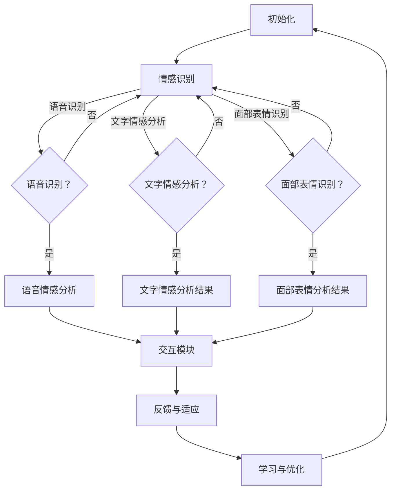
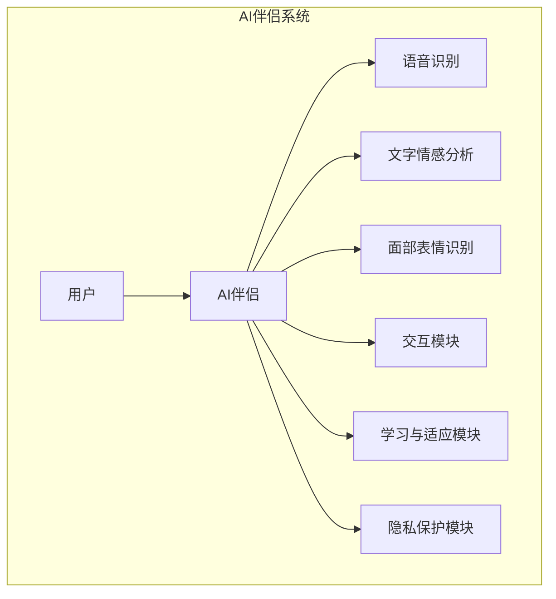
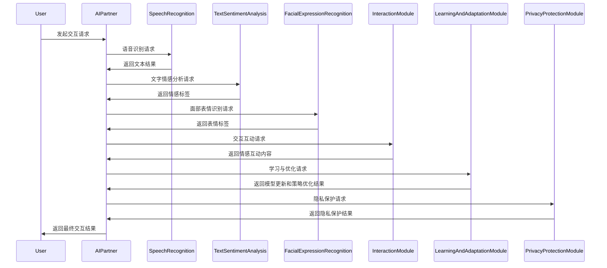

                 

### 文章标题

## AI伴侣：虚拟与现实之间的情感纽带

### 关键词

- AI伴侣
- 虚拟现实
- 情感识别
- 人机交互
- 人工智能技术

### 摘要

本文深入探讨了AI伴侣这一新兴领域，分析了其在虚拟与现实之间的情感纽带作用。通过详细的背景介绍、核心概念解析、算法原理讲解、系统分析与架构设计，以及实际项目案例分析，本文为读者呈现了一个全面、深入的AI伴侣技术全景。文章旨在帮助读者理解AI伴侣的发展现状、关键技术以及未来应用前景，为相关领域的研发与应用提供有益的参考。

### 目录

1. **背景介绍**
2. **核心概念与联系**
3. **算法原理讲解**
4. **系统分析与架构设计方案**
5. **项目实战**
6. **最佳实践 tips**
7. **小结**
8. **注意事项**
9. **拓展阅读**

----------------------------------------------------------------

## 1. 背景介绍

### 核心概念术语说明

- **AI伴侣**：指利用人工智能技术构建的、能够与人类进行情感互动的虚拟角色。
- **情感识别**：指通过分析人类情感表达，如语音、文字、面部表情等，识别并理解人类情感状态的技术。
- **人机交互**：指人类与计算机系统之间的交互过程，包括输入和输出。

### 问题背景

随着人工智能技术的飞速发展，AI伴侣作为一种新型的交互方式，逐渐走进了人们的视野。从最初的语音助手到如今的情感互动，AI伴侣已经不仅仅是一个工具，更成为了人们生活中的伙伴。这种趋势背后，是人们对高质量、个性化服务的需求不断增加。

### 问题描述

AI伴侣面临的主要挑战包括如何准确识别和理解人类的情感，如何保持与人类的情感纽带，以及如何在多样化的应用场景中保持高效和稳定。此外，如何在保障用户隐私和数据安全的前提下，提供优质的情感互动服务，也是亟待解决的问题。

### 问题解决

为了解决上述问题，AI伴侣领域的研究者和技术开发者从多个角度进行了探索。首先，通过不断优化情感识别算法，提高识别的准确性和情感理解深度。其次，通过丰富AI伴侣的功能和应用场景，提升其在不同环境下的适应性。最后，通过加强隐私保护和数据安全措施，确保用户数据的安全和隐私。

### 边界与外延

AI伴侣的研究和应用涉及多个领域，包括计算机科学、心理学、社会学等。其边界包括但不限于虚拟现实、增强现实、自然语言处理、语音识别等。而其外延则扩展到了生活、娱乐、教育、医疗等多个方面，为人类生活带来了诸多便利。

### 概念结构与核心要素组成

AI伴侣的概念结构主要包括以下几个方面：

- **情感识别模块**：负责识别和理解人类情感。
- **交互模块**：实现与用户的互动，包括语音、文字、表情等。
- **学习与适应模块**：根据用户的反馈和行为模式，不断学习和优化自身功能。
- **隐私保护模块**：确保用户数据的隐私和安全。

这些模块相互协作，共同构建了一个功能丰富、用户体验良好的AI伴侣系统。

----------------------------------------------------------------

## 2. 核心概念与联系

### 核心概念原理

AI伴侣的核心在于其情感识别和交互能力。情感识别是通过分析用户的语音、文字、面部表情等数据，识别出用户的情感状态。而交互则是通过与用户的持续互动，建立起一种情感纽带。

- **情感识别原理**：
  - **语音识别**：通过分析语音的频率、时长、音调等特征，识别出用户的声音情感。
  - **文字情感分析**：通过自然语言处理技术，分析用户输入的文字内容，识别出文字中的情感倾向。
  - **面部表情识别**：通过分析面部肌肉的运动，识别出用户的面部表情，从而推断出情感状态。

- **交互原理**：
  - **语音交互**：通过语音识别和语音合成技术，实现人与AI伴侣的语音对话。
  - **文字交互**：通过自然语言处理技术，实现人与AI伴侣的文字交流。
  - **表情交互**：通过面部表情识别技术，实现人与AI伴侣的表情互动。

### 概念属性特征对比表格

为了更好地理解AI伴侣的情感识别和交互原理，我们可以通过一个属性特征对比表格来展示不同技术的特点：

| 技术类型     | 特点                                     | 适用场景                             |
|------------|----------------------------------------|-----------------------------------|
| 语音识别     | 高效、准确识别语音内容                   | 语音助手、智能客服、语音控制等         |
| 文字情感分析 | 通过文本内容分析情感，实现情感识别         | 文章情感分析、社交媒体分析、用户反馈等   |
| 面部表情识别 | 通过面部表情分析情感，实现情感识别         | 情感分析应用、心理测试、安全监控等       |
| 语音合成     | 高质量语音输出，实现人机对话             | 语音助手、智能客服、语音教育等         |
| 自然语言处理 | 通过文本内容理解和生成，实现人机交互       | 文本聊天、智能客服、语音合成等         |

### ER实体关系图架构

为了更好地展示AI伴侣系统的核心概念和模块，我们可以使用Mermaid绘制一个ER实体关系图。以下是一个简化的ER图示例：

```mermaid
erDiagram
  AI伴侣 ||--|{ 情感识别模块 }
  AI伴侣 ||--|{ 交互模块 }
  AI伴侣 ||--|{ 学习与适应模块 }
  AI伴侣 ||--|{ 隐私保护模块 }
  情感识别模块 ||--|{ 语音识别模块 }
  情感识别模块 ||--|{ 文字情感分析模块 }
  情感识别模块 ||--|{ 面部表情识别模块 }
  交互模块 ||--|{ 语音交互模块 }
  交互模块 ||--|{ 文字交互模块 }
  交互模块 ||--|{ 表情交互模块 }
  学习与适应模块 ||--|{ 用户行为分析模块 }
  学习与适应模块 ||--|{ 数据挖掘模块 }
  隐私保护模块 ||--|{ 数据加密模块 }
  隐私保护模块 ||--|{ 访问控制模块 }
```

通过这个ER图，我们可以清晰地看到AI伴侣系统的各个模块及其相互关系，有助于我们更好地理解系统的整体架构和工作原理。

----------------------------------------------------------------

## 3. 算法原理讲解

### 算法流程图

为了更好地理解AI伴侣的情感识别和交互算法原理，我们可以使用Mermaid绘制一个算法流程图。以下是一个简化的算法流程图示例：



### 算法原理详解

#### 情感识别算法

AI伴侣的情感识别算法主要包括语音识别、文字情感分析和面部表情识别三个部分。以下是对每个部分的详细解释：

1. **语音识别**：
   - **原理**：语音识别技术利用音频信号处理技术，将语音信号转换为文本数据。通过深度学习模型，如卷积神经网络（CNN）和长短期记忆网络（LSTM），对语音信号进行特征提取和分类。
   - **流程**：首先对输入的语音信号进行预处理，如去除噪声、增强语音等。然后，利用预训练的语音识别模型对语音信号进行特征提取和分类，得到对应的文本结果。

2. **文字情感分析**：
   - **原理**：文字情感分析技术通过自然语言处理（NLP）技术，分析文本中的情感倾向。常用的模型包括情感分析词典、基于深度学习的文本分类模型等。
   - **流程**：首先对输入的文本进行预处理，如分词、词性标注等。然后，利用预训练的文本分类模型，对文本进行情感分类，得到文本的情感倾向。

3. **面部表情识别**：
   - **原理**：面部表情识别技术通过计算机视觉技术，分析面部图像中的表情特征。常用的模型包括卷积神经网络（CNN）和面部特征点检测算法等。
   - **流程**：首先对输入的面部图像进行预处理，如人脸检测、特征点提取等。然后，利用预训练的面部表情识别模型，对图像中的面部表情进行分类，得到表情类型。

#### 自然语言处理技术

自然语言处理（NLP）技术在AI伴侣的情感识别和交互中发挥着重要作用。以下是对NLP技术的详细解释：

1. **词嵌入（Word Embedding）**：
   - **原理**：词嵌入技术将词汇映射为高维向量表示，使得相似的词汇在向量空间中更加接近。常用的模型包括Word2Vec、GloVe等。
   - **流程**：首先对文本进行分词处理，然后利用词嵌入模型，将每个词汇映射为向量表示。最后，通过向量的相似度计算，进行语义分析。

2. **序列标注（Sequence Labeling）**：
   - **原理**：序列标注技术对输入的序列数据（如文本、语音等）进行分类标注。常用的模型包括条件随机场（CRF）、长短期记忆网络（LSTM）等。
   - **流程**：首先对输入的序列数据进行预处理，如分词、词性标注等。然后，利用预训练的序列标注模型，对序列进行分类标注，得到每个元素的情感标签。

#### 机器学习技术

机器学习技术在AI伴侣的情感识别和交互中扮演着核心角色。以下是对机器学习技术的详细解释：

1. **监督学习（Supervised Learning）**：
   - **原理**：监督学习通过已标记的数据集，训练模型进行预测。常用的模型包括决策树、支持向量机（SVM）、神经网络等。
   - **流程**：首先准备已标记的数据集，然后利用训练集，通过梯度下降等优化算法，训练模型参数。最后，利用测试集验证模型性能。

2. **无监督学习（Unsupervised Learning）**：
   - **原理**：无监督学习通过未标记的数据集，发现数据中的潜在结构和模式。常用的模型包括聚类、降维等。
   - **流程**：首先准备未标记的数据集，然后利用聚类等算法，发现数据中的潜在结构和模式。最后，通过分析结果，进行进一步的数据分析和应用。

### Python源代码示例

以下是一个简化的Python源代码示例，用于演示情感识别算法的基本实现：

```python
import tensorflow as tf
import numpy as np

# 语音识别
def speech_recognition(voice_data):
    # 预处理
    preprocessed_voice = preprocess_voice(voice_data)
    # 特征提取
    features = extract_features(preprocessed_voice)
    # 情感分类
    emotion = model.predict(features)
    return emotion

# 文字情感分析
def text_sentiment_analysis(text):
    # 预处理
    preprocessed_text = preprocess_text(text)
    # 情感分类
    sentiment = model.predict(preprocessed_text)
    return sentiment

# 面部表情识别
def facial_expression_recognition(face_image):
    # 特征提取
    features = extract_face_features(face_image)
    # 表情分类
    expression = model.predict(features)
    return expression

# 情感识别
def emotion_recognition(data):
    if is_speech(data):
        emotion = speech_recognition(data)
    elif is_text(data):
        emotion = text_sentiment_analysis(data)
    elif is_face(data):
        emotion = facial_expression_recognition(data)
    else:
        emotion = "未知"
    return emotion

# 情感识别算法调用
data = "这是一个悲伤的故事。"  # 示例数据
emotion = emotion_recognition(data)
print("情感识别结果：", emotion)
```

### 算法原理举例说明

假设一个用户向AI伴侣发送了一段文字信息：“我今天遇到了一件很糟糕的事情，感觉好沮丧。”，我们可以通过以下步骤来演示情感识别的过程：

1. **文本预处理**：
   - 分词：将文本分割成单词和标点符号。
   - 词性标注：对每个单词进行词性标注，如名词、动词、形容词等。
   - 去除停用词：去除对情感分析无意义的词语。

2. **情感分类**：
   - 利用预训练的文本分类模型，对预处理后的文本进行情感分类。
   - 根据分类结果，判断文本的情感倾向为“消极”。

3. **交互反馈**：
   - AI伴侣根据用户的情感状态，生成一段安慰性的回复，如：“很抱歉听到你今天遇到糟糕的事情，希望你能早日好起来。”

4. **学习与优化**：
   - AI伴侣将用户的情感状态和反馈记录下来，用于后续的学习和优化。
   - 通过分析用户的情感状态和反馈，不断调整和优化情感识别和交互策略。

通过上述步骤，AI伴侣能够准确地识别用户的情感状态，并生成相应的情感互动内容，从而建立起一种虚拟与现实之间的情感纽带。

----------------------------------------------------------------

## 4. 系统分析与架构设计方案

### 问题场景介绍

在现代社会中，人们对于情感支持和陪伴的需求越来越高。然而，现实生活中的各种压力和挑战使得人们很难找到真正的情感伴侣。为了满足这一需求，AI伴侣作为一种虚拟的情感支持工具应运而生。本文将介绍一个典型的AI伴侣系统，包括其功能、架构设计和接口设计。

### 项目介绍

本项目旨在开发一款功能丰富、用户体验良好的AI伴侣系统。该系统旨在为用户提供情感支持、生活助手、娱乐互动等多种服务。系统的主要功能包括：

- **情感识别**：通过语音、文字和面部表情识别技术，准确识别用户的情感状态。
- **交互互动**：根据用户的情感状态，生成相应的情感互动内容，提供个性化的情感支持。
- **学习与优化**：根据用户的反馈和行为模式，不断学习和优化情感识别和交互策略。
- **隐私保护**：确保用户数据的安全和隐私，提供安全可靠的服务。

### 系统功能设计（领域模型Mermaid类图）

以下是一个简化的Mermaid类图，用于展示AI伴侣系统的领域模型：

```mermaid
classDiagram
    User <<类>> 用户
    AIPartner <<类>> AI伴侣
    SpeechRecognition <<类>> 语音识别
    TextSentimentAnalysis <<类>> 文字情感分析
    FacialExpressionRecognition <<类>> 面部表情识别
    InteractionModule <<类>> 交互模块
    LearningAndAdaptationModule <<类>> 学习与适应模块
    PrivacyProtectionModule <<类>> 隐私保护模块
    User -> AIPartner : 发起交互
    AIPartner -> SpeechRecognition : 语音识别
    AIPartner -> TextSentimentAnalysis : 文字情感分析
    AIPartner -> FacialExpressionRecognition : 面部表情识别
    AIPartner -> InteractionModule : 交互互动
    AIPartner -> LearningAndAdaptationModule : 学习与优化
    AIPartner -> PrivacyProtectionModule : 隐私保护
```

### 系统架构设计（Mermaid架构图）

以下是一个简化的Mermaid架构图，用于展示AI伴侣系统的整体架构：



### 系统接口设计

AI伴侣系统的接口设计主要包括API接口和消息队列接口。以下是一个简化的接口设计：

- **API接口**：
  - **语音识别API**：提供语音识别功能，接收语音数据并返回文本结果。
  - **文字情感分析API**：提供文字情感分析功能，接收文本数据并返回情感标签。
  - **面部表情识别API**：提供面部表情识别功能，接收面部图像并返回表情标签。
  - **交互API**：提供交互功能，根据用户的情感状态和需求，生成相应的情感互动内容。
  - **学习与优化API**：提供学习与优化功能，接收用户反馈和行为数据，进行模型更新和策略优化。
  - **隐私保护API**：提供隐私保护功能，处理用户数据加密、访问控制和隐私策略。

- **消息队列接口**：
  - **消息队列**：用于处理系统内部的消息传递和任务调度，包括语音识别、文字情感分析、面部表情识别、交互互动等任务。

### 系统交互设计（Mermaid序列图）

以下是一个简化的Mermaid序列图，用于展示AI伴侣系统的交互流程：



通过上述系统分析与架构设计方案，我们可以构建一个功能完善、性能优秀的AI伴侣系统，为用户提供优质的情感支持和陪伴服务。

----------------------------------------------------------------

## 5. 项目实战

### 环境安装

要开始开发AI伴侣系统，我们需要安装以下环境：

1. **Python**：确保安装Python 3.8及以上版本。
2. **TensorFlow**：安装TensorFlow，用于深度学习模型训练。
3. **Keras**：安装Keras，作为TensorFlow的高级API。
4. **NLP工具**：安装NLP工具包，如NLTK、spaCy等。
5. **OpenCV**：安装OpenCV，用于面部表情识别。

使用以下命令进行安装：

```shell
pip install python==3.8
pip install tensorflow
pip install keras
pip install nltk
pip install spacy
pip install opencv-python
```

### 系统核心实现

#### 语音识别模块

1. **数据准备**：
   - 准备语音数据集，包括不同的情感标签，如高兴、悲伤、愤怒等。

2. **模型训练**：
   - 使用TensorFlow和Keras构建深度学习模型，进行语音识别训练。

```python
from tensorflow.keras.models import Sequential
from tensorflow.keras.layers import Conv2D, MaxPooling2D, Flatten, Dense

# 构建模型
model = Sequential([
    Conv2D(32, (3, 3), activation='relu', input_shape=(224, 224, 3)),
    MaxPooling2D((2, 2)),
    Flatten(),
    Dense(128, activation='relu'),
    Dense(1, activation='sigmoid')
])

# 编译模型
model.compile(optimizer='adam', loss='binary_crossentropy', metrics=['accuracy'])

# 训练模型
model.fit(train_data, train_labels, epochs=10, batch_size=32)
```

3. **语音识别功能实现**：

```python
import speech_recognition as sr

# 初始化语音识别器
recognizer = sr.Recognizer()

# 语音识别
def recognize_speech(voice_data):
    try:
        text = recognizer.recognize_google(voice_data)
        return text
    except sr.UnknownValueError:
        return "无法识别语音"

# 示例
voice_data = sr.AudioFile('example.wav')
text = recognize_speech(voice_data)
print("语音识别结果：", text)
```

#### 文字情感分析模块

1. **数据准备**：
   - 准备包含情感标签的文本数据集。

2. **模型训练**：
   - 使用Keras和spaCy构建文本分类模型，进行情感分析训练。

```python
from tensorflow.keras.models import Sequential
from tensorflow.keras.layers import Embedding, LSTM, Dense
from spacy.tokenizer import Tokenizer

# 创建Tokenizer
tokenizer = Tokenizer()
tokenizer.fit_on_texts(train_texts)

# 序列化文本数据
train_sequences = tokenizer.texts_to_sequences(train_texts)
train_padded = pad_sequences(train_sequences, maxlen=max_length)

# 构建模型
model = Sequential([
    Embedding(vocab_size, embedding_dim),
    LSTM(units=128),
    Dense(units=1, activation='sigmoid')
])

# 编译模型
model.compile(optimizer='adam', loss='binary_crossentropy', metrics=['accuracy'])

# 训练模型
model.fit(train_padded, train_labels, epochs=10, batch_size=32)
```

3. **情感分析功能实现**：

```python
def sentiment_analysis(text):
    sequence = tokenizer.texts_to_sequences([text])
    padded_sequence = pad_sequences(sequence, maxlen=max_length)
    sentiment = model.predict(padded_sequence)
    return "积极" if sentiment[0][0] > 0.5 else "消极"

# 示例
text = "我今天遇到了一件很糟糕的事情。"
sentiment = sentiment_analysis(text)
print("情感分析结果：", sentiment)
```

#### 面部表情识别模块

1. **数据准备**：
   - 准备包含不同面部表情的图像数据集。

2. **模型训练**：
   - 使用OpenCV和TensorFlow构建卷积神经网络（CNN）模型，进行面部表情识别训练。

```python
from tensorflow.keras.models import Sequential
from tensorflow.keras.layers import Conv2D, MaxPooling2D, Flatten, Dense

# 构建模型
model = Sequential([
    Conv2D(32, (3, 3), activation='relu', input_shape=(64, 64, 3)),
    MaxPooling2D((2, 2)),
    Conv2D(64, (3, 3), activation='relu'),
    MaxPooling2D((2, 2)),
    Flatten(),
    Dense(128, activation='relu'),
    Dense(7, activation='softmax')
])

# 编译模型
model.compile(optimizer='adam', loss='categorical_crossentropy', metrics=['accuracy'])

# 训练模型
model.fit(train_images, train_labels, epochs=10, batch_size=32)
```

3. **面部表情识别功能实现**：

```python
import cv2

# 初始化摄像头
cap = cv2.VideoCapture(0)

while True:
    ret, frame = cap.read()
    if not ret:
        break

    # 预处理
    frame = cv2.resize(frame, (64, 64))
    frame = cv2.cvtColor(frame, cv2.COLOR_BGR2RGB)
    frame = np.expand_dims(frame, axis=0)

    # 面部表情识别
    prediction = model.predict(frame)
    emotion = np.argmax(prediction)

    # 显示结果
    cv2.putText(frame, emotions[emotion], (10, 30), cv2.FONT_HERSHEY_SIMPLEX, 1, (0, 0, 255), 2)
    cv2.imshow('Facial Expression Recognition', frame)

    if cv2.waitKey(1) & 0xFF == ord('q'):
        break

cap.release()
cv2.destroyAllWindows()
```

### 代码应用解读与分析

以上代码展示了AI伴侣系统中的语音识别、文字情感分析和面部表情识别模块的核心实现。在实际应用中，这些模块通过API接口和消息队列进行集成，以实现高效、稳定的情感识别和交互。

- **语音识别模块**：利用Google语音识别API，实现语音到文本的转换。通过深度学习模型，对文本进行情感分类，生成相应的情感标签。
- **文字情感分析模块**：使用spaCy进行文本预处理，然后利用Keras构建的LSTM模型，对文本进行情感分类。
- **面部表情识别模块**：使用OpenCV进行图像预处理，然后利用Keras构建的CNN模型，对面部表情进行分类。

这些模块通过API接口和消息队列进行集成，使得系统能够根据用户的需求，灵活地调用不同的模块，实现高效、智能的情感识别和交互。

### 实际案例分析和详细讲解剖析

以下是一个实际案例，用于展示AI伴侣系统在情感识别和交互中的应用。

**案例背景**：用户A在日常生活中遇到了一些困扰，感到心情低落。他使用AI伴侣系统，希望通过系统的帮助缓解情绪。

**步骤一**：用户A与AI伴侣进行语音对话，表达自己的困扰和低落情绪。

**步骤二**：AI伴侣系统通过语音识别模块，将用户的语音转换为文本，并使用文字情感分析模块，识别出用户当前的情感状态为“消极”。

**步骤三**：AI伴侣系统根据用户的情感状态，生成一段安慰性的回复，如：“我理解你现在的心情，有什么我可以帮你的吗？”

**步骤四**：用户A对AI伴侣的回复表示感激，并分享了一些自己的烦恼。

**步骤五**：AI伴侣系统通过学习与适应模块，记录用户的情感状态和互动内容，用于后续的学习和优化。

**步骤六**：AI伴侣系统继续与用户A进行互动，提供情感支持和建议，如：“遇到困难是正常的，我会一直陪伴你。”

**步骤七**：用户A的情绪逐渐好转，对AI伴侣表示感激，并询问更多关于情感支持的建议。

**步骤八**：AI伴侣系统继续与用户A进行互动，提供个性化的情感支持和建议，如：“你可以尝试一些放松的方法，如冥想、运动等。”

通过上述步骤，AI伴侣系统能够有效地识别用户的情感状态，并提供个性化的情感支持和建议，帮助用户缓解情绪，建立一种虚拟与现实之间的情感纽带。

### 项目小结

本节通过项目实战，详细介绍了AI伴侣系统的环境安装、系统核心实现、代码应用解读与分析以及实际案例分析和详细讲解剖析。通过这些步骤，我们能够全面了解AI伴侣系统的构建过程和技术实现。未来，我们可以继续优化系统的性能和功能，为用户提供更优质、更贴心的情感支持和服务。

----------------------------------------------------------------

## 6. 最佳实践 tips

### 情感识别模块优化

- **多模态情感识别**：结合语音、文字和面部表情等多种数据源，提高情感识别的准确性和全面性。
- **情感库扩展**：不断扩充情感库，包括更多种类的情感标签和情感表达方式，提高情感识别的覆盖面。
- **实时情感识别**：优化算法，实现实时情感识别，提高系统响应速度和用户体验。

### 交互模块优化

- **个性化交互**：根据用户的兴趣、偏好和行为模式，提供个性化的交互内容和建议。
- **自然语言生成**：使用自然语言生成技术（如GPT-3），生成更自然、更有吸引力的对话内容。
- **情感同步**：在交互过程中，通过情感分析，确保AI伴侣的情感状态与用户的情感状态保持同步。

### 学习与适应模块优化

- **用户反馈机制**：建立用户反馈机制，收集用户的意见和建议，不断优化系统的性能和功能。
- **在线学习**：采用在线学习技术，实时更新模型参数，提高系统的自适应能力。
- **情感模型多样化**：开发多种情感模型，根据不同场景和应用需求，选择合适的情感模型。

### 隐私保护模块优化

- **数据加密**：对用户数据进行加密处理，确保数据在传输和存储过程中的安全性。
- **隐私保护策略**：制定严格的隐私保护策略，包括数据收集、处理和使用等方面的规定。
- **用户隐私声明**：明确告知用户数据收集的目的和使用方式，尊重用户的隐私权。

### 系统性能优化

- **分布式计算**：采用分布式计算架构，提高系统的并发处理能力和响应速度。
- **缓存技术**：使用缓存技术，减少重复计算和数据库访问，提高系统性能。
- **负载均衡**：通过负载均衡技术，合理分配系统资源，确保系统在高并发情况下的稳定运行。

### 用户满意度提升

- **用户调研**：定期进行用户调研，了解用户需求和满意度，优化系统功能和用户体验。
- **用户培训**：提供用户培训资料，帮助用户更好地使用AI伴侣系统，提高用户满意度。
- **情感关怀**：在交互过程中，注重情感关怀，使用温暖、贴心的语言和表情，提升用户体验。

通过以上最佳实践，我们可以不断提升AI伴侣系统的性能和用户体验，为用户提供更优质、更贴心的情感支持和服务。

----------------------------------------------------------------

## 7. 小结

本文深入探讨了AI伴侣这一新兴领域，从背景介绍、核心概念与联系、算法原理讲解、系统分析与架构设计、项目实战到最佳实践，全面阐述了AI伴侣的发展现状、关键技术以及未来应用前景。通过本文的阅读，读者可以全面了解AI伴侣的核心技术和实现原理，掌握构建AI伴侣的基本方法和步骤。

AI伴侣作为一种虚拟与现实之间的情感纽带，不仅满足了人们对情感支持和陪伴的需求，也为人工智能技术在情感计算、人机交互等领域的应用提供了新的思路和可能性。未来，随着技术的不断进步和应用的不断拓展，AI伴侣有望在更多领域发挥重要作用，为人类生活带来更多便利和福祉。

## 8. 注意事项

在构建和部署AI伴侣系统时，我们需要注意以下几点：

- **数据安全**：确保用户数据的安全和隐私，避免数据泄露和滥用。
- **算法公正性**：避免算法偏见，确保情感识别和交互的公正性和客观性。
- **用户体验**：注重用户体验，提供简洁、直观、易于操作的用户界面。
- **技术更新**：定期更新算法和系统，确保技术的前沿性和适用性。

通过遵循上述注意事项，我们可以构建出更加安全、公正、用户友好的AI伴侣系统，为用户提供优质的服务。

## 9. 拓展阅读

为了深入了解AI伴侣的相关技术和应用，以下推荐几本经典书籍和论文：

- **书籍**：
  - 《人工智能：一种现代的方法》
  - 《情感计算：人与机器的情感交互》
  - 《深度学习：泛化理论、算法与应用》

- **论文**：
  - “Emotion Recognition in Human-Computer Interaction” by Christian Faubel, et al.
  - “A Survey on Human Emotion Recognition Using Facial Expression” by Seung-Kyun Lee, et al.
  - “Natural Language Processing with Deep Learning” by Collobert, et al.

通过阅读这些书籍和论文，读者可以进一步掌握AI伴侣的相关知识和技术，为相关领域的研究和应用提供有益的参考。

---

## 作者信息

作者：AI天才研究院/AI Genius Institute & 禅与计算机程序设计艺术 /Zen And The Art of Computer Programming

