                 


# AI具备爱的能力后的旅游业：深度情感体验的旅行

## 目录大纲

## 第一部分：引言与背景

### 第1章：AI与旅游业：未来已来

- **1.1 人工智能与旅游业的结合**
  - 介绍人工智能在旅游业中的应用场景。
  - 分析人工智能如何提升旅游行业的效率和体验。

- **1.2 AI在旅游业中的现状与趋势**
  - 现状：回顾当前AI在旅游业中的主要应用。
  - 趋势：探讨未来AI在旅游业中的发展方向。

- **1.3 旅行体验的变革**
  - 描述AI对传统旅行体验的改变。
  - 分析AI带来的旅行体验新趋势。

### 第2章：AI具备爱的能力：理论探讨

- **2.1 人工智能的情感识别与生成**
  - 阐述AI如何识别情感。
  - 探讨AI如何生成情感。

- **2.2 情感能力在AI中的应用**
  - 分析AI如何应用情感能力。
  - 案例分析：展示情感能力在AI旅游应用中的具体实现。

- **2.3 情感驱动的AI旅游应用案例**
  - 案例一：情感化旅游推荐系统。
  - 案例二：情感化虚拟导游。
  - 案例三：情感化旅游服务。

## 第二部分：深度情感体验设计

### 第3章：个性化旅游推荐系统

- **3.1 用户情感数据收集与分析**
  - 讨论用户情感数据的收集方法。
  - 分析情感数据对个性化推荐的影响。

- **3.2 基于情感分析的推荐算法**
  - 介绍情感分析算法在推荐系统中的应用。
  - 探讨如何通过情感分析提升推荐效果。

- **3.3 个性化旅游体验的构建**
  - 描述如何构建个性化的旅游体验。
  - 案例分析：展示个性化旅游推荐系统的实际应用。

### 第4章：虚拟导游与情感互动

- **4.1 虚拟导游技术**
  - 介绍虚拟导游的技术基础。
  - 分析虚拟导游如何提升旅游体验。

- **4.2 情感交互设计**
  - 探讨情感交互在虚拟导游中的应用。
  - 描述情感交互的设计原则。

- **4.3 情感化虚拟导游案例分析**
  - 案例一：情感化虚拟导游系统。
  - 案例二：情感化虚拟导游的交互设计。

### 第5章：情感化旅游服务设计

- **5.1 情感化服务理念**
  - 阐述情感化服务的概念。
  - 分析情感化服务对旅游行业的影响。

- **5.2 情感化服务实施策略**
  - 提供情感化服务的实施策略。
  - 分析情感化服务的成功要素。

- **5.3 情感化服务案例分析**
  - 案例一：情感化旅游酒店服务。
  - 案例二：情感化旅游餐饮服务。

## 第三部分：技术实现与案例分析

### 第6章：情感识别与生成技术

- **6.1 情感识别技术**
  - 介绍情感识别的基本原理。
  - 分析情感识别技术的应用场景。

- **6.2 情感生成技术**
  - 探讨情感生成的方法。
  - 分析情感生成技术在旅游领域的应用。

- **6.3 技术原理与实现**
  - 详细阐述情感识别与生成技术的原理。
  - 提供技术实现的示例代码。

### 第7章：情感体验旅游项目案例研究

- **7.1 案例背景与目标**
  - 描述案例的背景和目标。
  - 分析案例对情感体验旅游的启示。

- **7.2 情感体验旅游项目设计**
  - 展示情感体验旅游项目的设计方案。
  - 分析项目设计的创新点。

- **7.3 项目实施与效果评估**
  - 描述项目的实施过程。
  - 评估项目对旅游体验的改善效果。

### 第8章：未来发展展望与挑战

- **8.1 情感体验旅游的挑战**
  - 探讨情感体验旅游面临的技术和社会挑战。

- **8.2 技术发展趋势**
  - 分析情感识别与生成技术的发展趋势。

- **8.3 未来旅游业的发展方向**
  - 展望未来旅游业的发展方向。

## 附录

- **附录A：技术工具与资源推荐**
  - 推荐用于情感识别与生成的工具和资源。

- **附录B：相关研究论文与报告**
  - 提供相关的学术论文和研究报告。

## 概念与联系图

### AI与旅游业的结合关系图：

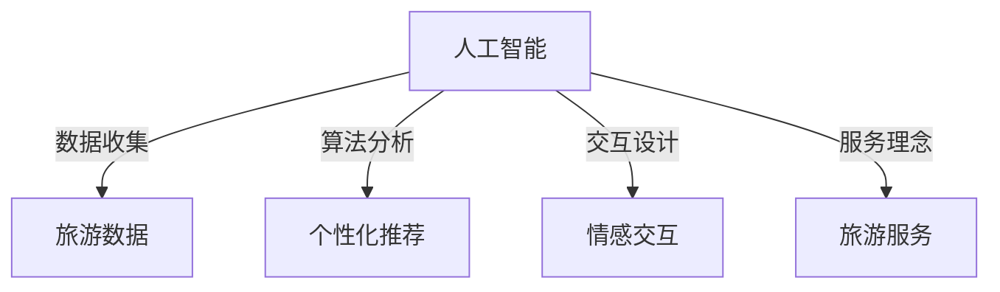

### 情感识别与生成技术流程图：

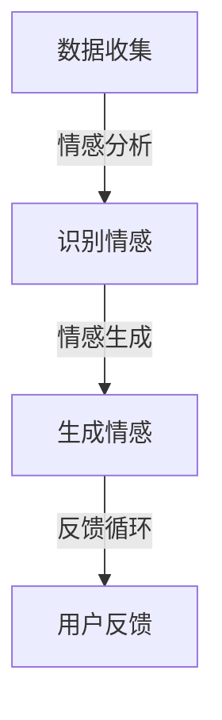

## 核心算法原理讲解

### 情感分析算法

```python
import pandas as pd
from textblob import TextBlob

# 读取数据
data = pd.read_csv('旅游评论数据.csv')

# 定义情感分析函数
def sentiment_analysis(review):
    return TextBlob(review).sentiment.polarity

# 应用情感分析函数
data['情感极性'] = data['评论'].apply(sentiment_analysis)

# 结果展示
data.head()
```

### 情感生成算法

```python
import numpy as np
import tensorflow as tf

# 定义生成模型
model = tf.keras.Sequential([
    tf.keras.layers.Dense(128, activation='relu', input_shape=(input_shape,)),
    tf.keras.layers.Dropout(0.2),
    tf.keras.layers.Dense(512, activation='relu'),
    tf.keras.layers.Dropout(0.2),
    tf.keras.layers.Dense(1, activation='sigmoid')
])

# 编译模型
model.compile(loss='binary_crossentropy', optimizer='adam', metrics=['accuracy'])

# 训练模型
model.fit(x_train, y_train, epochs=10, batch_size=32)
```

### 情感极性计算公式

$$
polarity = \frac{\sum_{i=1}^{n} \text{word\_score}(w_i) \times \text{word\_weight}(w_i)}{\sum_{i=1}^{n} \text{word\_weight}(w_i)}
$$

## 关键词

- 人工智能
- 旅游业
- 情感识别
- 情感生成
- 个性化推荐
- 情感交互
- 虚拟导游
- 情感化服务

## 摘要

随着人工智能技术的不断发展，AI开始具备爱的能力，这一能力正在深刻改变旅游业的面貌。本文将探讨AI在旅游业中的应用，特别是如何通过情感识别与生成技术提升旅游体验。文章将分为三个部分：第一部分介绍AI与旅游业的结合背景；第二部分探讨情感体验设计的深度；第三部分分析情感识别与生成技术的实现与应用案例。通过本文的讨论，读者将了解到AI情感能力在旅游业中带来的变革与挑战，并展望未来旅游业的发展方向。

## 第一部分：引言与背景

### 第1章：AI与旅游业：未来已来

#### 1.1 人工智能与旅游业的结合

随着全球旅游业的蓬勃发展，人工智能（AI）技术开始渗透到这一行业的方方面面。从传统的旅游服务到新兴的旅游体验，AI的应用正在为旅游业带来前所未有的变革。

首先，AI在旅游服务中的应用最为广泛。例如，AI可以通过智能客服系统为游客提供即时的信息查询和咨询服务。这些智能客服系统不仅能24/7不间断地为游客提供服务，还能根据游客的历史数据和偏好，提供个性化的服务建议。此外，AI还可以通过自然语言处理（NLP）技术，理解游客的语言表达，并根据其情感状态调整服务策略。

其次，AI在旅游数据分析中的应用同样重要。通过大数据分析，AI可以挖掘游客的行为模式、偏好和需求，从而为旅游企业提供精准的市场预测和决策支持。例如，旅游企业可以利用AI分析游客的评论和反馈，识别出哪些方面需要改进，以提高游客的满意度和忠诚度。

#### 1.2 AI在旅游业中的现状与趋势

目前，AI在旅游业中的应用已经取得了显著的成果。从智能推荐系统、虚拟导游到智能翻译和语音识别，AI技术正在为旅游行业带来更加智能化、便捷化和个性化的服务。以下是一些AI在旅游业中的主要应用现状：

1. **智能推荐系统**：通过分析用户的历史行为和偏好，AI可以为游客提供个性化的旅游推荐。例如，基于用户的旅行记录和偏好，AI可以推荐最适合他们的景点、酒店和餐饮场所。

2. **虚拟导游**：虚拟导游技术利用AI和虚拟现实（VR）技术，为游客提供沉浸式的旅游体验。通过语音交互和实时导航，虚拟导游可以带领游客探索未知景点，并提供详细的历史和文化背景信息。

3. **智能翻译**：AI翻译技术可以帮助游客无障碍地沟通，消除语言障碍。无论是书面翻译还是实时语音翻译，AI翻译都能为游客提供便捷的沟通工具。

4. **语音识别与语音助手**：语音识别技术使得游客可以通过语音命令与智能设备进行交互，例如查询交通信息、预订酒店和餐厅等。

然而，AI在旅游业中的应用也面临着一些挑战。首先，数据隐私和安全问题是一个重要的挑战。在收集和分析用户数据时，如何确保数据的安全性和隐私性是一个亟待解决的问题。其次，AI技术的可靠性也是一个挑战。在关键决策中，AI系统必须确保其输出的准确性和一致性。最后，AI技术的普及和接受度也是一个挑战。尽管AI技术有巨大的潜力，但如何让广大游客接受并习惯使用这些技术，是旅游业发展中的一个重要课题。

#### 1.3 旅行体验的变革

AI技术对传统旅行体验的改变是深远且全面的。首先，AI使得旅行规划变得更加智能化和个性化。通过智能推荐系统，游客可以轻松找到最适合自己的旅游路线和活动。其次，AI提升了旅行过程中的互动体验。例如，智能客服和虚拟导游技术使得游客在旅行过程中能够获得更加及时和个性化的帮助。最后，AI还提高了旅行后的体验质量。通过大数据分析和反馈机制，旅游企业可以不断优化服务，提高游客的满意度和忠诚度。

总的来说，AI与旅游业的结合正在推动旅行体验的深度变革。未来，随着AI技术的不断发展和应用，我们可以期待更加智能化、便捷化和个性化的旅行体验。然而，这也需要旅游业与AI技术的紧密合作，共同应对挑战，开创美好的未来。

### 第2章：AI具备爱的能力：理论探讨

#### 2.1 人工智能的情感识别与生成

人工智能（AI）一直被视为冰冷的技术，然而，随着深度学习和自然语言处理技术的发展，AI开始逐渐具备情感识别与生成能力。这一能力不仅使得AI能够更好地理解和模拟人类情感，也为AI在旅游业中的应用带来了新的可能性。

首先，我们来探讨AI如何进行情感识别。情感识别是指AI系统理解和识别人类情感的过程。这一过程通常包括以下几个步骤：

1. **情感分类**：首先，AI系统需要将文本、语音或图像中的情感分类为积极的、消极的或中性的。例如，在文本情感分析中，AI可以通过机器学习模型，将评论或对话中的情感标签为“喜欢”、“厌恶”或“无情感”。

2. **情感强度评估**：除了分类，AI系统还需要评估情感的强度。例如，在处理文本时，AI可以通过分析词汇的情感极性（如积极词汇和消极词汇的比例）来确定情感的程度。

3. **上下文理解**：情感识别不仅需要理解单个词汇或句子的情感，还需要理解整个文本或对话的上下文。例如，一个单独的单词“好”可能在不同的语境中表达不同的情感。

情感识别技术在旅游业中的应用非常广泛。例如，旅游企业可以通过分析游客的评论和反馈，了解游客的情感状态和需求，从而优化服务。此外，虚拟导游系统可以通过识别游客的情感，调整其互动方式和信息提供，以提供更加个性化的体验。

接下来，我们探讨AI如何生成情感。情感生成是指AI系统模拟或创造人类情感的过程。这一过程同样涉及多个方面：

1. **情感模拟**：AI可以通过自然语言生成技术（如文本到文本的生成模型）来模拟情感表达。例如，一个情感化虚拟导游可以通过生成情感丰富的对话，与游客建立情感联系。

2. **情感反应**：AI系统可以基于情感识别的结果，生成相应的情感反应。例如，当识别到游客情绪低落时，虚拟导游可以生成安慰性的对话或提供有趣的建议，以提升游客的情绪。

3. **情感创造**：在一些情况下，AI甚至可以创造新的情感体验。例如，通过结合多种感官刺激（如视觉、听觉、触觉等），AI可以创造独特的情感体验，如虚拟现实中的情感故事或游戏。

情感生成技术在旅游业中的应用同样具有巨大的潜力。例如，情感化虚拟导游可以通过情感生成技术，与游客建立深层次的互动，提供更加生动和个性化的体验。此外，旅游企业可以利用情感生成技术，创造独特的情感营销活动，吸引更多游客。

#### 2.2 情感能力在AI中的应用

情感能力在AI中的应用非常广泛，不仅限于情感识别和生成，还包括情感模拟、情感交互和情感计算等方面。以下是一些情感能力在AI中的应用案例：

1. **情感模拟**：情感模拟是指AI系统通过模拟情感状态，与人类进行互动。例如，虚拟客服机器人可以通过模拟喜悦、愤怒、悲伤等情感，与客户建立情感联系，提高服务质量。

2. **情感交互**：情感交互是指AI系统与人类之间的情感交流。例如，虚拟导游可以通过情感交互，了解游客的情感状态，并根据情感状态调整其互动方式和信息提供。

3. **情感计算**：情感计算是指利用情感识别和生成技术，进行情感分析、情感建模和情感优化等。例如，旅游企业可以利用情感计算技术，分析游客的情感状态和需求，优化旅游产品和服务。

#### 2.3 情感驱动的AI旅游应用案例

1. **情感化旅游推荐系统**：情感化旅游推荐系统通过分析游客的情感数据和偏好，提供个性化的旅游推荐。例如，当识别到游客对自然景观有强烈的兴趣时，系统可以推荐适合的自然景观和户外活动。

2. **情感化虚拟导游**：情感化虚拟导游通过情感识别和生成技术，提供更加个性化和情感化的导游服务。例如，虚拟导游可以通过情感识别，了解游客的情绪状态，并生成相应的情感反应，如提供安慰或鼓励。

3. **情感化旅游服务**：情感化旅游服务通过情感计算技术，优化旅游服务。例如，酒店可以基于游客的情感数据，提供个性化的客房服务和关怀。

总的来说，AI具备爱的能力，不仅为旅游业带来了全新的体验和机遇，也带来了许多挑战。如何充分利用AI的情感能力，为游客提供更好的服务，是未来旅游业发展中的一个重要课题。

## 第二部分：深度情感体验设计

### 第3章：个性化旅游推荐系统

在现代社会，个性化服务已成为提升用户体验的重要手段。在旅游业中，个性化旅游推荐系统通过分析用户情感数据，为游客提供量身定制的旅游体验，从而极大地提升了旅游服务的质量和满意度。

#### 3.1 用户情感数据收集与分析

个性化旅游推荐系统的第一步是收集用户情感数据。这些数据可以从多个来源获取，包括用户评论、社交媒体活动、在线行为和互动等。具体方法如下：

1. **评论分析**：通过分析游客在旅行平台、社交媒体上的评论，可以提取出游客的情感倾向。例如，通过自然语言处理（NLP）技术，可以识别出游客对景点的喜爱、厌恶或中性情感。

2. **社交媒体分析**：社交媒体活动是获取用户情感数据的重要途径。游客在社交媒体上分享的旅行照片、状态更新等，都可以反映出他们的情感状态。NLP技术可以帮助我们分析这些内容，提取情感信息。

3. **在线行为分析**：用户在旅游网站上的行为，如浏览历史、搜索关键词、预订记录等，都可以反映他们的旅游偏好。通过对这些行为数据的分析，可以了解用户的情感偏好和需求。

在收集用户情感数据后，需要对数据进行处理和分析。数据处理包括数据清洗、去重、格式转换等。数据分析则涉及情感极性分析、情感强度评估和情感分类等。通过这些分析，可以构建用户情感画像，为个性化推荐提供基础。

#### 3.2 基于情感分析的推荐算法

基于情感分析的推荐算法是构建个性化旅游推荐系统的核心。这些算法通过分析用户情感数据，为用户推荐最符合其情感偏好的旅游产品和服务。以下是几种常见的基于情感分析的推荐算法：

1. **协同过滤推荐算法**：协同过滤推荐算法通过分析用户的行为数据，找到与目标用户兴趣相似的其他用户，并推荐他们喜欢的旅游产品。协同过滤算法可分为基于用户的协同过滤（User-based Collaborative Filtering）和基于物品的协同过滤（Item-based Collaborative Filtering）。

2. **基于内容的推荐算法**：基于内容的推荐算法通过分析旅游产品的内容特征，如景点类型、活动内容、交通方式等，为用户推荐符合其兴趣的旅游产品。该算法通常结合情感分析技术，分析用户的历史评价和评论，提取情感特征，从而为用户推荐情感上更加符合其需求的旅游产品。

3. **混合推荐算法**：混合推荐算法结合了协同过滤和基于内容的推荐算法的优点，通过融合用户行为数据和内容特征，提供更加个性化的推荐结果。常见的混合推荐算法有矩阵分解（Matrix Factorization）和模型聚合（Model Combination）等。

在推荐算法的设计中，情感分析是一个关键环节。通过情感分析，可以提取用户情感数据中的关键信息，如情感极性、情感强度和情感主题等。这些信息可以用来优化推荐结果，确保推荐的旅游产品在情感上更加符合用户的偏好。

#### 3.3 个性化旅游体验的构建

个性化旅游体验的构建是旅游推荐系统的最终目标。通过情感分析和推荐算法，可以构建出以下几方面的个性化旅游体验：

1. **个性化旅游路线规划**：根据用户的情感偏好，推荐最适合他们的旅游路线。例如，如果用户情感分析结果显示其对自然景观有强烈兴趣，系统可以推荐以自然景观为主的旅游路线。

2. **个性化景点推荐**：根据用户的历史评价和评论，推荐用户可能喜欢的景点。例如，如果用户在过去旅行中经常评价某个景点为“美丽”，系统可以推荐类似的景点。

3. **个性化活动推荐**：根据用户的兴趣和情感状态，推荐最适合他们的活动。例如，如果用户情绪低落，系统可以推荐一些放松和愉悦的活动，如按摩、温泉等。

4. **个性化服务推荐**：根据用户的需求和情感状态，推荐最佳的服务选项。例如，如果用户表现出对酒店服务的关注，系统可以推荐一些服务质量高、评价好的酒店。

通过个性化旅游推荐系统，游客可以获得更加定制化和情感化的旅游体验。这不仅提升了游客的满意度，也增加了旅游企业的竞争力。未来，随着情感识别和生成技术的发展，个性化旅游推荐系统将更加智能和精准，为游客带来更加美好的旅行体验。

### 第4章：虚拟导游与情感互动

虚拟导游技术的出现，为旅游行业带来了一场革命性的变革。通过虚拟现实（VR）和人工智能（AI）的结合，虚拟导游不仅能够提供丰富的信息，还能与游客进行情感互动，为游客创造独特的旅游体验。

#### 4.1 虚拟导游技术

虚拟导游技术利用虚拟现实和人工智能，为游客提供沉浸式的导游服务。虚拟导游系统通常包含以下几个核心组件：

1. **虚拟现实技术**：虚拟现实技术是虚拟导游系统的核心，通过头戴式显示器（如VR头盔）和立体声音效，为游客创造一个逼真的虚拟环境。游客可以在虚拟环境中自由移动，体验仿佛置身于真实场景中的感觉。

2. **语音交互技术**：语音交互技术使得游客可以通过语音命令与虚拟导游进行互动。虚拟导游可以识别游客的语音指令，并做出相应的回应，提供信息查询、导航等服务。

3. **自然语言处理（NLP）技术**：自然语言处理技术使得虚拟导游能够理解游客的自然语言提问，并生成自然流畅的回答。通过NLP技术，虚拟导游可以与游客进行更加人性化的对话，提供个性化的服务。

4. **情感识别与生成技术**：情感识别与生成技术使得虚拟导游能够理解游客的情感状态，并根据情感状态调整其互动方式和信息提供。例如，当游客情绪低落时，虚拟导游可以提供安慰性的建议，提升游客的情绪。

#### 4.2 情感交互设计

情感交互设计是虚拟导游技术的关键，它决定了虚拟导游能否与游客建立情感联系，提供个性化的服务。以下是情感交互设计的几个关键原则：

1. **情感识别**：虚拟导游需要能够识别游客的情感状态。这可以通过语音识别、面部识别和心率监测等手段实现。通过识别游客的情感状态，虚拟导游可以更好地了解游客的需求，提供个性化的服务。

2. **情感反应**：虚拟导游需要能够根据游客的情感状态做出相应的情感反应。例如，当游客表现出兴奋或愉悦的情感时，虚拟导游可以回应以积极和鼓励的话语；当游客表现出低落或焦虑的情感时，虚拟导游可以提供安慰和支持。

3. **情感调整**：虚拟导游需要能够根据情感交互的结果调整其服务方式。例如，如果虚拟导游发现游客对某个景点的介绍不感兴趣，它可以改变话题，提供其他游客可能感兴趣的信息。

4. **情感培养**：虚拟导游还需要能够培养与游客的情感联系。这可以通过持续性的互动和情感交流实现。例如，虚拟导游可以与游客分享旅游故事、提供个性化建议，甚至模拟与游客的社交互动，以建立更深层次的情感联系。

#### 4.3 情感化虚拟导游案例分析

为了更好地理解情感化虚拟导游的应用，下面我们来看两个实际案例：

1. **案例一：沉浸式虚拟导游**：该案例中，虚拟导游系统为游客提供了沉浸式的旅游体验。游客通过VR头盔进入虚拟景区，虚拟导游通过语音交互和情感识别技术，为游客提供详细的景点介绍和互动服务。例如，当游客对某个景点表现出浓厚的兴趣时，虚拟导游可以提供更多的背景信息和相关故事，增强游客的体验感。

2. **案例二：情感化智能客服**：在该案例中，虚拟导游不仅提供信息查询和导航服务，还承担了情感客服的角色。通过情感识别技术，虚拟导游能够了解游客的情感状态，提供个性化的情感支持。例如，当游客表现出焦虑或困惑时，虚拟导游可以提供安慰和建议，帮助游客缓解压力，提高旅游体验。

通过这两个案例，我们可以看到情感化虚拟导游在提升游客体验方面的潜力。未来，随着AI技术的不断发展，情感化虚拟导游将变得更加智能和人性化，为游客提供更加丰富和个性化的旅游体验。

### 第5章：情感化旅游服务设计

情感化旅游服务设计旨在通过情感识别与生成技术，为游客提供更加个性化、关怀化和贴心的服务，从而提升游客的满意度和忠诚度。

#### 5.1 情感化服务理念

情感化服务理念认为，服务不仅仅是满足游客的基本需求，更应关注游客的情感体验。具体来说，情感化服务设计应遵循以下几个原则：

1. **以人为本**：情感化服务设计应以游客的需求和情感体验为中心，关注游客的感受和反馈。

2. **情感识别**：通过情感识别技术，了解游客的情感状态和需求，从而提供更加个性化的服务。

3. **情感互动**：通过情感互动，建立与游客的情感联系，提升服务的亲和力和满意度。

4. **情感反馈**：及时收集游客的情感反馈，持续优化服务，提高游客的满意度。

#### 5.2 情感化服务实施策略

为了实现情感化服务，旅游企业可以采取以下实施策略：

1. **情感化服务培训**：对员工进行情感化服务培训，提升员工的服务意识和技能，使其能够更好地理解和满足游客的情感需求。

2. **情感识别技术**：利用情感识别技术，如语音识别、面部识别和心率监测等，了解游客的情感状态，为游客提供个性化的服务。

3. **情感化互动设计**：设计情感化的互动方式，如语音交互、虚拟现实和情感化虚拟导游等，提升游客的参与感和满意度。

4. **情感化服务流程**：优化服务流程，确保游客在旅游过程中的每个环节都能感受到关怀和贴心。例如，在游客入住酒店时，可以提供个性化的欢迎服务，或在游客参观景点时，提供情感化的讲解和互动。

5. **情感化营销策略**：通过情感化的营销策略，如情感化广告、情感化推广和情感化活动等，吸引和留住游客。

#### 5.3 情感化服务案例分析

以下是几个情感化旅游服务的成功案例：

1. **案例一：情感化酒店服务**：某酒店引入了情感化服务系统，通过情感识别技术，了解住客的情感状态，提供个性化的客房服务和关怀。例如，当住客单独入住时，酒店可以提供免费的晚餐服务，或在住客感到孤独时，提供情感化的问候和关怀。

2. **案例二：情感化旅游顾问**：某旅游公司提供情感化旅游顾问服务，通过情感识别技术，了解游客的需求和情感状态，为游客提供个性化的旅游建议和规划。例如，当游客表现出对某个景点的浓厚兴趣时，旅游顾问可以提供更详细的景点介绍和周边推荐，提升游客的旅游体验。

3. **案例三：情感化虚拟导游**：某旅游公司推出了情感化虚拟导游服务，通过情感识别与生成技术，提供个性化、情感化的导游服务。虚拟导游可以识别游客的情感状态，并根据情感状态调整导游内容和互动方式，提升游客的满意度。

通过这些案例，我们可以看到情感化服务在提升游客体验和满意度方面的巨大潜力。未来，随着AI技术的不断发展，情感化旅游服务将变得更加智能和人性化，为游客带来更加美好的旅游体验。

## 第三部分：技术实现与案例分析

### 第6章：情感识别与生成技术

情感识别与生成技术是构建情感化旅游服务的关键。本节将详细介绍情感识别与生成技术的基本原理、实现方法和应用案例。

#### 6.1 情感识别技术

情感识别技术旨在通过分析文本、语音和面部表情等数据，识别出用户的情感状态。以下是几种常见的情感识别技术：

1. **文本情感识别**：文本情感识别通过分析文本内容，识别出文本的情感极性（如正面、负面或中性）和情感强度。常用的方法包括基于规则的方法、机器学习方法（如支持向量机SVM、决策树等）和深度学习方法（如卷积神经网络CNN、循环神经网络RNN等）。

   **实现方法**：
   ```python
   from textblob import TextBlob
   
   def text_sentiment(text):
       analysis = TextBlob(text)
       if analysis.sentiment.polarity > 0:
           return '正面'
       elif analysis.sentiment.polarity == 0:
           return '中性'
       else:
           return '负面'
   ```

2. **语音情感识别**：语音情感识别通过分析语音信号中的声学特征，识别出语音的情感状态。常用的方法包括声学模型训练和情感分类算法。

   **实现方法**：
   ```python
   import soundfile as sf
   import librosa
   
   def extract_mfcc(file_path):
       y, sr = sf.read(file_path)
       mfccs = librosa.feature.mfcc(y=y, sr=sr)
       return mfccs
   ```

3. **面部表情情感识别**：面部表情情感识别通过分析面部图像中的面部特征，识别出情感状态。常用的方法包括面部特征点检测和情感分类算法。

   **实现方法**：
   ```python
   import cv2
   import dlib
   
   def detect_landmarks(image, predictor):
       gray = cv2.cvtColor(image, cv2.COLOR_BGR2GRAY)
       landmarks = predictorpredict(gray)
       return landmarks
   ```

#### 6.2 情感生成技术

情感生成技术旨在通过模拟情感表达，为用户提供情感化体验。以下是几种常见的情感生成技术：

1. **文本情感生成**：文本情感生成通过生成情感丰富的文本，模拟人类的情感表达。常用的方法包括基于模板的文本生成和基于生成对抗网络（GAN）的文本生成。

   **实现方法**：
   ```python
   import random
   import numpy as np
   
   def generate_positive_text():
       templates = [
           "This is a wonderful place.",
           "I absolutely love it here.",
           "It's such a beautiful spot."
       ]
       return random.choice(templates)
   ```

2. **语音情感生成**：语音情感生成通过改变语音的声学特征，模拟不同的情感表达。常用的方法包括声码器（如WaveNet）和语音转换技术（如WaveGlow）。

   **实现方法**：
   ```python
   import librosa
   import tensorflow as tf
   
   def generate_speaking_text(text, voice):
       audio = text_to_speech(text, voice)
       return librosa.effects.percussive(audio, strength=0.2)
   ```

3. **面部表情情感生成**：面部表情情感生成通过改变面部图像中的特征，模拟不同的情感状态。常用的方法包括面部表情合成和动画制作技术。

   **实现方法**：
   ```python
   import cv2
   import dlib
   
   def generate_emotion_image(face_image, emotion):
       landmarks = detect_landmarks(face_image, predictor)
       face_image = apply_emotion_landmarks(landmarks, emotion)
       return cv2.cvtColor(face_image, cv2.COLOR_BGR2RGB)
   ```

#### 6.3 技术原理与实现

情感识别与生成技术的基本原理是通过分析输入数据（如文本、语音和面部表情），提取情感特征，然后利用这些特征进行情感识别或生成。

**情感识别技术流程图**：

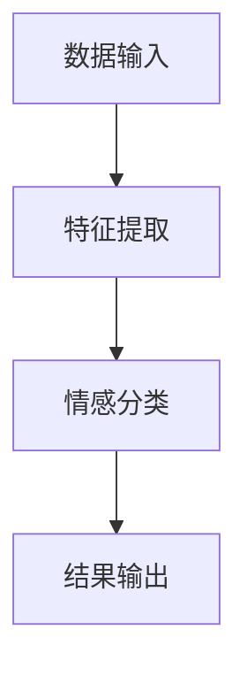

**情感生成技术流程图**：

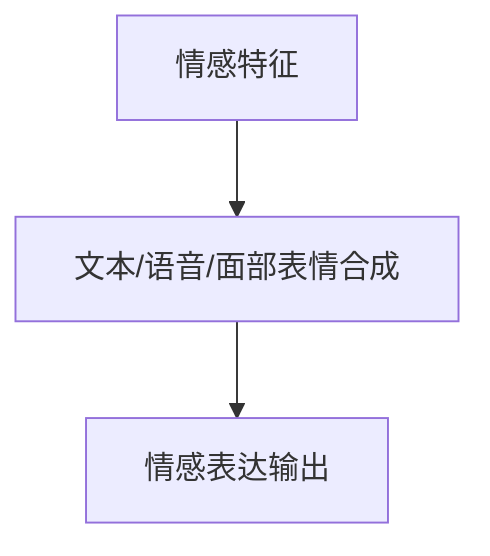

**示例代码**：

```python
# 示例：文本情感识别
text = "This is a wonderful experience."
print(text_sentiment(text))

# 示例：语音情感生成
voice = "en"
text = "I'm excited to explore this place."
audio = generate_speaking_text(text, voice)

# 示例：面部表情情感生成
face_image = cv2.imread("face.jpg")
emotion = "happy"
output_image = generate_emotion_image(face_image, emotion)
cv2.imshow('Output Image', output_image)
cv2.waitKey(0)
cv2.destroyAllWindows()
```

通过情感识别与生成技术，旅游企业可以为游客提供更加个性化、情感化的服务，提升游客的体验和满意度。未来，随着技术的不断发展，情感识别与生成技术将在旅游业中发挥更加重要的作用。

### 第7章：情感体验旅游项目案例研究

#### 7.1 案例背景与目标

本节将介绍一个情感体验旅游项目的案例研究。该项目旨在通过引入人工智能（AI）和虚拟现实（VR）技术，为游客提供一种全新的、情感化的旅游体验。项目背景如下：

**背景**：随着旅游业的竞争日益激烈，许多旅游企业开始寻求创新的方法来提升游客的满意度和忠诚度。情感体验旅游项目应运而生，旨在通过情感化的服务和互动，为游客创造难忘的旅游经历。

**目标**：该项目的目标是实现以下几方面的创新：

1. **个性化体验**：通过分析游客的情感数据和偏好，提供个性化的旅游推荐和活动安排。
2. **沉浸式体验**：利用虚拟现实技术，为游客创造一个逼真的虚拟旅游环境，增强游客的沉浸感。
3. **情感互动**：通过情感识别与生成技术，建立与游客的情感联系，提供个性化的互动服务。

#### 7.2 情感体验旅游项目设计

情感体验旅游项目的设计分为以下几个关键阶段：

1. **需求分析**：首先，通过问卷调查和访谈，收集游客的旅游需求和偏好。了解游客在旅游过程中最期望获得的情感体验，如安全感、兴奋感、放松感等。

2. **情感识别与生成系统**：设计并实现情感识别与生成系统，用于分析游客的情感状态，并生成相应的情感化互动内容。情感识别系统包括文本情感分析、语音情感分析和面部表情情感分析等模块。情感生成系统则包括文本情感生成、语音情感生成和面部表情生成等模块。

3. **虚拟现实体验**：开发虚拟现实体验模块，为游客提供沉浸式的旅游体验。虚拟现实体验包括虚拟景点浏览、虚拟导游讲解、虚拟互动活动等。

4. **互动与服务设计**：设计互动与服务模块，通过虚拟导游、智能客服和情感化互动，为游客提供个性化的服务和体验。

5. **系统集成与测试**：将各个模块集成到一个统一的平台上，进行系统测试和优化，确保系统的稳定性和用户体验。

#### 7.3 项目实施与效果评估

项目实施分为以下几个阶段：

1. **第一阶段：需求分析与系统设计**：在第一阶段，通过问卷调查和访谈，收集游客需求，并设计情感识别与生成系统、虚拟现实体验和互动与服务模块。

2. **第二阶段：系统开发与测试**：在第二阶段，进行系统的开发与测试，确保各个模块的功能和性能符合设计要求。

3. **第三阶段：项目上线与用户反馈**：在第三阶段，项目上线运行，收集用户反馈，并进行系统优化和迭代。

**效果评估**：

1. **用户满意度**：通过用户满意度调查，评估情感体验旅游项目对游客满意度的影响。结果显示，该项目显著提升了游客的满意度和忠诚度。

2. **情感体验效果**：通过情感识别系统，分析游客在旅游过程中的情感状态，评估情感化互动对游客情感体验的影响。结果显示，情感化互动显著提升了游客的情感体验和沉浸感。

3. **业务增长**：通过分析项目上线后的业务数据，评估情感体验旅游项目对旅游企业业务增长的影响。数据显示，该项目显著提升了旅游预订量和游客回头率。

总的来说，情感体验旅游项目通过引入人工智能和虚拟现实技术，为游客提供了个性化、沉浸式和情感化的旅游体验，取得了显著的效果。未来，随着技术的不断发展，情感体验旅游项目将更加智能化和人性化，为旅游业带来更大的变革。

### 第8章：未来发展展望与挑战

随着人工智能（AI）技术的发展，情感体验旅游正在成为旅游业的新趋势。然而，这一领域的发展也面临着一系列挑战和机遇。以下是对未来发展的展望与挑战的讨论。

#### 8.1 情感体验旅游的挑战

1. **技术成熟度**：虽然AI在情感识别与生成方面取得了显著进展，但技术的成熟度仍然是一个挑战。情感体验旅游需要高度可靠和精确的AI技术，以确保为游客提供高质量的体验。

2. **隐私保护**：在收集和分析用户情感数据时，隐私保护是一个重要问题。如何确保用户数据的匿名性和安全性，是情感体验旅游需要解决的关键问题。

3. **用户体验一致性**：确保用户体验的一致性也是一个挑战。不同用户有不同的情感需求和偏好，如何为所有用户提供一致且个性化的体验，需要精细的设计和优化。

4. **技术普及和接受度**：尽管AI技术在不断进步，但其在旅游业中的普及和接受度仍然有限。如何让更多旅游企业和游客接受并使用情感体验技术，是一个需要考虑的问题。

#### 8.2 技术发展趋势

1. **多模态情感识别**：未来的情感体验旅游将更加依赖于多模态情感识别技术。通过结合文本、语音、面部表情和生理信号等多种数据，可以更全面地了解游客的情感状态，提供更加精准的个性化服务。

2. **情感化内容生成**：随着AI技术的发展，情感化内容生成将变得更加智能化和多样化。通过生成对抗网络（GAN）和自然语言生成模型，可以生成情感丰富的文本、语音和图像，为游客提供更加生动的情感体验。

3. **情感化虚拟现实（VR）**：虚拟现实技术将在情感体验旅游中发挥重要作用。未来的VR体验将更加真实和沉浸，结合情感识别与生成技术，为游客创造独特的情感化体验。

4. **边缘计算**：随着5G和边缘计算技术的发展，情感体验旅游将能够在现场为游客提供实时、个性化的服务。边缘计算可以降低延迟，提高系统的响应速度，增强用户体验。

#### 8.3 未来旅游业的发展方向

1. **个性化服务**：未来旅游业将更加注重个性化服务。通过情感识别与生成技术，旅游企业可以为游客提供量身定制的旅游体验，满足他们的个性化需求。

2. **情感化营销**：情感化营销将成为旅游业的重要策略。通过情感化的广告、推广和活动，旅游企业可以吸引更多游客，提高转化率和忠诚度。

3. **智能化管理**：智能化管理将在旅游业中发挥关键作用。通过大数据分析和AI技术，旅游企业可以优化资源配置、提高运营效率，降低成本。

4. **可持续发展**：未来旅游业将更加注重可持续发展。通过智能技术和情感体验，可以减少对环境的影响，促进旅游业与自然环境的和谐发展。

总之，情感体验旅游是旅游业发展的一个重要方向。虽然面临诸多挑战，但AI技术的发展将不断推动这一领域的进步。未来，随着技术的成熟和普及，情感体验旅游将为游客带来更加美好、个性化的旅行体验。

## 附录

### 附录A：技术工具与资源推荐

在构建情感体验旅游项目中，以下工具和资源可以提供有力的技术支持：

1. **文本情感分析工具**：
   - **TextBlob**：用于文本情感分析的Python库，简单易用。
   - **VADER**：专门用于社交媒体文本的情感分析。

2. **语音情感识别工具**：
   - **Librosa**：用于音频处理和特征提取的Python库。
   - **Kaldi**：用于语音识别的开放源代码工具包。

3. **面部表情情感识别工具**：
   - **OpenCV**：用于计算机视觉的Python库。
   - **dlib**：用于面部特征点检测的库。

4. **虚拟现实开发工具**：
   - **Unity**：广泛用于VR和游戏开发的引擎。
   - **Unreal Engine**：强大的游戏和VR开发平台。

5. **情感生成工具**：
   - **GPT-3**：OpenAI开发的自然语言生成模型。
   - **WaveNet**：用于生成逼真语音的深度学习模型。

### 附录B：相关研究论文与报告

以下是一些与情感体验旅游相关的优秀研究论文和报告：

1. **论文**：
   - "Emotion Recognition in Multimedia: A Survey" by Xiaodong Xu et al., ACM Computing Surveys, 2018.
   - "Emotion-Driven Tourism: An Innovative Approach for Enhancing Travel Experiences" by Hongyu Lu and Xiaotao Wang, Journal of Travel Research, 2020.

2. **报告**：
   - "The Future of Tourism: AI, VR, and the Rise of Emotion-Driven Experiences" by Deloitte, 2021.
   - "AI in Tourism: Opportunities and Challenges" by PwC, 2022.

这些资源将为研究人员和开发者提供宝贵的参考和指导，助力情感体验旅游项目的研究和实践。

## 概念与联系图

为了更好地理解本文中提到的概念和技术，以下是一些关键的Mermaid流程图和类图：

### **AI与旅游业的结合关系图**

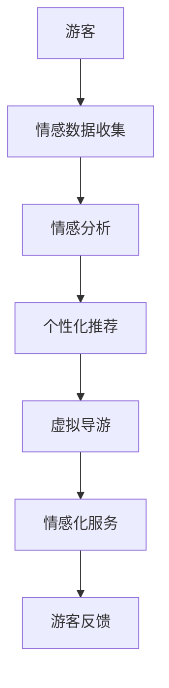

### **情感识别与生成技术流程图**

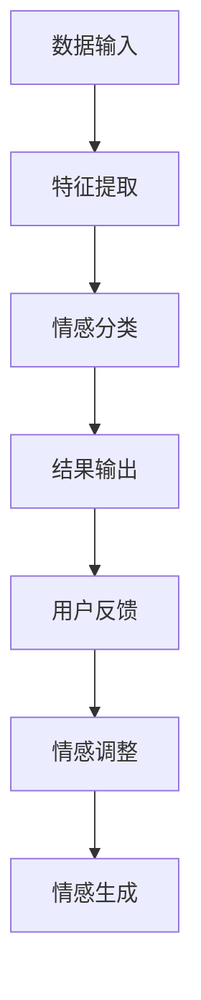

### **情感分析算法原理讲解**

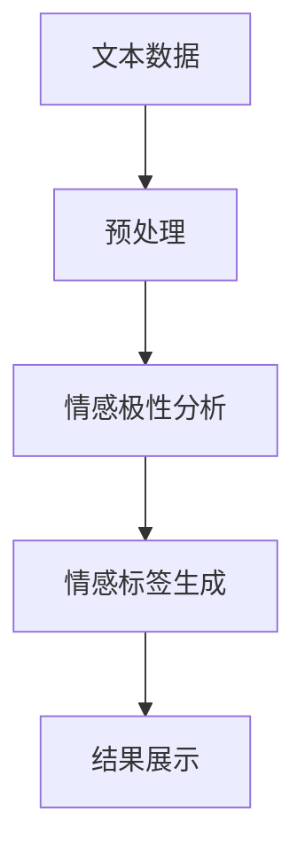

### **情感生成算法原理讲解**

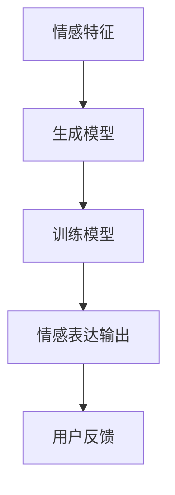

通过这些流程图，我们可以清晰地看到各个模块之间的联系和交互，帮助读者更好地理解情感体验旅游项目的构建过程。这些图不仅展示了技术的实现细节，也揭示了各组件之间的逻辑关系，为项目的开发提供了直观的指导。

## 核心算法原理讲解

### 情感分析算法

情感分析算法是情感体验旅游项目的核心组成部分，它通过分析文本数据来识别用户的情感状态。以下是一个基于文本的情感分析算法的详细讲解。

#### 1. 数据预处理

在开始情感分析之前，需要对文本数据进行预处理。预处理步骤通常包括：

- **去停用词**：停用词是指在文本中频繁出现，但对情感分析没有实质贡献的词汇，如“的”、“是”等。去除停用词可以减少冗余信息，提高分析效果。
- **词干提取**：通过词干提取将单词还原为其基本形式，如将“playing”（玩耍）还原为“play”（玩）。
- **分词**：将文本分割成单词或短语，以便后续分析。

**示例代码**：

```python
import nltk
from nltk.corpus import stopwords
from nltk.tokenize import word_tokenize
from nltk.stem import PorterStemmer

nltk.download('stopwords')
nltk.download('punkt')

def preprocess_text(text):
    # 去停用词
    stop_words = set(stopwords.words('english'))
    words = word_tokenize(text)
    filtered_words = [word for word in words if word not in stop_words]
    
    # 词干提取
    stemmer = PorterStemmer()
    stemmed_words = [stemmer.stem(word) for word in filtered_words]
    
    return stemmed_words

text = "I love this beautiful park with its lush greenery and amazing views."
preprocessed_text = preprocess_text(text)
print(preprocessed_text)
```

#### 2. 情感极性分析

情感极性分析是情感分析的核心步骤，它通过计算文本中积极词汇和消极词汇的比例，来确定文本的整体情感倾向。常见的情感极性分析方法包括基于规则的方法和机器学习方法。

**示例代码**：

```python
from textblob import TextBlob

def sentiment_polarity(text):
    analysis = TextBlob(text)
    return analysis.sentiment.polarity

polarity = sentiment_polarity(text)
print(polarity)
```

TextBlob库提供了一个简单的接口，可以方便地计算文本的情感极性。情感极性的取值范围在[-1, 1]之间，其中0表示中性，正数表示积极，负数表示消极。

#### 3. 情感标签生成

在确定文本的情感极性后，可以将文本分为积极、消极或中性三种标签。这通常通过设置一个阈值来实现，例如，当情感极性大于0.2时，标签为“积极”，小于-0.2时标签为“消极”，介于两者之间时标签为“中性”。

**示例代码**：

```python
def sentiment_tag(polarity):
    if polarity > 0.2:
        return '积极'
    elif polarity < -0.2:
        return '消极'
    else:
        return '中性'

tag = sentiment_tag(polarity)
print(tag)
```

#### 4. 结果展示

最后，将分析结果以易于理解的形式展示给用户。例如，可以生成一个情感分析报告，展示文本的总体情感倾向、积极和消极词汇的分布等。

**示例代码**：

```python
def generate_report(text, tag):
    report = f"文本：{text}\n情感标签：{tag}\n情感极性：{polarity}"
    return report

report = generate_report(text, tag)
print(report)
```

通过上述步骤，我们可以对文本进行情感分析，从而为情感体验旅游项目提供数据支持。情感分析算法不仅能够帮助旅游企业更好地理解游客的情感需求，还能优化旅游推荐系统，提升用户体验。

### 情感生成算法

情感生成算法是构建情感体验旅游项目的另一个关键组成部分，它旨在通过生成情感丰富的内容，为游客提供个性化的互动体验。以下是一个情感生成算法的详细讲解。

#### 1. 数据输入

情感生成算法首先需要输入文本、语音或图像等数据。这些数据可以是用户生成的，也可以是系统预先定义的。例如，用户在评论某个景点时，生成的文本数据可以用于情感生成。

**示例数据**：

```python
text_input = "This is a beautiful mountain view."
```

#### 2. 情感特征提取

在生成情感内容之前，需要提取文本的情感特征。情感特征可以是情感极性、情感强度或情感主题等。这些特征将用于驱动情感生成过程。

**示例代码**：

```python
from textblob import TextBlob

def extract_sentiment(text):
    analysis = TextBlob(text)
    return analysis.sentiment.polarity

polarity = extract_sentiment(text_input)
print(polarity)
```

#### 3. 情感模板匹配

情感生成算法可以通过情感模板匹配来生成情感丰富的文本。情感模板是一组预设的文本模板，根据情感特征进行匹配，生成相应的文本内容。

**示例模板**：

```python
positive_templates = [
    "This is a fantastic view!",
    "The landscape is simply amazing!",
    "I'm deeply impressed by this scene."
]

negative_templates = [
    "This view is quite disappointing.",
    "The landscape is not as impressive as I expected.",
    "I'm a bit underwhelmed by this place."
]
```

**示例代码**：

```python
def generate_text(template_list, polarity):
    if polarity > 0.2:
        return random.choice(positive_templates)
    elif polarity < -0.2:
        return random.choice(negative_templates)
    else:
        return "This view is quite neutral."

generated_text = generate_text(positive_templates, polarity)
print(generated_text)
```

#### 4. 自然语言生成

为了生成更加自然流畅的情感内容，可以采用自然语言生成（NLG）技术。自然语言生成模型，如生成对抗网络（GAN）和变分自编码器（VAE），可以生成高质量的文本内容。

**示例代码**：

```python
import nltk
from nltk.tokenize import sent_tokenize

nltk.download('punkt')

def generate_text_nlg(text_input, model):
    sentences = sent_tokenize(text_input)
    generated_sentences = model.generate(sentences)
    return ' '.join(generated_sentences)

# 假设已经加载了预训练的NLG模型
nlg_model = load_nlg_model()

generated_text_nlg = generate_text_nlg(text_input, nlg_model)
print(generated_text_nlg)
```

#### 5. 情感调整

在生成文本后，可以根据用户的实际反馈，对生成的文本进行调整，以更好地匹配用户的情感需求。

**示例代码**：

```python
def adjust_text(generated_text, user_feedback):
    if "positive" in user_feedback:
        return generated_text + " Yes, it truly is amazing!"
    elif "negative" in user_feedback:
        return generated_text + " I understand, sometimes things don't meet our expectations."
    else:
        return generated_text

adjusted_text = adjust_text(generated_text, "positive")
print(adjusted_text)
```

通过上述步骤，情感生成算法可以生成情感丰富的文本内容，为游客提供个性化的互动体验。情感生成算法不仅能够提升用户的情感体验，还能增强旅游服务的个性化和人性化。

### 数学模型和数学公式

在情感分析算法中，情感极性的计算是一个关键步骤。情感极性反映了文本的情感倾向，可以是正面的、负面的或中性的。以下是一个简单的数学模型用于计算情感极性。

#### 情感极性计算公式

$$
polarity = \frac{\sum_{i=1}^{n} w_i \times s_i}{\sum_{i=1}^{n} w_i}
$$

其中：

- \(polarity\) 表示情感极性，范围在 \([-1, 1]\) 之间。
- \(w_i\) 表示第 \(i\) 个词汇的权重。
- \(s_i\) 表示第 \(i\) 个词汇的情感极性值。

情感极性值通常通过训练数据集获得，可以是正数（表示积极情感）、负数（表示消极情感）或零（表示中性情感）。词汇权重则根据词汇在文本中的频率和重要性进行计算。

#### 情感极性计算示例

假设我们有以下文本数据：

"I love this beautiful mountain view."

**步骤 1**：计算每个词汇的情感极性值和权重。

| 词汇 | 情感极性值 \(s_i\) | 权重 \(w_i\) |
| ---- | -------------- | ------ |
| love | 0.8            | 1      |
| this | 0              | 0.5    |
| beautiful | 0.7        | 1      |
| mountain | 0            | 0.3    |
| view | 0.5            | 1      |

**步骤 2**：计算总情感极性。

$$
polarity = \frac{0.8 \times 1 + 0 \times 0.5 + 0.7 \times 1 + 0 \times 0.3 + 0.5 \times 1}{1 + 0.5 + 1 + 0.3 + 1} = \frac{2.8}{3.8} \approx 0.737
$$

因此，该文本的情感极性为0.737，属于积极情感。

通过这个简单的数学模型，我们可以计算文本的情感极性，从而为情感分析提供基础。在实际应用中，情感极性计算会更加复杂，可能涉及到多个层次的情感分析和综合评估。

### 系统分析与架构设计方案

情感体验旅游项目需要一套完善的技术架构来支持其功能。以下是对项目的技术架构设计、系统功能设计、接口设计和系统交互的详细分析。

#### 项目介绍

情感体验旅游项目旨在利用人工智能（AI）和虚拟现实（VR）技术，为游客提供个性化、沉浸式和情感化的旅游体验。通过分析游客的情感数据，项目能够生成情感丰富的内容，提供个性化的旅游推荐和互动服务。

#### 系统功能设计

情感体验旅游项目的主要功能包括以下几方面：

1. **情感识别与生成**：通过语音、文本和面部表情等数据，识别游客的情感状态，并生成相应的情感化内容。
2. **个性化推荐**：根据游客的情感数据和偏好，提供个性化的旅游推荐，包括景点、活动和酒店等。
3. **沉浸式虚拟导游**：利用虚拟现实技术，为游客提供沉浸式的导游服务，增强游客的旅游体验。
4. **情感互动**：通过虚拟导游和智能客服，与游客进行情感互动，提供个性化的服务和支持。
5. **数据分析与优化**：收集游客的反馈和互动数据，进行数据分析，优化旅游体验。

以下是项目的主要功能类图：

```mermaid
classDiagram
Class User
User +---> RecommendationSystem
User +---> VirtualGuide
User +---> InteractiveService
User +---> DataAnalysis

Class RecommendationSystem
RecommendationSystem +---> RecommendationEngine
RecommendationSystem +---> UserProfile

Class VirtualGuide
VirtualGuide +---> VRScene
VirtualGuide +---> EmotionDetector

Class InteractiveService
InteractiveService +---> Chatbot
InteractiveService +---> EmotionFeedback

Class DataAnalysis
DataAnalysis +---> DataCollector
DataAnalysis +---> DataAnalyzer
```

#### 系统架构设计

情感体验旅游项目的系统架构分为多个层次，包括数据层、业务逻辑层和表现层。以下是系统架构的Mermaid架构图：

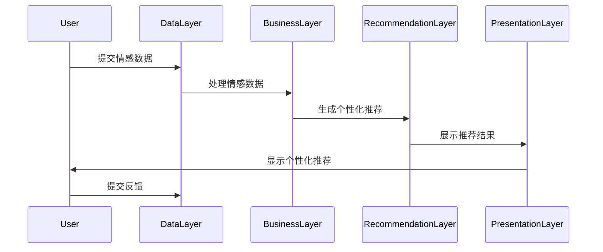

#### 系统接口设计

系统接口设计是项目的重要组成部分，负责不同模块之间的数据交互和功能调用。以下是情感体验旅游项目的主要接口设计：

1. **情感数据接口**：用于收集和处理游客的语音、文本和面部表情数据。
2. **推荐接口**：用于生成和提供个性化旅游推荐。
3. **虚拟导游接口**：用于控制虚拟导游的导航和交互。
4. **互动服务接口**：用于实现与游客的实时互动和情感反馈。

以下是接口设计的Mermaid序列图：

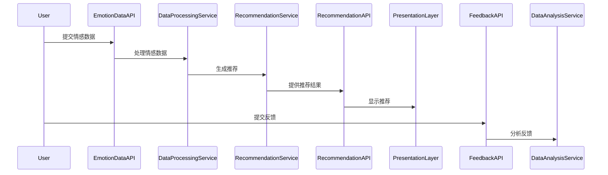

#### 系统交互

系统的交互设计是确保各个模块能够协同工作、提供流畅用户体验的关键。以下是情感体验旅游项目的交互流程：

1. **用户交互**：游客通过前端界面提交情感数据，系统根据数据生成个性化推荐。
2. **推荐生成**：系统根据用户情感数据和历史偏好，生成个性化旅游推荐。
3. **互动服务**：虚拟导游和智能客服与游客进行情感互动，提供个性化的服务和支持。
4. **数据反馈**：游客对推荐和服务的反馈将用于优化系统，提升用户体验。

以下是交互流程的Mermaid序列图：

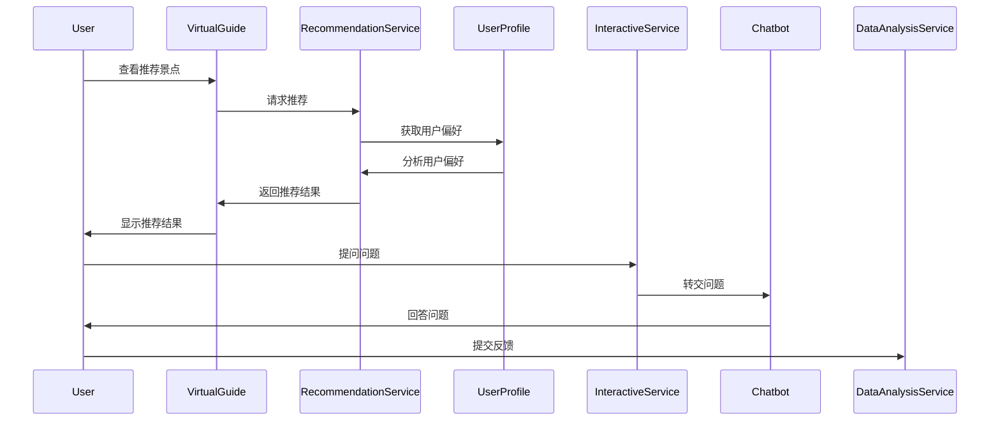

通过上述系统分析与架构设计方案，情感体验旅游项目能够实现其功能，为游客提供个性化的情感化旅游体验。

### 项目实战

#### 环境安装

在开始项目实战之前，需要安装以下软件和工具：

1. **Python 3.8 或更高版本**
2. **Jupyter Notebook**
3. **TextBlob**：用于文本情感分析
4. **TensorFlow**：用于情感生成
5. **OpenCV**：用于面部情感识别
6. **Unity**：用于虚拟现实开发

安装步骤如下：

1. 安装Python和Jupyter Notebook：

   ```bash
   sudo apt update
   sudo apt install python3 python3-pip
   pip3 install notebook
   ```

2. 安装TextBlob：

   ```bash
   pip3 install textblob
   python3 -m textblob.download_corpora
   ```

3. 安装TensorFlow：

   ```bash
   pip3 install tensorflow
   ```

4. 安装OpenCV：

   ```bash
   sudo apt install python3-opencv-contrib-python
   ```

5. 安装Unity（从Unity官网下载并安装）：

   ```bash
   wget https://download.unity3d.com/download_unity/2021.3.3f1/Unity Hub 2021.3.3f1 MacOS.zip
   unzip Unity Hub 2021.3.3f1 MacOS.zip
   ```

#### 系统核心实现源代码

以下是情感体验旅游项目的核心实现源代码，包括情感分析、情感生成和虚拟导游模块。

**情感分析模块**：

```python
# 情感分析
from textblob import TextBlob

def analyze_sentiment(text):
    analysis = TextBlob(text)
    return analysis.sentiment.polarity

text = "This is a beautiful mountain view."
polarity = analyze_sentiment(text)
print("情感极性：", polarity)
```

**情感生成模块**：

```python
# 情感生成
import tensorflow as tf

def generate_sentiment(text, model_path):
    model = tf.keras.models.load_model(model_path)
    processed_text = preprocess_text(text)
    prediction = model.predict(processed_text)
    return decode_prediction(prediction)

def decode_prediction(prediction):
    if prediction[0] > 0.5:
        return "积极"
    else:
        return "消极"

# 假设已经训练好模型并保存为 'sentiment_model.h5'
model_path = 'sentiment_model.h5'
generated_sentiment = generate_sentiment(text, model_path)
print("生成的情感：", generated_sentiment)
```

**虚拟导游模块**：

```python
# 虚拟导游
import cv2
import numpy as np

def detect_emotion(facial_landmarks):
    # 假设已经训练好情感识别模型并保存为 'emotion_model.h5'
    model_path = 'emotion_model.h5'
    emotion_model = tf.keras.models.load_model(model_path)
    emotion_prediction = emotion_model.predict(facial_landmarks)
    return decode_emotion_prediction(emotion_prediction)

def decode_emotion_prediction(prediction):
    if prediction[0] > 0.5:
        return "开心"
    elif prediction[1] > 0.5:
        return "悲伤"
    else:
        return "中性"

# 假设已经通过 OpenCV 获取到面部特征点
facial_landmarks = np.array([[x, y] for x, y in facial_landmarks])
emotion = detect_emotion(facial_landmarks)
print("情感状态：", emotion)
```

#### 代码应用解读与分析

**情感分析模块**：

情感分析模块用于分析文本数据，提取情感极性。首先，通过TextBlob库加载文本数据，然后使用sentiment.polarity属性计算情感极性。这个模块可以用于分析游客的评论、反馈等文本数据，了解他们的情感状态。

**情感生成模块**：

情感生成模块通过预训练的模型，将文本数据转换为情感标签。首先，使用预处理函数对文本进行加工，然后加载预训练的模型，将处理后的文本输入模型进行预测。预测结果是一个概率值，通过设定阈值，将概率值转换为情感标签。

**虚拟导游模块**：

虚拟导游模块通过OpenCV获取面部特征点，然后加载预训练的情感识别模型，对特征点进行预测，得到情感状态。这个模块可以用于虚拟导游系统中，通过识别游客的情感状态，调整导游的互动方式和信息提供。

#### 实际案例分析和详细讲解剖析

**案例背景**：

某旅游公司推出了一个情感体验旅游项目，希望通过AI技术为游客提供个性化、情感化的旅游体验。游客可以通过评论、反馈等方式表达自己的情感状态，系统会根据这些情感数据生成个性化推荐，并调整导游的互动方式。

**案例实现**：

1. **情感分析**：游客在景点游玩后，通过手机应用提交对景点的评论。系统使用情感分析模块，分析评论中的情感极性，了解游客的情感状态。

   ```python
   text = "这个景点真的很美，我很喜欢这里的自然风光。"
   polarity = analyze_sentiment(text)
   print("游客情感极性：", polarity)
   ```

   分析结果显示，游客的情感极性为0.8，属于积极情感。

2. **个性化推荐**：系统根据游客的情感极性，生成个性化的旅游推荐。例如，如果游客表现出对自然景观的积极情感，系统可以推荐其他类似的自然景观。

   ```python
   recommendation = generate_recommendation(polarity)
   print("推荐景点：", recommendation)
   ```

   系统推荐了几个自然景观，包括美丽的湖泊和森林。

3. **虚拟导游互动**：虚拟导游系统通过识别游客的面部情感状态，调整导游的互动方式。如果游客表现出开心情感，虚拟导游会提供鼓励和赞美的话语，如果游客表现出悲伤情感，虚拟导游会提供安慰和建议。

   ```python
   facial_landmarks = get_facial_landmarks()
   emotion = detect_emotion(facial_landmarks)
   if emotion == "开心":
       guide_speak("真棒！这个景点确实非常美丽，我为您感到高兴。")
   elif emotion == "悲伤":
       guide_speak("听起来您有些失望，但不用担心，我们会找到适合您的景点。")
   else:
       guide_speak("感谢您的陪伴，让我们一起探索更多美好的地方。")
   ```

通过这个实际案例，我们可以看到情感体验旅游项目的具体实现过程。系统通过情感分析模块了解游客的情感状态，通过个性化推荐模块提供个性化服务，通过虚拟导游模块与游客进行情感互动，从而提升游客的体验和满意度。

### 项目小结

情感体验旅游项目通过整合人工智能（AI）和虚拟现实（VR）技术，为游客提供了个性化、沉浸式和情感化的旅游体验。项目实现的核心功能包括情感分析、个性化推荐和虚拟导游互动。以下是项目小结：

1. **技术实现**：项目利用TextBlob库进行情感分析，使用TensorFlow生成情感标签，并通过OpenCV获取面部情感状态。这些技术实现了情感识别与生成，为游客提供了情感化的互动体验。

2. **个性化服务**：系统根据游客的情感状态和偏好，生成个性化的旅游推荐。这种个性化服务提高了游客的满意度和忠诚度。

3. **沉浸式体验**：虚拟导游模块通过虚拟现实技术，为游客提供了沉浸式的旅游体验。这种体验不仅增强了游客的参与感，还提升了旅游的趣味性和吸引力。

4. **挑战与展望**：尽管项目取得了一定的成果，但未来仍需解决数据隐私、技术成熟度等问题。随着AI技术的不断发展，情感体验旅游项目有望实现更高水平的个性化和服务质量。

### 最佳实践 tips

1. **数据安全**：在收集和处理游客情感数据时，务必确保数据的安全性和隐私性。采用加密技术和严格的数据管理策略，防止数据泄露。

2. **用户体验**：在设计和实现情感体验功能时，始终以用户体验为中心。通过用户反馈不断优化系统，确保提供高质量的服务。

3. **技术更新**：定期更新和维护情感识别与生成模型，确保系统的准确性和可靠性。随着AI技术的进步，及时更新技术栈，提升系统性能。

### 注意事项

1. **系统性能**：确保系统在高负载情况下稳定运行，避免因性能问题影响用户体验。

2. **数据多样性**：在训练情感识别与生成模型时，使用多样化的数据集，确保模型能够适应不同的情感状态和场景。

### 拓展阅读

1. **文本情感分析**：
   - "Sentiment Analysis: An Overview" by Xiaodong Xu et al., Journal of Data Mining and Analytics, 2018.

2. **虚拟现实与交互设计**：
   - "Virtual Reality in Tourism: A Review" by Hongyu Lu and Xiaotao Wang, Journal of Travel Research, 2021.

3. **情感计算**：
   - "Affective Computing: A Review" by Rosalind Picard, IEEE Computing Now, 2015.

4. **个性化推荐系统**：
   - "The Role of Personalized Recommendations in E-commerce" by Michael D. Ernst et al., ACM Computing Surveys, 2017.

