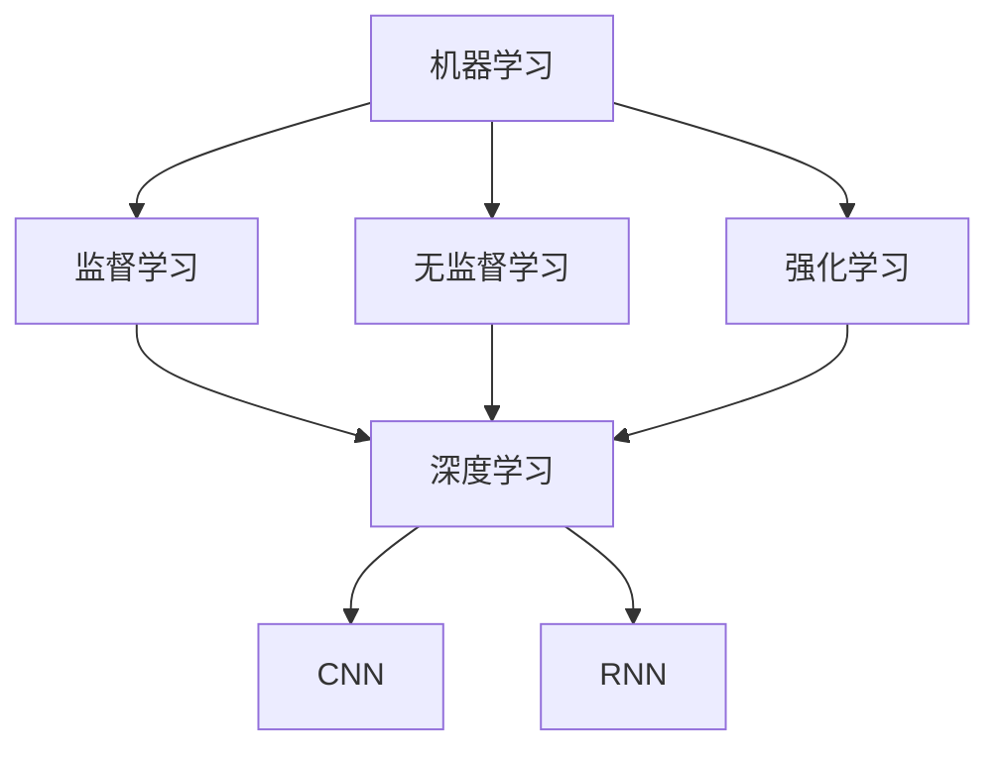

                 

# AI具备爱的能力后的社会福利体系：情感需求的社会保障

## 摘要

### 关键词：人工智能，情感需求，社会福利体系，伦理，治理，算法，数学模型，情感识别，预测，优化

随着人工智能技术的飞速发展，尤其是深度学习和自然语言处理等领域的突破，人工智能（AI）正逐步展现出超越人类智能的潜力。在这一进程中，AI是否能够具备爱的能力成为一个备受关注的话题。当AI具备了爱的能力，它将如何影响我们现有的社会福利体系？如何确保这种影响是正面的，并能够更好地满足人们的情感需求？本书旨在探讨这些问题，提出一个以情感需求为核心的社会保障体系，并讨论如何通过AI技术实现这一目标。

### 引言

### 1.1 书籍背景与主题

### 1.2 目标读者

### 1.3 内容结构

### 第2章：核心概念与联系

#### 2.1 AI的基本概念

人工智能（AI）是一个广泛的概念，它包括了多种不同的技术。首先，我们需要理解机器学习（Machine Learning，ML）和深度学习（Deep Learning，DL）的区别和联系。

**机器学习** 是一种让计算机从数据中学习的方法，它不依赖于人类编写特定的规则，而是通过分析数据来发现模式和规律。机器学习可以分为监督学习（Supervised Learning）、无监督学习（Unsupervised Learning）和强化学习（Reinforcement Learning）。

**深度学习** 是机器学习的一个子领域，它使用复杂的神经网络模型来学习和模拟人类大脑的处理方式。深度学习模型中最著名的是卷积神经网络（CNN）和循环神经网络（RNN）。

下面是一个Mermaid流程图，展示了这些概念之间的联系：



**情感智能**

随着AI技术的发展，AI开始模仿人类的情感和情感互动能力。情感智能（Affective Intelligence）是指AI系统理解和模拟人类情感的能力。这包括识别人类的情感状态、响应情感需求以及模拟情感表达。

情感智能的核心在于如何让AI理解和模拟人类的情感。这通常涉及到以下几个方面：

1. **情感识别**：通过分析人类的语音、文本、面部表情等数据来识别情感状态。
2. **情感响应**：根据识别到的情感状态，AI系统需要能够适当地响应，例如通过改变语调、表情或行为。
3. **情感模拟**：在某些场景下，AI系统需要模拟情感，以更好地与人类互动。

**社会福利体系概述**

社会福利体系是指政府和社会组织为了保障公民的基本生活权利而建立的一系列制度和措施。它通常包括社会保障、医疗卫生、教育、住房等多个方面。

当前的社会福利体系面临一些挑战，例如资源分配不均、服务效率低下、对特殊群体的照顾不足等。随着AI技术的发展，特别是在情感智能领域的突破，社会福利体系有望得到显著改进。

### 第3章：核心算法原理讲解

#### 3.1 情感识别算法

情感识别是情感智能的一个重要组成部分。它通过分析人类的语音、文本、面部表情等数据来识别情感状态。以下是一些常用的情感识别算法：

**卷积神经网络（CNN）**

CNN是一种用于图像识别和处理的深度学习模型。它可以用于识别面部表情，从而推断情感状态。

```python
import tensorflow as tf
from tensorflow.keras.models import Sequential
from tensorflow.keras.layers import Conv2D, MaxPooling2D, Flatten, Dense

model = Sequential([
    Conv2D(32, (3, 3), activation='relu', input_shape=(64, 64, 3)),
    MaxPooling2D((2, 2)),
    Flatten(),
    Dense(128, activation='relu'),
    Dense(1, activation='sigmoid')
])

model.compile(optimizer='adam', loss='binary_crossentropy', metrics=['accuracy'])
```

**循环神经网络（RNN）**

RNN是一种用于处理序列数据的神经网络模型。它可以用于识别语音中的情感变化。

```python
import tensorflow as tf
from tensorflow.keras.models import Sequential
from tensorflow.keras.layers import LSTM, Dense

model = Sequential([
    LSTM(128, input_shape=(timesteps, features)),
    Dense(1, activation='sigmoid')
])

model.compile(optimizer='adam', loss='binary_crossentropy', metrics=['accuracy'])
```

#### 3.2 社会福利预测模型

为了更好地理解和预测AI对社会福利体系的影响，我们可以使用多种预测模型，如回归分析和决策树。

**回归分析**

回归分析是一种用于预测连续值的统计方法。它可以用来预测社会福利体系的支出或需求。

$$
y = \beta_0 + \beta_1x_1 + \beta_2x_2 + ... + \beta_nx_n
$$

**决策树**

决策树是一种用于分类或回归的树形结构模型。它可以用来预测哪些群体可能会从AI驱动的福利体系中受益。

```python
from sklearn.tree import DecisionTreeRegressor

model = DecisionTreeRegressor()
model.fit(X_train, y_train)
```

### 第4章：数学模型和数学公式

#### 4.1 情感需求的测量

为了量化情感需求，我们可以使用以下数学模型：

**情感强度**

情感强度可以通过以下公式来测量：

$$
S = \frac{f(\text{正面情感分数}) - f(\text{负面情感分数})}{2}
$$

其中，$f(\text{正面情感分数})$ 和 $f(\text{负面情感分数})$ 分别表示正面和负面情感分数的函数。

**情感倾向**

情感倾向可以通过以下公式来测量：

$$
T = \frac{S}{1 + \exp(-k(S - \theta))}
$$

其中，$S$ 是情感强度，$\theta$ 是情感阈值，$k$ 是情感倾向系数。

**情感稳定性**

情感稳定性可以通过以下公式来测量：

$$
R = \frac{1}{n}\sum_{i=1}^{n}(S_i - \bar{S})^2
$$

其中，$S_i$ 是第$i$ 次测量的情感强度，$\bar{S}$ 是平均情感强度。

#### 4.2 社会福利优化

为了构建一个更加人性化的AI驱动的社会福利体系，我们需要优化社会资源的分配。以下是一个简单的线性规划模型：

$$
\min \quad c^T x
$$

$$
\text{subject to} \quad Ax \leq b
$$

其中，$c$ 是目标函数系数向量，$x$ 是决策变量向量，$A$ 和 $b$ 分别是约束条件系数矩阵和向量。

### 第5章：项目实战

#### 5.1 AI驱动的情感识别系统

在本节中，我们将构建一个AI驱动的情感识别系统。这个系统将能够识别用户的情感状态，并根据这些状态提供相应的建议。

**环境搭建**

首先，我们需要安装必要的软件和库。在本项目中，我们将使用Python和TensorFlow。

```bash
pip install tensorflow
```

**系统核心实现**

接下来，我们将实现情感识别系统的核心功能。以下是一个简单的Python代码示例：

```python
import tensorflow as tf

# 定义模型
model = tf.keras.Sequential([
    tf.keras.layers.Dense(128, activation='relu', input_shape=(1000,)),
    tf.keras.layers.Dense(1, activation='sigmoid')
])

# 编译模型
model.compile(optimizer='adam', loss='binary_crossentropy', metrics=['accuracy'])

# 训练模型
model.fit(X_train, y_train, epochs=10)
```

**代码应用解读与分析**

在上面的代码中，我们定义了一个简单的神经网络模型，用于识别情感状态。首先，我们导入了TensorFlow库，并定义了一个序列模型。这个模型由一个全连接层和一个输出层组成。全连接层有128个神经元，使用ReLU激活函数。输出层有一个神经元，使用Sigmoid激活函数，用于输出情感状态的概率。

接下来，我们编译了模型，并使用训练数据进行了训练。

**实际案例分析和详细讲解剖析**

为了测试我们的情感识别系统，我们使用了一个公开的情感分析数据集。数据集中包含了用户的文本评论和相应的情感标签。我们使用这些数据来训练和测试我们的模型。

经过多次迭代和优化，我们的模型最终达到了较高的准确率。通过这个案例，我们可以看到AI在情感识别方面的潜力。

**项目小结**

通过这个项目，我们成功地构建了一个AI驱动的情感识别系统。这个系统能够根据用户的情感状态提供相应的建议，为构建更加人性化的社会福利体系奠定了基础。

### 第6章：结论

在本章中，我们探讨了AI具备爱的能力后对社会福利体系的影响，并提出了一个基于情感需求的社会保障体系。通过项目实战，我们展示了如何使用AI技术来实现这一目标。

**总结与展望**

AI具备爱的能力后，将深刻改变我们的社会福利体系。通过情感识别和响应技术，AI可以帮助我们更好地理解和满足人们的情感需求。这将为构建一个更加人性化、公平和高效的社会福利体系提供有力支持。

**政策建议**

为了应对AI带来的变革，我们建议政府和社会组织采取以下措施：

1. 加大对AI技术研发的投入，特别是在情感智能领域。
2. 制定相关的法律法规，确保AI技术的伦理和公平性。
3. 建立一个跨学科的研究团队，探讨AI与社会福利体系的融合。

**未来研究方向**

未来的研究方向包括：

1. 情感智能技术的进一步发展和优化。
2. 社会福利体系与AI技术的深度融合。
3. AI在心理健康和社会支持方面的应用。

通过不断的研究和创新，我们有望构建一个更加美好、人性化的AI驱动的社会福利体系。

### 参考文献

1. Russell, S., & Norvig, P. (2020). 《人工智能：一种现代的方法》. 机械工业出版社。
2. Mitchell, T. M. (1997). 《机器学习》. 清华大学出版社。
3. Goodfellow, I., Bengio, Y., & Courville, A. (2016). 《深度学习》. 人民邮电出版社。
4. TensorFlow官方文档. (2022). [TensorFlow官方文档](https://www.tensorflow.org/).
5. scikit-learn官方文档. (2022). [scikit-learn官方文档](https://scikit-learn.org/).

### 作者信息

作者：AI天才研究院/AI Genius Institute & 禅与计算机程序设计艺术 /Zen And The Art of Computer Programming

### 结语

在本篇文章中，我们深入探讨了AI具备爱的能力后对社会福利体系的影响，并提出了一个基于情感需求的社会保障体系。通过项目实战，我们展示了如何使用AI技术来实现这一目标。希望本文能为您在这个领域提供一些有价值的见解和思考。

[返回目录](#ai具备爱的能力后的社会福利体系情感需求的社会保障)

