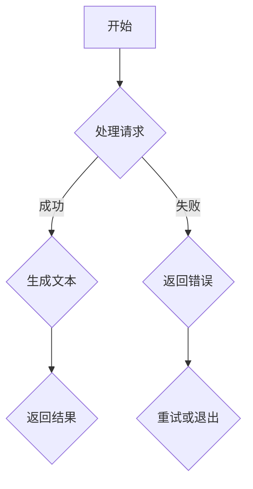

                 

### 引言

随着人工智能技术的迅猛发展，AI写作作为自然语言处理（NLP）领域的一个重要分支，逐渐成为了学术界和工业界的研究热点。AI写作技术不仅能够大幅提升写作效率，还能够开拓新的创意产业领域，改变传统的写作模式。本文将围绕AI写作与创意产业的关系展开探讨，旨在分析人机协作在AI写作中的应用可能，以及其在各个领域的具体实践与未来展望。

首先，我们将介绍AI写作的基本概念与背景，包括其定义、发展历程以及当前面临的挑战。接下来，我们将深入探讨AI写作的算法原理，从自然语言处理基础到生成式模型，再到对抗生成网络（GAN），逐步剖析其核心技术。随后，我们将分析AI写作在不同应用场景中的实际应用，重点讨论其在创意产业中的重要性。在此基础上，本文将详细阐述人机协作在AI写作中的新模式，分析其优势与挑战。随后，通过具体案例，我们将展示AI写作在创意产业中的实际应用，最后，我们对AI写作的发展趋势与未来展望进行深入探讨。

通过本文的阅读，读者将全面了解AI写作的基本概念、核心技术、应用场景以及人机协作的模式，并对AI写作在创意产业中的潜力有更深入的认识。我们期待这篇文章能够为AI写作领域的研究者、实践者以及相关从业者提供有价值的参考，同时也为未来AI写作技术的发展指明方向。

## 第一部分：AI写作概述

### 第1章：AI写作的基本概念与背景

#### 1.1 AI写作的定义

AI写作，是指利用人工智能技术生成文本的过程。具体来说，它是通过自然语言处理（NLP）、机器学习（ML）以及深度学习（DL）等先进技术，模拟人类写作行为，自动生成文章、报告、小说、诗歌等多种形式的文本内容。AI写作不仅仅是简单地模仿人类写作，而是通过理解语言结构、语义和上下文关系，生成具有逻辑性和创造性的文本。

在核心技术的层面上，AI写作主要依赖于自然语言处理和机器学习。自然语言处理（NLP）是AI写作的基础，它涉及语言识别、文本分类、实体识别、情感分析等多个方面。机器学习（ML）则是通过大量数据训练模型，使模型具备理解和生成语言的能力。随着深度学习技术的发展，生成式模型如RNN（递归神经网络）、LSTM（长短期记忆网络）和GPT（生成预训练模型）等，逐渐成为AI写作的核心技术。

#### 1.2 AI写作的发展历程

AI写作的历史可以追溯到20世纪60年代，当时的研究者开始探索如何使用计算机生成文本。早期的AI写作主要基于规则的方法，即通过编写一系列规则来生成文本。这种方法虽然简单，但受限于规则数量和复杂度，很难生成长篇连贯的文本。

随着时间的发展，AI写作进入了基于统计的阶段。1980年代和1990年代，研究者开始利用统计模型来生成文本，如基于概率的隐马尔可夫模型（HMM）和条件概率模型。这些方法相比基于规则的方法，能够生成更连贯的文本，但仍然存在许多局限性。

21世纪初，深度学习技术的发展为AI写作带来了新的契机。递归神经网络（RNN）和长短期记忆网络（LSTM）等生成式模型的出现，使得AI写作的生成质量大幅提升。这些模型能够更好地理解和记忆语言的上下文信息，从而生成更加自然、连贯的文本。近年来，生成预训练模型（GPT）等更加先进的模型不断涌现，如GPT-3，使得AI写作的生成质量和创造力达到了前所未有的高度。

#### 1.3 AI写作的优势与挑战

#### 1.3.1 优势

AI写作具有多方面的优势：

1. **提高写作效率**：AI写作能够快速生成大量文本内容，大大提高了写作的效率。在新闻报道、市场营销报告、技术文档等领域，AI写作已经成为重要的工具。

2. **扩大写作覆盖面**：AI写作可以自动处理不同领域的文本生成，使得更多不具备专业写作能力的人也能生成高质量的文本内容。

3. **创造多样化的内容**：通过不同的模型和数据输入，AI写作能够生成各种类型的文本，如小说、诗歌、歌词等，丰富了创意产业的多样性。

#### 1.3.2 挑战

尽管AI写作具有众多优势，但也面临一些挑战：

1. **保证内容质量**：AI写作生成的文本质量参差不齐，如何保证生成文本的高质量和准确性，是一个亟待解决的问题。

2. **保持原创性**：AI写作生成的文本往往具有高度的可重复性，如何确保原创性，防止抄袭和侵权，是AI写作需要面对的重要挑战。

3. **保护知识产权**：随着AI写作技术的发展，如何保护作者和创作者的知识产权，防止未经授权的文本生成和使用，也是一个重要的法律和伦理问题。

总的来说，AI写作作为人工智能领域的一个重要分支，已经展现出巨大的潜力和应用前景。在享受其带来便利和创造力的同时，我们也需要积极应对其带来的挑战，确保AI写作技术的可持续发展。

### 第2章：AI写作的算法原理

#### 2.1 自然语言处理基础

自然语言处理（NLP）是AI写作的核心技术之一，它涉及到对人类语言的理解和生成。为了深入理解AI写作的算法原理，首先需要了解NLP的基础概念和技术。

##### 2.1.1 语言模型

语言模型（Language Model）是NLP的基础，它用于预测下一个单词或字符的概率。在AI写作中，语言模型被用来生成连贯的文本。最简单的语言模型是基于N-gram模型，它通过统计前N个单词（或字符）出现的频率来预测下一个单词。然而，N-gram模型存在一些局限性，如无法捕捉长距离依赖关系。

为了解决这一问题，研究者们提出了神经网络语言模型。神经网络语言模型（Neural Network Language Model，NNLM）通过多层神经网络来学习语言的概率分布。其中，最常用的神经网络模型是递归神经网络（RNN）。RNN能够处理序列数据，并且能够记住之前的信息，从而捕捉长距离依赖关系。

##### 2.1.2 词向量表示

词向量表示（Word Vector Representation）是将单词映射到高维向量空间的方法，用于表示单词的语义信息。最著名的词向量表示模型是Word2Vec，它通过训练神经网络来学习单词的向量表示。Word2Vec模型利用词频和语境信息，使语义相似的单词在向量空间中接近。

除了Word2Vec，还有一些基于深度学习的词向量表示方法，如GloVe和FastText。这些方法通过优化目标函数来学习单词的向量表示，使得单词向量具有更好的语义意义和分布特性。

##### 2.1.3 语义理解

语义理解（Semantic Understanding）是NLP的一个重要任务，它涉及到对文本内容的理解、分析和推理。语义理解的任务包括实体识别、情感分析、关系抽取等。

实体识别（Named Entity Recognition，NER）是一种常见的语义理解任务，它用于识别文本中的命名实体，如人名、地名、机构名等。NER可以通过规则方法、统计模型或深度学习方法来实现。

情感分析（Sentiment Analysis）是一种评估文本情感极性的任务，它用于分析用户评论、社交媒体等文本中的情感倾向。情感分析可以通过分类模型来实现，常用的情感分析模型包括朴素贝叶斯、支持向量机（SVM）和深度学习模型如卷积神经网络（CNN）和长短期记忆网络（LSTM）。

关系抽取（Relation Extraction）是一种从文本中提取实体之间关系的任务。关系抽取可以通过模式匹配、规则方法或深度学习方法来实现。

##### 2.1.4 语言模型与语义理解的结合

在实际应用中，语言模型和语义理解通常需要结合使用。例如，在生成文本时，语言模型用于生成连续的文本序列，而语义理解用于确保生成的文本符合语义逻辑和上下文关系。

一种常见的方法是先使用语言模型生成初步的文本，然后通过语义理解模型进行后处理，修正和优化生成的文本。这种结合方法能够显著提升生成文本的质量和连贯性。

#### 2.2 生成式模型

生成式模型（Generative Model）是AI写作中的核心算法，它通过学习数据生成过程，生成新的文本内容。生成式模型包括递归神经网络（RNN）、长短期记忆网络（LSTM）和生成预训练模型（GPT）等。

##### 2.2.1 RNN（递归神经网络）

递归神经网络（Recurrent Neural Network，RNN）是一种能够处理序列数据的神经网络。RNN通过重复使用相同的神经网络结构，处理输入序列的每一个元素，并利用隐藏状态来捕捉序列中的依赖关系。

RNN的不足之处在于，它难以捕捉长距离依赖关系，导致生成的文本容易出现错位和重复。为了解决这个问题，研究者提出了长短期记忆网络（LSTM）。

##### 2.2.2 LSTM（长短期记忆网络）

长短期记忆网络（Long Short-Term Memory，LSTM）是一种改进的递归神经网络，它通过引入门控机制，解决了RNN在捕捉长距离依赖关系时的困难。LSTM中的门控单元包括遗忘门、输入门和输出门，它们分别控制遗忘历史信息、更新输入信息和生成输出信息。

LSTM在生成文本时，能够更好地捕捉长距离依赖关系，生成更加连贯和自然的文本。然而，LSTM在处理非常长的序列时，仍然存在计算复杂度和梯度消失等问题。

##### 2.2.3 GPT（生成预训练模型）

生成预训练模型（Generative Pre-trained Transformer，GPT）是由OpenAI提出的一种基于Transformer的生成式模型。GPT通过大规模预训练和特定任务微调，实现了高质量的文本生成。

GPT的主要优势在于其强大的并行计算能力和处理长序列的能力。GPT使用了自注意力机制（Self-Attention），使得模型能够在生成文本时更好地捕捉上下文信息。此外，GPT还通过多层Transformer结构，提高了模型的生成质量和表达能力。

GPT的变种GPT-3更是达到了前所未有的生成能力，它拥有1750亿个参数，能够生成高质量的文本、代码和摘要等。GPT-3在AI写作领域展现出了巨大的潜力，被认为是下一代AI写作的核心技术。

##### 2.2.4 GPT的生成过程

GPT的生成过程主要包括以下几个步骤：

1. **输入编码**：将输入文本编码为序列，通常使用WordPiece或BERT等编码器。

2. **自注意力计算**：通过自注意力机制计算输入序列的上下文表示。

3. **前向传播**：使用多层Transformer结构进行前向传播，生成中间表示。

4. **输出层**：在输出层，GPT通过softmax函数生成每个单词的概率分布，然后根据概率分布采样生成新的文本。

5. **后处理**：生成的文本通常需要进行后处理，如去除特殊符号、修正语法错误等，以提升文本质量。

通过这些步骤，GPT能够生成高质量、连贯的文本，满足各种写作需求。GPT-3的强大生成能力，使得它在创意产业、自动化写作、文本生成等领域具有广泛的应用前景。

### 2.3 对抗生成网络（GAN）

对抗生成网络（Generative Adversarial Network，GAN）是一种由生成器和判别器组成的生成模型。GAN由Ian Goodfellow等人在2014年提出，是一种基于博弈论的生成模型。

GAN的工作原理可以简单概括为“对抗训练”，即生成器和判别器相互对抗，共同优化。生成器的目标是生成尽可能真实的样本，而判别器的目标是区分真实样本和生成样本。

##### 2.3.1 GAN的基本原理

GAN由两部分组成：生成器（Generator）和判别器（Discriminator）。

1. **生成器（Generator）**：生成器的任务是生成与真实样本相似的伪样本。生成器通常是一个神经网络，它接受随机噪声作为输入，通过神经网络内部的处理，生成与真实样本具有相似特征的伪样本。

2. **判别器（Discriminator）**：判别器的任务是区分真实样本和生成样本。判别器也是一个神经网络，它接收样本作为输入，输出一个概率值，表示样本属于真实样本的概率。对于真实样本，判别器希望输出接近1的概率；对于生成样本，判别器希望输出接近0的概率。

在训练过程中，生成器和判别器相互对抗：

- **生成器的训练目标**：生成器希望生成尽可能真实的样本，使得判别器无法区分真实样本和生成样本。
- **判别器的训练目标**：判别器希望准确区分真实样本和生成样本。

通过这种对抗过程，生成器和判别器不断优化，生成器逐渐提高生成样本的质量，而判别器逐渐提高分类的准确性。

##### 2.3.2 GAN在AI写作中的应用

GAN在AI写作中的应用主要体现在文本生成和图像生成两个方面。

1. **文本生成**：GAN可以用于生成高质量的文本。生成器通过学习真实文本数据，生成新的文本内容。判别器则用于评估生成文本的真实性和连贯性。通过反复对抗训练，生成器可以生成与真实文本高度相似的文本。

2. **图像生成**：GAN在图像生成领域取得了显著成果。生成器可以生成具有高分辨率和细节丰富的图像。判别器则用于区分真实图像和生成图像。通过对抗训练，生成器可以生成与真实图像难以区分的图像。

在AI写作中，GAN的应用包括但不限于：

- **故事生成**：生成器可以生成新的故事情节，而判别器则用于评估故事的真实性和连贯性。
- **文本摘要**：生成器可以生成摘要文本，而判别器则用于评估摘要的准确性和完整性。
- **自动续写**：生成器可以根据用户提供的部分文本，自动续写接下来的内容，而判别器则用于评估续写内容的合理性和流畅度。

总之，GAN作为一种强大的生成模型，通过生成器和判别器的对抗训练，可以在多个领域实现高质量的数据生成。在AI写作领域，GAN的应用为自动化写作、文本生成和创意内容创作提供了新的可能性。

### 第3章：AI写作的应用场景

#### 3.1 创意产业

在创意产业中，AI写作展现出了巨大的潜力，为内容创作提供了全新的工具和手段。创意产业包括文学、广告、新闻、娱乐等多个领域，AI写作在这些领域中都有广泛的应用。

**3.1.1 内容创作**

在文学领域，AI写作已经被用于生成小说、诗歌和歌词等。例如，OpenAI的GPT-3模型可以生成高质量的短篇小说，甚至创作完整的剧本。这些生成的内容不仅具有高度的文学性，还能够展现丰富的情感和创意。此外，AI写作还可以辅助作者进行写作，提供灵感和建议，从而提高写作效率和创造力。

**3.1.2 广告文案**

广告文案是广告行业的重要组成部分。AI写作能够自动生成广告语和广告文案，提高广告创作的效率。例如，利用GPT-3模型，可以快速生成具有吸引力和创意的广告文案，使得广告更具针对性和有效性。通过AI写作，广告公司可以节省大量时间和资源，专注于策略和创意的制定。

**3.1.3 娱乐内容**

在娱乐领域，AI写作被用于生成电影剧本、电视剧脚本和游戏剧情。例如，一些游戏公司利用AI写作技术生成游戏剧情，使得游戏故事情节更加丰富和引人入胜。此外，AI写作还可以用于生成电影和电视剧的剧本，提高内容创作的效率和质量。

**3.1.4 音乐创作**

音乐创作是另一个受到AI写作影响的领域。AI写作可以生成歌词和旋律，甚至创作完整的音乐作品。例如，一些音乐公司已经开始使用AI写作工具生成音乐，使得音乐创作更加多样化和创新。AI写作在音乐创作中的应用，不仅为音乐人提供了新的创作手段，也为听众带来了全新的音乐体验。

#### 3.2 媒体出版

AI写作在媒体出版领域也有广泛的应用，提高了内容生产和分发效率。

**3.2.1 自动摘要**

自动摘要是一种将长篇文章或报告简化为简短摘要的方法。AI写作技术可以自动生成摘要，提高内容阅读的效率和便捷性。例如，新闻机构可以利用AI写作技术生成新闻摘要，使读者能够在短时间内了解新闻的主要内容。

**3.2.2 个性化推荐**

个性化推荐是媒体出版领域的重要应用。AI写作可以根据用户的历史阅读记录和偏好，生成个性化的文章推荐。例如，在线新闻平台可以使用AI写作技术，为用户推荐他们可能感兴趣的新闻文章，提高用户粘性和阅读量。

**3.2.3 实时内容生成**

AI写作还可以用于实时生成新闻内容。例如，在突发事件或重大新闻发生时，AI写作可以迅速生成相关报道，提供即时的信息更新。这种实时内容生成能力，使得媒体机构能够更快地响应新闻事件，满足用户的即时信息需求。

#### 3.3 教育领域

在教育资源匮乏的地区，AI写作可以帮助提高教育质量和公平性。

**3.3.1 自动批改作业**

AI写作技术可以自动批改学生作业，提供即时的反馈和评分。例如，教育机构可以利用AI写作技术，自动批改学生的作文，使得教师能够节省时间，专注于其他教学任务。

**3.3.2 自动生成教学材料**

AI写作技术可以自动生成教学材料，如课件、教案和练习题等。这种自动生成教学材料的能力，不仅提高了教学效率，也使得教学资源的分配更加公平。例如，在教育资源匮乏的地区，AI写作技术可以生成适合当地学生的教学材料，提高教育质量。

**3.3.3 教学互动**

AI写作技术可以用于生成教学对话，提高教学互动性。例如，教师可以利用AI写作技术生成模拟对话，让学生参与其中，增强学习体验和兴趣。

#### 3.4 商业领域

AI写作在商业领域也有广泛的应用，提高了商业运营效率。

**3.4.1 营销文案**

在市场营销中，AI写作可以自动生成营销文案，提高广告效果和营销转化率。例如，电商平台可以利用AI写作技术生成商品描述和广告文案，使得商品信息更加生动和吸引人。

**3.4.2 财务报告**

在财务领域，AI写作可以自动生成财务报告，提高报告的准确性和效率。例如，公司可以利用AI写作技术，自动生成财务报表和年度报告，节省时间和人力资源。

**3.4.3 自动化写作**

AI写作技术可以用于自动化写作，如生成商务邮件、合同和法律文件等。这种自动化写作能力，不仅提高了工作效率，也降低了人为错误的风险。

总之，AI写作在多个领域都有广泛的应用，为各行各业带来了巨大的变革和创新。随着技术的不断进步，AI写作将继续拓展其应用场景，为人类创造更多的价值和可能性。

### 第4章：人机协作的新模式

#### 4.1 人机协作的概念

人机协作（Human-Robot Collaboration）是指人类与人工智能系统共同完成工作任务的一种新型协作模式。在这种模式中，人类和机器相互配合，各自发挥优势，共同完成任务。人机协作不仅提高了工作效率，还增强了任务处理的灵活性。

人机协作的核心理念是利用人工智能技术增强人类的工作能力，而不是完全取代人类。通过人机协作，人类可以利用机器的计算能力和自动化能力，处理复杂的任务和数据，从而释放人类的工作负担，专注于需要人类智慧和创造力的高层次任务。

#### 4.2 人机协作的优势

人机协作在多个方面展现出显著的优势：

1. **提高效率**：人工智能系统能够快速处理大量数据，自动执行重复性和标准化的任务，从而大幅提高工作效率。例如，在数据分析、文本生成和自动化写作等领域，人机协作可以显著减少人工操作的时间。

2. **增强灵活性**：人机协作允许人类根据实际情况灵活调整任务和策略。例如，在创意产业中，人类可以根据创作灵感实时修改AI生成的文本，使其更加符合预期。

3. **减少错误**：人工智能系统在处理重复性任务时，能够减少人为错误的发生。例如，在财务报告和合同撰写中，AI系统可以确保文本的准确性和一致性。

4. **释放创造力**：通过人机协作，人类可以将时间更多地投入到需要创造力和判断力的任务中。例如，在文学创作和艺术设计中，人类可以借助AI系统生成初步方案，再进行进一步创造和修改。

#### 4.3 人机协作的挑战

尽管人机协作具有众多优势，但也面临一些挑战：

1. **技术融合**：将人工智能技术与人类工作流程有效融合是一个复杂的过程。如何设计出既能发挥AI优势又能适应人类工作习惯的系统，是一个需要解决的技术难题。

2. **伦理与隐私**：在涉及敏感数据和个人隐私的领域，如何确保数据的安全性和隐私性是一个重要挑战。例如，在医疗和教育领域，如何保护患者的隐私和学生的个人信息，是必须考虑的问题。

3. **责任归属**：在出现错误或事故时，如何界定责任归属也是一个挑战。例如，如果AI系统在自动驾驶中发生事故，责任应由谁承担？

4. **人类适应性**：人类需要适应新的工作方式和技术，这需要一定的培训和适应时间。如何帮助员工快速适应人机协作模式，是一个需要关注的问题。

#### 4.4 人机协作的实践案例

在人机协作的实际应用中，有许多成功的案例可以参考：

1. **自动化写作平台**：一些新闻机构和媒体平台已经开始使用自动化写作平台，如Heliograf和Automated Insights，用于生成体育赛事报道、财务报表和股市分析等内容。这些平台通过AI系统自动收集和整理数据，生成高质量的新闻文章，大大提高了内容生产的效率。

2. **智能客服系统**：许多公司已经采用智能客服系统，如聊天机器人，用于处理客户咨询和投诉。这些系统可以快速响应用户请求，提供即时的解决方案，减少了人工客服的工作负担，同时提高了客户满意度。

3. **协同创作平台**：在创意产业中，一些平台如Adobe Sensei和Google Creative Studio，利用AI技术辅助人类进行艺术创作和设计。这些平台通过智能建议和自动优化，帮助设计师快速生成创意作品，提高了创作效率和创意质量。

4. **医疗辅助诊断**：在医疗领域，AI系统可以辅助医生进行疾病诊断。例如，IBM的Watson for Oncology可以通过分析大量医学文献和病例数据，为医生提供诊断建议和治疗方案，提高了诊断的准确性和效率。

总之，人机协作作为一种新兴的协作模式，已经在多个领域展现出巨大的应用潜力。通过有效的人机协作，不仅可以提高工作效率和质量，还可以激发人类的创造力和创新能力。然而，要实现人机协作的全面普及，还需要克服一系列技术、伦理和操作上的挑战。

### 第5章：AI写作在创意产业中的案例分析

#### 5.1 案例一：某知名小说生成平台

某知名小说生成平台利用AI技术，实现自动化创作小说。平台采用基于GPT-3的生成模型，通过大规模语料训练，生成具有较高文学性和创造力的小说。

**平台介绍**

该平台主要面向小说爱好者和专业作家，提供个性化小说生成服务。用户可以输入主题、情节、角色等信息，平台根据用户需求生成小说草稿。此外，平台还提供二次创作功能，用户可以对生成的小说进行修改和完善。

**技术实现**

1. **语料收集**：平台收集大量网络小说、文学名著等文本数据，用于训练GPT-3模型。
2. **模型训练**：使用训练好的GPT-3模型，根据用户输入的参数生成小说文本。
3. **文本生成**：模型生成初步的小说草稿，平台对草稿进行后处理，如语法修正、内容优化等。
4. **用户交互**：平台提供用户界面，用户可以查看、修改和分享生成的小说。

**用户反馈**

用户普遍对平台生成的内容表示满意，认为生成的小说具有一定的文学性和创意。部分用户表示，平台生成的小说草稿为他们提供了创作灵感，节省了创作时间。但也有用户反映，生成的小说在某些方面存在逻辑错误和语法问题。

**技术亮点**

1. **大规模预训练**：GPT-3模型通过大规模预训练，能够生成高质量、连贯的文本。
2. **二次创作**：用户可以根据生成的内容进行修改，提高作品的个性化程度。
3. **多语言支持**：平台支持多种语言生成，满足不同语言用户的创作需求。

**改进方向**

1. **提升文本质量**：通过进一步优化模型和后处理算法，提高生成文本的质量和逻辑性。
2. **增强用户交互**：提供更多用户自定义功能，如自定义角色、情节等，提高用户的创作体验。
3. **隐私保护**：加强用户隐私保护，确保用户生成的内容不会被未经授权使用。

#### 5.2 案例二：某广告公司的人机协作写作实践

某广告公司采用人机协作模式，实现自动化写作广告文案。公司利用AI写作平台，结合人类创意和AI生成能力，提高广告文案的创作效率和质量。

**项目背景**

广告公司在激烈的市场竞争中，需要快速生成大量广告文案，以满足客户需求。传统的写作方式耗时较长，且难以保证文案的创新性和吸引力。为了提高文案创作效率，公司决定采用AI写作平台，实现人机协作写作。

**技术应用**

1. **AI写作平台**：公司选择了一款先进的AI写作平台，该平台基于GPT-3模型，能够自动生成广告文案。
2. **人类创意团队**：公司保留了一支专业的创意团队，负责创意构思和文案审核。
3. **协作流程**：创意团队提供文案主题和创意方向，AI写作平台根据需求生成初步文案，创意团队对文案进行修改和完善。

**效果评估**

通过人机协作写作模式，广告公司的文案创作效率显著提高。初步文案生成速度加快，且创意质量得到保障。创意团队对生成的文案进行二次创作，提高了文案的个性化程度和吸引力。客户对广告文案的满意度也明显提升。

**技术亮点**

1. **快速生成**：AI写作平台能够快速生成初步文案，节省了人工写作的时间。
2. **创意融合**：创意团队和AI写作平台相互协作，结合人类创造力和AI生成能力，提高文案的创新性。
3. **多语言支持**：平台支持多种语言生成，满足不同市场的广告需求。

**改进方向**

1. **优化生成质量**：通过不断优化AI模型和算法，提高生成文案的质量和准确性。
2. **增强用户体验**：提供更多用户自定义功能，如自定义参数、风格等，提高用户的创作体验。
3. **强化协作流程**：优化人机协作流程，确保人类创意和AI生成之间的有效融合。

总之，通过具体案例分析，我们可以看到AI写作在创意产业中的应用已经取得了显著成果。通过人机协作模式，不仅提高了创作效率和质量，还为创意产业带来了新的可能性。未来，随着技术的不断进步，AI写作将在创意产业中发挥更加重要的作用。

### 第6章：AI写作的发展趋势与未来展望

#### 6.1 技术发展趋势

随着人工智能技术的快速发展，AI写作领域也在不断进步，呈现出以下几个主要趋势：

**6.1.1 模型规模扩大**

当前，AI写作模型的规模正在迅速扩大。例如，GPT-3拥有1750亿个参数，比之前的模型大得多，这使其能够生成更加复杂和连贯的文本。未来，随着计算资源和数据集的进一步扩大，我们可以期待更大规模的模型出现，这些模型将能够生成更加逼真和多样化的文本内容。

**6.1.2 训练数据多样性**

AI写作的效果很大程度上取决于训练数据的质量和多样性。随着数据集的不断扩大和多样化，AI模型将能够更好地理解和生成不同领域、不同风格的文本。未来，我们将看到更多跨领域的训练数据集，如医疗、法律、文学等，这些数据集将推动AI写作技术的全面进步。

**6.1.3 算法创新**

在算法层面，深度学习技术将继续推动AI写作的发展。例如，自注意力机制（Self-Attention）和Transformer结构已经显著提高了文本生成的质量和效率。未来，更多的算法创新，如图神经网络（Graph Neural Networks）和变分自编码器（Variational Autoencoders），可能会被引入AI写作领域，进一步提升生成文本的质量和创造力。

#### 6.2 应用领域扩展

随着技术的成熟，AI写作将在更多领域得到应用，推动各个行业的变革：

**6.2.1 文化产业**

在文化产业中，AI写作将大幅提升内容创作效率和质量。例如，在文学创作、音乐创作和影视剧本创作等领域，AI写作技术将帮助创作者快速生成初步作品，提供创作灵感和参考。未来，AI写作还可以与虚拟现实（VR）和增强现实（AR）技术相结合，创造新的艺术形式和娱乐体验。

**6.2.2 法律咨询**

在法律咨询领域，AI写作技术可以自动生成法律文件、合同和报告等。通过分析和处理大量法律文本数据，AI模型可以提供高质量的文书生成服务，提高工作效率和准确性。此外，AI写作还可以用于法律研究，帮助律师和法务人员快速检索和分析相关法律条款。

**6.2.3 医疗健康**

在医疗健康领域，AI写作技术可以自动生成医学报告、诊断建议和治疗方案等。通过分析医学文献和病例数据，AI模型可以为医生提供准确的诊断依据和治疗方案建议，提高医疗服务的质量和效率。同时，AI写作还可以用于健康管理和疾病预防，提供个性化的健康建议和指导。

**6.2.4 教育**

在教育领域，AI写作技术可以自动生成教学材料和作业批改报告。通过分析学生的学习数据和行为，AI模型可以提供个性化的学习资源和学习建议，帮助学生提高学习效果。此外，AI写作还可以用于在线教育平台，自动生成课程内容和学习材料，提高教育资源的普及率和质量。

#### 6.3 社会与伦理影响

AI写作技术的发展不仅带来了技术进步，也引发了社会和伦理层面的讨论：

**6.3.1 隐私保护**

随着AI写作技术的应用，个人隐私和数据安全成为重要议题。如何保护用户生成内容的隐私，防止数据泄露和滥用，是亟待解决的问题。未来，需要建立更加严格的隐私保护机制，确保用户数据的合法、合规使用。

**6.3.2 原创性争议**

AI写作技术生成的内容可能涉及原创性争议。例如，AI生成的文本是否属于原创作品，如何界定版权和知识产权等问题。未来，需要建立完善的法律法规和版权保护机制，确保AI写作技术的合法合规使用。

**6.3.3 人机协作伦理**

人机协作模式下，如何界定人类和AI的责任和角色，也是伦理问题之一。例如，在医疗和司法等领域，如何确保AI生成的建议和决策符合伦理标准，避免AI错误对人类造成伤害。未来，需要制定明确的伦理规范，确保人机协作的安全性和可靠性。

总之，AI写作技术具有广阔的发展前景和重要应用价值。在技术不断进步的同时，我们也需要关注其社会和伦理影响，确保技术的可持续发展，为社会带来更多的积极影响。

### 第7章：总结与展望

#### 7.1 主要成果

在AI写作领域，我们已经取得了显著的成果：

1. **技术创新**：从早期的基于规则的方法，到基于统计的方法，再到当前的深度学习模型如GPT-3，AI写作技术不断进步，生成文本的质量和多样性显著提升。

2. **应用拓展**：AI写作在创意产业、媒体出版、教育、商业等领域得到广泛应用，提高了写作效率和质量，为各行各业带来了创新和变革。

3. **人机协作**：通过人机协作模式，人类与AI相互配合，发挥各自优势，推动了AI写作技术的实用化和普及化。

#### 7.2 未来发展

未来，AI写作将继续朝着以下方向发展：

1. **模型优化**：随着计算资源和数据集的进一步扩大，AI写作模型的规模和性能将继续提升，生成文本的质量和创造力将进一步提高。

2. **跨领域应用**：AI写作将在更多领域得到应用，如法律咨询、医疗健康、教育和文化产业等，推动各行业的数字化转型。

3. **伦理规范**：在AI写作技术快速发展的同时，我们也需要关注其社会和伦理影响，建立完善的法律法规和伦理规范，确保技术的可持续发展。

4. **人机协作深化**：人机协作模式将在更多场景中得到深化和应用，AI将更好地辅助人类工作，提高生产力和创造力。

#### 7.3 行业合作

为了推动AI写作技术的发展，行业间的合作至关重要：

1. **技术共享**：各企业和研究机构应加强技术共享和合作，共同推动AI写作技术的创新和进步。

2. **数据开放**：通过开放更多高质量的数据集，促进AI写作技术的训练和优化。

3. **标准制定**：行业协会和组织应积极参与标准制定，确保AI写作技术的规范化、标准化应用。

#### 7.4 社会责任

AI写作技术的发展需要承担社会责任：

1. **隐私保护**：确保用户数据的隐私和安全，防止数据泄露和滥用。

2. **公平竞争**：推动公平的竞争环境，避免因技术垄断而损害行业健康发展。

3. **伦理教育**：加强对AI写作技术的伦理教育，培养行业从业者对技术伦理的敏感性和责任感。

总之，AI写作技术具有巨大的发展潜力和应用价值。通过技术创新、行业合作和社会责任，我们期待AI写作能够在未来发挥更大的作用，为人类社会带来更多的积极影响。

### 附录A：常用工具与资源

#### 1. 自然语言处理框架

- **NLTK**：Python的一个自然语言处理库，提供了许多常用的NLP任务工具和资源。
- **spaCy**：一个快速易用的NLP库，支持多种语言，具有强大的文本处理能力。
- **Jieba**：一个中文分词工具，广泛用于中文文本处理。

#### 2. 机器学习库

- **Scikit-learn**：一个基于Python的开源机器学习库，提供了多种机器学习算法和工具。
- **TensorFlow**：Google开发的一个开源机器学习框架，适用于各种深度学习和神经网络任务。
- **PyTorch**：一个基于Python的开源深度学习框架，具有灵活的动态计算图和强大的研究能力。

#### 3. 开源代码与数据集

- **GPT**：OpenAI开发的预训练语言模型，其源代码和预训练模型在GitHub上公开。
- **BERT**：Google开发的预训练语言模型，广泛应用于各种NLP任务，其源代码和数据集也在GitHub上公开。

### 附录B：Mermaid流程图示例



### 附录C：代码示例与解读

#### 代码1：基于GPT的文本生成

```python
import transformers

# 加载预训练的GPT模型
model = transformers.AutoModelForCausalLanguageModel.from_pretrained('gpt2')

# 加载GPT的Tokenizer
tokenizer = transformers.CausalLMTokenizer.from_pretrained('gpt2')

# 输入文本
input_text = "我是一个人工智能模型。"

# 将输入文本编码为模型可以处理的格式
input_ids = tokenizer.encode(input_text, return_tensors='pt')

# 生成文本
output_ids = model.generate(input_ids, max_length=50, num_return_sequences=1)

# 将生成的文本解码为普通字符串
decoded_output = tokenizer.decode(output_ids[0], skip_special_tokens=True)
print(decoded_output)
```

#### 代码解读

- 导入必要的库：`transformers`用于加载预训练模型和tokenizer用于文本编码。
- 加载GPT模型：使用`from_pretrained()`方法加载预训练的GPT模型。
- 编码输入文本：使用`CausalLMTokenizer`对输入文本进行编码，生成模型可以处理的输入序列。
- 生成文本：使用`generate()`方法根据输入文本生成新的文本序列。
- 解码输出文本：将生成的文本序列解码为普通字符串，输出最终结果。

通过这个简单的代码示例，读者可以了解如何使用GPT模型生成文本，以及如何进行文本编码和解码。这对于进一步学习和实践AI写作技术具有重要意义。

### 附录D：最佳实践与注意事项

#### 1. 最佳实践

- **数据质量**：确保训练数据的质量和多样性，以生成高质量的文本。
- **模型选择**：根据应用需求选择合适的模型，如GPT-3适用于生成复杂文本，BERT适用于文本分类和提取。
- **调参优化**：合理调整模型参数，如学习率、批次大小等，以提升模型性能。
- **安全与隐私**：确保用户数据的安全性和隐私性，遵循相关法律法规和伦理规范。

#### 2. 注意事项

- **文本质量**：AI写作生成的文本质量参差不齐，需要后处理和优化。
- **原创性**：确保AI写作生成的文本具有原创性，防止抄袭和侵权。
- **知识产权**：在使用AI写作技术时，关注知识产权保护，防止未经授权的使用。

总之，通过遵循最佳实践和注意事项，可以更好地利用AI写作技术，实现其最大价值。

### 附录E：拓展阅读

- **《自然语言处理综述》**：详细介绍了自然语言处理的基础概念和技术，是了解NLP领域的经典读物。
- **《深度学习与自然语言处理》**：讲解了深度学习在自然语言处理中的应用，包括语言模型、文本生成等。
- **《AI写作技术与应用》**：系统介绍了AI写作的基本概念、算法原理和应用场景，对AI写作有全面的理解。
- **《人工智能伦理》**：探讨了人工智能技术在社会和伦理层面的影响，对AI写作的伦理问题有深入的分析。

通过阅读这些拓展资料，读者可以进一步深入了解AI写作和相关领域的知识，为未来的研究和实践提供有力支持。

