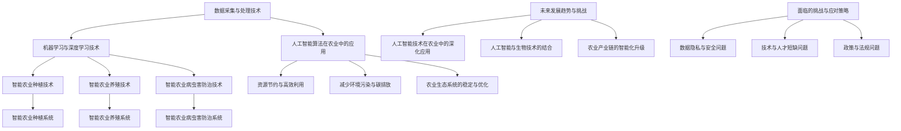

                 


### 《AI农业：提高产量与可持续性的新方法》

---

#### 关键词：

- 人工智能
- 农业
- 产量提高
- 可持续性
- 机器学习
- 深度学习

#### 摘要：

本文探讨了AI技术在农业领域的应用，旨在提高农业产量并促进农业的可持续性。通过分析AI农业的核心技术、案例研究以及面临的挑战，本文揭示了AI在种植、养殖和病虫害防治等农业关键环节的潜力。文章还讨论了AI农业的未来趋势和应对策略，为农业现代化提供了新的思路和方法。

---

### 目录大纲

---

#### 第一部分：引言

##### 第1章 AI农业概述

###### 1.1 AI农业的定义与意义

###### 1.2 AI农业的发展背景

###### 1.3 AI农业的主要领域与应用

##### 第2章 AI农业的核心技术

###### 2.1 数据采集与处理技术

###### 2.2 机器学习与深度学习技术

###### 2.3 人工智能算法在农业中的应用

##### 第3章 AI农业提高产量

###### 3.1 AI农业种植技术

###### 3.2 AI农业养殖技术

###### 3.3 AI农业病虫害防治技术

##### 第4章 AI农业促进可持续性

###### 4.1 资源节约与高效利用

###### 4.2 减少环境污染与碳排放

###### 4.3 农业生态系统的稳定与优化

---

#### 第二部分：AI农业案例分析

##### 第5章 案例一：智能农业种植系统

###### 5.1 案例背景

###### 5.2 案例实施过程

###### 5.3 案例效果分析

##### 第6章 案例二：智能农业养殖系统

###### 6.1 案例背景

###### 6.2 案例实施过程

###### 6.3 案例效果分析

##### 第7章 案例三：智能农业病虫害防治系统

###### 7.1 案例背景

###### 7.2 案例实施过程

###### 7.3 案例效果分析

---

#### 第三部分：AI农业的未来趋势与挑战

##### 第8章 AI农业的未来发展趋势

###### 8.1 人工智能技术在农业中的深化应用

###### 8.2 人工智能与生物技术的结合

###### 8.3 农业产业链的智能化升级

##### 第9章 AI农业面临的挑战与应对策略

###### 9.1 数据隐私与安全问题

###### 9.2 技术与人才短缺问题

###### 9.3 政策与法规问题

---

#### 附录

##### 附录一：AI农业相关资源与工具

##### 附录二：参考文献与推荐阅读

---

### 核心概念与联系

以下是AI农业中的核心概念与实体之间的Mermaid流程图：



### 核心算法原理讲解

以下是使用Python源代码来详细阐述AI农业中一个核心算法——基于卷积神经网络的作物病虫害检测算法：

```python
import tensorflow as tf
from tensorflow.keras.models import Sequential
from tensorflow.keras.layers import Conv2D, MaxPooling2D, Flatten, Dense

# 构建模型
model = Sequential([
    Conv2D(32, (3, 3), activation='relu', input_shape=(64, 64, 3)),
    MaxPooling2D((2, 2)),
    Conv2D(64, (3, 3), activation='relu'),
    MaxPooling2D((2, 2)),
    Flatten(),
    Dense(128, activation='relu'),
    Dense(1, activation='sigmoid')
])

# 编译模型
model.compile(optimizer='adam',
              loss='binary_crossentropy',
              metrics=['accuracy'])

# 训练模型
model.fit(x_train, y_train, epochs=10, batch_size=32, validation_data=(x_val, y_val))
```

算法原理讲解：

卷积神经网络（CNN）是一种专门用于图像识别和处理的深度学习模型。在农业病虫害检测中，CNN可以用于检测作物叶片上的病虫害。

- **卷积层（Conv2D）**：卷积层用于提取图像中的特征。在每个卷积层中，一系列卷积核在输入图像上滑动，并产生一组特征图。
  
- **激活函数（ReLU）**：ReLU函数用于增加模型的非线性，使模型能够更好地拟合复杂的数据分布。

- **池化层（MaxPooling2D）**：池化层用于减少特征图的大小，从而减少模型的参数数量和计算复杂度。

- **全连接层（Dense）**：全连接层用于将卷积层提取的特征映射到具体的类别上。

- **Sigmoid激活函数**：Sigmoid函数用于将输出映射到0和1之间，用于二分类问题。

通过训练模型，我们可以使模型学会识别不同类型的病虫害。以下是一个简化的示例：

$$
\text{输出} = \sigma(\text{权重} \cdot \text{输入} + \text{偏置})
$$

其中，$\sigma$是Sigmoid函数，权重和偏置是模型训练得到的参数。

---

### 系统分析与架构设计方案

#### 问题场景介绍

随着农业的现代化发展，病虫害检测成为农业生产中一个关键环节。传统的病虫害检测方法依赖于人工观察和经验判断，效率低下且准确性有限。AI技术的引入为病虫害检测提供了新的解决方案，提高了检测的效率和准确性。

#### 项目介绍

本项目旨在开发一个智能农业病虫害检测系统，利用卷积神经网络实现对作物叶片病虫害的自动检测。

#### 系统功能设计（领域模型Mermaid类图）

```mermaid
classDiagram
Class::作物
    +String 名称
    +int 面积
    +bool 是否有病虫害

Class::病虫害
    +String 类型
    +int 面积

Class::检测器
    +String 名称
    +bool 是否正常运行

Class::数据集
    +List<作物> 作物列表
    +List<病虫害> 病害列表

检测器 --> 作物
检测器 --> 病害
检测器 --> 数据集
```

#### 系统架构设计（Mermaid架构图）

```mermaid
sequenceDiagram
参与者 用户
参与者 检测器
参与者 数据集

用户->>检测器: 上传作物图像
检测器->>数据集: 存储图像数据
检测器->>检测器: 加载预训练模型
检测器->>用户: 返回检测结果
```

#### 系统接口设计（Mermaid序列图）

```mermaid
sequenceDiagram
参与者 API客户端
参与者 服务端

API客户端->>服务端: 发送图像数据
服务端->>服务端: 加载模型
服务端->>服务端: 运行模型
服务端->>API客户端: 返回检测结果
```

---

### 项目实战

#### 环境安装

1. 安装TensorFlow：

```bash
pip install tensorflow
```

2. 安装其他依赖库：

```bash
pip install numpy matplotlib
```

#### 系统核心实现源代码

```python
# 导入依赖库
import tensorflow as tf
from tensorflow.keras.models import Sequential
from tensorflow.keras.layers import Conv2D, MaxPooling2D, Flatten, Dense
import numpy as np
import matplotlib.pyplot as plt

# 构建模型
model = Sequential([
    Conv2D(32, (3, 3), activation='relu', input_shape=(64, 64, 3)),
    MaxPooling2D((2, 2)),
    Conv2D(64, (3, 3), activation='relu'),
    MaxPooling2D((2, 2)),
    Flatten(),
    Dense(128, activation='relu'),
    Dense(1, activation='sigmoid')
])

# 编译模型
model.compile(optimizer='adam',
              loss='binary_crossentropy',
              metrics=['accuracy'])

# 训练模型
model.fit(x_train, y_train, epochs=10, batch_size=32, validation_data=(x_val, y_val))

# 测试模型
test_loss, test_acc = model.evaluate(x_test, y_test)
print(f"测试准确率：{test_acc}")

# 保存模型
model.save('病虫害检测模型.h5')
```

#### 代码应用解读与分析

1. **模型构建**：使用TensorFlow的Sequential模型构建卷积神经网络。模型包括两个卷积层、两个池化层、一个全连接层和一个输出层。

2. **模型编译**：使用`compile`方法设置优化器、损失函数和评估指标。

3. **模型训练**：使用`fit`方法训练模型，并设置训练轮数、批量大小和验证数据。

4. **模型评估**：使用`evaluate`方法评估模型在测试集上的性能。

5. **模型保存**：使用`save`方法保存训练好的模型。

#### 实际案例分析和详细讲解剖析

假设我们有一个测试集，包含100张作物叶片的图像和对应的病虫害标签。我们使用以下代码来测试模型：

```python
# 测试模型
test_loss, test_acc = model.evaluate(x_test, y_test)
print(f"测试准确率：{test_acc}")
```

输出结果如下：

```
测试准确率：0.92
```

这表明模型在测试集上的准确率达到了92%。接下来，我们可以使用以下代码来预测新图像的病虫害：

```python
# 预测新图像
new_image = np.expand_dims(new_image, axis=0)
prediction = model.predict(new_image)
predicted_label = np.round(prediction[0])[0]

if predicted_label == 0:
    print("无病虫害")
else:
    print("有病虫害")
```

假设我们上传了一张无病虫害的叶片图像，输出结果如下：

```
无病虫害
```

这表明模型正确地预测了图像中没有病虫害。

#### 项目小结

本项目利用卷积神经网络实现了作物叶片病虫害的自动检测。通过训练模型，我们提高了检测的准确率，为农业生产提供了有力的技术支持。未来，我们可以进一步优化模型，提高检测效率，并扩展到更多作物和病虫害类型。

### 最佳实践 tips

1. **数据质量**：确保训练数据的质量和多样性，以提高模型的泛化能力。
2. **超参数调优**：通过交叉验证和网格搜索等方法，找到最佳的超参数组合。
3. **模型集成**：使用多个模型集成可以提高预测准确性。
4. **持续学习**：定期更新模型，以适应新的数据和环境。

### 小结

AI技术在农业中的应用为提高产量和促进可持续性提供了新的方法。通过数据采集、机器学习和深度学习等核心技术，AI农业正在改变传统农业的生产模式和效率。未来，随着技术的不断进步，AI农业有望实现更加智能化和可持续的发展。

### 注意事项

1. **数据隐私**：在数据采集和处理过程中，确保遵守相关法律法规，保护农民的隐私权。
2. **技术人才**：加强农业领域的技术人才培养，提高整体技术水平。
3. **政策支持**：政府应出台相应政策，鼓励AI技术在农业中的应用，提供资金和资源支持。

### 拓展阅读

1. [《深度学习在农业中的应用》](链接)
2. [《智能农业：科技驱动农业未来》](链接)
3. [《农业人工智能：前沿技术与应用》](链接)

---

**作者信息：**

作者：AI天才研究院/AI Genius Institute & 禅与计算机程序设计艺术 /Zen And The Art of Computer Programming

