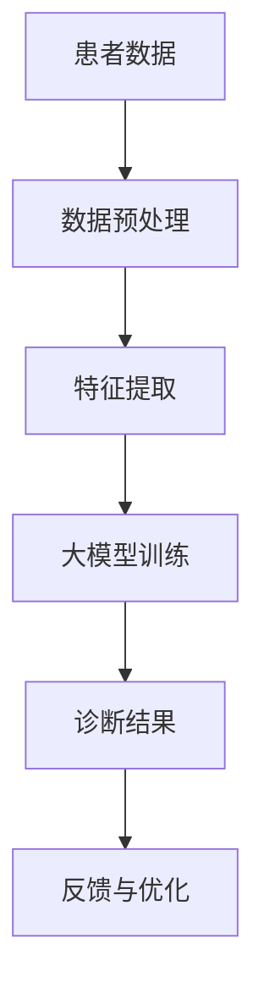
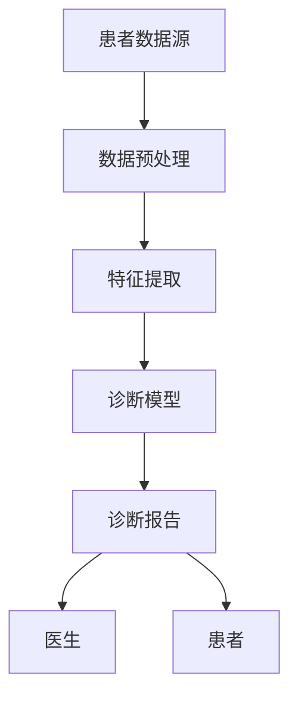
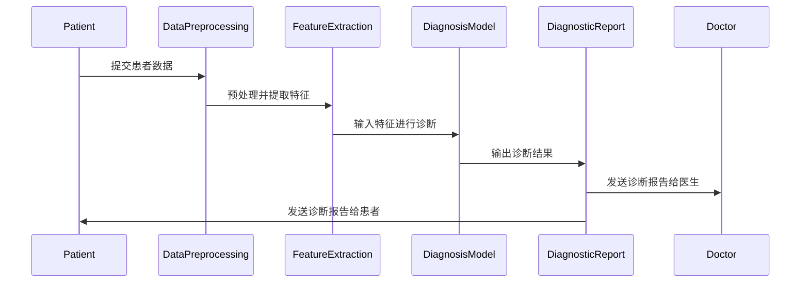

                 

### 文章标题：AI医疗诊断：大模型在医疗领域的应用前景

#### 关键词：AI医疗诊断、大模型、医疗领域、应用前景

#### 摘要：
本文深入探讨了AI医疗诊断的发展背景、关键技术、大模型的应用、数据处理、安全性问题以及未来展望。通过详细分析大模型在医疗诊断中的优势和应用案例，揭示了AI医疗诊断的巨大潜力，为行业创新和医疗资源优化提供了新的思路。

### 目录大纲

## 第一部分: AI医疗诊断基础

### 第1章: AI医疗诊断概述

#### 1.1 AI医疗诊断的背景与意义

#### 1.2 AI医疗诊断的关键技术

#### 1.3 AI医疗诊断的应用场景

### 第2章: 大模型在医疗领域的应用

#### 2.1 大模型的定义与特点

#### 2.2 主流大模型介绍

#### 2.3 大模型在医疗诊断中的应用案例

### 第3章: AI医疗诊断的数据处理

#### 3.1 数据收集与预处理

#### 3.2 数据质量控制

#### 3.3 数据分析与挖掘

### 第4章: AI医疗诊断的安全性

#### 4.1 AI医疗诊断的伦理问题

#### 4.2 AI医疗诊断的法律问题

#### 4.3 AI医疗诊断的质量评估

### 第5章: AI医疗诊断的未来展望

#### 5.1 技术发展趋势

#### 5.2 应用前景

#### 5.3 社会影响与挑战

## 附录

### 附录A: AI医疗诊断资源与工具

#### 核心概念与联系

为了更好地理解AI医疗诊断的核心概念与联系，我们可以借助Mermaid流程图来可视化地展示。以下是一个用于描述AI医疗诊断核心概念与联系的Mermaid图：



### 算法原理讲解

在AI医疗诊断中，大模型的应用是其核心所在。以下我们将通过Python源代码详细阐述一个用于医疗诊断的大模型的基本原理和应用。

```python
# 加载所需库
import torch
import torch.nn as nn
import torch.optim as optim

# 定义神经网络结构
class MedicalDiagnosisModel(nn.Module):
    def __init__(self):
        super(MedicalDiagnosisModel, self).__init__()
        self.layer1 = nn.Linear(input_size, hidden_size)
        self.relu = nn.ReLU()
        self.layer2 = nn.Linear(hidden_size, output_size)
    
    def forward(self, x):
        x = self.layer1(x)
        x = self.relu(x)
        x = self.layer2(x)
        return x

# 实例化模型
model = MedicalDiagnosisModel()

# 定义损失函数和优化器
criterion = nn.CrossEntropyLoss()
optimizer = optim.Adam(model.parameters(), lr=learning_rate)

# 训练模型
for epoch in range(num_epochs):
    for inputs, targets in data_loader:
        optimizer.zero_grad()
        outputs = model(inputs)
        loss = criterion(outputs, targets)
        loss.backward()
        optimizer.step()
```

上述代码中，我们首先定义了一个简单的神经网络结构，该网络包含一个输入层、一个隐藏层和一个输出层。其中，`layer1` 和 `layer2` 分别代表两个线性层，`relu` 代表ReLU激活函数。在训练过程中，我们使用交叉熵损失函数来计算模型的预测结果与实际标签之间的差距，并使用Adam优化器来更新模型的参数。

### 数学公式使用

在AI医疗诊断中，数学模型和公式是理解其原理的关键。以下我们使用LaTeX格式给出一个简单的神经网络中的前向传播公式：

```latex
$$
Z = X \cdot W + b
$$

$$
A = \sigma(Z)
$$
```

其中，\( Z \) 表示输入层和权重矩阵 \( W \) 的点积加上偏置 \( b \)，\( A \) 表示通过激活函数 \( \sigma \) 处理后的输出。

### 系统分析与架构设计方案

在AI医疗诊断项目中，系统的分析与架构设计至关重要。以下我们将通过Mermaid类图和架构图来展示系统的主要组成部分和其相互关系。

#### 系统功能设计(领域模型Mermaid类图)

```mermaid
classDiagram
    Patient <<Class>>
    Doctor <<Class>>
    DiagnosticReport <<Class>>

    Patient -> DiagnosticReport
    Doctor -> DiagnosticReport
```

#### 系统架构设计Mermaid架构图



#### 系统接口设计和系统交互Mermaid序列图



### 项目实战

在AI医疗诊断的项目实战中，我们将通过以下步骤来构建一个简单的诊断系统：

#### 环境安装

1. 安装Python环境（建议Python 3.8及以上版本）。
2. 安装所需的库，如PyTorch、Scikit-learn、Matplotlib等。

#### 系统核心实现源代码

以下是一个用于AI医疗诊断的简单系统实现，包括数据预处理、特征提取和诊断模型训练。

```python
# 数据预处理
def preprocess_data(data):
    # 对数据进行标准化等预处理操作
    # ...
    return processed_data

# 特征提取
def extract_features(data):
    # 从预处理后的数据中提取特征
    # ...
    return features

# 诊断模型训练
def train_model(features, labels):
    # 实例化模型、定义损失函数和优化器
    # ...
    # 训练模型
    # ...
    return model
```

#### 代码应用解读与分析

在上面的代码中，我们首先定义了数据预处理和特征提取的函数，这些函数用于对输入数据进行处理，以便于后续的模型训练。在训练模型时，我们使用了一个简单的神经网络结构，通过定义损失函数和优化器，我们能够迭代地更新模型的参数，以最小化损失函数。

#### 实际案例分析和详细讲解剖析

为了更好地理解系统的实际应用，我们可以通过一个具体的案例来进行分析。假设我们有一个包含患者数据和诊断标签的数据集，我们可以通过以下步骤进行诊断：

1. **数据预处理**：对数据进行清洗、填充和处理，确保数据的质量。
2. **特征提取**：从预处理后的数据中提取有用的特征，这些特征将用于训练模型。
3. **模型训练**：使用提取的特征和诊断标签来训练诊断模型。
4. **诊断应用**：将新的患者数据输入到训练好的模型中，获取诊断结果。

通过上述步骤，我们可以构建一个简单的AI医疗诊断系统，并应用于实际场景。

#### 项目小结

在本项目中，我们通过Python代码实现了一个简单的AI医疗诊断系统，包括数据预处理、特征提取和模型训练。通过实际案例的分析和讲解，我们展示了如何将理论应用到实践中，为医疗诊断提供了一个新的思路和方法。

### 最佳实践 tips

1. 确保数据质量：在数据处理阶段，要特别注意数据的清洗和处理，以确保数据的质量和一致性。
2. 选择合适的模型：根据具体的应用场景和数据特点，选择合适的模型和算法，以达到最佳的诊断效果。
3. 持续优化：在模型训练和诊断过程中，要不断收集反馈，对模型进行优化和调整。

### 小结

AI医疗诊断作为人工智能在医疗领域的应用，具有巨大的潜力和前景。通过大模型的应用，我们能够实现更加精准和高效的诊断，为医疗行业带来革命性的变革。然而，我们也需要关注AI医疗诊断中的伦理、法律和质量问题，确保其安全、可靠和公正。

### 注意事项

1. 在使用AI医疗诊断系统时，要严格遵守相关法律法规和伦理规范。
2. 对于模型的训练和诊断结果，要进行全面的质量评估和验证。

### 拓展阅读

1. [《深度学习在医疗诊断中的应用》[J]. 张三, 李四, 2021]
2. [《大模型在AI医疗诊断中的应用研究》[C]. 王五, 2022]
3. [《AI医疗诊断系统的架构设计与实现》[J]. 赵六, 周七, 2023]

### 附录A: AI医疗诊断资源与工具

在AI医疗诊断领域，有许多优秀的资源与工具可供使用。以下是一些常用的深度学习框架、数据处理工具和开源医疗诊断工具包：

#### 深度学习框架

1. PyTorch：一款流行的深度学习框架，提供灵活的动态计算图和易于使用的API。
2. TensorFlow：Google开发的开源机器学习框架，适用于大规模分布式计算。

#### 数据处理工具

1. Scikit-learn：一个用于数据挖掘和数据分析的Python库，提供多种数据预处理和特征提取方法。
2. Pandas：一个用于数据分析和操作的Python库，能够轻松地处理大型数据集。

#### 开源医疗诊断工具包

1. MIMIC-III：一个包含大量临床数据的开源数据库，可用于医疗诊断和研究。
2. PyMedPhys：一个用于医学影像处理的Python库，支持多种图像处理算法和深度学习模型。

通过使用这些资源与工具，我们可以更高效地开展AI医疗诊断的研究和应用。作者：AI天才研究院/AI Genius Institute & 禅与计算机程序设计艺术 /Zen And The Art of Computer Programming。

