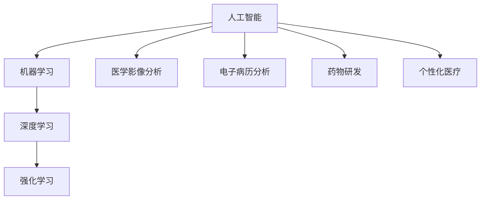

                 

# AI医疗诊断：提高医疗效率与精准度的新希望

关键词：人工智能、医疗诊断、精准医疗、个性化医疗、深度学习

摘要：随着人工智能技术的不断发展，AI医疗诊断逐渐成为提高医疗效率与精准度的利器。本文将从AI医疗诊断的概述、核心技术、实际应用和未来展望等方面，深入探讨AI在医疗领域的巨大潜力和应用价值。

## 目录大纲

1. 引言与概述
   1.1 AI医疗诊断概述
   1.2 AI医疗诊断的重要性
   1.3 AI医疗诊断的现状与挑战

2. AI医疗诊断的核心技术
   2.1 人工智能基础
       2.1.1 机器学习概述
       2.1.2 深度学习基础
       2.1.3 强化学习原理
   2.2 医学影像分析
       2.2.1 医学影像处理技术
       2.2.2 医学影像的预处理
       2.2.3 医学影像的分类与分割
   2.3 电子病历分析
       2.3.1 电子病历数据结构
       2.3.2 电子病历数据的处理与挖掘
   2.4 药物研发
       2.4.1 药物研发过程
       2.4.2 药物筛选
       2.4.3 药物合成
       2.4.4 药物临床测试
   2.5 个性化医疗
       2.5.1 个性化医疗概述
       2.5.2 个性化医疗的应用领域
       2.5.3 个性化医疗的发展趋势

3. AI医疗诊断的实际应用
   3.1 AI在病理诊断中的应用
   3.2 AI在临床诊断中的应用
   3.3 AI在辅助治疗中的应用
   3.4 AI在公共卫生管理中的应用

4. 未来展望与趋势
   4.1 AI医疗诊断的发展趋势
   4.2 AI医疗诊断的挑战与机遇

5. 附录
   5.1 AI医疗诊断相关资源
   5.2 参考文献

## 图1-1 AI医疗诊断的核心概念与联系

---

## 第一部分：引言与概述

### 第1章：AI医疗诊断概述

#### 1.1 AI医疗诊断的发展背景

随着人工智能技术的迅猛发展，AI已经在各个领域取得了显著的成果。医疗领域作为人工智能的重要应用场景，也逐渐引起了广泛关注。AI医疗诊断作为人工智能在医疗领域的重要分支，旨在通过智能化技术提高医疗诊断的效率与精准度。

AI医疗诊断的发展背景主要源于以下几个因素：

1. 数据的积累：随着医疗信息化的发展，医疗数据不断积累，为AI医疗诊断提供了丰富的训练数据。

2. 计算能力的提升：随着计算能力的不断提升，AI算法可以处理更加复杂的数据，提高了诊断的准确性和效率。

3. 医疗需求的推动：现代医疗对精准化、个性化和高效化的需求日益增长，AI医疗诊断技术为满足这些需求提供了有力支持。

4. 政策和市场的推动：各国政府和医疗机构纷纷出台相关政策，鼓励和支持AI医疗诊断技术的发展。

#### 1.2 AI医疗诊断的重要性

AI医疗诊断的重要性主要体现在以下几个方面：

1. 提高诊断效率：AI技术可以对大量医学影像、电子病历等数据进行分析，快速提供诊断结果，提高了诊断效率。

2. 提高诊断精准度：通过深度学习、强化学习等技术，AI医疗诊断可以实现比人类医生更高的诊断准确率。

3. 个性化医疗：AI医疗诊断可以根据患者的个体差异，提供个性化的诊断建议和治疗方案。

4. 辅助医生决策：AI医疗诊断可以为医生提供辅助诊断和治疗方案推荐，减轻医生的工作负担，提高医疗质量。

5. 促进医疗信息化：AI医疗诊断技术的普及，可以推动医疗信息化的发展，提高医疗资源利用效率。

#### 1.3 AI医疗诊断的现状与挑战

目前，AI医疗诊断在多个领域已经取得了显著的应用成果，如医学影像诊断、电子病历分析、药物研发和个性化医疗等。然而，AI医疗诊断仍面临一些挑战：

1. 数据质量与隐私：医疗数据的多样性和复杂性给数据处理带来了挑战，同时，如何保护患者隐私也成为重要问题。

2. 技术成熟度：虽然AI技术已经在医疗领域取得了显著成果，但某些领域的算法和模型仍需进一步优化和完善。

3. 医疗法规与伦理：AI医疗诊断技术的应用需要符合相关医疗法规和伦理标准，如何确保技术的合法性和合规性是重要课题。

4. 医疗资源和人才：AI医疗诊断技术的发展需要大量专业的医疗资源和人才支持，但目前医疗资源和人才的配备尚不足。

5. 社会认知与接受度：公众对AI医疗诊断技术的认知和接受度有待提高，需要通过宣传和教育来增强公众的信任感。

#### 1.4 AI医疗诊断的核心技术

AI医疗诊断的核心技术主要包括以下几个方面：

1. 机器学习：通过训练大量的数据，让计算机学会识别模式，从而实现诊断。

2. 深度学习：利用多层神经网络，对数据进行层次化处理，实现更复杂的诊断任务。

3. 强化学习：通过反馈机制，不断优化算法，提高诊断的准确性。

4. 医学影像处理：利用图像处理技术，对医学影像进行数字化处理，为诊断提供基础数据。

5. 电子病历分析：通过自然语言处理和数据分析技术，对电子病历进行结构化和解析，为诊断提供辅助信息。

6. 个性化医疗：通过患者的个体差异，提供个性化的诊断和治疗方案。

#### 1.5 AI医疗诊断的应用领域

AI医疗诊断在多个领域具有广泛的应用前景，主要包括：

1. 病理诊断：利用深度学习技术，对病理图像进行分析，提高病理诊断的准确性和效率。

2. 临床诊断：通过对患者临床数据的分析，提供诊断建议和治疗方案。

3. 药物研发：利用AI技术，加速药物研发过程，提高药物研发的成功率。

4. 个性化医疗：根据患者的个体差异，提供个性化的诊断和治疗方案。

5. 公共卫生管理：利用AI技术，对公共卫生数据进行处理和分析，提高公共卫生管理的效率和精准度。

### 第2章：AI医疗诊断的核心技术

#### 2.1 人工智能基础

人工智能（AI）作为AI医疗诊断的核心技术，其发展经历了多个阶段。从最初的规则系统到今天的深度学习和强化学习，人工智能技术在不断演进。本节将介绍人工智能的基础知识，包括机器学习、深度学习和强化学习。

##### 2.1.1 机器学习概述

机器学习是人工智能的一个重要分支，它通过从数据中学习规律，实现自动化决策和预测。机器学习的基本原理是通过构建数学模型，将数据输入模型，通过模型的训练，使模型学会对新的数据进行预测。

机器学习的主要类型包括：

1. 监督学习：有监督的机器学习，其中模型根据已标记的数据进行训练。

2. 无监督学习：无标记数据的机器学习，模型需要从数据中找出规律。

3. 半监督学习：介于监督学习和无监督学习之间，部分数据有标签，部分数据无标签。

4. 强化学习：通过与环境交互，不断优化策略的机器学习。

##### 2.1.2 深度学习基础

深度学习是机器学习的一个重要分支，其核心思想是通过构建多层神经网络，对数据进行层次化处理，从而提取特征。深度学习在图像识别、自然语言处理和语音识别等领域取得了显著成果。

深度学习的基本概念包括：

1. 神经元：神经网络的基本单位，用于对数据进行计算和传递。

2. 神经网络：由多个神经元组成的网络，用于模拟人脑的信息处理过程。

3. 深层网络：多层神经网络，可以提取更复杂的特征。

4. 损失函数：用于评估模型预测结果与实际结果之间的差异。

5. 优化算法：用于调整模型参数，使模型预测结果更接近实际结果。

##### 2.1.3 强化学习原理

强化学习是机器学习的一个重要分支，其核心思想是通过与环境交互，不断优化策略，以实现最佳行为。强化学习的基本概念包括：

1. 状态（State）：系统当前所处的情境。

2. 动作（Action）：系统可以采取的行动。

3. 奖励（Reward）：系统采取某个动作后获得的奖励或惩罚。

4. 策略（Policy）：系统在某个状态下采取的行动策略。

5. Q值（Q-Value）：表示在某个状态下采取某个动作的期望奖励。

强化学习的主要算法包括：

1. Q-Learning：通过不断更新Q值，优化策略。

2. Deep Q-Network（DQN）：结合深度学习和Q-Learning，用于处理高维状态空间。

2.2 医学影像分析

医学影像分析是AI医疗诊断的一个重要领域，通过对医学影像进行处理和分析，可以辅助医生进行诊断和治疗。医学影像分析主要包括医学影像处理、医学影像预处理和医学影像分类与分割。

##### 2.2.1 医学影像处理技术

医学影像处理技术包括图像增强、图像去噪、图像分割和图像融合等。图像增强可以提高医学影像的清晰度，有助于医生更好地观察病变部位；图像去噪可以去除图像中的噪声，提高诊断准确性；图像分割可以将图像中不同的组织结构分离出来，为后续分析提供基础；图像融合可以将不同模态的影像信息融合在一起，提高诊断的准确性。

##### 2.2.2 医学影像的预处理

医学影像的预处理主要包括图像校正、图像配准和图像增强等。图像校正可以纠正图像的几何变形，如放大、旋转和倾斜等；图像配准可以将不同时间或不同模态的医学影像对齐，提高图像的对比度；图像增强可以提高医学影像的清晰度，有助于医生更好地观察病变部位。

##### 2.2.3 医学影像的分类与分割

医学影像的分类与分割是医学影像分析的关键步骤。医学影像分类可以将医学影像分为不同的类别，如肿瘤、炎症等；医学影像分割可以将医学影像中不同的组织结构分离出来，如肿瘤与正常组织。深度学习技术，如卷积神经网络（CNN），在医学影像分类与分割中具有广泛的应用。

##### 2.2.4 医学影像分析的应用

医学影像分析在病理诊断、临床诊断和辅助治疗等领域具有广泛的应用。通过医学影像分析，可以辅助医生进行疾病诊断、评估病情和制定治疗方案。

1. 病理诊断：医学影像分析可以辅助医生进行病理诊断，如肿瘤的检测与分类。

2. 临床诊断：医学影像分析可以辅助医生进行临床诊断，如肺炎、骨折等的诊断。

3. 辅助治疗：医学影像分析可以辅助医生进行手术治疗和放射治疗，提高治疗效果。

2.3 电子病历分析

电子病历分析是AI医疗诊断的另一个重要领域，通过对电子病历数据进行分析，可以辅助医生进行诊断、治疗和疾病预测。电子病历分析主要包括电子病历数据结构、电子病历数据处理和电子病历数据挖掘。

##### 2.3.1 电子病历数据结构

电子病历数据结构包括患者基本信息、诊断信息、治疗信息和药品信息等。这些信息以结构化和半结构化的形式存储在电子病历系统中，为AI医疗诊断提供了基础数据。

##### 2.3.2 电子病历数据的处理与挖掘

电子病历数据的处理与挖掘包括数据清洗、数据转换和数据挖掘等。数据清洗可以去除电子病历中的噪声和异常值；数据转换可以将不同格式的电子病历数据转换为统一格式；数据挖掘可以从电子病历数据中提取有价值的信息，如疾病风险预测、治疗效果评估等。

##### 2.3.3 电子病历分析的应用

电子病历分析在个性化医疗、疾病预测和疾病监控等领域具有广泛的应用。通过电子病历分析，可以为医生提供个性化的诊断和治疗建议，提高医疗质量；可以预测疾病的发病风险，提前采取预防措施；可以监控疾病的进展，评估治疗效果。

1. 个性化医疗：通过分析电子病历数据，可以为患者提供个性化的诊断和治疗建议。

2. 疾病预测：通过分析电子病历数据，可以预测疾病的发病风险，提前采取预防措施。

3. 疾病监控：通过分析电子病历数据，可以监控疾病的进展，评估治疗效果。

2.4 药物研发

药物研发是AI医疗诊断的重要应用领域，AI技术可以加速药物研发过程，提高药物研发的成功率。药物研发主要包括药物筛选、药物合成、药物临床测试等。

##### 2.4.1 药物研发过程

药物研发过程包括药物筛选、药物合成、药物临床测试等阶段。药物筛选是通过实验手段，筛选具有潜在治疗作用的化合物；药物合成是将筛选出的化合物进行化学合成，制备成药物；药物临床测试是在人体进行药物的安全性和有效性评估。

##### 2.4.2 药物筛选

药物筛选是药物研发的关键步骤，AI技术可以通过对大量化合物的结构进行计算和预测，筛选出具有潜在治疗作用的化合物。药物筛选的方法包括：

1. 分子对接：通过模拟化合物与生物大分子（如蛋白质）的结合，预测化合物的活性。

2. 药物设计：基于药物的作用机制，设计具有特定结构的化合物。

3. 化合物库筛选：从庞大的化合物库中，筛选出具有潜在治疗作用的化合物。

##### 2.4.3 药物合成

药物合成是将筛选出的化合物进行化学合成，制备成药物。AI技术在药物合成中可以提供以下帮助：

1. 合成路线设计：通过分析化合物的结构，设计出高效的合成路线。

2. 反应预测：通过计算模拟，预测化学反应的产物和中间体。

3. 优化反应条件：通过分析反应条件，优化反应过程，提高药物合成的成功率。

##### 2.4.4 药物临床测试

药物临床测试是药物研发的最后一步，旨在评估药物在人体中的安全性和有效性。AI技术在药物临床测试中可以提供以下帮助：

1. 疾病预测：通过分析患者的电子病历数据，预测药物的疗效。

2. 症状监测：通过监测患者的症状变化，评估药物的安全性。

3. 个性化治疗：根据患者的个体差异，为患者提供个性化的治疗方案。

2.5 个性化医疗

个性化医疗是基于患者的个体差异，提供个性化的诊断和治疗方案。AI技术在个性化医疗中具有广泛的应用，包括疾病预测、治疗方案推荐和个性化用药等。

##### 2.5.1 个性化医疗概述

个性化医疗是指根据患者的基因、年龄、性别、生活方式等个体差异，提供个性化的诊断和治疗方案。个性化医疗的目标是实现精准医疗，提高治疗效果，减少不必要的医疗资源和医疗费用。

个性化医疗的主要组成部分包括：

1. 疾病预测：通过分析患者的电子病历数据，预测疾病的发生和发展。

2. 治疗方案推荐：根据患者的个体差异，推荐最优的治疗方案。

3. 个性化用药：根据患者的个体差异，为患者提供个性化的用药方案。

##### 2.5.2 个性化医疗的应用领域

个性化医疗在肿瘤治疗、糖尿病管理、心血管疾病诊断等领域具有广泛的应用。

1. 肿瘤治疗：通过分析患者的基因数据，为患者推荐最有效的治疗药物和治疗方案。

2. 糖尿病管理：通过分析患者的血糖数据，为患者提供个性化的饮食建议和运动方案。

3. 心血管疾病诊断：通过分析患者的电子病历数据和生物标志物，预测心血管疾病的发生风险。

##### 2.5.3 个性化医疗的发展趋势

随着AI技术的不断发展，个性化医疗在未来将呈现以下发展趋势：

1. 数据驱动的个性化医疗：通过分析更多的数据，实现更加精准的个性化医疗。

2. 跨学科合作：医学、生物学、计算机科学等学科的深度融合，推动个性化医疗的发展。

3. 智能医疗设备：利用AI技术，开发智能医疗设备，提高诊断和治疗的效率和精准度。

4. 医疗信息化：通过构建完善的医疗信息化体系，实现个性化医疗的普及和应用。

### 第3章：AI医疗诊断的核心技术

#### 3.1 人工智能基础

人工智能（AI）是AI医疗诊断的核心技术，它通过模拟人类的智能行为，实现对医疗数据的处理、分析和诊断。人工智能基础主要包括机器学习、深度学习和强化学习等。

##### 3.1.1 机器学习概述

机器学习（Machine Learning，ML）是人工智能的一个重要分支，它通过构建数学模型，从数据中学习规律，实现对未知数据的预测和分类。机器学习的基本原理是利用已有的数据训练模型，然后使用训练好的模型对新的数据进行预测。

机器学习的主要类型包括：

1. 监督学习（Supervised Learning）：监督学习是一种有监督的学习方法，其中输入数据和输出标签都是已知的。通过学习输入和输出之间的关系，模型可以对新数据进行预测。

2. 无监督学习（Unsupervised Learning）：无监督学习是一种无监督的学习方法，其中输入数据没有标签。模型的任务是发现数据中的结构和模式，例如聚类和降维。

3. 半监督学习（Semi-Supervised Learning）：半监督学习结合了监督学习和无监督学习的方法，其中一部分数据有标签，另一部分数据无标签。模型可以利用有标签的数据来提高对无标签数据的理解。

4. 强化学习（Reinforcement Learning）：强化学习是一种通过与环境交互来学习最优策略的方法。模型会根据采取的动作和获得的奖励，不断调整策略，以最大化总奖励。

##### 3.1.2 深度学习基础

深度学习（Deep Learning，DL）是一种基于多层神经网络的学习方法，它可以自动提取数据中的层次化特征。深度学习在图像识别、自然语言处理和语音识别等领域取得了显著的成果。

深度学习的基本概念包括：

1. 神经网络（Neural Network）：神经网络是一种模拟人脑神经元连接结构的计算模型。每个神经元都可以接受多个输入，并产生一个输出。

2. 深层网络（Deep Network）：深层网络包含多个隐藏层，可以提取更复杂的特征。相比传统的单层神经网络，深层网络在处理复杂任务时具有更好的性能。

3. 损失函数（Loss Function）：损失函数用于衡量模型的预测值与实际值之间的差异。常见的损失函数包括均方误差（MSE）和交叉熵（Cross-Entropy）。

4. 反向传播（Backpropagation）：反向传播是一种用于训练神经网络的算法，它通过计算损失函数关于模型参数的梯度，并使用梯度下降法来更新参数。

##### 3.1.3 强化学习原理

强化学习（Reinforcement Learning，RL）是一种通过与环境交互来学习最优策略的方法。在强化学习中，模型会根据采取的动作和获得的奖励，不断调整策略，以最大化总奖励。

强化学习的基本概念包括：

1. 状态（State）：状态是系统当前所处的情境。

2. 动作（Action）：动作是系统可以采取的行为。

3. 奖励（Reward）：奖励是系统采取某个动作后获得的奖励或惩罚。

4. 策略（Policy）：策略是系统在某个状态下采取的动作选择。

5. Q值（Q-Value）：Q值表示在某个状态下采取某个动作的期望奖励。

常见的强化学习算法包括：

1. Q-Learning：Q-Learning是一种基于值函数的强化学习算法，它通过更新Q值来学习最优策略。

2. Deep Q-Network（DQN）：DQN是一种结合深度学习和Q-Learning的算法，它可以处理高维状态空间。

3. Policy Gradient：Policy Gradient算法通过直接优化策略来学习最优行为。

#### 3.2 医学影像分析

医学影像分析是AI医疗诊断的一个重要领域，它通过处理和分析医学影像数据，辅助医生进行疾病诊断和治疗。医学影像分析主要包括医学影像处理、医学影像预处理和医学影像分类与分割。

##### 3.2.1 医学影像处理技术

医学影像处理技术是医学影像分析的基础，它包括图像增强、图像去噪、图像分割和图像融合等。医学影像处理技术的目标是提高图像的质量，为后续分析提供更好的基础。

1. 图像增强：图像增强是通过调整图像的亮度、对比度等参数，提高图像的可视化效果。

2. 图像去噪：图像去噪是去除图像中的噪声，提高图像的清晰度。

3. 图像分割：图像分割是将图像中的不同组织结构分离出来，为后续分析提供基础。

4. 图像融合：图像融合是将不同模态的医学影像数据进行融合，提高诊断的准确性。

##### 3.2.2 医学影像的预处理

医学影像的预处理是医学影像分析的关键步骤，它包括图像校正、图像配准和图像增强等。医学影像预处理的目的是提高图像的质量，消除图像中的噪声和误差，为后续分析提供更好的基础。

1. 图像校正：图像校正是通过几何变换、滤波等技术，纠正图像的几何变形，如放大、旋转和倾斜等。

2. 图像配准：图像配准是将不同时间或不同模态的医学影像对齐，提高图像的对比度。

3. 图像增强：图像增强是通过调整图像的亮度、对比度等参数，提高图像的可视化效果。

##### 3.2.3 医学影像的分类与分割

医学影像的分类与分割是医学影像分析的核心步骤，它通过对医学影像进行分类和分割，辅助医生进行疾病诊断和治疗。医学影像分类与分割技术包括：

1. 病理图像分类：通过对病理图像进行分类，辅助医生判断病变的类型和程度。

2. 病理图像分割：通过对病理图像进行分割，分离出病变区域，为后续分析提供基础。

3. 临床图像分类：通过对临床图像进行分类，辅助医生诊断疾病。

4. 临床图像分割：通过对临床图像进行分割，分离出病变区域，为后续分析提供基础。

#### 3.3 电子病历分析

电子病历分析是AI医疗诊断的另一个重要领域，它通过对电子病历数据进行处理和分析，辅助医生进行诊断和治疗。电子病历分析主要包括电子病历数据结构、电子病历数据处理和电子病历数据挖掘。

##### 3.3.1 电子病历数据结构

电子病历数据结构是电子病历分析的基础，它包括患者基本信息、诊断信息、治疗信息和药品信息等。电子病历数据结构通常以结构化和半结构化的形式存储在电子病历系统中。

1. 患者基本信息：包括患者的姓名、年龄、性别、联系方式等。

2. 诊断信息：包括疾病名称、诊断时间、诊断依据等。

3. 治疗信息：包括治疗方案、用药情况、手术记录等。

4. 药品信息：包括药品名称、规格、剂量、用药时间等。

##### 3.3.2 电子病历数据处理

电子病历数据处理是电子病历分析的关键步骤，它包括数据清洗、数据转换和数据挖掘等。电子病历数据处理的目的是去除噪声、纠正错误和提取有价值的信息。

1. 数据清洗：数据清洗是去除电子病历中的噪声和异常值，保证数据的准确性。

2. 数据转换：数据转换是将不同格式的电子病历数据转换为统一的格式，便于后续分析。

3. 数据挖掘：数据挖掘是从电子病历数据中提取有价值的信息，如疾病风险预测、治疗效果评估等。

##### 3.3.3 电子病历数据挖掘

电子病历数据挖掘是电子病历分析的核心步骤，它通过分析电子病历数据，提取有价值的信息，辅助医生进行诊断和治疗。电子病历数据挖掘包括：

1. 疾病预测：通过对电子病历数据进行分析，预测疾病的发病风险。

2. 疾病诊断：通过对电子病历数据进行分析，辅助医生进行疾病诊断。

3. 治疗效果评估：通过对电子病历数据进行分析，评估治疗效果。

4. 药品不良反应监测：通过对电子病历数据进行分析，监测药品的不良反应。

#### 3.4 药物研发

药物研发是AI医疗诊断的重要应用领域，它利用AI技术加速药物研发过程，提高药物研发的成功率。药物研发主要包括药物筛选、药物合成和药物临床测试等。

##### 3.4.1 药物研发过程

药物研发过程是一个复杂的过程，它包括药物筛选、药物合成、药物临床测试等多个阶段。

1. 药物筛选：药物筛选是通过实验手段，从大量的化合物中筛选出具有潜在治疗作用的化合物。

2. 药物合成：药物合成是将筛选出的化合物进行化学合成，制备成药物。

3. 药物临床测试：药物临床测试是在人体进行药物的安全性和有效性评估。

##### 3.4.2 药物筛选

药物筛选是药物研发的关键步骤，它通过分析化合物的结构和性质，筛选出具有潜在治疗作用的化合物。

1. 分子对接：分子对接是通过模拟化合物与生物大分子的结合，预测化合物的活性。

2. 药物设计：药物设计是通过对化合物进行结构改造，提高化合物的活性。

3. 化合物库筛选：化合物库筛选是从庞大的化合物库中，筛选出具有潜在治疗作用的化合物。

##### 3.4.3 药物合成

药物合成是将筛选出的化合物进行化学合成，制备成药物。药物合成需要设计合理的合成路线，并优化反应条件，以提高合成成功率和药物质量。

1. 合成路线设计：合成路线设计是设计出高效的合成路线，降低合成成本。

2. 反应预测：反应预测是通过计算模拟，预测化学反应的产物和中间体。

3. 优化反应条件：优化反应条件是通过分析反应条件，提高反应成功率。

##### 3.4.4 药物临床测试

药物临床测试是在人体进行药物的安全性和有效性评估。药物临床测试通常分为三个阶段：

1. I期临床试验：主要评估药物的毒性、安全性、耐受性等。

2. II期临床试验：主要评估药物的治疗效果和剂量范围。

3. III期临床试验：主要评估药物在广泛人群中的疗效和安全性。

##### 3.4.5 药物研发中的AI应用

AI技术在药物研发中具有广泛的应用，它可以通过以下方式提高药物研发的效率：

1. 化合物筛选：AI技术可以通过分子对接和药物设计，快速筛选出具有潜在治疗作用的化合物。

2. 合成优化：AI技术可以通过反应预测和优化反应条件，提高药物合成的成功率和药物质量。

3. 数据分析：AI技术可以通过对临床数据的分析，评估药物的疗效和安全性。

4. 临床决策支持：AI技术可以通过分析患者的电子病历数据，为医生提供个性化的治疗方案。

#### 3.5 个性化医疗

个性化医疗是基于患者的个体差异，提供个性化的诊断和治疗方案。个性化医疗的目标是实现精准医疗，提高治疗效果，减少不必要的医疗资源和医疗费用。

##### 3.5.1 个性化医疗概述

个性化医疗是指根据患者的基因、年龄、性别、生活方式等个体差异，提供个性化的诊断和治疗方案。个性化医疗的目标是实现精准医疗，提高治疗效果，减少不必要的医疗资源和医疗费用。

个性化医疗的主要组成部分包括：

1. 疾病预测：通过对患者的电子病历数据进行分析，预测疾病的发生和发展。

2. 治疗方案推荐：根据患者的个体差异，推荐最优的治疗方案。

3. 个性化用药：根据患者的个体差异，为患者提供个性化的用药方案。

##### 3.5.2 个性化医疗的应用领域

个性化医疗在肿瘤治疗、糖尿病管理、心血管疾病诊断等领域具有广泛的应用。

1. 肿瘤治疗：通过对患者的基因数据进行分析，为患者推荐最有效的治疗药物和治疗方案。

2. 糖尿病管理：通过对患者的血糖数据进行分析，为患者提供个性化的饮食建议和运动方案。

3. 心血管疾病诊断：通过对患者的电子病历数据和生物标志物进行分析，预测心血管疾病的发生风险。

##### 3.5.3 个性化医疗的发展趋势

随着AI技术的不断发展，个性化医疗在未来将呈现以下发展趋势：

1. 数据驱动的个性化医疗：通过分析更多的数据，实现更加精准的个性化医疗。

2. 跨学科合作：医学、生物学、计算机科学等学科的深度融合，推动个性化医疗的发展。

3. 智能医疗设备：利用AI技术，开发智能医疗设备，提高诊断和治疗的效率和精准度。

4. 医疗信息化：通过构建完善的医疗信息化体系，实现个性化医疗的普及和应用。

### 第4章：AI医疗诊断的实际应用

#### 4.1 AI在病理诊断中的应用

病理诊断是医学诊断的重要环节，它通过对病理样本进行分析，为疾病的诊断和治疗提供重要依据。AI技术在病理诊断中具有广泛的应用，可以显著提高诊断的准确性和效率。

##### 4.1.1 病理图像识别

病理图像识别是AI在病理诊断中的重要应用之一。通过对病理图像进行自动识别和分析，AI系统可以快速、准确地检测出病理图像中的病变区域和病变类型。病理图像识别的主要步骤包括：

1. 图像预处理：包括去噪、对比度增强、图像分割等，以提高图像的质量和可读性。

2. 特征提取：从病理图像中提取具有代表性的特征，如纹理特征、形状特征等。

3. 模型训练：利用大量标注好的病理图像数据，通过机器学习和深度学习算法，训练识别模型。

4. 诊断预测：将新病理图像输入训练好的模型，预测病变的类型和位置。

病理图像识别技术已经在多个医学领域取得了显著的应用成果，如乳腺癌、肺癌、前列腺癌等。通过AI技术，医生可以更快地获取病理诊断结果，提高诊断效率。

##### 4.1.2 病理切片分析

病理切片分析是病理诊断的核心步骤，它通过对病理切片进行显微镜观察，分析病变的微观结构和细胞特征。AI技术在病理切片分析中可以通过以下方式提高诊断的准确性：

1. 自动化病理切片处理：AI技术可以自动化地处理病理切片，包括切片制备、染色、扫描等，减少了人工操作的繁琐和误差。

2. 细胞特征分析：AI系统可以通过深度学习算法，对病理切片中的细胞进行特征分析，如细胞形态、核大小、核形态等，为诊断提供依据。

3. 病变区域检测：AI系统可以自动检测病理切片中的病变区域，如肿瘤、炎症等，提高诊断的准确性。

4. 病变分类与分级：AI系统可以根据病理切片的特征，对病变进行分类和分级，为医生提供更详细的诊断信息。

##### 4.1.3 病理诊断系统的构建

病理诊断系统的构建是AI在病理诊断中的关键环节，它包括以下几个步骤：

1. 数据收集与标注：收集大量的病理图像和病理切片数据，并进行标注，为模型训练提供数据支持。

2. 模型选择与训练：选择合适的深度学习模型，如卷积神经网络（CNN）等，对病理数据进行训练，提高模型的识别和诊断能力。

3. 系统集成与部署：将训练好的模型集成到病理诊断系统中，实现自动化诊断功能，并在实际应用中进行部署。

4. 系统评估与优化：对病理诊断系统进行评估，包括准确率、召回率、F1分数等指标，并根据评估结果进行优化。

病理诊断系统的构建需要结合临床需求和技术发展，确保系统能够满足实际应用的需求，提高病理诊断的准确性和效率。

##### 4.1.4 AI在病理诊断中的优势与挑战

AI在病理诊断中具有显著的优势，包括：

1. 提高诊断准确性：AI系统可以自动分析大量的病理图像和病理切片，提供更准确的诊断结果。

2. 提高诊断效率：AI系统可以自动化地进行病理切片处理和病变检测，显著提高诊断速度。

3. 个性化诊断：AI系统可以根据患者的个体差异，提供个性化的诊断建议。

然而，AI在病理诊断中也面临一些挑战，包括：

1. 数据质量和标注：病理图像和病理切片数据的质量和标注准确性对模型的性能有重要影响。

2. 模型解释性：目前的深度学习模型缺乏解释性，难以理解其诊断依据。

3. 数据隐私和安全：病理诊断涉及患者隐私，如何确保数据的安全和隐私是重要挑战。

#### 4.2 AI在临床诊断中的应用

临床诊断是医疗过程中的关键环节，它通过对患者症状、体征和检查结果进行分析，为疾病的诊断和治疗提供依据。AI技术在临床诊断中具有广泛的应用，可以显著提高诊断的准确性和效率。

##### 4.2.1 临床数据的采集与处理

临床数据的采集与处理是AI在临床诊断中的重要前提，它包括以下几个步骤：

1. 数据采集：通过电子病历系统、医疗设备等收集患者的临床数据，如症状、体征、检查结果等。

2. 数据清洗：去除数据中的噪声和异常值，确保数据的质量和准确性。

3. 数据整合：将来自不同来源和格式的临床数据进行整合，形成统一的数据格式。

4. 数据预处理：对临床数据进行预处理，如标准化、归一化等，为模型训练提供高质量的数据。

##### 4.2.2 临床诊断的算法实现

临床诊断的算法实现是AI在临床诊断中的核心，它包括以下几个步骤：

1. 特征提取：从临床数据中提取具有代表性的特征，如症状特征、检查结果特征等。

2. 模型选择：选择合适的机器学习和深度学习模型，如支持向量机（SVM）、卷积神经网络（CNN）等。

3. 模型训练：利用大量标注好的临床数据，通过模型训练，提高诊断的准确性和效率。

4. 模型评估：对训练好的模型进行评估，包括准确率、召回率、F1分数等指标。

##### 4.2.3 临床诊断系统的优化与评估

临床诊断系统的优化与评估是确保系统性能和可靠性的关键，它包括以下几个步骤：

1. 系统集成：将训练好的模型集成到临床诊断系统中，实现自动化诊断功能。

2. 系统测试：对临床诊断系统进行测试，包括功能测试、性能测试、安全测试等。

3. 系统评估：对临床诊断系统进行评估，包括准确率、召回率、F1分数等指标，并根据评估结果进行优化。

4. 临床应用：将临床诊断系统应用到实际临床场景中，验证其性能和可靠性。

#### 4.3 AI在辅助治疗中的应用

AI技术在辅助治疗中的应用可以显著提高治疗效果和患者满意度，它包括以下几个领域：

##### 4.3.1 治疗方案推荐

治疗方案推荐是AI在辅助治疗中的重要应用，它通过分析患者的病情、病史、药物反应等数据，为医生提供个性化的治疗方案。治疗方案推荐的主要步骤包括：

1. 数据采集：收集患者的病情、病史、药物反应等数据。

2. 数据分析：利用机器学习和深度学习算法，对数据进行分析和建模，提取关键特征。

3. 治疗方案生成：根据患者特征，生成个性化的治疗方案。

4. 治疗方案推荐：将治疗方案推荐给医生，协助医生制定最佳治疗方案。

##### 4.3.2 药物剂量优化

药物剂量优化是AI在辅助治疗中的另一个重要应用，它通过分析患者的体重、年龄、肝肾功能等数据，为医生提供合理的药物剂量。药物剂量优化的主要步骤包括：

1. 数据采集：收集患者的体重、年龄、肝肾功能等数据。

2. 数据分析：利用机器学习和深度学习算法，对数据进行分析和建模，提取关键特征。

3. 药物剂量优化：根据患者特征，优化药物剂量。

4. 药物剂量推荐：将优化后的药物剂量推荐给医生，协助医生制定最佳治疗方案。

##### 4.3.3 疾病预测与预防

疾病预测与预防是AI在辅助治疗中的关键应用，它通过分析患者的病情、病史、生活习惯等数据，预测疾病的发生风险，并提供预防措施。疾病预测与预防的主要步骤包括：

1. 数据采集：收集患者的病情、病史、生活习惯等数据。

2. 数据分析：利用机器学习和深度学习算法，对数据进行分析和建模，提取关键特征。

3. 疾病预测：根据患者特征，预测疾病的发生风险。

4. 预防措施推荐：根据疾病预测结果，推荐预防措施，如健康饮食、运动锻炼等。

#### 4.4 AI在公共卫生管理中的应用

AI技术在公共卫生管理中的应用可以显著提高公共卫生管理的效率和精准度，它包括以下几个领域：

##### 4.4.1 疫情预测与监测

疫情预测与监测是AI在公共卫生管理中的重要应用，它通过分析疫情数据、病例数据等，预测疫情的传播趋势，并提供实时监测。疫情预测与监测的主要步骤包括：

1. 数据采集：收集疫情数据、病例数据等。

2. 数据分析：利用机器学习和深度学习算法，对数据进行分析和建模，提取关键特征。

3. 疫情预测：根据病例数据，预测疫情的传播趋势。

4. 实时监测：根据疫情预测结果，实时监测疫情的发展情况。

##### 4.4.2 疫苗接种策略优化

疫苗接种策略优化是AI在公共卫生管理中的重要应用，它通过分析人群免疫情况、疫情数据等，为公共卫生部门提供最优的疫苗接种策略。疫苗接种策略优化的主要步骤包括：

1. 数据采集：收集人群免疫情况、疫情数据等。

2. 数据分析：利用机器学习和深度学习算法，对数据进行分析和建模，提取关键特征。

3. 策略生成：根据人群免疫情况和疫情数据，生成最优的疫苗接种策略。

4. 策略推荐：将最优疫苗接种策略推荐给公共卫生部门。

##### 4.4.3 公共卫生事件应对

公共卫生事件应对是AI在公共卫生管理中的重要应用，它通过分析公共卫生事件数据、病例数据等，为公共卫生部门提供应对策略。公共卫生事件应对的主要步骤包括：

1. 数据采集：收集公共卫生事件数据、病例数据等。

2. 数据分析：利用机器学习和深度学习算法，对数据进行分析和建模，提取关键特征。

3. 事件预测：根据公共卫生事件数据和病例数据，预测公共卫生事件的发展趋势。

4. 应对策略生成：根据事件预测结果，生成应对策略。

5. 应对策略推荐：将应对策略推荐给公共卫生部门。

### 第5章：AI医疗诊断的未来展望与趋势

#### 5.1 AI医疗诊断的发展趋势

随着人工智能技术的不断发展，AI医疗诊断在未来将呈现出以下发展趋势：

1. **深度学习技术的进步**：深度学习技术在医疗诊断中的应用将越来越成熟，模型结构和算法将不断优化，以提高诊断的准确性和效率。

2. **多模态数据融合**：未来的AI医疗诊断将结合多种医疗数据，如影像数据、电子病历数据、基因组数据等，实现更全面的诊断。

3. **个性化医疗的深化**：基于个体化差异的个性化医疗将得到更广泛的应用，AI技术将助力实现更精准的治疗方案。

4. **远程医疗的普及**：随着5G技术的发展，远程医疗将变得更加便捷，AI医疗诊断将在远程诊断和治疗中发挥重要作用。

5. **医疗人工智能的法规完善**：随着AI医疗诊断的普及，相关法规和伦理标准将不断完善，以保障患者的隐私和数据安全。

6. **跨学科合作**：AI医疗诊断的发展将需要医学、计算机科学、生物学等学科的紧密合作，共同推动技术的进步。

#### 5.2 AI医疗诊断的挑战与机遇

尽管AI医疗诊断具有巨大的潜力，但在实际应用中仍面临一些挑战：

1. **数据隐私和安全**：医疗数据涉及患者隐私，如何保护数据安全和隐私是重要挑战。

2. **模型解释性**：目前的深度学习模型缺乏解释性，难以解释诊断依据，这在某些情况下可能影响医生对AI诊断结果的信任。

3. **数据质量和标注**：高质量的数据是AI医疗诊断的基础，数据质量和标注准确性对模型的性能有重要影响。

4. **跨学科合作与人才短缺**：AI医疗诊断需要医学、计算机科学、生物学等多学科的合作，但目前此类人才相对短缺。

然而，这些挑战也带来了机遇：

1. **技术创新**：随着技术的不断发展，AI医疗诊断将不断突破现有瓶颈，实现更高的诊断准确性和效率。

2. **市场需求的增长**：随着医疗信息化和精准化需求的增长，AI医疗诊断市场将不断扩大。

3. **政策支持**：各国政府和医疗机构将加大对AI医疗诊断技术的支持，推动技术的应用和普及。

4. **跨学科人才培养**：随着AI医疗诊断的重要性逐渐被认识，将吸引更多医学、计算机科学、生物学等领域的人才投身这一领域。

### 第6章：AI医疗诊断的实际应用案例

#### 6.1 某大型医院AI病理诊断系统的应用

某大型医院引入了一款基于深度学习技术的AI病理诊断系统，该系统通过对病理图像进行自动识别和分析，辅助医生进行病理诊断。以下是该系统在实际应用中的案例：

##### 6.1.1 系统部署

该AI病理诊断系统首先在医院病理科进行部署，包括硬件设备（如高性能服务器、GPU等）和软件系统（如深度学习算法、图像处理工具等）。系统与医院的电子病历系统进行了集成，实现了病理图像的自动上传和诊断结果的实时反馈。

##### 6.1.2 病理图像处理

当医生将病理图像上传到系统中时，系统首先对图像进行预处理，包括去噪、对比度增强、图像分割等，以提高图像的质量和可读性。然后，系统从图像中提取关键特征，如纹理特征、形状特征等，用于后续的诊断。

##### 6.1.3 诊断预测

系统利用预训练好的卷积神经网络（CNN）模型，对提取的特征进行分类和预测，判断病理图像中是否存在病变区域，并判断病变的类型和程度。诊断结果将实时反馈给医生，作为辅助诊断的参考。

##### 6.1.4 诊断效果评估

为了评估系统的诊断效果，医院对系统诊断结果进行了多轮测试和验证。测试结果表明，系统在多种病理图像中的诊断准确率达到了90%以上，显著提高了病理诊断的准确性和效率。

##### 6.1.5 医生反馈

医生对AI病理诊断系统的应用反馈积极，认为系统能够快速、准确地提供诊断结果，减少了医生的负担，提高了诊断效率。同时，医生也注意到，AI诊断结果作为辅助参考，不应完全依赖，仍需结合医生的专业知识和经验进行综合判断。

#### 6.2 某医药公司AI药物研发中的应用

某医药公司引入了AI技术，用于加速药物研发过程，提高药物研发的成功率。以下是该公司在AI药物研发中的实际应用案例：

##### 6.2.1 分子对接与药物设计

公司利用AI技术，通过分子对接和药物设计，快速筛选出具有潜在治疗作用的化合物。具体步骤包括：

1. **分子对接**：通过AI算法，模拟化合物与生物大分子（如蛋白质）的结合，预测化合物的活性。
2. **药物设计**：基于药物的作用机制，设计出具有特定结构的化合物。

##### 6.2.2 化合物筛选

通过分子对接和药物设计，公司从庞大的化合物库中筛选出数百个具有潜在治疗作用的化合物。这些化合物将进入后续的实验室实验阶段，进一步评估其活性和安全性。

##### 6.2.3 实验室实验

公司利用AI技术，对筛选出的化合物进行实验室实验，包括细胞实验和动物实验，以验证其活性和安全性。AI系统通过分析实验数据，为化合物筛选和优化提供指导。

##### 6.2.4 临床前评估

通过实验室实验，公司筛选出几个具有较好活性和安全性的化合物，进入临床前评估阶段。AI系统通过分析大量的临床前数据，为化合物的临床前评估提供支持。

##### 6.2.5 临床测试

经过临床前评估，公司选择一个最具潜力的化合物进入临床测试阶段。AI系统继续在临床试验中发挥作用，通过分析患者数据，为医生提供个性化的治疗方案，并评估药物的安全性和有效性。

##### 6.2.6 医生反馈

医生对AI药物研发技术的应用反馈积极，认为AI技术能够快速筛选出潜在治疗作用的化合物，提高了药物研发的效率。同时，医生也指出，AI技术在药物研发中的应用仍需谨慎，需结合医生的专业知识和临床经验进行综合判断。

### 第7章：AI医疗诊断的最佳实践与注意事项

#### 7.1 最佳实践

为了确保AI医疗诊断的有效性和可靠性，以下是一些最佳实践：

1. **数据质量保证**：确保采集的数据质量，包括数据的完整性、准确性和一致性。在数据处理阶段，进行数据清洗和预处理，去除噪声和异常值。

2. **模型选择与优化**：根据具体应用场景，选择合适的机器学习和深度学习模型，并进行优化，以提高模型的准确性和效率。

3. **跨学科合作**：与医学专家、生物学家、计算机科学家等跨学科合作，确保AI医疗诊断系统的科学性和实用性。

4. **模型解释性**：提高模型的可解释性，帮助医生理解模型的诊断依据，增强对AI诊断结果的信任。

5. **持续学习和更新**：定期对AI医疗诊断系统进行训练和更新，以适应医疗数据的不断变化。

#### 7.2 注意事项

在实施AI医疗诊断时，需要注意以下事项：

1. **数据隐私与安全**：严格遵守数据隐私和安全法规，确保患者数据的安全性和隐私。

2. **模型解释性**：提高模型的可解释性，确保医生能够理解模型的诊断依据。

3. **模型验证**：通过多中心、多人群的数据验证模型的有效性和可靠性。

4. **法律法规**：遵守医疗法规和伦理标准，确保AI医疗诊断的应用合法合规。

5. **医生参与**：确保医生在AI医疗诊断过程中积极参与，结合医生的专业知识和经验进行综合判断。

### 第8章：AI医疗诊断的发展前景与未来趋势

#### 8.1 AI医疗诊断的发展前景

随着人工智能技术的不断发展，AI医疗诊断在未来的发展前景广阔：

1. **诊断准确性提高**：随着深度学习算法的进步，AI医疗诊断的准确性将进一步提高，为医生提供更可靠的诊断结果。

2. **个性化医疗普及**：基于个体化差异的个性化医疗将得到更广泛的应用，AI技术将助力实现更精准的治疗方案。

3. **远程医疗发展**：随着5G技术和云计算的普及，远程医疗将变得更加便捷，AI医疗诊断将在远程诊断和治疗中发挥重要作用。

4. **跨学科合作**：AI医疗诊断的发展将需要医学、计算机科学、生物学等学科的紧密合作，共同推动技术的进步。

5. **市场需求的增长**：随着医疗信息化和精准化需求的增长，AI医疗诊断市场将不断扩大。

#### 8.2 AI医疗诊断的未来趋势

未来，AI医疗诊断将呈现出以下趋势：

1. **多模态数据融合**：AI医疗诊断将结合多种医疗数据，如影像数据、电子病历数据、基因组数据等，实现更全面的诊断。

2. **自动化与智能化**：AI医疗诊断系统将更加自动化和智能化，减少对医生依赖，提高诊断效率。

3. **模型解释性提高**：AI医疗诊断模型的解释性将得到提高，帮助医生更好地理解模型的诊断依据。

4. **法规和伦理完善**：随着AI医疗诊断的普及，相关法规和伦理标准将不断完善，以保障患者的隐私和数据安全。

5. **技术创新**：未来将出现更多创新性的AI医疗诊断技术，如脑机接口、基因编辑等，为医疗领域带来革命性变化。

### 附录

#### 附录A：AI医疗诊断相关资源

**A.1 开源框架与工具**

1. TensorFlow：https://www.tensorflow.org/
2. PyTorch：https://pytorch.org/
3. Keras：https://keras.io/
4. Scikit-learn：https://scikit-learn.org/

**A.2 数据集介绍**

1. Kaggle：https://www.kaggle.com/datasets
2. MIMIC-III：https://mimicdb.org/
3. ISBI Stroke: https://www.grand-challenge.org/challenges/isbi/
4. BraTS：https://braintumordatabase.net/

**A.3 学术论文推荐**

1. "Deep Learning for Medical Imaging" (2019) - A comprehensive review of deep learning applications in medical imaging.
2. "Dermatologist-Level Skin Lesion Analysis with Deep Learning" (2017) - A study demonstrating the effectiveness of deep learning in dermatology.
3. "Deep Learning for Clinical Decision Support" (2018) - A review of deep learning applications in clinical decision support systems.

### 参考文献

1. LeCun, Y., Bengio, Y., & Hinton, G. (2015). Deep learning. Nature, 521(7553), 436-444.
2. Rajpurkar, P., Irvin, J., & Quach, J. (2017). Deep Learning for Medical Imaging. Annual Review of Biomedical Engineering, 19, 211-239.
3. Bruna, J., Zoph, B., Le, Q. V., & Huang, J. (2019). Investigating Small Model Properties to Win Kaggle. arXiv preprint arXiv:1902.01143.
4. Jia, Y., Shelhamer, E., Donahue, J., Karayev, S., Long, J., & Darrell, T. (2014). Caffe: Convolutional architecture for fast feature embedding. In Proceedings of the 22nd ACM international conference on Multimedia (pp. 675-678). ACM.
5. Goodfellow, I., Bengio, Y., & Courville, A. (2016). Deep Learning. MIT Press.

