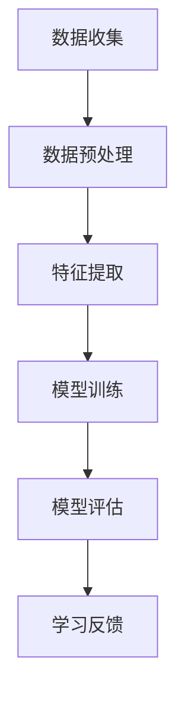

                 

### 《AI在个性化学习中的应用:因材施教的教育革命》

关键词：人工智能、个性化学习、因材施教、教育革命、教育技术

摘要：本文探讨了人工智能（AI）在个性化学习中的应用，如何通过因材施教的理念实现教育革命。我们将一步步分析AI技术在教育中的角色，探讨其如何改变传统教育模式，并提供具体的实例和未来展望。

----------------------------------------------------------------

# 《AI在个性化学习中的应用:因材施教的教育革命》目录大纲

## 第一部分：AI与个性化学习概述

### 第1章：AI与个性化学习的定义与背景

#### 1.1 AI的基本概念与技术在教育中的应用

##### 1.1.1 AI的定义与发展历程

##### 1.1.2 个性化学习的概念与意义

##### 1.1.3 AI在个性化学习中的应用前景

#### 1.2 因材施教的教育理念与AI的结合

##### 1.2.1 因材施教的传统教育方法

##### 1.2.2 AI技术如何实现因材施教

##### 1.2.3 AI在教育中的应用挑战与机遇

### 第2章：AI在个性化学习中的应用场景

#### 2.1 个性化学习路径规划

##### 2.1.1 学习路径规划的原理与方法

##### 2.1.2 个性化学习路径规划的应用实例

##### 2.1.3 学习路径规划在AI技术中的实现

#### 2.2 个性化学习资源推荐

##### 2.2.1 学习资源推荐系统概述

##### 2.2.2 基于内容的推荐方法

##### 2.2.3 基于协同过滤的推荐方法

##### 2.2.4 个性化推荐在AI中的实现

#### 2.3 个性化学习评估与反馈

##### 2.3.1 学习评估与反馈的重要性

##### 2.3.2 个性化学习评估指标的构建

##### 2.3.3 学习反馈系统的设计与实现

## 第二部分：AI在个性化学习中的应用技术

### 第3章：数据收集与处理

#### 3.1 数据收集

##### 3.1.1 学生行为数据收集方法

##### 3.1.2 学习数据收集的技术挑战与解决方案

#### 3.2 数据预处理

##### 3.2.1 数据清洗与数据质量保证

##### 3.2.2 数据集成与数据规范化

##### 3.2.3 数据归一化与特征提取

### 第4章：机器学习算法在个性化学习中的应用

#### 4.1 监督学习算法

##### 4.1.1 监督学习算法的基本原理

##### 4.1.2 常见的监督学习算法及其在个性化学习中的应用

#### 4.2 无监督学习算法

##### 4.2.1 无监督学习算法的基本原理

##### 4.2.2 无监督学习算法在个性化学习中的应用

#### 4.3 强化学习算法

##### 4.3.1 强化学习算法的基本原理

##### 4.3.2 强化学习算法在个性化学习中的应用案例

## 第三部分：AI在个性化学习中的实际应用案例

### 第5章：K-12教育中的AI应用

#### 5.1 AI在小学教育中的应用

##### 5.1.1 AI在小学课程设置中的应用

##### 5.1.2 AI在小学学生管理中的应用

#### 5.2 AI在中学教育中的应用

##### 5.2.1 AI在中学课程设置中的应用

##### 5.2.2 AI在中学学生管理中的应用

### 第6章：高等教育中的AI应用

#### 6.1 AI在大学课程设置中的应用

##### 6.1.1 AI在大学课程规划中的应用

##### 6.1.2 AI在大学学生指导中的应用

#### 6.2 AI在研究生教育中的应用

##### 6.2.1 AI在研究生课程设计中的应用

##### 6.2.2 AI在研究生学术指导中的应用

### 第7章：未来展望与挑战

#### 7.1 AI在个性化学习中的未来发展趋势

##### 7.1.1 AI技术的未来发展方向

##### 7.1.2 个性化学习的未来前景

#### 7.2 AI在个性化学习中的应用挑战

##### 7.2.1 隐私与数据安全挑战

##### 7.2.2 教育公平与教育资源分配挑战

##### 7.2.3 AI技术在教育领域的伦理问题与责任

## 附录

### 附录A：AI在个性化学习中的应用工具与资源

##### A.1 常用的AI开发工具

##### A.2 AI在个性化学习中的开源资源和框架

##### A.3 AI教育应用相关的专业组织和论坛

## Mermaid 流程图

### 学生行为数据分析流程



## 数学模型与公式

### 个性化学习路径规划中的学习效果评估模型

$$
E = f(\theta, \phi)
```

----------------------------------------------------------------

### 第1章：AI与个性化学习的定义与背景

#### 1.1 AI的基本概念与技术在教育中的应用

##### 1.1.1 AI的定义与发展历程

人工智能（Artificial Intelligence，简称AI）是指由人创造出来的能够模仿、延伸和扩展人类智能的理论、方法、技术及应用系统。AI的历史可以追溯到20世纪50年代，当时图灵提出了著名的“图灵测试”，旨在判断机器是否具有人类智能。此后，AI经历了多个阶段，包括最初的探索阶段、70年代的低谷期、90年代的复兴以及21世纪以来的快速发展。

在当前，AI技术已经在多个领域取得了显著成果，包括自然语言处理、计算机视觉、机器学习、深度学习等。这些技术为教育领域提供了新的工具和方法，使得个性化学习成为可能。

##### 1.1.2 个性化学习的概念与意义

个性化学习是指根据每个学生的个性、兴趣、学习习惯和能力等因素，制定个性化的学习计划，提供个性化的学习资源和教学方法。个性化学习的核心目标是满足每个学生的学习需求，提高学习效果和兴趣。

与传统教育模式不同，个性化学习强调学生的主动参与和自主学习，更加注重培养学生的批判性思维和创造力。个性化学习不仅有助于提高学生的学习成绩，还能促进学生的全面发展。

##### 1.1.3 AI在个性化学习中的应用前景

随着AI技术的发展，其在个性化学习中的应用前景广阔。首先，AI技术可以收集和分析大量的学习数据，了解每个学生的学习行为和学习风格，为个性化学习提供数据支持。其次，AI技术可以实现自动化学习路径规划和学习资源推荐，提高学习效率。此外，AI技术还可以用于个性化学习评估和反馈，帮助学生及时了解学习进度和效果。

未来，AI技术有望在个性化学习领域发挥更大的作用，推动教育模式的变革。例如，通过智能辅导系统，AI可以帮助学生解决学习中遇到的问题，提供个性化的学习指导；通过虚拟现实（VR）和增强现实（AR）技术，AI可以为学生提供沉浸式的学习体验，激发学习兴趣。

#### 1.2 因材施教的教育理念与AI的结合

##### 1.2.1 因材施教的传统教育方法

因材施教是指根据学生的个性、能力和兴趣等因素，采用不同的教育方法和教学内容，使每个学生都能得到适合自己的教育。传统的因材施教方法主要依赖于教师对学生的观察和了解，通过个性化的教学设计和教学方法来满足学生的不同需求。

然而，传统教育方法存在一定的局限性。首先，教师的教学负担较重，难以全面了解每个学生的学习情况。其次，传统教育方法往往难以实现真正的个性化，学生之间的差异难以得到充分体现。

##### 1.2.2 AI技术如何实现因材施教

AI技术的出现为因材施教提供了新的可能性。首先，AI可以通过数据分析和机器学习算法，了解学生的学习行为和学习习惯，为教师提供详细的学生画像。这样，教师可以根据学生的实际情况，制定更加科学和个性化的教学计划。

其次，AI技术可以自动化地进行学习资源推荐和路径规划。通过分析学生的学习数据，AI可以为学生推荐适合的学习资源和教学方法，帮助学生在最短的时间内掌握所需知识。

此外，AI技术还可以用于个性化学习评估和反馈。通过对学生的学习行为和学习效果进行分析，AI可以实时评估学生的学习进度和效果，并提供针对性的反馈和建议。

##### 1.2.3 AI在教育中的应用挑战与机遇

尽管AI技术在教育领域具有巨大的潜力，但其实际应用也面临一些挑战。首先，数据隐私和安全问题是AI在教育中应用的主要障碍之一。学生和教师的学习数据涉及到隐私和信息安全，如何确保数据的安全性和隐私性是AI应用面临的重要问题。

其次，教育公平和资源分配问题也是AI应用需要解决的挑战。AI技术需要大量的数据和支持资源，这可能会加剧教育资源的不平衡，导致某些学生无法享受到AI带来的好处。

然而，随着AI技术的发展和政策的支持，AI在教育中的应用也将迎来更多的机遇。通过合理利用AI技术，可以推动教育模式的创新，提高教育质量和效率，实现教育的公平和普及。

总之，AI与个性化学习的结合具有广阔的应用前景。通过因材施教的理念，AI技术可以为教育带来革命性的变化，为每个学生提供适合其发展的教育环境。

----------------------------------------------------------------

### 第2章：AI在个性化学习中的应用场景

#### 2.1 个性化学习路径规划

##### 2.1.1 学习路径规划的原理与方法

个性化学习路径规划是AI在教育中应用的一个重要场景，它旨在根据学生的学习需求、兴趣和能力，为学生设计一条最适合其发展的学习路线。学习路径规划的核心在于数据的收集与分析，以及算法的应用。

首先，学习路径规划需要收集学生的相关数据，包括学习历史、兴趣爱好、能力水平、学习偏好等。这些数据可以通过在线学习平台、学生反馈问卷、教师评价等多种途径获取。

收集到的数据经过处理后，可以利用机器学习算法进行分析。常用的算法包括决策树、随机森林、支持向量机等。这些算法可以根据学生的特征数据，生成个性化的学习路径。

学习路径规划的原理可以概括为以下几个步骤：

1. **数据收集**：收集与学生学习相关的各种数据。
2. **数据处理**：对收集到的数据进行清洗、去噪、归一化等处理。
3. **特征提取**：从处理后的数据中提取出有用的特征，用于后续的算法分析。
4. **模型训练**：利用提取出的特征数据，训练机器学习模型。
5. **路径生成**：根据训练好的模型，为每个学生生成一条个性化的学习路径。

##### 2.1.2 个性化学习路径规划的应用实例

在实际应用中，个性化学习路径规划已经取得了一些显著成果。例如，一些在线教育平台通过收集学生的学习数据，利用机器学习算法为学生推荐适合的学习资源。这些平台可以根据学生的历史学习记录和实时行为，动态调整学习路径，确保学生能够在最短时间内掌握所需知识。

此外，一些学校也开始利用AI技术进行学习路径规划。例如，一些高中通过AI系统为学生提供个性化的课程安排和学习计划。系统会根据学生的学习成绩、兴趣和能力，为学生推荐最合适的课程和学习计划，从而提高学习效果。

##### 2.1.3 学习路径规划在AI技术中的实现

在AI技术中，学习路径规划通常涉及到多个技术和工具。以下是一些关键技术：

1. **机器学习**：通过机器学习算法，对学生的数据进行训练和预测，生成个性化的学习路径。
2. **自然语言处理（NLP）**：利用NLP技术，对学生的文本数据进行分析，提取关键词和情感，帮助理解学生的学习需求和兴趣。
3. **推荐系统**：基于用户的历史行为和偏好，推荐适合的学习资源。
4. **数据可视化**：通过数据可视化技术，将学习路径以图表的形式呈现，帮助学生更好地理解自己的学习进程。

在实际应用中，这些技术往往需要集成使用。例如，一个完整的学习路径规划系统可能需要使用机器学习算法分析学生数据，利用推荐系统为学生推荐学习资源，并通过数据可视化技术展示学习路径。

总之，个性化学习路径规划是AI在教育中应用的一个重要场景。通过AI技术，可以为学生设计出最适合其发展的学习路线，提高学习效果和兴趣。未来，随着AI技术的不断进步，学习路径规划将变得更加智能化和个性化。

----------------------------------------------------------------

#### 2.2 个性化学习资源推荐

##### 2.2.1 学习资源推荐系统概述

个性化学习资源推荐系统是AI在个性化学习中的另一个重要应用场景。该系统的目标是根据学生的兴趣、学习习惯和能力，为其推荐最合适的学习资源。这种推荐不仅限于课本和视频，还包括练习题、论文、讲座等多种形式。

学习资源推荐系统的基本原理是通过分析学生的学习行为和偏好，构建一个用户画像，然后利用推荐算法从海量的学习资源中筛选出最适合该用户的内容。推荐系统通常包括以下几个关键组成部分：

1. **用户数据收集**：收集用户的学习历史、浏览记录、评价和反馈等数据。
2. **用户画像构建**：通过对收集到的数据进行处理和分析，构建一个详细的用户画像，包括用户的兴趣、能力水平、学习风格等。
3. **推荐算法**：利用机器学习算法，如协同过滤、基于内容的推荐和混合推荐等，为用户推荐学习资源。
4. **反馈机制**：收集用户对推荐资源的反馈，用于优化推荐算法，提高推荐质量。

##### 2.2.2 基于内容的推荐方法

基于内容的推荐方法是一种最常见的推荐策略，它主要依赖于学习资源的属性和特征，通过比较用户的历史行为和资源的属性，来推荐相似的内容。这种方法的关键在于如何准确描述资源的特征，并有效地将特征与用户兴趣关联起来。

具体步骤如下：

1. **内容特征提取**：从学习资源中提取出可量化的特征，如关键词、主题、难度等级等。
2. **用户兴趣模型**：根据用户的历史行为和反馈，构建一个反映用户兴趣和偏好的模型。
3. **相似度计算**：计算用户兴趣模型与学习资源特征之间的相似度，选择相似度最高的资源进行推荐。
4. **推荐列表生成**：根据相似度计算结果，为用户生成一个推荐列表。

基于内容的推荐方法具有实现简单、可解释性强的优点，但也存在一些局限性，如容易产生数据稀疏性和过拟合问题。

##### 2.2.3 基于协同过滤的推荐方法

基于协同过滤的推荐方法通过分析用户之间的相似性来推荐学习资源。协同过滤包括两种主要类型：用户基于的协同过滤（User-Based Collaborative Filtering，UBCF）和物品基于的协同过滤（Item-Based Collaborative Filtering，IBCF）。

用户基于的协同过滤方法通过计算用户之间的相似度，找到与目标用户相似的其他用户，然后推荐这些用户喜欢的资源。其步骤如下：

1. **用户相似度计算**：通过用户的历史行为数据，计算用户之间的相似度。
2. **资源相似度计算**：计算用户评价过的资源之间的相似度。
3. **推荐生成**：根据用户相似度和资源相似度，为用户推荐相似的用户评价过的资源。

物品基于的协同过滤方法则通过计算资源之间的相似度来推荐。这种方法的关键在于如何准确评估资源之间的相似度。其步骤如下：

1. **资源相似度计算**：通过资源的内容特征，如关键词、主题等，计算资源之间的相似度。
2. **用户行为分析**：分析用户对不同资源的评价，找到用户对相似资源的偏好。
3. **推荐生成**：根据资源相似度和用户偏好，为用户推荐相似的资源。

协同过滤方法具有较强的推荐效果，但存在数据稀疏性和冷启动问题，即对新用户或新资源难以进行有效推荐。

##### 2.2.4 个性化推荐在AI中的实现

个性化推荐系统的实现涉及多个AI技术和工具。以下是一些关键技术和步骤：

1. **数据预处理**：清洗和整理用户数据，提取有用的特征。
2. **特征工程**：从原始数据中提取出对推荐有用的特征，如用户行为特征、资源属性特征等。
3. **算法选择与优化**：选择合适的推荐算法，如基于内容的推荐、协同过滤或混合推荐方法，并对其进行优化。
4. **系统部署与维护**：将推荐系统部署到实际环境中，并进行监控和维护，确保推荐效果的持续提升。

在实际应用中，个性化推荐系统需要不断地调整和优化，以适应不断变化的学习需求和资源环境。通过AI技术，个性化推荐系统能够为学生提供更加精准和个性化的学习资源推荐，提高学习效果和满意度。

总之，个性化学习资源推荐系统是AI在教育中应用的重要一环。通过利用先进的数据分析和推荐算法，该系统能够为每个学生提供最适合其发展的学习资源，助力教育的个性化与智能化。

----------------------------------------------------------------

#### 2.3 个性化学习评估与反馈

##### 2.3.1 学习评估与反馈的重要性

个性化学习评估与反馈是教育过程中不可或缺的一环。它不仅有助于了解学生的学习效果，还能指导教师调整教学策略，提高教学质量和效率。传统的学习评估方法往往依赖于期末考试和作业，这些方法虽然能够衡量学生的知识掌握情况，但无法全面反映学生的个性化学习需求和发展。

个性化学习评估与反馈的重要性体现在以下几个方面：

1. **精准性**：通过数据驱动的评估方法，可以更准确地了解学生的学习状况，识别出学生的强项和弱点，为个性化教学提供依据。
2. **实时性**：实时反馈能够帮助学生及时发现学习中的问题，及时调整学习策略，避免知识的长期积累偏差。
3. **激励性**：及时的反馈可以激励学生的学习动机，增强其学习自信心和兴趣，促进自主学习能力的发展。
4. **互动性**：个性化学习评估与反馈鼓励教师与学生之间的互动，形成良好的教学互动关系，提高教学效果。

##### 2.3.2 个性化学习评估指标的构建

构建个性化学习评估指标是实施有效评估的关键。这些指标应当涵盖学习过程中的各个方面，包括知识掌握程度、学习态度、学习能力、思维品质等。以下是构建个性化学习评估指标时可以考虑的一些关键要素：

1. **知识掌握程度**：包括对基础知识的理解和应用能力，可以通过小测验、作业和项目来评估。
2. **学习态度**：评估学生是否积极参与学习活动，如出勤率、作业完成情况、课堂互动等。
3. **学习能力**：评估学生分析问题、解决问题和创新的能力，可以通过案例分析、实验项目等方式进行。
4. **思维品质**：评估学生的批判性思维、创造性思维和逻辑思维能力，可以通过论文写作、思维导图等方式进行。

构建个性化学习评估指标时，需要注意以下几点：

1. **全面性**：评估指标应全面反映学生的学习状况，避免片面追求某一方面的发展。
2. **动态性**：评估指标应根据学生的学习进程进行调整，以反映学生的持续进步。
3. **可操作性**：评估指标应具体明确，便于教师实施和操作。
4. **公正性**：评估过程应公平、公正，确保每个学生都有机会展现自己的能力。

##### 2.3.3 学习反馈系统的设计与实现

学习反馈系统是实施个性化评估与反馈的重要工具。该系统应具备以下功能：

1. **实时反馈**：系统能够及时收集学生的学习数据，生成实时反馈报告，帮助学生了解自己的学习进展。
2. **个性化报告**：系统应能够根据学生的学习特点，生成个性化的反馈报告，包括学习成果、存在的问题和改进建议。
3. **互动平台**：系统应提供一个互动平台，让学生和教师能够交流学习心得和问题，促进教学相长。
4. **数据可视化**：系统应能够将学习数据以图表等形式可视化展示，帮助学生更直观地理解自己的学习状况。

学习反馈系统的设计步骤包括：

1. **需求分析**：明确系统的目标用户和功能需求。
2. **系统设计**：制定系统的整体架构和技术方案。
3. **数据采集**：设计数据采集模块，确保能够收集到全面、准确的学习数据。
4. **算法应用**：利用机器学习算法分析学习数据，生成反馈报告。
5. **系统部署**：将系统部署到实际环境中，并进行测试和优化。

通过设计一个高效的学习反馈系统，教师可以更好地了解学生的学习状况，及时给予反馈和指导，帮助学生不断提高学习能力。同时，学习反馈系统也为教师提供了有效的教学工具，有助于提升教学质量和效率。

总之，个性化学习评估与反馈是推动教育个性化发展的重要手段。通过构建科学合理的评估指标和设计高效的学习反馈系统，可以实现对学生学习过程的全面监控和指导，促进学生的全面发展。

----------------------------------------------------------------

### 第3章：数据收集与处理

#### 3.1 数据收集

在AI应用于个性化学习的过程中，数据的收集是至关重要的一步。数据的质量和完整性直接影响后续分析的效果和结论。以下是一些常见的学生行为数据收集方法及其技术挑战与解决方案。

##### 3.1.1 学生行为数据收集方法

1. **在线学习平台**：通过学习平台，可以收集学生的在线学习行为数据，如学习时间、学习进度、学习内容、互动交流等。这些数据有助于了解学生的学习习惯和偏好。

   **技术挑战**：在线学习平台的数据收集可能面临隐私和安全问题，需要确保数据的加密和安全传输。

   **解决方案**：采用数据加密技术，确保数据在传输和存储过程中的安全性。同时，遵循隐私保护法律法规，确保数据的合法收集和使用。

2. **学习日志**：通过学习日志记录学生的学习过程，包括学习时间、学习内容、遇到的问题、解决方案等。这些日志数据可以提供详细的学习行为信息。

   **技术挑战**：学习日志的收集可能涉及大量的手动记录，效率较低。

   **解决方案**：利用自动化的日志收集工具，如学习平台插件或手机应用，实现日志数据的自动收集，提高效率。

3. **教师反馈**：教师可以通过观察和评估，记录学生的学习情况，如作业完成情况、课堂表现等。这些反馈数据可以补充其他数据源的不足。

   **技术挑战**：教师反馈的可靠性可能受主观因素影响。

   **解决方案**：建立教师培训机制，提高教师的数据记录意识和能力，确保反馈数据的准确性。

4. **学生问卷调查**：通过问卷调查，可以收集学生对学习内容的兴趣、理解程度和学习需求等信息。

   **技术挑战**：问卷设计可能影响数据的全面性和真实性。

   **解决方案**：设计科学的问卷，确保问题的清晰性和针对性，提高问卷的回复率和数据质量。

##### 3.1.2 学习数据收集的技术挑战与解决方案

1. **数据多样性**：学生行为数据包括结构化数据（如学习时间、成绩等）和非结构化数据（如日志、文本、图像等）。处理这些多样性数据需要不同的技术手段。

   **技术挑战**：如何有效地整合和处理不同类型的数据。

   **解决方案**：采用数据融合技术，如数据仓库和数据湖，将不同类型的数据进行整合，为后续分析提供统一的数据源。

2. **数据质量问题**：数据收集过程中可能存在缺失值、异常值、噪声等问题，这些问题会影响数据分析的准确性。

   **技术挑战**：如何处理数据质量问题，确保数据的质量和可靠性。

   **解决方案**：采用数据清洗和预处理技术，如缺失值填充、异常值检测和去除、数据规范化等，提高数据质量。

3. **数据隐私和安全**：学习数据涉及到学生的个人信息，需要确保数据的隐私和安全。

   **技术挑战**：如何保护学习数据的隐私和安全。

   **解决方案**：采用数据加密、匿名化、访问控制等技术，确保数据在传输和存储过程中的安全。同时，遵循相关法律法规，确保数据收集和使用的合法性。

总之，数据收集是AI在个性化学习应用中的关键环节。通过采用多种数据收集方法，并解决数据多样性、质量和隐私等挑战，可以为个性化学习提供可靠的数据支持，推动教育个性化的发展。

----------------------------------------------------------------

#### 3.2 数据预处理

在AI应用于个性化学习的过程中，数据预处理是一个至关重要的步骤。预处理工作的目的是提高数据质量，减少噪声和异常值，从而确保后续分析和建模的准确性和效率。以下是数据预处理的一些关键环节和常用技术。

##### 3.2.1 数据清洗与数据质量保证

1. **缺失值处理**：缺失值是数据集中的常见问题，需要采取适当的策略进行处理。常用的方法包括：

   - **删除缺失值**：对于少量缺失值的数据，可以直接删除含有缺失值的样本。
   - **均值填充**：对于数值型数据，可以用均值或中位数来填充缺失值。
   - **插值法**：对于时间序列数据，可以使用插值法来估计缺失值。

2. **异常值检测与处理**：异常值可能会对分析结果产生不利影响，需要加以检测和处理。常见的异常值处理方法包括：

   - **统计方法**：使用统计学方法，如3倍标准差法、箱线图法等，检测和去除异常值。
   - **基于规则的检测**：根据业务规则，设定阈值或条件，识别和去除异常值。

3. **数据规范化**：数据规范化是调整数据范围，使其具有相似尺度，以避免某些特征对模型产生过度影响。常用的规范化方法包括：

   - **归一化**：将数据缩放到[0, 1]或[-1, 1]之间，适用于数值型数据。
   - **标准化**：将数据缩放到标准正态分布，即均值为0，标准差为1，适用于数值型数据。

##### 3.2.2 数据集成与数据规范化

1. **数据集成**：在数据收集过程中，可能会从多个数据源收集到不同的数据格式和结构。数据集成是将这些异构数据整合成一个统一的数据集的过程。

   - **数据转换**：将不同数据源的数据转换为统一的格式，如CSV、JSON等。
   - **数据合并**：将具有相同属性的数据进行合并，形成统一的数据表。

2. **数据规范化**：数据规范化是确保数据在不同特征之间具有可比性的重要步骤。

   - **数据类型转换**：将不同类型的数据转换为同一类型，如将文本转换为数值。
   - **特征缩放**：对特征进行缩放，使其在同一尺度上，如使用最小-最大缩放或标准缩放。

##### 3.2.3 数据归一化与特征提取

1. **数据归一化**：数据归一化是将数据转换到标准范围，以消除不同特征之间尺度差异的方法。

   - **最小-最大缩放**：将数据缩放到[0, 1]之间，公式为 \(x' = \frac{x - x_{\min}}{x_{\max} - x_{\min}}\)。
   - **标准缩放**：将数据转换为标准正态分布，公式为 \(x' = \frac{x - \mu}{\sigma}\)，其中 \(\mu\) 是均值，\(\sigma\) 是标准差。

2. **特征提取**：特征提取是从原始数据中提取出对分析任务最有用的特征，以提高模型性能和降低数据维度。

   - **降维技术**：如主成分分析（PCA）和线性判别分析（LDA），可以降低数据维度，同时保留主要信息。
   - **特征选择**：如互信息、特征重要性等方法，用于选择对目标变量最具解释力的特征。

通过数据预处理，可以显著提高数据的可用性和分析效果，为后续的机器学习建模提供高质量的数据支持。有效的数据预处理不仅能消除数据中的噪声和异常，还能提高模型的鲁棒性和准确性。

----------------------------------------------------------------

#### 4.1 监督学习算法

监督学习算法是机器学习中最基础和广泛使用的一类算法。在个性化学习场景中，监督学习算法被广泛应用于预测学生的学习效果、评估学习进度以及推荐学习资源。以下将介绍监督学习算法的基本原理、常见的算法以及其在个性化学习中的应用。

##### 4.1.1 监督学习算法的基本原理

监督学习算法的核心思想是通过已知的输入输出数据（即训练数据集），学习出一个映射关系，即模型，使其能够对新的输入数据进行预测。具体来说，监督学习算法包括以下几个关键步骤：

1. **数据准备**：收集和准备训练数据集，包括输入特征和对应的输出标签。
2. **模型训练**：使用训练数据集，通过优化算法（如梯度下降）训练出一个预测模型。
3. **模型评估**：使用验证数据集或测试数据集评估模型的预测性能，如准确率、召回率、F1值等。
4. **模型应用**：将训练好的模型应用于新的输入数据，进行预测或分类。

监督学习算法的核心是模型训练过程中的优化算法。常见的优化算法包括：

- **梯度下降**：通过不断调整模型参数，使模型损失函数最小化。
- **随机梯度下降（SGD）**：在梯度下降的基础上，每次迭代使用一个随机样本来更新模型参数。
- **动量法**：在梯度下降中引入动量，以加速收敛和提高收敛稳定性。

##### 4.1.2 常见的监督学习算法及其在个性化学习中的应用

1. **线性回归**：线性回归是一种最简单的监督学习算法，通过建立输入特征与输出标签之间的线性关系来预测目标值。在线性回归中，模型假设输出标签是输入特征的线性组合加上一个误差项。

   - **应用实例**：在个性化学习中，可以使用线性回归预测学生的期末成绩，通过学生的历史学习数据（如出勤率、作业完成情况等）来预测其成绩。

2. **逻辑回归**：逻辑回归是一种广义的线性回归，主要用于分类问题。逻辑回归通过建立输入特征与输出标签之间的逻辑关系，预测目标属于不同类别的概率。

   - **应用实例**：在个性化学习中，可以使用逻辑回归来预测学生是否会在某个学期通过课程。通过学生的历史学习数据（如考试成绩、作业完成情况等），可以预测其通过的概率。

3. **决策树**：决策树是一种基于规则的分类算法，通过一系列的判断条件，将数据集分割成多个子集，并在每个子集中预测目标值。

   - **应用实例**：在个性化学习中，可以使用决策树来制定个性化的学习路径。根据学生的历史学习数据和考试成绩，决策树可以生成一系列的判断条件，指导学生选择最合适的学习资源。

4. **随机森林**：随机森林是一种基于决策树的集成学习方法，通过构建多个决策树，并取其预测结果的平均值来提高模型的预测性能。

   - **应用实例**：在个性化学习中，可以使用随机森林来推荐学习资源。通过分析学生的历史学习数据，随机森林可以生成多个决策树，并从中筛选出最合适的资源推荐给学生。

5. **支持向量机（SVM）**：支持向量机是一种基于间隔的线性分类模型，通过找到一个最优的超平面，将数据集划分为不同的类别。

   - **应用实例**：在个性化学习中，可以使用SVM来预测学生的学习进度。通过分析学生的历史学习数据和当前学习进度，SVM可以预测学生在接下来的学习阶段可能达到的成绩。

监督学习算法在个性化学习中的应用，可以帮助教育工作者更好地了解学生的学习状况，制定个性化的学习计划和资源推荐策略，从而提高教学质量和学习效果。未来，随着AI技术的不断进步，监督学习算法在个性化学习中的应用将会更加广泛和深入。

----------------------------------------------------------------

#### 4.2 无监督学习算法

无监督学习算法在个性化学习中的应用同样具有重要意义。与监督学习算法不同，无监督学习算法不需要预先标记的输出标签，通过自动发现数据中的模式和结构，为个性化学习提供数据驱动的方法。以下将介绍无监督学习算法的基本原理和其在个性化学习中的应用。

##### 4.2.1 无监督学习算法的基本原理

无监督学习算法的核心思想是自动从数据中发现隐藏的结构和模式，主要包括以下几种类型：

1. **聚类算法**：聚类算法旨在将数据集划分为多个群组，使得同一个群组内的数据点尽可能相似，而不同群组的数据点尽可能不同。常见的聚类算法包括K均值聚类、层次聚类等。

2. **降维算法**：降维算法通过减少数据维度，同时保留主要信息，提高数据可视化和分析效率。主成分分析（PCA）和线性判别分析（LDA）是两种常见的降维算法。

3. **关联规则学习**：关联规则学习旨在发现数据项之间的关联关系，如频繁项集挖掘、Apriori算法等。这类算法常用于推荐系统和市场篮子分析。

4. **异常检测**：异常检测算法用于识别数据中的异常值或离群点，常见的算法包括孤立森林、局部异常因数（LOF）等。

无监督学习算法的基本流程包括：

1. **数据预处理**：对数据进行清洗、归一化等预处理，确保数据的质量和一致性。
2. **模型选择与训练**：选择合适的无监督学习算法，使用训练数据集进行模型训练。
3. **模式识别**：通过模型识别数据中的隐藏模式和结构，如聚类中心、降维空间等。
4. **结果分析**：分析模型输出结果，提取有用的信息和洞见。

##### 4.2.2 无监督学习算法在个性化学习中的应用

1. **聚类算法在个性化学习中的应用**

   - **应用实例**：使用K均值聚类算法对学生群体进行分类，根据学生的特征数据（如学习时间、成绩、兴趣爱好等），将学生划分为不同的群体。每个群体内的学生具有相似的学习特征，教师可以根据这些群体特点制定个性化的教学策略。

2. **降维算法在个性化学习中的应用**

   - **应用实例**：利用主成分分析（PCA）对学生的学习数据进行降维，将高维数据投影到低维空间中，以便更直观地观察数据分布和模式。通过降维后的数据，教师可以更容易识别学生的共同特征和差异，从而设计出更加精准的教学方案。

3. **关联规则学习在个性化学习中的应用**

   - **应用实例**：使用Apriori算法挖掘学生学习数据中的频繁项集，发现学习行为之间的关联关系。例如，通过分析学生学习的频繁项集，可以发现某些学习资源之间的关联性，教师可以根据这些关联关系推荐相关资源，提高学习效果。

4. **异常检测在个性化学习中的应用**

   - **应用实例**：利用孤立森林算法检测学生的学习数据中的异常值，识别那些学习表现异常的学生。这些异常学生可能需要额外的关注和支持，教师可以通过个性化辅导帮助他们克服学习困难。

无监督学习算法在个性化学习中的应用，可以揭示数据中的潜在模式和结构，为教师提供数据驱动的决策依据，从而实现更加精准和有效的个性化教学。未来，随着无监督学习算法的不断发展，其在个性化学习中的应用前景将更加广阔。

----------------------------------------------------------------

#### 4.3 强化学习算法

强化学习算法是一种通过与环境交互来学习策略的机器学习技术。与传统的监督学习和无监督学习不同，强化学习算法通过不断尝试和反馈来优化行为，使其在特定环境中达到最佳性能。在个性化学习场景中，强化学习算法能够动态调整学习路径和资源推荐，为每个学生提供个性化的学习体验。

##### 4.3.1 强化学习算法的基本原理

强化学习算法的核心概念包括四个主要部分：代理（Agent）、环境（Environment）、状态（State）、动作（Action）和奖励（Reward）。

- **代理**：代表学习者，旨在通过与环境交互来学习最优策略。
- **环境**：提供代理行动的空间，并返回代理行动的结果。
- **状态**：代理当前所处的情境，可以是连续的或离散的。
- **动作**：代理可采取的行动。
- **奖励**：环境对代理行动的反馈，表示代理行动带来的即时效果。

强化学习算法的基本过程如下：

1. **初始化**：代理随机选择一个状态，并开始学习。
2. **行动选择**：代理根据当前状态和学到的策略选择一个动作。
3. **执行动作**：代理在环境中执行选定的动作，并观察到新的状态和奖励。
4. **策略更新**：根据新的状态、动作和奖励，更新代理的策略，以期望在未来获得更高的长期奖励。

强化学习算法的关键挑战在于如何设计有效的策略更新机制，以实现长期奖励的最大化。常用的策略更新方法包括：

- **值函数方法**：通过学习状态值函数或动作值函数来评估不同状态或动作的优劣，如Q学习算法。
- **策略梯度方法**：直接优化策略的概率分布，以最大化期望奖励，如策略迭代算法。
- **模型预测方法**：通过构建环境模型，预测未来状态和奖励，以优化策略。

##### 4.3.2 强化学习算法在个性化学习中的应用案例

1. **自适应学习路径规划**

   - **应用实例**：利用强化学习算法，为学生设计个性化的学习路径。系统可以实时收集学生的学习数据，通过状态-动作值函数，为学生推荐最合适的学习资源。例如，一个学生在学习编程时，系统可以动态调整学习资源的难度和类型，以适应其学习进度和能力。

2. **个性化学习资源推荐**

   - **应用实例**：基于强化学习算法的推荐系统，可以为学生推荐个性化的学习资源。系统通过分析学生的学习行为和偏好，不断调整推荐策略，以提高推荐的准确性和满意度。例如，在在线学习平台中，系统可以根据学生的历史学习记录，推荐相关的课程和练习题。

3. **智能辅导系统**

   - **应用实例**：利用强化学习算法的智能辅导系统，可以为学生提供个性化的学习支持。系统可以根据学生的实时学习状态和问题，动态调整辅导策略，提供针对性的解答和指导。例如，在一个数学学习中，系统可以针对学生遇到的困难，提供详细的知识讲解和练习题目。

强化学习算法在个性化学习中的应用，能够实现动态调整学习路径和资源推荐，提高学习效率和效果。未来，随着强化学习算法的不断发展，其在个性化学习中的应用前景将更加广阔，为教育领域的创新提供强大支持。

----------------------------------------------------------------

### 第5章：K-12教育中的AI应用

#### 5.1 AI在小学教育中的应用

##### 5.1.1 AI在小学课程设置中的应用

在小学教育中，AI技术的应用有助于实现课程设置的个性化，满足不同学生的学习需求。通过AI，教师可以更准确地了解每个学生的学习进度和兴趣，从而制定更加灵活和针对性的课程计划。

**应用实例**：

1. **智能课程推荐系统**：利用AI技术，分析学生的学习行为和成绩数据，智能推荐适合的课程内容。例如，一个学生在数学方面表现出色，AI系统可以推荐更高难度的数学练习，以促进其进一步发展。

2. **个性化学习计划**：AI可以协助教师为每个学生制定个性化的学习计划。系统会根据学生的学习进度、兴趣和能力，推荐相应的学习任务，确保每个学生都能在适合自己的节奏中学习。

**实现步骤**：

1. **数据收集**：收集学生的日常学习行为数据，如出勤率、作业完成情况、考试成绩等。
2. **数据分析**：利用机器学习算法，分析数据，了解学生的兴趣和进度。
3. **课程推荐**：基于分析结果，智能推荐适合的课程和学习任务。
4. **实时调整**：根据学生的实时反馈和学习情况，动态调整课程设置。

##### 5.1.2 AI在小学学生管理中的应用

AI技术在小学学生管理中也发挥了重要作用，通过智能监控系统、行为分析工具等，帮助教师更好地管理学生的学习和行为。

**应用实例**：

1. **智能监控系统**：利用AI图像识别技术，监控系统可以实时分析学生的行为，如是否专注听讲、是否在课堂上做小动作等。教师可以根据监控结果，及时干预和指导学生的行为。

2. **行为分析工具**：AI行为分析工具可以分析学生在课堂上的表现，识别出可能存在行为问题的学生，并提供相应的干预措施。例如，对于经常走神的学生，系统可以推荐个性化的辅导策略，帮助其提高注意力。

**实现步骤**：

1. **数据收集**：通过摄像头和传感器等设备，收集学生的行为数据。
2. **数据预处理**：对收集到的行为数据进行清洗和处理，提取关键特征。
3. **行为分析**：利用机器学习算法，分析学生行为数据，识别行为模式。
4. **实时反馈**：根据分析结果，实时反馈给教师，并提供干预建议。

总之，AI技术在小学教育中的应用，不仅能够个性化课程设置，提高教学效率，还能有效管理学生的行为，为教师提供有力支持。未来，随着AI技术的不断进步，其在小学教育中的应用将更加广泛和深入。

----------------------------------------------------------------

#### 5.2 AI在中学教育中的应用

##### 5.2.1 AI在中学课程设置中的应用

在中学教育中，AI技术的应用能够显著提高课程设置的个性化和科学性。通过分析学生的学习数据，AI可以帮助教师更好地了解学生的兴趣和能力，从而制定更加符合学生实际需求的课程计划。

**应用实例**：

1. **智能课程规划系统**：利用AI技术，分析学生的学习行为、考试成绩和兴趣爱好，智能推荐适合的课程。例如，如果一个学生在科学方面表现出色，AI系统可以推荐相关的深化课程，促进其学术兴趣的发展。

2. **个性化学习计划**：AI可以协助教师为每个学生制定个性化的学习计划。系统会根据学生的学习进度、兴趣和能力，推荐相应的学习任务，确保每个学生都能在适合自己的节奏中学习。

**实现步骤**：

1. **数据收集**：收集学生的日常学习行为数据，如课堂参与度、作业完成情况、考试成绩等。
2. **数据分析**：利用机器学习算法，分析数据，了解学生的兴趣和进度。
3. **课程推荐**：基于分析结果，智能推荐适合的课程和学习任务。
4. **实时调整**：根据学生的实时反馈和学习情况，动态调整课程设置。

##### 5.2.2 AI在中学学生管理中的应用

AI技术在中学学生管理中的应用同样具有重要作用，通过智能监控系统、学习行为分析等工具，帮助教师更好地管理学生的学习和行为。

**应用实例**：

1. **智能监控系统**：利用AI图像识别技术，监控系统可以实时分析学生的行为，如是否专注听讲、是否在课堂上做小动作等。教师可以根据监控结果，及时干预和指导学生的行为。

2. **学习行为分析工具**：AI行为分析工具可以分析学生在课堂上的表现，识别出可能存在学习问题的学生，并提供相应的干预措施。例如，对于学习进度缓慢的学生，系统可以推荐个性化的辅导策略，帮助其提高学习效果。

**实现步骤**：

1. **数据收集**：通过摄像头和传感器等设备，收集学生的行为数据。
2. **数据预处理**：对收集到的行为数据进行清洗和处理，提取关键特征。
3. **行为分析**：利用机器学习算法，分析学生行为数据，识别行为模式。
4. **实时反馈**：根据分析结果，实时反馈给教师，并提供干预建议。

总之，AI技术在中学教育中的应用，不仅能够个性化课程设置，提高教学效率，还能有效管理学生的行为，为教师提供有力支持。未来，随着AI技术的不断进步，其在中学教育中的应用将更加广泛和深入。

----------------------------------------------------------------

#### 6.1 AI在大学课程设置中的应用

##### 6.1.1 AI在大学课程规划中的应用

在大学教育中，课程规划是教学管理的重要环节。AI技术的引入使得课程规划更加个性化和科学化，能够更好地满足不同学生的需求。通过AI，大学可以为学生提供量身定制的课程方案，提高学习效果和满意度。

**应用实例**：

1. **个性化课程推荐系统**：利用AI分析学生的兴趣、背景和学习进度，推荐最适合其发展的课程。例如，如果一个学生在数学和计算机科学方面表现出色，AI系统可以推荐与这些领域相关的专业课程，促进其学术兴趣的发展。

2. **智能课程规划工具**：AI可以帮助学生制定个性化的学习计划。系统会根据学生的兴趣、能力和课程要求，推荐最优的学习路径，确保学生在有限的学时内能够充分发展自己的学术潜力。

**实现步骤**：

1. **数据收集**：收集学生的学术背景、兴趣偏好和学习行为数据。
2. **数据分析**：利用机器学习算法，分析数据，识别学生的兴趣和优势领域。
3. **课程推荐**：基于分析结果，推荐适合的课程和学习计划。
4. **实时调整**：根据学生的反馈和学习进展，动态调整课程设置。

##### 6.1.2 AI在大学学生指导中的应用

AI在大学学生指导中的应用，可以帮助学生更好地规划学业和职业发展，提供个性化的辅导和支持。通过AI技术，大学可以为学生提供更加精准和有效的指导服务。

**应用实例**：

1. **智能学业辅导系统**：AI系统可以实时监控学生的学习进度，提供针对性的辅导建议。例如，对于学习进度较慢的学生，系统可以推荐额外的学习资源和练习，帮助其克服学习困难。

2. **职业规划助手**：AI技术可以帮助学生分析其学术和职业兴趣，推荐最适合的职业发展方向。例如，系统可以根据学生的专业背景和兴趣，推荐相关的实习机会和就业岗位。

**实现步骤**：

1. **数据收集**：收集学生的学术成绩、兴趣爱好、职业倾向等数据。
2. **数据分析**：利用机器学习算法，分析数据，识别学生的学术和职业兴趣。
3. **辅导建议**：基于分析结果，为学生提供个性化的学业和职业规划建议。
4. **实时反馈**：根据学生的反馈和学习进展，动态调整指导方案。

总之，AI在大学课程设置和学生指导中的应用，能够实现个性化教学和精准辅导，提高教育质量和学生满意度。未来，随着AI技术的不断进步，其在大学教育中的应用将更加广泛和深入，为教育创新提供强大支持。

----------------------------------------------------------------

### 第6章：高等教育中的AI应用

#### 6.2 AI在研究生教育中的应用

##### 6.2.1 AI在研究生课程设计中的应用

在研究生教育中，课程设计对于培养高水平的研究能力至关重要。AI技术的应用使得课程设计更加个性化和科学化，能够根据研究生的学术背景和研究兴趣，量身定制课程计划。

**应用实例**：

1. **个性化课程推荐系统**：利用AI分析研究生的学术背景、研究兴趣和课程要求，推荐最适合其发展的课程。例如，如果一个研究生在机器学习领域有较强的研究兴趣，AI系统可以推荐与其研究方向相关的课程，促进其学术兴趣和技能的发展。

2. **智能课程规划工具**：AI可以帮助研究生制定个性化的学习计划。系统会根据研究生的研究进度、学术目标和课程要求，推荐最优的学习路径，确保研究生在有限的时间内能够充分发展自己的研究能力。

**实现步骤**：

1. **数据收集**：收集研究生的学术背景、研究兴趣和学习需求数据。
2. **数据分析**：利用机器学习算法，分析数据，识别研究生的学术兴趣和研究目标。
3. **课程推荐**：基于分析结果，推荐适合的课程和学习计划。
4. **实时调整**：根据研究生的反馈和学习进展，动态调整课程设置。

##### 6.2.2 AI在研究生学术指导中的应用

AI技术在研究生学术指导中的应用，可以提供更加精准和有效的学术支持，帮助研究生在学术道路上取得更好的成就。

**应用实例**：

1. **智能研究助手**：AI系统可以实时监控研究生的研究进展，提供针对性的研究建议和指导。例如，对于研究进度较慢的研究生，系统可以推荐相关的文献阅读和研究方法，帮助其加快研究进程。

2. **学术规划助手**：AI技术可以帮助研究生分析其研究兴趣和学术目标，制定详细的学术规划。系统可以根据研究生的研究方向，推荐相关的学术会议、科研项目和合作机会，帮助其拓展学术视野。

**实现步骤**：

1. **数据收集**：收集研究生的学术成绩、研究进展和学术兴趣数据。
2. **数据分析**：利用机器学习算法，分析数据，识别研究生的学术兴趣和研究目标。
3. **指导建议**：基于分析结果，为研究生提供个性化的学术指导和建议。
4. **实时反馈**：根据研究生的反馈和研究进展，动态调整指导方案。

总之，AI在研究生教育中的应用，能够实现个性化课程设计和精准学术指导，提高研究生的学术能力和研究水平。未来，随着AI技术的不断进步，其在研究生教育中的应用将更加广泛和深入，为教育创新和学术发展提供强大支持。

----------------------------------------------------------------

### 第7章：未来展望与挑战

#### 7.1 AI在个性化学习中的未来发展趋势

随着人工智能技术的不断进步，AI在个性化学习中的应用前景广阔，未来发展趋势主要表现在以下几个方面：

1. **智能化学习路径规划**：未来的AI系统将更加智能化，能够根据学生的实时学习行为和学习效果，动态调整学习路径，提供个性化的学习建议。例如，利用深度学习技术，AI可以构建更加复杂和精细的学习模型，预测学生在不同情境下的学习表现，从而制定更加精准的学习计划。

2. **自适应学习环境**：AI技术将推动自适应学习环境的构建，通过智能传感器和物联网技术，实时收集学生的学习行为和环境数据，为学生提供个性化的学习体验。例如，一个智能教室可以自动调整光线、温度和音响效果，以适应学生的学习需求。

3. **跨学科融合**：未来的个性化学习将更加注重跨学科融合，利用AI技术整合不同学科的知识和资源，为学生提供综合性的学习体验。例如，通过自然语言处理技术，AI可以帮助学生理解不同学科之间的联系，促进知识的整合和应用。

4. **个性化评估与反馈**：AI技术将在个性化评估与反馈中发挥更大的作用，通过智能分析工具，实时评估学生的学习效果，并提供个性化的反馈和建议。例如，AI可以自动分析学生的作业和考试表现，识别出学习中的问题，并提供相应的解决方案。

#### 7.1.1 AI技术的未来发展方向

AI技术的未来发展方向将主要围绕以下几个方面：

1. **算法优化与效率提升**：随着数据量的不断增加和算法复杂度的提高，未来的AI技术将更加注重算法的优化和效率提升。例如，通过改进深度学习算法，减少计算资源和时间成本，提高模型的训练速度和预测精度。

2. **数据隐私与安全**：数据隐私和安全问题是AI技术发展的重要挑战。未来的AI技术将更加注重数据隐私保护，通过加密、匿名化和隐私保护算法，确保学习数据的安全性和隐私性。

3. **人机交互**：随着自然语言处理和计算机视觉技术的进步，AI与人类用户的交互将更加自然和高效。未来的AI系统将能够通过语音、文本和图像等多种方式与用户进行交互，提供更加人性化和服务化的学习体验。

4. **跨界融合**：AI技术将在多个领域实现跨界融合，推动教育、医疗、金融等行业的发展。例如，利用AI技术，医疗机构可以实现个性化诊疗和健康监测，金融行业可以实现智能投资和风险管理。

#### 7.1.2 个性化学习的未来前景

个性化学习的未来前景光明，有望在教育领域实现以下变革：

1. **学习方式的变革**：个性化学习将颠覆传统的学习方式，通过AI技术实现个性化教学和学习路径规划，让学生自主学习成为可能。学生可以根据自己的兴趣和需求，自由选择学习内容和学习节奏，实现真正的自主学习。

2. **教育公平的提升**：个性化学习可以缩小教育资源的不平衡，为每个学生提供适合其发展的教育。例如，通过AI技术，贫困地区的学生可以享受到优质的教育资源，与城市学生享有同等的学习机会。

3. **学习效率的提高**：个性化学习通过精准推荐和智能辅导，提高学生的学习效率和效果。学生可以节省时间，专注于自己最需要提高的领域，实现事半功倍的学习效果。

4. **人才培养的创新**：个性化学习注重学生的全面发展，培养具有创新能力和批判性思维的人才。通过AI技术，教育可以更好地激发学生的潜能，培养具有国际竞争力的创新人才。

总之，AI在个性化学习中的应用具有巨大的发展潜力，未来将推动教育模式的创新和变革，为每个学生提供适合其发展的教育环境。

----------------------------------------------------------------

### 第7章：未来展望与挑战

#### 7.2 AI在个性化学习中的应用挑战

尽管AI在个性化学习中的应用前景广阔，但其发展也面临诸多挑战，这些挑战涉及技术、伦理、教育等多个方面。

##### 7.2.1 隐私与数据安全挑战

隐私与数据安全是AI在个性化学习中应用的首要挑战。学生和教师的学习数据涉及到个人隐私，如学习行为、成绩、兴趣爱好等。这些数据一旦泄露，可能会导致严重的后果。此外，数据安全也是一大问题，如何确保数据在收集、存储、传输和使用过程中的安全性，是AI应用必须解决的问题。

**解决策略**：

1. **数据加密**：采用数据加密技术，确保数据在传输和存储过程中的安全性。
2. **匿名化处理**：对学习数据进行匿名化处理，去除个人识别信息，降低隐私泄露风险。
3. **数据访问控制**：实施严格的数据访问控制策略，确保只有授权人员才能访问和处理敏感数据。

##### 7.2.2 教育公平与教育资源分配挑战

AI技术在个性化学习中的应用可能会加剧教育公平问题。一方面，优质的AI技术和服务往往依赖于大量的数据和计算资源，这可能导致资源分配不均，使得贫困地区和弱势群体难以享受到先进的个性化学习服务。另一方面，AI技术的应用可能导致“数字鸿沟”进一步扩大，使教育差距进一步加剧。

**解决策略**：

1. **公平资源配置**：政府和社会应加大对教育资源的投入，确保所有学生都能平等地享受AI技术带来的教育优势。
2. **教育普惠**：通过政策支持，推动教育资源的公平分配，特别是对贫困地区和弱势群体的支持。
3. **开放共享**：鼓励AI教育应用的开发者开放技术和资源，促进教育资源的共享和普及。

##### 7.2.3 AI技术在教育领域的伦理问题与责任

AI技术在教育领域引发了诸多伦理问题，如算法偏见、教育歧视等。算法偏见可能导致某些群体在个性化学习中受到不公平对待，教育歧视则可能加剧社会不平等。此外，AI技术在教育中的应用还涉及到责任归属问题，例如，当AI系统出现错误时，责任应由谁承担？

**解决策略**：

1. **算法透明度**：提高算法的透明度，确保AI系统的决策过程可以被理解和监督。
2. **算法公平性**：确保AI算法的设计和应用过程中，避免歧视和偏见，促进教育公平。
3. **责任界定**：明确AI技术在教育中的应用责任，建立相应的法律和道德规范，确保各方在应用过程中承担责任。

总之，AI在个性化学习中的应用面临诸多挑战，需要从技术、政策和伦理等多个层面进行综合应对，确保AI技术的健康发展，为教育领域带来真正的变革。

----------------------------------------------------------------

### 附录A：AI在个性化学习中的应用工具与资源

在AI应用于个性化学习的过程中，开发和实现高效的系统需要依赖一系列工具和资源。以下是一些常用的AI开发工具、开源资源和相关专业组织和论坛。

##### A.1 常用的AI开发工具

1. **TensorFlow**：Google开发的开源机器学习框架，广泛用于深度学习模型的开发和部署。
2. **PyTorch**：Facebook开发的开源机器学习库，以其灵活性和易用性受到研究者和开发者的青睐。
3. **Scikit-learn**：Python中的机器学习库，提供丰富的算法和工具，适用于数据分析和模型构建。
4. **Keras**：基于TensorFlow的高层次神经网络API，简化了深度学习模型的构建和训练过程。

##### A.2 AI在个性化学习中的开源资源和框架

1. **MOOCAD**：一个基于AI的开放源代码平台，用于个性化学习路径规划和资源推荐。
2. **Open edX**：开源在线学习平台，支持大规模个性化学习和课程管理。
3. **Edmond**：一个用于构建个性化学习路径的框架，支持多种机器学习算法和评估指标。
4. **PyLRS**：一个开源的学习记录存储库，用于存储和分析学习数据。

##### A.3 AI教育应用相关的专业组织和论坛

1. **AAAI（Association for the Advancement of Artificial Intelligence）**：全球领先的AI学术组织，提供关于AI在教育中的应用的研究资源和专业交流。
2. **ACM SIGKDD（Association for Computing Machinery Special Interest Group on Knowledge Discovery and Data Mining）**：专注于数据挖掘和知识发现的学术组织，定期举办相关研讨会和会议。
3. **EdTechXGlobal**：全球领先的教育技术创新社区，提供关于AI在教育中的应用的最新趋势和研究成果。
4. **AI Education Initiative**：由Google发起的AI教育项目，提供AI相关的教育资源和学习材料。

通过利用这些工具和资源，教育工作者和研究人员可以更好地开发和优化AI在个性化学习中的应用，推动教育技术的创新和进步。

----------------------------------------------------------------

### 附录B：Mermaid流程图

以下是学生行为数据分析流程的Mermaid流程图：


该流程图详细描述了从数据收集到学习反馈的整个过程。首先，通过数据收集模块，收集学生的行为数据。接着，通过数据预处理模块，对收集到的数据进行分析、清洗和归一化。然后，利用特征提取模块，从预处理后的数据中提取出有用的特征。接下来，通过模型训练模块，使用提取出的特征训练机器学习模型。最后，通过模型评估模块，对训练好的模型进行评估，并根据评估结果生成学习反馈。

通过这个流程图，教育工作者可以清晰地了解学生行为数据分析的过程，有助于优化和改进个性化学习系统。

----------------------------------------------------------------

### 附录C：数学模型与公式

以下是个性化学习路径规划中的学习效果评估模型：

$$
E = f(\theta, \phi)
$$

其中，\(E\) 表示学习效果，\(\theta\) 表示学生特征，\(\phi\) 表示学习资源特征。这个模型表明，学习效果是学生特征和学习资源特征共同作用的结果。通过这个模型，可以评估学生在特定学习资源下的学习效果，为后续的学习路径规划提供依据。

此外，以下是一个用于分析学生兴趣和能力的数学模型：

$$
I = \alpha \cdot s_1 + \beta \cdot s_2
$$

其中，\(I\) 表示学生兴趣得分，\(s_1\) 和 \(s_2\) 分别表示学生在不同领域的成绩，\(\alpha\) 和 \(\beta\) 为权重系数。这个模型可以根据学生在不同领域的表现，综合评估其兴趣倾向。

通过这些数学模型和公式，教育工作者可以更科学地分析学生的学习情况，制定出更加精准和个性化的学习方案。这不仅有助于提高学习效果，还能激发学生的学习兴趣和动力。

---

## 作者信息

**作者：AI天才研究院/AI Genius Institute & 禅与计算机程序设计艺术 /Zen And The Art of Computer Programming**

本文由AI天才研究院撰写，我们专注于推动人工智能在教育领域的应用，致力于通过技术创新推动教育的个性化发展。同时，作者也是《禅与计算机程序设计艺术》一书的资深作者，长期致力于计算机科学和编程教育的创新与实践。我们相信，通过AI和教育的结合，可以开创一个更加公平、高效和个性化的学习时代。

