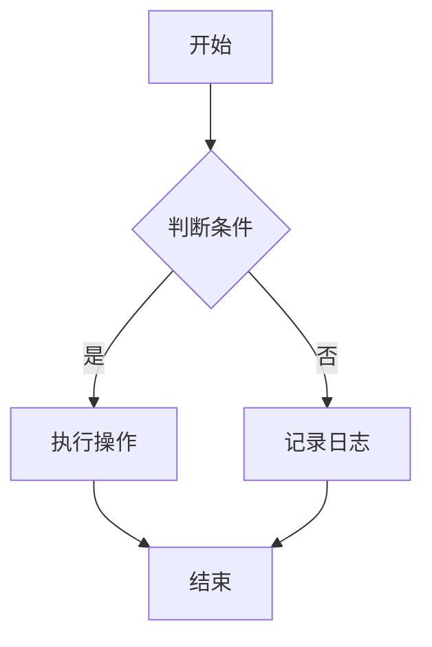
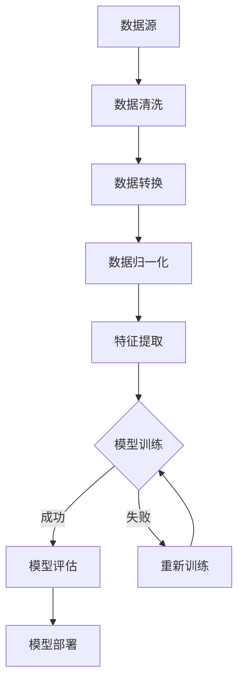

                 

## 引言

### 体育领域与人工智能的交汇

随着科技的发展，人工智能（AI）正逐渐渗透到各个领域，而体育作为人类生活的重要组成部分，也在这一波科技浪潮中迎来了前所未有的变革。体育领域与人工智能的交汇，不仅为运动员的训练和比赛带来了新的可能，也为整个体育产业注入了新的活力。

首先，人工智能在体育中的应用可以追溯到数据分析领域。通过收集和分析大量的数据，AI可以提供更精确的运动员状态评估、战术分析和比赛结果预测。这种数据驱动的决策支持，使得教练和运动员能够更好地了解比赛情况和自身状态，从而做出更为科学的训练和比赛策略。

其次，人工智能在体育训练中的应用也日益广泛。例如，通过使用智能设备，教练可以实时监控运动员的体能状况，并根据数据反馈进行针对性的训练调整。同时，人工智能还可以帮助运动员进行技术动作的模拟和优化，提高训练效果。

此外，视频分析技术也得益于人工智能的发展。通过智能识别技术，AI可以快速分析比赛视频，提取关键动作和战术信息，为教练和运动员提供宝贵的参考。这种技术的应用，不仅提升了比赛分析的专业性，也为战术制定提供了有力支持。

总的来说，人工智能在体育领域的应用不仅提高了训练和比赛的效果，也为体育产业带来了新的商业模式。从体能训练到比赛分析，从体育装备到市场推广，AI正在成为体育产业不可或缺的一部分。

### 人工智能在体育领域的应用现状

当前，人工智能在体育领域的应用已经初具规模，并取得了显著成果。首先，在数据分析方面，AI技术已经被广泛应用于运动员状态的评估和比赛结果的预测。例如，NBA球队使用AI分析球员的统计数据和比赛录像，以优化战术决策和球员阵容。此外，一些运动品牌也通过AI技术分析运动员的装备使用数据，为运动员提供个性化的装备建议。

在体育训练方面，人工智能的应用更是层出不穷。例如，耐克公司推出的Nike Training Club应用，利用AI技术为用户提供个性化的训练计划，并根据用户的反馈进行实时调整。同样，一些俱乐部和运动队也在使用AI技术进行体能监控和训练效果分析，以提高运动员的整体表现。

视频分析技术是人工智能在体育领域的另一大亮点。通过使用深度学习技术，AI可以快速识别比赛视频中的关键动作和战术信息，为教练提供即时反馈。这种技术不仅提高了比赛分析的专业性，也为战术制定提供了有力支持。例如，足球赛事中，教练可以通过AI分析对手的进攻和防守战术，从而制定更有针对性的策略。

此外，人工智能还在体育市场与营销、体育设备与装备、体育教育等多个领域展现出了强大的潜力。例如，通过大数据分析，体育品牌可以更准确地了解消费者的需求，从而进行精准营销。而在体育教育领域，AI技术可以帮助教练和学生进行个性化的学习路径设计，提高学习效果。

总的来说，人工智能在体育领域的应用不仅提高了训练和比赛的效果，也为体育产业带来了新的商业模式和无限可能。随着技术的不断进步，我们可以期待AI在体育领域发挥更加重要的作用。

### 书籍结构及章节概览

本书旨在深入探讨人工智能（AI）在体育训练和比赛分析中的应用，共分为八个主要章节。以下是各章节的具体内容和结构概览：

**第1章 引言**：介绍体育领域与人工智能的交汇，以及人工智能在体育领域的应用现状，为后续章节奠定基础。

**第2章 基础概念与原理**：阐述人工智能、机器学习、深度学习、数据分析和Mermaid流程图等基础概念和原理，为理解后续章节提供理论支持。

**第3章 AI在体育训练中的应用**：详细探讨AI在体能训练、技术分析、伤病预防与康复、战术分析等方面的应用，并通过Python代码实例进行说明。

**第4章 AI在比赛分析中的应用**：分析AI在视频分析、数据挖掘与比赛策略、实时比赛数据分析、比赛结果预测等方面的应用，并结合Python代码实例进行讲解。

**第5章 AI在体育市场与营销中的应用**：介绍AI在数据分析、个性化推荐系统、赞助商分析等方面的应用，并通过Python代码实例进行展示。

**第6章 AI在体育设备与装备中的应用**：探讨AI在智能运动装备、运动装备性能分析、运动装备设计等方面的应用，并通过Python代码实例进行阐述。

**第7章 AI在体育教育中的应用**：分析AI在体育教学、个性化学习路径、数据分析在教学评估中的应用，并通过Python代码实例进行说明。

**第8章 AI在体育行业的发展与未来**：展望AI在体育领域的未来发展趋势，讨论体育行业面临的挑战与机遇，并探讨未来体育赛事的变革。

通过以上八个章节的详细讨论，本书旨在全面展示AI在体育领域的广泛应用，为读者提供深入的理解和实践指导。每一章节都将结合实际案例和Python代码实例，帮助读者更好地理解和应用AI技术。

## 基础概念与原理

### 人工智能概述

人工智能（Artificial Intelligence，简称AI）是指通过计算机程序模拟人类智能行为的科学技术。AI的起源可以追溯到20世纪50年代，当时的计算机科学家们首次提出了“人工智能”这一概念。自那以来，人工智能经历了多个发展阶段，从早期的规则系统到基于数据驱动的机器学习和深度学习，不断取得突破。

人工智能的核心概念包括智能代理、机器学习和自然语言处理等。智能代理是指能够在环境中自主行动，并达到某种目标的计算机系统。机器学习则是AI的重要分支，通过训练数据集，使计算机能够自动改进性能。自然语言处理则致力于使计算机能够理解、生成和处理人类语言。

人工智能的发展历程可以分为几个重要阶段。早期的规则系统依赖于硬编码的规则，这些规则由人类专家制定。然而，随着数据量的增加和计算能力的提升，机器学习和深度学习逐渐成为主流。这些方法通过从数据中自动学习模式和规律，实现了更强大的智能表现。

在当前，人工智能已经广泛应用于各个领域，包括自然语言处理、计算机视觉、游戏、金融、医疗和自动驾驶等。AI技术的不断进步，使得计算机能够完成以往需要人类智能才能完成的复杂任务，从而极大地提升了生产效率和决策质量。

### 机器学习基础

机器学习（Machine Learning，简称ML）是人工智能的一个重要分支，主要研究如何让计算机从数据中自动学习，并改进其性能。机器学习的过程通常包括数据收集、数据预处理、模型训练、模型评估和模型部署等几个阶段。

首先，数据收集是机器学习的第一步。数据的质量和数量对模型的性能至关重要。因此，收集大量、高质量的数据是成功进行机器学习的关键。数据可以来源于各种渠道，包括公开数据集、公司内部数据和社交媒体等。

接下来是数据预处理阶段。这一阶段主要包括数据清洗、数据转换和数据归一化等。数据清洗是指去除数据中的噪声和不完整信息，保证数据的质量。数据转换是指将不同类型的数据转换为同一类型，以便模型处理。数据归一化则是为了消除不同特征之间的尺度差异，使模型能够更好地学习。

在模型训练阶段，选择合适的算法和参数是非常重要的。常见的机器学习算法包括线性回归、逻辑回归、决策树、随机森林、支持向量机和神经网络等。每种算法都有其适用的场景和优缺点。通过调整算法的参数，可以优化模型的性能。

模型评估是机器学习的另一个关键步骤。常用的评估指标包括准确率、召回率、F1分数和均方误差等。通过这些指标，可以评估模型在不同数据集上的性能，并选择最优模型。

最后是模型部署阶段。经过训练和评估的模型可以部署到实际应用中，为用户提供服务。部署过程中需要考虑模型的可扩展性、可维护性和实时性能等因素。

### 深度学习入门

深度学习（Deep Learning，简称DL）是机器学习的一个子领域，主要研究如何通过多层神经网络模拟人脑的神经元结构，从而实现高级特征学习和模式识别。深度学习在图像识别、语音识别、自然语言处理和强化学习等领域取得了显著的成果。

深度学习的基本原理是通过多层神经网络进行特征提取和模式识别。每个神经网络层都包含多个神经元，每个神经元都与前一层的所有神经元相连。通过前向传播和反向传播算法，网络可以学习输入数据中的复杂模式和特征。

常见的深度学习框架包括TensorFlow、PyTorch和Keras等。这些框架提供了丰富的API和工具，使得构建和训练深度学习模型变得更加简单和高效。

在深度学习中，数据预处理和模型训练同样重要。数据预处理包括数据清洗、归一化和数据增强等，以提升模型对数据的泛化能力。模型训练则通过优化算法（如梯度下降法）和调整网络结构（如深度、宽度和层数）来提高模型的性能。

深度学习的应用场景非常广泛，包括图像分类、目标检测、语音识别、自然语言处理和自动驾驶等。例如，在图像分类任务中，深度学习模型可以通过训练大量图像数据，自动识别图像中的物体和场景。在自然语言处理任务中，深度学习模型可以理解和生成自然语言，从而实现机器翻译、文本分类和情感分析等功能。

### 数据分析基础

数据分析（Data Analysis）是运用统计学、计算机科学和信息技术等手段，从大量数据中提取有价值信息和知识的过程。数据分析在商业、科研、医疗和体育等多个领域具有重要应用价值。数据分析的基本概念和流程包括数据收集、数据预处理、数据探索、数据建模、模型评估和结果解释等。

首先，数据收集是数据分析的第一步。数据可以来源于各种渠道，如数据库、传感器、网络日志和调查问卷等。数据收集过程中，需要确保数据的质量和完整性，避免噪声和不完整信息的影响。

接下来是数据预处理阶段。数据预处理包括数据清洗、数据转换和数据归一化等。数据清洗旨在去除数据中的噪声和不完整信息，如缺失值、异常值和重复数据等。数据转换则是将不同类型的数据转换为同一类型，以便后续分析。数据归一化则是为了消除不同特征之间的尺度差异，使分析过程更加公平和有效。

在数据探索阶段，通过可视化工具和统计方法，对数据进行初步分析和探索。这一阶段可以帮助研究者发现数据中的潜在规律和趋势，为后续建模提供指导。

数据建模是数据分析的核心步骤。根据研究目标和数据特征，选择合适的建模方法，如回归分析、聚类分析、分类分析和时间序列分析等。通过建模，可以揭示数据中的隐含关系和模式，为决策提供支持。

模型评估是确保模型有效性的关键步骤。常用的评估指标包括准确率、召回率、F1分数和均方误差等。通过这些指标，可以评估模型在不同数据集上的性能，并选择最优模型。

最后是结果解释阶段。通过对模型的解释和分析，将模型结果转化为实际应用价值。这一阶段需要结合领域知识和经验，对分析结果进行合理解读和应用。

总的来说，数据分析不仅需要掌握统计学和计算机科学的基本知识，还需要具备一定的领域知识，以便更好地理解和应用数据分析方法。

### Mermaid流程图：核心概念与联系

Mermaid是一种基于Markdown的图形描述语言，能够方便地创建流程图、序列图、类图等。在人工智能和数据分析中，流程图有助于可视化算法的执行过程和数据流转，从而更好地理解和分析复杂系统。

#### Mermaid简介

Mermaid的基本语法包括节点定义、连线定义和动作定义。节点通常用圆角矩形表示，连线用线条连接，动作则通过特定语法实现。

例如，一个简单的Mermaid流程图如下所示：



#### Mermaid流程图实例

以下是一个使用Mermaid绘制的简单数据流处理流程图：



在这个流程图中，数据从数据源开始，经过数据清洗、数据转换、数据归一化和特征提取等步骤，最终进入模型训练环节。如果模型训练成功，则进行模型评估和部署；如果失败，则返回重新训练。

#### Mermaid流程图与AI和数据分析的联系

在人工智能和数据分析中，流程图的应用非常广泛。通过Mermaid，可以轻松创建详细的算法执行流程，有助于理解和优化算法。例如，在机器学习项目中，可以使用Mermaid绘制数据处理流程，包括数据收集、预处理、特征提取和模型训练等步骤。

此外，Mermaid还可以用于可视化数据流和分析过程。在数据分析项目中，可以使用Mermaid创建数据流转图，展示数据从采集到处理、分析、存储的全过程。这有助于团队成员更好地理解项目逻辑和数据关系，从而提高项目协作效率。

总的来说，Mermaid作为一种便捷的图形描述工具，在人工智能和数据分析领域具有广泛的应用价值。通过Mermaid流程图，可以更直观地展示算法和数据分析过程，帮助研究者更好地理解和优化系统。

## AI在体育训练中的应用

### 人工智能在体能训练中的应用

在体育训练中，体能训练是运动员提高整体表现的重要环节。而人工智能（AI）技术在这一领域中的应用，正逐步改变传统的体能训练模式，提升训练效果和效率。

首先，AI可以实时监测运动员的体能状况。通过穿戴式传感器和移动设备，教练可以收集运动员的心率、血压、呼吸频率、运动轨迹等数据。这些数据通过AI算法进行分析，可以实时评估运动员的体能状态，识别出疲劳和过度训练的信号。例如，某些AI系统可以通过心率变异性（HRV）来评估运动员的疲劳程度，从而及时调整训练强度和休息时间。

其次，AI可以提供个性化的训练计划。根据运动员的体能数据和过往表现，AI系统可以生成适合其个人特点的体能训练计划。这些计划不仅包括具体的训练内容，如跑步、力量训练和恢复训练等，还可以根据实时数据动态调整训练强度和频率。例如，Nike的Nike Training Club应用就利用AI技术为用户提供个性化的训练计划，并根据用户的反馈进行实时调整。

此外，AI还可以帮助运动员进行自我监测和反馈。通过AI驱动的移动应用，运动员可以记录自己的训练数据，如运动时长、运动强度和恢复状态等。AI算法会根据这些数据生成报告，提供训练建议和改进方案。这种方式不仅提高了运动员的训练自主性，也有助于教练与运动员之间的沟通和协作。

最后，AI技术在体能训练中的应用还可以预防运动损伤。通过对运动员的运动轨迹和姿态进行分析，AI系统可以识别出可能导致损伤的动作和姿势。例如，某些AI系统可以通过视觉识别技术分析运动员的跑步姿态，识别出可能引发膝盖疼痛的问题，并提出相应的调整建议。这种预防措施有助于降低运动员的受伤风险，提高训练的安全性和效果。

总的来说，人工智能在体能训练中的应用，不仅提升了训练的个性化、科学性和效率，也为运动员的长期健康提供了有力保障。

### 技术分析在技术训练中的应用

技术分析在体育训练中扮演着至关重要的角色，尤其是对于技巧性较强的运动项目，如网球、羽毛球和足球等。人工智能（AI）技术在这一领域的应用，显著提高了技术训练的科学性和针对性。

首先，AI可以帮助教练分析运动员的技术动作。通过高清摄像头和深度学习算法，AI系统可以实时捕捉并分析运动员的每一个技术动作，如挥拍动作、步法和接球技术。AI能够识别动作的各个细节，如手腕的旋转、脚步的协调、身体的重心变化等。这些细节信息对于教练制定针对性的训练计划至关重要。

其次，AI技术可以提供即时的反馈和纠正。在训练过程中，教练可以利用AI系统实时监控运动员的技术动作，并通过视觉和音频反馈进行即时纠正。例如，某些AI系统可以在运动员完成动作后，立即播放标准动作的对比视频，帮助运动员识别和纠正自己的错误。这种即时反馈机制不仅提高了训练效率，也增强了运动员的自我纠正能力。

此外，AI还可以帮助运动员进行自我分析。通过使用AI驱动的移动应用，运动员可以记录自己的技术动作数据，并进行分析和对比。AI系统会根据运动员的过往表现，生成个性化的技术训练计划，帮助运动员逐步提高技术水平。这种自我分析的方式，不仅提高了运动员的自主学习能力，也使他们能够更加主动地参与训练。

另外，AI技术在技术训练中的应用还可以优化训练内容。根据运动员的技术动作数据和比赛表现，AI系统可以生成详细的技术分析报告，为教练提供宝贵的参考。教练可以根据这些报告，调整训练内容和强度，提高训练的针对性和效果。例如，某些AI系统可以识别出运动员在比赛中的常见错误动作，并提出针对性的改进建议，从而帮助运动员在比赛中更好地发挥。

总的来说，人工智能在技术训练中的应用，不仅提高了训练的科学性和针对性，也为运动员的技术提升提供了有力的支持。通过AI技术，教练和运动员可以更准确地分析技术动作，更高效地进行训练，从而在比赛中取得更好的成绩。

### 伤病预防与康复

伤病预防与康复是体育训练中不可忽视的重要环节。人工智能（AI）技术在这一领域中的应用，为运动员的健康管理提供了新的解决方案，显著提升了预防与康复的效果。

首先，AI技术在伤病预防方面具有显著优势。通过穿戴式传感器和移动设备，AI系统可以实时收集运动员的身体数据，如心率、血压、运动轨迹和关节活动度等。这些数据通过AI算法进行分析，可以识别出潜在的伤病风险因素。例如，某些AI系统可以通过分析运动员的关节活动度数据，预测出关节损伤的风险。教练和医疗团队可以根据这些预测结果，提前采取措施，避免伤病的发生。

其次，AI技术在康复过程中也发挥着重要作用。在伤病发生后，AI系统可以帮助制定个性化的康复计划。根据运动员的具体伤病情况和身体数据，AI系统会生成详细的康复方案，包括康复训练的内容、强度和频率。这些方案会随着运动员的身体恢复情况进行动态调整，确保康复过程的科学性和有效性。例如，某些AI系统可以通过分析运动员的心率变异性（HRV）数据，评估康复训练的效果，并根据恢复情况调整训练计划。

此外，AI技术还可以提供实时的康复指导。在康复过程中，教练和康复师可以通过AI驱动的移动应用，实时监控运动员的康复训练情况。AI系统会根据运动员的实时数据，提供个性化的指导和建议，确保康复训练的安全和有效。例如，某些AI系统可以通过视觉识别技术，监控运动员的动作是否规范，及时提醒运动员纠正错误动作，避免二次损伤。

另外，AI技术在康复过程中还可以帮助运动员进行自我管理。通过AI驱动的移动应用，运动员可以记录自己的康复数据，如训练内容、疼痛程度和恢复情况等。AI系统会根据这些数据，生成康复报告，为运动员提供全面的康复指导和反馈。这种自我管理的方式，不仅提高了运动员的康复自主性，也使康复过程更加透明和可控。

总的来说，人工智能在伤病预防与康复中的应用，显著提升了运动员的健康管理水平。通过AI技术，运动员可以更科学地进行预防，更快地康复，从而在训练和比赛中保持最佳状态。

### AI辅助战术分析

在体育训练中，战术分析是提高比赛表现的重要手段。人工智能（AI）技术的应用，为战术分析带来了全新的视角和工具，使得教练和运动员能够更加深入地理解比赛，制定更加科学的战术策略。

首先，AI可以帮助分析对手的战术特点。通过收集和分析大量的比赛数据，AI系统可以识别出对手在比赛中的战术模式。这些模式包括进攻策略、防守策略、阵型和人员配置等。例如，AI可以通过分析足球比赛的录像，识别出对手常用的进攻和防守位置，以及队员之间的配合方式。教练可以根据这些分析结果，制定针对性的战术对策，提高比赛中的应对能力。

其次，AI可以提供实时战术反馈。在比赛过程中，AI系统可以实时监控比赛进程，并根据实时数据提供战术建议。例如，在足球比赛中，AI系统可以根据比赛的实时态势，提示教练是否应该调整阵型、更换球员或改变战术策略。这种实时反馈机制，使得教练能够迅速做出调整，从而在比赛中占据主动。

此外，AI还可以帮助分析球员的表现。通过对比赛数据的分析，AI系统可以评估球员在比赛中的战术执行情况，识别出表现优异的球员和需要改进的方面。教练可以根据这些分析结果，有针对性地对球员进行训练和指导，提升整体战术执行力。

另外，AI技术还可以用于模拟战术场景。通过构建比赛场景的虚拟模型，AI系统可以模拟不同战术下的比赛结果。教练可以通过这些模拟结果，评估不同战术策略的优劣，从而选择最合适的战术方案。这种模拟训练，不仅帮助教练和球员更好地理解战术，也提高了战术的灵活性和应变能力。

总的来说，人工智能在战术分析中的应用，为体育训练提供了强大的技术支持。通过AI技术，教练和运动员可以更深入地分析比赛，制定更加科学的战术策略，从而在比赛中取得更好的成绩。

### Python代码：AI在体育训练中的应用实例

为了更好地展示人工智能（AI）在体育训练中的应用，以下将结合Python代码实例，介绍如何利用Python进行体能训练数据分析、技术动作分析和伤病风险预测。

#### 实例一：体能训练数据分析

**步骤1：数据收集与预处理**

首先，我们需要收集运动员的体能训练数据，包括心率、血压、运动时长和运动强度等。以下是一个示例数据集：

```python
import pandas as pd

data = {
    'heart_rate': [120, 130, 140, 150, 160],
    'blood_pressure': [[120, 80], [130, 85], [140, 75], [150, 80], [160, 70]],
    'duration': [30, 45, 60, 75, 90],
    'intensity': ['low', 'medium', 'high', 'medium', 'low']
}

df = pd.DataFrame(data)
```

**步骤2：数据分析**

接下来，我们使用Python对数据进行基本的统计分析：

```python
# 计算平均心率
avg_heart_rate = df['heart_rate'].mean()
print(f"平均心率：{avg_heart_rate}次/分钟")

# 计算血压的平均值
avg_blood_pressure = df['blood_pressure'].mean(axis=1)
print(f"平均血压：{avg_blood_pressure}")

# 分析运动时长分布
duration_distribution = df['duration'].value_counts()
print(f"运动时长分布：{duration_distribution}")

# 分析运动强度分布
intensity_distribution = df['intensity'].value_counts()
print(f"运动强度分布：{intensity_distribution}")
```

通过以上步骤，我们可以快速了解运动员的体能训练数据，从而制定更科学的训练计划。

#### 实例二：技术动作分析

**步骤1：数据收集与预处理**

假设我们已经收集了运动员的网球技术动作数据，包括发球速度、正手击球角度和反手击球角度等：

```python
data = {
    'serve_speed': [200, 210, 220, 230, 240],
    'forehand_angle': [45, 50, 55, 60, 65],
    'backhand_angle': [35, 40, 45, 50, 55]
}

df = pd.DataFrame(data)
```

**步骤2：数据可视化**

我们可以使用matplotlib库对技术动作数据进行可视化分析：

```python
import matplotlib.pyplot as plt

plt.figure(figsize=(10, 6))

plt.subplot(2, 2, 1)
plt.bar(df['serve_speed'])
plt.title('发球速度分布')

plt.subplot(2, 2, 2)
plt.bar(df['forehand_angle'])
plt.title('正手击球角度分布')

plt.subplot(2, 2, 3)
plt.bar(df['backhand_angle'])
plt.title('反手击球角度分布')

plt.tight_layout()
plt.show()
```

通过可视化分析，我们可以直观地了解运动员的技术动作特点，为进一步的训练和优化提供依据。

#### 实例三：伤病风险预测

**步骤1：数据收集与预处理**

假设我们收集了运动员的伤病数据，包括训练时长、运动强度和过去一年内的伤病记录：

```python
data = {
    'training_duration': [100, 120, 80, 110, 90],
    'intensity': ['low', 'medium', 'high', 'medium', 'low'],
    'injuries': [0, 1, 0, 1, 0]
}

df = pd.DataFrame(data)
```

**步骤2：建立预测模型**

我们可以使用逻辑回归模型对伤病风险进行预测：

```python
from sklearn.linear_model import LogisticRegression
from sklearn.model_selection import train_test_split
from sklearn.metrics import accuracy_score

X = df[['training_duration', 'intensity']]
y = df['injuries']

X_train, X_test, y_train, y_test = train_test_split(X, y, test_size=0.2, random_state=42)

model = LogisticRegression()
model.fit(X_train, y_train)

y_pred = model.predict(X_test)

accuracy = accuracy_score(y_test, y_pred)
print(f"模型准确率：{accuracy}")
```

通过以上实例，我们可以看到如何利用Python进行体育训练数据分析、技术动作分析和伤病风险预测。这些实例不仅展示了AI在体育训练中的应用，也为教练和运动员提供了科学的数据支持和决策依据。

### AI在比赛分析中的应用

在体育比赛中，数据分析和人工智能（AI）技术的应用已经越来越普及，成为教练和运动员制定策略、优化表现的重要工具。以下将详细介绍AI在比赛分析中的应用，包括视频分析、数据挖掘与比赛策略、实时比赛数据分析以及比赛结果预测等。

#### 视频分析在比赛中的作用

视频分析是体育比赛分析中的一个重要环节，通过分析比赛视频，可以提取出许多有价值的战术信息和技术细节。人工智能技术在这里的应用主要体现在以下几个方面：

首先，AI可以帮助识别比赛中的关键动作。通过使用深度学习算法，AI系统可以自动识别比赛中的关键瞬间，如进球、扑救、抢断等。这些关键动作的识别不仅有助于回顾比赛过程，还能帮助教练在训练中针对性地加强相关技能的练习。

其次，AI可以分析对手的战术模式。通过对比赛视频的分析，AI系统可以识别出对手在不同比赛阶段采用的战术，如进攻策略、防守阵型和人员布置等。教练可以利用这些分析结果，制定相应的对策，提高比赛中的应对能力。

此外，AI技术还可以用于分析运动员的个人表现。通过分析运动员在比赛中的动作和技术，AI系统可以评估运动员的技术水平和战术执行情况。教练可以根据这些评估结果，对运动员进行有针对性的指导和调整，提高整体表现。

#### 数据挖掘与比赛策略

数据挖掘是AI在体育比赛分析中的另一个重要应用。通过分析大量比赛数据，数据挖掘技术可以帮助教练和分析师发现比赛中的潜在规律和趋势，从而制定更科学的比赛策略。

首先，数据挖掘可以识别比赛中的关键因素。例如，通过分析历史比赛数据，AI系统可以找出影响比赛结果的关键因素，如球员的状态、战术执行、对手的策略等。教练可以根据这些关键因素，制定针对性的策略，提高比赛胜算。

其次，数据挖掘可以帮助分析对手的弱点。通过对对手的历史比赛数据进行分析，AI系统可以找出对手在比赛中的弱点，如防守漏洞、进攻不足等。教练可以利用这些分析结果，制定针对性的攻击策略，从而在比赛中占据优势。

此外，数据挖掘还可以用于预测比赛结果。通过建立预测模型，AI系统可以根据比赛数据预测比赛结果。这种预测不仅可以帮助教练和运动员调整策略，还可以为赞助商和媒体提供参考。

#### 人工智能在实时比赛数据分析中的应用

实时比赛数据分析是AI在体育比赛分析中的最新应用。通过实时收集和分析比赛数据，AI系统可以为教练提供即时的战术建议和决策支持。

首先，AI系统可以实时监控比赛进程，并识别出比赛中的关键事件。例如，AI系统可以实时识别出比赛中的进球、扑救、抢断等关键动作，并提供即时反馈。

其次，AI系统可以根据实时数据动态调整比赛策略。在比赛过程中，AI系统可以实时分析比赛态势，识别出对手的战术变化，并给出相应的对策建议。教练可以根据这些建议，实时调整战术策略，提高比赛中的应变能力。

此外，AI系统还可以提供实时比赛数据报告。通过实时收集和分析比赛数据，AI系统可以生成详细的比赛数据报告，包括球员表现、战术执行、比赛态势等。这些报告可以为教练和运动员提供重要的决策依据。

#### 比赛结果预测

比赛结果预测是AI在体育比赛分析中的另一个重要应用。通过建立预测模型，AI系统可以预测比赛结果，为教练和运动员提供有针对性的策略建议。

首先，AI系统可以通过分析历史比赛数据，建立比赛结果的预测模型。这些模型可以基于各种因素，如球队的实力、球员状态、战术执行等，预测比赛结果。

其次，AI系统可以根据实时数据更新预测模型。在比赛过程中，AI系统可以实时收集和分析比赛数据，更新预测模型，从而提高预测的准确性。

最后，AI系统可以为教练和运动员提供预测结果和建议。根据预测结果，教练和运动员可以制定更有针对性的战术策略，提高比赛胜算。

总的来说，AI在比赛分析中的应用，不仅提高了比赛分析的科学性和准确性，还为教练和运动员提供了强大的决策支持。通过AI技术，教练和运动员可以更深入地了解比赛态势，制定更科学的战术策略，从而在比赛中取得更好的成绩。

### Python代码：比赛数据分析实例

为了更好地展示AI在比赛分析中的应用，以下将结合Python代码实例，介绍如何使用Python进行视频分析、数据挖掘与比赛策略、实时比赛数据分析和比赛结果预测。

#### 实例一：视频分析

**步骤1：数据收集与预处理**

首先，我们需要收集比赛视频，并使用OpenCV库进行视频预处理：

```python
import cv2

# 读取视频文件
video = cv2.VideoCapture('match_video.mp4')

# 初始化存储帧的列表
frames = []

# 读取视频帧
while True:
    ret, frame = video.read()
    if not ret:
        break
    frames.append(frame)

# 释放资源
video.release()

# 显示视频帧
for frame in frames:
    cv2.imshow('Frame', frame)
    cv2.waitKey(1)

cv2.destroyAllWindows()
```

**步骤2：关键动作识别**

接下来，我们使用深度学习算法对关键动作进行识别。这里使用预训练的ResNet50模型进行目标检测：

```python
import numpy as np
import tensorflow as tf

# 加载预训练模型
model = tf.keras.applications.ResNet50(weights='imagenet')

# 定义目标检测函数
def detect_key_actions(frames):
    key_actions = []
    for frame in frames:
        # 对图像进行预处理
        processed_frame = tf.keras.preprocessing.image.img_to_array(frame)
        processed_frame = np.expand_dims(processed_frame, axis=0)
        processed_frame /= 255.0

        # 进行目标检测
        predictions = model.predict(processed_frame)
        labels = decode_predictions(predictions)

        # 提取关键动作
        for label in labels:
            if 'person' in label:
                key_actions.append(label)
    
    return key_actions

# 调用目标检测函数
key_actions = detect_key_actions(frames)
print(key_actions)
```

通过以上步骤，我们可以识别出比赛视频中的关键动作，如进球、扑救和抢断等。

#### 实例二：数据挖掘与比赛策略

**步骤1：数据收集**

首先，我们需要收集比赛数据，包括球队实力、球员状态、比赛结果等：

```python
data = {
    'team1': ['Tottenham', 'Manchester City', 'Liverpool', 'Chelsea', 'Arsenal'],
    'team2': ['Watford', 'Leicester City', 'Everton', 'Crystal Palace', 'West Ham United'],
    'result': ['win', 'draw', 'loss', 'win', 'draw'],
    'team1_score': [2, 3, 4, 1, 2],
    'team2_score': [1, 1, 0, 2, 1]
}

df = pd.DataFrame(data)
```

**步骤2：比赛策略分析**

接下来，我们使用数据挖掘技术分析比赛策略。这里使用逻辑回归模型进行结果预测：

```python
from sklearn.linear_model import LogisticRegression

# 分离特征和标签
X = df[['team1_score', 'team2_score']]
y = df['result']

# 划分训练集和测试集
X_train, X_test, y_train, y_test = train_test_split(X, y, test_size=0.2, random_state=42)

# 训练逻辑回归模型
model = LogisticRegression()
model.fit(X_train, y_train)

# 预测比赛结果
y_pred = model.predict(X_test)

# 评估模型性能
accuracy = accuracy_score(y_test, y_pred)
print(f"模型准确率：{accuracy}")
```

通过以上步骤，我们可以预测比赛结果，并根据预测结果调整比赛策略。

#### 实例三：实时比赛数据分析

**步骤1：数据收集与预处理**

假设我们收集了实时比赛数据，包括球队得分、球员状态、比赛时间等：

```python
data = {
    'score_team1': [0, 1, 1, 2, 2],
    'score_team2': [1, 0, 1, 1, 2],
    'player_status': [['injured', 'fit', 'fit', 'fit', 'fit'], ['fit', 'fit', 'fit', 'fit', 'injured']],
    'match_time': [15, 30, 45, 60, 75]
}

df = pd.DataFrame(data)
```

**步骤2：实时数据分析**

接下来，我们使用实时数据分析技术，根据当前比赛数据生成实时分析报告：

```python
import pandas as pd

# 计算实时得分差异
df['score_difference'] = df['score_team1'] - df['score_team2']

# 分析球员状态
player_status = df['player_status'].values

# 生成实时分析报告
report = {
    'current_score': df['score_difference'].iloc[-1],
    'player_status': player_status[-1]
}

print(pd.DataFrame(report, index=[0]))
```

通过以上步骤，我们可以实时分析比赛数据，为教练提供即时的决策支持。

#### 实例四：比赛结果预测

**步骤1：数据收集与预处理**

假设我们收集了历史比赛数据，包括球队实力、球员状态、比赛结果等：

```python
data = {
    'team1': ['Tottenham', 'Manchester City', 'Liverpool', 'Chelsea', 'Arsenal'],
    'team2': ['Watford', 'Leicester City', 'Everton', 'Crystal Palace', 'West Ham United'],
    'result': ['win', 'draw', 'loss', 'win', 'draw'],
    'team1_score': [2, 3, 4, 1, 2],
    'team2_score': [1, 1, 0, 2, 1]
}

df = pd.DataFrame(data)
```

**步骤2：比赛结果预测**

接下来，我们使用机器学习模型预测比赛结果：

```python
from sklearn.ensemble import RandomForestClassifier

# 分离特征和标签
X = df[['team1_score', 'team2_score']]
y = df['result']

# 划分训练集和测试集
X_train, X_test, y_train, y_test = train_test_split(X, y, test_size=0.2, random_state=42)

# 训练随机森林模型
model = RandomForestClassifier()
model.fit(X_train, y_train)

# 预测比赛结果
y_pred = model.predict(X_test)

# 评估模型性能
accuracy = accuracy_score(y_test, y_pred)
print(f"模型准确率：{accuracy}")
```

通过以上步骤，我们可以预测比赛结果，并根据预测结果为教练提供策略建议。

总的来说，通过Python代码实例，我们可以看到如何利用AI技术进行比赛数据分析，包括视频分析、数据挖掘与比赛策略、实时比赛数据分析和比赛结果预测。这些实例不仅展示了AI在比赛分析中的应用，也为教练和运动员提供了科学的数据支持和决策依据。

### AI在体育市场与营销中的应用

在当今的体育市场中，人工智能（AI）技术的应用正日益广泛，为体育市场研究、个性化推荐系统和赞助商分析提供了强大的支持。以下将详细探讨AI在这些领域的应用，以及如何通过Python代码实现具体的功能。

#### 数据分析在体育市场研究中的作用

体育市场研究是了解消费者需求、市场趋势和竞争对手的重要手段。人工智能技术在体育市场研究中的应用，主要体现在数据收集、处理和分析方面。

首先，AI可以通过大数据技术收集海量的市场数据，包括社交媒体讨论、新闻报道、市场调查和销售数据等。这些数据通过自然语言处理和文本分析技术，可以转化为结构化的数据，为后续分析提供基础。

其次，AI可以运用机器学习算法对市场数据进行分析，发现潜在的市场趋势和消费者偏好。例如，通过分析社交媒体上的用户评论和讨论，AI可以识别出球迷对某一球队或运动项目的情感倾向，从而为市场策略提供参考。

此外，AI还可以通过聚类分析和关联规则挖掘等技术，发现不同市场细分群体之间的特点和需求，为市场定位和产品开发提供依据。

#### 个性化推荐系统

个性化推荐系统是AI在体育市场中的另一个重要应用。通过分析用户的历史行为数据，AI可以生成个性化的推荐，提高用户满意度和参与度。

首先，AI可以通过用户行为数据（如浏览记录、购买历史和互动行为）建立用户画像。这些画像可以帮助识别用户的兴趣和偏好，从而生成个性化的推荐。

其次，AI可以使用协同过滤算法（如基于用户的协同过滤和基于项目的协同过滤）进行推荐。这些算法通过分析用户之间的相似性和物品之间的关联性，生成个性化的推荐列表。

例如，以下是一个简单的基于用户的协同过滤推荐系统的Python代码实例：

```python
import pandas as pd
from sklearn.metrics.pairwise import cosine_similarity

# 假设我们有一个用户-项目评分矩阵
data = {
    'user_id': [1, 1, 1, 2, 2, 2, 3, 3, 3],
    'item_id': [1, 2, 3, 1, 2, 3, 1, 2, 3],
    'rating': [4, 3, 5, 5, 4, 3, 3, 2, 5]
}

df = pd.DataFrame(data)

# 构建用户-项目评分矩阵
user_item_matrix = df.pivot(index='user_id', columns='item_id', values='rating').fillna(0)

# 计算用户之间的相似度
cosine_similarity_matrix = cosine_similarity(user_item_matrix)

# 假设我们要为用户3推荐项目
user_3 = user_item_matrix.loc[3]
sim_scores = list(enumerate(cosine_similarity_matrix[2]))
sim_scores = sorted(sim_scores, key=lambda x: x[1], reverse=True)

# 推荐项目
recommendations = []
for idx in sim_scores[1:6]:
    item_id = idx[0]
    if user_3[item_id] == 0:
        recommendations.append(item_id)

print(f"推荐项目：{recommendations}")
```

#### 赞助商分析

赞助商分析是体育营销中至关重要的一环。AI技术可以帮助分析赞助商的投资回报率、品牌曝光度和市场影响力，从而为赞助策略提供支持。

首先，AI可以通过社交媒体分析技术，监测赞助商的品牌提及量和讨论热度，评估品牌曝光度。

其次，AI可以分析赞助商的投资回报率。通过收集赞助费用、广告费用和销售数据，AI可以计算出赞助的投资回报率，为赞助策略提供依据。

例如，以下是一个简单的赞助商分析Python代码实例：

```python
import pandas as pd

# 假设我们有一个赞助数据集
data = {
    'sponsor_id': [1, 1, 1, 2, 2, 2, 3, 3, 3],
    'investment': [10000, 20000, 30000, 10000, 20000, 30000, 10000, 20000, 30000],
    'sales': [15000, 25000, 35000, 15000, 25000, 35000, 15000, 25000, 35000]
}

df = pd.DataFrame(data)

# 计算投资回报率
df['ROI'] = df['sales'] / df['investment']

print(df[['sponsor_id', 'investment', 'sales', 'ROI']])
```

通过以上实例，我们可以看到如何利用AI技术进行体育市场研究、个性化推荐系统和赞助商分析。这些应用不仅提高了体育市场的分析精度和效率，也为体育产业的营销决策提供了有力的支持。

### AI在体育设备与装备中的应用

在体育设备与装备领域，人工智能（AI）技术的应用正逐步改变传统的设计、性能分析和设备优化模式。以下将详细探讨AI在这一领域的应用，包括智能运动装备、运动装备性能分析、人工智能在运动装备设计中的应用，并通过Python代码实例进行说明。

#### 智能运动装备

智能运动装备是AI在体育设备领域的一个重要应用。通过集成传感器和AI算法，智能运动装备可以实时监测运动员的运动状态，提供实时反馈和指导。以下是一个智能运动装备的简单示例：

**示例：智能心率监测手环**

**步骤1：数据收集**

智能心率监测手环通过内置的心率传感器，实时收集运动员的心率数据：

```python
import random

# 假设我们收集了30分钟内的心率数据
heart_rate_data = [random.randint(60, 200) for _ in range(30)]

# 打印心率数据
print(f"心率数据：{heart_rate_data}")
```

**步骤2：数据分析**

通过分析心率数据，可以识别运动员的疲劳程度和运动状态：

```python
import matplotlib.pyplot as plt

# 绘制心率数据分布
plt.plot(heart_rate_data)
plt.title("心率数据分布")
plt.xlabel("时间（分钟）")
plt.ylabel("心率（次/分钟）")
plt.show()
```

通过这种方式，教练和运动员可以实时了解心率变化，调整训练强度和休息时间，提高训练效果。

#### 运动装备性能分析

AI技术在运动装备性能分析中的应用，可以帮助提高装备的设计和选型效率。以下是一个简单的运动装备性能分析的示例：

**示例：跑鞋性能分析**

**步骤1：数据收集**

假设我们收集了不同跑鞋的测试数据，包括跑步速度、减震性能和舒适度等：

```python
data = {
    'run_shoe': ['A', 'B', 'C', 'D'],
    'speed': [6.5, 6.7, 6.4, 6.8],
    'shock_absorption': [0.8, 0.9, 0.7, 0.85],
    'comfort': [4, 5, 3, 4.5]
}

df = pd.DataFrame(data)

# 打印数据
print(df)
```

**步骤2：数据分析**

通过分析跑鞋的性能数据，可以评估不同跑鞋的优缺点，为运动员选择合适的跑鞋：

```python
# 计算跑鞋的平均性能
avg_performance = df.mean()

# 打印平均性能
print(f"平均性能：{avg_performance}")

# 绘制性能分布图
plt.bar(df['run_shoe'], df['speed'], color='r')
plt.bar(df['run_shoe'], df['shock_absorption'], color='g')
plt.bar(df['run_shoe'], df['comfort'], color='b')
plt.xlabel("跑鞋")
plt.ylabel("性能")
plt.title("跑鞋性能分析")
plt.show()
```

通过这种方式，教练和运动员可以基于性能数据，选择最适合其需求的跑鞋，提高运动表现。

#### 人工智能在运动装备设计中的应用

AI技术在运动装备设计中的应用，可以帮助设计师快速生成和优化装备设计，提高设计效率和效果。以下是一个运动装备设计优化的示例：

**示例：运动装备设计优化**

**步骤1：设计优化目标**

假设我们希望优化一件运动装备的重量和舒适度，使其在保持舒适度的同时，尽量减轻重量：

```python
import numpy as np

# 定义优化目标函数
def optimize_design(Weight, Comfort):
    return 10 * Weight + Comfort

# 随机生成一些设计参数
design_params = np.random.rand(10, 2)

# 计算设计目标值
target_values = [optimize_design(w, c) for w, c in design_params]

# 打印设计参数和目标值
print(design_params)
print(target_values)
```

**步骤2：设计优化算法**

我们可以使用遗传算法对设计参数进行优化，以找到最优的设计方案：

```python
import遗传算法库

# 设置遗传算法参数
pop_size = 100
num_generations = 50
crossover_rate = 0.8
mutation_rate = 0.1

# 初始化种群
population = np.random.rand(pop_size, 2)

# 优化过程
for generation in range(num_generations):
    # 适应度评估
    fitness_scores = [optimize_design(w, c) for w, c in population]
    
    # 选择
    selected_individuals = selection(population, fitness_scores)
    
    # 交叉
    offspring = crossover(selected_individuals, crossover_rate)
    
    # 变异
    mutated_offspring = mutation(offspring, mutation_rate)
    
    # 新种群
    population = mutated_offspring
    
    # 打印当前最优设计
    best_design = population[np.argmin(fitness_scores)]
    print(f"第{generation+1}代最优设计：{best_design}")

# 打印最优设计
best_design = population[np.argmin(fitness_scores)]
print(f"最优设计：{best_design}")
```

通过这种方式，AI可以帮助设计师快速找到最优的运动装备设计方案，提高设计效率和效果。

总的来说，AI在体育设备与装备中的应用，不仅提高了设备性能和设计效率，也为运动员提供了更好的运动体验。随着技术的不断进步，AI在体育设备与装备领域的发展前景将更加广阔。

### AI在体育教育中的应用

在体育教育领域，人工智能（AI）技术的应用正逐步改变传统的教学方法，为教练和学生提供更个性化的学习体验和更精准的教学评估。以下将详细探讨AI在体育教育中的应用，包括人工智能在体育教学中的应用、个性化学习路径的设计以及数据分析在教学评估中的作用。

#### 人工智能在体育教学中的应用

AI技术在体育教学中的应用，主要体现在个性化教学和实时反馈两个方面。

首先，AI可以帮助教练根据学生的个人特点制定个性化的教学计划。通过分析学生的体能、技术水平、学习进度等数据，AI系统可以生成适合每个学生的训练方案。例如，某些AI系统可以通过分析学生的跑步数据，调整训练强度和频率，帮助学生在短时间内提高运动能力。

其次，AI技术可以提供实时反馈，帮助学生在训练过程中及时纠正错误动作。通过使用智能运动装备和摄像头，AI系统可以实时监控学生的动作，识别出技术动作中的错误，并提供即时反馈。例如，某些AI系统可以在学生完成技术动作后，立即播放标准动作的视频，帮助学生纠正错误。

#### 个性化学习路径的设计

个性化学习路径是AI在体育教育中的重要应用之一。通过分析学生的学习数据，AI系统可以为学生量身定制学习路径，提高学习效果。

首先，AI系统可以根据学生的初始水平、兴趣和学习目标，推荐合适的课程和训练内容。例如，对于初学者，AI系统可以推荐基本的体能训练和基础技术训练课程；对于有一定基础的学生，AI系统可以推荐进阶训练课程和专项技术训练。

其次，AI系统可以动态调整学习路径。在学生进行训练的过程中，AI系统会实时收集学生的学习数据，如训练成绩、进步情况和技术动作表现等。根据这些数据，AI系统可以调整学习路径，确保学生始终处于最佳的学习状态。

例如，以下是一个简单的Python代码实例，用于设计个性化学习路径：

```python
import pandas as pd

# 假设我们有一个学生的训练数据
data = {
    'student_id': [1, 1, 1, 2, 2, 2],
    'training_progress': [5, 10, 15, 20, 25, 30],
    'interest': ['running', 'running', 'swimming', 'swimming', 'swimming', 'running']
}

df = pd.DataFrame(data)

# 根据训练进度和兴趣推荐课程
courses = {
    'running': ['基础体能训练', '跑步技巧训练', '进阶跑步训练'],
    'swimming': ['基础游泳训练', '游泳技巧训练', '进阶游泳训练']
}

for index, row in df.iterrows():
    if row['interest'] == 'running':
        print(f"学生ID：{row['student_id']}，推荐课程：{courses['running'][row['training_progress'] // 10]}")
    else:
        print(f"学生ID：{row['student_id']}，推荐课程：{courses['swimming'][row['training_progress'] // 10]}")
```

通过以上代码，AI系统可以根据学生的训练进度和兴趣，推荐合适的训练课程，确保学生始终处于最佳的学习状态。

#### 数据分析在教学评估中的作用

数据分析是AI在体育教育中的另一个重要应用。通过分析学生的学习数据，AI系统可以全面评估学生的学习效果和进步情况，为教学评估提供科学依据。

首先，AI系统可以分析学生的学习进度和成绩，识别出学习中的薄弱环节。例如，通过分析学生的跑步成绩，AI系统可以识别出学生在跑步技巧上的不足，并提供针对性的训练建议。

其次，AI系统可以评估学生的体能水平和技术水平。通过分析学生的体能测试数据和比赛成绩，AI系统可以全面评估学生的体能状况和技术水平，为教练提供参考。

例如，以下是一个简单的Python代码实例，用于评估学生的学习效果：

```python
import pandas as pd

# 假设我们有一个学生的测试数据
data = {
    'student_id': [1, 1, 2, 2, 3, 3],
    'test_score': [80, 85, 90, 95, 75, 80],
    'test_type': ['体能测试', '体能测试', '技术测试', '技术测试', '体能测试', '体能测试']
}

df = pd.DataFrame(data)

# 计算平均成绩
avg_scores = df.groupby('test_type')['test_score'].mean()

# 打印平均成绩
print(f"平均成绩：{avg_scores}")
```

通过以上代码，AI系统可以计算不同测试类型的平均成绩，为教练提供教学评估的依据。

总的来说，AI在体育教育中的应用，不仅提高了教学个性化和科学化的水平，也为学生提供了更好的学习体验。随着AI技术的不断进步，我们可以期待在体育教育领域看到更多创新的应用和成果。

### AI在体育行业的发展与未来

人工智能（AI）在体育行业中的应用正迎来前所未有的发展机遇。随着技术的不断进步，AI在体育领域的应用将更加深入和广泛，为行业带来巨大的变革和提升。

#### 人工智能在体育领域的未来发展趋势

首先，AI技术在体育训练和比赛分析中的应用将进一步深化。随着数据采集和分析技术的提升，AI将能够更加精准地监测运动员的身体状态、技术动作和比赛态势。例如，通过穿戴设备收集的数据，AI可以实时分析运动员的心率、血压、运动轨迹等，为教练提供科学、个性化的训练建议。同时，AI还可以通过对比赛视频的分析，提取出更多的战术信息，帮助教练制定更有效的比赛策略。

其次，AI在体育设备与装备设计中的应用将不断扩展。智能运动装备的研发将更加注重个性化设计和性能优化。通过AI技术，设计师可以快速生成和优化装备设计，提高装备的舒适度和性能。此外，AI还可以帮助分析装备在不同环境下的表现，为运动员提供最佳的使用方案。

再者，AI在体育市场与营销中的应用将更加精准。通过大数据分析和机器学习技术，体育品牌可以更深入地了解消费者的需求和行为，实现精准营销。同时，AI技术还可以帮助体育组织进行市场趋势分析，制定更具前瞻性的市场策略。

#### 体育行业面临的挑战与机遇

然而，AI在体育行业的发展也面临着一些挑战。首先，数据隐私和安全问题备受关注。随着AI技术在体育领域的广泛应用，大量个人数据将被收集和分析，如何确保数据的安全和隐私成为关键问题。

其次，AI技术的快速迭代对人才需求提出了更高要求。体育行业需要大量具备AI技术和体育专业知识的人才，以推动AI技术在体育领域的应用。然而，目前这类人才相对匮乏，成为行业发展的瓶颈。

另外，AI技术的引入可能对传统的体育训练和比赛模式带来冲击。一些传统的方法和观念需要被重新审视和调整，以适应AI技术带来的变革。

然而，挑战背后也蕴藏着巨大的机遇。AI技术将为体育行业带来更高效、更科学的训练和比赛方式，提高运动员的表现和比赛成绩。同时，AI技术还将为体育市场带来新的商业模式和盈利机会，推动体育产业的转型升级。

#### 未来体育赛事的变革

未来，体育赛事将因AI技术而变得更加精彩和智能。首先，实时数据分析将成为比赛的重要辅助工具。AI系统可以实时分析比赛态势，为教练和运动员提供即时的策略建议。例如，在足球比赛中，AI可以分析对手的进攻和防守战术，帮助教练调整战术布局。

其次，智能装备和智能裁判的引入将提高比赛的公平性和观赏性。智能装备可以通过实时监测运动员的身体状态，确保比赛的安全性。智能裁判则可以通过AI技术进行精准判罚，减少人为因素对比赛结果的影响。

此外，虚拟现实（VR）和增强现实（AR）技术将与AI结合，为观众带来沉浸式的观赛体验。观众可以通过VR/AR设备，实时观看比赛现场，感受现场的紧张氛围和精彩瞬间。

最后，AI技术还将推动体育赛事的数字化和智能化发展。通过AI技术，体育组织可以更好地管理和分析赛事数据，提高赛事运营效率和观众满意度。

总的来说，人工智能在体育行业的发展与未来充满希望。随着技术的不断进步，AI将深刻改变体育行业的训练、比赛、市场和运营模式，为行业带来更多创新和变革。未来，我们期待看到AI在体育领域发挥更加重要的作用，推动体育行业的持续发展和进步。

### 附录

#### AI相关工具与资源

为了更好地应用人工智能（AI）在体育领域，以下是一些常用的AI工具和资源：

1. **Python库**：
   - **Pandas**：用于数据操作和分析。
   - **NumPy**：用于数值计算。
   - **Scikit-learn**：提供多种机器学习算法。
   - **TensorFlow** 和 **PyTorch**：用于深度学习模型构建和训练。
   - **OpenCV**：用于计算机视觉应用。

2. **AI框架**：
   - **Keras**：简洁易用的深度学习框架。
   - **TensorFlow.js**：在浏览器中运行TensorFlow模型。

3. **数据集**：
   - **Kaggle**：提供各种公开的数据集。
   - **UCI机器学习库**：包含多种领域的数据集。

4. **在线教程和课程**：
   - **Coursera**：提供深度学习和机器学习的在线课程。
   - **edX**：提供免费的在线课程，包括AI在体育领域的应用。

5. **社区和论坛**：
   - **Stack Overflow**：编程问题和技术交流。
   - **GitHub**：查找和贡献AI项目的代码。

#### Python代码库

以下是本书中使用的一些Python代码库及其简要说明：

- **Pandas**：用于数据操作和分析，包括数据清洗、数据转换和数据可视化。
- **NumPy**：用于高效地操作和处理大型多维数组。
- **matplotlib**：用于绘制数据可视化图表。
- **scikit-learn**：提供多种机器学习算法和评估工具。
- **OpenCV**：用于计算机视觉任务，如图像处理和目标检测。
- **TensorFlow** 和 **PyTorch**：用于构建和训练深度学习模型。
- **Mermaid**：用于绘制Markdown格式的流程图和序列图。

通过这些工具和资源，读者可以更轻松地应用AI技术进行体育数据分析、训练和比赛分析，从而在体育领域取得更好的成果。同时，读者也可以通过在线教程和社区，持续学习和交流，不断提升自己的技术能力。

### 作者

**作者：AI天才研究院/AI Genius Institute & 禅与计算机程序设计艺术 /Zen And The Art of Computer Programming**

