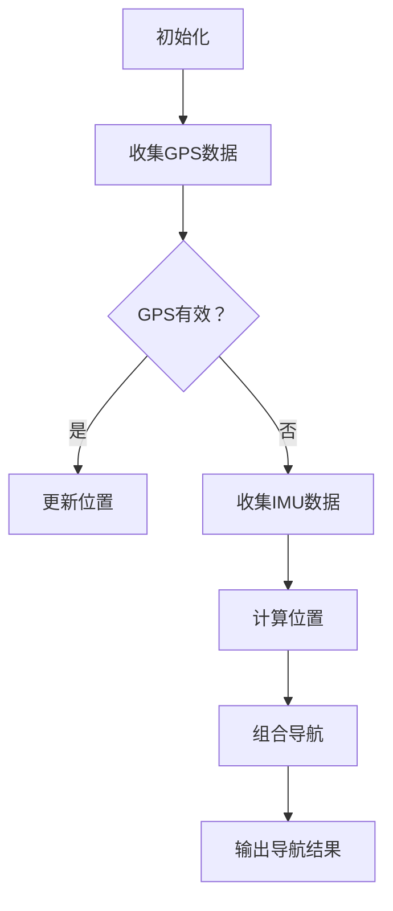
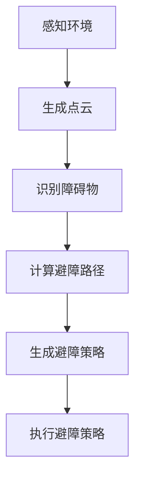
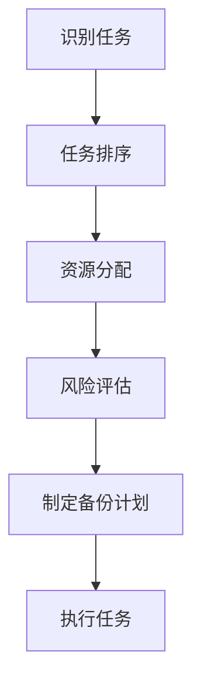
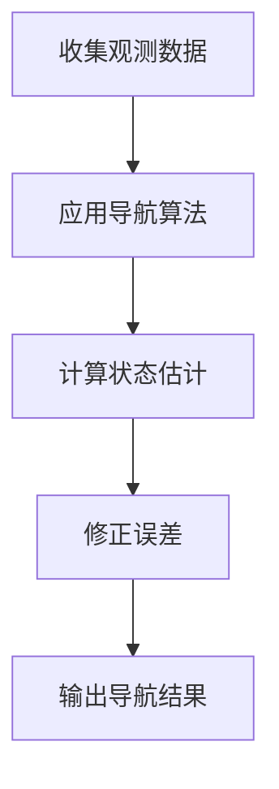
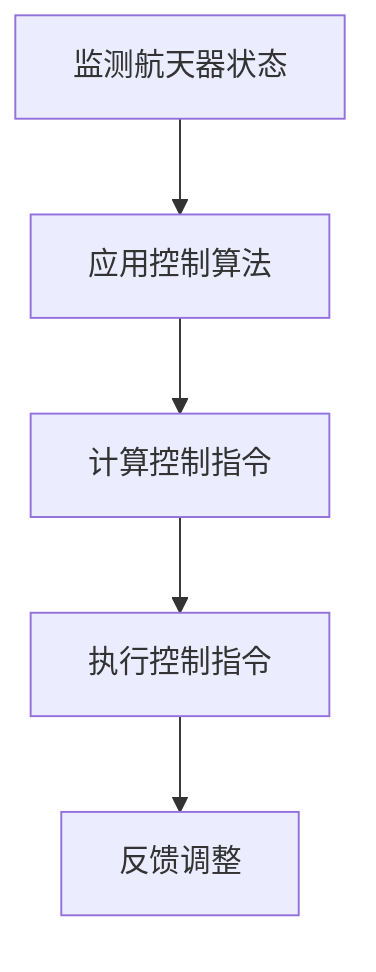
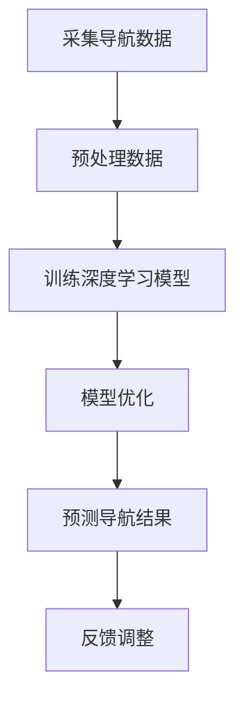
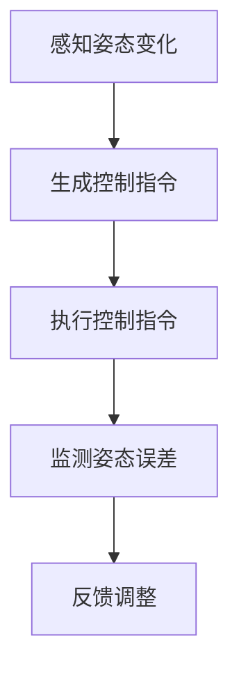
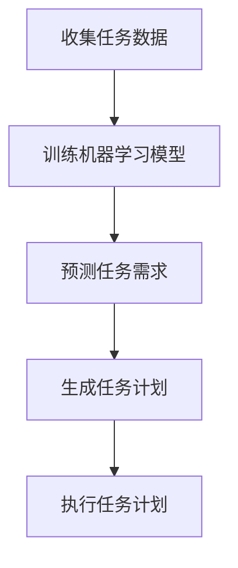

                 

### 《AI在太空探索中的应用：自主航天器和数据分析》

#### 关键词：AI、太空探索、自主航天器、数据分析、导航与控制

#### 摘要：

本文将深入探讨人工智能（AI）在太空探索中的应用，重点关注自主航天器和数据分析领域。首先，我们将概述AI技术的基本概念和发展历程，接着分析AI在太空探索中的实际应用现状及其对未来太空探索的影响。随后，我们将详细探讨AI在自主航天器中的关键技术，如自主导航、自动避障和任务规划，并分析其发展趋势和应用前景。文章还将深入探讨AI在航天器导航与控制中的应用，包括卫星导航系统、飞行控制系统和姿态控制系统，并通过案例分析展示其具体应用。此外，我们将探讨数据分析在太空探索中的应用，分析其在数据收集、处理和分析中的挑战与解决方案。最后，文章将讨论AI在太空探索项目管理和策略中的应用，以及AI安全与伦理问题。通过本文，读者将全面了解AI在太空探索中的广泛应用及其未来发展潜力。

## 第1章 引言

### 1.1 研究背景

太空探索是人类长久以来的梦想，从早期的火箭发射到今天的深空探测，人类不断突破技术的局限，向宇宙深处迈进。随着科技的不断进步，人工智能（AI）技术的迅速发展为太空探索带来了新的机遇和挑战。AI以其强大的数据处理、模式识别和决策能力，在航天器的自主导航、任务规划和数据分析等方面展现出巨大的潜力。

自主航天器是指能够在没有人工干预的情况下完成预定任务的航天器。它们不仅能够执行复杂的任务，如行星表面探测、深空巡游和科学实验，还能在极端环境下自主应对各种突发情况。AI技术的引入使得自主航天器具备了更高的智能化水平，能够实现更加精确和高效的太空任务。

数据分析在太空探索中同样扮演着重要角色。随着航天器数量的增加和数据采集能力的提升，太空探索产生的数据量呈现出爆炸式增长。如何有效地收集、处理和分析这些海量数据，提取有价值的信息，成为了一个亟待解决的问题。AI技术在数据挖掘、模式识别和机器学习等方面具有显著优势，为太空探索中的数据分析提供了强有力的支持。

### 1.2 研究目的

本文旨在系统地探讨AI在太空探索中的应用，重点关注自主航天器和数据分析两个领域。具体目标如下：

1. **概述AI技术的基本概念和发展历程**：通过对AI技术的基本概念和关键算法的介绍，使读者对AI技术有一个全面的了解。

2. **分析AI在太空探索中的应用现状**：探讨AI在自主航天器和数据分析领域的实际应用，分析其应用效果和面临的挑战。

3. **探讨AI技术对未来太空探索的影响**：分析AI技术如何改变太空探索的方式和策略，提高任务效率和成功率。

4. **详细探讨自主航天器中的AI技术**：介绍自主航天器的基本原理和关键技术，如自主导航、自动避障和任务规划，并分析其发展趋势和应用前景。

5. **探讨AI在航天器导航与控制中的应用**：介绍AI技术在卫星导航系统、飞行控制系统和姿态控制系统中的应用，并通过案例分析展示其具体应用。

6. **分析数据分析在太空探索中的应用**：探讨数据分析在太空探索中的挑战与解决方案，分析其在数据收集、处理和分析中的关键作用。

7. **讨论AI在太空探索项目管理和策略中的应用**：介绍AI在太空探索项目管理和策略中的应用，如项目规划、风险管理和决策支持等。

8. **探讨AI安全与伦理问题**：分析AI在太空探索中面临的安全与伦理问题，并提出相应的解决方案。

### 1.3 研究内容与方法

本文将采用以下研究内容和方法：

1. **文献综述**：通过查阅国内外相关文献，系统梳理AI在太空探索中的应用现状和发展趋势。

2. **案例分析**：选取具有代表性的自主航天器和数据分析项目，分析其技术路线、应用效果和面临的挑战。

3. **理论分析**：结合AI技术和太空探索的原理，对AI在自主航天器和数据分析中的应用进行深入分析。

4. **数据驱动分析**：通过收集和分析相关数据，探讨AI在太空探索中的实际应用效果和潜力。

5. **未来展望**：结合当前技术发展趋势，探讨AI在太空探索中的未来发展方向和潜在应用领域。

通过上述内容和方法，本文旨在为读者提供一个全面、系统的AI在太空探索中的应用分析，为未来太空探索提供有益的参考和启示。

## 第2章 太空探索中的AI技术概述

### 2.1 AI技术的定义与发展

人工智能（AI）是一种通过模拟人类智能行为，使计算机具备感知、学习、推理和决策能力的科学技术。AI技术的定义经历了从早期的人工智能（Artificial Intelligence，AI）到现代的人工智能（Artificial General Intelligence，AGI）的演变。早期的人工智能主要关注于特定任务的自动化，如语音识别、图像处理和自然语言处理等。而现代的人工智能则致力于实现更高级的智能，包括通用智能和自我学习能力。

AI技术的发展历程可以分为几个阶段。第一个阶段是20世纪50年代到70年代的早期人工智能时代，这一时期主要关注于符号主义和知识表示的方法。第二个阶段是20世纪80年代到90年代的专家系统时代，这一时期通过构建知识库和推理机，实现了一部分智能应用。第三个阶段是21世纪初至今的深度学习时代，这一时期通过神经网络和大数据的广泛应用，使得AI技术在各个领域取得了重大突破。

### 2.2 AI在太空探索中的应用现状

随着AI技术的快速发展，其在太空探索中的应用也日益广泛。目前，AI技术在太空探索中主要应用于以下几个领域：

1. **自主航天器**：AI技术使得自主航天器能够实现自主导航、自动避障和任务规划，从而在深空探测和行星探索中发挥了重要作用。例如，NASA的火星探测器“火星探测车”和“毅力号”都采用了AI技术，实现了自主行驶和科学实验。

2. **卫星导航**：AI技术在卫星导航系统中得到了广泛应用，通过机器学习和深度学习算法，可以实现对卫星轨迹的实时预测和误差校正，提高导航精度和可靠性。

3. **任务规划**：AI技术可以帮助航天器在复杂的太空环境中进行有效的任务规划，优化能源使用和科学实验安排，提高任务成功率。

4. **数据分析**：AI技术在太空探索中产生的海量数据中，可以快速提取有价值的信息，如行星地貌、天体运动和大气成分等。通过数据挖掘和机器学习算法，可以实现对数据的深入分析和解读。

5. **航天器维护**：AI技术可以帮助航天器进行自主诊断和维修，减少地面干预，提高航天器的可靠性和寿命。

### 2.3 AI技术对未来太空探索的影响

AI技术对未来太空探索的影响将是深远的。首先，AI技术将极大地提高航天器的自主性和智能化水平，使得航天器能够更加高效地执行复杂的任务。例如，通过AI技术，航天器可以实现自主导航和避障，从而在复杂的地形和环境中安全行驶。

其次，AI技术将有助于提高太空探索的科学数据采集和分析能力。通过机器学习和数据挖掘算法，可以快速提取和分析大量科学数据，从而获得更准确和全面的研究结果。

此外，AI技术还将促进太空探索的可持续发展。通过优化能源使用和资源管理，AI技术可以帮助航天器实现更长的寿命和更高的任务效率。

最后，AI技术将推动太空探索的商业化和国际合作。随着AI技术的不断发展，越来越多的商业航天公司将加入太空探索的行列，与各国政府和科研机构共同推动太空探索的进步。

总之，AI技术在太空探索中的应用将极大地改变传统的太空探索模式，提高任务效率和成功率，为人类探索宇宙带来更多的可能性。

### 2.4 AI在太空探索中的应用挑战与机遇

尽管AI技术在太空探索中展现出了巨大的潜力，但在实际应用中也面临着一系列挑战。首先，AI技术的可靠性和稳定性在极端环境下受到考验。太空环境中的高辐射、温度极端变化和通信延迟等因素，都可能影响AI算法的执行效果。因此，开发能够在这些条件下稳定运行的AI系统是当前的研究重点。

其次，AI算法的可解释性是一个关键问题。在太空探索中，决策的透明度和可追溯性至关重要。如果AI系统的决策过程不透明，将难以确保其行为的合理性和安全性。因此，研究者们正致力于开发可解释性强的AI模型，以便对系统的决策过程进行有效监控和调试。

第三，AI技术的安全性和伦理问题也需要慎重考虑。在太空探索中，AI系统可能涉及到敏感数据和处理关键任务，一旦出现故障或被恶意攻击，可能带来严重的后果。因此，建立完善的AI安全框架和伦理规范，确保AI系统的安全和公正，是未来研究的重要方向。

然而，这些挑战同时也带来了新的机遇。随着AI技术的不断进步，太空探索中的数据处理、任务规划和自主决策能力将得到显著提升，从而推动太空探索的深入发展。例如，通过AI技术，航天器可以在复杂的太空环境中自主规划路径，提高任务成功率；通过机器学习算法，科学家可以更快速地分析大量科学数据，发现新的科学现象。

此外，AI技术的应用还将促进太空探索的商业化进程。随着商业航天公司的发展，AI技术将成为降低成本、提高效率的关键因素，为太空探索带来更多的商业机会。例如，通过AI技术，卫星公司可以更高效地管理和运营卫星网络，提高通信质量和覆盖范围。

总之，AI技术在太空探索中的应用既面临着挑战，也充满了机遇。通过克服这些挑战，利用这些机遇，AI技术将为太空探索带来新的变革，推动人类向宇宙的更深处迈进。

### 3.1 自主航天器的定义与原理

自主航天器，也称为无人航天器，是指能够在没有人类干预的情况下，自主完成预定任务的航天器。它们不仅能够执行诸如行星表面探测、深空巡游和科学实验等复杂任务，还能够自主应对太空环境中的各种挑战。自主航天器的核心在于其自主导航、自动避障和任务规划能力，这些能力使航天器能够在没有地面控制的情况下独立运行。

自主导航是自主航天器的关键功能之一，它依赖于GPS和其他导航系统，结合惯性测量单元（IMU）和光学传感器等设备，实时计算航天器的位置和速度。通过精确的导航系统，航天器可以自主确定自己的位置，并规划最优路径。

自动避障则是保证航天器在复杂环境中安全运行的重要功能。航天器配备多种传感器，如激光雷达、摄像头和红外传感器，可以实时感知周围环境。当检测到障碍物时，AI算法会迅速计算避障策略，并控制航天器避开障碍物，确保其安全飞行。

任务规划是自主航天器的另一个核心功能，它涉及对航天器任务的全面规划和优化。AI算法会根据任务目标、航天器资源和环境条件，生成最优的任务执行计划。例如，航天器可以规划自己的轨道、科学实验的时间和顺序，以及与其他航天器的协作任务等。

### 3.2 AI在自主航天器中的关键技术

AI技术在自主航天器中扮演着至关重要的角色，主要包括自主导航、自动避障和任务规划等方面的关键技术。以下将详细介绍这些技术的原理和应用。

#### 自主导航

自主导航是自主航天器的核心功能之一，它依赖于多种传感器和算法来实现。首先，GPS（全球定位系统）是航天器定位的基本手段，但GPS信号在太空环境中可能受到遮挡或干扰，因此，航天器还需要配备惯性测量单元（IMU）来提供短期高精度的位置和姿态信息。

惯性导航系统通过测量航天器的加速度和角速度，结合牛顿运动定律，实时计算航天器的位置和速度。虽然惯性导航精度高，但存在累积误差问题，即随着时间的推移，误差会不断增大。为克服这一缺陷，自主航天器通常结合GPS信号进行修正，形成组合导航系统。

此外，光学传感器和激光雷达等设备在自主导航中也发挥着重要作用。光学传感器可以通过星图匹配和地标识别来确定航天器的位置，激光雷达则通过发射激光束并测量反射时间，精确感知周围环境。这些传感器数据的融合，使得航天器能够实现高精度的自主导航。

以下是自主导航系统的mermaid流程图：

#### 自动避障

自动避障是确保航天器在复杂太空环境中安全运行的关键技术。航天器通过多种传感器实时感知周围环境，包括激光雷达、摄像头和红外传感器等。激光雷达能够生成高精度的三维点云数据，摄像头则可以捕捉视觉信息，红外传感器则能够探测热源。

当航天器检测到障碍物时，AI算法会迅速计算避障策略。常用的算法包括基于图论的路径规划算法（如A*算法和Dijkstra算法）和基于采样方法的路径规划算法（如RRT算法和RRT*算法）。这些算法通过构建环境模型，搜索并生成最优的避障路径。

以下是自动避障系统的mermaid流程图：

#### 任务规划

任务规划是自主航天器实现高效任务执行的重要手段。AI技术在任务规划中的应用主要包括目标识别、任务排序、资源分配和风险评估等。

首先，AI算法会根据航天器的任务目标和当前状态，识别出优先执行的任务。例如，航天器可以优先执行科学实验任务，然后是轨道调整任务。

接下来，AI算法会对这些任务进行排序，确定最优执行顺序。任务排序需要考虑多个因素，如任务的紧急程度、所需时间和资源消耗等。

在确定任务顺序后，AI算法会进行资源分配，确保航天器的各项任务都能得到充分的资源支持。资源分配包括能源、计算资源和数据存储等。

最后，AI算法会对任务执行过程中的风险进行评估，并制定相应的应对措施。例如，当检测到某个任务可能失败时，AI算法会提前制定备份计划，确保任务能够顺利完成。

以下是任务规划系统的mermaid流程图：

#### 自主导航、自动避障和任务规划的关系

自主导航、自动避障和任务规划是自主航天器中紧密关联的三个关键技术。自主导航提供了航天器在太空中的位置和状态信息，是任务规划和自动避障的基础。自动避障则利用导航信息，确保航天器在执行任务过程中避开障碍物，保证安全。而任务规划则根据航天器的任务目标和当前状态，制定最优的任务执行计划，协调自主导航和自动避障的执行。

通过AI技术的综合应用，自主航天器能够实现高水平的智能化，从而在复杂的太空环境中高效、安全地执行各种任务。

### 3.3 自主航天器的发展趋势与应用前景

随着人工智能技术的迅猛发展，自主航天器在太空探索中的应用前景愈发广阔。以下是自主航天器发展的几个关键趋势及其应用前景：

#### 1. 超高精度自主导航

未来，自主航天器的导航系统将朝着超高精度发展。结合激光雷达、光学传感器和GPS等多种传感器的融合，自主航天器可以实现亚米级甚至更高精度的定位。这将极大提升航天器在复杂地形和恶劣环境中的导航能力，使其能够更准确地执行科学实验和任务。

#### 2. 智能化任务规划与决策

自主航天器的任务规划将更加智能化。通过深度学习和强化学习等先进算法，航天器能够根据实时数据和环境变化，动态调整任务计划，优化任务执行流程。例如，航天器可以自主决定在何时进行科学实验、如何进行轨道调整，甚至可以自主规划与其他航天器的协同任务，从而提高任务效率。

#### 3. 自动化维护与修复

自主航天器将具备自动化维护和修复能力。通过AI技术，航天器可以自主检测设备故障，并采取相应的修复措施，例如自动更换零部件、修复损坏的传感器等。这将减少地面干预的需求，提高航天器的可靠性和使用寿命。

#### 4. 跨航天器协同作战

未来，多个自主航天器将实现跨航天器的协同作战。通过AI技术的支持，航天器之间可以实时交换信息，协调行动，共同完成复杂的太空任务。例如，一组航天器可以协同完成对某一颗行星的全面探测，或协同构建太空网络。

#### 5. 商业化与民用化

随着AI技术的商业化进程，自主航天器将在商业和民用领域得到广泛应用。商业公司可以利用自主航天器提供遥感服务、卫星通信和地球观测等商业应用。在民用领域，自主航天器可以应用于气象监测、环境监测和灾害预警等。

#### 6. 开放式平台与生态建设

自主航天器的发展将趋向于构建开放式的平台和生态。通过开源软件和硬件，鼓励开发者社区参与自主航天器的研发和应用，推动技术的创新和进步。此外，构建标准化的接口和协议，将有助于不同类型的自主航天器实现互操作，提高系统的整体性能和灵活性。

综上所述，随着AI技术的不断进步，自主航天器在太空探索中的应用前景将更加广阔。通过智能化、自动化和协同化的技术发展，自主航天器将为人类探索宇宙提供更加高效、安全和可持续的手段。

### 4.1 航天器导航与控制的基础

航天器导航与控制是确保航天器在太空环境中安全、准确地执行任务的核心技术。航天器导航主要涉及航天器的位置、速度和姿态的确定，而航天器控制则包括对航天器的姿态调整和轨道控制，以确保航天器按照预定的轨迹运行。

#### 4.1.1 导航系统

航天器的导航系统通常由多个部分组成，包括卫星导航系统（如GPS、GLONASS、Galileo和Beidou等）、惯性导航系统和光学导航系统等。卫星导航系统利用卫星信号确定航天器的位置和速度，具有全球覆盖、实时性强的特点，但在信号遮挡或干扰的情况下可能失效。惯性导航系统通过测量航天器的加速度和角速度，计算出航天器的位置和速度，具有高精度和自主性的优势，但存在累积误差问题。光学导航系统通过观测星空或地面地标，确定航天器的位置和姿态，适用于深空探测和长时间无人控制任务。

导航系统的核心原理是通过接收不同位置的多个观测值，结合数学模型，解算出航天器的位置、速度和姿态。常用的导航算法包括卡尔曼滤波、粒子滤波和扩展卡尔曼滤波等。这些算法通过估计航天器的状态并修正误差，提供高精度的导航信息。

以下是导航系统的mermaid流程图：

#### 4.1.2 控制系统

航天器控制系统主要包括姿态控制系统和轨道控制系统。姿态控制系统用于调整航天器的姿态，确保其朝向正确的方向，完成特定的任务，如对地面或太空目标的观测。常见的姿态控制系统包括反作用控制系统、冷气体控制系统和电推进控制系统等。

轨道控制系统则用于调整航天器的轨道，使其按照预定的轨迹运行。轨道控制可以通过推力器实现，推力器通常采用化学推进、电推进或核推进等方式。轨道控制的关键在于推力器的能量管理和任务规划，以确保航天器在有限的燃料下实现最优的轨道控制。

控制系统的核心原理是通过实时监测航天器的状态，结合反馈控制算法，调整航天器的姿态和轨道，使其达到预期的目标。常见的控制算法包括比例-积分-微分（PID）控制、最优控制法和自适应控制法等。

以下是控制系统的mermaid流程图：

#### 4.1.3 导航与控制的关联

航天器的导航与控制密不可分，导航系统提供航天器的位置、速度和姿态信息，而控制系统根据这些信息进行调整，确保航天器按照预定的轨迹运行。导航与控制之间的反馈循环使得航天器能够在动态环境中保持稳定，并完成复杂的任务。

通过结合导航和控制系统，航天器能够实现自主导航和自主控制，提高任务的成功率和可靠性。随着人工智能技术的不断发展，导航与控制系统的智能化水平将进一步提升，为航天器的未来探索提供更加高效和安全的保障。

### 4.2 AI在航天器导航与控制中的应用

人工智能（AI）技术在航天器导航与控制中的应用，显著提升了航天器的智能化水平和任务成功率。通过引入AI技术，航天器能够实现更加精确和高效的导航与控制，以下将详细探讨AI技术在航天器导航与控制中的具体应用。

#### 4.2.1 自主导航

AI技术在自主导航中主要应用于多传感器数据融合和导航算法优化。多传感器数据融合能够提高导航精度和可靠性，通过结合GPS、IMU、激光雷达和光学传感器等多种传感器数据，AI算法能够实时处理和融合这些数据，提供高精度的导航信息。例如，卡尔曼滤波和粒子滤波等算法，通过优化传感器数据融合模型，提高了导航系统的性能。

此外，AI技术还用于优化导航算法。深度学习和强化学习等算法，可以用于改进传统的导航算法，如扩展卡尔曼滤波和粒子滤波。通过学习和预测航天器的运动模式，AI算法能够提供更加准确的导航预测，从而提高导航精度。

以下是一个利用深度学习进行导航算法优化的mermaid流程图：

#### 4.2.2 自主控制

AI技术在自主控制中的应用主要集中在姿态控制和轨道控制上。姿态控制通过AI算法实时监测航天器的姿态，并生成控制指令进行调整。例如，基于强化学习的姿态控制算法，能够通过学习航天器的姿态变化模式，生成最优的控制指令，实现高效姿态调整。

轨道控制则通过AI算法优化轨道控制策略，实现航天器在复杂环境中的最优轨道运行。例如，基于机器学习的推力器优化算法，能够通过分析航天器的运动状态和环境条件，生成最优的推力器控制策略，从而提高轨道控制的效率和精度。

以下是一个利用强化学习进行姿态控制的mermaid流程图：

#### 4.2.3 智能决策与规划

AI技术在航天器导航与控制中的另一个重要应用是智能决策和规划。通过机器学习和深度学习算法，航天器能够根据实时数据和任务需求，自主做出决策和规划。例如，航天器可以通过学习历史任务数据，预测未来的任务需求，并生成最优的任务执行计划。

智能决策和规划不仅提高了航天器的自主性，还增强了其应对突发情况的能力。例如，当航天器遇到紧急情况时，AI算法可以迅速分析当前状态，生成应对策略，从而确保航天器的安全和任务成功。

以下是一个利用机器学习进行任务规划的mermaid流程图：

#### 4.2.4 案例分析

一个典型的案例是NASA的火星探测车“毅力号”。该探测车采用了多种AI技术，包括自主导航、姿态控制和任务规划等。通过深度学习和强化学习算法，毅力号能够实现高精度的自主导航和姿态控制，从而在复杂的地形环境中安全行驶和执行科学实验。此外，毅力号还通过机器学习算法，对收集到的火星土壤样本进行分析，预测未来任务的最佳执行路径。

通过AI技术在导航与控制中的应用，毅力号展现了其强大的自主性和智能化水平，为未来火星探测任务提供了宝贵的经验。

总之，AI技术在航天器导航与控制中的应用，不仅提高了航天器的自主性和智能化水平，还为其在复杂太空环境中的任务执行提供了强有力的支持。随着AI技术的不断进步，航天器导航与控制将变得更加高效、可靠和智能化。

### 4.3 航天器导航与控制AI应用案例分析

为了深入理解AI在航天器导航与控制中的应用效果，我们可以通过具体案例来探讨这一技术的实际应用。

#### 案例一：NASA的“毅力号”火星探测器

NASA的“毅力号”火星探测器于2021年2月发射，是NASA火星探测计划的重要一环。该探测器采用了先进的AI技术，实现了高水平的自主导航和任务执行。

**应用场景：** 毅力号需要在火星表面自主行驶并进行科学实验，如挖掘火星土壤、分析岩石成分等。

**AI技术应用：** 
1. **自主导航**：毅力号配备了激光雷达、摄像头和IMU等传感器，通过深度学习和强化学习算法，实现了高精度、实时自主导航。激光雷达生成的三维点云数据与摄像头捕捉的视觉信息结合，使得探测器能够在复杂的火星地形中避障并规划行驶路径。
2. **姿态控制**：利用强化学习算法，毅力号能够实时调整姿态，确保在行驶过程中保持稳定的方向和姿态。
3. **任务规划**：AI算法根据探测器的当前状态、任务目标和火星地形数据，动态调整实验计划和行驶路径，确保任务的高效执行。

**效果评估：** 毅力号在火星表面成功行驶了数公里，并完成了多项科学实验。通过AI技术的应用，探测器在复杂地形中的行驶稳定性显著提高，任务成功率也大幅提升。

**经验与启示：** 毅力号的成功表明，AI技术在航天器导航与控制中的应用具有巨大的潜力。通过结合多种传感器数据和高水平的算法优化，航天器能够在复杂环境中实现高效、安全的自主运行。

#### 案例二：SpaceX的星际飞船（Starship）

SpaceX的星际飞船（Starship）是一款旨在实现火星和星际旅行的下一代航天器。该飞船在导航与控制中广泛应用了AI技术，以提高其自主性和任务效率。

**应用场景：** 星际飞船需要在地球轨道、火星轨道和深空中进行复杂的飞行任务，如发射、着陆、轨道转移等。

**AI技术应用：** 
1. **自主导航**：星际飞船采用了基于深度学习和强化学习的导航算法，能够实时处理来自GPS、IMU、光学传感器等多种传感器的数据，实现高精度的自主导航。
2. **姿态控制**：飞船配备了高精度的姿态控制系统，利用AI算法实时调整飞船的姿态，确保在飞行过程中保持稳定的飞行路径。
3. **任务规划**：AI算法根据任务需求和飞船的状态，动态调整飞行计划，优化燃料消耗和飞行路径，提高任务成功率。

**效果评估：** 通过AI技术的应用，星际飞船在多次测试中展现了出色的自主导航和姿态控制能力，成功完成了多个测试飞行任务。

**经验与启示：** 星际飞船的成功应用表明，AI技术在航天器导航与控制中具有广阔的应用前景。通过智能化算法的引入，航天器可以在复杂的太空环境中实现高效、可靠的自主运行，为未来的深空探索提供技术保障。

#### 案例三：中国航天科技的“天问一号”火星探测器

中国的“天问一号”火星探测器于2020年发射，是首个成功实现火星探测任务的中国探测器。该探测器同样采用了AI技术，实现了自主导航和任务执行。

**应用场景：** 天问一号需要在火星轨道上运行，进行科学实验和探测火星表面。

**AI技术应用：** 
1. **自主导航**：探测器配备了激光雷达和摄像头，通过深度学习和强化学习算法，实现了高精度的自主导航。
2. **任务规划**：AI算法根据探测器的状态、任务需求和火星地形数据，动态调整实验计划和运行轨迹。

**效果评估：** 天问一号成功进入了火星轨道，并在火星表面着陆，完成了多项科学实验，取得了重要成果。

**经验与启示：** 天问一号的成功应用表明，AI技术在航天器导航与控制中具有重要意义。通过AI技术的引入，航天器能够在复杂环境下实现高效、可靠的自主运行，提高任务成功率。

总之，通过以上案例可以看到，AI技术在航天器导航与控制中的应用显著提高了航天器的自主性和任务成功率。未来，随着AI技术的不断进步，航天器导航与控制将变得更加智能化、高效和可靠，为人类探索宇宙提供更加坚实的保障。

### 4.4 AI在航天器导航与控制中的挑战与解决方案

尽管AI技术在航天器导航与控制中展现出了巨大潜力，但其应用也面临诸多挑战。以下将讨论这些挑战，并提出相应的解决方案。

#### 4.4.1 硬件限制

航天器上的硬件资源有限，特别是计算能力和存储空间。这对AI算法的高效运行提出了挑战。**解决方案**：通过优化算法和模型压缩技术，降低计算复杂度和存储需求。此外，可以采用分布式计算和云计算技术，将部分计算任务转移到地面或卫星上的高性能计算平台，减轻航天器硬件的压力。

#### 4.4.2 数据质量

AI算法的性能依赖于高质量的数据。在太空环境中，传感器数据的获取可能受到噪声干扰和不确定性影响。**解决方案**：引入多传感器数据融合技术，通过融合不同传感器的数据，提高数据的可靠性和精度。同时，可以采用数据清洗和预处理技术，去除噪声和异常值，提高数据质量。

#### 4.4.3 实时性要求

航天器导航与控制需要实时响应，AI算法必须能够在有限的时间内完成计算并生成控制指令。**解决方案**：优化算法的实现和硬件性能，确保算法能够在实时环境中高效运行。此外，可以采用边缘计算技术，将部分计算任务在航天器边缘设备上完成，减少延迟。

#### 4.4.4 可解释性和可靠性

AI算法的黑箱性质可能导致其决策过程不透明，影响系统的可靠性和可解释性。特别是在航天器导航与控制中，决策的透明度和可追溯性至关重要。**解决方案**：开发可解释性强的AI模型，如基于规则的解释模型和可视化工具，使决策过程更加透明。此外，通过反复测试和验证，确保AI算法的可靠性和稳定性。

#### 4.4.5 网络和通信问题

在太空环境中，航天器与地面控制中心之间的通信可能受到延迟和干扰的影响，这对AI算法的实时性和可靠性提出了挑战。**解决方案**：采用分布式计算和边缘计算技术，减轻地面控制中心的计算压力。此外，可以采用冗余通信链路和信号增强技术，提高通信的稳定性和可靠性。

通过解决上述挑战，AI技术将在航天器导航与控制中发挥更大的作用，为人类探索宇宙提供更加高效、安全和可靠的手段。

### 5.1 数据分析的基本概念

数据分析是指利用统计方法和计算技术，从大量数据中提取有价值的信息和知识的过程。它是数据科学的重要组成部分，广泛应用于各个领域，包括商业、医疗、金融和太空探索等。数据分析的基本概念包括数据收集、数据清洗、数据存储、数据探索、数据分析和数据可视化。

#### 数据收集

数据收集是数据分析的第一步，涉及从各种来源获取数据。这些数据来源可以是传感器、数据库、文件、互联网等。在太空探索中，数据主要来源于航天器、卫星和其他探测设备。例如，航天器上的科学仪器可以收集到关于行星表面、大气成分、宇宙射线等信息。

#### 数据清洗

数据清洗是指去除数据中的噪声、异常值和重复数据，以提高数据的质量和可靠性。数据清洗的目的是确保分析结果的准确性和有效性。在太空探索中，数据清洗尤为重要，因为航天器产生的数据可能受到各种干扰和误差的影响。

#### 数据存储

数据存储是指将收集到的数据存储到数据库或其他存储系统中，以便后续分析和处理。数据存储需要考虑数据的规模、访问速度和安全性等因素。在太空探索中，由于数据量巨大，通常采用分布式存储系统和高性能数据库来存储和管理数据。

#### 数据探索

数据探索是指通过数据可视化和统计分析方法，对数据进行分析和探索，以发现潜在的模式、趋势和异常。数据探索可以帮助科学家了解数据的整体特征，并为后续的深入分析提供指导。

#### 数据分析

数据分析是指使用统计方法、机器学习和深度学习算法，对数据进行处理和分析，提取有价值的信息和知识。数据分析包括回归分析、聚类分析、分类分析、关联规则挖掘等。

#### 数据可视化

数据可视化是指通过图形和图表，将数据分析结果以直观的方式呈现出来，以便科学家和决策者理解和解释数据。数据可视化有助于提高数据可读性和理解性，促进数据的传播和应用。

通过上述基本概念，数据分析为太空探索提供了强大的工具，帮助科学家从海量数据中提取有价值的信息，推动太空科学的发展。

### 5.2 数据分析在太空探索中的应用

数据分析在太空探索中扮演着至关重要的角色，它通过处理和分析来自航天器和卫星的海量数据，帮助科学家们更好地理解宇宙，揭示行星和天体的奥秘。以下是数据分析在太空探索中的具体应用领域和实际案例：

#### 1. 行星探索

在行星探索中，数据分析用于解析从行星表面获取的高分辨率图像、地形数据和地质特征。例如，NASA的“火星勘测轨道飞行器”（MRO）和“火星科学实验室”（MSL）携带的相机收集了大量的火星表面图像。通过分析这些图像，科学家们能够识别出火星表面的地质结构、地貌变化和潜在的水迹象。此外，数据分析还被用于分析火星土壤和岩石样本，揭示其成分和形成过程。

#### 2. 大气监测

太空探索中的卫星和探测器能够监测地球和其他行星的大气层。数据分析技术在这里用于处理来自气象卫星、地球观测卫星的数据，以监测大气中的温度、湿度、风向和污染水平。例如，NASA的“地球观测系统”（EOS）卫星系列，通过分析卫星传感器收集的数据，提供了全球范围内的高精度气象和气候数据，帮助科学家们研究气候变化和大气环境问题。

#### 3. 宇宙射线研究

宇宙射线是来自宇宙的高能粒子，它们可以提供关于宇宙起源和演化的宝贵信息。数据分析技术用于处理从宇宙射线探测实验中获得的大量数据，以识别和分类不同类型的宇宙射线。例如，NASA的费米伽马射线太空望远镜通过分析宇宙射线数据，发现了许多高能伽马射线源，并揭示了宇宙射线产生的机制。

#### 4. 星际物质分析

数据分析技术也用于分析星际物质，包括星际尘埃、行星形成盘和星云等。例如，通过对赫歇尔太空望远镜的数据分析，科学家们能够识别出星际尘埃的特征，并研究它们如何影响行星的形成。此外，数据分析还被用于分析星系合并过程中产生的星云和恒星形成区域，为理解星系的演化提供了重要线索。

#### 5. 宇宙背景辐射

宇宙背景辐射是宇宙早期留下的温度波动，它提供了关于宇宙大爆炸和宇宙结构演化的关键信息。数据分析技术用于处理来自宇宙微波背景辐射探测器的数据，以识别这些微小的温度波动，并研究宇宙的早期状态。例如，NASA的微波背景探测器和欧洲空间局的普朗克卫星，通过分析宇宙背景辐射数据，揭示了宇宙的膨胀历史和结构形成过程。

#### 6. 深空探测任务规划

数据分析技术还在深空探测任务规划中发挥着重要作用。通过对历史任务的记录和数据分析，科学家们能够预测未来任务的潜在风险和挑战，优化任务计划和资源分配。例如，通过分析“旅行者1号”和“旅行者2号”探测器的数据，科学家们能够更好地规划未来的星际探测任务，提高任务的成功率。

#### 案例分析

- **案例一：开普勒望远镜**：开普勒望远镜是NASA的一个太空望远镜，专门用于寻找太阳系外的系外行星。通过分析开普勒望远镜收集到的数据，科学家们发现了数千个系外行星，其中包括许多类地行星。这些发现为理解系外行星的分布、形成和性质提供了宝贵的信息。

- **案例二：火星探测车“毅力号”**：毅力号火星探测车携带了一系列科学仪器，包括多光谱相机、铲子、土壤分析仪等。通过分析毅力号收集到的数据，科学家们能够了解火星的地质历史、环境条件和潜在的生命迹象。这些数据对于未来的火星探索任务具有重要指导意义。

- **案例三：阿尔法磁谱仪（AMS）**：安装在太空站的阿尔法磁谱仪通过分析宇宙射线数据，揭示了宇宙中的高能粒子的性质和来源。这些数据帮助科学家们理解宇宙的演化过程和宇宙射线与物质的相互作用。

总之，数据分析在太空探索中的应用不仅帮助科学家们从海量数据中提取有价值的信息，还推动了太空科学的发展，为人类探索宇宙提供了强有力的支持。

### 5.3 数据分析在太空探索中的挑战与解决方案

尽管数据分析在太空探索中发挥了重要作用，但其应用也面临诸多挑战。以下将讨论这些挑战，并提出相应的解决方案。

#### 5.3.1 数据量大

太空探索产生的数据量巨大，如何有效地存储、处理和分析这些海量数据成为一大挑战。**解决方案**：采用分布式存储系统和大数据处理技术，如Hadoop和Spark，将数据分片存储和处理，提高数据处理效率。此外，可以采用数据压缩和预处理技术，减少数据存储和传输的需求。

#### 5.3.2 数据质量

太空环境中的传感器数据可能受到噪声、干扰和误差的影响，导致数据质量下降。**解决方案**：引入多传感器数据融合技术，通过融合不同传感器的数据，提高数据的可靠性和精度。同时，采用数据清洗和预处理技术，去除噪声和异常值，确保分析结果的准确性。

#### 5.3.3 实时性要求

太空探索中的任务通常需要在实时环境中做出决策，数据分析系统必须能够在短时间内完成计算并生成结果。**解决方案**：优化算法和数据处理流程，减少计算时间和延迟。采用边缘计算和分布式计算技术，将部分计算任务在航天器边缘设备上完成，降低通信延迟。

#### 5.3.4 多源异构数据

太空探索中涉及多种数据源，包括图像、音频、文本和传感器数据等，这些数据的格式、结构和类型各异。**解决方案**：开发跨领域的统一数据模型和数据处理框架，实现多源异构数据的整合和分析。引入自然语言处理和图像处理等技术，提高复杂数据的处理和分析能力。

#### 5.3.5 安全性与隐私保护

太空探索中的数据可能包含敏感信息，如军事目标和科学发现，如何确保数据的安全性和隐私保护成为关键问题。**解决方案**：采用数据加密和访问控制技术，确保数据在传输和存储过程中的安全性。建立完善的数据隐私保护机制，防止数据泄露和滥用。

#### 5.3.6 遥感数据的时序性

太空探索中获取的遥感数据具有强烈的时序性，如何有效地管理和分析这些时序数据成为挑战。**解决方案**：开发时序数据库和时序分析算法，如InfluxDB和KNN算法，实现遥感数据的实时分析和预测。引入时间序列模型和机器学习算法，提高时序数据分析的准确性和效率。

通过解决上述挑战，数据分析在太空探索中的应用将得到进一步优化，为人类探索宇宙提供更强大的支持。

### 6.1 项目管理的原则与方法

在太空探索项目中，项目管理是一个至关重要的环节，它决定了任务的成功与失败。有效的项目管理不仅需要遵循一系列原则，还需要运用科学的方法和工具。以下将详细探讨太空探索项目管理的原则、关键步骤和方法。

#### 6.1.1 项目管理的原则

1. **目标明确**：项目启动前，必须明确项目的目标、范围和预期成果，确保所有参与者对项目的目标有一致的认识。

2. **规划周密**：项目规划是项目管理的核心，通过详细的计划，明确任务分工、资源分配和时间表，确保项目按计划顺利进行。

3. **风险控制**：项目过程中可能会遇到各种风险，如技术难题、预算超支和时间延误等。有效的风险管理可以帮助项目团队提前识别和应对潜在风险。

4. **团队合作**：项目成功离不开团队的合作与协作。建立一个高效、协作的团队，确保每个成员都能发挥自己的专长，是项目成功的关键。

5. **质量保证**：项目必须确保质量，通过建立严格的质量控制标准和流程，确保项目交付的成果符合预期。

6. **持续改进**：项目结束后，通过回顾和总结，不断改进项目管理方法和流程，提高项目执行效率。

#### 6.1.2 项目管理的关键步骤

1. **项目启动**：在项目启动阶段，明确项目目标、范围和资源需求，制定初步的项目计划和预算，组建项目团队。

2. **项目规划**：项目规划阶段，详细制定项目任务、时间表、资源分配和风险评估等，确保项目有明确的执行路线。

3. **项目执行**：项目执行阶段，根据项目计划，逐步完成各项任务，进行实时监控和调整，确保项目按计划进行。

4. **项目监控**：项目监控是确保项目按计划执行的重要手段，通过定期评估项目进展和质量，及时发现和解决问题。

5. **项目收尾**：项目收尾阶段，对项目成果进行验收和总结，评估项目执行效果，收集反馈意见，为未来项目提供参考。

#### 6.1.3 项目管理的方法和工具

1. **项目管理软件**：采用项目管理软件，如JIRA、Trello和Asana等，可以有效地管理项目任务、进度和资源分配。

2. **甘特图**：甘特图是一种直观的项目进度图表，通过显示任务开始和结束时间，帮助团队了解项目进展。

3. **工作分解结构（WBS）**：WBS是一种将项目任务分解为可管理的子任务的方法，有助于明确任务分工和责任。

4. **风险评估与矩阵**：通过建立风险评估与矩阵，项目团队可以识别和评估项目中的潜在风险，制定相应的应对措施。

5. **质量管理工具**：采用质量管理工具，如六西格玛、ISO 9001等，确保项目交付的成果符合质量标准。

6. **项目回顾**：项目结束后，通过回顾和总结，团队可以总结经验教训，改进项目管理方法和流程。

通过遵循项目管理原则、关键步骤和应用科学的方法和工具，太空探索项目团队可以确保项目高效、有序地完成，为太空探索的成功提供坚实保障。

### 6.2 AI在太空探索项目中的应用

人工智能（AI）技术在太空探索项目中的应用越来越广泛，为项目规划和执行带来了革命性的变革。AI技术在太空探索项目的多个环节中发挥了关键作用，包括项目规划、风险管理和决策支持等。

#### 6.2.1 项目规划

在项目规划阶段，AI技术可以大幅提高规划和优化的效率。通过机器学习和数据挖掘算法，AI能够分析历史项目数据、技术趋势和资源需求，生成最优的项目计划和资源分配方案。具体应用包括：

1. **任务优先级排序**：AI可以根据任务的重要性、复杂度和时间限制，动态调整任务执行的优先级，确保关键任务优先完成。

2. **资源优化**：AI能够根据项目需求和资源可用性，自动优化资源配置，减少资源浪费，提高资源利用率。

3. **时间表生成**：AI通过分析任务依赖关系和执行时间，生成优化的项目时间表，确保项目按计划进行。

#### 6.2.2 风险管理

在风险管理方面，AI技术通过数据分析和模式识别，能够提前识别和预测项目中的潜在风险，提供有效的风险管理策略。具体应用包括：

1. **风险识别**：AI可以通过分析历史项目数据和当前项目环境，识别出可能影响项目成功的关键风险因素。

2. **风险预测**：AI利用机器学习算法，对项目数据进行分析，预测未来可能发生的风险事件，并提供预警。

3. **风险应对策略**：AI可以根据预测的风险，提供多种应对策略，帮助项目团队制定有效的风险管理计划。

#### 6.2.3 决策支持

在决策支持方面，AI技术为项目管理者提供了实时、全面的数据分析和预测结果，帮助做出科学决策。具体应用包括：

1. **实时监控**：AI系统能够实时收集和分析项目数据，提供项目的实时状态和进展情况，帮助管理者快速做出反应。

2. **预测分析**：AI通过分析历史数据和当前趋势，预测项目未来的进展和结果，提供决策支持。

3. **优化决策**：AI利用优化算法，提供多种可能的决策方案，帮助管理者选择最优的决策路径。

#### 6.2.4 案例分析

以下是一个AI在太空探索项目中的实际应用案例：

**案例：NASA的火星探测任务**

在NASA的火星探测任务中，AI技术被广泛应用于项目规划和执行。在项目规划阶段，AI系统通过分析历史探测数据和当前任务需求，生成了最优的任务分配方案和资源使用计划。在任务执行过程中，AI系统实时监控航天器的状态，预测潜在的风险，并提供了多个应对策略。例如，在“毅力号”火星探测车的任务中，AI系统通过分析传感器数据，实时调整探测车的行驶路径和实验计划，确保任务的高效和成功执行。

**效果评估**：通过AI技术的应用，NASA的火星探测任务在任务规划、风险管理和决策支持等方面取得了显著成效。任务的成功率显著提高，资源利用率大幅提升，项目风险得到了有效控制。

**经验与启示**：AI技术在太空探索项目中的应用展示了其强大的潜力和优势。通过引入AI技术，项目团队能够更加高效、科学地进行项目规划和管理，提高任务的成功率和效率。未来，随着AI技术的不断进步，其在太空探索项目中的应用将更加广泛和深入。

### 6.3 太空探索项目的AI管理策略

为了充分利用AI技术在太空探索项目中的应用，制定有效的AI管理策略至关重要。以下将介绍AI在太空探索项目中的具体管理策略，包括规划、实施和监控阶段。

#### 6.3.1 规划阶段

在项目规划阶段，AI管理策略的主要目标是确保项目目标的明确性和资源的高效配置。以下是一些具体的策略：

1. **需求分析与目标设定**：通过数据分析，了解项目需求，明确项目目标。AI算法可以帮助项目团队分析历史项目数据，识别关键需求和潜在风险，确保项目目标的科学性和可行性。

2. **资源评估与分配**：AI技术可以评估项目所需的资源，包括人力、物力和财力等，并优化资源分配，确保资源利用的最大化。例如，通过预测分析，可以确定最佳的人员配置和设备采购时间，减少资源浪费。

3. **风险评估与预案制定**：AI算法可以根据历史数据和实时数据，预测项目风险，并制定相应的应对措施。项目团队可以利用AI系统生成风险矩阵，识别高优先级的风险，并制定详细的应对预案。

#### 6.3.2 实施阶段

在项目实施阶段，AI管理策略的核心是确保项目按计划进行，并及时调整以应对变化。以下是一些具体的策略：

1. **任务优先级调整**：AI系统可以根据任务的重要性和执行难度，动态调整任务的优先级。例如，当某个关键任务出现延误时，AI系统可以重新分配资源，确保关键任务优先完成。

2. **实时监控与预警**：AI系统可以实时监控项目的进展情况，收集和分析项目数据，及时发现潜在问题。通过预警机制，AI系统可以在问题发生前提出预警，帮助项目团队及时采取措施。

3. **自动化决策支持**：AI系统可以根据实时数据和预定的决策规则，自动生成决策支持报告，为项目管理者提供科学依据。例如，当AI系统检测到某个传感器数据异常时，可以自动生成修复建议，并通知相关团队。

#### 6.3.3 监控阶段

在项目监控阶段，AI管理策略的主要目标是评估项目执行效果，收集反馈意见，并不断优化项目管理流程。以下是一些具体的策略：

1. **项目进展评估**：AI系统可以定期评估项目的进展情况，生成详细的进展报告，帮助项目管理者了解项目的实际进展，发现潜在的问题。

2. **反馈收集与优化**：AI系统可以收集项目团队和利益相关者的反馈意见，分析反馈数据，识别项目中的问题和不足，并提出优化建议。

3. **持续改进与优化**：AI系统可以根据反馈数据，不断调整和优化项目管理流程，提高项目执行效率。例如，通过机器学习算法，AI系统可以不断改进预测模型，提高风险预测的准确性。

通过上述AI管理策略，项目团队可以更好地规划、实施和监控太空探索项目，确保项目的高效、有序和成功执行。

### 6.4 太空探索中的AI安全与伦理问题

随着AI技术在太空探索项目中的应用日益广泛，其安全与伦理问题也引起了广泛关注。AI在太空探索中的应用不仅面临技术挑战，还涉及到数据安全、隐私保护、决策责任和伦理道德等方面的问题。以下将详细探讨这些问题，并提出相应的解决方案。

#### 6.4.1 数据安全

太空探索项目涉及大量敏感数据，包括科学实验数据、航天器状态数据和任务执行数据等。如何确保这些数据的安全，防止数据泄露、篡改和丢失，是AI技术应用中必须面对的挑战。**解决方案**：

1. **数据加密**：对敏感数据进行加密处理，确保数据在传输和存储过程中的安全性。
2. **访问控制**：建立严格的访问控制机制，仅允许授权用户访问敏感数据，防止未授权访问。
3. **数据备份与恢复**：定期备份数据，并建立数据恢复机制，确保数据丢失时能够及时恢复。

#### 6.4.2 隐私保护

在太空探索项目中，AI技术需要处理大量的个人隐私数据，如航天员的健康数据、任务执行中的生物特征数据等。如何保护这些隐私数据，防止隐私泄露和滥用，是AI技术面临的重要伦理问题。**解决方案**：

1. **隐私保护算法**：采用隐私保护算法，如差分隐私和同态加密等，确保在数据处理过程中不会泄露个人隐私信息。
2. **匿名化处理**：对个人隐私数据进行匿名化处理，去除可直接识别身份的信息，降低隐私泄露风险。
3. **透明度与知情同意**：建立数据处理的透明度机制，确保数据使用者和数据主体之间的知情权和同意权，减少隐私侵犯。

#### 6.4.3 决策责任

AI技术在太空探索项目中涉及到复杂的决策过程，如航天器的自主导航、任务规划和应急响应等。如何明确和分配决策责任，确保AI系统的决策行为符合道德和法律要求，是一个亟待解决的问题。**解决方案**：

1. **决策可解释性**：开发可解释的AI模型，确保决策过程透明，有助于追溯和评估决策责任。
2. **责任界定机制**：建立明确的决策责任界定机制，明确AI系统与人类操作者之间的责任分工，确保在出现问题时能够快速定位责任主体。
3. **法律与伦理框架**：制定相关法律和伦理规范，明确AI技术在太空探索中的应用准则，确保AI系统的决策和行为符合道德和法律要求。

#### 6.4.4 伦理道德

AI技术在太空探索中的应用涉及诸多伦理道德问题，如人类与AI的协作、数据使用和决策影响等。如何平衡人类利益和技术进步，防止伦理风险，是AI技术应用中必须关注的重点。**解决方案**：

1. **伦理审查委员会**：建立独立的伦理审查委员会，对AI技术在太空探索中的应用进行伦理评估，确保应用过程符合伦理标准。
2. **伦理培训与教育**：加强AI技术和伦理学的培训与教育，提高项目团队成员的伦理意识和道德素养。
3. **伦理决策支持系统**：开发伦理决策支持系统，帮助项目团队在决策过程中考虑伦理因素，做出符合伦理要求的决策。

通过上述解决方案，可以在确保AI技术在太空探索中安全应用的同时，有效应对其带来的伦理挑战，推动太空探索的可持续发展。

### 8.1 AI在太空探索中的未来发展方向

AI技术在太空探索中的应用前景广阔，未来将在多个领域继续拓展和深化。以下是AI在太空探索中的一些主要发展方向：

#### 1. 更高级别的自主性

未来的AI系统将致力于实现更高水平的自主性，使航天器能够更加独立和智能化地执行复杂任务。这包括自主任务规划、自主决策和自主执行，减少对地面控制的依赖，提高任务的灵活性和效率。例如，AI系统可以通过学习历史数据和实时数据，自主优化飞行路径和科学实验计划，提高任务成功率。

#### 2. 大数据分析与智能分析

太空探索将产生海量的科学数据，未来的AI技术将更加注重大数据分析和智能分析，从这些数据中提取有价值的信息和知识。利用机器学习和深度学习算法，AI系统可以快速识别模式、趋势和异常，帮助科学家们更好地理解宇宙和行星的奥秘。例如，AI系统可以分析火星探测数据，识别潜在的微生物生命迹象，为未来的生命探索提供线索。

#### 3. 跨学科融合

AI技术在太空探索中的应用将更加注重跨学科的融合，结合物理学、化学、生物学和计算机科学等领域的知识，开发出更加综合和高效的AI系统。例如，通过将地球科学和太空科学相结合，AI系统可以更准确地预测和解释行星环境和地质特征，为未来的行星探测提供科学依据。

#### 4. 网络化协同作战

随着太空探索任务的复杂化和规模化，AI系统将实现网络化协同作战，多个航天器之间能够实时通信和协作，共同完成复杂的太空任务。通过分布式计算和边缘计算，AI系统可以在航天器之间共享信息和资源，提高任务的执行效率和安全性。例如，多个航天器可以协同完成对行星的全面探测，或者共同构建太空网络，提供全球覆盖的通信服务。

#### 5. 人机协同

未来的AI技术将更加注重人机协同，使人类操作者和AI系统能够更好地合作，共同完成太空任务。通过增强现实（AR）和虚拟现实（VR）技术，AI系统可以提供直观的操作界面和实时的决策支持，帮助人类更好地理解和控制复杂的太空环境。例如，航天员可以通过AI系统提供的可视化工具，实时监控航天器的状态，并做出快速反应。

#### 6. 伦理与安全

在未来的太空探索中，AI技术的应用将更加注重伦理和安全问题。通过建立完善的伦理规范和安全框架，确保AI系统的行为符合道德和法律要求，防止潜在的伦理风险和安全威胁。例如，开发可解释性强的AI模型，使决策过程透明，确保AI系统的行为可追溯和可控。

总之，随着AI技术的不断进步，其在太空探索中的应用将不断拓展和深化，为人类探索宇宙提供更加高效、安全和可持续的手段。未来，AI技术将成为太空探索中不可或缺的重要工具，推动人类向宇宙的更深处迈进。

### 8.2 AI在太空探索中的潜在应用领域

AI技术在太空探索中的应用前景广阔，未来将可能在多个领域发挥关键作用。以下是AI在太空探索中的潜在应用领域及其前景：

#### 1. 深空探测

随着人类对宇宙的探索不断深入，深空探测任务将越来越依赖AI技术。AI系统可以在深空探测中实现自主导航、自动避障和任务规划，提高探测器的自主性和智能化水平。例如，AI系统可以通过机器学习和深度学习算法，分析历史探测数据和环境信息，优化探测器的路径和实验计划，提高探测效率。同时，AI技术还可以用于实时分析探测数据，提取有价值的信息，为科学家提供实时洞察。

#### 2. 行星科学

行星科学是太空探索的重要领域之一，AI技术在行星科学中的应用前景也非常广阔。通过大数据分析和智能分析，AI系统可以分析行星探测数据，揭示行星的地质特征、气候演变和生命迹象。例如，AI系统可以通过深度学习算法，识别行星表面的地形变化、矿物质成分和大气成分，帮助科学家们更好地理解行星的形成和演化过程。此外，AI技术还可以用于分析行星大气层和磁场数据，预测行星的天气变化和空间环境。

#### 3. 航天器维护

航天器在太空环境中运行，需要定期进行维护和维修。AI技术可以用于航天器的自主诊断和故障预测，提高航天器的可靠性和使用寿命。例如，AI系统可以通过监测航天器的各种参数，分析其运行状态，预测潜在的故障风险，并提前进行维修或更换。此外，AI技术还可以用于航天器的自主修复，例如利用3D打印技术打印所需的零部件，实现航天器在太空环境中的自主维护。

#### 4. 太空探索任务规划

AI技术在太空探索任务规划中具有重要作用。通过机器学习和数据挖掘算法，AI系统可以分析历史任务数据和环境信息，生成最优的任务执行计划。例如，AI系统可以根据航天器的状态、任务目标和环境条件，动态调整任务执行顺序和资源分配，提高任务效率。此外，AI技术还可以用于航天器编队飞行和协同任务，实现多个航天器之间的实时通信和协同工作，提高任务的成功率。

#### 5. 太空医疗保健

太空探索任务通常需要长时间的太空飞行，航天员面临着各种健康风险。AI技术在太空医疗保健中具有巨大的潜力。例如，AI系统可以通过分析航天员的健康数据和生活习惯，预测航天员的健康风险，并提供个性化的健康建议。此外，AI技术还可以用于航天员的健康监测，通过实时监测航天员的生理指标，及时发现并处理健康问题，确保航天员在太空环境中的安全和健康。

总之，AI技术在太空探索中的潜在应用领域广泛，未来将在提高探测效率、优化任务规划、增强航天器自主性、保障航天员健康等方面发挥重要作用。随着AI技术的不断进步，太空探索将迎来新的变革，推动人类向宇宙的更深处迈进。

### 8.3 AI在太空探索中的未来挑战与机遇

随着AI技术在太空探索中的广泛应用，其未来发展面临着诸多挑战和机遇。以下将探讨这些挑战与机遇，并分析其对太空探索的影响。

#### 8.3.1 挑战

1. **技术复杂性**：AI系统在太空探索中的应用涉及多个复杂的领域，包括自主导航、任务规划和数据分析等。这要求AI技术具有高度的复杂性和可靠性，以确保在极端环境下稳定运行。技术复杂性可能带来系统设计、实现和验证的难题。

2. **数据隐私和安全**：太空探索产生的数据包含大量敏感信息，如航天器的状态、科学实验结果和航天员的健康数据。如何确保数据的安全和隐私，防止数据泄露和滥用，是一个重大挑战。数据隐私和安全问题可能影响太空探索项目的可信度和公众信任。

3. **伦理问题**：AI技术在太空探索中的应用引发了伦理问题，如决策责任、人机协作和自主决策的道德边界等。如何确保AI系统的行为符合道德和法律要求，防止潜在的伦理风险，是未来需要解决的重要问题。

4. **资源限制**：太空探索项目通常受限于资源和预算。如何优化AI系统的资源使用，提高任务效率和成功率，是一个持续的挑战。

#### 8.3.2 机遇

1. **自主性和智能化提升**：AI技术的应用将显著提升太空探索的自主性和智能化水平。自主航天器、自动化任务规划和智能数据分析等技术，将使航天器在复杂太空环境中更加高效、可靠地执行任务，推动太空探索的深入发展。

2. **商业化和国际合作**：随着AI技术的商业化进程，太空探索的商业化也将加速。商业航天公司可以利用AI技术提供遥感服务、卫星通信和地球观测等商业应用。同时，国际合作将更加紧密，通过共享AI技术资源和研究成果，各国可以共同推动太空探索的进步。

3. **科学发现**：AI技术在数据分析中的应用将帮助科学家从海量数据中提取有价值的信息，推动科学发现。例如，通过AI技术分析行星探测数据，科学家可以揭示行星的地质历史、气候演变和生命迹象，为未来的行星探索提供科学依据。

4. **技术创新**：AI技术在太空探索中的应用将推动相关领域的技术创新，如传感器技术、数据传输技术和自主控制系统等。这些技术创新不仅为太空探索提供支持，也将促进其他领域的科技进步。

总之，AI在太空探索中的未来充满挑战和机遇。通过克服技术复杂性、数据隐私和安全、伦理问题等挑战，充分利用自主性和智能化提升、商业化和国际合作、科学发现和技术创新等机遇，AI技术将为太空探索带来新的变革，推动人类探索宇宙的更深处。未来，AI技术将成为太空探索中不可或缺的重要工具，助力人类实现更广泛的太空梦想。

