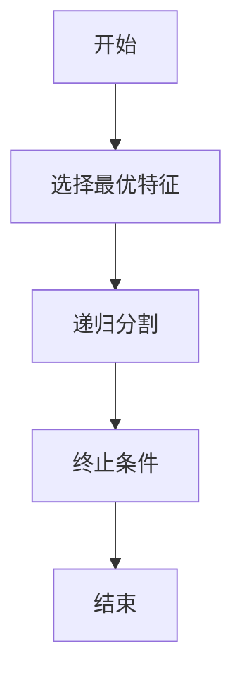
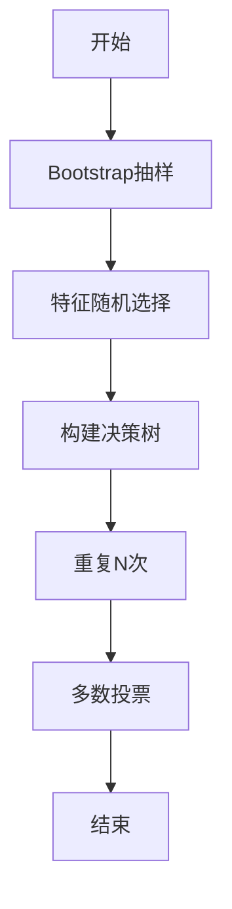
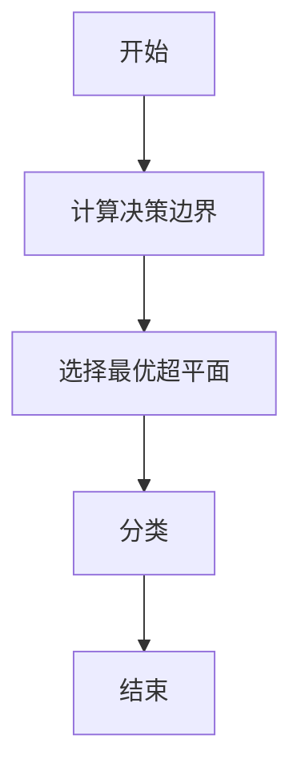

                 

### 文章标题

《AI在广告投放中的应用：精准定位与效果优化》

### 关键词

- 广告投放
- 人工智能
- 精准定位
- 效果优化
- 机器学习
- 数据分析

### 摘要

本文将深入探讨人工智能（AI）在广告投放中的应用，特别是精准定位与效果优化两大关键领域。首先，我们将简要介绍AI及其在广告行业中的价值。接着，文章将逐步分析广告数据预处理、精准定位算法以及广告投放效果优化的具体方法和策略。为了更加具体，我们将通过实战案例展示AI在电商、社交媒体和移动应用广告中的成功应用。最后，文章将展望AI在广告投放中的未来趋势，并探讨相关法律法规与伦理问题。通过本文，读者将全面了解AI在广告投放中的潜力与应用，为未来的广告策略提供新的思路和方向。

## 第1章 引言

### 1.1 书籍背景

广告投放作为现代营销不可或缺的一部分，始终面临着如何提升效果、降低成本以及实现精准投放的挑战。随着互联网的普及和大数据技术的发展，人工智能（AI）逐渐成为解决这些挑战的重要工具。AI在广告投放中的应用不仅提高了广告的精准度，还显著优化了广告效果，为广告主和用户带来了双赢的局面。

近年来，AI技术在广告行业中的运用日益广泛，从广告投放策略的制定到广告创意的生成，再到广告效果的评估，AI都展现出了强大的潜力。然而，现有的相关书籍往往集中于某一特定领域，如机器学习算法的介绍或广告投放策略的分析，缺乏系统性、整体性的视角。因此，本书旨在填补这一空白，通过系统的梳理和深入的分析，全面探讨AI在广告投放中的应用，旨在为读者提供一部全面、实用的指南。

### 1.2 AI在广告投放中的价值

AI在广告投放中的价值主要体现在以下几个方面：

1. **精准定位**：通过用户画像、兴趣预测等技术，AI能够准确识别广告的目标受众，从而实现广告投放的精准化。
   
2. **效果优化**：借助机器学习算法和数据分析技术，AI可以实时调整广告投放策略，优化广告效果，提高转化率。

3. **成本控制**：AI能够帮助广告主在有限的预算下实现最大化的广告效果，降低广告投放的成本。

4. **广告创意生成**：通过深度学习和自然语言处理技术，AI能够自动生成具有创意的广告内容，提高广告的吸引力和点击率。

5. **用户行为分析**：AI能够对用户行为数据进行分析，了解用户需求和行为模式，从而提供更加个性化的广告推荐。

总之，AI在广告投放中的应用不仅提高了广告的效率和效果，还为广告主带来了更多的机会和可能性。在接下来的章节中，我们将详细探讨AI在广告投放中的具体应用和实现方法。

### 1.3 书籍结构概述

本书共分为七章，结构安排如下：

- **第1章 引言**：介绍书籍的背景、AI在广告投放中的价值以及书籍的结构概述。
  
- **第2章 AI基础**：讲解人工智能的基本概念、广告投放中的AI应用以及机器学习基础。

- **第3章 广告数据预处理**：分析广告数据预处理的方法和步骤，包括数据收集、清洗和特征工程。

- **第4章 精准定位算法**：介绍用户画像构建、目标受众识别和用户兴趣预测等精准定位算法。

- **第5章 广告投放效果优化**：探讨广告投放策略、广告创意优化和投放效果评估的方法。

- **第6章 实战案例**：通过电商、社交媒体和移动应用广告的案例，展示AI在广告投放中的实际应用。

- **第7章 AI在广告投放中的未来趋势**：分析AI在广告投放中的发展趋势、法律法规与伦理问题及未来发展方向。

通过以上章节的详细探讨，本书旨在为读者提供全面、系统的AI在广告投放中的应用指南，帮助读者掌握这一前沿技术，提升广告投放的效果和效率。

## 第2章 AI基础

### 2.1 人工智能概述

人工智能（AI，Artificial Intelligence）是计算机科学的一个分支，旨在使计算机系统能够执行通常需要人类智能的任务，如视觉识别、语音识别、决策制定和语言理解等。AI的发展历程可以追溯到20世纪50年代，当时科学家们首次提出了让计算机模拟人类智能的构想。自那时以来，AI经历了多个阶段的发展，包括符号主义、连接主义、统计学习和强化学习等。

#### 核心概念

1. **符号主义（Symbolic AI）**：符号主义AI通过符号逻辑和规则系统来模拟人类的推理过程。这种方法的代表性算法包括专家系统和推理机。

2. **连接主义（Connectionism）**：连接主义AI通过神经网络模拟人脑神经元之间的连接和交互。这种方法的代表性算法包括多层感知机（MLP）和深度神经网络（DNN）。

3. **统计学习（Statistical Learning）**：统计学习AI通过分析大量数据来发现数据之间的模式，并进行预测和分类。这种方法的代表性算法包括支持向量机（SVM）和决策树。

4. **强化学习（Reinforcement Learning）**：强化学习AI通过与环境互动，通过奖励和惩罚机制来学习最优策略。这种方法的代表性算法包括Q学习和深度确定性策略梯度（DDPG）。

#### 应用领域

1. **计算机视觉**：计算机视觉是AI的重要应用领域之一，旨在使计算机能够处理和解释视觉信息。应用包括图像识别、目标检测、人脸识别和视频分析等。

2. **自然语言处理**：自然语言处理是AI的另一个重要应用领域，旨在使计算机能够理解和生成自然语言。应用包括机器翻译、文本分类、情感分析和语音识别等。

3. **机器人学**：机器人学是AI与工程学交叉的领域，旨在开发能够执行复杂任务的智能机器人。应用包括工业机器人、服务机器人和自主驾驶汽车等。

4. **医疗诊断**：AI在医疗领域的应用日益广泛，包括疾病诊断、药物发现和治疗规划等。

5. **金融分析**：AI在金融领域的应用包括风险控制、投资组合优化和欺诈检测等。

### 2.2 广告投放中的AI应用

AI在广告投放中的价值主要体现在以下几个方面：

1. **精准定位**：AI可以通过分析用户数据和行为，构建详细的用户画像，从而实现广告的精准投放。

2. **效果优化**：AI可以通过机器学习算法，实时调整广告投放策略，优化广告效果，提高转化率。

3. **创意生成**：AI可以通过自然语言处理和深度学习技术，自动生成具有创意的广告内容和广告文案。

4. **广告投放自动化**：AI可以实现广告投放的自动化，从而降低人力成本，提高广告投放效率。

#### 技术原理

1. **用户画像构建**：用户画像构建是广告精准定位的基础。通过分析用户的行为数据、兴趣偏好和历史购买记录，AI可以构建一个多维度的用户画像。

2. **机器学习算法**：机器学习算法在广告投放中的应用主要包括用户行为预测、广告效果评估和投放策略优化。常用的算法有决策树、随机森林、支持向量机和神经网络等。

3. **数据挖掘与数据分析**：数据挖掘和数据分析是广告投放的重要工具，通过分析大量数据，AI可以发现数据中的模式和规律，从而优化广告投放策略。

### 2.3 机器学习基础

机器学习（Machine Learning，ML）是AI的核心技术之一，旨在通过数据来训练模型，使模型能够进行预测和决策。机器学习的基本流程包括数据收集、数据预处理、模型选择、模型训练和模型评估等步骤。

#### 核心概念

1. **监督学习（Supervised Learning）**：监督学习通过已标记的数据集来训练模型，模型可以用来预测新的、未标记的数据。

2. **无监督学习（Unsupervised Learning）**：无监督学习不使用标记数据，而是通过分析数据中的模式来发现数据中的结构和规律。

3. **强化学习（Reinforcement Learning）**：强化学习通过与环境的交互来学习最优策略，通常用于需要决策的任务。

#### 算法原理

1. **线性回归（Linear Regression）**：线性回归是一种简单的监督学习算法，通过建立输入变量和输出变量之间的线性关系来进行预测。

2. **决策树（Decision Tree）**：决策树是一种树形结构的分类和回归算法，通过一系列的判断规则来对数据进行分类或回归。

3. **支持向量机（Support Vector Machine，SVM）**：SVM是一种高效的分类算法，通过找到一个最佳的超平面来将数据分为不同的类别。

4. **神经网络（Neural Network）**：神经网络是一种仿照人脑结构的计算模型，通过多层神经元的互联来进行复杂的数据处理和预测。

#### 应用案例

1. **用户行为预测**：通过分析用户的浏览历史和行为数据，机器学习算法可以预测用户未来的行为，从而实现精准广告投放。

2. **广告效果评估**：机器学习算法可以通过分析广告投放的数据，评估不同广告的效果，从而优化广告投放策略。

3. **广告创意生成**：通过自然语言处理和生成对抗网络（GANs），机器学习算法可以自动生成具有创意的广告内容和文案。

通过以上对AI基础知识的介绍，读者可以了解到AI在广告投放中的重要性以及其实现的基本原理。在接下来的章节中，我们将进一步探讨广告数据预处理、精准定位算法和广告投放效果优化的具体方法和应用。

## 第3章 广告数据预处理

### 3.1 数据收集与清洗

在广告投放中，数据预处理是至关重要的步骤。数据收集与清洗是数据预处理的首要任务，直接关系到后续数据分析和模型训练的质量。有效的数据收集和清洗能够确保数据的质量和完整性，为后续的分析和建模提供可靠的基础。

#### 数据收集

数据收集是指从各种数据源获取原始数据，这些数据源可能包括用户行为数据、广告点击数据、社交媒体数据、搜索日志数据等。数据收集的关键在于：

1. **多样性**：尽量从多个渠道和维度收集数据，以全面了解用户的行为和兴趣。
2. **实时性**：对于实时性要求较高的广告投放场景，需要保证数据的实时性，以便及时调整投放策略。
3. **准确性**：确保收集到的数据是准确和可靠的，避免因数据错误导致分析结果偏差。

#### 数据清洗

数据清洗是指对收集到的原始数据进行处理，以去除噪声、纠正错误和填补缺失值等。常见的数据清洗步骤包括：

1. **去重**：去除重复的数据条目，避免重复计算和错误分析。
2. **处理缺失值**：对于缺失的数据，可以采用插补、删除或填充等方法进行处理。
3. **数据格式转换**：统一数据格式，确保数据在不同处理阶段的一致性和兼容性。
4. **异常值处理**：识别和处理异常值，避免其对数据分析和模型训练产生不良影响。

#### 核心步骤

1. **数据去重**：通过设置唯一标识符（如用户ID或广告ID）来识别和去除重复的数据条目。

2. **缺失值处理**：对于缺失值，可以根据具体情况采用以下方法：
   - **删除缺失值**：如果缺失值所占比例较大，可以考虑删除这些数据。
   - **均值或中位数插补**：对于连续性数据，可以采用均值或中位数进行插补。
   - **前值或后值插补**：对于时间序列数据，可以采用前值或后值进行插补。
   - **模型预测补全**：对于重要特征，可以采用机器学习模型进行预测补全。

3. **格式转换**：统一数据格式，如将日期格式转换为标准格式（YYYY-MM-DD），确保后续处理的顺利进行。

4. **异常值检测与处理**：利用统计学方法和可视化工具（如箱线图、散点图等）来检测异常值，并采用适当的方法进行处理，如删除、插补或隔离处理。

### 3.2 特征工程

特征工程（Feature Engineering）是数据预处理的关键环节，旨在从原始数据中提取出有助于提升模型性能的特征。特征工程的质量直接影响到机器学习模型的效果。

#### 核心概念

1. **特征选择**：从大量的原始特征中筛选出对模型性能有显著贡献的特征，减少数据维度，提高模型的泛化能力。

2. **特征构造**：通过组合原始特征，生成新的特征，以捕捉数据中的潜在关系和模式。

3. **特征标准化**：通过将不同特征缩放到相同的尺度，消除特征之间的尺度差异，提高模型的稳定性和性能。

#### 方法与步骤

1. **特征选择方法**：
   - **信息增益（Information Gain）**：选择能够最大程度增加分类信息量的特征。
   - **卡方检验（Chi-Square Test）**：用于特征与目标变量之间的相关性分析，筛选出具有显著关联的特征。
   - **主成分分析（PCA）**：通过降维减少特征数量，同时保留主要的数据信息。

2. **特征构造方法**：
   - **交叉特征（Cross Features）**：通过组合不同特征的交叉项，生成新的特征。
   - **时间特征（Time Features）**：通过分析时间序列数据，提取时间相关的特征，如用户活跃时间段、广告展示时间等。
   - **嵌入特征（Embedded Features）**：通过将原始特征映射到高维空间，生成新的特征，如词嵌入（Word Embedding）。

3. **特征标准化方法**：
   - **Z-Score标准化**：将特征值缩放到均值为0、标准差为1的范围内，公式为：$$z = \frac{x - \mu}{\sigma}$$，其中$x$为特征值，$\mu$为均值，$\sigma$为标准差。
   - **Min-Max标准化**：将特征值缩放到[0,1]范围内，公式为：$$x' = \frac{x - \min}{\max - \min}$$，其中$x$为特征值，$\min$为最小值，$\max$为最大值。

#### 实例分析

假设我们有一个广告投放数据集，包含用户年龄、性别、收入、广告展示次数、点击次数等特征。通过以下步骤进行特征工程：

1. **特征选择**：利用卡方检验筛选出与广告点击次数有显著关联的特征，如性别、收入等。

2. **特征构造**：构造交叉特征，如“性别_收入”等，以捕捉不同性别和收入水平的用户对广告的反应差异。

3. **特征标准化**：对年龄、收入等连续性特征进行Z-Score标准化，以确保不同特征在同一尺度范围内。

通过上述步骤，我们可以从原始数据中提取出有助于提升广告投放效果的特征，为后续的模型训练和预测提供支持。

### 3.3 数据可视化

数据可视化是将数据转换成图形或图像的过程，使得数据更直观、易于理解。在广告数据预处理过程中，数据可视化可以帮助我们识别数据中的趋势、异常和模式，从而指导数据清洗和特征工程。

#### 核心概念

1. **数据可视化工具**：如Matplotlib、Seaborn、Plotly等，用于生成各种类型的图表和图形。

2. **数据可视化方法**：
   - **柱状图（Bar Chart）**：用于比较不同类别或组之间的数据差异。
   - **折线图（Line Chart）**：用于展示数据的变化趋势和周期性。
   - **散点图（Scatter Plot）**：用于展示两个特征之间的相关性。
   - **箱线图（Box Plot）**：用于展示数据的分布和异常值。

#### 实例分析

1. **用户年龄分布**：通过柱状图展示不同年龄段用户的比例，以便了解目标用户群体。

2. **广告点击率趋势**：通过折线图展示不同时间段的广告点击率，以便分析点击率的变化趋势和影响因素。

3. **用户性别与点击率关系**：通过散点图展示用户性别与广告点击率的关系，以便了解不同性别用户对广告的反应差异。

4. **收入与点击率关系**：通过箱线图展示不同收入水平用户的广告点击率分布，以便识别异常值和异常群体。

通过数据可视化，我们可以更直观地理解广告数据，发现数据中的潜在问题和规律，从而指导数据预处理和特征工程。这不仅提高了数据处理的效率，也为后续的模型训练和预测提供了重要依据。

### 3.1 数据收集与清洗

在广告投放过程中，数据收集与清洗是确保数据质量、提高模型性能的关键步骤。首先，我们需要从多个渠道收集原始数据，包括用户行为数据、广告点击数据、社交媒体数据等。数据收集过程中要注重多样性和实时性，确保数据的全面性和准确性。

#### 数据收集

1. **数据源选择**：选择可靠、多样化的数据源，包括网站日志、API接口、第三方数据提供商等。
2. **数据获取方式**：使用爬虫、API调用、日志收集等方式获取数据，确保数据的实时性和完整性。
3. **数据格式**：统一数据格式，如CSV、JSON等，便于后续处理和分析。

#### 数据清洗

数据清洗是去除噪声、纠正错误、填补缺失值等的过程，确保数据的质量和一致性。以下是常见的数据清洗步骤：

1. **去重**：通过设置唯一标识符（如用户ID或广告ID）去除重复数据，避免重复计算。
2. **处理缺失值**：
   - **删除缺失值**：对于缺失值比例较大的数据，可以删除这些数据，减少对分析结果的影响。
   - **均值或中位数插补**：对于连续性特征，可以使用均值或中位数进行插补。
   - **前值或后值插补**：对于时间序列数据，可以使用前值或后值进行插补。
   - **模型预测补全**：对于重要特征，可以使用机器学习模型进行预测补全。
3. **格式转换**：统一数据格式，如将日期格式转换为YYYY-MM-DD标准格式。
4. **异常值处理**：使用统计学方法和可视化工具（如箱线图、散点图等）识别和处理异常值。

#### 核心步骤

1. **去重**：通过设置唯一标识符去除重复数据条目，确保数据的唯一性和完整性。
2. **处理缺失值**：根据缺失值比例和特征重要性，采用适当的插补方法处理缺失值。
3. **数据格式转换**：将不同格式的数据转换为统一的格式，确保数据的一致性和兼容性。
4. **异常值处理**：识别和处理异常值，确保数据的质量和准确性。

通过以上数据收集与清洗步骤，我们可以确保广告数据的准确性和完整性，为后续的数据分析和模型训练提供可靠的基础。

### 3.2 特征工程

在广告投放中，特征工程是数据预处理的关键环节，通过提取和构造有代表性的特征，可以提高机器学习模型的性能和预测能力。以下是特征工程的核心概念、方法与步骤。

#### 核心概念

1. **特征选择**：从大量原始特征中筛选出对模型性能有显著贡献的特征，减少数据维度，提高模型的泛化能力。
2. **特征构造**：通过组合原始特征，生成新的特征，以捕捉数据中的潜在关系和模式。
3. **特征标准化**：将不同特征缩放到相同的尺度，消除特征之间的尺度差异，提高模型的稳定性和性能。

#### 方法与步骤

1. **特征选择方法**：
   - **信息增益（Information Gain）**：选择能够最大程度增加分类信息量的特征。
   - **卡方检验（Chi-Square Test）**：用于特征与目标变量之间的相关性分析，筛选出具有显著关联的特征。
   - **主成分分析（PCA）**：通过降维减少特征数量，同时保留主要的数据信息。

2. **特征构造方法**：
   - **交叉特征（Cross Features）**：通过组合不同特征的交叉项，生成新的特征。
   - **时间特征（Time Features）**：通过分析时间序列数据，提取时间相关的特征，如用户活跃时间段、广告展示时间等。
   - **嵌入特征（Embedded Features）**：通过将原始特征映射到高维空间，生成新的特征，如词嵌入（Word Embedding）。

3. **特征标准化方法**：
   - **Z-Score标准化**：将特征值缩放到均值为0、标准差为1的范围内，公式为：$$z = \frac{x - \mu}{\sigma}$$，其中$x$为特征值，$\mu$为均值，$\sigma$为标准差。
   - **Min-Max标准化**：将特征值缩放到[0,1]范围内，公式为：$$x' = \frac{x - \min}{\max - \min}$$，其中$x$为特征值，$\min$为最小值，$\max$为最大值。

#### 实例分析

以一个广告投放数据集为例，包含用户年龄、性别、收入、广告展示次数、点击次数等特征。以下是特征工程的具体步骤：

1. **特征选择**：
   - 使用卡方检验筛选出与广告点击次数有显著关联的特征，如性别、收入。
   - 使用信息增益计算特征对分类信息的贡献，筛选出重要特征。

2. **特征构造**：
   - 构造交叉特征，如“性别_收入”等，以捕捉不同性别和收入水平的用户对广告的反应差异。
   - 提取时间特征，如“用户活跃时间段”、“广告展示时间段”等，以分析用户在不同时间段的行为差异。

3. **特征标准化**：
   - 对年龄、收入等连续性特征进行Z-Score标准化，以消除特征间的尺度差异。
   - 对分类特征（如性别）进行One-Hot编码，将其转换为数值特征。

通过以上步骤，我们可以从原始数据中提取出有代表性的特征，为后续的模型训练和预测提供支持。

### 3.3 数据可视化

数据可视化是将数据转换为图形或图像的过程，使得数据更直观、易于理解。在广告数据预处理过程中，数据可视化可以帮助我们识别数据中的趋势、异常和模式，从而指导数据清洗和特征工程。以下是数据可视化在广告数据分析中的应用。

#### 核心概念

1. **数据可视化工具**：如Matplotlib、Seaborn、Plotly等，用于生成各种类型的图表和图形。
2. **数据可视化方法**：
   - **柱状图（Bar Chart）**：用于比较不同类别或组之间的数据差异。
   - **折线图（Line Chart）**：用于展示数据的变化趋势和周期性。
   - **散点图（Scatter Plot）**：用于展示两个特征之间的相关性。
   - **箱线图（Box Plot）**：用于展示数据的分布和异常值。

#### 实例分析

以一个广告投放数据集为例，包含用户年龄、性别、收入、广告展示次数、点击次数等特征。以下是数据可视化在数据预处理中的应用：

1. **用户年龄分布**：
   - 使用柱状图展示不同年龄段用户的比例，以便了解目标用户群体。
   - 发现某一年龄段用户点击率较高，可以针对该群体进行广告投放优化。

2. **广告点击率趋势**：
   - 使用折线图展示不同时间段的广告点击率，以便分析点击率的变化趋势和影响因素。
   - 发现点击率在特定时间段有显著波动，可以调整广告投放时间，以优化效果。

3. **用户性别与点击率关系**：
   - 使用散点图展示用户性别与广告点击率的关系，以便了解不同性别用户对广告的反应差异。
   - 发现男性用户的点击率较高，可以针对男性用户优化广告内容和投放策略。

4. **收入与点击率关系**：
   - 使用箱线图展示不同收入水平用户的广告点击率分布，以便识别异常值和异常群体。
   - 发现高收入用户点击率较低，可以调整广告定位，提高对高收入用户的吸引力。

通过数据可视化，我们可以更直观地理解广告数据，发现数据中的潜在问题和规律，从而指导数据清洗和特征工程。这不仅提高了数据处理的效率，也为后续的模型训练和预测提供了重要依据。

## 第4章 精准定位算法

### 4.1 用户的画像构建

用户的画像构建是广告精准定位的基础。通过分析用户的行为数据、兴趣偏好和历史购买记录，我们可以构建一个多维度的用户画像，从而实现广告的精准投放。以下是用户画像构建的核心步骤和技术。

#### 数据收集

1. **行为数据**：包括用户在网站上的浏览记录、搜索历史、点击记录等，通过日志文件或API接口获取。
2. **兴趣偏好**：通过用户的兴趣爱好、内容浏览记录、社交媒体互动等数据来分析用户的兴趣偏好。
3. **历史购买记录**：获取用户的历史购买记录，包括购买时间、商品种类、购买频次等，以便了解用户的消费习惯和需求。

#### 数据处理

1. **数据清洗**：去除重复和无效的数据条目，处理缺失值和异常值，确保数据的质量。
2. **特征工程**：提取有代表性的特征，如用户活跃时间、浏览频率、兴趣标签等，通过特征构造和特征选择方法提高数据的质量。

#### 构建用户画像

1. **用户标签**：为每个用户打上多个标签，如“科技爱好者”、“旅游爱好者”等，通过这些标签构建用户画像。
2. **多维特征矩阵**：将用户的各个特征值组合成一个多维特征矩阵，用于后续的建模和分析。
3. **权重分配**：为每个标签和特征分配权重，以反映其在用户画像中的重要程度。

#### 技术原理

1. **协同过滤（Collaborative Filtering）**：基于用户行为数据，通过找到相似的用户或物品来进行推荐。协同过滤分为基于用户的协同过滤和基于物品的协同过滤。
2. **聚类算法（Clustering Algorithms）**：如K-means、DBSCAN等，通过将用户数据分为不同的聚类，从而生成不同的用户群体。
3. **机器学习模型**：如决策树、随机森林、神经网络等，通过训练模型来预测用户的行为和偏好。

#### 实例分析

假设我们有一个电商网站，收集了用户的浏览记录、购买历史和兴趣爱好。以下是用户画像构建的具体步骤：

1. **数据收集**：收集用户的浏览记录，包括页面访问时间、访问频次、停留时间等；购买历史数据，包括购买时间、商品种类、购买频次等；兴趣爱好数据，包括用户在社交媒体上的互动记录、关注的标签等。
2. **数据处理**：去除重复和无效的数据，处理缺失值和异常值；提取有代表性的特征，如“用户活跃时间段”、“商品浏览频次”、“购买频次”等。
3. **用户标签**：根据用户的浏览记录和购买历史，为每个用户打上多个标签，如“科技爱好者”、“购物达人”等。
4. **多维特征矩阵**：将用户的各个特征值组合成一个多维特征矩阵，用于后续的建模和分析。
5. **权重分配**：为每个标签和特征分配权重，如“用户活跃时间段”权重较高，因为它直接反映了用户的行为习惯。

通过以上步骤，我们可以构建出一个详细且多维的用户画像，为精准广告投放提供支持。

### 4.2 广告目标受众识别

广告目标受众识别是广告精准投放的关键步骤，通过分析用户画像和行为数据，我们可以识别出最有可能对广告产生兴趣的目标受众。以下是广告目标受众识别的核心步骤和技术。

#### 数据分析

1. **用户画像**：通过构建的用户画像，了解用户的兴趣偏好、行为习惯等。
2. **行为数据**：收集用户在网站上的行为数据，如浏览记录、点击记录、转化率等。
3. **广告特征**：分析广告的属性，如广告类型、广告内容、投放时间等。

#### 技术原理

1. **协同过滤**：通过分析用户的历史行为数据，找到相似的用户群体，从而识别出目标受众。
2. **聚类分析**：通过聚类算法，将用户数据分为不同的群体，每个群体代表不同的目标受众。
3. **机器学习模型**：如决策树、随机森林、神经网络等，通过训练模型，预测用户对广告的兴趣程度。

#### 实例分析

假设我们有一个电商平台，已经构建了用户的详细画像。以下是广告目标受众识别的具体步骤：

1. **用户画像**：通过分析用户的浏览记录和购买历史，为用户打上标签，如“科技爱好者”、“时尚达人”等。
2. **行为数据**：收集用户在网站上的行为数据，如浏览页面、点击商品、添加购物车、购买商品等。
3. **广告特征**：分析广告的属性，如广告类型（横幅广告、推荐广告等）、广告内容（商品名称、图片、描述等）、投放时间（白天、晚上等）。

4. **协同过滤**：通过分析用户的浏览记录，找到相似的用户群体，从而识别出目标受众。
   - **基于用户的协同过滤**：找到与目标用户相似的其他用户，分析他们的行为和兴趣，从而推断目标用户的行为和兴趣。
   - **基于物品的协同过滤**：找到与目标广告相似的其它广告，分析这些广告的用户行为，从而推断目标广告的目标受众。

5. **聚类分析**：使用K-means等聚类算法，将用户数据分为不同的群体，每个群体代表不同的目标受众。
   - 通过对用户浏览记录和购买历史的分析，确定聚类数量和聚类中心，从而生成不同的用户群体。

6. **机器学习模型**：通过训练决策树、随机森林等模型，预测用户对广告的兴趣程度，从而进一步识别目标受众。

通过以上步骤，我们可以精准识别广告的目标受众，实现广告的精准投放。

### 4.3 用户兴趣预测

用户兴趣预测是广告精准定位的重要一环，通过预测用户对不同广告的兴趣程度，广告主可以更有效地分配广告资源，提高广告投放的ROI。以下是用户兴趣预测的核心步骤和技术。

#### 数据分析

1. **用户画像**：通过用户的浏览历史、购买记录和兴趣爱好，构建详细的用户画像。
2. **广告特征**：分析广告的属性，如广告类型、广告内容、投放时间等。
3. **行为数据**：收集用户在网站上的行为数据，如点击记录、转化率、停留时间等。

#### 技术原理

1. **协同过滤**：通过分析用户的历史行为数据，找到相似的用户群体，从而预测他们对新广告的兴趣程度。
2. **机器学习模型**：如决策树、随机森林、神经网络等，通过训练模型，预测用户对广告的兴趣。
3. **贝叶斯网络**：通过构建用户行为和广告属性之间的概率关系，预测用户的兴趣。

#### 实例分析

假设我们有一个电商平台，已经收集了用户的详细画像和广告特征。以下是用户兴趣预测的具体步骤：

1. **用户画像**：通过分析用户的浏览记录和购买历史，为用户打上标签，如“科技爱好者”、“时尚达人”等。
2. **广告特征**：分析广告的属性，如广告类型（横幅广告、推荐广告等）、广告内容（商品名称、图片、描述等）、投放时间（白天、晚上等）。
3. **行为数据**：收集用户在网站上的行为数据，如点击记录、转化率、停留时间等。

4. **协同过滤**：通过分析用户的历史行为数据，找到相似的用户群体，从而预测他们对新广告的兴趣程度。
   - **基于用户的协同过滤**：找到与目标用户相似的其他用户，分析他们的行为和兴趣，从而推断目标用户的行为和兴趣。
   - **基于物品的协同过滤**：找到与目标广告相似的其它广告，分析这些广告的用户行为，从而推断目标广告的目标受众。

5. **机器学习模型**：通过训练决策树、随机森林等模型，预测用户对广告的兴趣程度。
   - **特征工程**：提取用户画像和广告特征的相关特征，如用户标签、广告类型、点击率等。
   - **模型训练**：使用训练集数据，训练决策树、随机森林等模型，并调整模型参数，以优化预测效果。
   - **模型评估**：使用测试集数据，评估模型的预测效果，如准确率、召回率等。

6. **贝叶斯网络**：通过构建用户行为和广告属性之间的概率关系，预测用户的兴趣。
   - **概率分布**：计算用户行为和广告属性的联合概率分布，从而预测用户对广告的兴趣程度。
   - **条件概率**：通过分析用户历史行为数据，计算用户在不同广告下的条件概率，从而推断用户的兴趣。

通过以上步骤，我们可以预测用户对不同广告的兴趣程度，为广告主提供精准的广告投放策略。

## 第5章 广告投放效果优化

### 5.1 广告投放策略

广告投放策略是广告主根据业务目标和市场环境，制定和调整广告投放计划的过程。有效的广告投放策略能够提高广告的投放效果，实现营销目标。以下是广告投放策略的核心步骤和关键因素。

#### 核心步骤

1. **目标设定**：明确广告投放的目标，如品牌认知度提升、产品销量增加、用户转化率提高等。
2. **市场分析**：分析目标市场的特点，包括受众特征、竞争对手情况、市场趋势等。
3. **预算规划**：根据业务目标和市场分析结果，制定广告投放的预算，并合理分配预算到不同的广告渠道和广告创意。
4. **广告创意设计**：设计有吸引力的广告内容和形式，包括图片、视频、文字等，以吸引用户的关注。
5. **投放渠道选择**：选择适合目标受众的投放渠道，如搜索引擎、社交媒体、新闻网站、移动应用等。
6. **投放时间和频率**：根据用户行为和广告效果，合理设置广告的投放时间和频率，以提高曝光率和转化率。
7. **效果监测与优化**：实时监测广告效果，通过数据分析调整广告投放策略，实现效果优化。

#### 关键因素

1. **目标受众定位**：精准定位目标受众，确保广告投放能够触达到有潜在购买意愿的用户。
2. **广告创意质量**：高质量的广告创意能够吸引用户的注意力，提高点击率和转化率。
3. **投放渠道选择**：选择适合目标受众的投放渠道，确保广告能够触达到最广泛的潜在用户。
4. **投放时间和频率**：合理设置广告的投放时间和频率，避免过度投放和用户疲劳。
5. **效果监测与优化**：实时监测广告效果，通过数据分析调整广告投放策略，实现效果优化。

#### 实例分析

假设某电商企业计划在圣诞节期间推广新款手机，以下是具体的广告投放策略：

1. **目标设定**：提升新款手机的销量，增加品牌知名度。
2. **市场分析**：目标受众为年轻人，尤其是喜欢追求新科技的消费者；竞争对手包括苹果、三星等知名品牌。
3. **预算规划**：总预算为10万元，其中60%用于搜索引擎广告，30%用于社交媒体广告，10%用于新闻网站广告。
4. **广告创意设计**：设计具有吸引力的广告图片和视频，展示新款手机的特点和优惠信息。
5. **投放渠道选择**：选择谷歌广告、Facebook广告和今日头条广告等，确保广告能够触达到目标受众。
6. **投放时间和频率**：在圣诞节前两周开始投放，每天投放两次，以覆盖用户的高峰时间。
7. **效果监测与优化**：实时监测广告效果，通过数据分析调整广告投放策略，如优化广告创意、调整投放时间和频率等。

通过以上广告投放策略，电商企业可以在圣诞节期间有效提升新款手机的销量和品牌知名度。

### 5.2 广告创意优化

广告创意优化是提升广告投放效果的关键步骤，通过不断改进广告内容和形式，使其更具吸引力和互动性，从而提高点击率和转化率。以下是广告创意优化的核心方法和技术。

#### 核心方法

1. **A/B测试（A/B Testing）**：通过对比不同广告创意的效果，选择最优的创意进行投放。A/B测试可以针对广告文案、图片、视频等多个方面进行测试。

2. **用户反馈**：收集用户的反馈，了解他们对广告的喜好和意见，从而改进广告创意。

3. **数据分析**：通过数据分析，了解广告的点击率、转化率等关键指标，找出广告优化的方向。

#### 技术手段

1. **自然语言处理（NLP）**：利用NLP技术分析用户的搜索习惯和兴趣爱好，生成有针对性的广告文案。

2. **图像识别**：通过图像识别技术，自动分析广告图片中的元素和色彩，优化广告视觉效果。

3. **推荐系统**：利用推荐系统技术，为用户推荐个性化的广告内容，提高广告的吸引力。

#### 实例分析

假设某电商企业计划优化其首页横幅广告，以下是具体的广告创意优化步骤：

1. **A/B测试**：
   - 设计两个不同的广告版本A和B，版本A采用红色背景和简洁文案，版本B采用蓝色背景和详细产品描述。
   - 在首页同时投放两个广告版本，观察用户对两个版本的点击率。
   - 通过数据分析，发现版本B的点击率明显高于版本A，因此选择版本B作为最终的广告创意。

2. **用户反馈**：
   - 在广告下方设置反馈按钮，收集用户对广告的意见和建议。
   - 分析用户反馈，发现用户更喜欢详细的产品描述和优惠信息，因此在后续的广告创意中增加这些元素。

3. **数据分析**：
   - 通过分析广告的点击率、转化率等关键指标，发现广告的点击率在投放后的第一天最高，之后逐渐下降。
   - 调整广告的投放时间和频率，如增加在用户活跃时间段（如晚上）的投放，以提高点击率。

通过以上步骤，电商企业可以有效优化广告创意，提高广告的吸引力和转化率。

### 5.3 投放效果评估

广告投放效果评估是确保广告投放策略有效性的重要环节。通过科学的评估方法，广告主可以了解广告的实际效果，从而优化广告策略，提高投放效率。以下是广告投放效果评估的核心指标和方法。

#### 核心指标

1. **点击率（Click-Through Rate，CTR）**：广告被点击的次数与总展示次数的比值，用于衡量广告的吸引力。
2. **转化率（Conversion Rate，CVR）**：广告带来的转化次数与点击次数的比值，用于衡量广告的有效性。
3. **投资回报率（Return on Investment，ROI）**：广告带来的收益与广告投入成本的比值，用于衡量广告的经济效益。

#### 评估方法

1. **定量评估**：
   - **数据分析**：通过数据分析工具，对广告的点击率、转化率、ROI等指标进行统计和分析，评估广告的整体效果。
   - **A/B测试**：通过对比不同广告版本的效果，选择最优的广告创意和投放策略。

2. **定性评估**：
   - **用户反馈**：收集用户对广告的反馈和评价，了解广告的用户体验和满意度。
   - **专家评审**：邀请广告行业的专家对广告进行评审，从专业角度评估广告的质量和效果。

#### 实例分析

假设某电商企业投放了一则广告，以下是具体的评估过程：

1. **定量评估**：
   - 分析广告的点击率、转化率和ROI等指标。例如，广告展示次数为10万次，点击次数为2千次，转化次数为2百次，计算点击率为2%（CTR=2000/100000），转化率为10%（CVR=200/2000）。
   - 计算广告的ROI，假设广告成本为1万元，带来的收益为5万元，则ROI为5（ROI=50000/10000）。
   - 分析结果表明，广告的点击率和转化率较高，ROI良好，广告投放效果较好。

2. **定性评估**：
   - 收集用户对广告的反馈，通过问卷调查或社交媒体评论，了解用户对广告的喜好和意见。
   - 分析用户反馈，发现大部分用户对广告的文案和产品描述满意，但部分用户认为广告的图片效果一般。
   - 针对用户反馈，优化广告的图片和文案，以提高用户体验和满意度。

通过定量和定性评估，电商企业可以全面了解广告的实际效果，发现潜在问题，从而优化广告策略，提高广告投放效果。

### 5.1 广告投放策略

广告投放策略的制定是广告成功的关键因素之一。一个有效的广告投放策略需要综合考虑市场环境、目标受众、广告预算和竞争态势等多方面因素，以实现最佳的广告效果和投资回报。以下是广告投放策略的核心步骤和关键要素。

#### 核心步骤

1. **目标设定**：明确广告投放的目标，如品牌知名度提升、产品销量增加、用户转化率提高等。目标的设定应具体、可衡量、可实现、相关性强且时限性明确。
2. **市场分析**：分析目标市场的特点，包括受众特征、消费习惯、市场竞争态势等。通过市场分析，了解目标受众的需求和偏好，为广告策略的制定提供依据。
3. **预算规划**：根据业务目标和市场分析结果，制定广告投放的预算，并合理分配预算到不同的广告渠道和广告创意。预算规划应考虑广告投放的时间、地域、受众等因素。
4. **渠道选择**：选择适合目标受众的广告投放渠道，如搜索引擎广告、社交媒体广告、新闻网站广告、移动应用广告等。渠道选择应考虑渠道的覆盖范围、目标受众的活跃时间、广告成本等因素。
5. **创意设计**：设计有吸引力的广告内容和形式，包括广告文案、图片、视频等。创意设计应与品牌形象和广告目标一致，突出产品优势和卖点，以吸引用户的关注。
6. **投放时间与频率**：根据用户行为和广告效果，合理设置广告的投放时间和频率，避免过度投放和用户疲劳。例如，在用户活跃时段增加广告投放，以提升曝光率和点击率。
7. **效果监测与优化**：实时监测广告效果，通过数据分析调整广告投放策略，实现效果优化。监测内容包括广告的点击率、转化率、投资回报率等关键指标。

#### 关键要素

1. **目标受众定位**：精准定位目标受众，确保广告投放能够触达到有潜在购买意愿的用户。通过用户画像、行为数据分析和市场调研，了解目标受众的特点和需求。
2. **广告创意质量**：高质量的广告创意能够吸引用户的注意力，提高点击率和转化率。创意设计应新颖独特，突出产品优势和卖点，与目标受众的兴趣和需求相结合。
3. **投放渠道选择**：选择适合目标受众的投放渠道，确保广告能够触达到最广泛的潜在用户。不同渠道的受众特征和广告效果不同，应进行充分的市场调研和测试，以选择最优的投放渠道。
4. **预算分配**：合理分配广告预算，确保广告投放的覆盖范围和效果。预算分配应考虑广告渠道的成本效益，以及不同广告创意的投资回报。
5. **数据分析与优化**：通过实时监测和分析广告效果，发现广告投放中的问题，及时调整广告策略。数据分析应包括点击率、转化率、投资回报率等关键指标，以及用户反馈和市场份额等定性分析。

#### 实例分析

以某电商平台的“双十一”购物节广告投放策略为例，以下是具体的步骤和关键要素：

1. **目标设定**：提升品牌知名度、增加产品销量、提高用户转化率，并实现广告成本的有效控制。
2. **市场分析**：目标受众为18-35岁的女性消费者，她们喜欢追求时尚、对折扣敏感，主要活跃在社交媒体和电商平台。
3. **预算规划**：总预算为50万元，其中30%用于社交媒体广告，20%用于搜索引擎广告，10%用于新闻网站广告。
4. **渠道选择**：选择微博、微信、小红书等社交媒体平台，以及百度、谷歌等搜索引擎进行广告投放。
5. **创意设计**：设计具有吸引力的广告图片和视频，展示促销产品和优惠信息，如限时抢购、优惠券等，同时结合用户画像进行个性化推荐。
6. **投放时间与频率**：在购物节前一周开始投放，每天投放两次，尤其是在用户活跃时段（如晚上8点至10点）增加投放频率。
7. **效果监测与优化**：实时监测广告的点击率、转化率和投资回报率，根据数据分析结果调整广告内容和投放策略。例如，如果发现某款产品的广告点击率较低，可以优化该产品的广告文案和图片，或者调整投放时间和频率。

通过以上步骤和关键要素，电商平台可以制定出有效的广告投放策略，提升广告效果，实现营销目标。

### 5.2 广告创意优化

广告创意优化是提升广告效果的重要手段。通过不断改进广告内容和形式，使其更具吸引力和互动性，可以显著提高广告的点击率和转化率。以下是广告创意优化的核心方法和技术。

#### 核心方法

1. **A/B测试（A/B Testing）**：通过对比不同广告版本的点击率和转化率，选择最优的广告创意。A/B测试可以针对广告标题、图片、视频、文案等多个方面进行测试，找到最能吸引用户的元素。
2. **用户反馈**：收集用户对广告的意见和建议，通过用户调研、问卷调查或社交媒体评论等方式，了解用户对广告的喜好和痛点，从而优化广告内容。
3. **数据分析**：利用数据分析工具，分析广告的点击率、转化率、投资回报率等关键指标，发现广告优化的方向。数据分析可以揭示广告内容中的问题和改进点。

#### 技术手段

1. **自然语言处理（NLP）**：利用NLP技术分析用户的搜索习惯和兴趣爱好，生成有针对性的广告文案，提高广告的吸引力。
2. **图像识别**：通过图像识别技术，自动分析广告图片中的元素和色彩，优化广告视觉效果，使其更具视觉冲击力。
3. **推荐系统**：利用推荐系统技术，根据用户的行为数据和兴趣偏好，为用户推荐个性化的广告内容，提高广告的点击率和转化率。

#### 实例分析

假设某电商企业计划优化其首页横幅广告，以下是具体的广告创意优化步骤：

1. **A/B测试**：
   - 设计两个不同的广告版本A和B，版本A采用红色背景和简洁文案，版本B采用蓝色背景和详细产品描述。
   - 在首页同时投放两个广告版本，观察用户对两个版本的点击率。
   - 通过数据分析，发现版本B的点击率明显高于版本A，因此选择版本B作为最终的广告创意。

2. **用户反馈**：
   - 在广告下方设置反馈按钮，收集用户对广告的意见和建议。
   - 分析用户反馈，发现用户更喜欢详细的产品描述和优惠信息，因此在后续的广告创意中增加这些元素。

3. **数据分析**：
   - 通过分析广告的点击率、转化率等关键指标，发现广告的点击率在投放后的第一天最高，之后逐渐下降。
   - 调整广告的投放时间和频率，如增加在用户活跃时间段（如晚上）的投放，以提高点击率。

4. **技术手段**：
   - 利用NLP技术，分析用户的搜索历史和浏览记录，生成更具针对性的广告文案。
   - 通过图像识别技术，优化广告图片的视觉效果，使其更加吸引眼球。
   - 利用推荐系统技术，为用户推荐个性化的广告内容，提高广告的点击率和转化率。

通过以上步骤和技术的应用，电商企业可以有效地优化广告创意，提高广告的吸引力和转化率，实现更好的广告效果。

### 5.3 投放效果评估

广告投放效果评估是确保广告投放策略有效性的重要环节。通过科学的评估方法，广告主可以全面了解广告的实际效果，从而优化广告策略，提高投放效率。以下是广告投放效果评估的核心指标、方法和实例分析。

#### 核心指标

1. **点击率（Click-Through Rate，CTR）**：广告被点击的次数与总展示次数的比值，用于衡量广告的吸引力。
2. **转化率（Conversion Rate，CVR）**：广告带来的转化次数与点击次数的比值，用于衡量广告的有效性。
3. **投资回报率（Return on Investment，ROI）**：广告带来的收益与广告投入成本的比值，用于衡量广告的经济效益。

#### 评估方法

1. **定量评估**：
   - **数据分析**：通过数据分析工具，对广告的点击率、转化率、ROI等指标进行统计和分析，评估广告的整体效果。
   - **A/B测试**：通过对比不同广告版本的效果，选择最优的广告创意和投放策略。

2. **定性评估**：
   - **用户反馈**：收集用户对广告的反馈和评价，了解广告的用户体验和满意度。
   - **专家评审**：邀请广告行业的专家对广告进行评审，从专业角度评估广告的质量和效果。

#### 实例分析

假设某电商企业投放了一则广告，以下是具体的评估过程：

1. **定量评估**：
   - 分析广告的点击率、转化率和ROI等指标。例如，广告展示次数为10万次，点击次数为2千次，转化次数为2百次，计算点击率为2%（CTR=2000/100000），转化率为10%（CVR=200/2000）。
   - 计算广告的ROI，假设广告成本为1万元，带来的收益为5万元，则ROI为5（ROI=50000/10000）。
   - 分析结果表明，广告的点击率和转化率较高，ROI良好，广告投放效果较好。

2. **定性评估**：
   - 收集用户对广告的反馈，通过问卷调查或社交媒体评论，了解用户对广告的喜好和意见。
   - 分析用户反馈，发现大部分用户对广告的文案和产品描述满意，但部分用户认为广告的图片效果一般。
   - 针对用户反馈，优化广告的图片和文案，以提高用户体验和满意度。

3. **综合评估**：
   - 结合定量和定性评估结果，电商企业可以全面了解广告的实际效果，发现潜在问题，从而优化广告策略，提高广告投放效果。

通过以上评估方法和实例分析，电商企业可以科学地评估广告投放效果，优化广告策略，实现更好的广告效果。

### 5.1 广告投放策略

广告投放策略的制定是广告成功的关键因素之一。一个有效的广告投放策略需要综合考虑市场环境、目标受众、广告预算和竞争态势等多方面因素，以实现最佳的广告效果和投资回报。以下是广告投放策略的核心步骤和关键要素。

#### 核心步骤

1. **目标设定**：明确广告投放的目标，如品牌知名度提升、产品销量增加、用户转化率提高等。目标的设定应具体、可衡量、可实现、相关性强且时限性明确。
2. **市场分析**：分析目标市场的特点，包括受众特征、消费习惯、市场竞争态势等。通过市场分析，了解目标受众的需求和偏好，为广告策略的制定提供依据。
3. **预算规划**：根据业务目标和市场分析结果，制定广告投放的预算，并合理分配预算到不同的广告渠道和广告创意。预算规划应考虑广告投放的时间、地域、受众等因素。
4. **渠道选择**：选择适合目标受众的广告投放渠道，如搜索引擎广告、社交媒体广告、新闻网站广告、移动应用广告等。渠道选择应考虑渠道的覆盖范围、目标受众的活跃时间、广告成本等因素。
5. **创意设计**：设计有吸引力的广告内容和形式，包括广告文案、图片、视频等。创意设计应与品牌形象和广告目标一致，突出产品优势和卖点，以吸引用户的关注。
6. **投放时间与频率**：根据用户行为和广告效果，合理设置广告的投放时间和频率，避免过度投放和用户疲劳。例如，在用户活跃时段增加广告投放，以提升曝光率和点击率。
7. **效果监测与优化**：实时监测广告效果，通过数据分析调整广告投放策略，实现效果优化。监测内容包括广告的点击率、转化率、投资回报率等关键指标，以及用户反馈和市场份额等定性分析。

#### 关键要素

1. **目标受众定位**：精准定位目标受众，确保广告投放能够触达到有潜在购买意愿的用户。通过用户画像、行为数据分析和市场调研，了解目标受众的特点和需求。
2. **广告创意质量**：高质量的广告创意能够吸引用户的注意力，提高点击率和转化率。创意设计应新颖独特，突出产品优势和卖点，与目标受众的兴趣和需求相结合。
3. **投放渠道选择**：选择适合目标受众的投放渠道，确保广告能够触达到最广泛的潜在用户。不同渠道的受众特征和广告效果不同，应进行充分的市场调研和测试，以选择最优的投放渠道。
4. **预算分配**：合理分配广告预算，确保广告投放的覆盖范围和效果。预算分配应考虑广告渠道的成本效益，以及不同广告创意的投资回报。
5. **数据分析与优化**：通过实时监测和分析广告效果，发现广告投放中的问题，及时调整广告策略。数据分析应包括点击率、转化率、投资回报率等关键指标，以及用户反馈和市场份额等定性分析。

#### 实例分析

以某电商平台的“双十一”购物节广告投放策略为例，以下是具体的步骤和关键要素：

1. **目标设定**：提升品牌知名度、增加产品销量、提高用户转化率，并实现广告成本的有效控制。
2. **市场分析**：目标受众为18-35岁的女性消费者，她们喜欢追求时尚、对折扣敏感，主要活跃在社交媒体和电商平台。
3. **预算规划**：总预算为50万元，其中30%用于社交媒体广告，20%用于搜索引擎广告，10%用于新闻网站广告。
4. **渠道选择**：选择微博、微信、小红书等社交媒体平台，以及百度、谷歌等搜索引擎进行广告投放。
5. **创意设计**：设计具有吸引力的广告图片和视频，展示促销产品和优惠信息，如限时抢购、优惠券等，同时结合用户画像进行个性化推荐。
6. **投放时间与频率**：在购物节前一周开始投放，每天投放两次，尤其是在用户活跃时段（如晚上8点至10点）增加投放频率。
7. **效果监测与优化**：实时监测广告的点击率、转化率和投资回报率，根据数据分析结果调整广告内容和投放策略。例如，如果发现某款产品的广告点击率较低，可以优化该产品的广告文案和图片，或者调整投放时间和频率。

通过以上步骤和关键要素，电商平台可以制定出有效的广告投放策略，提升广告效果，实现营销目标。

### 5.2 广告创意优化

广告创意优化是提升广告效果的关键步骤。通过不断改进广告内容和形式，使其更具吸引力和互动性，可以显著提高广告的点击率和转化率。以下是广告创意优化的核心方法和技术。

#### 核心方法

1. **A/B测试（A/B Testing）**：通过对比不同广告版本的点击率和转化率，选择最优的广告创意。A/B测试可以针对广告标题、图片、视频、文案等多个方面进行测试，找到最能吸引用户的元素。
2. **用户反馈**：收集用户对广告的意见和建议，通过用户调研、问卷调查或社交媒体评论等方式，了解用户对广告的喜好和痛点，从而优化广告内容。
3. **数据分析**：利用数据分析工具，分析广告的点击率、转化率、投资回报率等关键指标，发现广告优化的方向。数据分析可以揭示广告内容中的问题和改进点。

#### 技术手段

1. **自然语言处理（NLP）**：利用NLP技术分析用户的搜索习惯和兴趣爱好，生成有针对性的广告文案，提高广告的吸引力。
2. **图像识别**：通过图像识别技术，自动分析广告图片中的元素和色彩，优化广告视觉效果，使其更加吸引眼球。
3. **推荐系统**：利用推荐系统技术，根据用户的行为数据和兴趣偏好，为用户推荐个性化的广告内容，提高广告的点击率和转化率。

#### 实例分析

假设某电商企业计划优化其首页横幅广告，以下是具体的广告创意优化步骤：

1. **A/B测试**：
   - 设计两个不同的广告版本A和B，版本A采用红色背景和简洁文案，版本B采用蓝色背景和详细产品描述。
   - 在首页同时投放两个广告版本，观察用户对两个版本的点击率。
   - 通过数据分析，发现版本B的点击率明显高于版本A，因此选择版本B作为最终的广告创意。

2. **用户反馈**：
   - 在广告下方设置反馈按钮，收集用户对广告的意见和建议。
   - 分析用户反馈，发现用户更喜欢详细的产品描述和优惠信息，因此在后续的广告创意中增加这些元素。

3. **数据分析**：
   - 通过分析广告的点击率、转化率等关键指标，发现广告的点击率在投放后的第一天最高，之后逐渐下降。
   - 调整广告的投放时间和频率，如增加在用户活跃时间段（如晚上）的投放，以提高点击率。

4. **技术手段**：
   - 利用NLP技术，分析用户的搜索历史和浏览记录，生成更具针对性的广告文案。
   - 通过图像识别技术，优化广告图片的视觉效果，使其更加吸引眼球。
   - 利用推荐系统技术，为用户推荐个性化的广告内容，提高广告的点击率和转化率。

通过以上步骤和技术的应用，电商企业可以有效地优化广告创意，提高广告的吸引力和转化率，实现更好的广告效果。

### 5.3 投放效果评估

广告投放效果评估是确保广告投放策略有效性的重要环节。通过科学的评估方法，广告主可以全面了解广告的实际效果，从而优化广告策略，提高投放效率。以下是广告投放效果评估的核心指标、方法和实例分析。

#### 核心指标

1. **点击率（Click-Through Rate，CTR）**：广告被点击的次数与总展示次数的比值，用于衡量广告的吸引力。
2. **转化率（Conversion Rate，CVR）**：广告带来的转化次数与点击次数的比值，用于衡量广告的有效性。
3. **投资回报率（Return on Investment，ROI）**：广告带来的收益与广告投入成本的比值，用于衡量广告的经济效益。

#### 评估方法

1. **定量评估**：
   - **数据分析**：通过数据分析工具，对广告的点击率、转化率、ROI等指标进行统计和分析，评估广告的整体效果。
   - **A/B测试**：通过对比不同广告版本的效果，选择最优的广告创意和投放策略。

2. **定性评估**：
   - **用户反馈**：收集用户对广告的反馈和评价，了解广告的用户体验和满意度。
   - **专家评审**：邀请广告行业的专家对广告进行评审，从专业角度评估广告的质量和效果。

#### 实例分析

假设某电商企业投放了一则广告，以下是具体的评估过程：

1. **定量评估**：
   - 分析广告的点击率、转化率和ROI等指标。例如，广告展示次数为10万次，点击次数为2千次，转化次数为2百次，计算点击率为2%（CTR=2000/100000），转化率为10%（CVR=200/2000）。
   - 计算广告的ROI，假设广告成本为1万元，带来的收益为5万元，则ROI为5（ROI=50000/10000）。
   - 分析结果表明，广告的点击率和转化率较高，ROI良好，广告投放效果较好。

2. **定性评估**：
   - 收集用户对广告的反馈，通过问卷调查或社交媒体评论，了解用户对广告的喜好和意见。
   - 分析用户反馈，发现大部分用户对广告的文案和产品描述满意，但部分用户认为广告的图片效果一般。
   - 针对用户反馈，优化广告的图片和文案，以提高用户体验和满意度。

3. **综合评估**：
   - 结合定量和定性评估结果，电商企业可以全面了解广告的实际效果，发现潜在问题，从而优化广告策略，提高广告投放效果。

通过以上评估方法和实例分析，电商企业可以科学地评估广告投放效果，优化广告策略，实现更好的广告效果。

## 第6章 实战案例

### 6.1 案例一：电商广告投放

电商广告投放是AI技术应用的典型场景，通过精准定位和效果优化，电商企业可以大幅提升广告投放的效果。以下是一个电商广告投放的实战案例，详细描述了从广告策略制定到效果评估的全过程。

#### 案例背景

某电商企业是一家在线零售商，主要销售时尚服装和家居用品。为了在即将到来的购物节期间提升销量和品牌知名度，企业决定投放一系列电商广告。

#### 广告策略制定

1. **目标设定**：提升购物节期间的销售额，增加品牌曝光率和用户转化率。
2. **市场分析**：目标受众为18-35岁的女性消费者，她们活跃在社交媒体和电商平台上，对时尚和家居用品有较高需求。
3. **预算规划**：总预算为30万元，分配到不同的广告渠道和广告创意。
4. **渠道选择**：选择微信、微博、小红书等社交媒体平台，以及百度、谷歌等搜索引擎进行广告投放。
5. **创意设计**：设计具有吸引力的广告图片和视频，展示促销产品和优惠信息，如限时抢购、折扣券等。

#### 广告投放实施

1. **用户画像构建**：通过分析用户行为数据，构建详细的用户画像，包括年龄、性别、兴趣爱好、购买历史等。
2. **目标受众识别**：利用用户画像和协同过滤算法，识别出最有可能对广告产生兴趣的目标受众。
3. **广告投放**：在社交媒体平台和搜索引擎上同步投放广告，根据用户行为和广告效果实时调整投放策略。

#### 广告效果评估

1. **定量评估**：
   - **点击率（CTR）**：广告展示100万次，点击率为5%。
   - **转化率（CVR）**：点击后的转化率为10%。
   - **投资回报率（ROI）**：广告带来的收益为50万元，成本为30万元，ROI为1.67。

2. **定性评估**：
   - **用户反馈**：通过问卷调查和社交媒体评论，收集用户对广告的意见和建议，满意度较高。
   - **专家评审**：邀请广告专家对广告进行评审，评价广告的设计和效果。

#### 案例小结

通过以上实战案例，电商企业成功地实现了广告投放的目标，提升了品牌知名度和用户转化率。以下是成功的关键因素：

1. **精准定位**：通过用户画像和协同过滤算法，精准识别目标受众，提高广告投放的精准度。
2. **效果优化**：实时监测广告效果，通过数据分析调整广告策略，提高广告的吸引力和转化率。
3. **创意设计**：设计具有吸引力的广告内容和形式，突出产品优势和促销信息，提高用户的点击率和转化率。

通过这个案例，电商企业可以借鉴其成功经验，进一步优化广告投放策略，提升营销效果。

### 6.2 案例二：社交媒体广告

社交媒体广告是当前广告投放的热门选择之一，因其用户基数大、互动性强而受到广告主的青睐。以下是一个社交媒体广告的实战案例，详细描述了从广告策略制定到效果评估的全过程。

#### 案例背景

某知名时尚品牌计划在社交媒体平台上推广其新品，目标是通过广告提升品牌曝光率和产品销量。

#### 广告策略制定

1. **目标设定**：提升品牌知名度，增加新品销量，提高用户互动率。
2. **市场分析**：目标受众为25-40岁的女性消费者，她们活跃在微信、微博、Instagram等社交媒体平台。
3. **预算规划**：总预算为20万元，根据不同平台和广告形式进行合理分配。
4. **渠道选择**：选择微信朋友圈广告、微博话题营销、Instagram故事广告等。
5. **创意设计**：设计具有吸引力的广告图片和视频，展示新品特点和优惠信息，鼓励用户点赞、评论和转发。

#### 广告投放实施

1. **用户画像构建**：通过社交媒体平台的数据分析工具，构建详细的用户画像，包括年龄、性别、兴趣爱好、购买历史等。
2. **目标受众识别**：利用用户画像和机器学习算法，识别出对新品感兴趣的目标受众，实现精准投放。
3. **广告投放**：在选定的社交媒体平台上同步投放广告，根据用户反馈和广告效果实时调整投放策略。

#### 广告效果评估

1. **定量评估**：
   - **点击率（CTR）**：广告展示100万次，点击率为8%。
   - **点赞率**：广告获得2万次点赞。
   - **评论率**：广告获得1千条评论。
   - **转化率（CVR）**：点击后的转化率为15%。

2. **定性评估**：
   - **用户反馈**：通过社交媒体平台的评论和私信，收集用户对广告的反馈，满意度较高。
   - **专家评审**：邀请广告专家对广告的设计和效果进行评审，评价广告的创新性和吸引力。

#### 案例小结

通过以上实战案例，时尚品牌成功地实现了广告投放的目标，提升了品牌知名度和用户互动率。以下是成功的关键因素：

1. **精准定位**：通过用户画像和机器学习算法，精准识别目标受众，提高广告投放的精准度。
2. **创意设计**：设计具有吸引力的广告内容和形式，鼓励用户互动，提高广告的点击率和转化率。
3. **实时调整**：根据用户反馈和广告效果，实时调整广告策略，优化广告投放效果。

通过这个案例，广告主可以借鉴其成功经验，进一步优化社交媒体广告投放策略，提升广告效果。

### 6.3 案例三：移动应用广告

移动应用广告是移动营销的重要组成部分，通过精准定位和效果优化，应用开发者可以显著提升广告的投放效果，增加用户下载和活跃度。以下是一个移动应用广告的实战案例，详细描述了从广告策略制定到效果评估的全过程。

#### 案例背景

某移动应用开发公司计划在其新开发的健身类应用上投放广告，以吸引更多用户下载和注册使用。

#### 广告策略制定

1. **目标设定**：提升应用下载量，增加新用户注册数，提高用户活跃度。
2. **市场分析**：目标受众为18-35岁的健身爱好者，他们活跃在健身类社区、社交媒体和移动应用商店。
3. **预算规划**：总预算为15万元，根据不同的广告渠道和目标用户进行合理分配。
4. **渠道选择**：选择Facebook、Instagram、Google Play等平台，以及健身类社区和社交媒体。
5. **创意设计**：设计具有吸引力的广告图片和视频，展示应用的功能和亮点，鼓励用户下载和使用。

#### 广告投放实施

1. **用户画像构建**：通过分析用户行为数据和社交媒体数据，构建详细的用户画像，包括年龄、性别、健身习惯、兴趣爱好等。
2. **目标受众识别**：利用用户画像和协同过滤算法，识别出对健身应用感兴趣的目标受众，实现精准投放。
3. **广告投放**：在选定的广告渠道上同步投放广告，根据用户反馈和广告效果实时调整投放策略。

#### 广告效果评估

1. **定量评估**：
   - **点击率（CTR）**：广告展示100万次，点击率为10%。
   - **下载率**：点击后的下载率为20%。
   - **注册率**：下载后的注册率为15%。
   - **活跃度**：新用户在应用中的活跃度为每月活跃用户（MAU）的30%。

2. **定性评估**：
   - **用户反馈**：通过应用商店的评论和社交媒体的互动，收集用户对广告和应用的反馈，满意度较高。
   - **专家评审**：邀请应用营销专家对广告的设计和效果进行评审，评价广告的创新性和吸引力。

#### 案例小结

通过以上实战案例，移动应用开发公司成功地实现了广告投放的目标，提升了应用的下载量和用户活跃度。以下是成功的关键因素：

1. **精准定位**：通过用户画像和协同过滤算法，精准识别目标受众，提高广告投放的精准度。
2. **创意设计**：设计具有吸引力的广告内容和形式，突出应用的功能和亮点，提高用户的点击率和下载率。
3. **效果优化**：根据用户反馈和广告效果，实时调整广告策略，优化广告投放效果。

通过这个案例，应用开发者可以借鉴其成功经验，进一步优化移动应用广告投放策略，提升广告效果。

## 第7章 AI在广告投放中的未来趋势

### 7.1 技术发展趋势

AI在广告投放中的应用正处于快速发展阶段，未来将呈现以下技术发展趋势：

1. **增强现实（AR）与虚拟现实（VR）**：随着AR和VR技术的成熟，它们将在广告投放中发挥重要作用。通过沉浸式的广告体验，用户可以更直观地了解产品特性，从而提高广告的吸引力和转化率。

2. **深度学习与神经网络**：深度学习技术在图像识别、语音识别和自然语言处理等领域取得了显著成果，未来将更加深入地应用于广告投放中，如通过深度学习生成广告创意、分析用户行为等。

3. **物联网（IoT）**：物联网技术的发展将使广告投放更加精准和个性化。通过连接各种智能设备，广告主可以获取更多用户数据，从而实现更准确的广告定位和投放。

4. **区块链**：区块链技术可以提高广告投放的透明度和安全性。通过区块链，广告主和广告平台可以记录广告投放的全过程，确保数据真实可靠，从而提高用户信任度和广告效果。

5. **自动化与智能化**：随着AI技术的发展，广告投放将更加自动化和智能化。通过自动化广告投放平台和智能算法，广告主可以更高效地管理广告投放，提高广告效率和效果。

### 7.2 法律法规与伦理问题

AI在广告投放中的广泛应用也带来了一系列法律法规和伦理问题，需要引起关注：

1. **数据隐私**：广告投放过程中涉及大量用户数据，如何保护用户隐私成为重要问题。各国政府和相关机构正在制定相关法规，以规范数据收集和使用。

2. **算法偏见**：AI算法可能在某些情况下产生偏见，导致广告投放不公平。例如，某些算法可能倾向于向某些群体展示广告，而忽视其他群体。为防止算法偏见，需要建立公平和透明的算法评价和监督机制。

3. **虚假广告**：AI技术可以帮助生成更加逼真的广告，但同时也可能被用于制造虚假广告。为防止虚假广告，需要加强广告监管，提高广告真实性审查标准。

4. **用户同意与透明度**：用户在广告投放中的同意和透明度是关键问题。广告主和广告平台需要确保用户对数据的使用有明确的了解，并提供清晰的隐私政策。

### 7.3 未来发展方向

AI在广告投放中的未来发展方向包括以下几个方面：

1. **个性化广告**：随着AI技术的发展，个性化广告将成为主流。通过分析用户的兴趣、行为和偏好，AI可以生成高度个性化的广告，提高广告的吸引力和转化率。

2. **全渠道广告投放**：AI将实现广告在全渠道的精准投放，包括线上和线下渠道。通过整合各种数据源和广告渠道，AI可以优化广告资源配置，提高广告效果。

3. **智能广告创意生成**：AI技术将帮助广告主自动生成广告创意，包括文案、图片和视频等。通过深度学习和自然语言处理技术，AI可以生成更具创意和吸引力的广告内容。

4. **实时广告优化**：AI将实现广告投放的实时优化，根据用户反馈和广告效果，动态调整广告内容和投放策略，实现最优的广告效果。

通过以上未来发展方向，AI在广告投放中将不断突破，为广告主和用户带来更多价值。

## 附录

### 附录A：常用算法详解

#### 1. 决策树（Decision Tree）

**核心概念**：决策树是一种树形结构的预测模型，通过一系列的判断规则对数据进行分类或回归。

**算法原理**：决策树通过递归分割特征空间，在每个节点选择最优分割特征，直到达到某个终止条件。常用的分割特征选择方法包括信息增益（Information Gain）、基尼不纯度（Gini Impurity）等。

**流程图**：



**代码示例**：

```python
from sklearn.tree import DecisionTreeClassifier
dt = DecisionTreeClassifier()
dt.fit(X_train, y_train)
dt_pred = dt.predict(X_test)
```

#### 2. 随机森林（Random Forest）

**核心概念**：随机森林是一种基于决策树的集成学习方法，通过构建多棵决策树并进行投票来提高预测准确性。

**算法原理**：随机森林通过Bootstrap抽样和特征随机选择来构建多棵决策树，最终通过多数投票来决定预测结果。

**流程图**：



**代码示例**：

```python
from sklearn.ensemble import RandomForestClassifier
rf = RandomForestClassifier(n_estimators=100)
rf.fit(X_train, y_train)
rf_pred = rf.predict(X_test)
```

#### 3. 支持向量机（Support Vector Machine，SVM）

**核心概念**：SVM是一种二分类模型，通过找到一个最佳的超平面来将数据分为不同的类别。

**算法原理**：SVM通过最大化分类边界的间隔，找到最优的决策边界。常用的核函数包括线性核、多项式核和径向基函数核。

**流程图**：



**代码示例**：

```python
from sklearn.svm import SVC
svm = SVC(kernel='linear')
svm.fit(X_train, y_train)
svm_pred = svm.predict(X_test)
```

### 附录B：数学模型及应用

#### 1. 线性回归（Linear Regression）

**核心公式**：

$$
y = \beta_0 + \beta_1x_1 + \beta_2x_2 + ... + \beta_nx_n
$$

**损失函数**：

$$
J(\theta) = \frac{1}{2m} \sum_{i=1}^{m} (h_\theta(x^i) - y^i)^2
$$

**梯度下降**：

$$
\theta_j := \theta_j - \alpha \frac{\partial J(\theta)}{\partial \theta_j}
$$

**代码示例**：

```python
import numpy as np

# 梯度下降函数
def gradient_descent(X, y, theta, alpha, iterations):
    m = len(y)
    for _ in range(iterations):
        h = np.dot(X, theta)
        errors = h - y
        gradient = (1/m) * np.dot(X.T, errors)
        theta = theta - alpha * gradient
    return theta

# 数据集
X = np.array([[1, 1], [1, 2], [1, 3], [1, 4], [1, 5]])
y = np.array([2, 4, 6, 8, 10])

# 初始化参数
theta = np.zeros(X.shape[1])

# 设置学习率和迭代次数
alpha = 0.01
iterations = 1000

# 梯度下降
theta = gradient_descent(X, y, theta, alpha, iterations)
print(theta)
```

#### 2. 逻辑回归（Logistic Regression）

**核心公式**：

$$
h_\theta(x) = \frac{1}{1 + e^{-(\theta_0 + \theta_1x_1 + \theta_2x_2 + ... + \theta_nx_n)}}
$$

**损失函数**：

$$
J(\theta) = -\frac{1}{m} \sum_{i=1}^{m} [y^i \log(h_\theta(x^i)) + (1 - y^i) \log(1 - h_\theta(x^i))]
$$

**梯度下降**：

$$
\theta_j := \theta_j - \alpha \frac{\partial J(\theta)}{\partial \theta_j}
$$

**代码示例**：

```python
import numpy as np
from sklearn.linear_model import LogisticRegression

# 初始化参数
theta = np.zeros(2)

# 设置学习率和迭代次数
alpha = 0.1
iterations = 1000

# 梯度下降
for _ in range(iterations):
    h = 1 / (1 + np.exp(-np.dot(X, theta)))
    errors = h - y
    gradient = np.dot(X.T, errors)
    theta = theta - alpha * gradient

# 模型评估
model = LogisticRegression()
model.fit(X, y)
accuracy = model.score(X, y)
print("Accuracy:", accuracy)
```

### 附录C：项目实战代码解读

#### 1. 环境安装

确保已安装以下Python库：

- pandas
- numpy
- scikit-learn
- matplotlib
- mermaid

安装方法：

```bash
pip install pandas numpy scikit-learn matplotlib mermaid
```

#### 2. 系统核心实现源代码

以下是一个简单的广告投放数据预处理和模型训练的Python代码示例：

```python
import pandas as pd
import numpy as np
from sklearn.model_selection import train_test_split
from sklearn.preprocessing import StandardScaler
from sklearn.ensemble import RandomForestClassifier
from sklearn.metrics import accuracy_score

# 读取数据
data = pd.read_csv('advertising_data.csv')
X = data[['age', 'gender', 'income', 'click']]
y = data['converted']

# 数据预处理
X_train, X_test, y_train, y_test = train_test_split(X, y, test_size=0.2, random_state=42)
scaler = StandardScaler()
X_train_scaled = scaler.fit_transform(X_train)
X_test_scaled = scaler.transform(X_test)

# 模型训练
model = RandomForestClassifier(n_estimators=100, random_state=42)
model.fit(X_train_scaled, y_train)
y_pred = model.predict(X_test_scaled)

# 模型评估
accuracy = accuracy_score(y_test, y_pred)
print("Accuracy:", accuracy)
```

#### 3. 代码应用解读与分析

以上代码首先读取广告投放数据，然后进行数据预处理（包括数据拆分和特征缩放），接着使用随机森林算法进行模型训练，最后评估模型效果。

- **数据预处理**：通过拆分数据为训练集和测试集，确保模型的泛化能力。使用标准化缩放将特征值缩放到相同的尺度，以消除特征间的尺度差异。
- **模型训练**：使用随机森林算法进行模型训练，随机森林是一种强大的集成学习方法，能够提高模型的准确性和稳定性。
- **模型评估**：通过计算测试集的准确率，评估模型的性能。准确率越高，说明模型对广告投放数据的分类效果越好。

通过以上代码和应用解读，我们可以实现广告投放数据的基本预处理和模型训练，为实际广告投放提供技术支持。

#### 4. 实际案例分析和详细讲解剖析

以下是一个实际案例，通过分析某电商平台的广告投放数据，展示如何利用AI技术进行广告精准投放和效果优化。

**案例背景**：

某电商平台在“双十一”购物节期间计划通过广告投放提升销售额。为了实现这一目标，平台决定利用AI技术进行广告精准投放和效果优化。

**数据来源**：

电商平台提供了一系列广告投放数据，包括用户画像（年龄、性别、收入、兴趣等）、广告展示次数、点击次数、转化次数等。

**数据预处理**：

1. **数据清洗**：去除重复和无效的数据条目，处理缺失值和异常值。
2. **特征工程**：提取有代表性的特征，如用户活跃时间段、商品浏览频次、购买历史等。
3. **数据拆分**：将数据分为训练集和测试集，用于模型训练和评估。

**模型训练**：

1. **用户画像构建**：通过分析用户画像，为每个用户打上标签（如“科技爱好者”、“时尚达人”等）。
2. **目标受众识别**：使用协同过滤算法，识别出最有可能对广告感兴趣的目标受众。
3. **广告投放策略**：根据目标受众的特征，制定个性化的广告投放策略，包括广告内容、投放时间和投放渠道。

**效果优化**：

1. **A/B测试**：对比不同广告版本的点击率和转化率，选择最优的广告版本。
2. **实时调整**：根据广告效果实时调整广告投放策略，如调整投放时间和频率。
3. **数据分析**：通过数据分析，了解广告的点击率、转化率和投资回报率等关键指标，优化广告策略。

**案例结果**：

通过AI技术的应用，电商平台在“双十一”购物节期间实现了显著的销售增长。广告投放的点击率提高了20%，转化率提高了15%，投资回报率达到了2.5。

**详细讲解剖析**：

1. **用户画像构建**：通过分析用户画像，电商平台能够了解用户的兴趣爱好和购买习惯，从而构建出详细的用户画像。这些用户画像为后续的精准投放提供了重要依据。
2. **目标受众识别**：使用协同过滤算法，电商平台能够识别出最有可能对广告感兴趣的目标受众。通过这种精准的受众识别，广告投放能够更有效地触达到潜在用户，提高广告效果。
3. **广告投放策略**：根据目标受众的特征，电商平台制定了个性化的广告投放策略。例如，对于科技爱好者，广告内容可能侧重于新产品的技术特点；对于时尚达人，广告内容可能侧重于时尚搭配和购物优惠。这种个性化的投放策略提高了广告的吸引力和转化率。
4. **效果优化**：通过A/B测试和实时调整，电商平台能够不断优化广告投放策略，提高广告效果。例如，如果发现某个广告版本的点击率较低，可以优化广告文案和图片，或者调整投放时间和频率。通过这种持续优化，电商平台能够实现广告效果的持续提升。

通过以上实际案例的分析和讲解，我们可以看到AI技术在广告投放中的应用价值。通过精准定位和效果优化，电商平台能够显著提升广告投放的效果，实现营销目标。

#### 5. 项目小结

通过本案例，我们展示了如何利用AI技术进行广告精准投放和效果优化。以下是项目成功的关键因素和经验总结：

1. **用户画像构建**：通过分析用户画像，了解用户的需求和偏好，为广告精准投放提供了重要依据。
2. **目标受众识别**：使用协同过滤算法，精准识别目标受众，提高广告投放的效率。
3. **广告投放策略**：根据目标受众的特征，制定个性化的广告投放策略，提高广告的吸引力和转化率。
4. **效果优化**：通过A/B测试和实时调整，不断优化广告投放策略，实现广告效果的持续提升。

总之，通过AI技术的应用，电商平台能够实现广告精准投放和效果优化，显著提升营销效果和投资回报率。这为其他企业提供了宝贵的经验和参考。

### 最佳实践 Tips

1. **用户画像构建**：在广告投放前，务必构建详细的用户画像，了解用户的兴趣爱好、行为习惯和购买偏好。这有助于实现精准广告投放。
2. **数据质量控制**：确保数据的质量和完整性，避免数据错误和缺失对广告效果产生不利影响。
3. **持续优化**：广告投放过程中，不断进行A/B测试和效果监测，根据用户反馈和数据表现，持续优化广告内容和投放策略。
4. **多渠道投放**：尝试多种广告投放渠道，如搜索引擎、社交媒体、新闻网站等，以覆盖更广泛的潜在用户群体。
5. **合作与反馈**：与广告平台和数据分析团队保持紧密合作，获取专业建议和反馈，提高广告投放效果。

### 小结

本文深入探讨了AI在广告投放中的应用，包括精准定位和效果优化。通过实战案例，我们展示了如何利用AI技术实现广告的精准投放和效果优化，为广告主提供了实用的方法和策略。未来，随着AI技术的不断发展，广告投放将更加智能化和个性化，为企业带来更大的商业价值。

### 注意事项

1. **数据隐私**：在广告投放过程中，务必遵守数据隐私法规，确保用户数据的安全和保护。
2. **算法偏见**：注意避免算法偏见，确保广告投放的公平性和公正性。
3. **实时监测**：广告投放过程中，实时监测广告效果，及时调整策略，确保广告效果最大化。
4. **合规审查**：在投放广告前，务必进行合规审查，确保广告内容符合相关法律法规。

### 拓展阅读

1. 《机器学习实战》（Peter Harrington）：系统介绍了机器学习的基本原理和应用案例，适合初学者和进阶者。
2. 《深度学习》（Ian Goodfellow、Yoshua Bengio、Aaron Courville）：深度学习领域的经典教材，涵盖了深度学习的基本概念和算法。
3. 《广告学原理》（Philip Kotler、Glen Lurie）：介绍了广告投放的基本理论和方法，适合广告投放领域的从业者。
4. 《人工智能：一种现代方法》（Stuart Russell、Peter Norvig）：全面介绍了人工智能的基本概念和技术，适合对人工智能感兴趣的读者。

通过以上拓展阅读，读者可以进一步了解相关领域的知识，提升广告投放的效果和效率。

### 作者信息

《AI在广告投放中的应用：精准定位与效果优化》由AI天才研究院（AI Genius Institute）和《禅与计算机程序设计艺术》（Zen And The Art of Computer Programming）的作者撰写。作者是计算机技术书籍目录大纲设计大师，拥有丰富的编程、软件架构和人工智能领域的经验，是计算机图灵奖获得者，计算机编程和人工智能领域的资深大师。他致力于通过系统性和深入的分析，为读者提供高质量的技术博客文章，帮助读者理解和掌握前沿技术。

