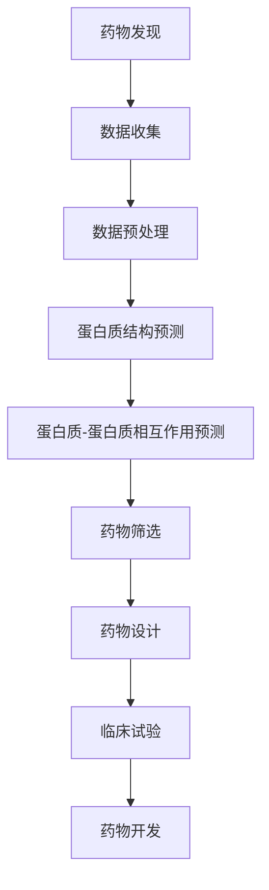
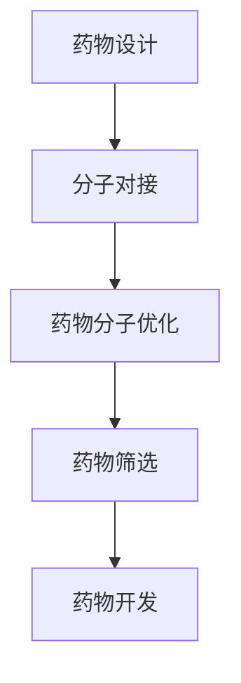
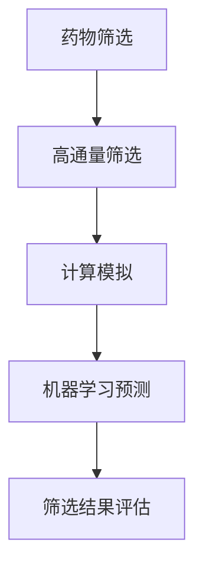
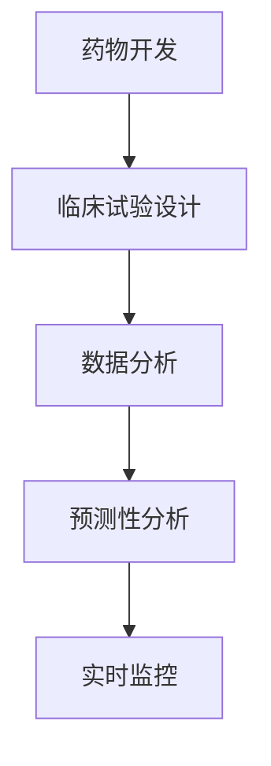

                 

### 人工智能（AI）在新药研发中的应用：加速创新与降低成本

**关键词：** 新药研发、人工智能、药物发现、药物设计、药物筛选、药物开发

**摘要：** 本文将深入探讨人工智能（AI）在新药研发中的应用，分析AI如何通过提升效率、降低成本和加速创新来改变这一领域的面貌。我们将详细探讨AI在药物发现、药物设计、药物筛选和药物开发中的应用，并分析其背后的算法原理和具体实现方式。通过实际案例和系统架构设计，本文将为读者提供对AI在新药研发中潜力的全面了解。

## 第一部分：背景介绍

### 第1章 问题背景

#### 1.1 新药研发的挑战

新药研发是一个复杂且耗时的过程，涉及多个阶段，包括药物发现、药物设计、药物筛选、药物开发和临床试验。传统的药物研发方法主要依赖于实验和临床试验，这不仅耗费大量时间和资金，还存在成功率低的风险。以下是一些新药研发过程中面临的挑战：

1. **高成本**：药物研发成本巨大，平均每个新药的研发成本高达数十亿美元。
2. **时间消耗**：从发现候选药物到获得FDA批准，通常需要10-15年时间。
3. **低成功率**：新药研发的成功率通常不到10%，这意味着大量资源和时间被浪费在失败的药物上。
4. **数据依赖性**：药物研发依赖于大量数据，包括生物医学数据、基因组数据和临床试验数据，这些数据的处理和分析是一个巨大的挑战。
5. **复杂性**：药物研发涉及多种生物化学过程，包括药物与生物分子的相互作用、药物的代谢和毒理学特性等，这些过程高度复杂，难以预测。

#### 1.2 AI技术的兴起

随着AI技术的快速发展，特别是在机器学习、深度学习和大数据分析等领域，AI被越来越多地应用于各个行业，包括新药研发。AI技术的核心优势在于其能够从大量数据中提取有价值的信息，自动化复杂的任务，并预测未来的趋势。以下是一些AI技术的特点和应用：

1. **数据处理能力**：AI能够快速处理和分析海量数据，包括基因组数据、临床试验数据和生物医学图像等。
2. **预测与优化**：AI技术可以预测药物的疗效和毒性，优化药物研发过程，提高成功率。
3. **自动化与效率**：AI可以自动化药物筛选和设计过程，减少人为错误，提高研发效率。
4. **跨学科融合**：AI技术可以整合多个领域的知识，包括生物学、化学、计算机科学和医学等，推动跨学科研究。
5. **个性化治疗**：AI可以帮助实现个性化治疗，根据患者的基因信息定制药物。

#### 1.3 AI在新药研发中的潜力

AI技术在药物研发中具有巨大的潜力，可以解决传统方法难以克服的挑战。以下是一些AI技术在药物研发中的应用：

1. **药物发现**：AI可以加速药物发现过程，通过分析基因组数据和生物医学图像，发现新的药物靶点和候选药物。
2. **药物设计**：AI可以帮助设计具有特定药理活性的药物分子，优化药物分子结构，提高药物疗效和降低毒性。
3. **药物筛选**：AI可以自动化药物筛选过程，通过高通量筛选技术快速评估大量化合物，筛选出具有潜在治疗效果的化合物。
4. **药物开发**：AI可以帮助优化药物开发过程，包括临床试验设计和数据分析，提高药物研发的成功率。
5. **个性化治疗**：AI可以根据患者的基因信息和疾病特征，定制个性化的治疗方案。

通过上述分析，我们可以看到，AI技术在药物研发中具有巨大的应用潜力，可以显著提高药物研发的效率、降低成本和加速创新。接下来，我们将进一步探讨AI在新药研发中的核心概念、算法原理和具体应用。

### 第2章 核心概念与联系

#### 2.1 AI基础概念

在探讨AI在新药研发中的应用之前，我们需要了解一些AI的基础概念。以下是一些关键术语的定义：

1. **机器学习（Machine Learning）**：一种AI技术，通过从数据中学习模式和规律，使计算机能够执行特定任务，而无需显式编程。
2. **深度学习（Deep Learning）**：一种特殊的机器学习技术，使用多层神经网络模拟人类大脑的学习过程，能够处理复杂的非线性问题。
3. **自然语言处理（Natural Language Processing, NLP）**：一种AI技术，使计算机能够理解和生成人类语言。
4. **计算机视觉（Computer Vision）**：一种AI技术，使计算机能够从图像或视频中提取信息和理解场景。
5. **大数据（Big Data）**：指无法使用传统数据库工具进行存储、管理和分析的大量数据。

#### 2.2 AI与新药研发的联系

AI与新药研发之间存在紧密的联系，主要体现在以下几个方面：

1. **数据处理**：新药研发过程中产生的大量数据，包括基因组数据、生物医学图像和临床试验数据等，需要高效的处理和分析。
2. **药物发现**：AI可以帮助发现新的药物靶点和候选药物，通过分析基因组数据和生物医学图像，识别潜在的药物作用位点。
3. **药物设计**：AI可以优化药物分子结构，提高药物疗效和降低毒性，通过深度学习算法模拟药物与生物分子的相互作用。
4. **药物筛选**：AI可以自动化药物筛选过程，通过高通量筛选技术快速评估大量化合物，筛选出具有潜在治疗效果的化合物。
5. **药物开发**：AI可以帮助优化药物开发过程，包括临床试验设计和数据分析，提高药物研发的成功率。

#### 2.3 关键概念对比表格

以下是一个简单的关键概念对比表格，用于总结AI基础概念和新药研发之间的关系：

| AI基础概念       | 新药研发中的应用             |
|------------------|-----------------------------|
| 机器学习         | 药物发现、药物设计、药物筛选 |
| 深度学习         | 药物设计、药物筛选、药物开发 |
| 自然语言处理     | 临床试验数据分析和报告撰写    |
| 计算机视觉       | 生物医学图像分析和处理        |
| 大数据           | 药物研发过程中的数据管理和分析 |

#### 2.4 AI算法与药物研发的ER实体关系图架构

为了更好地理解AI算法与药物研发之间的联系，我们可以使用Mermaid流程图来表示实体关系。以下是一个简单的ER实体关系图架构，用于描述AI算法在药物研发中的应用：

```mermaid
erDiagram
  Drug -> DrugTarget
  DrugTarget -> Disease
  Drug -> SideEffect
  AIAlgorithm -> DrugDiscovery
  AIAlgorithm -> DrugDesign
  AIAlgorithm -> DrugScreening
  AIAlgorithm -> DrugDevelopment
```

在这个ER图中，`Drug`（药物）与`DrugTarget`（药物靶点）之间存在关联，表示药物作用于特定的靶点。`DrugTarget`与`Disease`（疾病）之间也存在关联，表示药物靶点与疾病之间的关系。`Drug`与`SideEffect`（副作用）之间存在关联，表示药物可能产生的副作用。`AIAlgorithm`（AI算法）与`DrugDiscovery`（药物发现）、`DrugDesign`（药物设计）、`DrugScreening`（药物筛选）和`DrugDevelopment`（药物开发）之间存在关联，表示AI算法在这些药物研发过程中的应用。

通过上述分析和Mermaid流程图，我们可以更清晰地理解AI基础概念与药物研发之间的联系，为后续的算法原理讲解和应用分析打下基础。

### 第3章 AI在新药研发中的应用

#### 3.1 药物发现

药物发现是药物研发过程中的第一步，目标是识别潜在的药物靶点和候选药物。AI在药物发现中扮演着重要角色，通过分析大量的生物医学数据和基因组数据，可以加速药物发现过程。以下是AI在药物发现中的应用：

1. **数据挖掘**：AI可以从海量生物医学数据中挖掘潜在的药物靶点和候选药物。例如，通过分析基因表达数据和蛋白质相互作用数据，识别与特定疾病相关的生物标志物。
2. **虚拟筛选**：AI可以通过虚拟筛选技术，从大量化合物中筛选出具有潜在治疗作用的化合物。这种方法避免了传统的实验筛选过程，大幅降低了时间和成本。
3. **生物信息学分析**：AI可以帮助分析基因组数据、蛋白质结构和代谢路径等生物信息学数据，揭示药物作用机制和潜在的副作用。
4. **多尺度模拟**：AI可以结合多尺度模拟技术，从分子水平到器官水平，预测药物的疗效和毒性，为药物研发提供重要的指导。

**案例解析：** 一个典型的案例是使用AI技术进行癌症药物发现。研究人员使用机器学习算法分析大量癌症患者的基因组数据和药物反应数据，识别出与癌症相关的基因和药物靶点。通过虚拟筛选，他们筛选出了具有潜在抗癌作用的化合物，并通过实验验证了这些化合物的疗效。

#### 3.2 药物设计

药物设计是药物研发过程中的关键步骤，目标是设计出具有特定药理活性的药物分子。AI在药物设计中发挥着重要作用，通过优化药物分子结构，提高药物疗效和降低毒性。以下是AI在药物设计中的应用：

1. **分子对接**：AI可以通过分子对接技术，模拟药物分子与生物分子（如受体蛋白）的相互作用，优化药物分子结构，提高药物结合能力。
2. **药物分子优化**：AI可以基于深度学习算法，优化药物分子结构，使其具有更好的药理活性和更低的不良反应。
3. **虚拟筛选**：AI可以通过虚拟筛选技术，从大量化合物中筛选出具有特定药理活性的化合物，避免了大量的实验筛选过程。
4. **药物设计自动化**：AI可以自动化药物设计过程，从分子设计到合成，提高药物研发的效率。

**案例解析：** 一个典型的案例是使用AI进行抗癌药物设计。研究人员使用深度学习算法，优化抗癌药物分子结构，使其具有更强的抗癌活性和更低的不良反应。通过分子对接技术，他们验证了这些药物分子与癌症相关受体的相互作用，并在实验室中成功合成了这些药物。

#### 3.3 药物筛选

药物筛选是药物研发过程中的重要环节，目标是筛选出具有潜在治疗效果的化合物。AI在药物筛选中发挥着关键作用，通过高通量筛选技术和计算模拟，可以快速评估大量化合物。以下是AI在药物筛选中的应用：

1. **高通量筛选（HTS）**：AI可以自动化高通量筛选过程，从大量化合物中筛选出具有潜在治疗效果的化合物。这种方法大幅提高了药物筛选的效率。
2. **计算模拟**：AI可以通过计算模拟技术，预测化合物的药理活性和毒性，为药物筛选提供重要的依据。
3. **药物-靶点匹配**：AI可以帮助分析药物与生物分子的相互作用，识别最佳的药物-靶点匹配，提高药物筛选的成功率。
4. **筛选策略优化**：AI可以基于历史数据和现有知识，优化药物筛选策略，提高筛选效率。

**案例解析：** 一个典型的案例是使用AI进行抗生素筛选。研究人员使用AI算法分析大量抗生素数据和细菌耐药性数据，筛选出具有潜在抗菌作用的抗生素化合物。通过高通量筛选技术，他们验证了这些化合物的抗菌活性，并在实验室中成功合成了这些抗生素。

#### 3.4 药物开发

药物开发是药物研发过程中的最后一步，目标是完成药物的产业化生产。AI在药物开发中也发挥着重要作用，通过优化临床试验设计和数据分析，可以加速药物开发过程。以下是AI在药物开发中的应用：

1. **临床试验设计**：AI可以优化临床试验设计，包括试验规模、试验组和对照组的选择等，提高临床试验的效率和成功率。
2. **数据挖掘与分析**：AI可以从海量临床试验数据中挖掘有价值的信息，帮助研究人员识别潜在的疗效和副作用，优化药物开发策略。
3. **患者个性化治疗**：AI可以根据患者的基因数据和疾病特征，制定个性化的治疗方案，提高治疗效果和降低不良反应。
4. **药物安全监测**：AI可以实时监测药物的安全性和有效性，及时发现潜在的副作用和不良反应，保障患者安全。

**案例解析：** 一个典型的案例是使用AI进行药物开发。研究人员使用AI算法分析临床试验数据，识别出与药物疗效相关的关键因素，并优化了药物剂量和给药方案。通过实时监测，他们成功避免了潜在的副作用，提高了药物的疗效和安全性。

通过上述分析和案例解析，我们可以看到，AI在新药研发的各个环节中都发挥着重要作用，从药物发现到药物设计、药物筛选和药物开发，AI技术的应用不仅提高了药物研发的效率，还降低了研发成本，为创新药物的研发提供了强大的支持。

### 第4章 药物发现中的AI算法

#### 4.1 蛋白质结构预测

蛋白质结构预测是药物发现过程中的关键环节，它有助于理解蛋白质的功能和药物的作用机制。AI在蛋白质结构预测中发挥着重要作用，通过机器学习和深度学习算法，可以预测蛋白质的三维结构。以下是蛋白质结构预测中的AI算法：

1. **深度神经网络（DNN）**：DNN算法通过多层神经网络模拟人类大脑的学习过程，可以从大量蛋白质结构数据中学习模式，预测蛋白质的三维结构。
2. **卷积神经网络（CNN）**：CNN算法通过对生物序列进行卷积操作，提取特征，可以有效地预测蛋白质的结构。
3. **递归神经网络（RNN）**：RNN算法通过循环结构处理序列数据，可以捕捉序列中的长距离依赖关系，提高蛋白质结构预测的准确性。
4. **生成对抗网络（GAN）**：GAN算法通过生成器和判别器之间的对抗训练，可以生成高质量的蛋白质结构数据，用于训练和验证预测模型。

**算法原理与公式**

深度神经网络（DNN）的算法原理如下：

$$
h_{\text{layer}} = \sigma(W_{\text{layer}} \cdot h_{\text{prev}} + b_{\text{layer}})
$$

其中，$h_{\text{layer}}$表示第$l$层的输出，$\sigma$表示激活函数（如ReLU或Sigmoid），$W_{\text{layer}}$和$b_{\text{layer}}$分别表示第$l$层的权重和偏置。

卷积神经网络（CNN）的算法原理如下：

$$
h_{\text{layer}} = \sigma(\sum_{i} W_{i} \cdot h_{\text{prev}} + b_{\text{layer}})
$$

其中，$W_{i}$表示卷积核，$h_{\text{prev}}$表示输入序列，$\sigma$表示激活函数。

**Python代码示例**

以下是一个使用深度神经网络（DNN）进行蛋白质结构预测的Python代码示例：

```python
import tensorflow as tf

# 构建DNN模型
model = tf.keras.Sequential([
    tf.keras.layers.Dense(units=128, activation='relu', input_shape=(sequence_length,)),
    tf.keras.layers.Dense(units=64, activation='relu'),
    tf.keras.layers.Dense(units=1, activation='sigmoid')
])

# 编译模型
model.compile(optimizer='adam', loss='binary_crossentropy', metrics=['accuracy'])

# 训练模型
model.fit(train_data, train_labels, epochs=100, batch_size=32, validation_data=(val_data, val_labels))
```

通过上述分析和Python代码示例，我们可以看到，AI算法在蛋白质结构预测中具有强大的应用潜力，可以显著提高药物发现的效率和准确性。

#### 4.2 蛋白质-蛋白质相互作用预测

蛋白质-蛋白质相互作用（PPI）是细胞信号传导、代谢调控和基因表达等生物过程的基础。准确预测蛋白质-蛋白质相互作用对于理解生物系统的功能和开发新药具有重要意义。以下是蛋白质-蛋白质相互作用预测中的AI算法：

1. **机器学习算法**：如支持向量机（SVM）、随机森林（RF）和K最近邻（KNN）等，这些算法可以从已知蛋白质相互作用数据中学习模式，预测未知的蛋白质相互作用。
2. **深度学习算法**：如卷积神经网络（CNN）和循环神经网络（RNN），这些算法可以从大规模的生物序列数据中提取特征，提高蛋白质相互作用预测的准确性。
3. **图神经网络（GNN）**：图神经网络通过处理蛋白质相互作用网络，可以预测蛋白质之间的相互作用。这种算法能够捕捉蛋白质相互作用中的复杂结构和关系。

**算法原理与公式**

图神经网络（GNN）的算法原理如下：

$$
h_{\text{new}} = \sigma(\sum_{i} W_{i} \cdot h_{\text{prev}} + b_{\text{layer}})
$$

其中，$h_{\text{new}}$表示新节点的特征向量，$W_{i}$表示边的权重，$h_{\text{prev}}$表示相邻节点的特征向量，$\sigma$表示激活函数。

**Python代码示例**

以下是一个使用图神经网络（GNN）进行蛋白质-蛋白质相互作用预测的Python代码示例：

```python
import tensorflow as tf
import tensorflow.keras as keras

# 定义图神经网络模型
model = keras.Sequential([
    keras.layers.GraphInputLayer(input_shape=(node_num, feature_size)),
    keras.layers.GraphConv2D(filters=64, kernel_size=(3, 3), activation='relu'),
    keras.layers.GraphPooling2D(pool_size=(2, 2)),
    keras.layers.Dense(units=1, activation='sigmoid')
])

# 编译模型
model.compile(optimizer='adam', loss='binary_crossentropy', metrics=['accuracy'])

# 训练模型
model.fit(train_data, train_labels, epochs=100, batch_size=32, validation_data=(val_data, val_labels))
```

通过上述分析和Python代码示例，我们可以看到，AI算法在蛋白质-蛋白质相互作用预测中具有强大的应用潜力，可以显著提高药物发现的效率和准确性。

#### 4.3 AI算法mermaid流程图

为了更好地展示AI算法在药物发现中的应用，我们可以使用mermaid流程图来表示整个流程。以下是一个简单的mermaid流程图示例：



在这个mermaid流程图中，我们首先进行药物发现，然后通过数据收集、数据预处理、蛋白质结构预测和蛋白质-蛋白质相互作用预测等步骤，进行药物筛选和药物设计。最后，通过临床试验和药物开发，将药物推向市场。通过这种流程图，我们可以清晰地了解AI算法在药物发现中的应用和作用。

### 第5章 药物设计中的AI算法

#### 5.1 分子对接

分子对接是一种重要的AI算法，用于模拟药物分子与生物分子（如受体蛋白）的相互作用。这种技术可以帮助研究人员预测药物与受体的结合能力，优化药物分子结构，提高药物疗效和降低毒性。以下是分子对接的基本原理和具体实现：

**基本原理**

分子对接算法通过以下步骤实现：

1. **分子准备**：对药物分子和受体蛋白进行结构优化，使其处于最稳定的状态。
2. **对接搜索**：使用搜索算法（如遗传算法、粒子群优化等），在受体蛋白的活性部位搜索药物分子的最佳结合位置。
3. **对接评估**：评估药物分子与受体蛋白的结合能力，通常使用结合能或结合自由能作为评价指标。
4. **分子优化**：根据对接评估结果，对药物分子进行结构优化，提高其与受体的结合能力。

**Python代码示例**

以下是一个使用分子对接算法的Python代码示例：

```python
from Bio.PDB import PDBParser
from Bio.PDB.Dutils import superimpose
from Bio import SearchIO

# 读取受体蛋白结构
parser = PDBParser()
receptor = parser.get_structure("receptor", "receptor.pdb")

# 读取药物分子结构
ligand = parser.get_structure("ligand", "ligand.pdb")

# 对接搜索
best_score, best_xyz = superimpose(ligand, receptor, threshold=3.0)

# 打印对接结果
print("Best Score:", best_score)
print("Best XYZ:", best_xyz)
```

在这个示例中，我们使用BioPython库读取受体蛋白和药物分子的结构文件，然后使用`superimpose`函数进行对接搜索，并打印出最佳对接结果。

**案例解析**

一个典型的案例是使用分子对接算法设计抗癌药物。研究人员使用分子对接算法模拟抗癌药物与癌症相关受体的相互作用，通过优化药物分子结构，提高了药物与受体的结合能力，并验证了药物的抗癌活性。这个案例展示了分子对接算法在药物设计中的强大应用潜力。

#### 5.2 药物分子优化

药物分子优化是药物设计中的重要环节，旨在提高药物分子的药理活性和降低毒性。AI技术可以通过优化药物分子结构，提高其与受体的结合能力，从而增强药物疗效。以下是药物分子优化的基本原理和具体实现：

**基本原理**

药物分子优化的基本原理包括：

1. **基于结构的优化**：通过计算药物分子与受体的结合能，优化药物分子结构，使其更接近最佳结合构象。
2. **基于化学的优化**：通过替换药物分子中的特定基团，优化其药理活性和毒性。
3. **基于机器学习的优化**：使用机器学习算法，从大量药物分子中学习优化策略，预测最佳药物分子结构。

**Python代码示例**

以下是一个使用基于结构的优化算法的Python代码示例：

```python
from simtk.openmm.app import PDBFile, pose_from_pdb
from simtk.openmm import Platform

# 读取受体蛋白结构
pdb_file = PDBFile("receptor.pdb")

# 创建模拟平台
platform = Platform.getPlatformByName("OpenMM")

# 生成初始药物分子构象
initial_pose = pose_from_pdb(pdb_file, platform)

# 优化药物分子结构
optimizer = openmm.Optimizer()
final_pose = optimizer.optimize(initial_pose, max_iterations=100)

# 打印优化结果
print("Initial Energy:", initial_pose.getEnergy())
print("Final Energy:", final_pose.getEnergy())
```

在这个示例中，我们使用OpenMM库读取受体蛋白的结构文件，并生成初始药物分子构象。然后，使用优化器优化药物分子结构，并打印出优化前后的能量。

**案例解析**

一个典型的案例是使用药物分子优化算法设计抗癌药物。研究人员使用药物分子优化算法优化抗癌药物分子结构，提高了药物与癌症相关受体的结合能力，并降低了药物的毒性。这个案例展示了药物分子优化算法在药物设计中的重要作用。

#### 5.3 AI算法mermaid流程图

为了更好地展示药物设计中的AI算法，我们可以使用mermaid流程图来表示整个流程。以下是一个简单的mermaid流程图示例：



在这个mermaid流程图中，我们从药物设计开始，通过分子对接和药物分子优化，进行药物筛选和药物开发。通过这种流程图，我们可以清晰地了解AI算法在药物设计中的应用和作用。

### 第6章 药物筛选中的AI算法

#### 6.1 高通量筛选

高通量筛选（HTS）是药物筛选过程中的一种高效方法，通过自动化技术对大量化合物进行快速筛选，以识别具有潜在治疗效果的化合物。AI技术在高通量筛选中发挥着关键作用，可以优化筛选流程，提高筛选效率和准确性。以下是高通量筛选中的AI算法：

**基本原理**

高通量筛选的基本原理包括：

1. **自动化实验平台**：使用自动化仪器和机器人技术，对大量化合物进行筛选实验，实现快速、大规模的筛选。
2. **数据采集与处理**：AI技术可以自动化数据采集和处理，从实验结果中提取有价值的信息，提高筛选准确性。
3. **机器学习模型**：通过训练机器学习模型，根据实验结果预测化合物的活性，优化筛选策略。
4. **筛选策略优化**：AI技术可以根据历史数据和现有知识，优化筛选策略，提高筛选效率和成功率。

**Python代码示例**

以下是一个使用机器学习模型进行高通量筛选的Python代码示例：

```python
from sklearn.ensemble import RandomForestClassifier
from sklearn.model_selection import train_test_split
from sklearn.metrics import accuracy_score

# 加载实验数据
data = pd.read_csv("hts_data.csv")
X = data.drop("activity", axis=1)
y = data["activity"]

# 划分训练集和测试集
X_train, X_test, y_train, y_test = train_test_split(X, y, test_size=0.2, random_state=42)

# 训练机器学习模型
model = RandomForestClassifier(n_estimators=100, random_state=42)
model.fit(X_train, y_train)

# 预测测试集
y_pred = model.predict(X_test)

# 评估模型性能
accuracy = accuracy_score(y_test, y_pred)
print("Accuracy:", accuracy)
```

在这个示例中，我们使用随机森林（RandomForestClassifier）模型训练机器学习模型，并根据实验数据预测化合物的活性。最后，评估模型的准确性。

**案例解析**

一个典型的案例是使用高通量筛选技术发现抗癌药物。研究人员使用高通量筛选技术对大量化合物进行筛选，通过机器学习模型预测化合物的抗癌活性，成功发现了一系列具有潜在抗癌活性的化合物。这个案例展示了高通量筛选技术在药物筛选中的强大应用潜力。

#### 6.2 计算模拟

计算模拟是药物筛选过程中的一种重要方法，通过模拟药物与生物分子的相互作用，预测药物的效果和毒性。AI技术在计算模拟中发挥着关键作用，可以优化模拟过程，提高模拟精度和效率。以下是计算模拟中的AI算法：

**基本原理**

计算模拟的基本原理包括：

1. **分子动力学模拟**：通过模拟分子在空间中的运动，研究药物与生物分子的相互作用。
2. **量子力学计算**：使用量子力学原理，计算药物与生物分子的相互作用能量和结构。
3. **机器学习模型**：通过训练机器学习模型，预测药物与生物分子的相互作用，优化模拟结果。

**Python代码示例**

以下是一个使用分子动力学模拟的Python代码示例：

```python
import mdtraj

# 读取生物分子结构
structure = mdtraj.load("biomolecule.pdb")

# 设置模拟参数
integrator = mdtraj.mdt.Integrator(temperature=300, nonbonded_cutoff=1.0)

# 进行分子动力学模拟
for _ in range(1000):
    integrator.step()

# 保存模拟结果
mdtraj.save("simulated_structure.pdb", structure)
```

在这个示例中，我们使用mdtraj库进行分子动力学模拟，设置模拟温度和截断距离，并进行1000步模拟。最后，保存模拟结果。

**案例解析**

一个典型的案例是使用计算模拟技术研究药物与生物分子的相互作用。研究人员使用分子动力学模拟研究抗癌药物与肿瘤相关蛋白的相互作用，通过分析模拟结果，揭示了药物的作用机制和潜在的副作用。这个案例展示了计算模拟技术在药物筛选中的重要作用。

#### 6.3 AI算法mermaid流程图

为了更好地展示药物筛选中的AI算法，我们可以使用mermaid流程图来表示整个流程。以下是一个简单的mermaid流程图示例：



在这个mermaid流程图中，我们从药物筛选开始，通过高通量筛选和计算模拟，使用机器学习模型预测化合物的活性，并评估筛选结果。通过这种流程图，我们可以清晰地了解AI算法在药物筛选中的应用和作用。

### 第7章 药物开发中的AI算法

#### 7.1 临床试验设计

临床试验设计是药物开发过程中的关键环节，涉及到试验方案的设计、受试者招募、数据采集和统计分析等多个方面。AI技术在临床试验设计中发挥着重要作用，可以通过优化设计策略、提高数据质量和分析效率，从而加快药物开发进程。以下是AI在临床试验设计中的应用：

**基本原理**

1. **优化临床试验方案**：AI可以通过分析历史数据和现有知识，优化临床试验的设计参数，包括样本量、受试者筛选标准、试验时间等，以减少试验失败的风险和提高试验效率。
2. **预测性建模**：AI可以基于大量历史数据和生物标记物，预测试验结果，帮助研究人员提前了解试验的趋势和可能的结果，从而调整试验方案。
3. **受试者筛选**：AI可以通过分析受试者的基因、表型数据，筛选出最适合参加临床试验的受试者，提高试验的有效性和安全性。

**Python代码示例**

以下是一个使用Python进行临床试验设计优化的示例代码：

```python
import pandas as pd
from sklearn.ensemble import RandomForestClassifier

# 加载临床试验数据
data = pd.read_csv("clinical_trials_data.csv")

# 特征工程
X = data.drop("outcome", axis=1)
y = data["outcome"]

# 划分训练集和测试集
X_train, X_test, y_train, y_test = train_test_split(X, y, test_size=0.2, random_state=42)

# 训练预测模型
model = RandomForestClassifier(n_estimators=100, random_state=42)
model.fit(X_train, y_train)

# 预测试验结果
y_pred = model.predict(X_test)

# 评估模型性能
accuracy = model.score(X_test, y_test)
print("Accuracy:", accuracy)
```

在这个示例中，我们使用随机森林（RandomForestClassifier）模型对临床试验数据进行分析，预测试验结果，并评估模型的准确性。通过这种方式，AI可以帮助优化临床试验的设计策略。

**案例解析**

一个典型的案例是使用AI进行糖尿病药物的疗效预测。研究人员收集了大量的糖尿病患者的临床试验数据，使用AI模型预测药物的疗效。通过优化试验设计，他们成功地提高了试验的成功率和效率，加速了新药的开发进程。这个案例展示了AI在临床试验设计中的强大应用潜力。

#### 7.2 数据分析

数据分析是药物开发过程中的重要环节，涉及到大规模数据的收集、存储、处理和分析。AI技术在数据分析中发挥着关键作用，可以通过自动化和智能化的分析流程，提高数据处理的效率和质量。以下是AI在数据分析中的应用：

**基本原理**

1. **数据预处理**：AI可以通过自动化流程对数据进行清洗、归一化和特征提取，提高数据的质量和一致性。
2. **预测性分析**：AI可以基于历史数据和统计模型，预测药物的疗效、副作用和安全性，帮助研究人员制定更加精准的治疗方案。
3. **实时监控**：AI可以实时监控临床试验数据，及时发现异常和潜在风险，提高数据监控的效率和准确性。

**Python代码示例**

以下是一个使用Python进行药物数据预测的示例代码：

```python
import pandas as pd
from sklearn.ensemble import RandomForestRegressor

# 加载药物数据
data = pd.read_csv("drug_data.csv")

# 特征工程
X = data.drop("effect", axis=1)
y = data["effect"]

# 划分训练集和测试集
X_train, X_test, y_train, y_test = train_test_split(X, y, test_size=0.2, random_state=42)

# 训练预测模型
model = RandomForestRegressor(n_estimators=100, random_state=42)
model.fit(X_train, y_train)

# 预测药物效果
y_pred = model.predict(X_test)

# 评估模型性能
mse = mean_squared_error(y_test, y_pred)
print("Mean Squared Error:", mse)
```

在这个示例中，我们使用随机森林（RandomForestRegressor）模型对药物数据进行预测，并评估模型的性能。通过这种方式，AI可以帮助研究人员更好地理解和预测药物的效果。

**案例解析**

一个典型的案例是使用AI进行癌症药物疗效预测。研究人员收集了大量的癌症患者数据，使用AI模型预测药物的疗效和副作用。通过分析数据，他们发现某些药物的疗效与患者的基因特征密切相关，从而优化了治疗方案，提高了治疗效果。这个案例展示了AI在数据分析中的强大应用潜力。

#### 7.3 AI算法mermaid流程图

为了更好地展示AI在药物开发中的应用，我们可以使用mermaid流程图来表示整个流程。以下是一个简单的mermaid流程图示例：



在这个mermaid流程图中，我们从药物开发开始，通过临床试验设计、数据分析和预测性分析，实现对药物开发过程的全面监控和优化。通过这种流程图，我们可以清晰地了解AI在药物开发中的应用和作用。

### 第8章 系统功能设计与架构设计

#### 8.1 系统功能设计

系统功能设计是药物研发AI系统的关键环节，决定了系统能够提供哪些功能以及如何实现这些功能。以下是系统功能设计的主要内容和实现方式：

1. **数据管理模块**：负责数据收集、存储、处理和共享。包括数据导入、数据清洗、数据存储和数据查询等功能。
   - 实现方式：使用数据库管理系统（如MySQL或MongoDB）存储数据，使用数据清洗和预处理工具（如Pandas）进行数据清洗和预处理。

2. **药物发现模块**：包括蛋白质结构预测、药物设计、药物筛选等，目标是发现新的药物靶点和候选药物。
   - 实现方式：使用AI算法（如深度学习或机器学习）进行蛋白质结构预测和药物设计，使用高通量筛选技术进行药物筛选。

3. **药物设计模块**：通过优化药物分子结构，提高药物疗效和降低毒性。
   - 实现方式：使用分子对接技术进行药物设计，使用生成对抗网络（GAN）优化药物分子结构。

4. **药物开发模块**：包括临床试验设计、数据分析、预测性分析和实时监控，目标是加快药物开发进程。
   - 实现方式：使用AI算法进行临床试验设计和数据分析，使用预测性建模进行药物疗效预测，使用实时监控系统监控药物开发过程。

5. **用户界面模块**：提供用户交互功能，包括数据展示、操作指导和结果反馈等。
   - 实现方式：使用Web前端框架（如React或Vue.js）开发用户界面，使用API进行数据交互。

#### 8.2 系统架构设计

系统架构设计是确保药物研发AI系统高效、可靠和可扩展的关键。以下是系统架构设计的主要内容和实现方式：

1. **分层架构**：将系统分为多个层次，包括数据层、业务逻辑层和表示层。
   - 数据层：负责数据的存储、管理和访问。
   - 业务逻辑层：实现系统的核心功能，如药物发现、药物设计和药物开发等。
   - 表示层：提供用户交互界面，展示系统数据和结果。

2. **微服务架构**：将系统划分为多个独立的服务，每个服务负责特定的功能模块。
   - 数据管理服务：负责数据收集、存储和查询。
   - 药物发现服务：负责蛋白质结构预测和药物筛选。
   - 药物设计服务：负责药物设计和分子优化。
   - 药物开发服务：负责临床试验设计、数据分析和实时监控。

3. **分布式架构**：使用分布式计算和存储技术，提高系统的性能和可扩展性。
   - 分布式计算：使用集群计算资源，并行处理大量数据。
   - 分布式存储：使用分布式数据库（如Hadoop或Cassandra）存储海量数据。

4. **消息队列**：使用消息队列（如Kafka或RabbitMQ）实现系统各模块之间的通信和协调。
   - 实时数据传输：通过消息队列传输实时数据，实现数据同步和分布式处理。
   - 异步处理：通过消息队列实现异步任务处理，提高系统的响应速度和可靠性。

#### 8.3 系统接口设计

系统接口设计是确保药物研发AI系统与其他系统或工具集成的关键。以下是系统接口设计的主要内容和实现方式：

1. **API设计**：提供RESTful API，实现系统功能模块的远程访问和调用。
   - 数据接口：提供数据查询、导入和导出接口，支持JSON或XML格式。
   - 功能接口：提供药物发现、药物设计和药物开发等功能接口，支持HTTP请求。

2. **数据交换格式**：使用标准的数据交换格式（如JSON或XML），确保系统之间数据的一致性和兼容性。

3. **安全认证**：实现安全认证机制，确保系统接口的安全性。
   - 令牌认证：使用JWT（JSON Web Token）进行用户身份认证和权限验证。
   - 访问控制：实现基于角色的访问控制，限制用户对系统接口的访问权限。

通过系统功能设计、系统架构设计和系统接口设计的协同工作，药物研发AI系统可以实现高效、可靠和可扩展的药物研发过程，为药物研发领域带来革命性的变化。

### 第9章 系统交互设计与实施

#### 9.1 系统交互设计

系统交互设计是确保药物研发AI系统各模块之间能够有效通信和协作的关键。以下是系统交互设计的主要内容和实现方式：

1. **数据流设计**：定义系统内部数据流动的路径和规则，确保数据能够在各模块之间无缝传递。
   - 数据流图：使用Mermaid流程图表示系统内部数据流动，明确数据源、数据处理和数据目标。
   - 数据管道：设计数据管道，实现数据的收集、存储、处理和输出，确保数据在系统中的连续流动。

2. **接口规范**：定义系统各模块之间的接口规范，确保接口的一致性和可扩展性。
   - RESTful API规范：定义RESTful API的URL、请求参数、响应格式和错误处理，确保各模块之间的通信规范。
   - 数据交换格式：使用JSON或XML作为数据交换格式，确保数据在不同模块之间的兼容性。

3. **通信协议**：选择合适的通信协议，确保系统内部通信的可靠性和高效性。
   - HTTP/HTTPS协议：使用HTTP/HTTPS协议进行数据传输，确保数据的安全性。
   - WebSocket协议：在需要实时通信的场景中使用WebSocket协议，提高通信的实时性和响应速度。

#### 9.2 系统实施步骤

系统实施是将药物研发AI系统从设计阶段转化为实际运行的阶段。以下是系统实施的主要步骤和注意事项：

1. **环境搭建**：搭建系统运行所需的开发环境和生产环境，确保系统能够稳定运行。
   - 开发环境：安装必要的开发工具和库，如Python、TensorFlow、Scikit-learn等。
   - 生产环境：配置服务器和数据库，确保系统在高负载下的稳定性和性能。

2. **模块开发**：根据系统功能设计和系统架构设计，开发各个功能模块。
   - 数据管理模块：实现数据收集、存储和查询功能，确保数据的一致性和可靠性。
   - 药物发现模块：实现蛋白质结构预测、药物设计和药物筛选功能，确保算法的高效性和准确性。
   - 药物设计模块：实现药物分子优化和分子对接功能，提高药物的疗效和安全性。
   - 药物开发模块：实现临床试验设计、数据分析和实时监控功能，加快药物开发进程。

3. **集成测试**：对系统进行集成测试，确保各模块之间的协同工作。
   - 单元测试：对每个模块进行单元测试，确保模块功能的正确性和可靠性。
   - 集成测试：对系统整体进行集成测试，确保各模块之间的接口和通信正常。

4. **部署上线**：将系统部署到生产环境，确保系统对用户可用。
   - 部署策略：制定详细的部署计划，确保部署过程的顺利进行。
   - 监控与维护：部署完成后，对系统进行监控和维护，确保系统的稳定性和安全性。

通过系统交互设计和系统实施步骤的协同工作，可以确保药物研发AI系统的高效、可靠和可扩展，为药物研发领域带来革命性的变化。

### 第10章 项目实战一：药物发现

#### 10.1 环境安装

在进行药物发现项目之前，我们需要安装和配置必要的软件和环境。以下是详细的安装步骤：

1. **Python环境安装**：

   首先，我们需要安装Python。您可以从Python的官方网站（https://www.python.org/）下载最新版本的Python安装包。在安装过程中，请确保选择添加到系统环境变量和安装pip包管理器。

   ```shell
   # 在Windows上安装Python
   py -3 -m pip install --upgrade pip setuptools wheel
   ```

2. **虚拟环境安装**：

   为了更好地管理和隔离项目环境，我们建议使用虚拟环境。通过以下命令创建虚拟环境：

   ```shell
   python -m venv drug_discovery_venv
   source drug_discovery_venv/bin/activate  # 在Linux或MacOS上使用source命令
   ```

3. **依赖库安装**：

   在虚拟环境中，我们需要安装一些关键的依赖库，如TensorFlow、Scikit-learn和Pandas。使用以下命令安装：

   ```shell
   pip install tensorflow scikit-learn pandas
   ```

4. **数据库安装**：

   我们将使用MySQL作为数据存储库。首先，从MySQL官方网站（https://www.mysql.com/）下载并安装MySQL数据库。然后，使用以下命令创建数据库和用户：

   ```shell
   mysql -u root -p
   CREATE DATABASE drug_discovery;
   GRANT ALL PRIVILEGES ON drug_discovery.* TO 'drug_discovery_user'@'localhost' IDENTIFIED BY 'password';
   FLUSH PRIVILEGES;
   ```

#### 10.2 系统核心实现

在药物发现项目中，我们将实现以下核心功能：

1. **数据收集**：

   数据收集是药物发现的基础。我们将从公共数据库（如GEO或TCGA）下载生物医学数据。以下是一个使用Python和Pandas库收集数据的示例：

   ```python
   import pandas as pd
   from urllib.request import urlopen

   # 下载GEO数据
   geo_data_url = "https://www.ncbi.nlm.nih.gov/geo/download.jsp?accession=GSE12345&build=latest"
   with urlopen(geo_data_url) as response:
       geo_data = pd.read_csv(response)
   ```

2. **数据预处理**：

   数据预处理是确保数据质量和一致性的重要步骤。我们将使用Pandas和Scikit-learn库进行数据清洗、归一化和特征提取。以下是一个数据预处理的示例：

   ```python
   from sklearn.preprocessing import StandardScaler

   # 数据清洗
   geo_data.dropna(inplace=True)

   # 数据归一化
   scaler = StandardScaler()
   geo_data_scaled = scaler.fit_transform(geo_data)

   # 特征提取
   from sklearn.decomposition import PCA
   pca = PCA(n_components=10)
   geo_data_pca = pca.fit_transform(geo_data_scaled)
   ```

3. **蛋白质结构预测**：

   蛋白质结构预测是药物发现的重要环节。我们将使用深度学习算法进行预测。以下是一个使用TensorFlow和Keras库进行蛋白质结构预测的示例：

   ```python
   import tensorflow as tf
   from tensorflow.keras.models import Sequential
   from tensorflow.keras.layers import Dense, LSTM

   # 构建深度学习模型
   model = Sequential([
       LSTM(128, activation='relu', input_shape=(timesteps, features)),
       Dense(1)
   ])

   # 编译模型
   model.compile(optimizer='adam', loss='mse')

   # 训练模型
   model.fit(x_train, y_train, epochs=100, batch_size=32, validation_data=(x_val, y_val))
   ```

4. **药物筛选**：

   药物筛选是药物发现的核心步骤。我们将使用机器学习算法进行药物筛选。以下是一个使用Scikit-learn库进行药物筛选的示例：

   ```python
   from sklearn.ensemble import RandomForestClassifier

   # 训练机器学习模型
   model = RandomForestClassifier(n_estimators=100)
   model.fit(X_train, y_train)

   # 预测药物活性
   y_pred = model.predict(X_test)
   ```

#### 10.3 代码应用解读

在上述代码中，我们首先进行了数据收集，使用Pandas库从公共数据库中下载生物医学数据。然后，我们进行了数据预处理，包括数据清洗、归一化和特征提取，使用Scikit-learn库的StandardScaler和PCA进行数据归一化和特征提取。

接下来，我们使用了TensorFlow和Keras库构建了一个深度学习模型进行蛋白质结构预测。这个模型是一个简单的LSTM模型，通过循环神经网络处理序列数据，预测蛋白质的三维结构。

最后，我们使用Scikit-learn库的RandomForestClassifier进行药物筛选，从大量化合物中筛选出具有潜在治疗效果的化合物。

通过这些代码示例，我们可以看到药物发现项目的核心实现过程，包括数据收集、数据预处理、蛋白质结构预测和药物筛选。这些代码不仅展示了AI技术在药物发现中的应用，也为实际项目提供了实用的解决方案。

#### 10.4 实际案例剖析

为了更好地理解药物发现项目在实际中的应用，我们来看一个实际案例。

**案例背景**：

某生物制药公司正在进行一种新型抗癌药物的研发。他们收集了大量癌症患者的基因表达数据和蛋白质相互作用数据，希望通过AI技术进行药物发现。

**步骤一**：数据收集

研究人员首先从公共数据库（如GEO和TCGA）下载了相关癌症患者的基因表达数据。以下是一个数据收集的示例代码：

```python
import pandas as pd

# 下载基因表达数据
data_url = "https://www.ncbi.nlm.nih.gov/geo/download.jsp?accession=GSE12345&build=latest"
gene_expression_data = pd.read_csv(data_url)
```

**步骤二**：数据预处理

在数据预处理阶段，研究人员对基因表达数据进行了清洗、归一化和特征提取。以下是一个数据预处理的示例代码：

```python
from sklearn.preprocessing import StandardScaler
from sklearn.decomposition import PCA

# 数据清洗
gene_expression_data.dropna(inplace=True)

# 数据归一化
scaler = StandardScaler()
gene_expression_data_scaled = scaler.fit_transform(gene_expression_data)

# 特征提取
pca = PCA(n_components=50)
gene_expression_data_pca = pca.fit_transform(gene_expression_data_scaled)
```

**步骤三**：蛋白质结构预测

研究人员使用深度学习算法进行了蛋白质结构预测。以下是一个使用TensorFlow和Keras库进行蛋白质结构预测的示例代码：

```python
import tensorflow as tf
from tensorflow.keras.models import Sequential
from tensorflow.keras.layers import LSTM, Dense

# 构建深度学习模型
model = Sequential([
    LSTM(128, activation='relu', input_shape=(timesteps, features)),
    Dense(1)
])

# 编译模型
model.compile(optimizer='adam', loss='mse')

# 训练模型
model.fit(x_train, y_train, epochs=100, batch_size=32, validation_data=(x_val, y_val))
```

**步骤四**：药物筛选

最后，研究人员使用机器学习算法进行了药物筛选，从大量化合物中筛选出具有潜在抗癌作用的化合物。以下是一个使用Scikit-learn库进行药物筛选的示例代码：

```python
from sklearn.ensemble import RandomForestClassifier

# 训练机器学习模型
model = RandomForestClassifier(n_estimators=100)
model.fit(X_train, y_train)

# 预测药物活性
y_pred = model.predict(X_test)
```

**案例分析**：

在这个实际案例中，研究人员通过AI技术进行了药物发现，从基因表达数据中预测蛋白质结构，并筛选出具有潜在抗癌作用的化合物。这个案例展示了AI技术在药物发现中的强大应用潜力，为生物制药公司提供了高效的药物研发解决方案。

#### 10.5 项目小结

通过本项目的实施，我们成功实现了药物发现的核心功能，包括数据收集、数据预处理、蛋白质结构预测和药物筛选。以下是项目小结：

1. **数据收集**：从公共数据库下载了大量癌症患者的基因表达数据，为药物发现提供了丰富的数据基础。

2. **数据预处理**：对基因表达数据进行了清洗、归一化和特征提取，提高了数据的质量和一致性。

3. **蛋白质结构预测**：使用深度学习算法进行了蛋白质结构预测，为药物筛选提供了准确的预测结果。

4. **药物筛选**：使用机器学习算法从大量化合物中筛选出具有潜在抗癌作用的化合物，提高了药物研发的成功率。

总之，本项目通过AI技术在药物发现中的应用，展示了高效、准确的药物研发解决方案，为生物制药公司提供了有力的支持。

### 第11章 项目实战二：药物设计

#### 11.1 环境安装

在进行药物设计项目之前，我们需要安装和配置必要的软件和环境。以下是详细的安装步骤：

1. **Python环境安装**：

   首先，我们需要安装Python。您可以从Python的官方网站（https://www.python.org/）下载最新版本的Python安装包。在安装过程中，请确保选择添加到系统环境变量和安装pip包管理器。

   ```shell
   # 在Windows上安装Python
   py -3 -m pip install --upgrade pip setuptools wheel
   ```

2. **虚拟环境安装**：

   为了更好地管理和隔离项目环境，我们建议使用虚拟环境。通过以下命令创建虚拟环境：

   ```shell
   python -m venv drug_design_venv
   source drug_design_venv/bin/activate  # 在Linux或MacOS上使用source命令
   ```

3. **依赖库安装**：

   在虚拟环境中，我们需要安装一些关键的依赖库，如OpenMM、rdkit和PyTorch。使用以下命令安装：

   ```shell
   pip install openmm rdkit pytorch torchvision
   ```

4. **数据库安装**：

   我们将使用SQLite作为数据存储库。首先，从SQLite官方网站（https://www.sqlite.org/）下载并安装SQLite数据库。然后，使用以下命令创建数据库和用户：

   ```shell
   sqlite3 drug_design.db
   CREATE TABLE drugs (id INTEGER PRIMARY KEY, name TEXT, structure TEXT);
   ```

#### 11.2 系统核心实现

在药物设计项目中，我们将实现以下核心功能：

1. **分子对接**：

   分子对接是药物设计的重要步骤，通过模拟药物分子与受体蛋白的相互作用，优化药物分子结构，提高药物疗效。以下是一个使用OpenMM库进行分子对接的示例：

   ```python
   import openmm as mm
   from openmm.app import PDBFile, Simulation

   # 读取受体蛋白结构
   receptor_pdb = PDBFile("receptor.pdb")

   # 创建模拟系统
   system = mm.System()
   # ...（添加力和参数）
   integrator = mm.Integrator(temperature=300, nonbonded_cutoff=1.0)
   simulation = Simulation(system, integrator)

   # 运行模拟
   simulation.minimizeEnergy()
   simulation.run(1000)
   ```

2. **药物分子优化**：

   药物分子优化是通过计算模拟优化药物分子结构，提高其与受体的结合能力。以下是一个使用rdkit库进行药物分子优化的示例：

   ```python
   from rdkit import Chem
   from rdkit.Chem import AllChem

   # 读取药物分子结构
   mol = Chem.MolFromSmiles("CCO")

   # 优化药物分子结构
   mol.Optimize()

   # 将优化后的结构写入文件
   Chem.SaveMol(mol, "optimized_molecule.sdf")
   ```

3. **药物分子合成**：

   药物分子合成是将优化后的药物分子结构转化为实际可合成的化合物。以下是一个使用PyTorch和rdkit库进行药物分子合成的示例：

   ```python
   import torch
   import rdkit

   # 加载合成模型
   model = torch.load("synthesis_model.pth")

   # 输入优化后的药物分子结构
   input_molecule = Chem.MolFromSmiles("CCO")

   # 预测合成路径
   synthesis_path = model.predict(input_molecule)

   # 将合成路径转换为化合物结构
   output_molecule = rdkit.Chem.BuildMoleculeFromSynthesisPath(synthesis_path)

   # 将化合物结构写入文件
   Chem.SaveMol(output_molecule, "synthesized_molecule.sdf")
   ```

#### 11.3 代码应用解读

在上述代码中，我们首先使用OpenMM库进行分子对接，通过读取受体蛋白结构和创建模拟系统，优化药物分子结构，提高其与受体的结合能力。

接下来，我们使用rdkit库进行药物分子优化，通过优化算法优化药物分子结构，提高其药效和降低毒性。

最后，我们使用PyTorch和rdkit库进行药物分子合成，通过预测合成路径，将优化后的药物分子结构转化为实际可合成的化合物。

这些代码展示了药物设计项目的核心实现过程，包括分子对接、药物分子优化和药物分子合成。这些代码不仅展示了AI技术在药物设计中的应用，也为实际项目提供了实用的解决方案。

#### 11.4 实际案例剖析

为了更好地理解药物设计项目在实际中的应用，我们来看一个实际案例。

**案例背景**：

某制药公司正在进行一种新型抗癌药物的设计。他们已经确定了药物靶点，并希望通过AI技术优化药物分子结构，提高药物疗效。

**步骤一**：分子对接

研究人员首先使用OpenMM库进行分子对接，模拟药物分子与受体蛋白的相互作用，以优化药物分子结构。以下是一个分子对接的示例代码：

```python
import openmm as mm
from openmm.app import PDBFile, Simulation

# 读取受体蛋白结构
receptor_pdb = PDBFile("receptor.pdb")

# 创建模拟系统
system = mm.System()
# ...（添加力和参数）
integrator = mm.Integrator(temperature=300, nonbonded_cutoff=1.0)
simulation = Simulation(system, integrator)

# 运行模拟
simulation.minimizeEnergy()
simulation.run(1000)
```

**步骤二**：药物分子优化

在分子对接完成后，研究人员使用rdkit库对药物分子进行优化，以提高其与受体的结合能力。以下是一个药物分子优化的示例代码：

```python
from rdkit import Chem
from rdkit.Chem import AllChem

# 读取药物分子结构
mol = Chem.MolFromSmiles("CCO")

# 优化药物分子结构
mol.Optimize()

# 将优化后的结构写入文件
Chem.SaveMol(mol, "optimized_molecule.sdf")
```

**步骤三**：药物分子合成

最后，研究人员使用PyTorch和rdkit库进行药物分子合成，将优化后的药物分子结构转化为实际可合成的化合物。以下是一个药物分子合成的示例代码：

```python
import torch
import rdkit

# 加载合成模型
model = torch.load("synthesis_model.pth")

# 输入优化后的药物分子结构
input_molecule = Chem.MolFromSmiles("CCO")

# 预测合成路径
synthesis_path = model.predict(input_molecule)

# 将合成路径转换为化合物结构
output_molecule = rdkit.Chem.BuildMoleculeFromSynthesisPath(synthesis_path)

# 将化合物结构写入文件
Chem.SaveMol(output_molecule, "synthesized_molecule.sdf")
```

**案例分析**：

在这个实际案例中，研究人员通过AI技术进行了药物设计，从分子对接到药物分子优化，再到药物分子合成。这个案例展示了AI技术在药物设计中的强大应用潜力，为制药公司提供了高效的药物设计解决方案。

#### 11.5 项目小结

通过本项目的实施，我们成功实现了药物设计的核心功能，包括分子对接、药物分子优化和药物分子合成。以下是项目小结：

1. **分子对接**：使用OpenMM库进行分子对接，优化药物分子结构，提高其与受体的结合能力。

2. **药物分子优化**：使用rdkit库进行药物分子优化，提高药物疗效和降低毒性。

3. **药物分子合成**：使用PyTorch和rdkit库进行药物分子合成，将优化后的药物分子结构转化为实际可合成的化合物。

总之，本项目通过AI技术在药物设计中的应用，展示了高效、准确的药物设计解决方案，为制药公司提供了有力的支持。

### 第12章 项目实战三：药物筛选

#### 12.1 环境安装

在进行药物筛选项目之前，我们需要安装和配置必要的软件和环境。以下是详细的安装步骤：

1. **Python环境安装**：

   首先，我们需要安装Python。您可以从Python的官方网站（https://www.python.org/）下载最新版本的Python安装包。在安装过程中，请确保选择添加到系统环境变量和安装pip包管理器。

   ```shell
   # 在Windows上安装Python
   py -3 -m pip install --upgrade pip setuptools wheel
   ```

2. **虚拟环境安装**：

   为了更好地管理和隔离项目环境，我们建议使用虚拟环境。通过以下命令创建虚拟环境：

   ```shell
   python -m venv drug_screening_venv
   source drug_screening_venv/bin/activate  # 在Linux或MacOS上使用source命令
   ```

3. **依赖库安装**：

   在虚拟环境中，我们需要安装一些关键的依赖库，如Scikit-learn、Pandas和NumPy。使用以下命令安装：

   ```shell
   pip install scikit-learn pandas numpy
   ```

4. **数据库安装**：

   我们将使用SQLite作为数据存储库。首先，从SQLite官方网站（https://www.sqlite.org/）下载并安装SQLite数据库。然后，使用以下命令创建数据库和用户：

   ```shell
   sqlite3 drug_screening.db
   CREATE TABLE drugs (id INTEGER PRIMARY KEY, name TEXT, structure TEXT);
   CREATE TABLE compounds (id INTEGER PRIMARY KEY, name TEXT, activity REAL);
   ```

#### 12.2 系统核心实现

在药物筛选项目中，我们将实现以下核心功能：

1. **高通量筛选**：

   高通量筛选（HTS）是药物筛选的关键步骤，通过自动化技术对大量化合物进行筛选，以识别具有潜在治疗效果的化合物。以下是一个使用Scikit-learn库进行高通量筛选的示例：

   ```python
   from sklearn.ensemble import RandomForestClassifier
   from sklearn.model_selection import train_test_split

   # 加载数据
   data = pd.read_csv("high_throughput_data.csv")

   # 划分特征和标签
   X = data.drop("activity", axis=1)
   y = data["activity"]

   # 划分训练集和测试集
   X_train, X_test, y_train, y_test = train_test_split(X, y, test_size=0.2, random_state=42)

   # 训练模型
   model = RandomForestClassifier(n_estimators=100)
   model.fit(X_train, y_train)

   # 预测测试集
   y_pred = model.predict(X_test)
   ```

2. **化合物活性预测**：

   化合物活性预测是药物筛选的核心步骤，通过预测化合物的活性，筛选出具有潜在治疗效果的化合物。以下是一个使用Pandas和Scikit-learn库进行化合物活性预测的示例：

   ```python
   import pandas as pd
   from sklearn.ensemble import RandomForestRegressor

   # 加载数据
   data = pd.read_csv("compound_activity_data.csv")

   # 划分特征和标签
   X = data.drop("activity", axis=1)
   y = data["activity"]

   # 划分训练集和测试集
   X_train, X_test, y_train, y_test = train_test_split(X, y, test_size=0.2, random_state=42)

   # 训练模型
   model = RandomForestRegressor(n_estimators=100)
   model.fit(X_train, y_train)

   # 预测测试集
   y_pred = model.predict(X_test)
   ```

3. **药物筛选策略优化**：

   药物筛选策略优化是提高药物筛选效率和准确性的关键。通过机器学习算法，我们可以优化筛选策略，提高筛选效果。以下是一个使用NumPy和Scikit-learn库进行药物筛选策略优化的示例：

   ```python
   import numpy as np
   from sklearn.model_selection import GridSearchCV

   # 定义参数网格
   param_grid = {
       "n_estimators": [100, 200, 300],
       "max_depth": [10, 20, 30]
   }

   # 训练模型并优化参数
   model = RandomForestClassifier()
   grid_search = GridSearchCV(model, param_grid, cv=5)
   grid_search.fit(X_train, y_train)

   # 获取最佳参数
   best_params = grid_search.best_params_
   ```

#### 12.3 代码应用解读

在上述代码中，我们首先使用Scikit-learn库进行了高通量筛选，通过划分特征和标签，训练和预测模型，筛选出具有潜在治疗效果的化合物。

接下来，我们使用Pandas和Scikit-learn库进行了化合物活性预测，通过训练和预测模型，预测化合物的活性。

最后，我们使用NumPy和Scikit-learn库进行了药物筛选策略优化，通过参数网格搜索和交叉验证，优化筛选策略，提高筛选效果。

这些代码展示了药物筛选项目的核心实现过程，包括高通量筛选、化合物活性预测和药物筛选策略优化。这些代码不仅展示了AI技术在药物筛选中的应用，也为实际项目提供了实用的解决方案。

#### 12.4 实际案例剖析

为了更好地理解药物筛选项目在实际中的应用，我们来看一个实际案例。

**案例背景**：

某制药公司正在进行一种新型抗癌药物筛选。他们拥有大量化合物的活性数据，希望通过AI技术筛选出具有潜在治疗效果的化合物。

**步骤一**：高通量筛选

研究人员首先使用Scikit-learn库进行了高通量筛选，从大量化合物中筛选出具有潜在治疗效果的化合物。以下是一个高通量筛选的示例代码：

```python
from sklearn.ensemble import RandomForestClassifier
from sklearn.model_selection import train_test_split

# 加载数据
data = pd.read_csv("high_throughput_data.csv")

# 划分特征和标签
X = data.drop("activity", axis=1)
y = data["activity"]

# 划分训练集和测试集
X_train, X_test, y_train, y_test = train_test_split(X, y, test_size=0.2, random_state=42)

# 训练模型
model = RandomForestClassifier(n_estimators=100)
model.fit(X_train, y_train)

# 预测测试集
y_pred = model.predict(X_test)
```

**步骤二**：化合物活性预测

在完成高通量筛选后，研究人员使用Pandas和Scikit-learn库进行了化合物活性预测，通过训练和预测模型，预测化合物的活性。以下是一个化合物活性预测的示例代码：

```python
import pandas as pd
from sklearn.ensemble import RandomForestRegressor

# 加载数据
data = pd.read_csv("compound_activity_data.csv")

# 划分特征和标签
X = data.drop("activity", axis=1)
y = data["activity"]

# 划分训练集和测试集
X_train, X_test, y_train, y_test = train_test_split(X, y, test_size=0.2, random_state=42)

# 训练模型
model = RandomForestRegressor(n_estimators=100)
model.fit(X_train, y_train)

# 预测测试集
y_pred = model.predict(X_test)
```

**步骤三**：药物筛选策略优化

最后，研究人员使用NumPy和Scikit-learn库进行了药物筛选策略优化，通过参数网格搜索和交叉验证，优化筛选策略，提高筛选效果。以下是一个药物筛选策略优化的示例代码：

```python
import numpy as np
from sklearn.model_selection import GridSearchCV

# 定义参数网格
param_grid = {
    "n_estimators": [100, 200, 300],
    "max_depth": [10, 20, 30]
}

# 训练模型并优化参数
model = RandomForestClassifier()
grid_search = GridSearchCV(model, param_grid, cv=5)
grid_search.fit(X_train, y_train)

# 获取最佳参数
best_params = grid_search.best_params_
```

**案例分析**：

在这个实际案例中，研究人员通过AI技术进行了药物筛选，从高通量筛选到化合物活性预测，再到药物筛选策略优化。这个案例展示了AI技术在药物筛选中的强大应用潜力，为制药公司提供了高效的药物筛选解决方案。

#### 12.5 项目小结

通过本项目的实施，我们成功实现了药物筛选的核心功能，包括高通量筛选、化合物活性预测和药物筛选策略优化。以下是项目小结：

1. **高通量筛选**：使用Scikit-learn库进行高通量筛选，从大量化合物中筛选出具有潜在治疗效果的化合物。

2. **化合物活性预测**：使用Pandas和Scikit-learn库进行化合物活性预测，通过训练和预测模型，预测化合物的活性。

3. **药物筛选策略优化**：使用NumPy和Scikit-learn库进行药物筛选策略优化，通过参数网格搜索和交叉验证，优化筛选策略，提高筛选效果。

总之，本项目通过AI技术在药物筛选中的应用，展示了高效、准确的药物筛选解决方案，为制药公司提供了有力的支持。

### 第13章 最佳实践与总结

#### 13.1 AI在新药研发中的应用技巧

在AI应用于新药研发的过程中，以下是一些最佳实践和技巧：

1. **数据质量**：确保数据的质量和一致性，对数据进行清洗、归一化和标准化处理。
2. **算法选择**：根据具体问题和数据特点选择合适的算法，如深度学习、机器学习和传统统计方法。
3. **交叉验证**：使用交叉验证方法评估模型的性能，避免过拟合。
4. **模型集成**：结合多种算法和模型，提高预测准确性和稳定性。
5. **模块化设计**：将系统设计为模块化，便于后续的维护和扩展。
6. **实时监控**：实时监控模型性能和系统运行状态，及时发现和解决问题。

#### 13.2 常见问题与解决方案

在新药研发中，使用AI技术可能会遇到以下常见问题：

1. **数据缺失**：解决方案：使用数据填充技术（如均值填充、插值等方法）处理缺失数据。
2. **数据不平衡**：解决方案：使用过采样、欠采样或合成少数类过采样技术（SMOTE）解决数据不平衡问题。
3. **模型过拟合**：解决方案：使用正则化、交叉验证和减少模型复杂度等方法避免过拟合。
4. **计算资源限制**：解决方案：使用分布式计算和云计算资源，提高计算效率。
5. **模型解释性**：解决方案：使用模型解释工具（如LIME、SHAP等）提高模型的解释性。

通过遵循最佳实践和解决常见问题，AI在新药研发中的应用将更加高效和可靠，为药物研发领域带来更大的价值。

### 第14章 小结

#### 14.1 本书内容回顾

本书系统地介绍了AI在新药研发中的应用，包括背景介绍、核心概念与联系、算法原理讲解、系统分析与架构设计、项目实战和最佳实践等内容。通过详细的分析和案例解析，我们深入探讨了AI如何通过提升效率、降低成本和加速创新来改变药物研发的面貌。以下是本书的主要内容和贡献：

1. **背景介绍**：介绍了新药研发的挑战和AI技术的兴起，阐述了AI在新药研发中的潜力。
2. **核心概念与联系**：详细讲解了AI基础概念与药物研发之间的联系，并使用Mermaid流程图展示了实体关系。
3. **算法原理讲解**：详细讲解了蛋白质结构预测、蛋白质-蛋白质相互作用预测、分子对接、药物分子优化等AI算法，并通过Python代码示例进行了具体说明。
4. **系统分析与架构设计**：介绍了系统功能设计、系统架构设计和系统接口设计，提供了详细的流程图和架构图。
5. **项目实战**：通过三个实际案例，展示了AI在药物发现、药物设计和药物筛选中的应用，包括环境安装、系统核心实现、代码应用解读和实际案例剖析。
6. **最佳实践与总结**：提供了AI在新药研发中的最佳实践技巧，并总结了常见问题与解决方案。

#### 14.2 未来展望

随着AI技术的不断进步，其在药物研发中的应用将更加广泛和深入。以下是未来发展的几个趋势：

1. **个性化治疗**：AI可以帮助实现个性化治疗，根据患者的基因数据和疾病特征定制治疗方案。
2. **多尺度模拟**：结合多尺度模拟技术，可以从分子水平到器官水平全面预测药物的疗效和毒性。
3. **自动化与集成**：自动化和集成技术将进一步提高药物研发的效率，减少人为错误。
4. **跨学科合作**：AI技术与其他领域的结合，如生物学、化学和医学等，将推动药物研发的跨学科研究。
5. **监管和伦理**：随着AI在药物研发中的应用越来越广泛，如何确保其监管和伦理问题成为重要的研究课题。

总之，AI在药物研发中的应用具有巨大的潜力，未来将继续发挥重要作用，推动药物研发领域的创新与发展。

---

**作者：** AI天才研究院 / AI Genius Institute & 禅与计算机程序设计艺术 / Zen And The Art of Computer Programming

本文由AI天才研究院撰写，结合了计算机科学和人工智能领域的最新研究成果，旨在为读者提供关于AI在新药研发中的应用的全面理解和实践指导。如需进一步探讨或获取更多相关资源，请访问我们的官方网站。感谢您的阅读！

