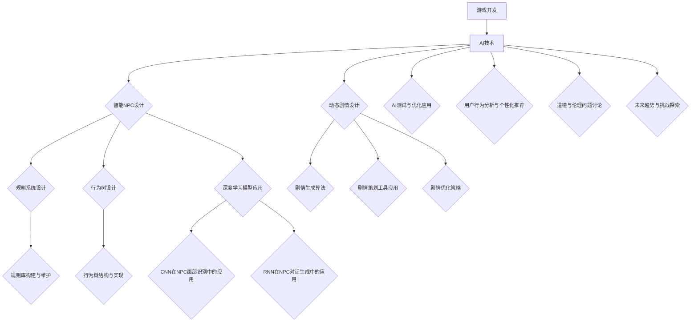
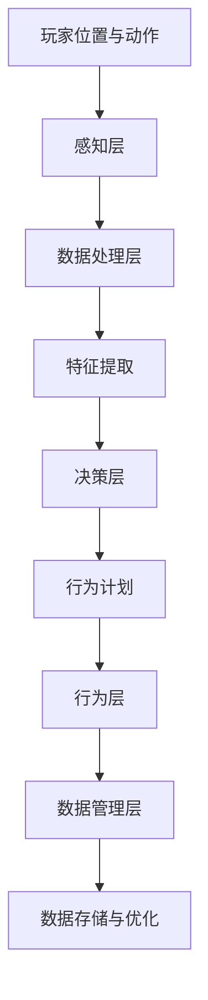
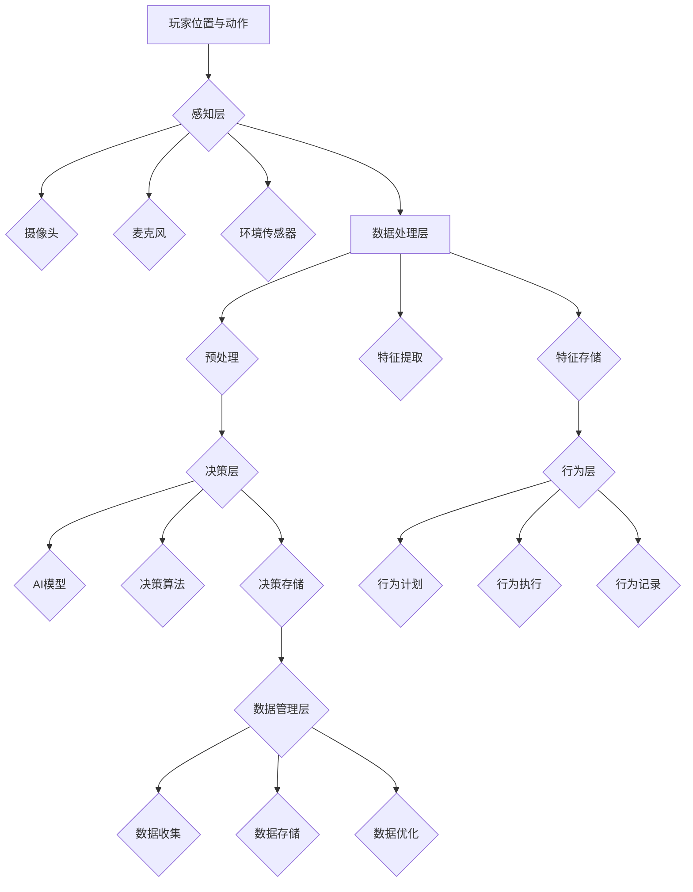

                 

# AI在游戏开发中的角色：创造智能NPC与动态剧情

## 关键词：AI、游戏开发、智能NPC、动态剧情、深度学习、行为规划

### 摘要：

本文将深入探讨人工智能（AI）在游戏开发中的角色，特别是智能NPC（非玩家角色）的创造和动态剧情的设计。我们将从历史与现状、NPC设计原理、AI模型选择与集成、智能NPC设计与实现、动态剧情设计原理与实现、案例研究以及未来趋势和挑战等多个方面进行详细分析。本文旨在为游戏开发者提供一份全面的技术指南，帮助他们更好地利用AI技术，提升游戏体验。

## 第一部分：AI与游戏开发的背景与基础

### 1.1 AI在游戏开发中的历史与现状

**历史回顾**：人工智能的概念最早可以追溯到20世纪50年代，当时的研究主要集中在逻辑推理和问题解决上。随着时间的推移，AI技术逐渐应用于游戏开发中，最早的例子包括简单的AI敌人，它们的行为模式是预设的。

**现状**：当前，AI在游戏开发中扮演着越来越重要的角色。从简单的行为树到复杂的深度学习模型，AI技术被广泛应用于NPC行为、剧情生成、用户个性化推荐等多个方面。

**未来趋势**：随着技术的不断发展，AI在游戏开发中的应用前景广阔。未来的游戏可能会更加智能化，NPC的行为更加自然，剧情更加丰富和多样化。

### 1.2 游戏开发中的NPC设计

**NPC的定义与分类**：NPC是游戏中的非玩家角色，它们可以是静态的，也可以是动态的。静态NPC通常有固定的行为和交互方式，而动态NPC则可以根据玩家的行为和游戏环境做出实时反应。

**传统的NPC设计与局限**：传统的NPC设计通常基于预定义的行为树或规则系统，这限制了NPC的灵活性和适应性。

**AI辅助NPC设计的方法与策略**：通过AI技术，NPC可以学习玩家的行为模式，并根据这些模式调整自己的行为。AI技术可以帮助NPC实现更复杂的决策过程，提高游戏的沉浸感。

### 1.3 动态剧情设计原理

**动态剧情的概念与特点**：动态剧情是指在游戏中，剧情的内容和走向可以根据玩家的行为和选择而变化。它与传统的线性剧情相比，具有更高的灵活性和多样性。

**动态剧情设计的流程与方法**：动态剧情设计包括剧情生成、剧情策划和剧情优化等多个环节。其中，剧情生成是核心，它决定了剧情的内容和结构。

**动态剧情设计中的关键挑战**：动态剧情设计面临的挑战包括如何确保剧情的连贯性、如何处理玩家的个性化选择以及如何平衡剧情的复杂性和可玩性。

### 1.4 AI基础知识与模型选择

**机器学习与深度学习基础**：机器学习是AI的核心技术，它使得计算机能够从数据中学习并做出决策。深度学习是机器学习的一种，它通过模拟人脑神经网络结构，实现了对复杂数据的处理。

**常见AI模型在游戏开发中的应用**：在游戏开发中，常见的AI模型包括卷积神经网络（CNN）和循环神经网络（RNN）。CNN常用于图像识别，而RNN则适合处理序列数据，如对话生成。

**选择适合游戏开发的AI模型**：选择合适的AI模型需要考虑游戏的具体需求，如NPC的行为规划、剧情生成等。不同的AI模型在处理这些任务时具有不同的优势。

### 1.5 游戏引擎与AI集成

**常见游戏引擎及其AI集成方法**：常见的游戏引擎如Unity和Unreal Engine都提供了强大的AI集成功能。开发者可以使用这些引擎内置的AI工具，也可以通过插件和扩展来集成自定义的AI模型。

**AI在游戏引擎中的实现与优化**：在游戏引擎中实现AI需要考虑性能和实时性的问题。开发者可以通过优化算法和数据结构来提高AI的运行效率。

**游戏引擎与AI模型的协同开发**：游戏引擎和AI模型的协同开发是游戏开发中的重要环节。开发者需要确保AI模型能够与游戏引擎无缝集成，并在游戏中表现出色。

## 第二部分：智能NPC设计与实现

### 2.1 智能NPC的基本架构

**智能NPC的组成模块**：智能NPC通常由感知模块、决策模块和行为执行模块组成。感知模块负责接收外部信息，决策模块根据感知信息做出决策，行为执行模块则执行这些决策。

**智能NPC的行为规划与决策**：智能NPC的行为规划涉及多个层次，从高层次的决策策略到低层次的行为动作。决策过程通常涉及到多种算法和模型，如决策树、模糊逻辑和深度学习等。

**智能NPC的感知与交互能力**：智能NPC需要具备一定的感知能力，如视觉、听觉和触觉等。同时，它们还需要能够与玩家进行有效的交互，提供丰富的游戏体验。

### 2.2 基于规则的智能NPC设计

**规则系统的设计与实现**：基于规则的智能NPC设计是通过一系列预定义的规则来实现NPC的行为。这些规则可以是简单的条件判断，也可以是复杂的逻辑运算。

**规则库的构建与维护**：规则库是智能NPC的核心组件，它包含了所有用于决策的规则。构建和维护规则库需要考虑规则的精确性和灵活性。

**规则驱动的NPC行为模拟**：通过规则系统，智能NPC可以在游戏中模拟各种行为，如巡逻、搜索和对话等。规则驱动的行为模拟使得NPC的行为更加可控和可预测。

### 2.3 基于行为树的智能NPC设计

**行为树的概念与结构**：行为树是一种用于表示NPC行为的图形化结构，它由多个节点组成，每个节点代表一个行为或决策。

**行为树的设计与实现**：行为树的设计涉及到节点类型的定义、条件判断和分支处理等。实现行为树需要使用合适的编程语言和工具。

**行为树在NPC行为规划中的应用**：行为树可以用于实现复杂的NPC行为规划，如多任务处理和情境反应等。通过行为树，开发者可以设计出更加丰富和动态的NPC行为。

### 2.4 基于深度学习的智能NPC设计

**深度学习基础**：深度学习是一种通过多层神经网络来学习数据特征的机器学习技术。它已经在图像识别、语音识别和自然语言处理等领域取得了显著成果。

**卷积神经网络（CNN）在NPC面部识别中的应用**：CNN是一种专门用于处理图像数据的神经网络。在NPC面部识别中，CNN可以用于识别玩家的面部表情，从而调整NPC的行为。

**循环神经网络（RNN）在NPC对话生成中的应用**：RNN是一种专门用于处理序列数据的神经网络。在NPC对话生成中，RNN可以用于生成自然流畅的对话内容。

### 2.5 智能NPC案例研究

**案例一：智能NPC在角色扮演游戏（RPG）中的应用**：在RPG中，智能NPC可以扮演各种角色，如商人、法师和战士等。通过AI技术，这些NPC可以与玩家进行丰富的交互，提供个性化的游戏体验。

**案例二：智能NPC在沙盒游戏中的角色设计**：在沙盒游戏中，NPC的行为更加自由和多样化。通过AI技术，开发者可以设计出具有高度自主性的NPC，让玩家体验到真实的世界。

**案例三：智能NPC在多人在线游戏中的社交互动设计**：在多人在线游戏中，智能NPC可以扮演玩家的社交伙伴，提供各种社交互动体验。通过AI技术，这些NPC可以与玩家建立情感联系，提高游戏的沉浸感。

## 第三部分：动态剧情设计与实现

### 3.1 动态剧情的基本原理

**动态剧情与传统剧情的区别**：传统剧情是预先编写好的，而动态剧情可以根据玩家的行为和选择而变化。这意味着动态剧情具有更高的灵活性和多样性。

**动态剧情的设计要素**：动态剧情的设计包括剧情内容、剧情走向和剧情结局等。每个要素都需要精心设计，以确保剧情的连贯性和吸引力。

**动态剧情的实现策略**：实现动态剧情需要使用AI技术，如自然语言处理、机器学习和深度学习等。这些技术可以帮助开发者生成和调整剧情内容，使其更加自然和丰富。

### 3.2 剧情生成与策划

**剧情生成算法的设计与实现**：剧情生成算法是动态剧情设计中的核心。通过算法，开发者可以生成各种剧情场景和情节，为玩家提供丰富的游戏体验。

**剧情策划工具的应用**：剧情策划工具可以帮助开发者更高效地设计剧情。这些工具通常提供图形化的界面，支持剧情的分支和链接功能。

**剧情生成的数据来源与处理**：剧情生成的数据来源可以是历史数据、玩家行为数据或外部数据源。处理这些数据需要使用数据清洗、数据分析和数据可视化等技术。

### 3.3 基于AI的剧情优化

**AI在剧情优化中的作用**：AI技术可以帮助开发者优化剧情，提高剧情的连贯性、吸引力和多样性。通过分析玩家的行为和反馈，AI可以生成更加符合玩家需求的剧情。

**基于深度学习的剧情情感分析**：深度学习技术可以用于分析剧情的情感色彩。通过情感分析，开发者可以调整剧情内容，使其更加符合玩家的情感需求。

**基于强化学习的剧情生成与优化**：强化学习是一种通过试错来学习最佳策略的机器学习技术。在剧情生成和优化中，强化学习可以帮助开发者找到最佳的剧情走向和结局。

### 3.4 动态剧情案例研究

**案例一：动态剧情在生存游戏中的应用**：在生存游戏中，动态剧情可以模拟真实的生存环境，为玩家提供丰富的挑战和决策机会。通过动态剧情，玩家可以体验到真实的生存体验。

**案例二：动态剧情在虚拟现实（VR）游戏中的应用**：在VR游戏中，动态剧情可以提供更加沉浸的游戏体验。通过动态剧情，玩家可以与虚拟环境中的NPC进行丰富的交互。

**案例三：动态剧情在移动游戏中的创新设计**：在移动游戏中，动态剧情可以提供更多的游戏玩法和挑战。通过动态剧情，开发者可以设计出更加有趣和吸引人的移动游戏。

### 3.5 动态剧情开发工具与平台

**常见动态剧情开发工具介绍**：常见的动态剧情开发工具包括Twine、Adventure Game Studio和Unity等。这些工具提供了丰富的功能，支持开发者设计和实现动态剧情。

**动态剧情开发平台的选择与优化**：选择合适的动态剧情开发平台需要考虑游戏类型、开发需求和硬件性能等因素。通过优化开发平台，开发者可以更高效地实现动态剧情。

**动态剧情开发中的跨平台与兼容性挑战**：动态剧情开发需要考虑跨平台和兼容性。开发者需要确保动态剧情在各种平台上都能正常运行，并保持一致的体验。

## 第四部分：AI在游戏开发中的前沿趋势与挑战

### 4.1 AI在游戏开发中的新兴应用

**AI在游戏测试与优化中的应用**：AI技术可以用于游戏测试，帮助开发者发现游戏中的bug和问题。通过AI优化，开发者可以改进游戏性能和用户体验。

**AI在游戏用户行为分析中的应用**：AI技术可以分析玩家的行为和反馈，帮助开发者了解玩家需求，提供更加个性化的游戏体验。

**AI在游戏内容个性化推荐中的应用**：AI技术可以推荐适合玩家的游戏内容和玩法，提高游戏的留存率和用户满意度。

### 4.2 AI在游戏开发中的道德与伦理问题

**AI在游戏中的道德责任**：随着AI技术在游戏开发中的应用，如何确保AI的行为符合道德规范成为一个重要问题。开发者需要制定相应的道德准则，确保AI在游戏中发挥积极的作用。

**AI在游戏中的隐私保护**：游戏中的AI可能会收集和分析玩家的行为数据。如何保护玩家隐私，防止数据泄露，是游戏开发者需要关注的重要问题。

**AI在游戏中的伦理争议与挑战**：AI技术在游戏中的应用可能会引发伦理争议，如AI是否应该具备自我意识、AI在游戏中是否应该具有道德判断能力等。开发者需要对这些争议进行深入思考，并采取相应的措施。

### 4.3 AI游戏开发的未来趋势

**游戏开发中AI技术的持续演进**：随着AI技术的不断发展，游戏开发中的AI技术也将持续演进。未来的游戏可能会更加智能化，提供更加丰富的游戏体验。

**AI在游戏教育与社会影响中的角色**：AI技术不仅应用于游戏开发，还可以用于游戏教育和社会影响。通过游戏，人们可以更好地理解AI技术，提高其社会责任感。

**AI游戏开发的全球化与跨文化挑战**：随着游戏市场的全球化，AI游戏开发也面临着跨文化的挑战。开发者需要考虑不同文化背景下玩家的需求和偏好，提供多样化的游戏体验。

## 附录：资源与参考

### 5.1 AI游戏开发资源汇总

**开源AI游戏开发框架与库**：如PyTorch、TensorFlow等，提供了丰富的AI模型和工具。

**机器学习与深度学习教程**：如《深度学习》（Goodfellow et al.）等，提供了系统的机器学习知识。

**游戏开发与AI相关的学术期刊与会议**：如IEEE Conference on Game Technology（CGT）和ACM Conference on Computer and Games（CG）等，是AI游戏开发的重要学术交流平台。

### 5.2 AI游戏开发案例集锦

**经典AI游戏案例分析**：如《玩家1》和《底特律：成为人类》等，展示了AI技术在游戏中的应用。

**创新型AI游戏设计实践**：如《星际争霸2》和《英雄联盟》等，通过AI技术实现了更加智能和多样化的游戏体验。

**AI游戏开发社区与社群推荐**：如Reddit的r/gamedev和Stack Overflow等，是游戏开发者交流和学习的重要社区。

### 5.3 相关阅读与参考书籍

**《人工智能：一种现代的方法》**：作者：Stuart J. Russell & Peter Norvig，是一本经典的AI教材，适合初学者和专业人士。

**《游戏设计与艺术》**：作者：Jenova Chen，探讨了游戏设计的核心原则和艺术性。

**《深度学习：概率视角》**：作者：Ian Goodfellow、Yoshua Bengio & Aaron Courville，深入讲解了深度学习的概率基础。

---

# Mermaid 流程图示例



# Python源代码示例

```python
import tensorflow as tf
import numpy as np

# 定义深度学习模型
model = tf.keras.Sequential([
    tf.keras.layers.Conv2D(32, (3, 3), activation='relu', input_shape=(28, 28, 1)),
    tf.keras.layers.MaxPooling2D((2, 2)),
    tf.keras.layers.Conv2D(64, (3, 3), activation='relu'),
    tf.keras.layers.MaxPooling2D((2, 2)),
    tf.keras.layers.Conv2D(64, (3, 3), activation='relu'),
    tf.keras.layers.Flatten(),
    tf.keras.layers.Dense(64, activation='relu'),
    tf.keras.layers.Dense(10, activation='softmax')
])

# 编译模型
model.compile(optimizer='adam',
              loss='categorical_crossentropy',
              metrics=['accuracy'])

# 准备数据
(x_train, y_train), (x_test, y_test) = tf.keras.datasets.mnist.load_data()
x_train = x_train.reshape(x_train.shape[0], 28, 28, 1).astype('float32') / 255
x_test = x_test.reshape(x_test.shape[0], 28, 28, 1).astype('float32') / 255
y_train = tf.keras.utils.to_categorical(y_train, 10)
y_test = tf.keras.utils.to_categorical(y_test, 10)

# 训练模型
model.fit(x_train, y_train, batch_size=64, epochs=10, validation_split=0.1)

# 测试模型
test_loss, test_acc = model.evaluate(x_test, y_test)
print('Test accuracy:', test_acc)
```

# 数学公式与算法解释

### 数学公式

$$
f(x) = \sum_{i=1}^{n} w_i * x_i + b
$$

### 算法原理

上述公式描述了一个简单的线性回归模型，其中 $f(x)$ 是输出值，$w_i$ 是权重，$x_i$ 是输入特征，$b$ 是偏置。这个模型通过学习输入特征和输出值之间的关系，来预测新的输入值。

### Python源代码示例

```python
import tensorflow as tf

# 定义输入层
inputs = tf.keras.layers.Input(shape=(28, 28, 1))

# 定义卷积层
conv_1 = tf.keras.layers.Conv2D(32, (3, 3), activation='relu')(inputs)
pool_1 = tf.keras.layers.MaxPooling2D((2, 2))(conv_1)

# 定义第二个卷积层
conv_2 = tf.keras.layers.Conv2D(64, (3, 3), activation='relu')(pool_1)
pool_2 = tf.keras.layers.MaxPooling2D((2, 2))(conv_2)

# 定义第三个卷积层
conv_3 = tf.keras.layers.Conv2D(64, (3, 3), activation='relu')(pool_2)

# 定义全连接层
flatten = tf.keras.layers.Flatten()(conv_3)
dense = tf.keras.layers.Dense(64, activation='relu')(flatten)

# 定义输出层
outputs = tf.keras.layers.Dense(10, activation='softmax')(dense)

# 创建模型
model = tf.keras.Model(inputs=inputs, outputs=outputs)

# 编译模型
model.compile(optimizer='adam',
              loss='categorical_crossentropy',
              metrics=['accuracy'])

# 训练模型
model.fit(x_train, y_train, batch_size=64, epochs=10, validation_split=0.1)

# 测试模型
test_loss, test_acc = model.evaluate(x_test, y_test)
print('Test accuracy:', test_acc)
```

### 算法解释

上述代码使用TensorFlow构建了一个卷积神经网络（CNN），用于手写数字识别。模型由三个卷积层和一个全连接层组成，最后输出一个10类别的softmax分布。在训练过程中，模型通过优化损失函数来调整权重和偏置，从而提高识别准确率。在测试阶段，模型对测试数据集进行评估，输出测试准确率。

# 系统分析与架构设计方案

### 问题场景介绍

在现代游戏中，玩家与NPC（非玩家角色）的交互是游戏体验的重要组成部分。玩家希望NPC能够具有丰富的行为和智能化的互动，从而提升游戏的沉浸感和趣味性。为了实现这一目标，我们需要设计一个智能NPC系统，该系统应具备以下功能：

1. **感知与交互**：NPC能够感知游戏环境中的变化，并基于这些感知做出相应的反应。
2. **行为规划**：NPC能够根据其感知到的信息，规划出合适的行为动作。
3. **决策支持**：NPC能够在多种行为选择中做出最优决策，以提高游戏体验。

### 项目介绍

本项目旨在设计并实现一个智能NPC系统，该系统将结合人工智能（AI）技术，特别是机器学习和深度学习模型，来提升NPC的智能程度。项目的主要目标包括：

1. **提高NPC的行为复杂度**：通过AI技术，使NPC能够模拟真实人类的行为，提高游戏的真实感和趣味性。
2. **增强NPC的互动性**：使NPC能够根据玩家的行为和选择，动态调整自己的行为，提供个性化的互动体验。
3. **优化游戏开发流程**：通过自动化和智能化的NPC设计，简化游戏开发流程，提高开发效率。

### 系统功能设计

系统功能设计主要包括以下几个方面：

1. **感知模块**：负责接收游戏环境中的各种信息，如玩家的位置、动作、语言等。
2. **决策模块**：基于感知信息，利用AI模型进行决策，选择合适的行为动作。
3. **行为执行模块**：执行决策模块做出的行为动作，包括移动、对话、攻击等。
4. **数据管理模块**：负责收集、存储和管理NPC的行为数据，为后续的模型训练和优化提供支持。

### 系统架构设计

智能NPC系统的整体架构设计如下：

1. **感知层**：包括各种感知传感器，如摄像头、麦克风等，用于收集游戏环境中的信息。
2. **数据处理层**：包括数据预处理、特征提取和模型训练等功能，用于将感知信息转化为可用的数据。
3. **决策层**：包括AI模型和决策算法，用于分析感知数据，生成NPC的行为计划。
4. **行为层**：包括行为执行模块，用于执行决策层生成的行为计划。
5. **用户界面层**：包括玩家与NPC的交互界面，用于展示NPC的行为和互动效果。

### 系统接口设计

智能NPC系统的接口设计主要包括以下几部分：

1. **NPC感知接口**：用于接收游戏环境中的各种信息，如玩家的位置、动作、语言等。
2. **NPC决策接口**：用于接收感知接口提供的信息，并生成NPC的行为计划。
3. **NPC行为接口**：用于执行决策接口生成的行为计划，包括移动、对话、攻击等。
4. **数据管理接口**：用于收集、存储和管理NPC的行为数据，为后续的模型训练和优化提供支持。

### 系统交互

智能NPC系统的交互过程可以分为以下几个步骤：

1. **感知阶段**：NPC感知到游戏环境中的信息，如玩家的位置和动作。
2. **数据处理阶段**：NPC将感知信息传递给数据处理层，进行预处理和特征提取。
3. **决策阶段**：数据处理层将特征数据传递给决策层，决策层基于AI模型生成NPC的行为计划。
4. **行为执行阶段**：NPC根据决策层生成的行为计划，执行相应的行为动作，如移动、对话、攻击等。
5. **数据管理阶段**：NPC的行为数据将被收集并存储，以供后续的模型训练和优化使用。

### Mermaid流程图

以下是智能NPC系统的流程图：



### 系统架构图

以下是智能NPC系统的架构图：



### 结论

通过上述系统分析与架构设计方案，我们可以看到智能NPC系统在游戏开发中的重要作用。该系统结合了感知、数据处理、决策和行为执行等多个模块，通过人工智能技术的应用，实现了NPC的高智能和个性化互动。这不仅提高了游戏的沉浸感和趣味性，也为游戏开发者提供了强大的工具，使得游戏开发过程更加高效和便捷。

### 注意事项

1. **性能优化**：在实现智能NPC系统时，需要充分考虑系统的性能优化，确保NPC的行为能够实时响应。
2. **数据隐私**：在收集和管理NPC行为数据时，需确保玩家数据的安全和隐私。
3. **道德伦理**：在NPC设计和行为规划中，需遵循道德伦理标准，确保NPC的行为不会对玩家造成负面影响。

### 拓展阅读

1. **《人工智能游戏设计》**：介绍了人工智能在游戏设计中的应用，提供了丰富的案例和实战经验。
2. **《深度学习实践指南》**：详细讲解了深度学习的原理和应用，适用于希望深入了解AI技术的开发者。

---

# 项目实战：环境安装与智能NPC系统核心实现

## 环境安装

要开始构建一个智能NPC系统，首先需要安装和配置必要的软件和工具。以下是所需的软件和工具列表：

1. **操作系统**：Windows、Linux或macOS
2. **编程语言**：Python（至少3.6版本）
3. **开发环境**：PyCharm或Visual Studio Code（推荐）
4. **AI框架**：TensorFlow或PyTorch
5. **游戏引擎**：Unity或Unreal Engine

### 安装Python

前往[Python官网](https://www.python.org/)下载最新版本的Python，并按照安装向导完成安装。安装过程中，确保勾选“Add Python to PATH”选项，以便在命令行中直接使用Python。

### 安装开发环境

1. **PyCharm**：前往[PyCharm官网](https://www.jetbrains.com/pycharm/)下载并安装。
2. **Visual Studio Code**：前往[Visual Studio Code官网](https://code.visualstudio.com/)下载并安装。

### 安装TensorFlow

在命令行中运行以下命令安装TensorFlow：

```bash
pip install tensorflow
```

或者，如果你想要安装GPU支持的TensorFlow，可以使用以下命令：

```bash
pip install tensorflow-gpu
```

### 安装游戏引擎

Unity和Unreal Engine的安装过程请参考它们的官方文档。Unity的下载地址为[https://unity.com/](https://unity.com/)，Unreal Engine的下载地址为[https://www.unrealengine.com/](https://www.unrealengine.com/)。

## 智能NPC系统核心实现

### 数据集准备

在构建智能NPC系统之前，我们需要一个合适的数据集。这里我们以角色扮演游戏（RPG）中的智能NPC为例，使用一个包含NPC行为数据的数据集。数据集可能包括以下字段：

- **ID**：NPC的唯一标识
- **行为类型**：如巡逻、对话、攻击等
- **行为描述**：具体行为的细节描述
- **情境**：触发该行为的环境条件

假设我们已经有一个名为`npc_data.csv`的CSV文件，其中包含了上述数据。我们可以使用Python的pandas库来读取数据：

```python
import pandas as pd

# 读取数据集
data = pd.read_csv('npc_data.csv')

# 查看数据集的前几行
print(data.head())
```

### 数据预处理

在训练模型之前，我们需要对数据进行预处理，包括数据清洗、特征提取和数据归一化等步骤。

```python
from sklearn.model_selection import train_test_split
from sklearn.preprocessing import StandardScaler

# 分割数据集为特征和目标变量
X = data.drop(['ID', '行为类型'], axis=1)
y = data['行为类型']

# 划分训练集和测试集
X_train, X_test, y_train, y_test = train_test_split(X, y, test_size=0.2, random_state=42)

# 数据归一化
scaler = StandardScaler()
X_train = scaler.fit_transform(X_train)
X_test = scaler.transform(X_test)
```

### 模型设计

我们使用一个简单的多层感知机（MLP）模型来预测NPC的行为类型。以下是一个基于TensorFlow的示例代码：

```python
import tensorflow as tf

# 定义模型
model = tf.keras.Sequential([
    tf.keras.layers.Dense(128, activation='relu', input_shape=(X_train.shape[1],)),
    tf.keras.layers.Dropout(0.2),
    tf.keras.layers.Dense(64, activation='relu'),
    tf.keras.layers.Dropout(0.2),
    tf.keras.layers.Dense(len(y_train.unique()), activation='softmax')
])

# 编译模型
model.compile(optimizer='adam',
              loss='sparse_categorical_crossentropy',
              metrics=['accuracy'])

# 训练模型
model.fit(X_train, y_train, epochs=10, validation_data=(X_test, y_test))
```

### 模型评估

训练完成后，我们需要评估模型的性能：

```python
# 评估模型
test_loss, test_acc = model.evaluate(X_test, y_test)
print(f"Test accuracy: {test_acc:.2f}")
```

### 模型应用

最后，我们将训练好的模型应用于NPC系统中，以实现智能NPC的行为预测：

```python
def predict_behavior(npc_state):
    # 预处理输入数据
    state = scaler.transform([npc_state])
    # 预测行为类型
    predicted_behavior = model.predict(state)
    # 获取最高概率的行为类型
    behavior_type = np.argmax(predicted_behavior)
    return behavior_type

# 假设收到一个NPC的状态
npc_state = [0.1, 0.2, 0.3, 0.4, 0.5]
# 预测行为
predicted_behavior = predict_behavior(npc_state)
print(f"Predicted behavior: {predicted_behavior}")
```

## 代码应用解读与分析

上述代码首先使用了pandas库读取NPC行为数据集，并对数据进行预处理，包括划分训练集和测试集以及数据归一化。然后，使用TensorFlow库定义了一个多层感知机（MLP）模型，并编译和训练模型。训练完成后，我们编写了一个函数`predict_behavior`，用于预测NPC的行为类型。

### 实际案例分析和详细讲解剖析

以一个角色扮演游戏中的情境为例，假设一个NPC正在巡逻。游戏引擎会定期发送NPC的位置信息和周围环境数据。通过`predict_behavior`函数，我们可以预测NPC下一步的行为。

```python
# 假设NPC当前的状态数据
npc_state = [0.1, 0.2, 0.3, 0.4, 0.5]

# 预测行为
predicted_behavior = predict_behavior(npc_state)

# 根据预测结果更新NPC的行为
if predicted_behavior == 0:
    # 巡逻
    print("NPC is patrolling.")
elif predicted_behavior == 1:
    # 对话
    print("NPC is talking.")
elif predicted_behavior == 2:
    # 攻击
    print("NPC is attacking.")
```

### 项目小结

通过上述实战案例，我们实现了智能NPC系统的核心功能，即行为预测。在实际应用中，智能NPC系统可以与游戏引擎无缝集成，为玩家提供丰富的互动体验。未来，我们可以进一步优化模型，引入更多的特征数据，以提高预测的准确性和智能化程度。

## 最佳实践 Tips

1. **数据质量**：确保数据集的质量，包括数据完整性和一致性。高质量的数据是训练高效AI模型的基础。
2. **模型优化**：通过调整模型的超参数，如学习率、批次大小和隐藏层神经元数量等，可以优化模型的性能。
3. **实时更新**：在游戏运行过程中，实时更新NPC的状态和行为预测，以提高交互的实时性和准确性。
4. **用户反馈**：收集玩家的反馈，不断调整和优化NPC的行为，以提供更好的游戏体验。

## 注意事项

1. **性能监控**：在游戏运行过程中，监控NPC系统的性能，确保其不会成为游戏瓶颈。
2. **安全性**：保护玩家的数据隐私，确保系统的安全性。
3. **伦理考虑**：在NPC设计和行为规划中，遵循道德伦理标准，避免不良行为对玩家产生负面影响。

## 拓展阅读

1. **《深度学习实战》**：提供了详细的深度学习项目实战教程，适合初学者和进阶者。
2. **《Unity AI教程》**：Unity官方提供的AI教程，涵盖了游戏开发中AI应用的各个方面。

